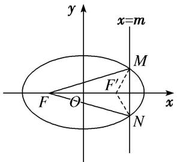
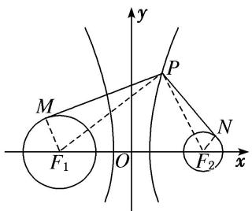

# 专题10 几何法解决的最值模型

# 【例题选讲】

[例1] （1）过椭圆 $\frac{x^2}{25} +\frac{y^2}{16} = 1$ 的中心任作一直线交椭圆于 $P$ ， $Q$ 两点， $F$ 是椭圆的一个焦点，则△PFQ的周长的最小值为（）

A. 12

B. 14

C. 16

D. 18  
（2）已知点 F 为椭圆 C: $\frac{x^{2}}{2} + y^{2} = 1$ 的左焦点，点 P 为椭圆 C 上任意一点，点 Q 的坐标为 $(4, 3)$ ，则 $|PQ| + |PF|$ 取最大值时，点 P 的坐标为 \_\_\_\_.  
（3）椭圆 $\frac{x^{2}}{5}+\frac{y^{2}}{4}=1$ 的左焦点为F，直线x=m与椭圆相交于点M，N，当 $\triangle FMN$ 的周长最大时， $\triangle FMN$ 的面积是()

A. $\frac{\sqrt{5}}{5}$

B. $\frac{6\sqrt{5}}{5}$

C. $\frac{8\sqrt{5}}{5}$

D. $\frac{4\sqrt{5}}{5}$

  
（4）设 $P$ 为双曲线 $x^{2} - \frac{y^{2}}{15} = 1$ 右支上一点， $M, N$ 分别是圆 $C_{1}: (x + 4)^{2} + y^{2} = 4$ 和圆 $C_{2}: (x - 4)^{2} + y^{2} = 1$ 上的点，设 $|PM| - |PN|$ 的最大值和最小值分别为 $m, n$ ，则 $|m - n| = (\quad)$

A. 4

B. 5

C. 6

D. 7

  
（5）已知点 $M(-3,2)$ 是坐标平面内一定点，若抛物线 $y^{2} = 2x$ 的焦点为 $F$ ，点 $Q$ 是该抛物线上的一动点，则 $\vert MQ\vert -\vert QF\vert$ 的最小值是（）

A. $\frac{7}{2}$

B. 3

C. $\frac{5}{2}$

D. 2  
（6）已知抛物线的方程为 $x^{2} = 8y$ ， $F$ 是其焦点，点 $A(-2,4)$ ，在此抛物线上求一点 $P$ ，使 $\triangle APF$ 的周长最小，此时点 $P$ 的坐标为

# 【对点训练】

1. 已知椭圆的方程为 $\frac{x^2}{9} + \frac{y^2}{4} = 1$ ，过椭圆中心的直线交椭圆于 $A, B$ 两点， $F_2$ 是椭圆的右焦点，则 $\triangle ABF_2$ 的周长的最小值为 \_\_\_\_， $\triangle ABF_2$ 的面积的最大值为 \_\_\_\_.

2. 设 $F_{1}$ , $F_{2}$ 分别是椭圆 $\frac{x^{2}}{25} + \frac{y^{2}}{16} = 1$ 的左、右焦点, $P$ 为椭圆上任意一点, 点 $M$ 的坐标为(6, 4), 则 $|PM|$
$-|PF_{1}|$ 的最小值为 \_\_\_\_.

3. 已知 $F$ 是椭圆 $5x^{2} + 9y^{2} = 45$ 的左焦点, $P$ 是此椭圆上的动点, $A(1, 1)$ 是一定点. 则 $|PA| + |PF|$ 的最大值为 \_\_\_\_, 最小值为 \_\_\_\_.

4. 椭圆 $C: \frac{x^2}{a^2} + y^2 = 1 (a > 1)$ 的离心率为 $\frac{\sqrt{3}}{2}$ , $F_1$ , $F_2$ 是 $C$ 的两个焦点, 过 $F_1$ 的直线 $l$ 与 $C$ 交于 $A$ , $B$ 两点, 则 $|AF_2| + |BF_2|$ 的最大值等于 \_\_\_\_.

5. 已知圆 $M: (x - 2)^{2} + y^{2} = 1$ 经过椭圆 $C: \frac{x^{2}}{m} + \frac{y^{2}}{3} = 1 (m > 3)$ 的一个焦点，圆 $M$ 与椭圆 $C$ 的公共点为 $A, B$ 点 $P$ 为圆 $M$ 上一动点，则 $P$ 到直线 $AB$ 的距离的最大值为（）

A. $2 \sqrt{10} - 5$

B. $2 \sqrt{10} - 4$

C. $4\sqrt{10}-11$

D. $4 \sqrt{10} - 10$

6. 设 P 是椭圆 $\frac{x^{2}}{25} + \frac{y^{2}}{9} = 1$ 上一点，M，N 分别是两圆： $(x + 4)^{2} + y^{2} = 1$ 和 $(x - 4)^{2} + y^{2} = 1$ 上的点，则 $|PM| + |PN|$ 的最小值和最大值分别为（）

A. 9, 12

B. 8, 11

C. 8, 12

D. 10, 12

7. $P$ 是双曲线 $C: \frac{x^2}{2} - y^2 = 1$ 右支上一点，直线 $l$ 是双曲线 $C$ 的一条渐近线， $P$ 在 $l$ 上的射影为 $Q$ ， $F_1$ 是双曲线 $C$ 的左焦点，则 $|PF_1| + |PQ|$ 的最小值为（）

A. 1

B. $2+\frac{\sqrt{15}}{5}$

C. $4+\frac{\sqrt{15}}{5}$

D. $2\sqrt{2}+1$

8. 双曲线 C 的渐近线方程为 $y=\pm\frac{2\sqrt{3}}{3}x$ ，一个焦点为 $F(0, -\sqrt{7})$ ，点 $A(\sqrt{2}, 0)$ ，点 P 为双曲线上在第一象限内的点，则当点 P 的位置变化时， $\triangle PAF$ 周长的最小值为()

A. 8

B. 10

C. $4+3\sqrt{7}$

D. $3+3\sqrt{17}$

9. 过双曲线 $x^{2}-\frac{y^{2}}{15}=1$ 的右支上一点 P，分别向圆 $C_{1}:(x+4)^{2}+y^{2}=4$ 和圆 $C_{2}:(x-4)^{2}+y^{2}=1$ 作切线，切点分别为 M, N，则 $|PM|^{2}-|PN|^{2}$ 的最小值为（）

A. 10

B. 13

C. 16

D. 19

10. 已知点 $F$ 是抛物线 $y^{2} = 4x$ 的焦点， $P$ 是该抛物线上任意一点， $M(5,3)$ ，则 $|PF| + |PM|$ 的最小值是（）

A. 6

B. 5

C. 4

D. 3

11. 已知抛物线 $y^{2} = 2x$ 的焦点是 $F$ ，点 $P$ 是抛物线上的动点，若点 $A(3, 2)$ ，则 $|PA| + |PF|$ 取最小值时，点 $P$ 的坐标为 \_\_\_\_.

12. 已知抛物线 $C: y^{2} = 2px (p > 0)$ 的焦点为 $F$ , 准线为 $l$ , 且 $l$ 过点 $(-2, 3)$ , $M$ 在抛物线 $C$ 上, 若点 $N(1, 2)$ , 则 $|MN| + |MF|$ 的最小值为 ( )

A. 2

B. 3

C. 4

D. 5

13. 已知点 $M(x, y)$ 是抛物线 $y^{2} = 4x$ 上的动点，则 $\sqrt{(x - 2)^{2} + (y - 1)^{2}} + \sqrt{(x - 1)^{2} + y^{2}}$ 的最小值为( )

A. 3

B. 4

C. 5

D. 6

14. 已知 $P$ 是抛物线 $y^{2} = 4x$ 上的一个动点， $Q$ 是圆 $(x - 3)^{2} + (y - 1)^{2} = 1$ 上的一个动点， $N(1,0)$ 是一个定点，则 $|PQ| + |PN|$ 的最小值为（）

A. 3

B. 4

C. 5

D. $\sqrt{2}+1$

15. 已知以圆 $C: (x - 1)^2 + y^2 = 4$ 的圆心为焦点的抛物线 $C_1$ 与圆 $C$ 在第一象限交于 $A$ 点， $B$ 点是抛物线 $C_2$ :
$x^{2} = 8y$ 上任意一点， $BM$ 与直线 $y = -2$ 垂直，垂足为 $M$ ，则 $\vert BM\vert -\vert AB\vert$ 的最大值为( )

A. 1

B. 2

C. -1

D. 8

16. 已知抛物线 $y^{2} = 8x$ ，点 $Q$ 是圆 $C: x^{2} + y^{2} + 2x - 8y + 13 = 0$ 上任意一点，记抛物线上任意一点 $P$ 到直线 $x = -2$ 的距离为 $d$ ，则 $|PQ| + d$ 的最小值为（）

A. 5

B. 4

C. 3

D. 2

17. 定长为 4 的线段 MN 的两端点在抛物线 $y^{2}=x$ 上移动，设点 P 为线段 MN 的中点，则点 P 到 y 轴距离的最小值为()

A. 1

B. $\frac{7}{4}$

C. 2

D. 5

18. 已知抛物线方程为 $y^{2} = -4x$ ，直线 $l$ 的方程为 $2x + y - 4 = 0$ ，在抛物线上有一动点 $A$ ，点 $A$ 到 $y$ 轴的距离为 $m$ ，到直线 $l$ 的距离为 $n$ ，则 $m + n$ 的最小值为 \_\_\_\_.

19. 已知点 $F$ 是抛物线 $C: y^{2} = 4x$ 的焦点, 点 $M$ 为抛物线 $C$ 上任意一点, 过点 $M$ 向圆 $(x - 1)^{2} + y^{2} = \frac{1}{2}$ 作切线, 切点分别为 $A, B$ , 则四边形 $AFBM$ 面积的最小值为 \_\_\_\_.

20. 已知抛物线 $C: x^{2} = 8y$ 的焦点为 $F$ , 动点 $Q$ 在 $C$ 上, 圆 $Q$ 的半径为 1 , 过点 $F$ 的直线与圆 $Q$ 切于点 $P$ , 则 $\overrightarrow{FP} \cdot \overrightarrow{FQ}$ 的最小值为 \_\_\_\_.

