# 专题10 几何法解决的最值模型

# 【例题选讲】

[例1] (1)过椭圆 $\frac{x^2}{25} +\frac{y^2}{16} = 1$ 的中心任作一直线交椭圆于 $P$ ， $Q$ 两点， $F$ 是椭圆的一个焦点，则△PFQ的周长的最小值为（）

A. 12

B. 14

C. 16

D. 18

答案 D 解析 由椭圆的对称性可知，P, Q 两点关于原点对称，设 $F'$ 为椭圆另一焦点，则四边形 $PFQF'$ 为平行四边形，由椭圆定义可知： $|PF| + |PF'| + |QF| + |QF'| = 4a = 20$ ，又 $|PF| = |QF'|$ ， $|QF| = |PF'|$ ，∴ $|PF| + |QF| = 10$ ，又 PQ 为椭圆内的弦，∴ $|PQ|_{\min} = 2b = 8$ ，∴ $\triangle PFQ$ 周长的最小值为： $10 + 8 = 18$ 。故选 D.

(2)已知点 F 为椭圆 C: $\frac{x^{2}}{2} + y^{2} = 1$ 的左焦点，点 P 为椭圆 C 上任意一点，点 Q 的坐标为 $(4, 3)$ ，则 $|PQ| + |PF|$ 取最大值时，点 P 的坐标为 \_\_\_\_.

答案 (0, -1) 解析 设椭圆的右焦点为 $E$ ， $|PQ| + |PF| = |PQ| + 2a - |PE| = |PQ| - |PE| + 2\sqrt{2}$ 。当 $P$ 为线段 $QE$ 的延长线与椭圆的交点时， $|PQ| + |PF|$ 取最大值，此时，直线 $PQ$ 的方程为 $y = x - 1$ ， $QE$ 的延长线与椭圆交于点 $(0, -1)$ ，即点 $P$ 的坐标为 $(0, -1)$ 。

(3)椭圆 $\frac{x^{2}}{5}+\frac{y^{2}}{4}=1$ 的左焦点为F，直线x=m与椭圆相交于点M，N，当 $\triangle FMN$ 的周长最大时， $\triangle FMN$ 的面积是()

A. $\frac{\sqrt{5}}{5}$

B. $\frac{6\sqrt{5}}{5}$

C. $\frac{8\sqrt{5}}{5}$

D. $\frac{4\sqrt{5}}{5}$

答案 C 解析 如图所示, 设椭圆的右焦点为 $F'$ , 连接 $MF', NF'$ . 因为 $|MF| + |NF| + |MF'| + |NF'| \geq |MF| + |NF| + |MN|$ , 所以当直线 $x = m$ 过椭圆的右焦点时, $\triangle FMN$ 的周长最大. 此时 $|MN| = \frac{2b^2}{a} = \frac{8\sqrt{5}}{5}$ , 又 $c = \sqrt{a^2 - b^2} = \sqrt{5 - 4} = 1$ , 所以此时 $\triangle FMN$ 的面积 $S = \frac{1}{2} \times 2 \times \frac{8\sqrt{5}}{5} = \frac{8\sqrt{5}}{5}$ . 故选 C.

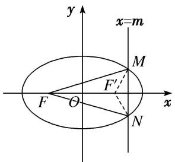

text_image

y
x=m
M
F'
F
O
x
N

(4)设 P 为双曲线 $x^{2}-\frac{y^{2}}{15}=1$ 右支上一点，M，N 分别是圆 $C_{1}:(x+4)^{2}+y^{2}=4$ 和圆 $C_{2}:(x-4)^{2}+y^{2}=1$ 上的点，设 $|PM|-|PN|$ 的最大值和最小值分别为 m，n，则 $|m-n|=(\quad)$

A. 4

B. 5

C. 6

D. 7

答案 C 解析 由题意得，圆 $C_1: (x + 4)^2 + y^2 = 4$ 的圆心为 $(-4,0)$ ，半径为 $r_1 = 2$ ；圆 $C_2: (x - 4)^2 + y^2 = 1$ 的圆心为 $(4,0)$ ，半径为 $r_2 = 1$ 。设双曲线 $x^2 - \frac{y^2}{15} = 1$ 的左、右焦点分别为 $F_1(-4,0), F_2(4,0)$ 。如图所示，连接 $PF_1, PF_2, F_1M, F_2N$ ，则 $|PF_1| - |PF_2| = 2$ 。又 $|PM|_{\max} = |PF_1| + r_1, |PN|_{\min} = |PF_2| - r_2$ ，所以 $|PM| - |PN|$ 的最大值 $m = |PF_1| - |PF_2| + r_1 + r_2 = 5$ 。又 $|PM|_{\min} = |PF_1| - r_1, |PN|_{\max} = |PF_2| + r_2$ ，所以 $|PM| - |PN|$ 的最小值 $n = |PF_1| - |PF_2| - r_1 - r_2 = -1$ ，所以 $|m - n| = 6$ 。故选 C.

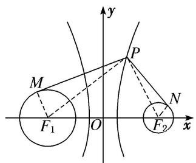

text_image

y
M
P
F₁ O N
x
F₂

(5)已知点 $M(-3,2)$ 是坐标平面内一定点，若抛物线 $y^{2} = 2x$ 的焦点为 $F$ ，点 $Q$ 是该抛物线上的一动点，则 $|MQ| - |QF|$ 的最小值是（）

A. $\frac{7}{2}$

B. 3

C. $\frac{5}{2}$

D. 2

答案 C 解析 抛物线的准线方程为 $x = -\frac{1}{2}$ ，过 Q 作准线的垂线，垂足为 $Q'$ ，如图。依据抛物线的定义，得 $|QM| - |QF| = |QM| - |QQ'|$ ，则当 QM 和 $QQ'$ 共线时， $|QM| - |QQ'|$ 的值最小，最小值为 $\left|-3 - \left(-\frac{1}{2}\right)\right| = \frac{5}{2}$ .

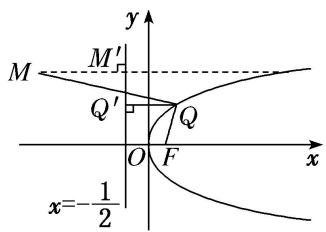

text_image

y
M
M'
Q'
Q
O
F
x
x=-\frac{1}{2}

(6)已知抛物线的方程为 $x^{2} = 8y$ ， $F$ 是其焦点，点 $A(-2,4)$ ，在此抛物线上求一点 $P$ ，使 $\triangle APF$ 的周长最小，此时点 $P$ 的坐标为

答案 $\left(-2, \frac{1}{2}\right)$ 解析 因为 $(-2)^2 < 8 \times 4$ ，所以点 $A(-2, 4)$ 在抛物线 $x^2 = 8y$ 的内部，如图，设抛物线的准线为 $l$ ，过点 $P$ 作 $PQ \perp l$ 于点 $Q$ ，过点 $A$ 作 $AB \perp l$ 于点 $B$ ，连接 $AQ$ ，由抛物线的定义可知 $\triangle APF$ 的周长为 $|PF| + |PA| + |AF| = |PQ| + |PA| + |AF| \geqslant |AQ| + |AF| \geqslant |AB| + |AF|$ ，当且仅当 $P, B, A$ 三点共线时， $\triangle APF$ 的周长取得最小值，即 $|AB| + |AF|$ 。因为 $A(-2, 4)$ ，所以不妨设 $\triangle APF$ 的周长最小时，点 $P$ 的坐标为 $(-2, y_0)$ ，代入 $x^2 = 8y$ ，得 $y_0 = \frac{1}{2}$ ，故使 $\triangle APF$ 的周长最小的抛物线上的点 $P$ 的坐标为 $\left(-2, \frac{1}{2}\right)$ 。

# 【对点训练】

1. 已知椭圆的方程为 $\frac{x^2}{9} + \frac{y^2}{4} = 1$ ，过椭圆中心的直线交椭圆于 $A, B$ 两点， $F_2$ 是椭圆的右焦点，则 $\triangle ABF_2$ 的周长的最小值为 \_\_\_\_， $\triangle ABF_2$ 的面积的最大值为 \_\_\_\_.

1. 答案 $10 \quad 2\sqrt{5}$ 解析 设 $F_{1}$ 是椭圆的左焦点．如图，连接 $AF_{1}$ ．由椭圆的对称性，结合椭圆的定义知 $\left|AF_{2}\right| + \left|BF_{2}\right| = 2a = 6$ ，所以要使 $\triangle ABF_{2}$ 的周长最小，必有 $|AB| = 2b = 4$ ，所以 $\triangle ABF_{2}$ 的周长的最小值为 10． $S\triangle_{ABF2} = S_{\triangle AF1F2} = \frac{1}{2} \times 2c \times \left|y_{A}\right| = \sqrt{5} \left|y_{A}\right| \leqslant 2\sqrt{5}$ ，所以 $\triangle ABF_{2}$ 面积的最大值为 $2\sqrt{5}$ .

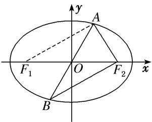

text_image

y
A
F₁ O F₂ x
B

2. 设 $F_{1}$ , $F_{2}$ 分别是椭圆 $\frac{x^{2}}{25} + \frac{y^{2}}{16} = 1$ 的左、右焦点, $P$ 为椭圆上任意一点, 点 $M$ 的坐标为(6, 4), 则 $|PM| - |PF_{1}|$ 的最小值为 \_\_\_\_.

2. 答案 -5 解析 由椭圆的方程可知 $F_{2}(3,0)$ ，由椭圆的定义可得 $|PF_{1}| = 2a - |PF_{2}|$ ， $\therefore |PM| - |PF_{1}| = |PM| - (2a - |PF_{2}|) = |PM| + |PF_{2}| - 2a \geqslant |MF_{2}| - 2a$ ，当且仅当 $M, P, F_{2}$ 三点共线时取得等号，又 $|MF_{2}| = \sqrt{(6 - 3)^{2} + (4 - 0)^{2}} = 5, 2a = 10, \therefore |PM| - |PF_{1}| \geqslant 5 - 10 = -5$ ，即 $|PM| - |PF_{1}|$ 的最小值为 $-5$ .

3. 已知 $F$ 是椭圆 $5x^{2} + 9y^{2} = 45$ 的左焦点, $P$ 是此椭圆上的动点, $A(1, 1)$ 是一定点. 则 $|PA| + |PF|$ 的最大值为 \_\_\_\_, 最小值为 \_\_\_\_.

3. 答案 $6 + \sqrt{2} - 6 - \sqrt{2}$ 解析 如图所示，设椭圆右焦点为 $F_{1}$ ，则 $|PF| + |PF_{1}| = 6$ 。所以 $|PA| + |PF| = |PA| - |PF_{1}| + 6$ 。利用 $-|AF_{1}| \leqslant |PA| - |PF_{1}| \leqslant |AF_{1}|$ （当 $P, A, F_{1}$ 共线时等号成立）。

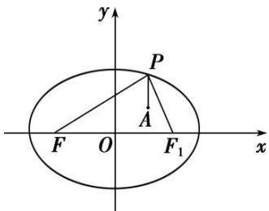

text_image

y
P
A
F O F₁ x

4. 椭圆 $C: \frac{x^2}{a^2} + y^2 = 1 (a > 1)$ 的离心率为 $\frac{\sqrt{3}}{2}$ , $F_1$ , $F_2$ 是 $C$ 的两个焦点, 过 $F_1$ 的直线 $l$ 与 $C$ 交于 $A$ , $B$ 两点, 则 $|AF_2| + |BF_2|$ 的最大值等于 \_\_\_\_.

4. 答案 7 解析 因为椭圆 C 的离心率为 $\frac{\sqrt{3}}{2}$ ，所以 $\frac{\sqrt{a^{2}-1}}{a}=\frac{\sqrt{3}}{2}$ ，解得 a=2，由椭圆定义得 $|AF_{2}|+|BF_{2}|+|AB|=4a=8$ ，即 $|AF_{2}|+|BF_{2}|=8-|AB|$ ，而由焦点弦性质，知当 $AB\perp x$ 轴时， $|AB|$ 取最小值 $2\times\frac{b^{2}}{a}=1$ ，因此 $|AF_{2}|+|BF_{2}|$ 的最大值等于 8-1=7.

5. 已知圆 $M: (x - 2)^{2} + y^{2} = 1$ 经过椭圆 $C: \frac{x^{2}}{m} + \frac{y^{2}}{3} = 1 (m > 3)$ 的一个焦点，圆 $M$ 与椭圆 $C$ 的公共点为 $A, B$ 点 $P$ 为圆 $M$ 上一动点，则 $P$ 到直线 $AB$ 的距离的最大值为（）

A. $2 \sqrt{10} - 5$

B. $2 \sqrt{10} - 4$

C. $4 \sqrt{10} - 11$

D. $4 \sqrt{10} - 10$

5. 答案 A 解析 易知圆 M 与 x 轴的交点为 $(1, 0)$ ， $(3, 0)$ ，∴ m-3=1 或 m-3=9，则 m=4 或 m=12。当 m=12 时，圆 M 与椭圆 C 无交点，舍去。所以 m=4。联立 $\left\{\begin{aligned}(x-2)^{2}+y^{2}&=1,\\ \frac{x^{2}}{4}+\frac{y^{2}}{3}&=1,\end{aligned}\right.$ 得 $x^{2}-16x+24=0$ 。又 $x\leqslant2$ ，所以 $x=8-2\sqrt{10}$ 。故点 P 到直线 AB 距离的最大值为 $3-(8-2\sqrt{10})=2\sqrt{10}-5$ 。

6. 设 $P$ 是椭圆 $\frac{x^2}{25} + \frac{y^2}{9} = 1$ 上一点， $M, N$ 分别是两圆： $(x + 4)^2 + y^2 = 1$ 和 $(x - 4)^2 + y^2 = 1$ 上的点，则 $|PM| + |PN|$ 的最小值和最大值分别为（）

A. 9, 12

B. 8, 11

C. 8, 12

D. 10, 12

6. 答案 C 解析 如图，由椭圆及圆的方程可知两圆圆心分别为椭圆的两个焦点，由椭圆定义知 $|PA| + |PB| = 2a = 10$ ，连接 PA，PB 分别与圆相交于 M，N 两点，此时 $|PM| + |PN|$ 最小，最小值为 $|PA| + |PB| - 2R = 8$ ；连接 PA，PB 并延长，分别与圆相交于 M，N 两点，此时 $|PM| + |PN|$ 最大，最大值为 $|PA| + |PB| + 2R = 12$ ，即最小值和最大值分别为 8，12.

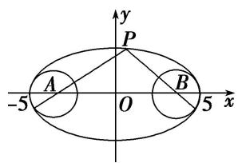

text_image

y
P
A
O
B
-5
5 x

7. $P$ 是双曲线 $C: \frac{x^2}{2} - y^2 = 1$ 右支上一点，直线 $l$ 是双曲线 $C$ 的一条渐近线， $P$ 在 $l$ 上的射影为 $Q$ ， $F_1$ 是双曲线 $C$ 的左焦点，则 $|PF_1| + |PQ|$ 的最小值为（）

A. 1

B. $2+\frac{\sqrt{15}}{5}$

C. $4+\frac{\sqrt{15}}{5}$

D. $2 \sqrt{2} + 1$

7. 答案 D 解析 如图所示，设双曲线右焦点为 $F_{2}$ ，则 $|PF_{1}| + |PQ| = 2a + |PF_{2}| + |PQ|$ ，即当 $|PQ| + |PF_{2}|$ 最小时， $|PF_{1}| + |PQ|$ 取最小值，由图知当 $F_{2}$ ， $P$ ， $Q$ 三点共线时 $|PQ| + |PF_{2}|$ 取得最小值，即 $F_{2}$ 到直线 $l$ 的距离 $d = 1$ ，故所求最值为 $2a + 1 = 2\sqrt{2} + 1$ 。故选 D.

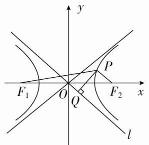

text_image

y
P
F₁ O Q F₂ x
l

8. 双曲线 $C$ 的渐近线方程为 $y = \pm \frac{2\sqrt{3}}{3} x$ ，一个焦点为 $F(0, -\sqrt{7})$ ，点 $A(\sqrt{2}, 0)$ ，点 $P$ 为双曲线上在第一象限内的点，则当点 $P$ 的位置变化时， $\triangle PAF$ 周长的最小值为（）

A. 8

B. 10

C. $4+3\sqrt{7}$

D. $3+3\sqrt{17}$

8. 答案 B 解析 由已知得 $\left\{ \begin{array}{l} \frac{a}{b} = \frac{2\sqrt{3}}{3}, \\ c = \sqrt{7}, \\ c^2 = a^2 + b^2, \end{array} \right.$ 解得 $\left\{ \begin{array}{l} a^2 = 4, \\ b^2 = 3, \\ c^2 = 7, \end{array} \right.$ 则双曲线 $C$ 的方程为 $\frac{y^2}{4} - \frac{x^2}{3} = 1$ ，设双曲线线

的另一个焦点为 $F'$ ，则 $|PF|=|PF'|+4$ ， $\triangle PAF$ 的周长为 $|PF|+|PA|+|AF|=|PF'|+4+|PA|+3$ ，又点 P 在第一象限，则 $|PF'|+|PA|$ 的最小值为 $|AF'|=3$ ，故 $\triangle PAF$ 的周长的最小值为 10.

9. 过双曲线 $x^{2} - \frac{y^{2}}{15} = 1$ 的右支上一点 $P$ ，分别向圆 $C_{1}: (x + 4)^{2} + y^{2} = 4$ 和圆 $C_{2}: (x - 4)^{2} + y^{2} = 1$ 作切线，切点分别为 $M, N$ ，则 $|PM|^{2} - |PN|^{2}$ 的最小值为（）

A. 10

B. 13

C. 16

D. 19

9. 答案 B 解析 由题意可知， $|PM|^{2}-|PN|^{2}=(|PC_{1}|^{2}-4)-(|PC_{2}|^{2}-1)$ ，因此 $|PM|^{2}-|PN|^{2}=|PC_{1}|^{2}-|PC_{2}|^{2}-3=(|PC_{1}|-|PC_{2}|)(|PC_{1}|+|PC_{2}|)-3=2(|PC_{1}|+|PC_{2}|)-3\geqslant2|C_{1}C_{2}|-3=13$ 。故选 B.

10. 已知点 $F$ 是抛物线 $y^{2} = 4x$ 的焦点， $P$ 是该抛物线上任意一点， $M(5,3)$ ，则 $|PF| + |PM|$ 的最小值是（）

A. 6

B. 5

C. 4

D. 3

10. 答案 A 解析 由题意知，抛物线的准线 $l$ 的方程为 $x = -1$ ，过点 $P$ 作 $PE \perp l$ 于点 $E$ ，由抛物线的定义，得 $|PE| = |PF|$ ，易知当 $P, E, M$ 三点在同一条直线上时， $|PF| + |PM|$ 取得最小值，即 $(|PF| + |PM|)_{\min} = 5 - (-1) = 6$ ，故选 A.

11. 已知抛物线 $y^{2} = 2x$ 的焦点是 $F$ ，点 $P$ 是抛物线上的动点，若点 $A(3, 2)$ ，则 $|PA| + |PF|$ 取最小值时，点 $P$ 的坐标为 \_\_\_\_.

11. 答案 (2, 2) 解析 将 $x = 3$ 代入抛物线方程 $y^{2} = 2x$ ，得 $y = \pm \sqrt{6}$ ， $\because \sqrt{6} > 2$ ， $\therefore A$ 在抛物线内部。如图，设抛物线上点 $P$ 到准线 $l: x = -\frac{1}{2}$ 的距离为 $d$ ，由定义知 $|PA| + |PF| = |PA| + d$ ，当 $PA \perp l$ 时， $|PA| + d$ 有最小值，最小值为 $\frac{7}{2}$ ，即 $|PA| + |PF|$ 的最小值为 $\frac{7}{2}$ ，此时点 $P$ 纵坐标为 2，代入 $y^{2} = 2x$ ，得 $x = 2$ ， $\therefore$ 点 $P$ 的坐标为 (2, 2).

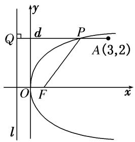

text_image

y
Q
d
P
A(3,2)
O
F
x
l

12. 已知抛物线 $C: y^{2} = 2px(p > 0)$ 的焦点为 $F$ ，准线为 $l$ ，且 $l$ 过点 $(-2, 3)$ ， $M$ 在抛物线 $C$ 上，若点 $N(1, 2)$ ，则 $|MN| + |MF|$ 的最小值为（）

A. 2

B. 3

C. 4

D. 5

12. 答案 B 解析 由题意知 $\frac{p}{2} = 2$ ，即 $p = 4$ 。过点 $N$ 作准线 $l$ 的垂线，垂足为 $N'$ ，交抛物线于点 $M'$ ，则 $|M'N'| = |M'F|$ ，则有 $|MN| + |MF| = |MN| + |MT| \geqslant |M'N'| + |M'N| = |NN'| = 1 - (-2) = 3$ .

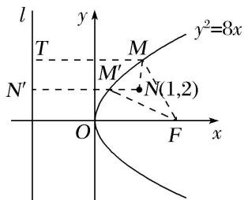

text_image

l
y
T
M
y²=8x
M′
N′
O
F
x
N(1,2)

13. 已知点 $M(x, y)$ 是抛物线 $y^{2} = 4x$ 上的动点，则 $\sqrt{(x - 2)^{2} + (y - 1)^{2}} + \sqrt{(x - 1)^{2} + y^{2}}$ 的最小值为（）

A. 3

B. 4

C. 5

D. 6

13. 答案 A 解析 因为 $\sqrt{(x-1)^{2}+y^{2}}$ 表示点 $M(x,y)$ 到点 $F(1,0)$ 的距离，即点 $M(x,y)$ 到抛物线 $y^{2}=4x$ 的准线 x=-1 的距离，因为 $\sqrt{(x-2)^{2}+(y-1)^{2}}$ 表示点 $M(x,y)$ 到点 $A(2,1)$ 的距离，所以 $\sqrt{(x-2)^{2}+(y-1)^{2}}+\sqrt{(x-1)^{2}+y^{2}}$ 的最小值为点 $A(2,1)$ 到抛物线 $y^{2}=4x$ 的准线 x=-1 的距离 3，即 $(\sqrt{(x-2)^{2}+(y-1)^{2}}+\sqrt{(x-1)^{2}+y^{2}})_{\min}=3$ 。故选 A.

14. 已知 $P$ 是抛物线 $y^{2} = 4x$ 上的一个动点， $Q$ 是圆 $(x - 3)^{2} + (y - 1)^{2} = 1$ 上的一个动点， $N(1,0)$ 是一个定点，则 $|PQ| + |PN|$ 的最小值为（）

A. 3

B. 4

C. 5

D. $\sqrt{2}+1$

14. 答案 C 解析 由抛物线方程 $y^{2} = 4x$ ，可得抛物线的焦点 $F(1,0)$ ，又 $N(1,0)$ ，所以 $N$ 与 $F$ 重合。过圆 $(x-3)^{2}+(y-1)^{2}=1$ 的圆心M作抛物线准线的垂线MH，交圆于Q，交抛物线于P，则 $|PQ|+|PN|$ 的最小值等于 $|MH|-1=3$ .

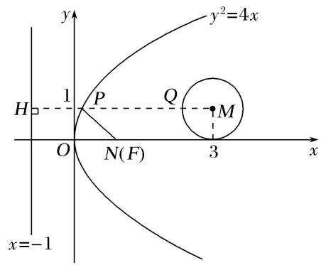

text_image

y
y²=4x
H
1
P
Q
M
O
N(F)
3
x
x=-1

15. 已知以圆 $C: (x - 1)^2 + y^2 = 4$ 的圆心为焦点的抛物线 $C_1$ 与圆 $C$ 在第一象限交于 $A$ 点， $B$ 点是抛物线 $C_2: x^2 = 8y$ 上任意一点， $BM$ 与直线 $y = -2$ 垂直，垂足为 $M$ ，则 $|BM| - |AB|$ 的最大值为（）

A. 1

B. 2

C. -1

D. 8

15. 答案 A 解析 因为圆 $C: (x - 1)^2 + y^2 = 4$ 的圆心为 $C(1, 0)$ ，所以可得以 $C(1, 0)$ 为焦点的抛物线方程为 $y^2 = 4x$ ，由 $\left\{ \begin{array}{l} y^2 = 4x, \\ (x - 1)^2 + y^2 = 4, \end{array} \right.$ 解得 $A(1, 2)$ . 抛物线 $C_2: x^2 = 8y$ 的焦点为 $F(0, 2)$ ，准线方程为 $y = -2$ ，即有 $|BM| - |AB| = |BF| - |AB| \leqslant |AF| = 1$ ，当且仅当 $A, B, F(A$ 在 $B, F$ 之间)三点共线时，可得最大值 1.

16. 已知抛物线 $y^{2} = 8x$ ，点 $Q$ 是圆 $C: x^{2} + y^{2} + 2x - 8y + 13 = 0$ 上任意一点，记抛物线上任意一点 $P$ 到直线 $x = -2$ 的距离为 $d$ ，则 $|PQ| + d$ 的最小值为（）

A. 5

B. 4

C. 3

D. 2

16. 答案 C 解析 如图，由题意知抛物线 $y^{2}=8x$ 的焦点为 $F(2,0)$ ，连接 PF，FQ，则 $d=|PF|$ ，将圆 C 的方程化为 $(x+1)^{2}+(y-4)^{2}=4$ ，圆心为 $C(-1,4)$ ，半径为 2，则 $|PQ|+d=|PQ|+|PF|$ ，又 $|PQ|+|PF|\geq|FQ|$ （当且仅当 F, P, Q 三点共线时取得等号）。所以当 F, Q, C 三点共线时取得最小值，且为 $|CF|-|CQ|=\sqrt{(-1-2)^{2}+(4-0)^{2}}-2=3$ ，故选 C.

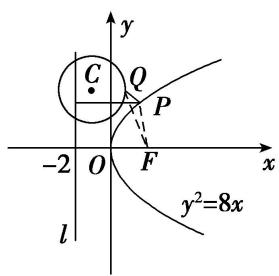

text_image

y
C Q
P
-2 O F x
l
y²=8x

17. 定长为 4 的线段 MN 的两端点在抛物线 $y^{2}=x$ 上移动，设点 P 为线段 MN 的中点，则点 P 到 y 轴距离的最小值为()

A. 1

B. $\frac{7}{4}$

C. 2

D. 5

17. 答案 B 解析 设 $M(x_{1}, y_{1})$ , $N(x_{2}, y_{2})$ ，抛物线 $y^{2}=x$ 的焦点为 $F\left(\frac{1}{4}, 0\right)$ ，抛物线的准线为 $x=-\frac{1}{4}$ ,

所求的距离 $d = \left|\frac{x_1 + x_2}{2}\right| = \frac{x_1 + \frac{1}{4} + x_2 + \frac{1}{4}}{2} -\frac{1}{4} = \frac{|MF| + |NF|}{2} -\frac{1}{4},$ 所以 $\frac{|MF| + |NF|}{2} -\frac{1}{4}\geqslant \frac{|MN|}{2} -\frac{1}{4} = \frac{7}{4}$ （两边之和大于第三边且 $M,N,F$ 三点共线时取等号).

18. 已知抛物线方程为 $y^{2} = -4x$ ，直线 $l$ 的方程为 $2x + y - 4 = 0$ ，在抛物线上有一动点 $A$ ，点 $A$ 到 $y$ 轴的距离为 $m$ ，到直线 $l$ 的距离为 $n$ ，则 $m + n$ 的最小值为 \_\_\_\_.  
18. 答案 $\frac{6\sqrt{5}}{5} - 1$ 解析 如图，过 $A$ 作 $AH \perp l$ ， $AN$ 垂直于抛物线的准线，则 $|AH| + |AN| = m + n + 1$ ，连接 $AF$ ，则 $|AF| + |AH| = m + n + 1$ ，由平面几何知识，知当 $A, F, H$ 三点共线时， $|AF| + |AH| = m + n + 1$ 取得最小值，最小值为 $F$ 到直线 $l$ 的距离，即 $\frac{6}{\sqrt{5}} = \frac{6\sqrt{5}}{5}$ ，即 $m + n$ 的最小值为 $\frac{6\sqrt{5}}{5} - 1$ .

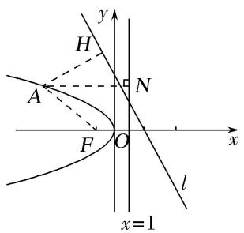

text_image

y
H
A
N
F
O
x
l
x=1

19. 已知点 $F$ 是抛物线 $C: y^{2} = 4x$ 的焦点，点 $M$ 为抛物线 $C$ 上任意一点，过点 $M$ 向圆 $(x - 1)^{2} + y^{2} = \frac{1}{2}$ 作切线，切点分别为 $A, B$ ，则四边形 $AFBM$ 面积的最小值为 \_\_\_\_.  
19. 答案 $\frac{1}{2}$ 解析 如图所示:

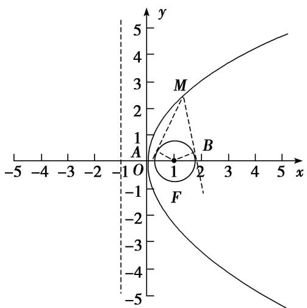

text_image

y
5
4
M
2
1
A
B
-1 O 1 2 3 4 5 x
-1 -2 -3 -4 -5

圆的圆心与抛物线的焦点重合，若四边形 $AFBM$ 的面积最小，则 $MF$ 最小，即 $M$ 距离准线最近，故满足条件时， $M$ 与原点重合，此时 $MF = 1$ ， $BF = BM = \frac{\sqrt{2}}{2}$ ，此时四边形 $AFBM$ 面积 $S = 2S_{\triangle BMF} = 2 \times \frac{1}{2} \times \frac{\sqrt{2}}{2} \times \frac{\sqrt{2}}{2} = \frac{1}{2}$ ，故答案为 $\frac{1}{2}$ .

20. 已知抛物线 $C: x^{2} = 8y$ 的焦点为 $F$ , 动点 $Q$ 在 $C$ 上, 圆 $Q$ 的半径为 1 , 过点 $F$ 的直线与圆 $Q$ 切于点 $P$ , 则 $\overrightarrow{FP} \cdot \overrightarrow{FQ}$ 的最小值为 \_\_\_\_.

20. 答案 3 解析 如图，在 Rt△QPF 中， $\overrightarrow{FP}\cdot\overrightarrow{FQ}=|\overrightarrow{FP}||\overrightarrow{FQ}|\cos\angle PFQ=|\overrightarrow{FP}||\overrightarrow{FQ}|\frac{|\overrightarrow{PF}|}{|\overrightarrow{FQ}|}=|\overrightarrow{FP}|^{2}=|\overrightarrow{FQ}|^{2}-1$ . 由抛物线的定义知： $|\overrightarrow{FQ}|=d(d$ 为点 Q 到准线的距离)，易知，抛物线的顶点到准线的距离最短， $\therefore|\overrightarrow{FQ}|_{\min}=2,\therefore\overrightarrow{FP}\cdot\overrightarrow{FQ}$ 的最小值为 3.

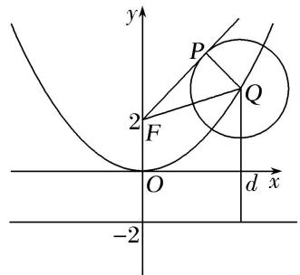

text_image

y
P
2
F
O
d x
-2

