**专题10　几何法解决的最值模型**

**【例题选讲】**

<strong>[例1]</strong>　(1)过椭圆＋＝1的中心任作一直线交椭圆于<em>P</em>，<em>Q</em>两点，<em>F</em>是椭圆的一个焦点，则△<em>PFQ</em>的周长的最小值为(　　)

A．12　　　　　　　　B．14　　　　　　　　C．16　　　　　　　　D．18

<strong>答案</strong>　D　<strong>解析</strong>　由椭圆的对称性可知，<em>P</em>，<em>Q</em>两点关于原点对称，设<em>F</em>′为椭圆另一焦点，则四边形<em>PFQF</em>′为平行四边形，由椭圆定义可知：|<em>PF</em>|＋|<em>PF</em>′|＋|<em>QF</em>|＋|<em>QF</em>′|＝4<em>a</em>＝20，又|<em>PF</em>|＝|<em>QF</em>′|，|<em>QF</em>|＝|<em>PF</em>′|，∴|<em>PF</em>|＋|<em>QF</em>|＝10，又<em>PQ</em>为椭圆内的弦，∴|<em>PQ</em>|min＝2<em>b</em>＝8，∴△<em>PFQ</em>周长的最小值为：10＋8＝18．故选D．

(2)已知点<em>F</em>为椭圆<em>C</em>：＋<em>y</em>2＝1的左焦点，点<em>P</em>为椭圆<em>C</em>上任意一点，点<em>Q</em>的坐标为(4，3)，则|<em>PQ</em>|＋|<em>PF</em>|取最大值时，点<em>P</em>的坐标为\_\_\_\_\_\_\_\_．

<strong>答案</strong>　(0，－1)　<strong>解析</strong>　设椭圆的右焦点为<em>E</em>，|<em>PQ</em>|＋|<em>PF</em>|＝|<em>PQ</em>|＋2<em>a</em>－|<em>PE</em>|＝|<em>PQ</em>|－|<em>PE</em>|＋2．当<em>P</em>为线段<em>QE</em>的延长线与椭圆的交点时，|<em>PQ</em>|＋|<em>PF</em>|取最大值，此时，直线<em>PQ</em>的方程为<em>y</em>＝<em>x</em>－1，<em>QE</em>的延长线与椭圆交于点(0，－1)，即点<em>P</em>的坐标为(0，－1)．

(3)椭圆＋＝1的左焦点为*F*，直线*x*＝*m*与椭圆相交于点*M*，*N*，当△*FMN*的周长最大时，△*FMN*的面积是(　　)

A．　　　　　　　　　B．　　　　　　　　　C．　　　　　　　　　D．

<strong>答案</strong>　C　<strong>解析</strong>　如图所示，设椭圆的右焦点为<em>F</em>′，连接<em>MF</em>′，<em>NF</em>′．因为|<em>MF</em>|＋|<em>NF</em>|＋|<em>MF</em>′|＋|<em>NF</em>′|≥|<em>MF</em>|＋|<em>NF</em>|＋|<em>MN</em>|，所以当直线<em>x</em>＝<em>m</em>过椭圆的右焦点时，△<em>FMN</em>的周长最大．此时|<em>MN</em>|＝＝，又<em>c</em>＝＝＝1，所以此时△<em>FMN</em>的面积<em>S</em>＝×2×＝．故选C．

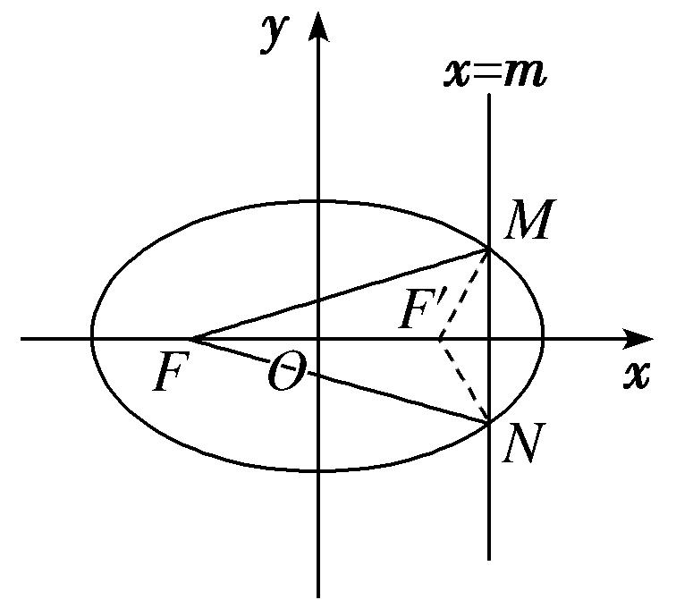

(4)设<em>P</em>为双曲线<em>x</em>2－＝1右支上一点，<em>M</em>，<em>N</em>分别是圆<em>C</em>1：(<em>x</em>＋4)2＋<em>y</em>2＝4和圆<em>C</em>2：(<em>x</em>－4)2＋<em>y</em>2＝1上的点，设|<em>PM</em>|－|<em>PN</em>|的最大值和最小值分别为<em>m</em>，<em>n</em>，则|<em>m</em>－<em>n</em>|＝(　　)

A．4　　　　　　　　　　B．5　　　　　　　　　　C．6　　　　　　　　　　D．7

<strong>答案</strong>　C　<strong>解析</strong>　由题意得，圆<em>C</em>1：(<em>x</em>＋4)2＋<em>y</em>2＝4的圆心为(－4,0)，半径为<em>r</em>1＝2；圆<em>C</em>2：(<em>x</em>－4)2＋<em>y</em>2＝1的圆心为(4，0)，半径为<em>r</em>2＝1．设双曲线<em>x</em>2－＝1的左、右焦点分别为<em>F</em>1(－4，0)，<em>F</em>2(4，0)．如图所示，连接<em>PF</em>1，<em>PF</em>2，<em>F</em>1<em>M</em>，<em>F</em>2<em>N</em>，则|<em>PF</em>1|－|<em>PF</em>2|＝2．又|<em>PM</em>|max＝|<em>PF</em>1|＋<em>r</em>1，|<em>PN</em>|min＝|<em>PF</em>2|－<em>r</em>2，所以|<em>PM</em>|－|<em>PN</em>|的最大值<em>m</em>＝|<em>PF</em>1|－|<em>PF</em>2|＋<em>r</em>1＋<em>r</em>2＝5．又|<em>PM</em>|min＝|<em>PF</em>1|－<em>r</em>1，|<em>PN</em>|max＝|<em>PF</em>2|＋<em>r</em>2，所以|<em>PM</em>|－|<em>PN</em>|的最小值<em>n</em>＝|<em>PF</em>1|－|<em>PF</em>2|－<em>r</em>1－<em>r</em>2＝－1，所以|<em>m</em>－<em>n</em>|＝6．故选C．

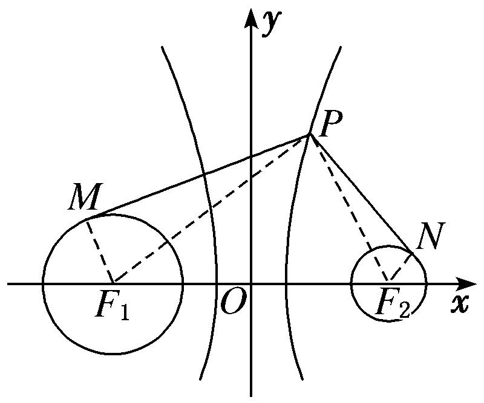

(5)已知点<em>M</em>(－3，2)是坐标平面内一定点，若抛物线<em>y</em>2＝2<em>x</em>的焦点为<em>F</em>，点<em>Q</em>是该抛物线上的一动点，则|<em>MQ</em>|－|<em>QF</em>|的最小值是(　　)

A．　　　　　　　　B．3　　　　　　　　C．　　　　　　　　D．2

<strong>答案</strong>　C　<strong>解析</strong>　抛物线的准线方程为x＝－，过<em>Q</em>作准线的垂线，垂足为<em>Q</em>′，如图．依据抛物线的定义，得|<em>QM</em>|－|<em>QF</em>|＝|<em>QM</em>|－|<em>QQ</em>′|，则当<em>QM</em>和<em>QQ</em>′共线时，|<em>QM</em>|－|<em>QQ</em>′|的值最小，最小值为＝．

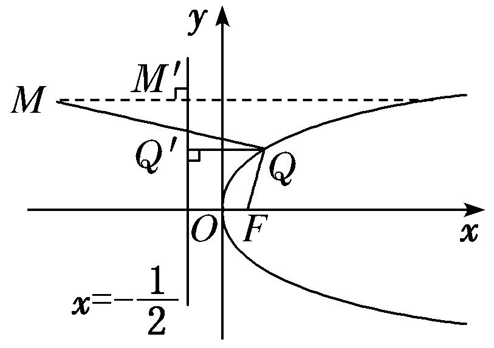

(6)已知抛物线的方程为<em>x</em>2＝8<em>y</em>，<em>F</em>是其焦点，点<em>A</em>(－2，4)，在此抛物线上求一点<em>P</em>，使△<em>APF</em>的周长最小，此时点<em>P</em>的坐标为\_\_\_\_\_\_\_\_．

<strong>答案　　解析</strong>　因为(－2)2＜8×4，所以点<em>A</em>(－2，4)在抛物线<em>x</em>2＝8<em>y</em>的内部，如图，设抛物线的准线为<em>l</em>，过点<em>P</em>作<em>PQ</em>⊥<em>l</em>于点<em>Q</em>，过点<em>A</em>作<em>AB</em>⊥<em>l</em>于点<em>B</em>，连接<em>AQ</em>，由抛物线的定义可知△<em>APF</em>的周长为|<em>PF</em>|＋|<em>PA</em>|＋|<em>AF</em>|＝|<em>PQ</em>|＋|<em>PA</em>|＋|<em>AF</em>|≥|<em>AQ</em>|＋|<em>AF</em>|≥|<em>AB</em>|＋|<em>AF</em>|，当且仅当<em>P</em>，<em>B</em>，<em>A</em>三点共线时，△<em>APF</em>的周长取得最小值，即|<em>AB</em>|＋|<em>AF</em>|．因为<em>A</em>(－2，4)，所以不妨设△<em>APF</em>的周长最小时，点<em>P</em>的坐标为(－2，<em>y</em>0)，代入<em>x</em>2＝8<em>y</em>，得<em>y</em>0＝，故使△<em>APF</em>的周长最小的抛物线上的点<em>P</em>的坐标为．

**【对点训练】**

1．已知椭圆的方程为＋＝1，过椭圆中心的直线交椭圆于<em>A</em>，<em>B</em>两点，<em>F</em>2是椭圆的右焦点，则△<em>ABF</em>2

的周长的最小值为\_\_\_\_\_\_\_\_，△<em>ABF</em>2的面积的最大值为\_\_\_\_\_\_\_\_．

1．<strong>答案</strong>　10　2　　<strong>解析</strong>　设<em>F</em>1是椭圆的左焦点．如图，连接<em>AF</em>1．由椭圆的对称性，结合椭圆的定

义知|<em>AF</em>2|＋|<em>BF</em>2|＝2<em>a</em>＝6，所以要使△<em>ABF</em>2的周长最小，必有|<em>AB</em>|＝2<em>b</em>＝4，所以△<em>ABF</em>2的周长的最小值为10．<em>S</em>△<em>ABF</em>2＝<em>S</em>△<em>AF</em>1<em>F</em>2＝×2<em>c</em>×|<em>yA</em>|＝|<em>yA</em>|≤2，所以△<em>ABF</em>2面积的最大值为2．

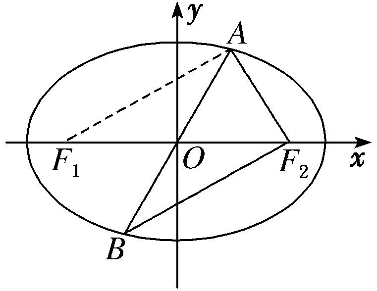

2．设<em>F</em>1，<em>F</em>2分别是椭圆＋＝1的左、右焦点，<em>P</em>为椭圆上任意一点，点<em>M</em>的坐标为(6，4)，则|<em>PM</em>|

－|<em>PF</em>1|的最小值为\_\_\_\_\_\_\_\_．

2．<strong>答案</strong>　－5　<strong>解析</strong>　由椭圆的方程可知<em>F</em>2(3，0)，由椭圆的定义可得|<em>PF</em>1|＝2<em>a</em>－|<em>PF</em>2|，∴|<em>PM</em>|－|<em>PF</em>1|

＝|<em>PM</em>|－(2<em>a</em>－|<em>PF</em>2|)＝|<em>PM</em>|＋|<em>PF</em>2|－2<em>a</em>≥|<em>MF</em>2|－2<em>a</em>，当且仅当<em>M</em>，<em>P</em>，<em>F</em>2三点共线时取得等号，又|<em>MF</em>2|＝＝5，2<em>a</em>＝10，∴|<em>PM</em>|－|<em>PF</em>1|≥5－10＝－5，即|<em>PM</em>|－|<em>PF</em>1|的最小值为－5．

3．已知<em>F</em>是椭圆5<em>x</em>2＋9<em>y</em>2＝45的左焦点，<em>P</em>是此椭圆上的动点，<em>A</em>(1，1)是一定点．则|<em>PA</em>|＋|<em>PF</em>|的最大

值为\_\_\_\_\_\_\_\_，最小值为\_\_\_\_\_\_\_\_．

3．<strong>答案</strong>　6＋　6－　<strong>解析</strong>　如图所示，设椭圆右焦点为<em>F</em>1，则|<em>PF</em>|＋|<em>PF</em>1|＝6．所以|<em>PA</em>|＋|<em>PF</em>|＝|<em>PA</em>|

－|<em>PF</em>1|＋6．利用－|<em>AF</em>1|≤|<em>PA</em>|－|<em>PF</em>1|≤|<em>AF</em>1|(当<em>P</em>，<em>A</em>，<em>F</em>1共线时等号成立)．

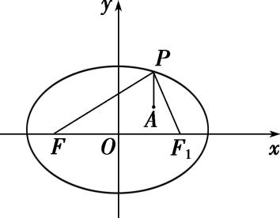

4．椭圆<em>C</em>：＋<em>y</em>2＝1(<em>a</em>&gt;1)的离心率为，<em>F</em>1，<em>F</em>2是<em>C</em>的两个焦点，过<em>F</em>1的直线<em>l</em>与<em>C</em>交于<em>A</em>，<em>B</em>两点，

则|<em>AF</em>2|＋|<em>BF</em>2|的最大值等于\_\_\_\_\_\_\_\_．

4．<strong>答案</strong>　7　<strong>解析</strong>　因为椭圆<em>C</em>的离心率为，所以＝，解得<em>a</em>＝2，由椭圆定义得|<em>AF</em>2|＋|<em>BF</em>2|

＋|<em>AB</em>|＝4<em>a</em>＝8，即|<em>AF</em>2|＋|<em>BF</em>2|＝8－|<em>AB</em>|，而由焦点弦性质，知当<em>AB</em>⊥<em>x</em>轴时，|<em>AB</em>|取最小值2×＝1，因此|<em>AF</em>2|＋|<em>BF</em>2|的最大值等于8－1＝7．

5．已知圆<em>M</em>：(<em>x</em>－2)2＋<em>y</em>2＝1经过椭圆<em>C</em>：＋＝1(<em>m</em>&gt;3)的一个焦点，圆<em>M</em>与椭圆<em>C</em>的公共点为<em>A</em>，<em>B</em>，

点*P*为圆*M*上一动点，则*P*到直线*AB*的距离的最大值为(　　)

A．2－5　　　　　B．2－4　　　　　C．4－11　　　　　D．4－10

5．<strong>答案</strong>　A　<strong>解析</strong>　易知圆<em>M</em>与<em>x</em>轴的交点为(1，0)，(3，0)，∴<em>m</em>－3＝1或<em>m</em>－3＝9，则<em>m</em>＝4或<em>m</em>＝

12．当<em>m</em>＝12时，圆<em>M</em>与椭圆<em>C</em>无交点，舍去．所以<em>m</em>＝4．联立得<em>x</em>2－16<em>x</em>＋24＝0．又<em>x</em>≤2，所以<em>x</em>＝8－2．故点<em>P</em>到直线<em>AB</em>距离的最大值为3－(8－2)＝2－5．

6．设<em>P</em>是椭圆＋＝1上一点，<em>M</em>，<em>N</em>分别是两圆：(<em>x</em>＋4)2＋<em>y</em>2＝1和(<em>x</em>－4)2＋<em>y</em>2＝1上的点，则|<em>PM</em>|

＋|*PN*|的最小值和最大值分别为(　　)

A．9，12　　　　　　B．8，11　　　　　　C．8，12　　　　　　D．10，12

6．<strong>答案</strong>　C　<strong>解析</strong>　如图，由椭圆及圆的方程可知两圆圆心分别为椭圆的两个焦点，由椭圆定义知|<em>PA</em>|

＋|*PB*|＝2*a*＝10，连接*PA*，*PB*分别与圆相交于*M*，*N*两点，此时|*PM*|＋|*PN*|最小，最小值为|*PA*|＋|*PB*|－2*R*＝8；连接*PA*，*PB*并延长，分别与圆相交于*M*，*N*两点，此时|*PM*|＋|*PN*|最大，最大值为|*PA*|＋|*PB*|＋2*R*＝12，即最小值和最大值分别为8，12．

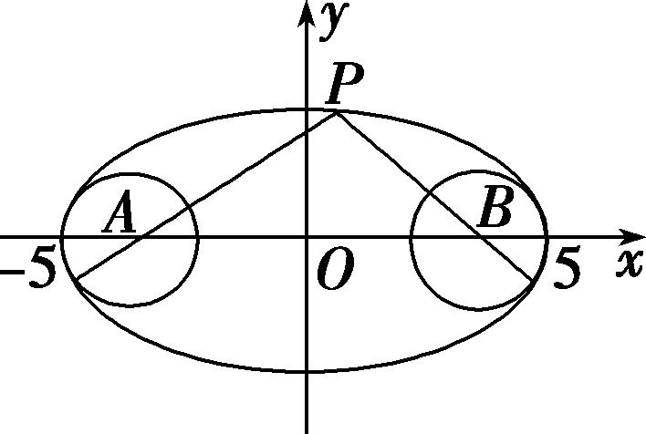

7．<em>P</em>是双曲线<em>C</em>：－<em>y</em>2＝1右支上一点，直线<em>l</em>是双曲线<em>C</em>的一条渐近线，<em>P</em>在<em>l</em>上的射影为<em>Q</em>，<em>F</em>1是双

曲线<em>C</em>的左焦点，则|<em>PF</em>1|＋|<em>PQ</em>|的最小值为(　　)

A．1　　　　　　B．2＋　　　　　　C．4＋　　　　　　D．2＋1

7．<strong>答案</strong>　D　<strong>解析</strong>　如图所示，设双曲线右焦点为<em>F</em>2，则|<em>PF</em>1|＋|<em>PQ</em>|＝2<em>a</em>＋|<em>PF</em>2|＋|<em>PQ</em>|，即当|<em>PQ</em>|＋|<em>PF</em>2|

最小时，|<em>PF</em>1|＋|<em>PQ</em>|取最小值，由图知当<em>F</em>2，<em>P</em>，<em>Q</em>三点共线时|<em>PQ</em>|＋|<em>PF</em>2|取得最小值，即<em>F</em>2到直线<em>l</em>的距离<em>d</em>＝1，故所求最值为2<em>a</em>＋1＝2＋1．故选D．

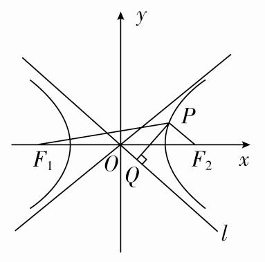

8．双曲线*C*的渐近线方程为*y*＝±*x*，一个焦点为*F*(0，－)，点*A*(，0)，点*P*为双曲线上在第一

象限内的点，则当点*P*的位置变化时，△*PAF*周长的最小值为(　　)

A．8　　　　　　　　B．10　　　　　　　　C．4＋3　　　　　　　　D．3＋3

8．<strong>答案</strong>　B　<strong>解析</strong>　由已知得解得则双曲线<em>C</em>的方程为－＝1，设双曲线

的另一个焦点为*F*′，则|*PF*|＝|*PF*′|＋4，△*PAF*的周长为|*PF*|＋|*PA*|＋|*AF*|＝|*PF*′|＋4＋|*PA*|＋3，又点*P*在第一象限，则|*PF*′|＋|*PA*|的最小值为|*AF*′|＝3，故△*PAF*的周长的最小值为10．

9．过双曲线<em>x</em>2－＝1的右支上一点<em>P</em>，分别向圆<em>C</em>1：(<em>x</em>＋4)2＋<em>y</em>2＝4和圆<em>C</em>2：(<em>x</em>－4)2＋<em>y</em>2＝1作切线，

切点分别为<em>M</em>，<em>N</em>，则|<em>PM</em>|2－|<em>PN</em>|2的最小值为(　　)

A．10　　　　　　　　B．13　　　　　　　　C．16　　　　　　　　D．19

9．<strong>答案</strong>　B　<strong>解析</strong>　由题意可知，|<em>PM</em>|2－|<em>PN</em>|2＝(|<em>PC</em>1|2－4)－(|<em>PC</em>2|2－1)，因此|<em>PM</em>|2－|<em>PN</em>|2＝|<em>PC</em>1|2－|<em>PC</em>2|2

－3＝(|<em>PC</em>1|－|<em>PC</em>2|)(|<em>PC</em>1|＋|<em>PC</em>2|)－3＝2(|<em>PC</em>1|＋|<em>PC</em>2|)－3≥2|<em>C</em>1<em>C</em>2|－3＝13．故选B．

10．已知点<em>F</em>是抛物线<em>y</em>2＝4<em>x</em>的焦点，<em>P</em>是该抛物线上任意一点，<em>M</em>(5，3)，则|<em>PF</em>|＋|<em>PM</em>|的最小值是(　　)

A．6　　　　　　　　B．5　　　　　　　　C．4　　　　　　　　D．3

10．<strong>答案</strong>　A　<strong>解析</strong>　由题意知，抛物线的准线<em>l</em>的方程为<em>x</em>＝－1，过点<em>P</em>作<em>PE</em>⊥<em>l</em>于点<em>E</em>，由抛物线的

定义，得|<em>PE</em>|＝|<em>PF</em>|，易知当<em>P</em>，<em>E</em>，<em>M</em>三点在同一条直线上时，|<em>PF</em>|＋|<em>PM</em>|取得最小值，即(|<em>PF</em>|＋|<em>PM</em>|)min＝5－(－1)＝6，故选A．

11．已知抛物线<em>y</em>2＝2<em>x</em>的焦点是<em>F</em>，点<em>P</em>是抛物线上的动点，若点<em>A</em>(3，2)，则|<em>PA</em>|＋|<em>PF</em>|取最小值时，点

*P*的坐标为\_\_\_\_\_\_\_\_．

11．<strong>答案</strong>　(2，2)　<strong>解析</strong>　　将<em>x</em>＝3代入抛物线方程<em>y</em>2＝2<em>x</em>，得<em>y</em>＝±，∵&gt;2，∴<em>A</em>在抛物线内部．如

图，设抛物线上点<em>P</em>到准线<em>l</em>：<em>x</em>＝－的距离为<em>d</em>，由定义知|<em>PA</em>|＋|<em>PF</em>|＝|<em>PA</em>|＋<em>d</em>，当<em>PA</em>⊥<em>l</em>时，|<em>PA</em>|＋<em>d</em>有最小值，最小值为，即|<em>PA</em>|＋|<em>PF</em>|的最小值为，此时点<em>P</em>纵坐标为2，代入<em>y</em>2＝2<em>x</em>，得<em>x</em>＝2，∴点<em>P</em>的坐标为(2，2)．

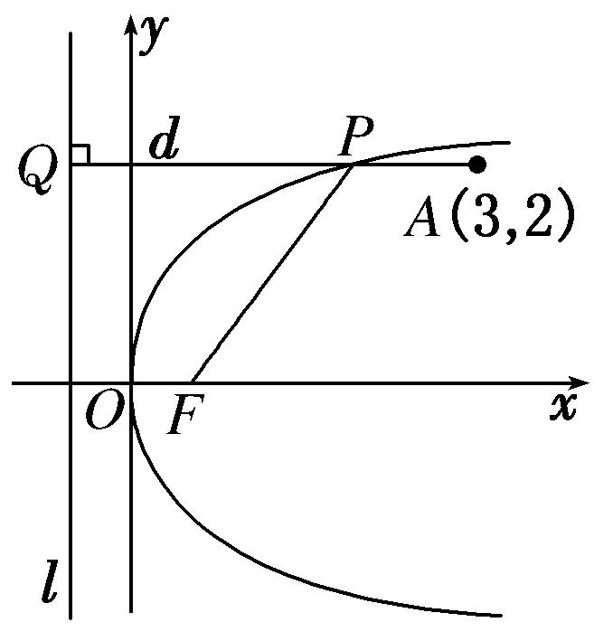

12．已知抛物线<em>C</em>：<em>y</em>2＝2<em>px</em>(<em>p</em>&gt;0)的焦点为<em>F</em>，准线为<em>l</em>，且<em>l</em>过点(－2，3)，<em>M</em>在抛物线<em>C</em>上，若点<em>N</em>(1，

2)，则|*MN*|＋|*MF*|的最小值为(　　)

A．2　　　　　　　　B．3　　　　　　　　C．4　　　　　　　　D．5

12．<strong>答案</strong>　B　<strong>解析</strong>　由题意知＝2，即<em>p</em>＝4．过点<em>N</em>作准线<em>l</em>的垂线，垂足为<em>N</em>′，交抛物线于点<em>M</em>′，则

|*M*′*N*′|＝|*M*′*F*|，则有|*MN*|＋|*MF*|＝|*MN*|＋|*MT*|≥|*M*′*N*′|＋|*M*′*N*|＝|*NN*′|＝1－(－2)＝3．

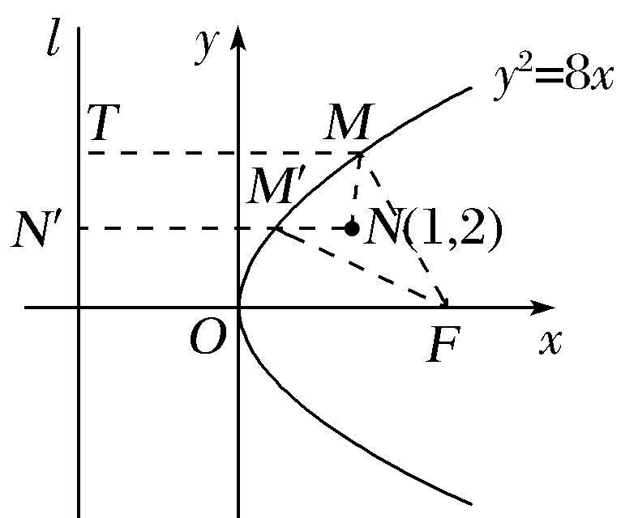

13．已知点<em>M</em>(<em>x</em>，<em>y</em>)是抛物线<em>y</em>2＝4<em>x</em>上的动点，则＋的最小值为(　　)

A．3　　　　　　　　B．4　　　　　　　　C．5　　　　　　　　D．6

13．<strong>答案</strong>　A　<strong>解析</strong>　因为表示点<em>M</em>(<em>x</em>，<em>y</em>)到点<em>F</em>(1，0)的距离，即点<em>M</em>(<em>x</em>，<em>y</em>)到抛物线<em>y</em>2＝4<em>x</em>

的准线<em>x</em>＝－1的距离，因为表示点<em>M</em>(<em>x</em>，<em>y</em>)到点<em>A</em>(2,1)的距离，所以＋的最小值为点<em>A</em>(2，1)到抛物线<em>y</em>2＝4<em>x</em>的准线<em>x</em>＝－1的距离3，即(＋)min＝3．故选A．

14．已知<em>P</em>是抛物线<em>y</em>2＝4<em>x</em>上的一个动点，<em>Q</em>是圆(<em>x</em>－3)2＋(<em>y</em>－1)2＝1上的一个动点，<em>N</em>(1，0)是一个定点，

则|*PQ*|＋|*PN*|的最小值为(　　)

A．3　　　　　　　　B．4　　　　　　　　C．5　　　　　　　　D．＋1

14．<strong>答案</strong>　C　<strong>解析</strong>　由抛物线方程<em>y</em>2＝4<em>x</em>，可得抛物线的焦点<em>F</em>(1，0)，又<em>N</em>(1，0)，所以<em>N</em>与<em>F</em>重合．过

圆(<em>x</em>－3)2＋(<em>y</em>－1)2＝1的圆心<em>M</em>作抛物线准线的垂线<em>MH</em>，交圆于<em>Q</em>，交抛物线于<em>P</em>，则|<em>PQ</em>|＋|<em>PN</em>|的最小值等于|<em>MH</em>|－1＝3．

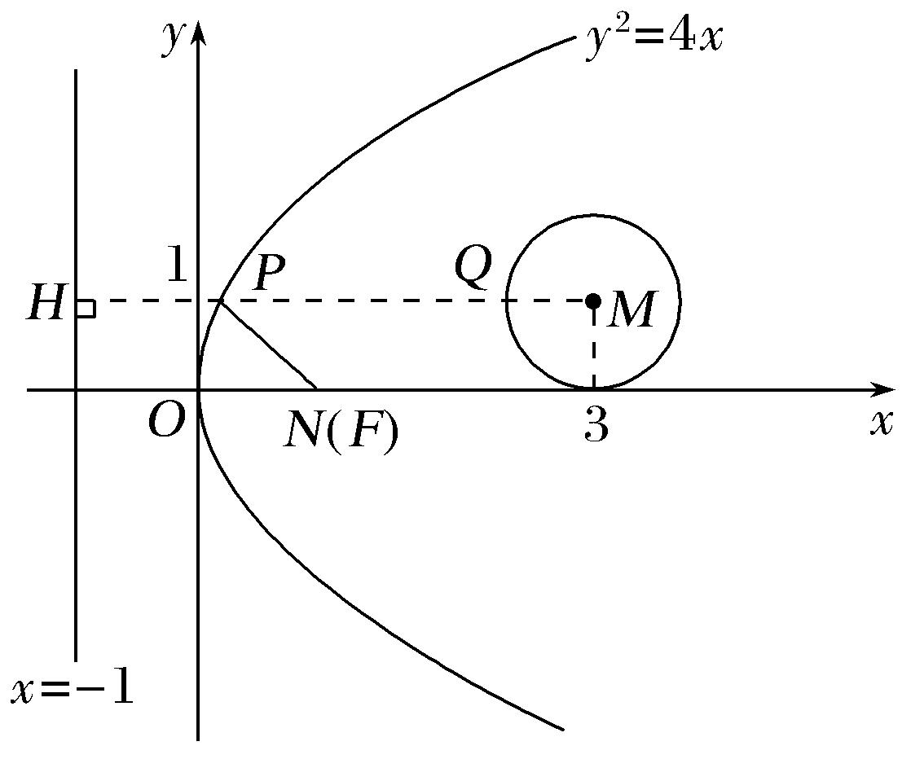

15．已知以圆<em>C</em>：(<em>x</em>－1)2＋<em>y</em>2＝4的圆心为焦点的抛物线<em>C</em>1与圆<em>C</em>在第一象限交于<em>A</em>点，<em>B</em>点是抛物线<em>C</em>2：

<em>x</em>2＝8<em>y</em>上任意一点，<em>BM</em>与直线<em>y</em>＝－2垂直，垂足为<em>M</em>，则|<em>BM</em>|－|<em>AB</em>|的最大值为(　　)

A．1　　　　　　　　B．2　　　　　　　　C．－1　　　　　　　　D．8

15．<strong>答案</strong>　A　<strong>解析</strong>　因为圆<em>C</em>：(<em>x</em>－1)2＋<em>y</em>2＝4的圆心为<em>C</em>(1，0)，所以可得以<em>C</em>(1，0)为焦点的抛物线方

程为<em>y</em>2＝4<em>x</em>，由解得<em>A</em>(1，2)．抛物线<em>C</em>2：<em>x</em>2＝8<em>y</em>的焦点为<em>F</em>(0，2)，准线方程为<em>y</em>＝－2，即有|<em>BM</em>|－|<em>AB</em>|＝|<em>BF</em>|－|<em>AB</em>|≤|<em>AF</em>|＝1，当且仅当<em>A</em>，<em>B</em>，<em>F</em>(<em>A</em>在<em>B</em>，<em>F</em>之间)三点共线时，可得最大值1．

16．已知抛物线<em>y</em>2＝8<em>x</em>，点<em>Q</em>是圆<em>C</em>：<em>x</em>2＋<em>y</em>2＋2<em>x</em>－8<em>y</em>＋13＝0上任意一点，记抛物线上任意一点<em>P</em>到直

线*x*＝－2的距离为*d*，则|*PQ*|＋*d*的最小值为(　　)

A．5　　　　　　　　B．4　　　　　　　　C．3　　　　　　　　D．2

16．<strong>答案</strong>　C　<strong>解析</strong>　如图，由题意知抛物线<em>y</em>2＝8<em>x</em>的焦点为<em>F</em>(2，0)，连接<em>PF</em>，<em>FQ</em>，则<em>d</em>＝|<em>PF</em>|，将圆

<em>C</em>的方程化为(<em>x</em>＋1)2＋(<em>y</em>－4)2＝4，圆心为<em>C</em>(－1，4)，半径为2，则|<em>PQ</em>|＋<em>d</em>＝|<em>PQ</em>|＋|<em>PF</em>|，又|<em>PQ</em>|＋|<em>PF</em>|≥|<em>FQ</em>|(当且仅当<em>F</em>，<em>P</em>，<em>Q</em>三点共线时取得等号)．所以当<em>F</em>，<em>Q</em>，<em>C</em>三点共线时取得最小值，且为|<em>CF</em>|－|<em>CQ</em>|＝－2＝3，故选C．

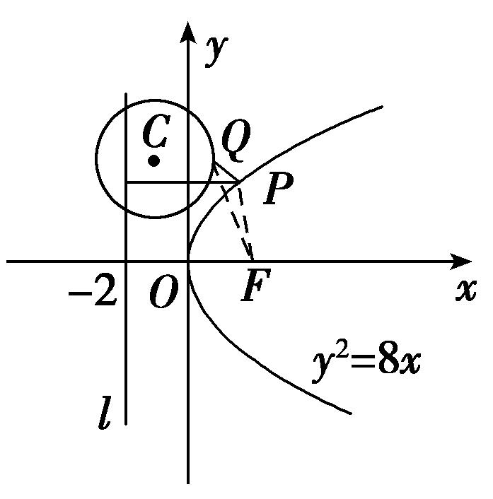

17．定长为4的线段<em>MN</em>的两端点在抛物线<em>y</em>2＝<em>x</em>上移动，设点<em>P</em>为线段<em>MN</em>的中点，则点<em>P</em>到<em>y</em>轴距离

的最小值为(　　)

A．1　　　　　　　　B．　　　　　　　　C．2　　　　　　　　D．5

17．<strong>答案</strong>　B　<strong>解析</strong>　设<em>M</em>(<em>x</em>1，<em>y</em>1)，<em>N</em>(<em>x</em>2，<em>y</em>2)，抛物线<em>y</em>2＝<em>x</em>的焦点为<em>F</em>，抛物线的准线为<em>x</em>＝－，

所求的距离*d*＝＝－＝－，所以－≥－＝(两边之和大于第三边且*M*，*N*，*F*三点共线时取等号)．

18．已知抛物线方程为<em>y</em>2＝－4<em>x</em>，直线<em>l</em>的方程为2<em>x</em>＋<em>y</em>－4＝0，在抛物线上有一动点<em>A</em>，点<em>A</em>到<em>y</em>轴的距

离为*m*，到直线*l*的距离为*n*，则*m*＋*n*的最小值为\_\_\_\_\_\_\_\_．

18．答案　－1　解析　如图，过*A*作*AH*⊥*l*，*AN*垂直于抛物线的准线，则|*AH*|＋|*AN*|＝*m*＋*n*＋1，连

接*AF*，则|*AF*|＋|*AH*|＝*m*＋*n*＋1，由平面几何知识，知当*A*，*F*，*H*三点共线时，|*AF*|＋|*AH*|＝*m*＋*n*＋1取得最小值，最小值为*F*到直线*l*的距离，即＝，即*m*＋*n*的最小值为－1．

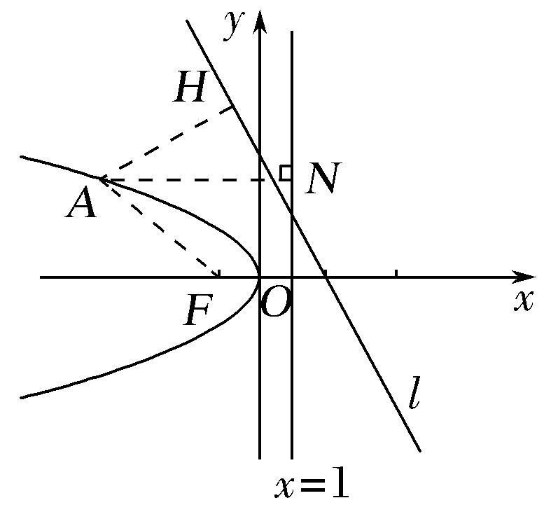

19．已知点<em>F</em>是抛物线<em>C</em>：<em>y</em>2＝4<em>x</em>的焦点，点<em>M</em>为抛物线<em>C</em>上任意一点，过点<em>M</em>向圆(<em>x</em>－1)2＋<em>y</em>2＝作切

线，切点分别为*A*，*B*，则四边形*AFBM*面积的最小值为\_\_\_\_\_\_\_\_．

19．**答案　　解析**　如图所示：

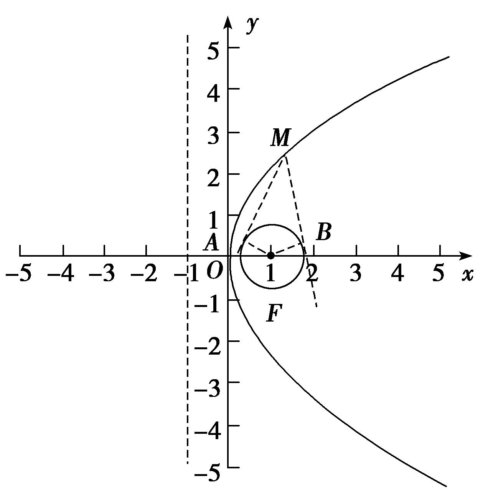

圆的圆心与抛物线的焦点重合，若四边形<em>AFBM</em>的面积最小，则<em>MF</em>最小，即<em>M</em>距离准线最近，故满足条件时，<em>M</em>与原点重合，此时<em>MF</em>＝1，<em>BF</em>＝<em>BM</em>＝，此时四边形<em>AFBM</em>面积<em>S</em>＝2<em>S</em>△<em>BMF</em>＝2×××＝，故答案为．

20．已知抛物线<em>C</em>：<em>x</em>2＝8<em>y</em>的焦点为<em>F</em>，动点<em>Q</em>在<em>C</em>上，圆<em>Q</em>的半径为1，过点<em>F</em>的直线与圆<em>Q</em>切于点<em>P</em>，

则·的最小值为\_\_\_\_\_\_\_\_．

20．<strong>答案</strong>　3　<strong>解析</strong>　如图，在Rt△<em>QPF</em>中，·＝||||cos∠<em>PFQ</em>＝||||＝||2＝||2－1．由

抛物线的定义知：||＝<em>d</em>(<em>d</em>为点<em>Q</em>到准线的距离)，易知，抛物线的顶点到准线的距离最短，∴||min＝2，∴·的最小值为3．

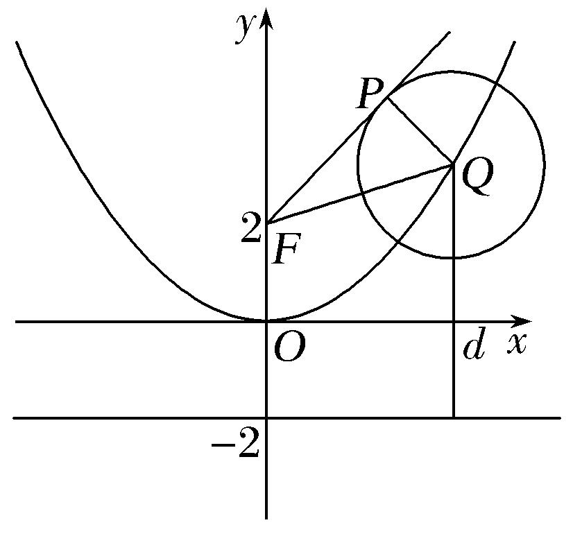

