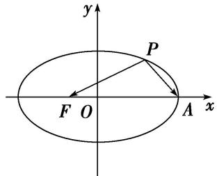
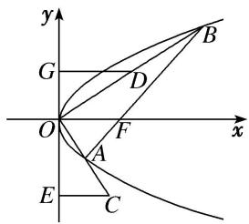
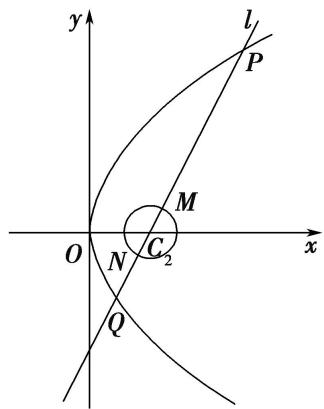

# 专题11 代数法解决的最值模型

# 【例题选讲】

[例 2] （7） 设 $F_{1}$ ， $F_{2}$ 是椭圆 E: $\frac{x^{2}}{25} + \frac{y^{2}}{16} = 1$ 的左右焦点，P 是椭圆 E 上的点，则 $|PF_{1}| \cdot |PF_{2}|$ 的最小值是 \_\_\_\_.  
（8）如图，焦点在 $x$ 轴上的椭圆 $\frac{x^2}{4} +\frac{y^2}{b^2} = 1$ 的离心率 $e = \frac{1}{2}$ ， $F$ ， $A$ 分别是椭圆的一个焦点和顶点， $P$ 是椭圆上任意一点，则 $\overrightarrow{PF}\cdot \overrightarrow{PA}$ 的最大值为

  
（9）在等腰梯形 $ABCD$ 中， $AB \parallel CD$ ，且 $|AB| = 2$ ， $|AD| = 1$ ， $|CD| = 2x$ ，其中 $x \in (0, 1)$ ，以 $A$ ， $B$ 为焦点且过点 $D$ 的双曲线的离心率为 $e_1$ ，以 $C$ ， $D$ 为焦点且过点 $A$ 的椭圆的离心率为 $e_2$ ，若对任意 $x \in (0, 1)$ ，不等式 $t < e_1 + e_2$ 恒成立，则 $t$ 的最大值为（）

A. $\sqrt{3}$

B. $\sqrt{5}$

C. 2

D. $\sqrt{2}$  
（10）已知 $F_{1}$ , $F_{2}$ 分别是双曲线 $\frac{x^{2}}{a^{2}} - \frac{y^{2}}{b^{2}} = 1 (a > 0, b > 0)$ 的左、右焦点，且 $|F_{1}F_{2}| = 2$ ，若 $P$ 是该双曲线右支上的一点，且满足 $|PF_{1}| = 2|PF_{2}|$ ，则 $\triangle PF_{1}F_{2}$ 面积的最大值是（）

A. 1

B. $\frac{4}{3}$

C. $\frac{5}{3}$

D. 2  
（11）已知双曲线 $\frac{x^{2}}{a^{2}}-\frac{y^{2}}{b^{2}}=1(a>0,\ b>0)$ 的左、右焦点分别为 $F_{1}$ ， $F_{2}$ ，过 $F_{1}$ 且垂直于x轴的直线与该双曲线的左支交于A，B两点， $AF_{2}$ ， $BF_{2}$ 分别交y轴于P，Q两点，若 $\triangle PQF_{2}$ 的周长为16，则 $\frac{b}{a+1}$ 的最大值为\_\_\_\_.  
（12）设 O 为坐标原点，P 是以 F 为焦点的抛物线 $y^{2}=2px(p>0)$ 上任意一点，M 是线段 PF 上的点，且 $|PM|=2|MF|$ ，则直线 OM 的斜率的最大值为()

A. $\frac{\sqrt{3}}{3}$

B. $\frac{2}{3}$

C. $\frac{\sqrt{2}}{2}$

D. 1  
（13）抛物线 $y^{2} = 8x$ 的焦点为 $F$ ，设 $A(x_{1},y_{1})$ ， $B(x_{2},y_{2})$ 是抛物线上的两个动点，若 $x_{1} + x_{2} + 4 = \frac{2\sqrt{3}}{3}|AB|$ ，则 $\angle AFB$ 的最大值为（）

A. $\frac{\pi}{3}$

B. $\frac{3\pi}{4}$

C. $\frac{5\pi}{6}$

D. $\frac{2\pi}{3}$  
（14）(2017·全国 I)已知 $F$ 为抛物线 $C: y^2 = 4x$ 的焦点，过 $F$ 作两条互相垂直的直线 $l_1, l_2$ ，直线 $l_1$ 与 $C$ 交于 $A, B$ 两点，直线 $l_2$ 与 $C$ 交于 $D, E$ 两点，则 $|AB| + |DE|$ 的最小值为（）

A. 16

B. 14

C. 12

D. 10  
（15）在平面直角坐标系 $xOy$ 中，已知抛物线 $C: x^{2} = 4y$ ，点 $P$ 是 $C$ 的准线 $l$ 上的动点，过点 $P$ 作 $C$ 的两条切线，切点分别为 A, B，则 $\triangle AOB$ 面积的最小值为()

A. $\sqrt{2}$

B. 2

C. $2\sqrt{2}$

D. 4  
（16）已知 F 为抛物线 $y^{2}=x$ 的焦点，点 A, B 在该抛物线上，且位于 x 轴的两侧， $\overrightarrow{OA} \cdot \overrightarrow{OB} = 2$ (其中 O 为坐标原点)，则 $\triangle AFO$ 与 $\triangle BFO$ 面积之和的最小值是 \_\_\_\_.

# 【对点训练】

21. 已知 $F_{1}, F_{2}$ 分别为椭圆 $C: \frac{x^{2}}{9} + \frac{y^{2}}{8} = 1$ 的左、右焦点，点 $E$ 是椭圆 $C$ 上的动点，则 $\vec{EF_1} \cdot \vec{EF_2}$ 的最大值、最小值分别为（）

A. 9, 7

B. 8, 7

C. 9, 8

D. 17, 8

22. (2018·浙江)已知点 $P(0, 1)$ , 椭圆 $\frac{x^2}{4} + y^2 = m (m > 1)$ 上两点 $A$ , $B$ 满足 $\overrightarrow{AP} = 2\overrightarrow{PB}$ , 则当 $m =$ \_\_\_\_时, 点 $B$ 横坐标的绝对值最大.

23. 已知点 $F_{1}$ , $F_{2}$ 分别是椭圆 $\frac{x^{2}}{25} + \frac{y^{2}}{16} = 1$ 的左、右焦点, 点 $M$ 是该椭圆上的一个动点, 那么 $|\overrightarrow{MF_1} + \overrightarrow{MF_2}|$ 的最小值是( )

A. 4

B. 6

C. 8

D. 10

24. 已知点 A 在椭圆 $\frac{x^{2}}{25} + \frac{y^{2}}{9} = 1$ 上，点 P 满足 $\overrightarrow{AP} = (\lambda - 1)\overrightarrow{OA} (\lambda \in \mathbb{R})(O$ 是坐标原点)，且 $\overrightarrow{OA} \cdot \overrightarrow{OP} = 72$ ，则线段 OP 在 x 轴上的投影长度的最大值为 \_\_\_\_.

25. 椭圆 $\frac{x^{2}}{4}+\frac{y^{2}}{3}=1$ 的左、右焦点分别为 $F_{1}$ ， $F_{2}$ ，过椭圆的右焦点 $F_{2}$ 作一条直线l交椭圆于P，Q两点，则 $\triangle F_{1}PQ$ 的内切圆面积的最大值是\_\_\_\_。

26. 已知直线 $l: y = 2x + b$ 被抛物线 $C: y^{2} = 2px (p > 0)$ 截得的弦长为 5，直线 $l$ 经过 $C$ 的焦点， $M$ 为 $C$ 上的一个动点，设点 $N$ 的坐标为 $(3, 0)$ ，则 $MN$ 的最小值为 \_\_\_\_.

27. 如图, 抛物线 $y^{2} = 4x$ 的一条弦 $AB$ 经过焦点 $F$ , 取线段 $OB$ 的中点 $D$ , 延长 $OA$ 至点 $C$ , 使 $|OA| = |AC|$ , 过点 $C$ , $D$ 作 $y$ 轴的垂线, 垂足分别为点 $E$ , $G$ , 则 $|EG|$ 的最小值为 \_\_\_\_.

28. 已知抛物线 $y^{2} = 4x$ ，过焦点 $F$ 的直线与抛物线交于 $A, B$ 两点，过 $A, B$ 分别作 $x$ 轴， $y$ 轴垂线，垂足分别为 $C, D$ ，则 $|AC| + |BD|$ 的最小值为 \_\_\_\_.

29. 已知抛物线 $C: y^{2} = 8ax (a > 0)$ 的焦点 $F$ 与双曲线 $D: \frac{x^{2}}{a + 2} - \frac{y^{2}}{a} = 1 (a > 0)$ 的焦点重合，过点 $F$ 的直线与抛物线 $C$ 交于 $A, B$ 两点，则 $|AF| + 2|BF|$ 的最小值为（）

A. $3 + 4\sqrt{2}$

B. $6+4\sqrt{2}$

C. 7

D. 10

30. 已知 $F$ 为抛物线 $C: y^{2} = 2x$ 的焦点，过 $F$ 作两条互相垂直的直线 $l_{1}, l_{2}$ ，直线 $l_{1}$ 与 $C$ 交于 $A, B$ 两点，直线 $l_{2}$ 与 $C$ 交于 $D, E$ 两点，则 $|AB| + |DE|$ 的最小值为 \_\_\_\_.

31. 如图，已知抛物线 $C_1$ 的顶点在坐标原点，焦点在 $x$ 轴上，且过点(2, 4)，圆 $C_2: x^2 + y^2 - 4x + 3 = 0$ 过圆心 $C_{2}$ 的直线 l 与抛物线和圆 $C_{2}$ 分别交于点 P, Q 和 M, N, 则 $|PN| + 4|QM|$ 的最小值为()

A. 23

B. 42

C. 12

D. 52

32. 抛物线 $y^{2}=8x$ 的焦点为 F，设 A, B 是抛物线上的两个动点， $|AF|+|BF|=\frac{2\sqrt{3}}{3}|AB|$ ，则 $\angle AFB$ 的最大值为()

A. $\frac{\pi}{3}$

B. $\frac{3\pi}{4}$

C. $\frac{5\pi}{6}$

D. $\frac{2\pi}{3}$

33. 已知抛物线 $C: y = ax^2$ 的焦点坐标为 $(0, 1)$ , 点 $P(0, 3)$ , 过点 $P$ 作直线 $l$ 交抛物线 $C$ 于 $A$ , $B$ 两点,过点 $A$ , $B$ 分别作抛物线 $C$ 的切线, 两切线交于点 $Q$ , 则 $\triangle QAB$ 面积的最小值为 ( )

A. $6 \sqrt{2}$

B. $6\sqrt{3}$

C. $12\sqrt{3}$

D. $12\sqrt{2}$

