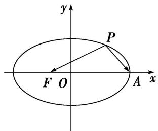
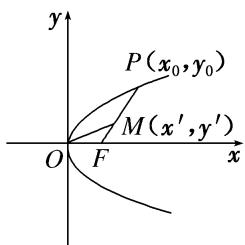
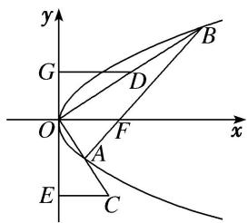
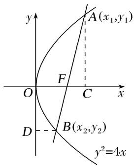
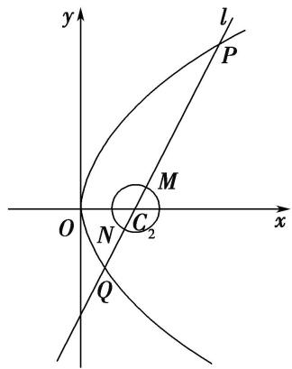

# 专题11 代数法解决的最值模型

# 【例题选讲】

[例 2] （7） 设 $F_{1}$ ， $F_{2}$ 是椭圆 E: $\frac{x^{2}}{25} + \frac{y^{2}}{16} = 1$ 的左右焦点，P 是椭圆 E 上的点，则 $|PF_{1}| \cdot |PF_{2}|$ 的最小值是 \_\_\_\_.
答案 16 解析 由椭圆方程可知 $a = 5, c = 3$ ，根据椭圆的定义，有 $|PF_2| = 2a - |PF_1| = 10 - |PF_1|$ ，故 $|PF_1| \cdot |PF_2| = |PF_1| \cdot (10 - |PF_1|)$ ，由于 $|PF_1| \in [a - c, a + c] = [2, 8]$ 注意到二次函数 $y = x(10 - x)$ 的对称轴为 $x = 5$ ，故当 $x = 2, x = 8$ 时，都是函数的最小值，即最小值为 $2 \times 8 = 16$ .  
（8）如图，焦点在 x 轴上的椭圆 $\frac{x^{2}}{4} + \frac{y^{2}}{b^{2}} = 1$ 的离心率 $e = \frac{1}{2}$ ，F，A 分别是椭圆的一个焦点和顶点，P 是椭圆上任意一点，则 $\overrightarrow{PF} \cdot \overrightarrow{PA}$ 的最大值为 \_\_\_\_.

答案 4 解析 设 P 点坐标为 $(x_{0}, y_{0})$ . 由题意知 a=2，因为 $e=\frac{c}{a}=\frac{1}{2}$ ，所以 c=1， $b^{2}=a^{2}-c^{2}=3$ . 故椭圆方程为 $\frac{x^{2}}{4}+\frac{y^{2}}{3}=1$ . 所以 $-2\leqslant x_{0}\leqslant2$ ， $-\sqrt{3}\leqslant y_{0}\leqslant\sqrt{3}$ . 因为 $F(-1,0)$ ， $A(2,0)$ ， $\overrightarrow{PF}=(-1-x_{0},-y_{0})$ ， $\overrightarrow{PA}=(2-x_{0},-y_{0})$ ，所以 $\overrightarrow{PF}\cdot\overrightarrow{PA}=x_{0}^{2}-x_{0}-2+y_{0}^{2}=\frac{1}{4}x_{0}^{2}-x_{0}+1=\frac{1}{4}(x_{0}-2)^{2}$ . 即当 $x_{0}=-2$ 时， $\overrightarrow{PF}\cdot\overrightarrow{PA}$ 取得最大值 4.  
（9）在等腰梯形 $ABCD$ 中， $AB \parallel CD$ ，且 $|AB| = 2$ ， $|AD| = 1$ ， $|CD| = 2x$ ，其中 $x \in (0, 1)$ ，以 $A$ ， $B$ 为焦点且过点 $D$ 的双曲线的离心率为 $e_1$ ，以 $C$ ， $D$ 为焦点且过点 $A$ 的椭圆的离心率为 $e_2$ ，若对任意 $x \in (0, 1)$ ，不等式 $t < e_1 + e_2$ 恒成立，则 $t$ 的最大值为（）

A. $\sqrt{3}$

B. $\sqrt{5}$

C. 2

D. $\sqrt{2}$
答案 B 解析 由平面几何知识可得 $|BD|=|AC|=\sqrt{1+4x}$ ，所以 $e_{1}=\frac{2}{\sqrt{1+4x}-1}$ ， $e_{2}=\frac{2x}{\sqrt{1+4x}+1}$ ，所以 $e_{1}e_{2}=1$ 。因为 $e_{1}+e_{2}=e_{1}+\frac{1}{e_{1}}=\frac{2}{\sqrt{1+4x}-1}+\frac{\sqrt{1+4x}-1}{2}$ 在 $x\in(0,1)$ 上单调递减，所以 $e_{1}+e_{2}>\frac{2}{\sqrt{1+4}-1}+\frac{\sqrt{1+4}-1}{2}=\sqrt{5}$ 。因为对任意 $x\in(0,1)$ ，不等式 $t<e_{1}+e_{2}$ 恒成立，所以 $t\leqslant\sqrt{5}$ ，即t的最大值为 $\sqrt{5}$ 。  
（10）已知 $F_{1}$ ， $F_{2}$ 分别是双曲线 $\frac{x^2}{a^2} - \frac{y^2}{b^2} = 1 (a > 0, b > 0)$ 的左、右焦点，且 $|F_{1}F_{2}| = 2$ ，若 $P$ 是该双曲线右支上的一点，且满足 $|PF_{1}| = 2|PF_{2}|$ ，则 $\triangle PF_{1}F_{2}$ 面积的最大值是（）

A. 1

B. $\frac{4}{3}$

C. $\frac{5}{3}$

D. 2
答案 B 解析 $\because\left\{\begin{aligned}|PF_{1}|&=2|PF_{2}|,\\ |PF_{1}|-|PF_{2}|&=2a,\end{aligned}\right.$ $\therefore|PF_{1}|=4a,\quad|PF_{2}|=2a,\quad$ 设 $\angle F_{1}PF_{2}=\theta,\quad\therefore\cos\theta=$
$\frac {1 6 a ^ {2} + 4 a ^ {2} - 4}{2 \times 4 a \times 2 a} = \frac {5 a ^ {2} - 1}{4 a ^ {2}}, \quad \therefore S ^ {2} \triangle P F _ {1} F _ {2} = (\frac {1}{2} \times 4 a \times 2 a \times \sin \theta) ^ {2} = 1 6 a ^ {4} (1 - \frac {2 5 a ^ {4} - 1 0 a ^ {2} + 1}{1 6 a ^ {4}}) = \frac {1 6}{9} - 9 (a ^ {2} - \frac {5}{9}) ^ {2} \leqslant \frac {1 6}{9},$
当且仅当 $a^{2}=\frac{5}{9}$ 时，等号成立，故 $S\triangle PF_{1}F_{2}$ 的最大值是 $\frac{4}{3}$ . 故选 B.  
（11）已知双曲线 $\frac{x^{2}}{a^{2}}-\frac{y^{2}}{b^{2}}=1(a>0,\ b>0)$ 的左、右焦点分别为 $F_{1}$ ， $F_{2}$ ，过 $F_{1}$ 且垂直于x轴的直线与该双曲线的左支交于A，B两点， $AF_{2}$ ， $BF_{2}$ 分别交y轴于P，Q两点，若 $\triangle PQF_{2}$ 的周长为16，则 $\frac{b}{a+1}$ 的最大值为\_\_\_\_.
答案 $\frac{4}{3}$ 解析 由题意，得 $\triangle ABF_{2}$ 的周长为32， $\therefore |AF_{2}| + |BF_{2}| + |AB| = 32$ ， $\because |AF_{2}| + |BF_{2}| - |AB| = 4a$ ， $|AB| = \frac{2b^{2}}{a}$ ， $\therefore \frac{4b^{2}}{a} = 32 - 4a$ ， $\therefore b = \sqrt{8a - a^{2}} (0 < a < 8)$ ， $\therefore \frac{b}{a + 1} = \frac{\sqrt{8a - a^{2}}}{a + 1}$ ，令 $t = a + 1 (1 < t < 9)$ ，则 $\frac{b}{a + 1} = \sqrt{\frac{8(t - 1) - (t - 1)^{2}}{t^{2}}} = \sqrt{\frac{10t - 9 - t^{2}}{t^{2}}} = \sqrt{-\frac{9}{t^{2}} + \frac{10}{t} - 1}$ ，令 $m = \frac{1}{t} \left( \frac{1}{9} < m < 1 \right)$ ，则 $\frac{b}{a + 1} = \sqrt{-9m^{2} + 10m - 1}$ ，当 $m = -\frac{10}{2 \times (-9)} = \frac{5}{9}$ ，即 $a = \frac{4}{5}$ ， $b = \frac{12}{5}$ 时， $\frac{b}{a + 1}$ 的最大值为 $\sqrt{-9 \times \frac{25}{81} + \frac{50}{9} - 1} = \frac{4}{3}$ .  
（12）设 O 为坐标原点，P 是以 F 为焦点的抛物线 $y^{2}=2px(p>0)$ 上任意一点，M 是线段 PF 上的点，且 $|PM|=2|MF|$ ，则直线 OM 的斜率的最大值为()

A. $\frac{\sqrt{3}}{3}$

B. $\frac{2}{3}$

C. $\frac{\sqrt{2}}{2}$

D. 1
答案 C 解析 如图所示，设 $P(x_{0}, y_{0})(y_{0}>0)$ ，则 $y_{0}^{2}=2px_{0}$ ，即 $x_{0}=\frac{y_{0}^{2}}{2p}$ 。设 $M(x', y')$ ，由 $\overrightarrow{PM}=2\overrightarrow{MF}$ ，得 $\left\{\begin{aligned}x'-x_{0}&=2\left(\frac{p}{2}-x'\right),\\ y'-y_{0}&=2(0-y')\end{aligned}\right.$ 化简可得 $\left\{\begin{aligned}x' &= \frac{p+x_{0}}{3},\\ y' &= \frac{y_{0}}{3}\end{aligned}\right.$ ∴ 直线 OM 的斜率为 $k=\frac{\frac{y_{0}}{3}}{\frac{p+x_{0}}{3}}=\frac{y_{0}}{p+\frac{y_{0}^{2}}{2p}}=\frac{2p}{\frac{2p^{2}}{y_{0}}+y_{0}}\leq\frac{2p}{2\sqrt{2p^{2}}}$ $=\frac{\sqrt{2}}{2}$ （当且仅当 $y_{0}=\sqrt{2}p$ 时取等号），故直线 OM 的斜率的最大值为 $\frac{\sqrt{2}}{2}$ .

  
（13）抛物线 $y^{2} = 8x$ 的焦点为 $F$ ，设 $A(x_{1},y_{1})$ ， $B(x_{2},y_{2})$ 是抛物线上的两个动点，若 $x_{1} + x_{2} + 4 = \frac{2\sqrt{3}}{3}|AB|$ ，则 $\angle AFB$ 的最大值为（）

A. $\frac{\pi}{3}$

B. $\frac{3\pi}{4}$

C. $\frac{5\pi}{6}$

D. $\frac{2\pi}{3}$
答案 D 解析 由抛物线的定义可得 $|AF|=x_{1}+2,\quad|BF|=x_{2}+2$ ，又 $x_{1}+x_{2}+4=\frac{2\sqrt{3}}{3}|AB|$ ，得 $|AF|+|BF|$
$= \frac{2\sqrt{3}}{3},|AB|$ ，所以 $|AB| = \frac{\sqrt{3}}{2} (|AF| + |BF|)$ .所以 $\cos \angle AFB = \frac{|AF|^2 + |BF|^2 - |AB|^2}{2|AF|\cdot|BF|} = \frac{|AF|^2 + |BF|^2 - \left[\frac{\sqrt{3}}{2}(|AF| + |BF|)\right]_2}{2|AF|\cdot|BF|}$ $= \frac{\frac{1}{4}|AF|^2 + \frac{1}{4}|BF|^2 - \frac{3}{2}|AF|\cdot|BF|}{2|AF|\cdot|BF|} = \frac{1}{8}\left(\frac{|AF|}{|BF|} +\frac{|BF|}{|AF|}\right) - \frac{3}{4} >\frac{1}{8}\times 2\sqrt{\frac{|AF|}{|BF|}\cdot\frac{|BF|}{|AF|}} -\frac{3}{4} = -\frac{1}{2},$ 而 $0 <   \angle AFB <   \pi$ ，所以 $\angle AFB$ 的最大值为 $\frac{2\pi}{3}$  
（14）(2017·全国 I)已知 F 为抛物线 C: $y^{2}=4x$ 的焦点，过 F 作两条互相垂直的直线 $l_{1}$ ， $l_{2}$ ，直线 $l_{1}$ 与 C 交于 A，B 两点，直线 $l_{2}$ 与 C 交于 D，E 两点，则 $|AB|+|DE|$ 的最小值为()

A. 16

B. 14

C. 12

D. 10
答案 A 解析 因为 F 为 $y^{2}=4x$ 的焦点，所以 $F(1,0)$ . 由题意直线 $l_{1}$ ， $l_{2}$ 的斜率均存在，且不为 0，设 $l_{1}$ 的斜率为 k，则 $l_{2}$ 的斜率为 $-\frac{1}{k}$ ，故直线 $l_{1}, l_{2}$ 的方程分别为 $y=k(x-1), y=-\frac{1}{k}(x-1)$ . 由 $\left\{\begin{aligned}y &= k(x-1), \\ y^2 &= 4x,\end{aligned}\right.$ 得 $k^{2}x^{2}-(2k^{2}+4)x+k^{2}=0$ . 设 $A(x_{1},y_{1}), B(x_{2},y_{2})$ ，则 $x_{1}+x_{2}=\frac{2k^{2}+4}{k^{2}}, x_{1}x_{2}=1$ ，所以 $|AB|=\sqrt{1+k^{2}}\cdot|x_{1}-x_{2}|=\sqrt{1+k^{2}}\cdot\sqrt{(x_{1}+x_{2})^{2}-4x_{1}x_{2}}=\sqrt{1+k^{2}}\cdot\sqrt{\left(\frac{2k^{2}+4}{k^{2}}\right)^{2}-4}=\frac{4(1+k^{2})}{k^{2}}$ . 同理可得 $|DE|=4(1+k^{2})$ . 所以 $|AB|+|DE|=\frac{4(1+k^{2})}{k^{2}}+4(1+k^{2})=4\left(\frac{1}{k^{2}}+1+1+k^{2}\right)=8+4\left(k^{2}+\frac{1}{k^{2}}\right)\geqslant8+4\times2=16$ ，当且仅当 $k^{2}=\frac{1}{k^{2}}$ ，即 $k=\pm1$ 时，取得等号．故选 A.  
（15）在平面直角坐标系 $xOy$ 中，已知抛物线 $C: x^2 = 4y$ ，点 $P$ 是 $C$ 的准线 $l$ 上的动点，过点 $P$ 作 $C$ 的两条切线，切点分别为 $A, B$ ，则 $\triangle AOB$ 面积的最小值为（）

A. $\sqrt{2}$

B. 2

C. $2\sqrt{2}$

D. 4
答案 B 解析 设 $P(x_{0}, -1)$ , $A(x_{1}, y_{1})$ , $B(x_{2}, y_{2})$ ，又 A, B 在抛物线上，所以 $y_{1}=\frac{x_{1}^{2}}{4}$ , $y_{2}=\frac{x_{2}^{2}}{4}$ . 因为 $y'=\frac{x}{2}$ ，则过点 A, B 的切线分别为 $y-\frac{x_{1}^{2}}{4}=\frac{x_{1}}{2}(x-x_{1})$ , $y-\frac{x_{2}^{2}}{4}=\frac{x_{2}}{2}(x-x_{2})$ 均过点 $P(x_{0}, -1)$ ，则 $-1-\frac{x_{1}^{2}}{4}=\frac{x_{1}}{2}(x_{0}-x_{1})$ , $-1-\frac{x_{2}^{2}}{4}=\frac{x_{2}}{2}(x_{0}-x_{2})$ ，即 $x_{1}$ , $x_{2}$ 是方程 $-1-\frac{x^{2}}{4}=\frac{x}{2}(x_{0}-x)$ 的两根，则 $x_{1}+x_{2}=2x_{0}$ , $x_{1}x_{2}=-4$ ，设直线 AB 的方程为 $y=kx+b$ ，联立 $\left\{\begin{aligned}x^{2}&=4y,\\ y&=kx+b,\end{aligned}\right.$ 得 $x^{2}-4kx-4b=0$ ，则 $x_{1}x_{2}=-4b=-4$ ，即 b=1， $|AB|=\sqrt{1+k^{2}}|x_{1}-x_{2}|=\sqrt{1+k^{2}}\cdot\sqrt{(x_{1}+x_{2})^{2}-4x_{1}x_{2}}=\sqrt{1+k^{2}}\cdot\sqrt{4x_{0}^{2}+16}$ ，O 到直线 AB 的距离 $d=\frac{b}{\sqrt{k^{2}+1}}$ ，则 $S_{\triangle AOB}=\frac{1}{2}|AB|d=\sqrt{x_{0}^{2}+4}\geqslant2$ ，即 $\triangle AOB$ 的面积的最小值为 2，故选 B.  
（16）已知 F 为抛物线 $y^{2}=x$ 的焦点，点 A, B 在该抛物线上，且位于 x 轴的两侧， $\overrightarrow{OA} \cdot \overrightarrow{OB} = 2$ (其中 O 为坐标原点)，则 $\triangle AFO$ 与 $\triangle BFO$ 面积之和的最小值是 \_\_\_\_.
答案 $\frac{\sqrt{2}}{4}$ 解析 法一：设直线 $l_{AB}$ ： $x = my + t$ ， $A(x_{1},y_{1})$ ， $B(x_{2},y_{2})$ ，联立 $\left\{ \begin{array}{l} y^{2} = x, \\ x = my + t \end{array} \right.\Rightarrow y^{2} - my - t$ $= 0$ ， $\therefore y_{1} + y_{2} = m$ ， $y_{1}y_{2} = -t$ ， $\because$ 点 $A$ ， $B$ 位于 $x$ 轴两侧， $\therefore y_{1}y_{2} = -t <   0$ ， $\therefore t > 0$ 又 $\overrightarrow{OA}\cdot \overrightarrow{OB} = x_1x_2 + y_1y_2$ $= (y_{1}y_{2})^{2} + y_{1}y_{2} = t^{2} - t = 2$ ，解得 $t = 2$ 或 $t = -1$ （舍去）. $\therefore S_{\triangle AFO} + S_{\triangle BFO} = \frac{1}{2} |OF| \cdot |y_1 - y_2| = \frac{1}{8} |y_1 - y_2| = \frac{\sqrt{m^2 + 8}}{8} \geqslant \frac{\sqrt{2}}{4}, \therefore \triangle AFO$ 与 $\triangle BFO$ 面积之和的最小值为 $\frac{\sqrt{2}}{4}$ .

法二：设 $A(x_{1},y_{1}),B(x_{2},y_{2})$ $\because \overrightarrow{OA}\cdot \overrightarrow{OB} = x_1x_2 + y_1y_2 = (y_1y_2)^2 +y_1y_2 = 2,\therefore y_1y_2 = -2$ 或 $y_{1}y_{2} = 1$ （舍去). $\therefore S_{\triangle AFO} + S_{\triangle BFO} = \frac{1}{8}|y_1 - y_2| = \frac{1}{8}\sqrt{y_1^2 + y_2^2 - 2y_1y_2} = \frac{1}{8}\sqrt{|y_1|^2 + |y_2|^2 + 4}\geqslant \frac{1}{8}\sqrt{2|y_1y_2| + 4} = \frac{\sqrt{2}}{4}.$

# 【对点训练】

21. 已知 $F_{1}, F_{2}$ 分别为椭圆 $C: \frac{x^{2}}{9} + \frac{y^{2}}{8} = 1$ 的左、右焦点，点 $E$ 是椭圆 $C$ 上的动点，则 $\overrightarrow{EF_1} \cdot \overrightarrow{EF_2}$ 的最大值、最小值分别为（）

A. 9, 7

B. 8, 7

C. 9, 8

D. 17, 8

21. 答案 B 解析 由题意可知椭圆的左、右焦点坐标分别为 $F_{1}(-1,0), F_{2}(1,0)$ ，设 $E(x,y)(-3 \leqslant x \leqslant 3)$ ，则 $\vec{EF}_{1} = (-1 - x, -y)$ ， $\vec{EF}_{2} = (1 - x, -y)$ ，所以 $\vec{EF}_{1} \cdot \vec{EF}_{2} = x^{2} - 1 + y^{2} = x^{2} - 1 + 8 - \frac{8}{9}x^{2} = \frac{x^{2}}{9} + 7$ ，所以当 $x = 0$ 时， $\vec{EF}_{1} \cdot \vec{EF}_{2}$ 有最小值 7，当 $x = \pm 3$ 时， $\vec{EF}_{1} \cdot \vec{EF}_{2}$ 有最大值 8，故选 B.

22. (2018·浙江)已知点 $P(0, 1)$ , 椭圆 $\frac{x^2}{4} + y^2 = m (m > 1)$ 上两点 $A$ , $B$ 满足 $\overrightarrow{AP} = 2\overrightarrow{PB}$ , 则当 $m =$ \_\_\_\_时, 点 $B$ 横坐标的绝对值最大.

22. 答案 5 解析 设 $A(x_{1}, y_{1}), B(x_{2}, y_{2})$ ，由 $\overrightarrow{AP} = 2\overrightarrow{PB}$ ，得 $\left\{ \begin{array}{l} -x_{1} = 2x_{2}, \\ 1 - y_{1} = 2(y_{2} - 1), \end{array} \right.$ 即 $x_{1} = -2x_{2}, y_{1} = 3$ $-2y_{2}$ . 因为点 $A, B$ 在椭圆上，所以 $\left\{ \begin{array}{l} \frac{4x_2^2}{4} + (3 - 2y_2)^2 = m, \\ \frac{x_2^2}{4} + y_2^2 = m, \end{array} \right.$ 得 $y_{2} = \frac{1}{4}m + \frac{3}{4}$ ，所以 $x_{2}^{2} = m - (3 - 2y_{2})^{2} = -\frac{1}{4}m^{2}$ $+\frac{5}{2}m - \frac{9}{4} = -\frac{1}{4}(m - 5)^{2} + 4 \leqslant 4$ ，所以当 $m = 5$ 时，点 $B$ 横坐标的绝对值最大，最大值为 2.

23. 已知点 $F_{1}$ , $F_{2}$ 分别是椭圆 $\frac{x^{2}}{25} + \frac{y^{2}}{16} = 1$ 的左、右焦点, 点 $M$ 是该椭圆上的一个动点, 那么 $|\overrightarrow{MF_1} + \overrightarrow{MF_2}|$ 的最小值是( )

A. 4

B. 6

C. 8

D. 10

23. 答案 C 解析 设 $M(x_{0}, y_{0})$ , $F_{1}(-3, 0)$ , $F_{2}(3, 0)$ . 则 $\overrightarrow{MF_{1}}=(-3-x_{0}, -y_{0})$ , $\overrightarrow{MF_{2}}=(3-x_{0}, -y_{0})$ , 所以 $\overrightarrow{MF_{1}}+\overrightarrow{MF_{2}}=(-2x_{0}, -2y_{0})$ , $|\overrightarrow{MF_{1}}+\overrightarrow{MF_{2}}|=\sqrt{4x_{0}^{2}+4y_{0}^{2}}=\sqrt{4\times25\left(1-\frac{y_{0}^{2}}{16}\right)+4y_{0}^{2}}=\sqrt{100-\frac{9}{4}y_{0}^{2}}$ , 因为点 M 在椭圆上，所以 $0\leq y_{0}^{2}\leq16$ ，所以当 $y_{0}^{2}=16$ 时， $|\overrightarrow{MF_{1}}+\overrightarrow{MF_{2}}|$ 取最小值为 8.

24. 已知点 A 在椭圆 $\frac{x^{2}}{25} + \frac{y^{2}}{9} = 1$ 上，点 P 满足 $\overrightarrow{AP} = (\lambda - 1)\overrightarrow{OA} (\lambda \in \mathbb{R})(O$ 是坐标原点)，且 $\overrightarrow{OA} \cdot \overrightarrow{OP} = 72$ ，则线段 OP 在 x 轴上的投影长度的最大值为 \_\_\_\_.

24. 答案 15 解析 因为 $\overrightarrow{AP} = (\lambda - 1)\overrightarrow{OA}$ ，所以 $\overrightarrow{OP} = \lambda \overrightarrow{OA}$ ，即 $O, A, P$ 三点共线，因为 $\overrightarrow{OA} \cdot \overrightarrow{OP} =$

72，所以 $\overrightarrow{OA} \cdot \overrightarrow{OP} = \lambda |\overrightarrow{OA}|^2 = 72$ ，设 $A(x, y)$ ， $OA$ 与 $x$ 轴正方向的夹角为 $\theta$ ，线段 $OP$ 在 $x$ 轴上的投影长度为 $|\overrightarrow{OP}||\cos \theta| = |\lambda||x| = \frac{72|x|}{|\overrightarrow{OA}|^2} = \frac{72|x|}{x^2 + y^2} = \frac{72}{\frac{16}{25}|x| + \frac{9}{|x|}} \leq \frac{72}{2\sqrt{\frac{16\times 9}{25}}} = 15$ ，当且仅当 $|x| = \frac{15}{4}$ 时取等号，故所求最大值为 15.

25. 椭圆 $\frac{x^2}{4} + \frac{y^2}{3} = 1$ 的左、右焦点分别为 $F_1, F_2$ , 过椭圆的右焦点 $F_2$ 作一条直线 $l$ 交椭圆于 $P, Q$ 两点, 则 $\triangle F_1PQ$ 的内切圆面积的最大值是 \_\_\_\_.

25. 答案 $\frac{9\pi}{16}$ 解析 由题意得，直线 $l$ 的斜率不为0，所以令直线 $l: x = my + 1$ ，与椭圆方程联立消去 $x$ 得 $(3m^2 + 4)y^2 + 6my - 9 = 0$ ，可设 $P(x_1, y_1), Q(x_2, y_2)$ ，则 $y_1 + y_2 = -\frac{6m}{3m^2 + 4}, y_1y_2 = -\frac{9}{3m^2 + 4}$ . 可知 $S_{\Delta F_1PQ} = \frac{1}{2}|F_1F_2||y_1 - y_2| = \sqrt{(y_1 + y_2)^2 - 4y_1y_2} = 12\sqrt{\frac{m^2 + 1}{(3m^2 + 4)^2}}$ ，又 $\frac{m^2 + 1}{(3m^2 + 4)^2} = \frac{1}{9(m^2 + 1) + \frac{1}{m^2 + 1} + 6} \leqslant \frac{1}{16}$ ，故 $S_{\Delta F_1PQ} \leqslant 3$ 。三角形周长与三角形内切圆的半径的积等于三角形面积的二倍，则内切圆半径 $r = \frac{2S_{\Delta F_1PQ}}{8} \leqslant \frac{3}{4}$ ，其面积最大值为 $\frac{9\pi}{16}$ 。

26. 已知直线 $l: y = 2x + b$ 被抛物线 $C: y^2 = 2px (p > 0)$ 截得的弦长为 5，直线 $l$ 经过 $C$ 的焦点， $M$ 为 $C$ 上的一个动点，设点 $N$ 的坐标为 $(3, 0)$ ，则 $MN$ 的最小值为 \_\_\_\_.

26. 答案 $2\sqrt{2}$ 解析 $\because\left\{\begin{aligned}&y=2x+b\\ &y^{2}=2px\end{aligned}\right.\Rightarrow4x^{2}+(4b-2p)x+b^{2}=0$ ，则 $5^{2}=(1+2^{2})\left[\left(\frac{2b-p}{2}\right)^{2}-4\times\frac{b_{2}}{4}\right]$ ，又直线 l 经过 C 的焦点，则 $-\frac{b}{2}=\frac{p}{2}$ ，∴ b=-p，由此解得 p=2，抛物线方程为 $y^{2}=4x$ ， $M(x_{0},y_{0})$ ，∴ $y_{0}^{2}=4x_{0}$ ，则 $|MN|^{2}=(x_{0}-3)^{2}+y_{0}^{2}=(x_{0}-3)^{2}+4x_{0}=(x_{0}-1)^{2}+8$ ，故当 $x_{0}=1$ 时， $|MN|_{\min}=2\sqrt{2}$ .

27. 如图, 抛物线 $y^{2} = 4x$ 的一条弦 $AB$ 经过焦点 $F$ , 取线段 $OB$ 的中点 $D$ , 延长 $OA$ 至点 $C$ , 使 $|OA| = |AC|$ , 过点 $C, D$ 作 $y$ 轴的垂线, 垂足分别为点 $E, G$ , 则 $|EG|$ 的最小值为 \_\_\_\_.

27. 答案 4 解析 设 $A(x_{1}, y_{1}), B(x_{2}, y_{2}), C(x_{3}, y_{3}), D(x_{4}, y_{4})$ ，则 $y_{3} = 2y_{1}$ ， $y_{4} = \frac{1}{2}y_{2}$ ， $|EG| = y_{4} - y_{3} = \frac{1}{2}y_{2} - 2y_{1}$ 。因为 $AB$ 为抛物线 $y^{2} = 4x$ 的焦点弦，所以 $y_{1}y_{2} = -4$ ，所以 $|EG| = \frac{1}{2}y_{2} - 2 \times \left(-\frac{4}{y_{2}}\right) = \frac{1}{2}y_{2} + \frac{8}{y_{2}} \geqslant 2\sqrt{\frac{1}{2}y_{2} \times \frac{8}{y_{2}}} = 4$ ，当且仅当 $\frac{1}{2}y_{2} = \frac{8}{y_{2}}$ ，即 $y_{2} = 4$ 时取等号，所以 $|EG|$ 的最小值为 4。

28. 已知抛物线 $y^{2} = 4x$ ，过焦点 $F$ 的直线与抛物线交于 $A, B$ 两点，过 $A, B$ 分别作 $x$ 轴， $y$ 轴垂线，垂足分别为 $C, D$ ，则 $|AC| + |BD|$ 的最小值为 \_\_\_\_.

28. 答案 3 解析 不妨设 $A(x_{1}, y_{1})(y_{1} > 0)$ , $B(x_{2}, y_{2})(y_{2} < 0)$ . 则 $|AC| + |BD| = x_{2} + y_{1} = \frac{y_{2}^{2}}{4} + y_{1}$ . 又 $y_{1}y_{2} = -p^{2} = -4$ . $\therefore |AC| + |BD| = \frac{y_{2}^{2}}{4} - \frac{4}{y_{2}} (y_{2} < 0)$ . 设 $g(x) = \frac{x^{2}}{4} - \frac{4}{x}$ , 在 $(- \infty, -2)$ 递减, 在 $(-2, 0)$ 递增. $\therefore$ 当 $x = -2$ , 即 $y_{2} = -2$ 时, $|AC| + |BD|$ 的最小值为 3.

29. 已知抛物线 $C: y^{2} = 8ax (a > 0)$ 的焦点 $F$ 与双曲线 $D: \frac{x^{2}}{a + 2} - \frac{y^{2}}{a} = 1 (a > 0)$ 的焦点重合，过点 $F$ 的直线与抛物线 $C$ 交于 $A, B$ 两点，则 $|AF| + 2|BF|$ 的最小值为（）

A. $3 + 4\sqrt{2}$

B. $6+4\sqrt{2}$

C. 7

D. 10

29. 答案 B 解析 由题意得抛物线 C 的焦点为 $F(2a, 0)$ ，则由 $2a = \sqrt{a + 2 + a}$ ，解得 a = 1，所以 $F(2, 0)$ ，抛物线 $C: y^{2} = 8x$ 。由题知，直线 AB 的斜率不为零，所以设其方程为 $x = my + 2, A\left(\frac{y_{1}^{2}}{8}, y_{1}\right), B\left(\frac{y_{2}^{2}}{8}, y_{2}\right)$ ，联立 $\left\{\begin{aligned} x &= my + 2, \\ y^{2} &= 8x \end{aligned}\right.$ 得 $y^{2} - 8my - 16 = 0$ ，所以 $y_{1}y_{2} = -16$ 。由抛物线的定义，得 $|AF| + 2|BF| = \frac{y_{1}^{2}}{8} + 2 + 2\left(\frac{y_{2}^{2}}{8} + 2\right) = 6 + \frac{y_{1}^{2} + 2y_{2}^{2}}{8} \geqslant 6 + \frac{2\sqrt{2y_{1}^{2}y_{2}^{2}}}{8} = 6 + 4\sqrt{2}$ ，当且仅当 $y_{1}^{2} = 2y_{2}^{2}$ ，即 $\left\{\begin{aligned} y_{1} &= 4\sqrt[4]{2}, \\ y_{2} &= -2\sqrt[4]{8} \end{aligned}\right.$ 或 $\left\{\begin{aligned} y_{1} &= -4\sqrt[4]{2}, \\ y_{2} &= 2\sqrt[4]{8} \end{aligned}\right.$ 时取等号，故选 B。

30. 已知 $F$ 为抛物线 $C: y^{2} = 2x$ 的焦点，过 $F$ 作两条互相垂直的直线 $l_{1}, l_{2}$ ，直线 $l_{1}$ 与 $C$ 交于 $A, B$ 两点，直线 $l_{2}$ 与 $C$ 交于 $D, E$ 两点，则 $|AB| + |DE|$ 的最小值为 \_\_\_\_.

30. 答案 8 解析 法一 由题意知，直线 $l_{1}, l_{2}$ 的斜率都存在且不为 0， $F\left(\frac{1}{2}, 0\right)$ ，设 $l_{1}: x = ty + \frac{1}{2}$ ，则直线 $l_{1}$ 的斜率为 $\frac{1}{t}$ ，联立方程得 $\left\{\begin{aligned} y^{2} &= 2x, \\ x &= ty + \frac{1}{2}, \end{aligned}\right.$ 消去 $x$ 得 $y^{2} - 2ty - 1 = 0$ 。设 $A(x_{1}, y_{1}), B(x_{2}, y_{2})$ ，则 $y_{1} + y_{2} = 2t, y_{1}y_{2} = -1$ 。所以 $|AB| = \sqrt{t^{2} + 1}|y_{1} - y_{2}| = \sqrt{t^{2} + 1}\sqrt{(y_{1} + y_{2})^{2} - 4y_{1}y_{2}} = \sqrt{t^{2} + 1}\sqrt{4t^{2} + 4} = 2t^{2} + 2$ ，同理得，用 $\frac{1}{t}$ 替换 $t$ 可得 $|DE| = \frac{2}{t^{2}} + 2$ ，所以 $|AB| + |DE| = 2\left(t^{2} + \frac{1}{t^{2}}\right) + 4 \geqslant 4 + 4 = 8$ ，当且仅当 $t^{2} = \frac{1}{t^{2}}$ ，即 $t = \pm 1$ 时等号成立，故 $|AB| + |DE|$ 的最小值为 8。

法二 由题意知，直线 $l_{1}, l_{2}$ 的斜率都存在且不为0， $F\left(\frac{1}{2}, 0\right)$ ，不妨设 $l_{1}$ 的斜率为 $k$ ，则 $l_{1}: y = k\left(x - \frac{1}{2}\right)$ ，
$l_{2}$ : $y = -\frac{1}{k}\left(x - \frac{1}{2}\right)$ . 由 $\left\{\begin{aligned}y^{2} &= 2x, \\ y &= k\left(x - \frac{1}{2}\right),\end{aligned}\right.$ 消去 y 得 $k^{2}x^{2} - (k^{2} + 2)x + \frac{k^{2}}{4} = 0$ ，设 $A(x_{1}, y_{1}), B(x_{2}, y_{2})$ ，则 $x_{1} + x_{2} = 1 + \frac{2}{k^{2}}$ . 由抛物线的定义知， $|AB| = x_{1} + x_{2} + 1 = 1 + \frac{2}{k^{2}} + 1 = 2 + \frac{2}{k^{2}}$ . 同理可得，用 $-\frac{1}{k}$ 替换 $|AB|$ 中 k，可得 $|DE| = 2 + 2k^{2}$ ，所以 $|AB| + |DE| = 2 + \frac{2}{k^{2}} + 2 + 2k^{2} = 4 + \frac{2}{k^{2}} + 2k^{2} \geqslant 4 + 4 = 8$ ，当且仅当 $\frac{2}{k^{2}} = 2k^{2}$ ，即 $k = \pm 1$ 时等号成立，故 $|AB| + |DE|$ 的最小值为 8.

31. 如图, 已知抛物线 $C_{1}$ 的顶点在坐标原点, 焦点在 $x$ 轴上, 且过点 $(2, 4)$ , 圆 $C_{2}: x^{2} + y^{2} - 4x + 3 = 0$ , 过圆心 $C_{2}$ 的直线 $l$ 与抛物线和圆 $C_{2}$ 分别交于点 $P$ , $Q$ 和 $M$ , $N$ , 则 $|PN| + 4|QM|$ 的最小值为 ( )

A. 23

B. 42

C. 12

D. 52

31. 答案 A 解析 由题意可设抛物线 $C_1$ 的方程为 $y^2 = 2px (p > 0)$ ，因为抛物线 $C_1$ 过点(2, 4)，所以 $16 = 2p \times 2$ ，解得 $p = 4$ ，所以抛物线 $C_1$ 的方程为 $y^2 = 8x$ 。圆 $C_2: x^2 + y^2 - 4x + 3 = 0$ 整理得 $(x - 2)^2 + y^2 = 1$ ，可知圆心 $C_2(2, 0)$ 恰好是抛物线 $y^2 = 8x$ 的焦点，设 $P(x_1, y_1), Q(x_2, y_2)$ 。①当直线 $l$ 的斜率不存在时， $l: x = 2$ ，所以 $P(2, 4), Q(2, -4)$ ，于是 $|PN| + 4|QM| = |PC_2| + |C_2N| + 4|QC_2| + 4|C_2M| = |PC_2| + 4|QC_2| + 5 = 4 + 4 \times 4 + 5 = 25$ 。②当直线 $l$ 的斜率存在时，易知斜率不为 0，可设 $l$ 的方程为 $y = k(x - 2)(k \neq 0)$ ，由 $\left\{ \begin{array}{l} y = k(x - 2), \\ y^2 = 8x, \end{array} \right.$ 得 $k^2 x^2 - (4k^2 + 8)x + 4k^2 = 0$ ，则 $\Delta > 0$ ，且 $x_1x_2 = 4$ ，即 $x_2 = \frac{4}{x_1}$ 。所以 $|PN| + 4|QM| = |PC_2| + 4|QC_2| + 5 = x_1 + 2 + 4(x_2 + 2) + 5 = x_1 + 4x_2 + 15 = x_1 + \frac{16}{x_1} + 15 \geqslant 2\sqrt{x_1 \times \frac{16}{x_1}} + 15 = 8 + 15 = 23$ ，当且仅当 $x_1 = \frac{16}{x_1}$ ，即 $x_1 = 4$ 时等号成立。因为 $23 < 25$ ，所以 $|PN| + 4|QM|$ 的最小值为 23。故选 A。

32. 抛物线 $y^{2} = 8x$ 的焦点为 $F$ ，设 $A, B$ 是抛物线上的两个动点， $|AF| + |BF| = \frac{2\sqrt{3}}{3}|AB|$ ，则 $\angle AFB$ 的最大值为（）

A. $\frac{\pi}{3}$

B. $\frac{3\pi}{4}$

C. $\frac{5\pi}{6}$

D. $\frac{2\pi}{3}$

32. 答案 D 解析 设 $|AF|=m, |BF|=n, \because |AF|+|BF|=\frac{2\sqrt{3}}{3}|AB|, \therefore \frac{2\sqrt{3}}{3}|AB|\geqslant 2\sqrt{mn}, \therefore mn\leqslant\frac{1}{3}|AB|^2$ ，在 $\triangle AFB$ 中，由余弦定理得 $\cos\angle AFB=\frac{m^{2}+n^{2}-|AB|^{2}}{2mn}=\frac{(m+n)^{2}-2mn-|AB|^{2}}{2mn}=\frac{\frac{1}{3}|AB|^{2}-2mn}{2mn}\geqslant-\frac{1}{2},$ $\therefore \angle AFB$ 的最大值为 $\frac{2\pi}{3}$ .

33. 已知抛物线 $C: y = ax^2$ 的焦点坐标为 $(0, 1)$ , 点 $P(0, 3)$ , 过点 $P$ 作直线 $l$ 交抛物线 $C$ 于 $A$ , $B$ 两点,过点 $A$ , $B$ 分别作抛物线 $C$ 的切线, 两切线交于点 $Q$ , 则 $\triangle QAB$ 面积的最小值为 ( )

A. $6 \sqrt{2}$

B. $6\sqrt{3}$

C. $12\sqrt{3}$

D. $12\sqrt{2}$

33. 答案 C 解析 因为抛物线 $y=ax^{2}$ 的焦点坐标为 $(0,1)$ ，所以抛物线方程为 $y=\frac{1}{4}x^{2}$ 。设 $A\left(x_{1},\frac{x_{1}^{2}}{4}\right)$ ， $B\left(x_{2},\frac{x_{2}^{2}}{4}\right)$ 。因为 $y'=\frac{1}{2}x$ ，所以抛物线在点 A 处的切线方程的斜率 $k_{1}=\frac{x_{1}}{2}$ ，所以点 A 处的切线方程为 $y-\frac{x_{1}^{2}}{4}=\frac{x_{1}}{2}(x-x_{1})$ ，化简得 $y=\frac{1}{2}x_{1}x-\frac{x_{1}^{2}}{4}$ ①。同理得点 B 处的切线方程为 $y=\frac{1}{2}x_{2}x-\frac{x_{2}^{2}}{4}$ ②。联立①②，消去 y 得 $x=\frac{x_{1}+x_{2}}{2}$ ，代入点 A 处的切线方程得 $Q\left(\frac{x_{1}+x_{2}}{2},\frac{x_{1}x_{2}}{4}\right)$ 。因为直线 AB 过点 $P(0,3)$ ，所以设直线 l 的方程为 $y=kx+3$ （由题可知直线 l 的斜率不存在时不满足题意）。联立 $\left\{\begin{aligned}y=kx+3,\\ y=\frac{1}{4}x^{2},\end{aligned}\right.$ 得 $x^{2}-4kx-12=0$ ，所以 $\left\{\begin{aligned}x_{1}+x_{2}&=4k,\\ x_{1}x_{2}&=-12.\end{aligned}\right.$ 所以 $Q(2k,-3)$ ，所以点 Q 到 AB 的距离 $d=\frac{2(k^{2}+3)}{\sqrt{k^{2}+1}}$ 。又因为 $|AB|=\sqrt{k^{2}+1}|x_{1}-x_{2}|=4\sqrt{k^{2}+1}\cdot\sqrt{k^{2}+3}$ ，所以 $S_{\triangle QAB}=\frac{1}{2}|AB|\cdot d=\frac{1}{2}\cdot4\sqrt{k^{2}+1}\cdot\sqrt{k^{2}+3}\cdot\frac{2(k^{2}+3)}{\sqrt{k^{2}+1}}=4(k^{2}+3)^{\frac{3}{2}}$ ，所以当 k=0 时， $S_{\triangle AQB}$ 取得最小值 $12\sqrt{3}$ 。故选 C。

