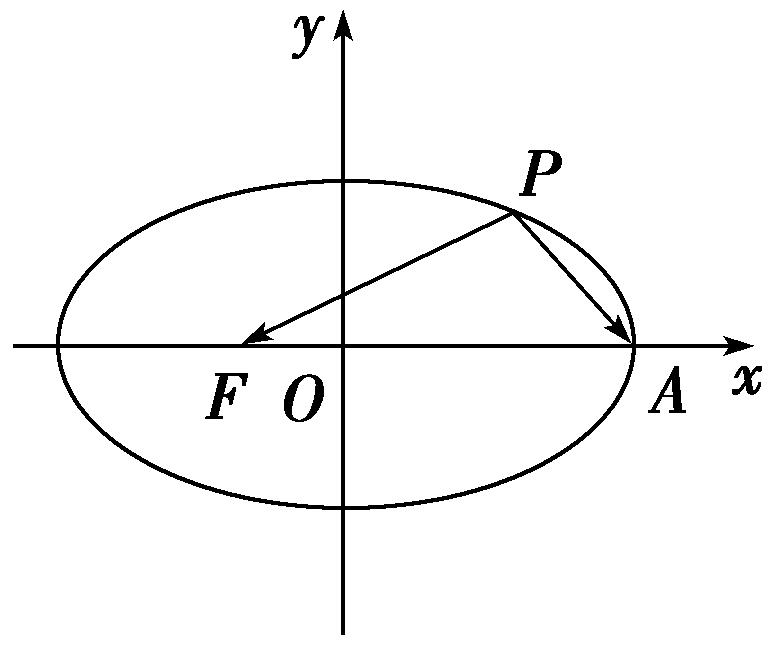
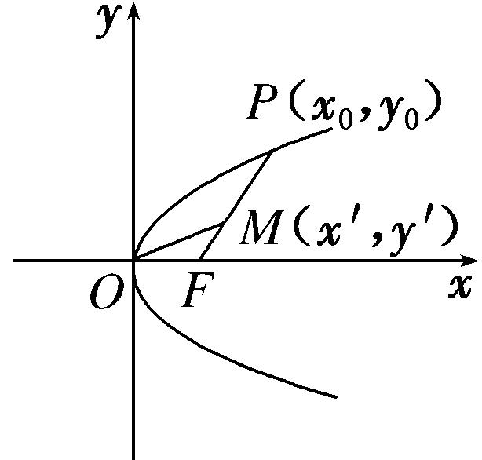
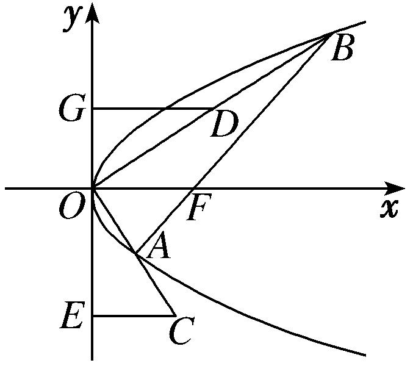
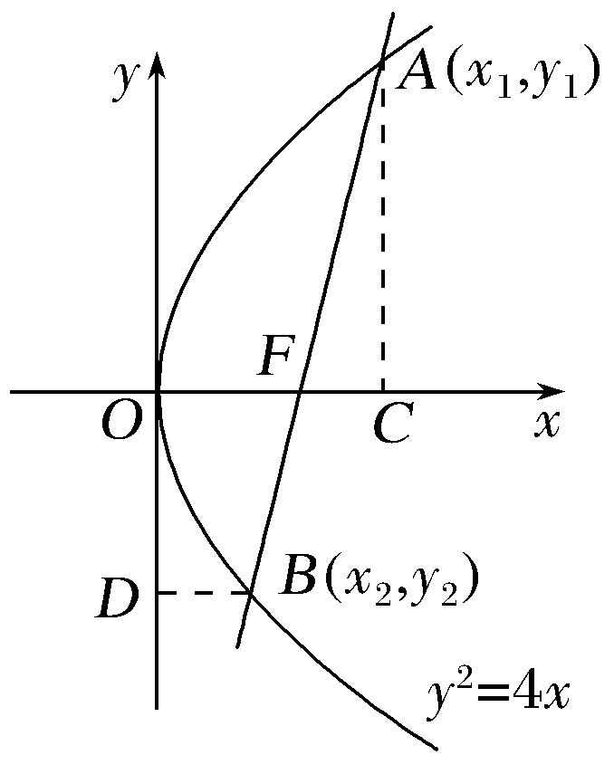
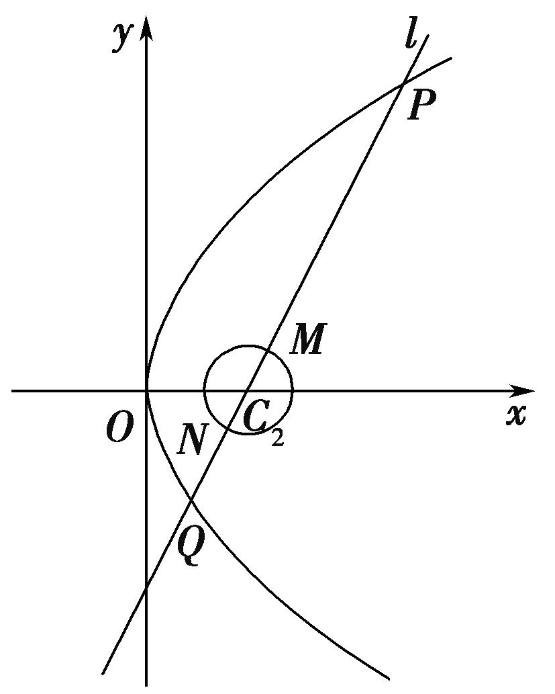

专题11　代数法解决的最值模型

【例题选讲】

<strong>[例2]</strong>　（7）设<em>F</em>1，<em>F</em>2是椭圆<em>E</em>：＋＝1的左右焦点，<em>P</em>是椭圆<em>E</em>上的点，则|<em>PF</em>1|·|<em>PF</em>2|的最小值是\_\_\_\_\_\_\_\_．

<strong>答案</strong>　16　<strong>解析</strong>　由椭圆方程可知<em>a</em>＝5，<em>c</em>＝3，根据椭圆的定义，有|<em>PF</em>2|＝2<em>a</em>－|<em>PF</em>1|＝10－|<em>PF</em>1|，故|<em>PF</em>1|·|<em>PF</em>2|＝|<em>PF</em>1|·(10－|<em>PF</em>1|)，由于|<em>PF</em>1|∈[<em>a</em>－<em>c</em>，<em>a</em>＋<em>c</em>]＝[2，8]注意到二次函数<em>y</em>＝<em>x</em>(10－<em>x</em>)的对称轴为<em>x</em>＝5，故当<em>x</em>＝2，<em>x</em>＝8时，都是函数的最小值，即最小值为2×8＝16．  
（8）如图，焦点在*x*轴上的椭圆＋＝1的离心率*e*＝，*F*，*A*分别是椭圆的一个焦点和顶点，*P*是椭圆上任意一点，则·的最大值为\_\_\_\_\_\_\_\_．

<strong>答案</strong>　4　<strong>解析</strong>　设<em>P</em>点坐标为(<em>x</em>0，<em>y</em>0)．由题意知<em>a</em>＝2，因为<em>e</em>＝＝，所以<em>c</em>＝1，<em>b</em>2＝<em>a</em>2－<em>c</em>2＝3．故椭圆方程为＋＝1．所以－2≤<em>x</em>0≤2，－≤<em>y</em>0≤．因为<em>F</em>(－1，0)，<em>A</em>(2，0)，＝(－1－<em>x</em>0，－<em>y</em>0)，＝(2－<em>x</em>0，－<em>y</em>0)，所以·＝<em>x</em>－<em>x</em>0－2＋<em>y</em>＝<em>x</em>－<em>x</em>0＋1＝(<em>x</em>0－2)2．即当<em>x</em>0＝－2时，·取得最大值4．  
（9）在等腰梯形<em>ABCD</em>中，<em>AB</em>∥<em>CD</em>，且|<em>AB</em>|＝2，|<em>AD</em>|＝1，|<em>CD</em>|＝2<em>x</em>，其中<em>x</em>∈(0，1)，以<em>A</em>，<em>B</em>为焦点且过点<em>D</em>的双曲线的离心率为<em>e</em>1，以<em>C</em>，<em>D</em>为焦点且过点<em>A</em>的椭圆的离心率为<em>e</em>2，若对任意<em>x</em>∈(0，1)，不等式<em>t</em>＜<em>e</em>1＋<em>e</em>2恒成立，则<em>t</em>的最大值为(　　)

A．　　　　　　　　
B．　　　　　　　　
C．2　　　　　　　　
D．

<strong>答案</strong>　B　<strong>解析</strong>　由平面几何知识可得|<em>BD</em>|＝|<em>AC</em>|＝，所以<em>e</em>1＝，<em>e</em>2＝，所以<em>e</em>1<em>e</em>2＝1．因为<em>e</em>1＋<em>e</em>2＝<em>e</em>1＋＝＋在<em>x</em>∈(0，1)上单调递减，所以<em>e</em>1＋<em>e</em>2＞＋＝．因为对任意<em>x</em>∈(0，1)，不等式<em>t</em>＜<em>e</em>1＋<em>e</em>2恒成立，所以<em>t</em>≤，即<em>t</em>的最大值为．  
（10）已知<em>F</em>1，<em>F</em>2分别是双曲线－＝1(<em>a</em>&gt;0，<em>b</em>&gt;0)的左、右焦点，且|<em>F</em>1<em>F</em>2|＝2，若<em>P</em>是该双曲线右支上的一点，且满足|<em>PF</em>1|＝2|<em>PF</em>2|，则△<em>PF</em>1<em>F</em>2面积的最大值是(　　)

A．1　　　　　　　　
B．　　　　　　　　
C．　　　　　　　　
D．2

<strong>答案</strong>　B　<strong>解析</strong>　∵∴|<em>PF</em>1|＝4<em>a</em>，|<em>PF</em>2|＝2<em>a</em>，设∠<em>F</em>1<em>PF</em>2＝<em>θ</em>，∴cos<em>θ</em>＝＝，∴<em>S</em>2△<em>PF</em>1<em>F</em>2＝(×4<em>a</em>×2<em>a</em>×sin<em>θ</em>)2＝16<em>a</em>4(1－)＝－9(<em>a</em>2－)2≤，当且仅当<em>a</em>2＝时，等号成立，故<em>S</em>△<em>PF</em>1<em>F</em>2的最大值是．故选B．  
（11）已知双曲线－＝1(<em>a</em>&gt;0，<em>b</em>&gt;0)的左、右焦点分别为<em>F</em>1，<em>F</em>2，过<em>F</em>1且垂直于<em>x</em>轴的直线与该双曲线的左支交于<em>A</em>，<em>B</em>两点，<em>AF</em>2，<em>BF</em>2分别交<em>y</em>轴于<em>P</em>，<em>Q</em>两点，若△<em>PQF</em>2的周长为16，则的最大值为\_\_\_\_\_\_\_\_．

<strong>答案　　解析</strong>　由题意，得△<em>ABF</em>2的周长为32，∴|<em>AF</em>2|＋|<em>BF</em>2|＋|<em>AB</em>|＝32，∵|<em>AF</em>2|＋|<em>BF</em>2|－|<em>AB</em>|＝4<em>a</em>，|<em>AB</em>|＝，∴＝32－4<em>a</em>，∴<em>b</em>＝(0&lt;<em>a</em>&lt;8)，∴＝，令<em>t</em>＝<em>a</em>＋1(1&lt;<em>t</em>&lt;9)，则＝ ＝＝ ，令<em>m</em>＝，则＝，当<em>m</em>＝－＝，即<em>a</em>＝，<em>b</em>＝时，的最大值为 ＝．  
（12）设<em>O</em>为坐标原点，<em>P</em>是以<em>F</em>为焦点的抛物线<em>y</em>2＝2<em>px</em>(<em>p</em>＞0)上任意一点，<em>M</em>是线段<em>PF</em>上的点，且|<em>PM</em>|＝2|<em>MF</em>|，则直线<em>OM</em>的斜率的最大值为(　　)

A．　　　　　　　　
B．　　　　　　　　
C．　　　　　　　　
D．1

<strong>答案</strong>　C　<strong>解析</strong>　如图所示，设<em>P</em>(<em>x</em>0，<em>y</em>0)(<em>y</em>0＞0)，则<em>y</em>＝2<em>px</em>0，即<em>x</em>0＝．设<em>M</em>(<em>x</em>′，<em>y</em>′)，由＝2，得化简可得∴直线<em>OM</em>的斜率为<em>k</em>＝＝＝≤＝(当且仅当<em>y</em>0＝<em>p</em>时取等号)，故直线<em>OM</em>的斜率的最大值为．

  
（13）抛物线<em>y</em>2＝8<em>x</em>的焦点为<em>F</em>，设<em>A</em>(<em>x</em>1，<em>y</em>1)，<em>B</em>(<em>x</em>2，<em>y</em>2)是抛物线上的两个动点，若<em>x</em>1＋<em>x</em>2＋4＝|<em>AB</em>|，则∠<em>AFB</em>的最大值为(　　)

A．　　　　　　　　
B．　　　　　　　　
C．　　　　　　　　
D．

<strong>答案</strong>　D　<strong>解析</strong>　由抛物线的定义可得|<em>AF</em>|＝<em>x</em>1＋2，|<em>BF</em>|＝<em>x</em>2＋2，又<em>x</em>1＋<em>x</em>2＋4＝|<em>AB</em>|，得|<em>AF</em>|＋|<em>BF</em>|＝，|<em>AB</em>|，所以|<em>AB</em>|＝(|<em>AF</em>|＋|<em>BF</em>|)．所以cos∠<em>AFB</em>＝＝＝＝－≥×2－＝－，而0＜∠<em>AFB</em>＜π，所以∠<em>AFB</em>的最大值为．  
（14）(2017·全国Ⅰ)已知<em>F</em>为抛物线<em>C</em>：<em>y</em>2＝4<em>x</em>的焦点，过<em>F</em>作两条互相垂直的直线<em>l</em>1，<em>l</em>2，直线<em>l</em>1与<em>C</em>交于<em>A</em>，<em>B</em>两点，直线<em>l</em>2与<em>C</em>交于<em>D</em>，<em>E</em>两点，则|<em>AB</em>|＋|<em>DE</em>|的最小值为(　　)

A．16　　　　　　　　
B．14　　　　　　　　
C．12　　　　　　　　
D．10

<strong>答案</strong>　A　<strong>解析</strong>　因为<em>F</em>为<em>y</em>2＝4<em>x</em>的焦点，所以<em>F</em>(1，0)．由题意直线<em>l</em>1，<em>l</em>2的斜率均存在，且不为0，设<em>l</em>1的斜率为<em>k</em>，则<em>l</em>2的斜率为－，故直线<em>l</em>1，<em>l</em>2的方程分别为<em>y</em>＝<em>k</em>(<em>x</em>－1)，<em>y</em>＝－(<em>x</em>－1)．由得<em>k</em>2<em>x</em>2－(2<em>k</em>2＋4)<em>x</em>＋<em>k</em>2＝0．设<em>A</em>(<em>x</em>1，<em>y</em>1)，<em>B</em>(<em>x</em>2，<em>y</em>2)，则<em>x</em>1＋<em>x</em>2＝，<em>x</em>1<em>x</em>2＝1，所以|<em>AB</em>|＝·|<em>x</em>1－<em>x</em>2|＝·＝·＝．同理可得|<em>DE</em>|＝4(1＋<em>k</em>2)．所以|<em>AB</em>|＋|<em>DE</em>|＝＋4(1＋<em>k</em>2)＝4＝8＋4≥8＋4×2＝16，当且仅当<em>k</em>2＝，即<em>k</em>＝±1时，取得等号．故选A．  
（15）在平面直角坐标系<em>xOy</em>中，已知抛物线<em>C</em>：<em>x</em>2＝4<em>y</em>，点<em>P</em>是<em>C</em>的准线<em>l</em>上的动点，过点<em>P</em>作<em>C</em>的两条切线，切点分别为<em>A</em>，<em>B</em>，则△<em>AOB</em>面积的最小值为(　　)

A．　　　　　　　　
B．2　　　　　　　　
C．2　　　　　　　　
D．4

<strong>答案</strong>　B　<strong>解析</strong>　设<em>P</em>(<em>x</em>0，－1)，<em>A</em>(<em>x</em>1，<em>y</em>1)，<em>B</em>(<em>x</em>2，<em>y</em>2)，又<em>A</em>，<em>B</em>在抛物线上，所以<em>y</em>1＝，<em>y</em>2＝．因为<em>y</em>′＝，则过点<em>A</em>，<em>B</em>的切线分别为<em>y</em>－＝(<em>x</em>－<em>x</em>1)，<em>y</em>－＝(<em>x</em>－<em>x</em>2)均过点<em>P</em>(<em>x</em>0，－1)，则－1－＝(<em>x</em>0－<em>x</em>1)，－1－＝(<em>x</em>0－<em>x</em>2)，即<em>x</em>1，<em>x</em>2是方程－1－＝(<em>x</em>0－<em>x</em>)的两根，则<em>x</em>1＋<em>x</em>2＝2<em>x</em>0，<em>x</em>1<em>x</em>2＝－4，设直线<em>AB</em>的方程为<em>y</em>＝<em>kx</em>＋<em>b</em>，联立得<em>x</em>2－4<em>kx</em>－4<em>b</em>＝0，则<em>x</em>1<em>x</em>2＝－4<em>b</em>＝－4，即<em>b</em>＝1，|<em>AB</em>|＝|<em>x</em>1－<em>x</em>2|＝·＝·，<em>O</em>到直线<em>AB</em>的距离<em>d</em>＝，则<em>S</em>△<em>AOB</em>＝|<em>AB</em>|<em>d</em>＝≥2，即△<em>AOB</em>的面积的最小值为2，故选B．  
（16）已知<em>F</em>为抛物线<em>y</em>2＝<em>x</em>的焦点，点<em>A</em>，<em>B</em>在该抛物线上，且位于<em>x</em>轴的两侧，·＝2(其中<em>O</em>为坐标原点)，则△<em>AFO</em>与△<em>BFO</em>面积之和的最小值是\_\_\_\_\_\_\_\_．

<strong>答案　　解析</strong>　法一：设直线<em>lAB</em>：<em>x</em>＝<em>my</em>＋<em>t</em>，<em>A</em>(<em>x</em>1，<em>y</em>1)，<em>B</em>(<em>x</em>2，<em>y</em>2)，联立⇒<em>y</em>2－<em>my</em>－<em>t</em>＝0，∴<em>y</em>1＋<em>y</em>2＝<em>m</em>，<em>y</em>1<em>y</em>2＝－<em>t</em>，∵点<em>A</em>，<em>B</em>位于<em>x</em>轴两侧，∴<em>y</em>1<em>y</em>2＝－<em>t</em>&lt;0，∴<em>t</em>&gt;0．又·＝<em>x</em>1<em>x</em>2＋<em>y</em>1<em>y</em>2＝(<em>y</em>1<em>y</em>2)2＋<em>y</em>1<em>y</em>2＝<em>t</em>2－<em>t</em>＝2，解得<em>t</em>＝2或<em>t</em>＝－1(舍去)．∴<em>S</em>△<em>AFO</em>＋<em>S</em>△<em>BFO</em>＝|<em>OF</em>|·|<em>y</em>1－<em>y</em>2|＝|<em>y</em>1－<em>y</em>2|＝≥，∴△<em>AFO</em>与△<em>BFO</em>面积之和的最小值为．

法二：设<em>A</em>(<em>x</em>1，<em>y</em>1)，<em>B</em>(<em>x</em>2，<em>y</em>2)．∵·＝<em>x</em>1<em>x</em>2＋<em>y</em>1<em>y</em>2＝(<em>y</em>1<em>y</em>2)2＋<em>y</em>1<em>y</em>2＝2，∴<em>y</em>1<em>y</em>2＝－2或<em>y</em>1<em>y</em>2＝1(舍去)．∴<em>S</em>△<em>AFO</em>＋<em>S</em>△<em>BFO</em>＝|<em>y</em>1－<em>y</em>2|＝＝ ≥＝．

【对点训练】

21．已知<em>F</em>1，<em>F</em>2分别为椭圆<em>C</em>：＋＝1的左、右焦点，点<em>E</em>是椭圆<em>C</em>上的动点，则·的最大值、

最小值分别为(　　)

A．9，7　　　　　　　　
B．8，7　　　　　　　　
C．9，8　　　　　　　　
D．17，8

21．<strong>答案</strong>　B　<strong>解析</strong>　由题意可知椭圆的左、右焦点坐标分别为<em>F</em>1(－1，0)，<em>F</em>2(1，0)，设<em>E</em>(<em>x</em>，<em>y</em>)(－3≤<em>x</em>≤3)，
则＝(－1－<em>x</em>，－<em>y</em>)，＝(1－<em>x</em>，－<em>y</em>)，所以·＝<em>x</em>2－1＋<em>y</em>2＝<em>x</em>2－1＋8－<em>x</em>2＝＋7，所以当<em>x</em>＝0时，·有最小值7，当<em>x</em>＝±3时，·有最大值8，故选B．

22．(2018·浙江)已知点<em>P</em>(0，1)，椭圆＋<em>y</em>2＝<em>m</em>(<em>m</em>&gt;1)上两点<em>A</em>，<em>B</em>满足＝2，则当<em>m</em>＝\_\_\_\_\_\_\_\_时，

点*B*横坐标的绝对值最大．

22．<strong>答案</strong>　5　<strong>解析</strong>　设<em>A</em>(<em>x</em>1，<em>y</em>1)，<em>B</em>(<em>x</em>2，<em>y</em>2)，由＝2，得即<em>x</em>1＝－2<em>x</em>2，<em>y</em>1＝3

－2<em>y</em>2．因为点<em>A</em>，<em>B</em>在椭圆上，所以得<em>y</em>2＝<em>m</em>＋，所以<em>x</em>＝<em>m</em>－(3－2<em>y</em>2)2＝－<em>m</em>2＋<em>m</em>－＝－(<em>m</em>－5)2＋4≤4，所以当<em>m</em>＝5时，点<em>B</em>横坐标的绝对值最大，最大值为2．

23．已知点<em>F</em>1，<em>F</em>2分别是椭圆＋＝1的左、右焦点，点<em>M</em>是该椭圆上的一个动点，那么|＋|

的最小值是(　　)

A．4　　　　　　　　
B．6　　　　　　　　
C．8　　　　　　　　
D．10

23．<strong>答案</strong>　C　<strong>解析</strong>　设<em>M</em>(<em>x</em>0，<em>y</em>0)，<em>F</em>1(－3，0)，<em>F</em>2(3，0)．则＝(－3－<em>x</em>0，－<em>y</em>0)，＝(3－<em>x</em>0，－

<em>y</em>0)，所以＋＝(－2<em>x</em>0，－2<em>y</em>0)，|＋|＝＝＝，因为点<em>M</em>在椭圆上，所以0≤<em>y</em>≤16，所以当<em>y</em>＝16时，|＋|取最小值为8．

24．已知点*A*在椭圆＋＝1上，点*P*满足＝(*λ*－1) (*λ*∈R)(*O*是坐标原点)，且·＝72，
则线段*OP*在*x*轴上的投影长度的最大值为\_\_\_\_\_\_\_\_．

24．<strong>答案</strong>　15　<strong>解析</strong>　因为＝(<em>λ</em>－1)，所以＝<em>λ</em>，即<em>O</em>，<em>A</em>，<em>P</em>三点共线，因为·＝

72，所以·＝<em>λ</em>||2＝72，设<em>A</em>(<em>x</em>，<em>y</em>)，<em>OA</em>与<em>x</em>轴正方向的夹角为<em>θ</em>，线段<em>OP</em>在<em>x</em>轴上的投影长度为|||cos <em>θ</em>|＝|<em>λ</em>||<em>x</em>|＝＝＝≤＝15，当且仅当|<em>x</em>|＝时取等号，故所求最大值为15．

25．椭圆＋＝1的左、右焦点分别为<em>F</em>1，<em>F</em>2，过椭圆的右焦点<em>F</em>2作一条直线<em>l</em>交椭圆于<em>P</em>，<em>Q</em>两点，
则△<em>F</em>1<em>PQ</em>的内切圆面积的最大值是\_\_\_\_\_\_\_\_．

25．<strong>答案　　解析</strong>　由题意得，直线<em>l</em>的斜率不为0，所以令直线<em>l</em>：<em>x</em>＝<em>my</em>＋1，与椭圆方程联立消去<em>x</em>

得(3<em>m</em>2＋4)<em>y</em>2＋6<em>my</em>－9＝0，可设<em>P</em>(<em>x</em>1，<em>y</em>1) ，<em>Q</em>(<em>x</em>2，<em>y</em>2) ，则<em>y</em>1＋<em>y</em>2＝－，<em>y</em>1<em>y</em>2＝－.可知＝|<em>F</em>1<em>F</em>2||<em>y</em>1－<em>y</em>2|＝＝12，又＝≤，故≤3．三角形周长与三角形内切圆的半径的积等于三角形面积的二倍，则内切圆半径<em>r</em>＝≤，其面积最大值为．

26．已知直线<em>l</em>：<em>y</em>＝2<em>x</em>＋<em>b</em>被抛物线<em>C</em>：<em>y</em>2＝2<em>px</em>(<em>p</em>&gt;0)截得的弦长为5，直线<em>l</em>经过<em>C</em>的焦点，<em>M</em>为<em>C</em>上的

一个动点，设点*N*的坐标为(3，0)，则*MN*的最小值为\_\_\_\_\_\_\_\_．

26．<strong>答案</strong>　2　<strong>解析</strong>　∵⇒4<em>x</em>2＋(4<em>b</em>－2<em>p</em>)<em>x</em>＋<em>b</em>2＝0，则52＝(1＋22)， 又直

线<em>l</em>经过<em>C</em>的焦点，则－＝，∴<em>b</em>＝－<em>p</em>，由此解得<em>p</em>＝2，抛物线方程为<em>y</em>2＝4<em>x</em>，<em>M</em>(<em>x</em>0，<em>y</em>0)，∴<em>y</em>＝4<em>x</em>0，则|<em>MN</em>|2＝(<em>x</em>0－3)2＋<em>y</em>＝(<em>x</em>0－3)2＋4<em>x</em>0＝(<em>x</em>0－1)2＋8，故当<em>x</em>0＝1时，|<em>MN</em>|min＝2．

27．如图，抛物线<em>y</em>2＝4<em>x</em>的一条弦<em>AB</em>经过焦点<em>F</em>，取线段<em>OB</em>的中点<em>D</em>，延长<em>OA</em>至点<em>C</em>，使|<em>OA</em>|＝|<em>AC</em>|，

过点*C*，*D*作*y*轴的垂线，垂足分别为点*E*，*G*，则|*EG*|的最小值为\_\_\_\_\_\_\_\_．

27．<strong>答案</strong>　4　<strong>解析</strong>　设<em>A</em>(<em>x</em>1，<em>y</em>1)，<em>B</em>(<em>x</em>2，<em>y</em>2)，<em>C</em>(<em>x</em>3，<em>y</em>3)，<em>D</em>(<em>x</em>4，<em>y</em>4)，则<em>y</em>3＝2<em>y</em>1，<em>y</em>4＝<em>y</em>2，|<em>EG</em>|＝<em>y</em>4－<em>y</em>3＝

<em>y</em>2－2<em>y</em>1．因为<em>AB</em>为抛物线<em>y</em>2＝4<em>x</em>的焦点弦，所以<em>y</em>1<em>y</em>2＝－4，所以|<em>EG</em>|＝<em>y</em>2－2×＝<em>y</em>2＋≥2＝4，当且仅当<em>y</em>2＝，即<em>y</em>2＝4时取等号，所以|<em>EG</em>|的最小值为4．

28．已知抛物线<em>y</em>2＝4<em>x</em>，过焦点<em>F</em>的直线与抛物线交于<em>A</em>，<em>B</em>两点，过<em>A</em>，<em>B</em>分别作<em>x</em>轴，<em>y</em>轴垂线，垂足
分别为*C*，*D*，则|*AC*|＋|*BD*|的最小值为\_\_\_\_\_\_\_\_．

28．<strong>答案</strong>　3　<strong>解析</strong>　不妨设<em>A</em>(<em>x</em>1，<em>y</em>1)(<em>y</em>1&gt;0)，<em>B</em>(<em>x</em>2，<em>y</em>2)(<em>y</em>2&lt;0)．则|<em>AC</em>|＋|<em>BD</em>|＝<em>x</em>2＋<em>y</em>1＝＋<em>y</em>1．又<em>y</em>1<em>y</em>2＝－

<em>p</em>2＝－4．∴|<em>AC</em>|＋|<em>BD</em>|＝－(<em>y</em>2&lt;0)．设<em>g</em>(<em>x</em>)＝－，在(－∞，－2)递减，在(－2，0)递增．∴当<em>x</em>＝－2，即<em>y</em>2＝－2时，|<em>AC</em>|＋|<em>BD</em>|的最小值为3．

29．已知抛物线<em>C</em>：<em>y</em>2＝8<em>ax</em>(<em>a</em>&gt;0)的焦点<em>F</em>与双曲线<em>D</em>：－＝1(<em>a</em>&gt;0)的焦点重合，过点<em>F</em>的直线与抛

物线*C*交于*A*，*B*两点，则|*AF*|＋2|*BF*|的最小值为(　　)

A．3＋4　　　　　　　
B．6＋4　　　　　　　
C．7　　　　　　　
D．10

29．<strong>答案</strong>　B　<strong>解析</strong>　由题意得抛物线<em>C</em>的焦点为<em>F</em>(2<em>a</em>，0)，则由2<em>a</em>＝，解得<em>a</em>＝1，所以<em>F</em>(2，

0)，抛物线<em>C</em>：<em>y</em>2＝8<em>x</em>.由题知，直线<em>AB</em>的斜率不为零，所以设其方程为<em>x</em>＝<em>my</em>＋2，<em>A</em>，<em>B</em>，联立得<em>y</em>2－8<em>my</em>－16＝0，所以<em>y</em>1<em>y</em>2＝－16．由抛物线的定义，得|<em>AF</em>|＋2|<em>BF</em>|＝＋2＋2＝6＋≥6＋＝6＋4，当且仅当<em>y</em>＝2<em>y</em>，即或时取等号，故选B．

30．已知<em>F</em>为抛物线<em>C</em>：<em>y</em>2＝2<em>x</em>的焦点，过<em>F</em>作两条互相垂直的直线<em>l</em>1，<em>l</em>2，直线<em>l</em>1与<em>C</em>交于<em>A</em>，<em>B</em>两点，

直线<em>l</em>2与<em>C</em>交于<em>D</em>，<em>E</em>两点，则|<em>AB</em>|＋|<em>DE</em>|的最小值为\_\_\_\_\_\_\_\_．

30．<strong>答案</strong>　8　<strong>解析</strong>　法一　由题意知，直线<em>l</em>1，<em>l</em>2的斜率都存在且不为0，<em>F</em>，设<em>l</em>1：<em>x</em>＝<em>ty</em>＋，则

直线<em>l</em>1的斜率为，联立方程得消去<em>x</em>得<em>y</em>2－2<em>ty</em>－1＝0．设<em>A</em>(<em>x</em>1，<em>y</em>1)，<em>B</em>(<em>x</em>2，<em>y</em>2)，则<em>y</em>1＋<em>y</em>2＝2<em>t</em>，<em>y</em>1<em>y</em>2＝－1．所以|<em>AB</em>|＝|<em>y</em>1－<em>y</em>2|＝＝＝2<em>t</em>2＋2，同理得，用替换<em>t</em>可得|<em>DE</em>|＝＋2，所以|<em>AB</em>|＋|<em>DE</em>|＝2＋4≥4＋4＝8，当且仅当<em>t</em>2＝，即<em>t</em>＝±1时等号成立，故|<em>AB</em>|＋|<em>DE</em>|的最小值为8．

法二　由题意知，直线<em>l</em>1，<em>l</em>2的斜率都存在且不为0，<em>F</em>，不妨设<em>l</em>1的斜率为<em>k</em>，则<em>l</em>1：<em>y</em>＝<em>k</em>，<em>l</em>2：<em>y</em>＝－．由消去<em>y</em>得<em>k</em>2<em>x</em>2－(<em>k</em>2＋2)<em>x</em>＋＝0，设<em>A</em>(<em>x</em>1，<em>y</em>1)，<em>B</em>(<em>x</em>2，<em>y</em>2)，则<em>x</em>1＋<em>x</em>2＝1＋．由抛物线的定义知，|<em>AB</em>|＝<em>x</em>1＋<em>x</em>2＋1＝1＋＋1＝2＋．同理可得，用－替换|<em>AB</em>|中<em>k</em>，可得|<em>DE</em>|＝2＋2<em>k</em>2，所以|<em>AB</em>|＋|<em>DE</em>|＝2＋＋2＋2<em>k</em>2＝4＋＋2<em>k</em>2≥4＋4＝8，当且仅当＝2<em>k</em>2，即<em>k</em>＝±1时等号成立，故|<em>AB</em>|＋|<em>DE</em>|的最小值为8．

31．如图，已知抛物线<em>C</em>1的顶点在坐标原点，焦点在<em>x</em>轴上，且过点(2，4)，圆<em>C</em>2：<em>x</em>2＋<em>y</em>2－4<em>x</em>＋3＝0，

过圆心<em>C</em>2的直线<em>l</em>与抛物线和圆<em>C</em>2分别交于点<em>P</em>，<em>Q</em>和<em>M</em>，<em>N</em>，则|<em>PN</em>|＋4|<em>QM</em>|的最小值为(　　)

A．23　　　　　　　　
B．42　　　　　　　　
C．12　　　　　　　　
D．52

31．<strong>答案　A　解析</strong>　由题意可设抛物线<em>C</em>1的方程为<em>y</em>2＝2<em>px</em>(<em>p</em>＞0)，因为抛物线<em>C</em>1过点(2，4)，所以16

＝2<em>p</em>×2，解得<em>p</em>＝4，所以抛物线<em>C</em>1的方程为<em>y</em>2＝8<em>x</em>．圆<em>C</em>2：<em>x</em>2＋<em>y</em>2－4<em>x</em>＋3＝0整理得(<em>x</em>－2)2＋<em>y</em>2＝1，可知圆心<em>C</em>2(2，0)恰好是抛物线<em>y</em>2＝8<em>x</em>的焦点，设<em>P</em>(<em>x</em>1，<em>y</em>1)，<em>Q</em>(<em>x</em>2，<em>y</em>2)．①当直线<em>l</em>的斜率不存在时，<em>l</em>：<em>x</em>＝2，所以<em>P</em>(2，4)，<em>Q</em>(2，－4)，于是|<em>PN</em>|＋4|<em>QM</em>|＝|<em>PC</em>2|＋|<em>C</em>2<em>N</em>|＋4|<em>QC</em>2|＋4|<em>C</em>2<em>M</em>|＝|<em>PC</em>2|＋4|<em>QC</em>2|＋5＝4＋4×4＋5＝25．②当直线<em>l</em>的斜率存在时，易知斜率不为0，可设<em>l</em>的方程为<em>y</em>＝<em>k</em>(<em>x</em>－2)(<em>k</em>≠0)，由得<em>k</em>2<em>x</em>2－(4<em>k</em>2＋8)<em>x</em>＋4<em>k</em>2＝0，则<em>Δ</em>＞0，且<em>x</em>1<em>x</em>2＝4，即<em>x</em>2＝．所以|<em>PN</em>|＋4|<em>QM</em>|＝|<em>PC</em>2|＋4|<em>QC</em>2|＋5＝<em>x</em>1＋2＋4(<em>x</em>2＋2)＋5＝<em>x</em>1＋4<em>x</em>2＋15＝<em>x</em>1＋＋15≥2＋15＝8＋15＝23，当且仅当<em>x</em>1＝，即<em>x</em>1＝4时等号成立．因为23＜25，所以|<em>PN</em>|＋4|<em>QM</em>|的最小值为23．故选A．

32．抛物线<em>y</em>2＝8<em>x</em>的焦点为<em>F</em>，设<em>A</em>，<em>B</em>是抛物线上的两个动点，|<em>AF</em>|＋|<em>BF</em>|＝|<em>AB</em>|，则∠<em>AFB</em>的最大

值为(　　)

A．　　　　　　　　
B．　　　　　　　　
C．　　　　　　　　
D．

32．<strong>答案</strong>　D　<strong>解析</strong>　设|<em>AF</em>|＝<em>m</em>，|<em>BF</em>|＝<em>n</em>，∵|<em>AF</em>|＋|<em>BF</em>|＝|<em>AB</em>|，∴|<em>AB</em>|≥2，∴<em>mn</em>≤|<em>AB</em>|2，在

△*AFB*中，由余弦定理得cos∠*AFB*＝＝＝≥－，∴∠*AFB*的最大值为．

33．已知抛物线<em>C</em>：<em>y</em>＝<em>ax</em>2的焦点坐标为(0，1)，点<em>P</em>(0，3)，过点<em>P</em>作直线<em>l</em>交抛物线<em>C</em>于<em>A</em>，<em>B</em>两点，

过点*A*，*B*分别作抛物线*C*的切线，两切线交于点*Q*，则△*QAB*面积的最小值为(　　)

A．6　　　　　　　　
B．6　　　　　　　　
C．12　　　　　　　　
D．12

33．<strong>答案</strong>　C　<strong>解析</strong>　因为抛物线<em>y</em>＝<em>ax</em>2的焦点坐标为(0，1)，所以抛物线方程为<em>y</em>＝<em>x</em>2．设<em>A</em>，

<em>B</em>．因为<em>y</em>′＝<em>x</em>，所以抛物线在点<em>A</em>处的切线方程的斜率<em>k</em>1＝，所以点<em>A</em>处的切线方程为<em>y</em>－＝(<em>x</em>－<em>x</em>1)，化简得<em>y</em>＝<em>x</em>1<em>x</em>－①．同理得点<em>B</em>处的切线方程为<em>y</em>＝<em>x</em>2<em>x</em>－②．联立①②，消去<em>y</em>得<em>x</em>＝，代入点<em>A</em>处的切线方程得<em>Q</em>．因为直线<em>AB</em>过点<em>P</em>(0，3)，所以设直线<em>l</em>的方程为<em>y</em>＝<em>kx</em>＋3(由题可知直线<em>l</em>的斜率不存在时不满足题意)．联立得<em>x</em>2－4<em>kx</em>－12＝0，所以所以<em>Q</em>(2<em>k</em>，－3)，所以点<em>Q</em>到<em>AB</em>的距离<em>d</em>＝．又因为|<em>AB</em>|＝|<em>x</em>1－<em>x</em>2|＝4·，所以<em>S</em>△<em>QAB</em>＝|<em>AB</em>|·<em>d</em>＝·4··＝4(<em>k</em>2＋3)，所以当<em>k</em>＝0时，<em>S</em>△<em>AQB</em>取得最小值12．故选C．

