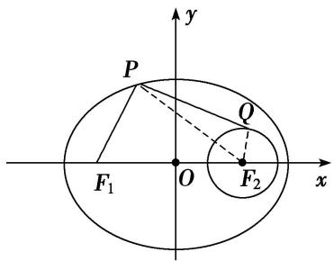
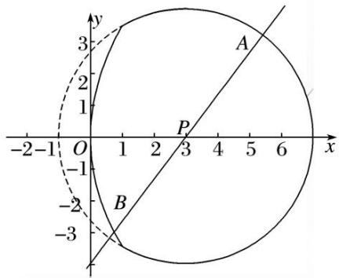
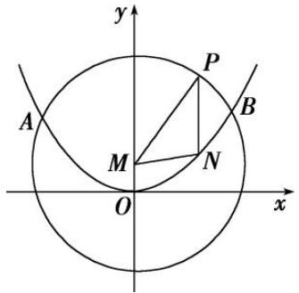

# 专题 12 范围问题模型

# 圆锥曲线中范围问题求解的基本思路

解决有关范围问题的基本思路是建立目标函数或不等关系:

建立目标函数的关键是选用一个合适的变量，其原则是这个变量能够表达要解决的问题，利用求函数的值域的方法将待求量表示为其他变量的函数，求其值域，从而确定参数的取值范围；

建立不等关系时，先要恰当地引入变量(如点的坐标、角、斜率等)，寻找不等关系.

# 圆锥曲线中范围问题建立不等关系的基本方法

(1)利用圆锥曲线的几何性质或判别式构造不等关系，从而确定参数的取值范围；  
(2)利用已知参数的范围，求新参数的范围，解这类问题的核心是建立两个参数之间的等量关系；  
(3)利用已知的不等关系构造不等式，从而求出参数的取值范围；  
(4)利用隐含的不等关系建立不等式，从而求出参数的取值范围.

# 1. 用函数思想解决的模型

# 【例题选讲】

[例 1] (1) 若点 O 和点 $F(-2, 0)$ 分别为双曲线 $\frac{x^{2}}{a^{2}} - y^{2} = 1 (a > 0)$ 的中心和左焦点，点 P 为双曲线右支上的任意一点，则 $\overrightarrow{OP} \cdot \overrightarrow{FP}$ 的取值范围为 \_\_\_\_.

(2)已知椭圆 $C: \frac{x^2}{9} + \frac{y^2}{6} = 1$ 的左、右焦点分别为 $F_1$ 、 $F_2$ ，以 $F_2$ 为圆心作半径为 1 的圆 $F_2$ ， $P$ 为椭圆 $C$ 上一点， $Q$ 为圆 $F_2$ 上一点，则 $|PF_1| + |PQ|$ 的取值范围为 \_\_\_\_.

text_image

y
P
Q
F₁ O F₂ x

(3)在椭圆 $\frac{x^{2}}{4}+\frac{y^{2}}{2}=1$ 上任意一点P，Q与P关于x轴对称，若有 $\overrightarrow{F_{1}P}\cdot\overrightarrow{F_{2}P}\leqslant1$ ，则 $\overrightarrow{F_{1}P}$ 与 $\overrightarrow{F_{2}Q}$ 的夹角余弦值的范围为\_\_\_\_.

# 【对点训练】

1. 已知 $F_{1}, F_{2}$ 是双曲线 $\frac{x^{2}}{a^{2}} - \frac{y^{2}}{b^{2}} = 1 (a > 0, b > 0)$ 的左、右焦点，点 $P$ 在双曲线的右支上，如果 $|PF_{1}| = t |PF_{2}| (t \in (1, 3])$ ，则双曲线经过一、三象限的渐近线的斜率的取值范围是 \_\_\_\_.

2. 已知过抛物线 $C: y^{2} = 8x$ 的焦点 $F$ 的直线 $l$ 交抛物线于 $P, Q$ 两点，若 $R$ 为线段 $PQ$ 的中点，连接 $OR$ 并延长交抛物线 $C$ 于点 $S$ ，则 $\frac{|OS|}{|OR|}$ 的取值范围是（）

A. $(0, 2)$

B. $[2, +\infty)$

C. $(0, 2]$

D. $(2, +\infty)$

3. 已知椭圆 $C: \frac{x^2}{4} + y^2 = 1, P(a, 0)$ 为 $x$ 轴上一动点．若存在以点 $P$ 为圆心的圆 $O$ ，使得椭圆 $C$ 与圆 $O$ 有

四个不同的公共点，则 a 的取值范围是 \_\_\_\_.

# 2. 用建立不等关系解决的的模型

# 【例题选讲】

[例 2] (4)已知椭圆 $C: \frac{x^{2}}{2} + y^{2} = 1$ 的两焦点为 $F_{1}, F_{2}$ ，点 $P(x_{0}, y_{0})$ 满足 $0 < \frac{x_{0}^{2}}{2} + y_{0}^{2} < 1$ ，则 $|PF_{1}| + |PF_{2}|$ 的取值范围是 \_\_\_\_.

(5)已知直线 $l: y = kx + t$ 与圆 $C_1: x^2 + (y + 1)^2 = 2$ 相交于 $A, B$ 两点，且 $\triangle C_1AB$ 的面积取得最大值，又直线 $l$ 与抛物线 $C_2: x^2 = 2y$ 相交于不同的两点 $M, N$ ，则实数 $t$ 的取值范围是 \_\_\_\_.  
(6)过抛物线 $y^{2}=x$ 的焦点 F 的直线 l 交抛物线于 A, B 两点，且直线 l 的倾斜角 $\theta\geqslant\frac{\pi}{4}$ ，点 A 在 x 轴上方，则 $|FA|$ 的取值范围是（）

A. $\left(\frac{1}{4},\quad1\right]$

B. $\left(\frac{1}{4},+\infty\right)$

C. $\left(\frac{1}{2},+\infty\right)$

D. $\left(\frac{1}{4},1+\frac{\sqrt{2}}{2}\right]$

(7)抛物线 $C: y^{2} = 2px (p > 0)$ 的焦点为 $A$ ，其准线与 $x$ 轴的交点为 $B$ ，如果在直线 $3x + 4y + 25 = 0$ 上存在点 $M$ ，使得 $\angle AMB = 90^{\circ}$ ，则实数 $p$ 的取值范围是 \_\_\_\_.  
(8)已知双曲线 $C: \frac{x^2}{a^2} - \frac{y^2}{b^2} = 1 (a > 0, b > 0)$ 的左、右焦点分别为 $F_1(-1, 0), F_2(1, 0), P$ 是双曲线上任一点，若双曲线的离心率的取值范围为[2, 4]，则 $\overrightarrow{PF_1} \cdot \overrightarrow{PF_2}$ 的最小值的取值范围是 \_\_\_\_.  
(9)如图，由抛物线 $y^{2}=12x$ 与圆 E: $(x-3)^{2}+y^{2}=16$ 的实线部分构成图形 $\Omega$ ，过点 $P(3,0)$ 的直线始终与图形 $\Omega$ 中的抛物线部分及圆部分有交点，则 $|AB|$ 的取值范围为()

text_image

y
3
2
1
A
P
-2-1 O 1 2 3 4 5 6 x
-1
B
-2
-3

A. $[4, 5]$

B. [7, 8]

C. [6, 7]

D. $[5, 6]$

# 【对点训练】

4. 已知 $P(x_{0}, y_{0})$ 是椭圆 C: $\frac{x^{2}}{4} + y^{2} = 1$ 上的一点， $F_{1}$ ， $F_{2}$ 是 C 的两个焦点，若 $\overrightarrow{PF_{1}} \cdot \overrightarrow{PF_{2}} < 0$ ，则 $x_{0}$ 的取值范围是（）

A. $\left(-\frac{2\sqrt{6}}{3},\frac{2\sqrt{6}}{3}\right)$

B. $\left(-\frac{2\sqrt{3}}{3},\frac{2\sqrt{3}}{3}\right)$

C. $\left(-\frac{\sqrt{3}}{3},\frac{\sqrt{3}}{3}\right)$

D. $\left(-\frac{\sqrt{6}}{3},\frac{\sqrt{6}}{3}\right)$

5. 已知直线 $y = kx + t$ 与圆 $x^{2} + (y + 1)^{2} = 1$ 相切且与抛物线 $C: x^{2} = 4y$ 交于不同的两点 $M, N$ ，则实数 $t$ 的取值范围是（）

A. $(- \infty, -3) \cup (0, +\infty)$

B. $(- \infty, -2) \cup (0, +\infty)$

C. $(-3, 0)$

D. $(-2, 0)$

6. (2017·全国Ⅰ)设 A, B 是椭圆 C: $\frac{x^{2}}{3} + \frac{y^{2}}{m} = 1$ 长轴的两个端点. 若 C 上存在点 M 满足 $\angle AMB = 120^{\circ}$ ，则 m 的取值范围是()

A. $(0, 1] \cup [9, +\infty)$

B. $(0, \sqrt{3}] \cup [9, +\infty)$

C. $(0, 1] \cup [4, +\infty)$

D. $(0, \sqrt{3}] \cup [4, +\infty)$

7. 如图，抛物线 $E: x^{2} = 4y$ 与 $M: x^{2} + (y - 1)^{2} = 16$ 交于 $A, B$ 两点，点 $P$ 为劣弧 $\widehat{AB}$ 上不同于 $A, B$ 的一个动点，平行于 $y$ 轴的直线 $PN$ 交抛物线 $E$ 于点 $N$ ，则 $\triangle PMN$ 的周长的取值范围是（）

text_image

y
P
A
M
N
B
O
x

A. (6, 12)

B. (8, 10)

C. (6, 10)

D. (8, 12)

8. 已知点 $P$ 是椭圆 $\frac{x^2}{25} + \frac{y^2}{9} = 1$ 上的动点，且与椭圆的四个顶点不重合， $F_1$ 、 $F_2$ 分别是椭圆的左、右焦点， $O$ 为坐标原点，若点 $M$ 是 $\angle F_1PF_2$ 的角平分线上的一点，且 $F_1M \perp MP$ ，则 $|OM|$ 的取值范围是 \_\_\_\_.

9. 已知斜率为 $\frac{1}{2}$ 的直线 $l$ 与抛物线 $y^{2} = 2px (p > 0)$ 交于位于 $x$ 轴上方的不同两点 $A, B$ , 记直线 $OA, OB$ 的斜率分别为 $k_{1}, k_{2}$ , 则 $k_{1} + k_{2}$ 的取值范围是 \_\_\_\_.

10. 已知椭圆 $\frac{x^2}{a^2} + \frac{y^2}{b^2} = 1 (a > b > 0)$ 的离心率 $e$ 的取值范围为 $\left[\frac{1}{\sqrt{3}}, \frac{1}{\sqrt{2}}\right]$ ，直线 $y = -x + 1$ 交椭圆于点 $M, N, O$ 是坐标原点，且 $OM \perp ON$ ，则椭圆长轴长的取值范围是（）

A. $[\sqrt{7},\sqrt{8} ]$

B. $[\sqrt{6},\sqrt{7} ]$

C. $[\sqrt{5},\sqrt{6} ]$

D. $[\sqrt{8},\sqrt{9} ]$

