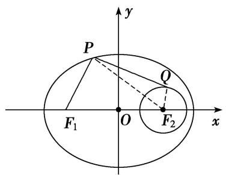
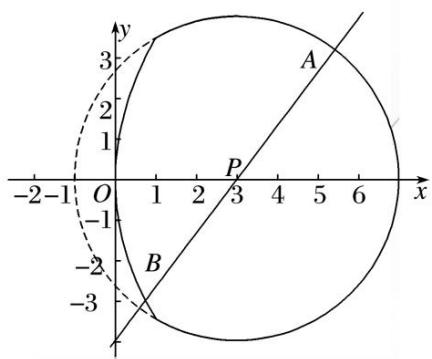
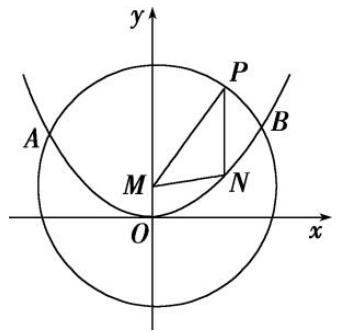
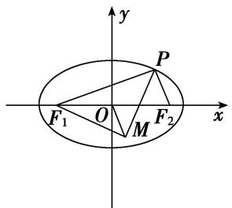
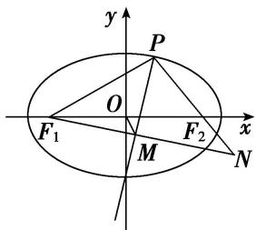

# 专题 12 范围问题模型

# 圆锥曲线中范围问题求解的基本思路
解决有关范围问题的基本思路是建立目标函数或不等关系:

建立目标函数的关键是选用一个合适的变量，其原则是这个变量能够表达要解决的问题，利用求函数的值域的方法将待求量表示为其他变量的函数，求其值域，从而确定参数的取值范围；
建立不等关系时，先要恰当地引入变量(如点的坐标、角、斜率等)，寻找不等关系.

# 圆锥曲线中范围问题建立不等关系的基本方法  
（1）利用圆锥曲线的几何性质或判别式构造不等关系，从而确定参数的取值范围；  
（2）利用已知参数的范围，求新参数的范围，解这类问题的核心是建立两个参数之间的等量关系；  
（3）利用已知的不等关系构造不等式，从而求出参数的取值范围；  
（4）利用隐含的不等关系建立不等式，从而求出参数的取值范围.

#### 1. 用函数思想解决的模型

# 【例题选讲】

[例 1] （1） 若点 O 和点 $F(-2, 0)$ 分别为双曲线 $\frac{x^{2}}{a^{2}} - y^{2} = 1 (a > 0)$ 的中心和左焦点，点 P 为双曲线右支上的任意一点，则 $\overrightarrow{OP} \cdot \overrightarrow{FP}$ 的取值范围为 \_\_\_\_.
答案 $[3 + 2\sqrt{3}, +\infty)$ 解析 由题意，得 $2^{2} = a^{2} + 1$ ，即 $a = \sqrt{3}$ ，设 $P(x,y),x\geqslant \sqrt{3},\overrightarrow{FP} = (x + 2,$ $y)$ ，则 $\overrightarrow{OP}\cdot \overrightarrow{FP} = (x + 2)x + y^2 = x^2 +2x + \frac{x^2}{3} -1 = \frac{4}{3}\left(x + \frac{3}{4}\right)^2 -\frac{7}{4}$ 因为 $x\geqslant \sqrt{3}$ ，所以 $\overrightarrow{OP}\cdot \overrightarrow{FP}$ 的取值范围为 $[3 + 2\sqrt{3},$ $+\infty)$  
（2）已知椭圆 $C: \frac{x^2}{9} + \frac{y^2}{6} = 1$ 的左、右焦点分别为 $F_1$ 、 $F_2$ ，以 $F_2$ 为圆心作半径为 1 的圆 $F_2$ ， $P$ 为椭圆 $C$ 上一点， $Q$ 为圆 $F_2$ 上一点，则 $|PF_1| + |PQ|$ 的取值范围为 \_\_\_\_.
答案 [5, 7] 解析 如图所示， $|PF_{1}| + |PQ| = 2a - |PF_{2}| + |PQ| \leqslant 2a + |QF_{2}| = 6 + 1 = 7$ 。又 $|PF_{1}| + |PQ| \geqslant |PF_{1}| + |PF_{2}| - |QF_{2}| = 6 - 1 = 5$ 。 $\therefore |PF_{1}| + |PQ|$ 的取值范围是[5, 7]。故答案为：[5, 7].

  
（3）在椭圆 $\frac{x^2}{4} +\frac{y^2}{2} = 1$ 上任意一点 $P$ ， $Q$ 与 $P$ 关于 $x$ 轴对称，若有 $\vec{F_1P}\cdot \vec{F_2P}\leqslant 1$ ，则 $\vec{F_1P}$ 与 $\vec{F_2Q}$ 的夹角余弦值的范围为
答案 $\left[-1, -\frac{1}{3}\right]$ 解析 设 $P(x, y)$ ，则 $Q$ 点 $(x, -y)$ ，椭圆 $\frac{x^2}{4} + \frac{y^2}{2} = 1$ 的焦点坐标为 $(- \sqrt{2}, 0)$ ， $(\sqrt{2}, 0)$

0), $\because \vec{F_1P} \cdot \vec{F_2P} \leqslant 1, \therefore x^2 - 2 + y^2 \leqslant 1$ ，结合 $\frac{x^2}{4} + \frac{y^2}{2} = 1$ ，可得 $y^2 \in [1,2]$ . 故 $\vec{F_1P}$ 与 $\vec{F_2Q}$ 的夹角 $\theta$ 满足： $\cos \theta = \frac{\vec{F_1P} \cdot \vec{F_2Q}}{|\vec{F_1P}| \cdot |\vec{F_2Q}|} = \frac{x^2 - 2 - y^2}{\sqrt{(x^2 + 2 + y^2)^2 - 8x^2}} = \frac{2 - 3y^2}{y^2 + 2} = -3 + \frac{8}{y^2 + 2} \in \left[-1, -\frac{1}{3}\right]$ .

# 【对点训练】

1. 已知 $F_{1}, F_{2}$ 是双曲线 $\frac{x^{2}}{a^{2}} - \frac{y^{2}}{b^{2}} = 1 (a > 0, b > 0)$ 的左、右焦点，点 $P$ 在双曲线的右支上，如果 $|PF_{1}| = t |PF_{2}| (t \in (1, 3])$ ，则双曲线经过一、三象限的渐近线的斜率的取值范围是 \_\_\_\_.

1. 答案 $(0, \sqrt{3}]$ 解析 由双曲线的定义及题意可得 $\left\{ \begin{array}{l} |PF_1| - |PF_2| = 2a, \\ |PF_1| = t|PF_2|, \end{array} \right.$ 解得 $\left\{ \begin{array}{l} |PF_1| = \frac{2at}{t-1}, \\ |PF_2| = \frac{2a}{t-1}. \end{array} \right.$ 又 $|PF_1|$ $+|PF_2| \geqslant 2c$ , $\therefore |PF_1| + |PF_2| = \frac{2at}{t-1} + \frac{2a}{t-1} \geqslant 2c$ , 整理得 $e = \frac{c}{a} \leqslant \frac{t+1}{t-1} = 1 + \frac{2}{t-1}$ , $\because 1 < t \leqslant 3$ , $\therefore 1 + \frac{2}{t-1} \geqslant 2$ , $\therefore 1 < e \leqslant 2$ . 又 $\frac{b^2}{a^2} = \frac{c^2 - a^2}{a^2} = e^2 - 1$ , $\therefore 0 < \frac{b^2}{a^2} \leqslant 3$ , 故 $0 < \frac{b}{a} \leqslant \sqrt{3}$ . $\therefore$ 双曲线经过一、三象限的渐近线的斜率的取值范围是 $(0, \sqrt{3}]$ .

2. 已知过抛物线 $C: y^{2} = 8x$ 的焦点 $F$ 的直线 $l$ 交抛物线于 $P, Q$ 两点，若 $R$ 为线段 $PQ$ 的中点，连接 $OR$ 并延长交抛物线 $C$ 于点 $S$ ，则 $\frac{|OS|}{|OR|}$ 的取值范围是（）

A. $(0, 2)$

B. $[2, +\infty)$

C. $(0, 2]$

D. $(2, +\infty)$

2. 答案 D 解析 由题意知，抛物线 $y^{2} = 8x$ 的焦点 $F$ 的坐标为(2,0)，直线 $l$ 的斜率存在且不为0，设直线 $l$ 的方程为 $y = k(x - 2)$ 。由 $\left\{ \begin{array}{l} y = k(x - 2), \\ y^2 = 8x \end{array} \right.$ 消去 $y$ 整理得 $k^2 x^2 - 4(k^2 + 2)x + 4k^2 = 0$ ，设 $P(x_1, y_1)$ ， $Q(x_2, y_2)$ ， $R(x_0, y_0)$ ， $S(x_3, y_3)$ ，则 $x_1 + x_2 = \frac{4(k^2 + 2)}{k^2}$ ，故 $x_0 = \frac{x_1 + x_2}{2} = \frac{2(k^2 + 2)}{k^2}$ ， $y_0 = k(x_0 - 2) = \frac{4}{k}$ ，所以 $k_{OS} = \frac{y_0}{x_0} = \frac{2k}{k^2 + 2}$ ，直线 $OS$ 的方程为 $y = \frac{2k}{k^2 + 2}x$ ，代入抛物线方程，解得 $x_3 = \frac{2(k^2 + 2)^2}{k^2}$ ，由条件知 $k^2 > 0$ 。所以 $\frac{|OS|}{|OR|} = \frac{x_3}{x_0} = k^2 + 2 > 2$ 。选D。

3. 已知椭圆 $C: \frac{x^2}{4} + y^2 = 1, P(a, 0)$ 为 $x$ 轴上一动点．若存在以点 $P$ 为圆心的圆 $O$ ，使得椭圆 $C$ 与圆 $O$ 有四个不同的公共点，则 $a$ 的取值范围是 \_\_\_\_.

3. 答案 $\left(-\frac{3}{2}, \frac{3}{2}\right)$ 解析 因为圆 $O$ 的圆心在 $x$ 轴上，则由椭圆和圆的对称性得椭圆 $C$ 与圆 $O$ 的四个不同的公共点两两关于 $x$ 轴对称，设在 $x$ 轴上方的两个交点为 $A(x_1, y_1), B(x_2, y_2)$ ，直线 $AB$ 的方程为 $y = kx + b$ ，与椭圆方程联立消去 $y$ 化简得 $(4k^2 + 1)x^2 + 8kbx + 4b^2 - 4 = 0$ ，由 $\Delta = 64k^2b^2 - 4(4k^2 + 1)(4b^2 - 4) > 0$ ，得 $b^2 < 4k^2 + 1$ ，此时 $x_1 + x_2 = -\frac{8kb}{4k^2 + 1}$ ，则 $y_1 + y_2 = k(x_1 + x_2) + 2b = \frac{2b}{4k^2 + 1}$ ，则 $AB$ 的中点坐标为 $\left[-\frac{4kb}{4k^2 + 1}, \frac{b}{4k^2 + 1}\right]$ ，线段 $AB$ 的垂直平分线方程为 $y - \frac{b}{4k^2 + 1} = -\frac{1}{k}\left[x + \frac{4kb}{4k^2 + 1}\right]$ ，令 $y = 0$ ，得点 $P$ 的横

坐标 $a = -\frac{3kb}{4k^2 + 1}$ ，则 $a^2 = \frac{9k^2b^2}{(4k^2 + 1)^2} < \frac{9k^2(4k^2 + 1)}{(4k^2 + 1)^2} = \frac{9}{4 + \frac{1}{k^2}} < \frac{9}{4}$ ，所以 $-\frac{3}{2} < a < \frac{3}{2}$ .

#### 2. 用建立不等关系解决的的模型

# 【例题选讲】

[例 2] （4）已知椭圆 $C: \frac{x^{2}}{2} + y^{2} = 1$ 的两焦点为 $F_{1}, F_{2}$ ，点 $P(x_{0}, y_{0})$ 满足 $0 < \frac{x_{0}^{2}}{2} + y_{0}^{2} < 1$ ，则 $|PF_{1}| + |PF_{2}|$ 的取值范围是 \_\_\_\_.
答案 [2, $2\sqrt{2}$ ) 解析 由点 $P(x_{0}, y_{0})$ 满足 $0 < \frac{x_{0}^{2}}{2} + y_{0}^{2} < 1$ ，可知 $P(x_{0}, y_{0})$ 一定在椭圆内(不包括原点)，因为 $a = \sqrt{2}$ ，b = 1，所以由椭圆的定义可知 $|PF_{1}| + |PF_{2}| < 2a = 2\sqrt{2}$ ，又 $|PF_{1}| + |PF_{2}| \geqslant |F_{1}F_{2}| = 2$ ，故 $|PF_{1}| + |PF_{2}|$ 的取值范围是 $[2, 2\sqrt{2})$ .  
（5）已知直线 $l: y = kx + t$ 与圆 $C_1: x^2 + (y + 1)^2 = 2$ 相交于 $A, B$ 两点，且 $\triangle C_1AB$ 的面积取得最大值，又直线 $l$ 与抛物线 $C_2: x^2 = 2y$ 相交于不同的两点 $M, N$ ，则实数 $t$ 的取值范围是 \_\_\_\_.
答案 $(- \infty, -4) \cup (0, +\infty)$ 解析 根据题意得到 $\triangle C_{1}AB$ 的面积为 $\frac{1}{2} r^{2}\sin \theta$ ，当角度为直角时面积最大，此时 $\triangle C_{1}AB$ 为等腰直角三角形，则圆心到直线的距离为 $d = 1$ ，根据点到直线的距离公式得到 $\frac{|1 + t|}{\sqrt{1 + k^2}} = 1 \Rightarrow 1 + k^2 = (1 + t)^2 \Rightarrow k^2 = t^2 + 2t$ ，直线 $l$ 与抛物线 $C_{2}: x^{2} = 2y$ 相交于不同的两点 $M, N$ ，联立直线和抛物线方程得到 $x^{2} - 2kx - 2t = 0$ ，只需要此方程有两个不等根即可， $\Delta = 4k^2 + 8t = 4t^2 + 16t > 0$ ，解得 $t$ 的取值范围为 $(- \infty, -4) \cup (0, +\infty)$ .  
（6）过抛物线 $y^{2}=x$ 的焦点 F 的直线 l 交抛物线于 A, B 两点，且直线 l 的倾斜角 $\theta\geqslant\frac{\pi}{4}$ ，点 A 在 x 轴上方，则 $|FA|$ 的取值范围是（）

A. $\left(\frac{1}{4},\quad1\right]$

B. $\left(\frac{1}{4},+\infty\right)$

C. $\left(\frac{1}{2},+\infty\right)$

D. $\left(\frac{1}{4},1+\frac{\sqrt{2}}{2}\right]$
答案 D 解析 记点 A 的横坐标是 $x_{1}$ ，则有 $|AF|=x_{1}+\frac{1}{4}=\left(\frac{1}{4}+|AF|\cos\theta\right)+\frac{1}{4}=\frac{1}{2}+|AF|\cos\theta,\quad|AF|(1-\cos\theta)=\frac{1}{2},\quad|AF|=\frac{1}{2(1-\cos\theta)}$ 。由 $\frac{\pi}{4}\leqslant\theta<\pi$ 得 $-1<\cos\theta\leqslant\frac{\sqrt{2}}{2},\quad2-\sqrt{2}\leqslant2(1-\cos\theta)<4,\quad\frac{1}{4}<\frac{1}{2(1-\cos\theta)}\leqslant\frac{1}{2-\sqrt{2}}=1+\frac{\sqrt{2}}{2}$ ，即 $|AF|$ 的取值范围是 $\left(\frac{1}{4},\quad1+\frac{\sqrt{2}}{2}\right)$ 。  
（7）抛物线 $C: y^{2} = 2px (p > 0)$ 的焦点为 $A$ ，其准线与 $x$ 轴的交点为 $B$ ，如果在直线 $3x + 4y + 25 = 0$ 上存在点 $M$ ，使得 $\angle AMB = 90^{\circ}$ ，则实数 $p$ 的取值范围是 \_\_\_\_.
答案 [10, +∞) 解析 由题得 $A\left(\frac{p}{2}, 0\right)$ , $B\left(-\frac{p}{2}, 0\right)$ , $\because M$ 在直线 $3x + 4y + 25 = 0$ 上, 设点 $M\left(x, \frac{-3x - 25}{4}\right)$ , $\therefore \overrightarrow{AM} = \left(x - \frac{p}{2}, \frac{-3x - 25}{4}\right)$ , $\overrightarrow{BM} = \left(x + \frac{p}{2}, \frac{-3x - 25}{4}\right)$ , 又 $\angle AMB = 90^\circ$ , $\therefore \overrightarrow{AM} \cdot \overrightarrow{BM} = \left(x - \frac{p}{2}\right)\left(x + \frac{p}{2}\right) + \left(\frac{-3x - 25}{4}\right)^2 = 0$ , 即 $25x^2 + 150x + 625 - 4p^2 = 0$ , $\therefore A \geq 0$ , 即 $150^2 - 4 \times 25 \times (625 - 4p^2) \geq 0$ , 解得 $p \geq 10$ 或 $p \leq -10$ , 又 $p > 0$ , $\therefore p$ 的取值范围是[10, +∞).  
（8）已知双曲线 $C: \frac{x^2}{a^2} - \frac{y^2}{b^2} = 1 (a > 0, b > 0)$ 的左、右焦点分别为 $F_1(-1, 0), F_2(1, 0), P$ 是双曲线上任一点，若双曲线的离心率的取值范围为[2, 4]，则 $\overrightarrow{PF_1} \cdot \overrightarrow{PF_2}$ 的最小值的取值范围是 \_\_\_\_.
答案 $\left[-\frac{15}{16}, -\frac{3}{4}\right]$ 解析 设 $P(m, n)$ ，则 $\frac{m^2}{a^2} - \frac{n^2}{b^2} = 1$ ，即 $m^2 = a^2\left(1 + \frac{n^2}{b^2}\right)$ . 又 $F_1(-1,0), F_2(1,0)$ ，则 $\overrightarrow{PF_1} = (-1 - m, -n), \overrightarrow{PF_2} = (1 - m, -n), \overrightarrow{PF_1} \cdot \overrightarrow{PF_2} = n^2 + m^2 - 1 = n^2 + a^2\left(1 + \frac{n^2}{b^2}\right) - 1 = n^2\left(1 + \frac{a^2}{b^2}\right) + a^2 - 1 \geqslant a^2 - 1$ 当且仅当 $n = 0$ 时取等号，所以 $\overrightarrow{PF_1} \cdot \overrightarrow{PF_2}$ 的最小值为 $a^2 - 1$ 。由 $2 \leqslant \frac{1}{a} \leqslant 4$ ，得 $\frac{1}{4} \leqslant a \leqslant \frac{1}{2}$ ，故 $-\frac{15}{16} \leqslant a^2 - 1 \leqslant -\frac{3}{4}$ ，即 $\overrightarrow{PF_1} \cdot \overrightarrow{PF_2}$ 的最小值的取值范围是 $\left[-\frac{15}{16}, -\frac{3}{4}\right]$ .  
（9）如图，由抛物线 $y^{2} = 12x$ 与圆 $E: (x - 3)^{2} + y^{2} = 16$ 的实线部分构成图形 $\Omega$ ，过点 $P(3,0)$ 的直线始终与图形 $\Omega$ 中的抛物线部分及圆部分有交点，则 $|AB|$ 的取值范围为（）

A. $[4, 5]$

B. [7, 8]

C. [6, 7]

D. $[5, 6]$
答案 B 解析 由题意可知抛物线 $y^{2} = 12x$ 的焦点为 $F(3,0)$ ，圆 $(x - 3)^{2} + y^{2} = 16$ 的圆心为 $E(3,0)$ ，因此点 $P, F, E$ 三点重合，所以 $|PA| = 4$ ，设 $B(x_0, y_0)$ ，则由抛物线的定义可知 $|PB| = x_0 + 3$ ，由 $\begin{cases} y^2 = 12x, \\ (x - 3)^2 + y^2 = 16 \end{cases}$ 得 $(x - 3)^2 + 12x = 16$ ，整理得 $x^2 + 6x - 7 = 0$ ，解得 $x_1 = 1$ ， $x_2 = -7$ （舍去），设圆 $E$ 与抛物线交于 $C, D$ 两点，所以 $x_C = x_D = 1$ ，因此 $0 \leq x_0 \leq 1$ ，又 $|AB| = |AP| + |BP| = 4 + x_0 + 3 = x_0 + 7$ ，所以 $|AB| = x_0 + 7 \in [7,8]$ ，故选 B.

# 【对点训练】

4. 已知 $P(x_{0}, y_{0})$ 是椭圆 C: $\frac{x^{2}}{4} + y^{2} = 1$ 上的一点， $F_{1}$ ， $F_{2}$ 是 C 的两个焦点，若 $\overrightarrow{PF_{1}} \cdot \overrightarrow{PF_{2}} < 0$ ，则 $x_{0}$ 的取值范围是（）

A. $\left[-\frac{2\sqrt{6}}{3}, \frac{2\sqrt{6}}{3}\right]$

B. $\left[-\frac{2\sqrt{3}}{3}, \frac{2\sqrt{3}}{3}\right]$

C. $\left(-\frac{\sqrt{3}}{3},\frac{\sqrt{3}}{3}\right)$

D. $\left(-\frac{\sqrt{6}}{3},\frac{\sqrt{6}}{3}\right)$

4. 答案 A 解析 由题意可知， $F_{1}(-\sqrt{3},0)$ ， $F_{2}(\sqrt{3},0)$ ，则 $\overrightarrow{PF_{1}}\cdot\overrightarrow{PF_{2}}=(x_{0}+\sqrt{3})(x_{0}-\sqrt{3})+y_{0}^{2}=x_{0}^{2}+y_{0}^{2}-3<0$ ，点 P 在椭圆上，则 $y_{0}^{2}=1-\frac{x_{0}^{2}}{4}$ ，故 $x_{0}^{2}+\left(1-\frac{x_{0}^{2}}{4}\right)-3<0$ ，解得 $-\frac{2\sqrt{6}}{3}<x_{0}<\frac{2\sqrt{6}}{3}$ ，即 $x_{0}$ 的取值范围是 $\left[-\frac{2\sqrt{6}}{3},\frac{2\sqrt{6}}{3}\right]$ .

5. 已知直线 $y = kx + t$ 与圆 $x^{2} + (y + 1)^{2} = 1$ 相切且与抛物线 $C: x^{2} = 4y$ 交于不同的两点 $M, N$ ，则实数 $t$ 的取值范围是（）

A. $(- \infty, -3) \cup (0, +\infty)$ 
B. $(- \infty, -2) \cup (0, +\infty)$ 
C. $(-3, 0)$ 
D. $(-2, 0)$

5. 答案 A 解析 因为直线与圆相切，所以 $\frac{|t + 1|}{\sqrt{1 + k^2}} = 1$ ，即 $k^2 = t^2 + 2t$ . 将直线方程代入抛物线方程并整理得 $x^2 - 4kx - 4t = 0$ ，于是 $\Delta = 16k^2 + 16t = 16(t^2 + 2t) + 16t > 0$ ，解得 $t > 0$ 或 $t < -3$ 。故选 A.

6. (2017·全国Ⅰ)设 A, B 是椭圆 C: $\frac{x^{2}}{3} + \frac{y^{2}}{m} = 1$ 长轴的两个端点．若 C 上存在点 M 满足 $\angle AMB = 120^{\circ}$ ，则 m 的取值范围是()

A. $(0, 1] \cup [9, +\infty)$

B. $(0, \sqrt{3}] \cup [9, +\infty)$

C. $(0, 1] \cup [4, +\infty)$

D. $(0, \sqrt{3}] \cup [4, +\infty)$

6. 答案 A 解析 当 $0 < m < 3$ 时，焦点在 $x$ 轴上，要使 $C$ 上存在点 $M$ 满足 $\angle AMB = 120^{\circ}$ ，则 $\frac{a}{b} \geqslant \tan 60^{\circ} = \sqrt{3}$ ，即 $\frac{\sqrt{3}}{\sqrt{m}} \geqslant \sqrt{3}$ ，解得 $0 < m \leqslant 1$ 。当 $m > 3$ 时，焦点在 $y$ 轴上，要使 $C$ 上存在点 $M$ 满足 $\angle AMB = 120^{\circ}$ ，则 $\frac{a}{b} \geqslant \tan 60^{\circ} = \sqrt{3}$ ，即 $\frac{\sqrt{m}}{\sqrt{3}} \geqslant \sqrt{3}$ ，解得 $m \geqslant 9$ 。故 $m$ 的取值范围为 $(0, 1] \cup [9, +\infty)$ 。

7. 如图, 抛物线 $E: x^{2} = 4y$ 与 $M: x^{2} + (y - 1)^{2} = 16$ 交于 $A, B$ 两点, 点 $P$ 为劣弧 $\widehat{AB}$ 上不同于 $A, B$ 的一个动点, 平行于 $y$ 轴的直线 $PN$ 交抛物线 $E$ 于点 $N$ , 则 $\triangle PMN$ 的周长的取值范围是( )

A. (6, 12)

B. (8, 10)

C. (6, 10)

D. (8, 12)

7. 答案 B 解析 由题意可得，抛物线 E 的焦点为 $(0, 1)$ ，圆 M 的圆心为 $(0, 1)$ ，半径为 4，所以圆心 M $(0, 1)$ 为抛物线的焦点，故 $|NM|$ 等于点 N 到准线 y = -1 的距离，又 $PN \parallel y$ 轴，故 $|PN| + |NM|$ 等于点 P 到准线 y = -1 的距离，由 $\left\{\begin{aligned}x^{2}&=4y\\ x^{2}&+(y-1)^{2}=16\end{aligned}\right.$ ，得 y=3，又点 P 为劣弧 $\widehat{AB}$ 上不同于 A，B 的一个动点，所以点 P 到准线 y=-1 的距离的取值范围是 $(4, 6)$ ，又 $|PM|=4$ ，所以 $\triangle PMN$ 的周长的取值范围是 $(8, 10)$ ，选 B.

8. 已知点 $P$ 是椭圆 $\frac{x^2}{25} + \frac{y^2}{9} = 1$ 上的动点，且与椭圆的四个顶点不重合， $F_1$ 、 $F_2$ 分别是椭圆的左、右焦点， $O$ 为坐标原点，若点 $M$ 是 $\angle F_1PF_2$ 的角平分线上的一点，且 $F_1M \perp MP$ ，则 $|OM|$ 的取值范围是 \_\_\_\_.

8. 答案 (0, 4) 解析 解法一: 由椭圆的对称性, 只需研究动点 $P$ 在第一象限内的情况, 当点 $P$ 趋近于椭圆的上顶点时, 点 $M$ 趋近于点 $O$ , 此时 $|OM|$ 趋近于 0; 当点 $P$ 趋近于椭圆的右顶点时, 点 $M$ 趋近于点 $F_{1}$ , 此时 $|OM|$ 趋近于 $\sqrt{25 - 9} = 4$ , 所以 $|OM|$ 的取值范围为 (0, 4).

解法二：如图，延长 $PF_{2}$ ， $F_{1}M$ ，交于点 N，∵ PM 是 $\angle F_{1}PF_{2}$ 的角平分线，且 $F_{1}M \perp MP$ ，

$\therefore |PN| = |PF_1|$ ， $M$ 为 $F_1N$ 的中点，又 $O$ 为 $F_1F_2$ 的中点， $\therefore |OM| = \frac{1}{2} |F_2N| = \frac{1}{2} ||PN| - |PF_2|| = \frac{1}{2} (|PF_1| - |PF_2|)$ ，又 $|PF_1| + |PF_2| = 10$ ， $\therefore |OM| = \frac{1}{2}$ 。 $|2|PF_1| - 10| = |PF_1 - 5|$ ，又 $|PF_1| \in (1, 5) \cup (5, 9)$ ， $\therefore |OM| \in (0, 4)$ ，故 $|OM|$ 的取值范围是 $(0, 4)$ .

9. 已知斜率为 $\frac{1}{2}$ 的直线 $l$ 与抛物线 $y^{2} = 2px (p > 0)$ 交于位于 $x$ 轴上方的不同两点 $A, B$ , 记直线 $OA, OB$ 的斜率分别为 $k_{1}, k_{2}$ , 则 $k_{1} + k_{2}$ 的取值范围是 \_\_\_\_.

9. 答案 $(2, +\infty)$ 解析 设直线 $l: x = 2y + t$ ，联立抛物线方程消去 $x$ 得 $y^2 = 2p(2y + t) \Rightarrow y^2 - 4py - 2pt = 0$ ，设 $A(x_1, y_1), B(x_2, y_2), \Delta = 16p^2 + 8pt > 0 \Rightarrow t > -2p, y_1 + y_2 = 4p, y_1y_2 = -2pt > 0 \Rightarrow t < 0$ ，即 $-2p < t < 0$ . $x_1x_2 = (2y_1 + t)(2y_2 + t) = 4y_1y_2 + 2t(y_1 + y_2) + t^2 = 4(-2pt) + 2t \cdot 4p + t^2 = t^2, k_1 + k_2 = \frac{y_1}{x_1} + \frac{y^2}{x_2} = \frac{(2y_2 + t)y_1 + (2y_1 + t)y_2}{x_1x_2} = \frac{t(y_1 + y_2) + 4y_1y_2}{x_1x_2} = \frac{4pt - 8pt}{t^2} = -\frac{4p}{t}.$ $-2p < t < 0, -\frac{4p}{t} > 2$ ，即 $k_1 + k_2$ 的取值范围是 $(2, +\infty)$ .

10. 已知椭圆 $\frac{x^2}{a^2} + \frac{y^2}{b^2} = 1 (a > b > 0)$ 的离心率 $e$ 的取值范围为 $\left[\frac{1}{\sqrt{3}}, \frac{1}{\sqrt{2}}\right]$ ，直线 $y = -x + 1$ 交椭圆于点 $M, N, O$ 是坐标原点，且 $OM \perp ON$ ，则椭圆长轴长的取值范围是（）

A. $[\sqrt{7},\sqrt{8} ]$

B. $[\sqrt{6},\sqrt{7} ]$

C. $[\sqrt{5},\sqrt{6} ]$

D. $[\sqrt{8},\sqrt{9} ]$

10. 答案 C 解析 联立 $\left\{\begin{aligned} y &= -x + 1, \\ \frac{x^{2}}{a^{2}} + \frac{y^{2}}{b^{2}} &= 1 \end{aligned}\right.$ 消去 y，得 $(a^{2} + b^{2})x^{2} - 2a^{2}x + a^{2}(1 - b^{2}) = 0$ ，设 $M(x_{1}, y_{1})$ ， $N(x_{2}, y_{2})$ ，则 $x_{1} + x_{2} = \frac{2a^{2}}{a^{2} + b^{2}}$ ， $x_{1}x_{2} = \frac{a^{2}(1 - b^{2})}{a^{2} + b^{2}}$ ，由 $OM \perp ON$ ，得 $x_{1}x_{2} + y_{1}y_{2} = 0$ ，∴ $x_{1}x_{2} + (1 - x_{1})(1 - x_{2}) = 0$ ，化简得 $2x_{1}x_{2} - (x_{1} + x_{2}) + 1 = 0$ ，∴ $\frac{2a^{2}(1 - b^{2})}{a^{2} + b^{2}} - \frac{2a^{2}}{a^{2} + b^{2}} + 1 = 0$ ，化简得 $b^{2} = \frac{a^{2}}{2a^{2} - 1}$ ，∵ $e = \frac{c}{a} = \sqrt{1 - \frac{b^{2}}{a^{2}}}$
$\begin{array}{r l} & {\therefore e ^ {2} = 1 - \frac {b ^ {2}}{a ^ {2}}, \therefore e \in \left[ \frac {1}{\sqrt {3}}, \frac {1}{\sqrt {2}} \right], \therefore e ^ {2} \in \left[ \frac {1}{3}, \frac {1}{2} \right], \therefore 1 - \frac {b ^ {2}}{a ^ {2}} \in \left[ \frac {1}{3}, \frac {1}{2} \right], \therefore \frac {1}{2} \leqslant \frac {b ^ {2}}{a ^ {2}} \leqslant \frac {2}{3}, \therefore \frac {1}{2} \leqslant \frac {1}{2 a ^ {2} - 1} \leqslant \frac {2}{3}, \therefore \frac {5}{4} \leqslant a ^ {2} \leqslant \frac {3}{2},} \\ & {\quad \therefore \frac {\sqrt {5}}{2} \leqslant a \leqslant \frac {\sqrt {6}}{2}, \therefore \sqrt {5} \leqslant 2 a \leqslant \sqrt {6}, \text {即椭圆的长轴长的取值范围为} [ \sqrt {5}, \sqrt {6} ], \text {故选C}.} \end{array}$

