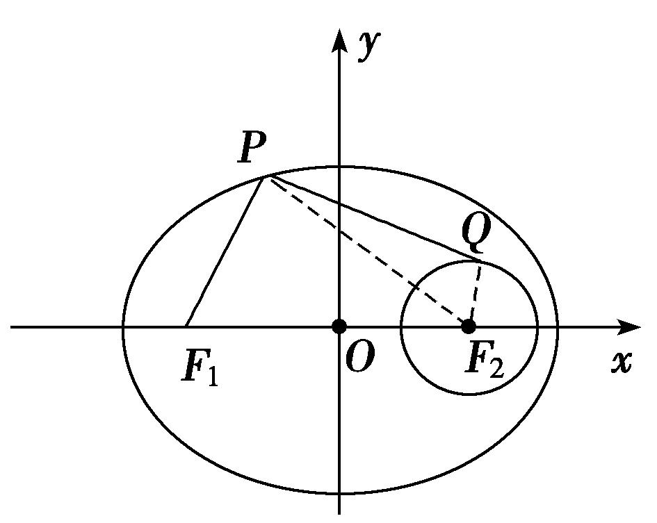
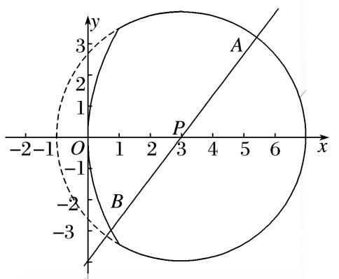
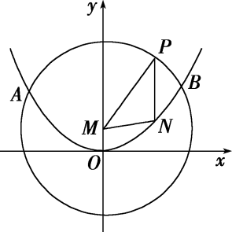
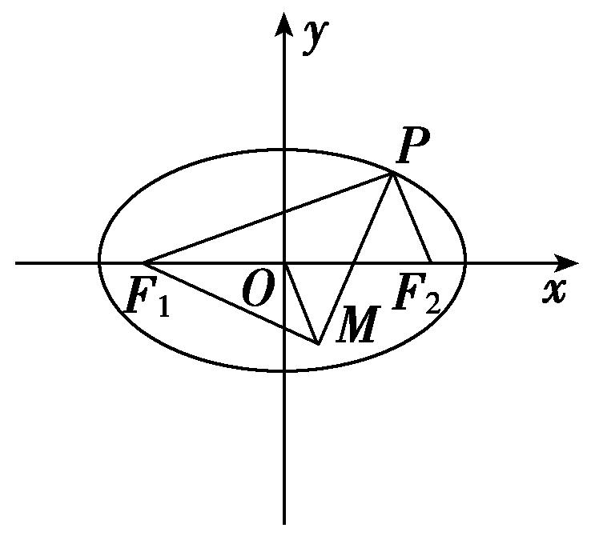
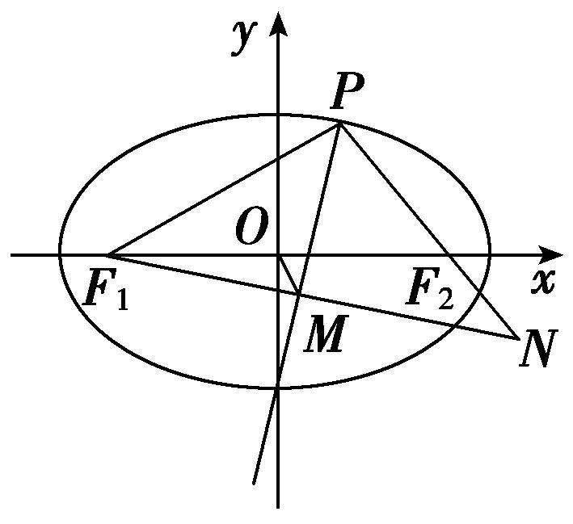

专题12　范围问题模型

圆锥曲线中范围问题求解的基本思路
解决有关范围问题的基本思路是建立目标函数或不等关系：

建立目标函数的关键是选用一个合适的变量，其原则是这个变量能够表达要解决的问题，利用求函数的值域的方法将待求量表示为其他变量的函数，求其值域，从而确定参数的取值范围；
建立不等关系时，先要恰当地引入变量(如点的坐标、角、斜率等)，寻找不等关系．

圆锥曲线中范围问题建立不等关系的基本方法  
（1）利用圆锥曲线的几何性质或判别式构造不等关系，从而确定参数的取值范围；  
（2）利用已知参数的范围，求新参数的范围，解这类问题的核心是建立两个参数之间的等量关系；  
（3）利用已知的不等关系构造不等式，从而求出参数的取值范围；  
（4）利用隐含的不等关系建立不等式，从而求出参数的取值范围．

1．用函数思想解决的模型

【例题选讲】

<strong>[例1]</strong>　（1）若点<em>O</em>和点<em>F</em>(－2，0)分别为双曲线－<em>y</em>2＝1(<em>a</em>＞0)的中心和左焦点，点<em>P</em>为双曲线右支上的任意一点，则·的取值范围为\_\_\_\_\_\_\_\_．

<strong>答案</strong>　[3＋2，＋∞)　<strong>解析</strong>　由题意，得22＝<em>a</em>2＋1，即<em>a</em>＝，设<em>P</em>(<em>x</em>，<em>y</em>)，<em>x</em>≥，＝(<em>x</em>＋2，<em>y</em>)，则·＝(<em>x</em>＋2)<em>x</em>＋<em>y</em>2＝<em>x</em>2＋2<em>x</em>＋－1＝－，因为<em>x</em>≥，所以·的取值范围为[3＋2，＋∞)．  
（2）已知椭圆<em>C</em>：＋＝1的左、右焦点分别为<em>F</em>1、<em>F</em>2，以<em>F</em>2为圆心作半径为1的圆<em>F</em>2，<em>P</em>为椭圆<em>C</em>上一点，<em>Q</em>为圆<em>F</em>2上一点，则|<em>PF</em>1|＋|<em>PQ</em>|的取值范围为\_\_\_\_\_\_\_\_．

<strong>答案</strong>　[5，7]　<strong>解析</strong>　如图所示，|<em>PF</em>1|＋|<em>PQ</em>|＝2<em>a</em>－|<em>PF</em>2|＋|<em>PQ</em>|≤2<em>a</em>＋|<em>QF</em>2|＝6＋1＝7．又|<em>PF</em>1|＋|<em>PQ</em>|≥|<em>PF</em>1|＋|<em>PF</em>2|－|<em>QF</em>2|＝6－1＝5．∴|<em>PF</em>1|＋|<em>PQ</em>|的取值范围是[5，7]．故答案为：[5，7]．

  
（3）在椭圆＋＝1上任意一点*P*，*Q*与*P*关于*x*轴对称，若有·≤1，则与的夹角余弦值的范围为\_\_\_\_\_\_\_\_．

<strong>答案　　解析</strong>　设<em>P</em>(<em>x</em>，<em>y</em>)，则<em>Q</em>点(<em>x</em>，－<em>y</em>)，椭圆＋＝1的焦点坐标为(－，0)，(，0)，∵·≤1，∴<em>x</em>2－2＋<em>y</em>2≤1，结合＋＝1，可得<em>y</em>2∈[1,2]．故与的夹角<em>θ</em>满足：cos <em>θ</em>＝＝＝＝－3＋∈．

【对点训练】

1．已知<em>F</em>1，<em>F</em>2是双曲线－＝1(<em>a</em>&gt;0，<em>b</em>&gt;0)的左、右焦点，点<em>P</em>在双曲线的右支上，如果|<em>PF</em>1|＝<em>t</em>|<em>PF</em>2|(<em>t</em>∈(1，

3])，则双曲线经过一、三象限的渐近线的斜率的取值范围是\_\_\_\_\_\_\_\_\_\_\_\_\_\_．

1．<strong>答案</strong>　(0，]　<strong>解析</strong>　由双曲线的定义及题意可得解得又|<em>PF</em>1|

＋|<em>PF</em>2|≥2<em>c</em>，∴|<em>PF</em>1|＋|<em>PF</em>2|＝＋≥2<em>c</em>，整理得e＝≤＝1＋，∵1&lt;<em>t</em>≤3，∴1＋≥2，∴1&lt;e≤2．又＝＝<em>e</em>2－1，∴0&lt;≤3，故0&lt;≤．∴双曲线经过一、三象限的渐近线的斜率的取值范围是(0，]．

2．已知过抛物线<em>C</em>：<em>y</em>2＝8<em>x</em>的焦点<em>F</em>的直线<em>l</em>交抛物线于<em>P</em>，<em>Q</em>两点，若<em>R</em>为线段<em>PQ</em>的中点，连接<em>OR</em>

并延长交抛物线*C*于点*S*，则的取值范围是(　　)

A．(0，2)　　　　　
B．[2，＋∞)　　　　　
C．(0，2]　　　　　
D．(2，＋∞)

2．<strong>答案</strong>　D　<strong>解析</strong>　由题意知，抛物线<em>y</em>2＝8<em>x</em>的焦点<em>F</em>的坐标为(2，0)，直线<em>l</em>的斜率存在且不为0，设

直线<em>l</em>的方程为<em>y</em>＝<em>k</em>(<em>x</em>－2)．由消去<em>y</em>整理得<em>k</em>2<em>x</em>2－4(<em>k</em>2＋2)<em>x</em>＋4<em>k</em>2＝0，设<em>P</em>(<em>x</em>1，<em>y</em>1)，<em>Q</em>(<em>x</em>2，<em>y</em>2)，<em>R</em>(<em>x</em>0，<em>y</em>0)，<em>S</em>(<em>x</em>3，<em>y</em>3)，则<em>x</em>1＋<em>x</em>2＝，故<em>x</em>0＝＝，<em>y</em>0＝<em>k</em>(<em>x</em>0－2)＝，所以<em>kOS</em>＝＝，直线<em>OS</em>的方程为<em>y</em>＝<em>x</em>，代入抛物线方程，解得<em>x</em>3＝，由条件知<em>k</em>2＞0．所以＝＝<em>k</em>2＋2＞2．选D．

3．已知椭圆<em>C</em>：＋<em>y</em>2＝1，<em>P</em>(<em>a</em>，0)为<em>x</em>轴上一动点．若存在以点<em>P</em>为圆心的圆<em>O</em>，使得椭圆<em>C</em>与圆<em>O</em>有

四个不同的公共点，则*a*的取值范围是\_\_\_\_\_\_\_\_．

3．<strong>答案　　解析</strong>　因为圆<em>O</em>的圆心在<em>x</em>轴上，则由椭圆和圆的对称性得椭圆<em>C</em>与圆<em>O</em>的四个不

同的公共点两两关于<em>x</em>轴对称，设在<em>x</em>轴上方的两个交点为<em>A</em>(<em>x</em>1，<em>y</em>1)，<em>B</em>(<em>x</em>2，<em>y</em>2)，直线<em>AB</em>的方程为<em>y</em>＝<em>kx</em>＋<em>b</em>，与椭圆方程联立消去<em>y</em>化简得(4<em>k</em>2＋1)<em>x</em>2＋8<em>kbx</em>＋4<em>b</em>2－4＝0，由<em>Δ</em>＝64<em>k</em>2<em>b</em>2－4(4<em>k</em>2＋1)(4<em>b</em>2－4)＞0，得<em>b</em>2＜4<em>k</em>2＋1，此时<em>x</em>1＋<em>x</em>2＝－，则<em>y</em>1＋<em>y</em>2＝<em>k</em>(<em>x</em>1＋<em>x</em>2)＋2<em>b</em>＝，则<em>AB</em>的中点坐标为，线段<em>AB</em>的垂直平分线方程为<em>y</em>－＝－，令<em>y</em>＝0，得点<em>P</em>的横坐标<em>a</em>＝－，则<em>a</em>2＝＜＝＜，所以－＜<em>a</em>＜．

2．用建立不等关系解决的的模型

【例题选讲】

<strong>[例2]</strong>　（4）已知椭圆<em>C</em>：＋<em>y</em>2＝1的两焦点为<em>F</em>1，<em>F</em>2，点<em>P</em>(<em>x</em>0，<em>y</em>0)满足0&lt;＋<em>y</em>&lt;1，则|<em>PF</em>1|＋|<em>PF</em>2|的取值范围是\_\_\_\_\_\_\_\_．

<strong>答案</strong>　[2，2)　<strong>解析</strong>　由点<em>P</em>(<em>x</em>0，<em>y</em>0)满足0&lt;＋<em>y</em>&lt;1，可知<em>P</em>(<em>x</em>0，<em>y</em>0)一定在椭圆内(不包括原点)，因为<em>a</em>＝，<em>b</em>＝1，所以由椭圆的定义可知|<em>PF</em>1|＋|<em>PF</em>2|&lt;2<em>a</em>＝2，又|<em>PF</em>1|＋|<em>PF</em>2|≥|<em>F</em>1<em>F</em>2|＝2，故|<em>PF</em>1|＋|<em>PF</em>2|的取值范围是[2，2)．  
（5）已知直线<em>l</em>：<em>y</em>＝<em>kx</em>＋<em>t</em>与圆<em>C</em>1：<em>x</em>2＋(<em>y</em>＋1)2＝2相交于<em>A</em>，<em>B</em>两点，且△<em>C</em>1<em>AB</em>的面积取得最大值，又直线<em>l</em>与抛物线<em>C</em>2：<em>x</em>2＝2<em>y</em>相交于不同的两点<em>M</em>，<em>N</em>，则实数<em>t</em>的取值范围是\_\_\_\_\_\_\_\_\_\_\_\_\_\_．

<strong>答案</strong>　(－∞，－4)∪(0，＋∞)　<strong>解析</strong>　根据题意得到△<em>C</em>1<em>AB</em>的面积为<em>r</em>2sin <em>θ</em>，当角度为直角时面积最大，此时△<em>C</em>1<em>AB</em>为等腰直角三角形，则圆心到直线的距离为<em>d</em>＝1，根据点到直线的距离公式得到＝1⇒1＋<em>k</em>2＝(1＋<em>t</em>)2⇒<em>k</em>2＝<em>t</em>2＋2<em>t</em>，直线<em>l</em>与抛物线<em>C</em>2：<em>x</em>2＝2<em>y</em>相交于不同的两点<em>M</em>，<em>N</em>，联立直线和抛物线方程得到<em>x</em>2－2<em>kx</em>－2<em>t</em>＝0 ，只需要此方程有两个不等根即可，<em>Δ</em>＝4<em>k</em>2＋8<em>t</em>＝4<em>t</em>2＋16<em>t</em>&gt;0 ，解得<em>t</em>的取值范围为(－∞，－4)∪(0，＋∞)．  
（6）过抛物线<em>y</em>2＝<em>x</em>的焦点<em>F</em>的直线<em>l</em>交抛物线于<em>A</em>，<em>B</em>两点，且直线<em>l</em>的倾斜角<em>θ</em>≥，点<em>A</em>在<em>x</em>轴上方，则|<em>FA</em>|的取值范围是(　　)

A．　　　　　
B．　　　　　
C．　　　　　
D．

<strong>答案</strong>　D　<strong>解析</strong>　记点<em>A</em>的横坐标是<em>x</em>1，则有|<em>AF</em>|＝<em>x</em>1＋＝＋＝＋|<em>AF</em>|cos <em>θ</em>，|<em>AF</em>|(1－cos <em>θ</em>)＝，|<em>AF</em>|＝．由≤<em>θ</em>&lt;π得－1&lt;cos <em>θ</em>≤，2－≤2(1－cos <em>θ</em>)&lt;4，&lt;≤＝1＋，即|<em>AF</em>|的取值范围是．  
（7）抛物线<em>C</em>：<em>y</em>2＝2<em>px</em>(<em>p</em>&gt;0)的焦点为<em>A</em>，其准线与<em>x</em>轴的交点为<em>B</em>，如果在直线3<em>x</em>＋4<em>y</em>＋25＝0上存在点<em>M</em>，使得∠<em>AMB</em>＝90°，则实数<em>p</em>的取值范围是\_\_\_\_\_\_\_\_．

<strong>答案</strong>　[10，＋∞)　<strong>解析</strong>　由题得<em>A</em>，<em>B</em>，∵<em>M</em>在直线3<em>x</em>＋4<em>y</em>＋25＝0上，设点<em>M</em>，∴＝，＝，又∠<em>AMB</em>＝90°，∴·＝＋2＝0，即25<em>x</em>2＋150<em>x</em>＋625－4<em>p</em>2＝0，∴<em>Δ</em>≥0，即1502－4×25×(625－4<em>p</em>2)≥0，解得<em>p</em>≥10或<em>p</em>≤－10，又<em>p</em>&gt;0，∴<em>p</em>的取值范围是[10，＋∞)．  
（8）已知双曲线<em>C</em>：－＝1(<em>a</em>&gt;0，<em>b</em>&gt;0)的左、右焦点分别为<em>F</em>1(－1，0)，<em>F</em>2(1，0)，<em>P</em>是双曲线上任一点，若双曲线的离心率的取值范围为[2，4]，则·的最小值的取值范围是\_\_\_\_\_\_\_\_．

<strong>答案　　解析</strong>　设<em>P</em>(<em>m</em>，<em>n</em>)，则－＝1，即<em>m</em>2＝<em>a</em>2．又<em>F</em>1(－1,0)，<em>F</em>2(1,0)，则＝(－1－<em>m</em>，－<em>n</em>)，＝(1－<em>m</em>，－<em>n</em>)，·＝<em>n</em>2＋<em>m</em>2－1＝<em>n</em>2＋<em>a</em>2－1＝<em>n</em>2＋<em>a</em>2－1≥<em>a</em>2－1，当且仅当<em>n</em>＝0时取等号，所以·的最小值为<em>a</em>2－1．由2≤≤4，得≤<em>a</em>≤，故－≤<em>a</em>2－1≤－，即·的最小值的取值范围是．  
（9）如图，由抛物线<em>y</em>2＝12<em>x</em>与圆<em>E</em>：(<em>x</em>－3)2＋<em>y</em>2＝16的实线部分构成图形<em>Ω</em>，过点<em>P</em>(3，0)的直线始终与图形<em>Ω</em>中的抛物线部分及圆部分有交点，则|<em>AB</em>|的取值范围为(　　)

A．[4，5]　　　　　　　
B．[7，8]　　　　　　　
C．[6，7]　　　　　　　
D．[5，6]

<strong>答案</strong>　B　<strong>解析</strong>　由题意可知抛物线<em>y</em>2＝12<em>x</em>的焦点为<em>F</em>(3，0)，圆(<em>x</em>－3)2＋<em>y</em>2＝16的圆心为<em>E</em>(3，0)，因此点<em>P</em>，<em>F</em>，<em>E</em>三点重合，所以|<em>PA</em>|＝4，设<em>B</em>(<em>x</em>0，<em>y</em>0)，则由抛物线的定义可知|<em>PB</em>|＝<em>x</em>0＋3，由得(<em>x</em>－3)2＋12<em>x</em>＝16，整理得<em>x</em>2＋6<em>x</em>－7＝0，解得<em>x</em>1＝1，<em>x</em>2＝－7(舍去)，设圆<em>E</em>与抛物线交于<em>C</em>，<em>D</em>两点，所以<em>xC</em>＝<em>xD</em>＝1，因此0≤<em>x</em>0≤1，又|<em>AB</em>|＝|<em>AP</em>|＋|<em>BP</em>|＝4＋<em>x</em>0＋3＝<em>x</em>0＋7，所以|<em>AB</em>|＝<em>x</em>0＋7∈[7，8]，故选B．

【对点训练】

4．已知<em>P</em>(<em>x</em>0，<em>y</em>0)是椭圆<em>C</em>：＋<em>y</em>2＝1上的一点，<em>F</em>1，<em>F</em>2是<em>C</em>的两个焦点，若·&lt;0，则<em>x</em>0的取值范

围是(　　)

A．　　　
B．　　　
C．　　　
D．

4．<strong>答案</strong>　A　<strong>解析</strong>　由题意可知，<em>F</em>1(－，0)，<em>F</em>2(，0)，则·＝(<em>x</em>0＋)(<em>x</em>0－)＋<em>y</em>＝<em>x</em>＋<em>y</em>－

3&lt;0，点<em>P</em>在椭圆上，则<em>y</em>＝1－，故<em>x</em>＋－3&lt;0，解得－&lt;<em>x</em>0&lt;，即<em>x</em>0的取值范围是．

5．已知直线<em>y</em>＝<em>kx</em>＋<em>t</em>与圆<em>x</em>2＋(<em>y</em>＋1)2＝1相切且与抛物线<em>C</em>：<em>x</em>2＝4<em>y</em>交于不同的两点<em>M</em>，<em>N</em>，则实数<em>t</em>的

取值范围是(　　)

A．(－∞，－3)∪(0，＋∞)　
B．(－∞，－2)∪(0，＋∞)　
C．(－3，0)　
D．(－2，0)

5．<strong>答案</strong>　A　<strong>解析</strong>　因为直线与圆相切，所以＝1，即<em>k</em>2＝<em>t</em>2＋2<em>t</em>.将直线方程代入抛物线方程并整

理得<em>x</em>2－4<em>kx</em>－4<em>t</em>＝0，于是<em>Δ</em>＝16<em>k</em>2＋16<em>t</em>＝16(<em>t</em>2＋2<em>t</em>)＋16<em>t</em>&gt;0，解得<em>t</em>&gt;0或<em>t</em>&lt;－3．故选A．

6．(2017·全国Ⅰ)设*A*，*B*是椭圆*C*：＋＝1长轴的两个端点．若*C*上存在点*M*满足∠*AMB*＝120°，则

*m*的取值范围是(　　)

A．(0，1]∪[9，＋∞)　　　　　　　　　　
B．(0，]∪[9，＋∞)

C．(0，1]∪[4，＋∞)　　　　　　　　　　
D．(0，]∪[4，＋∞)

6．<strong>答案</strong>　A　<strong>解析</strong>　当0＜<em>m</em>＜3时，焦点在<em>x</em>轴上，要使<em>C</em>上存在点<em>M</em>满足∠<em>AMB</em>＝120°，则≥tan 60°

＝，即≥，解得0＜*m*≤1.当*m*＞3时，焦点在*y*轴上，要使*C*上存在点*M*满足∠*AMB*＝120°，则≥tan 60°＝，即≥，解得*m*≥9．故*m*的取值范围为(0，1]∪[9，＋∞)．

7．如图，抛物线<em>E</em>：<em>x</em>2＝4<em>y</em>与<em>M</em>：<em>x</em>2＋(<em>y</em>－1)2＝16交于<em>A</em>，<em>B</em>两点，点<em>P</em>为劣弧上不同于<em>A</em>，<em>B</em>的一

个动点，平行于*y*轴的直线*PN*交抛物线*E*于点*N*，则△*PMN*的周长的取值范围是(　　)

A．(6，12)　　　　　　
B．(8，10)　　　　　　
C．(6，10)　　　　　　
D．(8，12)

7．<strong>答案</strong>　B　<strong>解析</strong>　由题意可得，抛物线<em>E</em>的焦点为(0，1)，圆<em>M</em>的圆心为(0，1)，半径为4，所以圆心

*M*(0，1)为抛物线的焦点，故|*NM*|等于点*N*到准线*y*＝－1的距离，又*PN*∥*y*轴，故|*PN*|＋|*NM*|等于点*P*到准线*y*＝－1的距离，由，得*y*＝3，又点*P*为劣弧上不同于*A*，*B*的一个动点，所以点*P*到准线*y*＝－1的距离的取值范围是(4，6)，又|*PM*|＝4，所以△*PMN*的周长的取值范围是(8，10)，选B．

8．已知点<em>P</em>是椭圆＋＝1上的动点，且与椭圆的四个顶点不重合，<em>F</em>1、<em>F</em>2分别是椭圆的左、右焦点，

<em>O</em>为坐标原点，若点<em>M</em>是∠<em>F</em>1<em>PF</em>2的角平分线上的一点，且<em>F</em>1<em>M</em>⊥<em>MP</em>，则|<em>OM</em>|的取值范围是\_\_\_\_\_\_\_\_．

8．<strong>答案</strong>　(0，4)　<strong>解析</strong>　解法一：由椭圆的对称性，只需研究动点<em>P</em>在第一象限内的情况，当点<em>P</em>趋近

于椭圆的上顶点时，点<em>M</em>趋近于点<em>O</em>，此时|<em>OM</em>|趋近于0；当点<em>P</em>趋近于椭圆的右顶点时，点<em>M</em>趋近于点<em>F</em>1，此时|<em>OM</em>|趋近于＝4，所以|<em>OM</em>|的取值范围为(0，4)．

解法二：如图，延长<em>PF</em>2，<em>F</em>1<em>M</em>，交于点<em>N</em>，∵<em>PM</em>是∠<em>F</em>1<em>PF</em>2的角平分线，且<em>F</em>1<em>M</em>⊥<em>MP</em>，

∴|<em>PN</em>|＝|<em>PF</em>1|，<em>M</em>为<em>F</em>1<em>N</em>的中点，又<em>O</em>为<em>F</em>1<em>F</em>2的中点，∴|<em>OM</em>|＝|<em>F</em>2<em>N</em>|＝||<em>PN</em>|－|<em>PF</em>2||＝(|<em>PF</em>1|－|<em>PF</em>2|)，又|<em>PF</em>1|＋|<em>PF</em>2|＝10，∴|<em>OM</em>|＝．|2|<em>PF</em>1|－10|＝|<em>PF</em>1－5|，又|<em>PF</em>1|∈(1，5)∪(5，9)，∴|<em>OM</em>|∈(0，4)，故|<em>OM</em>|的取值范围是(0，4)．

9．已知斜率为的直线<em>l</em>与抛物线<em>y</em>2＝2<em>px</em>(<em>p</em>&gt;0)交于位于<em>x</em>轴上方的不同两点<em>A</em>，<em>B</em>，记直线<em>OA</em>，<em>OB</em>的斜

率分别为<em>k</em>1，<em>k</em>2，则<em>k</em>1＋<em>k</em>2的取值范围是________．

9．<strong>答案</strong>　(2，＋∞)　<strong>解析</strong>　设直线<em>l</em>：<em>x</em>＝2<em>y</em>＋<em>t</em>，联立抛物线方程消去<em>x</em>得<em>y</em>2＝2<em>p</em>(2<em>y</em>＋<em>t</em>)⇒<em>y</em>2－4<em>py</em>－2<em>pt</em>

＝0，设<em>A</em>(<em>x</em>1，<em>y</em>1)，<em>B</em>(<em>x</em>2，<em>y</em>2)，<em>Δ</em>＝16<em>p</em>2＋8<em>pt</em>&gt;0⇒<em>t</em>&gt;－2<em>p</em>，<em>y</em>1＋<em>y</em>2＝4<em>p</em>，<em>y</em>1<em>y</em>2＝－2<em>pt</em>&gt;0⇒<em>t</em>&lt;0，即－2<em>p</em>&lt;<em>t</em>&lt;0．<em>x</em>1<em>x</em>2＝(2<em>y</em>1＋<em>t</em>)(2<em>y</em>2＋<em>t</em>)＝4<em>y</em>1<em>y</em>2＋2<em>t</em>(<em>y</em>1＋<em>y</em>2)＋<em>t</em>2＝4(－2<em>pt</em>)＋2<em>t</em>·4<em>p</em>＋<em>t</em>2＝<em>t</em>2，<em>k</em>1＋<em>k</em>2＝＋＝＝＝＝－．－2<em>p</em>&lt;<em>t</em>&lt;0，－&gt;2，即<em>k</em>1＋<em>k</em>2的取值范围是(2，＋∞)．

10．已知椭圆＋＝1(*a*＞*b*＞0)的离心率*e*的取值范围为，直线*y*＝－*x*＋1交椭圆于点*M*，*N*，

*O*是坐标原点，且*OM*⊥*ON*，则椭圆长轴长的取值范围是(　　)

A．[， ]　　　　　
B．[， ]　　　　　
C．[， ]　　　　　
D．[， ]

10．<strong>答案</strong>　C　<strong>解析</strong>　联立消去<em>y</em>，得(<em>a</em>2＋<em>b</em>2)<em>x</em>2－2<em>a</em>2<em>x</em>＋<em>a</em>2(1－<em>b</em>2)＝0，设<em>M</em>(<em>x</em>1，<em>y</em>1)，<em>N</em>(<em>x</em>2，

<em>y</em>2)，则<em>x</em>1＋<em>x</em>2＝，<em>x</em>1<em>x</em>2＝，由<em>OM</em>⊥<em>ON</em>，得<em>x</em>1<em>x</em>2＋<em>y</em>1<em>y</em>2＝0，∴<em>x</em>1<em>x</em>2＋(1－<em>x</em>1)(1－<em>x</em>2)＝0，化简得2<em>x</em>1<em>x</em>2－(<em>x</em>1＋<em>x</em>2)＋1＝0，∴－＋1＝0，化简得<em>b</em>2＝，∵<em>e</em>＝＝，∴<em>e</em>2＝1－，∵<em>e</em>∈，∴<em>e</em>2∈，∴1－∈，∴≤≤，∴≤≤，∴≤<em>a</em>2≤，∴≤<em>a</em>≤，∴≤2<em>a</em>≤，即椭圆的长轴长的取值范围为[， ]，故选C．

