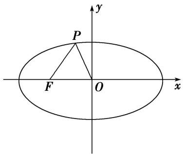
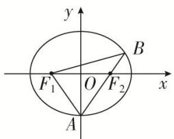
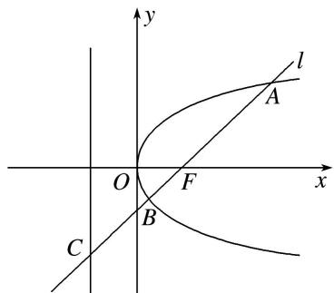

# 专题13 椭圆(抛物线)的标准方程模型

# 求解圆锥曲线标准方程的方法

(1)定型，即指定类型，也就是确定圆锥曲线的类型、焦点位置，从而设出标准方程.

(2)计算，即利用待定系数法求出方程中的 $a^2$ ， $b^{2}$ 或 $p$ 。另外，当焦点位置无法确定时，抛物线常设为 $y^{2} = 2px$ 或 $x^{2} = 2py(p\neq 0)$ ，椭圆常设为 $mx^{2} + ny^{2} = 1(m > 0,n > 0)$ ，双曲线常设为 $mx^{2} - ny^{2} = 1(mn > 0)$

# 1. 椭圆的标准方程

# 【例题选讲】

[例 1] (1)已知椭圆 $C: \frac{x^{2}}{a^{2}} + \frac{y^{2}}{b^{2}} = 1 (a > b > 0)$ 的离心率为 $\frac{1}{2}$ ，且椭圆 C 的长轴长与焦距之和为 6，则椭圆 C 的标准方程为()

A. $\frac{4x^2}{25} +\frac{y^2}{6} = 1$

B. $\frac{x^{2}}{4}+\frac{y^{2}}{2}=1$

C. $\frac{x^{2}}{2}+y^{2}=1$

D. $\frac{x^{2}}{4}+\frac{y^{2}}{3}=1$

(2)一个椭圆的中心在原点，焦点 $F_{1}$ ， $F_{2}$ 在 $x$ 轴上， $P(2, \sqrt{3})$ 是椭圆上一点，且 $|PF_{1}|$ ， $|F_{1}F_{2}|$ ， $|PF_{2}|$ 成等差数列，则椭圆的方程为（）

A. $\frac{x^2}{8} +\frac{y^2}{6} = 1$

B. $\frac{x^2}{16} +\frac{y^2}{6} = 1$

C. $\frac{x^{2}}{4}+\frac{y^{2}}{2}=1$

D. $\frac{x^{2}}{8}+\frac{y^{2}}{4}=1$

(3)如图，已知椭圆 $C$ 的中心为原点 $O, F(-5, 0)$ 为 $C$ 的左焦点， $P$ 为 $C$ 上一点，满足 $|OP| = |OF|$ 且 $|PF| = 6$ ，则椭圆 $C$ 的方程为（）

text_image

P
F O x
y

A. $\frac{x^2}{36} +\frac{y^2}{16} = 1$

B. $\frac{x^2}{40} +\frac{y^2}{15} = 1$

C. $\frac{x^2}{49} +\frac{y^2}{24} = 1$

D. $\frac{x^2}{45} +\frac{y^2}{20} = 1$

(4) (2013·全国 I )已知椭圆 $E: \frac{x^2}{a^2} + \frac{y^2}{b^2} = 1 (a > b > 0)$ 的右焦点为 $F(3, 0)$ ，过点 $F$ 的直线交椭圆 $E$ 于 $A$ ， $B$ 两点。若 $AB$ 的中点坐标为 $(1, -1)$ ，则椭圆 $E$ 的方程为（）

A. $\frac{x^2}{45} +\frac{y^2}{36} = 1$

B. $\frac{x^2}{36} +\frac{y^2}{27} = 1$

C. $\frac{x^2}{27} +\frac{y^2}{18} = 1$

D. $\frac{x^2}{18} +\frac{y^2}{9} = 1$

(5)(2019·全国 I)已知椭圆 C 的焦点为 $F_{1}(-1,0)$ ， $F_{2}(1,0)$ ，过 $F_{2}$ 的直线与 C 交于 A，B 两点。若 $|AF_{2}| = 2|F_{2}B|$ ， $|AB| = |BF_{1}|$ ，则 C 的方程为（）

A. $\frac{x^2}{2} + y^2 = 1$

B. $\frac{x^2}{3} +\frac{y^2}{2} = 1$

C. $\frac{x^2}{4} +\frac{y^2}{3} = 1$

D. $\frac{x^{2}}{5}+\frac{y^{2}}{4}=1$

text_image

y
B
F₁ O F₂ x
A

(6)设 $F_{1}$ , $F_{2}$ 分别是椭圆 $E$ : $x^{2} + \frac{y^{2}}{b^{2}} = 1 (0 < b < 1)$ 的左、右焦点，过点 $F_{1}$ 的直线交椭圆 $E$ 于 $A$ , $B$ 两点，若 $|AF_{1}| = 3|F_{1}B|$ , $AF_{2} \perp x$ 轴，则椭圆 $E$ 的方程为 \_\_\_\_.

# 【对点训练】

1. 已知中心在原点的椭圆 $C$ 的右焦点为 $F(1, 0)$ , 离心率等于 $\frac{1}{2}$ , 则 $C$ 的方程是 ( )

A. $\frac{x^2}{3} +\frac{y^2}{4} = 1$

B. $\frac{x^2}{4} +\frac{y^2}{\sqrt{3}} = 1$

C. $\frac{x^2}{4} +\frac{y^2}{3} = 1$

D. $\frac{x^2}{4} + y^2 = 1$

2. 已知椭圆 $C: \frac{x^2}{a^2} + \frac{y^2}{b^2} = 1 (a > b > 0)$ , 若长轴长为 6, 且两焦点恰好将长轴三等分, 则此椭圆的标准方程为 ( )

A. $\frac{x^2}{36} +\frac{y^2}{32} = 1$

B. $\frac{x^2}{9} +\frac{y^2}{8} = 1$

C. $\frac{x^{2}}{9}+\frac{y^{2}}{5}=1$

D. $\frac{x^2}{16} +\frac{y^2}{12} = 1$

3. 已知椭圆的中心在原点，离心率 $e = \frac{1}{2}$ ，且它的一个焦点与抛物线 $y^{2} = -4x$ 的焦点重合，则此椭圆方程为（）

A. $\frac{x^2}{4} +\frac{y^2}{3} = 1$

B. $\frac{x^2}{8} +\frac{y^2}{6} = 1$

C. $\frac{x^2}{2} + y^2 = 1$

D. $\frac{x^2}{4} + y^2 = 1$

4. 已知椭圆 $G$ 的中心在坐标原点, 长轴在 $x$ 轴上, 离心率为 $\frac{\sqrt{3}}{2}$ , 且椭圆 $G$ 上一点到两个焦点的距离之和为 12, 则椭圆 $G$ 的方程为 ( )

A. $\frac{x^{2}}{36}+\frac{y^{2}}{9}=1$

B. $\frac{x^2}{9} +\frac{y^2}{36} = 1$

C. $\frac{x^2}{4} +\frac{y^2}{9} = 1$

D. $\frac{x^2}{9} +\frac{y^2}{4} = 1$

5. 已知椭圆 $C: \frac{x^2}{a^2} + \frac{y^2}{b^2} = 1 (a > b > 0)$ 的左、右焦点分别为 $F_1, F_2$ ，离心率为 $\frac{2}{3}$ ，过 $F_2$ 的直线 $l$ 交 $C$ 于 $A$ ， $B$ 两点，若 $\triangle AF_1B$ 的周长为 12，则椭圆 $C$ 的标准方程为（）

A. $\frac{x^2}{3} + y^2 = 1$

B. $\frac{x^{2}}{3}+\frac{y^{2}}{2}=1$

C. $\frac{x^{2}}{9}+\frac{y^{2}}{4}=1$

D. $\frac{x^{2}}{9}+\frac{y^{2}}{5}=1$

6. 已知 $F_{1}(-1, 0)$ , $F_{2}(1, 0)$ 是椭圆 $C$ 的焦点, 过 $F_{2}$ 且垂直于 $x$ 轴的直线交椭圆 $C$ 于 $A$ , $B$ 两点, 且 $|AB| = 3$ , 则 $C$ 的方程为 ( )

A. $\frac{x^2}{2} + y^2 = 1$

B. $\frac{x^2}{3} +\frac{y^2}{2} = 1$

C. $\frac{x^{2}}{4}+\frac{y^{2}}{3}=1$

D. $\frac{x^2}{5} +\frac{y^2}{4} = 1$

7. 中心为 $(0, 0)$ , 一个焦点为 $F(0, 5\sqrt{2})$ 的椭圆, 截直线 $y = 3x - 2$ 所得弦中点的横坐标为 $\frac{1}{2}$ , 则该椭圆的方程是 ( )

A. $\frac{2x^{2}}{75}+\frac{2y^{2}}{25}=1$

B. $\frac{x^2}{75} +\frac{y^2}{25} = 1$

C. $\frac{x^2}{25} +\frac{y^2}{75} = 1$

D. $\frac{2x^2}{25} +\frac{2y^2}{75} = 1$

8. 已知椭圆 $C: \frac{x^2}{a^2} + \frac{y^2}{b^2} = 1 (a > b > 0)$ 的离心率为 $\frac{\sqrt{3}}{2}$ . 双曲线 $x^2 - y^2 = 1$ 的渐近线与椭圆 $C$ 有四个交点, 以这四个交点为顶点的四边形的面积为 16, 则椭圆 $C$ 的方程为 ( )

A. $\frac{x^{2}}{8}+\frac{y^{2}}{2}=1$

B. $\frac{x^{2}}{12}+\frac{y^{2}}{6}=1$

C. $\frac{x^{2}}{16}+\frac{y^{2}}{4}=1$

D. $\frac{x^{2}}{20}+\frac{y^{2}}{5}=1$

9. 设 $F_{1}, F_{2}$ 为椭圆 $C: \frac{x^{2}}{a^{2}} + \frac{y^{2}}{b^{2}} = 1 (a > b > 0)$ 的左、右焦点，经过 $F_{1}$ 的直线交椭圆 $C$ 于 $A, B$ 两点，若 $\triangle F_{2}AB$ 的面积为 $4\sqrt{3}$ 的等边三角形，则椭圆 $C$ 的方程为 \_\_\_\_.

10. 已知椭圆 $C: \frac{x^2}{a^2} + \frac{y^2}{b^2} = 1 (a > b > 0)$ 的左、右焦点为 $F_1, F_2$ ，左、右顶点为 $M, N$ ，过 $F_2$ 的直线 $l$ 交 $C$ 于 $A$ ， $B$ 两点(异于 $M, N$ )， $\triangle AF_1B$ 的周长为 $4\sqrt{3}$ ，且直线 $AM$ 与 $AN$ 的斜率之积为 $-\frac{2}{3}$ ，则 $C$ 的方程为（）

A. $\frac{x^{2}}{12}+\frac{y^{2}}{8}=1$

B. $\frac{x^{2}}{12}+\frac{y^{2}}{4}=1$

C. $\frac{x^2}{3} +\frac{y^2}{2} = 1$

D. $\frac{x^2}{3} + y^2 = 1$

11. 已知中心在坐标原点的椭圆 $C$ 的右焦点为 $F(1, 0)$ , 点 $F$ 关于直线 $y = \frac{1}{2} x$ 的对称点在椭圆 $C$ 上, 则椭圆 $C$ 的方程为 \_\_\_\_.

12. 椭圆 $C_{1}$ : $\frac{x^{2}}{a^{2}} + \frac{y^{2}}{b^{2}} = 1$ 的离心率为 $e_{1}$ , 双曲线 $C_{2}$ : $\frac{x^{2}}{a^{2}} - \frac{y^{2}}{b^{2}} = 1$ 的离心率为 $e_{2}$ , 其中, $a > b > 0$ , $\frac{e_{1}}{e_{2}} = \frac{\sqrt{3}}{3}$ , 直线 $l$ : $x - y + 3 = 0$ 与椭圆 $C_{1}$ 相切, 则椭圆 $C_{1}$ 的方程为( )

A. $\frac{x^2}{2} + y^2 = 1$

B. $\frac{x^2}{4} +\frac{y^2}{2} = 1$

C. $\frac{x^{2}}{6}+\frac{y^{2}}{3}=1$

D. $\frac{x^2}{16} +\frac{y^2}{8} = 1$

13. 若椭圆 $\frac{x^2}{a^2} + \frac{y^2}{b^2} = 1$ 的焦点在 $x$ 轴上，过点 $(1, \frac{1}{2})$ 作圆 $x^2 + y^2 = 1$ 的切线，切点分别为 $A, B$ ，直线 $AB$ 恰好经过椭圆的右焦点和上顶点，则椭圆方程是（）

A. $\frac{x^{2}}{5}+\frac{y^{2}}{4}=1$

B. $\frac{x^{2}}{4}+\frac{y^{2}}{5}=1$

C. $\frac{x^{2}}{25}+\frac{y^{2}}{16}=1$

D. $\frac{x^{2}}{16}+\frac{y^{2}}{25}=1$

14. 已知 $F_{1}$ , $F_{2}$ 为椭圆 $C$ : $\frac{x^{2}}{a^{2}} + \frac{y^{2}}{b^{2}} = 1 (a > b > 0)$ 的左、右焦点, 过原点 $O$ 且倾斜角为 $30^{\circ}$ 的直线 $l$ 与椭圆 $C$ 的一个交点为 $A$ , 若 $AF_{1} \perp AF_{2}$ , $S_{\triangle F_{1}AF_{2}} = 2$ , 则椭圆 $C$ 的方程为 ( )

A. $\frac{x^2}{6} +\frac{y^2}{2} = 1$

B. $\frac{x^2}{8} +\frac{y^2}{4} = 1$

C. $\frac{x^{2}}{8}+\frac{y^{2}}{2}=1$

D. $\frac{x^2}{20} +\frac{y^2}{16} = 1$

# 2. 抛物线的标准方程

# 【例题选讲】

[例 2] (7)已知抛物线 $y^{2}=2px(p>0)$ 上的点 M 到其焦点 F 的距离比点 M 到 y 轴的距离大 $\frac{1}{2}$ ，则抛物线的标准方程为()

A. $y^{2}=x$

B. $y^{2}=2x$

C. $y^{2}=4x$

D. $y^{2}=8x$

(8)如图, 过抛物线 $y^{2} = 2px (p > 0)$ 的焦点 $F$ 的直线 $l$ 交抛物线于点 $A, B$ , 交其准线于点 $C$ , 若 $|BC| = 2|BF|$ , 且 $|AF| = 3$ , 则此抛物线方程为( )

A. $y^{2}=9x$

B. $y^{2}=6x$

C. $y^{2}=3x$

D. $y^{2}=\sqrt{3}x$

text_image

y
l
A
O
F
x
B
C

(9)已知圆 $C_1: x^2 + (y - 2)^2 = 4$ ，抛物线 $C_2: y^2 = 2px (p > 0)$ ， $C_1$ 与 $C_2$ 相交于 $A$ ， $B$ 两点， $|AB| = \frac{8\sqrt{5}}{5}$ ，则抛物线 $C_2$ 的方程为 \_\_\_\_.

(10)已知 $F_{1}$ , $F_{2}$ 分别是双曲线 $3x^{2} - y^{2} = 3a^{2}(a > 0)$ 的左、右焦点, $P$ 是抛物线 $y^{2} = 8ax$ 与双曲线的一个交点, 若 $|PF_{1}| + |PF_{2}| = 12$ , 则抛物线的方程为 ( )

A. $y^{2}=9x$

B. $y^{2}=8x$

C. $y^{2}=3x$

D. $y^{2}=\sqrt{3}x$

# 【对点训练】

15. 已知抛物线 $C$ 的顶点是原点 $O$ , 焦点 $F$ 在 $x$ 轴的正半轴上, 经过点 $F$ 的直线与抛物线 $C$ 交于 $A$ , $B$ 两点, 若 $\overrightarrow{OA} \cdot \overrightarrow{OB} = -12$ , 则抛物线 $C$ 的方程为 ( )

A. $x^{2} = 8y$

B. $x^{2}=4y$

C. $y^{2}=8x$

D. $y^{2}=4x$

16. 直线 $l$ 过抛物线 $y^{2} = -2px (p > 0)$ 的焦点，且与该抛物线交于 $A, B$ 两点，若线段 $AB$ 的长是 8， $AB$ 的中点到 $y$ 轴的距离是 2，则此抛物线的方程是（）

A. $y^{2}=-12x$

B. $y^{2}=-8x$

C. $y^{2}=-6x$

D. $y^{2}=-4x$

17. 已知双曲线 $C_1: \frac{x^2}{a^2} - \frac{y^2}{b^2} = 1 (a > 0, b > 0)$ 的离心率为 2。若抛物线 $C_2: x^2 = 2py(p > 0)$ 的焦点到双曲线 $C_1$ 的渐近线的距离为 2，则抛物线 $C_2$ 的方程为 \_\_\_\_.

18. 设抛物线 $C: y^{2} = 2px (p > 0)$ 的焦点为 $F$ , 点 $M$ 在抛物线 $C$ 上, $|MF| = 5$ , 若以 $MF$ 为直径的圆过点 $(0, 2)$ , 则抛物线 $C$ 的方程为 ( )

A. $y^{2}=4x$ 或 $y^{2}=8x$

B. $y^{2}=2x$ 或 $y^{2}=8x$

C. $y^{2}=4x$ 或 $y^{2}=16x$

D. $y^{2} = 2x$ 或 $y^{2} = 16x$

19. 抛物线 $C: y^{2} = 2px (p > 0)$ 的焦点为 $F$ , 点 $O$ 是坐标原点, 过点 $O$ , $F$ 的圆与抛物线 $C$ 的准线相切, 且该圆的面积为 $36\pi$ , 则抛物线的方程为 \_\_\_\_.

