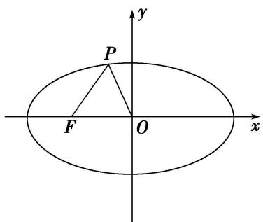
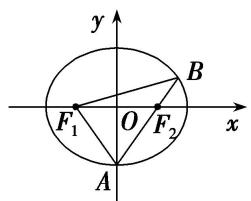
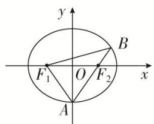
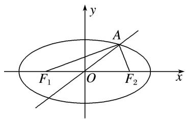
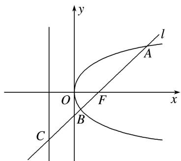
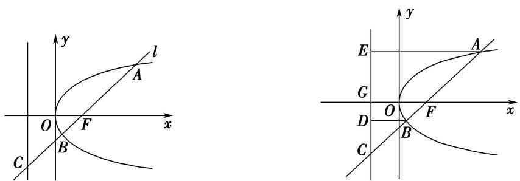

# 专题 13 椭圆(抛物线)的标准方程模型

# 求解圆锥曲线标准方程的方法

(1)定型，即指定类型，也就是确定圆锥曲线的类型、焦点位置，从而设出标准方程.

(2)计算，即利用待定系数法求出方程中的 $a^{2}$ ， $b^{2}$ 或 p．另外，当焦点位置无法确定时，抛物线常设为 $y^{2}=2px$ 或 $x^{2}=2py(p\neq0)$ ，椭圆常设为 $mx^{2}+ny^{2}=1(m>0,\ n>0)$ ，双曲线常设为 $mx^{2}-ny^{2}=1(mn>0)$ .

# 1. 椭圆的标准方程

# 【例题选讲】

[例 1] (1)已知椭圆 $C: \frac{x^{2}}{a^{2}} + \frac{y^{2}}{b^{2}} = 1 (a > b > 0)$ 的离心率为 $\frac{1}{2}$ ，且椭圆 C 的长轴长与焦距之和为 6，则椭圆 C 的标准方程为()

A. $\frac{4x^2}{25} +\frac{y^2}{6} = 1$

B. $\frac{x^2}{4} +\frac{y^2}{2} = 1$

C. $\frac{x^2}{2} + y^2 = 1$

D. $\frac{x^2}{4} +\frac{y^2}{3} = 1$

答案 D 解析 依题意椭圆 $C: \frac{x^2}{a^2} + \frac{y^2}{b^2} = 1 (a > b > 0)$ 的离心率为 $\frac{1}{2}$ 得 $\frac{c}{a} = \frac{1}{2}$ ，椭圆 $C$ 的长轴长与焦距之和为 $6, 2a + 2c = 6$ ，解得 $a = 2$ ， $c = 1$ ，则 $b = \sqrt{3}$ ，所以椭圆 $C$ 的标准方程为： $\frac{x^2}{4} + \frac{y^2}{3} = 1$ ，故选 D.

(2)一个椭圆的中心在原点，焦点 $F_{1}$ ， $F_{2}$ 在 $x$ 轴上， $P(2, \sqrt{3})$ 是椭圆上一点，且 $|PF_{1}|$ ， $|F_{1}F_{2}|$ ， $|PF_{2}|$ 成等差数列，则椭圆的方程为（）

A. $\frac{x^2}{8} +\frac{y^2}{6} = 1$

B. $\frac{x^2}{16} +\frac{y^2}{6} = 1$

C. $\frac{x^2}{4} +\frac{y^2}{2} = 1$

D. $\frac{x^2}{8} +\frac{y^2}{4} = 1$

答案 A 解析 设椭圆的标准方程为 $\frac{x^2}{a^2} + \frac{y^2}{b^2} = 1 (a > b > 0)$ ，由点 $P(2, \sqrt{3})$ 在椭圆上，知 $\frac{4}{a^2} + \frac{3}{b^2} = 1$ 。又 $|PF_1|$ ， $|F_1F_2|$ ， $|PF_2|$ 成等差数列，则 $|PF_1| + |PF_2| = 2|F_1F_2|$ ，即 $2a = 2 \times 2c$ ，则 $\frac{c}{a} = \frac{1}{2}$ 。又 $c^2 = a^2 - b^2$ ，联立 $\left\{ \begin{array}{l} \frac{4}{a^2} + \frac{3}{b^2} = 1, \\ c^2 = a^2 - b^2, \\ \frac{c}{a} = \frac{1}{2}, \end{array} \right.$ 得 $a^2 = 8, b^2 = 6$ ，故椭圆的方程为 $\frac{x^2}{8} + \frac{y^2}{6} = 1$ 。

(3)如图，已知椭圆 C 的中心为原点 O, $F(-5, 0)$ 为 C 的左焦点，P 为 C 上一点，满足 $|OP|=|OF|$ 且 $|PF|=6$ ，则椭圆 C 的方程为（）

text_image

P
F O x
y

A. $\frac{x^2}{36} +\frac{y^2}{16} = 1$

B. $\frac{x^2}{40} +\frac{y^2}{15} = 1$

C. $\frac{x^2}{49} +\frac{y^2}{24} = 1$

D. $\frac{x^2}{45} +\frac{y^2}{20} = 1$

答案 C 解析 由题意可得 c=5，设右焦点为 $F'$ ，连接 $PF'$ ，由 $|OP|=|OF|=|OF'|$ 知， $\angle PFF'=\angle FPO$ ， $\angle OF'P=\angle OPF'$ ， $\therefore \angle PFF'+\angle OF'P=\angle FPO+\angle OPF'$ ， $\therefore \angle FPO+\angle OPF'=90^{\circ}$ ，即 $PF\perp PF'$ 。在 Rt△PFF'中，由勾股定理，得 $|PF'|=\sqrt{|FF'|^{2}-|PF|^{2}}=\sqrt{10^{2}-6^{2}}=8$ ，由椭圆的定义，得 $|PF|+|PF'|=2a=6+8=14$ ，从而a=7， $a^{2}=49$ ，于是 $b^{2}=a^{2}-c^{2}=49-5^{2}=24$ ，∴椭圆C的方程为 $\frac{x^{2}}{49}+\frac{y^{2}}{24}=1$ ，故选C.

(4) (2013·全国 I )已知椭圆 $E: \frac{x^2}{a^2} + \frac{y^2}{b^2} = 1 (a > b > 0)$ 的右焦点为 $F(3, 0)$ ，过点 $F$ 的直线交椭圆 $E$ 于 $A$ ， $B$ 两点。若 $AB$ 的中点坐标为 $(1, -1)$ ，则椭圆 $E$ 的方程为（）

A. $\frac{x^2}{45} +\frac{y^2}{36} = 1$

B. $\frac{x^2}{36} +\frac{y^2}{27} = 1$

C. $\frac{x^2}{27} +\frac{y^2}{18} = 1$

D. $\frac{x^2}{18} +\frac{y^2}{9} = 1$

答案 D 解析 由题意知直线 AB 的斜率 $k=\frac{0-(-1)}{3-1}=\frac{1}{2}$ ，设 $A(x_{1},y_{1})$ ， $B(x_{2},y_{2})$ ，则 $\left\{\begin{aligned}\frac{x_{1}^{2}}{a^{2}}+\frac{y_{1}^{2}}{b^{2}}=1,\quad①\\ \frac{x_{2}^{2}}{a^{2}}+\frac{y_{2}^{2}}{b^{2}}=1,\quad②\end{aligned}\right.$ ①-②整理得 $\frac{y_{1}-y_{2}}{x_{1}-x_{2}}=-\frac{b^{2}}{a^{2}}\cdot\frac{x_{1}+x_{2}}{y_{1}+y_{2}}$ ，即 $k=-\frac{b^{2}}{a^{2}}\times\frac{2}{-2}=\frac{1}{2}$ ，∴ $\frac{b^{2}}{a^{2}}=\frac{1}{2}$ 。又 $a^{2}-b^{2}=c^{2}=9$ ，
∴ $a^{2}=18,\ b^{2}=9$ ．∴椭圆E的方程为 $\frac{x^{2}}{18}+\frac{y^{2}}{9}=1$

(5)(2019·全国 I )已知椭圆 C 的焦点为 $F_{1}(-1,0)$ ， $F_{2}(1,0)$ ，过 $F_{2}$ 的直线与 C 交于 A，B 两点。若 $|AF_{2}| = 2|F_{2}B|$ ， $|AB| = |BF_{1}|$ ，则 C 的方程为（）

A. $\frac{x^2}{2} + y^2 = 1$

B. $\frac{x^2}{3} +\frac{y^2}{2} = 1$

C. $\frac{x^{2}}{4}+\frac{y^{2}}{3}=1$

D. $\frac{x^2}{5} +\frac{y^2}{4} = 1$

答案 B 解析 解法一 由题意设椭圆的方程为 $\frac{x^2}{a^2} + \frac{y^2}{b^2} = 1 (a > b > 0)$ ，连接 $F_1A$ ，令 $|F_2B| = m$ ，则 $|AF_2| = 2m$ ， $|BF_1| = 3m$ 。由椭圆的定义知， $4m = 2a$ ，得 $m = \frac{a}{2}$ ，故 $|F_2A| = a = |F_1A|$ ，则点 $A$ 为椭圆 $C$ 的上顶点或下顶点。令 $\angle OAF_2 = \theta (O$ 为坐标原点)，则 $\sin \theta = \frac{1}{a}$ 。在等腰三角形 $ABF_1$ 中， $\cos 2\theta = \frac{\frac{a}{2}}{\frac{3a}{2}} = \frac{1}{3}$ ，所以 $\frac{1}{3} = 1 - 2\left(\frac{1}{a}\right)^2$ ，得 $a^2 = 3$ 。又 $c^2 = 1$ ，所以 $b^2 = a^2 - c^2 = 2$ ，椭圆 $C$ 的方程为 $\frac{x^2}{3} + \frac{y^2}{2} = 1$ 。故选 B.

text_image

y
B
F₁ O F₂ x
A

解法二 设椭圆的标准方程为 $\frac{x^2}{a^2} +\frac{y^2}{b^2} = 1(a > b > 0)$ 。由椭圆的定义可得 $|AF_1| + |AB| + |BF_1| = 4a$ 。 $\because |AB| = |BF_1|$ ， $|AF_2| = 2|F_2B|$ ， $\therefore |AB| = |BF_1| = \frac{3}{2} |AF_2|$ ， $\therefore |AF_1| + 3|AF_2| = 4a$ 。又 $\because |AF_1| + |AF_2| = 2a$ ， $\therefore |AF_1| = |AF_2| = a$ ， $\therefore$ 点 $A$ 是椭圆的短轴端点，如图。不妨设 $A(0, -b)$ ，由 $F_{2}(1, 0)$ ， $\overrightarrow{AF_2} = 2\overrightarrow{F_2B}$ ，得 $B\left(\frac{3}{2}, \frac{b}{2}\right)$ 。由点 $B$ 在椭圆上，得 $\frac{\underline{9}}{a^2} + \frac{b^2}{b^2} = 1$ ，得 $a^2 = 3$ ， $b^2 = a^2 - c^2 = 2$ 。 $\therefore$ 椭圆 $C$ 的方程为 $\frac{x^2}{3} + \frac{y^2}{2} = 1$ 。故选 B.

text_image

y
B
F₁ O F₂ x
A

(6)设 $F_{1}$ , $F_{2}$ 分别是椭圆 $E$ : $x^{2} + \frac{y^{2}}{b^{2}} = 1 (0 < b < 1)$ 的左、右焦点，过点 $F_{1}$ 的直线交椭圆 $E$ 于 $A$ , $B$ 两点，若 $|AF_{1}| = 3|F_{1}B|$ , $AF_{2} \perp x$ 轴，则椭圆 $E$ 的方程为 \_\_\_\_.

答案 $x^{2} + \frac{3}{2} y^{2} = 1$ 解析 设 $B$ 在 $x$ 轴上的射影为 $B_{0}$ ，由题意得， $|B_{0}F_{1}| = \frac{1}{3} |F_{1}F_{2}| = \frac{2c}{3}$ ，得 $B_{0}$ 坐标为 $\left(-\frac{5c}{3}, 0\right)$ ，即 $B$ 点横坐标为 $-\frac{5c}{3}$ 。设直线 $AB$ 的斜率为 $k$ ，又直线过点 $F_{1}(-c, 0)$ ， $\therefore$ 直线 $AB$ 的方程为 $y = k(x + c)$ 。由 $\left\{ \begin{array}{l} y = k(x + c), \\ x^{2} + \frac{y^{2}}{b^{2}} = 1 \end{array} \right.$ 得 $(k^{2} + b^{2})x^{2} + 2ck^{2}x + k^{2}c^{2} - b^{2} = 0$ ，其两根为 $-\frac{5c}{3}$ 和 $c$ ，由韦达定理得 $\left\{ \begin{array}{l} -\frac{5}{3} c + c = \frac{-2ck^{2}}{k^{2} + b^{2}}, \\ -\frac{5}{3} c \times c = \frac{k^{2}c^{2} - b^{2}}{k^{2} + b^{2}}, \end{array} \right.$ 解之，得 $c^{2} = \frac{1}{3}$ ， $\therefore b^{2} = 1 - c^{2} = \frac{2}{3}$ 。 $\therefore$ 椭圆方程为 $x^{2} + \frac{3}{2} y^{2} = 1$ 。

# 【对点训练】

1. 已知中心在原点的椭圆 $C$ 的右焦点为 $F(1, 0)$ ，离心率等于 $\frac{1}{2}$ ，则 $C$ 的方程是（）

A. $\frac{x^2}{3} +\frac{y^2}{4} = 1$

B. $\frac{x^2}{4} +\frac{y^2}{\sqrt{3}} = 1$

C. $\frac{x^2}{4} +\frac{y^2}{3} = 1$

D. $\frac{x^2}{4} + y^2 = 1$

1. 答案 C 解析 依题意，所求椭圆的焦点位于 $x$ 轴上，且 $c = 1$ ， $e = \frac{c}{a} \Rightarrow a = 2$ ， $b^2 = a^2 - c^2 = 3$ ，因此其方程是 $\frac{x^2}{4} + \frac{y^2}{3} = 1$ ，故选 C.

2. 已知椭圆 $C: \frac{x^{2}}{a^{2}} + \frac{y^{2}}{b^{2}} = 1 (a > b > 0)$ ，若长轴长为 6，且两焦点恰好将长轴三等分，则此椭圆的标准方程为()

A. $\frac{x^2}{36} +\frac{y^2}{32} = 1$

B. $\frac{x^2}{9} +\frac{y^2}{8} = 1$

C. $\frac{x^2}{9} +\frac{y^2}{5} = 1$

D. $\frac{x^2}{16} +\frac{y^2}{12} = 1$

2. 答案 B 解析 椭圆长轴长为 6，即 $2a = 6$ ，得 $a = 3$ ， $\because$ 两焦点恰好将长轴三等分， $\therefore 2c = \frac{1}{3} \cdot 2a = 2$ ，得 $c = 1$ ，因此， $b^2 = a^2 - c^2 = 9 - 1 = 8$ ， $\therefore$ 此椭圆的标准方程为 $\frac{x^2}{9} + \frac{y^2}{8} = 1$ 。故选 B.

3. 已知椭圆的中心在原点，离心率 $e = \frac{1}{2}$ ，且它的一个焦点与抛物线 $y^{2} = -4x$ 的焦点重合，则此椭圆方程为（）

A. $\frac{x^{2}}{4}+\frac{y^{2}}{3}=1$

B. $\frac{x^2}{8} +\frac{y^2}{6} = 1$

C. $\frac{x^2}{2} + y^2 = 1$

D. $\frac{x^2}{4} + y^2 = 1$

3. 答案 A 解析 由题可知椭圆的焦点在 $x$ 轴上，所以设椭圆的标准方程为 $\frac{x^2}{a^2} + \frac{y^2}{b^2} = 1 (a > b > 0)$ ，而抛物

线 $y^{2}=-4x$ 的焦点为 $(-1,0)$ ，所以 c=1，又离心率 $e=\frac{c}{a}=\frac{1}{2}$ ，解得 a=2， $b^{2}=a^{2}-c^{2}=3$ ，所以椭圆方程为 $\frac{x^{2}}{4}+\frac{y^{2}}{3}=1$ 。故选 A.

4. 已知椭圆 $G$ 的中心在坐标原点, 长轴在 $x$ 轴上, 离心率为 $\frac{\sqrt{3}}{2}$ , 且椭圆 $G$ 上一点到两个焦点的距离之和为 12, 则椭圆 $G$ 的方程为 ( )

A. $\frac{x^2}{36} +\frac{y^2}{9} = 1$

B. $\frac{x^2}{9} +\frac{y^2}{36} = 1$

C. $\frac{x^2}{4} +\frac{y^2}{9} = 1$

D. $\frac{x^2}{9} +\frac{y^2}{4} = 1$

4. 答案 A 解析 依题意设椭圆 G 的方程为 $\frac{x^{2}}{a^{2}} + \frac{y^{2}}{b^{2}} = 1 (a > b > 0)$ ，∵ 椭圆上一点到两焦点的距离之和为 12，
∴ 2a = 12，∴ a = 6，∵ 椭圆的离心率为 $\frac{\sqrt{3}}{2}$ ，∴ $e = \frac{c}{a} = \sqrt{1 - \frac{b^{2}}{a^{2}}} = \frac{\sqrt{3}}{2}$ ，即 $\sqrt{1 - \frac{b^{2}}{36}} = \frac{\sqrt{3}}{2}$ ，解得 $b^{2} = 9$ ，
∴ 椭圆 G 的方程为 $\frac{x^{2}}{36} + \frac{y^{2}}{9} = 1$ ，故选 A

5. 已知椭圆 $C: \frac{x^2}{a^2} + \frac{y^2}{b^2} = 1 (a > b > 0)$ 的左、右焦点分别为 $F_1, F_2$ ，离心率为 $\frac{2}{3}$ ，过 $F_2$ 的直线 $l$ 交 $C$ 于 $A$ ， $B$ 两点，若 $\triangle AF_1B$ 的周长为 12，则椭圆 $C$ 的标准方程为（）

A. $\frac{x^2}{3} + y^2 = 1$

B. $\frac{x^2}{3} +\frac{y^2}{2} = 1$

C. $\frac{x^2}{9} +\frac{y^2}{4} = 1$

D. $\frac{x^2}{9} +\frac{y^2}{5} = 1$

5. 答案 D 解析 由椭圆的定义，知 $|AF_{1}|+|AF_{2}|=2a$ ， $|BF_{1}|+|BF_{2}|=2a$ ，所以 $\triangle AF_{1}B$ 的周长为 $|AF_{1}|+|AF_{2}|+|BF_{1}|+|BF_{2}|=4a=12$ ，所以a=3。因为椭圆的离心率 $e=\frac{c}{a}=\frac{2}{3}$ ，所以c=2，所以 $b^{2}=a^{2}-c^{2}=5$ ，所以椭圆C的方程为 $\frac{x^{2}}{9}+\frac{y^{2}}{5}=1$ ，故选D.

6. 已知 $F_{1}(-1, 0)$ , $F_{2}(1, 0)$ 是椭圆 $C$ 的焦点, 过 $F_{2}$ 且垂直于 $x$ 轴的直线交椭圆 $C$ 于 $A$ , $B$ 两点, 且 $|AB| = 3$ , 则 $C$ 的方程为 ( )

A. $\frac{x^2}{2} + y^2 = 1$

B. $\frac{x^2}{3} +\frac{y^2}{2} = 1$

C. $\frac{x^2}{4} +\frac{y^2}{3} = 1$

D. $\frac{x^2}{5} +\frac{y^2}{4} = 1$

6. 答案 C 解析 由题意，设椭圆方程为 $\frac{x^2}{a^2} + \frac{y^2}{b^2} = 1 (a > b > 0)$ ，将 $A(c, y_1)$ 代入椭圆方程得 $\frac{c^2}{a^2} + \frac{y_1^2}{b^2} = 1$ ，由此求得 $y_1^2 = \frac{b^4}{a^2}$ ，所以 $|AB| = 3 = \frac{2b^2}{a}$ ，又 $c = 1$ ， $a^2 - b^2 = c^2$ ，可解得 $a = 2$ ， $b^2 = 3$ ，所以椭圆 $C$ 的方程为 $\frac{x^2}{4} + \frac{y^2}{3} = 1$ .

7. 中心为 $(0, 0)$ , 一个焦点为 $F(0, 5\sqrt{2})$ 的椭圆, 截直线 $y = 3x - 2$ 所得弦中点的横坐标为 $\frac{1}{2}$ , 则该椭圆的方程是 ( )

A. $\frac{2x^2}{75} +\frac{2y^2}{25} = 1$

B. $\frac{x^2}{75} +\frac{y^2}{25} = 1$

C. $\frac{x^2}{25} +\frac{y^2}{75} = 1$

D. $\frac{2x^2}{25} +\frac{2y^2}{75} = 1$

7. 答案 C 解析 $c=5\sqrt{2}$ ，设椭圆方程为 $\frac{x^{2}}{a^{2}-50}+\frac{y^{2}}{a^{2}}=1$ ，联立方程 $\left\{\begin{aligned}\frac{x^{2}}{a^{2}-50}+\frac{y^{2}}{a^{2}}=1,\\ y=3x-2,\end{aligned}\right.$ 消去 y，整理得 $(10a^{2}-450)x^{2}-12(a^{2}-50)x+4(a^{2}-50)-a^{2}(a^{2}-50)=0$ ，由根与系数的关系得 $x_{1}+x_{2}=\frac{12(a^{2}-50)}{10a^{2}-450}=1$ ，解

得 $a^{2}=75$ ，所以椭圆方程为 $\frac{x^{2}}{25}+\frac{y^{2}}{75}=1$ .

8. 已知椭圆 $C: \frac{x^2}{a^2} + \frac{y^2}{b^2} = 1 (a > b > 0)$ 的离心率为 $\frac{\sqrt{3}}{2}$ . 双曲线 $x^2 - y^2 = 1$ 的渐近线与椭圆 $C$ 有四个交点, 以这四个交点为顶点的四边形的面积为 16, 则椭圆 $C$ 的方程为 ( )

A. $\frac{x^2}{8} +\frac{y^2}{2} = 1$

B. $\frac{x^2}{12} +\frac{y^2}{6} = 1$

C. $\frac{x^{2}}{16}+\frac{y^{2}}{4}=1$

D. $\frac{x^{2}}{20}+\frac{y^{2}}{5}=1$

8. 答案 D 解析 双曲线 $x^{2} - y^{2} = 1$ 的渐近线为 $y = \pm x$ ，与椭圆 $C$ 有四个交点，以这四个交点为顶点的四边形面积为 16，可得四边形为正方形，其边长为 4，双曲线的渐近线与椭圆 $C$ 的一个交点为 (2, 2)，所以有 $\frac{4}{a^2} + \frac{4}{b^2} = 1$ ，又因为 $e = \frac{c}{a} = \frac{\sqrt{3}}{2}$ ， $a^2 = b^2 + c^2$ ，联立解方程组得 $a^2 = 20$ ， $b^2 = 5$ ，故选 D 项.

9. 设 $F_{1}, F_{2}$ 为椭圆 $C: \frac{x^{2}}{a^{2}} + \frac{y^{2}}{b^{2}} = 1 (a > b > 0)$ 的左、右焦点，经过 $F_{1}$ 的直线交椭圆 $C$ 于 $A, B$ 两点，若 $\triangle F_{2}AB$ 的面积为 $4\sqrt{3}$ 的等边三角形，则椭圆 $C$ 的方程为 \_\_\_\_.

9. 答案 $\frac{x^2}{9} + \frac{y^2}{6} = 1$ 解析 $\because \triangle F_2AB$ 是面积为 $4\sqrt{3}$ 的等边三角形， $\therefore AB \perp x$ 轴， $\therefore A, B$ 两点的横坐标为

$-c$ ，代入椭圆方程，可求得 $|F_1A| = |F_1B| = \frac{b^2}{a}$ 。又 $|F_1F_2| = 2c$ ， $\angle F_1F_2A = 30^\circ$ ， $\therefore \frac{b^2}{a} = \frac{\sqrt{3}}{3} \times 2c$ 。①。又 $S_{\triangle F2AB} = \frac{1}{2} \times 2c \times \frac{2b^2}{a} = 4\sqrt{3}$ ，②。 $a^2 = b^2 + c^2$ ，③。由①②③解得 $a^2 = 9$ ， $b^2 = 6$ ， $c^2 = 3$ ， $\therefore$ 椭圆 $C$ 的方程为 $\frac{x^2}{9} + \frac{y^2}{6} = 1$ 。

10. 已知椭圆 $C: \frac{x^2}{a^2} + \frac{y^2}{b^2} = 1 (a > b > 0)$ 的左、右焦点为 $F_1, F_2$ ，左、右顶点为 $M, N$ ，过 $F_2$ 的直线 $l$ 交 $C$ 于 $A$ ， $B$ 两点(异于 $M, N$ )， $\triangle AF_1B$ 的周长为 $4\sqrt{3}$ ，且直线 $AM$ 与 $AN$ 的斜率之积为 $-\frac{2}{3}$ ，则 $C$ 的方程为（）

A. $\frac{x^2}{12} +\frac{y^2}{8} = 1$

B. $\frac{x^{2}}{12}+\frac{y^{2}}{4}=1$

C. $\frac{x^2}{3} +\frac{y^2}{2} = 1$

D. $\frac{x^2}{3} + y^2 = 1$

10. 答案 C 解析 由 $\triangle AF_{1}B$ 的周长为 $4\sqrt{3}$ ，可知 $|AF_{1}| + |AF_{2}| + |BF_{1}| + |BF_{2}| = 4a = 4\sqrt{3}$ ，解得 $a = \sqrt{3}$ ，则 $M(-\sqrt{3}, 0)$ ， $N(\sqrt{3}, 0)$ 。设点 $A(x_0, y_0)(x_0 \neq \pm \sqrt{3})$ ，由直线 $AM$ 与 $AN$ 的斜率之积为 $-\frac{2}{3}$ ，可得 $\frac{y_0}{x_0 + \sqrt{3}} \cdot \frac{y_0}{x_0 - \sqrt{3}} = -\frac{2}{3}$ ，即 $y_0^2 = -\frac{2}{3}(x_0^2 - 3)$ ，①。又 $\frac{x_0^2}{3} + \frac{y_0^2}{b^2} = 1$ ，所以 $y_0^2 = b^2\left(1 - \frac{x_0^2}{3}\right)$ ，②。由①②解得 $b^2 = 2$ 。所以 $C$ 的方程为 $\frac{x^2}{3} + \frac{y^2}{2} = 1$ 。

11. 已知中心在坐标原点的椭圆 $C$ 的右焦点为 $F(1, 0)$ , 点 $F$ 关于直线 $y = \frac{1}{2} x$ 的对称点在椭圆 $C$ 上, 则椭圆 $C$ 的方程为 \_\_\_\_.

11. 答案 $\frac{5x^2}{9} + \frac{5y^2}{4} = 1$ 解析 设椭圆方程为 $\frac{x^2}{a^2} + \frac{y^2}{b^2} = 1 (a > b > 0)$ ，由题意可知 $c = 1$ ，即 $a^2 - b^2 = 1$ ①，设点 $F(1, 0)$ 关于直线 $y = \frac{1}{2} x$ 的对称点为 $(m, n)$ ，可得 $\frac{n - 0}{m - 1} = -2$ ②。又因为点 $F$ 与其对称点的中点坐标为

$\left(\frac{m+1}{2},\frac{n}{2}\right)$ ，且中点在直线 $y=\frac{1}{2}x$ 上，所以有 $\frac{n}{2}=\frac{1}{2}\times\frac{m+1}{2}$ ③，联立②③，解得 $\left\{\begin{aligned}&m=\frac{3}{5},\\ &n=\frac{4}{5},\end{aligned}\right.$ 即对称点为 $\left(\frac{3}{5},\frac{4}{5}\right)$ ，代入椭圆方程可得 $\frac{9}{25a^{2}}+\frac{16}{25b^{2}}=1④$ ，联立①④，解得 $a^{2}=\frac{9}{5}$ ， $b^{2}=\frac{4}{5}$ ，所以椭圆方程为 $\frac{5x^{2}}{9}+\frac{5y^{2}}{4}=1$ 。

12. 椭圆 $C_1: \frac{x^2}{a^2} + \frac{y^2}{b^2} = 1$ 的离心率为 $e_1$ ，双曲线 $C_2: \frac{x^2}{a^2} - \frac{y^2}{b^2} = 1$ 的离心率为 $e_2$ ，其中， $a > b > 0$ ， $\frac{e_1}{e_2} = \frac{\sqrt{3}}{3}$ ，直线 $l: x - y + 3 = 0$ 与椭圆 $C_1$ 相切，则椭圆 $C_1$ 的方程为（）

A. $\frac{x^2}{2} + y^2 = 1$

B. $\frac{x^{2}}{4}+\frac{y^{2}}{2}=1$

C. $\frac{x^{2}}{6}+\frac{y^{2}}{3}=1$

D. $\frac{x^{2}}{16}+\frac{y^{2}}{8}=1$

12. 答案 C 解析 椭圆 $C_{1}$ : $\frac{x^{2}}{a^{2}} + \frac{y^{2}}{b^{2}} = 1$ 的离心率 $e_{1} = \frac{c_{1}}{a} = \sqrt{1 - \frac{b^{2}}{a^{2}}}$ , 双曲线 $C_{2}$ : $\frac{x^{2}}{a^{2}} - \frac{y^{2}}{b^{2}} = 1$ 的离心率 $e_{2} = \frac{c_{2}}{a} = \sqrt{1 + \frac{b^{2}}{a^{2}}}$ , 由 $\frac{e_{1}}{e_{2}} = \frac{\sqrt{3}}{3}$ , 得 $\frac{\sqrt{1 - \frac{b^{2}}{a^{2}}}}{\sqrt{1 + \frac{b^{2}}{a^{2}}}} = \frac{\sqrt{3}}{3}$ , 则 $a = \sqrt{2} b$ , 由 $\left\{ \begin{array}{l} x^{2} + 2y^{2} - 2b^{2} = 0, \\ x - y + 3 = 0, \end{array} \right.$ 得 $3x^{2} + 12x + 18 - 2b^{2} = 0$ , 由 $\Delta = 12^{2} - 4 \times 3 \times (18 - 2b^{2}) = 0$ , 解得 $b^{2} = 3$ , 则 $a^{2} = 6$ , $\therefore$ 椭圆 $C_{1}$ 的方程为 $\frac{x^{2}}{6} + \frac{y^{2}}{3} = 1$ , 故选 C.

13. 若椭圆 $\frac{x^2}{a^2} + \frac{y^2}{b^2} = 1$ 的焦点在 $x$ 轴上，过点 $(1, \frac{1}{2})$ 作圆 $x^2 + y^2 = 1$ 的切线，切点分别为 $A, B$ ，直线 $AB$ 恰好经过椭圆的右焦点和上顶点，则椭圆方程是（）

A. $\frac{x^{2}}{5}+\frac{y^{2}}{4}=1$

B. $\frac{x^2}{4} +\frac{y^2}{5} = 1$

C. $\frac{x^{2}}{25}+\frac{y^{2}}{16}=1$

D. $\frac{x^2}{16} +\frac{y^2}{25} = 1$

13. 答案 A 解析 因为一条切线为 $x = 1$ ，且直线 $AB$ 恰好经过椭圆的右焦点和上顶点，所以椭圆的右焦点为 $(1,0)$ ，即 $c = 1$ ，设点 $P(1,\frac{1}{2})$ ，连结 $OP$ ，则 $OP \perp AB$ ，因为 $k_{OP} = \frac{1}{2}$ ，所以 $k_{AB} = -2$ ，又因为直线 $AB$ 过点 $(1,0)$ ，所以直线 $AB$ 的方程为 $2x + y - 2 = 0$ ，因为点 $(0,b)$ 在直线 $AB$ 上，所以 $b = 2$ ，又因为 $c = 1$ ，所以 $a^2 = 5$ ，故椭圆方程是 $\frac{x^2}{5} + \frac{y^2}{4} = 1$ 。

14. 已知 $F_{1}$ ， $F_{2}$ 为椭圆 C: $\frac{x^{2}}{a^{2}} + \frac{y^{2}}{b^{2}} = 1 (a > b > 0)$ 的左、右焦点，过原点 O 且倾斜角为 $30^{\circ}$ 的直线 l 与椭圆 C 的一个交点为 A，若 $AF_{1} \perp AF_{2}$ ， $S_{\triangle F_{1}AF_{2}} = 2$ ，则椭圆 C 的方程为（）

A. $\frac{x^{2}}{6}+\frac{y^{2}}{2}=1$

B. $\frac{x^2}{8} +\frac{y^2}{4} = 1$

C. $\frac{x^{2}}{8}+\frac{y^{2}}{2}=1$

D. $\frac{x^2}{20} +\frac{y^2}{16} = 1$

14. 答案 A 解析 因为点 $A$ 在椭圆上，所以 $|AF_1| + |AF_2| = 2a$ ，对其平方，得 $|AF_1|^2 + |AF_2|^2 + 2|AF_1||AF_2| = 4a^2$ ，又 $AF_1 \perp AF_2$ ，所以 $|AF_1|^2 + |AF_2|^2 = 4c^2$ ，则 $2|AF_1||AF_2| = 4a^2 - 4c^2 = 4b^2$ ，即 $|AF_1| \cdot |AF_2| = 2b^2$ ，所以 $S_{\triangle F_1AF_2} = \frac{1}{2}|AF_1||AF_2| = b^2 = 2$ 。又 $\triangle AF_1F_2$ 是直角三角形， $\angle F_1AF_2 = 90^\circ$ ，且 $O$ 为 $F_1F_2$ 的中点，所以 $|OA| = \frac{1}{2}|F_1F_2| = c$ ，由已知不妨设 $A$ 点在第一象限，则 $\angle AOF_2 = 30^\circ$ ，所以 $A(\frac{\sqrt{3}}{2}c, \frac{1}{2}c)$ ，则 $S = \frac{1}{2}|F_1F_2| \cdot \frac{1}{2}c = \frac{1}{2}c^2 = 2$ ， $c^2 = 4$ ，故 $a^2 = b^2 + c^2 = 6$ ，所以椭圆方程为 $\frac{x^2}{6} + \frac{y^2}{2} = 1$ ，故选 A。

text_image

y
A
F₁ O F₂ x

# 2. 抛物线的标准方程

# 【例题选讲】

[例 2] (7)已知抛物线 $y^{2}=2px(p>0)$ 上的点 M 到其焦点 F 的距离比点 M 到 y 轴的距离大 $\frac{1}{2}$ ，则抛物线的标准方程为()

A. $y^{2}=x$

B. $y^{2}=2x$

C. $y^{2}=4x$

D. $y^{2}=8x$

答案 B 解析 由抛物线 $y^{2} = 2px (p > 0)$ 上的点 $M$ 到其焦点 $F$ 的距离比点 $M$ 到 $y$ 轴的距离大 $\frac{1}{2}$ ，根据抛物线的定义可得 $\frac{p}{2} = \frac{1}{2}$ ， $\therefore p = 1$ ，所以抛物线的标准方程为 $y^{2} = 2x$ 。故选 B.

(8)如图, 过抛物线 $y^{2} = 2px (p > 0)$ 的焦点 $F$ 的直线 $l$ 交抛物线于点 $A, B$ , 交其准线于点 $C$ , 若 $|BC| = 2|BF|$ , 且 $|AF| = 3$ , 则此抛物线方程为( )

A. $y^{2}=9x$

B. $y^{2}=6x$

C. $y^{2}=3x$

D. $y^{2}=\sqrt{3}x$

text_image

y
l
A
O
F
x
B
C

答案 C 解析 法一：如图，分别过点 A, B 作准线的垂线，分别交准线于点 E, D，设 $|BF|=a$ ，则由已知得 $|BC|=2a$ ，由抛物线定义，得 $|BD|=a$ ，故 $\angle BCD=30^{\circ}$ ，在 Rt△ACE 中，∵ $|AE|=|AF|=3$ ， $|AC|=3+3a$ ，∴ $2|AE|=|AC|$ ，即 $3+3a=6$ ，从而得 a=1， $|FC|=3a=3$ 。∴ $p=|FG|=\frac{1}{2}|FC|=\frac{3}{2}$ ，因此抛物线方程为 $y^{2}=3x$ ，故选 C.

text_image

Two coordinate diagrams showing hyperbola and parabola with labeled points and axes

法二：由法一可知 $\angle CBD = 60^{\circ}$ ，则由 $|AF| = \frac{p}{1 - \cos 60^{\circ}} = 3$ ，可知 $p = 3\left(1 - \frac{1}{2}\right) = \frac{3}{2},\therefore 2p = 3,\therefore$ 抛物线的标准方程为 $y^{2} = 3x.$

(9)已知圆 $C_1: x^2 + (y - 2)^2 = 4$ ，抛物线 $C_2: y^2 = 2px (p > 0)$ ， $C_1$ 与 $C_2$ 相交于 $A$ ， $B$ 两点， $|AB| = \frac{8\sqrt{5}}{5}$ ，则

抛物线 $C_{2}$ 的方程为 \_\_\_\_.

答案 $y^{2} = \frac{32}{5} x$ 解析 由题意，知圆 $C_{1}$ 与抛物线 $C_{2}$ 的一个交点为原点，不妨记为 $B$ ，设 $A(m, n)$ 。因为 $|AB| = \frac{8\sqrt{5}}{5}$ ，所以 $\left\{ \begin{array}{l} \sqrt{m^2 + n^2} = \frac{8\sqrt{5}}{5}, \\ m^2 + (n - 2)^2 = 4, \end{array} \right.$ 解得 $\left\{ \begin{array}{l} m = \frac{8}{5}, \\ n = \frac{16}{5}, \end{array} \right.$ 即 $A\left(\frac{8}{5}, \frac{16}{5}\right)$ 。将点 $A$ 的坐标代入抛物线方程得 $\left(\frac{16}{5}\right)^2 = 2p \times \frac{8}{5}$ ，所以 $p = \frac{16}{5}$ ，所以抛物线 $C_2$ 的方程为 $y^{2} = \frac{32}{5} x$ 。

(10)已知 $F_{1}$ , $F_{2}$ 分别是双曲线 $3x^{2} - y^{2} = 3a^{2}(a > 0)$ 的左、右焦点, $P$ 是抛物线 $y^{2} = 8ax$ 与双曲线的一个交点, 若 $|PF_{1}| + |PF_{2}| = 12$ , 则抛物线的方程为 ( )

A. $y^{2}=9x$

B. $y^{2}=8x$

C. $y^{2}=3x$

D. $y^{2}=\sqrt{3}x$

答案 $y^{2} = 8x$ 解析 将双曲线方程化为标准方程得 $\frac{x^2}{a^2} - \frac{y^2}{3a^2} = 1$ ，联立 $\begin{cases} \frac{x^2}{a^2} - \frac{y^2}{3a^2} = 1, \\ y^2 = 8ax \end{cases} \Rightarrow x = 3a$ ，即点 $P$ 的横坐标为 $3a$ 。而由 $\begin{cases} |PF_1| + |PF_2| = 12, \\ |PF_1| - |PF_2| = 2a \end{cases} \Rightarrow |PF_2| = 6 - a$ ，又易知 $F_2$ 为抛物线的焦点， $\therefore |PF_2| = 3a + 2a = 6 - a$ ，得 $a = 1$ ， $\therefore$ 抛物线的方程为 $y^{2} = 8x$ 。

# 【对点训练】

15. 已知抛物线 $C$ 的顶点是原点 $O$ , 焦点 $F$ 在 $x$ 轴的正半轴上, 经过点 $F$ 的直线与抛物线 $C$ 交于 $A$ , $B$ 两点, 若 $\overrightarrow{OA} \cdot \overrightarrow{OB} = -12$ , 则抛物线 $C$ 的方程为 ( )

A. $x^{2} = 8y$

B. $x^{2}=4y$

C. $y^{2}=8x$

D. $y^{2}=4x$

15. 答案 C 解析 由题意，设抛物线方程为 $y^{2} = 2px (p > 0)$ ，直线方程为 $x = my + \frac{p}{2}$ ，联立 $\left\{ \begin{array}{l} y^{2} = 2px, \\ x = my + \frac{p}{2}, \end{array} \right.$ 消去 $x$ 得 $y^{2} - 2pmy - p^{2} = 0$ ，显然方程有两个不等实根。设 $A(x_{1}, y_{1}), B(x_{2}, y_{2})$ ，则 $y_{1} + y_{2} = 2pm$ ， $y_{1}y_{2} = -p^{2}$ ，得 $\overrightarrow{OA} \cdot \overrightarrow{OB} = x_{1}x_{2} + y_{1}y_{2} = \left[my_{1} + \frac{p}{2}\right]\left[my_{2} + \frac{p}{2}\right] + y_{1}y_{2} = m^{2}y_{1}y_{2} + \frac{pm}{2}(y_{1} + y_{2}) + \frac{p^{2}}{4} + y_{1}y_{2} = -\frac{3}{4}p^{2} = -12$ ，得 $p = 4$ (舍负)，即抛物线 $C$ 的方程为 $y^{2} = 8x$ 。

16. 直线 $l$ 过抛物线 $y^{2} = -2px (p > 0)$ 的焦点，且与该抛物线交于 $A, B$ 两点，若线段 $AB$ 的长是 8， $AB$ 的中点到 $y$ 轴的距离是 2，则此抛物线的方程是（）

A. $y^{2}=-12x$

B. $y^{2}=-8x$

C. $y^{2}=-6x$

D. $y^{2}=-4x$

16. 答案 B 解析 设 $A(x_{1}, y_{1}), B(x_{2}, y_{2})$ ，根据抛物线的定义可知 $|AB| = -(x_{1} + x_{2}) + p = 8$ 。又 $AB$ 的中点到 $y$ 轴的距离为 2，所以 $-\frac{x_{1} + x_{2}}{2} = 2$ ，所以 $x_{1} + x_{2} = -4$ ，所以 $p = 4$ ，所以所求抛物线的方程为 $y^{2} = -8x$ 。故选 B.

17. 已知双曲线 $C_1: \frac{x^2}{a^2} - \frac{y^2}{b^2} = 1 (a > 0, b > 0)$ 的离心率为 2。若抛物线 $C_2: x^2 = 2py (p > 0)$ 的焦点到双曲线 $C_1$ 的渐近线的距离为 2，则抛物线 $C_2$ 的方程为 \_\_\_\_.

17. 答案 $x^{2} = 16y$ 解析 因为双曲线 $C_{1}$ : $\frac{x^{2}}{a^{2}} - \frac{y^{2}}{b^{2}} = 1 (a > 0, b > 0)$ 的离心率为 2，所以 $2 = \frac{c}{a} = \sqrt{1 + \frac{b^{2}}{a^{2}}}$ ，所

以 $\frac{b}{a}=\sqrt{3}$ ，所以渐近线方程为 $\sqrt{3}x\pm y=0$ ，因为抛物线 $C_{2}:x^{2}=2py(p>0)$ 的焦点为 $F\left(\begin{matrix}0,&\underline{p}\\ &2\end{matrix}\right)$ ，所以F到双曲线 $C_{1}$ 的渐近线的距离为 $\frac{\left|\frac{p}{2}\right|}{\sqrt{3+1}}=2$ ，所以p=8，所以抛物线 $C_{2}$ 的方程为 $x^{2}=16y$ .

18. 设抛物线 $C: y^{2} = 2px (p > 0)$ 的焦点为 $F$ , 点 $M$ 在抛物线 $C$ 上, $|MF| = 5$ , 若以 $MF$ 为直径的圆过点 $(0, 2)$ , 则抛物线 $C$ 的方程为 ( )

A. $y^{2}=4x$ 或 $y^{2}=8x$

B. $y^{2}=2x$ 或 $y^{2}=8x$

C. $y^{2}=4x$ 或 $y^{2}=16x$

D. $y^{2} = 2x$ 或 $y^{2} = 16x$

18. 答案 C 解析 因为抛物线 C 的方程为 $y^{2}=2px(p>0)$ ，所以焦点 $F\left(\begin{matrix}p, & 0 \\ 2\end{matrix}\right)$ 。设 $M(x, y)$ ，由抛物线的性质可得 $|MF|=x+\frac{p}{2}=5$ ，所以 $x=5-\frac{p}{2}$ 。因为圆心是 MF 的中点，所以根据中点坐标公式可得圆心横坐标为 $\frac{5}{2}$ ，又由已知可得圆的半径也为 $\frac{5}{2}$ ，故可知该圆与 y 轴相切于点 $(0, 2)$ ，故圆心纵坐标为 2，则点 M 的纵坐标为 4，所以 $M\left(5-\frac{p}{2}, 4\right)$ 。将点 M 的坐标代入抛物线方程，得 $p^{2}-10p+16=0$ ，所以 p=2 或 p=8，所以抛物线 C 的方程为 $y^{2}=4x$ 或 $y^{2}=16x$ ，故选 C。

19. 抛物线 $C: y^{2} = 2px (p > 0)$ 的焦点为 $F$ , 点 $O$ 是坐标原点, 过点 $O, F$ 的圆与抛物线 $C$ 的准线相切, 且该圆的面积为 $36\pi$ , 则抛物线的方程为 \_\_\_\_.

19. 答案 $y^{2} = 16x$ 解析 设满足题意的圆的圆心为 $M$ ，根据题意可知圆心 $M$ 在抛物线上，又因为圆的面积为 $36\pi$ ，所以圆的半径为 6，则 $|MF| = x_{M} + \frac{p}{2} = 6$ ，即 $x_{M} = 6 - \frac{p}{2}$ ，又由题意可知 $x_{M} = \frac{p}{4}$ ，所以 $\frac{p}{4} = 6 - \frac{p}{2}$ ，解得 $p = 8$ 。所以抛物线方程为 $y^{2} = 16x$ 。

