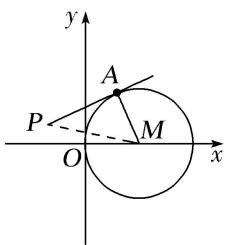
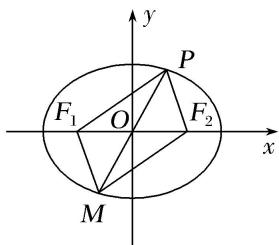

# 专题 14 双曲线标准方程(轨迹)的模型

# 3. 双曲线标准方程的模型

# 【例题选讲】

[例 3] (11)(2017·全国III)已知双曲线 C: $\frac{x^{2}}{a^{2}} - \frac{y^{2}}{b^{2}} = 1 (a > 0, b > 0)$ 的一条渐近线方程为 $y = \frac{\sqrt{5}}{2} x$ ，且与椭圆 $\frac{x^{2}}{12} + \frac{y^{2}}{3} = 1$ 有公共焦点，则 C 的方程为()

A. $\frac{x^2}{8} -\frac{y^2}{10} = 1$

B. $\frac{x^2}{4} -\frac{y^2}{5} = 1$

C. $\frac{x^2}{5} -\frac{y^2}{4} = 1$

D. $\frac{x^2}{4} -\frac{y^2}{3} = 1$

(12)(2016·天津)已知双曲线 $\frac{x^{2}}{a^{2}}-\frac{y^{2}}{b^{2}}=1(a>0,\ b>0)$ 的焦距为 $2\sqrt{5}$ ，且双曲线的一条渐近线与直线 $2x+y=0$ 垂直，则双曲线的方程为()

A. $\frac{x^2}{4} - y^2 = 1$

B. $x^{2}-\frac{y^{2}}{4}=1$

C. $\frac{3x^2}{20} -\frac{3y^2}{5} = 1$

D. $\frac{3x^2}{5} -\frac{3y^2}{20} = 1$

(13) (2018·天津)已知双曲线 $\frac{x^2}{a^2} - \frac{y^2}{b^2} = 1 (a > 0, b > 0)$ 的离心率为 2，过右焦点且垂直于 $x$ 轴的直线与双曲线交于 $A, B$ 两点．设 $A, B$ 到双曲线的同一条渐近线的距离分别为 $d_1$ 和 $d_2$ ，且 $d_1 + d_2 = 6$ ，则双曲线的方程为（）

A. $\frac{x^2}{4} -\frac{y^2}{12} = 1$

B. $\frac{x^2}{12} -\frac{y^2}{4} = 1$

C. $\frac{x^2}{3} -\frac{y^2}{9} = 1$

D. $\frac{x^2}{9} -\frac{y^2}{3} = 1$

(14)已知双曲线 $\frac{x^{2}}{a^{2}}-\frac{y^{2}}{b^{2}}=1(a>0,\ b>0)$ 的右焦点为F，点A在双曲线的渐近线上， $\triangle OAF$ 是边长为2的等边三角形(O为原点)，则双曲线的方程为()

A. $\frac{x^2}{4} -\frac{y^2}{12} = 1$

B. $\frac{x^2}{12} -\frac{y^2}{4} = 1$

C. $\frac{x^2}{3} - y^2 = 1$

D. $x^{2}-\frac{y^{2}}{3}=1$

(15)已知双曲线 $\frac{x^{2}}{4}-\frac{y^{2}}{b^{2}}=1(b>0)$ ，以原点为圆心，双曲线的实半轴长为半径长的圆与双曲线的两条渐近线相交于A，B，C，D四点，四边形ABCD的面积为2b，则双曲线的方程为()

A. $\frac{x^2}{4} -\frac{3y^2}{4} = 1$

B. $\frac{x^2}{4} -\frac{4y^2}{3} = 1$

C. $\frac{x^2}{4} -\frac{y^2}{4} = 1$

D. $\frac{x^2}{4} -\frac{y^2}{12} = 1$

(16)已知双曲线 $E$ 的中心为原点， $F(3,0)$ 是 $E$ 的焦点，过 $F$ 的直线 $l$ 与 $E$ 相交于 $A$ ， $B$ 两点，且 $AB$ 的中点为 $N(-12, -15)$ ，则 $E$ 的方程式为（）

A. $\frac{x^2}{3} -\frac{y^2}{6} = 1$

B. $\frac{x^2}{4} -\frac{y^2}{5} = 1$

C. $\frac{x^2}{6} -\frac{y^2}{3} = 1$

D. $\frac{x^2}{5} -\frac{y^2}{4} = 1$

# 【对点训练】

20. 已知双曲线 $\frac{x^2}{a^2} - \frac{y^2}{b^2} = 1 (a > 0, b > 0)$ 的焦距为 $4\sqrt{5}$ , 渐近线方程为 $2x \pm y = 0$ , 则双曲线的方程为( )

A. $\frac{x^2}{4} -\frac{y^2}{16} = 1$

B. $\frac{x^2}{16} -\frac{y^2}{4} = 1$

C. $\frac{x^2}{16} -\frac{y^2}{64} = 1$

D. $\frac{x^2}{64} -\frac{y^2}{16} = 1$

21. (2017·天津)已知双曲线 $\frac{x^2}{a^2} - \frac{y^2}{b^2} = 1 (a > 0, b > 0)$ 的左焦点为 $F$ ，离心率为 $\sqrt{2}$ 。若经过 $F$ 和 $P(0, 4)$ 两点的直线平行于双曲线的一条渐近线，则双曲线的方程为（）

A. $\frac{x^2}{4} -\frac{y^2}{4} = 1$

B. $\frac{x^2}{8} -\frac{y^2}{8} = 1$

C. $\frac{x^{2}}{4}-\frac{y^{2}}{8}=1$

D. $\frac{x^{2}}{8}-\frac{y^{2}}{4}=1$

22. 已知双曲线 $M: \frac{y^2}{a^2} - \frac{x^2}{b^2} = 1 (a > 0, b > 0)$ 与抛物线 $y = \frac{1}{8} x^2$ 有公共焦点 $F, F$ 到 $M$ 的一条渐近线的距离为 $\sqrt{3}$ , 则双曲线方程为（）

A. $y^{2}-\frac{x^{2}}{3}=1$

B. $\frac{x^2}{3} - y^2 = 1$

C. $\frac{x^{2}}{7}-\frac{y^{2}}{3}=1$

D. $\frac{y^{2}}{3}-\frac{x^{2}}{7}=1$

23. 已知双曲线 $\frac{x^2}{a^2} - \frac{y^2}{b^2} = 1 (a > 0, b > 0)$ 的左、右焦点分别为 $F_1, F_2$ ，以 $F_1, F_2$ 为直径的圆与双曲线渐近线的一个交点为(3, 4)，则双曲线的方程为（）

A. $\frac{x^{2}}{16}-\frac{y^{2}}{9}=1$

B. $\frac{x^2}{3} -\frac{y^2}{4} = 1$

C. $\frac{x^{2}}{4}-\frac{y^{2}}{3}=1$

D. $\frac{x^2}{9} -\frac{y^2}{16} = 1$

24. 已知双曲线 $C: \frac{x^2}{a^2} - \frac{y^2}{b^2} = 1$ 的一条渐近线 $l$ 的倾斜角为 $\frac{\pi}{3}$ , 且 $C$ 的一个焦点到 $l$ 的距离为 $\sqrt{3}$ , 则双曲线 $C$ 的方程为 ( )

A. $\frac{x^2}{12} -\frac{y^2}{4} = 1$

B. $\frac{x^{2}}{4}-\frac{y^{2}}{12}=1$

C. $\frac{x^{2}}{3}-y^{2}=1$

D. $x^{2}-\frac{y^{2}}{3}=1$

25. 已知双曲线 $C: \frac{x^2}{a^2} - \frac{y^2}{b^2} = 1 (a > 0, b > 0)$ 过点 $(\sqrt{2}, \sqrt{3})$ ，且实轴的两个端点与虚轴的一个端点组成一个等边三角形，则双曲线 $C$ 的标准方程是（）

A. $\frac{x^{2}}{\frac{1}{2}}-y^{2}=1$

B. $\frac{x^2}{9} -\frac{y^2}{3} = 1$

C. $x^{2}-\frac{y^{2}}{3}=1$

D. $\frac{x^{2}}{\frac{2}{3}}-\frac{y^{2}}{\frac{3}{2}}=1$

26. 已知双曲线 $C: \frac{x^2}{a^2} - \frac{y^2}{b^2} = 1 (a > 0, b > 0)$ 的右焦点为 $F$ ，点 $B$ 是虚轴的一个端点，线段 $BF$ 与双曲线 $C$ 的右支交于点 $A$ ，若 $\overrightarrow{BA} = 2\overrightarrow{AF}$ ，且 $|\overrightarrow{BF}| = 4$ ，则双曲线 $C$ 的方程为（ ）A. $\frac{x^2}{6} - \frac{y^2}{5} = 1$ B. $\frac{x^2}{8} -$

$$
\frac {y ^ {2}}{1 2} = 1
$$

C. $\frac{x^{2}}{8}-\frac{y^{2}}{4}=1$

D. $\frac{x^{2}}{4}-\frac{y^{2}}{6}=1$

27. 已知双曲线 $\frac{x^2}{a^2} - \frac{y^2}{b^2} = 1 (a > 0, b > 0)$ 的离心率为 $\frac{3}{2}$ , 过右焦点 $F$ 作渐近线的垂线, 垂足为 $M$ . 若 $\triangle FOM$ 的面积为 $\sqrt{5}$ , 其中 $O$ 为坐标原点, 则双曲线的方程为 ( )

A. $x^{2}-\frac{4y^{2}}{5}=1$

B. $\frac{x^2}{2} -\frac{2y^2}{5} = 1$

C. $\frac{x^{2}}{4}-\frac{y^{2}}{5}=1$

D. $\frac{x^2}{16} -\frac{y^2}{20} = 1$

28. 已知双曲线中心在原点且一个焦点为 $F(\sqrt{7}, 0)$ , 直线 $y = x - 1$ 与其相交于 $M, N$ 两点, $MN$ 中点的横坐标为 $-\frac{2}{3}$ , 则此双曲线的方程是 ( ).

A. $\frac{x^2}{3} -\frac{y^2}{4} = 1$

B. $\frac{x^{2}}{4}-\frac{y^{2}}{3}=1$

C. $\frac{x^{2}}{5}-\frac{y^{2}}{2}=1$

D. $\frac{x^{2}}{2}-\frac{y^{2}}{5}=1$

29. 双曲线 $\frac{x^2}{a^2} - \frac{y^2}{b^2} = 1 (a, b > 0)$ 的离心率为 $\sqrt{3}$ ，左、右焦点分别为 $F_1, F_2, P$ 为双曲线右支上一点， $\angle F_1PF_2$ 的角平分线为 $l$ ，点 $F_1$ 关于 $l$ 的对称点为 $Q, |F_2Q| = 2$ ，则双曲线的方程为（）

A. $\frac{x^{2}}{2}-y^{2}=1$

B. $x^{2}-\frac{y^{2}}{2}=1$

C. $x^{2}-\frac{y^{2}}{3}=1$

D. $\frac{x^2}{3} - y^2 = 1$

# 4. 动点的轨迹方程

# 【方法总结】

# 求动点轨迹方程的六大方法

1. 待定系数法；2. 直译法；3. 定义法；4. 代入法；5. 参数法；6. 交轨法.

# 【例题选讲】

[例 4] (17)设点 A 为圆 $(x-1)^{2}+y^{2}=1$ 上的动点，PA 是圆的切线，且 $|PA|=1$ ，则点 P 的轨迹方程是（）

A. $y^{2}=2x$

B. $(x - 1)^{2} + y^{2} = 4$

C. $y^{2}=-2x$

D. $(x - 1)^{2} + y^{2} = 2$

text_image

y
A
P
O
M
x

(18)设线段 AB 的两个端点 A，B 分别在 x 轴、y 轴上滑动，且 $|AB|=5$ ， $\overrightarrow{OM}=\frac{3}{5}\overrightarrow{OA}+\frac{2}{5}\overrightarrow{OB}$ ，则点 M 的轨迹方程为()

A. $\frac{x^{2}}{9}+\frac{y^{2}}{4}=1$

B. $\frac{y^{2}}{9}+\frac{x^{2}}{4}=1$

C. $\frac{x^2}{25} +\frac{y^2}{9} = 1$

D. $\frac{y^2}{25} +\frac{x^2}{9} = 1$

(19)已知两圆 $C_1: (x - 4)^2 + y^2 = 169$ ， $C_2: (x + 4)^2 + y^2 = 9$ ，动圆在圆 $C_1$ 内部且和圆 $C_1$ 相内切，和圆 $C_2$ 相外切，则动圆圆心 $M$ 的轨迹方程为（）

A. $\frac{x^2}{64} -\frac{y^2}{48} = 1$

B. $\frac{x^2}{48} +\frac{y^2}{64} = 1$

C. $\frac{x^2}{48} -\frac{y^2}{64} = 1$

D. $\frac{x^2}{64} +\frac{y^2}{48} = 1$

(20)在 $\triangle ABC$ 中， $|\overrightarrow{BC}|=4$ ， $\triangle ABC$ 的内切圆切 $BC$ 于 $D$ 点，且 $|\overrightarrow{BD}|-|\overrightarrow{CD}|=2\sqrt{2}$ ，则顶点 $A$ 的轨迹方程为\_\_\_\_.

(21)若曲线 $C$ 上存在点 $M$ ，使 $M$ 到平面内两点 $A(-5, 0)$ ， $B(5, 0)$ 距离之差的绝对值为 8，则称曲线 $C$ 为“好曲线”。以下曲线不是“好曲线”的是（）

A. $x+y=5$

B. $x^{2}+y^{2}=9$

C. $\frac{x^2}{25} +\frac{y^2}{9} = 1$

D. $x^{2} = 16y$

【对点训练】30. 在 $\triangle ABC$ 中，已知 $A(2,0)$ ， $B(-2,0)$ ， $G$ ， $M$ 为平面上的两点且满足 $\vec{GA}+\vec{GB}+\vec{GC}=0$ ， $|\vec{MA}|=|\vec{MB}|$

$= |\vec{M}C|$ ， $\vec{GM} // \vec{AB}$ ，则顶点 $C$ 的轨迹为（

A. 焦点在 $x$ 轴上的椭圆(长轴端点除外)

B. 焦点在 $y$ 轴上的椭圆(短轴端点除外)

C. 焦点在 $x$ 轴上的双曲线(实轴端点除外)

D. 焦点在 $x$ 轴上的抛物线(顶点除外)

31. 如图， $P$ 是椭圆 $\frac{x^2}{a^2} + \frac{y^2}{b^2} = 1 (a > b > 0)$ 上的任意一点， $F_1, F_2$ 是它的两个焦点， $O$ 为坐标原点，且 $\overrightarrow{OQ} = \overrightarrow{PF}_1 + \overrightarrow{PF}_2$ ，则动点 $Q$ 的轨迹方程是 \_\_\_\_.

text_image

y
P
F₁ O F₂ x
M

32. 已知 $F_{1}, F_{2}$ 分别为椭圆 $C: \frac{x^{2}}{4} + \frac{y^{2}}{3} = 1$ 的左、右焦点，点 $P$ 是椭圆 $C$ 上的动点，则 $\triangle PF_{1}F_{2}$ 的重心 $G$ 的轨迹方程为（）

A. $\frac{x^2}{36} +\frac{y^2}{27} = 1(y\neq 0)$

B. $\frac{4x^2}{9} + y^2 = 1 (y \neq 0)$

C. $\frac{9x^2}{4} + 3y^2 = 1 (y \neq 0)$

D. $x^{2}+\frac{4}{3}y^{2}=1(y\neq0)$

33. 已知点 $P$ 在曲线 $2x^{2} - y = 0$ 上移动，则点 $A(0, -1)$ 与点 $P$ 连线的中点的轨迹方程是（）

A. $y^{2} = 2x$

B. $y^{2}=8x^{2}$

C. $y=4x^{2}-\frac{1}{2}$

D. $y=4x^{2}+\frac{1}{2}$

34. $\triangle ABC$ 的两个顶点为 $A(-4, 0)$ , $B(4, 0)$ , $\triangle ABC$ 的周长为 18, 则 $C$ 点轨迹方程为 ( )

A. $\frac{x^2}{16} +\frac{y^2}{9} = 1(y\neq 0)$

B. $\frac{y^2}{25} +\frac{x^2}{9} = 1(y\neq 0)$

C. $\frac{y^2}{16} +\frac{x^2}{9} = 1(y\neq 0)$

D. $\frac{x^2}{25} +\frac{y^2}{9} = 1(y\neq 0)$

35. 设圆 $(x+1)^{2}+y^{2}=25$ 的圆心为C，A(1,0)是圆内一定点，Q为圆周上任一点．线段AQ的垂直平分线与CQ的连线交于点M，则M的轨迹方程为()

A. $\frac{4x^2}{21} -\frac{4y^2}{25} = 1$

B. $\frac{4x^2}{21} +\frac{4y^2}{25} = 1$

C. $\frac{4x^2}{25} -\frac{4y^2}{21} = 1$

D. $\frac{4x^2}{25} +\frac{4y^2}{21} = 1$

36. 已知圆 $C_{1}: (x + 3)^{2} + y^{2} = 1$ 和圆 $C_{2}: (x - 3)^{2} + y^{2} = 9$ , 动圆 $M$ 同时与圆 $C_{1}$ 及圆 $C_{2}$ 外切, 则动圆圆心 $M$ 的轨迹方程为 \_\_\_\_.

