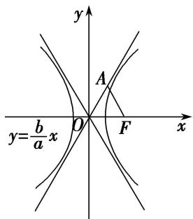
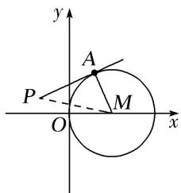
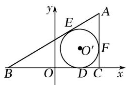
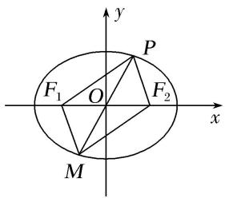
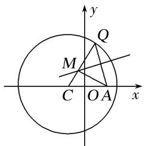
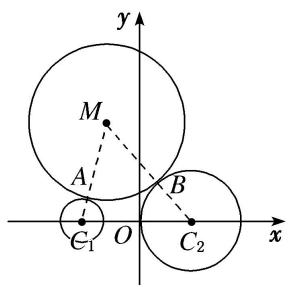

# 专题 14 双曲线标准方程(轨迹)的模型

#### 3. 双曲线标准方程的模型

# 【例题选讲】

[例 3] （11）(2017·全国III)已知双曲线 C: $\frac{x^{2}}{a^{2}}-\frac{y^{2}}{b^{2}}=1(a>0,\ b>0)$ 的一条渐近线方程为 $y=\frac{\sqrt{5}}{2}x$ ，且与椭圆 $\frac{x^{2}}{12}+\frac{y^{2}}{3}=1$ 有公共焦点，则 C 的方程为()

A. $\frac{x^2}{8} -\frac{y^2}{10} = 1$

B. $\frac{x^2}{4} -\frac{y^2}{5} = 1$

C. $\frac{x^2}{5} -\frac{y^2}{4} = 1$

D. $\frac{x^2}{4} -\frac{y^2}{3} = 1$
答案 B 解析 由 $y = \frac{\sqrt{5}}{2} x$ 可得 $\frac{b}{a} = \frac{\sqrt{5}}{2}$ ，①．由椭圆 $\frac{x^2}{12} + \frac{y^2}{3} = 1$ 的焦点为(3,0)，(-3,0)，可得 $a^2 + b^2 = 9$ ，②．由①②可得 $a^2 = 4$ ， $b^2 = 5$ ．所以 $C$ 的方程为 $\frac{x^2}{4} - \frac{y^2}{5} = 1$ ．故选B.  
（12）(2016·天津)已知双曲线 $\frac{x^{2}}{a^{2}}-\frac{y^{2}}{b^{2}}=1(a>0,\ b>0)$ 的焦距为 $2\sqrt{5}$ ，且双曲线的一条渐近线与直线 $2x+y=0$ 垂直，则双曲线的方程为()

A. $\frac{x^2}{4} - y^2 = 1$

B. $x^{2}-\frac{y^{2}}{4}=1$

C. $\frac{3x^2}{20} -\frac{3y^2}{5} = 1$

D. $\frac{3x^2}{5} -\frac{3y^2}{20} = 1$
答案 A 解析 依题意得 $\frac{b}{a} = \frac{1}{2}$ ，①，又 $a^2 + b^2 = c^2 = 5$ ，②，联立①②得 $a = 2, b = 1$ 。∴所求双曲线的方程为 $\frac{x^2}{4} - y^2 = 1$ .  
（13） (2018·天津)已知双曲线 $\frac{x^2}{a^2} - \frac{y^2}{b^2} = 1 (a > 0, b > 0)$ 的离心率为 2，过右焦点且垂直于 $x$ 轴的直线与双曲线交于 $A, B$ 两点．设 $A, B$ 到双曲线的同一条渐近线的距离分别为 $d_1$ 和 $d_2$ ，且 $d_1 + d_2 = 6$ ，则双曲线的方程为（）

A. $\frac{x^2}{4} -\frac{y^2}{12} = 1$

B. $\frac{x^2}{12} -\frac{y^2}{4} = 1$

C. $\frac{x^2}{3} -\frac{y^2}{9} = 1$

D. $\frac{x^2}{9} -\frac{y^2}{3} = 1$
答案 C 解析 因为双曲线的离心率为 2，所以 $\frac{c}{a}=2,\quad c=2a,\quad b=\sqrt{3}a$ ，不妨令 $A(2a,3a)$ ， $B(2a,-3a)$ ，双曲线其中一条渐近线方程为 $y=\sqrt{3}x$ ，所以 $d_{1}=\frac{|2\sqrt{3}a-3a|}{\sqrt{(\sqrt{3})^{2}+(-1)^{2}}}=\frac{2\sqrt{3}a-3a}{2},\quad d_{2}=\frac{|2\sqrt{3}a+3a|}{\sqrt{(\sqrt{3})^{2}+(-1)^{2}}}=\frac{2\sqrt{3}a+3a}{2}$ ；依题意得： $\frac{2\sqrt{3}a-3a}{2}+\frac{2\sqrt{3}a+3a}{2}=6$ ，解得： $a=\sqrt{3},\quad b=3$ ，所以双曲线方程为： $\frac{x^{2}}{3}-\frac{y^{2}}{9}=1$ 。  
（14）已知双曲线 $\frac{x^{2}}{a^{2}}-\frac{y^{2}}{b^{2}}=1(a>0,\ b>0)$ 的右焦点为F，点A在双曲线的渐近线上， $\triangle OAF$ 是边长为2的等边三角形(O为原点)，则双曲线的方程为()

A. $\frac{x^2}{4} -\frac{y^2}{12} = 1$

B. $\frac{x^2 - y^2}{12 - 4} = 1$

C. $\frac{x^2}{3} - y^2 = 1$

D. $x^{2}-\frac{y^{2}}{3}=1$
答案 D 解析 根据题意画出草图如图所示 $\left\{\begin{aligned}&\text{不妨设点} A\\&\end{aligned}\right.$ 在渐近线 $y=\frac{b}{a}x$ 上.

由 $\triangle AOF$ 是边长为2的等边三角形得到 $\angle AOF = 60^{\circ}$ , $c = |OF| = 2$ . 又点 $A$ 在双曲线的渐近线 $y = \frac{b}{a} x$ 上, $\therefore \frac{b}{a} = \tan 60^{\circ} = \sqrt{3}$ . 又 $a^{2} + b^{2} = 4$ , $\therefore a = 1$ , $b = \sqrt{3}$ , $\therefore$ 双曲线的方程为 $x^{2} - \frac{y^{2}}{3} = 1$ , 故选D  
（15）已知双曲线 $\frac{x^2}{4} -\frac{y^2}{b^2} = 1(b > 0)$ ，以原点为圆心，双曲线的实半轴长为半径长的圆与双曲线的两条渐近线相交于 $A$ ， $B$ ， $C$ ， $D$ 四点，四边形ABCD的面积为 $2b$ ，则双曲线的方程为（）

A. $\frac{x^2}{4} -\frac{3y^2}{4} = 1$

B. $\frac{x^{2}}{4}-\frac{4y^{2}}{3}=1$

C. $\frac{x^2}{4} -\frac{y^2}{4} = 1$

D. $\frac{x^2}{4} -\frac{y^2}{12} = 1$
答案 D 解析 根据圆和双曲线的对称性，可知四边形 ABCD 为矩形．双曲线的渐近线方程为 $y=\pm\frac{b}{2}x$ ，圆的方程为 $x^{2}+y^{2}=4$ ，不妨设交点 A 在第一象限，由 $y=\frac{b}{2}x$ ， $x^{2}+y^{2}=4$ 得 $x_{A}=\frac{4}{\sqrt{4+b^{2}}}$ ， $y_{A}=\frac{2b}{\sqrt{4+b^{2}}}$ ，故四边形 ABCD 的面积为 $4x_{Ay_{A}}=\frac{32b}{4+b^{2}}=2b$ ，解得 $b^{2}=12$ ，故所求的双曲线方程为 $\frac{x^{2}}{4}-\frac{y^{2}}{12}=1$ ，选 D.  
（16）已知双曲线 E 的中心为原点， $F(3,0)$ 是 E 的焦点，过 F 的直线 l 与 E 相交于 A，B 两点，且 AB 的中点为 $N(-12,-15)$ ，则 E 的方程式为()

A. $\frac{x^2}{3} -\frac{y^2}{6} = 1$

B. $\frac{x^2}{4} -\frac{y^2}{5} = 1$

C. $\frac{x^2}{6} -\frac{y^2}{3} = 1$

D. $\frac{x^2}{5} -\frac{y^2}{4} = 1$
答案 B 解析 设双曲线方程为 $\frac{x^{2}}{a^{2}} - \frac{y^{2}}{b^{2}} = 1$ ，即 $b^{2}x^{2} - a^{2}y^{2} = a^{2}b^{2}$ ， $A(x_{1}, y_{1}), B(x_{2}, y_{2})$ ，由 $b^{2}x_{1}^{2} - a^{2}y_{1}^{2} = a^{2}b^{2}$ ， $b^{2}x_{2}^{2} - a^{2}y_{2}^{2} = a^{2}b^{2}$ 得， $b^{2}(x_{1} + x_{2}) - a^{2}(y_{1} + y_{2})\frac{(y_{1} - y_{2})}{(x_{1} - x_{2})} = 0$ ，
又中点 $N(-12,-15)$ ， $k_{AB}=k_{PN}$ ， $\therefore-12b^{2}+15a^{2}=0$ ，即 $4b^{2}=5a^{2}$ ， $b^{2}+a^{2}=9$ ，所以 $a^{2}=4$ ， $b^{2}=5$ 。

# 【对点训练】

20. 已知双曲线 $\frac{x^2}{a^2} - \frac{y^2}{b^2} = 1 (a > 0, b > 0)$ 的焦距为 $4\sqrt{5}$ , 渐近线方程为 $2x \pm y = 0$ , 则双曲线的方程为( )

A. $\frac{x^2}{4} -\frac{y^2}{16} = 1$

B. $\frac{x^2}{16} -\frac{y^2}{4} = 1$

C. $\frac{x^2}{16} -\frac{y^2}{64} = 1$

D. $\frac{x^2}{64} -\frac{y^2}{16} = 1$

20. 答案 A 解析 易知双曲线 $\frac{x^{2}}{a^{2}} - \frac{y^{2}}{b^{2}} = 1 (a > 0, b > 0)$ 的焦点在 x 轴上，所以由渐近线方程为 $2x \pm y = 0$ ，得 $\frac{b}{a} = 2$ ，因为双曲线的焦距为 $4\sqrt{5}$ ，所以 $c = 2\sqrt{5}$ 。结合 $c^{2} = a^{2} + b^{2}$ ，可得 a = 2, b = 4，所以双曲线的方程为 $\frac{x^{2}}{4} - \frac{y^{2}}{16} = 1$ 。

21. (2017·天津)已知双曲线 $\frac{x^2}{a^2} - \frac{y^2}{b^2} = 1 (a > 0, b > 0)$ 的左焦点为 $F$ ，离心率为 $\sqrt{2}$ 。若经过 $F$ 和 $P(0, 4)$ 两点的

直线平行于双曲线的一条渐近线，则双曲线的方程为( )

A. $\frac{x^2}{4} -\frac{y^2}{4} = 1$

B. $\frac{x^2}{8} -\frac{y^2}{8} = 1$

C. $\frac{x^{2}}{4}-\frac{y^{2}}{8}=1$

D. $\frac{x^{2}}{8}-\frac{y^{2}}{4}=1$

21. 答案 B 解析 由 $e = \sqrt{2}$ 知 $a = b$ ，且 $c = \sqrt{2} a$ 。\$\therefore\$ 双曲线渐近线方程为 $y = \pm x$ 。又 $k_{PF} = \frac{4 - 0}{0 + c} = \frac{4}{c} = 1$ ，\$\therefore c = 4\$，则 $a^2 = b^2 = \frac{c^2}{2} = 8$ 。故双曲线方程为 $\frac{x^2}{8} - \frac{y^2}{8} = 1$ 。

22. 已知双曲线 $M: \frac{y^2}{a^2} - \frac{x^2}{b^2} = 1 (a > 0, b > 0)$ 与抛物线 $y = \frac{1}{8} x^2$ 有公共焦点 $F, F$ 到 $M$ 的一条渐近线的距离为 $\sqrt{3}$ , 则双曲线方程为（）

A. $y^{2}-\frac{x^{2}}{3}=1$

B. $\frac{x^2}{3} - y^2 = 1$

C. $\frac{x^2}{7} -\frac{y^2}{3} = 1$

D. $\frac{y^2}{3} -\frac{x^2}{7} = 1$

22. 答案 A 解析 抛物线 $y=\frac{1}{8}x^{2}$ ，即 $x^{2}=8y$ 的焦点为 $F(0,2)$ ，即 c=2，双曲线的渐近线方程为 $y=\pm\frac{a}{b}x$ ，可得 F 到渐近线的距离为 $d=\frac{bc}{\sqrt{a^{2}+b^{2}}}=b=\sqrt{3}$ ，即有 $a=\sqrt{c^{2}-b^{2}}=\sqrt{4-3}=1$ ，则双曲线的方程为 $y^{2}-\frac{x^{2}}{3}=1$ .

23. 已知双曲线 $\frac{x^2}{a^2} - \frac{y^2}{b^2} = 1 (a > 0, b > 0)$ 的左、右焦点分别为 $F_1, F_2$ ，以 $F_1, F_2$ 为直径的圆与双曲线渐近线的一个交点为(3, 4)，则双曲线的方程为（）

A. $\frac{x^2}{16} -\frac{y^2}{9} = 1$

B. $\frac{x^2}{3} -\frac{y^2}{4} = 1$

C. $\frac{x^2}{4} -\frac{y^2}{3} = 1$

D. $\frac{x^2}{9} -\frac{y^2}{16} = 1$

23. 答案 D 解析 ∵点(3, 4)在以 $|F_{1}F_{2}|$ 为直径的圆上，∴c=5，可得 $a^{2}+b^{2}=25$ ，①．又∵点(3, 4)在双曲线的渐近线 $y=\frac{b}{a}x$ 上，∴ $\frac{b}{a}=\frac{4}{3}$ ，②．①②联立，解得a=3且b=4，可得双曲线的方程为 $\frac{x^{2}}{9}-\frac{y^{2}}{16}=1$ .

24. 已知双曲线 $C: \frac{x^2}{a^2} - \frac{y^2}{b^2} = 1$ 的一条渐近线 $l$ 的倾斜角为 $\frac{\pi}{3}$ , 且 $C$ 的一个焦点到 $l$ 的距离为 $\sqrt{3}$ , 则双曲线 $C$ 的方程为 ( )

A. $\frac{x^2}{12} -\frac{y^2}{4} = 1$

B. $\frac{x^2}{4} -\frac{y^2}{12} = 1$

C. $\frac{x^2}{3} - y^2 = 1$

D. $x^{2}-\frac{y^{2}}{3}=1$

24. 答案 D 解析 由 $\frac{x^2}{a^2} - \frac{y^2}{b^2} = 0$ 可得 $y = \pm \frac{b}{a} x$ ，即渐近线的方程为 $y = \pm \frac{b}{a} x$ ，又一条渐近线 $l$ 的倾斜角为 $\frac{\pi}{3}$ ，所以 $\frac{b}{a} = \tan \frac{\pi}{3} = \sqrt{3}$ 。因为双曲线 $C$ 的一个焦点 $(c,0)$ 到 $l$ 的距离为 $\sqrt{3}$ ，所以 $\frac{|bc|}{\sqrt{a^2 + b^2}} = b = \sqrt{3}$ ，所以 $a = 1$ ，所以双曲线的方程为 $x^2 - \frac{y^2}{3} = 1$ 。故选 D.

25. 已知双曲线 $C: \frac{x^2}{a^2} - \frac{y^2}{b^2} = 1 (a > 0, b > 0)$ 过点 $(\sqrt{2}, \sqrt{3})$ ，且实轴的两个端点与虚轴的一个端点组成一个等边三角形，则双曲线 $C$ 的标准方程是（）

A. $\frac{x^2}{\frac{1}{2}} - y^2 = 1$

B. $\frac{x^2}{9} -\frac{y^2}{3} = 1$

C. $x^{2}-\frac{y^{2}}{3}=1$

D. $\frac{x^2}{\frac{2}{3}} -\frac{y^2}{\frac{3}{2}} = 1$

25. 答案 C 解析 由双曲线 $C: \frac{x^2}{a^2} - \frac{y^2}{b^2} = 1 (a > 0, b > 0)$ 过点 $(\sqrt{2}, \sqrt{3})$ ，且实轴的两个端点与虚轴的一个端点组成一个等边三角形，可得 $\left\{ \begin{array}{l} \frac{2}{a^2} - \frac{3}{b^2} = 1, \\ \frac{b}{a} = \sqrt{3}, \end{array} \right.$ 解得 $\left\{ \begin{array}{l} a = 1, \\ b = \sqrt{3}, \end{array} \right.$ ∴ 双曲线 $C$ 的标准方程是 $x^2 - \frac{y^2}{3} = 1$ .

26. 已知双曲线 $C: \frac{x^2}{a^2} - \frac{y^2}{b^2} = 1 (a > 0, b > 0)$ 的右焦点为 $F$ ，点 $B$ 是虚轴的一个端点，线段 $BF$ 与双曲线 $C$ 的右支交于点 $A$ ，若 $\overrightarrow{BA} = 2\overrightarrow{AF}$ ，且 $|\overrightarrow{BF}| = 4$ ，则双曲线 $C$ 的方程为（）

A. $\frac{x^2}{6} -\frac{y^2}{5} = 1$

B. $\frac{x^2}{8} -\frac{y^2}{12} = 1$

C. $\frac{x^2}{8} -\frac{y^2}{4} = 1$

D. $\frac{x^2}{4} -\frac{y^2}{6} = 1$

26. 答案 D 解析 不妨设 $B(0, b)$ ，由 $\overrightarrow{BA} = 2\overrightarrow{AF}$ ， $F(c, 0)$ ，可得 $A\left(\frac{2c}{3}, \frac{b}{3}\right)$ ，代入双曲线 $C$ 的方程可得 $\frac{4}{9} \times \frac{c^2}{a^2} - \frac{1}{9} = 1$ ，即 $\frac{4}{9} \cdot \frac{a^2 + b^2}{a^2} = \frac{10}{9}$ ，所以 $\frac{b^2}{a^2} = \frac{3}{2}$ ，①．又 $|\overrightarrow{BF}| = \sqrt{b^2 + c^2} = 4$ ， $c^2 = a^2 + b^2$ ，所以 $a^2 + 2b^2 = 16$ ，②．由①②可得， $a^2 = 4$ ， $b^2 = 6$ ，所以双曲线 $C$ 的方程为 $\frac{x^2}{4} - \frac{y^2}{6} = 1$ ，故选 D.

27. 已知双曲线 $\frac{x^2}{a^2} - \frac{y^2}{b^2} = 1 (a > 0, b > 0)$ 的离心率为 $\frac{3}{2}$ , 过右焦点 $F$ 作渐近线的垂线, 垂足为 $M$ . 若 $\triangle FOM$ 的面积为 $\sqrt{5}$ , 其中 $O$ 为坐标原点, 则双曲线的方程为 ( )

A. $x^{2}-\frac{4y^{2}}{5}=1$

B. $\frac{x^2}{2} -\frac{2y^2}{5} = 1$

C. $\frac{x^2}{4} -\frac{y^2}{5} = 1$

D. $\frac{x^2}{16} -\frac{y^2}{20} = 1$

27. 答案 C 解析 由题意可知 $e = \frac{c}{a} = \frac{3}{2}$ ，可得 $\frac{b}{a} = \frac{\sqrt{5}}{2}$ ，取双曲线的一条渐近线为 $y = \frac{b}{a}x$ ，可得 $F$ 到渐近线 $y = \frac{b}{a}x$ 的距离 $d = \frac{bc}{\sqrt{a^2 + b^2}} = b$ ，在 Rt△FOM 中，由勾股定理可得 $|OM| = \sqrt{|OF|^2 - |MF|^2} = \sqrt{c^2 - b^2} = a$ ，由题意可得 $\frac{1}{2}ab = \sqrt{5}$ ，联立 $\left\{ \begin{array}{l} b \\ a \\ \frac{1}{2}ab = \sqrt{5}, \end{array} \right.$ 解得 $\left\{ \begin{array}{l} a = 2, \\ b = \sqrt{5}, \end{array} \right.$ 所以双曲线的方程为 $\frac{x^2}{4} - \frac{y^2}{5} = 1$ 。故选 C.

28. 已知双曲线中心在原点且一个焦点为 $F(\sqrt{7}, 0)$ , 直线 $y = x - 1$ 与其相交于 $M, N$ 两点, $MN$ 中点的横坐标为 $-\frac{2}{3}$ , 则此双曲线的方程是( ).

A. $\frac{x^2}{3} -\frac{y^2}{4} = 1$

B. $\frac{x^2}{4} -\frac{y^2}{3} = 1$

C. $\frac{x^2}{5} -\frac{y^2}{2} = 1$

D. $\frac{x^2}{2} -\frac{y^2}{5} = 1$

28. 答案 D 解析: 设所求双曲线方程为 $\frac{x^{2}}{a^{2}} - \frac{y^{2}}{7 - a^{2}} = 1$ . 由 $\left\{\begin{aligned}\frac{x^{2}}{a^{2}} - \frac{y^{2}}{7 - a^{2}} &= 1, \\ y &= x - 1,\end{aligned}\right.$ 得 $\frac{x^{2}}{a^{2}} - \frac{(x - 1)^{2}}{7 - a^{2}} = 1, (7 - a^{2})x^{2} - a^{2}(x - 1)^{2} = a^{2}(7 - a^{2})$ , 整理得 $(7 - 2a^{2})x^{2} + 2a^{2}x - 8a^{2} + a^{4} = 0$ . 又 MN 中点的横坐标为 $-\frac{2}{3}$ , 故 $x_{0} = \frac{x_{1} + x_{2}}{2} = -\frac{2a^{2}}{2(7 - 2a^{2})} = -\frac{2}{3}$ , 即 $3a^{2} = 2(7 - 2a^{2})$ , 所以 $a^{2} = 2$ , 故所求双曲线方程为 $\frac{x^{2}}{2} - \frac{y^{2}}{5} = 1$ .

29. 双曲线 $\frac{x^2}{a^2} - \frac{y^2}{b^2} = 1 (a, b > 0)$ 的离心率为 $\sqrt{3}$ ，左、右焦点分别为 $F_1, F_2, P$ 为双曲线右支上一点， $\angle F_1PF_2$ 的角平分线为 $l$ ，点 $F_1$ 关于 $l$ 的对称点为 $Q$ ， $|F_2Q| = 2$ ，则双曲线的方程为（）

A. $\frac{x^2}{2} - y^2 = 1$

B. $x^{2}-\frac{y^{2}}{2}=1$

C. $x^{2}-\frac{y^{2}}{3}=1$

D. $\frac{x^2}{3} - y^2 = 1$

29. 答案 B 解析 $\because \angle F_{1}PF_{2}$ 的角平分线为 $l$ ，点 $F_{1}$ 关于 $l$ 的对称点为 Q， $\therefore |PF_{1}| = |PQ|$ ， $P, F_{2}, Q$ 三点共线，而 $|PF_{1}| - |PF_{2}| = 2a$ ， $\therefore |PQ| - |PF_{2}| = 2a$ ，即 $|F_{2}Q| = 2 = 2a$ ，解得 $a = 1$ 。又 $e = \frac{c}{a} = \sqrt{3}$ ， $\therefore c = \sqrt{3}$ ， $\therefore b^{2} = c^{2} - a^{2} = 2$ ， $\therefore$ 双曲线的方程为 $x^{2} - \frac{y^{2}}{2} = 1$ 。故选 B.

#### 4. 动点的轨迹方程

# 【方法总结】

求动点轨迹方程的六大方法

1. 待定系数法；2. 直译法；3. 定义法；4. 代入法；5. 参数法；6. 交轨法.

# 【例题选讲】

[例 4] （17）设点 A 为圆 $(x-1)^{2}+y^{2}=1$ 上的动点，PA 是圆的切线，且 $|PA|=1$ ，则点 P 的轨迹方程是（）

A. $y^{2}=2x$

B. $(x - 1)^{2} + y^{2} = 4$

C. $y^{2}=-2x$

D. $(x - 1)^{2} + y^{2} = 2$
答案 D 解析 如图，设 $P(x, y)$ ，圆心为 $M(1, 0)$ ，连接 MA，则 $MA \perp PA$ ，且 $|MA| = 1$ ，又∵ $|PA| = 1$ ，∴ $|PM| = \sqrt{|MA|^{2} + |PA|^{2}} = \sqrt{2}$ ，即 $|PM|^{2} = 2$ ，∴ $(x - 1)^{2} + y^{2} = 2$ 。

  
（18）设线段 AB 的两个端点 A, B 分别在 x 轴、y 轴上滑动，且 $\left|AB\right|=5,\quad\overrightarrow{OM}=\frac{3}{5}\overrightarrow{OA}+\frac{2}{5}\overrightarrow{OB}$ ，则点 M 的轨迹方程为()

A. $\frac{x^{2}}{9}+\frac{y^{2}}{4}=1$

B. $\frac{y^{2}}{9}+\frac{x^{2}}{4}=1$

C. $\frac{x^2}{25} +\frac{y^2}{9} = 1$

D. $\frac{y^2}{25} +\frac{x^2}{9} = 1$
答案 A 解析 设 $M(x, y)$ ， $A(x_{0}, 0)$ ， $B(0, y_{0})$ ，由 $\overrightarrow{OM} = \frac{3}{5}\overrightarrow{OA} + \frac{2}{5}\overrightarrow{OB}$ ，得 $(x, y) = \frac{3}{5}(x_{0}, 0) + \frac{2}{5}(0, y_{0})$ ，
则 $\left\{\begin{aligned}x&=\frac{3}{5}x_{0},\\ y&=\frac{2}{5}y_{0},\end{aligned}\right.$ 解得 $\left\{\begin{aligned}x_{0}&=\frac{5}{3}x,\\ y_{0}&=\frac{5}{2}y,\end{aligned}\right.$ 由 $|AB|=5$ ，得 $\left(\frac{5}{3}x\right)^{2}+\left(\frac{5}{2}y\right)^{2}=25$ ，化简得 $\frac{x^{2}}{9}+\frac{y^{2}}{4}=1$ .  
（19）已知两圆 $C_1: (x - 4)^2 + y^2 = 169$ ， $C_2: (x + 4)^2 + y^2 = 9$ ，动圆在圆 $C_1$ 内部且和圆 $C_1$ 相内切，和圆 $C_2$ 相外切，则动圆圆心 $M$ 的轨迹方程为（）

A. $\frac{x^2}{64} -\frac{y^2}{48} = 1$

B. $\frac{x^2}{48} +\frac{y^2}{64} = 1$

C. $\frac{x^{2}}{48}-\frac{y^{2}}{64}=1$

D. $\frac{x^2}{64} +\frac{y^2}{48} = 1$
答案 D 解析 设圆 M 的半径为 r，则 $\left|MC_{1}\right| + \left|MC_{2}\right| = (13 - r) + (3 + r) = 16 > 8 = \left|C_{1}C_{2}\right|$ ，所以 M 的轨迹是以 $C_{1}$ ， $C_{2}$ 为焦点的椭圆，且 2a = 16，2c = 8，所以 a = 8，c = 4， $b = \sqrt{a^{2} - c^{2}} = 4\sqrt{3}$ ，故所求的轨迹方

程为 $\frac{x^{2}}{64}+\frac{y^{2}}{48}=1$ .  
（20）在 $\triangle ABC$ 中， $|\overrightarrow{BC}| = 4$ ， $\triangle ABC$ 的内切圆切 $BC$ 于 $D$ 点，且 $|\overrightarrow{BD}| - |\overrightarrow{CD}| = 2\sqrt{2}$ ，则顶点 $A$ 的轨迹方程为\_\_\_\_.
答案 $\frac{x^2}{2} -\frac{y^2}{2} = 1(x > \sqrt{2})$ 解析 以 $BC$ 的中点为原点，中垂线为 $y$ 轴建立如图所示的坐标系， $E, F$ 分别为两个切点.

则 $|BE|=|BD|$ ， $|CD|=|CF|$ ， $|AE|=|AF|$ ． $\therefore|AB|-|AC|=2\sqrt{2}<|BC|=4$ ，∴点A的轨迹是以B，C为焦点的双曲线的右支 $(y\neq0)$ 且 $a=\sqrt{2}$ ，c=2， $\therefore b=\sqrt{2}$ ，∴轨迹方程为 $\frac{x^{2}}{2}-\frac{y^{2}}{2}=1(x>\sqrt{2})$ .  
（21）若曲线 C 上存在点 M，使 M 到平面内两点 $A(-5, 0)$ ， $B(5, 0)$ 距离之差的绝对值为 8，则称曲线 C 为 “好曲线”。以下曲线不是 “好曲线” 的是()

A. $x + y = 5$

B. $x^{2}+y^{2}=9$

C. $\frac{x^{2}}{25}+\frac{y^{2}}{9}=1$

D. $x^{2}=16y$
答案 B 解析 $\because M$ 到平面内两点 $A(-5,0)$ , $B(5,0)$ 距离之差的绝对值为 8, $\therefore M$ 的轨迹是以 $A(-5,0)$ , $B(5,0)$ 为焦点的双曲线, 方程为 $\frac{x^2}{16} - \frac{y^2}{9} = 1$ . A 项, 直线 $x + y = 5$ 过点 (5, 0), 故直线与 $M$ 的轨迹有交点, 满足题意; B 项, $x^2 + y^2 = 9$ 的圆心为 (0, 0), 半径为 3, 与 $M$ 的轨迹没有交点, 不满足题意; C 项, $\frac{x^2}{25} + \frac{y^2}{9} = 1$ 的右顶点为 (5, 0), 故椭圆 $\frac{x^2}{25} + \frac{y^2}{9} = 1$ 与 $M$ 的轨迹有交点, 满足题意; D 项, 方程代入 $\frac{x^2}{16} - \frac{y^2}{9} = 1$ , 可得 $y - \frac{y^2}{9} = 1$ , 即 $y^2 - 9y + 9 = 0$ , $\therefore \Delta > 0$ , 满足题意.

# 【对点训练】

30. 在 $\triangle ABC$ 中，已知 $A(2, 0)$ ， $B(-2, 0)$ ， $G$ ， $M$ 为平面上的两点且满足 $\vec{GA} + \vec{GB} + \vec{GC} = \mathbf{0}$ ， $|\vec{MA}| = |\vec{MB}|$ $= |\vec{MC}|$ ， $\vec{GM} // \vec{AB}$ ，则顶点 $C$ 的轨迹为（）

A. 焦点在 $x$ 轴上的椭圆(长轴端点除外)

B. 焦点在 $y$ 轴上的椭圆(短轴端点除外)

C. 焦点在 $x$ 轴上的双曲线(实轴端点除外)

D. 焦点在 $x$ 轴上的抛物线(顶点除外)

30. 答案 B 解析 设 $C(x, y) (y \neq 0)$ ，则由 $\overrightarrow{GA} + \overrightarrow{GB} + \overrightarrow{GC} = 0$ ，即 G 为 $\triangle ABC$ 的重心，得 $G\left(\frac{x}{3}, \frac{y}{3}\right)$ 。又 $|\overrightarrow{MA}| = |\overrightarrow{MB}| = |\overrightarrow{MC}|$ ，即 M 为 $\triangle ABC$ 的外心，所以点 M 在 y 轴上，又 $\overrightarrow{GM} // \overrightarrow{AB}$ ，则有 $M\left(0, \frac{y}{3}\right)$ 。所以 $x^{2} + \left(y - \frac{y}{3}\right)^{2} = 4 + \frac{y^{2}}{9}$ ，化简得 $\frac{x^{2}}{4} + \frac{y^{2}}{12} = 1$ ， $y \neq 0$ 。所以顶点 C 的轨迹为焦点在 y 轴上的椭圆（除去短轴端点）。

31. 如图, $P$ 是椭圆 $\frac{x^2}{a^2} +\frac{y^2}{b^2} = 1(a > b > 0)$ 上的任意一点, $F_{1}, F_{2}$ 是它的两个焦点, $O$ 为坐标原点, 且 $\overrightarrow{OQ} = \overrightarrow{PF_1}$
$+\overrightarrow{PF}_{2}$ ，则动点Q的轨迹方程是\_\_\_\_。

31. 答案 $\frac{x^2}{4a^2} + \frac{y^2}{4b^2} = 1$ 解析 由于 $\overrightarrow{OQ} = \overrightarrow{PF_1} + \overrightarrow{PF_2}$ , 又 $\overrightarrow{PF_1} + \overrightarrow{PF_2} = \overrightarrow{PM} = 2\overrightarrow{PO} = -2\overrightarrow{OP}$ . 设 $Q(x, y)$ , 则 $\overrightarrow{OP} = -\frac{1}{2}\overrightarrow{OQ} = \left(-\frac{x}{2}, -\frac{y}{2}\right)$ , 即 $P$ 点坐标为 $\left(-\frac{x}{2}, -\frac{y}{2}\right)$ , 又 $P$ 在椭圆上, 则有 $\frac{\left(-\frac{x}{2}\right)^2}{a^2} + \frac{\left(-\frac{y}{2}\right)^2}{b^2} = 1$ , 即 $\frac{x^2}{4a^2} + \frac{y^2}{4b^2} = 1$ .

32. 已知 $F_{1}, F_{2}$ 分别为椭圆 $C: \frac{x^{2}}{4} + \frac{y^{2}}{3} = 1$ 的左、右焦点，点 $P$ 是椭圆 $C$ 上的动点，则 $\triangle PF_{1}F_{2}$ 的重心 $G$ 的轨迹方程为（）

A. $\frac{x^2}{36} +\frac{y^2}{27} = 1(y\neq 0)$

B. $\frac{4x^2}{9} + y^2 = 1 (y \neq 0)$

C. $\frac{9x^2}{4} + 3y^2 = 1 (y \neq 0)$

D. $x^{2} + \frac{4}{3} y^{2} = 1(y\neq 0)$

32. 答案 C 解析 依题意知 $F_{1}(-1,0), F_{2}(1,0)$ ，设 $P(x_0, y_0)(y_0 \neq 0), G(x, y)$ ，则由三角形重心坐标公式可得 $\left\{ \begin{array}{l} x = \frac{x_0 - 1 + 1}{3}, \\ y = \frac{y_0}{3}, \end{array} \right.$ 即 $\left\{ \begin{array}{l} x_0 = 3x, \\ y_0 = 3y, \end{array} \right.$ 代入椭圆 $C: \frac{x^2}{4} + \frac{y^2}{3} = 1$ ，得重心 $G$ 的轨迹方程为 $\frac{9x^2}{4} + 3y^2 = 1(y \neq 0)$ .

33. 已知点 $P$ 在曲线 $2x^{2} - y = 0$ 上移动，则点 $A(0, -1)$ 与点 $P$ 连线的中点的轨迹方程是（）

A. $y^{2} = 2x$

B. $y^{2} = 8x^{2}$

C. $y=4x^{2}-\frac{1}{2}$

D. $y=4x^{2}+\frac{1}{2}$

33. 答案 C 解析 设 AP 的中点坐标为 $(x, y)$ ，则 $P(2x, 2y+1)$ ，由点 P 在曲线上，得 $2 \cdot (2x)^{2} - (2y + 1) = 0$ ，即 $y = 4x^{2} - \frac{1}{2}$ .

34. $\triangle ABC$ 的两个顶点为 $A(-4, 0)$ , $B(4, 0)$ , $\triangle ABC$ 的周长为 18, 则 $C$ 点轨迹方程为 ( )

A. $\frac{x^2}{16} +\frac{y^2}{9} = 1(y\neq 0)$

B. $\frac{y^2}{25} +\frac{x^2}{9} = 1(y\neq 0)$

C. $\frac{y^2}{16} +\frac{x^2}{9} = 1(y\neq 0)$

D. $\frac{x^2}{25} +\frac{y^2}{9} = 1(y\neq 0)$

34. 答案 D 解析 $\because \triangle ABC$ 的两顶点 $A(-4,0), B(4,0)$ , 周长为 18, $\therefore |AB| = 8$ , $|BC| + |AC| = 10$ . $\because 10 > 8$ , $\therefore$ 点 $C$ 到两个定点的距离之和等于定值, 满足椭圆的定义, $\therefore$ 点 $C$ 的轨迹是以 $A, B$ 为焦点的椭圆. $\therefore 2a = 10, 2c = 8$ , 即 $a = 5$ , $c = 4$ , $\therefore b = 3$ . $\therefore C$ 点的轨迹方程为 $\frac{x^2}{25} + \frac{y^2}{9} = 1 (y \neq 0)$ . 故选 D.

35. 设圆 $(x+1)^{2}+y^{2}=25$ 的圆心为C，A(1,0)是圆内一定点，Q为圆周上任一点．线段AQ的垂直平分线与CQ的连线交于点M，则M的轨迹方程为()

A. $\frac{4x^2}{21} -\frac{4y^2}{25} = 1$

B. $\frac{4x^2}{21} +\frac{4y^2}{25} = 1$

C. $\frac{4x^2}{25} -\frac{4y^2}{21} = 1$

D. $\frac{4x^2}{25} +\frac{4y^2}{21} = 1$

35. 答案 D 解析 $\because M$ 为 $AQ$ 的垂直平分线上一点，则 $|AM| = |MQ|$ ， $\therefore |MC| + |MA| = |MC| + |MQ| = |CQ|$

=5，故 M 的轨迹是以定点 C，A 为焦点的椭圆． $\therefore a=\frac{5}{2}$ ， $\therefore c=1$ ，则 $b^{2}=a^{2}-c^{2}=\frac{21}{4}$ ， $\therefore M$ 的轨迹方程为 $\frac{4x^{2}}{25}+\frac{4y^{2}}{21}=1$ .

36. 已知圆 $C_1: (x + 3)^2 + y^2 = 1$ 和圆 $C_2: (x - 3)^2 + y^2 = 9$ , 动圆 $M$ 同时与圆 $C_1$ 及圆 $C_2$ 外切, 则动圆圆心 $M$ 的轨迹方程为 \_\_\_\_.  
36. 答案 $x^{2}-\frac{y^{2}}{8}=1(x<0)$ 解析 如图所示, 设动圆 M 与圆 $C_{1}$ 及圆 $C_{2}$ 分别外切于 A 和 B 两点. 连接 $MC_{1}$ , $MC_{2}$ .

根据两圆外切的条件，得 $|MC_{1}|-|AC_{1}|=|MA|$ ， $|MC_{2}|-|BC_{2}|=|MB|$ 。因为 $|MA|=|MB|$ ，所以 $|MC_{1}|-|AC_{1}|=|MC_{2}|-|BC_{2}|$ ，即 $|MC_{2}|-|MC_{1}|=|BC_{2}|-|AC_{1}|=3-1=2<6=|C_{1}C_{2}|$ 。所以点M到两定点 $C_{1}$ ， $C_{2}$ 的距离的差是常数。又根据双曲线的定义，得动点M的轨迹为双曲线的左支(点M与 $C_{2}$ 的距离比与 $C_{1}$ 的距离大)，可设轨迹方程为 $\frac{x^{2}}{a^{2}}-\frac{y^{2}}{b^{2}}=1(a>0,b>0,x<0)$ ，其中a=1,c=3，则 $b^{2}=8$ 。故动圆圆心M的轨迹方程为 $x^{2}-\frac{y^{2}}{8}=1(x<0)$ 。

