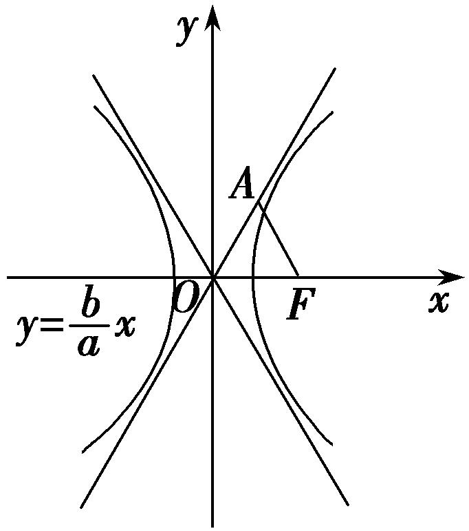
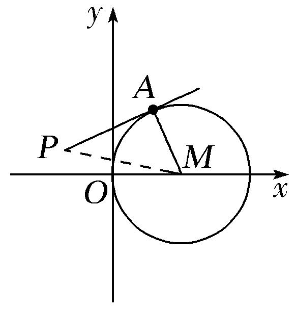
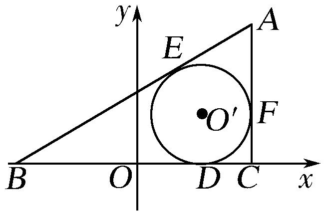
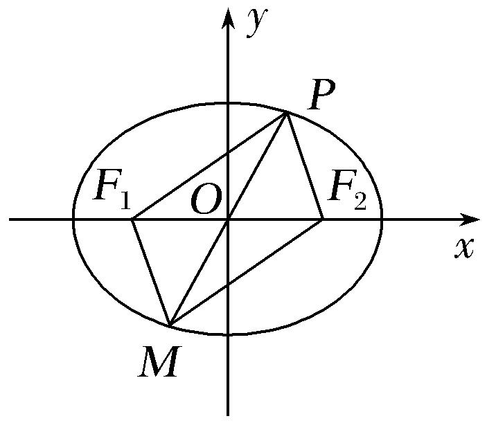
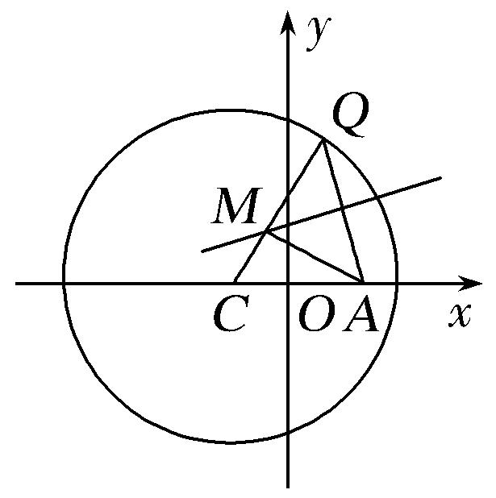
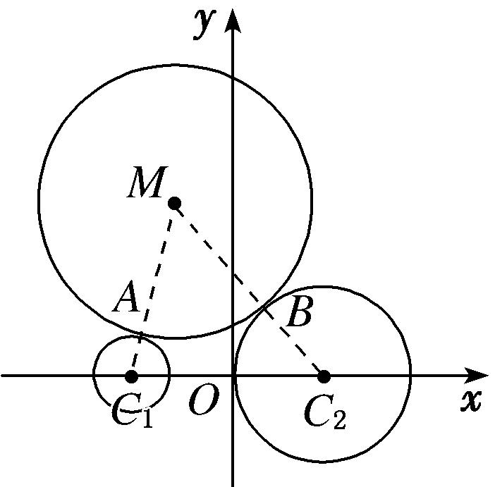

**专题14　双曲线标准方程(轨迹)的模型**

**3．双曲线标准方程的模型**

**【例题选讲】**

<strong>[例3]</strong>　(11)(2017·全国Ⅲ)已知双曲线<em>C</em>：－＝1(<em>a</em>＞0，<em>b</em>＞0)的一条渐近线方程为<em>y</em>＝<em>x</em>，且与椭圆＋＝1有公共焦点，则<em>C</em>的方程为(　　)

A．－＝1　　　　　B．－＝1　　　　　C．－＝1　　　　　D．－＝1

<strong>答案</strong>　B　<strong>解析</strong>　由<em>y</em>＝<em>x</em>可得＝，①．由椭圆＋＝1的焦点为(3，0)，(－3，0)，可得<em>a</em>2＋<em>b</em>2＝9，②．由①②可得<em>a</em>2＝4，<em>b</em>2＝5．所以<em>C</em>的方程为－＝1．故选B．

(12)(2016·天津)已知双曲线－＝1(*a*>0，*b*>0)的焦距为2，且双曲线的一条渐近线与直线2*x*＋*y*＝0垂直，则双曲线的方程为(　　)

A．－<em>y</em>2＝1　　　　B．<em>x</em>2－＝1　　　　C．－＝1　　　　D．－＝1

<strong>答案</strong>　A　<strong>解析</strong>　依题意得＝，①，又<em>a</em>2＋<em>b</em>2＝<em>c</em>2＝5，②，联立①②得<em>a</em>＝2，<em>b</em>＝1．∴所求双曲线的方程为－<em>y</em>2＝1．

(13) (2018·天津)已知双曲线－＝1(<em>a</em>&gt;0，<em>b</em>&gt;0)的离心率为2，过右焦点且垂直于<em>x</em>轴的直线与双曲线交于<em>A</em>，<em>B</em>两点．设<em>A</em>，<em>B</em>到双曲线的同一条渐近线的距离分别为<em>d</em>1和<em>d</em>2，且<em>d</em>1＋<em>d</em>2＝6，则双曲线的方程为(　　)

A．－＝1　　　　　B．－＝1　　　　　C．－＝1　　　　　D．－＝1

<strong>答案</strong>　C　<strong>解析</strong>　因为双曲线的离心率为2，所以＝2，<em>c</em>＝2<em>a</em>，<em>b</em>＝<em>a</em>，不妨令<em>A</em>(2<em>a,</em>3<em>a</em>)，<em>B</em>(2<em>a</em>，－3<em>a</em>)，双曲线其中一条渐近线方程为<em>y</em>＝<em>x</em>，所以<em>d</em>1＝＝，<em>d</em>2＝＝；依题意得：＋＝6，解得：<em>a</em>＝，<em>b</em>＝3，所以双曲线方程为：－＝1．

(14)已知双曲线－＝1(*a*＞0，*b*＞0)的右焦点为*F*，点*A*在双曲线的渐近线上，△*OAF*是边长为2的等边三角形(*O*为原点)，则双曲线的方程为(　　)

A．－＝1 　　　　　B．－＝1　　　　　C．－<em>y</em>2＝1　　　　　D．<em>x</em>2－＝1

**答案**　D　**解析**　根据题意画出草图如图所示.

由△<em>AOF</em>是边长为2的等边三角形得到∠<em>AOF</em>＝60°，<em>c</em>＝|<em>OF</em>|＝2．又点<em>A</em>在双曲线的渐近线<em>y</em>＝<em>x</em>上，∴＝tan 60°＝．又<em>a</em>2＋<em>b</em>2＝4，∴<em>a</em>＝1，<em>b</em>＝，∴双曲线的方程为<em>x</em>2－＝1，故选D

(15)已知双曲线－＝1(*b*>0)，以原点为圆心，双曲线的实半轴长为半径长的圆与双曲线的两条渐近线相交于*A*，*B*，*C*，*D*四点，四边形*ABCD*的面积为2*b*，则双曲线的方程为(　　)

A．－＝1　　　　B．－＝1　　　　C．－＝1　　　　D．－＝1

<strong>答案</strong>　D　<strong>解析</strong>　根据圆和双曲线的对称性，可知四边形<em>ABCD</em>为矩形．双曲线的渐近线方程为<em>y</em>＝±<em>x</em>，圆的方程为<em>x</em>2＋<em>y</em>2＝4，不妨设交点<em>A</em>在第一象限，由<em>y</em>＝<em>x</em>，<em>x</em>2＋<em>y</em>2＝4得<em>xA</em>＝，<em>yA</em>＝，故四边形<em>ABCD</em>的面积为4<em>xAyA</em>＝＝2<em>b</em>，解得<em>b</em>2＝12，故所求的双曲线方程为－＝1，选D．

(16)已知双曲线的中心为原点，是的焦点，过*F*的直线与相交于*A*，*B*两点，且*AB*的中点为，则的方程式为(　　)

A．　　　　B．　　　　C．　　　　D．

**答案**　B　**解析**　设双曲线方程为，，由得，，，，，所以．

**【对点训练】**

20．已知双曲线－＝1(*a*＞0，*b*＞0)的焦距为4，渐近线方程为2*x*±*y*＝0，则双曲线的方程为(　　)

A．－＝1　　　　B．－＝1　　　　C．－＝1　　　　D．－＝1

20．<strong>答案</strong>　A　<strong>解析</strong>　易知双曲线－＝1(<em>a</em>＞0，<em>b</em>＞0)的焦点在<em>x</em>轴上，所以由渐近线方程为2<em>x</em>±<em>y</em>＝0，

得＝2，因为双曲线的焦距为4，所以<em>c</em>＝2.结合<em>c</em>2＝<em>a</em>2＋<em>b</em>2，可得<em>a</em>＝2，<em>b</em>＝4，所以双曲线的方程为－＝1．

21．(2017·天津)已知双曲线－＝1(*a*>0，*b*>0)的左焦点为*F*，离心率为．若经过*F*和*P*(0，4)两点的

直线平行于双曲线的一条渐近线，则双曲线的方程为(　　)

A．－＝1　　　　B．－＝1　　　　C．－＝1　　　　D．－＝1

21．<strong>答案</strong>　B　<strong>解析</strong>　由<em>e</em>＝知<em>a</em>＝<em>b</em>，且<em>c</em>＝<em>a</em>．∴双曲线渐近线方程为<em>y</em>＝±<em>x</em>．又<em>kPF</em>＝＝＝1，

∴<em>c</em>＝4，则<em>a</em>2＝<em>b</em>2＝＝8．故双曲线方程为－＝1．

22．已知双曲线<em>M</em>：－＝1(<em>a</em>&gt;0，<em>b</em>&gt;0)与抛物线<em>y</em>＝<em>x</em>2有公共焦点<em>F</em>，<em>F</em>到<em>M</em>的一条渐近线的距离为，

则双曲线方程为(　　)

A．<em>y</em>2－＝1　　　　B．－<em>y</em>2＝1　　　　C．－＝1　　　　D．－＝1

22．<strong>答案</strong>　A　<strong>解析</strong>　抛物线<em>y</em>＝<em>x</em>2，即<em>x</em>2＝8<em>y</em>的焦点为<em>F</em>(0,2)，即<em>c</em>＝2，双曲线的渐近线方程为<em>y</em>＝±<em>x</em>，

可得<em>F</em>到渐近线的距离为<em>d</em>＝＝<em>b</em>＝，即有<em>a</em>＝＝＝1，则双曲线的方程为<em>y</em>2－＝1．

23．已知双曲线－＝1(<em>a</em>&gt;0，<em>b</em>&gt;0)的左、右焦点分别为<em>F</em>1，<em>F</em>2，以<em>F</em>1，<em>F</em>2为直径的圆与双曲线渐近线

的一个交点为，则双曲线的方程为(　　)

A．－＝1　　　　　B．－＝1　　　　　C．－＝1　　　　　D．－＝1

23．<strong>答案</strong>　D　<strong>解析</strong>　∵点(3，4)在以|<em>F</em>1<em>F</em>2|为直径的圆上，∴<em>c</em>＝5，可得<em>a</em>2＋<em>b</em>2＝25，①．又∵点(3，4)

在双曲线的渐近线*y*＝*x*上，∴＝，②．①②联立，解得*a*＝3且*b*＝4，可得双曲线的方程为－＝1．

24．已知双曲线*C*：－＝1的一条渐近线*l*的倾斜角为，且*C*的一个焦点到*l*的距离为，则双曲线

*C*的方程为(　　)

A．－＝1　　　　　　B．－＝1　　　　　　C．－<em>y</em>2＝1　　　　　　D．<em>x</em>2－＝1

24．<strong>答案</strong>　D　<strong>解析</strong>　由－＝0可得<em>y</em>＝±<em>x</em>，即渐近线的方程为<em>y</em>＝±<em>x</em>，又一条渐近线<em>l</em>的倾斜角为，

所以＝tan＝．因为双曲线<em>C</em>的一个焦点(<em>c,</em>0)到<em>l</em>的距离为，所以＝<em>b</em>＝，所以<em>a</em>＝1，所以双曲线的方程为<em>x</em>2－＝1．故选D．

25．已知双曲线*C*：－＝1(*a*>0，*b*>0)过点(，)，且实轴的两个端点与虚轴的一个端点组成一个等

边三角形，则双曲线*C*的标准方程是(　　)

A．－<em>y</em>2＝1　　　　　B．－＝1　　　　　C．<em>x</em>2－＝1 　　　　D．－＝1

25．<strong>答案</strong>　C　<strong>解析</strong>　由双曲线<em>C</em>：－＝1(<em>a</em>&gt;0，<em>b</em>&gt;0)过点(，)，且实轴的两个端点与虚轴的一个

端点组成一个等边三角形，可得解得∴双曲线<em>C</em>的标准方程是<em>x</em>2－＝1．

26．已知双曲线*C*：－＝1(*a*＞0，*b*＞0)的右焦点为*F*，点*B*是虚轴的一个端点，线段*BF*与双曲线*C*

的右支交于点*A*，若＝2，且||＝4，则双曲线*C*的方程为(　　)

A．－＝1　　　　B．－＝1　　　　C．－＝1　　　　D．－＝1

26．<strong>答案</strong>　D　<strong>解析</strong>　不妨设<em>B</em>(0，<em>b</em>)，由＝2，<em>F</em>(<em>c</em>，0)，可得<em>A</em>，代入双曲线<em>C</em>的方程可得

×－＝1，即·＝，所以＝，①．又||＝＝4，<em>c</em>2＝<em>a</em>2＋<em>b</em>2，所以<em>a</em>2＋2<em>b</em>2＝16，②．由①②可得，<em>a</em>2＝4，<em>b</em>2＝6，所以双曲线<em>C</em>的方程为－＝1，故选D．

27．已知双曲线－＝1(*a*＞0，*b*＞0)的离心率为，过右焦点*F*作渐近线的垂线，垂足为*M*．若△*FOM*

的面积为，其中*O*为坐标原点，则双曲线的方程为(　　)

A．<em>x</em>2－＝1　　　　B．－＝1　　　　C．－＝1　　　　D．－＝1

27．<strong>答案</strong>　C　<strong>解析</strong>　由题意可知<em>e</em>＝＝，可得＝，取双曲线的一条渐近线为<em>y</em>＝<em>x</em>，可得<em>F</em>到渐近

线*y*＝*x*的距离*d*＝＝*b*，在Rt△*FOM*中，由勾股定理可得|*OM*|＝＝＝*a*，由题意可得*ab*＝，联立解得所以双曲线的方程为－＝1．故选C．

28．已知双曲线中心在原点且一个焦点为*F*(，0)，直线*y*＝*x*－1与其相交于*M*，*N*两点，*MN*中点的横坐标为－，则此双曲线的方程是(　　)．

A．－＝1　　　　B．－＝1　　　　C．－＝1　　　　D．－＝1

28．<strong>答案</strong>　D　<strong>解析：</strong>设所求双曲线方程为－＝1．由得－＝1，(7－<em>a</em>2)<em>x</em>2

－<em>a</em>2(<em>x</em>－1)2＝<em>a</em>2(7－<em>a</em>2)，整理得(7－2<em>a</em>2)<em>x</em>2＋2<em>a</em>2<em>x</em>－8<em>a</em>2＋<em>a</em>4＝0．又<em>MN</em>中点的横坐标为－，故<em>x</em>0＝＝－＝－，即3<em>a</em>2＝2(7－2<em>a</em>2)，所以<em>a</em>2＝2，故所求双曲线方程为－＝1．

29．双曲线－＝1(<em>a</em>，<em>b</em>&gt;0)的离心率为，左、右焦点分别为<em>F</em>1，<em>F</em>2，<em>P</em>为双曲线右支上一点，∠<em>F</em>1<em>PF</em>2

的角平分线为<em>l</em>，点<em>F</em>1关于<em>l</em>的对称点为<em>Q</em>，|<em>F</em>2<em>Q</em>|＝2，则双曲线的方程为(　　)

A．－<em>y</em>2＝1　　　　　B．<em>x</em>2－＝1　　　　　C．<em>x</em>2－＝1　　　　　D．－<em>y</em>2＝1

29．<strong>答案</strong>　B　<strong>解析</strong>　∵∠<em>F</em>1<em>PF</em>2的角平分线为<em>l</em>，点<em>F</em>1关于<em>l</em>的对称点为Q，∴|<em>PF</em>1|＝|<em>P</em>Q|，<em>P</em>，<em>F</em>2，Q三

点共线，而|<em>PF</em>1|－|<em>PF</em>2|＝2<em>a</em>，∴|<em>P</em>Q|－|<em>PF</em>2|＝2<em>a</em>，即|<em>F</em>2Q|＝2＝2<em>a</em>，解得<em>a</em>＝1．又<em>e</em>＝＝，∴<em>c</em>＝，∴<em>b</em>2＝<em>c</em>2－<em>a</em>2＝2，∴双曲线的方程为<em>x</em>2－＝1．故选B．

**4．动点的轨迹方程**

**【方法总结】**

求动点轨迹方程的六大方法

1．待定系数法；2．直译法；3．定义法；4．代入法；5．参数法；6．交轨法.

**【例题选讲】**

<strong>[例4]</strong>　(17)设点<em>A</em>为圆(<em>x</em>－1)2＋<em>y</em>2＝1上的动点，<em>PA</em>是圆的切线，且|<em>PA</em>|＝1，则点<em>P</em>的轨迹方程是(　　)

A．<em>y</em>2＝2<em>x</em>　　　　　B．(<em>x</em>－1)2＋<em>y</em>2＝4　　　　　C．<em>y</em>2＝－2<em>x</em>　　　　　D．(<em>x</em>－1)2＋<em>y</em>2＝2

<strong>答案</strong>　D　<strong>解析</strong>　如图，设<em>P</em>(<em>x</em>，<em>y</em>)，圆心为<em>M</em>(1，0)，连接<em>MA</em>，则<em>MA</em>⊥<em>PA</em>，且|<em>MA</em>|＝1，又∵|<em>PA</em>|＝1，∴|<em>PM</em>|＝＝，即|<em>PM</em>|2＝2，∴(<em>x</em>－1)2＋<em>y</em>2＝2．

(18)设线段*AB*的两个端点*A*，*B*分别在*x*轴、*y*轴上滑动，且|*AB*|＝5，＝＋，则点*M*的轨迹方程为(　　)

A．＋＝1　　　　　B．＋＝1　　　　　C．＋＝1　　　　　D．＋＝1

<strong>答案</strong>　A　<strong>解析</strong>　设<em>M</em>(<em>x</em>，<em>y</em>)，<em>A</em>(<em>x</em>0，0)，<em>B</em>(0，<em>y</em>0)，由＝＋，得(<em>x</em>，<em>y</em>)＝(<em>x</em>0，0)＋(0，<em>y</em>0)，则解得由|<em>AB</em>|＝5，得＋＝25，化简得＋＝1．

(19)已知两圆<em>C</em>1：(<em>x</em>－4)2＋<em>y</em>2＝169，<em>C</em>2：(<em>x</em>＋4)2＋<em>y</em>2＝9，动圆在圆<em>C</em>1内部且和圆<em>C</em>1相内切，和圆<em>C</em>2相外切，则动圆圆心<em>M</em>的轨迹方程为(　　)

A．－＝1　　　　　B．＋＝1　　　　　C．－＝1　　　　　D．＋＝1

<strong>答案</strong>　D　<strong>解析</strong>　设圆<em>M</em>的半径为<em>r</em>，则|<em>MC</em>1|＋|<em>MC</em>2|＝(13－<em>r</em>)＋(3＋<em>r</em>)＝16&gt;8＝|<em>C</em>1<em>C</em>2|，所以<em>M</em>的轨迹是以<em>C</em>1，<em>C</em>2为焦点的椭圆，且2<em>a</em>＝16，2<em>c</em>＝8，所以<em>a</em>＝8，<em>c</em>＝4，<em>b</em>＝＝4，故所求的轨迹方程为＋＝1．

(20)在△*ABC*中，||＝4，△*ABC*的内切圆切*BC*于*D*点，且||－||＝2，则顶点*A*的轨迹方程为\_\_\_\_\_\_\_\_．

<strong>答案</strong>　－＝1(<em>x</em>＞)　<strong>解析</strong>　以<em>BC</em>的中点为原点，中垂线为<em>y</em>轴建立如图所示的坐标系，<em>E</em>，<em>F</em>分别为两个切点．

则|*BE*|＝|*BD*|，|*CD*|＝|*CF*|，|*AE*|＝|*AF*|．∴|*AB*|－|*AC*|＝2＜|*BC*|＝4，∴点*A*的轨迹是以*B*，*C*为焦点的双曲线的右支(*y*≠0)且*a*＝，*c*＝2，∴*b*＝，∴轨迹方程为－＝1(*x*＞)．

(21)若曲线*C*上存在点*M*，使*M*到平面内两点*A*(－5，0)，*B*(5，0)距离之差的绝对值为8，则称曲线*C*为“好曲线”．以下曲线不是“好曲线”的是(　　)

A．<em>x</em>＋<em>y</em>＝5　　　　B．<em>x</em>2＋<em>y</em>2＝9　　　　C．＋＝1　　　　D．<em>x</em>2＝16<em>y</em>

<strong>答案</strong>　B　<strong>解析</strong>　∵<em>M</em>到平面内两点<em>A</em>(－5，0)，<em>B</em>(5，0)距离之差的绝对值为8，∴<em>M</em>的轨迹是以<em>A</em>(－5，0)，<em>B</em>(5，0)为焦点的双曲线，方程为－＝1．A项，直线<em>x</em>＋<em>y</em>＝5过点(5，0)，故直线与<em>M</em>的轨迹有交点，满足题意；B项，<em>x</em>2＋<em>y</em>2＝9的圆心为(0，0)，半径为3，与<em>M</em>的轨迹没有交点，不满足题意；C项，＋＝1的右顶点为(5，0)，故椭圆＋＝1与<em>M</em>的轨迹有交点，满足题意；D项，方程代入－＝1，可得<em>y</em>－＝1，即<em>y</em>2－9<em>y</em>＋9＝0，∴<em>Δ</em>&gt;0，满足题意．

**【对点训练】**

30．在△<em>ABC</em>中，已知<em>A</em>(2，0)，<em>B</em>(－2，0)，<em>G</em>，<em>M</em>为平面上的两点且满足＋＋＝<strong>0</strong>，||＝||

＝||，∥，则顶点*C*的轨迹为(　　)

A．焦点在*x*轴上的椭圆(长轴端点除外)　　　　B．焦点在*y*轴上的椭圆(短轴端点除外)

C．焦点在*x*轴上的双曲线(实轴端点除外)　　　D．焦点在*x*轴上的抛物线(顶点除外)

30．<strong>答案</strong>　B　<strong>解析</strong>　设<em>C</em>(<em>x</em>，<em>y</em>)(<em>y</em>≠0)，则由＋＋＝<strong>0</strong>，即<em>G</em>为△<em>ABC</em>的重心，得<em>G</em>．又|

|＝||＝||，即<em>M</em>为△<em>ABC</em>的外心，所以点<em>M</em>在<em>y</em>轴上，又∥，则有<em>M</em>．所以<em>x</em>2＋＝4＋，化简得＋＝1，<em>y</em>≠0．所以顶点<em>C</em>的轨迹为焦点在<em>y</em>轴上的椭圆(除去短轴端点)．

31．如图，<em>P</em>是椭圆＋＝1(<em>a</em>&gt;<em>b</em>&gt;0)上的任意一点，<em>F</em>1，<em>F</em>2是它的两个焦点，<em>O</em>为坐标原点，且＝

＋，则动点*Q*的轨迹方程是\_\_\_\_\_\_\_\_．

31．<strong>答案</strong>　＋＝1　<strong>解析</strong>　由于＝＋，又＋＝＝2＝－2．设<em>Q</em>(<em>x</em>，<em>y</em>)，则

＝－＝，即*P*点坐标为，又*P*在椭圆上，则有＋＝1，即＋＝1．

32．已知<em>F</em>1，<em>F</em>2分别为椭圆<em>C</em>：＋＝1的左、右焦点，点<em>P</em>是椭圆<em>C</em>上的动点，则△<em>PF</em>1<em>F</em>2的重心<em>G</em>

的轨迹方程为(　　)

A．＋＝1(<em>y</em>≠0)　　B．＋<em>y</em>2＝1(<em>y</em>≠0)　　C．＋3<em>y</em>2＝1(<em>y</em>≠0)　　D．<em>x</em>2＋<em>y</em>2＝1(<em>y</em>≠0)

32．<strong>答案</strong>　C　<strong>解析</strong>　依题意知<em>F</em>1(－1，0)，<em>F</em>2(1，0)，设<em>P</em>(<em>x</em>0，<em>y</em>0)(<em>y</em>0≠0)，<em>G</em>(<em>x</em>，<em>y</em>)，则由三角形重心坐

标公式可得即代入椭圆<em>C</em>：＋＝1，得重心<em>G</em>的轨迹方程为＋3<em>y</em>2＝1(<em>y</em>≠0)．

33．已知点<em>P</em>在曲线2<em>x</em>2－<em>y</em>＝0上移动，则点<em>A</em>(0，－1)与点<em>P</em>连线的中点的轨迹方程是(　　)

A．<em>y</em>2＝2<em>x</em>　　　　B．<em>y</em>2＝8<em>x</em>2　　　　C．<em>y</em>＝4<em>x</em>2－　　　　D．<em>y</em>＝4<em>x</em>2＋

33．<strong>答案</strong>　C　<strong>解析</strong>　设<em>AP</em>的中点坐标为(<em>x</em>，<em>y</em>)，则<em>P</em>(2<em>x</em>，2<em>y</em>＋1)，由点<em>P</em>在曲线上，得2·(2<em>x</em>)2－(2<em>y</em>＋1)

＝0，即<em>y</em>＝4<em>x</em>2－．

34．△*ABC*的两个顶点为*A*(－4，0)，*B*(4，0)，△*ABC*的周长为18，则*C*点轨迹方程为(　　)

A．＋＝1(*y*≠0)　　　B．＋＝1(*y*≠0)　　　C．＋＝1(*y*≠0)　　　D．＋＝1(*y*≠0)

34．<strong>答案　D　解析</strong>　∵△<em>ABC</em>的两顶点<em>A</em>(－4，0)，<em>B</em>(4，0)，周长为18，∴|<em>AB</em>|＝8，|<em>BC</em>|＋|<em>AC</em>|＝10．∵10&gt;8，

∴点*C*到两个定点的距离之和等于定值，满足椭圆的定义，∴点*C*的轨迹是以*A*，*B*为焦点的椭圆．∴2*a*＝10,2*c*＝8，即*a*＝5，*c*＝4，∴*b*＝3．∴*C*点的轨迹方程为＋＝1(*y*≠0)．故选D．

35．设圆(<em>x</em>＋1)2＋<em>y</em>2＝25的圆心为<em>C</em>，<em>A</em>(1，0)是圆内一定点，<em>Q</em>为圆周上任一点．线段<em>AQ</em>的垂直平分线

与*CQ*的连线交于点*M*，则*M*的轨迹方程为(　　)

A．－＝1　　　　B．＋＝1　　　　C．－＝1　　　　D．＋＝1

35．<strong>答案</strong>　D　<strong>解析</strong>　∵<em>M</em>为<em>AQ</em>的垂直平分线上一点，则|<em>AM</em>|＝|<em>MQ</em>|，∴|<em>MC</em>|＋|<em>MA</em>|＝|<em>MC</em>|＋|<em>MQ</em>|＝|<em>CQ</em>|

＝5，故<em>M</em>的轨迹是以定点<em>C</em>，<em>A</em>为焦点的椭圆．∴<em>a</em>＝，∴<em>c</em>＝1，则<em>b</em>2＝<em>a</em>2－<em>c</em>2＝，∴<em>M</em>的轨迹方程为＋＝1．

36．已知圆<em>C</em>1：(<em>x</em>＋3)2＋<em>y</em>2＝1和圆<em>C</em>2：(<em>x</em>－3)2＋<em>y</em>2＝9，动圆<em>M</em>同时与圆<em>C</em>1及圆<em>C</em>2外切，则动圆圆心<em>M</em>

的轨迹方程为\_\_\_\_\_\_\_\_．

36．<strong>答案</strong>　<em>x</em>2－＝1(<em>x</em>&lt;0)　<strong>解析</strong>　如图所示，设动圆<em>M</em>与圆<em>C</em>1及圆<em>C</em>2分别外切于<em>A</em>和<em>B</em>两点．连接<em>MC</em>1，

<em>MC</em>2．

根据两圆外切的条件，得|<em>MC</em>1|－|<em>AC</em>1|＝|<em>MA</em>|，|<em>MC</em>2|－|<em>BC</em>2|＝|<em>MB</em>|．因为|<em>MA</em>|＝|<em>MB</em>|，所以|<em>MC</em>1|－|<em>AC</em>1|＝|<em>MC</em>2|－|<em>BC</em>2|，即|<em>MC</em>2|－|<em>MC</em>1|＝|<em>BC</em>2|－|<em>AC</em>1|＝3－1＝2&lt;6＝|<em>C</em>1<em>C</em>2|．所以点<em>M</em>到两定点<em>C</em>1，<em>C</em>2的距离的差是常数．又根据双曲线的定义，得动点<em>M</em>的轨迹为双曲线的左支(点<em>M</em>与<em>C</em>2的距离比与<em>C</em>1的距离大)，可设轨迹方程为－＝1(<em>a</em>&gt;0，<em>b</em>&gt;0，<em>x</em>&lt;0)，其中<em>a</em>＝1，<em>c</em>＝3，则<em>b</em>2＝8．故动圆圆心<em>M</em>的轨迹方程为<em>x</em>2－＝1(<em>x</em>&lt;0)．

