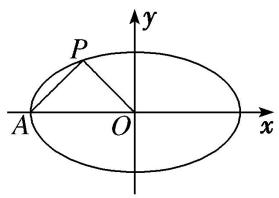
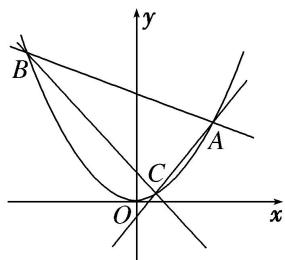

# 专题 15 已知核心方程(显性)之直线过定点模型

# 定点问题——确定方程

定点问题：在解析几何中，有些含有参数的直线或曲线的方程，不论参数如何变化，其都过某定点，这类问题称为定点问题。证明直线(曲线)过定点的基本思想是是确定方程，即使用一个参数表示直线(曲线)方程，根据方程的成立与参数值无关得出 $x$ ， $y$ 的方程组，以方程组的解为坐标的点就是直线(曲线)所过的定点。核心方程是指已知条件中的等量关系。

# 【方法总结】

# (1)单参数法

①设动直线 PM 方程为 $y=k(x-x_{0})+y_{0}$ ;  
②联立直线与椭圆(抛物线)，解出点 M 的坐标为 $(A(k), B(k))$ ，同理（由核心方程代换），得出点 N 的坐标为 $(C(k), D(k))$ ;  
③写出动直线 MN 方程，并整理成 $kf(x, y) + g(x, y) = 0$ ;  
④根据直线过定点时与参数没有关系(即方程对参数的任意值都成立)，得到方程组 $\left\{\begin{aligned}f(x,y)&=0,\\ g(x,y)&=0;\end{aligned}\right.$   
⑤方程组的解为坐标的点就是直线所过的定点.

text_image

y
P(x₀,y₀)
x
O
M
N

图1

text_image

y
P(x₀,y₀)
O
x
M
N

图2

text_image

y
P(x₀,y₀)
x
O
M
N

图3

text_image

y
P(x₀,y₀)
O
x
M
N

图4

# (2)双参数法

①设动直线 MN 方程(斜率存在)为 $y=kx+t$ ;  
②由核心方程得到 $f(k, t)=0$ (常用韦达定理);  
③把 t 用 k 表示或把 k 用 t 表示，即 $kf(x, y) + g(x, y) = 0$ (或 $tf(x, y) + g(x, y) = 0$ );  
④根据直线过定点时与参数没有关系(即方程对参数的任意值都成立)，得到方程组 $\left\{\begin{aligned}f(x,y)&=0,\\ g(x,y)&=0;\end{aligned}\right.$   
⑤方程组的解为坐标的点就是直线所过的定点.

# 【例题选讲】

[例 1] 如图所示，设椭圆 M: $\frac{x^{2}}{a^{2}} + \frac{y^{2}}{b^{2}} = 1 (a > b > 0)$ 的左顶点为 A，中心为 O，若椭圆 M 过点 $P\left(-\frac{1}{2}, \frac{1}{2}\right)$ ，且 $AP \perp OP$ .

(1)求椭圆 M 的方程;  
(2)若 $\triangle APQ$ 的顶点Q也在椭圆M上，试求 $\triangle APQ$ 面积的最大值；  
(3)过点 $A$ 作两条斜率分别为 $k_{1}$ , $k_{2}$ 的直线交椭圆 $M$ 于 $D$ , $E$ 两点, 且 $k_{1} k_{2} = 1$ , 求证: 直线 $DE$ 过定点.

text_image

P
A O x
y

[例2] 已知椭圆 $C$ 的中心在原点，焦点在 $x$ 轴上，离心率为 $\frac{\sqrt{2}}{2}$ ，它的一个焦点恰好与抛物线 $y^{2} = 4x$ 的焦点重合.

(1)求椭圆 C 的方程;

(2)设椭圆的上顶点为 A，过点 A 作椭圆 C 的两条动弦 AB，AC，若直线 AB，AC 斜率之积为 $\frac{1}{4}$ ，直线 BC 是否恒过一定点？若经过，求出该定点坐标；若不经过，请说明理由.

[例 3] 已知 P 是抛物线 E: $y^{2}=2px(p>0)$ 上一点，P 到直线 $x-y+4=0$ 的距离为 $d_{1}$ ，P 到 E 的准线的距离为 $d_{2}$ ，且 $d_{1}+d_{2}$ 的最小值为 $3\sqrt{2}$ .

(1)求抛物线 E 的方程;

(2)直线 $l_{1}$ : $y=k_{1}(x-1)$ 交 E 于点 A, B, 直线 $l_{2}$ : $y=k_{2}(x-1)$ 交 E 于点 C, D, 线段 AB, CD 的中点分别为 M, N, 若 $k_{1}k_{2}=-2$ , 直线 MN 的斜率为 k, 求证: 直线 l: $kx-y-kk_{1}-kk_{2}=0$ 恒过定点.

[例 4] (2017·全国 I) 已知椭圆 $C: \frac{x^{2}}{a^{2}} + \frac{y^{2}}{b^{2}} = 1 (a > b > 0)$ ，四点 $P_{1}(1, 1)$ ， $P_{2}(0, 1)$ ， $P_{3} \left( -1, \frac{\sqrt{3}}{2} \right)$ ， $P_{4} \left( 1, \frac{\sqrt{3}}{2} \right)$ 中恰有三点在椭圆 C 上.

(1)求 C 的方程;

(2)设直线 l 不经过 $P_{2}$ 点且与 C 相交于 A, B 两点．若直线 $P_{2}A$ 与直线 $P_{2}B$ 的斜率的和为 -1，证明：l 过定点.

[例5] 如图，过顶点在原点、对称轴为 $y$ 轴的抛物线 $E$ 上的点 $A(2,1)$ 作斜率分别为 $k_{1}$ ， $k_{2}$ 的直线，分别交抛物线 $E$ 于 $B$ ， $C$ 两点.

(1)求抛物线 E 的标准方程和准线方程;

(2)若 $k_{1}+k_{2}=k_{1}k_{2}$ ，证明：直线 BC 恒过定点.

text_image

y
B
A
C
O
x

[例 6] (2019·北京)已知椭圆 C: $\frac{x^{2}}{a^{2}}+\frac{y^{2}}{b^{2}}=1$ 的右焦点为(1, 0)，且经过点 A(0, 1).

(1)求椭圆 C 的方程;

(2)设 O 为原点，直线 l: $y=kx+t(t\neq\pm1)$ 与椭圆 C 交于两个不同点 P, Q，直线 AP 与 x 轴交于点 M，直线 AQ 与 x 轴交于点 N. 若 $|OM|\cdot|ON|=2$ ，求证：直线 l 经过定点.

[例 7] 已知椭圆 C: $\frac{x^{2}}{a^{2}} + \frac{y^{2}}{b^{2}} = 1 (a > b > 0)$ 的离心率为 $\frac{\sqrt{3}}{2}$ ，其左、右焦点分别为 $F_{1}$ ， $F_{2}$ ，点 P 为坐标平面内的一点，且 $|\overrightarrow{OP}| = \frac{3}{2}$ ， $\overrightarrow{PF_{1}} \cdot \overrightarrow{PF_{2}} = -\frac{3}{4}$ ，O 为坐标原点.

(1)求椭圆 C 的方程;

(2)设 M 为椭圆 C 的左顶点，A，B 是椭圆 C 上两个不同的点，直线 MA，MB 的倾斜角分别为 $\alpha$ ， $\beta$ ，且 $\alpha + \beta = \frac{\pi}{2}$ 。证明：直线 AB 恒过定点，并求出该定点的坐标。

# 【对点训练】

1. 已知抛物线 $C: y^{2} = 2px (p > 0)$ 的焦点 $F(1, 0)$ , $O$ 为坐标原点, $A$ , $B$ 是抛物线 $C$ 上异于 $O$ 的两点.

(1)求抛物线 C 的方程;  
(2)若直线 $OA$ ， $OB$ 的斜率之积为 $-\frac{1}{2}$ ，求证：直线 $AB$ 过 $x$ 轴上一定点.

2. 已知椭圆 $C: \frac{x^2}{a^2} + y^2 = 1 (a > 1)$ 的上顶点为 $A$ ，右焦点为 $F$ ，直线 $AF$ 与圆 $M: (x - 3)^2 + (y - 1)^2 = 3$ 相切.

(1)求椭圆 C 的方程;

(2)若不过点 $A$ 的动直线 $l$ 与椭圆 $C$ 交于 $P, Q$ 两点，且 $\overrightarrow{AP} \cdot \overrightarrow{AQ} = 0$ ，求证：直线 $l$ 过定点，并求该定点的坐标.

3. 已知抛物线 $C$ 的顶点在原点，焦点在坐标轴上，点 $A(1, 2)$ 为抛物线 $C$ 上一点.

(1)求 C 的方程;  
(2)若点 $B(1, - 2)$ 在 $C$ 上，过 $B$ 作 $C$ 的两弦 $BP$ 与 $BO$ ，若 $k_{BP}\cdot k_{BO} = -2$ ，求证：直线 $PQ$ 过定点.

4. 已知两点 $A(-\sqrt{2}, 0)$ , $B(\sqrt{2}, 0)$ , 动点 $P$ 在 $y$ 轴上的投影是 $Q$ , 且 $2\overrightarrow{PA} \cdot \overrightarrow{PB} = |\overrightarrow{PQ}|^2$ .

(1)求动点 P 的轨迹 C 的方程;  
(2)过 $F(1,0)$ 作两条直线分别交轨迹 $C$ 于点 $G$ , $H$ 和 $M$ , $N$ , 且 $k_{GH} k_{MN} = -1$ , $E_1$ , $E_2$ 分别是 $GH$ , $MN$ 的中点. 求证: 直线 $E_1 E_2$ 恒过定点.

5. 已知双曲线 $C: \frac{x^2}{a^2} - \frac{y^2}{b^2} = 1 (a > 0, b > 0)$ 的右焦点 $F$ ，半焦距 $c = 2$ ，点 $F$ 到直线 $x = \frac{a^2}{c}$ 的距离为 $\frac{1}{2}$ ，过点 $F$ 作双曲线 $C$ 的两条弦 $AB$ ， $CD$ ，且 $k_{AB} k_{CD} = -1$ ，设 $AB$ ， $CD$ 的中点分别为 $M$ ， $N$ .

(1)求双曲线 C 的标准方程;  
(2)证明直线 MN 必过定点，并求出此定点的坐标.

6. 已知 $P(0, 2)$ 是椭圆 C: $\frac{x^{2}}{a^{2}} + \frac{y^{2}}{b^{2}} = 1 (a > b > 0)$ 的一个顶点，C 的离心率 $e = \frac{\sqrt{3}}{3}$ .

(1)求椭圆的方程;

(2)过点 P 的两条直线 $l_{1}$ ， $l_{2}$ 分别与 C 相交于不同于点 P 的 A，B 两点，若 $l_{1}$ 与 $l_{2}$ 的斜率之和为 -4，则直线 AB 是否经过定点？若是，求出定点坐标；若不过定点，请说明理由.

7. 已知倾斜角为 $\frac{\pi}{4}$ 的直线经过抛物线 $\Gamma: y^2 = 2px (p > 0)$ 的焦点 $F$ ，与抛物线 $\Gamma$ 相交于 $A$ ， $B$ 两点，且 $|AB| = 8$ .

(1)求抛物线 $\Gamma$ 的方程;  
(2)过点 $P(12, 8)$ 的两条直线 $l_{1}, l_{2}$ 分别交抛物线 $\Gamma$ 于点 $C, D$ 和 $E, F$ , 线段 $CD$ 和 $EF$ 的中点分别为 $M, N$ . 如果直线 $l_{1}$ 与 $l_{2}$ 的倾斜角分别为 $\alpha, \beta$ , 且 $\alpha + \beta = \frac{\pi}{2}$ , 求证: 直线 $MN$ 经过一定点.

8. (2017·全国Ⅱ)设 O 为坐标原点，动点 M 在椭圆 C: $\frac{x^{2}}{2} + y^{2} = 1$ 上，过 M 作 x 轴的垂线，垂足为 N，点 P 满足 $\overrightarrow{NP} = \sqrt{2}\overrightarrow{NM}$ .

(1)求点 P 的轨迹方程;  
(2)设点 $Q$ 在直线 $x = -3$ 上，且 $\overrightarrow{OP} \cdot \overrightarrow{PQ} = 1$ 。证明：过点 $P$ 且垂直于 $OQ$ 的直线 $l$ 过 $C$ 的左焦点 $F$ .

