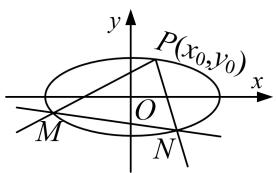
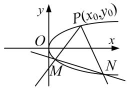
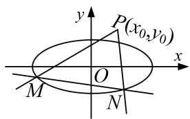
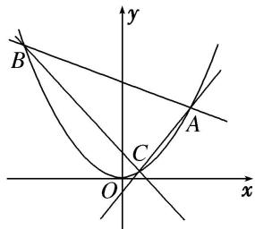

# 专题 15 已知核心方程(显性)之直线过定点模型

# 定点问题——确定方程

定点问题：在解析几何中，有些含有参数的直线或曲线的方程，不论参数如何变化，其都过某定点，这类问题称为定点问题。证明直线(曲线)过定点的基本思想是是确定方程，即使用一个参数表示直线(曲线)方程，根据方程的成立与参数值无关得出 $x$ ， $y$ 的方程组，以方程组的解为坐标的点就是直线(曲线)所过的定点。核心方程是指已知条件中的等量关系。

# 【方法总结】  
（1）单参数法

①设动直线 PM 方程为 $y=k(x-x_{0})+y_{0}$ ;  
②联立直线与椭圆(抛物线)，解出点 M 的坐标为 $(A(k), B(k))$ ，同理（由核心方程代换），得出点 N 的坐标为 $(C(k), D(k))$ ;  
③写出动直线 MN 方程，并整理成 $kf(x, y) + g(x, y) = 0$ ;  
④根据直线过定点时与参数没有关系(即方程对参数的任意值都成立)，得到方程组 $\left\{\begin{aligned}f(x,y)&=0,\\ g(x,y)&=0;\end{aligned}\right.$   
⑤方程组的解为坐标的点就是直线所过的定点.

图1

图2

图3

图4
  
（2）双参数法

①设动直线 MN 方程(斜率存在)为 $y=kx+t$ ;  
②由核心方程得到 $f(k, t)=0$ (常用韦达定理);  
③把 t 用 k 表示或把 k 用 t 表示，即 $kf(x, y) + g(x, y) = 0$ (或 $tf(x, y) + g(x, y) = 0$ );  
④根据直线过定点时与参数没有关系(即方程对参数的任意值都成立)，得到方程组 $\left\{\begin{aligned}f(x,y)&=0,\\ g(x,y)&=0;\end{aligned}\right.$   
⑤方程组的解为坐标的点就是直线所过的定点.

# 【例题选讲】

[例 1] 如图所示，设椭圆 M: $\frac{x^{2}}{a^{2}} + \frac{y^{2}}{b^{2}} = 1 (a > b > 0)$ 的左顶点为 A，中心为 O，若椭圆 M 过点 $P\left(-\frac{1}{2}, \frac{1}{2}\right)$ ，且 $AP \perp OP$ .  
（1）求椭圆 M 的方程;  
（2）若 $\triangle APQ$ 的顶点Q也在椭圆M上，试求 $\triangle APQ$ 面积的最大值；  
（3）过点 $A$ 作两条斜率分别为 $k_{1}$ , $k_{2}$ 的直线交椭圆 $M$ 于 $D$ , $E$ 两点, 且 $k_{1} k_{2} = 1$ , 求证: 直线 $DE$ 过定点.

[规范解答] （1）由 $AP \perp OP$ ，可知 $k_{AP} \cdot k_{OP} = -1$ 。又点 A 的坐标为 $(-a, 0)$ ,
所以 $\frac{\frac{1}{2}}{-\frac{1}{2}+a}\cdot\frac{\frac{1}{2}}{-\frac{1}{2}}=-1$ ，解得a=1。又因为椭圆M过点P，所以 $\frac{1}{4}+\frac{1}{4b^{2}}=1$ ，解得 $b^{2}=\frac{1}{3}$
所以椭圆 M 的方程为 $x^{2}+\frac{y^{2}}{\frac{1}{3}}=1$ .  
（2）由题意易求直线 AP 的方程为 $\frac{y-0}{\frac{1}{2}-0}=\frac{x+1}{-\frac{1}{2}+1}$ ，即 $x-y+1=0$ .
因为点 Q 在椭圆 M 上，故可设 $Q\left(\cos \theta, \frac{\sqrt{3}}{3}\sin \theta\right)$ ，又 $|AP| = \frac{\sqrt{2}}{2}$ ,
所以 $S_{\triangle APQ}=\frac{1}{2}\times\frac{\sqrt{2}}{2}\times\frac{\left|\cos\theta-\frac{\sqrt{3}}{3}\sin\theta+1\right|}{\sqrt{2}}=\frac{1}{4}\times\frac{2\sqrt{3}}{3}\cos\left(\theta+\frac{\pi}{6}\right)+1.$
当 $\theta +\frac{\pi}{6} = 2k\pi (k\in \mathbf{Z})$ ，即 $\theta = 2k\pi -\frac{\pi}{6} (k\in \mathbf{Z})$ 时， $S_{\triangle APQ}$ 取得最大值 $\frac{\sqrt{3}}{6} +\frac{1}{4}$  
（3）法一：单参数法
由题意易得，直线 AD 的方程为 $y=k_{1}(x+1)$ ，代入 $x^{2}+3y^{2}=1$ ，消去 y，
得 $(3k_{1}^{2}+1)x^{2}+6k_{1}^{2}x+3k_{1}^{2}-1=0$ 。设 $D(x_{D},y_{D})$ ，则 $(-1)\cdot x_{D}=\frac{3k_{1}^{2}-1}{3k_{1}^{2}+1}$
即 $x_{D} = \frac{1 - 3k_{1}^{2}}{1 + 3k_{1}^{2}}, y_{D} = k_{1}\left(\frac{1 - 3k_{1}^{2}}{1 + 3k_{1}^{2}} + 1\right) = \frac{2k_{1}}{1 + 3k_{1}^{2}}.$
设 $E(x_{E}, y_{E})$ ，同理可得 $x_{E}=\frac{1-3k_{2}^{2}}{1+3k_{2}^{2}}$ ， $y_{E}=\frac{2k_{2}}{1+3k_{2}^{2}}$ 。又 $k_{1}k_{2}=1$ 且 $k_{1}\neq k_{2}$ ，可得 $k_{2}=\frac{1}{k_{1}}$ 且 $k_{1}\neq\pm1$ ，
所以 $x_{E}=\frac{k_{1}^{2}-3}{k_{1}^{2}+3}$ ， $y_{E}=\frac{2k_{1}}{k_{1}^{2}+3}$ ，所以 $k_{DE}=\frac{y_{E}-y_{D}}{x_{E}-x_{D}}=\frac{\frac{2k_{1}}{k_{1}^{2}+3}-\frac{2k_{1}}{1+3k_{1}^{2}}}{\frac{k_{1}^{2}-3}{k_{1}^{2}+3}-\frac{1-3k_{1}^{2}}{1+3k_{1}^{2}}}=\frac{2k_{1}}{3(k_{1}^{2}+1)}$
故直线 DE 的方程为 $y - \frac{2k_{1}}{1 + 3k_{1}^{2}} = \frac{2k_{1}}{3(k_{1}^{2} + 1)} \left( x - \frac{1 - 3k_{1}^{2}}{1 + 3k_{1}^{2}} \right)$ .
令 y=0，可得 $x=\frac{1-3k_{1}^{2}}{1+3k_{1}^{2}}-\frac{3(k_{1}^{2}+1)}{1+3k_{1}^{2}}=-2$ 。故直线 DE 过定点 $(-2,0)$ .

法二：双参数法
设 $D(x_{D}, y_{D})$ ， $E(x_{E}, y_{E})$ 。若直线 DE 垂直于 y 轴，则 $x_{E} = -x_{D}$ ， $y_{E} = y_{D}$ ，
此时 $k_{1}k_{2}=\frac{y_{D}}{x_{D}+1}\cdot\frac{y_{E}}{x_{E}+1}=\frac{y_{D}^{2}}{1-x_{D}^{2}}=\frac{y_{D}^{2}}{3y_{D}^{2}}=\frac{1}{3}$ 与题设矛盾，
若 DE 不垂直于 y 轴，可设直线 DE 的方程为 $x=ty+s$ ，将其代入 $x^{2}+3y^{2}=1$ ，消去 x，
得 $(t^{2}+3)y^{2}+2tsy+s^{2}-1=0$ ，则 $y_{D}+y_{E}=\frac{-2ts}{t^{2}+3}$ ， $y_{D}y_{E}=\frac{s^{2}-1}{t^{2}+3}$ .
又 $k_{1}k_{2} = \frac{y_{D}}{x_{D} + 1}\cdot \frac{y_{E}}{x_{E} + 1} = \frac{y_{D}y_{E}}{(ty_{D} + s + 1)(ty_{E} + s + 1)} = 1,$
可得 $(t^{2}-1)y_{D}y_{E}+t(s+1)(y_{D}+y_{E})+(s+1)^{2}=0$ ，所以 $(t^{2}-1)\cdot\frac{s^{2}-1}{t^{2}+3}+t(s+1)\cdot\frac{-2ts}{t^{2}+3}+(s+1)^{2}=0$ ，
可得 s=-2 或 s=-1。又 DE 不过点 A，即 $s \neq -1$ ，所以 s=-2。
所以 DE 的方程为 x=ty-2。故直线 DE 过定点 $(-2,0)$ 。

[例 2] 已知椭圆 C 的中心在原点，焦点在 x 轴上，离心率为 $\frac{\sqrt{2}}{2}$ ，它的一个焦点恰好与抛物线 $y^{2}=4x$ 的焦点重合.  
（1）求椭圆 C 的方程;  
（2）设椭圆的上顶点为 A，过点 A 作椭圆 C 的两条动弦 AB，AC，若直线 AB，AC 斜率之积为 $\frac{1}{4}$ ，直线 BC 是否恒过一定点？若经过，求出该定点坐标；若不经过，请说明理由.

[规范解答] （1）由题意知椭圆的一个焦点为 $F(1, 0)$ ，则 c=1。由 $e=\frac{c}{a}=\frac{\sqrt{2}}{2}$ 得 $a=\sqrt{2}$ ，∴ b=1，∴ 椭圆 C 的方程为 $\frac{x^{2}}{2}+y^{2}=1$ 。  
（2）双参数法
由（1）知 $A(0, 1)$ ，当直线 BC 的斜率不存在时，设 BC: $x = x_{0}$ ，设 $B(x_{0}, y_{0})$ ，则 $C(x_{0}, -y_{0})$ ，
$k_{AB}\cdot k_{AC}=\frac{y_{0}-1}{x_{0}}\cdot\frac{-y_{0}-1}{x_{0}}=\frac{1-y_{0}^{2}}{x_{0}^{2}}=\frac{\frac{1}{2}x_{0}^{2}}{x_{0}^{2}}=\frac{1}{2}\neq\frac{1}{4}$ ，不合题意．故直线BC的斜率存在.
设直线 BC 的方程为： $y=kx+m(m\neq1)$ ，并代入椭圆方程，得：
$(1 + 2 k ^ {2}) x ^ {2} + 4 k m x + 2 (m ^ {2} - 1) = 0, \tag {①}$
由 $\Delta=(4km)^{2}-8(1+2k^{2})(m^{2}-1)>0$ ，得 $2k^{2}-m^{2}+1>0$ 。②
设 $B(x_{1},y_{1})$ ， $C(x_{2},y_{2})$ ，则 $x_{1}$ ， $x_{2}$ 是方程①的两根，由根与系数的关系得，
$x_{1}+x_{2}=-\frac{4km}{1+2k^{2}},\quad x_{1}x_{2}=\frac{2(m^{2}-1)}{1+2k^{2}}$ ，由 $k_{AB}\cdot k_{AC}=\frac{y_{1}-1}{x_{1}}\cdot\frac{y_{2}-1}{x_{2}}=\frac{1}{4}$ 得： $4y_{1}y_{2}-4(y_{1}+y_{2})+4=x_{1}x_{2}$
即 $(4k^{2}-1)x_{1}x_{2}+4k(m-1)(x_{1}+x_{2})+4(m-1)^{2}=0,$
整理得 $(m-1)(m-3)=0$ ，又因为 $m\neq1$ ，所以m=3，此时直线BC的方程为 $y=kx+3$ .
所以直线 BC 恒过一定点 $(0, 3)$ .

[例 3] 已知 P 是抛物线 E: $y^{2}=2px(p>0)$ 上一点，P 到直线 $x-y+4=0$ 的距离为 $d_{1}$ ，P 到 E 的准线的距离为 $d_{2}$ ，且 $d_{1}+d_{2}$ 的最小值为 $3\sqrt{2}$ .  
（1）求抛物线 E 的方程;  
（2）直线 $l_{1}$ : $y=k_{1}(x-1)$ 交 E 于点 A, B，直线 $l_{2}$ : $y=k_{2}(x-1)$ 交 E 于点 C, D，线段 AB, CD 的中点分别为 M, N，若 $k_{1}k_{2}=-2$ ，直线 MN 的斜率为 k，求证：直线 l: $kx-y-kk_{1}-kk_{2}=0$ 恒过定点.

[规范解答] （1）抛物线 E 的焦点为 $F(\frac{p}{2}, 0)$ ，由抛物线的定义可得 $d_{2}=|PF|$ ，则 $d_{1}+d_{2}=d_{1}+|PF|$ ,

其最小值为点 F 到直线 $x - y + 4 = 0$ 的距离，∴ $\frac{|p + 4|}{2} = 3\sqrt{2}$ ，解得 p = 4 或 p = -20（舍去），
∴抛物线 E 的方程为 $y^{2}=8x$ .  
（2）单参数法
设 $A(x_{1}, y_{1})$ , $B(x_{2}, y_{2})$ ，由 $\left\{\begin{aligned}y^{2}&=8x,\\ y&=k_{1}(x-1)\end{aligned}\right.$ 可得 $k_{1}^{2}x^{2}-(2k_{1}^{2}+8)x+k_{1}^{2}=0$ ,
则 $x_{1}+x_{2}=\frac{2k_{1}^{2}+8}{k_{1}^{2}}$ ，所以 $y_{1}+y_{2}=k_{1}(x_{1}-1)+k_{1}(x_{2}-1)=k_{1}(x_{1}+x_{2})-2k_{1}=\frac{2k_{1}^{2}+8}{k_{1}}-2k_{1}=\frac{2k_{1}^{2}+8-2k_{1}^{2}}{k_{1}}=\frac{8}{k_{1}}$
∴线段 AB 的中点 M 的坐标为 $\left(\frac{k_{1}^{2}+4}{k_{1}^{2}}, \frac{4}{k_{1}}\right)$ ，同理可得点 N 的坐标为 $\left(\frac{k_{2}^{2}+4}{k_{2}^{2}}, \frac{4}{k_{2}}\right)$ ,
∴ 直线 MN 的斜率 $k=\frac{\frac{4}{k_{1}}-\frac{4}{k_{2}}}{\frac{k_{1}^{2}+4}{k_{1}^{2}}-\frac{k_{2}^{2}+4}{k_{2}^{2}}}=-\frac{2}{k_{1}+k_{2}}$ ，则 $k(k_{1}+k_{2})=-2$ ，
∴ 直线 l 的方程 $kx - y - kk_{1} - kk_{2} = 0$ 可化为 $y = kx - k(k_{1} + k_{2})$ ，即 $y = kx + 2$ ，令 x = 0，可得 y = 2，
∴直线 l 恒过定点(0, 2).

[例 4] (2017·全国 I) 已知椭圆 $C: \frac{x^{2}}{a^{2}} + \frac{y^{2}}{b^{2}} = 1 (a > b > 0)$ ，四点 $P_{1}(1, 1)$ ， $P_{2}(0, 1)$ ， $P_{3} \left( -1, \frac{\sqrt{3}}{2} \right)$ ， $P_{4} \left( 1, \frac{\sqrt{3}}{2} \right)$ 中恰有三点在椭圆 C 上.  
（1）求 C 的方程;  
（2）设直线 $l$ 不经过 $P_{2}$ 点且与 $C$ 相交于 $A, B$ 两点．若直线 $P_{2}A$ 与直线 $P_{2}B$ 的斜率的和为-1，证明： $l$ 过定点.

[规范解答] （1）由于 $P_{3}$ ， $P_{4}$ 两点关于 y 轴对称，故由题设知椭圆 C 经过 $P_{3}$ ， $P_{4}$ 两点.
又由 $\frac{1}{a^{2}}+\frac{1}{b^{2}}>\frac{1}{a^{2}}+\frac{3}{4b^{2}}$ 知，椭圆C不经过点 $P_{1}$ ，所以点 $P_{2}$ 在椭圆C上.
因此 $\left\{ \begin{array}{l} \frac{1}{b^2} = 1, \\ \frac{1}{a^2} + \frac{3}{4b^2} = 1, \end{array} \right.$ 解得 $\left\{ \begin{array}{l} a^2 = 4, \\ b^2 = 1. \end{array} \right.$ 故椭圆 $C$ 的方程为 $\frac{x^2}{4} + y^2 = 1$ .  
（2）双参数法
设直线 $P_{2}A$ 与直线 $P_{2}B$ 的斜率分别为 $k_{1}$ ， $k_{2}$ .
如果 l 与 x 轴垂直，设 l: x = t，由题设知 $t \neq 0$ ，且 $|t| < 2$ ，可得 A, B 的坐标分别为 $\left(t, \frac{\sqrt{4 - t^{2}}}{2}\right)$ ， $\left(t, -\frac{\sqrt{4 - t^{2}}}{2}\right)$ .
则 $k_{1}+k_{2}=\frac{\sqrt{4-t^{2}}-2}{2t}-\frac{\sqrt{4-t^{2}}+2}{2t}=-1$ ，得 t=2，不符合题设．从而可设 l: $y=kx+m(m\neq1)$ .
将 $y=kx+m$ 代入 $\frac{x^{2}}{4}+y^{2}=1$ 得， $(4k^{2}+1)x^{2}+8kmx+4m^{2}-4=0$ ，由题设可知 $\Delta=16(4k^{2}-m^{2}+1)>0$ .
设 $A(x_{1}, y_{1})$ ， $B(x_{2}, y_{2})$ ，则 $x_{1} + x_{2} = -\frac{8km}{4k^{2} + 1}$ ， $x_{1}x_{2} = \frac{4m^{2} - 4}{4k^{2} + 1}$ .

而 $k_{1}+k_{2}=\frac{y_{1}-1}{x_{1}}+\frac{y_{2}-1}{x_{2}}=\frac{kx_{1}+m-1}{x_{1}}+\frac{kx_{2}+m-1}{x_{2}}=\frac{2kx_{1}x_{2}+(m-1)(x_{1}+x_{2})}{x_{1}x_{2}}$ .
由题设 $k_{1}+k_{2}=-1$ ，故 $(2k+1)x_{1}x_{2}+(m-1)(x_{1}+x_{2})=0$ ，即 $(2k+1)\cdot\frac{4m^{2}-4}{4k^{2}+1}+(m-1)\cdot\frac{-8km}{4k^{2}+1}=0$ .
解得 $k = -\frac{m + 1}{2}$ 当且仅当 $m > -1$ 时， $\Delta >0$ ，于是

l: $y=-\frac{m+1}{2}x+m$ ，即 $y+1=-\frac{m+1}{2}(x-2)$ ，所以 l 过定点 $(2,-1)$ .

[例5] 如图，过顶点在原点、对称轴为 $y$ 轴的抛物线 $E$ 上的点 $A(2,1)$ 作斜率分别为 $k_{1}$ ， $k_{2}$ 的直线，分别交抛物线 $E$ 于 $B$ ， $C$ 两点.  
（1）求抛物线 E 的标准方程和准线方程;  
（2）若 $k_{1}+k_{2}=k_{1}k_{2}$ ，证明：直线 BC 恒过定点.

[规范解答] （1）设抛物线 E 的标准方程为 $x^{2}=ay,\quad a>0$ ，将 A(2,1)代入得，a=4.
所以抛物线 E 的标准方程为 $x^{2}=4y$ ，准线方程为 y=-1.  
（2）单参数法
由题意得，直线 AB 的方程为 $y=k_{1}x+1-2k_{1}$ ，直线 AC 的方程为 $y=k_{2}x+1-2k_{2}$ ，
联立 $\left\{\begin{aligned}x^{2}&=4y,\\ y&=k_{1}x+1-2k_{1},\end{aligned}\right.$ 消去y得 $x^{2}-4k_{1}x-4(1-2k_{1})=0,$
解得 x=2 或 $x=4k_{1}-2$ ，因此点 $B(4k_{1}-2, (2k_{1}-1)^{2})$ ，同理可得 $C(4k_{2}-2, (2k_{2}-1)^{2})$ .
于是直线 BC 的斜率 $k=\frac{(2k_{1}-1)^{2}-(2k_{2}-1)^{2}}{(4k_{1}-2)-(4k_{2}-2)}=\frac{4(k_{1}-k_{2})(k_{1}+k_{2}-1)}{4(k_{1}-k_{2})}=k_{1}+k_{2}-1$ ，又 $k_{1}+k_{2}=k_{1}k_{2}$
所以直线 BC 的方程为 $y-(2k_{2}-1)^{2}=(k_{1}k_{2}-1)\cdot[x-(4k_{2}-2)]$ ,
即 $y=(k_{1}k_{2}-1)x-2k_{1}k_{2}-1=(k_{1}k_{2}-1)(x-2)-3$ 。故直线 BC 恒过定点 $(2,-3)$

[例 6] (2019·北京)已知椭圆 C: $\frac{x^{2}}{a^{2}} + \frac{y^{2}}{b^{2}} = 1$ 的右焦点为 $(1, 0)$ ，且经过点 A(0, 1).  
（1）求椭圆 C 的方程;  
（2）设 O 为原点，直线 l: $y=kx+t(t\neq\pm1)$ 与椭圆 C 交于两个不同点 P, Q，直线 AP 与 x 轴交于点 M，直线 AQ 与 x 轴交于点 N. 若 $|OM|\cdot|ON|=2$ ，求证：直线 l 经过定点.

[规范解答] （1）由题意，得 $b^{2}=1,\quad c=1$ ，所以 $a^{2}=b^{2}+c^{2}=2$ ．所以椭圆 C 的方程为 $\frac{x^{2}}{2}+y^{2}=1$ ．  
（2）双参数法
设 $P(x_{1}, y_{1})$ ， $Q(x_{2}, y_{2})$ ，则直线 AP 的方程为 $y=\frac{y_{1}-1}{x_{1}}x+1$ .
令 y=0，得点 M 的横坐标 $x_{M}=-\frac{x_{1}}{y_{1}-1}$ . 又 $y_{1}=kx_{1}+t$ ，从而 $|OM|=|x_{M}|=\left|\frac{x_{1}}{kx_{1}+t-1}\right|$ .

同理， $|ON|=\left|\frac{x_{2}}{kx_{2}+t-1}\right|$ ．由 $\left\{\begin{aligned}y=kx+t,\\ \frac{x^{2}}{2}+y^{2}=1,\end{aligned}\right.$ 得 $(1+2k^{2})x^{2}+4ktx+2t^{2}-2=0,$
则 $x_{1}+x_{2}=-\frac{4kt}{1+2k^{2}}$ ， $x_{1}x_{2}=\frac{2t^{2}-2}{1+2k^{2}}$ .
所以 $|OM|\cdot|ON|=\left|\frac{x_{1}}{kx_{1}+t-1}\right|\cdot\left|\frac{x_{2}}{kx_{2}+t-1}\right|=\left|\frac{x_{1}x_{2}}{k^{2}x_{1}x_{2}+k(t-1)(x_{1}+x_{2})+(t-1)^{2}}\right|$
$= \left| \frac {\frac {2 t ^ {2} - 2}{1 + 2 k ^ {2}}}{k ^ {2} \cdot \frac {2 t ^ {2} - 2}{1 + 2 k ^ {2}} + k (t - 1) \cdot \left(- \frac {4 k t}{1 + 2 k ^ {2}}\right) + (t - 1) ^ {2}} \right| = 2 \left| \frac {1 + t}{1 - t} \right|.$
又 $|OM|\cdot|ON|=2$ ，所以 $2\left|\frac{1+t}{1-t}\right|=2$ 。解得t=0，所以直线l经过定点 $(0,0)$ 。

[例 7] 已知椭圆 C: $\frac{x^{2}}{a^{2}} + \frac{y^{2}}{b^{2}} = 1 (a > b > 0)$ 的离心率为 $\frac{\sqrt{3}}{2}$ ，其左、右焦点分别为 $F_{1}$ ， $F_{2}$ ，点 P 为坐标平面内的一点，且 $|\overrightarrow{OP}| = \frac{3}{2}$ ， $\overrightarrow{PF_{1}} \cdot \overrightarrow{PF_{2}} = -\frac{3}{4}$ ，O 为坐标原点.  
（1）求椭圆 C 的方程;  
（2）设 $M$ 为椭圆 $C$ 的左顶点, $A$ , $B$ 是椭圆 $C$ 上两个不同的点, 直线 $MA$ , $MB$ 的倾斜角分别为 $\alpha$ , $\beta$ , 且 $\alpha + \beta = \frac{\pi}{2}$ . 证明: 直线 $AB$ 恒过定点, 并求出该定点的坐标.

[规范解答] （1） 设 P 点坐标为 $(x_{0}, y_{0})$ ， $F_{1}(-c, 0)$ ， $F_{2}(c, 0)$ ，
则 $\overrightarrow{PF_{1}}=(-c-x_{0},-y_{0}),\overrightarrow{PF_{2}}=(c-x_{0},-y_{0}).$
由题意得 $\left\{ \begin{array}{l} x_0^2 + y_0^2 = \frac{9}{4}, \\ (x_0 + c)(x_0 - c) + y_0^2 = -\frac{3}{4}, \end{array} \right.$ 解得 $c^2 = 3$ ， $\therefore c = \sqrt{3}$ 又 $e = \frac{c}{a} = \frac{\sqrt{3}}{2}$ ， $\therefore a = 2$
$\therefore b^{2}=a^{2}-c^{2}=1.$ ∴所求椭圆 C 的方程为 $\frac{x^{2}}{4}+y^{2}=1.$  
（2）双参数法
设直线 AB 方程为 $y=kx+m$ ， $A(x_{1},y_{1})$ ， $B(x_{2},y_{2})$ .
联立方程 $\left\{\begin{aligned}\frac{x^{2}}{4}+y^{2}&=1,\\ y&=kx+m,\end{aligned}\right.$ 消去 y 得 $(4k^{2}+1)x^{2}+8kmx+4m^{2}-4=0.$
$\therefore x_{1} + x_{2} = -\frac{8km}{4k^{2} + 1}, x_{1}x_{2} = \frac{4m^{2} - 4}{4k^{2} + 1}$ . 又由 $\alpha + \beta = \frac{\pi}{2}$ , $\therefore \tan \alpha \cdot \tan \beta = 1$ ,
设直线 MA，MB 斜率分别为 $k_{1}$ ， $k_{2}$ ，则 $k_{1}k_{2}=1$ ， $\therefore\frac{y_{1}}{x_{1}+2}\cdot\frac{y_{2}}{x_{2}+2}=1$ ，即 $(x_{1}+2)(x_{2}+2)=y_{1}y_{2}$ .
$\therefore (x _ {1} + 2) (x _ {2} + 2) = (k x _ {1} + m) (k x _ {2} + m), \quad \therefore (k ^ {2} - 1) x _ {1} x _ {2} + (k m - 2) (x _ {1} + x _ {2}) + m ^ {2} - 4 = 0,$
$\therefore(k^{2}-1)\frac{4m^{2}-4}{4k^{2}+1}+(km-2)\left(-\frac{8km}{4k^{2}+1}\right)+m^{2}-4=0$ ，化简得 $20k^{2}-16km+3m^{2}=0$ ，
解得 m=2k，或 $m=\frac{10}{3}k$ .
当 m=2k 时， $y=kx+2k$ ，过定点 $(-2,0)$ ，不合题意(舍去).
当 $m=\frac{10}{3}k$ 时， $y=kx+\frac{10}{3}k$ ，过定点 $\left(-\frac{10}{3},0\right)$ ,
∴直线 AB 恒过定点 $\left(-\frac{10}{3}, 0\right)$ .

# 【对点训练】

1. 已知抛物线 $C: y^{2} = 2px (p > 0)$ 的焦点 $F(1, 0)$ ， $O$ 为坐标原点， $A, B$ 是抛物线 $C$ 上异于 $O$ 的两点.  
（1）求抛物线 C 的方程;  
（2）若直线 $OA$ ， $OB$ 的斜率之积为 $-\frac{1}{2}$ ，求证：直线 $AB$ 过 $x$ 轴上一定点.

1. 解析 （1）因为抛物线 $y^{2}=2px(p>0)$ 的焦点坐标为 $F(1,0)$ ，所以 $\frac{p}{2}=1$ ，所以 p=2.
所以抛物线 C 的方程为 $v^{2}=4x$ .  
（2）双参数法

①当直线 AB 的斜率不存在时，设 $A\left(\frac{t^{2}}{4}, t\right)$ ， $B\left(\frac{t^{2}}{4}, -t\right)$ .
因为直线 OA，OB 的斜率之积为 $-\frac{1}{2}$ ，所以 $\frac{t}{\frac{t^{2}}{4}} \cdot \frac{-t}{\frac{t^{2}}{4}} = -\frac{1}{2}$ ，化简得 $t^{2} = 32$ .
所以 $A(8, t)$ ， $B(8, -t)$ ，此时直线 AB 的方程为 x=8.

②当直线 AB 的斜率存在时，设其方程为 $y=kx+b$ ， $A(x_{A},y_{A})$ ， $B(x_{B},y_{B})$ ，联立 $\left\{\begin{aligned}y^{2}&=4x,\\ y&=kx+b\end{aligned}\right.$
消去 x，化简得 $ky^{2}-4y+4b=0$ 。所以 $y_{A}y_{B}=\frac{4b}{k}$ ,
因为直线 OA，OB 的斜率之积为 $-\frac{1}{2}$ ，所以 $\frac{y_{A}}{x_{A}}\frac{y_{B}}{x_{B}}=-\frac{1}{2}$
整理得 $x_{A}x_{B}+2y_{A}y_{B}=0$ 。即 $\frac{y_{A}^{2}}{4}\cdot\frac{y_{B}^{2}}{4}+2y_{A}y_{B}=0$ ，解得 $y_{A}y_{B}=0$ (舍去) 或 $y_{A}y_{B}=-32$
所以 $y_{A}y_{B}=\frac{4b}{k}=-32$ ，即 b=-8k，所以 y=kx-8k，即 $y=k(x-8)$ .
综上所述，直线 AB 过定点 $(8, 0)$ .

2. 已知椭圆 $C: \frac{x^2}{a^2} + y^2 = 1 (a > 1)$ 的上顶点为 $A$ ，右焦点为 $F$ ，直线 $AF$ 与圆 $M: (x - 3)^2 + (y - 1)^2 = 3$ 相切.  
（1）求椭圆 C 的方程;  
（2）若不过点 A 的动直线 l 与椭圆 C 交于 P, Q 两点，且 $\overrightarrow{AP} \cdot \overrightarrow{AQ} = 0$ ，求证：直线 l 过定点，并求该定点的坐标.

2. 解析 （1） 圆 $M$ 的圆心为 $(3, 1)$ ，半径 $r = \sqrt{3}$ 。由题意知 $A(0, 1), F(c, 0)$ ，

直线 $AF$ 的方程为 $\frac{x}{c} + y = 1$ ，即 $x + cy - c = 0$ ，由直线 $AF$ 与圆 $M$ 相切，得 $\frac{|3 + c - c|}{\sqrt{c^2 + 1}} = \sqrt{3}$ ，
解得 $c^{2}=2,\quad a^{2}=c^{2}+1=3$ ，故椭圆 C 的方程为 $\frac{x^{2}}{3}+y^{2}=1$ .  
（2）单参数法
由 $\overrightarrow{AP}\cdot\overrightarrow{AQ}=0$ 知 $AP\perp AQ$ ，从而直线AP与坐标轴不垂直，
故可设直线 AP 的方程为 $y=kx+1$ ，直线 AQ 的方程为 $y=-\frac{1}{k}x+1$ 。
联立方程组 $\left\{\begin{aligned}y&=kx+1,\\ \frac{x^{2}}{3}&+y^{2}=1,\end{aligned}\right.$ 整理得 $(1+3k^{2})x^{2}+6kx=0$ ，解得x=0或 $x=\frac{-6k}{1+3k^{2}}$
故点 P 的坐标为 $\left(\frac{-6k}{1+3k^{2}}, \frac{1-3k^{2}}{1+3k^{2}}\right)$ ，同理，点 Q 的坐标为 $\left(\frac{6k}{k^{2}+3}, \frac{k^{2}-3}{k^{2}+3}\right)$ .
所以直线 l 的斜率为 $\frac{\frac{k^{2}-3}{k^{2}+3}-\frac{1-3k^{2}}{1+3k^{2}}}{\frac{6k}{k^{2}+3}-\frac{-6k}{1+3k^{2}}}=\frac{k^{2}-1}{4k}$ ，所以直线 l 的方程为 $y=\frac{k^{2}-1}{4k}\left(x-\frac{6k}{k^{2}+3}\right)+\frac{k^{2}-3}{k^{2}+3}$
即 $y=\frac{k^{2}-1}{4k}x-\frac{1}{2}$ . 所以直线 l 过定点 $\left(0, -\frac{1}{2}\right)$ .

3. 已知抛物线 $C$ 的顶点在原点，焦点在坐标轴上，点 $A(1, 2)$ 为抛物线 $C$ 上一点.  
（1）求 C 的方程;  
（2）若点 $B(1, -2)$ 在 $C$ 上，过 $B$ 作 $C$ 的两弦 $BP$ 与 $BQ$ ，若 $k_{BP} \cdot k_{BQ} = -2$ ，求证：直线 $PQ$ 过定点.

3. 解析 （1） 当焦点在 $x$ 轴时, 设 $C$ 的方程 $y^{2} = 2px$ , 代入点 $A(1, 2)$ , 得 $2p = 4$ , 即 $y^{2} = 4x$ ,
当焦点在 y 轴时，设 C 的方程为 $x^{2}=2py$ ，代入点 A(1, 2) 得 $2p=\frac{1}{2}$ ，即 $x^{2}=\frac{1}{2}y$ ，

综上可知，C 的方程为 $y^{2}=4x$ 或 $x^{2}=\frac{1}{2}y$ .  
（2）双参数法
因为点 $B(1, -2)$ 在 C 上，所以曲线 C 的方程为 $y^{2}=4x$ ，
设点 $P(x_{1}, y_{1})$ ， $Q(x_{2}, y_{2})$ ，设直线 PQ: x=my+b,
由 $\left\{ \begin{array}{l} x = my + b, \\ y^2 = 4x, \end{array} \right.$ 可得 $y^2 - 4my - 4b = 0, \Delta = 16(m^2 + b), \therefore y_1 + y_2 = 4m, y_1y_2 = -4b.$
$\because k _ {B P} \cdot k _ {B Q} = - 2, \therefore \frac {y _ {1} + 2}{x _ {1} - 1} \cdot \frac {y _ {2} + 2}{x _ {2} - 1} = - 2, \because x _ {1} = \frac {y _ {1} ^ {2}}{4}, x _ {2} = \frac {y _ {2} ^ {2}}{4}, \therefore \frac {4}{y _ {1} - 2} \cdot \frac {4}{y _ {2} - 2} = - 2,$
即 $y_{1}y_{2}-2(y_{1}+y_{2})+12=0,\quad\therefore-4b-8m+12=0$ ，即 b=3-2m，满足 $\Delta>0$ ，

直线 PQ: $x=my+b=my+3-2m$ ，即 $x-3=m(y-2)$ ,
∴直线 PQ 过定点(3, 2).

4. 已知两点 $A(-\sqrt{2}, 0)$ ， $B(\sqrt{2}, 0)$ ，动点 P 在 y 轴上的投影是 Q，且 $2\overrightarrow{PA}\cdot\overrightarrow{PB}=|\overrightarrow{PQ}|^{2}$ .  
（1）求动点 P 的轨迹 C 的方程;  
（2）过 $F(1,0)$ 作两条直线分别交轨迹 $C$ 于点 $G$ , $H$ 和 $M$ , $N$ , 且 $k_{GH} k_{MN} = -1$ , $E_1$ , $E_2$ 分别是 $GH$ , $MN$ 的中点. 求证: 直线 $E_1 E_2$ 恒过定点.

4. 解析 （1）设点 P 的坐标为 $(x, y)$ ，∴ 点 Q 的坐标为 $(0, y)$ .
$\because 2 \overrightarrow {P A} \cdot \overrightarrow {P B} = | \overrightarrow {P Q} | ^ {2}, \quad \overrightarrow {P A} = (- \sqrt {2} - x, - y), \quad \overrightarrow {P B} = (\sqrt {2} - x, - y), | \overrightarrow {P Q} | = | x |,$
∴ $2[(-\sqrt{2}-x)(\sqrt{2}-x)+y^{2}]=x^{2}$ ，化简得点 P 的轨迹方程为 $\frac{x^{2}}{4}+\frac{y^{2}}{2}=1$ .  
（2）单参数法
当两直线的斜率都存在且不为 0 时，设 $l_{GH}$ : $y=k(x-1)$ , $G(x_{1}, y_{1})$ , $H(x_{2}, y_{2})$ ,
$l_{MN}$ : $y=-\frac{1}{k}(x-1)$ , $M(x_{3}, y_{3})$ , $N(x_{4}, y_{4})$ , 联立 $\left\{\begin{aligned}\frac{x^{2}}{4}+\frac{y^{2}}{2}&=1,\\ y=k(x-1),\end{aligned}\right.$
消去 y 得 $(2k^{2}+1)x^{2}-4k^{2}x+2k^{2}-4=0$ .
则 $\Delta>0$ 恒成立， $\therefore x_{1}+x_{2}=\frac{4k^{2}}{2k^{2}+1}$ ， $x_{1}x_{2}=\frac{2k^{2}-4}{2k^{2}+1}$ ，∴GH中点 $E_{1}$ 的坐标为 $\left(\frac{2k^{2}}{2k^{2}+1},\frac{-k}{2k^{2}+1}\right)$ .

同理，MN 中点 $E_{2}$ 的坐标为 $\left(\frac{2}{k^{2}+2}, \frac{k}{k^{2}+2}\right)$ ，∴ $k_{E1E2}=\frac{-3k}{2(k^{2}-1)}$ ,
∴ $l_{E1E2}$ 的方程为 $y - \frac{k}{k^{2} + 2} = \frac{-3k}{2(k^{2} - 1)} \left( x - \frac{2}{k^{2} + 2} \right)$ ，即 $y = \frac{-3k}{2(k^{2} - 1)} \left( x - \frac{2}{3} \right)$ ,
∴直线 $E_{1}E_{2}$ 恒过定点 $\left(\frac{2}{3},0\right)$ ;
当两直线的斜率分别为 0 和不存在时， $l_{E1E2}$ 的方程为 y=0，也过点 $\left(\frac{2}{3}, 0\right)$ .
综上所述， $l_{E1E2}$ 过定点 $\left(\frac{2}{3}, 0\right)$ .

5. 已知双曲线 $C: \frac{x^2}{a^2} - \frac{y^2}{b^2} = 1 (a > 0, b > 0)$ 的右焦点 $F$ ，半焦距 $c = 2$ ，点 $F$ 到直线 $x = \frac{a^2}{c}$ 的距离为 $\frac{1}{2}$ ，过点 $F$ 作双曲线 $C$ 的两条弦 $AB$ ， $CD$ ，且 $k_{AB} k_{CD} = -1$ ，设 $AB$ ， $CD$ 的中点分别为 $M$ ， $N$ .  
（1）求双曲线 C 的标准方程;  
（2）证明直线 MN 必过定点，并求出此定点的坐标.

5. 解析 （1）由题意可得 $c = 2, c - \frac{a^2}{c} = \frac{1}{2}, b^2 = c^2 - a^2$ ，解得 $a^2 = 3, b^2 = 1$
所以双曲线 C 的标准方程为 $\frac{x^{2}}{3}-y^{2}=1$ .  
（2）单参数法
由题意知 $F(2, 0)$ ，设过 F 的弦 AB 所在的直线方程为 $x = ky + 2$ ， $A(x_{1}, y_{1})$ ， $B(x_{2}, y_{2})$ ，
则有中点 $M\left(\frac{k(y_{1}+y_{2})}{2}+2, \frac{y_{1}+y_{2}}{2}\right)$ ，联立直线 AB 与双曲线的方程，得 $\left\{\begin{aligned}x&=ky+2,\\ \frac{x^{2}}{3}&-y^{2}=1,\end{aligned}\right.$

整理可得 $(k^{2}-3)y^{2}+4ky+1=0$ ，因为弦AB与双曲线有两个交点，所以 $k^{2}-3\neq0$ ，
$y_{1} + y_{2} = \frac{4k}{3 - k^{2}}$ ，所以 $x_{1} + x_{2} = k(y_{1} + y_{2}) + 4 = \frac{12}{3 - k^{2}}$ ，所以 $M\left[\frac{6}{3 - k^2},\frac{2k}{3 - k^2}\right].$

(i) 当 k=0 时，点 M 即为点 F，此时直线 MN 为 x 轴；
(ii)当 $k \neq 0$ 时，将点 $M$ 坐标中的 $k$ 换成 $-\frac{1}{k}$ ，同理可得点 $N$ 的坐标为 $\left[\frac{6k^2}{3k^2 - 1}, -\frac{2k}{3k^2 - 1}\right]$ ，

①当直线 MN 不垂直于 x 轴时，直线 MN 的斜率 $k_{MN}=\frac{\frac{2k}{3-k^{2}}+\frac{2k}{3k^{2}-1}}{\frac{6}{3-k^{2}}-\frac{6k^{2}}{3k^{2}-1}}=\frac{2k}{3-k^{2}-1}$ ,
将 M 代入方程可得直线 MN: $y - \frac{2k}{3 - k^{2}} = \frac{2k}{3(k^{2} - 1)} \left( x - \frac{6}{3 - k^{2}} \right)$ ，化简可得 $y = \frac{2k}{3 - k^{2} - 1} (x - 3)$ ，所以直线 MN 恒过定点 $P(3, 0)$ ;

②当直线 MN 垂直于 x 轴时，由 $\frac{6}{3-k^{2}}=\frac{6k^{2}}{3k^{2}-1}$ ，可得 $k=\pm1$ ，直线 MN 也过定点 $P(3,0)$ .
综上所述，直线 MN 恒过定点 $P(3, 0)$ .

6. 已知 $P(0, 2)$ 是椭圆 C: $\frac{x^{2}}{a^{2}} + \frac{y^{2}}{b^{2}} = 1 (a > b > 0)$ 的一个顶点，C 的离心率 $e = \frac{\sqrt{3}}{3}$ .  
（1）求椭圆的方程;  
（2）过点 P 的两条直线 $l_{1}$ ， $l_{2}$ 分别与 C 相交于不同于点 P 的 A，B 两点，若 $l_{1}$ 与 $l_{2}$ 的斜率之和为 -4，则直线 AB 是否经过定点？若是，求出定点坐标；若不过定点，请说明理由.

6. 解析 （1）由题意可得 $\left\{ \begin{array}{l} b = 2, \\ \frac{c}{a} = \frac{\sqrt{3}}{3}, \\ a^2 = b^2 + c^2, \end{array} \right.$ 解得 $a = \sqrt{6}$ , $b = 2$ , $c = \sqrt{2}$ , $\therefore$ 椭圆的方程为 $\frac{x^2}{6} + \frac{y^2}{4} = 1$ .  
（2）双参数法
当直线 AB 的斜率存在时，设直线 AB 的方程为 $y=kx+t(t\neq2)$ ， $A(x_{1},y_{1})$ ， $B(x_{2},y_{2})$ ，
联立 $\left\{\begin{aligned}y=kx+t,\\ x^{2}/6+y^{2}/4=1,\end{aligned}\right.$ 消去 y 并整理，可得 $(3k^{2}+2)x^{2}+6ktx+3t^{2}-12=0,$
∴ $\Delta=36(kt)^{2}-4\times(3k^{2}+2)(3t^{2}-12)>0$ ，即 $24(6k^{2}-t^{2}+4)>0$ ，
则 $x_{1}+x_{2}=-\frac{6kt}{3k^{2}+2},\quad x_{1}x_{2}=\frac{3t^{2}-12}{3k^{2}+2},$
由 $l_{1}$ 与 $l_{2}$ 的斜率之和为 -4，可得 $\frac{y_{1}-2}{x_{1}}+\frac{y_{2}-2}{x_{2}}=-4$ ，又 $y_{1}=kx_{1}+t,\quad y_{2}=kx_{2}+t,$
$\therefore \frac {y _ {1} - 2}{x _ {1}} + \frac {y _ {2} - 2}{x _ {2}} = \frac {k x _ {1} + t - 2}{x _ {1}} + \frac {k x _ {2} + t - 2}{x _ {2}} = 2 k + \frac {(t - 2) (x _ {1} + x _ {2})}{x _ {1} x _ {2}} = 2 k + \frac {(t - 2) \cdot \frac {- 6 k t}{3 k ^ {2} + 2}}{\frac {3 t ^ {2} - 1 2}{3 k ^ {2} + 2}} = - 4,$
∵t≠2，化简可得 t=-k-2，∴y=kx-k-2=k(x-1)-2，∴直线 AB 经过定点(1,-2).
当直线 AB 的斜率不存在时，设直线 AB 的方程为 x=m， $A(m, y_{1})$ ， $B(m, y_{2})$ ，
$\therefore \frac {y _ {1} - 2}{m} + \frac {y _ {2} - 2}{m} = \frac {y _ {1} + y _ {2} - 4}{m} = - 4,$
又点 A, B 均在椭圆上，∴ A, B 关于 x 轴对称，∴ $y_{1} + y_{2} = 0$ ，∴ m = 1，
故直线 AB 的方程为 x=1，也过点 $(1, -2)$ ，

综上直线 AB 经过定点，定点为 $(1, -2)$ .

7. 已知倾斜角为 $\frac{\pi}{4}$ 的直线经过抛物线 $\Gamma$ ： $y^{2} = 2px(p > 0)$ 的焦点 $F$ ，与抛物线 $\Gamma$ 相交于 $A$ ， $B$ 两点，且 $|AB| = 8$ .  
（1）求抛物线 $\Gamma$ 的方程;  
（2）过点 $P(12, 8)$ 的两条直线 $l_{1}, l_{2}$ 分别交抛物线 $\Gamma$ 于点 $C, D$ 和 $E, F$ , 线段 $CD$ 和 $EF$ 的中点分别为 $M, N$ . 如果直线 $l_{1}$ 与 $l_{2}$ 的倾斜角分别为 $\alpha, \beta$ , 且 $\alpha + \beta = \frac{\pi}{2}$ , 求证: 直线 $MN$ 经过一定点.

7. 解析 （1）由题意可设直线 AB 的方程为 $y=x-\frac{p}{2}$ ，由 $\left\{\begin{aligned}y&=x-\frac{p}{2},\\ y^{2}&=2px,\end{aligned}\right.$ 消去 y 整理得 $x^{2}-3px+\frac{p^{2}}{4}=0$ ,
$\Delta=9p^{2}-4\times\frac{p^{2}}{4}=8p^{2}>0$ ，令 $A(x_{1},y_{1})$ ， $B(x_{2},y_{2})$ ，则 $x_{1}+x_{2}=3p$ ，
由抛物线的定义得 $|AB|=x_{1}+x_{2}+p=4p=8,\quad\therefore p=2,\quad\therefore$ 抛物线的方程为 $y^{2}=4x$ .  
（2）单参数法
由题意知， $\alpha,\beta\neq\frac{\pi}{2}$ . 直线 $l_{1}$ 的斜率为 k，则 $k=\tan\alpha,\because\alpha+\beta=\frac{\pi}{2}$ ,
$\therefore \tan \beta = \tan \left( \frac{\pi}{2} - \alpha \right) = \frac{\sin \left( \frac{\pi}{2} - \alpha \right)}{\cos \left( \frac{\pi}{2} - \alpha \right)} = \frac{\cos \alpha}{\sin \alpha} = \frac{1}{\frac{\sin \alpha}{\cos \alpha}} = \frac{1}{\tan \alpha}, \therefore$ 直线 $l_{2}$ 的斜率为 $\frac{1}{k}$ .
∴ 直线 CD 的方程为 $y-8=k(x-12)$ ，即 $y=k(x-12)+8$ ，由 $\left\{\begin{aligned}y&=k(x-12)+8,\\ y^{2}&=4x,\end{aligned}\right.$
消去 x 整理得 $ky^{2}-4y+32-48k=0$ ，设 $C(x_{C}, y_{C})$ ， $D(x_{D}, y_{D})$ ， $\therefore y_{C}+y_{D}=\frac{4}{k}$ ， $\therefore x_{C}+x_{D}=24+\frac{4}{k^{2}}-\frac{16}{k}$ ∴ 点 M 的坐标为 $\left(12+\frac{2}{k^{2}}-\frac{8}{k},\frac{2}{k}\right)$ ，以 $\frac{1}{k}$ 代替点 M 坐标中的 k，可得点 N 的坐标为 $(12+2k^{2}-8k,2k)$ ,
$\therefore k _ {M N} = \frac {2 \left(\frac {1}{k} - k\right)}{2 \left(\frac {1}{k ^ {2}} - k ^ {2}\right) - 8 \left(\frac {1}{k} - k\right)} = \frac {1}{\frac {1}{k} + k - 4}.$
∴直线 MN 的方程为 $y-2k=\frac{1}{\frac{1}{k}+k-4}[x-(12+2k^{2}-8k)]$ ，即 $\left(\frac{1}{k}+k-4\right)y=x-10$ ,
显然当 x=10 时，y=0，故直线 MN 经过定点 $(10, 0)$ .

8. (2017·全国Ⅱ)设 O 为坐标原点，动点 M 在椭圆 C: $\frac{x^{2}}{2} + y^{2} = 1$ 上，过 M 作 x 轴的垂线，垂足为 N，点 P 满足 $\overrightarrow{NP} = \sqrt{2}\overrightarrow{NM}$ .  
（1）求点 P 的轨迹方程;  
（2）设点 $Q$ 在直线 $x = -3$ 上，且 $\overrightarrow{OP} \cdot \overrightarrow{PQ} = 1$ 。证明：过点 $P$ 且垂直于 $OQ$ 的直线 $l$ 过 $C$ 的左焦点 $F$ .

8. 解析 （1） 设 $P(x, y)$ ， $M(x_{0}, y_{0})$ ，则 $N(x_{0}, 0)$ ， $\overrightarrow{NP} = (x - x_{0}, y)$ ， $\overrightarrow{NM} = (0, y_{0})$ .
由 $\overrightarrow{NP}=\sqrt{2}\quad\overrightarrow{NM}$ 得 $x_{0}=x,\quad y_{0}=\frac{\sqrt{2}}{2}y$ 。因为 $M(x_{0},y_{0})$ 在C上，所以 $\frac{x^{2}}{2}+\frac{y^{2}}{2}=1$ 。
因此点 P 的轨迹方程为 $x^{2}+y^{2}=2$ .  
（2）由题意知 $F(-1, 0)$ . 设 $Q(-3, t)$ , $P(m, n)$ , 则 $\overrightarrow{OQ}=(-3, t)$ ,
$\overrightarrow {P F} = (- 1 - m, - n), \overrightarrow {O Q} \cdot \overrightarrow {P F} = 3 + 3 m - t n, \overrightarrow {O P} = (m, n), \overrightarrow {P Q} = (- 3 - m, t - n).$
由 $\overrightarrow{OP} \cdot \overrightarrow{PQ} = 1$ ，得 $-3m - m^2 + tn - n^2 = 1$ 。又由（1）知 $m^2 + n^2 = 2$ ，故 $3 + 3m - tn = 0$ 。
所以 $\overrightarrow{OQ} \cdot \overrightarrow{PF} = 0$ ，即 $\overrightarrow{OQ} \perp \overrightarrow{PF}$ 。又过点 $P$ 存在唯一直线垂直于 $OQ$ ，所以过点 $P$ 且垂直于 $OQ$ 的直线 $l$ 过 $C$ 的左焦点 $F$ 。

