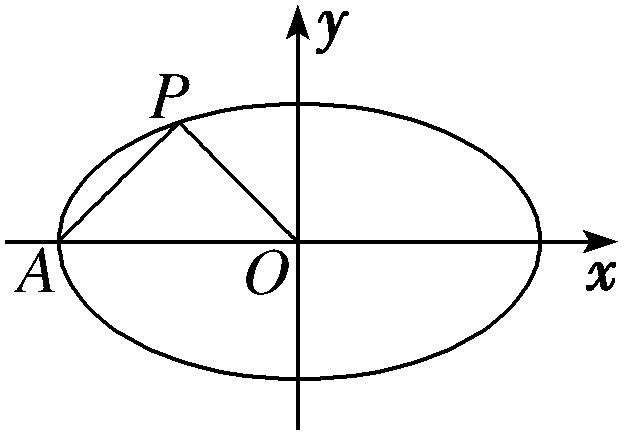
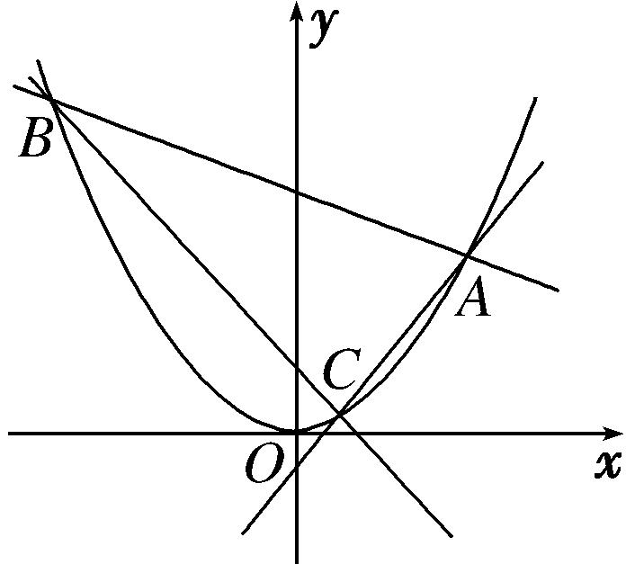

**专题15　已知核心方程(显性)之直线过定点模型**

**定点问题——确定方程**

定点问题：在解析几何中，有些含有参数的直线或曲线的方程，不论参数如何变化，其都过某定点，这类问题称为定点问题．证明直线(曲线)过定点的基本思想是是确定方程，即使用一个参数表示直线(曲线)方程，根据方程的成立与参数值无关得出*x*，*y*的方程组，以方程组的解为坐标的点就是直线(曲线)所过的定点．核心方程是指已知条件中的等量关系．

【**方法总结**】

(1)单参数法

①设动直线<em>PM</em>方程为<em>y</em>＝<em>k</em>(<em>x</em>－<em>x</em>0)＋<em>y</em>0；

②联立直线与椭圆(抛物线)，解出点*M*的坐标为(*A*(*k*)，*B*(*k*))，同理(由核心方程代换)，得出点*N*的坐标为(*C*(*k*)，*D*(*k*))；

③写出动直线*MN*方程，并整理成*kf*(*x*，*y*)＋*g*(*x*，*y*)＝0；

④根据直线过定点时与参数没有关系(即方程对参数的任意值都成立)，得到方程组

⑤方程组的解为坐标的点就是直线所过的定点．

(2)双参数法

①设动直线*MN*方程(斜率存在)为*y*＝*kx*＋*t*；

②由核心方程得到*f*(*k*，*t*)＝0(常用韦达定理)；

③把*t*用*k*表示或把*k*用*t*表示，即*kf*(*x*，*y*)＋*g*(*x*，*y*)＝0(或*tf*(*x*，*y*)＋*g*(*x*，*y*)＝0)；

④根据直线过定点时与参数没有关系(即方程对参数的任意值都成立)，得到方程组

⑤方程组的解为坐标的点就是直线所过的定点．

**【例题选讲】**

<strong>[例1]</strong>　如图所示，设椭圆<em>M</em>：＋＝1(<em>a</em>&gt;<em>b</em>&gt;0)的左顶点为<em>A</em>，中心为<em>O</em>，若椭圆<em>M</em>过点<em>P</em>，且<em>AP</em>⊥<em>OP</em>．

(1)求椭圆*M*的方程；

(2)若△*APQ*的顶点*Q*也在椭圆*M*上，试求△*APQ*面积的最大值；

(3)过点<em>A</em>作两条斜率分别为<em>k</em>1，<em>k</em>2的直线交椭圆<em>M</em>于<em>D</em>，<em>E</em>两点，且<em>k</em>1<em>k</em>2＝1，求证：直线<em>DE</em>过定点．

<strong>[规范解答]</strong>　(1)由<em>AP</em>⊥<em>OP</em>，可知<em>kAP</em>·<em>kOP</em>＝－1．又点<em>A</em>的坐标为(－<em>a</em>，0)，

所以·＝－1，解得<em>a</em>＝1．又因为椭圆<em>M</em>过点<em>P</em>，所以＋＝1，解得<em>b</em>2＝，

所以椭圆<em>M</em>的方程为<em>x</em>2＋＝1．

(2)由题意易求直线*AP*的方程为＝，即*x*－*y*＋1＝0．

因为点*Q*在椭圆*M*上，故可设*Q*，又|*AP*|＝，

所以<em>S</em>△<em>AP</em>Q＝××＝× cos＋1．

当<em>θ</em>＋＝2<em>k</em>π(<em>k</em>∈<strong>Z</strong>)，即<em>θ</em>＝2<em>k</em>π－(<em>k</em>∈<strong>Z</strong>)时，<em>S</em>△<em>AP</em>Q取得最大值＋．

(3)法一：单参数法

由题意易得，直线<em>AD</em>的方程为<em>y</em>＝<em>k</em>1(<em>x</em>＋1)，代入<em>x</em>2＋3<em>y</em>2＝1，消去<em>y</em>，

得(3<em>k</em>＋1)<em>x</em>2＋6<em>kx</em>＋3<em>k</em>－1＝0．设<em>D</em>(<em>xD</em>，<em>yD</em>)，则(－1)·<em>xD</em>＝，

即<em>xD</em>＝，<em>yD</em>＝<em>k</em>1＝．

设<em>E</em>(<em>xE</em>，<em>yE</em>)，同理可得<em>xE</em>＝，<em>yE</em>＝．又<em>k</em>1<em>k</em>2＝1且<em>k</em>1≠<em>k</em>2，可得<em>k</em>2＝且<em>k</em>1≠±1，

所以<em>xE</em>＝，<em>yE</em>＝，所以<em>kDE</em>＝＝＝，

故直线*DE*的方程为*y*－＝．

令*y*＝0，可得*x*＝－＝－2．故直线*DE*过定点(－2，0)．

法二：双参数法

设<em>D</em>(<em>xD</em>，<em>yD</em>)，<em>E</em>(<em>xE</em>，<em>yE</em>)．若直线<em>DE</em>垂直于<em>y</em>轴，则<em>xE</em>＝－<em>xD</em>，<em>yE</em>＝<em>yD</em>，

此时<em>k</em>1<em>k</em>2＝·＝＝＝与题设矛盾，

若<em>DE</em>不垂直于<em>y</em>轴，可设直线<em>DE</em>的方程为<em>x</em>＝<em>ty</em>＋<em>s</em>，将其代入<em>x</em>2＋3<em>y</em>2＝1，消去<em>x</em>，

得(<em>t</em>2＋3)<em>y</em>2＋2<em>tsy</em>＋<em>s</em>2－1＝0，则<em>yD</em>＋<em>yE</em>＝，<em>yDyE</em>＝．

又<em>k</em>1<em>k</em>2＝·＝＝1，

可得(<em>t</em>2－1)<em>yDyE</em>＋<em>t</em>(<em>s</em>＋1)(<em>yD</em>＋<em>yE</em>)＋(<em>s</em>＋1)2＝0，所以(<em>t</em>2－1)·＋<em>t</em>(<em>s</em>＋1)·＋(<em>s</em>＋1)2＝0，

可得*s*＝－2或*s*＝－1．又*DE*不过点*A*，即*s*≠－1，所以*s*＝－2．

所以*DE*的方程为*x*＝*ty*－2．故直线*DE*过定点(－2，0)．

<strong>[例2]</strong>　已知椭圆<em>C</em>的中心在原点，焦点在<em>x</em>轴上，离心率为，它的一个焦点恰好与抛物线<em>y</em>2＝4<em>x</em>的焦点重合．

(1)求椭圆*C*的方程；

(2)设椭圆的上顶点为*A*，过点*A*作椭圆*C*的两条动弦*AB*，*AC*，若直线*AB*，*AC*斜率之积为，直线*BC*是否恒过一定点？若经过，求出该定点坐标；若不经过，请说明理由．

<strong>[规范解答]</strong>　(1)由题意知椭圆的一个焦点为<em>F</em>(1，0)，则<em>c</em>＝1．由<em>e</em>＝＝得<em>a</em>＝，∴<em>b</em>＝1，

∴椭圆<em>C</em>的方程为＋<em>y</em>2＝1．

(2)双参数法

由(1)知<em>A</em>(0，1)，当直线<em>BC</em>的斜率不存在时，设<em>BC</em>：<em>x</em>＝<em>x</em>0，设<em>B</em>(<em>x</em>0，<em>y</em>0)，则<em>C</em>(<em>x</em>0，－<em>y</em>0)，

<em>kAB</em>·<em>kAC</em>＝·＝＝＝≠，不合题意．故直线<em>BC</em>的斜率存在．

设直线*BC*的方程为：*y*＝*kx*＋*m*(*m*≠1)，并代入椭圆方程，得：

(1＋2<em>k</em>2)<em>x</em>2＋4<em>kmx</em>＋2(<em>m</em>2－1)＝0，①

由<em>Δ</em>＝(4<em>km</em>)2－8(1＋2<em>k</em>2)(<em>m</em>2－1)&gt;0，得2<em>k</em>2－<em>m</em>2＋1&gt;0．②

设<em>B</em>(<em>x</em>1，<em>y</em>1)，<em>C</em>(<em>x</em>2，<em>y</em>2)，则<em>x</em>1，<em>x</em>2是方程①的两根，由根与系数的关系得，

<em>x</em>1＋<em>x</em>2＝－，<em>x</em>1<em>x</em>2＝，由<em>kAB</em>·<em>kAC</em>＝·＝得：4<em>y</em>1<em>y</em>2－4(<em>y</em>1＋<em>y</em>2)＋4＝<em>x</em>1<em>x</em>2，

即(4<em>k</em>2－1)<em>x</em>1<em>x</em>2＋4<em>k</em>(<em>m</em>－1)(<em>x</em>1＋<em>x</em>2)＋4(<em>m</em>－1)2＝0，

整理得(*m*－1)(*m*－3)＝0，又因为*m*≠1，所以*m*＝3，此时直线*BC*的方程为*y*＝*kx*＋3．

所以直线*BC*恒过一定点(0，3)．

<strong>[例3]</strong>　已知<em>P</em>是抛物线<em>E</em>：<em>y</em>2＝2<em>px</em>(<em>p</em>＞0)上一点，<em>P</em>到直线<em>x</em>－<em>y</em>＋4＝0的距离为<em>d</em>1，<em>P</em>到<em>E</em>的准线的距离为<em>d</em>2，且<em>d</em>1＋<em>d</em>2的最小值为3．

(1)求抛物线*E*的方程；

(2)直线<em>l</em>1：<em>y</em>＝<em>k</em>1(<em>x</em>－1)交<em>E</em>于点<em>A</em>，<em>B</em>，直线<em>l</em>2：<em>y</em>＝<em>k</em>2(<em>x</em>－1)交<em>E</em>于点<em>C</em>，D，线段<em>AB</em>，<em>C</em>D的中点分别为<em>M</em>，<em>N</em>，若<em>k</em>1<em>k</em>2＝－2，直线<em>MN</em>的斜率为<em>k</em>，求证：直线<em>l</em>：<em>kx</em>－<em>y</em>－<em>kk</em>1－<em>kk</em>2＝0恒过定点．

<strong>[规范解答]</strong>　(1)抛物线<em>E</em>的焦点为<em>F</em>(，0)，由抛物线的定义可得<em>d</em>2＝|<em>PF</em>|，则<em>d</em>1＋<em>d</em>2＝<em>d</em>1＋|<em>PF</em>|，

其最小值为点*F*到直线*x*－*y*＋4＝0的距离，∴＝3，解得*p*＝4或*p*＝－20(舍去)，

∴抛物线<em>E</em>的方程为<em>y</em>2＝8<em>x</em>．

(2)单参数法

设<em>A</em>(<em>x</em>1，<em>y</em>1)，<em>B</em>(<em>x</em>2，<em>y</em>2)，由可得<em>kx</em>2－(2<em>k</em>＋8)<em>x</em>＋<em>k</em>＝0，

则<em>x</em>1＋<em>x</em>2＝，所以<em>y</em>1＋<em>y</em>2＝<em>k</em>1(<em>x</em>1－1)＋<em>k</em>1(<em>x</em>2－1)＝<em>k</em>1(<em>x</em>1＋<em>x</em>2)－2<em>k</em>1＝－2<em>k</em>1＝＝，

∴线段*AB*的中点*M*的坐标为(，)，同理可得点*N*的坐标为(，)，

∴直线<em>MN</em>的斜率<em>k</em>＝＝－，则<em>k</em>(<em>k</em>1＋<em>k</em>2)＝－2，

∴直线<em>l</em>的方程<em>kx</em>－<em>y</em>－<em>kk</em>1－<em>kk</em>2＝0可化为<em>y</em>＝<em>kx</em>－<em>k</em>(<em>k</em>1＋<em>k</em>2)，即<em>y</em>＝<em>kx</em>＋2，令<em>x</em>＝0，可得<em>y</em>＝2，

∴直线*l*恒过定点(0，2)．

<strong>[例4]</strong>　(2017·全国Ⅰ)已知椭圆<em>C</em>：＋＝1(<em>a</em>&gt;<em>b</em>&gt;0)，四点<em>P</em>1(1，1)，<em>P</em>2(0，1)，<em>P</em>3，<em>P</em>4中恰有三点在椭圆<em>C</em>上．

(1)求*C*的方程；

(2)设直线<em>l</em>不经过<em>P</em>2点且与<em>C</em>相交于<em>A</em>，<em>B</em>两点．若直线<em>P</em>2<em>A</em>与直线<em>P</em>2<em>B</em>的斜率的和为－1，证明：<em>l</em>过定点．

<strong>[规范解答]</strong>　(1)由于<em>P</em>3，<em>P</em>4两点关于<em>y</em>轴对称，故由题设知椭圆<em>C</em>经过<em>P</em>3，<em>P</em>4两点．

又由＋&gt;＋知，椭圆<em>C</em>不经过点<em>P</em>1，所以点<em>P</em>2在椭圆<em>C</em>上．

因此解得故椭圆<em>C</em>的方程为＋<em>y</em>2＝1．

(2)双参数法

设直线<em>P</em>2<em>A</em>与直线<em>P</em>2<em>B</em>的斜率分别为<em>k</em>1，<em>k</em>2．

如果*l*与*x*轴垂直，设*l*：*x*＝*t*，由题设知*t*≠0，且|*t*|<2，可得*A*，*B*的坐标分别为，．

则<em>k</em>1＋<em>k</em>2＝－＝－1，得<em>t</em>＝2，不符合题设．从而可设<em>l</em>：<em>y</em>＝<em>kx</em>＋<em>m</em>(<em>m</em>≠1)．

将<em>y</em>＝<em>kx</em>＋<em>m</em>代入＋<em>y</em>2＝1得，(4<em>k</em>2＋1)<em>x</em>2＋8<em>kmx</em>＋4<em>m</em>2－4＝0，由题设可知<em>Δ</em>＝16(4<em>k</em>2－<em>m</em>2＋1)&gt;0．

设<em>A</em>(<em>x</em>1，<em>y</em>1)，<em>B</em>(<em>x</em>2，<em>y</em>2)，则<em>x</em>1＋<em>x</em>2＝－，<em>x</em>1<em>x</em>2＝．

而<em>k</em>1＋<em>k</em>2＝＋＝＋＝．

由题设<em>k</em>1＋<em>k</em>2＝－1，故(2<em>k</em>＋1)<em>x</em>1<em>x</em>2＋(<em>m</em>－1)(<em>x</em>1＋<em>x</em>2)＝0，即(2<em>k</em>＋1)·＋(<em>m</em>－1)·＝0．

解得*k*＝－．当且仅当*m*>－1时，*Δ*>0，于是

*l*：*y*＝－*x*＋*m*，即*y*＋1＝－(*x*－2)，所以*l*过定点(2，－1)．

<strong>[例5]</strong>　如图，过顶点在原点、对称轴为<em>y</em>轴的抛物线<em>E</em>上的点<em>A</em>(2，1)作斜率分别为<em>k</em>1，<em>k</em>2的直线，分别交抛物线<em>E</em>于<em>B</em>，<em>C</em>两点．

(1)求抛物线*E*的标准方程和准线方程；

(2)若<em>k</em>1＋<em>k</em>2＝<em>k</em>1<em>k</em>2，证明：直线<em>BC</em>恒过定点．

<strong>[规范解答]</strong>　(1)设抛物线<em>E</em>的标准方程为<em>x</em>2＝<em>ay</em>，<em>a</em>&gt;0，将<em>A</em>(2，1)代入得，<em>a</em>＝4．

所以抛物线<em>E</em>的标准方程为<em>x</em>2＝4<em>y</em>，准线方程为<em>y</em>＝－1．

(2)单参数法

由题意得，直线<em>AB</em>的方程为<em>y</em>＝<em>k</em>1<em>x</em>＋1－2<em>k</em>1，直线<em>AC</em>的方程为<em>y</em>＝<em>k</em>2<em>x</em>＋1－2<em>k</em>2，

联立消去<em>y</em>得<em>x</em>2－4<em>k</em>1<em>x</em>－4(1－2<em>k</em>1)＝0，

解得<em>x</em>＝2或<em>x</em>＝4<em>k</em>1－2，因此点<em>B</em>(4<em>k</em>1－2，(2<em>k</em>1－1)2)，同理可得<em>C</em>(4<em>k</em>2－2，(2<em>k</em>2－1)2)．

于是直线<em>BC</em>的斜率<em>k</em>＝＝＝<em>k</em>1＋<em>k</em>2－1，又<em>k</em>1＋<em>k</em>2＝<em>k</em>1<em>k</em>2，

所以直线<em>BC</em>的方程为<em>y</em>－(2<em>k</em>2－1)2＝(<em>k</em>1<em>k</em>2－1)·[<em>x</em>－(4<em>k</em>2－2)]，

即<em>y</em>＝(<em>k</em>1<em>k</em>2－1)<em>x</em>－2<em>k</em>1<em>k</em>2－1＝(<em>k</em>1<em>k</em>2－1)(<em>x</em>－2)－3．故直线<em>BC</em>恒过定点(2，－3)．

<strong>[例6]</strong>　(2019·北京)已知椭圆<em>C</em>：＋＝1的右焦点为(1，0)，且经过点<em>A</em>(0，1)．

(1)求椭圆*C*的方程；

(2)设*O*为原点，直线*l*：*y*＝*kx*＋*t*(*t*≠±1)与椭圆*C*交于两个不同点*P*，*Q*，直线*AP*与*x*轴交于点*M*，直线*AQ*与*x*轴交于点*N*．若|*OM*|·|*ON*|＝2，求证：直线*l*经过定点．

<strong>[规范解答]</strong>　(1)由题意，得<em>b</em>2＝1，<em>c</em>＝1，所以<em>a</em>2＝<em>b</em>2＋<em>c</em>2＝2．所以椭圆<em>C</em>的方程为＋<em>y</em>2＝1．

(2)双参数法

设<em>P</em>(<em>x</em>1，<em>y</em>1)，<em>Q</em>(<em>x</em>2，<em>y</em>2)，则直线<em>AP</em>的方程为<em>y</em>＝<em>x</em>＋1．

令<em>y</em>＝0，得点<em>M</em>的横坐标<em>xM</em>＝－．又<em>y</em>1＝<em>kx</em>1＋<em>t</em>，从而|<em>OM</em>|＝|<em>xM</em>|＝．

同理，|<em>ON</em>|＝．由得(1＋2<em>k</em>2)<em>x</em>2＋4<em>ktx</em>＋2<em>t</em>2－2＝0，

则<em>x</em>1＋<em>x</em>2＝－，<em>x</em>1<em>x</em>2＝．

所以|*OM*|·|*ON*|＝·＝

＝＝2．

又|*OM*|·|*ON*|＝2，所以2＝2．解得*t*＝0，所以直线*l*经过定点(0，0)．

<strong>[例7]</strong>　已知椭圆<em>C</em>：＋＝1(<em>a</em>＞<em>b</em>＞0)的离心率为，其左、右焦点分别为<em>F</em>1，<em>F</em>2，点<em>P</em>为坐标平面内的一点，且||＝，·＝－，<em>O</em>为坐标原点．

(1)求椭圆*C*的方程；

(2)设*M*为椭圆*C*的左顶点，*A*，*B*是椭圆*C*上两个不同的点，直线*MA*，*MB*的倾斜角分别为*α*，*β*，且*α*＋*β*＝．证明：直线*AB*恒过定点，并求出该定点的坐标．

<strong>[规范解答]</strong>　(1)设<em>P</em>点坐标为(<em>x</em>0，<em>y</em>0)，<em>F</em>1(－<em>c，</em>0)，<em>F</em>2(<em>c，</em>0)，

则＝(－<em>c</em>－<em>x</em>0，－<em>y</em>0)，＝(<em>c</em>－<em>x</em>0，－<em>y</em>0)．

由题意得解得<em>c</em>2＝3，∴<em>c</em>＝．又<em>e</em>＝＝，∴<em>a</em>＝2．

∴<em>b</em>2＝<em>a</em>2－<em>c</em>2＝1．∴所求椭圆<em>C</em>的方程为＋<em>y</em>2＝1．

(2)双参数法

设直线<em>AB</em>方程为<em>y</em>＝<em>kx</em>＋<em>m</em>，<em>A</em>(<em>x</em>1，<em>y</em>1)，<em>B</em>(<em>x</em>2，<em>y</em>2)．

联立方程消去<em>y</em>得(4<em>k</em>2＋1)<em>x</em>2＋8<em>kmx</em>＋4<em>m</em>2－4＝0．

∴<em>x</em>1＋<em>x</em>2＝－，<em>x</em>1<em>x</em>2＝．又由<em>α</em>＋<em>β</em>＝，∴tan <em>α</em>·tan <em>β</em>＝1，

设直线<em>MA</em>，<em>MB</em>斜率分别为<em>k</em>1，<em>k</em>2，则<em>k</em>1<em>k</em>2＝1，∴·＝1，即(<em>x</em>1＋2)(<em>x</em>2＋2)＝<em>y</em>1<em>y</em>2．

∴(<em>x</em>1＋2)(<em>x</em>2＋2)＝(<em>kx</em>1＋<em>m</em>)(<em>kx</em>2＋<em>m</em>)，∴(<em>k</em>2－1)<em>x</em>1<em>x</em>2＋(<em>km</em>－2)(<em>x</em>1＋<em>x</em>2)＋<em>m</em>2－4＝0，

∴(<em>k</em>2－1)＋(<em>km</em>－2)＋<em>m</em>2－4＝0，化简得20<em>k</em>2－16<em>km</em>＋3<em>m</em>2＝0，

解得*m*＝2*k*，或*m*＝*k*．

当*m*＝2*k*时，*y*＝*kx*＋2*k*，过定点(－2，0)，不合题意(舍去)．

当*m*＝*k*时，*y*＝*kx*＋*k*，过定点，

∴直线*AB*恒过定点．

**【对点训练】**

1．已知抛物线<em>C</em>：<em>y</em>2＝2<em>px</em>(<em>p</em>&gt;0)的焦点<em>F</em>(1，0)，<em>O</em>为坐标原点，<em>A</em>，<em>B</em>是抛物线<em>C</em>上异于

*O*的两点．

(1)求抛物线*C*的方程；

(2)若直线*OA*，*OB*的斜率之积为－，求证：直线*AB*过*x*轴上一定点．

1．<strong>解析</strong>　(1)因为抛物线<em>y</em>2＝2<em>px</em>(<em>p</em>&gt;0)的焦点坐标为<em>F</em>(1，0)，所以＝1，所以<em>p</em>＝2．

所以抛物线<em>C</em>的方程为<em>y</em>2＝4<em>x</em>．

(2)双参数法

①当直线*AB*的斜率不存在时，设*A*，*B*．

因为直线<em>OA</em>，<em>OB</em>的斜率之积为－，所以·＝－，化简得<em>t</em>2＝32．

所以*A*(8，*t*)，*B*(8，－*t*)，此时直线*AB*的方程为*x*＝8．

②当直线<em>AB</em>的斜率存在时，设其方程为<em>y</em>＝<em>kx</em>＋<em>b</em>，<em>A</em>(<em>xA</em>，<em>yA</em>)，<em>B</em>(<em>xB</em>，<em>yB</em>)，联立

消去<em>x</em>，化简得<em>ky</em>2－4<em>y</em>＋4<em>b</em>＝0．所以<em>yAyB</em>＝，

因为直线*OA*，*OB*的斜率之积为－，所以·＝－，

整理得<em>xAxB</em>＋2<em>yAyB</em>＝0．即·＋2<em>yAyB</em>＝0，解得<em>yAyB</em>＝0(舍去)或<em>yAyB</em>＝－32．

所以<em>yAyB</em>＝＝－32，即<em>b</em>＝－8<em>k</em>，所以<em>y</em>＝<em>kx</em>－8<em>k</em>，即<em>y</em>＝<em>k</em>(<em>x</em>－8)．

综上所述，直线*AB*过定点(8，0)．

2．已知椭圆<em>C</em>：＋<em>y</em>2＝1(<em>a</em>&gt;1)的上顶点为<em>A</em>，右焦点为<em>F</em>，直线<em>AF</em>与圆<em>M</em>：(<em>x</em>－3)2＋(<em>y</em>－1)2＝3相切．

(1)求椭圆*C*的方程；

(2)若不过点*A*的动直线*l*与椭圆*C*交于*P*，*Q*两点，且·＝0，求证：直线*l*过定点，并求该定点的坐标．

2．<strong>解析</strong>　(1)圆<em>M</em>的圆心为(3，1)，半径<em>r</em>＝．由题意知<em>A</em>(0，1)，<em>F</em>(<em>c</em>，0)，

直线*AF*的方程为＋*y*＝1，即*x*＋*cy*－*c*＝0，由直线*AF*与圆*M*相切，得＝，

解得<em>c</em>2＝2，<em>a</em>2＝<em>c</em>2＋1＝3，故椭圆<em>C</em>的方程为＋<em>y</em>2＝1．

(2)单参数法

由·＝0知*AP*⊥*AQ*，从而直线*AP*与坐标轴不垂直，

故可设直线*AP*的方程为*y*＝*kx*＋1，直线*AQ*的方程为*y*＝－*x*＋1．

联立方程组整理得(1＋3<em>k</em>2)<em>x</em>2＋6<em>kx</em>＝0，解得<em>x</em>＝0或<em>x</em>＝，

故点*P*的坐标为，同理，点*Q*的坐标为．

所以直线*l*的斜率为＝，所以直线*l*的方程为*y*＝＋，

即*y*＝*x*－．所以直线*l*过定点．

3．已知抛物线*C*的顶点在原点，焦点在坐标轴上，点*A*(1，2)为抛物线*C*上一点．

(1)求*C*的方程；

(2)若点<em>B</em>(1，－2)在<em>C</em>上，过<em>B</em>作<em>C</em>的两弦<em>BP</em>与<em>BQ</em>，若<em>kBP</em>·<em>kBQ</em>＝－2，求证：直线<em>PQ</em>过定点．

3．<strong>解析</strong>　(1)当焦点在<em>x</em>轴时，设<em>C</em>的方程<em>y</em>2＝2<em>px</em>，代入点<em>A</em>(1，2)，得2<em>p</em>＝4，即<em>y</em>2＝4<em>x</em>，

当焦点在<em>y</em>轴时，设<em>C</em>的方程为<em>x</em>2＝2<em>py</em>，代入点<em>A</em>(1，2)得2<em>p</em>＝，即<em>x</em>2＝<em>y</em>，

综上可知，<em>C</em>的方程为<em>y</em>2＝4<em>x</em>或<em>x</em>2＝<em>y</em>．

(2)双参数法

因为点<em>B</em>(1，－2)在<em>C</em>上，所以曲线<em>C</em>的方程为<em>y</em>2＝4<em>x</em>，

设点<em>P</em>(<em>x</em>1，<em>y</em>1)，<em>Q</em>(<em>x</em>2，<em>y</em>2)，设直线<em>PQ</em>：<em>x</em>＝<em>my</em>＋<em>b</em>，

由可得<em>y</em>2－4<em>my</em>－4<em>b</em>＝0，<em>Δ</em>＝16(<em>m</em>2＋<em>b</em>)，∴<em>y</em>1＋<em>y</em>2＝4<em>m</em>，<em>y</em>1<em>y</em>2＝－4<em>b</em>．

∵<em>kBP</em>·<em>kBQ</em>＝－2，∴·＝－2，∵<em>x</em>1＝，<em>x</em>2＝，∴·＝－2，

即<em>y</em>1<em>y</em>2－2(<em>y</em>1＋<em>y</em>2)＋12＝0，∴－4<em>b</em>－8<em>m</em>＋12＝0，即<em>b</em>＝3－2<em>m</em>，满足<em>Δ</em>&gt;0，

直线*PQ*：*x*＝*my*＋*b*＝*my*＋3－2*m*，即*x*－3＝*m*(*y*－2)，

∴直线*PQ*过定点(3，2)．

4．已知两点<em>A</em>(－，0)，<em>B</em>(，0)，动点<em>P</em>在<em>y</em>轴上的投影是<em>Q</em>，且2·＝||2．

(1)求动点*P*的轨迹*C*的方程；

(2)过<em>F</em>(1，0)作两条直线分别交轨迹<em>C</em>于点<em>G</em>，<em>H</em>和<em>M</em>，<em>N</em>，且<em>kGHkMN</em>＝－1，<em>E</em>1，<em>E</em>2分别是<em>GH</em>，<em>MN</em>的中点．求证：直线<em>E</em>1<em>E</em>2恒过定点．

4．<strong>解析</strong>　(1)设点<em>P</em>的坐标为(<em>x</em>，<em>y</em>)，∴点<em>Q</em>的坐标为(0，<em>y</em>)．

∵2·＝||2，＝(－－<em>x</em>，－<em>y</em>)，＝(－<em>x</em>，－<em>y</em>)，||＝|<em>x</em>|，

∴2[(－－<em>x</em>)(－<em>x</em>)＋<em>y</em>2]＝<em>x</em>2，化简得点<em>P</em>的轨迹方程为＋＝1．

(2)单参数法

当两直线的斜率都存在且不为0时，设<em>lGH</em>：<em>y</em>＝<em>k</em>(<em>x</em>－1)，<em>G</em>(<em>x</em>1，<em>y</em>1)，<em>H</em>(<em>x</em>2，<em>y</em>2)，

<em>lMN</em>：<em>y</em>＝－(<em>x</em>－1)，<em>M</em>(<em>x</em>3，<em>y</em>3)，<em>N</em>(<em>x</em>4，<em>y</em>4)，联立

消去<em>y</em>得(2<em>k</em>2＋1)<em>x</em>2－4<em>k</em>2<em>x</em>＋2<em>k</em>2－4＝0．

则<em>Δ</em>&gt;0恒成立，∴<em>x</em>1＋<em>x</em>2＝，<em>x</em>1<em>x</em>2＝，∴<em>GH</em>中点<em>E</em>1的坐标为．

同理，<em>MN</em>中点<em>E</em>2的坐标为，∴<em>kE</em>1<em>E</em>2＝，

∴<em>lE</em>1<em>E</em>2的方程为<em>y</em>－＝，即<em>y</em>＝，

∴直线<em>E</em>1<em>E</em>2恒过定点；

当两直线的斜率分别为0和不存在时，<em>lE</em>1<em>E</em>2的方程为<em>y</em>＝0，也过点．

综上所述，<em>lE</em>1<em>E</em>2过定点．

5．已知双曲线*C*：－＝1(*a*>0，*b*>0)的右焦点*F*，半焦距*c*＝2，点*F*到直线*x*＝的距离为，过点*F*

作双曲线<em>C</em>的两条弦<em>AB</em>，<em>CD</em>，且<em>kABkCD</em>＝－1，设<em>AB</em>，<em>CD</em>的中点分别为<em>M</em>，<em>N</em>．

(1)求双曲线*C*的标准方程；

(2)证明直线*MN*必过定点，并求出此定点的坐标．

5．<strong>解析</strong>　(1)由题意可得<em>c</em>＝2，<em>c</em>－＝，<em>b</em>2＝<em>c</em>2－<em>a</em>2，解得<em>a</em>2＝3，<em>b</em>2＝1，

所以双曲线<em>C</em>的标准方程为－<em>y</em>2＝1．

(2)单参数法

由题意知<em>F</em>(2，0)，设过<em>F</em>的弦<em>AB</em>所在的直线方程为<em>x</em>＝<em>ky</em>＋2，<em>A</em>(<em>x</em>1，<em>y</em>1)，<em>B</em>(<em>x</em>2，<em>y</em>2)，

则有中点*M*，联立直线*AB*与双曲线的方程，得

整理可得(<em>k</em>2－3)<em>y</em>2＋4<em>ky</em>＋1＝0，因为弦<em>AB</em>与双曲线有两个交点，所以<em>k</em>2－3≠0，

<em>y</em>1＋<em>y</em>2＝，所以<em>x</em>1＋<em>x</em>2＝<em>k</em>(<em>y</em>1＋<em>y</em>2)＋4＝，所以<em>M</em>．

(ⅰ)当*k*＝0时，点*M*即为点*F*，此时直线*MN*为*x*轴；

(ⅱ)当*k*≠0时，将点*M*坐标中的*k*换成－，同理可得点*N*的坐标为，

①当直线<em>MN</em>不垂直于<em>x</em>轴时，直线<em>MN</em>的斜率<em>kMN</em>＝＝，

将*M*代入方程可得直线*MN*：*y*－＝，化简可得*y*＝(*x*－3)，

所以直线*MN*恒过定点*P*(3，0)；

②当直线*MN*垂直于*x*轴时，由＝，可得*k*＝±1，直线*MN*也过定点*P*(3，0)．

综上所述，直线*MN*恒过定点*P*(3，0)．

6．已知*P*(0，2)是椭圆*C*：＋＝1(*a*>*b*>0)的一个顶点，*C*的离心率*e*＝．

(1)求椭圆的方程；

(2)过点<em>P</em>的两条直线<em>l</em>1，<em>l</em>2分别与<em>C</em>相交于不同于点<em>P</em>的<em>A</em>，<em>B</em>两点，若<em>l</em>1与<em>l</em>2的斜率之和为－4，则直线<em>AB</em>是否经过定点？若是，求出定点坐标；若不过定点，请说明理由．

6．解析　(1)由题意可得解得*a*＝，*b*＝2，*c*＝，∴椭圆的方程为＋＝1．

(2)双参数法

当直线<em>AB</em>的斜率存在时，设直线<em>AB</em>的方程为<em>y</em>＝<em>kx</em>＋<em>t</em>(<em>t</em>≠2)，<em>A</em>(<em>x</em>1，<em>y</em>1)，<em>B</em>(<em>x</em>2，<em>y</em>2)，

联立消去<em>y</em>并整理，可得(3<em>k</em>2＋2)<em>x</em>2＋6<em>ktx</em>＋3<em>t</em>2－12＝0，

∴<em>Δ</em>＝36(<em>kt</em>)2－4×(3<em>k</em>2＋2)(3<em>t</em>2－12)&gt;0，即24(6<em>k</em>2－<em>t</em>2＋4)&gt;0，

则<em>x</em>1＋<em>x</em>2＝－，<em>x</em>1<em>x</em>2＝，

由<em>l</em>1与<em>l</em>2的斜率之和为－4，可得＋＝－4，又<em>y</em>1＝<em>kx</em>1＋<em>t</em>，<em>y</em>2＝<em>kx</em>2＋<em>t</em>，

∴＋＝＋＝2*k*＋＝2*k*＋＝－4，

∵*t*≠2，化简可得*t*＝－*k*－2，∴*y*＝*kx*－*k*－2＝*k*(*x*－1)－2，∴直线*AB*经过定点(1，－2)．

当直线<em>AB</em>的斜率不存在时，设直线<em>AB</em>的方程为<em>x</em>＝<em>m</em>，<em>A</em>(<em>m</em>，<em>y</em>1)，<em>B</em>(<em>m</em>，<em>y</em>2)，

∴＋＝＝－4，

又点<em>A</em>，<em>B</em>均在椭圆上，∴<em>A</em>，<em>B</em>关于<em>x</em>轴对称，∴<em>y</em>1＋<em>y</em>2＝0，∴<em>m</em>＝1，

故直线*AB*的方程为*x*＝1，也过点(1，－2)，

综上直线*AB*经过定点，定点为(1，－2)．

7．已知倾斜角为的直线经过抛物线<em>Γ</em>：<em>y</em>2＝2<em>px</em>(<em>p</em>&gt;0)的焦点<em>F</em>，与抛物线<em>Γ</em>相交于<em>A</em>，<em>B</em>两点，且|<em>AB</em>|＝8．

(1)求抛物线*Γ*的方程；

(2)过点<em>P</em>(12，8)的两条直线<em>l</em>1，<em>l</em>2分别交抛物线<em>Γ</em>于点<em>C</em>，<em>D</em>和<em>E</em>，<em>F</em>，线段<em>CD</em>和<em>EF</em>的中点分别为<em>M</em>，<em>N</em>．如果直线<em>l</em>1与<em>l</em>2的倾斜角分别为<em>α</em>，<em>β</em>，且<em>α</em>＋<em>β</em>＝，求证：直线<em>MN</em>经过一定点．

7．<strong>解析</strong>　(1)由题意可设直线<em>AB</em>的方程为<em>y</em>＝<em>x</em>－，由消去<em>y</em>整理得<em>x</em>2－3<em>px</em>＋＝0，

<em>Δ</em>＝9<em>p</em>2－4×＝8<em>p</em>2&gt;0，令<em>A</em>(<em>x</em>1，<em>y</em>1)，<em>B</em>(<em>x</em>2，<em>y</em>2)，则<em>x</em>1＋<em>x</em>2＝3<em>p</em>，

由抛物线的定义得|<em>AB</em>|＝<em>x</em>1＋<em>x</em>2＋<em>p</em>＝4<em>p</em>＝8，∴<em>p</em>＝2，∴抛物线的方程为<em>y</em>2＝4<em>x</em>．

(2)单参数法

由题意知，<em>α</em>，<em>β</em>≠．直线<em>l</em>1的斜率为<em>k</em>，则<em>k</em>＝tan <em>α</em>，∵<em>α</em>＋<em>β</em>＝，

∴tan <em>β</em>＝tan＝＝＝＝，∴直线<em>l</em>2的斜率为．

∴直线*CD*的方程为*y*－8＝*k*(*x*－12)，即*y*＝*k*(*x*－12)＋8，由

消去<em>x</em>整理得<em>ky</em>2－4<em>y</em>＋32－48<em>k</em>＝0，设<em>C</em>(<em>xC</em>，<em>yC</em>)，<em>D</em>(<em>xD</em>，<em>yD</em>)，∴<em>yC</em>＋<em>yD</em>＝，∴<em>xC</em>＋<em>xD</em>＝24＋－，

∴点<em>M</em>的坐标为，以代替点<em>M</em>坐标中的<em>k</em>，可得点<em>N</em>的坐标为(12＋2<em>k</em>2－8<em>k</em>，2<em>k</em>)，

∴<em>kMN</em>＝＝．

∴直线<em>MN</em>的方程为<em>y</em>－2<em>k</em>＝[<em>x</em>－(12＋2<em>k</em>2－8<em>k</em>)]，即<em>y</em>＝<em>x</em>－10，

显然当*x*＝10时，*y*＝0，故直线*MN*经过定点．

8．(2017·全国Ⅱ)设<em>O</em>为坐标原点，动点<em>M</em>在椭圆<em>C</em>：＋<em>y</em>2＝1上，过<em>M</em>作<em>x</em>轴的垂线，垂足为<em>N</em>，点<em>P</em>

满足＝．

(1)求点*P*的轨迹方程；

(2)设点*Q*在直线*x*＝－3上，且·＝1．证明：过点*P*且垂直于*OQ*的直线*l*过*C*的左焦点*F*．

8．<strong>解析</strong>　(1)设<em>P</em>(<em>x</em>，<em>y</em>)，<em>M</em>(<em>x</em>0，<em>y</em>0)，则<em>N</em>(<em>x</em>0，0)，＝(<em>x</em>－<em>x</em>0，<em>y</em>)，＝(0，<em>y</em>0)．

由＝ 得<em>x</em>0＝<em>x</em>，<em>y</em>0＝<em>y</em>．因为<em>M</em>(<em>x</em>0，<em>y</em>0)在<em>C</em>上，所以＋＝1．

因此点<em>P</em>的轨迹方程为<em>x</em>2＋<em>y</em>2＝2．

(2)由题意知*F*(－1，0)．设*Q*(－3，*t*)，*P*(*m*，*n*)，则＝(－3，*t*)，

＝(－1－*m*，－*n*)，·＝3＋3*m*－*tn*，＝(*m*，*n*)，＝(－3－*m*，*t*－*n*)．

由·＝1，得－3<em>m</em>－<em>m</em>2＋<em>tn</em>－<em>n</em>2＝1．又由(1)知<em>m</em>2＋<em>n</em>2＝2，故3＋3<em>m</em>－<em>tn</em>＝0．

所以·＝0，即⊥．又过点*P*存在唯一直线垂直于*OQ*，

所以过点*P*且垂直于*OQ*的直线*l*过*C*的左焦点*F*．

