# 专题 16 已知核心方程(隐性)和未知核心方程直线过定点模型

# 题型一 已知核心方程(隐性)

先将隐性核心方程等价地转化为显性核心方程.

# 【方法总结】  
（1）单参数法: 设动直线 PM 方程为 $y=k(x-x_{0})+y_{0}$ ，联立直线与椭圆(抛物线)，解出点 M 的坐标为 $(A(k), B(k))$ ，同理(由核心方程代换)，得出点 N 的坐标为 $(C(k), D(k))$ ，然后写出动直线 MN 方程，即 $kf(x, y)+g(x, y)=0$ ，根据直线过定点时与参数没有关系(即方程对参数的任意值都成立)，得到方程组 $\left\{\begin{aligned}f(x, y)=0,\\ g(x, y)=0;\end{aligned}\right.$ 以方程组的解为坐标的点就是直线所过的定点.

图1

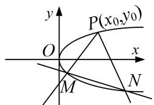

图2

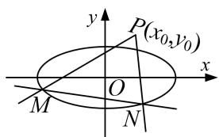

图3

图4
  
（2）双参数法：设动直线 MN 方程(斜率存在)为 $y=kx+t$ ，由核心方程得到 $f(k, t)=0$ ，把 t 用 k 表示或把 k 用 t 表示，即 $kf(x, y)+g(x, y)=0$ （或 $tf(x, y)+g(x, y)=0$ ），根据直线过定点时与参数没有关系(即方程对参数的任意值都成立)，得到方程组 $\left\{\begin{aligned}f(x, y)=0,\\ g(x, y)=0;\end{aligned}\right.$ 以方程组的解为坐标的点就是直线所过的定点.

# 【例题选讲】

[例1] 已知椭圆 $C: \frac{x^2}{a^2} + \frac{y^2}{b^2} = 1 (a > b > 0)$ 的右焦点 $F(\sqrt{3}, 0)$ ，长半轴长与短半轴长的比值为2.  
（1）求椭圆 C 的标准方程;  
（2）设不经过点 $B(0,1)$ 的直线 $l$ 与椭圆 $C$ 相交于不同的两点 $M,N$ ，若点 $B$ 在以线段 $MN$ 为直径的圆上，证明直线 $l$ 过定点，并求出该定点的坐标.

[例 2] 已知椭圆 O: $\frac{x^{2}}{a^{2}} + \frac{y^{2}}{b^{2}} = 1 (a > b > 0)$ 的左、右顶点分别为 A, B，点 P 在椭圆 O 上运动，若 $\triangle PAB$ 面积的最大值为 $2\sqrt{3}$ ，椭圆 O 的离心率为 $\frac{1}{2}$ .  
（1）求椭圆 O 的标准方程;  
（2）过 B 点作圆 $E: x^{2}+(y-2)^{2}=r^{2}(0<r<2)$ 的两条切线，分别与椭圆 O 交于两点 C，D(异于点 B)，当 r 变化时，直线 CD 是否恒过某定点？若是，求出该定点坐标；若不是，请说明理由.

# 【对点训练】

1. 椭圆 $C: \frac{x^2}{a^2} + \frac{y^2}{b^2} = 1 (a > b > 0)$ 的离心率为 $\frac{1}{2}$ ，其左焦点到点 $P(2, 1)$ 的距离为 $\sqrt{10}$ .  
（1）求椭圆 C 的标准方程;  
（2）若直线 $l: y = kx + m$ 与椭圆 $C$ 相交于 $A, B$ 两点 $(A, B$ 不是左、右顶点)，且以 $AB$ 为直径的圆过椭圆 $C$ 的右顶点，求证：直线 $l$ 过定点，并求出该定点的坐标.

2. 如图所示, 已知椭圆 $M: \frac{y^2}{a^2} + \frac{x^2}{b^2} = 1 (a > b > 0)$ 的四个顶点构成边长为 5 的菱形, 原点 $O$ 到直线 $AB$ 的距离为 $\frac{12}{5}$ , 其中 $A(0, a), B(-b, 0)$ . 直线 $l: x = my + n$ 与椭圆 $M$ 相交于 $C, D$ 两点, 且以 $CD$ 为直径的圆过椭圆的右顶点 $P$ (其中点 $C, D$ 与点 $P$ 不重合).  
（1）求椭圆 M 的方程;  
（2）证明：直线 l 与 x 轴交于定点，并求出定点的坐标.

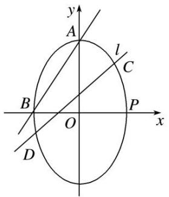

3. 如图，已知直线 $l: y = kx + 1 (k > 0)$ 关于直线 $y = x + 1$ 对称的直线为 $l_1$ ，直线 $l, l_1$ 与椭圆 $E: \frac{x^2}{4} + y^2 = 1$ 分别交于点 $A, M$ 和 $A, N$ ，记直线 $l_1$ 的斜率为 $k_1$ .  
（1）求 $k \cdot k_{1}$ 的值;  
（2）当 k 变化时，试问直线 MN 是否恒过定点？若恒过定点，求出该定点坐标；若不恒过定点，请说明理由.

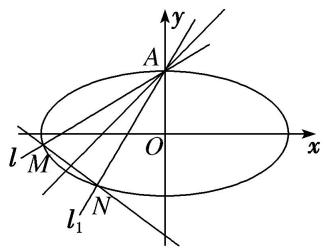

# 题型二 未知核心方程

# 【方法总结】

单参数法：设出动点可动直线的方程为，解出点 M 的坐标为 $(A(k), B(k))$ ，解出点 N 的坐标为 $(C(k), D(k))$ ，然后写出动直线 MN 方程，即 $kf(x, y) + g(x, y) = 0$ ，根据直线过定点时与参数没有关系（即方程对参数的任意值都成立），得到方程组 $\left\{\begin{aligned}f(x, y)=0,\\ g(x, y)=0;\end{aligned}\right.$ 以方程组的解为坐标的点就是直线所过的定点.
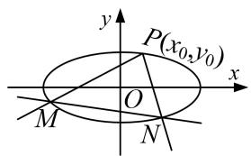

图1

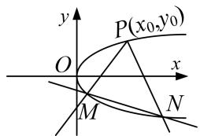

图2

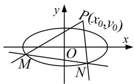

图3

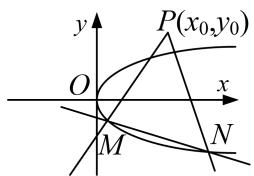

图4

# 【例题选讲】

[例1] (2020·全国I)已知 $A, B$ 分别为椭圆 $E: \frac{x^2}{a^2} + y^2 = 1 (a > 1)$ 的左、右顶点， $G$ 为 $E$ 的上顶点， $\overrightarrow{AG} \cdot \overrightarrow{GB} = 8$ ， $P$ 为直线 $x = 6$ 上的动点， $PA$ 与 $E$ 的另一交点为 $C$ ， $PB$ 与 $E$ 的另一交点为 $D$ .  
（1）求 E 的方程;  
（2）证明：直线 $CD$ 过定点.

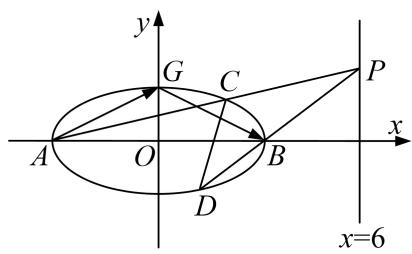

[例 2] 已知椭圆 $C_{1}:\frac{x^{2}}{a^{2}}+\frac{y^{2}}{b^{2}}=1(a>b>0)$ 的右顶点与抛物线 $C_{2}:y^{2}=2px(p>0)$ 的焦点重合，椭圆 $C_{1}$ 的离心率为 $\frac{1}{2}$ ，过椭圆 $C_{1}$ 的右焦点 F 且垂直于 x 轴的直线被抛物线 $C_{2}$ 截得的弦长为 $4\sqrt{2}$ .  
（1）求椭圆 $C_{1}$ 和抛物线 $C_{2}$ 的方程;  
（2）过点 $A(-2,0)$ 的直线 $l$ 与 $C_2$ 交于 $M,N$ 两点，点 $M$ 关于 $x$ 轴的对称点为 $M'$ ，证明：直线 $M'N$ 恒过一定点.

[例 3] 已知抛物线 C: $y^{2}=2px(p>0)$ 过点 M(m, 2)，其焦点为 $F'$ ，且 $|MF'|=2$ .  
（1）求抛物线 C 的方程;  
（2）设 E 为 y 轴上异于原点的任意一点，过点 E 作不经过原点的两条直线分别与抛物线 C 和圆 F: $(x - 1)^{2} + y^{2} = 1$ 相切，切点分别为 A, B，求证：直线 AB 过定点.

[例 4] (2019·全国III)已知曲线 C: $y=\frac{x^{2}}{2}$ ，D 为直线 $y=-\frac{1}{2}$ 上的动点，过 D 作 C 的两条切线，切点分别为 A, B.  
（1）证明：直线 AB 过定点；  
（2）若以 $E\left(0,\frac{5}{2}\right)$ 为圆心的圆与直线 AB 相切，且切点为线段 AB 的中点，求四边形 ADBE 的面积.

# 【对点训练】

1. 已知椭圆 $C: \frac{x^2}{2} + y^2 = 1$ 的右焦点为 $F$ ，过点 $F$ 的直线(不与 $x$ 轴重合)与椭圆 $C$ 相交于 $A$ ， $B$ 两点，直线 $l: x = 2$ 与 $x$ 轴相交于点 $H$ ，过点 $A$ 作 $AD \perp l$ ，垂足为 $D$ .  
（1）求四边形 $OAHB(O$ 为坐标原点)的面积的取值范围.  
（2）证明：直线 BD 过定点 E，并求出点 E 的坐标.

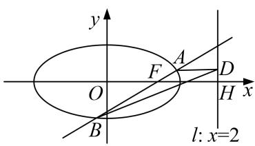

2. 已知动圆 $M$ 恒过点 $(0, 1)$ ，且与直线 $y = -1$ 相切.  
（1）求圆心 M 的轨迹方程;  
（2）动直线 l 过点 $P(0, -2)$ ，且与点 M 的轨迹交于 A，B 两点，点 C 与点 B 关于 y 轴对称，求证：直线 AC 恒过定点.

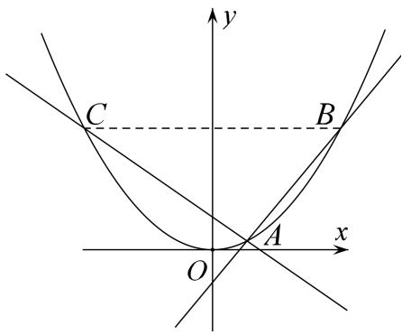

3. 已知 $P$ 是圆 $F_{1}: (x + 1)^{2} + y^{2} = 16$ 上任意一点， $F_{2}(1,0)$ ，线段 $PF_{2}$ 的垂直平分线与半径 $PF_{1}$ 交于点 $Q$ 当点 $P$ 在圆 $F_{1}$ 上运动时，记点 $Q$ 的轨迹为曲线 $C$ .  
（1）求曲线 C 的方程:  
（2）记曲线 C 与 x 轴交于 A, B 两点，M 是直线 x=1 上任意一点，直线 MA, MB 与曲线 C 的另一个交点分别为 D, E，求证：直线 DE 过定点 H(4, 0).

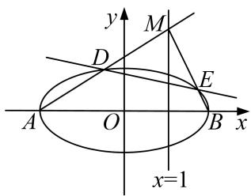

4. 如图，设直线 $l: y = k\left(\frac{x + p}{2}\right)$ 与抛物线 $C: y^2 = 2px (p > 0, p$ 为常数)交于不同的两点 $M, N$ ，且当 $k = \frac{1}{2}$ 时，抛物线 $C$ 的焦点 $F$ 到直线 $l$ 的距离为 $\frac{2\sqrt{5}}{5}$ .  
（1）求抛物线 C 的标准方程;  
（2）过点 M 的直线交抛物线于另一点 Q，且直线 MQ 过点 $B(1, -1)$ ，求证：直线 NQ 过定点.

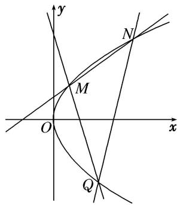

