# 专题 16 已知核心方程(隐性)和未知核心方程直线过定点模型

# 题型一 已知核心方程(隐性)

先将隐性核心方程等价地转化为显性核心方程.

# 【方法总结】

(1)单参数法: 设动直线 PM 方程为 $y=k(x-x_{0})+y_{0}$ ，联立直线与椭圆(抛物线)，解出点 M 的坐标为 $(A(k), B(k))$ ，同理(由核心方程代换)，得出点 N 的坐标为 $(C(k), D(k))$ ，然后写出动直线 MN 方程，即 $kf(x, y)+g(x, y)=0$ ，根据直线过定点时与参数没有关系(即方程对参数的任意值都成立)，得到方程组 $\left\{\begin{aligned}f(x, y)=0,\\ g(x, y)=0;\end{aligned}\right.$ 以方程组的解为坐标的点就是直线所过的定点.

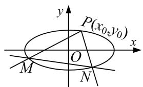

text_image

y
P(x₀,y₀)
x
O
M
N

图1

text_image

y
P(x₀,y₀)
O
x
M
N

图2

text_image

y
P(x₀,y₀)
x
O
M
N

图3

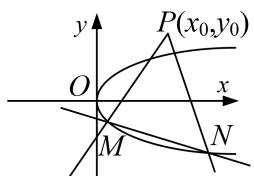

text_image

y
P(x₀,y₀)
O
x
M
N

图4

(2)双参数法：设动直线 MN 方程(斜率存在)为 $y=kx+t$ ，由核心方程得到 $f(k, t)=0$ ，把 t 用 k 表示或把 k 用 t 表示，即 $kf(x, y)+g(x, y)=0$ （或 $tf(x, y)+g(x, y)=0$ ），根据直线过定点时与参数没有关系(即方程对参数的任意值都成立)，得到方程组 $\left\{\begin{aligned}f(x, y)=0,\\ g(x, y)=0;\end{aligned}\right.$ 以方程组的解为坐标的点就是直线所过的定点.

# 【例题选讲】

[例1] 已知椭圆 $C: \frac{x^2}{a^2} + \frac{y^2}{b^2} = 1 (a > b > 0)$ 的右焦点 $F(\sqrt{3}, 0)$ ，长半轴长与短半轴长的比值为2.

(1)求椭圆 C 的标准方程;  
(2)设不经过点 $B(0,1)$ 的直线 $l$ 与椭圆 $C$ 相交于不同的两点 $M,N$ ，若点 $B$ 在以线段 $MN$ 为直径的圆上，证明直线 $l$ 过定点，并求出该定点的坐标.

[规范解答] (1)由题意得， $c=\sqrt{3}$ ， $\frac{a}{b}=2$ ， $a^{2}=b^{2}+c^{2}$ ，∴a=2，b=1，

∴椭圆 C 的标准方程为 $\frac{x^{2}}{4} + y^{2} = 1$ .

(2)双参数法

当直线 l 的斜率存在时，设直线 l 的方程为 $y=kx+m(m\neq1)$ ， $M(x_{1},y_{1})$ ， $N(x_{2},y_{2})$ .

联立 $\left\{\begin{aligned}y&=kx+m,\\ x^{2}&+4y^{2}=4\end{aligned}\right.$ 消去 y，可得 $(4k^{2}+1)x^{2}+8kmx+4m^{2}-4=0.\quad\therefore\Delta=16(4k^{2}+1-m^{2})>0,$

$x_{1}+x_{2}=\frac{-8km}{4k^{2}+1},\quad x_{1}x_{2}=\frac{4m^{2}-4}{4k^{2}+1}.$ ∵点B在以线段MN为直径的圆上，∴ $\overrightarrow{BM}\cdot\overrightarrow{BN}=0.$

则 $\overrightarrow{BM} \cdot \overrightarrow{BN} = (x_1, kx_1 + m - 1) \cdot (x_2, kx_2 + m - 1) = (k^2 + 1)x_1x_2 + k(m - 1)(x_1 + x_2) + (m - 1)^2 = 0,$

$\therefore (k^2 + 1)\frac{4m^2 - 4}{4k^2 + 1} + k(m - 1)\frac{-8km}{4k^2 + 1} + (m - 1)^2 = 0$ ，整理，得 $5m^2 - 2m - 3 = 0$ ，解得 $m = -\frac{3}{5}$ 或 $m = 1$ （舍去）.

∴直线 l 的方程为 $y=kx-\frac{3}{5}$ . 易知当直线 l 的斜率不存在时，不符合题意.

故直线 l 过定点，且该定点的坐标为 $\left(0, -\frac{3}{5}\right)$ .

[例 2] 已知椭圆 O: $\frac{x^{2}}{a^{2}} + \frac{y^{2}}{b^{2}} = 1 (a > b > 0)$ 的左、右顶点分别为 A, B，点 P 在椭圆 O 上运动，若 $\triangle PAB$ 面积的最大值为 $2\sqrt{3}$ ，椭圆 O 的离心率为 $\frac{1}{2}$ .

(1)求椭圆 O 的标准方程;

(2)过 B 点作圆 $E: x^{2}+(y-2)^{2}=r^{2}(0<r<2)$ 的两条切线，分别与椭圆 O 交于两点 C，D(异于点 B)，当 r 变化时，直线 CD 是否恒过某定点？若是，求出该定点坐标；若不是，请说明理由.

[规范解答] (1)由题可知当点 P 在椭圆 O 的上顶点(或下顶点)时， $S_{\triangle PAB}$ 最大，

此时 $S_{\triangle PAB}=\frac{1}{2}\times2ab=ab=2\sqrt{3},\quad\therefore\left\{\begin{aligned}&ab=2\sqrt{3},\\ &\frac{c}{a}=\frac{1}{2},\\ &a^{2}-b^{2}=c^{2}\end{aligned}\right.$ $\Rightarrow a=2,\quad b=\sqrt{3},\quad c=1,$

∴椭圆 O 的标准方程为 $\frac{x^{2}}{4} + \frac{y^{2}}{3} = 1$ .

(2)单参数法

设过点 $B(2,0)$ 与圆 E 相切的直线方程为 $y=k(x-2)$ ，即 kx-y-2k=0，

∵ 直线与圆 E: $x^{2}+(y-2)^{2}=r^{2}$ 相切，∴ $d=\frac{|-2-2k|}{\sqrt{k^{2}+1}}=r$ ，即 $(4-r^{2})k^{2}+8k+4-r^{2}=0$ .

设两切线的斜率分别为 $k_{1}$ ， $k_{2}(k_{1} \neq k_{2})$ ，则 $k_{1}k_{2}=1$ ，

设 $C(x_{1}, y_{1}), D(x_{2}, y_{2})$ ，由 $\left\{\begin{aligned}y &= k_{1}(x-2), \\ \frac{x^{2}}{4} + \frac{y^{2}}{3} &= 1\end{aligned}\right.$ $\Rightarrow(3+4k_{1}^{2})x^{2}-16k_{1}^{2}x+16k_{1}^{2}-12=0,$

$\therefore 2x_{1} = \frac{16k_{1}^{2} - 12}{3 + 4k_{1}^{2}}$ 即 $x_{1} = \frac{8k_{1}^{2} - 6}{3 + 4k_{1}^{2}}$ ， $\therefore y_{1} = \frac{-12k_{1}}{3 + 4k_{1}^{2}};$

同理， $x_{2}=\frac{8k_{2}^{2}-6}{3+4k_{2}^{2}}=\frac{8-6k_{1}^{2}}{4+3k_{1}^{2}},\quad y_{2}=\frac{-12k_{2}}{3+4k_{2}^{2}}=\frac{-12k_{1}}{4+3k_{1}^{2}};$

$$
\therefore k _ {C D} = \frac {y _ {2} - y _ {1}}{x _ {2} - x _ {1}} = \frac {\frac {- 1 2 k _ {1}}{4 + 3 k _ {1} ^ {2}} - \frac {- 1 2 k _ {1}}{3 + 4 k _ {1} ^ {2}}}{\frac {8 - 6 k _ {1} ^ {2}}{4 + 3 k _ {1} ^ {2}} - \frac {8 k _ {1} ^ {2} - 6}{3 + 4 k _ {1} ^ {2}}} = \frac {k _ {1}}{4 (k _ {1} ^ {2} + 1)}.
$$

∴直线 CD 的方程为 $y+\frac{12k_{1}}{3+4k_{1}^{2}}=\frac{k_{1}}{4(k_{1}^{2}+1)}\left(x-\frac{8k_{1}^{2}-6}{3+4k_{1}^{2}}\right)$ ,

整理得 $y=\frac{k_{1}}{4(k_{1}^{2}+1)}x-\frac{7k_{1}}{2(k_{1}^{2}+1)}=\frac{k_{1}}{4(k_{1}^{2}+1)}(x-14)$ . ∴ 直线 CD 恒过定点 $(14, 0)$ .

【对点训练】

1. 椭圆 $C: \frac{x^2}{a^2} + \frac{y^2}{b^2} = 1 (a > b > 0)$ 的离心率为 $\frac{1}{2}$ , 其左焦点到点 $P(2, 1)$ 的距离为 $\sqrt{10}$ .

(1)求椭圆 C 的标准方程;  
(2)若直线 $l: y = kx + m$ 与椭圆 $C$ 相交于 $A, B$ 两点 $(A, B$ 不是左、右顶点)，且以 $AB$ 为直径的圆过椭圆 $C$ 的右顶点，求证：直线 $l$ 过定点，并求出该定点的坐标.

1. 解析 (1)由 $e = \frac{c}{a} = \frac{1}{2}$ , 得 $a = 2c$ , $\because a^2 = b^2 + c^2$ , $\therefore b^2 = 3c^2$ , 则椭圆方程变为 $\frac{x^2}{4c^2} + \frac{y^2}{3c^2} = 1$ .

又由题意知 $\sqrt{(2 + c)^2 + 1^2} = \sqrt{10}$ ，解得 $c = 1$ ，故 $a^2 = 4$ ， $b^2 = 3$ ，即得椭圆的标准方程为 $\frac{x^2}{4} + \frac{y^2}{3} = 1$ .

(2)双参数法

设 $A(x_{1}, y_{1})$ ， $B(x_{2}, y_{2})$ ，联立 $\left\{\begin{aligned}y &= kx + m,\\ \frac{x^{2}}{4} + \frac{y^{2}}{3} &= 1,\end{aligned}\right.$ 得 $(3 + 4k^{2})x^{2} + 8mkx + 4(m^{2} - 3) = 0,$

$$
\text {则} \left\{ \begin{array}{l} \Delta = 6 4 m ^ {2} k ^ {2} - 1 6 (3 + 4 k ^ {2}) (m ^ {2} - 3) > 0, \\ x _ {1} + x _ {2} = - \frac {8 m k}{3 + 4 k ^ {2}}, \\ x _ {1} \cdot x _ {2} = \frac {4 (m ^ {2} - 3)}{3 + 4 k ^ {2}}. \end{array} \right. \tag {①}
$$

$$
\therefore y _ {1} y _ {2} = (k x _ {1} + m) (k x _ {2} + m) = k ^ {2} x _ {1} x _ {2} + m k (x _ {1} + x _ {2}) + m ^ {2} = \frac {3 (m ^ {2} - 4 k ^ {2})}{3 + 4 k ^ {2}}.
$$

∵椭圆的右顶点为 $A_{2}(2,0)$ ， $AA_{2}\perp BA_{2}$ ，∴ $(x_{1}-2)(x_{2}-2)+y_{1}y_{2}=0$ ，∴ $y_{1}y_{2}+x_{1}x_{2}-2(x_{1}+x_{2})+4=0$ ，

$\therefore \frac{3(m^2 - 4k^2)}{3 + 4k^2} + \frac{4(m^2 - 3)}{3 + 4k^2} + \frac{16mk}{3 + 4k^2} + 4 = 0, \therefore 7m^2 + 16mk + 4k^2 = 0,$ 解得 $m_1 = -2k, m_2 = -\frac{2k}{7}$ .

由 $\Delta>0$ ，得 $3+4k^{2}-m^{2}>0$ ，②

当 $m_{1}=-2k$ 时，l 的方程为 $y=k(x-2)$ ，直线过定点 $(2,0)$ ，与已知矛盾.

当 $m_{2}=-\frac{2k}{7}$ 时，l 的方程为 $y=k\left(x-\frac{2}{7}\right)$ ，直线过定点 $\left(\frac{2}{7},0\right)$ ，且满足②，

∴直线 l 过定点，定点坐标为 $\left(\frac{2}{7}, 0\right)$ .

2. 如图所示，已知椭圆 $M: \frac{y^2}{a^2} + \frac{x^2}{b^2} = 1 (a > b > 0)$ 的四个顶点构成边长为 5 的菱形，原点 $O$ 到直线 $AB$ 的距离为 $\frac{12}{5}$ ，其中 $A(0, a), B(-b, 0)$ . 直线 $l: x = my + n$ 与椭圆 $M$ 相交于 $C, D$ 两点，且以 $CD$ 为直径的圆过椭圆的右顶点 $P$ (其中点 $C, D$ 与点 $P$ 不重合).

(1)求椭圆 M 的方程;  
(2)证明：直线 l 与 x 轴交于定点，并求出定点的坐标.

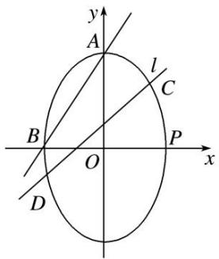

text_image

y
A
l
C
B
O
P
x
D

2. 解析 (1)由已知，得 $a^2 + b^2 = 5^2$ ，由点 $A(0, a)$ ， $B(-b, 0)$ 知，

直线 AB 的方程为 $\frac{x}{-b} + \frac{y}{a} = 1$ ，即 ax - by + ab = 0。

又原点 O 到直线 AB 的距离为 $\frac{12}{5}$ ，即 $\frac{|0-0+ab|}{\sqrt{a^{2}+b^{2}}}=\frac{12}{5}$ ，所以 $a^{2}=16,\ b^{2}=9,\ c^{2}=16-9=7$ .

故椭圆 M 的方程为 $\frac{y^{2}}{16} + \frac{x^{2}}{9} = 1$ .

(2)双参数法

由(1)知 $P(3,0)$ ，设 $C(x_{1},y_{1})$ ， $D(x_{2},y_{2})$ ，将 $x=my+n$ 代入 $\frac{y^{2}}{16}+\frac{x^{2}}{9}=1$ ，

整理，得 $(16m^{2}+9)y^{2}+32mny+16n^{2}-144=0$ ，则 $y_{1}+y_{2}=-\frac{32mn}{16m^{2}+9}$ ， $y_{1}y_{2}=\frac{16n^{2}-144}{16m^{2}+9}$ .

因为以 CD 为直径的圆过椭圆的右顶点 P，所以 $\overrightarrow{PC} \cdot \overrightarrow{PD} = 0$ ，即 $(x_{1} - 3, y_{1}) \cdot (x_{2} - 3, y_{2}) = 0$ ，

所以 $(x_{1}-3)(x_{2}-3)+y_{1}y_{2}=0$ ，又 $x_{1}=my_{1}+n,\quad x_{2}=my_{2}+n,$

所以 $(my_{1} + n - 3)(my_{2} + n - 3) + y_{1}y_{2} = 0$ ，整理，得 $(m^2 +1)y_1y_2 + m(n - 3)(y_1 + y_2) + (n - 3)^2 = 0,$

即 $(m^{2}+1)\cdot\frac{16n^{2}-144}{16m^{2}+9}+m(n-3)\cdot\frac{-32mn}{16m^{2}+9}+(n-3)^{2}=0,$

所以 $\frac{16(m^2 + 1)(n^2 - 9)}{16m^2 + 9} - \frac{32m^2n(n - 3)}{16m^2 + 9} +(n - 3)^2 = 0,$

易知 $n \neq 3$ ，所以 $16(m^{2} + 1)(n + 3) - 32m^{2}n + (16m^{2} + 9) \cdot (n - 3) = 0$ ,

整理，得 $25n+21=0$ ，即 $n=-\frac{21}{25}$ ，经检验， $n=-\frac{21}{25}$ 符合题意.

所以直线 l 与 x 轴交于定点，定点的坐标为 $\left(-\frac{21}{25}, 0\right)$ .

3. 如图，已知直线 $l: y = kx + 1 (k > 0)$ 关于直线 $y = x + 1$ 对称的直线为 $l_1$ ，直线 $l, l_1$ 与椭圆 $E: \frac{x^2}{4} + y^2 = 1$ 分别交于点 $A, M$ 和 $A, N$ ，记直线 $l_1$ 的斜率为 $k_1$ .

(1)求 $k\cdot k_{1}$ 的值;

(2)当 k 变化时，试问直线 MN 是否恒过定点？若恒过定点，求出该定点坐标；若不恒过定点，请说明理由.

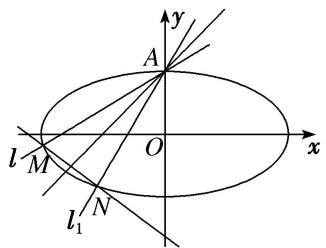

text_image

l_M
l_1 N
O
x
y
A

3. 解析 (1)设直线 l 上任意一点 $P(x, y)$ 关于直线 $y = x + 1$ 对称的点为 $P_{0}(x_{0}, y_{0})$ ,

直线 l 与直线 $l_{1}$ 的交点为 $(0, 1)$ ，∴ $l: y = kx + 1$ ， $l_{1}: y = k_{1}x + 1$ ， $k = \frac{y - 1}{x}$ ， $k_{1} = \frac{y_{0} - 1}{x_{0}}$

由 $\frac{y+y_{0}}{2}=\frac{x+x_{0}}{2}+1$ ，得 $y+y_{0}=x+x_{0}+2$ ，①．由 $\frac{y-y_{0}}{x-x_{0}}=-1$ ，得 $y-y_{0}=x_{0}-x$ ，②

由①②得 $\left\{\begin{aligned}y&=x_{0}+1,\\ y_{0}&=x+1,\end{aligned}\right.$ $\therefore k\cdot k_{1}=\frac{yy_{0}-(y+y_{0})+1}{xx_{0}}=\frac{(x+1)(x_{0}+1)-(x+x_{0}+2)+1}{xx_{0}}=1.$

(2)单参数法

由 $\left\{\begin{aligned}y&=kx+1,\\ \frac{x^{2}}{4}&+y^{2}=1\end{aligned}\right.$ 得 $(4k^{2}+1)x^{2}+8kx=0$ ，设 $M(x_{M},y_{M})$ ， $N(x_{N},y_{N})$ ， $\therefore x_{M}=\frac{-8k}{4k^{2}+1}$ ， $y_{M}=\frac{1-4k^{2}}{4k^{2}+1}$ .

同理可得 $x_{N}=\frac{-8k_{1}}{4k_{1}^{2}+1}=\frac{-8k}{4+k^{2}}$ ， $y_{N}=\frac{1-4k_{1}^{2}}{4k_{1}^{2}+1}=\frac{k^{2}-4}{4+k^{2}}$ .

$$
k _ {M N} = \frac {y _ {M} - y _ {N}}{x _ {M} - x _ {N}} = \frac {\frac {1 - 4 k ^ {2}}{4 k ^ {2} + 1} - \frac {k ^ {2} - 4}{4 + k ^ {2}}}{\frac {- 8 k}{4 k ^ {2} + 1} - \frac {- 8 k}{4 + k ^ {2}}} = \frac {8 - 8 k ^ {4}}{8 k (3 k ^ {2} - 3)} = - \frac {k ^ {2} + 1}{3 k},
$$

直线 MN: $y - y_{M} = k_{MN}(x - x_{M})$ ，即 $y - \frac{1 - 4k^{2}}{4k^{2} + 1} = -\frac{k^{2} + 1}{3k} \left( x - \frac{-8k}{4k^{2} + 1} \right)$ ,

即 $y=-\frac{k^{2}+1}{3k}x-\frac{8(k^{2}+1)}{3(4k^{2}+1)}+\frac{1-4k^{2}}{4k^{2}+1}=-\frac{k^{2}+1}{3k}x-\frac{5}{3}.$ ∴ 当 k 变化时，直线 MN 过定点 $\left(0,-\frac{5}{3}\right)$ .

# 题型二 未知核心方程

# 【方法总结】

单参数法：设出动点可动直线的方程为，解出点 M 的坐标为 $(A(k), B(k))$ ，解出点 N 的坐标为 $(C(k), D(k))$ ，然后写出动直线 MN 方程，即 $kf(x, y) + g(x, y) = 0$ ，根据直线过定点时与参数没有关系（即方程对参数的任意值都成立），得到方程组 $\left\{\begin{aligned}f(x, y)=0,\\ g(x, y)=0;\end{aligned}\right.$ 以方程组的解为坐标的点就是直线所过的定点.

text_image

y
P(x₀,y₀)
x
O
M
N

图1

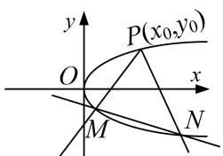

text_image

y
P(x₀,y₀)
O
x
M
N

图2

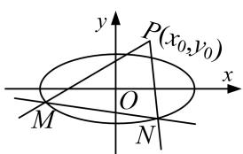

text_image

y
P(x₀,y₀)
x
O
M
N

图3

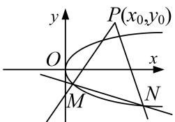

text_image

y
P(x₀,y₀)
O
x
M
N

图4

# 【例题选讲】

[例 1] (2020·全国 I) 已知 A, B 分别为椭圆 $E: \frac{x^{2}}{a^{2}} + y^{2} = 1 (a > 1)$ 的左、右顶点，G 为 E 的上顶点， $\overrightarrow{AG} \cdot \overrightarrow{GB} = 8$ ，P 为直线 x = 6 上的动点，PA 与 E 的另一交点为 C，PB 与 E 的另一交点为 D.

(1)求 E 的方程;  
(2)证明：直线 CD 过定点.

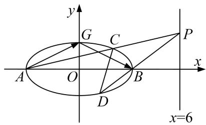

text_image

y
G
C
P
A
O
B
x
D
x=6

[规范解答] (1)由椭圆方程 $E: \frac{x^{2}}{a^{2}} + y^{2} = 1 (a > 1)$ 可得 $A(-a, 0)$ ， $B(a, 0)$ ， $G(0, 1)$ ，

$\therefore \overrightarrow{AG} = (a, 1), \overrightarrow{GB} = (a, -1). \therefore \overrightarrow{AG} \cdot \overrightarrow{GB} = a^2 - 1 = 8, \therefore a^2 = 9. \therefore$ 椭圆 $E$ 的方程为 $\frac{x^2}{9} + y^2 = 1$ .

(2)单参数法

由(1)得 $A(-3, 0)$ ， $B(3, 0)$ ，设 $P(6, y_{0})$ ，

则直线 AP 的方程为 $y=\frac{y_{0}-0}{6-(-3)}(x+3)$ ，即 $y=\frac{y_{0}}{9}(x+3)$ ,

直线 BP 的方程为 $y=\frac{y_{0}-0}{6-3}(x-3)$ ，即 $y=\frac{y_{0}}{3}(x-3)$ .

联立直线 $AP$ 的方程与椭圆 $E$ 的方程可得 $\left\{ \begin{array}{l} \frac{x^2}{9} + y^2 = 1, \\ y = \frac{y_0}{9} (x + 3), \end{array} \right.$ 整理得 $(y_0^2 + 9)x^2 + 6y_0^2x + 9y_0^2 - 81 = 0,$

解得 x=-3 或 $x=\frac{-3y_{0}^{2}+27}{y_{0}^{2}+9}$ . 将 $x=\frac{-3y_{0}^{2}+27}{y_{0}^{2}+9}$ 代入 $y=\frac{y_{0}}{9}(x+3)$ ，可得 $y=\frac{6y_{0}}{y_{0}^{2}+9}$ ,

∴点 C 的坐标为 $\left(\frac{-3y_{0}^{2}+27}{y_{0}^{2}+9},\frac{6y_{0}}{y_{0}^{2}+9}\right)$ . 同理可得，点 D 的坐标为 $\left(\frac{3y_{0}^{2}-3}{y_{0}^{2}+1},\frac{-2y_{0}}{y_{0}^{2}+1}\right)$ .

∴ 直线 CD 的方程为 $y - \left(\frac{-2y_{0}}{y_{0}^{2} + 1}\right) = \frac{\frac{6y_{0}}{y_{0}^{2} + 9} - \left(\frac{-2y_{0}}{y_{0}^{2} + 1}\right)}{\frac{-3y_{0}^{2} + 27}{y_{0}^{2} + 9} - \frac{3y_{0}^{2} - 3}{y_{0}^{2} + 1}} \left(x - \frac{3y_{0}^{2} - 3}{y_{0}^{2} + 1}\right)$ ,

整理可得 $y+\frac{2y_{0}}{y_{0}^{2}+1}=\frac{4y_{0}}{3(3-y_{0}^{2})}\left(x-\frac{3y_{0}^{2}-3}{y_{0}^{2}+1}\right)$ ,

$y=\frac{4y_{0}}{3(3-y_{0}^{2})}\left(x-\frac{3y_{0}^{2}-3}{y_{0}^{2}+1}\right)-\frac{2y_{0}}{y_{0}^{2}+1}=\frac{4y_{0}}{3(3-y_{0}^{2})}\left(x-\frac{3}{2}\right).$ 故直线 CD 过定点 $\left(\frac{3}{2}, 0\right)$ .

[例 2] 已知椭圆 $C_{1}:\frac{x^{2}}{a^{2}}+\frac{y^{2}}{b^{2}}=1(a>b>0)$ 的右顶点与抛物线 $C_{2}:y^{2}=2px(p>0)$ 的焦点重合，椭圆 $C_{1}$

的离心率为 $\frac{1}{2}$ ，过椭圆 $C_{1}$ 的右焦点F且垂直于x轴的直线被抛物线 $C_{2}$ 截得的弦长为 $4\sqrt{2}$ .

(1)求椭圆 $C_{1}$ 和抛物线 $C_{2}$ 的方程;

(2)过点 $A(-2,0)$ 的直线 $l$ 与 $C_2$ 交于 $M,N$ 两点，点 $M$ 关于 $x$ 轴的对称点为 $M'$ ，证明：直线 $M'N$ 恒过一定点.

[规范解答] (1)设椭圆 $C_{1}$ 的半焦距为 c，依题意，可得 $a=\frac{p}{2}$ ，则 $C_{2}: y^{2}=4ax$ ，

将 $x = c$ 代入，得 $y^{2} = 4ac$ ，即 $y = \pm 2\sqrt{ac}$ ，则有 $\left\{ \begin{array}{l}4\sqrt{ac} = 4\sqrt{2},\\ \frac{c}{a} = \frac{1}{2},\\ a^2 = b^2 +c^2, \end{array} \right.$ 解得 $a = 2$ ， $b = \sqrt{3}$ ， $c = 1$

所以椭圆 $C_{1}$ 的方程为 $\frac{x^{2}}{4} + \frac{y^{2}}{3} = 1$ ，抛物线 $C_{2}$ 的方程为 $y^{2} = 8x$ .

(2)单参数法

依题意，可知直线 l 的斜率不为 0，可设 l 为 x=my-2.

联立 $\left\{\begin{aligned}x&=my-2,\\ y^{2}&=8x\end{aligned}\right.$ 消去x，整理得 $y^{2}-8my+16=0$ .

设点 $M(x_{1}, y_{1})$ ， $N(x_{2}, y_{2})$ ，则点 $M'(x_{1}, -y_{1})$ ，由 $\Delta=(-8m)^{2}-4\times16>0$ ，解得 m<-1 或 m>1。

且有 $y_{1}+y_{2}=8m,\quad y_{1}y_{2}=16,\quad m=\frac{y_{1}+y_{2}}{8},$

所以直线 $M'N$ 的斜率 $k_{M'N}=\frac{y_{2}+y_{1}}{x_{2}-x_{1}}=\frac{8m}{m(y_{2}-y_{1})}=\frac{8}{y_{2}-y_{1}}$ .

可得直线 $M^{\prime}N$ 的方程为 $y - y_{2} = \frac{8}{y_{2} - y_{1}} (x - x_{2})$

即 $y = \frac{8}{y_2 - y_1} x + y_2 - \frac{8(my_2 - 2)}{y_2 - y_1} = \frac{8}{y_2 - y_1} x + \frac{y_2(y_2 - y_1) - y_2(y_1 + y_2) + 16}{y_2 - y_1} = \frac{8}{y_2 - y_1} x - \frac{16}{y_2 - y_1} = \frac{8}{y_2 - y_1} \cdot (x - 2)$ .

所以当 m<-1 或 m>1 时，直线 M'N 恒过定点 $(2,0)$ .

[例 3] 已知抛物线 C: $y^{2}=2px(p>0)$ 过点 M(m, 2)，其焦点为 $F'$ ，且 $|MF'|=2$ .

(1)求抛物线 C 的方程;

(2)设 E 为 y 轴上异于原点的任意一点，过点 E 作不经过原点的两条直线分别与抛物线 C 和圆 F: $(x - 1)^{2} + y^{2} = 1$ 相切，切点分别为 A, B，求证：直线 AB 过定点.

[规范解答] (1)抛物线 C 的准线方程为 $x = -\frac{p}{2}$ ，所以 $\left|MF'\right| = m + \frac{p}{2} = 2$ ，又 4 = 2pm，即 $4 = 2p\left(\frac{2 - p}{2}\right)$ ，所以 $p^{2} - 4p + 4 = 0$ ，所以 p = 2，所以抛物线 C 的方程为 $y^{2} = 4x$ .

(2)单参数法

设点 $E(0, t)(t \neq 0)$ ，由已知切线不为 y 轴，设直线 EA: $y = kx + t$ ，联立，消去 y，
可得 $k^{2}x^{2}+(2kt-4)x+t^{2}=0$ ，①

因为直线 EA 与抛物线 C 相切，所以 $\Delta=(2kt-4)^{2}-4k^{2}t^{2}=0$ ，即 kt=1，代入①

可得 $\frac{1}{t^{2}}x^{2}-2x+t^{2}=0$ ，所以 $x=t^{2}$ ，即 $A(t^{2},2t)$ .

设切点 $B(x_{0}, y_{0})$ ，则由几何性质可以判断点 O、B 关于直线 EF: $y = -tx + t$ 对称，则

$\left\{ \begin{array}{l} y_0 \times \frac{t - 0}{x_0 - 1} = -1 \\ \frac{y_0}{2} = -t \cdot \frac{x_0}{2} + t \end{array} \right.$ ，解得 $\left\{ \begin{array}{l} x_0 = \frac{2t^2}{t^2 + 1} \\ y_0 = \frac{2t}{t^2 + 1}, \text{即 } B\left(\frac{2t^2}{t^2 + 1}, \frac{2t}{t^2 + 1}\right). \end{array} \right.$

直线 AF 的斜率为 $k_{AF}=\frac{2t}{t^{2}-1}(t\neq\pm1)$ ，直线 BF 的斜率为 $k_{BF}=\frac{\frac{2t}{t^{2}+1}-0}{\frac{2t^{2}}{t^{2}+1}-1}=\frac{2t}{t^{2}-1}(t\neq\pm1)$ ,

所以 $k_{AF}=k_{BF}$ ，即 A, B, F 三点共线．当 $t=\pm1$ 时， $A(1,\pm2)$ ， $B(1,\pm1)$ ，此时 A, B, F 三点共线．所以直线 AB 过定点 $F(1,0)$ .

[例 4] (2019·全国III)已知曲线 C: $y=\frac{x^{2}}{2}$ ，D 为直线 $y=-\frac{1}{2}$ 上的动点，过 D 作 C 的两条切线，切点分别为 A, B.

(1)证明：直线 $AB$ 过定点；  
(2)若以 $E\left(0, \frac{5}{2}\right)$ 为圆心的圆与直线 $AB$ 相切，且切点为线段 $AB$ 的中点，求四边形 $ADBE$ 的面积.

[规范解答] (1)另类

设 $D\left(t, -\frac{1}{2}\right)$ ， $A(x_{1}, y_{1})$ ，则 $x_{1}^{2}=2y_{1}$ ，

由于 $y' = x$ ，所以切线 DA 的斜率为 $x_{1}$ ，故 $\frac{y_{1} + \frac{1}{2}}{x_{1} - t} = x_{1}$ ，整理得 $2tx_{1} - 2y_{1} + 1 = 0$ .

设 $B(x_{2}, y_{2})$ ，同理可得 $2tx_{2}-2y_{2}+1=0$ ，故直线 AB 的方程为 $2tx-2y+1=0$ .

所以直线 AB 过定点 $\left(0, \frac{1}{2}\right)$ .

(2)由(1)得直线 $AB$ 的方程为 $y = tx + \frac{1}{2}$ . 由 $\left\{ \begin{array}{l} y = tx + \frac{1}{2}, \\ y = \frac{x^2}{2} \end{array} \right.$ 可得 $x^{2} - 2tx - 1 = 0$ ,

于是 $x_{1}+x_{2}=2t,\quad x_{1}x_{2}=-1,\quad y_{1}+y_{2}=t(x_{1}+x_{2})+1=2t^{2}+1,$

$$
\vert A B \vert = \sqrt {1 + t ^ {2}} \left| x _ {1} - x _ {2} \right| = \sqrt {1 + t ^ {2}} \times \sqrt {\left(x _ {1} + x _ {2}\right) ^ {2} - 4 x _ {1} x _ {2}} = 2 (t ^ {2} + 1).
$$

设 $d_{1}$ ， $d_{2}$ 分别为点 D，E 到直线 AB 的距离，则 $d_{1}=\sqrt{t^{2}+1}$ ， $d_{2}=\frac{2}{\sqrt{t^{2}+1}}$

因此，四边形 ADBE 的面积 $S=\frac{1}{2}|AB|(d_{1}+d_{2})=(t^{2}+3)\sqrt{t^{2}+1}$ ,

设 M 为线段 AB 的中点，则 $M\left\{t, t^{2}+\frac{1}{2}\right\}$ ,

由于 $\overrightarrow{EM}\perp\overrightarrow{AB}$ ，而 $\overrightarrow{EM}=(t,\ t^{2}-2)$ ， $\overrightarrow{AB}$ 与向量(1，t)平行，所以 $t+(t^{2}-2)t=0$ 。解得t=0或 $t=\pm1$ 。

当 t=0 时，S=3；当 $t=\pm1$ 时， $S=4\sqrt{2}$ .

因此，四边形 ADBE 的面积为 3 或 $4\sqrt{2}$ .

# 【对点训练】

1. 已知椭圆 $C: \frac{x^2}{2} + y^2 = 1$ 的右焦点为 $F$ ，过点 $F$ 的直线(不与 $x$ 轴重合)与椭圆 $C$ 相交于 $A$ ， $B$ 两点，直线 $l: x = 2$ 与 $x$ 轴相交于点 $H$ ，过点 $A$ 作 $AD \perp l$ ，垂足为 $D$ .

(1)求四边形 $OAHB(O$ 为坐标原点 $)$ 的面积的取值范围.  
(2)证明：直线 BD 过定点 E，并求出点 E 的坐标.

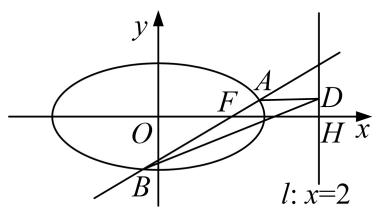

text_image

y
F
A
D
O
H x
B
l: x=2

1. 解析 (1)由题设知 $F(1, 0)$ ，设直线 $AB$ 的方程为 $x = my + 1 (m \in \mathbf{R})$ ， $A(x_1, y_1)$ ， $B(x_2, y_2)$ .

由 $\left\{\begin{aligned}x&=my+1,\\ \frac{x^{2}}{2}&+y^{2}=1,\end{aligned}\right.$ 消去 x 并整理，得 $(m^{2}+2)y^{2}+2my-1=0.\quad\Delta=4m^{2}+4(m^{2}+2)>0,$

则 $y_{1}+y_{2}=-\frac{2m}{m^{2}+2},\quad y_{1}y_{2}=-\frac{1}{m^{2}+2},$

所以 $|y_{1} - y_{2}| = \sqrt{(y_{1} + y_{2})^{2} - 4y_{1}y_{2}} = \frac{2\sqrt{2}\times\sqrt{m^{2} + 1}}{m^{2} + 2}.$

所以四边形 $OAHB$ 的面积 $S = \frac{1}{2} \times |OH| \times |y_1 - y_2| = \frac{1}{2} \times 2 \times \frac{2\sqrt{2} \times \sqrt{m^2 + 1}}{m^2 + 2} = \frac{2\sqrt{2} \times \sqrt{m^2 + 1}}{m^2 + 2}$ .

令 $\sqrt{m^2 + 1} = t$ ，则 $t\geq 1$ ，所以 $S = \frac{2\sqrt{2}t}{t^2 + 1} = \frac{2\sqrt{2}}{t + \frac{1}{t}}, t\geq 1.$

因为 $t+\frac{1}{t}\geq2$ (当且仅当 t=1，即 m=0 时取等号)，所以 $0<S\leq\sqrt{2}$ .

故四边形 OAHB 的面积的取值范围为 $(0, \sqrt{2}]$ .

(2)单参数法

由 $B(x_{2}, y_{2})$ ， $D(2, y_{1})$ ，可知直线 BD 的斜率 $k=\frac{y_{1}-y_{2}}{2-x_{2}}$ .

所以直线 BD 的方程为 $y-y_{1}=\frac{y_{1}-y_{2}}{2-x_{2}}(x-2)$ . 令 y=0，得 $x=\frac{x_{2}y_{1}-2y_{2}}{y_{1}-y_{2}}=\frac{my_{1}y_{2}+y_{1}-2y_{2}}{y_{1}-y_{2}}$ . ①

由(1)知， $y_{1}+y_{2}=-\frac{2m}{m^{2}+2}$ ， $y_{1}y_{2}=-\frac{1}{m^{2}+2}$ ，所以 $y_{1}+y_{2}=2my_{1}y_{2}$ . ②

将②代入①，化简得 $x=\frac{\frac{1}{2}(y_{1}+y_{2})+y_{1}-2y_{2}}{y_{1}-y_{2}}=\frac{\frac{3}{2}(y_{1}-y_{2})}{y_{1}-y_{2}}=\frac{3}{2}$ ,

所以直线 BD 过定点 $E\left(\frac{3}{2}, 0\right)$ .

2. 已知动圆 $M$ 恒过点 $(0, 1)$ ，且与直线 $y = -1$ 相切.

(1)求圆心 M 的轨迹方程;  
(2)动直线 l 过点 $P(0, -2)$ ，且与点 M 的轨迹交于 A，B 两点，点 C 与点 B 关于 y 轴对称，求证：直线 AC 恒过定点.

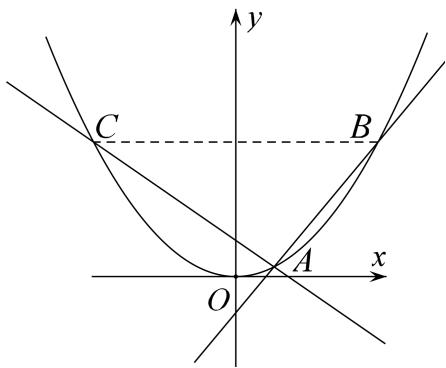

text_image

y
C
B
x
O
A

2. 解析 (1)由题意得, 点 $M$ 与点 $(0, 1)$ 的距离始终等于点 $M$ 到直线 $y = -1$ 的距离,

由抛物线的定义知圆心 M 的轨迹是以点 $(0, 1)$ 为焦点，直线 y = -1 为准线的抛物线，则 $\frac{p}{2} = 1, p = 2$ .
∴ 圆心 M 的轨迹方程为 $x^{2}=4y$ .

(2)单参数法

设直线 l: y=kx-2, $A(x_{1}, y_{1})$ , $B(x_{2}, y_{2})$ ，则 $C(-x_{2}, y_{2})$ ,

联立方程 $\left\{\begin{aligned}x^{2}&=4y,\\ y&=kx-2\end{aligned}\right.$ 消去y，得 $x^{2}-4kx+8=0,\therefore x_{1}+x_{2}=4k,x_{1}x_{2}=8.$

$k_{AC}=\frac{y_{1}-y_{2}}{x_{1}+x_{2}}=\frac{\frac{x_{1}^{2}}{4}-\frac{x_{2}^{2}}{4}}{x_{1}+x_{2}}=\frac{x_{1}-x_{2}}{4}$ ，直线 AC 的方程为 $y-y_{1}=\frac{x_{1}-x_{2}}{4}(x-x_{1})$ .

即 $y=y_{1}+\frac{x_{1}-x_{2}}{4}(x-x_{1})=\frac{x_{1}-x_{2}}{4}x-\frac{x_{1}-x_{2}}{4}x_{1}+\frac{x_{1}^{2}}{4}=\frac{x_{1}-x_{2}}{4}x+\frac{x_{1}x_{2}}{4},$

$\because x_{1}x_{2} = 8, \therefore y = \frac{x_{1} - x_{2}}{4} x + \frac{x_{1}x_{2}}{4} = \frac{x_{1} - x_{2}}{4} x + 2$ ，即直线 $AC$ 恒过定点(0, 2).

3. 已知 $P$ 是圆 $F_{1}: (x + 1)^{2} + y^{2} = 16$ 上任意一点， $F_{2}(1,0)$ ，线段 $PF_{2}$ 的垂直平分线与半径 $PF_{1}$ 交于点 $Q$ ，当点 $P$ 在圆 $F_{1}$ 上运动时，记点 $Q$ 的轨迹为曲线 $C$ .

(1)求曲线 C 的方程;  
(2)记曲线 C 与 x 轴交于 A, B 两点，M 是直线 x=1 上任意一点，直线 MA, MB 与曲线 C 的另一个交点分别为 D, E，求证：直线 DE 过定点 H(4, 0).

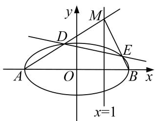

text_image

y
M
D
E
A O B x
x=1

3. 解析 (1)由线段 $PF_{2}$ 的垂直平分线与半径 $PF_{1}$ 交于点 Q,

得 $|QF_{1}|+|QF_{2}|=|QF_{1}|+|QP|=|PF_{1}|=4>|F_{1}F_{2}|=2,$

所以点 O 的轨迹为以 $F_{1}$ ， $F_{2}$ 为焦点，长轴长为 4 的椭圆，故 $2a = 4$ ， $a = 2$ ， $2c = 2$ ， $c = 1$ ， $b^{2} = a^{2} - c^{2} = 3$ 。曲线 $C$ 的方程为 $\frac{x^2}{4} +\frac{y^2}{3} = 1$

(2)单参数法

由(1)可设 $A(-2,0)$ ， $B(2,0)$ ，点 M 的坐标为 $(1,m)$ ，直线 MA 的方程为 $y=\frac{m}{3}(x+2)$ ，

将 $y=\frac{m}{3}(x+2)$ 与 $\frac{x^{2}}{4}+\frac{y^{2}}{3}=1$ 联立整理得， $(4m^{2}+27)x^{2}+16m^{2}x+16m^{2}-108=0$

设点 D 的坐标为 $(x_{D}, y_{D})$ ，则 $-2x_{D}=\frac{16m^{2}-108}{4m^{2}+27}$ ，故 $x_{D}=\frac{54-8m^{2}}{4m^{2}+27}$ ，则 $y_{D}=\frac{m}{3}(x_{D}+2)=\frac{36m}{4m^{2}+27}$ ，

直线 MB 的方程为 $y = -m(x - 2)$ ,

将 $y = -m(x - 2)$ 与 $\frac{x^2}{4} +\frac{y^2}{3} = 1$ 联立整理得， $(4m^{2} + 3)x^{2} - 16m^{2}x + 16m^{2} - 12 = 0,$

设点 E 的坐标为 $(x_{E}, y_{E})$ ，则 $2x_{E}=\frac{16m^{2}-12}{4m^{2}+3}$ ，故 $x_{E}=\frac{8m^{2}-6}{4m^{2}+3}$ ，则 $y_{E}=-m(x_{E}-2)=\frac{12m}{4m^{2}+3}$ ，

HD 的斜率为 $k_{1}=\frac{y_{D}}{x_{D}-4}=\frac{36m}{54-8m^{2}-4(4m^{2}+27)}=-\frac{6m}{4m^{2}+9}$ ,

HE 的斜率为 $k_{2}=\frac{y_{E}}{x_{E}-4}=\frac{12m}{8m^{2}-6-4(4m^{2}+3)}=-\frac{6m}{4m^{2}+9}$ ,

因为 $k_{1}=k_{2}$ ，所以直线 DE 经过定点 $H(4,0)$ .

4. 如图，设直线 $l: y = k\left(\frac{x + p}{2}\right)$ 与抛物线 $C: y^2 = 2px (p > 0, p$ 为常数)交于不同的两点 $M, N$ ，且当 $k = \frac{1}{2}$ 时，抛物线 $C$ 的焦点 $F$ 到直线 $l$ 的距离为 $\frac{2\sqrt{5}}{5}$ .

(1)求抛物线 C 的标准方程;

(2)过点 M 的直线交抛物线于另一点 Q，且直线 MQ 过点 $B(1, -1)$ ，求证：直线 NQ 过定点.

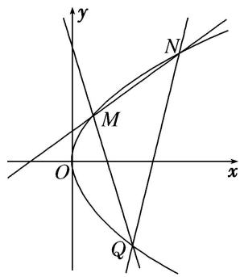

text_image

y
N
M
O
x
Q

4. 解析 (1) 当 $k=\frac{1}{2}$ 时，直线 $l: y=\frac{1}{2}\left(\frac{x+p}{2}\right)$ ，即 $2x-4y+p=0$ ，

抛物线 C 的焦点 $F\left(\frac{p}{2},0\right)$ 到直线 l 的距离 $d=\frac{|2p|}{\sqrt{2^{2}+(-4)^{2}}}=\frac{\sqrt{5}|p|}{5}=\frac{2\sqrt{5}}{5}$ ,

解得 $p=\pm2$ ，又 p>0，所以 p=2，所以抛物线 C 的标准方程为 $y^{2}=4x$ .

(2) 另类

设点 $M(4t^{2}, 4t)$ ， $N(4t_{1}^{2}, 4t_{1})$ ， $Q(4t_{2}^{2}, 4t_{2})$ ，易知直线 MN，MQ，NQ 的斜率均存在，

则直线 MN 的斜率是 $k_{MN}=\frac{4t-4t_{1}}{4t^{2}-4t_{1}^{2}}=\frac{1}{t+t_{1}}$ ,

从而直线 MN 的方程是 $y=\frac{1}{t+t_{1}}(x-4t^{2})+4t$ ，即 $x-(t+t_{1})y+4tt_{1}=0$ .

同理可知 MQ 的方程是 $x-(t+t_{2})y+4tt_{2}=0$ ，NQ 的方程是 $x-(t_{1}+t_{2})y+4t_{1}t_{2}=0$ .

又易知点 $(-1,0)$ 在直线MN上，从而有 $4tt_{1}=1$ ，即 $t=\frac{1}{4t_{1}}$

点 $B(1, -1)$ 在直线 $MQ$ 上，从而有 $1 - (t + t_2)(-1) + 4tt_2 = 0$ ，即 $1 - \left(\frac{1}{4t_1} +t_2\right)(-1) + 4\times \frac{1}{4t_1}\times t_2 = 0,$

化简得 $4t_{1}t_{2}=-4(t_{1}+t_{2})-1$ 。代入 NQ 的方程得 $x-(t_{1}+t_{2})y-4(t_{1}+t_{2})-1=0$

即 $(x-1)-(t_{1}+t_{2})(y+4)=0$ 。所以直线NQ过定点 $(1,-4)$ .

