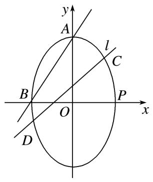
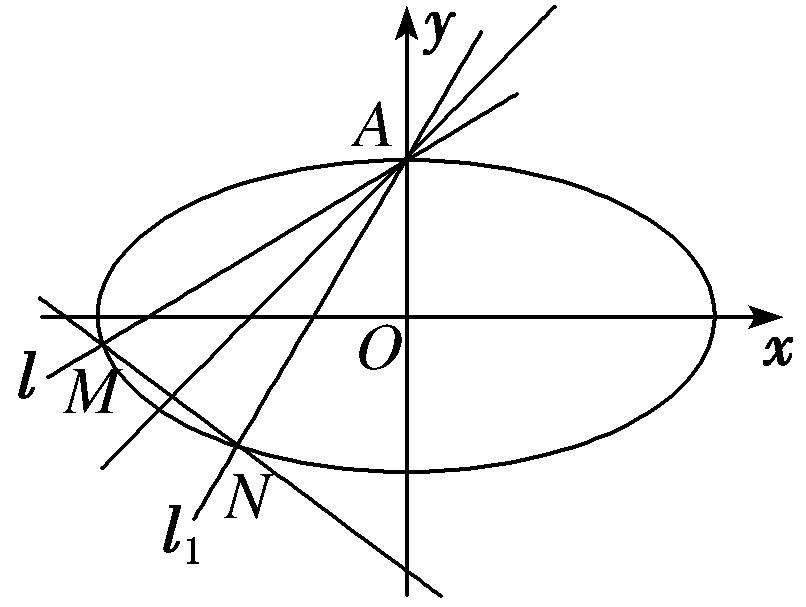
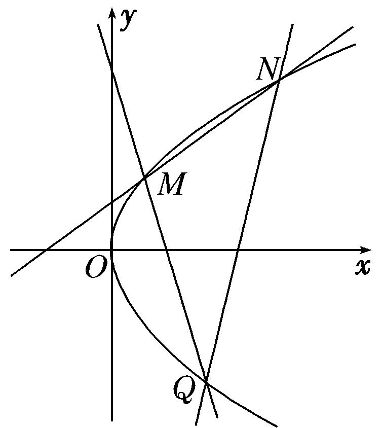

专题16　已知核心方程(隐性)和未知核心方程直线过定点模型

题型一　已知核心方程( 隐性)

先将隐性核心方程等价地转化为显性核心方程．

【方法总结】  
（1）单参数法：设动直线<em>PM</em>方程为<em>y</em>＝<em>k</em>(<em>x</em>－<em>x</em>0)＋<em>y</em>0，联立直线与椭圆(抛物线)，解出点<em>M</em>的坐标为(<em>A</em>(<em>k</em>)，<em>B</em>(<em>k</em>))，同理(由核心方程代换)，得出点<em>N</em>的坐标为(<em>C</em>(<em>k</em>)，<em>D</em>(<em>k</em>))，然后写出动直线<em>MN</em>方程，即<em>kf</em>(<em>x</em>，<em>y</em>)＋<em>g</em>(<em>x</em>，<em>y</em>)＝0，根据直线过定点时与参数没有关系(即方程对参数的任意值都成立)，得到方程组以方程组的解为坐标的点就是直线所过的定点．

  
（2）双参数法：设动直线*MN*方程(斜率存在)为*y*＝*kx*＋*t*，由核心方程得到*f*(*k*，*t*)＝0，把*t*用*k*表示或把*k*用*t*表示，即*kf*(*x*，*y*)＋*g*(*x*，*y*)＝0(或*tf*(*x*，*y*)＋*g*(*x*，*y*)＝0)，根据直线过定点时与参数没有关系(即方程对参数的任意值都成立)，得到方程组以方程组的解为坐标的点就是直线所过的定点．

【例题选讲】

<strong>[例1]</strong>　已知椭圆<em>C</em>：＋＝1(<em>a</em>&gt;<em>b</em>&gt;0)的右焦点<em>F</em>(，0)，长半轴长与短半轴长的比值为2．  
（1）求椭圆*C*的标准方程；  
（2）设不经过点*B*(0，1)的直线*l*与椭圆*C*相交于不同的两点*M*，*N*，若点*B*在以线段*MN*为直径的圆上，证明直线*l*过定点，并求出该定点的坐标．

<strong>[规范解答]</strong>　（1）由题意得，<em>c</em>＝，＝2，<em>a</em>2＝<em>b</em>2＋<em>c</em>2，∴<em>a</em>＝2，<em>b</em>＝1，
∴椭圆<em>C</em>的标准方程为＋<em>y</em>2＝1．  
（2）双参数法
当直线<em>l</em>的斜率存在时，设直线<em>l</em>的方程为<em>y</em>＝<em>kx</em>＋<em>m</em>(<em>m</em>≠1)，<em>M</em>(<em>x</em>1，<em>y</em>1)，<em>N</em>(<em>x</em>2，<em>y</em>2)．
联立消去<em>y</em>，可得(4<em>k</em>2＋1)<em>x</em>2＋8<em>kmx</em>＋4<em>m</em>2－4＝0．∴<em>Δ</em>＝16(4<em>k</em>2＋1－<em>m</em>2)&gt;0，

<em>x</em>1＋<em>x</em>2＝，<em>x</em>1<em>x</em>2＝．∵点<em>B</em>在以线段<em>MN</em>为直径的圆上，∴·＝0．
则·＝(<em>x</em>1，<em>kx</em>1＋<em>m</em>－1)·(<em>x</em>2，<em>kx</em>2＋<em>m</em>－1)＝(<em>k</em>2＋1)<em>x</em>1<em>x</em>2＋<em>k</em>(<em>m</em>－1)(<em>x</em>1＋<em>x</em>2)＋(<em>m</em>－1)2＝0，
∴(<em>k</em>2＋1)＋<em>k</em>(<em>m</em>－1)＋(<em>m</em>－1)2＝0，整理，得5<em>m</em>2－2<em>m</em>－3＝0，解得<em>m</em>＝－或<em>m</em>＝1(舍去)．
∴直线*l*的方程为*y*＝*kx*－．易知当直线*l*的斜率不存在时，不符合题意．
故直线*l*过定点，且该定点的坐标为．

<strong>[例2]</strong>　已知椭圆<em>O</em>：＋＝1(<em>a</em>&gt;<em>b</em>&gt;0)的左、右顶点分别为<em>A</em>，<em>B</em>，点<em>P</em>在椭圆<em>O</em>上运动，若△<em>PAB</em>面积的最大值为2，椭圆<em>O</em>的离心率为．  
（1）求椭圆*O*的标准方程；  
（2）过<em>B</em>点作圆<em>E</em>：<em>x</em>2＋(<em>y</em>－2)2＝<em>r</em>2(0&lt;<em>r</em>&lt;2)的两条切线，分别与椭圆<em>O</em>交于两点<em>C</em>，<em>D</em>(异于点<em>B</em>)，当<em>r</em>变化时，直线<em>CD</em>是否恒过某定点？若是，求出该定点坐标；若不是，请说明理由．

<strong>[规范解答]</strong>　（1）由题可知当点<em>P</em>在椭圆<em>O</em>的上顶点(或下顶点)时，<em>S</em>△<em>PAB</em>最大，
此时<em>S</em>△<em>PAB</em>＝×2<em>ab</em>＝<em>ab</em>＝2，∴⇒<em>a</em>＝2，<em>b</em>＝，<em>c</em>＝1，
∴椭圆*O*的标准方程为＋＝1．  
（2）单参数法
设过点*B*(2，0)与圆*E*相切的直线方程为*y*＝*k*(*x*－2)，即*kx*－*y*－2*k*＝0，
∵直线与圆<em>E</em>：<em>x</em>2＋(<em>y</em>－2)2＝<em>r</em>2相切，∴<em>d</em>＝＝<em>r</em>，即(4－<em>r</em>2)<em>k</em>2＋8<em>k</em>＋4－<em>r</em>2＝0．
设两切线的斜率分别为<em>k</em>1，<em>k</em>2(<em>k</em>1≠<em>k</em>2)，则<em>k</em>1<em>k</em>2＝1，
设<em>C</em>(<em>x</em>1，<em>y</em>1)，<em>D</em>(<em>x</em>2，<em>y</em>2)，由⇒(3＋4<em>k</em>)<em>x</em>2－16<em>kx</em>＋16<em>k</em>－12＝0，
∴2<em>x</em>1＝，即<em>x</em>1＝，∴<em>y</em>1＝；
同理，<em>x</em>2＝＝，<em>y</em>2＝＝；
∴<em>kCD</em>＝＝＝．
∴直线*CD*的方程为*y*＋＝，
整理得*y*＝*x*－＝(*x*－14)．∴直线*CD*恒过定点(14，0)．

【对点训练】

1．椭圆*C*：＋＝1(*a*＞*b*＞0)的离心率为，其左焦点到点*P*(2，1)的距离为．  
（1）求椭圆*C*的标准方程；  
（2）若直线*l*：*y*＝*kx*＋*m*与椭圆*C*相交于*A*，*B*两点(*A*，*B*不是左、右顶点)，且以*AB*为直径的圆过椭圆*C*的右顶点，求证：直线*l*过定点，并求出该定点的坐标．

1．<strong>解析</strong>　（1）由<em>e</em>＝＝，得<em>a</em>＝2<em>c</em>，∵<em>a</em>2＝<em>b</em>2＋<em>c</em>2，∴<em>b</em>2＝3<em>c</em>2，则椭圆方程变为＋＝1．
又由题意知＝，解得<em>c</em>＝1，故<em>a</em>2＝4，<em>b</em>2＝3，即得椭圆的标准方程为＋＝1．  
（2）双参数法
设<em>A</em>(<em>x</em>1，<em>y</em>1)，<em>B</em>(<em>x</em>2，<em>y</em>2)，联立得(3＋4<em>k</em>2)<em>x</em>2＋8<em>mkx</em>＋4(<em>m</em>2－3)＝0，
则①
∴<em>y</em>1<em>y</em>2＝(<em>kx</em>1＋<em>m</em>)(<em>kx</em>2＋<em>m</em>)＝<em>k</em>2<em>x</em>1<em>x</em>2＋<em>mk</em>(<em>x</em>1＋<em>x</em>2)＋<em>m</em>2＝．
∵椭圆的右顶点为<em>A</em>2(2，0)，<em>AA</em>2⊥<em>BA</em>2，∴(<em>x</em>1－2)(<em>x</em>2－2)＋<em>y</em>1<em>y</em>2＝0，∴<em>y</em>1<em>y</em>2＋<em>x</em>1<em>x</em>2－2(<em>x</em>1＋<em>x</em>2)＋4＝0，
∴＋＋＋4＝0，∴7<em>m</em>2＋16<em>mk</em>＋4<em>k</em>2＝0，解得<em>m</em>1＝－2<em>k</em>，<em>m</em>2＝－．
由<em>Δ</em>&gt;0，得3＋4<em>k</em>2－<em>m</em>2＞0，②
当<em>m</em>1＝－2<em>k</em>时，<em>l</em>的方程为<em>y</em>＝<em>k</em>(<em>x</em>－2)，直线过定点(2，0)，与已知矛盾．
当<em>m</em>2＝－时，<em>l</em>的方程为<em>y</em>＝<em>k</em>，直线过定点，且满足②，
∴直线*l*过定点，定点坐标为．

2．如图所示，已知椭圆*M*：＋＝1(*a*＞*b*＞0)的四个顶点构成边长为5的菱形，原点*O*到直线*AB*的距

离为，其中*A*(0，*a*)，*B*(－*b，* 0)．直线*l*：*x*＝*my*＋*n*与椭圆*M*相交于*C*，*D*两点，且以*CD*为直径的圆过椭圆的右顶点*P*(其中点*C*，*D*与点*P*不重合)．  
（1）求椭圆*M*的方程；  
（2）证明：直线*l*与*x*轴交于定点，并求出定点的坐标．

2．<strong>解析</strong>　（1）由已知，得<em>a</em>2＋<em>b</em>2＝52，由点<em>A</em>(0，<em>a</em>)，<em>B</em>(－<em>b，</em>0)知，

直线*AB*的方程为＋＝1，即*ax*－*by*＋*ab*＝0．
又原点<em>O</em>到直线<em>AB</em>的距离为，即＝，所以<em>a</em>2＝16，<em>b</em>2＝9，<em>c</em>2＝16－9＝7．
故椭圆*M*的方程为＋＝1．  
（2）双参数法
由（1）知<em>P</em>(3，0)，设<em>C</em>(<em>x</em>1，<em>y</em>1)，<em>D</em>(<em>x</em>2，<em>y</em>2)，将<em>x</em>＝<em>my</em>＋<em>n</em>代入＋＝1，

整理，得(16<em>m</em>2＋9)<em>y</em>2＋32<em>mny</em>＋16<em>n</em>2－144＝0，则<em>y</em>1＋<em>y</em>2＝－，<em>y</em>1<em>y</em>2＝．
因为以<em>CD</em>为直径的圆过椭圆的右顶点<em>P</em>，所以·＝0，即(<em>x</em>1－3，<em>y</em>1)·(<em>x</em>2－3，<em>y</em>2)＝0，
所以(<em>x</em>1－3)(<em>x</em>2－3)＋<em>y</em>1<em>y</em>2＝0，又<em>x</em>1＝<em>my</em>1＋<em>n</em>，<em>x</em>2＝<em>my</em>2＋<em>n</em>，
所以(<em>my</em>1＋<em>n</em>－3)(<em>my</em>2＋<em>n</em>－3)＋<em>y</em>1<em>y</em>2＝0，整理，得(<em>m</em>2＋1)<em>y</em>1<em>y</em>2＋<em>m</em>(<em>n</em>－3)(<em>y</em>1＋<em>y</em>2)＋(<em>n</em>－3)2＝0，
即(<em>m</em>2＋1)·＋<em>m</em>(<em>n</em>－3)·＋(<em>n</em>－3)2＝0，
所以－＋(<em>n</em>－3)2＝0，

易知<em>n</em>≠3，所以16(<em>m</em>2＋1)(<em>n</em>＋3)－32<em>m</em>2<em>n</em>＋(16<em>m</em>2＋9)·(<em>n</em>－3)＝0，

整理，得25*n*＋21＝0，即*n*＝－，经检验，*n*＝－符合题意．
所以直线*l*与*x*轴交于定点，定点的坐标为．

3．如图，已知直线<em>l</em>：<em>y</em>＝<em>kx</em>＋1(<em>k</em>&gt;0)关于直线<em>y</em>＝<em>x</em>＋1对称的直线为<em>l</em>1，直线<em>l</em>，<em>l</em>1与椭圆<em>E</em>：＋<em>y</em>2＝1分

别交于点<em>A</em>，<em>M</em>和<em>A</em>，<em>N</em>，记直线<em>l</em>1的斜率为<em>k</em>1．  
（1）求<em>k</em>·<em>k</em>1的值；  
（2）当*k*变化时，试问直线*MN*是否恒过定点？若恒过定点，求出该定点坐标；若不恒过定点，请说明理由．

3．<strong>解析</strong>　（1）设直线<em>l</em>上任意一点<em>P</em>(<em>x</em>，<em>y</em>)关于直线<em>y</em>＝<em>x</em>＋1对称的点为<em>P</em>0(<em>x</em>0，<em>y</em>0)，

直线<em>l</em>与直线<em>l</em>1的交点为(0，1)，∴<em>l</em>：<em>y</em>＝<em>kx</em>＋1，<em>l</em>1：<em>y</em>＝<em>k</em>1<em>x</em>＋1，<em>k</em>＝，<em>k</em>1＝，
由＝＋1，得<em>y</em>＋<em>y</em>0＝<em>x</em>＋<em>x</em>0＋2，①．由＝－1，得<em>y</em>－<em>y</em>0＝<em>x</em>0－<em>x</em>，②
由①②得∴<em>k</em>·<em>k</em>1＝＝＝1．  
（2）单参数法
由得(4<em>k</em>2＋1)<em>x</em>2＋8<em>kx</em>＝0，设<em>M</em>(<em>xM</em>，<em>yM</em>)，<em>N</em>(<em>xN</em>，<em>yN</em>)，∴<em>xM</em>＝，<em>yM</em>＝．
同理可得<em>xN</em>＝＝，<em>yN</em>＝＝．

<em>kMN</em>＝＝＝＝－，

直线<em>MN</em>：<em>y</em>－<em>yM</em>＝<em>kMN</em>(<em>x</em>－<em>xM</em>)，即<em>y</em>－＝－，
即*y*＝－*x*－＋＝－*x*－．∴当*k*变化时，直线*MN*过定点．

题型二　未知核心方程

【方法总结】

单参数法：设出动点可动直线的方程为，解出点*M*的坐标为(*A*(*k*)，*B*(*k*))，解出点*N*的坐标为(*C*(*k*)，*D*(*k*))，然后写出动直线*MN*方程，即*kf*(*x*，*y*)＋*g*(*x*，*y*)＝0，根据直线过定点时与参数没有关系(即方程对参数的任意值都成立)，得到方程组以方程组的解为坐标的点就是直线所过的定点．

【例题选讲】

<strong>[例1]</strong>　(2020·全国Ⅰ)已知<em>A</em>，<em>B</em>分别为椭圆<em>E</em>：＋<em>y</em>2＝1(<em>a</em>&gt;1)的左、右顶点，<em>G</em>为<em>E</em>的上顶点，·＝8，<em>P</em>为直线<em>x</em>＝6上的动点，<em>PA</em>与<em>E</em>的另一交点为<em>C</em>，<em>PB</em>与<em>E</em>的另一交点为<em>D．</em>  
（1）求*E*的方程；  
（2）证明：直线*CD*过定点．

<strong>[规范解答]</strong>　（1）由椭圆方程<em>E</em>：＋<em>y</em>2＝1(<em>a</em>＞1)可得<em>A</em>(－<em>a，</em>0)，<em>B</em>(<em>a</em>，0)，<em>G</em>(0，1)，
∴＝(<em>a，</em>1)，＝(<em>a</em>，－1)．∴·＝<em>a</em>2－1＝8，∴<em>a</em>2＝9．∴椭圆<em>E</em>的方程为＋<em>y</em>2＝1．  
（2）单参数法
由（1）得<em>A</em>(－3，0)，<em>B</em>(3，0)，设<em>P</em>(6，<em>y</em>0)，
则直线*AP*的方程为*y*＝(*x*＋3)，即*y*＝(*x*＋3)，

直线*BP*的方程为*y*＝(*x*－3)，即*y*＝(*x*－3)．
联立直线<em>AP</em>的方程与椭圆<em>E</em>的方程可得整理得(<em>y</em>＋9)<em>x</em>2＋6<em>yx</em>＋9<em>y</em>－81＝0，
解得*x*＝－3或*x*＝．将*x*＝代入*y*＝(*x*＋3)，可得*y*＝，
∴点*C*的坐标为．同理可得，点*D*的坐标为．
∴直线*CD*的方程为*y*－＝，

整理可得*y*＋＝，

*y*＝－＝．故直线*CD*过定点．

<strong>[例2]</strong>　已知椭圆<em>C</em>1：＋＝1(<em>a</em>＞<em>b</em>＞0)的右顶点与抛物线<em>C</em>2：<em>y</em>2＝2<em>px</em>(<em>p</em>＞0)的焦点重合，椭圆<em>C</em>1的离心率为，过椭圆<em>C</em>1的右焦点<em>F</em>且垂直于<em>x</em>轴的直线被抛物线<em>C</em>2截得的弦长为4．  
（1）求椭圆<em>C</em>1和抛物线<em>C</em>2的方程；  
（2）过点<em>A</em>(－2，0)的直线<em>l</em>与<em>C</em>2交于<em>M</em>，<em>N</em>两点，点<em>M</em>关于<em>x</em>轴的对称点为<em>M</em>′，证明：直线<em>M</em>′<em>N</em>恒过一定点．

<strong>[规范解答]</strong>　（1）设椭圆<em>C</em>1的半焦距为<em>c</em>，依题意，可得<em>a</em>＝，则<em>C</em>2：<em>y</em>2＝4<em>ax</em>，
将<em>x</em>＝<em>c</em>代入，得<em>y</em>2＝4<em>ac</em>，即<em>y</em>＝±2，则有解得<em>a</em>＝2，<em>b</em>＝，<em>c</em>＝1．
所以椭圆<em>C</em>1的方程为＋＝1，抛物线<em>C</em>2的方程为<em>y</em>2＝8<em>x</em>．  
（2）单参数法
依题意，可知直线*l*的斜率不为0，可设*l*为*x*＝*my*－2．
联立消去<em>x</em>，整理得<em>y</em>2－8<em>my</em>＋16＝0．
设点<em>M</em>(<em>x</em>1，<em>y</em>1)，<em>N</em>(<em>x</em>2，<em>y</em>2)，则点<em>M</em>′(<em>x</em>1，－<em>y</em>1)，由<em>Δ</em>＝(－8<em>m</em>)2－4×16＞0，解得<em>m</em>＜－1或<em>m</em>＞1．

且有<em>y</em>1＋<em>y</em>2＝8<em>m</em>，<em>y</em>1<em>y</em>2＝16，<em>m</em>＝，
所以直线<em>M</em>′<em>N</em>的斜率<em>kM</em>′<em>N</em>＝＝＝．
可得直线<em>M</em>′<em>N</em>的方程为<em>y</em>－<em>y</em>2＝(<em>x</em>－<em>x</em>2)，
即<em>y</em>＝<em>x</em>＋<em>y</em>2－＝<em>x</em>＋＝<em>x</em>－＝·(<em>x</em>－2)．
所以当*m*＜－1或*m*＞1时，直线*M*′*N*恒过定点(2，0)．

<strong>[例3]</strong>　已知抛物线<em>C</em>：<em>y</em>2＝2<em>px</em>(<em>p</em>&gt;0)过点<em>M</em>(<em>m</em>，2)，其焦点为<em>F</em>′，且|<em>MF</em>′|＝2．  
（1）求抛物线*C*的方程；  
（2）设<em>E</em>为<em>y</em>轴上异于原点的任意一点，过点<em>E</em>作不经过原点的两条直线分别与抛物线<em>C</em>和圆<em>F</em>：(<em>x</em>－1)2＋<em>y</em>2＝1相切，切点分别为<em>A</em>，<em>B</em>，求证：直线<em>AB</em>过定点．

<strong>[规范解答]</strong>　（1）抛物线<em>C</em>的准线方程为<em>x</em>＝－，所以|<em>MF</em>′|＝<em>m</em>＋＝2，又4＝2<em>pm</em>，即4＝2<em>p</em>，
所以<em>p</em>2－4<em>p</em>＋4＝0，所以<em>p</em>＝2，所以抛物线<em>C</em>的方程为<em>y</em>2＝4<em>x</em>．  
（2）单参数法
设点*E*(0，*t*)(*t*≠0)，由已知切线不为*y*轴，设直线*EA*：*y*＝*kx*＋*t*，联立，消去*y*，
可得<em>k</em>2<em>x</em>2＋(2<em>kt</em>－4)<em>x</em>＋<em>t</em>2＝0，①
因为直线<em>EA</em>与抛物线<em>C</em>相切，所以<em>Δ</em>＝(2<em>kt</em>－4)2－4<em>k</em>2<em>t</em>2＝0，即<em>kt</em>＝1，代入①
可得<em>x</em>2－2<em>x</em>＋<em>t</em>2＝0，所以<em>x</em>＝<em>t</em>2，即<em>A</em>(<em>t</em>2，2<em>t</em>)．
设切点<em>B</em>(<em>x</em>0，<em>y</em>0)，则由几何性质可以判断点<em>O</em>、<em>B</em>关于直线<em>EF</em>：<em>y</em>＝－<em>tx</em>＋<em>t</em>对称，则

，解得，即*B*．

直线<em>AF</em>的斜率为<em>kAF</em>＝(<em>t</em>≠±1)，直线<em>BF</em>的斜率为<em>kBF</em>＝＝(<em>t</em>≠±1)，
所以<em>kAF</em>＝<em>kBF</em>，即<em>A</em>，<em>B</em>，<em>F</em>三点共线．当<em>t</em>＝±1时，<em>A</em>(1，±2)，<em>B</em>(1，±1)，此时<em>A</em>，<em>B</em>，<em>F</em>三点共线．
所以直线*AB*过定点*F*(1，0)．

<strong>[例4]</strong>　(2019·全国Ⅲ)已知曲线<em>C</em>：<em>y</em>＝，<em>D</em>为直线<em>y</em>＝－上的动点，过<em>D</em>作<em>C</em>的两条切线，切点分别为<em>A</em>，<em>B</em>．  
（1）证明：直线*AB*过定点；  
（2）若以*E*为圆心的圆与直线*AB*相切，且切点为线段*AB*的中点，求四边形*ADBE*的面积．

[规范解答]　（1）另类
设<em>D</em>，<em>A</em>(<em>x</em>1，<em>y</em>1)，则<em>x</em>＝2<em>y</em>1，
由于<em>y</em>′＝<em>x</em>，所以切线<em>DA</em>的斜率为<em>x</em>1，故＝<em>x</em>1，整理得2<em>tx</em>1－2<em>y</em>1＋1＝0．
设<em>B</em>(<em>x</em>2，<em>y</em>2)，同理可得2<em>tx</em>2－2<em>y</em>2＋1＝0，故直线<em>AB</em>的方程为2<em>tx</em>－2<em>y</em>＋1＝0．
所以直线*AB*过定点*．*  
（2）由（1）得直线<em>AB</em>的方程为<em>y</em>＝<em>tx</em>＋.由可得<em>x</em>2－2<em>tx</em>－1＝0，
于是<em>x</em>1＋<em>x</em>2＝2<em>t</em>，<em>x</em>1<em>x</em>2＝－1，<em>y</em>1＋<em>y</em>2＝<em>t</em>(<em>x</em>1＋<em>x</em>2)＋1＝2<em>t</em>2＋1，

|<em>AB</em>|＝|<em>x</em>1－<em>x</em>2|＝×＝2(<em>t</em>2＋1)．
设<em>d</em>1，<em>d</em>2分别为点<em>D</em>，<em>E</em>到直线<em>AB</em>的距离，则<em>d</em>1＝，<em>d</em>2＝<em>，</em>
因此，四边形<em>ADBE</em>的面积<em>S</em>＝|<em>AB</em>|(<em>d</em>1＋<em>d</em>2)＝(<em>t</em>2＋3)<em>，</em>
设*M*为线段*AB*的中点，则*M，*
由于⊥，而＝(<em>t</em>，<em>t</em>2－2)，与向量(1，<em>t</em>)平行，所以<em>t</em>＋(<em>t</em>2－2)<em>t</em>＝0．解得<em>t</em>＝0或<em>t</em>＝±1．
当*t*＝0时，*S*＝3；当*t*＝±1时，*S*＝4*．*
因此，四边形*ADBE*的面积为3或4*．*

【对点训练】

1．已知椭圆<em>C</em>：＋<em>y</em>2＝1的右焦点为<em>F</em>，过点<em>F</em>的直线(不与<em>x</em>轴重合)与椭圆<em>C</em>相交于<em>A</em>，<em>B</em>两点，直

线*l*：*x*＝2与*x*轴相交于点*H*，过点*A*作*AD*⊥*l*，垂足为*D*．  
（1）求四边形*OAHB*(*O*为坐标原点)的面积的取值范围．  
（2）证明：直线*BD*过定点*E*，并求出点*E*的坐标．

1．解析　（1）由题设知<em>F</em>(1，0)，设直线<em>AB</em>的方程为<em>x</em>＝<em>my</em>＋1(<em>m</em>∈<strong>R</strong>)，<em>A</em>(<em>x</em>1，<em>y</em>1)，<em>B</em>(<em>x</em>2，<em>y</em>2)．
由消去<em>x</em>并整理，得(<em>m</em>2＋2)<em>y</em>2＋2<em>my</em>－1＝0．<em>Δ</em>＝4<em>m</em>2＋4(<em>m</em>2＋2)＞0，
则<em>y</em>1＋<em>y</em>2＝－，<em>y</em>1<em>y</em>2＝－，
所以|<em>y</em>1－<em>y</em>2|＝＝．
所以四边形<em>OAHB</em>的面积<em>S</em>＝×|<em>OH</em>|×|<em>y</em>1－<em>y</em>2|＝×2×＝．
令＝*t*，则*t*≥1，所以*S*＝＝，*t*≥1．
因为*t*＋≥2(当且仅当*t*＝1，即*m*＝0时取等号)，所以0＜*S*≤．
故四边形*OAHB*的面积的取值范围为(0，]．  
（2）单参数法
由<em>B</em>(<em>x</em>2，<em>y</em>2)，<em>D</em>(2，<em>y</em>1)，可知直线<em>BD</em>的斜率<em>k</em>＝．
所以直线<em>BD</em>的方程为<em>y</em>－<em>y</em>1＝(<em>x</em>－2)．令<em>y</em>＝0，得<em>x</em>＝＝．①
由（1）知，<em>y</em>1＋<em>y</em>2＝－，<em>y</em>1<em>y</em>2＝－，所以<em>y</em>1＋<em>y</em>2＝2<em>my</em>1<em>y</em>2．②
将②代入①，化简得*x*＝＝＝，
所以直线*BD*过定点*E*．

2．已知动圆*M*恒过点(0，1)，且与直线*y*＝－1相切．  
（1）求圆心*M*的轨迹方程；  
（2）动直线*l*过点*P*(0，－2)，且与点*M*的轨迹交于*A*，*B*两点，点*C*与点*B*关于*y*轴对称，求证：直线*AC*恒过定点．

2．<strong>解析</strong>　（1）由题意得，点<em>M</em>与点(0，1)的距离始终等于点<em>M</em>到直线<em>y</em>＝－1的距离，
由抛物线的定义知圆心*M*的轨迹是以点(0，1)为焦点，直线*y*＝－1为准线的抛物线，则＝1，*p*＝2．
∴圆心<em>M</em>的轨迹方程为<em>x</em>2＝4<em>y</em>．  
（2）单参数法
设直线<em>l</em>：<em>y</em>＝<em>kx</em>－2，<em>A</em>(<em>x</em>1，<em>y</em>1)，<em>B</em>(<em>x</em>2，<em>y</em>2)，则<em>C</em>(－<em>x</em>2，<em>y</em>2)，
联立方程消去<em>y</em>，得<em>x</em>2－4<em>kx</em>＋8＝0，∴<em>x</em>1＋<em>x</em>2＝4<em>k</em>，<em>x</em>1<em>x</em>2＝8．

<em>kAC</em>＝＝＝，直线<em>AC</em>的方程为<em>y</em>－<em>y</em>1＝(<em>x</em>－<em>x</em>1)．
即<em>y</em>＝<em>y</em>1＋(<em>x</em>－<em>x</em>1)＝<em>x</em>－<em>x</em>1＋＝<em>x</em>＋，
∵<em>x</em>1<em>x</em>2＝8，∴<em>y</em>＝<em>x</em>＋＝<em>x</em>＋2，即直线<em>AC</em>恒过定点(0，2)．

3．已知<em>P</em>是圆<em>F</em>1：(<em>x</em>＋1)2＋<em>y</em>2＝16上任意一点，<em>F</em>2(1，0)，线段<em>PF</em>2的垂直平分线与半径<em>PF</em>1交于点<em>Q</em>，
当点<em>P</em>在圆<em>F</em>1上运动时，记点<em>Q</em>的轨迹为曲线<em>C</em>．  
（1）求曲线*C*的方程；  
（2）记曲线*C*与*x*轴交于*A*，*B*两点，*M*是直线*x*＝1上任意一点，直线*MA*，*MB*与曲线*C*的另一个交点分别为*D*，*E*，求证：直线*DE*过定点*H*(4，0)．

3．<strong>解析</strong>　（1）由线段<em>PF</em>2的垂直平分线与半径<em>PF</em>1交于点<em>Q</em>，
得|<em>QF</em>1|＋|<em>QF</em>2|＝|<em>QF</em>1|＋|<em>QP</em>|＝|<em>PF</em>1|＝4&gt;|<em>F</em>1<em>F</em>2|＝2，
所以点<em>Q</em>的轨迹为以<em>F</em>1，<em>F</em>2为焦点，长轴长为4的椭圆，
故2<em>a</em>＝4，<em>a</em>＝2，2<em>c</em>＝2，<em>c</em>＝1，<em>b</em>2＝<em>a</em>2－<em>c</em>2＝3．曲线<em>C</em>的方程为＋＝1．  
（2）单参数法
由（1）可设*A*(－2，0)，*B*(2，0)，点*M*的坐标为(1，*m*)，直线*MA*的方程为*y*＝(*x*＋2)，
将<em>y</em>＝(<em>x</em>＋2)与＋＝1联立整理得，(4<em>m</em>2＋27)<em>x</em>2＋16<em>m</em>2<em>x</em>＋16<em>m</em>2－108＝0，
设点<em>D</em>的坐标为(<em>xD</em>，<em>yD</em>)，则－2<em>xD</em>＝，故<em>xD</em>＝，则<em>yD</em>＝(<em>xD</em>＋2)＝，

直线*MB*的方程为*y*＝－*m*(*x*－2)，
将<em>y</em>＝－<em>m</em>(<em>x</em>－2)与＋＝1联立整理得，(4<em>m</em>2＋3)<em>x</em>2－16<em>m</em>2<em>x</em>＋16<em>m</em>2－12＝0，
设点<em>E</em>的坐标为(<em>xE</em>，<em>yE</em>)，则2<em>xE</em>＝，故<em>xE</em>＝，则<em>yE</em>＝－<em>m</em>(<em>xE</em>－2)＝，

<em>HD</em>的斜率为<em>k</em>1＝＝＝－，

<em>HE</em>的斜率为<em>k</em>2＝＝＝－，
因为<em>k</em>1＝<em>k</em>2，所以直线<em>DE</em>经过定点<em>H</em>(4，0)．

4．如图，设直线<em>l</em>：<em>y</em>＝<em>k</em>与抛物线<em>C</em>：<em>y</em>2＝2<em>px</em>(<em>p</em>&gt;0，<em>p</em>为常数)交于不同的两点<em>M</em>，<em>N</em>，且当<em>k</em>＝时，

抛物线*C*的焦点*F*到直线*l*的距离为．  
（1）求抛物线*C*的标准方程；  
（2）过点*M*的直线交抛物线于另一点*Q*，且直线*MQ*过点*B*(1，－1)，求证：直线*NQ*过定点．

4．<strong>解析</strong>　（1）当<em>k</em>＝时，直线<em>l</em>：<em>y</em>＝，即2<em>x</em>－4<em>y</em>＋<em>p</em>＝0，

抛物线*C*的焦点*F*到直线*l*的距离*d*＝＝＝，
解得<em>p</em>＝±2，又<em>p</em>&gt;0，所以<em>p</em>＝2，所以抛物线<em>C</em>的标准方程为<em>y</em>2＝4<em>x</em>．  
（2）另类
设点<em>M</em>(4<em>t</em>2，4<em>t</em>)，<em>N</em>(4<em>t</em>，4<em>t</em>1)，<em>Q</em>(4<em>t</em>，4<em>t</em>2)，易知直线<em>MN</em>，<em>MQ</em>，<em>NQ</em>的斜率均存在，
则直线<em>MN</em>的斜率是<em>kMN</em>＝＝，
从而直线<em>MN</em>的方程是<em>y</em>＝(<em>x</em>－4<em>t</em>2)＋4<em>t</em>，即<em>x</em>－(<em>t</em>＋<em>t</em>1)<em>y</em>＋4<em>tt</em>1＝0．

同理可知<em>MQ</em>的方程是<em>x</em>－(<em>t</em>＋<em>t</em>2)<em>y</em>＋4<em>tt</em>2＝0，<em>NQ</em>的方程是<em>x</em>－(<em>t</em>1＋<em>t</em>2)<em>y</em>＋4<em>t</em>1<em>t</em>2＝0．
又易知点(－1，0)在直线<em>MN</em>上，从而有4<em>tt</em>1＝1，即<em>t</em>＝，

点<em>B</em>(1，－1)在直线<em>MQ</em>上，从而有1－(<em>t</em>＋<em>t</em>2)(－1)＋4<em>tt</em>2＝0，即1－(－1)＋4××<em>t</em>2＝0，
化简得4<em>t</em>1<em>t</em>2＝－4(<em>t</em>1＋<em>t</em>2)－1．代入<em>NQ</em>的方程得<em>x</em>－(<em>t</em>1＋<em>t</em>2)<em>y</em>－4(<em>t</em>1＋<em>t</em>2)－1＝0．
即(<em>x</em>－1)－(<em>t</em>1＋<em>t</em>2)(<em>y</em>＋4)＝0．所以直线<em>NQ</em>过定点(1，－4)．

