# 专题17 圆过定点模型

# 【方法总结】

1. 圆过定点问题的一般设问方式  
（1）证明以 PQ 为直径的圆恒过 x 或 y 轴上某定点 $M(m, 0)$ 或 $M(0, n)$ ;  
（2）证明以 PQ 为直径的圆恒过定点 $M(m, n)$ ;  
（3）证明以 PQ 为直径的圆恒过定点 $M(m, n)$ ;  
（4）以 PQ 为直径的圆是否恒过定点 M？若是，求出该定点 M 的坐标；若不是，请说明理由.

2. 圆过定点问题的一般解法  
（1）向量法：基本思想是根据直径所对的圆周角是直角，即 $\overrightarrow{MP} \cdot \overrightarrow{MQ} = 0$ 。这是解决圆过定点的主要方法。  
一般步骤：①设出 $M(m, n)$ 及相关点的坐标或相关直线的方程；  
②根据题设条件求出点 P 与点 Q 的坐标， $P(A(t), B(t))$ ， $Q(C(t), D(t))$ ;  
③求出 $\overrightarrow{MP}$ 与 $\overrightarrow{MQ}$ 的坐标，并根据 $\overrightarrow{MP}\cdot\overrightarrow{MQ}=0$ ，建立方程 $f(m,n,t)=0$ ，并整理成 $tf(m,n)+g(m,n)=0;$   
④根据圆过定点时与参数没有关系(即方程对参数 t 的任意值都成立)，得到方程组 $\left\{\begin{aligned}f(m,n)&=0,\\ g(m,n)&=0;\end{aligned}\right.$   
⑤以方程组的解为坐标的点就是圆所过的定点.  
（2）方程法：基本思想是根据已知条件求出圆的方程，即 $f(x, y, k)=0$ 。这种方法用的很少。

一般步骤：①设出相关点的坐标或相关直线的方程；
②根据题设条件求出点 P 与点 Q 的坐标， $P(A(t), B(t))$ ， $Q(C(t), D(t))$ ;  
③求出圆的方程 $f(x, y, t)=0$ ，并整理成 $tf(x, y)+g(x, y)=0$ ;  
④根据圆过定点时与参数没有关系(即方程对参数 t 的任意值都成立)，得到方程组 $\left\{\begin{aligned}f(x,y)=0,\\ g(x,y)=0;\end{aligned}\right.$   
⑤以方程组的解为坐标的点就是圆所过的定点.  
（3）赋值法：基本思想是从特殊到一般，根据动点或动线的特殊情况探索出定点，再证明该定点与变量无关.

# 【例题选讲】

[例 1] (2019·北京)已知抛物线 C: $x^{2}=-2py$ 经过点(2, -1).  
（1）求抛物线 C 的方程及其准线方程;  
（2）设 O 为原点，过抛物线 C 的焦点作斜率不为 0 的直线 l 交抛物线 C 于两点 M, N, 直线 y = -1 分别交直线 OM, ON 于点 A 和点 B. 求证：以 AB 为直径的圆经过 y 轴上的两个定点.

[例 2] 已知椭圆 $\frac{x^{2}}{a^{2}}+\frac{y^{2}}{b^{2}}=1(a>b>0)$ 过点 $Q(1,\frac{3}{2})$ ，且离心率 $e=\frac{1}{2}$ .  
（1）求椭圆 C 的方程;  
（2）椭圆 C 长轴两端点分别为 A, B, 点 P 为椭圆上异于 A, B 的动点，直线 l: x=4 与直线 PA, PB 分别交于 M, N 两点，又点 $E(7,0)$ ，过 E, M, N 三点的圆是否过 x 轴上不同于点 E 的定点？若经过，求出定点坐标；若不存在，请说明理由.

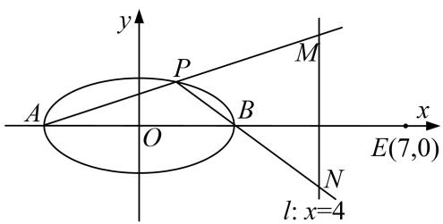

[例 3] 已知 $A(-2, 0)$ ， $B(2, 0)$ ，点 C 是动点且直线 AC 和直线 BC 的斜率之积为 $-\frac{3}{4}$ .  
（1）求动点 C 的轨迹方程;  
（2）设直线 l 与（1）中轨迹相切于点 P，与直线 x=4 相交于点 Q，判断以 PQ 为直径的圆是否过 x 轴上一定点.

[例 4] 已知 $F_{1}$ ， $F_{2}$ 为椭圆 C: $\frac{x^{2}}{2} + y^{2} = 1$ 的左、右焦点，过椭圆长轴上一点 $M(m, 0)$ (不含端点)作一条直线 l，交椭圆于 A，B 两点.  
（1）若直线 $AF_{2}$ ，AB， $BF_{2}$ 的斜率依次成等差数列(公差不为0)，求实数 m 的取值范围；  
（2）若过点 $P\left[0, -\frac{1}{3}\right]$ 的直线交椭圆 $C$ 于 $E, F$ 两点，则以 $EF$ 为直径的圆是否恒过定点？若是，求出该定点的坐标；若不是，请说明理由.
> 

> 
> | 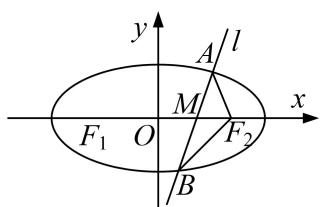 | 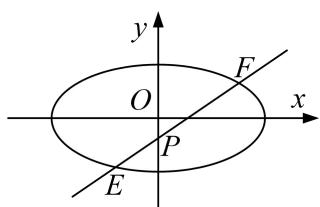 |
> | --- | --- |
> | （1）图 | （2）图 |
> 

[例 5] 等边三角形 OAB 的边长为 $8\sqrt{3}$ ，且其三个顶点均在抛物线 E: $x^{2}=2py(p>0)$ 上.  
（1）求抛物线 E 的方程;  
（2）设动直线 l 与抛物线 E 相切于点 P，与直线 y = -1 相交于点 Q．证明：以 PQ 为直径的圆恒过某定

点.

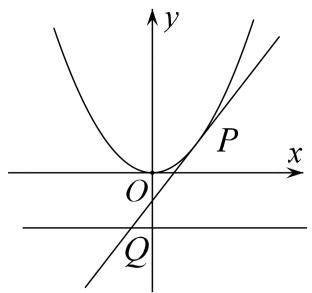

[例6] 设 $F_{1}$ , $F_{2}$ 分别为椭圆 $C$ : $\frac{x^{2}}{a^{2}} + \frac{y^{2}}{b^{2}} = 1 (a > b > 0)$ 的左、右焦点, 若椭圆上的点 $T(2, \sqrt{2})$ 到点 $F_{1}$ , $F_{2}$ 的距离之和等于 $4\sqrt{2}$ .  
（1）求椭圆 C 的方程;  
（2）若直线 $y = kx (k \neq 0)$ 与椭圆 $C$ 交于 $E, F$ 两点， $A$ 为椭圆 $C$ 的左顶点，直线 $AE, AF$ 分别与 $y$ 轴交于点 $M, N$ 。问：以 $MN$ 为直径的圆是否经过定点？若经过，求出定点的坐标；若不经过，请说明理由。

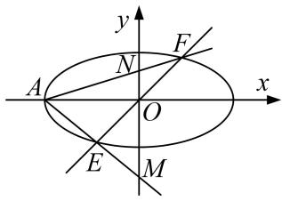

# 【对点精练】

1. 已知椭圆 $\frac{x^2}{a^2} + \frac{y^2}{b^2} = 1 (a > b > 0)$ 的左、右焦点分别是 $F_1, F_2$ ，上、下顶点分别是 $B_1, B_2, C$ 是 $B_1F_2$ 的中点，若 $B_1\overrightarrow{F_1} \cdot B_1\overrightarrow{F_2} = 2$ 且 $\overrightarrow{CF_1} \perp B_1\overrightarrow{F_2}$ . $\frac{4\sqrt{3}}{3}$  
（1）求椭圆的方程;  
（2）点 Q 是椭圆上任意一点， $A_{1}$ ， $A_{2}$ 分别是椭圆的左、右顶点，直线 $QA_{1}$ ， $QA_{2}$ 与直线 $x=\frac{4\sqrt{3}}{3}$ 分别交于 E，F 两点，试证：以 EF 为直径的圆与 x 轴交于定点，并求该定点的坐标.

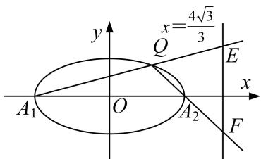

2. 已知圆 $C_1: (x + 1)^2 + y^2 = 8$ ，点 $C_2(1, 0)$ ，点 $Q$ 在圆 $C_1$ 上运动， $QC_2$ 的垂直平分线交 $QC_1$ 于点 $P$  
（1）求动点 P 的轨迹 W 的方程;  
（2）过 $S(0, \frac{1}{3})$ 且斜率为 k 的动直线 l 交曲线 W 于 A, B 两点，在 y 轴上是否存在定点 D，使得以 AB 为直径的圆恒过这个点？若存在，求出 D 的坐标；若不存在，说明理由.

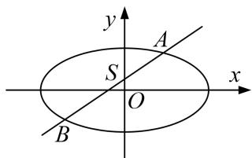

3. 已知椭圆 $C$ 的中心在坐标原点，左，右焦点分别为 $F_{1}, F_{2}, P$ 为椭圆 $C$ 上的动点， $\triangle PF_{1}F_{2}$ 的面积最大值为 $\sqrt{3}$ ，以原点为中心，椭圆短半轴长为半径的圆与直线 $3x - 4y + 5 = 0$ 相切.  
（1）求椭圆的方程;  
（2）若直线 l 过定点(1, 0)且与椭圆 C 交于 A, B 两点，点 M 是椭圆 C 的右顶点，直线 AM, BM 分别与 y 轴交于 P, Q 两点，试问以线段 PQ 为直径的圆是否过 x 轴上的定点？若是，求出定点坐标；若不是，说明理由.

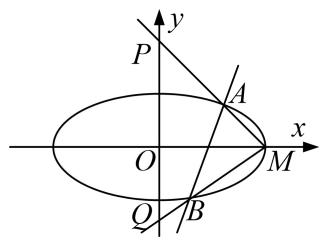

4. 已知椭圆 $C: \frac{x^2}{a^2} + \frac{y^2}{b^2} = 1 (a > b > 0)$ 的左、右焦点分别为 $F_1(-1, 0), F_21, 0)$ ，点 $P(x_0, y_0)(y_0 > 0)$ ，是椭圆 $C$ 上的动点，直线 $OP$ 的斜率等于 $\frac{\sqrt{2}}{2}$ 时， $PF_2 \perp x$ 轴.  
（1）求椭圆 C 的方程:  
（2）过点 P 且斜率为 $-\frac{x_{0}}{2y_{0}}$ 的直线 $l_{2}$ 与直线 $l_{1}$ : x=2 相较于点 Q，试判断以 PQ 为直径的圆是否过 x 轴上的定点？若是，求出定点坐标；若不是，说明理由.

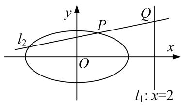

5. 已知椭圆 $C: \frac{x^2}{a^2} + \frac{y^2}{b^2} = 1 (a > b > 0)$ 的离心率是 $\frac{\sqrt{2}}{2}$ , $A_1$ , $A_2$ 分别是椭圆 $C$ 的左、右两个顶点, 点 $F$ 是椭圆 $C$ 的右焦点. 点 $D$ 是 $x$ 轴上位于 $A_2$ 右侧的一点, 且满足 $\frac{1}{|A_1 D|} + \frac{1}{|A_2 D|} = \frac{1}{|F D|} = 2$ .  
（1）求椭圆 C 的方程以及点 D 的坐标;  
（2）过点 D 作 x 轴的垂线 n，再作直线 l: $y=kx+m$ ，与椭圆 C 有且仅有一个公共点 P，直线 l 交直线 n 于点 Q．求证：以线段 PQ 为直径的圆恒过定点，并求出定点的坐标.

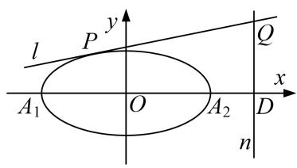

6. 已知点 $A(0, 1)$ , 过点 $D(0, -1)$ 作与 $x$ 轴平行的直线 $l_{1}$ , 点 $B$ 为动点 $M$ 在直线 $l_{1}$ 上的投影, 且满足
$\overrightarrow {M A} \cdot \overrightarrow {A B} = \overrightarrow {M B} \cdot \overrightarrow {B A}.$  
（1）求动点 M 的轨迹 C 的方程;  
（2）已知 $P$ 为曲线 $C$ 上的一点，且曲线 $C$ 在点 $P$ 处的切线为 $l_{2}$ ，若直线 $l_{2}$ 与直线 $l_{1}$ 相交与点 $Q$ 。试探究在 $y$ 轴上是否存在点 $N$ ，使得以 $PQ$ 为直径的圆恒过点 $N$ ？若存在，求出点 $N$ 的坐标；若不存在，说明理由。

7. 已知椭圆 $C: \frac{x^2}{a^2} + \frac{y^2}{b^2} = 1 (a > b > 0)$ 的离心率为 $\frac{\sqrt{2}}{2}$ ，并且直线 $y = x + b$ 是抛物线 $y^2 = 4x$ 的一条切线.  
（1）求椭圆的方程:  
（2）过点 $S(0, \frac{1}{3})$ 的动直线 l 交椭圆 C 于 A、B 两点，试问：在坐标平面上是否存在一个定点 T，使得以 AB 为直径的圆恒过点 T？若存在，求出点 T 的坐标；若不存在，请说明理由.

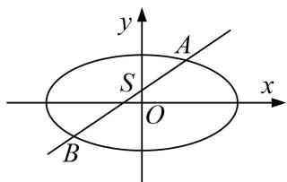

8. 如图，在平面直角坐标系 $xOy$ 中，离心率为 $\frac{\sqrt{2}}{2}$ 的椭圆 $C: \frac{x^2}{a^2} + \frac{y^2}{b^2} = 1 (a > b > 0)$ 的左顶点为 $A$ ，过原点 $O$ 的直线(与坐标轴不重合)与椭圆 $C$ 交于 $P$ ， $O$ 两点，直线 $PA$ ， $QA$ 分别与 $y$ 轴交于 $M$ ， $N$ 两点，当直线 $PQ$ 的斜率为 $\frac{\sqrt{2}}{2}$ 时， $|PQ| = 2\sqrt{3}$ .  
（1）求椭圆 C 的标准方程;  
（2）试问以 $MN$ 为直径的圆是否过定点(与 $PQ$ 的斜率无关)? 请证明你的结论.

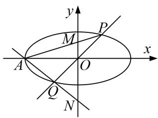

