# 专题17 圆过定点模型

# 【方法总结】

1. 圆过定点问题的一般设问方式  
（1）证明以 PQ 为直径的圆恒过 x 或 y 轴上某定点 $M(m, 0)$ 或 $M(0, n)$ ;  
（2）证明以 PQ 为直径的圆恒过定点 $M(m, n)$ ;  
（3）证明以 PQ 为直径的圆恒过定点 $M(m, n)$ ;  
（4）以 PQ 为直径的圆是否恒过定点 M？若是，求出该定点 M 的坐标；若不是，请说明理由.

2. 圆过定点问题的一般解法  
（1）向量法：基本思想是根据直径所对的圆周角是直角，即 $\overrightarrow{MP} \cdot \overrightarrow{MQ} = 0$ 。这是解决圆过定点的主要方法。  
一般步骤：①设出 $M(m, n)$ 及相关点的坐标或相关直线的方程；  
②根据题设条件求出点 P 与点 Q 的坐标， $P(A(t), B(t))$ ， $Q(C(t), D(t))$ ;  
③求出 $\overrightarrow{MP}$ 与 $\overrightarrow{MQ}$ 的坐标，并根据 $\overrightarrow{MP}\cdot\overrightarrow{MQ}=0$ ，建立方程 $f(m,n,t)=0$ ，并整理成 $tf(m,n)+g(m,n)=0;$   
④根据圆过定点时与参数没有关系(即方程对参数 t 的任意值都成立)，得到方程组 $\left\{\begin{aligned}f(m,n)&=0,\\ g(m,n)&=0;\end{aligned}\right.$   
⑤以方程组的解为坐标的点就是圆所过的定点.  
（2）方程法：基本思想是根据已知条件求出圆的方程，即 $f(x, y, k)=0$ 。这种方法用的很少。

一般步骤：①设出相关点的坐标或相关直线的方程；
②根据题设条件求出点 P 与点 Q 的坐标， $P(A(t), B(t))$ ， $Q(C(t), D(t))$ ;  
③求出圆的方程 $f(x, y, t)=0$ ，并整理成 $tf(x, y)+g(x, y)=0$ ;  
④根据圆过定点时与参数没有关系(即方程对参数 t 的任意值都成立)，得到方程组 $\left\{\begin{aligned}f(x,y)=0,\\ g(x,y)=0;\end{aligned}\right.$   
⑤以方程组的解为坐标的点就是圆所过的定点.  
（3）赋值法：基本思想是从特殊到一般，根据动点或动线的特殊情况探索出定点，再证明该定点与变量无关.

# 【例题选讲】

[例 1] (2019·北京)已知抛物线 C: $x^{2}=-2py$ 经过点 $(2,-1)$ .  
（1）求抛物线 C 的方程及其准线方程;  
（2）设 O 为原点，过抛物线 C 的焦点作斜率不为 0 的直线 l 交抛物线 C 于两点 M, N, 直线 y = -1 分别交直线 OM, ON 于点 A 和点 B. 求证：以 AB 为直径的圆经过 y 轴上的两个定点.

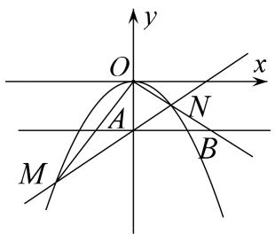

[规范解答] （1）由抛物线 C: $x^{2}=-2py$ 经过点 $(2,-1)$ ，得 p=2.
所以抛物线 C 的方程为 $x^{2}=-4y$ ，其准线方程为 y=1。  
（2）向量法

抛物线 C 的焦点为 $F(0, -1)$ ，设直线 l 的方程为 $y = kx - 1 (k \neq 0)$ .
由 $\left\{\begin{aligned}y&=kx-1,\\ x^{2}&=-4y\end{aligned}\right.$ 得 $x^{2}+4kx-4=0.$
设 $M(x_{1}, y_{1})$ ， $N(x_{2}, y_{2})$ ，则 $x_{1}x_{2}=-4$ .

直线 OM 的方程为 $y=\frac{y_{1}}{x_{1}}x$ 。令 y=-1，得点 A 的横坐标 $x_{A}=-\frac{x_{1}}{y_{1}}$ .

同理得点 B 的横坐标 $x_{B}=-\frac{x_{2}}{y_{2}}$ . 设点 $D(0, n)$ ,
则 $\overrightarrow{DA}=\left(-\frac{x_{1}}{y_{1}},-1-n\right),\quad\overrightarrow{DB}=\left(-\frac{x_{2}}{y_{2}},-1-n\right),$
$\overrightarrow {D A} \cdot \overrightarrow {D B} = \frac {x _ {1} x _ {2}}{y _ {1} y _ {2}} + (n + 1) ^ {2} = \overline {{\left[ - \frac {x _ {1} ^ {2}}{4} \right] \left[ - \frac {x _ {2} ^ {2}}{4} \right]}} + (n + 1) ^ {2} = \frac {1 6}{x _ {1} x _ {2}} + (n + 1) ^ {2} = - 4 + (n + 1) ^ {2}.$
令 $\overrightarrow{DA}\cdot\overrightarrow{DB}=0$ ，即 $-4+(n+1)^{2}=0$ ，则n=1或n=-3。

综上，以 AB 为直径的圆经过 y 轴上的定点 $(0, 1)$ 和 $(0, -3)$ .

[例 2] 已知椭圆 $\frac{x^{2}}{a^{2}}+\frac{y^{2}}{b^{2}}=1(a>b>0)$ 过点 $Q(1,\frac{3}{2})$ ，且离心率 $e=\frac{1}{2}$ .  
（1）求椭圆 C 的方程;  
（2）椭圆 $C$ 长轴两端点分别为 $A, B$ , 点 $P$ 为椭圆上异于 $A, B$ 的动点, 直线 $l: x = 4$ 与直线 $PA, PB$ 分别交于 $M, N$ 两点, 又点 $E(7,0)$ , 过 $E, M, N$ 三点的圆是否过 $x$ 轴上不同于点 $E$ 的定点? 若经过, 求出定点坐标; 若不存在, 请说明理由.

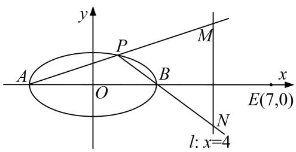

[规范解答] （1）由 $\left\{ \begin{array}{l} e = \frac{c}{a} = \frac{1}{2}, \\ \frac{1}{a^2} + \frac{9}{4b^2} = 1 \\ a^2 = b^2 + c^2 \end{array} \right.$ ，解得 $a^2 = 4$ ， $b^2 = 3$ ，故椭圆 $C$ 的方程为： $\frac{x^2}{4} + \frac{y^2}{3} = 1$ .  
（2）向量法
设点 $P(x_{0}, y_{0})$ ，直线 PA，PB 的斜率分别为 $k_{1}$ ， $k_{2}$ ，由椭圆的第三定义知 $k_{1}k_{2}=e^{2}-1=-\frac{3}{4}$
又 PA: $y=k_{1}(x+2)$ ，令 x=4，得 $M(4, 6k_{1})$ ,

同理：PB: $y=k_{2}(x-2)$ ，令 x=4，得 $N(4, 2k_{2})$ ,
则 $k_{EM}k_{EN} = (-\frac{6k_1}{3})(-\frac{2k_2}{3}) = -1$ ，过 $E$ ， $M$ ， $N$ 三点的圆的直径为 $MN$
设圆过定点 $R(m, 0)$ ，则 $\overrightarrow{RM} \cdot \overrightarrow{RN} = 0$ ，因为 $\overrightarrow{RM} = (4 - m, 6k_{1})$ ， $\overrightarrow{RN} = (4 - m, 2k_{2})$ .
所以 $\overrightarrow{RM}\cdot\overrightarrow{RN}=(4-m)^{2}+12k_{1}k_{2}=0$ ，即 $(4-m)^{2}=9$ ，解得m=1或m=7(舍).
故经过 E, M, N 三点的圆是以 MN 为直径，过 x 轴上不同于点 E 的定点 R(1, 0).

[例 3] 已知 $A(-2, 0)$ ， $B(2, 0)$ ，点 C 是动点且直线 AC 和直线 BC 的斜率之积为 $-\frac{3}{4}$ .  
（1）求动点 C 的轨迹方程;  
（2）设直线 l 与（1）中轨迹相切于点 P，与直线 x=4 相交于点 Q，判断以 PQ 为直径的圆是否过 x 轴上一定点.

[规范解答] （1） 设 $C(x, y)$ . 由题意得 $k_{AC} \cdot k_{BC} = \frac{y}{x + 2} \cdot \frac{y}{x - 2} = -\frac{3}{4} (y \neq 0)$ . 整理，得 $\frac{x^{2}}{4} + \frac{y^{2}}{3} = 1 (y \neq 0)$ .
故动点 C 的轨迹方程为 $\frac{x^{2}}{4} + \frac{y^{2}}{3} = 1 (y \neq 0)$ .  
（2）方法一：向量法

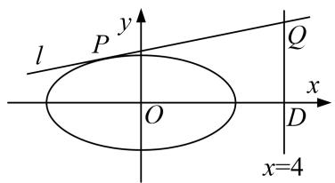

易知直线 l 的斜率存在，设直线 $l: y = kx + m$ .
联立方程组 $\left\{\begin{aligned}y&=kx+m,\\ \frac{x^{2}}{4}&+\frac{y^{2}}{3}=1,\end{aligned}\right.$ 消去 y 并整理，得 $(3+4k^{2})x^{2}+8kmx+4m^{2}-12=0.$
依题意得 $\Delta=(8km)^{2}-4(3+4k^{2})(4m^{2}-12)=0$ ，即 $3+4k^{2}=m^{2}$ .
设 $x_{1}$ ， $x_{2}$ 为方程 $(3+4k^{2})x^{2}+8kmx+4m^{2}-12=0$ 的两个根，则 $x_{1}+x_{2}=\frac{-8km}{3+4k^{2}}$ ，所以 $x_{1}=x_{2}=\frac{-4km}{3+4k^{2}}$ .
所以 $P\left(\frac{-4km}{3+4k^{2}}, \frac{3m}{3+4k^{2}}\right)$ ，即 $P\left(\frac{-4k}{m}, \frac{3}{m}\right)$ .
又 $Q(4, 4k+m)$ ，设 $R(t, 0)$ 为以 PQ 为直径的圆上一点，则由 $\overrightarrow{RP} \cdot \overrightarrow{RQ} = 0$ ，
得 $\left(-\frac{4k}{m}-t,\frac{3}{m}\right)\cdot(4-t,4k+m)=0$ ，整理，得 $\frac{4k}{m}(t-1)+t^{2}-4t+3=0$ .
由 $\frac{k}{m}$ 的任意性，得 t-1=0 且 $t^{2}-4t+3=0$ ，解得 t=1。

综上可知以 PQ 为直径的圆过 x 轴上一定点 $(1, 0)$ .
方法二：向量法
设 $P(x_{0}, y_{0})$ ，则曲线 C 在点 P 处的切线 PQ: $\frac{x_{0}x}{4} + \frac{y_{0}y}{3} = 1$ ，令 x = 4，得 $Q\left(4, \frac{3 - 3x_{0}}{y_{0}}\right)$ .
设 $R(t, 0)$ 为以 PQ 为直径的圆上一点，则由 $\overrightarrow{RP} \cdot \overrightarrow{RQ} = 0$ ，
得 $(x_{0}-t)\cdot(4-t)+3-3x_{0}=0$ ，即 $x_{0}(1-t)+t^{2}-4t+3=0$ .
由 $x_{0}$ 的任意性，得 1-t=0 且 $t^{2}-4t+3=0$ ，解得 t=1。

综上可知，以 PQ 为直径的圆过 x 轴上一定点 $(1, 0)$ .

[例 4] 已知 $F_{1}$ ， $F_{2}$ 为椭圆 C: $\frac{x^{2}}{2} + y^{2} = 1$ 的左、右焦点，过椭圆长轴上一点 $M(m, 0)$ (不含端点) 作一条直线 l，交椭圆于 A，B 两点.  
（1）若直线 $AF_{2}$ ，AB， $BF_{2}$ 的斜率依次成等差数列(公差不为0)，求实数 m 的取值范围；  
（2）若过点 $P\left[0, -\frac{1}{3}\right]$ 的直线交椭圆 $C$ 于 $E, F$ 两点，则以 $EF$ 为直径的圆是否恒过定点？若是，求出该定点的坐标；若不是，请说明理由.
> 

> 
> | 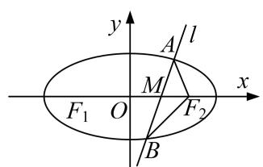 | 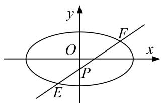 |
> | --- | --- |
> | （1）图 | （2）图 |
> 

[规范解答] （1）由题意知 $F_{1}(-1,0)$ ， $F_{2}(1,0)$ ，直线 l 的斜率存在且不为 0，
设直线 l 的方程为 $y=k(x-m)(k\neq0)$ ， $A(x_{1},y_{1})$ ， $B(x_{2},y_{2})$ ，
则 $y_{1}=k(x_{1}-m)$ ， $y_{2}=k(x_{2}-m)$ ，因为 $\frac{y_{1}}{x_{1}-1}+\frac{y_{2}}{x_{2}-1}=2k$ ，即 $\frac{k(x_{1}-m)}{x_{1}-1}+\frac{k(x_{2}-m)}{x_{2}-1}=2k$ ，
整理得 $(x_{1}+x_{2})(1-m)=2(1-m)$ ，又公差不为0，所以 $x_{1}+x_{2}=2$ ，
由 $\left\{\begin{aligned}y&=k(x-m),\\ \frac{x^{2}}{2}&+y^{2}=1,\end{aligned}\right.$ 得 $(1+2k^{2})x^{2}-4k^{2}mx+2k^{2}m^{2}-2=0,$
由 $x_{1}+x_{2}=\frac{4k^{2}m}{1+2k^{2}}=2$ ，得 $k^{2}=\frac{1}{2(m-1)}>0$ ，所以 m>1。
又点 $M(m, 0)$ 在椭圆长轴上(不含端点),
所以 $1<m<\sqrt{2}$ ，即实数 m 的取值范围为 $(1, \sqrt{2})$ .  
（2）赋值法
假设以 EF 为直径的圆恒过定点.
当 $EF \perp x$ 轴时，以 EF 为直径的圆的方程为 $x^{2} + y^{2} = 1$ ;
当 $EF \perp y$ 轴时，以 EF 为直径的圆的方程为 $x^{2} + \left(y + \frac{1}{3}\right)^{2} = \frac{16}{9}$ ,
则两圆的交点为 $Q(0, 1)$ .

下证当直线 EF 的斜率存在且不为 0 时，点 $Q(0, 1)$ 在以 EF 为直径的圆上.
设直线 EF 的方程为 $y=k_{0}x-\frac{1}{3}(k_{0}\neq0)$ ,
代入 $\frac{x^{2}}{2}+y^{2}=1$ ，整理得 $(2k_{0}^{2}+1)x^{2}-\frac{4}{3}k_{0}x-\frac{16}{9}=0$ ，
设 $E(x_{3}, y_{3})$ ， $F(x_{4}, y_{4})$ ，则 $x_{3} + x_{4} = \frac{4k_{0}}{3(2k_{0}^{2} + 1)}$ ， $x_{3}x_{4} = \frac{-16}{9(2k_{0}^{2} + 1)}$
又 $\overrightarrow{QE} = (x_3, y_3 - 1)$ , $\overrightarrow{QF} = (x_4, y_4 - 1)$ ,
所以 $\overrightarrow{QE}\cdot\overrightarrow{QF}=x_{3}x_{4}+(y_{3}-1)(y_{4}-1)=x_{3}x_{4}+\left(k_{0}x_{3}-\frac{4}{3}\right)\left(k_{0}x_{4}-\frac{4}{3}\right)$
$= (1 + k _ {0} ^ {2}) x _ {3} x _ {4} - \frac {4}{3} k _ {0} \left(x _ {3} + x _ {4}\right) + \frac {1 6}{9} = (1 + k _ {0} ^ {2}) \cdot \frac {- 1 6}{9 \left(2 k _ {0} ^ {2} + 1\right)} - \frac {4}{3} k _ {0} \cdot \frac {4 k _ {0}}{3 \left(2 k _ {0} ^ {2} + 1\right)} + \frac {1 6}{9} = 0,$
所以点 $Q(0,1)$ 在以 EF 为直径的圆上．综上，以 EF 为直径的圆恒过定点 $(0,1)$ .

[例5] 等边三角形 $OAB$ 的边长为 $8\sqrt{3}$ ，且其三个顶点均在抛物线 $E: x^{2} = 2py(p > 0)$ 上.  
（1）求抛物线 E 的方程;  
（2）设动直线 l 与抛物线 E 相切于点 P，与直线 y = -1 相交于点 Q．证明：以 PQ 为直径的圆恒过某定点.

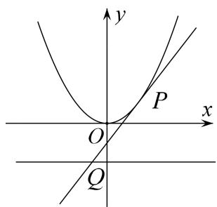

[规范解答] （1）依题意， $|OB|=8\sqrt{3}$ ， $\angle BOy=30^{\circ}$ ，不妨设 $B(x,y)$ ，x>0，
则 $x=|OB|\sin30^{\circ}=4\sqrt{3}$ ， $y=|OB|\cos30^{\circ}=12$ ，
因为点 $B(4\sqrt{3}, 12)$ 在 $x^{2}=2py$ 上，所以 $(4\sqrt{3})^{2}=24p$ ，解得 p=2，
所以抛物线的方程为 $x^{2}=4y$ .  
（2）解法 1: 向量法
由（1）知 $y=\frac{1}{4}x^{2}$ ，所以 $y'=\frac{1}{2}x$ 。设点 $P(x_{0}, y_{0})$ ， $Q(x_{1}, -1)$ ，则 $x_{0}\neq0$ ，

l 的方程为 $y-y_{0}=\frac{1}{2}x_{0}(x-x_{0})$ ，即 $y=\frac{1}{2}x_{0}x-\frac{1}{4}x_{0}^{2}$ 。令 y=-1，可得 $x_{1}=\frac{x_{0}^{2}-4}{2x_{0}^{2}}$ 。
设 $M(m, n)$ 是圆上一点，则 $\overrightarrow{MP} \cdot \overrightarrow{MQ} = 0$ ，即 $(m - x_0)(m - \frac{x_0^2 - 4}{2x_0}) + (n - y_0)(n + 1) = 0$ ，整理可得
$m ^ {2} - \frac {3 x _ {0} ^ {2} - 4}{2 x _ {0}} m + \frac {x _ {0} ^ {2}}{2} - 2 + n ^ {2} + n - n y _ {0} - y _ {0} = 0,$
因为 $y_{0}=\frac{1}{4}x_{0}^{2}$ ，所以 $-m\frac{3x_{0}^{2}-4}{2x_{0}}+(1-n)\frac{x_{0}^{2}}{4}+(n^{2}+n+m^{2}-2)=0$ ，

该式子要对任意的满足 $y_{0}=\frac{1}{4}x_{0}^{2}(x_{0}\neq0)$ 的 $x_{0}$ 恒成立，
所以 $\left\{ \begin{array}{l} m = 0, \\ 1 - n = 0 \\ n^2 + n + m^2 - 2 = 0 \end{array} \right.$ ，由此解得 $\left\{ \begin{array}{l} m = 0, \\ n = 1 \end{array} \right.$ ，所以以 $PQ$ 为直径的圆恒过定点(0，1).
解法 2: 向量法
由对称性可知该定点必在 y 轴上，设为 $M(0, n)$ .
由（1）知 $y=\frac{1}{4}x^{2}$ ，所以 $y'=\frac{1}{2}x$ 。设点 $P(x_{0}, y_{0})$ ， $Q(x_{1}, -1)$ ，则 $x_{0}\neq0$ ，

l 的方程为 $y-y_{0}=\frac{1}{2}x_{0}(x-x_{0})$ ，即 $y=\frac{1}{2}x_{0}x-\frac{1}{4}x_{0}^{2}$ 。令 y=-1，可得 $x_{1}=\frac{x_{0}^{2}-4}{2x_{0}^{2}}$ 。
由 $\overrightarrow{MP}\cdot\overrightarrow{MQ}=0$ ，可得 $\frac{x_{0}^{2}-4}{2}+(n-y_{0})(n+1)=0$ ，整理可得 $\frac{x_{0}^{2}}{2}-2+n^{2}+n-n y_{0}-y_{0}=0$ ，
因为 $y_{0}=\frac{1}{4}x_{0}^{2}$ ，所以 $(1-n)y_{0}+(n^{2}+n-2)=0$ ，该式子要对任意的满足 $y_{0}=\frac{1}{4}x_{0}^{2}(x_{0}\neq0)$ 的 $y_{0}$ 恒成立，
所以 $\left\{ \begin{array}{l} 1 - n = 0, \\ n^2 + n - 2 = 0 \end{array} \right.$ ，由此解得 $n = 1$ ，所以以 $PQ$ 为直径的圆恒过定点 $(0, 1)$ .
解法 3: 赋值法
由对称性可知该定点必在 y 轴上．由（1）知 $y=\frac{1}{4}x^{2}$ ，所以 $y'=\frac{1}{2}x$ .
设点 $P(x_{0}, y_{0})$ ， $Q(x_{1}, -1)$ ，则 $x_{0} \neq 0$ ，且 l 的方程为 $y - y_{0} = \frac{1}{2}x_{0}(x - x_{0})$ ,
即 $y=\frac{1}{2}x_{0}x-\frac{1}{4}x_{0}^{2}$ . 令 y=-1，可得 $x_{1}=\frac{x_{0}^{2}-4}{2x_{0}^{2}}$ .

取 $x_{0}=2$ ，此时 $P(2,1)$ ， $Q(0,-1)$ ，

以 PQ 为直径的圆为 $x(x-2)+(y-1)(y+1)=0$ ，与 y 轴交于点 $M_{1}(0,1)$ 和 $M_{2}(0,-1)$ ;

取 $x_{0}=1$ ，此时 $P(1, \frac{1}{4})$ ， $Q(-\frac{3}{2}, -1)$ ，

以 PQ 为直径的圆为 $(x-1)(x+\frac{3}{2})+(y-\frac{1}{4})(y+1)=0$ ，与 y 轴交于点 $M_{3}(0,1)$ 和 $M_{4}(0,-\frac{7}{4})$ .
由此可知，该定点为 $M(0, 1)$ ，下证 $M(0, 1)$ 就是所求的点.
因为 $\overrightarrow{MP}=(x_{0},y_{0}-1)$ ， $\overrightarrow{MQ}=(\frac{x_{0}^{2}-4}{2x_{0}^{2}},-2)$ ，所以 $\overrightarrow{MP}\cdot\overrightarrow{MQ}=\frac{x_{0}^{2}-4}{2}-2y_{0}+2$
所以以 PQ 为直径的圆恒过定点 $(0, 1)$ .

[例 6] 设 $F_{1}$ ， $F_{2}$ 分别为椭圆 C: $\frac{x^{2}}{a^{2}} + \frac{y^{2}}{b^{2}} = 1 (a > b > 0)$ 的左、右焦点，若椭圆上的点 $T(2, \sqrt{2})$ 到点 $F_{1}$ ,
$F_{2}$ 的距离之和等于 $4\sqrt{2}$ .  
（1）求椭圆 C 的方程;  
（2）若直线 $y=kx(k\neq0)$ 与椭圆 C 交于 E, F 两点，A 为椭圆 C 的左顶点，直线 AE, AF 分别与 y 轴交于点 M, N. 问：以 MN 为直径的圆是否经过定点？若经过，求出定点的坐标；若不经过，请说明理由.

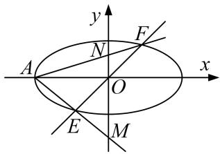

[规范解答] （1）由椭圆上的点 $T(2, \sqrt{2})$ 到点 $F_{1}, F_{2}$ 的距离之和是 $4\sqrt{2}$ ，可得 $2a = 4\sqrt{2}, a = 2\sqrt{2}$ . 又 $T(2, \sqrt{2})$ 在椭圆上，因此 $\frac{4}{a^{2}} + \frac{2}{b^{2}} = 1$ ，所以 b = 2，所以椭圆 C 的方程为 $\frac{x^{2}}{8} + \frac{y^{2}}{4} = 1$ .  
（2）方程法
因为椭圆 C 的左顶点为 A，所以点 A 的坐标为 $(-2\sqrt{2}, 0)$ .
因为直线 $y=kx(k\neq0)$ 与椭圆 $\frac{x^{2}}{8}+\frac{y^{2}}{4}=1$ 交于 E, F 两点，设点 $E(x_{0}, y_{0})$ (不妨设 $x_{0}>0$ ),
则点 $F(-x_{0}, -y_{0})$ . 由 $\left\{\begin{aligned}y=kx,\\ \frac{x^{2}}{8}+\frac{y^{2}}{4}=1\end{aligned}\right.$ 消去 y，得 $x^{2}=\frac{8}{1+2k^{2}}$ ,
所以 $x_0 = \frac{2\sqrt{2}}{\sqrt{1 + 2k^2}}$ ，则 $y_0 = \frac{2\sqrt{2}k}{\sqrt{1 + 2k^2}}$ ，所以直线 $AE$ 的方程为 $y = \frac{k}{1 + \sqrt{1 + 2k^2}} (x + 2\sqrt{2})$ 。
因为直线 AE，AF 分别与 y 轴交于点 M，N，令 x=0，得 $y=\frac{2\sqrt{2}k}{1+\sqrt{1+2k^{2}}}$
即点 $M\left(0, \frac{2\sqrt{2}k}{1+\sqrt{1+2k^{2}}}\right)$ ，同理可得点 $N\left(0, \frac{2\sqrt{2}k}{1-\sqrt{1+2k^{2}}}\right)$ .
所以 $|MN|=\left|\frac{2\sqrt{2}k}{1+\sqrt{1+2k^{2}}}-\frac{2\sqrt{2}k}{1-\sqrt{1+2k^{2}}}\right|=\frac{2\sqrt{2(1+2k^{2})}}{|k|}$ .
设 $MN$ 的中点为 $P$ ，则点 $P$ 的坐标为 $P\left(0, -\frac{\sqrt{2}}{k}\right)$ .
则以 $MN$ 为直径的圆的方程为 $x^{2} + \left(y + \frac{\sqrt{2}}{k}\right)^{2} = \left(\frac{\sqrt{2(1 + 2k^2)}}{|k|}\right)^{2}$ ，即 $x^{2} + y^{2} + \frac{2\sqrt{2}}{k} y = 4$ .
令 y=0，得 $x^{2}=4$ ，即 x=2 或 x=-2。故以 MN 为直径的圆经过两定点 $P_{1}(2,0)$ ， $P_{2}(-2,0)$ 。

# 【对点精练】

1. 已知椭圆 $\frac{x^2}{a^2} + \frac{y^2}{b^2} = 1 (a > b > 0)$ 的左、右焦点分别是 $F_1, F_2$ ，上、下顶点分别是 $B_1, B_2, C$ 是 $B_1F_2$ 的中点，若 $B_1\overrightarrow{F}_1 \cdot B_1\overrightarrow{F}_2 = 2$ 且 $\overrightarrow{CF_1} \perp B_1\overrightarrow{F_2}$ . $\frac{4\sqrt{3}}{3}$  
（1）求椭圆的方程;  
（2）点 Q 是椭圆上任意一点， $A_{1}$ ， $A_{2}$ 分别是椭圆的左、右顶点，直线 $QA_{1}$ ， $QA_{2}$ 与直线 $x=\frac{4\sqrt{3}}{3}$ 分别交于 E，F 两点，试证：以 EF 为直径的圆与 x 轴交于定点，并求该定点的坐标.

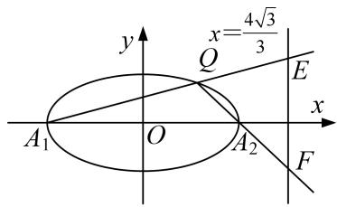

1. 解析 （1） 设 $F_{1}(-c, 0)$ , $F_{2}(c, 0)$ , $B_{1}(0, b)$ , 则 $C\left(\frac{c}{2}, \frac{b}{2}\right)$ . 由题意得 $B_{1}\overrightarrow{F}_{1} \cdot B_{1}\overrightarrow{F}_{2} = 2$ , 且 $\overrightarrow{CF_1} \perp B_{1}\overrightarrow{F}_{2}$ .
即 $\left\{\begin{aligned}&(-c,&-b)\cdot(c,&-b)=2,\\&-\frac{3c}{2},&-\frac{b}{2}\end{aligned}\right\}$ ·(c,-b)=0,
即 $\left\{\begin{aligned}b^{2}-c^{2}&=2,\\ b^{2}&=3c^{2},\end{aligned}\right.$
解得 $\left\{\begin{aligned}b^{2}&=3,\\ c^{2}&=1,\end{aligned}\right.$
从而 $a^2 = 4$
故所求椭圆的方程为 $\frac{x^{2}}{4}+\frac{y^{2}}{3}=1$ .  
（2）向量法
由（1）得 $A_{1}(-2,0)$ ， $A_{2}(2,0)$ ，设 $Q(x_{0},y_{0})$ ，易知 $x_{0}\neq\pm2$ ，
则直线 $QA_{1}$ 的方程为 $y=\frac{y_{0}}{x_{0}+2}(x+2)$ ，与直线 $x=\frac{4\sqrt{3}}{3}$ 的交点 E 的坐标为 $\left(\frac{4\sqrt{3}}{3},\frac{y_{0}}{x_{0}+2}\left(\frac{4\sqrt{3}}{3}+2\right)\right)$ ,

直线 $QA_{2}$ 的方程为 $y=\frac{y_{0}}{x_{0}-2}(x-2)$ ，与直线 $x=\frac{4\sqrt{3}}{3}$ 的交点 F 的坐标为 $\left(\frac{4\sqrt{3}}{3},\frac{y_{0}}{x_{0}-2}\left(\frac{4\sqrt{3}}{3}-2\right)\right)$ ,
设以 EF 为直径的圆与 x 轴交于点 $H(m, 0)$ ， $m \neq \frac{4\sqrt{3}}{3}$ ，则 $HE \perp HF$ ，从而 $\overrightarrow{HE} \cdot \overrightarrow{HF} = 2$ ，
$\because \overrightarrow {H E} = \left(\frac {4 \sqrt {3}}{3} - m, \frac {y _ {0}}{x _ {0} + 2} \left(\frac {4 \sqrt {3}}{3} + 2\right)\right), \overrightarrow {H F} = \left(\frac {4 \sqrt {3}}{3} - m, \frac {y _ {0}}{x _ {0} - 2} \left(\frac {4 \sqrt {3}}{3} - 2\right)\right), \therefore \left(\frac {4 \sqrt {3}}{3} - m\right) ^ {2} + \frac {y _ {0} {} ^ {2}}{x _ {0} {} ^ {2} - 4} \left(\frac {1 6}{3} - 4\right) = 0,$
即 $(\frac{4\sqrt{3}}{3} - m)^2 + \frac{\frac{4}{3}y_0^2}{x_0^2 - 4} = 0$ ，①．由 $\frac{x_0^2}{4} + \frac{y_0^2}{3} = 1$ 得 $y_0^2 = \frac{3(4 - x_0^2)}{4}$ ，②
所以由①②得 $m=\frac{4\sqrt{3}}{3}\pm1$ ,
故以 EF 为直径的圆与 x 轴交于定点，且该定点的坐标为 $\left(\frac{4\sqrt{3}}{3}+1,0\right)$ 或 $\left(\frac{4\sqrt{3}}{3}-1,0\right)$ .

2. 已知圆 $C_1: (x + 1)^2 + y^2 = 8$ ，点 $C_2(1, 0)$ ，点 $Q$ 在圆 $C_1$ 上运动， $QC_2$ 的垂直平分线交 $QC_1$ 于点 $P$  
（1）求动点 P 的轨迹 W 的方程;  
（2）过 $S(0, \frac{1}{3})$ 且斜率为 k 的动直线 l 交曲线 W 于 A, B 两点，在 y 轴上是否存在定点 D，使得以 AB 为直径的圆恒过这个点？若存在，求出 D 的坐标；若不存在，说明理由.

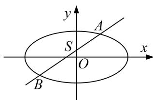

2. 解析 （1）由线段 $QC_{2}$ 的垂直平分线与半径 $QC_{1}$ 交于点 P,
得 $|PC_{1}|+|PC_{2}|=|PC_{1}|+|PQ|=|C_{1}Q|=2\sqrt{2}>|F_{1}F_{2}|=2,$
所以点 P 的轨迹为以 $C_{1}$ ， $C_{2}$ 为焦点，长轴长为 $2\sqrt{2}$ 的椭圆，故 $a=\sqrt{2}$ ，c=1， $b^{2}=a^{2}-c^{2}=1$ 。

动点 P 的轨迹 W 的方程为 $\frac{x^{2}}{2} + y^{2} = 1$ .  
（2）向量法
设直线 $l: y=kx+\frac{1}{3}, A(x_{1}, y_{1}), B(x_{2}, y_{2})$ ，与椭圆方程联立可得： $\left\{\begin{aligned}y &= kx + \frac{1}{3}, \\ x^{2} &= 2y^{2} = 2\end{aligned}\right.$
消去 y 可得， $x^{2}+2(kx+\frac{1}{3})^{2}=0$ ，整理后可得， $(2k^{2}+1)x^{2}+\frac{4}{3}kx-\frac{16}{9}=0$ ，
$\therefore x _ {1} + x _ {2} = - \frac {4 k}{3 (2 k ^ {2} + 1)}, x _ {1} x _ {2} = - \frac {1 6}{9 (2 k ^ {2} + 1)}.$
设 $D(0, b)$ ，因为以 AB 为直径的圆过 D 点，∴ $DA \perp DB$ ，∴ $\overrightarrow{DA} \cdot \overrightarrow{DB} = 0$ .
又 $\overrightarrow{DA}=(x_{1},y_{1}-b),\quad\overrightarrow{DB}=(x_{2},y_{2}-b),$
所以 $\overrightarrow{DA}\cdot\overrightarrow{DB}=x_{1}x_{2}+(y_{1}-b)(y_{2}-b)=x_{1}x_{2}+y_{1}y_{2}-b(y_{1}+y_{2})+b^{2}=0.$ ①
$y _ {1} + y _ {2} = k \left(x _ {1} + x _ {2}\right) + \frac {2}{3} = \frac {2}{3 \left(2 k ^ {2} + 1\right)}, \quad y _ {1} y _ {2} = \left(k x _ {1} + \frac {1}{3}\right) \left(k x _ {2} + \frac {1}{3}\right) = k ^ {2} x _ {1} x _ {2} + \frac {1}{3} k \left(x _ {1} + x _ {2}\right) + \frac {1}{9} = \frac {- 8 1 k ^ {2} + 1}{9 \left(2 k ^ {2} + 1\right)}$
代入到①可得， $b^{2}-\frac{2b}{3(2k^{2}+1)}+\frac{-81k^{2}+1}{9(2k^{2}+1)}-\frac{16}{9(2k^{2}+1)}=0.$
$\therefore b^{2} - \frac{2b + 6k^{2} + 5}{3(2k^{2} + 1)} = 0$ ，所以只需 $6k^{2}(b^{2} - 1) + 3b^{2} - 2b - 5 = 0.$
可得 b=-1，所以存在定点 $(0, -1)$ .

3. 已知椭圆 $C$ 的中心在坐标原点，左，右焦点分别为 $F_{1}, F_{2}, P$ 为椭圆 $C$ 上的动点， $\triangle PF_{1}F_{2}$ 的面积最大值为 $\sqrt{3}$ ，以原点为中心，椭圆短半轴长为半径的圆与直线 $3x - 4y + 5 = 0$ 相切.  
（1）求椭圆的方程;  
（2）若直线 l 过定点(1, 0)且与椭圆 C 交于 A, B 两点，点 M 是椭圆 C 的右顶点，直线 AM, BM 分别与 y 轴交于 P, Q 两点，试问以线段 PQ 为直径的圆是否过 x 轴上的定点？若是，求出定点坐标；若不是，说明理由.

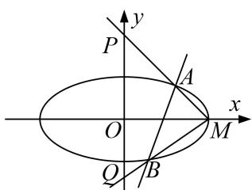

3. 解析 （1） $(S_{\triangle PF1F2})_{max}=\frac{1}{2}|F_{1}F_{2}|b=bc=\sqrt{3}$ ，因为圆与直线相切， $\therefore d_{O-l}=\frac{5}{\sqrt{3^{2}+4^{2}}}=b$
$\therefore b=1,\ c=\sqrt{3},\ \therefore a^{2}=b^{2}+c^{2}=4,\ \therefore$ 椭圆方程为 $\frac{x^{2}}{4}+y^{2}=1.$  
（2）向量法
当直线 l 的斜率存在时，设 $l: y = k(x - 1)$ ，由椭圆方程可得点 $M(2, 0)$ ，
设 $A(x_{1}, y_{1})$ ， $B(x_{2}, y_{2})$ ，联立方程可得， $\left\{\begin{aligned}x^{2}+4y^{2}=4,\\ y=k(x-1),\end{aligned}\right.$ 消去 y 整理可得： $(1+4k^{2})x^{2}-8k^{2}x+4k^{2}-4=0$
$\therefore x_{1} + x_{2} = \frac{8k^{2}}{1 + 4k^{2}}, x_{1}x_{2} = \frac{4k^{2} - 4}{1 + 4k^{2}}$ ，由 $M(2,0), A(x_1,y_1), B(x_2,y_2)$ ，可得，
$AM: y=\frac{y_{1}}{x_{1}-2}(x-2), BM: y=\frac{y_{2}}{x_{2}-2}(x-2), \text{ 分别令 } x=0, \text{ 可得, } P(0, -\frac{2y_{1}}{x_{1}-2}), Q(0, -\frac{2y_{2}}{x_{2}-2}),$
设 x 轴上的定点为 $N(x_{0}, 0)$ ，若 PQ 为直径的圆是否过 $N(x_{0}, 0)$ ，则 $\overrightarrow{PN} \cdot \overrightarrow{QN} = 0$ .
$\because\overrightarrow{PN}=(x_{0},\frac{2y_{1}}{x_{1}-2}),\quad\overrightarrow{QN}=(x_{0},\frac{2y_{2}}{x_{2}-2}),\quad\therefore$ 问题转化为 $x_{0}^{2}+\frac{4y_{1}y_{2}}{(x_{1}-2)(x_{2}-2)}=0$ 恒成立.
即 $x_{0}^{2}+\frac{4y_{1}y_{2}}{x_{1}x_{2}-2(x_{1}+x_{2})+4}=0$ ①,
由 $x_{1} + x_{2} = \frac{8k^{2}}{1 + 4k^{2}}, x_{1}x_{2} = \frac{4k^{2} - 4}{1 + 4k^{2}}$ 及 $y = k(x - 1)$ 可得， $y_{1}y_{2} = k^{2}(x_{1} - 1)(x_{2} - 1) = k^{2}[x_{1}x_{2} - (x_{1} + x_{2}) + 1] = \frac{-3k^{2}}{1 + 4k^{2}}$
代入到①可得， $x_{0}^{2}+\frac{4\times\frac{-3k^{2}}{1+4k^{2}}}{\frac{4k^{2}-4}{1+4k^{2}}-2\times\frac{8k^{2}}{1+4k^{2}}+4}=0,\quad\therefore x_{0}^{2}=3$ ，解得， $x_{0}=\pm\sqrt{3}$ ．∴圆过定点( $\pm\sqrt{3},0$ )
当直线斜率不存在时，直线方程为 x=1，可得 PQ 为直径的圆 $x^{2}+y^{2}=3$ 过点 $(\pm\sqrt{3},0)$ ,
所以以线段 PQ 为直径的圆过 x 轴上定点( $\pm\sqrt{3}$ ，0).

4. 已知椭圆 $C: \frac{x^2}{a^2} + \frac{y^2}{b^2} = 1 (a > b > 0)$ 的左、右焦点分别为 $F_1(-1, 0), F_21, 0)$ ，点 $P(x_0, y_0)(y_0 > 0)$ ，是椭圆 $C$ 上的动点，直线 $OP$ 的斜率等于 $\frac{\sqrt{2}}{2}$ 时， $PF_2 \perp x$ 轴.  
（1）求椭圆 C 的方程;  
（2）过点 P 且斜率为 $-\frac{x_{0}}{2y_{0}}$ 的直线 $l_{2}$ 与直线 $l_{1}$ : x=2 相较于点 Q，试判断以 PQ 为直径的圆是否过 x 轴上的定点？若是，求出定点坐标；若不是，说明理由.

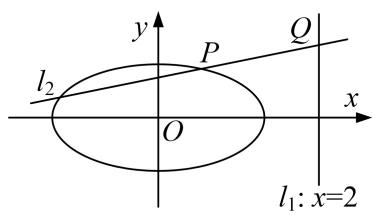

4. 解析 （1） $\because PF_{2}\perp x$ 轴， $\therefore P$ 的横坐标 $x_{0}$ 的值为 c，且 c=1，代入椭圆方程，得 $P(1,\frac{b^{2}}{a})$ .
又 $k_{OP} = \frac{y_0}{x_0} = \frac{\underline{b^2}}{\underline{a}} = \frac{\sqrt{2}}{2}$ 解得 $a = \sqrt{2} b^2$
又 $\because a^{2} - b^{2} = 1$ ， $\therefore a = \sqrt{2} a^{2} - \sqrt{2}$ ，解得 $a = \sqrt{2}$ 或者 $a = -\frac{\sqrt{2}}{2}$ （舍去），
$\therefore b^{2}=1$ ，即椭圆方程 C 为 $\frac{x^{2}}{2}+y^{2}=1$ .  
（2）向量法

直线 $l_{2}$ 的方程为 $y-y_{0}=-\frac{x_{0}}{2y_{0}}(x-x_{0})$ ，即 $2y_{0}y=-x_{0}x+x^{2}+2y_{0}^{2}$ .
由题意得 $\frac{x_{0}^{2}}{2}+y_{0}^{2}=1$ ，即 $x_{0}^{2}+2y_{0}^{2}=2$ ，
∴ $l_{2}$ 的方程为 $x_{0}x + 2y_{0}y = 2,\quad \therefore Q(2,\frac{1 - x_{0}}{y_{0}}).$
设定点 $M(m, 0)$ ，由 $\overrightarrow{MP} \cdot \overrightarrow{MQ} = 0$ ，得 $(x_{0} - m)(2 - m) + y_{0} \frac{1 - x_{0}}{y_{0}} = 0$ ，
即 $(1 - m)x_0 + (m - 1)^2 = 0$ ，要使此方程对 $x_0\in \mathbf{R}$ 恒成立，则必有 $\left\{ \begin{array}{ll}1 - m = 0\\ (m - 1)^2 = 0 \end{array} \right.$ ，∴解得 $m = 1$
综上所述，存在定点 $M(1, 0)$ ，满足题目要求.

5. 已知椭圆 $C: \frac{x^2}{a^2} + \frac{y^2}{b^2} = 1 (a > b > 0)$ 的离心率是 $\frac{\sqrt{2}}{2}$ , $A_1, A_2$ 分别是椭圆 $C$ 的左、右两个顶点, 点 $F$ 是椭圆 $C$ 的右焦点. 点 $D$ 是 $x$ 轴上位于 $A_2$ 右侧的一点, 且满足 $\frac{1}{|A_1 D|} + \frac{1}{|A_2 D|} = \frac{1}{|F D|} = 2$ .  
（1）求椭圆 C 的方程以及点 D 的坐标;  
（2）过点 D 作 x 轴的垂线 n，再作直线 l: $y=kx+m$ ，与椭圆 C 有且仅有一个公共点 P，直线 l 交直线 n 于点 Q．求证：以线段 PQ 为直径的圆恒过定点，并求出定点的坐标.

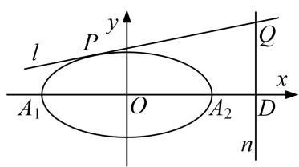

5. 解析 （1） $A_{1}(-a, 0)$ , $A_{2}(a, 0)$ , $F(c, 0)$ , 设 $D(x, 0)$ ,
由 $\frac{1}{|A_1D|} +\frac{1}{|A_2D|} = 2$ ，有 $\frac{1}{x + a} +\frac{1}{x - a} = 2$ ，又 $|FD| = 1$ ， $\therefore x - c = 1$ ， $x = c + 1$
于是 $\frac{1}{c + 1 + a} +\frac{1}{c + 1 - a} = 2$ ， $\because e = \frac{\sqrt{2}}{2}$ ： $a = \sqrt{2} c$ ，代入 $c + 1 = (c + 1 + a)(c + 1 - a)$ ，解得 $c = 1$
$a^{2}=2,\ b^{2}=1$ ，椭圆 C: $\frac{x^{2}}{2}+y^{2}=1$ ，且 D(2, 0).  
（2）向量法
$\because Q(2, 2k+m)$ , 设 $P(x_0, y_0)$ , 联立由 $\left\{ \begin{array}{l} y = kx + m, \\ \frac{x^2}{2} + y^2 = 1, \end{array} \right.$ 消去 $y$ 得, $(1 + 2k^2)x^2 + 4kmx + 2m^2 - 2 = 0$ ,
由 $\Delta=0$ ，得 $m^{2}=2k^{2}+1$ ，∴ $2x_{0}=\frac{-4km}{1+2k^{2}}$ ，即 $x_{0}=\frac{-2km}{1+2k^{2}}$ ，∴ $y_{0}=kx_{0}+m=-\frac{2k^{2}}{m}+m=\frac{1}{m}$ ，即 $P(-\frac{2k}{m},\frac{1}{m})$
设以 PQ 为直径的圆上任一点 $M(x, y)$ ，由 $\overrightarrow{MP} \cdot \overrightarrow{MQ} = 0$ ，
得 $(x+\frac{2k}{m})(x-2)+(y-\frac{1}{m})(y-(2k+m))=0,$
整理得 $x^{2}+y^{2}+(\frac{2k}{m}-2)x+(2k+m+\frac{1}{m})y+(1-\frac{2k}{m})=0$ ,
由对称性知定点在 x 轴上，令 y=0，取 x=1 时满足上式，故定点为 $(1,0)$ .

6. 已知点 $A(0, 1)$ , 过点 $D(0, -1)$ 作与 $x$ 轴平行的直线 $l_{1}$ , 点 $B$ 为动点 $M$ 在直线 $l_{1}$ 上的投影, 且满足
$\overrightarrow {M A} \cdot \overrightarrow {A B} = \overrightarrow {M B} \cdot \overrightarrow {B A}.$  
（1）求动点 M 的轨迹 C 的方程;  
（2）已知 $P$ 为曲线 $C$ 上的一点, 且曲线 $C$ 在点 $P$ 处的切线为 $l_{2}$ , 若直线 $l_{2}$ 与直线 $l_{1}$ 相交与点 $Q$ . 试探究在 $y$ 轴上是否存在点 $N$ , 使得以 $P Q$ 为直径的圆恒过点 $N$ ? 若存在, 求出点 $N$ 的坐标; 若不存在, 说明理由.

6. 解析 （1） 设 $M(x, y)$ ，由题意得 $B(x, -1)$ ，又 $A(0, 1)$ ，
$\therefore \overrightarrow {M A} = (- x, 1 - y), \overrightarrow {M B} = (0, - 1 - y), \overrightarrow {A B} = (x, - 2),$
由 $\overrightarrow{MA}\cdot\overrightarrow{AB}=\overrightarrow{MB}\cdot\overrightarrow{BA}$ ，得 $(\overrightarrow{MA}+\overrightarrow{MB})\overrightarrow{AB}=0$ ，
即 $(-x, -2y)(x, -2)=0$ ，化简得 $x^{2}=4y$ ，∴轨迹C的方程为 $x^{2}=4y$ .  
（2）向量法
设点 $N(0, n)$ ， $P(x_{0}, \frac{1}{4}x_{0}^{2})$ ，由 $y=\frac{1}{4}x^{2}$ ，所以 $y'=\frac{1}{2}x$ ，∴直线 $l_{2}$ 的斜率 $k_{l2}=\frac{1}{2}x_{0}$ ，

∴ 直线 $l_{2}$ 的方程为 $y=\frac{1}{2}x_{0}x-\frac{1}{4}x_{0}^{2}$ . 令 y=-1，可得 $x_{1}=\frac{x_{0}^{2}-4}{2x_{0}}$ . ∴ 点 Q 的坐标为 $\left(\frac{x_{0}^{2}-4}{2x_{0}}, -1\right)$ .
即由 $\overrightarrow{MP}\cdot\overrightarrow{NQ}=0$ ，可得 $\frac{x_{0}^{2}-4}{2}+(n-y_{0})(n+1)=0$ ，整理可得 $\frac{x_{0}^{2}}{2}-2+n^{2}+n-ny_{0}-y_{0}=0$ 即 $(1-n)\frac{x_{0}^{2}}{4}+n^{2}+n-2=0$ ，要使此方程对 $x_{0}\in R$ 恒成立，则必有 $\left\{\begin{aligned}&1-n=0\\ &n^{2}+n-2=0\end{aligned}\right.$ ，解得n=1.
即在y轴上存在点N，使得以PO为直径的圆恒过点N，N的坐标为(0,1).

7. 已知椭圆 $C: \frac{x^2}{a^2} + \frac{y^2}{b^2} = 1 (a > b > 0)$ 的离心率为 $\frac{\sqrt{2}}{2}$ ，并且直线 $y = x + b$ 是抛物线 $y^2 = 4x$ 的一条切线.  
（1）求椭圆的方程;  
（2）过点 $S(0, \frac{1}{3})$ 的动直线 $l$ 交椭圆 $C$ 于 $A$ 、 $B$ 两点，试问：在坐标平面上是否存在一个定点 $T$ ，使得以 $AB$ 为直径的圆恒过点 $T$ ？若存在，求出点 $T$ 的坐标；若不存在，请说明理由.

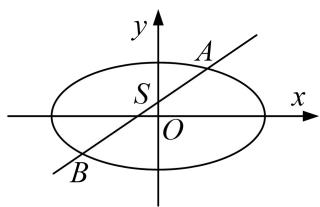

7. 解析 （1） 由 $\left\{ \begin{array}{l} y = x + b, \\ y^2 = 4x, \end{array} \right.$ 消去 $y$ 得， $x^2 + (2b - 4)x + b^2 = 0$

因直线 $y=x+b$ 与抛物线 $y^{2}=4x$ 相切， $\Delta=(2b-4)^{2}-4b^{2}=0,\quad\therefore b=1,$
$e = \frac {c}{a} = \frac {\sqrt {2}}{2}, a ^ {2} = b ^ {2} + c ^ {2}, \therefore \frac {a ^ {2} - b ^ {2}}{a ^ {2}} = \frac {1}{2}, a ^ {2} = 2,$
故所求椭圆方程为 $\frac{x^{2}}{2}+y^{2}=1$ .  
（2）赋值法
当 l 与 x 轴平行时，以 AB 为直径的圆的方程： $x^{2}+(y+\frac{1}{3})^{2}=(\frac{4}{3})^{2}$ .
当 l 与 x 轴垂直时，以 AB 为直径的圆的方程： $x^{2}+y^{2}=1$ ，
由 $\left\{\begin{aligned}x^{2}+(y+\frac{1}{3})^{2}&=(\frac{4}{3})^{2},\\ x^{2}+y^{2}&=1,\end{aligned}\right.$ 解得 $\left\{\begin{aligned}x&=0,\\ y&=1,\end{aligned}\right.$ 因此，所求的T如果存在，只能是 $T(0,1)$ .
证明：①当直线 L 与 x 轴垂直时，以 AB 为直径的圆过点 $T(0, 1)$ .

②当直线 L 与 x 轴不垂直时，设直线 L: $y=kx-\frac{1}{3}$ ,
由 $\left\{\begin{aligned}y&=kx-\frac{1}{3},\\ \frac{x^{2}}{2}+y^{2}&=1,\end{aligned}\right.$ 消去 y 得， $(9+18k^{2})x^{2}-12kx-16=0,$
设点 $A(x_{1}, y_{1})$ ， $B(x_{2}, y_{2})$ ，则 $x_{1} + x_{2} = \frac{12k}{9 + 18k^{2}}$ ， $x_{1}x_{2} = \frac{-16}{9 + 18k^{2}}$
又∵ $\overrightarrow{TA}=(x_{1},y_{1}-1)$ ， $\overrightarrow{TB}=(x_{2},y_{2}-1)$ .
$\overrightarrow {T A} \cdot \overrightarrow {T B} = x _ {1} x _ {2} + (y _ {1} - 1) (y _ {2} - 1) = x _ {1} x _ {2} + (k x _ {1} - \frac {4}{3}) (k x _ {2} - \frac {4}{3})$
$= (k ^ {2} + 1) x _ {1} x _ {2} - \frac {4}{3} k (x _ {1} + x _ {2}) + \frac {6}{1 9} = (k ^ {2} + 1) \frac {- 1 6}{9 + 1 8 k ^ {2}} - \frac {4}{3} k \frac {1 2 k}{9 + 1 8 k ^ {2}} + \frac {6}{1 9} = 0.$
所以 $\overrightarrow{TA}\perp\overrightarrow{TB}$ ，即以AB为直径的圆恒过 $T(0,1)$ .
综上所述，存在点 $T(0, 1)$ 满足条件.

8. 如图，在平面直角坐标系 $xOy$ 中，离心率为 $\frac{\sqrt{2}}{2}$ 的椭圆 $C: \frac{x^2}{a^2} + \frac{y^2}{b^2} = 1 (a > b > 0)$ 的左顶点为 $A$ ，过原点

O 的直线(与坐标轴不重合)与椭圆 C 交于 P, O 两点，直线 PA, QA 分别与 y 轴交于 M, N 两点，当直线 PQ 的斜率为 $\frac{\sqrt{2}}{2}$ 时， $|PQ|=2\sqrt{3}$ .  
（1）求椭圆 C 的标准方程;  
（2）试问以 MN 为直径的圆是否过定点(与 PQ 的斜率无关)? 请证明你的结论.

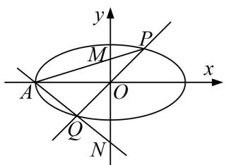

8. 解析 （1）由 $k_{PQ} = \frac{\sqrt{2}}{2}$ 可得， $PQ: y = \frac{\sqrt{2}}{2} x, \therefore P(x_0, \frac{\sqrt{2}}{2} x_0)$ ，由对称性可知， $|OP| = \frac{1}{2} |PQ| = \sqrt{3}$ ，
$\therefore \sqrt{x_0^2 + (\frac{\sqrt{2}}{2} x_0)^2} = \sqrt{3}, \therefore x_0 = \sqrt{2}, \therefore P(\sqrt{2}, 1)$ ，由 $e = \frac{\sqrt{2}}{2}$ 可得， $a: b: c = \sqrt{2}: 1: 1$
∴椭圆方程为 $\frac{x^{2}}{2b^{2}}+\frac{y^{2}}{b^{2}}=1$ ，代入 $P(\sqrt{2},1)$ ，可得， $b^{2}=2,\quad a^{2}=4,\quad\therefore C:\frac{x^{2}}{4}+\frac{y^{2}}{2}=1$ .  
（2）方程法
设 $P(x_{0}, y_{0})$ ，由对称性可知 $Q(-x_{0}, -y_{0})$ ，由（1）可知 $A(-2, 0)$ ,
设 AP: $y=k(x+2)$ ，联立直线与椭圆方程： $\left\{\begin{aligned}x^{2}+2y^{2}=4,\\ y=k(x+2),\end{aligned}\right.$ 消去 y 得 $x^{2}+2k^{2}(x+2)^{2}-4=0$ ,

整理可得： $(1+2k^{2})x^{2}+8k^{2}x+8k^{2}-4=0$ ，所以 $x_{A}x_{0}=\frac{8k^{2}-4}{1+2k^{2}}$ ，即 $x_{0}=\frac{2-4k^{2}}{1+2k^{2}}$ .
代入 $y=k(x+2)$ 可得， $y_{0}=k(\frac{2-4k^{2}}{1+2k^{2}}+2)=\frac{4k}{1+2k^{2}}$ ，所以 $P(\frac{2-4k^{2}}{1+2k^{2}},\frac{4k}{1+2k^{2}})$ ,
从而 $Q(-\frac{2-4k^{2}}{1+2k^{2}}, -\frac{4k}{1+2k^{2}})$ ，所以 $k_{AQ}=\frac{0-(-\frac{4k}{1+2k^{2}})}{-2-(-\frac{2-4k^{2}}{1+2k^{2}})}=\frac{\frac{4k}{1+2k^{2}}}{\frac{-8k^{2}}{1+2k^{2}}}=-\frac{1}{2k}$
∴AQ: $y=-\frac{1}{2k}(x+2)$ ，因为 M, N 是直线 PA, QA 与轴的交点，∴ $M(0, 2k)$ , $N(0, -\frac{1}{k})$ ,
∴以 MN 为直径的圆的圆心为 $(0, \frac{2k^{2}-1}{2k})$ ，半径 $r = \left| \frac{2k^{2} + 1}{2k} \right|$ ,
∴圆方程为 $x^{2}+(y-\frac{2k^{2}-1}{2k})^{2}=(\frac{2k^{2}+1}{2k})^{2}$ ,

整理可得： $x^{2}+y^{2}-\frac{2k^{2}-1}{k}y+(\frac{2k^{2}-1}{2k})^{2}=(\frac{2k^{2}+1}{2k})^{2},\quad\therefore x^{2}+y^{2}-\frac{2k^{2}-1}{k}y=2,$
所以令 y=0，解得 $x=\pm\sqrt{2}$ ，∴以 MN 为直径的圆恒过 $(\pm\sqrt{2},0)$ .

