# 专题 18 斜率型定值型问题

# 定值问题——巧妙消参

定值问题就是证明一个量与其中的变化因素无关，这些变化的因素可能是直线的斜率、截距，也可能是动点的坐标等，这类问题的一般解法是使用变化的量表达求证目标，通过运算求证目标的取值与变化的量无关。当使用直线的斜率和截距表达直线方程时，在解题过程中要注意建立斜率和截距之间的关系，把双参数问题化为单参数问题解决。

# 题型一 斜率问题

# 【例题选讲】

[例 1] 已知椭圆 C: $\frac{x^{2}}{a^{2}}+\frac{y^{2}}{b^{2}}=1(a>b>0)$ 的离心率为 $\frac{\sqrt{3}}{2}$ ，且过点 A(2, 1).  
（1）求椭圆 C 的方程;  
（2）若 $P, Q$ 是椭圆 $C$ 上的两个动点，且使 $\angle PAQ$ 的角平分线总垂直于 $x$ 轴，试判断直线 $PQ$ 的斜率是否为定值？若是，求出该值；若不是，说明理由.

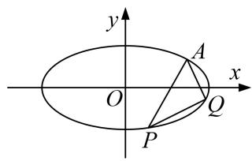

[规范解答] （1）因为椭圆 C 的离心率为 $\frac{\sqrt{3}}{2}$ ，且过点 A(2, 1)，
所以 $\frac{4}{a^{2}}+\frac{1}{b^{2}}=1,\quad\frac{c}{a}=\frac{\sqrt{3}}{2}.$ 因为 $a^{2}=c^{2}+b^{2}$ ，解得 $b^{2}=2,\quad a^{2}=8$
所以椭圆 C 的方程为 $\frac{x^{2}}{8} + \frac{y^{2}}{2} = 1$ .  
（2）因为 $\angle PAQ$ 的角平分线总垂直于 x 轴，所以 PA 与 AQ 所在直线关于直线 x=2 对称.
设直线 PA 的斜率为 k，则直线 AQ 的斜率为 -k.
所以直线 PA 的方程为 $y-1=k(x-2)$ ，直线 AQ 的方程为 $y-1=-k(x-2)$ .
设点 $P(x_{1}, y_{1})$ , $Q(x_{2}, y_{2})$ ，由 $\left\{\begin{aligned}x^{2}+4y^{2}&=8,\\ y=k(x-2)+1,\end{aligned}\right.$
消去 y 得 $(1+4k^{2})x^{2}-8(2k^{2}-k)x+16k^{2}-16k-4=0$ ，①
因为点 $A(2,1)$ 在椭圆 C 上，所以 x=2 是方程①的一个根，
$2x_{1}=\frac{16k^{2}-16k-4}{1+4k^{2}}$ ，即 $x_{1}=\frac{8k^{2}-8k-2}{1+4k^{2}}$ 。同理 $x_{2}=\frac{8k^{2}+8k-2}{1+4k^{2}}$ 。
所以 $x_{1}-x_{2}=-\frac{16k}{1+4k^{2}}$ . 又 $y_{1}-y_{2}=k(x_{1}+x_{2})-4k=k\cdot\frac{16k^{2}-4}{1+4k^{2}}-4k=-\frac{8k}{1+4k^{2}}$ ,
所以直线 PQ 的斜率为 $k_{PQ}=\frac{y_{1}-y_{2}}{x_{1}-x_{2}}=\frac{1}{2}$ . 所以直线 PQ 的斜率为定值，该值为 $\frac{1}{2}$ .

[例 2] 已知椭圆 C: $\frac{x^{2}}{a^{2}}+\frac{y^{2}}{b^{2}}=1(a>b>0)$ 的离心率为 $\frac{1}{2}$ ，右焦点为 F，右顶点为 E，P 为直线 $x=\frac{5}{4}a$ 上的

任意一点，且 $(\overrightarrow{PF} +\overrightarrow{PE})\cdot \overrightarrow{EF} = 2.$  
（1）求椭圆 C 的方程;  
（2） 过 $F$ 且垂直于 $x$ 轴的直线 $AB$ 与椭圆交于 $A, B$ 两点 (点 $A$ 在第一象限), 动直线 $l$ 与椭圆 $C$ 交于 $M, N$ 两点, 且 $M, N$ 位于直线 $AB$ 的两侧, 若始终保持 $\angle MAB = \angle NAB$ , 求证: 直线 $MN$ 的斜率为定值.

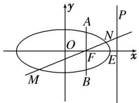

[规范解答] （1） 设 $P\left(\frac{5}{4}a, t\right)$ , $F(c, 0)$ , $E(a, 0)$ ,
则 $\overrightarrow{PF} = \left(c - \frac{5}{4} a, -t\right), \overrightarrow{PE} = \left(-\frac{a}{4}, -t\right), \overrightarrow{EF} = (c - a, 0)$ ,
所以 $(\overrightarrow{PF} +\overrightarrow{PE})\cdot \overrightarrow{EF} = \left(c - \frac{3}{2} a, - 2t\right)\cdot (c - a,0) = 2$ ，即 $\left(c - \frac{3}{2} a\right)\cdot (c - a) = 2$ ，又 $e = \frac{c}{a} = \frac{1}{2},$
所以 a=2, c=1, $b=\sqrt{3}$ ，从而椭圆 C 的方程为 $\frac{x^{2}}{4}+\frac{y^{2}}{3}=1$ .  
（2）由（1）知 $A\left(1, \frac{3}{2}\right)$ , 设 $M(x_1, y_1), N(x_2, y_2)$ , 设 $MN$ 的方程: $y = kx + m$ , 代入椭圆方程 $\frac{x^2}{4} + \frac{y^2}{3} = 1$ ,
得 $(4k^{2} + 3)x^{2} + 8kmx + 4m^{2} - 12 = 0$ ，所以 $x_{1} + x_{2} = -\frac{8km}{4k^{2} + 3}, x_{1}x_{2} = \frac{4m^{2} - 12}{4k^{2} + 3}$
又 M, N 是椭圆上位于直线 AB 两侧的动点，若始终保持 $\angle MAB = \angle NAB$ ,
则 $k_{AM} + k_{AN} = 0$ ，即 $\frac{y_{1}-\frac{3}{2}}{x_{1}-1} + \frac{y_{2}-\frac{3}{2}}{x_{2}-1} = 0$ ， $\left(kx_{1} + m - \frac{3}{2}\right)(x_{2} - 1) + \left(kx_{2} + m - \frac{3}{2}\right)(x_{1} - 1) = 0$ ，
即 $(2k-1)(2m+2k-3)=0$ ，得 $k=\frac{1}{2}$ 。故直线MN的斜率为定值 $\frac{1}{2}$ 。

[例 3] 如图所示，抛物线关于 x 轴对称，它的顶点在坐标原点，点 $P(1, 2)$ ， $A(x_{1}, y_{1})$ ， $B(x_{2}, y_{2})$ 均在抛物线上.  
（1）求抛物线的方程及其准线方程;  
（2）当 PA 与 PB 的斜率存在且倾斜角互补时，证明：直线 AB 的斜率为定值.

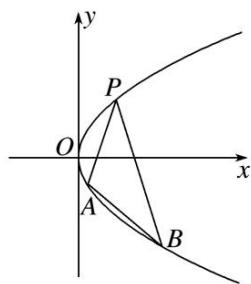

[规范解答] （1）由题意可设抛物线的方程为 $y^{2}=2px(p>0)$ . 则由点 $P(1,2)$ 在抛物线上，得 $2^{2}=2p\times1$ ，解得 p=2，故所求抛物线的方程是 $y^{2}=4x$ ，准线方程是 x=-1.  
（2）因为 PA 与 PB 的斜率存在且倾斜角互补，所以 $k_{PA} = -k_{PB}$ ，即 $\frac{y_{1}-2}{x_{1}-1} = -\frac{y_{2}-2}{x_{2}-1}$ .
又 $A(x_{1},y_{1}),B(x_{2},y_{2})$ 均在抛物线上，所以 $x_{1} = \frac{y_{1}^{2}}{4},x_{2} = \frac{y_{2}^{2}}{4}$ 从而 $\frac{y_1 - 2}{\frac{y_1^2}{4} - 1} = -\frac{y_2 - 2}{\frac{y_2^2}{4} - 1},$
即 $\frac{4}{y_1 + 2} = -\frac{4}{y_2 + 2}$ ，得 $y_{1} + y_{2} = -4$ ，故直线 $AB$ 的斜率 $k_{AB} = \frac{y_1 - y_2}{x_1 - x_2} = \frac{4}{y_1 + y_2} = -1$ ，为定值.

[例 4] 如图，在平面直角坐标系 xOy 中，椭圆 E: $\frac{x^{2}}{a^{2}} + \frac{y^{2}}{b^{2}} = 1 (a > b > 0)$ 的离心率为 $\frac{\sqrt{2}}{2}$ ，直线 l: $y = \frac{1}{2}x$ 与椭圆 E 相交于 A, B 两点， $AB = 4\sqrt{5}$ ，C, D 是椭圆 E 上异于 A, B 两点，且直线 AC, BD 相交于点 M，直线 AD, BC 相交于点 N.  
（1）求 a, b 的值;  
（2）求证：直线 MN 的斜率为定值.

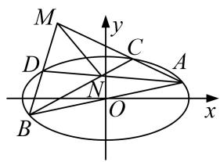

[规范解答] （1） 因为 $e=\frac{c}{a}=\frac{\sqrt{2}}{2}$ ，所以 $c^{2}=\frac{1}{2}a^{2}$ ，即 $a^{2}-b^{2}=\frac{1}{2}a^{2}$ ，所以 $a^{2}=2b^{2}$ ;
故椭圆方程为 $\frac{x^2}{2b^2} +\frac{y^2}{b^2} = 1$ ；由题意，不妨设点 $A$ 在第一象限，点 $B$ 在第三象限，
由 $\left\{ \begin{array}{l} y = \frac{1}{2} x \\ \frac{x^2}{2b^2} + \frac{y^2}{b^2} = 1 \end{array} \right.$ 解得 $A\left(\frac{2\sqrt{3}}{2} b, \frac{\sqrt{3}}{3} b\right)$ ; 又 $AB = 4\sqrt{5}$ , 所以 $OA = 2\sqrt{5}$ , 即 $\frac{4}{3} b^2 + \frac{1}{3} b^2 = 20$ , 解得 $b^2 = 12$ . 故 $a = 2\sqrt{6}, b = 2\sqrt{3}$ ;  
（2）由（1）知，椭圆 E 的方程为 $\frac{x^{2}}{24} + \frac{y^{2}}{12} = 1$ ，从而 $A(4, 2)$ ， $B(-4, -2)$ ;

①当 CA, CB, DA, DB 斜率都存在时，设直线 CA, DA 的斜率分别为 $k_{1}$ , $k_{2}$ , $C(x_{0}, y_{0})$ ,
显然 $k_{1} \neq k_{2}$ ; $k_{1}k_{BC} = \frac{y_{0}-2}{x_{0}-4}\frac{y_{0}+2}{x_{0}+4} = \frac{y_{0}^{2}-4}{x_{0}^{2}-16} = \frac{8-\frac{x_{0}^{2}}{2}}{x_{0}^{2}-16} = -\frac{1}{2}$ ，所以 $k_{BC} = -\frac{1}{2k_{1}}$ ; 同理 $k_{DB} = -\frac{1}{2k_{2}}$ ,
于是直线 AD 的方程为 $y-2=k_{2}(x-4)$ ，直线 BC 的方程为 $y+2=-\frac{1}{2k_{1}}(x+4)$ ;
$\therefore \left\{ \begin{array}{l} y + 2 = -\frac{1}{2k_1}(x + 4) \\ y - 2 = k_2(x - 4) \end{array} \right.$ ，解得 $\left\{ \begin{array}{l} x = \frac{8k_1k_2 - 8k_1 - 4}{2k_1k_2 + 1} \\ y = \frac{-4k_1k_2 - 8k_2 + 2}{2k_1k_2 + 1} \end{array} \right.$ ，
从而点 N 的坐标为 $\left(\frac{8k_{1}k_{2}-8k_{1}-4}{2k_{1}k_{2}+1},\frac{-4k_{1}k_{2}-8k_{2}+2}{2k_{1}k_{2}+1}\right)$ ,

用 $k_{2}$ 代 $k_{1}$ ， $k_{1}$ 代 $k_{2}$ 得点 M 的坐标为 $\left(\frac{8k_{1}k_{2}-8k_{2}-4}{2k_{1}k_{2}+1},\frac{-4k_{1}k_{2}-8k_{1}+2}{2k_{1}k_{2}+1}\right)$ ;
$\therefore k _ {M N} = \frac {\frac {- 4 k _ {1} k _ {2} - 8 k _ {2} + 2}{2 k _ {1} k _ {2} + 1} - \frac {- 4 k _ {1} k _ {2} - 8 k _ {1} + 2}{2 k _ {1} k _ {2} + 1}}{\frac {8 k _ {1} k _ {2} - 8 k _ {1} - 4}{2 k _ {1} k _ {2} + 1} - \frac {8 k _ {1} k _ {2} - 8 k _ {2} - 4}{2 k _ {1} k _ {2} + 1}} = \frac {8 (k _ {1} - k _ {2})}{8 (k _ {2} - k _ {1})} = - 1.$
即直线 MN 的斜率为定值 -1;

②当 $CA, CB, DA, DB$ 中，有直线的斜率不存在时，根据题设要求，至多有一条直线斜率不存在，故不妨设直线 $CA$ 的斜率不存在，从而 $C(4, -2)$ ；仍然设 $DA$ 的斜率为 $k_{2}$ ，由①知 $k_{DB} = -\frac{1}{2k_{2}}$ ；此时 $CA: x = 4, DB: y + 2 = -\frac{1}{2k_{2}} (x + 4)$ ，它们交点 $M(4, -\frac{4}{k_{2}} - 2)$ ；
BC: y = -2, AD: $y - 2 = k_{2}(x - 4)$ ，它们交点 $N(4 - \frac{4}{k_{2}}, -2)$ ，从而 $k_{MN} = -1$ 也成立；
由①②可知，直线 MN 的斜率为定值 -1；
# 【对点训练】

1. 已知椭圆 $C$ 的中心在原点，离心率等于 $\frac{1}{2}$ ，它的一个短轴端点恰好是抛物线 $x^{2} = 8\sqrt{3} y$ 的焦点.  
（1）求椭圆 C 的方程;  
（2）如图，已知 $P(2, 3)$ ， $Q(2, -3)$ 是椭圆上的两点，A，B 是椭圆上位于直线 PQ 两侧的动点.

①若直线 AB 的斜率为 $\frac{1}{2}$ ，求四边形 APBQ 面积的最大值；
②当 A, B 运动时，满足 $\angle APQ = \angle BPQ$ ，试问直线 AB 的斜率是否为定值？请说明理由.

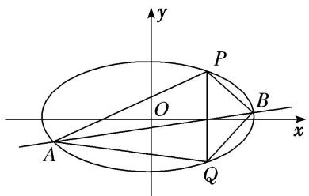

1. 解析 （1）设椭圆 $C$ 的方程为 $\frac{x^2}{a^2} + \frac{y^2}{b^2} = 1 (a > b > 0)$ ， $\because$ 抛物线的焦点为 $(0, 2\sqrt{3})$ 。 $\therefore b = 2\sqrt{3}$ .
由 $\frac{c}{a}=\frac{1}{2}$ ， $a^{2}=c^{2}+b^{2}$ ，得a=4，∴椭圆C的方程为 $\frac{x^{2}}{16}+\frac{y^{2}}{12}=1$ .  
（2）设 $A(x_{1}, y_{1})$ ， $B(x_{2}, y_{2})$ 。①设直线 AB 的方程为 $y=\frac{1}{2}x+t$ ，代入 $\frac{x^{2}}{16}+\frac{y^{2}}{12}=1$ ，得 $x^{2}+tx+t^{2}-12=0$ ，由 $\Delta>0$ ，解得 -4<t<4，∴ $x_{1}+x_{2}=-t$ ， $x_{1}x_{2}=t^{2}-12$ ，
$\therefore | x _ {1} - x _ {2} | = \sqrt {(x _ {1} + x _ {2}) ^ {2} - 4 x _ {1} x _ {2}} = \sqrt {t ^ {2} - 4 (t ^ {2} - 1 2)} = \sqrt {4 8 - 3 t ^ {2}}.$
∴四边形 APBQ 的面积 $S=\frac{1}{2}\times6\times|x_{1}-x_{2}|=3\sqrt{48-3t^{2}}$ . ∴当 t=0 时，S 取得最大值，且 $S_{max}=12\sqrt{3}$ .

②若 $\angle APQ = \angle BPQ$ ，则直线 PA，PB 的斜率之和为 0，设直线 PA 的斜率为 k，则直线 PB 的斜率为 -k，直线 PA 的方程为 $y - 3 = k(x - 2)$ ，由 $\left\{\begin{aligned}y - 3 &= k(x - 2),\\ \frac{x^{2}}{16} + \frac{y^{2}}{12} &= 1\end{aligned}\right.$ 消去 y，
得 $(3 + 4k^{2})x^{2} + 8k(3 - 2k)x + 4(3 - 2k)^{2} - 48 = 0,\therefore x_{1} + 2 = \frac{8k(2k - 3)}{3 + 4k^{2}},$
将 k 换成 -k 可得 $x_{2}+2=\frac{-8k(-2k-3)}{3+4k^{2}}=\frac{8k(2k+3)}{3+4k^{2}}$ ，∴ $x_{1}+x_{2}=\frac{16k^{2}-12}{3+4k^{2}}$ ， $x_{1}-x_{2}=\frac{-48k}{3+4k^{2}}$
∴ $k_{AB}=\frac{y_{1}-y_{2}}{x_{1}-x_{2}}=\frac{k(x_{1}-2)+3+k(x_{2}-2)-3}{x_{1}-x_{2}}=\frac{k(x_{1}+x_{2})-4k}{x_{1}-x_{2}}=\frac{1}{2}$ ，∴ 直线 AB 的斜率为定值 $\frac{1}{2}$ .

2. 已知直线 $l$ 经过椭圆 $C: \frac{x^2}{a^2} + \frac{y^2}{b^2} = 1 (a > b > 0)$ 的左焦点和下顶点，坐标原点 $O$ 到直线 $l$ 的距离为 $\frac{a}{2}$ .  
（1）求椭圆 C 的离心率;  
（2）若椭圆 C 经过点 $P(2,1)$ ，点 A，B 是椭圆 C 上的两个动点，且 $\angle APB$ 的角平分线总是垂直于 y 轴，试问：直线 AB 的斜率是否为定值？若是，求出该定值；若不是，请说明理由。

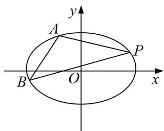

2. 解析 （1） 过点 $(-c, 0)$ ， $(0, -b)$ 的直线 l 的方程为 $bx + cy + bc = 0$ ，
则坐标原点 O 到直线 l 的距离为 $d=\frac{bc}{\sqrt{b^{2}+c^{2}}}=\frac{bc}{a}=\frac{a}{2}$ ,
可得 $a^2 = 2bc$ ， $\therefore a^4 = 4(a^2 -c^2)c^2$ ， $\therefore 4e^{4} - 4e^{2} + 1 = 0$ ，解得 $e = \frac{\sqrt{2}}{2}$  
（2）由（1）易知 $a = \sqrt{2} b$ ，则椭圆 $C: \frac{x^2}{2b^2} + \frac{y^2}{b^2} = 1$ 经过点 $P(2, 1)$ ，
解得 $b^{2}=3$ ，则椭圆 C: $\frac{x^{2}}{6}+\frac{y^{2}}{3}=1$ .
因为 $\angle APB$ 的角平分线总垂直于 $y$ 轴，所以 $AP$ 与 $BP$ 所在直线关于直线 $y = 1$ 对称.
则 $k_{AP} = -k_{BP}$ ，设直线 AP 的斜率为 k，则直线 BP 的斜率为 -k.
所以直线 PA 的方程为 $y-1=k(x-2)$ ，直线 BP 的方程为 $y-1=-k(x-2)$ .
设点 $A(x_{1}, y_{1})$ ， $B(x_{2}, y_{2})$ ，由 $\left\{\begin{aligned}\frac{x^{2}}{6}+\frac{y^{2}}{3}&=1,\\ y=k(x-2)+1,\end{aligned}\right.$
消去 y 得 $(1+2k^{2})x^{2}+4(k-2k^{2})x+8k^{2}-8k-4=0$ ,
因为点 $P(2,1)$ 在椭圆 $C$ 上，则有 $2x_{1} = \frac{8k^{2} - 8k - 4}{1 + 2k^{2}}$ ，即 $x_{1} = \frac{4k^{2} - 4k - 2}{1 + 2k^{2}}$ 同理 $x_{2} = \frac{4k^{2} + 4k - 2}{1 + 2k^{2}}$
所以 $x_{1}-x_{2}=-\frac{8k}{1+2k^{2}}$ . 又 $y_{1}-y_{2}=k(x_{1}+x_{2})-4k=-\frac{8k}{1+2k^{2}}$ ,
所以直线 $AB$ 的斜率为 $k_{AB} = \frac{y_1 - y_2}{x_1 - x_2} = 1$ 。所以直线 $AB$ 的斜率为定值，该值为 1.

3. 已知椭圆 $C: \frac{x^2}{a^2} + \frac{y^2}{b^2} = 1 (a > b > 0)$ 的离心率为 $\frac{\sqrt{3}}{2}$ ，且过点 $P(2, -1)$ .  
（1）求椭圆 C 的标准方程;  
（2）设点 $Q$ 在椭圆 $C$ 上，且 $PQ$ 与 $x$ 轴平行，过 $P$ 点作两条直线分别交椭圆 $C$ 于 $A(x_{1}, y_{1})$ ， $B(x_{2}, y_{2})$ 两点，若直线 $PQ$ 平分 $\angle APB$ ，求证：直线 $AB$ 的斜率是定值，并求出这个定值.

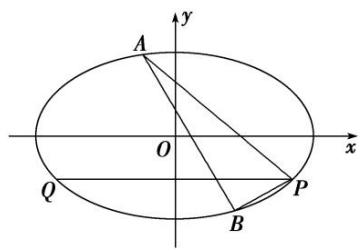

3. 解析 （1） 因为椭圆 $C$ 的离心率为 $\frac{c}{a} = \frac{\sqrt{3}}{2}$ , 所以 $\frac{a^2 - b^2}{a^2} = \frac{3}{4}$ , 即 $a^2 = 4b^2$ ,
所以椭圆 C 的方程可化为 $x^{2}+4y^{2}=4b^{2}$ ,
又椭圆 C 过点 $P(2, -1)$ ，所以 $4+4=4b^{2}$ ，解得 $b^{2}=2,\ a^{2}=8$ ，
所以椭圆 C 的标准方程为 $\frac{x^{2}}{8} + \frac{y^{2}}{2} = 1$ .  
（2）由题意，知直线 PA，PB 的斜率均存在且不为 0，设直线 PA 的方程为 $y+1=k(x-2)(k\neq0)$ ,
联立方程，得 $\left\{ \begin{array}{l} x^2 + 4y^2 = 8, \\ y = k(x - 2) - 1, \end{array} \right.$ 消去 $y$ 得 $(1 + 4k^2)x^2 - 8(2k^2 + k)x + 16k^2 + 16k - 4 = 0,$
所以 $2x_{1}=\frac{16k^{2}+16k-4}{1+4k^{2}}$ ，即 $x_{1}=\frac{8k^{2}+8k-2}{1+4k^{2}}$ .
因为直线 PQ 平分 $\angle APB$ ，且 PQ 与 x 轴平行，所以直线 PA 与直线 PB 的斜率互为相反数，则直线 PB 的方程为 $y+1=-k(x-2)(k\neq0)$ ，同理可得 $x_{2}=\frac{8k^{2}-8k-2}{1+4k^{2}}$ .
又 $\left\{\begin{aligned}y_{1}+1&=k(x_{1}-2),\\ y_{2}+1&=-k(x_{2}-2)\end{aligned}\right.$ 所以 $y_{1}-y_{2}=k(x_{1}+x_{2})-4k,$
即 $y_{1}-y_{2}=k(x_{1}+x_{2})-4k=k\cdot\frac{16k^{2}-4}{1+4k^{2}}-4k=-\frac{8k}{1+4k^{2}},\quad x_{1}-x_{2}=\frac{16k}{1+4k^{2}}.$
所以直线 AB 的斜率 $k_{AB}=\frac{y_{1}-y_{2}}{x_{1}-x_{2}}=\frac{-\frac{8k}{1+4k^{2}}}{\frac{16k}{1+4k^{2}}}=-\frac{1}{2}$ ，为定值.

4. 已知椭圆 $C: \frac{x^2}{a^2} + \frac{y^2}{b^2} = 1 (a > b > 0)$ 的离心率为 $\frac{\sqrt{3}}{2}$ ，且 $C$ 过点 $\left(1, \frac{\sqrt{3}}{2}\right)$ .  
（1）求椭圆 C 的方程;  
（2）若直线 l 与椭圆 C 交于 P, Q 两点(点 P, Q 均在第一象限), 且直线 OP, l, OQ 的斜率成等比数列, 证明: 直线 l 的斜率为定值.

4. 解析 （1）由题意可得 $\left\{ \begin{array}{l} c = \frac{\sqrt{3}}{2}, \\ \frac{1}{a^2} + \frac{3}{4b^2} = 1, \\ a^2 = b^2 + c^2, \end{array} \right.$ 解得 $\left\{ \begin{array}{l} a = 2, \\ b = 1, \end{array} \right.$ 故椭圆 $C$ 的方程为 $\frac{x^2}{4} + y^2 = 1$ .  
（2）由题意可知直线 l 的斜率存在且不为 0，设直线 l 的方程为 $y=kx+m(m\neq0)$ ,
由 $\left\{\begin{aligned}y&=kx+m,\\ \frac{x^{2}}{4}+y^{2}&=1,\end{aligned}\right.$ 消去 y，整理得 $(1+4k^{2})x^{2}+8kmx+4(m^{2}-1)=0$
∵ 直线 l 与椭圆交于两点，∴ $\Delta = 64k^{2}m^{2} - 16(1 + 4k^{2})(m^{2} - 1) = 16(4k^{2} - m^{2} + 1) > 0$ .
设点 P, Q 的坐标分别为 $(x_{1}, y_{1})$ , $(x_{2}, y_{2})$ ，则 $x_{1} + x_{2} = \frac{-8km}{1 + 4k^{2}}$ , $x_{1}x_{2} = \frac{4(m^{2} - 1)}{1 + 4k^{2}}$ ,
$\therefore y _ {1} y _ {2} = \left(k x _ {1} + m\right) \left(k x _ {2} + m\right) = k ^ {2} x _ {1} x _ {2} + k m \left(x _ {1} + x _ {2}\right) + m ^ {2}.$
∵ 直线 OP, l, OQ 的斜率成等比数列，∴ $k^{2}=\frac{y_{2}}{x_{2}}\cdot\frac{y_{1}}{x_{1}}=\frac{k^{2}x_{1}x_{2}+km(x_{1}+x_{2})+m^{2}}{x_{1}x_{2}}$ ,
整理得 $km(x_{1}+x_{2})+m^{2}=0,\quad\therefore\frac{-8k^{2}m^{2}}{1+4k^{2}}+m^{2}=0,$ 又 $m\neq0,\quad\therefore k^{2}=\frac{1}{4},$

结合图象(图略)可知 $k=-\frac{1}{2}$ ，故直线 l 的斜率为定值.

5. 已知椭圆 $C: \frac{x^2}{a^2} + \frac{y^2}{b^2} = 1 (a > b > 0)$ , $c = \sqrt{3}$ , 左、右焦点为 $F_1, F_2$ , 点 $P, A, B$ 在椭圆 $C$ 上, 且点 $A, B$ 关于原点对称, 直线 $PA, PB$ 的斜率的乘积为 $-\frac{1}{4}$ .  
（1）求椭圆 C 的方程;  
（2）已知直线 l 经过点 $Q(2, 2)$ ，且与椭圆 C 交于不同的两点 M，N，若 $|QM||QN| = \frac{16}{3}$ ，判断直线 l 的斜率是否为定值？若是，请求出该定值；若不是，请说明理由.

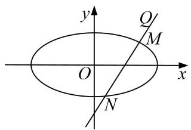

5. 解析 （1）由题意知， $k_{PA}k_{PB}=-\frac{b^{2}}{a^{2}}=-\frac{1}{4}$ ，又 $c=\sqrt{3}$ ， $a^{2}=c^{2}+b^{2}$ ，可得 $a^{2}=4$ ， $b^{2}=1$ 。
∴椭圆 C 的方程为 $\frac{x^{2}}{4} + y^{2} = 1$ .  
（2）设直线 l 的方程为： $y-2=k(x-2)$ ,
将其代入 $\frac{x^2}{4} + y^2 = 1$ ，消去 $y$ 得， $(1 + 4k^2)x^2 + 16k(1 - k)x + 16(1 - k)^2 - 4 = 0$
则 $\Delta=[16k(1-k)]^{2}-4(1+4k^{2})[16(1-k)^{2}-4]>0$ ，解得， $k>\frac{3}{8}$ .
设设 $M(x_{1}, y_{1})$ ， $N(x_{2}, y_{2})$ ，则 $x_{1} + x_{2} = \frac{16k(k-1)}{1 + 4k^{2}}$ ， $x_{1}x_{2} = \frac{4(4k^{2} - 8k + 3)}{1 + 4k^{2}}$
又 $|QM||QN|=\frac{16}{3},\therefore|QM||QN|=\sqrt{1+k^{2}}\cdot|x_{1}-2|\cdot\sqrt{1+k^{2}}\cdot|x_{2}-2|=(1+k^{2})(x_{1}x_{2}-2(x_{1}+x_{2})+4)=\frac{16}{3},$
$\therefore \left[\frac{4(4k^2 - 8k + 3)}{1 + 4k^2} - 2 \times \frac{16k(k - 1)}{1 + 4k^2} + 4\right] = \frac{16}{3}$ ，化简得， $\frac{16(k^2 + 1)}{1 + 4k^2} = \frac{16}{3}$ ，解得， $k = \sqrt{2}$ .
∴直线 l 的斜率为定值 $\sqrt{2}$ .

# 题型二 斜率之和问题

# 【例题选讲】

[例 5] 已知椭圆 C: $\frac{x^{2}}{a^{2}} + \frac{y^{2}}{b^{2}} = 1 (a > b > 0)$ 的离心率为 $\frac{\sqrt{3}}{2}$ ，且过点 M(4, 1).  
（1）求椭圆 C 的方程;  
（2）若直线 $l: y = x + m (m \neq 3)$ 与椭圆 $C$ 交于 $P, Q$ 两点，记直线 $MP, MQ$ 的斜率分别为 $k_{1}, k_{2}$ ，试探究 $k_{1} + k_{2}$ 是否为定值，若是，请求出该定值；若不是，请说明理由.

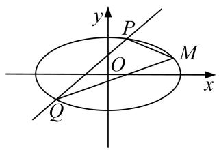

[规范解答] （1）依题意， $\left\{ \begin{array}{l} \frac{c}{a} = \frac{\sqrt{3}}{2}\\ \frac{16}{a^2} +\frac{1}{b^2} = 1\\ a^2 = b^2 +c^2 \end{array} \right.$ ，解得 $a^2 = 20$ ， $b^{2} = 5$ 。故椭圆 $C$ 的方程为 $\frac{x^2}{20} +\frac{y^2}{5} = 1$  
（2） $k_{1}+k_{2}=1$ ，下面给出证明：设 $P(x_{1},y_{1})$ ， $Q(x_{2},y_{2})$
将 $y=x+m$ 代入 $\frac{x^{2}}{20}+\frac{y^{2}}{5}=1$ 并整理得 $5x^{2}+8mx+4m^{2}-20=0$ ,
$\Delta=(8m)^{2}-20(4m^{2}-20)>0$ ，解得-5<m<5，且 $m\neq3$ .
故 $x_{1} + x_{2} = -\frac{8m}{5}, x_{1}\cdot x_{2} = \frac{4m^{2} - 20}{5},$
则 $k_{1}+k_{2}=\frac{y_{1}-1}{x_{1}-4}+\frac{y_{2}-1}{x_{2}-4}=\frac{(y_{1}-1)(x_{2}-4)+(y_{2}-1)(x_{1}-4)}{(x_{1}-4)(x_{2}-4)}=\frac{(x_{1}+m-1)(x_{2}-4)+(x_{2}+m-1)(x_{1}-4)}{(x_{1}-4)(x_{2}-4)}$
$= \frac {2 x _ {1} x _ {2} + (m - 5) \left(x _ {1} + x _ {2}\right)}{\left(x _ {1} - 4\right) \left(x _ {2} - 4\right)} = \frac {\frac {2 \left(4 m ^ {2} - 2 0\right)}{5} - \frac {8 m (m - 5)}{5} - 8 (m - 1)}{\left(x _ {1} - 4\right) \left(x _ {2} - 4\right)} = 0.$
故 $k_{1}+k_{2}$ 为定值，该定值为 0.

[例 6] 已知点 A(1, 0) 和动点 B，以线段 AB 为直径的圆内切于圆 O: $x^{2} + y^{2} = 4$ .  
（1）求动点 B 的轨迹方程;  
（2）已知点 $P(2,0)$ , $Q(2,-1)$ , 经过点 $Q$ 的直线 $l$ 与动点 $B$ 的轨迹交于 $M$ , $N$ 两点, 求证: 直线 $PM$ 与直线 $PN$ 的斜率之和为定值.

[规范解答] （1）如图，设以线段 AB 为直径的圆的圆心为 C，取 $A'(-1, 0)$ .

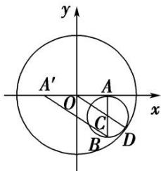
依题意，圆 C 内切于圆 O，设切点为 D，则 O，C，D 三点共线，
∵ O 为 $AA'$ 的中点，C 为 AB 中点，∴ $|A'B|=2|OC|$ .
$\therefore | B A ^ {'} | + | B A | = 2 O C + 2 A C = 2 O C + 2 C D = 2 O D = 4 > | A A ^ {'} | = 2,$
∴动点 B 的轨迹是以 A， $A'$ 为焦点，长轴长为 4 的椭圆，
设其方程为 $\frac{x^{2}}{a^{2}}+\frac{y^{2}}{b^{2}}=1(a>b>0)$ ，则2a=4，2c=2，∴a=2，c=1，∴ $b^{2}=a^{2}-c^{2}=3$ ，
∴动点 B 的轨迹方程为 $\frac{x^{2}}{4} + \frac{y^{2}}{3} = 1$ .  
（2）①当直线 l 垂直于 x 轴时，直线 l 的方程为 x=2，此时直线 l 与椭圆 $\frac{x^{2}}{4}+\frac{y^{2}}{3}=1$ 相切，与题意不符.

②当直线 l 的斜率存在时，设直线 l 的方程为 $y+1=k(x-2)$ .
由 $\left\{\begin{aligned}y+1&=k(x-2)\\ \frac{x^{2}}{4}&+\frac{y^{2}}{3}=1\end{aligned}\right.$ ，消去y整理得， $(4k^{2}+3)x^{2}-(16k^{2}+8k)x+16k^{2}+16k-8=0.$
∵ 直线 l 与椭圆交于 M, N 两点，∴ $\Delta=(16k^{2}+8k)^{2}-4(4k^{2}+3)(16k^{2}+16k-8)>0$ ，解得 $k<\frac{1}{2}$ .
设 $M(x_{1}, y_{1})$ ， $N(x_{2}, y_{2})$ ，则 $x_{1} + x_{2} = \frac{16k^{2} + 8k}{4k^{2} + 3}$ ， $x_{1}x_{2} = \frac{16k^{2} + 16k - 8}{4k^{2} + 3}$
$\therefore k _ {P M} + k _ {P N} = \frac {y _ {1}}{x _ {1} - 2} + \frac {y _ {2}}{x _ {2} - 2} = \frac {k (x _ {1} - 2) - 1}{x _ {1} - 2} + \frac {k (x _ {2} - 2) - 1}{x _ {2} - 2}$
$= \frac {2 k x _ {1} x _ {2} - (4 k + 1) \left(x _ {1} + x _ {2}\right) + 8 k + 4}{x _ {1} x _ {2} - 2 \left(x _ {1} + x _ {2}\right) + 4} = \frac {1 2}{4} = 3 (\text {定值}).$

[例 7] 如图，在平面直角坐标系 xOy 中，椭圆 C: $\frac{x^{2}}{a^{2}} + \frac{y^{2}}{b^{2}} = 1 (a > b > 0)$ 的右焦点为 $F(1, 0)$ ，离心率为 $\frac{\sqrt{2}}{2}$ 。分别过 O, F 的两条弦 AB, CD 相交于点 E (异于 A, C 两点)，且 OE = OF.  
（1）求椭圆的方程;  
（2）求证：直线 AC，BD 的斜率之和为定值.

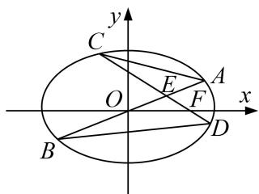

[规范解答] （1）由题意，得 c=1， $e=\frac{\sqrt{2}}{2}$ ，故 $a=\sqrt{2}$ ，从而 b=1。
所以椭圆的方程为 $\frac{x^{2}}{2}+y^{2}=1$ . ①  
（2）设直线 AB 的方程为 y=kx，②，直线 CD 的方程为 $y=-k(x-1)$ ，③
由①②得，点 A，B 的横坐标为 $\pm\frac{\sqrt{2}}{2k^{2}+1}$ ，由①③得，点 C，D 的横坐标为 $\frac{2k^{2}\pm\sqrt{2(k^{2}+1)}}{2k^{2}+1}$ ，

记 $A(x_{1}, kx_{1})$ , $B(x_{2}, kx_{2})$ , $C(x_{3}, k(1-x_{3}))$ , $D(x_{4}, k(1-x_{4}))$ ,
则直线 AC，BD 的斜率之和为 $\frac{kx_{1}-k(1-x_{3})}{x_{1}-x_{3}}+\frac{kx_{2}-k(1-x_{4})}{x_{2}-x_{4}}=k\frac{(x_{1}+x_{3}-1)(x_{2}-x_{4})+(x_{1}-x_{3})(x_{2}+x_{4}-1)}{(x_{1}-x_{3})(x_{2}-x_{4})}$
$= k \frac {2 \left(x _ {1} x _ {2} - x _ {3} x _ {4}\right) - \left(x _ {1} + x _ {2}\right) + \left(x _ {3} + x _ {4}\right)}{\left(x _ {1} - x _ {3}\right) \left(x _ {2} - x _ {4}\right)} = k \frac {2 \left(\frac {- 2}{2 k ^ {2} + 1} - \frac {2 \left(k ^ {2} - 1\right)}{2 k ^ {2} + 1}\right) - 0 + \frac {4 k ^ {2}}{2 k ^ {2} + 1}}{\left(x _ {1} - x _ {3}\right) \left(x _ {2} - x _ {4}\right)} = 0.$

# 【对点训练】

6. 如图，椭圆 $E: \frac{x^2}{a^2} + \frac{y^2}{b^2} = 1 (a > b > 0)$ 经过点 $A(0, -1)$ ，且离心率为 $\frac{\sqrt{2}}{2}$ .  
（1）求椭圆 E 的方程:  
（2）经过点(1, 1)，且斜率为 k 的直线与椭圆 E 交于不同的两点 P，Q(均异于点 A)，证明：直线 AP 与 AO 的斜率之和为定值.

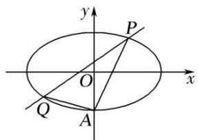

6. 解析 （1）由题设知 $\frac{c}{a}=\frac{\sqrt{2}}{2}$ ，b=1，结合 $a^{2}=b^{2}+c^{2}$ ，解得 $a=\sqrt{2}$ ，所以椭圆的方程为 $\frac{x^{2}}{2}+y^{2}=1$ .  
（2）由题设知，直线 PQ 的方程为 $y=k(x-1)+1(k\neq2)$ ，代入 $\frac{x^{2}}{2}+y^{2}=1$ ，
得 $(1+2k^{2})x^{2}-4k(k-1)x+2k(k-2)=0$ ，由已知 $\Delta>0$ .
设 $P(x_{1}, y_{1})$ ， $Q(x_{2}, y_{2})$ ， $x_{1}x_{2}\neq0$ ，则 $x_{1}+x_{2}=\frac{4k(k-1)}{1+2k^{2}}$ ， $x_{1}x_{2}=\frac{2k(k-2)}{1+2k^{2}}$
从而直线 $AP$ ， $AQ$ 的斜率之和 $k_{AP} + k_{AQ} = \frac{y_1 + 1}{x_1} +\frac{y_2 + 1}{x_2} = \frac{kx_1 + 2 - k}{x_1} +\frac{kx_2 + 2 - k}{x_2}$
$= 2 k + (2 - k) \left(\frac {1}{x _ {1}} + \frac {1}{x _ {2}}\right) = 2 k + (2 - k) \frac {x _ {1} + x _ {2}}{x _ {1} x _ {2}} = 2 k + (2 - k) \frac {4 k (k - 1)}{2 k (k - 2)} = 2 k - 2 (k - 1) = 2.$
故 $k_{AP} + k_{AO}$ 为定值 2.

7. 设 $F_{1}, F_{2}$ 为椭圆 $C: \frac{x^{2}}{4} + \frac{y^{2}}{b^{2}} = 1 (b > 0)$ 的左、右焦点， $M$ 为椭圆上一点，满足 $MF_{1} \perp MF_{2}$ ，已知 $\triangle MF_{1}F_{2}$ 的面积为 1.  
（1）求椭圆 C 的方程:  
（2）设 C 的上顶点为 H，过点 $(2, -1)$ 的直线与椭圆交于 R，S 两点 (异于 H)，求证：直线 HR 和 HS 的斜率之和为定值，并求出这个定值.

7. 解析 （1）由椭圆定义得 $|MF_{1}|+|MF_{2}|=4$ ，①
由 $MF_{1} \perp MF_{2}$ 得 $\left|MF_{1}\right|^{2} + \left|MF_{2}\right|^{2} = \left|F_{1}F_{2}\right|^{2} = 4(4 - b^{2})$ ，②
由题意得 $S_{\triangle MF1F2}=\frac{1}{2}|MF_{1}|\cdot|MF_{2}|=1$ ，③
由①②③，可得 $b^{2}=1$ ，所以椭圆 C 的方程为 $\frac{x^{2}}{4}+y^{2}=1$ .  
（2）依题意， $H(0,1)$ ，显然直线 RS 的斜率存在且不为 0，设直线 RS 的方程为 $y=kx+m(k\neq0)$ ，代入椭圆方程并化简得 $(4k^{2}+1)x^{2}+8kmx+4m^{2}-4=0$ 。由题意知， $\Delta=16(4k^{2}-m^{2}+1)>0$ ，
设 $R(x_{1},y_{1}),S(x_{2},y_{2}),x_{1}x_{2}\neq 0$ ，故 $x_{1} + x_{2} = \frac{-8km}{4k^{2} + 1},x_{1}x_{2} = \frac{4m^{2} - 4}{4k^{2} + 1}.$
$\begin{array}{l} k _ {H R} + k _ {H S} = \frac {y _ {1} - 1}{x _ {1}} + \frac {y _ {2} - 1}{x _ {2}} = \frac {k x _ {1} + m - 1}{x _ {1}} + \frac {k x _ {2} + m - 1}{x _ {2}} \\ = 2 k + (m - 1) \frac {x _ {1} + x _ {2}}{x _ {1} x _ {2}} = 2 k + (m - 1) \frac {- 8 k m}{4 m ^ {2} - 4} = 2 k - \frac {2 k m}{m + 1} = \frac {2 k}{m + 1}. \\ \end{array}$
∵直线 RS 过点(2, -1)，∴ $2k+m=-1$ ，
$\therefore k_{HR}+k_{HS}=-1$ ．故 $k_{HR}+k_{HS}$ 为定值-1.

8. 在平面直角坐标系 $xOy$ 中，已知 $Q(-1, 2)$ ， $F(1, 0)$ ，动点 $P$ 满足 $|\overrightarrow{PQ} \cdot \overrightarrow{OF}| = |\overrightarrow{PF}|$ .  
（1）求动点 P 的轨迹 E 的方程;  
（2）过点 F 的直线与 E 交于 A, B 两点，记直线 QA, QB 的斜率分别为 $k_{1}$ , $k_{2}$ ，求证： $k_{1} + k_{2}$ 为定值.

8. 解析 （1） 设 $P(x, y)$ ，则 $=(-1 - x, 2 - y)$ ， $=(1, 0)$ ， $=(1 - x, -y)$ .
由 $|\overrightarrow{PQ}\cdot\overrightarrow{OF}|=|\overrightarrow{PF}|$ 知， $|-1-x|=\sqrt{(1-x)^{2}+y^{2}}$ ，化简得 $y^{2}=4x$ ，
即动点 P 的轨迹 E 的方程为 $y^{2}=4x$ .  
（2）证明：设过点 $F(1,0)$ 的直线为 $x=my+1$ ， $A(x_{1},y_{1})$ ， $B(x_{2},y_{2})$ ，
由 $\left\{\begin{aligned}x&=my+1,\\ y^{2}&=4x,\end{aligned}\right.$ 得 $y^{2}-4my-4=0$ ，则 $y_{1}+y_{2}=4m,\quad y_{1}y_{2}=-4,$
$\because k _ {1} + k _ {2} = \frac {y _ {1} - 2}{x _ {1} + 1} + \frac {y _ {2} - 2}{x _ {2} + 1}, x _ {1} = m y _ {1} + 1, x _ {2} = m y _ {2} + 1,$
$\therefore k _ {1} + k _ {2} = \frac {y _ {1} - 2}{m y _ {1} + 2} + \frac {y _ {2} - 2}{m y _ {2} + 2} = \frac {(y _ {1} - 2) (m y _ {2} + 2) + (y _ {2} - 2) (m y _ {1} + 2)}{(m y _ {1} + 2) (m y _ {2} + 2)} = \frac {2 m y _ {1} y _ {2} + (2 - 2 m) (y _ {1} + y _ {2}) - 8}{m ^ {2} y _ {1} y _ {2} + 2 m (y _ {1} + y _ {2}) + 4},$
将 $y_{1}+y_{2}=4m,\quad y_{1}y_{2}=-4$ 代入上式，得 $k_{1}+k_{2}=\frac{-8m^{2}-8}{4m^{2}+4}=-2$
故 $k_{1}+k_{2}$ 为定值 -2.

# 题型三 斜率之积问题

# 【例题选讲】

[例8] 已知椭圆 $C$ 的中心为坐标原点，焦点在 $x$ 轴上，焦距为2，椭圆 $C$ 上的点到焦点的距离的最大值为3.  
（1）求椭圆 C 的标准方程;  
（2）设点 A, F 分别为椭圆 C 的左顶点、右焦点，过点 F 的直线交椭圆 C 于点 P, Q，直线 AP, AQ 分别与直线 l: x=3 交于点 M, N，求证：直线 FM 和直线 FN 的斜率之积为定值.

[规范解答] （1）设椭圆的标准方程为 $\frac{x^{2}}{a^{2}}+\frac{y^{2}}{b^{2}}=1(a>b>0)$ ，焦距为2c，
依题意，可得 $\left\{\begin{aligned}2c&=2,\\ a+c&=3,\end{aligned}\right.$ 解得a=2，c=1，又 $a^{2}=b^{2}+c^{2}$ ，则 $b=\sqrt{3}$
所以椭圆 C 的标准方程为 $\frac{x^{2}}{4} + \frac{y^{2}}{3} = 1$ .  
（2）证明：由（1）得 $A(-2,0)$ ， $F(1,0)$ ，设直线 PQ: $x=my+1$ ， $P(x_{1},y_{1})$ ， $Q(x_{2},y_{2})$ ，
联立 $\left\{\begin{aligned}x&=my+1,\\ \frac{x^{2}}{4}&+\frac{y^{2}}{3}=1,\end{aligned}\right.$ 消去x，整理，得 $(3m^{2}+4)y^{2}+6my-9=0,$
则 $y_{1}+y_{2}=-\frac{6m}{3m^{2}+4},\quad y_{1}y_{2}=-\frac{9}{3m^{2}+4},$
依题意，可设 $M(3, y_M)$ ， $N(3, y_N)$ ，则由 $\frac{y_M}{3 + 2} = \frac{y_1}{x_1 + 2}$ ，可得 $y_M = \frac{5y_1}{x_1 + 2} = \frac{5y_1}{my_1 + 3}$

同理，可得 $y_{N}=\frac{5y_{2}}{my_{2}+3}$ ，所以直线 FM 和直线 FN 的斜率之积
$\begin{array}{l} k _ {F M} \cdot k _ {F N} = \frac {y _ {M} - 0}{3 - 1}. \frac {y _ {N} - 0}{3 - 1} = \frac {1}{4}. \frac {2 5 y _ {1} y _ {2}}{(m y _ {1} + 3) (m y _ {2} + 3)} = \frac {1}{4}. \frac {2 5 y _ {1} y _ {2}}{m ^ {2} y _ {1} y _ {2} + 3 m (y _ {1} + y _ {2}) + 9} \\ = \frac {1}{4} \cdot \frac {2 5 \cdot \left(- \frac {9}{3 m ^ {2} + 4}\right)}{m ^ {2} \cdot \left[ - \frac {9}{3 m ^ {2} + 4} \right] + 3 m \cdot \left[ - \frac {6 m}{3 m ^ {2} + 4} \right] + 9} = \frac {1}{4} \cdot \frac {- 2 5 \times 9}{- 9 m ^ {2} - 1 8 m ^ {2} + 2 7 m ^ {2} + 3 6} = - \frac {2 5 \times 9}{4 \times 3 6} = - \frac {2 5}{1 6}. \\ \end{array}$
所以直线 FM 和直线 FN 的斜率之积为定值 $-\frac{25}{16}$ .

[例 9] 已知椭圆 C: $\frac{x^{2}}{a^{2}}+\frac{y^{2}}{b^{2}}=1(a>b>0)$ 的离心率为 $\frac{1}{2}$ ，点 A(1. $\frac{3}{2}$ ) 在椭圆 C 上.  
（1）求椭圆 C 的方程;  
（2）设动直线 l 与椭圆 C 有且仅有一个公共点，判断是否存在以原点 O 为圆心的圆，满足此圆与 l 相交两点 $P_{1}$ ， $P_{2}$ ，(两点均不在坐标轴上)，且使得直线 $OP_{1}$ ， $OP_{2}$ 的斜率之积为定值？若存在，求此圆的方程与定值；若不存在，请说明理由.

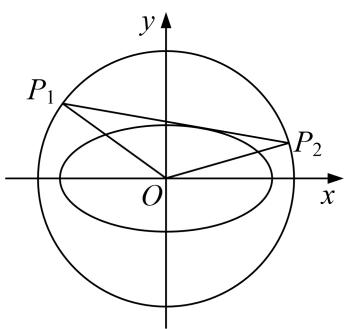

[规范解答] （1）由题意得， $\frac{c}{a}=\frac{1}{2}$ ， $a^{2}=b^{2}+c^{2}$ ，又因为点 $A(1.\frac{3}{2})$ 在椭圆C上所以 $\frac{1}{a^{2}}+\frac{9}{4b^{2}}=1$ ，解得 $b^{2}=3$ ， $a^{2}=2$ 。
所以椭圆的标准方程为 $\frac{x^{2}}{4}+\frac{y^{2}}{3}=1$ .  
（2）结论：存在符合条件的圆，且此圆的方程为 $x^{2}+y^{2}=7$ .
证明如下:
假设存在符合条件的圆，且设此圆的方程为 $x^{2}+y^{2}=r^{2}(r>0)$ .
当直线 l 的斜率存在时，设 l 的方程为 $y=kx+m$ ，
由方程组 $\left\{\begin{aligned}y&=kx+m\\ \frac{x^{2}}{4}&=\frac{y^{2}}{3}=1\end{aligned}\right.$ ，得 $(4k^{2}+3)x^{2}+8kmx+4m^{2}-12=0$ ，
因为直线 l 与椭圆有且仅有一个公共点，所以 $\Delta_{1}=(8km)^{2}-4(4k^{2}+3)(4m^{2}-12)=0$ ，即 $m^{2}=4k^{2}+3$ .
由方程组 $\left\{\begin{aligned}y&=kx+m\\ x^{2}&+y^{2}=r^{2}\end{aligned}\right.$ ，得 $(k^{2}+1)x^{2}+2kmx+m^{2}-r^{2}=0$ ，
则 $\Delta_{1}=(2km)^{2}-4(k^{2}+1)(m^{2}-r^{2})>0,$
设 $P_{1}(x_{1}, y_{1})$ ， $P_{2}(x_{2}, y_{2})$ ，则 $x_{1} + x_{2} = \frac{-2km}{1 + k^{2}}$ ， $x_{1}x_{2} = \frac{m^{2} - r^{2}}{1 + k^{2}}$ .
设直线 $OP_{1}$ ， $OP_{2}$ 的斜率分别为 $k_{1}$ ， $k_{2}$ ，
所以 $k_{1}\cdot k_{2}=\frac{y_{1}y_{2}}{x_{1}x_{2}}=\frac{(kx_{1}+m)(k_{2}x+m)}{x_{1}x_{2}}=\frac{k^{2}x_{1}x_{2}+km(x_{1}+x_{2})+m^{2}}{x_{1}x_{2}}=\frac{k^{2}\frac{m^{2}-r^{2}}{1+k^{2}}+km\frac{-2km}{1+k^{2}}+m^{2}}{\frac{m^{2}-r^{2}}{1+k^{2}}}=\frac{m^{2}-r^{2}k^{2}}{m^{2}-r^{2}}$
将 $m^{2}=4k^{2}+3$ 代入上式得 $k_{1}k_{2}=\frac{(4-r^{2})k^{2}+3}{4k^{2}+3-r^{2}}$ 。要使得 $k_{1}k_{2}$ 为定值，则 $\frac{4-r^{2}}{4}=\frac{3}{3-r^{2}}$ ，即 $r^{2}=7$ 。
所以当圆的方程为 $x^{2}+y^{2}=7$ 时，圆与 l 的交点 $P_{1}$ ， $P_{2}$ 满足 $k_{1}k_{2}$ 为定值 $-\frac{3}{4}$ .
当直线 l 的斜率不存在时，由题意知 l 的方程为 $x=\pm2$ ，
此时圆与 l 的交点 $P_{1}$ ， $P_{2}$ 也满足 $k_{1}k_{2}$ 为定值 $-\frac{3}{4}$ .

综上：当圆的方程为 $x^{2}+y^{2}=7$ 时，圆与 l 的交点 $P_{1}$ ， $P_{2}$ 满足 $k_{1}k_{2}$ 为定值 $-\frac{3}{4}$ .

[例10] 如图，在平面直角坐标系 $xOy$ 中，椭圆 $C: \frac{x^2}{a^2} + \frac{y^2}{b^2} = 1 (a > b > 0)$ 的左、右顶点分别为 $A, B$ . 已知 $|AB| = 4$ ，且点 $\left\{e, \frac{3\sqrt{5}}{4}\right\}$ 在椭圆上，其中 $e$ 是椭圆的离心率.  
（1）求椭圆 C 的方程;  
（2）设 $P$ 是椭圆 $C$ 上异于 $A, B$ 的点，与 $x$ 轴垂直的直线 $l$ 分别交直线 $AP, BP$ 于点 $M, N$ ，求证：直线 $AN$ 与直线 $BM$ 的斜率之积是定值.

[规范解答] （1） 因为 $\vert AB\vert = 4$ ，所以 2a = 4，即 a = 2，又点 $\left\{e, \frac{3\sqrt{5}}{4}\right\}$ 在椭圆上，
故 $\frac{e^{2}}{a^{2}}+\frac{45}{16b^{2}}=1$ ，即 $\frac{c^{2}}{16}+\frac{45}{16b^{2}}=1$ ，联立方程组 $\left\{\begin{aligned}\frac{c^{2}}{16}+\frac{45}{16b^{2}}=1,\\ c^{2}+b^{2}=4,\end{aligned}\right.$ 解得 $b^{2}=3$ ，
故椭圆 C 的方程为 $\frac{x^{2}}{4} + \frac{y^{2}}{3} = 1$ .  
（2）设点 P 坐标为 $(s, t)$ ，M，N 的横坐标均为 $m(m \neq \pm 2)$ ，故 $M\left\{m, \frac{t}{s+2}(m+2)\right\}$ ,

直线 BM 的斜率 $k_{1}=\frac{t(m+2)}{(s+2)(m-2)}$ ，同理可得直线 AN 的斜率 $k_{2}=\frac{t(m-2)}{(s-2)(m+2)}$ ,
所以 $k_{1}k_{2}=\frac{t^{2}(m^{2}-4)}{(s^{2}-4)(m^{2}-4)}=\frac{t^{2}}{s^{2}-4}$ ,
又因为点 P 在椭圆上，故有 $\frac{s^{2}}{4} + \frac{t^{2}}{3} = 1$ ，即 $t^{2} = -\frac{3}{4}(s^{2} - 4)$ ，则 $k_{1}k_{2} = -\frac{3}{4}$ ,
故直线 AN 与直线 BM 的斜率之积是定值.

[例 11] 已知抛物线 C: $y^{2}=ax(a>0)$ 上一点 $P(t, \frac{1}{2})$ 到焦点 F 的距离为 2t.  
（1）求抛物线 C 的方程;  
（2）抛物线 C 上一点 A 的纵坐标为 1，过点 $Q(3, -1)$ 的直线与抛物线 C 交于 M，N 两个不同的点(均与点 A 不重合)，设直线 AM，AN 的斜率分别为 $k_{1}$ ， $k_{2}$ ，求证： $k_{1}k_{2}$ 为定值.

[规范解答] （1）由抛物线的定义可知 $|PF|=t+\frac{a}{4}=2t$ ，则a=4t，由点 $P(t,\frac{1}{2})$ 在抛物线上，得 $at=\frac{1}{4}$ ，∴ $a\times\frac{a}{4}=\frac{1}{4}$ ，则 $a^{2}=1$ ，由a>0，得a=1，∴抛物线C的方程为 $y^{2}=x$ .  
（2）∵点A在抛物线C上，且 $y_{A}=1,\therefore x_{A}=1$ .
∴ $A(1, 1)$ ，设过点 $Q(3, -1)$ 的直线的方程为 $x - 3 = m(y + 1)$ ，即 $x = my + m + 3$ ，
代入 $y^{2}=x$ 得 $y^{2}-my-m-3=0$ .
设 $M(x_{1}, y_{1})$ ， $N(x_{2}, y_{2})$ ，则 $y_{1} + y_{2} = m$ ， $y_{1}y_{2} = -m - 3$ ，
$\therefore k_{1}k_{2} = \frac{y_{1} - 1}{x_{1} - 1}\cdot \frac{y_{2} - 1}{x_{2} - 1} = \frac{y_{1}y_{2} - (y_{1} + y_{2}) + 1}{m^{2}y_{1}y_{2} + m(m + 2)(y_{1} + y_{2}) + (m + 2)^{2}} = -\frac{1}{2},\quad \therefore k_{1}k_{2}$ 为定值.

# 【对点训练】

9. 已知椭圆 $C: \frac{x^2}{a^2} + \frac{y^2}{b^2} = 1 (a > b > 0)$ 的上顶点为点 $D$ ，右焦点为 $F_2(1, 0)$ ，延长 $DF_2$ 交椭圆 $C$ 于点 $E$ ，且满足 $|DF_2| = 3 |F_2E|$ .  
（1）求椭圆 C 的标准方程;  
（2）过点 $F_{2}$ 作与 x 轴不重合的直线 l 和椭圆 C 交于 A, B 两点，设椭圆 C 的左顶点为点 H，且直线 HA, HB 分别与直线 x=3 交于 M, N 两点，记直线 $F_{2}M$ , $F_{2}N$ 的斜率分别为 $k_{1}$ , $k_{2}$ ，则 $k_{1}$ 与 $k_{2}$ 之积是否为定值？若是，求出该定值；若不是，请说明理由.

9. 解析 （1）椭圆 C 的上顶点为 $D(0, b)$ ，右焦点 $F_{2}(1, 0)$ ，点 E 的坐标为 $(x, y)$ .
$\because |DF_{2}|=3|F_{2}E|$ ，可得 $\overrightarrow{DF_{2}}=3\overrightarrow{F_{2}E}$ ，又 $\overrightarrow{DF_{2}}=(1,-b)$ ， $\overrightarrow{F_{2}E}=(x-1,y)$
$\therefore \left\{ \begin{array}{l} x = \frac{4}{3}, \\ y = -\frac{b}{3}, \end{array} \right.$ 代入 $\frac{x^2}{a^2} + \frac{y^2}{b^2} = 1$ ，可得 $\frac{\left(\frac{4}{3}\right)^2}{a^2} + \frac{\left(-\frac{b}{3}\right)^2}{b^2} = 1$ ，又 $a^2 - b^2 = 1$ ，解得 $a^2 = 2, b^2 = 1$
即椭圆 C 的标准方程为 $\frac{x^{2}}{2} + y^{2} = 1$ .  
（2）设 $A(x_{1},y_{1})$ ， $B(x_{2},y_{2})$ ， $H(-\sqrt{2},0)$ ， $M(3,y_M)$ ， $N(3,y_N)$
由题意可设直线 $AB$ 的方程为 $x = my + 1$ ，联立 $\left\{ \begin{array}{l} x = my + 1, \\ \frac{x^2}{2} + y^2 = 1, \end{array} \right.$ 消去 $x$ ，得 $(m^2 + 2)y^2 + 2my - 1 = 0,$ $\Delta=4m^{2}+4(m^{2}+2)>0$ 恒成立. $\therefore\left\{\begin{aligned}y_{1}+y_{2}&=-\frac{2m}{m^{2}+2},\\ y_{1}y_{2}&=\frac{-1}{m^{2}+2}.\end{aligned}\right.$
根据 H, A, M 三点共线，可得 $\frac{y_{M}}{3+\sqrt{2}}=\frac{y_{1}}{x_{1}+\sqrt{2}}$ ，∴ $y_{M}=\frac{y_{1}(3+\sqrt{2})}{x_{1}+\sqrt{2}}$ ，同理可得 $y_{N}=\frac{y_{2}(3+\sqrt{2})}{x_{2}+\sqrt{2}}$ ,
∴M, N的坐标分别为 $\left\{3,\frac{y_{1}(3+\sqrt{2})}{x_{1}+\sqrt{2}}\right\},\left\{3,\frac{y_{2}(3+\sqrt{2})}{x_{2}+\sqrt{2}}\right\}$
$\therefore k _ {1} k _ {2} = \frac {y _ {M} - 0}{3 - 1} \cdot \frac {y _ {N} - 0}{3 - 1} = \frac {1}{4} y _ {M} y _ {N} = \frac {1}{4} \cdot \frac {y _ {1} (3 + \sqrt {2})}{x _ {1} + \sqrt {2}} \cdot \frac {y _ {2} (3 + \sqrt {2})}{x _ {2} + \sqrt {2}} = \frac {y _ {1} y _ {2} (3 + \sqrt {2}) ^ {2}}{4 (m y _ {1} + 1 + \sqrt {2}) (m y _ {2} + 1 + \sqrt {2})}$
$= \frac {y _ {1} y _ {2} (3 + \sqrt {2}) ^ {2}}{4 \left[ m ^ {2} y _ {1} y _ {2} + (1 + \sqrt {2}) m \left(y _ {1} + y _ {2}\right) + (1 + \sqrt {2}) ^ {2} \right]} = \frac {\frac {- 1 1 - 6 \sqrt {2}}{m ^ {2} + 2}}{4 \left[ \frac {- m ^ {2}}{m ^ {2} + 2} + \frac {- 2 (1 + \sqrt {2}) m ^ {2}}{m ^ {2} + 2} + 3 + 2 \sqrt {2} \right]}$
$= \frac {\frac {- 1 1 - 6 \sqrt {2}}{m ^ {2} + 2}}{4 \times \frac {6 + 4 \sqrt {2}}{m ^ {2} + 2}} = \frac {4 \sqrt {2} - 9}{8}. \quad \therefore k _ {1} \text {与} k _ {2} \text {之积为定值，且该定值是} \frac {4 \sqrt {2} - 9}{8}.$

10. 已知椭圆 $C: \frac{x^2}{a^2} + \frac{y^2}{b^2} = 1 (a > b > 0)$ 经过 $A(1, \frac{\sqrt{2}}{2})$ , $B(\frac{\sqrt{2}}{2}, -\frac{\sqrt{3}}{2})$ 两点, $O$ 为坐标原点.  
（1）求椭圆 C 的标准方程;  
（2）设动直线 l 与椭圆 C 有且仅有一个公共点，且与圆 O: $x^{2}+y^{2}=3$ 相交于 M, N 两点试问直线 OM 与 ON 的斜率之积 $k_{OM}k_{ON}$ 是否为定值？若是，求出该定值；若不是，说明理由.

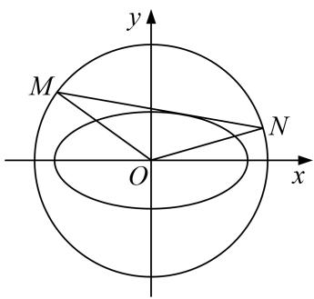

10. 解析 （1）依题意， $\left\{ \begin{array}{l} \frac{1}{a^2} + \frac{1}{b^2} = 1 \\ \frac{1}{2} + \frac{3}{b^2} = 1 \end{array} \right.$ ，解得 $\left\{ \begin{array}{l} a^2 = 2 \\ b^2 = 1 \end{array} \right.$ ，所以椭圆方程为 $\frac{x^2}{2} + y^2 = 1$ 。  
（2）当直线 l 的斜率不存在时，直线 l 的方程为 $x=\pm\sqrt{2}$ .
若直线 l 的方程为 $x=\sqrt{2}$ ，则 M，N 的坐标为 $(\sqrt{2}, -1)(\sqrt{2}, 1)$ ， $k_{OM} \cdot k_{ON} = -\frac{1}{2}$ .
若直线 l 的方程为 $x = -\sqrt{2}$ ，则 M，N 的坐标为 $(- \sqrt{2}, -1)(-\sqrt{2}, 1)$ ， $k_{OM} \cdot k_{ON} = -\frac{1}{2}$ .
当直线 l 的斜率存在时，可设直线 $l: y = kx + m$ ,

与椭圆方程联立可得 $(1+2k^{2})x^{2}+4kmx+2m^{2}-2=0$ ,
由相切可得 $\Delta_{1}=8(2k^{2}-m^{2}+1)=0$ 。即 $m^{2}=2k^{2}+1$ 。
又 $\left\{\begin{aligned}y=kx+m\\ x^{2}+y^{2}=3\end{aligned}\right.$ ，消去y得 $(1+k^{2})x^{2}+2kmx+m^{2}-3=0$ ，
$\Delta_ {2} = (2 k m) ^ {2} - 4 \left(k ^ {2} + 1\right) \left(m ^ {2} - 3\right) = 4 \left(3 k ^ {2} - m ^ {2} + 3\right) = 4 \left(k ^ {2} + 2\right) > 0,$
设 $M(x_{1}, y_{1})$ ， $N(x_{2}, y_{2})$ ，则 $x_{1} + x_{2} = \frac{-2km}{1 + k^{2}}$ ， $x_{1}x_{2} = \frac{m^{2} - 3}{1 + k^{2}}$
$\therefore y _ {1} y _ {2} = \left(k x _ {1} + m\right) \left(k x _ {2} + m\right) = k ^ {2} x _ {1} x _ {2} + k m \left(x _ {1} + x _ {2}\right) + m ^ {2} = \frac {m ^ {2} - 3 k ^ {2}}{1 + k ^ {2}},$
$k _ {O M} \cdot k _ {O N} = \frac {y _ {1} y _ {2}}{x _ {1} x _ {2}} = \frac {m ^ {2} - 3 k ^ {2}}{m ^ {2} - 3} = \frac {2 k ^ {2} + 1 - 3 k ^ {2}}{2 k ^ {2} + 1 - 3} = \frac {1 - k ^ {2}}{2 k ^ {2} - 2} = - \frac {1}{2}.$
故 $k_{OM} \cdot k_{ON}$ 为定值且定值为 $-\frac{1}{2}$ .

综上， $k_{OM} \cdot k_{ON}$ 为定值且定值为 $-\frac{1}{2}$ .

11. 已知椭圆 $\frac{x^2}{a^2} + \frac{y^2}{b^2} = 1 (a > b > 0)$ 的右顶点为 $A$ ，上顶点为 $B$ ， $O$ 为坐标原点，点 $O$ 到直线 $AB$ 的距离为 $\frac{2\sqrt{5}}{5}$ ， $\triangle OAB$ 的面积为 1.  
（1）求椭圆的标准方程;  
（2）直线 l 与椭圆交于 C, D 两点，若直线 $l \parallel$ 直线 AB，设直线 AC, BD 的斜率分别为 $k_{1}$ , $k_{2}$ ，证明： $k_{1} \cdot k_{2}$ 为定值.

11. 解析 （1） 直线 $AB$ 的方程为 $\frac{x}{a} + \frac{y}{b} = 1$ ，即 $bx + ay - ab = 0$ ，则 $\frac{ab}{\sqrt{a^2 + b^2}} = \frac{2\sqrt{5}}{5}$ ，
因为 $\triangle OAB$ 的面积为1，所以 $\frac{1}{2}ab=1$ ，即ab=2．解得a=2，b=1，
所以椭圆的标准方程为 $\frac{x^{2}}{4}+y^{2}=1$ .  
（2）直线 AB 的斜率为 $-\frac{1}{2}$ ，设直线 l 的方程为 $y=-\frac{1}{2}x+t,\quad C(x_{1},y_{1}),\quad D(x_{2},y_{2})$ ,
代入 $\frac{x^{2}}{4}+y^{2}=1$ ，得 $2y^{2}-2ty+t^{2}-1=0$ ，依题意得， $\Delta>0$ ，
则 $y_{1}+y_{2}=t,\quad y_{1}y_{2}=\frac{t^{2}-1}{2},$
所以 $k_{1}k_{2}=\frac{y_{1}}{x_{1}-2}\cdot\frac{y_{2}-1}{x_{2}}=\frac{y_{1}y_{2}-y_{1}}{x_{1}x_{2}-2x_{2}}$ ,
因为 $x_{1}x_{2}-2x_{2}=4(t-y_{1})(t-y_{2})-4(t-y_{2})=4[t^{2}-t(y_{1}+y_{2})+y_{1}y_{2}-t+y_{2}]$
$= 4 \left[ \left(y _ {1} + y _ {2}\right) ^ {2} - \left(y _ {1} + y _ {2}\right) \left(y _ {1} + y _ {2}\right) + y _ {1} y _ {2} - \left(y _ {1} + y _ {2}\right) + y _ {2} \right] = 4 \left(y _ {1} y _ {2} - y _ {1}\right),$
所以 $k_{1}k_{2}=\frac{1}{4}$ 为定值.

12. 已知椭圆 $C: \frac{x^2}{a^2} + \frac{y^2}{b^2} = 1 (a > b > 0)$ 的离心率为 $\frac{\sqrt{6}}{3}$ , $F_1$ , $F_2$ , 是椭圆 $C$ 的左、右焦点, $P$ 是椭圆 $C$ 上的一个动点, 且 $\triangle PF_1F_2$ 面积的最大值为 $10\sqrt{2}$ .  
（1）求椭圆 C 的方程;  
（2）若 Q 是椭圆 C 上的一个动点，点 M，N 在椭圆 $\frac{x^{2}}{3} + y^{2} = 1$ 上，O 为原点，点 Q，M，N 满足 $\overrightarrow{OQ} = \overrightarrow{OM} + 3\overrightarrow{ON}$ ，则直线 OM 与直线 ON 的斜率之积是否为定值？若是，求出该定值，若不是，请说明理由.

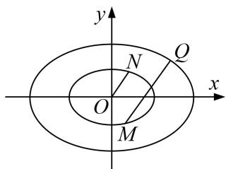

12. 解析 （1）由题意可知, $\begin{cases} \frac{c}{a} = \frac{\sqrt{6}}{3} \\ ab = 10\sqrt{2} \\ a^2 = b^2 + c^2 \end{cases}$ , 解得 $\begin{cases} a^2 = 30 \\ b^2 = 10 \end{cases}$ ,
∴椭圆 C 的方程为 $\frac{x^{2}}{30} + \frac{y^{2}}{10} = 1$ ;  
（2）设 $Q(x_{0}, y_{0})$ , $M(x_{1}, y_{1})$ , $N(x_{2}, y_{2})$ . $\therefore x_{0}^{2} + 3y_{0}^{2} = 30$ , $x_{1}^{2} + 3y_{1}^{2} = 3$ , $x_{2}^{2} + 3y_{2}^{2} = 3$ ,
$\because \overrightarrow {O Q} = \overrightarrow {O M} + 3 \overrightarrow {O N}, \therefore (x _ {0}, y _ {0}) = (x _ {1}, y _ {1}) + 3 (x _ {2}, y _ {2}), \therefore \left\{ \begin{array}{l} x _ {0} = x _ {1} + 3 x _ {2} \\ y _ {0} = y _ {1} + 3 y _ {2} \end{array} , \right.$
$\therefore x _ {0} ^ {2} + 3 y _ {0} ^ {2} = \left(x _ {1} + 3 x _ {2}\right) ^ {2} + \left(y _ {1} + 3 y _ {2}\right) ^ {2} = x _ {1} ^ {2} + 6 x _ {1} x _ {2} + 9 x _ {2} ^ {2} + 3 y _ {1} ^ {2} + 1 8 y _ {1} y _ {2} + 2 7 y _ {2} ^ {2}$
$= 3 + 2 7 + 6 \left(x _ {1} x _ {2} + 3 y _ {1} y _ {2}\right) = 3 0,$
$\therefore x_{1}x_{2} + 3y_{1}y_{2} = 0,\quad \therefore \frac{y_{1}}{x_{1}}\frac{y_{2}}{x_{2}} = -\frac{1}{3},$ 即 $k_{OM}k_{ON} = -\frac{1}{3}$
∴直线 OM 与直线 ON 的斜率之积为定值，且定值为 $-\frac{1}{3}$ .

# 题型四 斜率综合问题

# 【例题选讲】

[例 12] 已知 $\triangle ABC$ 中， $B(-1,0)$ ， $C(1,0)$ ，AB=6，点P在AB上，且 $\angle BAC=\angle PCA$ .  
（1）求点 P 的轨迹 E 的方程;  
（2）若 $Q(1, \frac{8}{3})$ ，过点 $C$ 的直线与 $E$ 交于 $M$ ， $N$ 两点，与直线 $x = 9$ 交于点 $K$ ，记 $QM$ ， $QN$ ， $QK$ 的斜率分别为 $k_{1}$ ， $k_{2}$ ， $k_{3}$ ，试探究 $k_{1}$ ， $k_{2}$ ， $k_{3}$ 的关系，并证明.

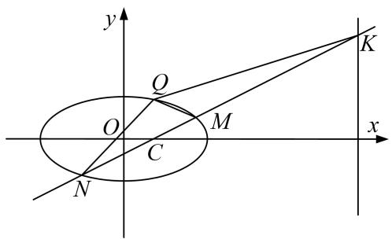

[规范解答] （1）如图三角形 ACP 中， $\angle BAC = \angle PCA$ ，所以 PA = PC，
所以 $PB + PC = PB + PA = AB = 6$ ,
所以点 P 的轨迹是以 B，C 为焦点，长轴为 4 的椭圆(不包含实轴的端点)，
所以点 P 的轨迹 E 的方程为 $\frac{x^{2}}{9} + \frac{y^{2}}{8} = 1 (x \neq \pm3)$ .  
（2） $k_{1}$ ， $k_{2}$ ， $k_{3}$ 的关系： $k_{1}+k_{2}=2k_{3}$ .
证明：如图，设 $M(x_{1}, y_{1})$ ， $N(x_{2}, y_{2})$ ，

可设直线 MN 方程为 $y=k(x-1)$ ，则 $K(4,3k)$ ,
由 $\left\{\begin{aligned}\frac{x^{2}}{9}+\frac{y^{2}}{8}&=1,\\ y=k(x-1),\end{aligned}\right.$ 可得 $(9k^{2}+8)x^{2}-18k^{2}x+(9k^{2}-72)=0,$
$\therefore x _ {1} + x _ {2} = \frac {1 8 k ^ {2}}{9 k ^ {2} + 8}, x _ {1} x _ {2} = \frac {9 k ^ {2} - 7 2}{9 k ^ {2} + 8}.$
$k _ {1} = \frac {y _ {1} - \frac {8}{3}}{x _ {1} - 1} = \frac {k (x _ {1} - 1) - \frac {8}{3}}{x _ {1} - 1} = k - \frac {8}{3 (x _ {1} - 1)}, k _ {2} = k - \frac {8}{3 (x _ {2} - 1)}, k _ {3} = k - \frac {8 k - \frac {8}{3}}{9 - 1} = k - \frac {1}{3},$
因为 $(k_{1}-k_{3})+(k_{2}-k_{3})=\frac{2}{3}-\frac{8}{3}(\frac{1}{x_{1}-1}+\frac{1}{x_{2}-1})=\frac{2}{3}-\frac{8}{3}\frac{x_{1}+x_{2}-2}{x_{1}x_{2}-(x_{1}+x_{2})+1},$
所以： $k_{1}+k_{2}=2k_{3}$

[例13] 已知圆 $F_{1}$ : $(x + 1)^{2} + y^{2} = r^{2}(1 \leq r \leq 3)$ , 圆 $F_{2}$ : $(x - 1)^{2} + y^{2} = (4 - r)^{2}$ .  
（1）证明：圆 $F_{1}$ 与圆 $F_{2}$ 有公共点，并求公共点的轨迹 $E$ 的方程；（2）已知点 $Q(m,0)(m < 0)$ ，过点 $F_{2}$ 斜率为 $k(k \neq 0)$ 的直线与（1）中轨迹 $E$ 相交于 $M, N$ 两点，记直线 $QM$ 的斜率为 $k_{1}$ ，直线 $QN$ 的斜率为 $k_{2}$ ，是否存在实数 $m$ 使得 $k(k_{1} + k_{2})$ 为定值？若存在，求出 $m$ 的值，若不存在，说明理由.

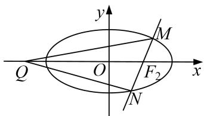

[规范解答] （1） 因为 $F_{1}(-1, 0)$ ， $F_{2}(1, 0)$ ，所以 $|F_{1}F_{2}| = 2$ ，
因为圆 $F_{1}$ 的半径为 r，圆 $F_{2}$ 的半径为 4-r，
又因为 $1 \leq r \leq 3$ ，所以 $|4 - r - r| \leq 2$ ，即 $|4 - r - r| \leq |F_{1} F_{2}| \leq |4 - r + r|$ ，
所以圆 $F_{1}$ 与圆 $F_{2}$ 有公共点，
设公共点为 P，因此 $\left|PF_{1}\right| + \left|PF_{2}\right| = 4$ ，所以 P 点的轨迹 E 是以 $F_{1}(-1, 0)$ ， $F_{2}(1, 0)$ 为焦点的椭圆，所以 2a=4, a=2, $b=\sqrt{3}$ ,
即轨迹 E 的方程为 $\frac{x^{2}}{4} + \frac{y^{2}}{3} = 1$ .  
（2） 过 $F_{2}$ 点且斜率为 k 的直线方程为 $y = k(x - 1)$ ，设 $M(x_{1}, y_{1})$ ， $N(x_{2}, y_{2})$ .
由 $\left\{\begin{aligned}y&=k(x-1)\\ \frac{x^{2}}{4}&+\frac{y^{2}}{3}=1\end{aligned}\right.$ 消去 y 得到 $(4k^{2}+3)x^{2}-8k^{2}x+4k^{2}-12=0$ .
则 $x_{1}+x_{2}=\frac{8k^{2}}{4k^{2}+3}$ ， $x_{1}x_{2}=\frac{4k^{2}-12}{4k^{2}+3}$ . ①
因为 $k_{1}=\frac{y_{1}}{x_{1}-m},\quad k_{2}=\frac{y_{2}}{x_{2}-m},$
所以 $k(k_{1}+k_{2})=k(\frac{y_{1}}{x_{1}-m}+\frac{y_{2}}{x_{2}-m})=k(\frac{k(x_{1}-1)}{x_{1}-m}+\frac{k(x_{2}-1)}{x_{2}-m})=k^{2}(\frac{x_{1}-1}{x_{1}-m}+\frac{x_{2}-1}{x_{2}-m})$
$= k ^ {2} \frac {(x _ {1} - 1) (x _ {2} - m) + (x _ {2} - 1) (x _ {1} - m)}{(x _ {1} - m) (x _ {2} - m)} = k ^ {2} \frac {2 x _ {1} x _ {2} - (m + 1) (x _ {1} + x _ {2}) + 2 m}{x _ {1} x _ {2} - m (x _ {1} + x _ {2}) + m ^ {2}},$
将①式代入整理得 $k(k_{1}+k_{2})=\frac{(6m-24)k^{2}}{4(m-1)^{2}k^{2}+3m^{2}-12}$
因为 m<0，所以当 $3m^{2}-12=0$ 时，即 m=-2 时， $k(k_{1}+k_{2})=-1$ .
即存在实数 m=-2 使得 $k(k_{1}+k_{2})=-1$ .

[例 14] 已知抛物线 E: $y^{2}=2px(p>0)$ ，直线 x=my+3 与 E 交于 A，B 两点，且 $\overrightarrow{OA}\cdot\overrightarrow{OB}=6$ ，其中 O 为坐标原点.  
（1）求抛物线 E 的方程;  
（2）已知点 $C$ 的坐标为 $(-3, 0)$ ，记直线 $CA$ ， $CB$ 的斜率分别为 $k_1$ ， $k_2$ ，证明： $\frac{1}{k_1^2} + \frac{1}{k_2^2} - 2m^2$ 为定值.

[规范解答] （1） 设 $A(x_{1}, y_{1})$ ， $B(x_{2}, y_{2})$ ，联立 $\left\{\begin{aligned}x&=my+3,\\ y^{2}&=2px\end{aligned}\right.$ 消去 x，整理得 $y^{2}-2pmy-6p=0$ ，
则 $y_{1}+y_{2}=2pm,\quad y_{1}y_{2}=-6p,\quad x_{1}x_{2}=\frac{(y_{1}y_{2})^{2}}{4p^{2}}=9,$
由 $\overrightarrow{OA}\cdot\overrightarrow{OB}=x_{1}x_{2}+y_{1}y_{2}=9-6p=6$ ，解得 $p=\frac{1}{2}$ ，所以 $y^{2}=x$ .  
（2）由题意得 $k_{1} = \frac{y_{1}}{x_{1} + 3} = \frac{y_{1}}{my_{1} + 6}, k_{2} = \frac{y_{2}}{x_{2} + 3} = \frac{y_{2}}{my_{2} + 6}$ ，所以 $\frac{1}{k_1} = m + \frac{6}{y_1}, \frac{1}{k_2} = m + \frac{6}{y_2}$
所以 $\frac{1}{k_1^2} +\frac{1}{k_2^2} -2m^2 = \left(m + \frac{6}{y_1}\right)^2 +\left(m + \frac{6}{y_2}\right)^2 -2m^2 = 2m^2 +12m\left(\frac{1}{y_1} +\frac{1}{y_2}\right) + 36\left(\frac{1}{y_1^2} +\frac{1}{y_2^2}\right) - 2m^2$
$= 1 2 m \cdot \frac {y _ {1} + y _ {2}}{y _ {1} y _ {2}} + 3 6 \cdot \frac {(y _ {1} + y _ {2}) ^ {2} - 2 y _ {1} y _ {2}}{y _ {1} ^ {2} y _ {2} ^ {2}}.$
由（1）可知： $y_{1}+y_{2}=2pm=m,\quad y_{1}y_{2}=-6p=-3$ ，所以 $\frac{1}{k_{1}^{2}}+\frac{1}{k_{2}^{2}}-2m^{2}=12m\cdot\left(-\frac{m}{3}\right)+36\cdot\frac{m^{2}+6}{9}=24$ ，所以 $\frac{1}{k_{1}^{2}}+\frac{1}{k_{2}^{2}}-2m^{2}$ 为定值.

