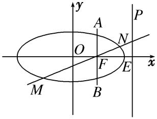
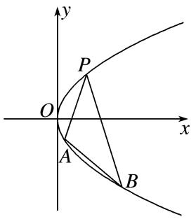
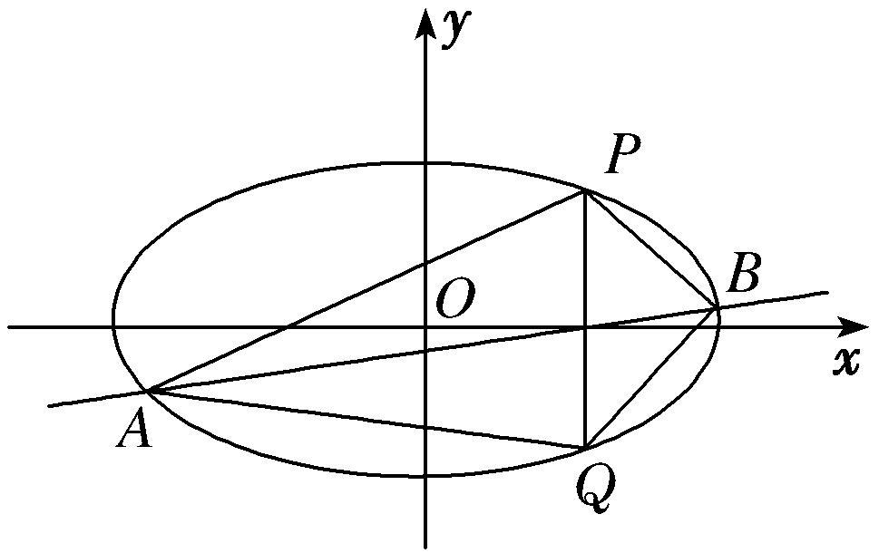
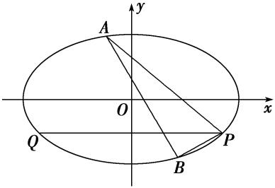
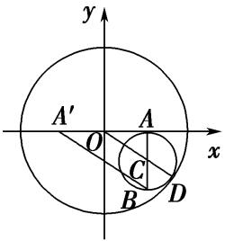
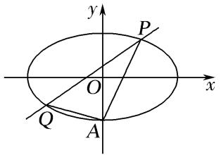

专题18　斜率型定值型问题

定值问题——巧妙消参

定值问题就是证明一个量与其中的变化因素无关，这些变化的因素可能是直线的斜率、截距，也可能是动点的坐标等，这类问题的一般解法是使用变化的量表达求证目标，通过运算求证目标的取值与变化的量无关．当使用直线的斜率和截距表达直线方程时，在解题过程中要注意建立斜率和截距之间的关系，把双参数问题化为单参数问题解决．

题型一　斜率问题

【例题选讲】

<strong>[例1]</strong>　已知椭圆<em>C</em>：＋＝1(<em>a</em>＞<em>b</em>＞0)的离心率为，且过点<em>A</em>(2，1)．  
（1）求椭圆*C*的方程；  
（2）若*P*，*Q*是椭圆*C*上的两个动点，且使∠*PAQ*的角平分线总垂直于*x*轴，试判断直线*PQ*的斜率是否为定值？若是，求出该值；若不是，说明理由．

<strong>[规范解答]</strong>　（1）因为椭圆<em>C</em>的离心率为，且过点<em>A</em>(2，1)，
所以＋＝1，＝．因为<em>a</em>2＝<em>c</em>2＋<em>b</em>2，解得<em>b</em>2＝2，<em>a</em>2＝8
所以椭圆*C*的方程为＋＝1．  
（2）因为∠*PAQ*的角平分线总垂直于*x*轴，所以*PA*与*AQ*所在直线关于直线*x*＝2对称．
设直线*PA*的斜率为*k*，则直线*AQ*的斜率为－*k*．
所以直线*PA*的方程为*y*－1＝*k*(*x*－2)，直线*AQ*的方程为*y*－1＝－*k*(*x*－2)．
设点<em>P</em>(<em>x</em>1，<em>y</em>1)，<em>Q</em>(<em>x</em>2，<em>y</em>2)，由
消去<em>y</em>得(1＋4<em>k</em>2)<em>x</em>2－8(2<em>k</em>2－<em>k</em>)<em>x</em>＋16<em>k</em>2－16<em>k</em>－4＝0，①
因为点*A*(2，1)在椭圆*C*上，所以*x*＝2是方程①的一个根，

2<em>x</em>1＝，即<em>x</em>1＝．同理<em>x</em>2＝．
所以<em>x</em>1－<em>x</em>2＝－．又<em>y</em>1－<em>y</em>2＝<em>k</em>(<em>x</em>1＋<em>x</em>2)－4<em>k</em>＝<em>k</em>·－4<em>k</em>＝－，
所以直线<em>PQ</em>的斜率为<em>kPQ</em>＝＝．所以直线<em>PQ</em>的斜率为定值，该值为．

<strong>[例2]</strong>　已知椭圆<em>C</em>：＋＝1(<em>a</em>&gt;<em>b</em>&gt;0)的离心率为，右焦点为<em>F</em>，右顶点为<em>E</em>，<em>P</em>为直线<em>x</em>＝<em>a</em>上的任意一点，且(＋)·＝2．  
（1）求椭圆*C*的方程；  
（2）过*F*且垂直于*x*轴的直线*AB*与椭圆交于*A*，*B*两点(点*A*在第一象限)，动直线*l*与椭圆*C*交于*M*，*N*两点，且*M*，*N*位于直线*AB*的两侧，若始终保持∠*MAB*＝∠*NAB*，求证：直线*MN*的斜率为定值．

<strong>[规范解答]</strong>　（1）设<em>P</em>，<em>F</em>(<em>c，</em>0)，<em>E</em>(<em>a，</em>0)，
则＝，＝，＝(*c*－*a，* 0)，
所以(＋)·＝·＝2，即·(*c*－*a*)＝2，又*e*＝＝，
所以*a*＝2，*c*＝1，*b*＝，从而椭圆*C*的方程为＋＝1．  
（2）由（1）知<em>A</em>，设<em>M</em>(<em>x</em>1，<em>y</em>1)，<em>N</em>(<em>x</em>2，<em>y</em>2)，设<em>MN</em>的方程：<em>y</em>＝<em>kx</em>＋<em>m</em>，代入椭圆方程＋＝1，
得(4<em>k</em>2＋3)<em>x</em>2＋8<em>kmx</em>＋4<em>m</em>2－12＝0，所以<em>x</em>1＋<em>x</em>2＝－，<em>x</em>1<em>x</em>2＝．
又*M*，*N*是椭圆上位于直线*AB*两侧的动点，若始终保持∠*MAB*＝∠*NAB*，
则<em>kAM</em>＋<em>kAN</em>＝0，即＋＝0，(<em>x</em>2－1)＋(<em>x</em>1－1)＝0，
即(2*k*－1)(2*m*＋2*k*－3)＝0，得*k*＝．故直线*MN*的斜率为定值．

<strong>[例3]</strong>　如图所示，抛物线关于<em>x</em>轴对称，它的顶点在坐标原点，点<em>P</em>(1，2)，<em>A</em>(<em>x</em>1，<em>y</em>1)，<em>B</em>(<em>x</em>2，<em>y</em>2)均在抛物线上．  
（1）求抛物线的方程及其准线方程；  
（2）当*PA*与*PB*的斜率存在且倾斜角互补时，证明：直线*AB*的斜率为定值．

<strong>[规范解答]</strong>　（1）由题意可设抛物线的方程为<em>y</em>2＝2<em>px</em>(<em>p</em>&gt;0)．则由点<em>P</em>(1，2)在抛物线上，得22＝2<em>p</em>×1，
解得<em>p</em>＝2，故所求抛物线的方程是<em>y</em>2＝4<em>x</em>，准线方程是<em>x</em>＝－1．  
（2）因为<em>PA</em>与<em>PB</em>的斜率存在且倾斜角互补，所以<em>kPA</em>＝－<em>kPB</em>，即＝－．
又<em>A</em>(<em>x</em>1，<em>y</em>1)，<em>B</em>(<em>x</em>2，<em>y</em>2)均在抛物线上，所以<em>x</em>1＝，<em>x</em>2＝，从而＝－，
即＝－，得<em>y</em>1＋<em>y</em>2＝－4，故直线<em>AB</em>的斜率<em>kAB</em>＝＝＝－1，为定值．

<strong>[例4]</strong>　如图，在平面直角坐标系<em>xOy</em>中，椭圆<em>E</em>：＋＝1(<em>a</em>＞<em>b</em>＞0)的离心率为，直线<em>l</em>：<em>y</em>=<em>x</em>与椭圆<em>E</em>相交于<em>A</em>，<em>B</em>两点，<em>AB</em>=4，<em>C</em>，<em>D</em>是椭圆<em>E</em>上异于<em>A</em>，<em>B</em>两点，且直线<em>AC</em>，<em>BD</em>相交于点<em>M</em>，直线<em>AD</em>，<em>BC</em>相交于点<em>N</em>．  
（1）求*a*，*b*的值；  
（2）求证：直线*MN*的斜率为定值．

<strong>[规范解答]</strong>　（1）因<em>为e</em>＝＝，所以<em>c</em>2＝<em>a</em>2，即<em>a</em>2－<em>b</em>2＝<em>a</em>2，所以<em>a</em>2＝2<em>b</em>2；
故椭圆方程为＋＝1；由题意，不妨设点*A*在第一象限，点*B*在第三象限，
由解得<em>A</em>(<em>b</em>，<em>b</em>)；又<em>AB</em>＝4，所以<em>OA</em>＝2，即<em>b</em>2＋<em>b</em>2＝20，解得<em>b</em>2＝12．
故*a*＝2，*b*＝2；  
（2）由（1）知，椭圆*E*的方程为＋＝1，从而*A*(4，2)，*B*(－4，－2)；
①当<em>CA</em>，<em>CB</em>，<em>DA</em>，<em>DB</em>斜率都存在时，设直线<em>CA</em>，<em>DA</em>的斜率分别为<em>k</em>1，<em>k</em>2，<em>C</em>(<em>x</em>0，<em>y</em>0)，
显然<em>k</em>1≠<em>k</em>2；<em>k</em>1<em>kBC</em>＝·＝＝＝－，所以<em>kBC</em>＝－；同理k<em>DB</em>＝－，
于是直线<em>AD</em>的方程为<em>y</em>－2＝<em>k</em>2(<em>x</em>－4)，直线<em>BC</em>的方程为<em>y</em>＋2＝－(<em>x</em>＋4)；
∴，解得，
从而点*N*的坐标为(，)，

用<em>k</em>2代<em>k</em>1，<em>k</em>1代<em>k</em>2得点<em>M</em>的坐标为(，)；
∴<em>kMN</em>＝＝＝－1．
即直线*MN*的斜率为定值－1；
②当*CA*，*CB*，*DA*，*DB*中，有直线的斜率不存在时，根据题设要求，至多有一条直线斜率不存在，
故不妨设直线<em>CA</em>的斜率不存在，从而<em>C</em>(4，－2)；仍然设<em>DA</em>的斜率为<em>k</em>2，由①知<em>kDB</em>＝－；
此时*CA*：*x*＝4，*DB*：*y*＋2＝－(*x*＋4)，它们交点*M*(4，－－2)；
<em>BC</em>：<em>y</em>＝－2，<em>AD</em>：<em>y</em>－2＝<em>k</em>2(<em>x</em>－4)，它们交点<em>N</em>(4－，－2)，从而<em>kMN</em>＝－1也成立；
由①②可知，直线*MN*的斜率为定值－1；
【对点训练】

1．已知椭圆<em>C</em>的中心在原点，离心率等于，它的一个短轴端点恰好是抛物线<em>x</em>2＝8<em>y</em>的焦点．  
（1）求椭圆*C*的方程；  
（2）如图，已知*P*(2，3)，*Q*(2，－3)是椭圆上的两点，*A*，*B*是椭圆上位于直线*PQ*两侧的动点．

①若直线*AB*的斜率为，求四边形*APBQ*面积的最大值；
②当*A*，*B*运动时，满足∠*APQ*＝∠*BPQ*，试问直线*AB*的斜率是否为定值？请说明理由．

1．<strong>解析</strong>　（1）设椭圆<em>C</em>的方程为＋＝1(<em>a</em>&gt;<em>b</em>&gt;0)，∵抛物线的焦点为(0，2)．∴<em>b</em>＝2．
由＝，<em>a</em>2＝<em>c</em>2＋<em>b</em>2，得<em>a</em>＝4，∴椭圆<em>C</em>的方程为＋＝1．  
（2）设<em>A</em>(<em>x</em>1，<em>y</em>1)，<em>B</em>(<em>x</em>2，<em>y</em>2)．①设直线<em>AB</em>的方程为<em>y</em>＝<em>x</em>＋<em>t</em>，代入＋＝1，得<em>x</em>2＋<em>tx</em>＋<em>t</em>2－12＝0，
由<em>Δ</em>&gt;0，解得－4&lt;<em>t</em>&lt;4，∴<em>x</em>1＋<em>x</em>2＝－<em>t</em>，<em>x</em>1<em>x</em>2＝<em>t</em>2－12，
∴|<em>x</em>1－<em>x</em>2|＝＝＝．
∴四边形<em>APBQ</em>的面积<em>S</em>＝×6×|<em>x</em>1－<em>x</em>2|＝3．∴当<em>t</em>＝0时，<em>S</em>取得最大值，且<em>S</em>max＝12．

②若∠*APQ*＝∠*BPQ*，则直线*PA*，*PB*的斜率之和为0，设直线*PA*的斜率为*k*，则直线*PB*的斜率为－*k*，直线*PA*的方程为*y*－3＝*k*(*x*－2)，由消去*y*，
得(3＋4<em>k</em>2)<em>x</em>2＋8<em>k</em>(3－2<em>k</em>)<em>x</em>＋4(3－2<em>k</em>)2－48＝0，∴<em>x</em>1＋2＝，
将<em>k</em>换成－<em>k</em>可得<em>x</em>2＋2＝＝，∴<em>x</em>1＋<em>x</em>2＝，<em>x</em>1－<em>x</em>2＝，
∴<em>kAB</em>＝＝＝＝，∴直线<em>AB</em>的斜率为定值．

2．已知直线*l*经过椭圆*C*：＋＝1(*a*＞*b*＞0)的左焦点和下顶点，坐标原点*O*到直线*l*的距离为．  
（1）求椭圆*C*的离心率；  
（2）若椭圆*C*经过点*P*(2，1)，点*A*，*B*是椭圆*C*上的两个动点，且∠*APB*的角平分线总是垂直于*y*轴，试问：直线*AB*的斜率是否为定值？若是，求出该定值；若不是，请说明理由．

2．解析　（1）过点(－*c*，0)，(0，－*b*)的直线*l*的方程为*bx*＋*cy*＋*bc*＝0，
则坐标原点*O*到直线*l*的距离为*d*＝＝＝，
可得<em>a</em>2＝2<em>bc</em>，∴<em>a</em>4＝4(<em>a</em> 2－<em>c</em>2) <em>c</em>2，∴4<em>e</em>4－4<em>e</em>2＋1＝0，解得<em>e</em>＝．  
（2）由（1）易知*a*＝*b*，则椭圆*C*：＋＝1经过点*P*(2，1)，
解得<em>b</em>2＝3，则椭圆<em>C</em>：＋＝1．
因为∠*APB*的角平分线总垂直于*y*轴，所以*AP*与*BP*所在直线关于直线*y*＝1对称．
则<em>kAP</em>＝－<em>kBP</em>，设直线<em>AP</em>的斜率为<em>k</em>，则直线<em>BP</em>的斜率为－<em>k</em>．
所以直线*PA*的方程为*y*－1＝*k*(*x*－2)，直线*BP*的方程为*y*－1＝－*k*(*x*－2)．
设点<em>A</em>(<em>x</em>1，<em>y</em>1)，<em>B</em>(<em>x</em>2，<em>y</em>2)，由
消去<em>y</em>得(1＋2<em>k</em>2)<em>x</em>2＋4(<em>k</em>－2<em>k</em>2)<em>x</em>＋8<em>k</em>2－8<em>k</em>－4＝0，
因为点<em>P</em>(2，1)在椭圆<em>C</em>上，则有2<em>x</em>1＝，即<em>x</em>1＝．同理<em>x</em>2＝．
所以<em>x</em>1－<em>x</em>2＝－．又<em>y</em>1－<em>y</em>2＝<em>k</em>(<em>x</em>1＋<em>x</em>2)－4<em>k</em>＝－，
所以直线<em>AB</em>的斜率为<em>kAB</em>＝＝1．所以直线<em>AB</em>的斜率为定值，该值为1．

3．已知椭圆*C*：＋＝1(*a*＞*b*＞0)的离心率为，且过点*P*(2，－1)．  
（1）求椭圆*C*的标准方程；  
（2）设点<em>Q</em>在椭圆<em>C</em>上，且<em>PQ</em>与<em>x</em>轴平行，过<em>P</em>点作两条直线分别交椭圆<em>C</em>于<em>A</em>(<em>x</em>1，<em>y</em>1)，<em>B</em>(<em>x</em>2，<em>y</em>2)两点，若直线<em>PQ</em>平分∠<em>APB</em>，求证：直线<em>AB</em>的斜率是定值，并求出这个定值．

3．<strong>解析</strong>　（1）因为椭圆<em>C</em>的离心率为＝，所以＝，即<em>a</em>2＝4<em>b</em>2，
所以椭圆<em>C</em>的方程可化为<em>x</em>2＋4<em>y</em>2＝4<em>b</em>2，
又椭圆<em>C</em>过点<em>P</em>(2，－1)，所以4＋4＝4<em>b</em>2，解得<em>b</em>2＝2，<em>a</em>2＝8，
所以椭圆*C*的标准方程为＋＝1．  
（2）由题意，知直线*PA*，*PB*的斜率均存在且不为0，设直线*PA*的方程为*y*＋1＝*k*(*x*－2)(*k*≠0)，
联立方程，得消去<em>y</em>得(1＋4<em>k</em>2)<em>x</em>2－8(2<em>k</em>2＋<em>k</em>)<em>x</em>＋16<em>k</em>2＋16<em>k</em>－4＝0，
所以2<em>x</em>1＝，即<em>x</em>1＝．
因为直线*PQ*平分∠*APB*，且*PQ*与*x*轴平行，所以直线*PA*与直线*PB*的斜率互为相反数，
则直线<em>PB</em>的方程为<em>y</em>＋1＝－<em>k</em>(<em>x</em>－2)(<em>k</em>≠0)，同理可得<em>x</em>2＝．
又所以<em>y</em>1－<em>y</em>2＝<em>k</em>(<em>x</em>1＋<em>x</em>2)－4<em>k</em>，
即<em>y</em>1－<em>y</em>2＝<em>k</em>(<em>x</em>1＋<em>x</em>2)－4<em>k</em>＝<em>k</em>·－4<em>k</em>＝－，<em>x</em>1－<em>x</em>2＝．
所以直线<em>AB</em>的斜率<em>kAB</em>＝＝＝－，为定值．

4．已知椭圆*C*：＋＝1(*a*>*b*>0)的离心率为，且*C*过点．  
（1）求椭圆*C*的方程；  
（2）若直线*l*与椭圆*C*交于*P*，*Q*两点(点*P*，*Q*均在第一象限)，且直线*OP*，*l*，*OQ*的斜率成等比数列，证明：直线*l*的斜率为定值．

4．解析　（1）由题意可得解得故椭圆<em>C</em>的方程为＋<em>y</em>2＝1．  
（2）由题意可知直线*l*的斜率存在且不为0，设直线*l*的方程为*y*＝*kx*＋*m*(*m*≠0)，
由消去<em>y</em>，整理得(1＋4<em>k</em>2)<em>x</em>2＋8<em>kmx</em>＋4(<em>m</em>2－1)＝0，
∵直线<em>l</em>与椭圆交于两点，∴<em>Δ</em>＝64<em>k</em>2<em>m</em>2－16(1＋4<em>k</em>2)(<em>m</em>2－1)＝16(4<em>k</em>2－<em>m</em>2＋1)&gt;0．
设点<em>P</em>，<em>Q</em>的坐标分别为(<em>x</em>1，<em>y</em>1)，(<em>x</em>2，<em>y</em>2)，则<em>x</em>1＋<em>x</em>2＝，<em>x</em>1<em>x</em>2＝，
∴<em>y</em>1<em>y</em>2＝(<em>kx</em>1＋<em>m</em>)(<em>kx</em>2＋<em>m</em>)＝<em>k</em>2<em>x</em>1<em>x</em>2＋<em>km</em>(<em>x</em>1＋<em>x</em>2)＋<em>m</em>2．
∵直线<em>OP</em>，<em>l</em>，<em>OQ</em>的斜率成等比数列，∴<em>k</em>2＝·＝，
整理得<em>km</em>(<em>x</em>1＋<em>x</em>2)＋<em>m</em>2＝0，∴＋<em>m</em>2＝0，又<em>m</em>≠0，∴<em>k</em>2＝，

结合图象(图略)可知*k*＝－，故直线*l*的斜率为定值．

5．已知椭圆<em>C</em>：＋＝1(<em>a</em>＞<em>b</em>＞0)，<em>c</em>＝，左、右焦点为<em>F</em>1，<em>F</em>2，点<em>P</em>，<em>A</em>，<em>B</em>在椭圆<em>C</em>上，且点<em>A</em>，

*B*关于原点对称，直线*PA*，*PB*的斜率的乘积为－．  
（1）求椭圆*C*的方程；  
（2）已知直线*l*经过点*Q*(2，2)，且与椭圆*C*交于不同的两点*M*，*N*，若|*QM*||*QN*|＝，判断直线*l*的斜率是否为定值？若是，请求出该定值；若不是，请说明理由．

5．解析　（1）由题意知，<em>kPA</em> <em>kPB</em>＝－＝－，又<em>c</em>＝，<em>a</em>2＝<em>c</em>2＋<em>b</em>2，可得<em>a</em>2＝4，<em>b</em>2＝1．
∴椭圆<em>C</em>的方程为＋<em>y</em>2＝1．  
（2）设直线*l*的方程为：*y*－2＝*k*(*x*－2)，
将其代入＋<em>y</em>2＝1，消去<em>y</em>得，(1＋4<em>k</em>2)<em>x</em>2＋16<em>k</em> (1－<em>k</em>)<em>x</em>＋16(1－<em>k</em>)2－4＝0，
则<em>Δ</em>＝[16<em>k</em> (1－<em>k</em>)]2－4(1＋4<em>k</em>2)[16(1－<em>k</em>)2－4]&gt;0，解得，<em>k</em>&gt;．
设设<em>M</em>(<em>x</em>1，<em>y</em>1)，<em>N</em>(<em>x</em>2，<em>y</em>2)，则<em>x</em>1＋<em>x</em>2＝，<em>x</em>1<em>x</em>2＝，
又|<em>QM</em>||<em>QN</em>|＝，∴|<em>QM</em>||<em>QN</em>|＝·|<em>x</em>1－2|··|<em>x</em>2－2|＝(1＋<em>k</em>2)(<em>x</em>1<em>x</em>2－2(<em>x</em>1＋<em>x</em>2)＋4)＝，
∴[－2×＋4]＝，化简得，＝，解得，*k*＝．
∴直线*l*的斜率为定值．

题型二　斜率之和问题

【例题选讲】

<strong>[例5]</strong>　已知椭圆<em>C</em>：＋＝1(<em>a</em>＞<em>b</em>＞0)的离心率为，且过点<em>M</em>(4，1)．  
（1）求椭圆*C*的方程；  
（2）若直线<em>l</em>：<em>y</em>＝<em>x</em>＋<em>m</em>(<em>m≠</em>3)与椭圆<em>C</em>交于<em>P</em>，<em>Q</em>两点，记直线<em>MP</em>，<em>MQ</em>的斜率分别为<em>k</em>1，<em>k</em>2，试探究<em>k</em>1＋<em>k</em>2是否为定值，若是，请求出该定值；若不是，请说明理由．

<strong>[规范解答]</strong>　（1）依题意，，解得<em>a</em>2＝20，<em>b</em>2＝5．故椭圆<em>C</em>的方程为＋＝1；  
（2）<em>k</em>1＋<em>k</em>2＝1，下面给出证明：设<em>P</em>(<em>x</em>1，<em>y</em>1)，<em>Q</em>(<em>x</em>2，<em>y</em>2)，
将<em>y</em>＝<em>x</em>＋<em>m</em>代入＋＝1并整理得5<em>x</em>2＋8<em>mx</em>＋4<em>m</em>2－20＝0，

<em>Δ</em>＝(8<em>m</em>)2－20(4<em>m</em>2－20)&gt;0，解得－5&lt;<em>m</em>&lt;5，且<em>m≠</em>3．
故<em>x</em>1＋<em>x</em>2＝－，<em>x</em>1·<em>x</em>2＝，
则<em>k</em>1＋<em>k</em>2＝＋＝＝

＝＝＝0．
故<em>k</em>1＋<em>k</em>2为定值，该定值为0．

<strong>[例6]</strong>　已知点<em>A</em>(1，0)和动点<em>B</em>，以线段<em>AB</em>为直径的圆内切于圆<em>O</em>：<em>x</em>2＋<em>y</em>2＝4．  
（1）求动点*B*的轨迹方程；  
（2）已知点*P*(2，0)，*Q*(2，－1)，经过点*Q*的直线*l*与动点*B*的轨迹交于*M*，*N*两点，求证：直线*PM*与直线*PN*的斜率之和为定值．

<strong>[规范解答]</strong>　（1）如图，设以线段<em>AB</em>为直径的圆的圆心为<em>C</em>，取<em>A</em>′(－1，0)．

依题意，圆*C*内切于圆*O*，设切点为*D*，则*O*，*C*，*D*三点共线，
∵*O*为*AA*′的中点，*C*为*AB*中点，∴|*A*′*B*|＝2|*OC*|．
∴|*BA*′|＋|*BA*|＝2*OC*＋2*AC*＝2*OC*＋2*CD*＝2*OD*＝4＞|*AA*′|＝2，
∴动点*B*的轨迹是以*A*，*A*′为焦点，长轴长为4的椭圆，
设其方程为＋＝1(<em>a</em>＞<em>b</em>＞0)，则2<em>a</em>＝4，2<em>c</em>＝2，∴<em>a</em>＝2，<em>c</em>＝1，∴<em>b</em>2＝<em>a</em>2－<em>c</em>2＝3，
∴动点*B*的轨迹方程为＋＝1．  
（2）①当直线*l*垂直于*x*轴时，直线*l*的方程为*x*＝2，此时直线*l*与椭圆＋＝1相切，与题意不符．

②当直线*l*的斜率存在时，设直线*l*的方程为*y*＋1＝*k*(*x*－2)．
由，消去<em>y</em>整理得，(4<em>k</em>2＋3)<em>x</em>2－(16<em>k</em>2＋8<em>k</em>)<em>x</em>＋16<em>k</em>2＋16<em>k</em>－8＝0．
∵直线<em>l</em>与椭圆交于<em>M</em>，<em>N</em>两点，∴<em>Δ</em>＝(16<em>k</em>2＋8<em>k</em>)2－4(4<em>k</em>2＋3)(16<em>k</em>2＋16<em>k</em>－8)＞0，解得<em>k</em>＜．
设<em>M</em>(<em>x</em>1，<em>y</em>1)，<em>N</em>(<em>x</em>2，<em>y</em>2)，则<em>x</em>1＋<em>x</em>2＝，<em>x</em>1<em>x</em>2＝，
∴<em>kPM</em>＋<em>kPN</em>＝＋＝＋

＝＝＝3(定值)．

<strong>[例7]</strong>　如图，在平面直角坐标系<em>xOy</em>中，椭圆<em>C</em>：＋＝1(<em>a</em>＞<em>b</em>＞0)的右焦点为<em>F</em>(1，0)，离心率为．分别过<em>O</em>，<em>F</em>的两条弦<em>AB</em>，<em>CD</em>相交于点<em>E</em>(异于<em>A</em>，<em>C</em>两点），且<em>OE</em>＝<em>OF</em>．  
（1）求椭圆的方程；  
（2）求证：直线*AC*，*BD*的斜率之和为定值．

<strong>[规范解答]</strong>　（1）由题意，得<em>c</em>＝1，e＝，故<em>a</em>＝，从而<em>b</em>＝1．
所以椭圆的方程为＋<em>y</em>2＝1．   ①  
（2）设直线*AB*的方程为*y*＝*kx*，②，直线*CD*的方程为*y*＝－*k*(*x*－1)，③
由①②得，点*A*，*B*的横坐标为±，由①③得，点*C*，*D*的横坐标为，

记<em>A</em>(<em>x</em>1，<em>kx</em>1)，<em>B</em>(<em>x</em>2，<em>kx</em>2)，<em>C</em>(<em>x</em>3，<em>k</em>(1－<em>x</em>3))，<em>D</em>(<em>x</em>4，<em>k</em>(1－<em>x</em>4))，
则直线*AC*，*BD*的斜率之和为＋＝*k*

＝*k*＝*k*＝0．

【对点训练】

6．如图，椭圆*E*：＋＝1(*a*＞*b*＞0)经过点*A*(0，－1)，且离心率为．  
（1）求椭圆*E*的方程；  
（2）经过点(1，1)，且斜率为*k*的直线与椭圆*E*交于不同的两点*P*，*Q*(均异于点*A*)，证明：直线*AP*与*AQ*的斜率之和为定值．

6．解析　（1）由题设知＝，<em>b</em>＝1，结合<em>a</em>2＝<em>b</em>2＋<em>c</em>2，解得<em>a</em>＝，所以椭圆的方程为＋<em>y</em>2＝1．  
（2）由题设知，直线<em>PQ</em>的方程为<em>y</em>＝<em>k</em>(<em>x</em>－1)＋1(<em>k</em>≠2)，代入＋<em>y</em>2＝1，
得(1＋2<em>k</em>2)<em>x</em>2－4<em>k</em>(<em>k</em>－1)<em>x</em>＋2<em>k</em>(<em>k</em>－2)＝0，由已知<em>Δ</em>＞0．
设<em>P</em>(<em>x</em>1，<em>y</em>1)，<em>Q</em>(<em>x</em>2，<em>y</em>2)，<em>x</em>1<em>x</em>2≠0，则<em>x</em>1＋<em>x</em>2＝，<em>x</em>1<em>x</em>2＝，
从而直线<em>AP</em>，<em>AQ</em>的斜率之和<em>kAP</em>＋<em>kAQ</em>＝＋＝＋

＝2*k*＋(2－*k*)＝2*k*＋(2－*k*)＝2*k*＋(2－*k*)＝2*k*－2(*k*－1)＝2．
故<em>kAP</em>＋<em>kAQ</em>为定值2．

7．设<em>F</em>1，<em>F</em>2为椭圆<em>C</em>：＋＝1(<em>b</em>&gt;0)的左、右焦点，<em>M</em>为椭圆上一点，满足<em>MF</em>1⊥<em>MF</em>2，已知△<em>MF</em>1<em>F</em>2

的面积为1．  
（1）求椭圆*C*的方程；  
（2）设*C*的上顶点为*H*，过点(2，－1)的直线与椭圆交于*R*，*S*两点(异于*H*)，求证：直线*HR*和*HS*的斜率之和为定值，并求出这个定值．

7．<strong>解析</strong>　（1）由椭圆定义得|<em>MF</em>1|＋|<em>MF</em>2|＝4，①
由<em>MF</em>1⊥<em>MF</em>2得|<em>MF</em>1|2＋|<em>MF</em>2|2＝|<em>F</em>1<em>F</em>2|2＝4(4－<em>b</em>2)，②
由题意得<em>S</em>△<em>MF</em>1<em>F</em>2＝|<em>MF</em>1|·|<em>MF</em>2|＝1，③
由①②③，可得<em>b</em>2＝1，所以椭圆<em>C</em>的方程为＋<em>y</em>2＝1．  
（2）依题意，*H*(0，1)，显然直线*RS*的斜率存在且不为0，设直线*RS*的方程为*y*＝*kx*＋*m*(*k*≠0)，
代入椭圆方程并化简得(4<em>k</em>2＋1)<em>x</em>2＋8<em>kmx</em>＋4<em>m</em>2－4＝0．由题意知，<em>Δ</em>＝16(4<em>k</em>2－<em>m</em>2＋1)&gt;0，
设<em>R</em>(<em>x</em>1，<em>y</em>1)，<em>S</em>(<em>x</em>2，<em>y</em>2)，<em>x</em>1<em>x</em>2≠0，故<em>x</em>1＋<em>x</em>2＝，<em>x</em>1<em>x</em>2＝．

<em>kHR</em>＋<em>kHS</em>＝＋＝＋

＝2*k*＋(*m*－1)＝2*k*＋(*m*－1)＝2*k*－＝．
∵直线*RS*过点(2，－1)，∴2*k*＋*m*＝－1，
∴<em>kHR</em>＋<em>kHS</em>＝－1．故<em>kHR</em>＋<em>kHS</em>为定值－1．

8．在平面直角坐标系*xOy*中，已知*Q*(－1，2)，*F*(1，0)，动点*P*满足|·|＝||．  
（1）求动点*P*的轨迹*E*的方程；  
（2）过点<em>F</em>的直线与<em>E</em>交于<em>A</em>，<em>B</em>两点，记直线<em>QA</em>，<em>QB</em>的斜率分别为<em>k</em>1，<em>k</em>2，求证：<em>k</em>1＋<em>k</em>2为定值．

8．<strong>解析</strong>　（1）设<em>P</em>(<em>x</em>，<em>y</em>)，则＝(－1－<em>x，</em>2－<em>y</em>)，＝(1，0)，＝(1－<em>x</em>，－<em>y</em>)．
由|·|＝||知，|－1－<em>x</em>|＝，化简得<em>y</em>2＝4<em>x</em>，
即动点<em>P</em>的轨迹<em>E</em>的方程为<em>y</em>2＝4<em>x</em>．  
（2）证明：设过点<em>F</em>(1，0)的直线为<em>x</em>＝<em>my</em>＋1，<em>A</em>(<em>x</em>1，<em>y</em>1)，<em>B</em>(<em>x</em>2，<em>y</em>2)，
由得<em>y</em>2－4<em>my</em>－4＝0，则<em>y</em>1＋<em>y</em>2＝4<em>m</em>，<em>y</em>1<em>y</em>2＝－4，
∵<em>k</em>1＋<em>k</em>2＝＋，<em>x</em>1＝<em>my</em>1＋1，<em>x</em>2＝<em>my</em>2＋1，
∴<em>k</em>1＋<em>k</em>2＝＋＝＝，
将<em>y</em>1＋<em>y</em>2＝4<em>m</em>，<em>y</em>1<em>y</em>2＝－4代入上式，得<em>k</em>1＋<em>k</em>2＝＝－2，
故<em>k</em>1＋<em>k</em>2为定值－2．

题型三　斜率之积问题

【例题选讲】

<strong>[例8]</strong>　已知椭圆<em>C</em>的中心为坐标原点，焦点在<em>x</em>轴上，焦距为2，椭圆<em>C</em>上的点到焦点的距离的最大值为3．  
（1）求椭圆*C*的标准方程；  
（2）设点*A*，*F*分别为椭圆*C*的左顶点、右焦点，过点*F*的直线交椭圆*C*于点*P*，*Q*，直线*AP*，*AQ*分别与直线*l*：*x*＝3交于点*M*，*N*，求证：直线*FM*和直线*FN*的斜率之积为定值．

<strong>[规范解答]</strong>　（1）设椭圆的标准方程为＋＝1(<em>a</em>&gt;<em>b</em>&gt;0)，焦距为2<em>c</em>，
依题意，可得解得<em>a</em>＝2，<em>c</em>＝1，又<em>a</em>2＝<em>b</em>2＋<em>c</em>2，则<em>b</em>＝，
所以椭圆*C*的标准方程为＋＝1．  
（2）证明：由（1）得<em>A</em>(－2，0)，<em>F</em>(1，0)，设直线<em>PQ</em>：<em>x</em>＝<em>my</em>＋1，<em>P</em>(<em>x</em>1，<em>y</em>1)，<em>Q</em>(<em>x</em>2，<em>y</em>2)，
联立消去<em>x</em>，整理，得(3<em>m</em>2＋4)<em>y</em>2＋6<em>my</em>－9＝0，
则<em>y</em>1＋<em>y</em>2＝－，<em>y</em>1<em>y</em>2＝－，
依题意，可设<em>M</em>(3，<em>yM</em>)，<em>N</em>(3，<em>yN</em>)，则由＝，可得<em>yM</em>＝＝，

同理，可得<em>yN</em>＝，所以直线<em>FM</em>和直线<em>FN</em>的斜率之积

<em>kFM</em>·<em>kFN</em>＝·＝·＝·

＝·＝·＝－＝－．
所以直线*FM*和直线*FN*的斜率之积为定值－．

<strong>[例9]</strong>　已知椭圆<em>C</em>：＋＝1(<em>a</em>&gt;<em>b</em>&gt;0)的离心率为，点<em>A</em>(1．)在椭圆<em>C</em>上．  
（1）求椭圆*C*的方程;  
（2）设动直线<em>l</em>与椭圆<em>C</em>有且仅有一个公共点，判断是否存在以原点<em>O</em>为圆心的圆，满足此圆与<em>l</em>相交两点<em>P</em>1，<em>P</em>2，(两点均不在坐标轴上)，且使得直线<em>OP</em>1，<em>OP</em>2的斜率之积为定值？若存在，求此圆的方程与定值；若不存在，请说明理由．

<strong>[规范解答]</strong>　（1）由题意得，＝，<em>a</em>2＝<em>b</em>2＋<em>c</em>2，又因为点<em>A</em>(1．)在椭圆<em>C</em>上
所以＋＝1，解得<em>b</em>2＝3，<em>a</em>2＝2．
所以椭圆的标准方程为＋＝1．  
（2）结论：存在符合条件的圆，且此圆的方程为<em>x</em>2＋<em>y</em>2＝7．
证明如下：
假设存在符合条件的圆，且设此圆的方程为<em>x</em>2＋<em>y</em>2＝<em>r</em>2(<em>r</em>&gt;0)．
当直线*l*的斜率存在时，设*l*的方程为*y*＝*kx*＋*m*，
由方程组，得(4<em>k</em>2＋3)<em>x</em>2＋8<em>kmx</em>＋4<em>m</em>2－12＝0，
因为直线<em>l</em>与椭圆有且仅有一个公共点，所以<em>Δ</em>1＝(8<em>km</em>)2－4(4<em>k</em>2＋3)( 4<em>m</em>2－12)＝0，即<em>m</em>2＝4<em>k</em>2＋3．
由方程组，得(<em>k</em>2＋1)<em>x</em>2＋2<em>kmx</em>＋<em>m</em>2－<em>r</em>2＝0，
则<em>Δ</em>1＝(2<em>km</em>)2－4(<em>k</em>2＋1)(<em>m</em>2－<em>r</em>2)&gt;0，
设<em>P</em>1(<em>x</em>1，<em>y</em>1)，<em>P</em>2(<em>x</em>2，<em>y</em>2)，则<em>x</em>1＋<em>x</em>2＝，<em>x</em>1<em>x</em>2＝．
设直线<em>OP</em>1，<em>OP</em>2的斜率分别为<em>k</em>1，<em>k</em>2，
所以<em>k</em>1·<em>k</em>2＝＝＝＝＝．
将<em>m</em>2＝4<em>k</em>2＋3代入上式得<em>k</em>1<em>k</em>2＝．要使得<em>k</em>1<em>k</em>2为定值，则＝，即<em>r</em>2＝7．
所以当圆的方程为<em>x</em>2＋<em>y</em>2＝7时，圆与<em>l</em>的交点<em>P</em>1，<em>P</em>2满足<em>k</em>1<em>k</em>2为定值－．
当直线*l*的斜率不存在时，由题意知*l*的方程为*x*＝±2，
此时圆与<em>l</em>的交点<em>P</em>1，<em>P</em>2也满足<em>k</em>1<em>k</em>2为定值－．

综上：当圆的方程为<em>x</em>2＋<em>y</em>2＝7时，圆与<em>l</em>的交点<em>P</em>1，<em>P</em>2满足<em>k</em>1<em>k</em>2为定值－．

<strong>[例10]</strong>　如图，在平面直角坐标系<em>xOy</em>中，椭圆<em>C</em>：＋＝1(<em>a</em>&gt;<em>b</em>&gt;0)的左、右顶点分别为<em>A</em>，<em>B</em>.已知|<em>AB</em>|＝4，且点在椭圆上，其中<em>e</em>是椭圆的离心率．  
（1）求椭圆*C*的方程；  
（2）设*P*是椭圆*C*上异于*A*，*B*的点，与*x*轴垂直的直线*l*分别交直线*AP*，*BP*于点*M*，*N*，求证：直线*AN*与直线*BM*的斜率之积是定值．

<strong>[规范解答]</strong>　（1）因为|<em>AB</em>|＝4，所以2<em>a</em>＝4，即<em>a</em>＝2，又点在椭圆上，
故＋＝1，即＋＝1，联立方程组解得<em>b</em>2＝3，
故椭圆*C*的方程为＋＝1.  
（2）设点*P*坐标为(*s*，*t*)，*M*，*N*的横坐标均为*m*(*m*≠±2)，故*M*，

直线<em>BM</em>的斜率<em>k</em>1＝，同理可得直线<em>AN</em>的斜率<em>k</em>2＝，
所以<em>k</em>1<em>k</em>2＝＝，
又因为点<em>P</em>在椭圆上，故有＋＝1，即<em>t</em>2＝－(<em>s</em>2－4)，则<em>k</em>1<em>k</em>2＝－，
故直线*AN*与直线*BM*的斜率之积是定值．

<strong>[例11]</strong>　已知抛物线<em>C</em>：<em>y</em>2＝<em>ax</em>(<em>a</em>＞0)上一点<em>P</em>(<em>t</em>，)到焦点<em>F</em>的距离为2<em>t</em>．  
（1）求抛物线*C*的方程；  
（2）抛物线<em>C</em>上一点<em>A</em>的纵坐标为1，过点<em>Q</em>(3，－1)的直线与抛物线<em>C</em>交于<em>M</em>，<em>N</em>两个不同的点(均与点<em>A</em>不重合)，设直线<em>AM</em>，<em>AN</em>的斜率分别为<em>k</em>1，<em>k</em>2，求证：<em>k</em>1<em>k</em>2为定值．

<strong>[规范解答]</strong>　（1）由抛物线的定义可知|<em>PF</em>|＝<em>t</em>＋＝2<em>t</em>，则<em>a</em>＝4<em>t</em>，由点<em>P</em>(<em>t</em>，)在抛物线上，得<em>at</em>＝，
∴<em>a</em>×＝，则<em>a</em>2＝1，由<em>a</em>＞0，得<em>a</em>＝1，∴抛物线<em>C</em>的方程为<em>y</em>2＝<em>x</em>．  
（2）∵点<em>A</em>在抛物线<em>C</em>上，且<em>yA</em>＝1，∴<em>xA</em>＝1．
∴*A*(1，1)，设过点*Q*(3，－1)的直线的方程为*x*－3＝*m*(*y*＋1)，即*x*＝*my*＋*m*＋3，
代入<em>y</em>2＝<em>x</em>得<em>y</em>2－<em>my</em>－<em>m</em>－3＝0．
设<em>M</em>(<em>x</em>1，<em>y</em>1)，<em>N</em>(<em>x</em>2，<em>y</em>2)，则<em>y</em>1＋<em>y</em>2＝<em>m</em>，<em>y</em>1<em>y</em>2＝－<em>m</em>－3，
∴<em>k</em>1<em>k</em>2＝·＝＝－，∴<em>k</em>1<em>k</em>2为定值．

【对点训练】

9．已知椭圆<em>C</em>：＋＝1(<em>a</em>&gt;<em>b</em>&gt;0)的上顶点为点<em>D</em>，右焦点为<em>F</em>2(1，0)，延长<em>DF</em>2交椭圆<em>C</em>于点<em>E</em>，且满

足|<em>DF</em>2|＝3|<em>F</em>2<em>E</em>|．  
（1）求椭圆*C*的标准方程；  
（2）过点<em>F</em>2作与<em>x</em>轴不重合的直线<em>l</em>和椭圆<em>C</em>交于<em>A</em>，<em>B</em>两点，设椭圆<em>C</em>的左顶点为点<em>H</em>，且直线<em>HA</em>，<em>HB</em>分别与直线<em>x</em>＝3交于<em>M</em>，<em>N</em>两点，记直线<em>F</em>2<em>M</em>，<em>F</em>2<em>N</em>的斜率分别为<em>k</em>1，<em>k</em>2，则<em>k</em>1与<em>k</em>2之积是否为定值？若是，求出该定值；若不是，请说明理由．

9．<strong>解析</strong>　（1）椭圆<em>C</em>的上顶点为<em>D</em>，右焦点<em>F</em>2(1，0)，点<em>E</em>的坐标为(<em>x</em>，<em>y</em>)．
∵|<em>DF</em>2|＝3|<em>F</em>2<em>E</em>|，可得＝3，又＝，＝，
∴代入＋＝1，可得＋＝1，又<em>a</em>2－<em>b</em>2＝1，解得<em>a</em>2＝2，<em>b</em>2＝1，
即椭圆<em>C</em>的标准方程为＋<em>y</em>2＝1．  
（2）设<em>A</em>(<em>x</em>1，<em>y</em>1)，<em>B</em>(<em>x</em>2，<em>y</em>2)，<em>H</em>，<em>M</em>，<em>N</em>．
由题意可设直线<em>AB</em>的方程为<em>x</em>＝<em>my</em>＋1，联立消去<em>x</em>，得<em>y</em>2＋2<em>my</em>－1＝0，

<em>Δ</em>＝4<em>m</em>2＋4(<em>m</em>2＋2)&gt;0恒成立．∴
根据<em>H</em>，<em>A</em>，<em>M</em>三点共线，可得＝，∴<em>yM</em>＝，同理可得<em>yN</em>＝，
∴*M*，*N*的坐标分别为，，
∴<em>k</em>1<em>k</em>2＝·＝<em>yMyN</em>＝··＝

＝＝

＝＝．∴<em>k</em>1与<em>k</em>2之积为定值，且该定值是．

10．已知椭圆*C*：＋＝1(*a*>*b*>0)经过*A*(1，)，*B*(，－)两点，*O*为坐标原点．  
（1）求椭圆*C*的标准方程；  
（2）设动直线<em>l</em>与椭圆<em>C</em>有且仅有一个公共点，且与圆<em>O</em>：<em>x</em>2＋<em>y</em>2＝3相交于<em>M</em>，<em>N</em>两点试问直线<em>OM</em>与<em>ON</em>的斜率之积<em>kOMkON</em>是否为定值？若是，求出该定值；若不是，说明理由．

10．解析　（1）依题意，，解得，所以椭圆方程为＋<em>y</em>2＝1．  
（2）当直线*l*的斜率不存在时，直线*l*的方程为*x*＝±．
若直线<em>l</em>的方程为<em>x</em>＝，则<em>M</em>，<em>N</em>的坐标为(，－1)(，1)，<em>kOM</em>·<em>kON</em>＝－．
若直线<em>l</em>的方程为<em>x</em>＝－，则<em>M</em>，<em>N</em>的坐标为(－，－1)(－，1)，<em>kOM</em>·<em>kON</em>＝－．
当直线*l*的斜率存在时，可设直线*l*：*y*＝*kx*＋*m*，

与椭圆方程联立可得(1＋2<em>k</em>2)<em>x</em>2＋4<em>kmx</em>＋2<em>m</em>2－2＝0，
由相切可得<em>Δ</em>1＝8(2<em>k</em>2－<em>m</em>2＋1)＝0．即<em>m</em>2＝2<em>k</em>2＋1．
又，消去<em>y</em>得(1＋<em>k</em>2)<em>x</em>2＋2<em>kmx</em>＋<em>m</em>2－3＝0，

<em>Δ</em>2＝(2<em>km</em>)2－4(<em>k</em>2＋1)(<em>m</em>2－3)＝4(3<em>k</em>2－<em>m</em>2＋3)＝4(<em>k</em>2＋2)&gt;0，
设<em>M</em>(<em>x</em>1，<em>y</em>1)，<em>N</em>(<em>x</em>2，<em>y</em>2)，则<em>x</em>1＋<em>x</em>2＝，<em>x</em>1<em>x</em>2＝，
∴<em>y</em>1<em>y</em>2＝(<em>kx</em>1＋<em>m</em>)(<em>kx</em>2＋<em>m</em>)＝<em>k</em>2<em>x</em>1<em>x</em>2＋<em>km</em>(<em>x</em>1＋<em>x</em>2)＋<em>m</em>2＝，

<em>kOM</em>·<em>kON</em>＝＝＝＝＝－．
故<em>kOM</em>·<em>kON</em>为定值且定值为－．

综上，<em>kOM</em>·<em>kON</em>为定值且定值为－．

11．已知椭圆＋＝1(*a*>*b*>0)的右顶点为*A*，上顶点为*B*，*O*为坐标原点，点*O*到直线*AB*

的距离为，△*OAB*的面积为1．  
（1）求椭圆的标准方程；  
（2）直线<em>l</em>与椭圆交于<em>C</em>，<em>D</em>两点，若直线<em>l</em>∥直线<em>AB</em>，设直线<em>AC</em>，<em>BD</em>的斜率分别为<em>k</em>1，<em>k</em>2，证明：<em>k</em>1·<em>k</em>2为定值．

11．<strong>解析</strong>　（1）直线<em>AB</em>的方程为＋＝1，即<em>bx</em>＋<em>ay</em>－<em>ab</em>＝0，则＝，
因为△*OAB*的面积为1，所以*ab*＝1，即*ab*＝2．解得*a*＝2，*b*＝1，
所以椭圆的标准方程为＋<em>y</em>2＝1．  
（2）直线<em>AB</em>的斜率为－，设直线<em>l</em>的方程为<em>y</em>＝－<em>x</em>＋<em>t</em>，<em>C</em>(<em>x</em>1，<em>y</em>1)，<em>D</em>(<em>x</em>2，<em>y</em>2)，
代入＋<em>y</em>2＝1，得2<em>y</em>2－2<em>ty</em>＋<em>t</em>2－1＝0，依题意得，<em>Δ</em>&gt;0，
则<em>y</em>1＋<em>y</em>2＝<em>t</em>，<em>y</em>1<em>y</em>2＝，
所以<em>k</em>1<em>k</em>2＝·＝，
因为<em>x</em>1<em>x</em>2－2<em>x</em>2＝4(<em>t</em>－<em>y</em>1)(<em>t</em>－<em>y</em>2)－4(<em>t</em>－<em>y</em>2)＝4[<em>t</em>2－<em>t</em>(<em>y</em>1＋<em>y</em>2)＋<em>y</em>1<em>y</em>2－<em>t</em>＋<em>y</em>2]

＝4[(<em>y</em>1＋<em>y</em>2)2－(<em>y</em>1＋<em>y</em>2)(<em>y</em>1＋<em>y</em>2)＋<em>y</em>1<em>y</em>2－(<em>y</em>1＋<em>y</em>2)＋<em>y</em>2]＝4(<em>y</em>1<em>y</em>2－<em>y</em>1)，
所以<em>k</em>1<em>k</em>2＝为定值．

12．已知椭圆<em>C</em>：＋＝1(<em>a</em>&gt;<em>b</em>&gt;0)的离心率为，<em>F</em>1，<em>F</em>2，是椭圆<em>C</em>的左、右焦点，<em>P</em>是椭圆<em>C</em>上的一

个动点，且△<em>PF</em>1<em>F</em>2面积的最大值为10．  
（1）求椭圆*C*的方程；  
（2）若<em>Q</em>是椭圆<em>C</em>上的一个动点，点<em>M</em>，<em>N</em>在椭圆＋<em>y</em>2＝1上，<em>O</em>为原点，点<em>Q</em>，<em>M</em>，<em>N</em>满足＝＋3，则直线<em>OM</em>与直线<em>ON</em>的斜率之积是否为定值？若是，求出该定值，若不是，请说明理由．

12．解析　（1）由题意可知，，解得，
∴椭圆*C*的方程为＋＝1；  
（2）设<em>Q</em>(<em>x</em>0，<em>y</em>0)，<em>M</em>(<em>x</em>1，<em>y</em>1)，<em>N</em>(<em>x</em>2，<em>y</em>2)．∴<em>x</em>02＋3<em>y</em>02＝30，<em>x</em>12＋3<em>y</em>12＝3，<em>x</em>22＋3<em>y</em>22＝3，
∵＝＋3，∴(<em>x</em>0，<em>y</em>0)＝(<em>x</em>1，<em>y</em>1)＋3(<em>x</em>2，<em>y</em>2)，∴，
∴<em>x</em>02＋3<em>y</em>02＝(<em>x</em>1＋3<em>x</em>2)2＋(<em>y</em>1＋3<em>y</em>2)2＝<em>x</em>12＋6<em>x</em>1<em>x</em>2＋9<em>x</em>22＋3<em>y</em>12＋18<em>y</em>1<em>y</em>2＋27<em>y</em>22

＝3＋27＋6(<em>x</em>1<em>x</em>2＋3<em>y</em>1<em>y</em>2)＝30，
∴<em>x</em>1<em>x</em>2＋3<em>y</em>1<em>y</em>2＝0，∴·＝－，即<em>kOMkON</em>＝－．
∴直线*OM*与直线*ON*的斜率之积为定值，且定值为－．

题型四　斜率综合问题

【例题选讲】

<strong>[例12]</strong>　已知△<em>ABC</em>中，<em>B</em>(－1，0)，<em>C</em>(1，0)，<em>AB</em>＝6，点<em>P</em>在<em>AB</em>上，且∠<em>BAC</em>＝∠<em>PCA</em>．  
（1）求点*P*的轨迹*E*的方程；  
（2）若<em>Q</em>(1，)，过点<em>C</em>的直线与<em>E</em>交于<em>M</em>，<em>N</em>两点，与直线<em>x</em>＝9交于点<em>K</em>，记<em>QM</em>，<em>QN</em>，<em>QK</em>的斜率分别为<em>k</em>1，<em>k</em>2，<em>k</em>3，试探究<em>k</em>1，<em>k</em>2，<em>k</em>3的关系，并证明．

<strong>[规范解答]</strong>　（1）如图三角形<em>ACP</em>中，∠<em>BAC</em>＝∠<em>PCA</em>，所以<em>PA</em>＝<em>PC</em>，
所以*PB*＋*PC*＝*PB*＋*PA*＝*AB*＝6，
所以点*P*的轨迹是以*B*，*C*为焦点，长轴为4的椭圆(不包含实轴的端点)，
所以点*P*的轨迹*E*的方程为＋＝1(*x*≠±3)．  
（2）<em>k</em>1，<em>k</em>2，<em>k</em>3的关系：<em>k</em>1＋<em>k</em>2＝2<em>k</em>3．
证明：如图，设<em>M</em>(<em>x</em>1，<em>y</em>1)，<em>N</em>(<em>x</em>2，<em>y</em>2)，

可设直线*MN*方程为*y*＝*k*(*x*－1)，则*K*(4，3*k*)，
由可得(9<em>k</em>2＋8)<em>x</em>2－18<em>k</em>2<em>x</em>＋(9<em>k</em>2－72)＝0，
∴<em>x</em>1＋<em>x</em>2＝，<em>x</em>1<em>x</em>2＝．

<em>k</em>1＝＝＝<em>k</em>－，<em>k</em>2＝<em>k</em>－，<em>k</em>3＝<em>k</em>－＝<em>k</em>－，
因为(<em>k</em>1－<em>k</em>3)＋(<em>k</em>2－<em>k</em>3)＝－(＋)＝－ ，
所以：<em>k</em>1＋<em>k</em>2＝2<em>k</em>3．

<strong>[例13]</strong>　已知圆<em>F</em>1：(<em>x</em>＋1)2＋<em>y</em>2＝<em>r</em>2(1≤<em>r</em>≤3)，圆<em>F</em>2：(<em>x</em>－1)2＋<em>y</em>2＝(4－<em>r</em>)2．  
（1）证明：圆<em>F</em>1与圆<em>F</em>2有公共点，并求公共点的轨迹<em>E</em>的方程；  
（2）已知点<em>Q</em>(<em>m</em>，0)(<em>m</em>&lt;0)，过点<em>F</em>2斜率为<em>k</em>(<em>k</em>≠0）的直线与（1）中轨迹<em>E</em>相交于<em>M</em>，<em>N</em>两点，记直线<em>QM</em>的斜率为<em>k</em>1，直线<em>QN</em>的斜率为<em>k</em>2，是否存在实数<em>m</em>使得<em>k</em>(<em>k</em>1＋<em>k</em>2)为定值？若存在，求出<em>m</em>的值，若不存在，说明理由．

<strong>[规范解答]</strong>　（1）因为<em>F</em>1(－1，0)，<em>F</em>2(1，0)，所以|<em>F</em>1<em>F</em>2|＝2，
因为圆<em>F</em>1的半径为<em>r</em>，圆<em>F</em>2的半径为4－<em>r</em>，
又因为1≤<em>r≤</em>3，所以|4－<em>r</em>－<em>r</em>|<em>≤</em>2，即|4－<em>r</em>－<em>r</em>|<em>≤</em>|<em>F</em>1<em>F</em>2|<em>≤</em>|4－<em>r</em>＋<em>r</em>|，
所以圆<em>F</em>1与圆<em>F</em>2有公共点，
设公共点为<em>P</em>，因此|<em>PF</em>1|＋|<em>PF</em>2|＝4，所以<em>P</em>点的轨迹<em>E</em>是以<em>F</em>1(－1，0)，<em>F</em>2(1，0)为焦点的椭圆，
所以2*a*＝4，*a*＝2，*b*＝，
即轨迹*E*的方程为＋＝1．  
（2）过<em>F</em>2点且斜率为<em>k</em>的直线方程为<em>y</em>＝<em>k</em>(<em>x</em>－1)，设<em>M</em>(<em>x</em>1，<em>y</em>1)，<em>N</em>(<em>x</em>2，<em>y</em>2)．
由消去<em>y</em>得到(4<em>k</em>2＋3)<em>x</em>2－8<em>k</em>2<em>x</em>＋4<em>k</em>2－12＝0．
则<em>x</em>1＋<em>x</em>2＝，<em>x</em>1<em>x</em>2＝．①
因为<em>k</em>1＝，<em>k</em>2＝，
所以<em>k</em>(<em>k</em>1＋<em>k</em>2)＝<em>k</em>(＋)＝<em>k</em>(＋)＝<em>k</em>2(＋)

＝<em>k</em>2＝<em>k</em>2，
将①式代入整理得<em>k</em>(<em>k</em>1＋<em>k</em>2)＝
因为<em>m</em>&lt;0，所以当3<em>m</em>2－12＝0时，即<em>m</em>＝－2时，<em>k</em>(<em>k</em>1＋<em>k</em>2)＝－1．
即存在实数<em>m</em>＝－2使得<em>k</em>(<em>k</em>1＋<em>k</em>2)＝－1．

<strong>[例14]</strong>　已知抛物线<em>E</em>：<em>y</em>2＝2<em>px</em>(<em>p</em>&gt;0)，直线<em>x</em>＝<em>my</em>＋3与<em>E</em>交于<em>A</em>，<em>B</em>两点，且·＝6，其中<em>O</em>为坐标原点．  
（1）求抛物线*E*的方程；  
（2）已知点<em>C</em>的坐标为(－3，0)，记直线<em>CA</em>，<em>CB</em>的斜率分别为<em>k</em>1，<em>k</em>2，证明：＋－2<em>m</em>2为定值．

<strong>[规范解答]</strong>　（1）设<em>A</em>(<em>x</em>1，<em>y</em>1)，<em>B</em>(<em>x</em>2，<em>y</em>2)，联立消去<em>x</em>，整理得<em>y</em>2－2<em>pmy</em>－6<em>p</em>＝0，
则<em>y</em>1＋<em>y</em>2＝2<em>pm</em>，<em>y</em>1<em>y</em>2＝－6<em>p</em>，<em>x</em>1<em>x</em>2＝＝9，
由·＝<em>x</em>1<em>x</em>2＋<em>y</em>1<em>y</em>2＝9－6<em>p</em>＝6，解得<em>p</em>＝，所以<em>y</em>2＝<em>x</em>．  
（2）由题意得<em>k</em>1＝＝，<em>k</em>2＝＝，所以＝<em>m</em>＋，＝<em>m</em>＋，
所以＋－2<em>m</em>2＝2＋2－2<em>m</em>2＝2<em>m</em>2＋12<em>m</em>＋36－2<em>m</em>2

＝12*m*·＋36·．
由（1）可知：<em>y</em>1＋<em>y</em>2＝2<em>pm</em>＝<em>m</em>，<em>y</em>1<em>y</em>2＝－6<em>p</em>＝－3，所以＋－2<em>m</em>2＝12<em>m</em>·＋36·＝24，
所以＋－2<em>m</em>2为定值．

