# 专题 19 距离型定值型问题

# 【例题选讲】

[例 1] 已知椭圆 C: $\frac{x^{2}}{a^{2}}+\frac{y^{2}}{b^{2}}=1(a>b>0)$ 过点 $(0,1)$ ，且离心率为 $\frac{\sqrt{3}}{2}$ .  
（1）求椭圆 E 的标准方程;  
（2）设直线 $l: y = \frac{1}{2} x + m$ 与椭圆 $E$ 交于 $A, C$ 两点，以 $AC$ 为对角线作正方形 $ABCD$ ，记直线 $l$ 与 $x$ 轴的交点为 $N$ ，求证： $|BN|$ 为定值.

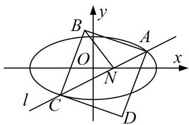

[规范解答] （1）由题意知，椭圆 E 的焦点在 x 轴且 b=1， $\frac{c}{a}=\frac{\sqrt{3}}{2}$ ，因为 $a^{2}=c^{2}+b^{2}$ ，解得 $a^{2}=4$ 。
故椭圆 E 的标准方程为 $\frac{x^{2}}{4} + y^{2} = 1$ .  
（2）设 $A(x_{1}, y_{1})$ ， $C(x_{2}, y_{2})$ ，线段 AC 的中点为 M，
联立 $\left\{\begin{aligned}y&=\frac{1}{2}x+m,\\ \frac{x^{2}}{4}+y^{2}&=1,\end{aligned}\right.$ ，消去y，得 $x^{2}+2mx+2m^{2}-2=0$ ，
由 $\Delta=(2m^{2})^{2}-4(2m^{2}-2)>0$ ．解得 $-\sqrt{2}<m<\sqrt{2}$ ， $x_{1}+x_{2}=-2m$ ， $x_{1}x_{2}=2m^{2}-2$ ，
$y _ {1} + y _ {2} = \frac {1}{2} (x _ {1} + x _ {2}) + 2 m = m, \therefore M (- m, \frac {m}{2}).$
$\therefore | A C | = \sqrt {1 + k ^ {2}} \cdot \sqrt {(x _ {1} + x _ {2}) ^ {2} - 4 x _ {1} x _ {2}} = \sqrt {1 0 - 5 m ^ {2}}.$
又直线 l 与 x 轴的交点 $N(-2m, 0)$ ，∴ $|MN| = \sqrt{\frac{5}{4} m^{2}}$
$\therefore |BN|^2 = |BM|^2 + |MN|^2 = \frac{1}{4} |AC|^2 + |MN|^2 = \frac{5}{2}$ ，故 $|BN|$ 为定值.

[例 2] 已知椭圆 $C: \frac{x^{2}}{a^{2}} + \frac{y^{2}}{b^{2}} = 1 (a > b > 0)$ 在右、上顶点分别为 A、B，F 是椭圆 C 的左焦点， $P(\frac{\sqrt{2}}{2}, \frac{\sqrt{3}}{2})$ 是椭圆 C 上的点，且 $|OB| = |OF|$ (O 是坐标原点).  
（1）求椭圆 C 的方程;  
（2）设直线 $l$ 与椭圆 $C$ 相切于点 $M(M$ 在第二象限)，过 $O$ 作直线 $l$ 的平行线与直线 $MF$ 相交于点 $N$ ，问：线段 $MN$ 的长是否为定值？若是，求出该定值；若不是，说明理由.

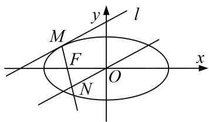

[规范解答] （1）由题可知 $\left\{ \begin{array}{l} b = c \\ \frac{1}{2a^2} + \frac{3}{4b^2} = 1 \\ a^2 = b^2 + c^2 \end{array} \right.$ 解得 $\left\{ \begin{array}{l} a^2 = 2, \\ b^2 = 1, \end{array} \right.$ 所以椭圆 $C$ 的方程为 $\frac{x^2}{2} + y^2 = 1$ .  
（2）由题 $F(-1, 0)$ ，设切点 $M(x_{0}, y_{0})$ ，则 $\frac{x_{0}^{2}}{2} + y_{0}^{2} = 1$ ，切线 $l: \frac{x_{0}x}{2} + y_{0}y = 1$ ，

而 $ON // l$ ，且 $ON$ 过原点，所以 $ON: \frac{x_0 x}{2} + y_0 y = 0$ ，

而直线 MF: $(x_{0}+1)y=y_{0}(x+1)$ ，联立 ON 与 MF 的方程可解得 $N(\frac{-2y_{0}^{2}}{2+x_{0}}, \frac{x_{0}y_{0}}{2+x_{0}})$ ,
则 $|MN|^{2}=(x_{0}+\frac{2y_{0}^{2}}{2+x_{0}})^{2}+(y_{0}-\frac{x_{0}y_{0}}{2+x_{0}})=(\frac{2+2x_{0}}{2+x_{0}})^{2}+(\frac{2y_{0}}{2+x_{0}})^{2}=2,$
所以 $|MN|=\sqrt{2}$ ，为定值.

[例 3] 已知椭圆 C: $\frac{x^{2}}{a^{2}} + \frac{y^{2}}{b^{2}} = 1 (a > b > 0)$ 的左、右顶点分别为 A, B, 左焦点为 F, O 为原点, 点 P 为椭圆 C 上不同于 A、B 的任一点, 若直线 PA 与 PB 的斜率之积为 $-\frac{3}{4}$ , 且椭圆 C 经过点 $(1, \frac{3}{2})$ .  
（1）求椭圆 C 的方程;  
（2）若 \(P\) 点不在坐标轴上, 直线 \(PA\), \(PB\) 交 \(y\) 轴于 \(M\), \(N\) 两点, 若直线 \(OT\) 与过点 \(M\), \(N\) 的圆 \(G\) 相切. 切点为 \(T\), 问切线长 \(\vert OT\)\) 是否为定值, 若是, 求出定值, 若不是, 请说明理由.

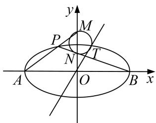

[规范解答] （1） 设 $P(x, y)$ ，由题意得 $A(-a, 0)$ ， $B(a, 0)$ ， $k_{AP} \cdot k_{BP} = \frac{y}{x + a} \cdot \frac{y}{x - a} = \frac{y^{2}}{x^{2} - a^{2}}$
$\therefore\frac{y^{2}}{x^{2}-a^{2}}=-\frac{3}{4}$ ，而 $\frac{x^{2}}{a^{2}}+\frac{y^{2}}{b^{2}}=1$ 得， $b^{2}=\frac{3}{4}a^{2}$ ①，
又过 $(1, \frac{3}{2})$ ， $\therefore \frac{1}{a^2} + \frac{9}{4b^2} = 1$ ②，所以由①②得： $a^2 = 4$ ， $b^2 = 3$ ；
所以椭圆 C 的方程为 $\frac{x^{2}}{4} + \frac{y^{2}}{3} = 1$ ;  
（2）由（1）得： $A(-2,0)$ ， $B(2,0)$ ，设 $P(m,n)$ ， $\frac{m^{2}}{4}+\frac{n^{2}}{3}=1$ ，
则直线的方程 PA: $y=\frac{n}{m+2}(x+2)$ ，令 x=0，则 $y=\frac{2n}{m+2}$ ，所以 $M(0, \frac{2n}{m+2})$ ,

直线 PB 的方程： $y=\frac{n}{m-2}(x-2)$ ，令 x=0，则 $y=\frac{-n}{m-2}$ ，所以 $N(0, \frac{-2n}{m-2})$ ,
$\because \triangle OTN \sim \triangle OMT, \therefore \frac{OT}{OM} = \frac{ON}{OT}$ (圆的切割线定理)，再联立 $\frac{m^{2}}{4} + \frac{n^{2}}{3} = 1$ ,
$\therefore O T ^ {2} = | O N | | O M | = \left| \frac {4 n ^ {2}}{m ^ {2} - 4} \right| = 3.$

[例 4] (2020·新高考I)已知椭圆 C: $\frac{x^{2}}{a^{2}}+\frac{y^{2}}{b^{2}}=1(a>b>0)$ 的离心率为 $\frac{\sqrt{2}}{2}$ ，且过点 A(2, 1).  
（1）求 C 的方程;  
（2）点 $M, N$ 在 $C$ 上，且 $AM \perp AN, AD \perp MN, D$ 为垂足．证明：存在定点 $Q$ ，使得 $|DQ|$ 为定值.

[规范解答] （1）由题意可得 $\left\{ \begin{array}{l} \frac{c}{a} = \frac{\sqrt{2}}{2}, \\ \frac{4}{a^2} + \frac{1}{b^2} = 1, \\ a^2 = b^2 + c^2, \end{array} \right.$ 解得 $a^2 = 6, b^2 = c^2 = 3$ ，故椭圆 $C$ 的方程为 $\frac{x^2}{6} + \frac{y^2}{3} = 1$  
（2）设点 $M(x_{1}, y_{1})$ ， $N(x_{2}, y_{2})$ 。因为 $AM \perp AN$ ，所以 $\overrightarrow{AM} \cdot \overrightarrow{AN} = 0$ ，
即 $(x_{1} - 2)(x_{2} - 2) + (y_{1} - 1)(y_{2} - 1) = 0.$ ①
当直线 MN 的斜率存在时，设其方程为 $y=kx+m$ ，如图 1.
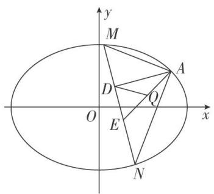

图1

代入椭圆方程消去 y 并整理，得 $(1+2k^{2})x^{2}+4kmx+2m^{2}-6=0$ ，
$x _ {1} + x _ {2} = - \frac {4 k m}{1 + 2 k ^ {2}}, x _ {1} x _ {2} = \frac {2 m ^ {2} - 6}{1 + 2 k ^ {2}}, \tag {②}$
根据 $y_{1}=kx_{1}+m,\quad y_{2}=kx_{2}+m$ ，代入①整理，可得
$(k ^ {2} + 1) x _ {1} x _ {2} + (k m - k - 2) \left(x _ {1} + x _ {2}\right) + (m - 1) ^ {2} + 4 = 0,$
将②代入上式，得 $(k^{2}+1)\frac{2m^{2}-6}{1+2k^{2}}+(km-k-2)\cdot\left(-\frac{4km}{1+2k^{2}}\right)+(m-1)^{2}+4=0,$

整理化简得 $(2k+3m+1)(2k+m-1)=0,$
因为 $A(2,1)$ 不在直线 MN 上，所以 $2k+m-1\neq0$ ，所以 $2k+3m+1=0$ ， $k\neq1$ ，
于是直线 MN 的方程为 $y=k\left(x-\frac{2}{3}\right)-\frac{1}{3}$ ，所以直线 MN 过定点 $E\left(\frac{2}{3}, -\frac{1}{3}\right)$ .
当直线 MN 的斜率不存在时，可得 $N(x_{1}, -y_{1})$ ，如图 2.
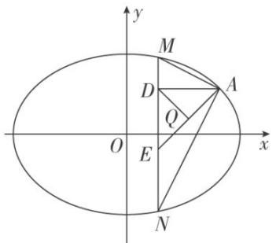

图2

代入 $(x_{1}-2)(x_{2}-2)+(y_{1}-1)(y_{2}-1)=0$ ，得 $(x_{1}-2)^{2}+1-y_{1}^{2}=0$ ，

结合 $\frac{x_{1}^{2}}{6}+\frac{y_{1}^{2}}{3}=1$ ，解得 $x_{1}=2$ （舍去）或 $x_{1}=\frac{2}{3}$ ，此时直线MN过点 $E\left(\frac{2}{3},-\frac{1}{3}\right)$ .
因为 $|AE|$ 为定值，且 $\triangle ADE$ 为直角三角形，AE为斜边，
所以 AE 的中点 Q 满足 $|DQ|$ 为定值 $\left(AE\right.$ 长度的一半 $\frac{1}{2}\sqrt{\left(2-\frac{2}{3}\right)^{2}+\left(1+\frac{1}{3}\right)^{2}}=\frac{2\sqrt{2}}{3}\right)$ .
由于 $A(2,1)$ ， $E\left(\frac{2}{3}, -\frac{1}{3}\right)$ ，故由中点坐标公式可得 $Q\left(\frac{4}{3}, \frac{1}{3}\right)$ .
故存在点 $Q\left(\frac{4}{3}, \frac{1}{3}\right)$ ，使得 $|DQ|$ 为定值.

[例 5] (2016·北京)已知椭圆 C: $\frac{x^{2}}{a^{2}}+\frac{y^{2}}{b^{2}}=1(a>b>0)$ 的离心率为 $\frac{\sqrt{3}}{2}$ ， $A(a,0)$ ， $B(0,b)$ ， $O(0,0)$ ， $\triangle OAB$ 的面积为 1.  
（1）求椭圆 C 的方程;  
（2）设 $P$ 是椭圆 $C$ 上一点，直线 $PA$ 与 $y$ 轴交于点 $M$ ，直线 $PB$ 与 $x$ 轴交于点 $N$ ．求证： $\vert AN\vert \cdot \vert BM\vert$ 为定值.

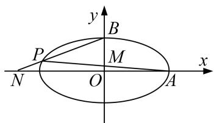

[规范解答] （1）由题意得 $\left\{ \begin{array}{l} \frac{c}{a} = \frac{\sqrt{3}}{2}, \\ \frac{1}{2} ab = 1, \\ a^2 = b^2 + c^2, \end{array} \right.$ 解得 $\left\{ \begin{array}{l} a = 2, \\ b = 1, \\ c = \sqrt{3}. \end{array} \right.$ 所以椭圆 $C$ 的方程为 $\frac{x^2}{4} + y^2 = 1$ .  
（2）证明：由（1）知， $A(2,0)$ ， $B(0,1)$ 。设 $P(x_{0},y_{0})$ ，则 $x_{0}^{2}+4y_{0}^{2}=4$ 。
当 $x_{0} \neq 0$ 时，直线 PA 的方程为 $y = \frac{y_{0}}{x_{0} - 2}(x - 2)$ .
令 x=0，得 $y_{M}=-\frac{2y_{0}}{x_{0}-2}$ ，从而 $|BM|=|1-y_{M}|=\left|1+\frac{2y_{0}}{x_{0}-2}\right|$ .

直线 $PB$ 的方程为 $y = \frac{y_0 - 1}{x_0} x + 1$ 。令 $y = 0$ ，得 $x_N = -\frac{x_0}{y_0 - 1}$ ，从而 $|AN| = |2 - x_N| = \left|2 + \frac{x_0}{y_0 - 1}\right|$ 。
所以 $|AN|\cdot |BM| = \left|2 + \frac{x_0}{y_0 - 1}\right|$ · $\left|1 + \frac{2y_0}{x_0 - 2}\right| = \left|\frac{x_0^2 + 4y_0^2 + 4x_0y_0 - 4x_0 - 8y_0 + 4}{x_0y_0 - x_0 - 2y_0 + 2}\right| =$ $\left|\frac{4x_0y_0 - 4x_0 - 8y_0 + 8}{x_0y_0 - x_0 - 2y_0 + 2}\right| = 4.$
当 $x_{0}=0$ 时， $y_{0}=-1$ ， $|BM|=2$ ， $|AN|=2$ ，所以 $|AN|\cdot|BM|=4$ 。综上， $|AN|\cdot|BM|$ 为定值。

[例 6] 已知椭圆 C: $\frac{x^{2}}{6}+\frac{y^{2}}{3}=1$ .  
（1）直线 l 过点 $D(1, 1)$ 与椭圆 C 交于 P，Q 两点，若 $\overrightarrow{PD} = \overrightarrow{DQ}$ ，求直线 $l_{1}$ 的方程；  
（2）在圆 $O: x^{2} + y^{2} = 2$ 上取一点 $M$ ，过点 $M$ 作圆 $O$ 的切线 $l'$ 与椭圆 $C$ 交于 $A, B$ 两点，求 $|MA| \cdot |MB|$ 的值.

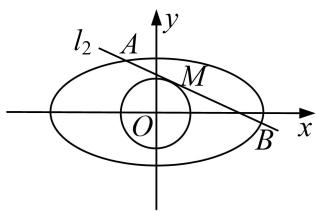

[规范解答] （1） 设 $P(x_{1}, y_{1})$ , $Q(x_{2}, y_{2})$ , $\because \overrightarrow{PD} = \overrightarrow{DQ}$ , $\therefore (1 - x_{1}, 1 - y_{1}) = (x_{2} - 1, y_{2} - 1)$ ,
即 $\left\{\begin{aligned}1-x_{1}&=x_{2}-1\\ 1-y_{1}&=y_{2}-1\end{aligned}\right.$ ，解得 $x_{1}+x_{2}=2,\quad y_{1}+y_{2}=2.$
∵P，Q两点在椭圆C上，∴ $\frac{x_{1}^{2}}{6}+\frac{y_{1}^{2}}{3}=1,\quad\frac{x_{2}^{2}}{6}+\frac{y_{2}^{2}}{3}=1,$

两式相减，得 $\frac{(x_{1}-x_{2})(x_{1}+x_{2})}{6}+\frac{(y_{1}-y_{2})(y_{1}+y_{2})}{3}=0$ ，则 $\frac{y_{1}-y_{2}}{x_{1}-x_{2}}=-\frac{1}{2}$
故直线 l 的方程为 $y-1=-\frac{1}{2}(x-1)$ ，即 $y=-\frac{1}{2}x+\frac{3}{2}$ .  
（2）当切线 $l_{2}$ 斜率不存在时，不妨设 $l'$ 的方程为 $x=\sqrt{2}$ ,
由椭圆 C 的方程可知， $A(\sqrt{2}, \sqrt{2})$ ， $B(\sqrt{2}, -\sqrt{2})$ ，
则 $\overrightarrow{OA} = (\sqrt{2},\sqrt{2}),\overrightarrow{OB} = (\sqrt{2}, - \sqrt{2}),\therefore \overrightarrow{OA}\overrightarrow{OB} = 0$ ，即 $OA\bot OB$
当切线 $l'$ 斜率存在时，可设 $l'$ 的方程为 $y=kx+m$ ， $A(x_{3}, y_{3})$ ， $B(x_{4}, y_{4})$ ，
$\therefore\frac{|m|}{\sqrt{1+k^{2}}}=\sqrt{2}$ ，即 $m^{2}=2(k^{2}+1)$
联立 $l'$ 和椭圆的方程，得 $(2k^{2}+1)x^{2}+4mkx+2m^{2}-6=0$ ，则 $\Delta=(4mk)^{2}-4(2k^{2}+1)(2m^{2}-6)>0$ ，
$x _ {1} + x _ {2} = - \frac {4 k m}{1 + 2 k ^ {2}}, x _ {1} x _ {2} = \frac {2 m ^ {2} - 6}{1 + 2 k ^ {2}}, \because \overrightarrow {O A} = (x _ {3}, y _ {3}), \overrightarrow {O B} = (x _ {4}, y _ {4}),$
$\therefore \overrightarrow {O A} \cdot \overrightarrow {O B} = x _ {3} x _ {4} + y _ {3} y _ {4} = x _ {3} x _ {4} + (k x _ {3} + m) (k x _ {4} + m) = (k ^ {2} + 1) x _ {3} x _ {4} + m k (x _ {3} + x _ {4}) + m ^ {2}$
$\begin{array}{l} = (k ^ {2} + 1) \frac {2 m ^ {2} - 6}{1 + 2 k ^ {2}} + m k (- \frac {4 k m}{1 + 2 k ^ {2}}) + m ^ {2} = \frac {(k ^ {2} + 1) (2 m ^ {2} - 6) - 4 m ^ {2} k ^ {2} + m ^ {2} (2 k ^ {2} + 1)}{1 + 2 k ^ {2}} \\ = \frac {3 m ^ {2} - 6 k ^ {2} - 6}{1 + 2 k ^ {2}} = \frac {3 (2 k ^ {2} + 2) - 6 k ^ {2} - 6}{1 + 2 k ^ {2}} = 0, O A \perp O B. \\ \end{array}$
综上所述，圆 O 上任意一点 M 处的切线交椭圆 C 于点 A, B，都有 $OA \perp OB$ .
在 Rt△OAB 中，由△OAM 与△BOM 相似，得 $\left|MA\right|\cdot\left|MB\right|=\left|OM\right|^{2}=2$ .

[例 7] 如图，已知椭圆 C: $\frac{x^{2}}{12} + \frac{y^{2}}{4} = 1$ ，点 B 是其下顶点，过点 B 的直线交椭圆 C 于另一点 A (A 点在 x 轴下方)，且线段 AB 的中点 E 在直线 y = x 上.  
（1）求直线 AB 的方程;  
（2）若点 $P$ 为椭圆 $C$ 上异于 $A, B$ 的动点，且直线 $AP, BP$ 分别交直线 $y = x$ 于点 $M, N$ ，证明： $|OM| \cdot |ON|$ 为定值.

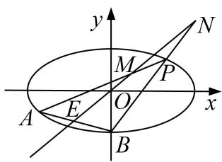

[规范解答] （1）设点 $E(m, m)$ ，由 $B(0, -2)$ 得 $A(2m, 2m+2)$ .
代入椭圆方程得 $\frac{4m^{2}}{12}+\frac{(2m+2)^{2}}{4}=1$ ，即 $\frac{m^{2}}{3}+(m+1)^{2}=1$ ，解得 $m=-\frac{3}{2}$ 或 $m=0$ (舍).
所以 $A(-3, -1)$ ，故直线 AB 的方程为 $x + 3y + 6 = 0$ .  
（2）设 $P(x_{0}, y_{0})$ ，则 $\frac{x_{0}^{2}}{12} + \frac{y_{0}^{2}}{4} = 1$ ，即 $y_{0}^{2} = 4 - \frac{x_{0}^{2}}{3}$ .
设 $M(x_{M}, y_{M})$ ，由 A, P, M 三点共线，即，∴ $\overrightarrow{AP} // \overrightarrow{AM}$ ，∴ $(x_{0}+3)(y_{M}+1)=(y_{0}+1)(x_{M}+3)$ ,
又点 M 在直线 y=x 上，解得 M 点的横坐标 $x_{M}=\frac{3y_{0}-x_{0}}{x_{0}-y_{0}+2}$ ,
设 $N(x_{N}, y_{N})$ ，由 B, P, N 三点共线，即 $\overrightarrow{BP} // \overrightarrow{BN}$ ，∴ $x_{0}(y_{N}+2)=(y_{0}+2)x_{N}$ ,

点 N 在直线 y=x 上，，解得 N 点的横坐标 $x_{N}=\frac{-2x_{0}}{x_{0}-y_{0}-2}$ .
所以 $OM \cdot ON = \sqrt{2} |x_M - 0| \cdot \sqrt{2} |x_N - 0| = 2|x_M ||x_N| = 2|\frac{3y_0 - x_0}{x_0 - y_0 + 2}| \cdot |\frac{-2x_0}{x_0 - y_0 - 2}|$
$= 2 \left| \frac {2 x _ {0} ^ {2} - 6 x _ {0} y _ {0}}{\left(x _ {0} - y _ {0}\right) ^ {2} - 4} \right| = 2 \left| \frac {2 x _ {0} ^ {2} - 6 x _ {0} y _ {0}}{x _ {0} ^ {2} - 2 x _ {0} y _ {0} - \frac {x _ {0} ^ {2}}{3}} \right| = 2 \left| \frac {x _ {0} ^ {2} - 3 x _ {0} y _ {0}}{\frac {x _ {0} ^ {2}}{3} - x _ {0} y _ {0}} \right| = 6.$

[例 8] 如图，已知 $M(x_{0}, y_{0})$ 是椭圆 C: $\frac{x^{2}}{6} + \frac{y^{2}}{3} = 1$ 上的任一点，从原点 O 向圆 $M: (x - x_{0})^{2} + (y - y_{0})^{2} = 2$ 作两条切线，分别交椭圆于点 P, Q.  
（1）若直线 OP, OQ 的斜率存在, 并记为 $k_{1}$ , $k_{2}$ , 求证: $k_{1}k_{2}$ 为定值;  
（2）试问 $|OP|^{2}+|OQ|^{2}$ 是否为定值？若是，求出该值；若不是，说明理由.

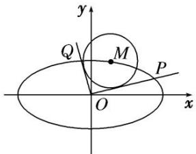

[规范解答] （1）证明：因为直线 $OP: y = k_{1}x$ ， $OQ: y = k_{2}x$ 与圆 $M$ 相切，所以 $\frac{|k_1x_0 - y_0|}{\sqrt{1 + k_1^2}} = \sqrt{2}$ ，
化简得： $(x_{0}^{2}-2)k_{1}^{2}-2x_{0}y_{0}k_{1}+y_{0}^{2}-2=0$ ，同理： $(x_{0}^{2}-2)k_{2}^{2}-2x_{0}y_{0}k_{2}+y_{0}^{2}-2=0$ ，
所以 $k_{1}$ ， $k_{2}$ 是关于 k 的方程 $(x_{0}^{2}-2)k^{2}-2x_{0}y_{0}k+y_{0}^{2}-2=0$ 的两个不相等的实数根，所以 $k_{1}\cdot k_{2}=\frac{y_{0}^{2}-2}{x_{0}^{2}-2}$ .
因为点 $M(x_{0}, y_{0})$ 在椭圆 C 上，所以 $\frac{x_{0}^{2}}{6} + \frac{y_{0}^{2}}{3} = 1$ ，即 $y_{0}^{2} = 3 - \frac{1}{2} x_{0}^{2}$ ，所以 $k_{1}k_{2} = \frac{1 - \frac{1}{2} x_{0}^{2}}{x_{0}^{2} - 2} = -\frac{1}{2}$ 为定值.  
（2） $|OP|^{2}+|OQ|^{2}$ 是定值，定值为9．理由如下：

①当 M 点坐标为 $(\sqrt{2}, \sqrt{2})$ 时，直线 OP，OQ 落在坐标轴上，显然有 $|OP|^{2} + |OQ|^{2} = 9$ .  
②当直线 OP, OQ 不落在坐标轴上时，设 $P(x_{1}, y_{1})$ , $Q(x_{2}, y_{2})$ ，因为 $k_{1}k_{2} = -\frac{1}{2}$ ，所以 $y_{1}^{2}y_{2}^{2} = \frac{1}{4}x_{1}^{2}x_{2}^{2}$ ,
因为 $P(x_{1}, y_{1})$ ， $Q(x_{2}, y_{2})$ 在椭圆 C 上，所以 $\left\{\begin{aligned}\frac{x_{1}^{2}}{6}+\frac{y_{1}^{2}}{3}&=1,\\ \frac{x_{2}^{2}}{6}+\frac{y_{2}^{2}}{3}&=1,\end{aligned}\right.$ 即 $\left\{\begin{aligned}y_{1}^{2}&=3-\frac{1}{2}x_{1}^{2},\\ y_{2}^{2}&=3-\frac{1}{2}x_{2}^{2},\end{aligned}\right.$
所以 $\left(3-\frac{1}{2}x_{1}^{2}\right)\left(3-\frac{1}{2}x_{2}^{2}\right)=\frac{1}{4}x_{1}^{2}x_{2}^{2}$ ，整理得 $x_{1}^{2}+x_{2}^{2}=6$ ，
所以 $y_{1}^{2}+y_{2}^{2}=\left(3-\frac{1}{2}x_{1}^{2}\right)+\left(3-\frac{1}{2}x_{2}^{2}\right)=3$ ，所以 $|OP|^{2}+|OQ|^{2}=9$ .

[例 9] 已知椭圆 C: $\frac{x^{2}}{a^{2}}+\frac{y^{2}}{b^{2}}=1(a>b>0)$ 经过 $(1,1)$ 与 $\left(\frac{\sqrt{6}}{2},\frac{\sqrt{3}}{2}\right)$ 两点.  
（1）求椭圆 C 的方程;  
（2）过原点的直线 l 与椭圆 C 交于 A, B 两点，椭圆 C 上一点 M 满足 $|MA| = |MB|$ . 求证 $\frac{1}{|OA|^{2}} + \frac{1}{|OB|^{2}} + \frac{2}{|OM|^{2}}$ 为定值.

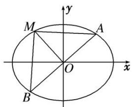

[规范解答] （1） 将 $(1, 1)$ 与 $\left(\frac{\sqrt{6}}{2}, \frac{\sqrt{3}}{2}\right)$ 两点代入椭圆 C 的方程，得 $\left\{\begin{aligned}\frac{1}{a^{2}}+\frac{1}{b^{2}}=1,\\ \frac{3}{2a^{2}}+\frac{3}{4b^{2}}=1,\end{aligned}\right.$ 解得 $\left\{\begin{aligned}a^{2}=3,\\ b^{2}=\frac{3}{2}.\end{aligned}\right.$
∴椭圆 C 的方程为 $\frac{x^{2}}{3} + \frac{2y^{2}}{3} = 1$ .  
（2）证明：由 $|MA|=|MB|$ ，知M在线段AB的垂直平分线上，由椭圆的对称性知A，B关于原点对称.

①若点 A, B 是椭圆的短轴顶点，则点 M 是椭圆的一个长轴顶点，
此时 $\frac{1}{|OA|^2} +\frac{1}{|OB|^2} +\frac{2}{|OM|^2} = \frac{1}{b^2} +\frac{1}{b^2} +\frac{2}{a^2} = 2.$

同理，若点 $A, B$ 是椭圆的长轴顶点，则点 $M$ 是椭圆的一个短轴顶点，
此时 $\frac{1}{|OA|^2} +\frac{1}{|OB|^2} +\frac{2}{|OM|^2} = \frac{1}{a^2} +\frac{1}{a^2} +\frac{2}{b^2} = 2.$

②若点 A, B, M 不是椭圆的顶点，设直线 l 的方程为 $y = kx (k \neq 0)$ ,
则直线 OM 的方程为 $y=-\frac{1}{k}x$ ，设 $A(x_{1},y_{1})$ ， $B(-x_{1},-y_{1})$ ，
由 $\left\{\begin{aligned}y=kx,\\ \frac{x^{2}}{3}+\frac{2y^{2}}{3}=1,\end{aligned}\right.$ 消去 y 得， $x^{2}+2k^{2}x^{2}-3=0$ ，解得 $x_{1}^{2}=\frac{3}{1+2k^{2}}$ ， $y_{1}^{2}=\frac{3k^{2}}{1+2k^{2}}$
$\therefore |OA|^2 = |OB|^2 = x_1^2 + y_1^2 = \frac{3(1 + k^2)}{1 + 2k^2}$ ，同理 $|OM|^2 = \frac{3(1 + k^2)}{2 + k^2}$
$\therefore \frac{1}{|OA|^2} + \frac{1}{|OB|^2} + \frac{2}{|OM|^2} = 2 \times \frac{1 + 2k^2}{3(1 + k^2)} + \frac{2(2 + k^2)}{3(1 + k^2)} = 2.$ 故 $\frac{1}{|OA|^2} + \frac{1}{|OB|^2} + \frac{2}{|OM|^2} = 2$ 为定值.

[例 10] 如图，已知椭圆 $C_{1}:\frac{x^{2}}{4}+y^{2}=1$ 的左、右顶点分别为 $A_{1}, A_{2}$ ，上、下顶点分别为 $B_{1}, B_{2}$ ，记四边形 $A_{1}B_{1}A_{2}B_{2}$ 的内切圆为圆 $C_{2}$ .  
（1）求圆 $C_{2}$ 的标准方程;  
（2）已知圆 $C_{2}$ 的一条不与坐标轴平行的切线 l 交椭圆 $C_{1}$ 于 P, M 两点.

(i)求证： $OP \perp OM;$

(ii)试探究 $\frac{1}{|OP|^2} +\frac{1}{|OM|^2}$ 是否为定值.

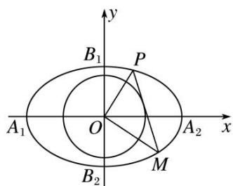

[规范解答] （1） 因为 $A_{2}$ ， $B_{1}$ 分别为椭圆 $C_{1}:\frac{x^{2}}{4}+y^{2}=1$ 的右顶点和上顶点，
则 $A_{2}$ ， $B_{1}$ 的坐标分别为 $(2,0)$ ， $(0,1)$ ，可得直线 $A_{2}B_{1}$ 的方程为 $x+2y=2$ .
则原点 O 到直线 $A_{2}B_{1}$ 的距离为 $d=\frac{2}{\sqrt{1+2^{2}}}=\frac{2}{\sqrt{5}}$ ，则圆 $C_{2}$ 的半径 $r=d=\frac{2}{\sqrt{5}}$ ,
故圆 $C_{2}$ 的标准方程为 $x^{2}+y^{2}=\frac{4}{5}$ .  
（2）(i)证明 可设切线 $l: y=kx+b(k\neq0)$ ， $P(x_{1},y_{1})$ ， $M(x_{2},y_{2})$
将直线 l 的方程代入椭圆 $C_{1}$ 可得 $\left(\frac{1}{4}+k^{2}\right)x^{2}+2kbx+b^{2}-1=0$ ，由根与系数的关系得，
$\begin{array}{l} \left\{ \begin{array}{l} x _ {1} + x _ {2} = - \frac {2 k b}{\frac {1}{4} + k ^ {2}}, \\ x _ {1} x _ {2} = \frac {b ^ {2} - 1}{\frac {1}{4} + k ^ {2}}, \end{array} \right. \\ \text {则} y _ {1} y _ {2} = (k x _ {1} + b) (k x _ {2} + b) = k ^ {2} x _ {1} x _ {2} + k b (x _ {1} + x _ {2}) + b ^ {2} = \frac {- k ^ {2} + \frac {1}{4} b ^ {2}}{\frac {1}{4} + k ^ {2}}, \\ \end{array}$
又 $l$ 与圆 $C_2$ 相切，可知原点 $O$ 到 $l$ 的距离 $d = \frac{|b|}{\sqrt{k^2 + 1^2}} = \frac{2}{\sqrt{5}}$ ，整理得 $k^2 = \frac{5}{4} b^2 - 1$
则 $y_{1}y_{2} = \frac{1 - b^{2}}{\frac{1}{4} + k^{2}}$ ，所以 $\overrightarrow{OP} \cdot \overrightarrow{OM} = x_{1}x_{2} + y_{1}y_{2} = 0$ ，故 $OP \perp OM$ .

(ii)由(i)知 $OP \perp OM,$

①当直线 OP 的斜率不存在时，显然 $|OP|=1$ ， $|OM|=2$ ，此时 $\frac{1}{|OP|^{2}}+\frac{1}{|OM|^{2}}=\frac{5}{4}$ ;  
②当直线 OP 的斜率存在时，设直线 OP 的方程为 $y=k_{1}x$ ,
代入椭圆方程可得 $\frac{x^{2}}{4}+k_{1}^{2}x^{2}=1$ ，则 $x^{2}=\frac{4}{1+4k_{1}^{2}}$
故 $|OP|^{2}=x^{2}+y^{2}=(1+k_{1}^{2})x^{2}=\frac{4(1+k_{1}^{2})}{1+4k_{1}^{2}}$ ，同理 $|OM|^{2}=\frac{4\left[1+\left(-\frac{1}{k_{1}}\right)^{2}\right]}{1+4\left(-\frac{1}{k_{1}}\right)^{2}}=\frac{4(k_{1}^{2}+1)}{k_{1}^{2}+4}$
则 $\frac{1}{|OP|^2} +\frac{1}{|OM|^2} = \frac{1 + 4k_1^2}{4(1 + k_1^2)} +\frac{k_1^2 + 4}{4(1 + k_1^2)} = \frac{5}{4}$ 综上可知， $\frac{1}{|OP|^2} +\frac{1}{|OM|^2} = \frac{5}{4}$ 为定值.

[例 11] 如图，已知椭圆 C: $\frac{x^{2}}{a^{2}}+\frac{y^{2}}{b^{2}}=1(a>b>0)$ 经过点 $(1,\frac{3}{2})$ ，且离心率为 $\frac{1}{2}$ .  
（1）求椭圆 C 的方程;  
（2）若直线 $l$ 过椭圆 $C$ 的左焦点 $F_{1}$ 交椭圆于 $A, B$ 两点， $AB$ 的中垂线交长轴于点 $D$ 。试探索 $\frac{|DF_1|}{|AB|}$ 是否为定值。若是，求出该定值；若不是，请说明理由。

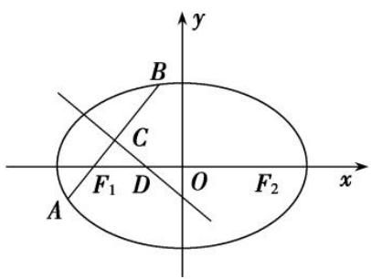

[规范解答] （1）椭圆 C 的离心率为 $\frac{1}{2}$ ，则 $\frac{c}{a} = \frac{1}{2}$ ，即 $a^{2} = 4c^{2}$ ， $b^{2} = a^{2} - c^{2} = 3c^{2}$ .
又因为椭圆 C: $\frac{x^{2}}{4c^{2}}+\frac{y^{2}}{3c^{2}}=1$ 经过点 $\left(1,\frac{3}{2}\right)$ ，所以 $\frac{1}{4c^{2}}+\frac{3}{4c^{2}}=1$ ，解得 c=1，
所以椭圆 C 的方程为 $\frac{x^{2}}{4} + \frac{y^{2}}{3} = 1$ .  
（2）①证明：当直线 l 与 x 轴重合时，点 D 与点 O 重合，A，B 为长轴顶点，则 $\frac{|DF_{1}|}{|AB|} = \frac{1}{4}$ .

②当直线 l 与 x 轴不重合时，设 $A(x_{1}, y_{1})$ ， $B(x_{2}, y_{2})$ ，直线 AB: x=my-1，
由 $\left\{ \begin{array}{l} x = my - 1, \\ \frac{x^2}{4} + \frac{y^2}{3} = 1, \end{array} \right.$ 得 $(3m^2 + 4)y^2 - 6my - 9 = 0$ ，则 $y_1 + y_2 = \frac{6m}{3m^2 + 4}, y_1y_2 = -\frac{9}{3m^2 + 4}, \Delta = 12^2 (m^2 + 1) > 0,$ 所以 $|AB| = \frac{\sqrt{m^2 + 1}}{3m^2 + 4} \cdot \sqrt{\Delta} = \frac{12(m^2 + 1)}{3m^2 + 4}$ .
设 AB 的中点为 $C(x_{3}, y_{3})$ ，则 $y_{3}=\frac{1}{2}(y_{1}+y_{2})=\frac{1}{2}\times\frac{6m}{3m^{2}+4}=\frac{3m}{3m^{2}+4}$
$x _ {3} = \frac {1}{2} (x _ {1} + x _ {2}) = \frac {1}{2} [ m (y _ {1} + y _ {2}) - 2 ] = - \frac {4}{3 m ^ {2} + 4},$
所以直线 $CD: y - \frac{3m}{3m^2 + 4} = -m\left(x + \frac{4}{3m^2 + 4}\right)$ ，令 $y = 0$ ，得 $x_D = -\frac{1}{3m^2 + 4}$ ，
则 $|DF_{1}|=-\frac{1}{3m^{2}+4}-(-1)=\frac{3(m^{2}+1)}{3m^{2}+4}$ ，所以 $\frac{|DF_{1}|}{|AB|}=\frac{3(m^{2}+1)}{3m^{2}+4}\div\frac{12(m^{2}+1)}{3m^{2}+4}=\frac{1}{4}$ 为定值.

[例12] 已知 $A$ ， $F$ 分别是椭圆 $C: \frac{x^2}{a^2} + \frac{y^2}{b^2} = 1 (a > b > 0)$ 的左顶点、右焦点，点 $P$ 为椭圆 $C$ 上一动点，当 $PF \perp x$ 轴时， $|AF| = 2|PF|$ .  
（1）求椭圆 C 的离心率;  
（2）若椭圆 C 上存在点 Q，使得四边形 AOPQ 是平行四边形(点 P 在第一象限)，求直线 AP 与 OQ 的斜率之积；  
（3）记圆 $O: x^{2} + y^{2} = \frac{ab}{a^{2} + b^{2}}$ 为椭圆 $C$ 的“关联圆”。若 $b = \sqrt{3}$ ，过点 $P$ 作椭圆 $C$ 的“关联圆”的两条切线，切点为 $M, N$ ，直线 $MN$ 在 $x$ 轴和 $y$ 轴上的截距分别为 $m, n$ ，求证： $\frac{3}{m^2} + \frac{4}{n^2}$ 为定值。
> 

> 
> | 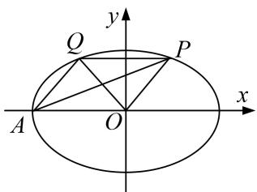 | 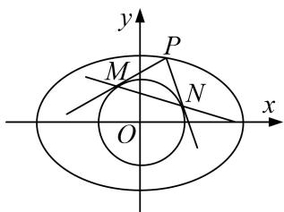 |
> | --- | --- |
> | （2）图 | （3）图 |
> 

[规范解答] （1）由 $PF \perp x$ 轴，知 $x_{P}=c$ ，代入椭圆 C 的方程，得 $\frac{c^{2}}{a^{2}}+\frac{y_{P}^{2}}{b^{2}}=1$ ，解得 $y_{P}=\pm\frac{b^{2}}{a}$ .
又 $|AF|=2|PF|$ ，所以 $a+c=\frac{2b^{2}}{a}$ ，所以 $a^{2}+ac=2b^{2}$ ，即 $a^{2}-2c^{2}-ac=0$ ，
所以 $2e^{2}+e-1=0$ ，由 0<e<1，解得 $e=\frac{1}{2}$ .  
（2）因为四边形 AOPQ 是平行四边形，所以 PQ=a 且 $PQ \parallel x$ 轴，
所以 $x_{P}=\frac{a}{2}$ ，代入椭圆 C 的方程，解得 $y_{P}=\pm\frac{\sqrt{3}}{2}b$ ，
因为点 P 在第一象限，所以 $y_{P}=\frac{\sqrt{3}}{2}b$ ，同理可得 $x_{Q}=-\frac{a}{2}$ ， $y_{Q}=\frac{\sqrt{3}}{2}b$ ，
所以 $k_{AP}k_{OQ}=\frac{\frac{\sqrt{3}b}{2}}{\frac{a}{2}-(-a)}\cdot\frac{\frac{\sqrt{3}b}{2}}{-\frac{a}{2}}=-\frac{b^{2}}{a^{2}}$ ，由（1）知 $e=\frac{c}{a}=\frac{1}{2}$ ，得 $\frac{b^{2}}{a^{2}}=\frac{3}{4}$ ，所以 $k_{AP}k_{OQ}=-\frac{3}{4}$ .  
（3）由（1）知 $e=\frac{c}{a}=\frac{1}{2}$ ，又 $b=\sqrt{3}$ ，解得 a=2，所以椭圆 C 的方程为 $\frac{x^{2}}{4}+\frac{y^{2}}{3}=1$ ，

圆 O 的方程为 $x^{2}+y^{2}=\frac{2\sqrt{3}}{7}$ ，①

连接 OM, ON(图略), 由题意可知, $OM \perp PM$ , $ON \perp PN$ ,
所以四边形 OMPN 的外接圆是以 OP 为直径的圆，
设 $P(x_{0}, y_{0})$ ，则四边形 OMPN 的外接圆方程为 $\left(x - \frac{x_{0}}{2}\right)^{2} + \left(y - \frac{y_{0}}{2}\right)^{2} = \frac{1}{4}(x_{0}^{2} + y_{0}^{2})$ ,
即 $x^{2}-xx_{0}+y^{2}-yy_{0}=0,$ ②

①-②，得直线 MN 的方程为 $xx_{0} + yy_{0} = \frac{2\sqrt{3}}{7}$ ，令 y = 0，则 $m = \frac{2\sqrt{3}}{7x_{0}}$ ，令 x = 0，则 $n = \frac{2\sqrt{3}}{7y_{0}}$ .
所以 $\frac{3}{m^{2}}+\frac{4}{n^{2}}=49\left(\frac{x_{0}^{2}}{4}+\frac{y_{0}^{2}}{3}\right)$ ，因为点P在椭圆C上，所以 $\frac{x_{0}^{2}}{4}+\frac{y_{0}^{2}}{3}=1$ ，所以 $\frac{3}{m^{2}}+\frac{4}{n^{2}}=49$ (为定值).

# 【对点训练】

1. 在平面直角坐标系 $xOy$ 中，过点 $M(4,0)$ 且斜率为 $k$ 的直线交椭圆 $\frac{x^2}{4} + y^2 = 1$ 于 $A, B$ 两点.  
（1）求 k 的取值范围;  
（2）当 $k \neq 0$ 时，若点 A 关于 x 轴为对称点为 P，直线 BP 交 x 轴于点 N，求证： $|ON|$ 为定值.

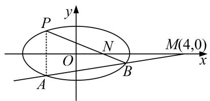

1. 解析 （1） 过点 $M(4, 0)$ 且斜率为 $k$ 的直线的方程为 $y = k(x - 4)$ ,
由 $\left\{ \begin{array}{l} y = k(x - 4), \\ \frac{x^2}{4} + y^2 = 1, \end{array} \right.$ 得 $\left(k^2 + \frac{1}{4}\right)x^2 - 8k^2x + 16k^2 - 1 = 0,$
因为直线与椭圆有两个交点，所以 $\Delta=(-8k^{2})^{2}-4\left(k^{2}+\frac{1}{4}\right)(16k^{2}-1)>0,$
解得 $-\frac{\sqrt{3}}{6}<k<\frac{\sqrt{3}}{6}$ ，所以k的取值范围是 $\left(-\frac{\sqrt{3}}{6},\frac{\sqrt{3}}{6}\right)$ .  
（2）设 $A(x_{1}, y_{1})$ ， $B(x_{2}, y_{2})$ ，则 $P(x_{1}, -y_{1})$ ，由题意知 $x_{1} \neq x_{2}$ ， $y_{1} \neq y_{2}$ ，
由（1）得 $x_{1}+x_{2}=\frac{8k^{2}}{k^{2}+\frac{1}{4}}$ ， $x_{1}\cdot x_{2}=\frac{16k^{2}-1}{k^{2}+\frac{1}{4}}$

直线 BP 的方程为 $\frac{x-x_{1}}{x_{2}-x_{1}}=\frac{y+y_{1}}{y_{2}+y_{1}}$ ，令 y=0，得 N 点的横坐标为 $\frac{y_{1}(x_{2}-x_{1})}{y_{2}+y_{1}}+x_{1}$ ，
又 $y_{1}=k(x_{1}-4)$ ， $y_{2}=k(x_{2}-4)$ ，
故 $|ON| = \left|\frac{y_1(x_2 - x_1)}{y_2 + y_1} + x_1\right| = \left|\frac{y_1x_2 + x_1y_2}{y_2 + y_1}\right| = \left|\frac{2kx_1x_2 - 4k(x_1 + x_2)}{k(x_1 + x_2) - 8k}\right| =$
$\left| \begin{array}{c} 2 k \cdot \frac {1 6 k ^ {2} - 1}{k ^ {2} + \frac {1}{4}} - 4 k \cdot \frac {8 k ^ {2}}{k ^ {2} + \frac {1}{4}} \\ \hline k \cdot \frac {8 k ^ {2}}{k ^ {2} + \frac {1}{4}} - 8 k \end{array} \right| = 1.$
即 $|ON|$ 为定值1.

2. 已知点 $F_{1}$ 为椭圆 $\frac{x^2}{a^2} + \frac{y^2}{b^2} = 1 (a > b > 0)$ 的左焦点， $P(-1, \frac{\sqrt{2}}{2})$ 在椭圆上， $PF_{1} \perp x$ 轴.  
（1）求椭圆的方程;  
（2）已知直线 $l: y = kx + m$ 与椭圆交于 $A, B$ 两点， $O$ 为坐标原点，且 $OA \perp OB, O$ 到直线 $l$ 的距离是否为定值？若是，求出该定值；若不是，请说明理由.

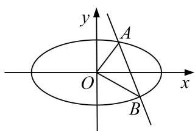

2. 解析 （1）令焦距为 $2c$ ，依题意可得 $F_{1}(-1, 0)$ ，右焦点 $F_{2}(1, 0)$ ，
$|PF_{1}|+|PF_{2}|=\frac{\sqrt{2}}{2}+\frac{3\sqrt{2}}{2}=2\sqrt{2}=2a$ ，所以 $a=\sqrt{2}$ ，b=1，所以椭圆方程为 $\frac{x^{2}}{2}+y^{2}=1$ ；  
（2）设 $A(x_{1},y_{1})$ ， $B(x_{2},y_{2})$ ，由 $\left\{ \begin{array}{l}y = kx + m,\\ \frac{x^2}{2} +y^2 = 1, \end{array} \right.$ 整理可得 $(2k^{2} + 1)x^{2} + 4kmx + 2m^{2} - 2 = 0,$
$x _ {1} + x _ {2} = \frac {- 4 k m}{1 + 2 k ^ {2}}, x _ {1} x _ {2} = \frac {2 m ^ {2} - 2}{1 + 2 k ^ {2}}.$
所以 $y_{1}y_{2}=(kx_{1}+m)(kx_{2}+m)=k^{2}x_{1}x_{2}+km(x_{1}+x_{2})+m^{2}=k^{2}\frac{2m^{2}-2}{1+2k^{2}}+km\frac{-4km}{1+2k^{2}}+m^{2}=\frac{m^{2}-2k^{2}}{1+2k^{2}}$
由 $\overrightarrow{OA} \cdot \overrightarrow{OB} = x_1x_2 + y_1y_2 = \frac{2m^2 - 2}{1 + 2k^2} + \frac{m^2 - 2k^2}{1 + 2k^2} = \frac{3m^2 - 2k^2 - 2}{1 + 2k^2} = 0$ ，得 $3m^2 = 2(k^2 + 1)$ ，
所以原点 O 到直线 l 的距离为 $\frac{|m|}{\sqrt{1+k^{2}}}=\frac{|m|}{\sqrt{\frac{3}{2}m^{2}}}=\frac{\sqrt{6}}{3}$ ，为定值.

3. 已知椭圆 $C: \frac{x^2}{a^2} + \frac{y^2}{b^2} = 1 (a > b > 0)$ 的离心率为 $\frac{\sqrt{3}}{2}$ ，且过点 $A(2, 1)$ .  
（1）求 C 的方程;  
（2）点 M, N 在 C 上，且 $AM \perp AN$ , $AD \perp MN$ , D 为垂足，问是否存在定点 Q，使得 $|DQ|$ 为定值，若存在，求出 Q 点，若不存在，请说明理由.

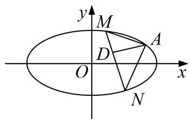

3. 解析 （1）由题意可得： $\begin{cases} \frac{c}{a} = \frac{\sqrt{3}}{2}, \\ \frac{4}{a^2} + \frac{1}{b^2} = 1, \\ a^2 = b^2 + c^2, \end{cases}$ 解得： $a^2 = 8$ ， $b^2 = 2$ ，故椭圆 $C$ 的方程为 $\frac{x^2}{8} + \frac{y^2}{2} = 1.$  
（2）设点 $M(x_{1}, y_{1})$ ， $N(x_{2}, y_{2})$ ,
若直线 MN 斜率存在时，设直线 MN 的方程为： $y=kx+m$ ，
代入椭圆方程消去 y 并整理得： $(1+4k^{2})x^{2}+8kmx+4m^{2}-8=0$
可得 $x_{1}+x_{2}=-\frac{8km}{1+4k^{2}}$ ， $x_{1}x_{2}=\frac{4m^{2}-8}{1+4k^{2}}$
因为 $AM \perp AN$ ，所以 $\overrightarrow{AM} \cdot \overrightarrow{AN} = 0$ ，即 $(x_{1}-2)(x_{2}-2) + (y_{1}-1)(y_{2}-1) = 0$ .
根据根据 $y_{1}=kx_{1}+m,\quad y_{2}=kx_{2}+m$ ，代入整理可得 $(k^{2}+1)x_{1}x_{2}+(km-k-2)(x_{1}+x_{2})+(m-1)^{2}+4=0,$
所以 $(k^{2} + 1)\frac{4m^{2} - 8}{1 + 4k^{2}} +(km - k - 2)\cdot \left(-\frac{8km}{1 + 4k^{2}}\right) + (m - 1)^{2} + 4 = 0,$

整理化简得 $(6k+5m+3)(2k+m-1)=0$ ,
因为 $A(2,1)$ 不在直线 MN 上，所以 $2k+m-1\neq0$ ，所以 $6k+5m+3=0$ ， $k\neq1$ ，
于是直线 MN 的方程为 $y=k\left(x-\frac{6}{5}\right)-\frac{3}{5}$ ，所以直线 MN 过定点 $P\left(\frac{6}{5}, -\frac{3}{5}\right)$ .
当直线 MN 的斜率不存在时，可得 $N(x_{1}, -y_{1})$ ,
代入 $(x_{1}-2)(x_{2}-2)+(y_{1}-1)(y_{2}-1)=0$ ，得 $(x_{1}-2)^{2}+1-y_{1}^{2}=0$ ，

结合 $\frac{x_{1}^{2}}{8}+\frac{y_{1}^{2}}{2}=1$ ，解得 $x_{1}=2$ （舍去）或 $x_{1}=\frac{6}{5}$ ，此时直线MN过点 $P\left(\frac{6}{5},-\frac{3}{5}\right)$ .
令 Q 为 AP 的中点，即 $Q(\frac{8}{5}, \frac{1}{5})$ ,
若 D 与 P 不重合，则由题设知 AP 是 Rt△ADP 的斜边，
所以 AE 的中点 Q 满足 $|DQ|$ 为定值 $\left\{AP \text{ 长度的一半 } \frac{1}{2} \sqrt{\left(2 - \frac{6}{5}\right)^{2} + \left(1 + \frac{3}{5}\right)^{2}} = \frac{2\sqrt{5}}{5}\right\}$ .
若 D 与 P 重合，则 $|DQ|=\frac{1}{2}|AP|$ ，故存在点 $Q(\frac{8}{5},\frac{1}{5})$ ，使得 $|DQ|$ 为定值.

4. 已知椭圆 $C: \frac{x^2}{a^2} + \frac{y^2}{b^2} = 1 (a > b > 0)$ ，离心率 $\mathrm{e} = \frac{\sqrt{2}}{2}$ ，点 $G(\sqrt{2}, 1)$ 在椭圆上.  
（1）求椭圆 C 的标准方程;  
（2）设点 $P$ 是椭圆 $C$ 上一点, 左顶点为 $A$ , 上顶点为 $B$ , 直线 $PA$ 与 $y$ 轴交于点 $M$ , 直线 $PB$ 与 $x$ 轴交于点 $N$ , 求证: $|AN| \cdot |BM|$ 为定值.

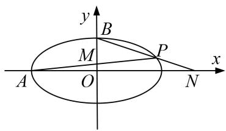

4. 解析 （1）依题意得 $e=\frac{\sqrt{2}}{2}$ ，设 $e=\sqrt{2}m$ ，则 a=2m， $a=\sqrt{2}m$ ，
由点 $G(\sqrt{2}, 1)$ 在椭圆上，有 $\frac{2}{a^2} + \frac{1}{b^2} = 1$ ，解得 $m = 1$ ，则 $a = 2, b = \sqrt{2}$ ，

椭圆 C 的方程为： $\frac{x^{2}}{4}+\frac{y^{2}}{2}=1$ .  
（2）设 $P(x_{0}, y_{0})$ ， $M(0, m)$ ， $N(n, 0)$ ， $A(-2, 0)$ ， $B(0, \sqrt{2})$ ，则 $Q(x_{2}, y_{2})$ ，由 A，P，M 三点共线，则有 $k_{PA}=k_{MA}$ ，即 $\frac{y_{0}}{x_{0}+2}=\frac{m}{2}$ ，解得 $m=\frac{2y_{0}}{x_{0}+2}$ ，则 $M(0, \frac{2y_{0}}{x_{0}+2})$ ，
由 $B, P, N$ 三点共线，有 $k_{PB} = k_{NB}$ ，即 $\frac{y_0 - \sqrt{2}}{x_0} = \frac{-\sqrt{2}x_0}{n}$ ，解得 $m = \frac{-\sqrt{2}x_0}{y_0 - \sqrt{2}}$ ，则 $N(0, \frac{-\sqrt{2}x_0}{y_0 - \sqrt{2}})$
$\begin{array}{l} | A N | \cdot | B M | = \left| \frac {- \sqrt {2} x _ {0}}{y _ {0} - \sqrt {2}} + 2 \right| \cdot \left| \frac {2 y _ {0}}{x _ {0} + 2} - \sqrt {2} \right| = \left| \frac {- \sqrt {2} x _ {0} + 2}{y _ {0} - \sqrt {2}} \frac {y _ {0} - 2 \sqrt {2}}{} \right| \cdot \left| \frac {2 y _ {0} - \sqrt {2} x _ {0} - 2 \sqrt {2}}{x _ {0} + 2} \right| \\ = \left| \frac {4 y _ {0} ^ {2} + 2 x _ {0} ^ {2} - 4 \sqrt {2} x _ {0} y _ {0} - 4 \sqrt {2} (2 y _ {0} - \sqrt {2} x _ {0}) + 8}{x _ {0} y _ {0} - \sqrt {2} x _ {0} + 2 y _ {0} - 2 \sqrt {2}} \right| \\ \end{array}$
又点 P 在椭圆上，满足 $\frac{x_{0}^{2}}{4} + \frac{y_{0}^{2}}{2} = 1$ ，有 $2x_{0}^{2} + 4y_{0}^{2} = 8$ ，
代入上式得 $|AN|\cdot|BM|=|\frac{-4\sqrt{2}x_{0}y_{0}-4\sqrt{2}(2y_{0}-\sqrt{2}x_{0})+16}{x_{0}y_{0}-\sqrt{2}x_{0}+2y_{0}-2\sqrt{2}}|=|\frac{4\sqrt{2}x_{0}y_{0}+4\sqrt{2}(2y_{0}-\sqrt{2}x_{0})-16}{x_{0}y_{0}+(2y_{0}-2\sqrt{2}x_{0})-2\sqrt{2}}|=4\sqrt{2},$
可知 $|AN|\cdot|BM|$ 为定值 $4\sqrt{2}$ .

5. 已知椭圆 $C: \frac{x^2}{a^2} + \frac{y^2}{b^2} = 1 (a > b > 0)$ 的离心率为 $\frac{\sqrt{3}}{2}$ ，且过点(0, 1).  
（1）求椭圆 C 的方程;  
（2）若点 A、B 为椭圆 C 的左右顶点，直线 l: $x=2\sqrt{2}$ 与 x 轴交于点 D，点 P 是椭圆 C 上异于 A、B 的动点，直线 AP、BP 分别交直线 l 于 E、F 两点，当点 P 在椭圆 C 上运动时， $|DE|\cdot|DF|$ 是否为定值？若是，请求出该定值；若不是，请说明理由.

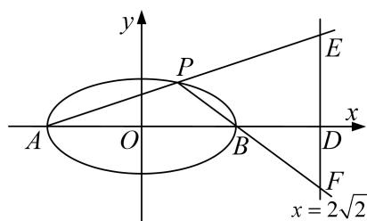

5. 解析 （1）由题意可知 b=1，又因为 $e=\frac{c}{a}=\frac{\sqrt{3}}{2}$ 且 $a^{2}=b^{2}+c^{2}$ ，解得 a=1，
所以椭圆 C 的方程为 $\frac{x^{2}}{4} + y^{2} = 1$ ;  
（2） $|DE|\cdot|DF|$ 为定值1.
由题意可得： $A(-2,0)$ ， $B(2,0)$ ，设 $B(x_{0},y_{0})$ ，由题意可得： $-2<x_{0}<2$ ，
所以直线 $AP$ 的方程为 $y = \frac{y_0}{x_0 + 2} (x + 2)$ ，令 $x = 2\sqrt{2}$ ，则 $y = \frac{(2\sqrt{2} + 2)y_0}{x_0 + 2}$ ，即 $|DE| = \frac{(2\sqrt{2} + 2)|y_0|}{|x_0 + 2|}$

同理：直线 $BP$ 的方程为 $y = \frac{y_0}{x_0 - 2} (x - 2)$ ，令 $x = 2\sqrt{2}$ ，则 $y = \frac{(2\sqrt{2} - 2)y_0}{x_0 - 2}$ ，即 $|DF| = \frac{(2\sqrt{2} - 2)|y_0|}{|x_0 - 2|}$
所以 $|DE|\cdot|DF|=\frac{(2\sqrt{2}+2)|y_{0}|}{|x_{0}+2|}\cdot\frac{(2\sqrt{2}-2)|y_{0}|}{|x_{0}-2|}=\frac{4y_{0}^{2}}{|x_{0}^{2}-4|}=\frac{4y_{0}^{2}}{4-x_{0}^{2}}.$

而 $\frac{x_{0}^{2}}{4}+y_{0}^{2}=1$ ，即 $4y_{0}^{2}=4-x_{0}^{2}$ ，代入上式得 $|DE|\cdot|DF|=1$ ，所以 $|DE|\cdot|DF|$ 为定值1.

6. 点 $P(1, 1)$ 为抛物线 $y^{2} = x$ 上一定点，斜率为 $-\frac{1}{2}$ 的直线与抛物线交于 $A, B$ 两点.  
（1）求弦 AB 中点 M 的纵坐标;  
（2）点 Q 是线段 PB 上任意一点(异于端点)，过 Q 作 PA 的平行线交抛物线于 E，F 两点，求证： $|QE|\cdot|QF|-|QP|\cdot|QB|$ 为定值.

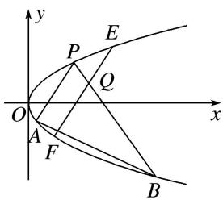

6. 解析 （1） $k_{AB}=\frac{y_{A}-y_{B}}{x_{A}-x_{B}}=\frac{1}{y_{A}+y_{B}}=-\frac{1}{2}, (*)$ ，所以 $y_{A}+y_{B}=-2, y_{M}=\frac{y_{A}+y_{B}}{2}=-1$ .  
（2）设 $Q(x_{0}, y_{0})$ ，直线 EF: $x - x_{0} = t_{1}(y - y_{0})$ ，直线 PB: $x - x_{0} = t_{2}(y - y_{0})$ ,
联立方程组 $\left\{ \begin{array}{l} x - x_0 = t_1(y - y_0), \\ y^2 = x, \end{array} \right.$ 得 $y^{2} - t_{1}y + t_{1}y_{0} - x_{0} = 0$ ，所以 $y_{E} + y_{F} = t_{1}, y_{E} \cdot y_{F} = t_{1}y_{0} - x_{0}$ ，
$|QE|\cdot|QF|=\sqrt{1+t_{1}^{2}}|y_{E}-y_{0}|\cdot\sqrt{1+t_{1}^{2}}|y_{F}-y_{0}|=(1+t_{1}^{2})|y_{0}^{2}-x_{0}|$ . 同理 $|QP|\cdot|QB|=(1+t_{2}^{2})|y_{0}^{2}-x_{0}|$ .
由(\*)可知， $t_{1}=\frac{1}{k_{EF}}=\frac{1}{k_{PA}}=y_{A}+y_{P},\quad t_{2}=\frac{1}{k_{PB}}=y_{B}+y_{P},$
所以 $t_{1}+t_{2}=(y_{A}+y_{B})+2y_{P}=-2+2=0$ ，即 $t_{1}=-t_{2}\Rightarrow t_{1}^{2}=t_{2}^{2}$
所以 $|QE|\cdot|QF|=|QP|\cdot|QB|$ ，即 $|QE|\cdot|QF|-|QP|\cdot|QB|=0$ 为定值.

7. 已知椭圆 $C: \frac{x^2}{a^2} + \frac{y^2}{b^2} = 1 (a > b > 0)$ 的离心率为 $\frac{3}{5}$ , 过左焦点 $F$ 且垂直于长轴的弦长为 $\frac{32}{5}$ .  
（1）求椭圆 C 的标准方程;  
（2）点 $P(m, 0)$ 为椭圆 C 的长轴上的一个动点，过点 P 且斜率为 $\frac{4}{5}$ 的直线 l 交椭圆 C 于 A, B 两点，证明： $|PA|^{2} + |PB|^{2}$ 为定值.

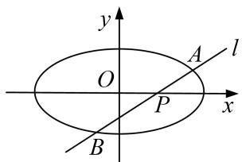

7. 解析 （1）由 $\left\{ \begin{array}{l} e = \frac{c}{a} = \frac{3}{5}, \\ \frac{2b^2}{a} = \frac{32}{5}, \\ a^2 = b^2 + c^2, \end{array} \right.$ 可得 $\left\{ \begin{array}{l} a = 5, \\ b = 4, \\ c = 3, \end{array} \right.$ 故椭圆 $C$ 的标准方程为 $\frac{x^2}{25} + \frac{y^2}{16} = 1$ .  
（2）设直线 l 的方程为 $x=\frac{5}{4}y+m$ ，代入 $\frac{x^{2}}{25}+\frac{y^{2}}{16}=1$ ，
消去 x，并整理得 $25y^{2}+20my+8(m^{2}-25)=0$ .
设 $A(x_{1}, y_{1})$ ， $B(x_{2}, y_{2})$ ，则 $y_{1} + y_{2} = -\frac{4}{5}m$ ， $y_{1}y_{2} = \frac{8(m^{2} - 25)}{25}$ ，
又 $|PA|^{2}=(x_{1}-m)^{2}+y_{1}^{2}=\frac{41}{16}y_{1}^{2}$ ，同理可得 $|PB|^{2}=\frac{41}{16}y_{2}^{2}$ .
则 $|PA|^{2}+|PB|^{2}=\frac{41}{16}(y_{1}^{2}+y_{2}^{2})=\frac{41}{16}[(y_{1}+y_{2})^{2}-2y_{1}y_{2}]=\frac{41}{16}\left[\left(-\frac{4m}{5}\right)_{2}-\frac{16(m^{2}-25)}{25}\right]=41.$
所以 $|PA|^{2}+|PB|^{2}$ 是定值.

8. 设 O 为坐标原点，动点 M 在椭圆 $\frac{x^{2}}{9} + \frac{y^{2}}{4} = 1$ 上，过 M 作 x 轴的垂线，垂足为 N，点 P 满足 $\overrightarrow{NP} = \sqrt{2}\overrightarrow{NM}$ .  
（1）求点 P 的轨迹 E 的方程;  
（2）过 $F(1,0)$ 的直线 $l_{1}$ 与点 P 的轨迹交于 A, B 两点，过 $F(1,0)$ 作与 $l_{1}$ 垂直的直线 $l_{2}$ 与点 P 的轨迹交于 C, D 两点，求证： $\frac{1}{|AB|} + \frac{1}{|CD|}$ 为定值.

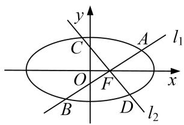

8. 解析 （1） 设 $P(x, y)$ , $M(x_0, y_0)$ , 则 $N(x, 0)$ . $\because \overrightarrow{NP} = \sqrt{2}$ $\overrightarrow{NM}$ , $\therefore (0, y) = \sqrt{2}(x_0 - x, y_0)$ ,
$\therefore x_0 = x, y_0 = \frac{y}{\sqrt{2}}.$ 又点 $M$ 在椭圆上， $\therefore \frac{x^2}{9} + \frac{\left(\frac{y}{\sqrt{2}}\right)^2}{4} = 1$ ，即 $\frac{x^2}{9} + \frac{y^2}{8} = 1.$
∴点 P 的轨迹 E 的方程为 $\frac{x^{2}}{9} + \frac{y^{2}}{8} = 1$ .  
（2）证明：由（1）知 F 为椭圆 $\frac{x^{2}}{9} + \frac{y^{2}}{8} = 1$ 的右焦点，
当直线 $l_{1}$ 与 x 轴重合时， $|AB|=6,\quad|CD|=\frac{2b^{2}}{a}=\frac{16}{3},\quad\therefore\frac{1}{|AB|}+\frac{1}{|CD|}=\frac{17}{48}.$
当直线 $l_{1}$ 与 x 轴垂直时， $|AB|=\frac{16}{3}$ ， $|CD|=6$ ，∴ $\frac{1}{|AB|}+\frac{1}{|CD|}=\frac{17}{48}$ .
当直线 $l_{1}$ 与 x 轴不垂直也不重合时，可设直线 $l_{1}$ 的方程为 $y=k(x-1)(k\neq0)$ ,
则直线 $l_{2}$ 的方程为 $y=-\frac{1}{k}(x-1)$ ,
设 $A(x_{1}, y_{1})$ ， $B(x_{2}, y_{2})$ ，联立 $\left\{\begin{aligned}y &= k(x-1),\\ \frac{x^{2}}{9} + \frac{y^{2}}{8} &= 1\end{aligned}\right.$ 消去 y，得 $(8+9k^{2})x^{2}-18k^{2}x+9k^{2}-72=0$ ，
则 $\Delta=(-18k^{2})^{2}-4(8+9k^{2})(9k^{2}-72)=2\ 304(k^{2}+1)>0,\quad x_{1}+x_{2}=\frac{18k^{2}}{8+9k^{2}},\quad x_{1}x_{2}=\frac{9k^{2}-72}{8+9k^{2}},$
$\therefore |AB| = \sqrt{1 + k^2} \cdot \sqrt{(x_1 + x_2)^2 - 4x_1x_2} = \frac{48(1 + k^2)}{8 + 9k^2}$ . 同理可得 $|CD| = \frac{48(1 + k^2)}{9 + 8k^2}$ .
$\therefore \frac{1}{|AB|} + \frac{1}{|CD|} = \frac{8 + 9k^2}{48(k^2 + 1)} + \frac{9 + 8k^2}{48(k^2 + 1)} = \frac{17}{48}$ . 综上可得 $\frac{1}{|AB|} + \frac{1}{|CD|}$ 为定值.

9. 已知椭圆 $C: \frac{x^2}{a^2} + \frac{y^2}{b^2} = 1 (a > b > 0)$ 的焦距为 $2\sqrt{3}$ , 斜率为 $\frac{1}{2}$ 的直线与椭圆交于 $A, B$ 两点, 若线段 $AB$ 的中点为 $D$ , 且直线 $OD$ 的斜率为 $-\frac{1}{2}$ .  
（1）求椭圆 C 的方程;  
（2）若过左焦点 F 斜率为 k 的直线 l 与椭圆交于 M, N 两点, P 为椭圆上一点, 且满足 $OP \perp MN$ , 问: $\frac{1}{|MN|} + \frac{1}{|OP|^{2}}$ 是否为定值? 若是, 求出此定值; 若不是, 说明理由.

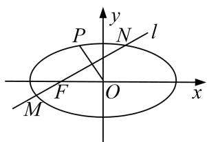

9. 解析 （1）由题意可知 $c = \sqrt{3}$ , 设 $A(x_{1}, y_{1}), B(x_{2}, y_{2})$ , 则 $\frac{x_1^2}{a^2} + \frac{y_1^2}{b^2} = 1, \frac{x_2^2}{a^2} + \frac{y_2^2}{b^2} = 1,$

两式相减并整理得， $\frac{y_{1}-y_{2}}{x_{1}-x_{2}}\cdot\frac{y_{1}+y_{2}}{x_{1}+x_{2}}=-\frac{b^{2}}{a^{2}}$ ，即 $k_{AB}\cdot k_{OD}=-\frac{b^{2}}{a^{2}}$ .
又因为 $k_{AB}=\frac{1}{2}$ ， $k_{OD}=-\frac{1}{2}$ ，代入上式得， $a^{2}=4b^{2}$ ，又 $a^{2}=b^{2}+c^{2}$ ， $c^{2}=3$ ，所以 $a^{2}=4$ ， $b^{2}=1$ ，
故椭圆的方程为 $\frac{x^{2}}{4}+y^{2}=1$ .  
（2）由题意可知， $F(-\sqrt{3},0)$ ，当MN为长轴时，OP为短半轴，则 $\frac{1}{|MN|}+\frac{1}{|OP|^{2}}=\frac{1}{4}+1=\frac{5}{4}$
否则，可设直线 l 的方程为 $y=k(x+\sqrt{3})$ ，联立 $\left\{\begin{aligned}\frac{x^{2}}{4}+y^{2}&=1,\\ y=k(x+\sqrt{3}),\end{aligned}\right.$ 消 y 得，
$(1+4k^{2})x^{2}+8\sqrt{3}k^{2}x+12k^{2}-4=0$ ，则有 $x_{1}+x_{2}=-\frac{8\sqrt{3}k^{2}}{1+4k^{2}}$ ， $x_{1}x_{2}=\frac{12k^{2}-4}{1+4k^{2}}$
所以 $|MN|=\sqrt{1+k^{2}}|x_{1}-x_{1}|=\sqrt{1+k^{2}}\sqrt{\left(-\frac{8\sqrt{3}k^{2}}{1+4k^{2}}\right)^{2}-4\left(\frac{12k^{2}-4}{1+4k^{2}}\right)}=\frac{4+4k^{2}}{1+4k^{2}},$
设直线 OP 方程为 $y = -\frac{1}{k}x$ ，联立 $\left\{\begin{aligned}\frac{x^{2}}{4} + y^{2} &= 1, \\ y &= -\frac{1}{k}x,\end{aligned}\right.$ 根据对称性不妨令 $P\left(-\frac{2k}{\sqrt{k^{2}+4}}, \frac{2}{\sqrt{k^{2}+4}}\right)$ ,
所以 $|OP|=\sqrt{\left(-\frac{2k}{\sqrt{k^{2}+4}}\right)^{2}+\left(\frac{2}{\sqrt{k^{2}+4}}\right)^{2}}=\sqrt{\frac{4+4k^{2}}{k^{2}+4}}.$
故 $\frac{1}{|MN|} +\frac{1}{|OP|^2} = \frac{1 + 4k^2}{4 + 4k^2} +\frac{1}{\left[\sqrt{\frac{4 + 4k^2}{k^2 + 4}}\right]2} = \frac{1 + 4k^2}{4 + 4k^2} +\frac{k^2 + 4}{4 + 4k^2} = \frac{5}{4},$
综上所述， $\frac{1}{|MN|}+\frac{1}{|OP|^{2}}$ 为定值 $\frac{5}{4}$ .

10. 在直角坐标系 $xOy$ 中, 动点 $P$ 与定点 $F(1, 0)$ 的距离和它到定直线 $x = 4$ 的距离之比是 $1:2$ , 设动点 $P$ 的轨迹为 $E$ .  
（1）求动点 P 的轨迹 E 的方程;  
（2）设过 F 的直线交轨迹 E 的弦为 AB，过原点的直线交轨迹 E 的弦为 CD，若 $CD \parallel AB$ ，求证： $\frac{|CD|^{2}}{|AB|}$ 为定值.

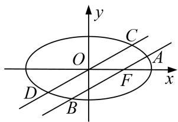

10. 解析 （1）设点 P 的坐标为 $(x, y)$ ，由题意得 $\frac{\sqrt{(x-1)^{2}+y^{2}}}{|x-4|}=\frac{1}{2}$ ，将两边平方，

并化简得 $\frac{x^{2}}{4}+\frac{y^{2}}{3}=1$ ，故轨迹E的方程是 $\frac{x^{2}}{4}+\frac{y^{2}}{3}=1$ .  
（2）①当直线 AB 的斜率不存在时，易求得 $\left|AB\right|=3,\quad\left|CD\right|=2\sqrt{3}$ ，则 $\frac{\left|CD\right|^{2}}{\left|AB\right|}=4.$

②当直线 AB 的斜率存在时，设直线 AB 的斜率为 k，依题意知 $k \neq 0$ ，
则直线 AB 的方程为 $y=k(x-1)$ ，直线 CD 的方程为 y=kx.
设 $A(x_{1}, y_{1})$ , $B(x_{2}, y_{2})$ , $C(x_{3}, y_{3})$ , $D(x_{4}, y_{4})$
由 $\left\{\begin{aligned}\frac{x^{2}}{4}+\frac{y^{2}}{3}=1,\\ y=k(x-1)\end{aligned}\right.$ 得 $(3+4k^{2})x^{2}-8k^{2}x+4k^{2}-12=0$ ，则 $x_{1}+x_{2}=\frac{8k^{2}}{3+4k^{2}}$ ， $x_{1}x_{2}=\frac{4k^{2}-12}{3+4k^{2}}$
$| A B | = \sqrt {1 + k ^ {2}} \cdot | x _ {1} - x _ {2} | = \sqrt {1 + k ^ {2}} \cdot \sqrt {\left(\frac {8 k ^ {2}}{3 + 4 k ^ {2}}\right) ^ {2} - 4 \cdot \frac {4 k ^ {2} - 1 2}{3 + 4 k ^ {2}}} = \frac {1 2 (1 + k ^ {2})}{3 + 4 k ^ {2}}.$
由 $\left\{ \begin{array}{l} \frac{x^2}{4} + \frac{y^2}{3} = 1, \\ y = kx \end{array} \right.$ 整理得 $x^{2} = \frac{12}{3 + 4k^{2}}$ ，则 $|x_{3} - x_{4}| = \frac{4\sqrt{3}}{\sqrt{3 + 4k^{2}}}$ . $|CD| = \sqrt{1 + k^{2}} \times |x_{3} - x_{4}| = 4\sqrt{\frac{3(1 + k^{2})}{3 + 4k^{2}}}$ .
$\therefore \frac{|CD|^2}{|AB|} = \frac{48(1 + k^2)}{3 + 4k^2} \cdot \frac{3 + 4k^2}{12(1 + k^2)} = 4.$ 综合①②知 $\frac{|CD|^2}{|AB|} = 4$ ，为定值.

