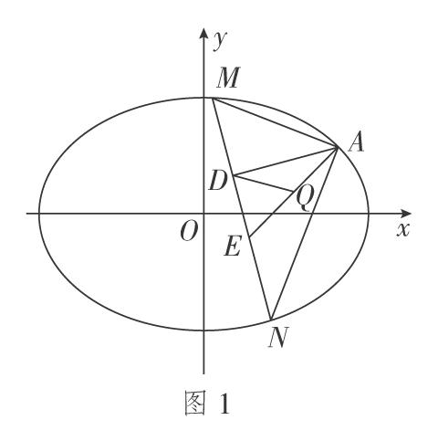
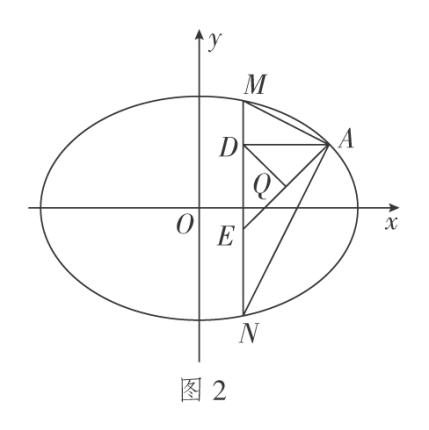
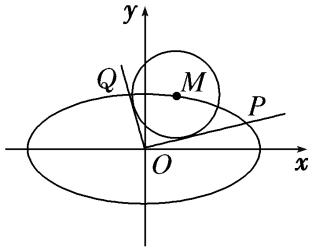
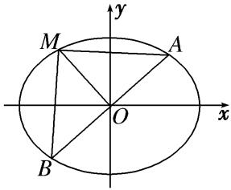
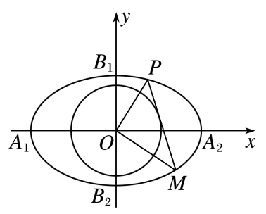
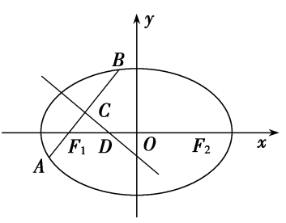
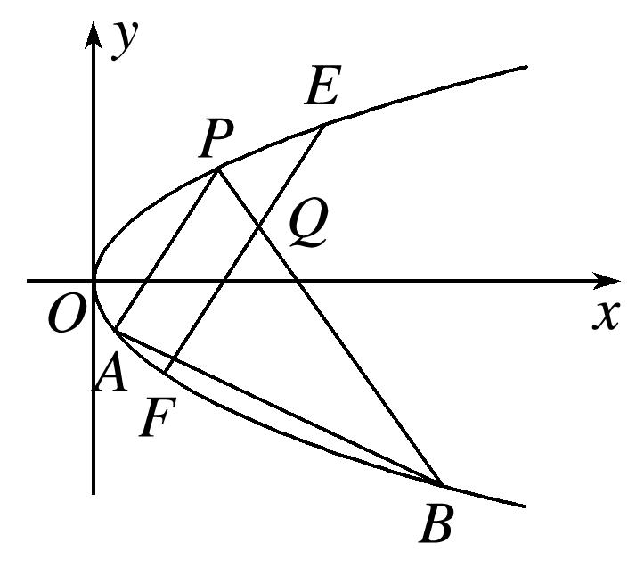

**专题19　距离型定值型问题**

**【例题选讲】**

<strong>[例1]</strong>　已知椭圆<em>C</em>：＋＝1(<em>a</em>＞<em>b</em>＞0)过点(0，1)，且离心率为．

(1)求椭圆*E*的标准方程；

(2)设直线*l*：*y*＝*x*＋*m*与椭圆*E*交于*A*，*C*两点，以*AC*为对角线作正方形*ABCD*，记直线*l*与*x*轴的交点为*N*，求证：|*BN*|为定值．

<strong>[规范解答]</strong>　(1)由题意知，椭圆<em>E</em>的焦点在<em>x</em>轴且<em>b</em>＝1，＝，因为<em>a</em>2＝<em>c</em>2＋<em>b</em>2，解得<em>a</em>2＝4．

故椭圆<em>E</em>的标准方程为＋<em>y</em>2＝1．

(2)设<em>A</em>(<em>x</em>1，<em>y</em>1)，<em>C</em>(<em>x</em>2，<em>y</em>2)，线段<em>AC</em>的中点为<em>M</em>，

联立，消去<em>y</em>，得<em>x</em>2＋2<em>mx</em>＋2<em>m</em>2－2＝0，

由<em>Δ</em>＝(2<em>m</em>2)2－4(2<em>m</em>2－2) &gt;0．解得－&lt;<em>m</em>&lt;，<em>x</em>1＋<em>x</em>2＝－2<em>m</em>，<em>x</em>1<em>x</em>2＝2<em>m</em>2－2，

<em>y</em>1＋<em>y</em>2＝(<em>x</em>1＋<em>x</em>2)＋2<em>m</em>＝<em>m</em>，∴<em>M</em> (－<em>m</em>，)．

∴|*AC*|＝·＝．

又直线*l*与*x*轴的交点*N*(－2*m*，0)，∴|*MN*|＝

∴|<em>BN</em>|2＝|<em>BM</em>|2＋|<em>MN</em>|2＝|<em>AC</em>|2＋|<em>MN</em>|2＝，故|<em>BN</em>|为定值．

<strong>[例2]</strong>　已知椭圆<em>C</em>：＋＝1(<em>a</em>＞<em>b</em>＞0)在右、上顶点分别为<em>A</em>、<em>B</em>，<em>F</em>是椭圆<em>C</em>的左焦点，<em>P</em>(，)是椭圆<em>C</em>上的点，且|<em>OB</em>|＝|<em>OF</em>|(<em>O</em>是坐标原点)．

(1)求椭圆*C*的方程；

(2)设直线*l*与椭圆*C*相切于点*M*(*M*在第二象限)，过*O*作直线*l*的平行线与直线*MF*相交于点*N*，问：线段*MN*的长是否为定值？若是，求出该定值；若不是，说明理由．

<strong>[规范解答]</strong>　(1)由题可知解得所以椭圆<em>C</em>的方程为＋<em>y</em>2＝1．

(2)由题<em>F</em>(－1，0)，设切点<em>M</em>(<em>x</em>0，<em>y</em>0)，则＋<em>y</em>02＝1，切线<em>l</em>：＋<em>y</em>0<em>y</em>＝1，

而<em>ON</em>∥<em>l</em>，且<em>ON</em>过原点，所以<em>ON</em>：＋<em>y</em>0<em>y</em>＝0，

而直线<em>MF</em>：(<em>x</em>0＋1)<em>y</em>＝<em>y</em>0 (<em>x</em>＋1)，联立<em>ON</em>与<em>MF</em>的方程可解得<em>N</em>(，)，

则|<em>MN</em>|2＝(<em>x</em>0＋)2＋(<em>y</em>0－)＝()2＋()2＝2，

所以|*MN*|＝，为定值．

<strong>[例3]</strong>　已知椭圆<em>C</em>：＋＝1(<em>a</em>＞<em>b</em>＞0)的左、右顶点分别为<em>A</em>，<em>B</em>，左焦点为<em>F</em>，<em>O</em>为原点，点<em>P</em>为椭圆<em>C</em>上不同于<em>A</em>、<em>B</em>的任一点，若直线<em>PA</em>与<em>PB</em>的斜率之积为－，且椭圆<em>C</em>经过点(1，)．

(1)求椭圆*C*的方程；

(2)若*P*点不在坐标轴上，直线*PA*，*PB*交*y*轴于*M*，*N*两点，若直线*OT*与过点*M*，*N*的圆*G*相切．切点为*T*，问切线长|*OT*|是否为定值，若是，求出定值，若不是，请说明理由．

<strong>[规范解答]</strong>　(1)设<em>P</em>(<em>x</em>，<em>y</em>)，由题意得<em>A</em>(－<em>a</em>，0)，<em>B</em>(<em>a</em>，0)，<em>kAP</em>·<em>kBP</em>＝·＝，

∴＝－，而＋＝1得，<em>b</em>2＝<em>a</em>2      ①，

又过(1，)，∴＋＝1      ②，所以由①②得：<em>a</em>2＝4，<em>b</em>2＝3；

所以椭圆*C*的方程为＋＝1；

(2)由(1)得：*A*(－2，0），*B*(2，0），设*P*(*m*，*n*），＋＝1，

则直线的方程*PA*：*y*＝(*x*＋2)，令*x*＝0，则*y*＝，所以*M*(0，)，

直线*PB*的方程：*y*＝(*x*－2)，令*x*＝0，则*y*＝，所以*N*(0，)，

∵△*OTN*∽△*OMT*，∴＝ (圆的切割线定理)，再联立＋＝1，

∴<em>OT</em>2＝|<em>ON</em>||<em>OM</em>|＝||＝3．

<strong>[例4]</strong>　(2020·新高考Ⅰ)已知椭圆<em>C</em>：＋＝1(<em>a</em>&gt;<em>b</em>&gt;0)的离心率为，且过点<em>A</em>(2，1)．

(1)求*C*的方程；

(2)点*M*，*N*在*C*上，且*AM*⊥*AN*，*AD*⊥*MN*，*D*为垂足．证明：存在定点*Q*，使得|*DQ*|为定值．

<strong>[规范解答]</strong>　(1)由题意可得解得<em>a</em>2＝6，<em>b</em>2＝<em>c</em>2＝3，故椭圆<em>C</em>的方程为＋＝1．

(2)设点<em>M</em>(<em>x</em>1，<em>y</em>1)，<em>N</em>(<em>x</em>2，<em>y</em>2)．因为<em>AM</em>⊥<em>AN</em>，所以·＝0，

即(<em>x</em>1－2)(<em>x</em>2－2)＋(<em>y</em>1－1)(<em>y</em>2－1)＝0．①

当直线*MN*的斜率存在时，设其方程为*y*＝*kx*＋*m*，如图1．

代入椭圆方程消去<em>y</em>并整理，得(1＋2<em>k</em>2)<em>x</em>2＋4<em>kmx</em>＋2<em>m</em>2－6＝0，

<em>x</em>1＋<em>x</em>2＝－，<em>x</em>1<em>x</em>2＝，②

根据<em>y</em>1＝<em>kx</em>1＋<em>m</em>，<em>y</em>2＝<em>kx</em>2＋<em>m</em>，代入①整理，可得

(<em>k</em>2＋1)<em>x</em>1<em>x</em>2＋(<em>km</em>－<em>k</em>－2)(<em>x</em>1＋<em>x</em>2)＋(<em>m</em>－1)2＋4＝0，

将②代入上式，得(<em>k</em>2＋1)＋(<em>km</em>－<em>k</em>－2)·＋(<em>m</em>－1)2＋4＝0，

整理化简得(2*k*＋3*m*＋1)(2*k*＋*m*－1)＝0，

因为*A*(2，1)不在直线*MN*上，所以2*k*＋*m*－1≠0，所以2*k*＋3*m*＋1＝0，*k*≠1，

于是直线*MN*的方程为*y*＝*k*－，所以直线*MN*过定点*E*．

当直线<em>MN</em>的斜率不存在时，可得<em>N</em>(<em>x</em>1，－<em>y</em>1)，如图2．

代入(<em>x</em>1－2)(<em>x</em>2－2)＋(<em>y</em>1－1)(<em>y</em>2－1)＝0，得(<em>x</em>1－2)2＋1－<em>y</em>＝0，

结合＋＝1，解得<em>x</em>1＝2(舍去)或<em>x</em>1＝，此时直线<em>MN</em>过点<em>E</em>．

因为|*AE*|为定值，且△*ADE*为直角三角形，*AE*为斜边，

所以*AE*的中点*Q*满足|*DQ*|为定值．

由于*A*(2，1)，*E*，故由中点坐标公式可得*Q*．

故存在点*Q*，使得|*DQ*|为定值．

<strong>[例5]</strong>　(2016·北京)已知椭圆<em>C</em>：＋＝1(<em>a</em>&gt;<em>b</em>&gt;0)的离心率为，<em>A</em>(<em>a</em>，0)，<em>B</em>(0，<em>b</em>)，<em>O</em>(0，0)，△<em>OAB</em>的面积为1．

(1)求椭圆*C*的方程；

(2)设*P*是椭圆*C*上一点，直线*PA*与*y*轴交于点*M*，直线*PB*与*x*轴交于点*N*．求证：|*AN*|·|*BM*|为定值．

<strong>[规范解答]</strong>　(1)由题意得解得所以椭圆<em>C</em>的方程为＋<em>y</em>2＝1．

(2)证明：由(1)知，<em>A</em>(2，0)，<em>B</em>(0，1)．设<em>P</em>(<em>x</em>0，<em>y</em>0)，则<em>x</em>＋4<em>y</em>＝4．

当<em>x</em>0≠0时，直线<em>PA</em>的方程为<em>y</em>＝(<em>x</em>－2)．

令<em>x</em>＝0，得<em>yM</em>＝－，从而|<em>BM</em>|＝|1－<em>yM</em>|＝．

直线<em>PB</em>的方程为<em>y</em>＝<em>x</em>＋1．令<em>y</em>＝0，得<em>xN</em>＝－，从而|<em>AN</em>|＝|2－<em>xN</em>|＝．

所以|*AN*|·|*BM*|＝·＝＝＝4．

当<em>x</em>0＝0时，<em>y</em>0＝－1，|<em>BM</em>|＝2，|<em>AN</em>|＝2，所以|<em>AN</em>|·|<em>BM</em>|＝4．综上，|<em>AN</em>|·|<em>BM</em>|为定值．

<strong>[例6]</strong>　已知椭圆<em>C</em>：＋＝1．

(1)直线<em>l</em>过点<em>D</em>(1，1)与椭圆<em>C</em>交于<em>P</em>，<em>Q</em>两点，若＝，求直线<em>l</em>1的方程；

(2)在圆<em>O</em>：<em>x</em>2＋<em>y</em>2＝2上取一点<em>M</em>，过点<em>M</em>作圆<em>O</em>的切线<em>l</em>′与椭圆<em>C</em>交于<em>A</em>，<em>B</em>两点，求|<em>MA</em>|·|<em>MB</em>|的值．

<strong>[规范解答]</strong>　(1)设<em>P</em>(<em>x</em>1，<em>y</em>1)，<em>Q</em>(<em>x</em>2，<em>y</em>2)，∵＝，∴(1－<em>x</em>1，1－<em>y</em>1)＝(<em>x</em>2－1，<em>y</em>2－1)，

即，解得<em>x</em>1＋<em>x</em>2＝2，<em>y</em>1＋<em>y</em>2＝2．

∵*P*，*Q*两点在椭圆*C*上，∴＋＝1，＋＝1，

两式相减，得＋＝0，则＝－，

故直线*l*的方程为*y*－1＝－(*x*－1)，即*y*＝－*x*＋．

(2)当切线<em>l</em>2斜率不存在时，不妨设<em>l</em>′的方程为<em>x</em>＝，

由椭圆*C*的方程可知，*A*(，)，*B*(，－)，

则＝(，)，＝(，－)，∴＝0，即*OA*⊥*OB*．

当切线<em>l</em>′斜率存在时，可设<em>l</em>′的方程为<em>y</em>＝<em>kx</em>＋<em>m</em>，<em>A</em>(<em>x</em>3，<em>y</em>3)，<em>B</em>(<em>x</em>4，<em>y</em>4)，

∴＝，即<em>m</em>2＝2(<em>k</em>2＋1)

联立<em>l</em>′和椭圆的方程，得(2<em>k</em>2＋1)<em>x</em>2＋4<em>mkx</em>＋2<em>m</em>2－6＝0，则<em>Δ</em>＝(4<em>mk</em>)2－4(2<em>k</em>2＋1) (2<em>m</em>2－6)&gt;0，

<em>x</em>1＋<em>x</em>2＝－，<em>x</em>1<em>x</em>2＝，∵＝(<em>x</em>3，<em>y</em>3)，＝(<em>x</em>4，<em>y</em>4)，

∴·＝<em>x</em>3<em>x</em>4＋<em>y</em>3<em>y</em>4＝<em>x</em>3<em>x</em>4＋(<em>kx</em>3＋<em>m</em>)(<em>kx</em>4＋<em>m</em>)＝(<em>k</em>2＋1) <em>x</em>3<em>x</em>4＋<em>mk</em>(<em>x</em>3＋<em>x</em>4)＋<em>m</em>2

＝(<em>k</em>2＋1)＋<em>mk</em>(－)＋<em>m</em>2＝

＝＝＝0，*OA*⊥*OB*．

综上所述，圆*O*上任意一点*M*处的切线交椭圆*C*于点*A*，*B*，都有*OA*⊥*OB*．

在Rt△<em>OAB</em>中，由△<em>OAM</em>与△<em>BOM</em>相似，得|<em>MA</em>|·|<em>MB</em>|＝|<em>OM</em>|2＝2．

<strong>[例7]</strong>　如图，已知椭圆<em>C</em>：＋＝1，点<em>B</em>是其下顶点，过点<em>B</em>的直线交椭圆<em>C</em>于另一点<em>A</em>(<em>A</em>点在<em>x</em>轴下方)，且线段<em>AB</em>的中点<em>E</em>在直线<em>y</em>＝<em>x</em>上．

(1)求直线*AB*的方程；

(2)若点*P*为椭圆*C*上异于*A*、*B*的动点，且直线*AP*，*BP*分别交直线*y*＝*x*于点*M*、*N*，证明：|*OM*|·|*ON*|为定值．

<strong>[规范解答]</strong>　(1)设点<em>E</em>(<em>m</em>，<em>m</em>)，由<em>B</em>(0，－2)得<em>A</em>(2<em>m</em>，2<em>m</em>＋2)．

代入椭圆方程得＋＝1，即＋(<em>m</em>＋1)2＝1，解得<em>m</em>＝－或<em>m</em>＝0(舍)．

所以*A*(－3，－1)，故直线*AB*的方程为*x*＋3*y*＋6＝0．

(2)设<em>P</em>(<em>x</em>0，<em>y</em>0)，则＋＝1，即<em>y</em>02＝4－．

设<em>M</em>(<em>xM</em>，<em>yM</em>)，由<em>A</em>，<em>P</em>，<em>M</em>三点共线，即，∴∥，∴(<em>x</em>0＋3)( <em>yM</em>＋1)＝(<em>y</em>0＋1)(<em>xM</em>＋3)，

又点<em>M</em>在直线<em>y</em>＝<em>x</em>上，解得<em>M</em>点的横坐标<em>xM</em>＝，

设<em>N</em>(<em>xN</em>，<em>yN</em>)，由<em>B</em>，<em>P</em>，<em>N</em>三点共线，即∥，∴<em>x</em>0( <em>yN</em>＋2)＝(<em>y</em>0＋2)<em>xN</em>，

点<em>N</em>在直线<em>y</em>＝<em>x</em>上，，解得<em>N</em>点的横坐标<em>xN</em>＝．

所以<em>OM</em>·<em>ON</em>＝| <em>xM</em>－0|·|<em>xN</em>－0|＝2|<em>xM</em> ||<em>xN</em>|＝2||·||

＝2||＝2||＝2||＝6．

<strong>[例8]</strong>　如图，已知<em>M</em>(<em>x</em>0，<em>y</em>0)是椭圆<em>C</em>：＋＝1上的任一点，从原点<em>O</em>向圆<em>M</em>：(<em>x</em>－<em>x</em>0)2＋(<em>y</em>－<em>y</em>0)2＝2作两条切线，分别交椭圆于点<em>P</em>，<em>Q</em>．

(1)若直线<em>OP</em>，<em>OQ</em>的斜率存在，并记为<em>k</em>1，<em>k</em>2，求证：<em>k</em>1<em>k</em>2为定值；

(2)试问|<em>OP</em>|2＋|<em>OQ</em>|2是否为定值？若是，求出该值；若不是，说明理由．

<strong>[规范解答]</strong>　(1)证明：因为直线<em>OP</em>：<em>y</em>＝<em>k</em>1<em>x</em>，<em>OQ</em>：<em>y</em>＝<em>k</em>2<em>x</em>与圆<em>M</em>相切，所以＝，

化简得：(<em>x</em>－2)<em>k</em>－2<em>x</em>0<em>y</em>0<em>k</em>1＋<em>y</em>－2＝0，同理：(<em>x</em>－2)<em>k</em>－2<em>x</em>0<em>y</em>0<em>k</em>2＋<em>y</em>－2＝0，

所以<em>k</em>1，<em>k</em>2是关于<em>k</em>的方程(<em>x</em>－2)<em>k</em>2－2<em>x</em>0<em>y</em>0<em>k</em>＋<em>y</em>－2＝0的两个不相等的实数根，所以<em>k</em>1·<em>k</em>2＝．

因为点<em>M</em>(<em>x</em>0，<em>y</em>0)在椭圆<em>C</em>上，所以＋＝1，即<em>y</em>＝3－<em>x</em>，所以<em>k</em>1<em>k</em>2＝＝－为定值．

(2)|<em>OP</em>|2＋|<em>OQ</em>|2是定值，定值为9．理由如下：

①当<em>M</em>点坐标为(，)时，直线<em>OP</em>，<em>OQ</em>落在坐标轴上，显然有|<em>OP</em>|2＋|<em>OQ</em>|2＝9．

②当直线<em>OP</em>，<em>OQ</em>不落在坐标轴上时，设<em>P</em>(<em>x</em>1，<em>y</em>1)，<em>Q</em>(<em>x</em>2，<em>y</em>2)，因为<em>k</em>1<em>k</em>2＝－，所以<em>yy</em>＝<em>xx</em>，

因为<em>P</em>(<em>x</em>1，<em>y</em>1)，<em>Q</em>(<em>x</em>2，<em>y</em>2)在椭圆<em>C</em>上，所以即

所以＝*xx*，整理得*x*＋*x*＝6，

所以<em>y</em>＋<em>y</em>＝＋＝3，所以|<em>OP</em>|2＋|<em>OQ</em>|2＝9．

<strong>[例9]</strong>　已知椭圆<em>C</em>：＋＝1(<em>a</em>&gt;<em>b</em>&gt;0)经过(1，1)与两点．

(1)求椭圆*C*的方程；

(2)过原点的直线*l*与椭圆*C*交于*A*，*B*两点，椭圆*C*上一点*M*满足|*MA*|＝|*MB*|．求证＋＋为定值．

<strong>[规范解答]</strong>　(1)将(1，1)与两点代入椭圆<em>C</em>的方程，得解得

∴椭圆*C*的方程为＋＝1．

(2)证明：由|*MA*|＝|*MB*|，知*M*在线段*AB*的垂直平分线上，由椭圆的对称性知*A*，*B*关于原点对称．

①若点*A*，*B*是椭圆的短轴顶点，则点*M*是椭圆的一个长轴顶点，

此时＋＋＝＋＋＝2．

同理，若点*A*，*B*是椭圆的长轴顶点，则点*M*是椭圆的一个短轴顶点，

此时＋＋＝＋＋＝2．

②若点*A*，*B*，*M*不是椭圆的顶点，设直线*l*的方程为*y*＝*kx*(*k*≠0)，

则直线<em>OM</em>的方程为<em>y</em>＝－<em>x</em>，设<em>A</em>(<em>x</em>1，<em>y</em>1)，<em>B</em>(－<em>x</em>1，－<em>y</em>1)，

由消去<em>y</em>得，<em>x</em>2＋2<em>k</em>2<em>x</em>2－3＝0，解得<em>x</em>＝，<em>y</em>＝，

∴|<em>OA</em>|2＝|<em>OB</em>|2＝<em>x</em>＋<em>y</em>＝，同理|<em>OM</em>|2＝，

∴＋＋＝2×＋＝2．故＋＋＝2为定值．

<strong>[例10]</strong>　如图，已知椭圆<em>C</em>1：＋<em>y</em>2＝1的左、右顶点分别为<em>A</em>1，<em>A</em>2，上、下顶点分别为<em>B</em>1，<em>B</em>2，记四边形<em>A</em>1<em>B</em>1<em>A</em>2<em>B</em>2的内切圆为圆<em>C</em>2.

(1)求圆<em>C</em>2的标准方程；

(2)已知圆<em>C</em>2的一条不与坐标轴平行的切线<em>l</em>交椭圆<em>C</em>1于<em>P</em>，<em>M</em>两点．

(ⅰ)求证：*OP*⊥*OM*；

(ⅱ)试探究＋是否为定值．

<strong>[规范解答]</strong>　(1)因为<em>A</em>2，<em>B</em>1分别为椭圆<em>C</em>1：＋<em>y</em>2＝1的右顶点和上顶点，

则<em>A</em>2，<em>B</em>1的坐标分别为(2,0)，(0,1)，可得直线<em>A</em>2<em>B</em>1的方程为<em>x</em>＋2<em>y</em>＝2.

则原点<em>O</em>到直线<em>A</em>2<em>B</em>1的距离为<em>d</em>＝＝，则圆<em>C</em>2的半径<em>r</em>＝<em>d</em>＝，

故圆<em>C</em>2的标准方程为<em>x</em>2＋<em>y</em>2＝.

(2)(ⅰ)证明　可设切线<em>l</em>：<em>y</em>＝<em>kx</em>＋<em>b</em>(<em>k</em>≠0)，<em>P</em>(<em>x</em>1，<em>y</em>1)，<em>M</em>(<em>x</em>2，<em>y</em>2)，

将直线<em>l</em>的方程代入椭圆<em>C</em>1可得<em>x</em>2＋2<em>kbx</em>＋<em>b</em>2－1＝0，由根与系数的关系得，

则<em>y</em>1<em>y</em>2＝(<em>kx</em>1＋<em>b</em>)(<em>kx</em>2＋<em>b</em>)＝<em>k</em>2<em>x</em>1<em>x</em>2＋<em>kb</em>(<em>x</em>1＋<em>x</em>2)＋<em>b</em>2＝，

又<em>l</em>与圆<em>C</em>2相切，可知原点<em>O</em>到<em>l</em>的距离<em>d</em>＝＝，整理得<em>k</em>2＝<em>b</em>2－1，

则<em>y</em>1<em>y</em>2＝，所以·＝<em>x</em>1<em>x</em>2＋<em>y</em>1<em>y</em>2＝0，故<em>OP</em>⊥<em>OM</em>.

(ⅱ)由(ⅰ)知*OP*⊥*OM*，

①当直线*OP*的斜率不存在时，显然|*OP*|＝1，|*OM*|＝2，此时＋＝；

②当直线<em>OP</em>的斜率存在时，设直线<em>OP</em>的方程为<em>y</em>＝<em>k</em>1<em>x</em>，

代入椭圆方程可得＋<em>kx</em>2＝1，则<em>x</em>2＝，

故|<em>OP</em>|2＝<em>x</em>2＋<em>y</em>2＝(1＋<em>k</em>)<em>x</em>2＝，同理|<em>OM</em>|2＝＝，

则＋＝＋＝．综上可知，＋＝为定值．

<strong>[例11]</strong>　如图，已知椭圆<em>C</em>：＋＝1(<em>a</em>＞<em>b</em>＞0)经过点(1，)，且离心率为．

(1)求椭圆*C*的方程；

(2)若直线<em>l</em>过椭圆<em>C</em>的左焦点<em>F</em>1交椭圆于<em>A</em>，<em>B</em>两点，<em>AB</em>的中垂线交长轴于点<em>D</em>．试探索是否为定值．若是，求出该定值；若不是，请说明理由．

<strong>[规范解答]</strong>　(1)椭圆<em>C</em>的离心率为，则＝，即<em>a</em>2＝4<em>c</em>2，<em>b</em>2＝<em>a</em>2－<em>c</em>2＝3<em>c</em>2．

又因为椭圆*C*：＋＝1经过点，所以＋＝1，解得*c*＝1，

所以椭圆*C*的方程为＋＝1．

(2)①证明：当直线*l*与*x*轴重合时，点*D*与点*O*重合，*A*，*B*为长轴顶点，则＝．

②当直线<em>l</em>与<em>x</em>轴不重合时，设<em>A</em>(<em>x</em>1，<em>y</em>1)，<em>B</em>(<em>x</em>2，<em>y</em>2)，直线<em>AB</em>：<em>x</em>＝<em>my</em>－1，

由得(3<em>m</em>2＋4)<em>y</em>2－6<em>my</em>－9＝0，则<em>y</em>1＋<em>y</em>2＝，<em>y</em>1<em>y</em>2＝－，<em>Δ</em>＝122(<em>m</em>2＋1)＞0，

所以|*AB*|＝·＝．

设<em>AB</em>的中点为<em>C</em>(<em>x</em>3，<em>y</em>3)，则<em>y</em>3＝(<em>y</em>1＋<em>y</em>2)＝×＝，

<em>x</em>3＝(<em>x</em>1＋<em>x</em>2)＝[<em>m</em>(<em>y</em>1＋<em>y</em>2)－2]＝－，

所以直线<em>CD</em>：<em>y</em>－＝－<em>m</em>，令<em>y</em>＝0，得<em>xD</em>＝－，

则|<em>DF</em>1|＝－－(－1)＝，所以＝÷＝为定值．

<strong>[例12]</strong>　已知<em>A</em>，<em>F</em>分别是椭圆<em>C</em>：＋＝1(<em>a</em>&gt;<em>b</em>&gt;0)的左顶点、右焦点，点<em>P</em>为椭圆<em>C</em>上一动点，当<em>PF</em>⊥<em>x</em>轴时，|<em>AF</em>|＝2|<em>PF</em>|．

(1)求椭圆*C*的离心率；

(2)若椭圆*C*上存在点*Q*，使得四边形*AOPQ*是平行四边形(点*P*在第一象限)，求直线*AP*与*OQ*的斜率之积；

(3)记圆<em>O</em>：<em>x</em>2＋<em>y</em>2＝为椭圆<em>C</em>的“关联圆”．若<em>b</em>＝，过点<em>P</em>作椭圆<em>C</em>的“关联圆”的两条切线，切点为<em>M</em>，<em>N</em>，直线<em>MN</em>在<em>x</em>轴和<em>y</em>轴上的截距分别为<em>m</em>，<em>n</em>，求证：＋为定值．

<strong>[规范解答]</strong>　(1)由<em>PF</em>⊥<em>x</em>轴，知<em>xP</em>＝<em>c</em>，代入椭圆<em>C</em>的方程，得＋＝1，解得<em>yP</em>＝±．

又|<em>AF</em>|＝2|<em>PF</em>|，所以<em>a</em>＋<em>c</em>＝，所以<em>a</em>2＋<em>ac</em>＝2<em>b</em>2，即<em>a</em>2－2<em>c</em>2－<em>ac</em>＝0，

所以2<em>e</em>2＋<em>e</em>－1＝0，由0&lt;<em>e</em>&lt;1，解得<em>e</em>＝．

(2)因为四边形*AOPQ*是平行四边形，所以*PQ*＝*a*且*PQ*∥*x*轴，

所以<em>xP</em>＝，代入椭圆<em>C</em>的方程，解得<em>yP</em>＝±<em>b</em>，

因为点<em>P</em>在第一象限，所以<em>yP</em>＝<em>b</em>，同理可得<em>xQ</em>＝－，<em>yQ</em>＝<em>b</em>，

所以<em>kAPkOQ</em>＝·＝－，由(1)知<em>e</em>＝＝，得＝，所以<em>kAPkOQ</em>＝－．

(3)由(1)知*e*＝＝，又*b*＝，解得*a*＝2，所以椭圆*C*的方程为＋＝1，

圆<em>O</em>的方程为<em>x</em>2＋<em>y</em>2＝，①

连接*OM*，*ON*(图略)，由题意可知，*OM*⊥*PM*，*ON*⊥*PN*，

所以四边形*OMPN*的外接圆是以*OP*为直径的圆，

设<em>P</em>(<em>x</em>0，<em>y</em>0)，则四边形<em>OMPN</em>的外接圆方程为2＋2＝(<em>x</em>＋<em>y</em>)，

即<em>x</em>2－<em>xx</em>0＋<em>y</em>2－<em>yy</em>0＝0，②

①－②，得直线<em>MN</em>的方程为<em>xx</em>0＋<em>yy</em>0＝，令<em>y</em>＝0，则<em>m</em>＝，令<em>x</em>＝0，则<em>n</em>＝．

所以＋＝49，因为点*P*在椭圆*C*上，所以＋＝1，所以＋＝49(为定值)．

**【对点训练】**

1．在平面直角坐标系<em>xOy</em>中，过点<em>M</em>(4，0)且斜率为<em>k</em>的直线交椭圆＋<em>y</em>2＝1于<em>A</em>，<em>B</em>两点．

(1)求*k*的取值范围；

(2)当*k*≠0时，若点*A*关于*x*轴为对称点为*P*，直线*BP*交*x*轴于点*N*，求证：|*ON*|为定值．

1．<strong>解析</strong>　(1)过点<em>M</em>(4，0)且斜率为<em>k</em>的直线的方程为<em>y</em>＝<em>k</em>(<em>x</em>－4)，

由得<em>x</em>2－8<em>k</em>2<em>x</em>＋16<em>k</em>2－1＝0，

因为直线与椭圆有两个交点，所以<em>Δ</em>＝(－8<em>k</em>2)2－4(16<em>k</em>2－1)&gt;0，

解得－<*k*<，所以*k*的取值范围是．

(2)设<em>A</em>(<em>x</em>1，<em>y</em>1)，<em>B</em>(<em>x</em>2，<em>y</em>2)，则<em>P</em>(<em>x</em>1，－<em>y</em>1)，由题意知<em>x</em>1≠<em>x</em>2，<em>y</em>1≠<em>y</em>2，

由(1)得<em>x</em>1＋<em>x</em>2＝，<em>x</em>1·<em>x</em>2＝，

直线<em>BP</em>的方程为＝，令<em>y</em>＝0，得<em>N</em>点的横坐标为＋<em>x</em>1，

又<em>y</em>1＝<em>k</em>(<em>x</em>1－4)，<em>y</em>2＝<em>k</em>(<em>x</em>2－4)，

故|*ON*|＝＝＝＝＝1．

即|*ON*|为定值1．

2．已知点<em>F</em>1为椭圆＋＝1(<em>a</em>＞<em>b</em>＞0)的左焦点，<em>P</em>(－1，)在椭圆上，<em>PF</em>1⊥<em>x</em>轴．

(1)求椭圆的方程；

(2)已知直线*l*：*y*＝*kx*＋*m*与椭圆交于*A*，*B*两点，*O*为坐标原点，且*OA*⊥*OB*，*O*到直线*l*的距离是否为定值？若是，求出该定值；若不是，请说明理由．

2．解析　(1)令焦距为2<em>c</em>，依题意可得<em>F</em>1(－1，0），右焦点<em>F</em>2(1，0），

|<em>PF</em>1|＋|<em>PF</em>2|＝＋＝2＝2<em>a</em>，所以<em>a</em>＝，<em>b</em>＝1，所以椭圆方程为＋<em>y</em>2＝1；

(2)设<em>A</em>（<em>x</em>1，<em>y</em>1），<em>B</em>（<em>x</em>2，<em>y</em>2），由整理可得(2<em>k</em>2＋1)<em>x</em>2＋4<em>kmx</em>＋2<em>m</em>2－2＝0，

<em>x</em>1＋<em>x</em>2＝，<em>x</em>1<em>x</em>2＝．

所以<em>y</em>1<em>y</em>2＝(<em>kx</em>1＋<em>m</em>)(<em>kx</em>2＋<em>m</em>)＝<em>k</em>2<em>x</em>1<em>x</em>2＋<em>km</em>(<em>x</em>1＋<em>x</em>2)＋<em>m</em>2＝<em>k</em>2＋<em>km</em>＋<em>m</em>2＝，

由·＝<em>x</em>1<em>x</em>2＋<em>y</em>1<em>y</em>2＝＋＝＝0，得3<em>m</em>2＝2(<em>k</em>2＋1)，

所以原点*O*到直线*l*的距离为＝＝，为定值．

3．已知椭圆*C*：＋＝1(*a*>*b*>0)的离心率为，且过点*A*(2，1)．

(1)求*C*的方程；

(2)点*M*，*N*在*C*上，且*AM*⊥*AN*，*AD*⊥*MN*，*D*为垂足，问是否存在定点*Q*，使得|*DQ*|为定值，若存在，求出*Q*点，若不存在，请说明理由．

3．解析　(1)由题意可得：解得：<em>a</em>2＝8，<em>b</em>2＝2，故椭圆<em>C</em>的方程为＋＝1．

(2)设点<em>M</em>(<em>x</em>1，<em>y</em>1)，<em>N</em>(<em>x</em>2，<em>y</em>2)，

若直线*MN*斜率存在时，设直线*MN*的方程为：*y*＝*kx*＋*m*，

代入椭圆方程消去<em>y</em>并整理得：(1＋4<em>k</em>2)<em>x</em>2＋8<em>kmx</em>＋4<em>m</em>2－8＝0，

可得<em>x</em>1＋<em>x</em>2＝－，<em>x</em>1<em>x</em>2＝，

因为<em>AM</em>⊥<em>AN</em>，所以·＝0，即(<em>x</em>1－2)(<em>x</em>2－2)＋(<em>y</em>1－1)(<em>y</em>2－1)＝0．

根据根据<em>y</em>1＝<em>kx</em>1＋<em>m</em>，<em>y</em>2＝<em>kx</em>2＋<em>m</em>，代入整理可得(<em>k</em>2＋1)<em>x</em>1<em>x</em>2＋(<em>km</em>－<em>k</em>－2)(<em>x</em>1＋<em>x</em>2)＋(<em>m</em>－1)2＋4＝0，

所以(<em>k</em>2＋1)＋(<em>km</em>－<em>k</em>－2)·＋(<em>m</em>－1)2＋4＝0，

整理化简得(6*k*＋5*m*＋3)(2*k*＋*m*－1)＝0，

因为*A*(2，1)不在直线*MN*上，所以2*k*＋*m*－1≠0，所以6*k*＋5*m*＋3＝0，*k*≠1，

于是直线*MN*的方程为*y*＝*k*－，所以直线*MN*过定点*P*．

当直线<em>MN</em>的斜率不存在时，可得<em>N</em>(<em>x</em>1，－<em>y</em>1)，

代入(<em>x</em>1－2)(<em>x</em>2－2)＋(<em>y</em>1－1)(<em>y</em>2－1)＝0，得(<em>x</em>1－2)2＋1－<em>y</em>＝0，

结合＋＝1，解得<em>x</em>1＝2(舍去)或<em>x</em>1＝，此时直线<em>MN</em>过点<em>P</em>．

令*Q*为*AP*的中点，即*Q*(，)，

若*D*与*P*不重合，则由题设知*AP*是Rt△*ADP*的斜边，

所以*AE*的中点*Q*满足|*DQ*|为定值．

若*D*与*P*重合，则|*DQ*|＝|*AP*|，故存在点*Q*(，)，使得|*DQ*|为定值．

4．已知椭圆*C*：＋＝1(*a*>*b*>0)，离心率e＝，点*G*(，1)在椭圆上．

(1)求椭圆*C*的标准方程；

(2)设点*P*是椭圆*C*上一点，左顶点为*A*，上顶点为*B*，直线*PA*与*y*轴交于点*M*，直线*PB*与*x*轴交于点*N*，求证：|*AN*|·|*BM*|为定值．

4．解析　(1)依题意得e＝，设e＝*m*，则*a*＝2*m*，*a*＝*m*，

由点*G*(，1)在椭圆上，有＋＝1，解得*m*＝1，则*a*＝2，*b*＝，

椭圆*C*的方程为：＋＝1．

(2)设<em>P</em>(<em>x</em>0，<em>y</em>0)，<em>M</em>(0，<em>m</em>)，<em>N</em>(<em>n</em>，0)，<em>A</em>(－2，0)，<em>B</em>(0，)，则<em>Q</em>(<em>x</em>2，<em>y</em>2)，由<em>A</em>，<em>P</em>，<em>M</em>三点共线，则有<em>kPA</em>＝<em>kMA</em>，即＝，解得<em>m</em>＝，则<em>M</em>(0，)，

由<em>B</em>，<em>P</em>，<em>N</em>三点共线，有<em>kPB</em>＝<em>kNB</em>，即＝，解得<em>m</em>＝，则<em>N</em>(0，)

|*AN*|·|*BM*|＝|＋2|·|－|＝||·||

＝||

又点<em>P</em>在椭圆上，满足＋＝1，有2<em>x</em>02＋4<em>y</em>02＝8，

代入上式得|*AN*|·|*BM*|＝||＝||＝4，

可知|*AN*|·|*BM*|为定值4．

5．已知椭圆*C*：＋＝1(*a*>*b*>0)的离心率为，且过点(0，1)．

(1)求椭圆*C*的方程；

(2)若点*A*、*B*为椭圆*C*的左右顶点，直线*l*：*x*＝2与*x*轴交于点*D*，点*P*是椭圆*C*上异于*A*、*B*的动点，直线*AP*、*BP*分别交直线*l*于*E*、Ｆ两点，当点*P*在椭圆*C*上运动时，|*DE*|·|*DF*|是否为定值？若是，请求出该定值；若不是，请说明理由．

5．解析　(1)由题意可知<em>b</em>＝1，又因为e＝＝且<em>a</em>2＝<em>b</em>2＋<em>c</em>2，解得<em>a</em>＝1，

所以椭圆<em>C</em>的方程为＋<em>y</em>2＝1；

(2) |*DE*|·|*DF*|为定值1．

由题意可得：<em>A</em>(－2，0)，<em>B</em>(2，0)，设<em>B</em>(<em>x</em>0，<em>y</em>0)，由题意可得：－2&lt;<em>x</em>0&lt;2，

所以直线*AP*的方程为*y*＝(*x*＋2)，令*x*＝2，则*y*＝，即|*DE*|＝

同理：直线*BP*的方程为*y*＝(*x*－2)，令*x*＝2，则*y*＝，即|*DF*|＝

所以|*DE*|·|*DF*|＝·＝＝．

而＋<em>y</em>02＝1，即4<em>y</em>02＝4－<em>x</em>02，代入上式得|<em>DE</em>|·|<em>DF</em>|＝1，所以|<em>DE</em>|·|<em>DF</em>|为定值1．

6．点<em>P</em>(1，1)为抛物线<em>y</em>2＝<em>x</em>上一定点，斜率为－的直线与抛物线交于<em>A</em>，<em>B</em>两点．

(1)求弦*AB*中点*M*的纵坐标；

(2)点*Q*是线段*PB*上任意一点(异于端点)，过*Q*作*PA*的平行线交抛物线于*E*，*F*两点，求证：|*QE*|·|*QF*|－|*QP*|·|*QB*|为定值．

6．<strong>解析</strong>　(1)<em>kAB</em>＝＝＝－，(\*)，所以<em>yA</em>＋<em>yB</em>＝－2，<em>yM</em>＝＝－1．

(2)设<em>Q</em>(<em>x</em>0，<em>y</em>0)，直线<em>EF</em>：<em>x</em>－<em>x</em>0＝<em>t</em>1(<em>y</em>－<em>y</em>0)，直线<em>PB</em>：<em>x</em>－<em>x</em>0＝<em>t</em>2(<em>y</em>－<em>y</em>0)，

联立方程组得<em>y</em>2－<em>t</em>1<em>y</em>＋<em>t</em>1<em>y</em>0－<em>x</em>0＝0，所以<em>yE</em>＋<em>yF</em>＝<em>t</em>1，<em>yE</em>·<em>yF</em>＝<em>t</em>1<em>y</em>0－<em>x</em>0，

|<em>QE</em>|·|<em>QF</em>|＝|<em>yE</em>－<em>y</em>0|·|<em>yF</em>－<em>y</em>0|＝(1＋<em>t</em>)|<em>y</em>－<em>x</em>0|．同理|<em>QP</em>|·|<em>QB</em>|＝|<em>y</em>－<em>x</em>0|．

由(\*)可知，<em>t</em>1＝＝＝<em>yA</em>＋<em>yP</em>，<em>t</em>2＝＝<em>yB</em>＋<em>yP</em>，

所以<em>t</em>1＋<em>t</em>2＝(<em>yA</em>＋<em>yB</em>)＋2<em>yP</em>＝－2＋2＝0，即<em>t</em>1＝－<em>t</em>2⇒<em>t</em>＝<em>t</em>，

所以|*QE*|·|*QF*|＝|*QP*|·|*QB*|，即|*QE*|·|*QF*|－|*QP*|·|*QB*|＝0为定值．

7．已知椭圆*C*：＋＝1(*a*>*b*>0)的离心率为，过左焦点*F*且垂直于长轴的弦长为．

(1)求椭圆*C*的标准方程；

(2)点<em>P</em>(<em>m</em>，0)为椭圆<em>C</em>的长轴上的一个动点，过点<em>P</em>且斜率为的直线<em>l</em>交椭圆<em>C</em>于<em>A</em>，<em>B</em>两点，证明：|<em>PA</em>|2＋|<em>PB</em>|2为定值．

7．解析　(1)由可得故椭圆*C*的标准方程为＋＝1．

(2)设直线*l*的方程为*x*＝*y*＋*m*，代入＋＝1，

消去<em>x</em>，并整理得25<em>y</em>2＋20<em>my</em>＋8(<em>m</em>2－25)＝0．

设<em>A</em>(<em>x</em>1，<em>y</em>1)，<em>B</em>(<em>x</em>2，<em>y</em>2)，则<em>y</em>1＋<em>y</em>2＝－<em>m</em>，<em>y</em>1<em>y</em>2＝，

又|<em>PA</em>|2＝(<em>x</em>1－<em>m</em>)2＋<em>y</em>＝<em>y</em>，同理可得|<em>PB</em>|2＝<em>y</em>．

则|<em>PA</em>|2＋|<em>PB</em>|2＝(<em>y</em>＋<em>y</em>)＝[(<em>y</em>1＋<em>y</em>2)2－2<em>y</em>1<em>y</em>2]＝＝41．

所以|<em>PA</em>|2＋|<em>PB</em>|2是定值．

8．设*O*为坐标原点，动点*M*在椭圆＋＝1上，过*M*作*x*轴的垂线，垂足为*N*，点*P*满足＝．

(1)求点*P*的轨迹*E*的方程；

(2)过<em>F</em>(1，0)的直线<em>l</em>1与点<em>P</em>的轨迹交于<em>A</em>，<em>B</em>两点，过<em>F</em>(1，0)作与<em>l</em>1垂直的直线<em>l</em>2与点<em>P</em>的轨迹交于<em>C</em>，<em>D</em>两点，求证：＋为定值．

8．解析　(1)设<em>P</em>(<em>x</em>，<em>y</em>)，<em>M</em>(<em>x</em>0，<em>y</em>0)，则<em>N</em>(<em>x，</em>0)．∵＝ ，∴(0，<em>y</em>)＝(<em>x</em>0－<em>x</em>，<em>y</em>0)，

∴<em>x</em>0＝<em>x</em>，<em>y</em>0＝．又点<em>M</em>在椭圆上，∴＋＝1，即＋＝1．

∴点*P*的轨迹*E*的方程为＋＝1．

(2)证明：由(1)知*F*为椭圆＋＝1的右焦点，

当直线<em>l</em>1与<em>x</em>轴重合时，|<em>AB</em>|＝6，|<em>CD</em>|＝＝，∴＋＝．

当直线<em>l</em>1与<em>x</em>轴垂直时，|<em>AB</em>|＝，|<em>CD</em>|＝6，∴＋＝．

当直线<em>l</em>1与<em>x</em>轴不垂直也不重合时，可设直线<em>l</em>1的方程为<em>y</em>＝<em>k</em>(<em>x</em>－1)(<em>k</em>≠0)，

则直线<em>l</em>2的方程为<em>y</em>＝－(<em>x</em>－1)，

设<em>A</em>(<em>x</em>1，<em>y</em>1)，<em>B</em>(<em>x</em>2，<em>y</em>2)，联立消去<em>y</em>，得(8＋9<em>k</em>2)<em>x</em>2－18<em>k</em>2<em>x</em>＋9<em>k</em>2－72＝0，

则<em>Δ</em>＝(－18<em>k</em>2)2－4(8＋9<em>k</em>2)(9<em>k</em>2－72)＝2 304(<em>k</em>2＋1)&gt;0，<em>x</em>1＋<em>x</em>2＝，<em>x</em>1<em>x</em>2＝，

∴|*AB*|＝·＝．同理可得|*CD*|＝．

∴＋＝＋＝．综上可得＋为定值．

9．已知椭圆*C*：＋＝1(*a*>*b*>0)的焦距为2，斜率为的直线与椭圆交于*A*，*B*两点，若线段*AB*的中

点为*D*，且直线*OD*的斜率为－．

(1)求椭圆*C*的方程；

(2)若过左焦点*F*斜率为*k*的直线*l*与椭圆交于*M*，*N*两点，*P*为椭圆上一点，且满足*OP*⊥*MN*，问：＋是否为定值？若是，求出此定值；若不是，说明理由．

9．<strong>解析</strong>　(1)由题意可知<em>c</em>＝，设<em>A</em>(<em>x</em>1，<em>y</em>1)，<em>B</em>(<em>x</em>2，<em>y</em>2)，则＋＝1，＋＝1，

两式相减并整理得，·＝－，即<em>kAB</em>·<em>kOD</em>＝－．

又因为<em>kAB</em>＝，<em>kOD</em>＝－，代入上式得，<em>a</em>2＝4<em>b</em>2，又<em>a</em>2＝<em>b</em>2＋<em>c</em>2，<em>c</em>2＝3，所以<em>a</em>2＝4，<em>b</em>2＝1，

故椭圆的方程为＋<em>y</em>2＝1．

(2)由题意可知，*F*(－，0)，当*MN*为长轴时，*OP*为短半轴，则＋＝＋1＝，

否则，可设直线*l*的方程为*y*＝*k*(*x*＋)，联立消*y*得，

(1＋4<em>k</em>2)<em>x</em>2＋8<em>k</em>2<em>x</em>＋12<em>k</em>2－4＝0，则有<em>x</em>1＋<em>x</em>2＝－，<em>x</em>1<em>x</em>2＝，

所以|<em>MN</em>|＝|<em>x</em>1－<em>x</em>1|＝＝，

设直线*OP*方程为*y*＝－*x*，联立根据对称性不妨令*P*，

所以|*OP*|＝＝．

故＋＝＋＝＋＝，

综上所述，＋为定值．

10．在直角坐标系*xOy*中，动点*P*与定点*F*(1，0)的距离和它到定直线*x*＝4的距离之比是1∶2，设动点*P*

的轨迹为*E*．

(1)求动点*P*的轨迹*E*的方程；

(2)设过*F*的直线交轨迹*E*的弦为*AB*，过原点的直线交轨迹*E*的弦为*CD*，若*CD*∥*AB*，求证：为定值．

10．<strong>解析</strong>　(1)设点<em>P</em>的坐标为(<em>x</em>，<em>y</em>)，由题意得＝，将两边平方，

并化简得＋＝1，故轨迹*E*的方程是＋＝1．

(2)①当直线*AB*的斜率不存在时，易求得|*AB*|＝3，|*CD*|＝2，则＝4．

②当直线*AB*的斜率存在时，设直线*AB*的斜率为*k*，依题意知*k*≠0，

则直线*AB*的方程为*y*＝*k*(*x*－1)，直线*CD*的方程为*y*＝*kx*．

设<em>A</em>(<em>x</em>1，<em>y</em>1)，<em>B</em>(<em>x</em>2，<em>y</em>2)，<em>C</em>(<em>x</em>3，<em>y</em>3)，<em>D</em>(<em>x</em>4，<em>y</em>4)

由得(3＋4<em>k</em>2)<em>x</em>2－8<em>k</em>2<em>x</em>＋4<em>k</em>2－12＝0，则<em>x</em>1＋<em>x</em>2＝，<em>x</em>1<em>x</em>2＝，

|<em>AB</em>|＝·|<em>x</em>1－<em>x</em>2|＝·＝．

由整理得<em>x</em>2＝，则|<em>x</em>3－<em>x</em>4|＝ ．|<em>CD</em>|＝×|<em>x</em>3－<em>x</em>4|＝4．

∴＝·＝4．综合①②知＝4，为定值．

