# 专题 20 面积型定值型问题

# 题型一 三角形面积问题

# 【例题选讲】

[例1] 已知椭圆 $C: \frac{x^2}{a^2} + \frac{y^2}{b^2} = 1 (a > b > 0)$ 的离心率为 $\frac{1}{2}$ ，以原点 $O$ 为圆心，椭圆的短半轴长为半径的圆与直线 $x - y + \sqrt{6} = 0$ 相切.  
（1）求椭圆 C 的标准方程;  
（2）若直线 $l: y = kx + m$ 与椭圆 $C$ 相交于 $A, B$ 两点，且 $k_{OA} \cdot k_{OB} = -\frac{b^2}{a^2}$ . 求证： $\triangle AOB$ 的面积为定值.

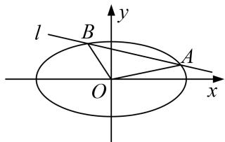

[规范解答] （1）由题意得 $\left\{ \begin{array}{l} \frac{c}{a} = \frac{1}{2} \\ b = \frac{|0 - 0 + \sqrt{6}|}{\sqrt{2}} \\ a^2 = c^2 + b^2 \end{array} \right.$ ， $\therefore a^2 = 4, b^2 = 3, \therefore$ 椭圆的方程为 $\frac{x^2}{4} + \frac{y^2}{3} = 1$ ；  
（2）设 $A(x_{1},y_{1})$ ， $B(x_{2},y_{2})$ ，则 $A$ ， $B$ 的坐标满足 $\left\{ \begin{array}{l} \frac{x^2}{4} +\frac{y^2}{3} = 1\\ y = kx + m \end{array} \right.$
消去 y 化简得 $(3+4k^{2})x^{2}+8kmx+4m^{2}-12=0$ ， $x_{1}+x_{2}=-\frac{8km}{3+4k^{2}}$ ， $x_{1}x_{2}=\frac{4m^{2}-12}{3+4k^{2}}$
由 $\Delta>0$ ，得 $m^{2}4k^{2}-m^{2}+3>0$ ，
$y _ {1} y _ {2} = \left(k x _ {1} + m\right) \left(k x _ {2} + m\right) = k ^ {2} x _ {1} x _ {2} + k m \left(x _ {1} + x _ {2}\right) + m ^ {2} = k ^ {2} \frac {4 m ^ {2} - 1 2}{3 + 4 k ^ {2}} + k m \left(- \frac {8 k m}{3 + 4 k ^ {2}}\right) + m ^ {2} = \frac {3 m ^ {2} - 1 2 k ^ {2}}{3 + 4 k ^ {2}}.$
$\because k_{OA} \cdot k_{OB} = -\frac{b^2}{a^2} = -\frac{3}{4}, \therefore \frac{y_1 y_2}{x_1 x_2} = -\frac{3}{4}$ , 即 $y_1 y_2 = -\frac{3}{4} x_1 x_2, \therefore \frac{3m^2 - 12k^2}{3 + 4k^2} = -\frac{3}{4} \cdot \frac{4m^2 - 12}{3 + 4k^2}$ . 即 $2m^2 - 4k^2 = 3$
$| M N | = \sqrt {1 + k ^ {2}} \cdot | x _ {1} - x _ {2} | = \sqrt {1 + k ^ {2}} \cdot \sqrt {(x _ {1} + x _ {2}) ^ {2} - 4 x _ {1} x _ {2}} = \sqrt {1 + k ^ {2}} \cdot \sqrt {\left(\frac {- 8 k m}{3 + 4 k ^ {2}}\right) ^ {2} - 4 \left(\frac {4 m ^ {2} - 1 2}{3 + 4 k ^ {2}}\right)} = \sqrt {\frac {2 4 (1 + k ^ {2})}{3 + 4 k ^ {2}}}.$
又由点 O 到直线 $y=kx+m$ 的距离 $d=\frac{|m|}{\sqrt{1+k^{2}}}$ ,
所以 $S_{\triangle MON}=\frac{1}{2}|AB|\cdot d=\frac{1}{2}\frac{|m|}{\sqrt{1+k^{2}}}\cdot\sqrt{\frac{24(1+k^{2})}{3+4k^{2}}}=\frac{1}{2}\cdot\sqrt{\frac{m^{2}}{1+k^{2}}\cdot\frac{24(1+k^{2})}{3+4k^{2}}}=\frac{1}{2}\cdot\sqrt{\frac{3+4k^{2}}{2}\cdot\frac{24}{3+4k^{2}}}=\sqrt{3}$ 为定值.

[例 2] 已知椭圆 C: $\frac{x^{2}}{a^{2}}+\frac{y^{2}}{b^{2}}=1(a>b>0)$ 的离心率为 $\frac{\sqrt{2}}{2}$ ，O 是坐标原点，点 A，B 分别为椭圆 C 的左右顶点， $|AB|=4\sqrt{2}$ .  
（1）求椭圆 C 的标准方程.  
（2）若 P 是椭圆 C 上异于 A, B 的一点，直线 l 交椭圆 C 于 M, N 两点， $AP \parallel OM$ ， $BP \parallel ON$ ，则 $\triangle OMN$

的面积是否为定值？若是，求出定值，若不是，请说明理由.

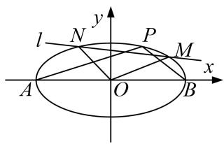

[规范解答] （1）由 $2a=4\sqrt{2}$ ， $e=\frac{\sqrt{2}}{2}$ ，解得 $a=2\sqrt{2}$ ，c=2， $b^{2}=a^{2}-c^{2}=4$ ，则椭圆的方程为 $\frac{x^{2}}{8}+\frac{y^{2}}{4}=1$ ;  
（2）由题意可得 $A(-2\sqrt{2}, 0)$ ， $B(2\sqrt{2}, 0)$ ，设 $P(x_{0}, y_{0})$ ，可得 $\frac{x_{0}^{2}}{8} + \frac{y_{0}^{2}}{4} = 1$ ，即 $x_{0}^{2} + 2y_{0}^{2} = 8$ ，
则 $k_{AP} \cdot k_{BP} = \frac{y_0}{x_0 + 2\sqrt{2}} \cdot \frac{y_0}{x_0 - 2\sqrt{2}} = \frac{y_0^2}{x_0^2 - 8} = \frac{y_0^2}{-2y_0^2} = -\frac{1}{2},$
因为 $AP \parallel OM$ ， $BP \parallel ON$ ，则 $k_{OM} \cdot k_{ON} = k_{AP} \cdot k_{BP} = -\frac{1}{2}$

①当直线 l 的斜率不存在时，设 l: x=m，联立椭圆方程可得 $y=\pm\sqrt{\frac{8-m^{2}}{2}}$ ,
所以 $M(m, \sqrt{\frac{8-m^{2}}{2}})$ ， $N(m, -\sqrt{\frac{8-m^{2}}{2}})$ ，由 $k_{OM} \cdot k_{ON} = -\frac{1}{2}$ ，可得 $-\frac{\frac{8-m^{2}}{2}}{m^{2}} = -\frac{1}{2}$ ，解得 $m = \pm 2$ ，
所以 $M(\pm2, \sqrt{2})$ ， $N(\pm2, -\sqrt{2})$ ，所以 $S_{\triangle MNO}=\frac{1}{2}\times2\times2\sqrt{2}=2\sqrt{2}$ ;

②当直线 l 的斜率存在时，设直线 $l: y=kx+n$ ， $M(x_{1}, y_{1})$ ， $N(x_{2}, y_{2})$ ，
联立直线 $y=kx+n$ 和 $x^{2}+2y^{2}=8$ ，可得 $(1+2k^{2})x^{2}+4knx+2n^{2}-8=0$ ，
可得 $\therefore x_{1} + x_{2} = -\frac{4kn}{1 + 2k^{2}}, x_{1}x_{2} = \frac{2n^{2} - 8}{1 + 2k^{2}}, y_{1}y_{2} = (kx_{1} + n)(kx_{2} + n) = k^{2}x_{1}x_{2} + kn(x_{1} + x_{2}) + n^{2},$
由 $k_{OM} \cdot k_{ON} = \frac{y_{1} y_{2}}{x_{1} x_{2}} = k^{2} + \frac{-4k^{2} n^{2}}{2n^{2} - 8} + \frac{n^{2}(1 + 2k^{2})}{2n^{2} - 8} = -\frac{1}{2}$ ，可得 $n^{2} = 2 + 4k^{2}$ ,
由弦长公式可得， $|MN=|\sqrt{1+k^{2}}\cdot|x_{1}-x_{2}|=\sqrt{1+k^{2}}\cdot\sqrt{(x_{1}+x_{2})^{2}-4x_{1}x_{2}}$
$= \sqrt {1 + k ^ {2}} \cdot \sqrt {\left(- \frac {4 k n}{1 + 2 k ^ {2}}\right) ^ {2} - 4 \left(\frac {2 n ^ {2} - 8}{1 + 2 k ^ {2}}\right)} = \frac {\sqrt {1 + k ^ {2}}}{1 + 2 k ^ {2}} \cdot \sqrt {6 4 k ^ {2} - 8 n ^ {2} + 3 2} = \frac {4 \sqrt {1 + k ^ {2}}}{\sqrt {1 + 2 k ^ {2}}}.$

点(0, 0)到直线 l 的距离为 $d=\frac{|n|}{\sqrt{k^{2}+1}}=\frac{\sqrt{2(1+2k^{2})}}{\sqrt{1+k^{2}}}$ ,
所以 $S_{\triangle OMN}=\frac{1}{2}d\cdot|MN|=2\sqrt{2}$ ，综上可知， $\triangle OMN$ 的面积为定值 $2\sqrt{2}$ .

[例 3] 如图， $F_{1}$ 、 $F_{2}$ 为椭圆 C: $\frac{x^{2}}{a^{2}}+\frac{y^{2}}{b^{2}}=1(a>b>0)$ 的左、右焦点，D、E 是椭圆的两个顶点，椭圆的离心率为 $\frac{\sqrt{3}}{2}$ ， $S_{\triangle DEF2}=1-\frac{\sqrt{3}}{2}$ 。若 $M(x_{0}, y_{0})$ 在椭圆 C 上，则点 $N(\frac{x_{0}}{a}, \frac{y_{0}}{b})$ 称为点 M 的一个“好点”。直线 l 与椭圆交于 A、B 两点，A、B 两点的“好点”分别为 P、Q，已知以 PQ 为直径的圆经过坐标原点。  
（1）求椭圆的标准方程;   
（2） $\triangle AOB$ 的面积是否为定值？若为定值，试求出该定值；若不为定值，请说明理由.
> 

> 
> | 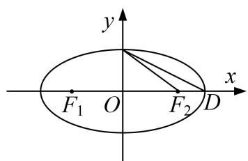 | 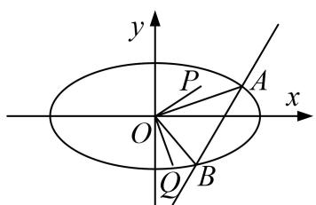 |
> | --- | --- |
> | （1）图 | （2）图 |
> 

[规范解答] （1）由题可知 $\left\{ \begin{array}{l} \frac{c}{a} = \frac{\sqrt{3}}{2} \\ \frac{1}{2} (a - c)b = 1 - \frac{\sqrt{3}}{2} \\ a^2 = c^2 + b^2 \end{array} \right.$ ，解得 $a^2 = 4$ ， $b^2 = 1$ 故椭圆 C 的标准方程为 $\frac{x^{2}}{4} + y^{2} = 1$ .  
（2）设 $A(x_{1},y_{1})$ ， $B(x_{2},y_{2})$ ，则 $P(\frac{x_1}{2},y_1)$ ， $Q(\frac{x_2}{2},y_2)$ .由 $OP\bot OQ$ ，即 $\frac{x_1x_2}{4} +y_1y_2 = 0$ .（1）

①当直线 AB 的斜率不存在时， $S=\frac{1}{2}|x_{1}\cdot|y_{1}-y_{2}|=1$ ;  
②当直线 AB 的斜率存在时，设其直线为 $y=kx+m(k\neq0)$ ,
联立 $\left\{ \begin{array}{l} y = kx + m \\ \frac{x^2}{4} + y^2 = 1 \end{array} \right.$ 得 $(4k^2 + 1)x^2 + 8kmx + 4m^2 - 4 = 0$ .
则 $\Delta=16(4k^{2}-m^{2}+1)$ ， $x_{1}x_{2}=\frac{4m^{2}-4}{4k^{2}+1}$ ，同理 $y_{1}y_{2}=\frac{m^{2}-4k^{2}}{4k^{2}+1}$ ，代入（1），整理得 $4k^{2}+1=2m^{2}$ .
此时 $\Delta=16m^{2}>0,\quad|AB|=\left|\sqrt{1+k^{2}}\cdot|x_{1}-x_{2}\right|=\frac{2\sqrt{1+k^{2}}}{|m|}.\quad h=\frac{|m|}{\sqrt{1+k^{2}}},\quad\therefore S=1.$

综上， $\triangle AOB$ 的面积为定值 1.

[例 4] 已知椭圆 C: $\frac{x^{2}}{a^{2}} + \frac{y^{2}}{b^{2}} = 1 (a > b > 0)$ 的焦距为 2，四个顶点构成的四边形面积为 $2\sqrt{2}$ .  
（1）求椭圆 C 的标准方程;  
（2）斜率存在的直线 l 与椭圆 C 相交于 M、N 两点，O 为坐标原点， $\overrightarrow{OP}=\overrightarrow{OM}+\overrightarrow{ON}$ ，若点 P 在椭圆上，请判断 $\triangle OMN$ 的面积是否为定值.

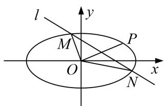

解析 （1）由题可得 $2c = 2$ ， $c = 1$ ， $\frac{1}{2} 2a\times 2\times b = 2\sqrt{2}$ ，又 $a^2 = c^2 +b^2$ ，解得 $b = 1$ ， $a = \sqrt{2}$
故椭圆方程为 $\frac{x^{2}}{2}+y^{2}=1$ .  
（2）设直线 l 方程是 $y=kx+m$ ，设 $M(x_{1}, y_{1})$ ， $N(x_{2}, y_{2})$ ， $P(x_{0}, y_{0})$ ，
联立 $\left\{\begin{aligned}y&=kx+m,\\ \frac{x^{2}}{2}&+y^{2}=1,\end{aligned}\right.$ 得 $(1+2k^{2})x^{2}+4kmx+2m^{2}-2=0,$
$\Delta = 8 \left(2 k ^ {2} - m ^ {2} + 1\right) > 0. x _ {1} + x _ {2} = \frac {- 4 k m}{1 + 2 k ^ {2}}, x _ {1} x _ {2} = \frac {2 \left(m ^ {2} - 1\right)}{1 + 2 k ^ {2}},$
$| M N | = \sqrt {1 + k ^ {2}} \cdot | x _ {1} - x _ {2} | = \sqrt {1 + k ^ {2}} \cdot \sqrt {(x _ {1} + x _ {2}) ^ {2} - 4 x _ {1} x _ {2}} = \sqrt {1 + k ^ {2}} \frac {\sqrt {8 (2 k ^ {2} + 1 - m ^ {2})}}{1 + 2 k ^ {2}}.$
又∵ $\overrightarrow{OP}=O\overrightarrow{M}+\overrightarrow{ON}$ ，所以 $\left\{\begin{aligned}x_{0}&=x_{1}+x_{2},\\ y_{0}&=y_{1}+y_{2},\end{aligned}\right.$ ∴ $P(\frac{-4km}{1+2k^{2}},\frac{2m}{1+2k^{2}})$

把点 P 坐标代入椭圆方程可得 $\left(\frac{-4km}{1+2k^{2}}\right)^{2}+2\left(\frac{2m}{1+2k^{2}}\right)=2$ ，整理可得 $4m^{2}=2k^{2}+1$ ，
又由点 O 到直线 $y=kx+m$ 的距离 $d=\frac{|m|}{\sqrt{1+k^{2}}}$ ， $\triangle OMN$ 的面积
$S _ {\triangle O M N} = \frac {1}{2} | M N | \cdot d = \frac {1}{2} \sqrt {1 + k ^ {2}} \frac {\sqrt {8 (2 k ^ {2} + 1 - m ^ {2})}}{1 + 2 k ^ {2}} \frac {| m |}{\sqrt {1 + k ^ {2}}} = \frac {\sqrt {2 (4 m ^ {2} - m ^ {2})}}{4 m ^ {2}} \times | m | = \frac {\sqrt {6}}{4}.$
所以， $\triangle OMN$ 的面积为定值 $\frac{\sqrt{6}}{4}$ .

[例 5] 已知椭圆 C: $\frac{x^{2}}{a^{2}}+\frac{y^{2}}{b^{2}}=1(a>b>0)$ 的离心率为 $\frac{\sqrt{3}}{2}$ ，过点 $P(1, \frac{\sqrt{3}}{2})$ .  
（1）求椭圆 C 的标准方程;  
（2）设点 $A$ 、 $B$ 分别是椭圆 $C$ 的左顶点和上顶点， $M$ 、 $N$ 为椭圆 $C$ 上异于 $A$ 、 $B$ 的两点，满足 $AM \parallel BN$ ，求证： $\triangle OMN$ 面积为定值.

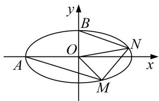

[规范解答] （1）由已知条件可得 $\left\{ \begin{array}{l} c = \frac{\sqrt{3}}{2} \\ \frac{1}{a^2} + \frac{3}{4b^2} = 1 \\ a^2 = c^2 + b^2 \end{array} \right.$ ，解得 $a^2 = 4$ ， $b^2 = 1$ ，故椭圆 $C$ 的标准方程为 $\frac{x^2}{4} + y^2 = 1$ .  
（2）设 $M(x_{1}, y_{1})$ ， $N(x_{2}, y_{2})$ ，由题意直线 AM、BN 的斜率存在，
设直线 AM 的方程为 $y=k(x+2)$ ①，设直线 BN 的方程为 $y=kx+1$ ②，
由（1）椭圆 C: $\frac{x^{2}}{4} + y^{2} = 1③$ ,
联立①③得 $(4k^{2}+1)x^{2}+16k^{2}x+16k^{2}-4=0$ ，解得 $x_{1}=\frac{2-8k^{2}}{4k^{2}+1}$ ，即 $M(\frac{2-8k^{2}}{4k^{2}+1},\frac{4k}{4k^{2}+1})$
联立②③，得 $(4k^{2}+1)x^{2}+8kx=0$ ，所以， $x_{2}=-\frac{8k}{4k^{2}+1}$ ，即 $N(-\frac{8k}{4k^{2}+1},\frac{1-4k^{2}}{4k^{2}+1})$

易知 $|OM|=\sqrt{x_{1}^{2}+y_{1}^{2}}$ ,

直线 OM 的方程为 $y_{1}x - x_{1}y = 0$ ，点 N 到直线 OM 的距离为 $\frac{|x_{2}y_{1} - x_{1}y_{2}|}{\sqrt{x_{1}^{2} + y_{1}^{2}}}$ ,
所以 $S_{\triangle OMN}=\frac{1}{2}|OM|\cdot d=\frac{|x_{2}y_{1}-x_{1}y_{2}|}{2}=\frac{1}{2}\left|-\frac{8k}{4k^{2}+1}\cdot\frac{4k}{4k^{2}+1}-\frac{1-4k^{2}}{4k^{2}+1}\cdot\frac{2-8k^{2}}{4k^{2}+1}\right|=1$
故 $\triangle OMN$ 面积为定值1.

[例 6] 如图，点 F 是抛物线 $\Gamma: x^{2}=2py(p>0)$ 的焦点，点 A 是抛物线上的定点，且 $\overrightarrow{AF}=(2,0)$ ，点 B，C 是抛物线上的动点，直线 AB，AC 的斜率分别为 $k_{1}, k_{2}$ .  
（1）求抛物线 $\Gamma$ 的方程;  
（2）若 $k_{2}-k_{1}=2$ ，点 D 是抛物线在点 B，C 处切线的交点，记 $\triangle BCD$ 的面积为 S，证明 S 为定值.

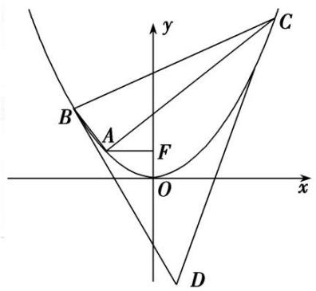

[规范解答] （1） 设 $A(x_{0}, y_{0})$ ，由题知 $F(0, \frac{p}{2})$ ，所以 $\overrightarrow{AF}=(-x_{0}, \frac{p}{2}-y_{0})=(2, 0)$ ,
所以 $\left\{\begin{aligned}x_{0}&=-2,\\ y_{0}&=\frac{p}{2}\end{aligned}\right.$ ，代入 $x^{2}=2py(p>0)$ ，得 $4=p^{2}$ ，得 p=2，
所以抛物线的方程是 $x^{2}=4y$ .  
（2）过 D 作 y 轴的平行线交 BC 于点 E，并设 $B(x_{1}, \frac{x_{1}^{2}}{4})$ ， $C(x_{2}, \frac{x_{2}^{2}}{4})$ ，由（1）知 A(-2, 1)，
所以 $k_{2}-k_{1}=\frac{\frac{x_{2}^{2}}{4}-1}{x_{2}+2}-\frac{\frac{x_{1}^{2}}{4}-1}{x_{1}+2}=\frac{x_{2}-x_{1}}{4}$ ，又 $k_{2}-k_{1}=2$ ，所以 $x_{2}-x_{1}=8$ 。

直线 BD: $y=\frac{x_{1}}{2}x-\frac{x_{1}^{2}}{4}$ ，直线 CD: $y=\frac{x_{2}}{2}x-\frac{x_{2}^{2}}{4}$ ，解得 $\left\{\begin{aligned}x_{D}&=\frac{x_{1}+x_{2}}{2},\\ y_{D}&=\frac{x_{1}x_{2}}{4}.\end{aligned}\right.$

因直线 BC 的方程为 $y-\frac{x_{1}^{2}}{4}=\frac{x_{1}+x_{2}}{4}(x-x_{1})$ ，将 $x_{D}$ 代入得 $y_{E}=\frac{x_{1}^{2}+x_{2}^{2}}{8}$ ,
所以 $S=\frac{1}{2}|DE|(x_{2}-x_{1})=\frac{1}{2}(y_{E}-y_{D})(x_{2}-x_{1})=\frac{1}{2}\cdot\frac{(x_{2}-x_{1})^{2}}{8}(x_{2}-x_{1})=32.$

# 【对点训练】

1. 已知椭圆 $\frac{x^2}{a^2} + \frac{y^2}{b^2} = 1 (a > b > 0)$ 的四个顶点围成的菱形的面积为 $4\sqrt{3}$ ，椭圆的一个焦点为 $(1, 0)$ .  
（1）求椭圆的方程;  
（2）若 M, N 为椭圆上的两个动点，直线 OM, ON 的斜率分别为 $k_{1}$ , $k_{2}$ ，当 $k_{1}k_{2} = -\frac{3}{4}$ 时， $\triangle MON$ 的面积是否为定值？若为定值，求出此定值；若不为定值，说明理由.

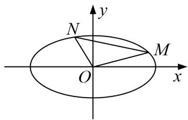

1. 解析 （1）由椭圆 $\frac{x^2}{a^2} + \frac{y^2}{b^2} = 1$ 的四个顶点围成的菱形的面积为 $4\sqrt{3}$ , 椭圆的一个焦点为 $1, 0$ ),
可得 $2ab=4\sqrt{3}$ ，c=1，即 $ab=2\sqrt{3}$ ， $a^{2}-b^{2}=1$ ，解得 $a^{2}=4$ ， $b^{2}=3$ ，故椭圆的方程为 $\frac{x^{2}}{4}+\frac{y^{2}}{3}=1$ .  
（2）设 $M(x_{1}, y_{1})$ ， $N(x_{2}, y_{2})$ ，当直线 MN 的斜率存在时，设方程为 $y=kx+m$ ，
由 $\left\{ \begin{array}{l} y = kx + m \\ \frac{x^2}{4} + \frac{y^2}{3} = 1 \end{array} \right.$ ，消 $y$ 可得， $(4k^2 + 3)x^2 + 8kmx + 4m^2 - 12 = 0$ .
则 $\Delta=64k^{2}m^{2}-4(4k^{2}+3)(4m^{2}-12)=48(4k^{2}-m^{2}+3)>0$ ，即 $m^{2}<4k^{2}+3$ ，

且 $x_{1}+x_{2}=\frac{-8km}{4k^{2}+3},\quad x_{1}x_{2}=\frac{4m^{2}-12}{4k^{2}+3},$
所以 $|MN|=\sqrt{1+k^{2}}\cdot|x_{1}-x_{2}|=\sqrt{1+k^{2}}\cdot\sqrt{(x_{1}+x_{2})^{2}-4x_{1}x_{2}}$
$= \sqrt {1 + k ^ {2}} \cdot \sqrt {\left(\frac {- 8 k m}{3 + 4 k ^ {2}}\right) ^ {2} - 4 \left(\frac {4 m ^ {2} - 1 2}{3 + 4 k ^ {2}}\right)} = \frac {4 \sqrt {3} \sqrt {1 + k ^ {2}}}{3 + 4 k ^ {2}} \cdot \sqrt {4 k ^ {2} - m ^ {2} + 3}.$
又由点 O 到直线 MN 的距离 $d=\frac{|m|}{\sqrt{1+k^{2}}}$ ,
所以 $S_{\triangle MON}=\frac{1}{2}|MN|d=\frac{2\sqrt{3}|m|}{3+4k^{2}}\cdot\sqrt{4k^{2}-m^{2}+3}$ .
又因为 $k_{1}k_{2}=\frac{y_{1}y_{2}}{x_{1}x_{2}}=-\frac{3}{4}$ ，所以 $\frac{k^{2}x_{1}x_{2}+km(x_{1}+x_{2})+m^{2}}{x_{1}x_{2}}=k^{2}+\frac{km(\frac{-8km}{4k^{2}+3})+m^{2}}{\frac{4m^{2}-12}{3+4k^{2}}}=-\frac{3}{4}$ ,

化简整理可得 $2m^{2}=4k^{2}+3$ ，满足 $\Delta>0$ ，
代入 $S_{\triangle MON} = \frac{2\sqrt{3}|m|}{3 + 4k^2}\cdot \sqrt{4k^2 - m^2 + 3} = \frac{2\sqrt{3}m^2}{2m^2} = \sqrt{3}.$
当直线 MN 的斜率不存在时，由于 $k_{1}k_{2}=-\frac{3}{4}$ ,

考虑到 OM，ON 关于 x 轴对称，不妨设 $k_{1}=\frac{\sqrt{3}}{2}$ ， $k_{1}k_{2}=-\frac{\sqrt{3}}{2}$ ，
则点 $M, N$ 的坐标分别为 $M(\sqrt{2}, \frac{\sqrt{6}}{2})$ , $N(\sqrt{2}, -\frac{\sqrt{6}}{2})$ , 此时 $S_{\triangle MON} = \frac{1}{2} \times \sqrt{2} \times \sqrt{6} = \sqrt{3}$ .

综上可得， $\triangle MON$ 的面积为定值 $\sqrt{3}$ .

2. 已知椭圆 $C: \frac{x^2}{a^2} + \frac{y^2}{b^2} = 1 (a > b > 0)$ 的离心率为 $\frac{\sqrt{3}}{3}$ ，直线 $x - y + \sqrt{5} = 0$ 与椭圆 $C$ 有且只有一个公共点.  
（1）求椭圆 C 的标准方程  
（2）设点 $A(-\sqrt{3}, 0)$ , $B(\sqrt{3}, 0)$ , $P$ 为椭圆 $C$ 上一点, 且直线 $PA$ , $PB$ 的斜率乘积为 $-\frac{2}{3}$ , 点 $M$ , $N$ 是椭圆 C 上不同于 A, B 的两点，且满足 $AP \parallel OM$ , $BP \parallel ON$ ，求证： $\triangle OMN$ 的面积为定值.

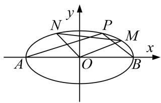

2. 解析 （1）∵直线 $x-y+\sqrt{5}=0$ 与椭圆有且只有一个公共点，
∴ 直线 $x - y + \sqrt{5} = 0$ 与椭圆 C: $\frac{x^{2}}{a^{2}} + \frac{y^{2}}{b^{2}} = 1$ 相切，
由 $\left\{ \begin{array}{l} x - y + \sqrt{5} = 0 \\ \frac{x^2}{a^2} + \frac{y^2}{b^2} = 1 \end{array} \right.$ ，得 $(b^2 + a^2)x^2 + 2\sqrt{5}a^2x + 5a^2 - a^2b^2 = 0$ ， $\therefore \Delta = 0$ ，即 $a^2 + b^2 = 5$
又∵ $e=\frac{\sqrt{3}}{3}$ ，∴ $a=\sqrt{3}$ ， $b^{2}=2$ ，椭圆C的方程为 $\frac{x^{2}}{3}+\frac{y^{2}}{2}=1$ .  
（2）由题意 $M$ 、 $N$ 是椭圆 $C$ 上不同于 $A, B$ 的两点，
由题意知，直线 PA，PB 斜率存在且不为 0，又由已知 $k_{AP} \cdot k_{BP} = -\frac{2}{3}$ .
由 $AP \parallel OM$ ， $BP \parallel ON$ ，所以 $k_{OM} \cdot k_{ON} = -\frac{2}{3}$ .
设直线 MN 的方程为 x=my-t，，代入椭圆方程得 $(2m^{2}+3)y^{2}+4mty+2t^{2}-6=0$ ，
设 $M(x_{1}, y_{1})$ ， $N(x_{2}, y_{2})$ ，则 $y_{1} + y_{2} = -\frac{4mt}{2m^{2} + 3}$ ， $y_{1}y_{2} = \frac{2t^{2} - 6}{2m^{2} + 3}$
又 $k_{OM} \cdot k_{ON} = \frac{y_{1} y_{2}}{x_{1} x_{2}} = \frac{y_{1} y_{2}}{m^{2} y_{1} y_{2} + mt(y_{1} + y_{2}) + t^{2}} = \frac{2t^{2} - 6}{3t^{2} - 6m^{2}} = -\frac{2}{3}$ ，可得 $2t^{2} = 2m^{2} + 3$ ，
所以 $S_{\triangle OMN}=\frac{1}{2}|t|\cdot|y_{1}-y_{2}|=\frac{1}{2}|t|\cdot\frac{\sqrt{48m^{2}-24t^{2}+72}}{2m^{2}+3}=\frac{1}{2}|t|\cdot\frac{2\sqrt{6}|t|}{2t^{2}}=\frac{\sqrt{6}}{2}.$
即 $\triangle OMN$ 的面积为定值 $\frac{\sqrt{6}}{2}$ .

3. 在平面直角坐标系 $xOy$ 中，已知椭圆 $C: \frac{x^2}{4} + y^2 = 1$ ，点 $P(x_1, y_1), Q(x_2, y_2)$ 是椭圆 $C$ 上两个动点，直线 $OP, OQ$ 的斜率分别为 $k_1, k_2$ ，若 $\boldsymbol{m} = \left(\frac{x_1}{2}, y_1\right), \boldsymbol{n} = \left(\frac{x_2}{2}, y_2\right), \boldsymbol{m} \cdot \boldsymbol{n} = 0$ .  
（1）求证： $k_{1}\cdot k_{2}=-\frac{1}{4};$  
（2）试探求 $\triangle POQ$ 的面积 S 是否为定值，并说明理由.

3. 解析 （1） $\because k_{1}, k_{2}$ 存在， $\therefore x_{1}x_{2} \neq 0, \because m \cdot n = 0, \therefore \frac{x_{1}x_{2}}{4} + y_{1}y_{2} = 0, \therefore k_{1} \cdot k_{2} = \frac{y_{1}y_{2}}{x_{1}x_{2}} = -\frac{1}{4}$ .  
（2）①当直线 PQ 的斜率不存在，即 $x_{1}=x_{2}$ ， $y_{1}=-y_{2}$ 时，由 $\frac{y_{1}y_{2}}{x_{1}x_{2}}=-\frac{1}{4}$ ，得 $\frac{x_{1}^{2}}{4}-y_{1}^{2}=0$ ，又由 $P(x_{1},y_{1})$ 在椭圆上，得 $\frac{x_{1}^{2}}{4}+y_{1}^{2}=1$ ，∴ $|x_{1}|=\sqrt{2}$ ， $|y_{1}|=\frac{\sqrt{2}}{2}$ ，∴ $S_{\triangle POQ}=\frac{1}{2}|x_{1}|\cdot|y_{1}-y_{2}|=1$ .

②当直线 PQ 的斜率存在时，设直线 PQ 的方程为 $y=kx+b(b\neq0)$ .
由 $\left\{ \begin{array}{l} y = kx + b, \\ \frac{x^2}{4} + y^2 = 1 \end{array} \right.$ 得 $(4k^{2} + 1)x^{2} + 8kbx + 4b^{2} - 4 = 0$ ， $\Delta = 64k^{2}b^{2} - 4(4k^{2} + 1)(4b^{2} - 4) = 16(4k^{2} + 1 - b^{2}) > 0$
$\therefore x _ {1} + x _ {2} = \frac {- 8 k b}{4 k ^ {2} + 1}, x _ {1} x _ {2} = \frac {4 b ^ {2} - 4}{4 k ^ {2} + 1}. \because \frac {x _ {1} x _ {2}}{4} + y _ {1} y _ {2} = 0, \therefore \frac {x _ {1} x _ {2}}{4} + (k x _ {1} + b) (k x _ {2} + b) = 0,$
得 $2b^{2}-4k^{2}=1$ ，满足 $\Delta>0$ .
$\therefore S_{\triangle POQ} = \frac{1}{2}\cdot \frac{|b|}{\sqrt{1 + k^2}} |PQ| = \frac{1}{2}|b|\sqrt{(x_1 + x_2)^2 - 4x_1x_2} = 2|b|\cdot \frac{\sqrt{4k^2 + 1 - b^2}}{4k^2 + 1} = 1.\quad \therefore \triangle POQ$ 的面积 $S$ 为定值.

4. 已知椭圆 $C: \frac{x^2}{a^2} + \frac{y^2}{b^2} = 1 (a > b > 0)$ 的左、右焦点分别为 $F_1, F_2$ ，椭圆 $C$ 与 $y$ 轴的一个交点为 $M$ ，且 $|F_1F_2| = 2\sqrt{3}$ ， $|MF_1| = 2$ .  
（1）求椭圆 C 的标准方程;  
（2）设 O 为坐标原点，A, B 为椭圆 C 上不同的两点，点 A 关于 x 轴的对称点为点 D. 若直线 BD 的斜率为 1，求证： $\triangle OAB$ 的面积为定值.

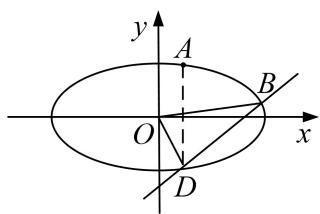

4. 解析 （1） 因为焦距为 $2 \sqrt{3}$ , 所以 $2c = 2 \sqrt{3}$ , 即 $c = \sqrt{3}$ ,
由 $|MF_{1}|=2$ ，得a=2，即 $a^{2}=4,\quad b^{2}=1$ ，所以椭圆C的标准方程为 $\frac{x^{2}}{4}+y^{2}=1$ ;  
（2）证明：由题意知直线 AB 斜率一定存在，设直线方程为 $y=kx+m$ ，点 $A(x_{1}, y_{1})$ ， $B(x_{2}, y_{2})$ ，
则 $\triangle OAB$ 面积为 $S_{\triangle OAB}=\frac{1}{2}|m|\cdot|x_{1}-x_{2}|$ ， $D(x_{1},-y_{1})$
联立方程 $\left\{ \begin{array}{l} y = kx + m \\ \frac{x^2}{4} + y^2 = 1 \end{array} \right.$ ，得 $(4k^2 + 1)x^2 + 8kbx + 4m^2 - 4 = 0$ ， $\therefore x_1 + x_2 = \frac{-8km}{4k^2 + 1}$ ， $x_1x_2 = \frac{4m^2 - 4}{4k^2 + 1}$ ，
因为直线 BD 的斜率为 1，所以 $\frac{y_{1}+y_{2}}{x_{2}-x_{1}}=1$ ，即 $k(x_{1}+x_{2})+2m=x_{2}-x_{1}$ ，
即 $\left|\frac{-8km}{4k^{2}+1}+2m\right|=|x_{2}-x_{1}|$ ，所以 $\left|\frac{2m}{4k^{2}+1}\right|=\sqrt{(x_{1}+x_{2})^{2}-4x_{1}x_{2}}$ ，解得 $5m^{2}=16k^{2}+4$ ，
所以 $S_{\triangle OAB}=\frac{1}{2}|m|\cdot|x_{1}-x_{2}|=\frac{1}{2}|m|\cdot|\frac{2m}{4k^{2}+1}|=\frac{m^{2}}{4k^{2}+1}=\frac{4}{5}$ ，综上， $\triangle OAB$ 面积为定值 $\frac{4}{5}$ .

5. 如图，设点 $A$ ， $B$ 的坐标分别为 $(- \sqrt{3}, 0)$ ， $(\sqrt{3}, 0)$ ，直线 $AP$ ， $BP$ 相交于点 $P$ ，且它们的斜率之积为 $-\frac{2}{3}$ .  
（1）求点 P 的轨迹方程;  
（2）设点 P 的轨迹为 C，点 M，N 是轨迹 C 上不同于 A，B 的两点，且满足 $AP \parallel OM$ ， $BP \parallel ON$ ，求证： $\triangle MON$ 的面积为定值.

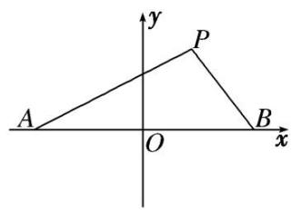

5. 解析 （1）设点 $P$ 的坐标为 $(x, y)$ ，由题意得， $k_{AP} \cdot k_{BP} = \frac{y}{x + \sqrt{3}} \cdot \frac{y}{x - \sqrt{3}} = -\frac{2}{3} (x \neq \pm \sqrt{3})$ 化简得，点 P 的轨迹方程为 $\frac{x^{2}}{3} + \frac{y^{2}}{2} = 1 (x \neq \pm \sqrt{3})$ .  
（2）由题意知，M，N 是椭圆 C 上不同于 A，B 的两点，且 $AP \parallel OM$ ， $BP \parallel ON$ ，
则直线 AP，BP 的斜率必存在且不为 0．而且 $k_{OM} \cdot k_{ON} = k_{AP} \cdot k_{BP} = -\frac{2}{3}$ .
设直线 MN 的方程为 $x=my+t$ ，代入椭圆方程 $\frac{x^{2}}{3}+\frac{y^{2}}{2}=1$ ，得 $(3+2m^{2})y^{2}+4mty+2t^{2}-6=0$ ，
设 M, N 的坐标分别为 $(x_{1}, y_{1})$ , $(x_{2}, y_{2})$ ，所以 $y_{1} + y_{2} = -\frac{4mt}{3 + 2m^{2}}$ , $y_{1}y_{2} = \frac{2t^{2} - 6}{3 + 2m^{2}}$ .
又 $k_{OM}k_{ON} = \frac{y_1y_2}{x_1x_2} = \frac{y_1y_2}{m^2y_1y_2 + mt(y_1 + y_2) + t^2} = \frac{2t^2 - 6}{3t^2 - 6m^2}$ ，所以 $\frac{2t^2 - 6}{3t^2 - 6m^2} = -\frac{2}{3}$ ，即 $2t^2 = 2m^2 + 3$ 。
又 $S_{\triangle MON}=\frac{1}{2}|t|y_{1}-y_{2}|=\frac{1|t|\sqrt{-24t^{2}+48m^{2}+72}}{2+2m^{2}}$ ，所以 $S_{\triangle MON}=\frac{2\sqrt{6}t^{2}}{4t^{2}}=\frac{\sqrt{6}}{2}$ ，即 $\triangle MON$ 的面积为定值 $\frac{\sqrt{6}}{2}$ .

6. 已知 F 是抛物线 C: $x^{2}=2py(p>0)$ 的焦点，点 M 是抛物线上的定点，且 $\overrightarrow{MF}=(4,0)$ .  
（1）求抛物线 C 的方程;  
（2）直线 AB 与抛物线 C 交于不同两点 $A(x_{1}, y_{1})$ ， $B(x_{2}, y_{2})$ 且 $|x_{2}-x_{1}|=3$ ，直线 l 与 AB 平行，且与抛物线 C 相切，切点为 N，试问 $\triangle AMN$ 的面积是否是定值．若是，求出这个定值；若不是，请说明理由．

6. 解析 （1） 设 $M(x_{0}, y_{0})$ ，由题知 $F(0, \frac{p}{2})$ ，所以 $\overrightarrow{MF}=(-x_{0}, \frac{p}{2}-y_{0})=(4, 0)$ ,
所以抛物线 C 的方程为 $x^{2}=8y$ .  
（2）由题意知，直线 AB 的斜率存在，设其方程为 $y=kx+b$ ，
由 $\left\{\begin{aligned}y=kx+b\\ x^{2}=8y\end{aligned}\right.$ ，整理得 $x^{2}-8kx-8b=0$ ，则 $x_{1}+x_{2}=8k,\quad x_{1}x_{2}=-8b,$
所以 $y_{1}+y_{2}=k(x_{1}+x_{2})+2b=8k^{2}+2b,$
设 AB 的中点为 Q，则点 Q 的坐标为 $(4k, 4k^{2} + b)$ ,
由条件设切线的方程为 $y=kx+t$ ，则 $\left\{\begin{aligned}y&=kx+t\\ x^{2}&=8y\end{aligned}\right.$ ，整理得 $x^{2}-8kx-8t=0$ ，
因为直线与抛物线相切，所以 $\Delta=64k^{2}+32t=0$ ，所以 $t=-2k^{2}$ ，
所以 $x^{2}-8kx+16k^{2}=0$ ，，所以 x=4k，所以 $y=2k^{2}$ ，所以切点 N 的坐标为 $(4k, 2k^{2})$
所以 $NQ \perp x$ 轴，所以 $|NQ| = (4k^{2} + b) - 2k^{2} = 2k^{2} + b$ ，因为 $|x_{2} - x_{1}| = 3$ ，
又因为 $(x_{2}-x_{1})^{2}=(x_{1}+x_{2})^{2}-4x_{1}x_{2}=64k^{2}+32b$ ，所以 $2k^{2}+b=\frac{9}{32}$ 所以 $S_{\triangle AMN}==\frac{1}{2}|NQ||x_{2}-x_{1}|=\frac{1}{2}(2k^{2}+b)|x_{2}-x_{1}|=\frac{27}{64}.$
所以 $\triangle AMN$ 的面积为定值，且定值为 $\frac{27}{64}$ .

# 题型二 两三角形面积的和差积商问题

[例 7] 已知椭圆 C: $\frac{x^{2}}{a^{2}}+\frac{y^{2}}{b^{2}}=1(a>b>0)$ 的右顶点为 A(2, 0)，离心率 $e=\frac{\sqrt{3}}{2}$ .  
（1）求椭圆 C 的方程;  
（2）设 $B$ 为椭圆上顶点， $P$ 是椭圆 $C$ 在第一象限上的一点，直线 $PA$ 与 $y$ 轴交于点 $M$ ，直线 $PB$ 与 $x$ 轴交于点 $N$ ，问 $\triangle PMN$ 与 $\triangle PAB$ 面积之差是否为定值？说明理由.

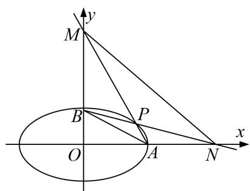

[规范解答] （1）依题意得 $\left\{ \begin{array}{l}a = 2,\\ \frac{c}{a} = \frac{\sqrt{3}}{2},\\ a^2 -b^2 = c^2, \end{array} \right.$ 解得 $\left\{ \begin{array}{l}a = 2,\\ b = 1, \end{array} \right.$ 则椭圆 $C$ 的方程为 $\frac{x^2}{4} +y^2 = 1$  
（2）设 $P(x_{0}, y_{0})(x_{0}>0, y_{0}>0)$ ，则 $x_{0}^{2}+4y_{0}^{2}=4$ ，直线 PA: $y=\frac{y_{0}}{x_{0}-2}(x-2)$ ,
令 x=0，得 $y_{M}=\frac{-2y_{0}}{x_{0}-2}$ ，则 $|BM|=|1-y_{M}|=y_{M}-1=-1-\frac{2y_{0}}{x_{0}-2}$ .

直线 PB: $y=\frac{y_{0}-1}{x_{0}}x+1$ ，令 y=0，得 $x_{N}=\frac{-x_{0}}{y_{0}-1}$ ，则 $|AN|=|2-x_{N}|=x_{N}-2=-2-\frac{x_{0}}{y_{0}-1}$
$\therefore S _ {\triangle P M N} - S _ {\triangle P A B} = \frac {1}{2} | A N | \cdot (| O M | - | O B |) = \frac {1}{2} | A N | \cdot | B M | = \frac {1}{2} \left[ - 2 - \frac {x _ {0}}{y _ {0} - 1} \right] \left[ - 1 - \frac {2 y _ {0}}{x _ {0} - 2} \right]$
$= \frac {1}{2} \cdot \frac {x _ {0} ^ {2} + 4 y _ {0} ^ {2} + 4 x _ {0} y _ {0} - 4 x _ {0} - 8 y _ {0} + 4}{x _ {0} y _ {0} - x _ {0} - 2 y _ {0} + 2} = \frac {1}{2} \cdot \frac {4 x _ {0} y _ {0} - 4 x _ {0} - 8 y _ {0} + 8}{x _ {0} y _ {0} - x _ {0} - 2 y _ {0} + 2} = 2.$

[例8] 已知椭圆 $C: \frac{x^2}{a^2} + \frac{y^2}{b^2} = 1 (a > b > 0)$ 的离心率 $\mathbf{e}$ 满足 $2\mathrm{e}^2 - 3\sqrt{2}\mathrm{e} + 2 = 0$ ，右顶点为 $A$ ，上顶点为 $B$ ，点 $C(0, -2)$ ，过点 $C$ 作一条与 $y$ 轴不重合的直线 $l$ ，直线 $l$ 交椭圆 $E$ 于 $P$ ， $Q$ 两点，直线 $BP$ ， $BQ$ 分别交 $x$ 轴于点 $M$ ， $N$ ；当直线 $l$ 经过点 $A$ 时， $l$ 的斜率为 $\sqrt{2}$ .  
（1）求椭圆 E 的方程;  
（2）证明： $S_{\triangle BOM} \cdot S_{\triangle BCN}$ 为定值.

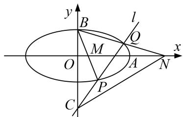

[规范解答] （1）由 $2\mathrm{e}^2 - 3\sqrt{2}\mathrm{e} + 2 = 0$ ，解得 $\mathrm{e} = \frac{\sqrt{2}}{2}$ 或 $\mathrm{e} = \sqrt{2}$ （舍去），
$\therefore a = \sqrt{2} c$ ，又 $a^2 = c^2 + b^2$ ， $a = \sqrt{2} b$ ，又 $k_{AC} = \frac{0 - (-2)}{a - 0} = \sqrt{2}$ ， $\therefore a = \sqrt{2}, b = 1,$
∴椭圆 E 的方程为 $\frac{x^{2}}{2} + y^{2} = 1$ ;  
（2）由题知，直线 l 的斜率存在，设直线 l 的方程为 y=kx-2，设 $P(x_{1}, y_{1})$ ， $Q(x_{2}, y_{2})$ ，
由 $\left\{\begin{aligned}y&=kx-2\\ \frac{x^{2}}{2}&+y^{2}=1\end{aligned}\right.$ 得 $(1+2k^{2})x^{2}-8kx+6=0,\quad\therefore x_{1}+x_{2}=\frac{8k}{1+2k^{2}},\quad x_{1}x_{2}=\frac{6}{1+2k^{2}},$
$\Delta = (- 8 k) ^ {2} - 4 \times 6 \times (2 k ^ {2} + 1) > 0, \quad \therefore k ^ {2} > \frac {3}{2},$
$\therefore y _ {1} + y _ {2} = k \left(x _ {1} + x _ {2}\right) - 4 = \frac {- 4}{1 + 2 k ^ {2}}, \quad y _ {1} y _ {2} = \left(k x _ {1} - 2\right) \left(k x _ {2} - 2\right) = k ^ {2} x _ {1} x _ {2} + 2 k \left(x _ {1} + x _ {2}\right) + 4 = \frac {4 - 2 k ^ {2}}{1 + 2 k ^ {2}},$

直线 BP 的方程为 $y=\frac{y_{1}-1}{x_{1}}x+1$ ，令 y=0，解得 $x=\frac{x_{1}}{1-y_{1}}$ ，则 $M(\frac{x_{1}}{1-y_{1}},0)$ .
同理可得 $N(\frac{x_{2}}{1-y_{2}}, 0)$ .
$\therefore S _ {\triangle B O M} \cdot S _ {\triangle B C N} = \frac {3}{4} \left| \frac {x _ {1}}{1 - y _ {1}} \right| \left| \frac {x _ {2}}{1 - y _ {2}} \right| = \frac {3}{4} \left| \frac {x _ {1} x _ {2}}{(1 - y _ {1}) (1 - y _ {2})} \right| = \frac {3}{4} \left| \frac {x _ {1} x _ {2}}{1 - (y _ {1} + y _ {2}) + y _ {1} y _ {2}}\right) | = \frac {3}{4} \left| \frac {\frac {6}{1 + 2 k ^ {2}}}{1 - \frac {- 4}{1 + 2 k ^ {2}} + \frac {4 - 2 k ^ {2}}{1 + 2 k ^ {2}}}\right) | = \frac {1}{2}.$
$\therefore S_{\triangle BOM} \cdot S_{\triangle BCN}$ 为定值 $\frac{1}{2}$ .

# 【对点训练】

7. 已知椭圆 $C$ 的两个顶点分别为 $A(-2, 0)$ , $B(2, 0)$ , 焦点在 $x$ 轴上, 离心率为 $\frac{\sqrt{3}}{2}$ .  
（1）求椭圆 C 的方程;  
（2）如图所示, 点 $D$ 为 $x$ 轴上一点, 过点 $D$ 作 $x$ 轴的垂线交椭圆 $C$ 于不同的两点 $M, N$ , 过点 $D$ 作 $A M$ 的垂线交 $B N$ 于点 $E$ . 求证: $\triangle B D E$ 与 $\triangle B D N$ 的面积之比为定值, 并求出该定值.

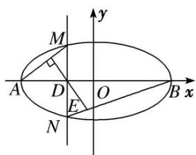

7. 解析 （1） 设椭圆 $C$ 的方程为 $\frac{x^2}{a^2} + \frac{y^2}{b^2} = 1 (a > b > 0)$ ，由题意得 $\begin{cases} a = 2, \\ \frac{c}{a} = \frac{\sqrt{3}}{2}, \\ b^2 + c^2 = a^2, \end{cases}$ 解得 $\begin{cases} b = 1, \\ c = \sqrt{3}, \end{cases}$
所以椭圆 C 的方程为 $\frac{x^{2}}{4} + y^{2} = 1$ .  
（2）法一：设 $D(x_{0}, 0)$ ， $M(x_{0}, y_{0})$ ， $N(x_{0}, -y_{0})$ ， $-2 < x_{0} < 2$ ，所以 $k_{AM} = \frac{y_{0}}{x_{0} + 2}$ ，
因为 $AM \perp DE$ ，所以 $k_{DE} = -\frac{2 + x_0}{y_0}$ ，所以直线 $DE$ 的方程为 $y = -\frac{2 + x_0}{y_0}(x - x_0)$ .
因为 $k_{BN}=-\frac{y_{0}}{x_{0}-2}$ ，所以直线 BN 的方程为 $y=-\frac{y_{0}}{x_{0}-2}(x-2)$ .
由 $\left\{ \begin{array}{l} y = -\frac{2 + x_0}{y_0} (x - x_0) \\ y = -\frac{y_0}{x_0 - 2} (x - 2), \end{array} \right.$ 解得 $E\left[\frac{4}{5} x_0 + \frac{2}{5}, -\frac{4}{5} y_0\right]$ ,
所以 $\frac{S_{\triangle BDE}}{S_{\triangle BDN}}=\frac{\frac{1}{2}|BD|\cdot|y_{E}|}{\frac{1}{2}|BD|\cdot|y_{N}|}=\frac{\left|- \frac{4}{5}y_{0}\right|}{|-y_{0}|}=\frac{4}{5}.$ 故 $\triangle BDE$ 与 $\triangle BDN$ 的面积之比为定值 $\frac{4}{5}.$

法二：设 $M(2\cos\theta,\sin\theta)(\theta\neq k\pi,k\in\mathbf{Z})$ ，则 $D(2\cos\theta,0)$ ， $N(2\cos\theta,-\sin\theta)$ ，设 $\overrightarrow{BE}=\lambda\overrightarrow{BN}$
$\begin{array}{l} \text {则} \overrightarrow {D E} = \overrightarrow {D B} + \overrightarrow {B E} = \overrightarrow {D B} + \lambda \overrightarrow {B N} = (2 - 2 \cos \theta , 0) + \lambda (2 \cos \theta - 2, - \sin \theta) \\ = (2 - 2 \cos \theta + 2 \lambda \cos \theta - 2 \lambda , - \lambda \sin \theta). \\ \end{array}$
又 $\overrightarrow{AM}=(2\cos\theta+2,\sin\theta)$ ，由 $\overrightarrow{AM}\perp\overrightarrow{DE}$ ，得 $\overrightarrow{AM}\cdot\overrightarrow{DE}=0$ ，
从而 $\left[(2-2\cos\theta)+\lambda(2\cos\theta-2)\right](2\cos\theta+2)-\lambda\sin^{2}\theta=0,$
整理得 $4\sin^{2}\theta-4\lambda\sin^{2}\theta-\lambda\sin^{2}\theta=0$ ，即 $5\lambda\sin^{2}\theta=4\sin^{2}\theta$ 。所以 $\lambda=\frac{4}{5}$ ，所以 $\frac{S_{\triangle BDE}}{S_{\triangle BDN}}=\frac{|BE|}{|BN|}=\frac{4}{5}$ .
故 $\triangle BDE$ 与 $\triangle BDN$ 的面积之比为定值 $\frac{4}{5}$ .

8. 已知 O 为坐标原点，过点 $M(1,0)$ 的直线 l 与抛物线 C: $y^{2}=2px(p>0)$ 交于 A, B 两点，且 $\overrightarrow{OA}\cdot\overrightarrow{OB}=-3$ .  
（1）求抛物线 C 的方程;  
（2）过点 M 作直线 $l'\perp l$ 交抛物线 C 于 P, Q 两点，记 $\triangle OAB$ ， $\triangle OPQ$ 的面积分别为 $S_{1}$ ， $S_{2}$ ，证明： $\frac{1}{S_{1}^{2}} + \frac{1}{S_{2}^{2}}$ 为定值.

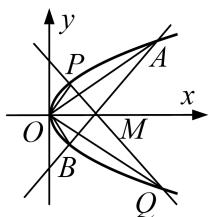

8. 解析 （1）设直线 $l: x = my + 1$ ，联立方程 $\left\{ \begin{array}{l} x = my + 1, \\ y^2 = 2px, \end{array} \right.$ 消去 $x$ 得， $y^2 - 2pmy - 2p = 0$
设 $A(x_{1}, y_{1})$ ， $B(x_{2}, y_{2})$ ，则 $y_{1} + y_{2} = 2pm$ ， $y_{1}y_{2} = -2p$ ，
又因为 $\overrightarrow{OA} \cdot \overrightarrow{OB} = x_1x_2 + y_1y_2 = (my_1 + 1)(my_2 + 1) + y_1y_2 = (1 + m^2)y_1y_2 + m(y_1 + y_2) + 1$
$= (1 + m ^ {2}) (- 2 p) + 2 p m ^ {2} + 1 = - 2 p + 1 = - 3.$
解得 p=2 。所以抛物线 C 的方程为 $y^{2}=4x$  
（2）由（1）知 $M(1, 0)$ 是抛物线 C 的焦点，
所以 $|AB|=x_{1}+x_{2}+p=my_{1}+my_{2}+2+p=4m^{2}+4$ 。原点到直线l的距离 $d=\frac{1}{\sqrt{1+m^{2}}}$
所以 $S_{1} = \frac{1}{2}\times \frac{1}{\sqrt{1 + m^{2}}}\times 4(m^{2} + 1) = 2\sqrt{1 + m^{2}}.$
因为直线 $l'$ 过点 (1, 0) 且 $l'\perp l$ ，所以 $S_{2}=2\sqrt{1+\left(\frac{1}{m}\right)^{2}}=2\sqrt{\frac{1+m^{2}}{m^{2}}}$ .
所以 $\frac{1}{S_{1}^{2}}+\frac{1}{S_{2}^{2}}=\frac{1}{4(1+m^{2})}+\frac{m^{2}}{4(1+m^{2})}=\frac{1}{4}$ . 即 $\frac{1}{S_{1}^{2}}+\frac{1}{S_{2}^{2}}$ 为定值 $\frac{1}{4}$ .

# 题型三 四边形面积问题

[例 9] (2016·北京)已知椭圆 C: $\frac{x^{2}}{a^{2}}+\frac{y^{2}}{b^{2}}=1$ 过 A(2, 0), B(0, 1)两点.  
（1）求椭圆 C 的方程及离心率;  
（2）设 $P$ 为第三象限内一点且在椭圆 $C$ 上, 直线 $PA$ 与 $y$ 轴交于点 $M$ , 直线 $PB$ 与 $x$ 轴交于点 $N$ . 求证: 四边形ABNM的面积为定值.

[规范解答] （1）由题意得，a=2，b=1，所以椭圆 C 的方程为 $\frac{x^{2}}{4}+y^{2}=1$ .
又 $c=\sqrt{a^{2}-b^{2}}=\sqrt{3}$ ，所以离心率 $e=\frac{c}{a}=\frac{\sqrt{3}}{2}$ .  
（2）设 $P(x_{0}, y_{0})(x_{0}<0, y_{0}<0)$ ，则 $x_{0}^{2}+4y_{0}^{2}=4$ 。又 $A(2, 0)$ ， $B(0, 1)$ ，
所以，直线 PA 的方程为 $y=\frac{y_{0}}{x_{0}-2}(x-2)$ 。令 x=0，得 $y_{M}=-\frac{2y_{0}}{x_{0}-2}$ ，从而 $|BM|=1-y_{M}=1+\frac{2y_{0}}{x_{0}-2}$ 。

直线 PB 的方程为 $y=\frac{y_{0}-1}{x_{0}}x+1$ ，令 y=0，得 $x_{N}=-\frac{x_{0}}{y_{0}-1}$ ，从而 $|AN|=2-x_{N}=2+\frac{x_{0}}{y_{0}-1}$ .
所以四边形 $ABNM$ 的面积 $S = \frac{1}{2} |AN|\cdot |BM| = \frac{1}{2} (2 + \frac{x_0}{y_0 - 1})(1 + \frac{2y_0}{x_0 - 2}) = \frac{x_0^2 + 4y_0^2 + 4x_0y_0 - 4x_0 - 8y_0 + 4}{2(x_0y_0 - x_0 - 2y_0 + 2)}$
$= \frac{2x_0y_0 - 2x_0 - 4y_0 + 4}{x_0y_0 - x_0 - 2y_0 + 2} = 2.$ 从而四边形ABNM的面积为定值.

[例10] 已知椭圆 $C: \frac{x^2}{a^2} + \frac{y^2}{b^2} = 1 (a > b > 0)$ 的左、右焦点分别为 $F_1, F_2$ ，离心率为 $\frac{\sqrt{3}}{2}$ ，点 $G$ 是椭圆上一点， $\triangle GF_1F_2$ 的周长为 $6 + 4\sqrt{3}$ .  
（1）求椭圆 C 的方程;  
（2）直线 $l: y = kx + m$ 与椭圆 $C$ 交于 $A, B$ 两点，且四边形 $OAGB$ 为平行四边形，求证： $OAGB$ 的面积为定值.

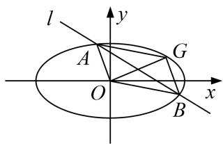

[规范解答] （1）因为 $\triangle GF_{1}F_{2}$ 的周长为 $6 + 4\sqrt{3}$ ，所以 $2a + 2c = 6 + 4\sqrt{3}$ ，即 $a + c = 3 + 2\sqrt{3}$ .
又离心率 $e=\frac{c}{a}=\frac{\sqrt{3}}{2}$ ，解得 $a=2\sqrt{3}$ ，c=3， $b^{2}=3$ 。∴椭圆 C 的方程为 $\frac{x^{2}}{12}+\frac{y^{2}}{3}=1$ 。  
（2）设 $A(x_{1}, y_{1})$ , $B(x_{2}, y_{2})$ , $G(x_{0}, y_{0})$ ，将 $y=kx+m$ 代入 $\frac{x^{2}}{12}+\frac{y^{2}}{3}=1$
消去 y 并整理得 $(1+4k^{2})x^{2}+8kmx+4m^{2}-12=0$ ,
则 $x_{1}+x_{2}=\frac{8km}{1+4k^{2}}$ ， $x_{1}\cdot x_{2}=\frac{4m^{2}-12}{1+4k^{2}}$ ， $y_{1}+y_{2}=k(x_{1}+x_{2})+2m=\frac{2m}{1+2k^{2}}$
∵ 四边形 OAGB 为平行四边形， $\overrightarrow{OG}=\overrightarrow{OA}+\overrightarrow{OB}=(x_{1}+x_{2},y_{1}+y_{2})$ ，得 $G(\frac{8km}{1+4k^{2}},\frac{2m}{1+2k^{2}})$ ,将 G 点坐标代入椭圆 C 方程得 $m^{2}=\frac{3}{4}(1+4k^{2})$ ,

点 O 到直线 AB 的距离为 $d=\frac{|m|}{\sqrt{1+k^{2}}}$ ， $|AB|=\sqrt{1+k^{2}}|x_{1}-x_{2}|$ ，
∴平行四边形 OAGB 的面积为 $S=d\cdot|AB|=|m|\cdot|x_{1}-x_{2}|=|m|\cdot\sqrt{(x_{1}+x_{2})^{2}-4x_{1}x_{2}}$
$= 4 \frac {\left| m \right| \sqrt {3 - m ^ {2} + 1 2 k ^ {2}}}{1 + 4 k ^ {2}} = 4 \frac {\left| m \right| \sqrt {3 m ^ {2}}}{1 + 4 k ^ {2}} = 4 \sqrt {3} \frac {m ^ {2}}{1 + 4 k ^ {2}} = 3 \sqrt {3}.$
故平行四边形 OAGB 的面积为定值为 $3\sqrt{3}$ .

# 【对点训练】

9. 如图，已知双曲线 $C: x^{2} - \frac{y^{2}}{3} = 1$ 的左右焦点分别为 $F_{1}, F_{2}$ ，若点 $P$ 为双曲线 $C$ 在第一象限上的一点，且满足 $|PF_{1}| + |PF_{2}| = 8$ ，过点 $P$ 分别作双曲线 $C$ 两条渐近线的平行线 $PA, PB$ 与渐近线的交点分别是 $A$ 和 $B$ .  
（1）求四边形 OAPB 的面积;  
（2）若对于更一般的双曲线 $C'$ : $\frac{x^2}{a^2} -\frac{y^2}{b^2} = 1(a > 0, b > 0)$ , 点 $P'$ 为双曲线 $C'$ 上任意一点, 过点 $P'$ 分别作双曲线 $C'$ 两条渐近线的平行线 $P'A'$ 、 $P'B'$ 与渐近线的交点分别是 $A'$ 和 $B'$ . 请问四边形 $OA'P'B'$ 的面积为定值吗? 若是定值, 求出该定值 (用 $a$ 、 $b$ 表示该定值); 若不是定值, 请说明理由.

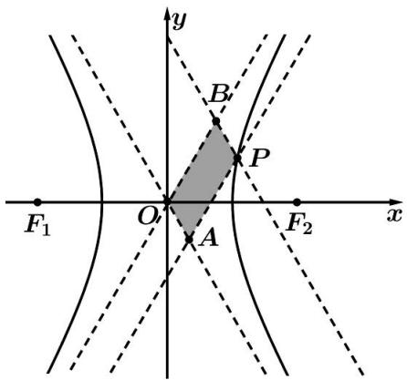

9. 解析 （1）因为双曲线 $C: x^{2} - \frac{y^{2}}{3} = 1$ ，由双曲线的定义可得 $|PF_{1}| - |PF_{2}| = 2$
又因为 $|PF_{1}|+|PF_{2}|=8,\quad\therefore|PF_{1}|=5,\quad|PF_{2}|=3,$
因为 $|F_{1}F_{2}|=2\sqrt{1+3}=4$ ，所以， $|PF_{2}|^{2}+|F_{1}F_{2}|^{2}=|PF_{1}|^{2}$ ， $PF_{2}\perp x$ 轴，
∴点 P 的横坐标为 $x_{P}=2$ ，所以， $2^{2}-\frac{y_{P}^{2}}{3}=1$ ，因为 $y_{P}>0$ ，可得 $y_{P}=3$ ，即点 $P(2,3)$ ，

过点 P 且与渐近线 $y = -\sqrt{3}x$ 平行的直线的方程为 $y - 3 = -\sqrt{3}(x - 2)$ ,
联立 $\left\{ \begin{array}{l} y = -\sqrt{3} x \\ y - 3 = -\sqrt{3} (x - 2) \end{array} \right.$ ，解得 $\left\{ \begin{array}{l} x = 1 + \frac{\sqrt{3}}{2} \\ y = \sqrt{3} + \frac{3}{2} \end{array} \right.$ ，即点 $B(1 + \frac{\sqrt{3}}{2}, \sqrt{3} + \frac{3}{2})$

直线 OP 的方程为 3x-2y=0，点 B 到直线 OP 的距离为 $d=\frac{\frac{\sqrt{3}}{2}}{\sqrt{13}}=\frac{\sqrt{3}}{2\sqrt{13}}$ ,

且 $|OP|=\sqrt{13}$ ，因此，四边形OAPB的面积为 $2S_{\triangle OBP}=|OP|d=\frac{\sqrt{3}}{2}$ ;  
（2）四边形 $OA'P'B'$ 的面积为定值 $\frac{1}{2}ab$ ，理由如下：
设点 $P'(x_{0}, y_{0})$ ，双曲线 $\frac{x^{2}}{a^{2}} - \frac{y^{2}}{b^{2}} = 1$ 的渐近线方程为 $y = \pm \frac{b}{a} x$ ,
则直线 $P'B'$ 的方程为 $y-y_{0}=-\frac{b}{a}(x-x_{0})$ ,
联立 $\left\{\begin{aligned}y-y_{0}&=-\frac{b}{a}(x-x_{0})\\ y&=\frac{b}{a}x\end{aligned}\right.$ ，解得 $\left\{\begin{aligned}x&=\frac{x_{0}}{2}+\frac{a}{2b}y_{0}\\ y&=\frac{y_{0}}{2}+\frac{b}{2a}x_{0}\end{aligned}\right.$ ，即点 $B'\left(\frac{x_{0}}{2}+\frac{a}{2b}y_{0},\frac{y_{0}}{2}+\frac{b}{2a}x_{0}\right)$

直线 $OP'$ 的方程为 $y=\frac{y_{0}}{x_{0}}x$ ，即 $y_{0}x-x_{0}y=0$ ，

点 $B'$ 到直线 $OP'$ 的距离为 $d = \frac{|y_0(\frac{x_0}{2} + \frac{a}{2b} y_0) - x_0(\frac{y_0}{2} + \frac{b}{2a} x_0)|}{\sqrt{x_0^2 + y_0^2}}$
$= \frac{|a^2y_0^2 - b^2x_0^2|}{2ab\sqrt{x_0^2 + y_0^2}} = \frac{a^2b^2}{2ab\sqrt{x_0^2 + y_0^2}} = \frac{ab}{2\sqrt{x_0^2 + y_0^2}},$ 且 $|OP'| = \sqrt{x_0^2 + y_0^2},$
因此，四边形 $OA'P'B'$ 的面积为 $2S_{\triangle OB'P'}=\frac{ab}{2\sqrt{x_{0}^{2}+y_{0}^{2}}}\sqrt{x_{0}^{2}+y_{0}^{2}}=\frac{ab}{2}$ (定值).

10. 已知椭圆 $C: \frac{x^2}{a^2} + \frac{y^2}{b^2} = 1 (a > b > 0)$ 的离心率为 $\frac{\sqrt{2}}{2}$ ，点 $Q\left(b, \frac{a}{b}\right)$ 在椭圆上， $O$ 为坐标原点.  
（1）求椭圆 C 的方程;  
（2）已知点 $P, M, N$ 为椭圆 $C$ 上的三点，若四边形 OPMN 为平行四边形，证明四边形 OPMN 的面积 $S$ 为定值，并求该定值.

10. 解析 （1） $\because$ 椭圆 $\frac{x^2}{a^2} + \frac{y^2}{b^2} = 1 (a > b > 0)$ 的离心率为 $\frac{\sqrt{2}}{2}$ , $\therefore e^2 = \frac{c^2}{a^2} = \frac{a^2 - b^2}{a^2} = \frac{1}{2}$ , 得 $a^2 = 2b^2$ , ① 又点 $Q\left(b, \frac{a}{b}\right)$ 在椭圆 $C$ 上, $\therefore \frac{b^2}{a^2} + \frac{a^2}{b^4} = 1$ , ②.
联立①②得 $a^{2}=8,\ b^{2}=4$ ．∴椭圆 C 的方程为 $\frac{x^{2}}{8}+\frac{y^{2}}{4}=1$ .  
（2）当直线 $PN$ 的斜率 $k$ 不存在时， $PN$ 的方程为 $x = \sqrt{2}$ 或 $x = -\sqrt{2}$ ，从而有 $|PN| = 2\sqrt{3}$ ，
$\therefore S = \frac {1}{2} | P N | \cdot | O M | = \frac {1}{2} \times 2 \sqrt {3} \times 2 \sqrt {2} = 2 \sqrt {6};$
当直线 PN 的斜率 k 存在时，设直线 PN 的方程为 $y=kx+m(m\neq0)$ ， $P(x_{1},y_{1})$ ， $N(x_{2},y_{2})$ ，将 PN 的方程代入椭圆 C 的方程，整理得 $(1+2k^{2})x^{2}+4kmx+2m^{2}-8=0$ ，
$\Delta=16k^{2}m^{2}-4(2m^{2}-8)(1+2k^{2})>0$ ，即 $m^{2}<4+8k^{2}$ ， $\therefore x_{1}+x_{2}=\frac{-4km}{1+2k^{2}}$ ， $x_{1}\cdot x_{2}=\frac{2m^{2}-8}{1+2k^{2}}$
$y_{1} + y_{2} = k(x_{1} + x_{2}) + 2m = \frac{2m}{1 + 2k^{2}}$ ，由 $\overrightarrow{OM} = \overrightarrow{OP} +\overrightarrow{ON}$ ，得 $M\left(\frac{-4km}{1 + 2k^2},\frac{2m}{1 + 2k^2}\right)$
将 M 点坐标代入椭圆 C 的方程，得 $m^{2}=1+2k^{2}$ ,
又点 O 到直线 PN 的距离为 $d=\frac{|m|}{\sqrt{1+k^{2}}}$ ， $|PN|=\sqrt{1+k^{2}}|x_{1}-x_{2}|$ ，
$\therefore S = d \cdot | P N | = | m | \cdot | x _ {1} - x _ {2} | = \sqrt {1 + 2 k ^ {2}} \cdot \sqrt {(x _ {1} + x _ {2}) ^ {2} - 4 x _ {1} x _ {2}} = \sqrt {\frac {4 8 k ^ {2} + 2 4}{2 k ^ {2} + 1}} = 2 \sqrt {6}.$

综上，平行四边形 OPMN 的面积 S 为定值 $2\sqrt{6}$ .

