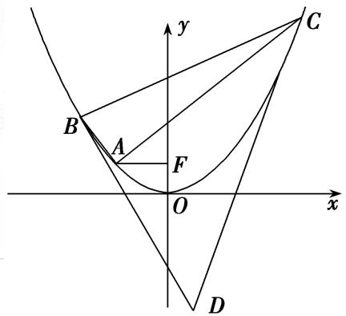
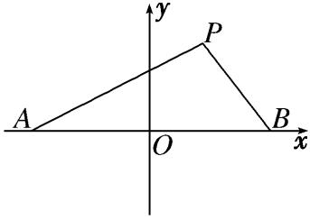
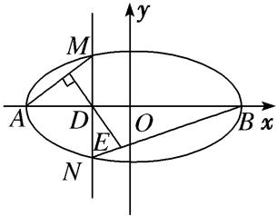
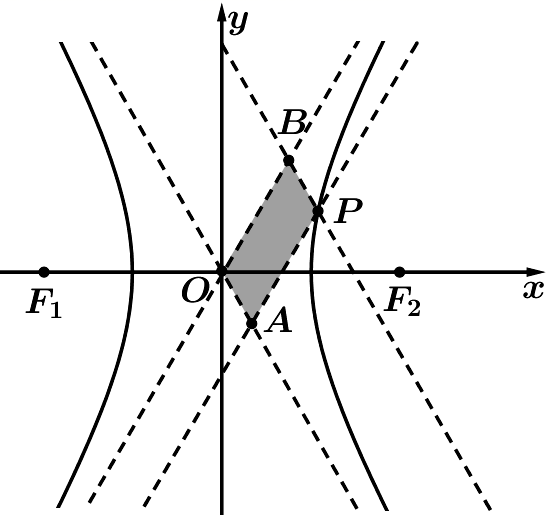

**专题20　面积型定值型问题**

**题型一　三角形面积问题**

**【例题选讲】**

<strong>[例1]</strong>　已知椭圆<em>C</em>：＋＝1(<em>a</em>&gt;<em>b</em>&gt;0)的离心率为，以原点<em>O</em>为圆心，椭圆的短半轴长为半径的圆与直线<em>x</em>－<em>y</em>＋＝0相切．

(1)求椭圆*C*的标准方程；

(2)若直线<em>l</em>：<em>y</em>＝<em>kx</em>＋<em>m</em>与椭圆<em>C</em>相交于<em>A</em>，<em>B</em>两点，且<em>kOA</em>·<em>kOB</em>＝－．求证：△<em>AOB</em>的面积为定值．

<strong>[规范解答]</strong>　(1)由题意得，∴<em>a</em>2＝4，<em>b</em>2＝3，∴椭圆的方程为＋＝1；

(2)设<em>A</em>(<em>x</em>1，<em>y</em>1)，<em>B</em>(<em>x</em>2，<em>y</em>2)，则<em>A</em>，<em>B</em>的坐标满足，

消去<em>y</em>化简得(3＋4<em>k</em>2)<em>x</em>2＋8<em>kmx</em>＋4<em>m</em>2－12＝0，<em>x</em>1＋<em>x</em>2＝－，<em>x</em>1<em>x</em>2＝，

由<em>Δ</em>＞0，得<em>m</em>24<em>k</em>2－<em>m</em>2＋3&gt;0，

<em>y</em>1<em>y</em>2＝(<em>kx</em>1＋<em>m</em>)( <em>kx</em>2＋<em>m</em>)＝<em>k</em>2 <em>x</em>1<em>x</em>2＋<em>km</em>(<em>x</em>1＋<em>x</em>2)＋<em>m</em>2＝<em>k</em>2＋<em>km</em> (－)＋<em>m</em>2＝．

∵<em>kOA</em>·<em>kOB</em>＝－＝－，∴＝－，即<em>y</em>1<em>y</em>2＝－ <em>x</em>1<em>x</em>2，∴＝－·．即2<em>m</em>2－4<em>k</em>2＝3

|<em>MN</em>|＝·|<em>x</em>1－<em>x</em>2|＝·＝·＝．

又由点*O*到直线*y*＝*kx*＋*m*的距离*d*＝，

所以<em>S</em>△<em>MON</em>＝|<em>AB</em>|·<em>d</em>＝·＝·＝·＝为定值．

<strong>[例2]</strong>　已知椭圆<em>C</em>：＋＝1(<em>a</em>&gt;<em>b</em>&gt;0)的离心率为，<em>O</em>是坐标原点，点<em>A</em>，<em>B</em>分别为椭圆<em>C</em>的左右顶点，|<em>AB</em>|＝4．

(1)求椭圆*C*的标准方程．

(2)若*P*是椭圆*C*上异于*A*，*B*的一点，直线*l*交椭圆*C*于*M*，*N*两点，*AP*∥*OM*，*BP*∥*ON*，则△*OMN*的面积是否为定值？若是，求出定值，若不是，请说明理由．

<strong>[规范解答]</strong>　(1)由2<em>a</em>＝4，e＝，解得<em>a</em>＝2，<em>c</em>＝2，<em>b</em>2＝<em>a</em>2－<em>c</em>2＝4，则椭圆的方程为＋＝1；

(2)由题意可得<em>A</em>(－2，0)，<em>B</em>(2，0)，设<em>P</em>（<em>x</em>0，<em>y</em>0），可得＋＝1，即<em>x</em>02+2<em>y</em>02＝8，

则<em>kAP</em>·<em>kBP</em>＝·＝＝＝－，

因为<em>AP</em>∥<em>OM</em>，<em>BP</em>∥<em>ON</em>，则<em>kOM</em>·<em>kON</em>＝<em>kAP</em>·<em>kBP</em>＝－，

①当直线*l*的斜率不存在时，设*l*：*x*＝*m*，联立椭圆方程可得*y*＝±，

所以<em>M</em>(<em>m</em>，)，<em>N</em>(<em>m</em>，－)，由<em>kOM</em>·<em>kON</em>＝－，可得－＝－，解得<em>m</em>＝±2，

所以<em>M</em>(±2，)，<em>N</em>(±2，－)，所以<em>S</em>△<em>MNO</em>＝×2×2＝2；

②当直线<em>l</em>的斜率存在时，设直线<em>l</em>：<em>y</em>＝<em>kx</em>＋<em>n</em>，<em>M</em>(<em>x</em>1，<em>y</em>1)，<em>N</em>(<em>x</em>2，<em>y</em>2)，

联立直线<em>y</em>＝<em>kx</em>＋<em>n</em>和<em>x</em>2＋2<em>y</em>2＝8，可得(1＋2<em>k</em>2)<em>x</em>2＋4<em>knx</em>＋2<em>n</em>2－8＝0，

可得∴<em>x</em>1＋<em>x</em>2＝－，<em>x</em>1<em>x</em>2＝，<em>y</em>1<em>y</em>2＝(<em>kx</em>1＋<em>n</em>)(<em>kx</em>2＋<em>n</em>)＝<em>k</em>2<em>x</em>1<em>x</em>2＋<em>kn</em>(<em>x</em>1＋<em>x</em>2)＋<em>n</em>2，

由<em>kOM</em>·<em>kON</em>＝＝<em>k</em>2＋＋＝－，可得<em>n</em>2＝2＋4<em>k</em>2，

由弦长公式可得，|<em>MN</em>＝|·|<em>x</em>1－<em>x</em>2|＝·

＝·＝·＝．

点(0，0)到直线*l*的距离为*d*＝＝，

所以<em>S</em>△<em>OMN</em>＝<em>d</em>·|<em>MN</em>|＝2，综上可知，△<em>OMN</em>的面积为定值2．

<strong>[例3]</strong>　如图，<em>F</em>1、<em>F</em>2为椭圆<em>C</em>：＋＝1(<em>a</em>＞<em>b</em>＞0)的左、右焦点，<em>D</em>、<em>E</em>是椭圆的两个顶点，椭圆的离心率为，<em>S</em>△<em>DEF</em>2＝1－．若<em>M</em>(<em>x</em>0，<em>y</em>0)在椭圆<em>C</em>上，则点<em>N</em>(，)称为点<em>M</em>的一个“好点”．直线<em>l</em>与椭圆交于<em>A</em>、<em>B</em>两点，<em>A</em>、<em>B</em>两点的“好点”分别为<em>P</em>、<em>Q</em>，已知以<em>PQ</em>为直径的圆经过坐标原点．

(1)求椭圆的标准方程；

(2) △*AOB*的面积是否为定值？若为定值，试求出该定值；若不为定值，请说明理由．

<strong>[规范解答]</strong>　(1)由题可知，解得<em>a</em>2＝4，<em>b</em>2＝1，

故椭圆<em>C</em>的标准方程为＋<em>y</em>2＝1．

(2)设<em>A</em>(<em>x</em>1，<em>y</em>1)，<em>B</em>(<em>x</em>2，<em>y</em>2)，则<em>P</em>(，<em>y</em>1)，<em>Q</em>(，<em>y</em>2)．由<em>OP</em>⊥<em>OQ</em>，即＋<em>y</em>1<em>y</em>2＝0．(1)

①当直线<em>AB</em>的斜率不存在时，<em>S</em>＝|<em>x</em>1·| <em>y</em>1－<em>y</em>2|＝1；

②当直线*AB*的斜率存在时，设其直线为*y*＝*kx*＋*m*(*k*≠0)，

联立得(4<em>k</em>2＋1)<em>x</em>2＋8<em>kmx</em>＋4<em>m</em>2－4＝0．

则<em>Δ</em>＝16(4<em>k</em>2－<em>m</em>2＋1)，<em>x</em>1<em>x</em>2＝，同理<em>y</em>1<em>y</em>2＝，代入(1)，整理得4<em>k</em>2＋1＝2<em>m</em>2．

此时<em>Δ</em>＝16<em>m</em>2&gt;0，|<em>AB</em>|＝|·|<em>x</em>1－<em>x</em>2|＝．<em>h</em>＝，∴<em>S</em>＝1．

综上，△*AOB*的面积为定值1．

<strong>[例4]</strong>　已知椭圆<em>C</em>：＋＝1(<em>a</em>&gt;<em>b</em>&gt;0)的焦距为2，四个顶点构成的四边形面积为2<em>．</em>

(1)求椭圆*C*的标准方程；

(2)斜率存在的直线*l*与椭圆*C*相交于*M*、*N*两点，*O*为坐标原点，＝＋，若点*P*在椭圆上，请判断△*OMN*的面积是否为定值．

解析　(1)由题可得2<em>c</em>＝2，<em>c</em>＝1，2<em>a</em>×2×<em>b</em>＝2，又<em>a</em>2＝<em>c</em>2＋<em>b</em>2，解得<em>b</em>＝1，<em>a</em>＝．

故椭圆方程为＋<em>y</em>2＝1．

(2)设直线<em>l</em>方程是<em>y</em>＝<em>kx</em>＋<em>m</em>，设<em>M</em>(<em>x</em>1，<em>y</em>1)，<em>N</em>(<em>x</em>2，<em>y</em>2)，<em>P</em>(<em>x</em>0，<em>y</em>0)，

联立得(1＋2<em>k</em>2)<em>x</em>2＋4<em>kmx</em>＋2<em>m</em>2－2＝0，

<em>Δ</em>＝8(2<em>k</em>2－<em>m</em>2＋1)&gt;0．<em>x</em>1＋<em>x</em>2＝，<em>x</em>1<em>x</em>2＝，

|<em>MN</em>|＝·|<em>x</em>1－<em>x</em>2|＝·＝．

又∵＝＋，所以∴*P*(，)

把点<em>P</em>坐标代入椭圆方程可得()2＋2()＝2，整理可得4<em>m</em>2＝2<em>k</em>2＋1，

又由点*O*到直线*y*＝*kx*＋*m*的距离*d*＝，△*OMN*的面积

<em>S</em>△<em>OMN</em>＝|<em>MN</em>|·<em>d</em>＝＝×|<em>m</em>|＝．

所以，△*OMN*的面积为定值．

<strong>[例5]</strong>　已知椭圆<em>C</em>：＋＝1(<em>a</em>&gt;<em>b</em>&gt;0)的离心率为，过点<em>P</em>(1，)．

(1)求椭圆*C*的标准方程；

(2)设点*A*、*B*分别是椭圆*C*的左顶点和上顶点，*M*、*N*为椭圆*C*上异于*A*、*B*的两点，满足*AM*∥*BN*，，求证：△*OMN*面积为定值．

<strong>[规范解答]</strong>　(1)由已知条件可得，解得<em>a</em>2＝4，<em>b</em>2＝1，故椭圆<em>C</em>的标准方程为＋<em>y</em>2＝1．

(2)设<em>M</em>(<em>x</em>1，<em>y</em>1)，<em>N</em>(<em>x</em>2，<em>y</em>2)，由题意直线<em>AM</em>、<em>BN</em>的斜率存在，

设直线*AM*的方程为*y*＝*k*(*x*＋2)①，设直线*BN*的方程为*y*＝*kx*＋1②，

由(1)椭圆<em>C</em>：＋<em>y</em>2＝1③，

联立①③得(4<em>k</em>2＋1)<em>x</em>2＋16<em>k</em>2<em>x</em>＋16<em>k</em>2－4＝0，解得<em>x</em>1＝，即<em>M</em>(，)，

联立②③，得(4<em>k</em>2＋1)<em>x</em>2＋8<em>kx</em>＝0，所以，<em>x</em>2＝－，即<em>N</em>(－，)，

易知|*OM*|＝，

直线<em>OM</em>的方程为<em>y</em>1<em>x</em>－<em>x</em>1<em>y</em>＝0，点<em>N</em>到直线<em>OM</em>的距离为，

所以<em>S</em>△<em>OMN</em>＝|<em>OM</em>|·<em>d</em>＝＝|－·－·|＝1

故△*OMN*面积为定值1．

<strong>[例6]</strong>　如图，点<em>F</em>是抛物线<em>Г</em>：<em>x</em>2＝2<em>py</em>(<em>p</em>＞0)的焦点，点<em>A</em>是抛物线上的定点，且＝(2，0)，点<em>B</em>，<em>C</em>是抛物线上的动点，直线<em>AB</em>，<em>AC</em>的斜率分别为<em>k</em>1，<em>k</em>2．

(1)求抛物线*Г*的方程；

(2)若<em>k</em>2－<em>k</em>1＝2，点<em>D</em>是抛物线在点<em>B</em>，<em>C</em>处切线的交点，记△<em>BCD</em>的面积为<em>S</em>，证明<em>S</em>为定值．

<strong>[规范解答]</strong>　(1)设<em>A</em>(<em>x</em>0，<em>y</em>0)，由题知<em>F</em>(0，)，所以＝(－<em>x</em>0，－<em>y</em>0)＝(2，0)，

所以，代入<em>x</em>2＝2<em>py</em>(<em>p</em>＞0)，得4＝<em>p</em>2，得<em>p</em>＝2，

所以抛物线的方程是<em>x</em>2＝4<em>y</em>．

(2)过<em>D</em>作<em>y</em>轴的平行线交<em>BC</em>于点<em>E</em>，并设<em>B</em>(<em>x</em>1，)，<em>C</em>(<em>x</em>2，)，由(1)知<em>A</em>(－2，1)，

所以<em>k</em>2－<em>k</em>1＝－＝，又<em>k</em>2－<em>k</em>1＝2，所以<em>x</em>2－<em>x</em>1＝8．

直线*BD*：*y*＝*x*－，直线*CD*：*y*＝*x*－，解得

因直线<em>BC</em>的方程为<em>y</em>－＝(<em>x</em>－<em>x</em>1)，将<em>xD</em>代入得<em>yE</em>＝，

所以<em>S</em>＝|<em>DE</em>|(<em>x</em>2－<em>x</em>1)＝(<em>yE</em>－<em>yD</em>)(<em>x</em>2－<em>x</em>1)＝·(<em>x</em>2－<em>x</em>1)＝32．

**【对点训练】**

1．已知椭圆＋＝1(*a*＞*b*＞0)的四个顶点围成的菱形的面积为4，椭圆的一个焦点为(1，0)．

(1)求椭圆的方程；

(2)若<em>M</em>，<em>N</em>为椭圆上的两个动点，直线<em>OM</em>，<em>ON</em>的斜率分别为<em>k</em>1，<em>k</em>2，当<em>k</em>1<em>k</em>2＝－时，△<em>MON</em>的面积是否为定值？若为定值，求出此定值；若不为定值，说明理由．

1．解析　(1)由椭圆＋＝1的四个顶点围成的菱形的面积为4，椭圆的一个焦点为1，0)，

可得2<em>ab</em>＝4，<em>c</em>＝1，即<em>ab</em>＝2，<em>a</em>2－<em>b</em>2＝1，解得<em>a</em>2＝4，<em>b</em>2＝3，故椭圆的方程为＋＝1．

(2)设<em>M</em>(<em>x</em>1，<em>y</em>1)，<em>N</em>(<em>x</em>2，<em>y</em>2)，当直线<em>MN</em>的斜率存在时，设方程为<em>y</em>＝<em>kx</em>＋<em>m</em>，

由，消<em>y</em>可得，(4<em>k</em>2＋3)<em>x</em>2＋8<em>kmx</em>＋4<em>m</em>2－12＝0．

则<em>Δ</em>＝64<em>k</em>2<em>m</em>2－4(4<em>k</em>2＋3)(4<em>m</em>2－12)＝48(4<em>k</em>2－<em>m</em>2＋3)＞0，即<em>m</em>2&lt;4<em>k</em>2＋3，

且<em>x</em>1＋<em>x</em>2＝，<em>x</em>1<em>x</em>2＝，

所以|<em>MN</em>|＝|·|<em>x</em>1－<em>x</em>2|＝·

＝·＝·．

又由点*O*到直线*MN*的距离*d*＝，

所以<em>S</em>△<em>MON</em>＝|<em>MN</em>|<em>d</em>＝·．

又因为<em>k</em>1<em>k</em>2＝＝－，所以＝<em>k</em>2＋＝－，

化简整理可得2<em>m</em>2＝4<em>k</em>2＋3，满足<em>Δ</em>＞0，

代入<em>S</em>△<em>MON</em>＝·＝＝<em>．</em>

当直线<em>MN</em>的斜率不存在时，由于<em>k</em>1<em>k</em>2＝－，

考虑到<em>OM</em>，<em>ON</em>关于<em>x</em>轴对称，不妨设<em>k</em>1＝，<em>k</em>1<em>k</em>2＝－，

则点<em>M</em>，<em>N</em>的坐标分别为<em>M</em>(，)，<em>N</em>(，－)，此时<em>S</em>△<em>MON</em>＝××＝<em>．</em>

综上可得，△*MON*的面积为定值．

2．已知椭圆*C*：＋＝1(*a*>*b*>0)的离心率为，直线*x*－*y*＋＝0与椭圆*C*有且只有一个公共点．

(1)求椭圆*C*的标准方程

(2)设点*A*(－，0)，*B*(，0)，*P*为椭圆*C*上一点，且直线*PA*，*PB*的斜率乘积为－，点*M*，*N*是椭圆*C*上不同于*A*，*B*的两点，且满足*AP*∥*OM*，*BP*∥*ON*，求证：△*OMN*的面积为定值．

2．解析　(1)∵直线*x*－*y*＋＝0与椭圆有且只有一个公共点，

∴直线*x*－*y*＋＝0与椭圆*C*：＋＝1相切，

由，得(<em>b</em>2＋<em>a</em>2)<em>x</em>2＋2<em>a</em>2<em>x</em>＋5<em>a</em>2－<em>a</em>2<em>b</em>2＝0，∴<em>Δ</em>＝0，即<em>a</em>2＋<em>b</em>2＝5，

又∵e＝，∴<em>a</em>＝，<em>b</em>2＝2，椭圆<em>C</em>的方程为＋＝1．

(2)由题意*M*、*N*是椭圆*C*上不同于*A*，*B*的两点，

由题意知，直线<em>PA</em>，<em>PB</em>斜率存在且不为0，又由已知<em>kAP</em>·<em>kBP</em>＝－．

由<em>AP</em>∥<em>OM</em>，<em>BP</em>∥<em>ON</em>，所以<em>kOM</em>·<em>kON</em>＝－．

设直线<em>MN</em>的方程为<em>x</em>＝<em>my</em>－<em>t</em>，，代入椭圆方程得(2<em>m</em>2＋3)<em>y</em>2＋4<em>mty</em>＋2<em>t</em>2－6＝0，

设<em>M</em>(<em>x</em>1，<em>y</em>1)，<em>N</em>(<em>x</em>2，<em>y</em>2)，则<em>y</em>1＋<em>y</em>2＝－，<em>y</em>1<em>y</em>2＝，

又<em>kOM</em>·<em>kON</em>＝＝＝＝－，可得2<em>t</em>2＝2<em>m</em>2＋3，

所以<em>S</em>△<em>OMN</em>＝|<em>t</em>|·| <em>y</em>1－<em>y</em>2|＝|<em>t</em>|·＝|<em>t</em>|·＝．

即△*OMN*的面积为定值．

3．在平面直角坐标系<em>xOy</em>中，已知椭圆<em>C</em>：＋<em>y</em>2＝1，点<em>P</em>(<em>x</em>1，<em>y</em>1)，<em>Q</em>(<em>x</em>2，<em>y</em>2)是椭圆<em>C</em>上两个动点，直

线<em>OP</em>，<em>OQ</em>的斜率分别为<em>k</em>1，<em>k</em>2，若<em><strong>m</strong></em>＝，<em><strong>n</strong></em>＝，<em><strong>m</strong></em>·<em><strong>n</strong></em>＝0．

(1)求证：<em>k</em>1·<em>k</em>2＝－；

(2)试探求△*POQ*的面积*S*是否为定值，并说明理由．

3．解析　(1)∵<em>k</em>1，<em>k</em>2存在，∴<em>x</em>1<em>x</em>2≠0，∵<em><strong>m</strong></em>·<em><strong>n</strong></em>＝0，∴＋<em>y</em>1<em>y</em>2＝0，∴<em>k</em>1·<em>k</em>2＝＝－．

(2)①当直线<em>PQ</em>的斜率不存在，即<em>x</em>1＝<em>x</em>2，<em>y</em>1＝－<em>y</em>2时，由＝－，得－<em>y</em>＝0，

又由<em>P</em>(<em>x</em>1，<em>y</em>1)在椭圆上，得＋<em>y</em>＝1，∴|<em>x</em>1|＝，|<em>y</em>1|＝，∴<em>S</em>△<em>POQ</em>＝|<em>x</em>1|·|<em>y</em>1－<em>y</em>2|＝1．

②当直线*PQ*的斜率存在时，设直线*PQ*的方程为*y*＝*kx*＋*b*(*b*≠0)．

由得(4<em>k</em>2＋1)<em>x</em>2＋8<em>kbx</em>＋4<em>b</em>2－4＝0，<em>Δ</em>＝64<em>k</em>2<em>b</em>2－4(4<em>k</em>2＋1)(4<em>b</em>2－4)＝16(4<em>k</em>2＋1－<em>b</em>2)&gt;0，

∴<em>x</em>1＋<em>x</em>2＝，<em>x</em>1<em>x</em>2＝．∵＋<em>y</em>1<em>y</em>2＝0，∴＋(<em>kx</em>1＋<em>b</em>)(<em>kx</em>2＋<em>b</em>)＝0，

得2<em>b</em>2－4<em>k</em>2＝1，满足<em>Δ</em>&gt;0．

∴<em>S</em>△<em>POQ</em>＝·|<em>PQ</em>|＝|<em>b</em>|＝2|<em>b</em>|·＝1．∴△<em>POQ</em>的面积<em>S</em>为定值．

4．已知椭圆<em>C</em>：＋＝1(<em>a</em>＞<em>b</em>＞0)的左､右焦点分别为<em>F</em>1，<em>F</em>2，椭圆<em>C</em>与<em>y</em>轴的一个交点为<em>M</em>，且|<em>F</em>1<em>F</em>2|

＝2，|<em>MF</em>1|＝2．

(1)求椭圆*C*的标准方程；

(2)设*O*为坐标原点，*A*，*B*为椭圆*C*上不同的两点，点*A*关于*x*轴的对称点为点*D*．若直线*BD*的斜率为1，求证：△*OAB*的面积为定值．

4．解析　(1)因为焦距为2，所以2*c*＝2，即*c*＝，

由|<em>MF</em>1|＝2，得<em>a</em>＝2，即<em>a</em>2＝4，<em>b</em>2＝1，所以椭圆<em>C</em>的标准方程为＋<em>y</em>2＝1；

(2)证明：由题意知直线<em>AB</em>斜率一定存在，设直线方程为<em>y</em>＝<em>kx</em>＋<em>m</em>，点<em>A</em>(<em>x</em>1，<em>y</em>1)，<em>B</em>(<em>x</em>2，<em>y</em>2)，

则△<em>OAB</em>面积为<em>S</em>△<em>OAB</em>＝|<em>m</em>|·|<em>x</em>1－<em>x</em>2|，<em>D</em>(<em>x</em>1，－<em>y</em>1)，

联立方程，得(4<em>k</em>2＋1)<em>x</em>2＋8<em>kbx</em>＋4<em>m</em>2－4＝0，∴<em>x</em>1＋<em>x</em>2＝，<em>x</em>1<em>x</em>2＝，

因为直线<em>BD</em>的斜率为1，所以＝1，即<em>k</em>(<em>x</em>1＋<em>x</em>2)＋2<em>m</em>＝<em>x</em>2－<em>x</em>1，

即|＋2<em>m</em>|＝| <em>x</em>2－<em>x</em>1|，所以||＝，解得5<em>m</em>2＝16<em>k</em>2＋4，

所以<em>S</em>△<em>OAB</em>＝|<em>m</em>|·|<em>x</em>1－<em>x</em>2|＝|<em>m</em>|·||＝＝，综上，△<em>OAB</em>面积为定值．

5．如图，设点*A*，*B*的坐标分别为(－，0)，(，0)，直线*AP*，*BP*相交于点*P*，且它们的斜率之积为

－．

(1)求点*P*的轨迹方程；

(2)设点*P*的轨迹为*C*，点*M*，*N*是轨迹*C*上不同于*A*，*B*的两点，且满足*AP*∥*OM*，*BP*∥*ON*，求证：△*MON*的面积为定值．

5．<strong>解析</strong>　(1)设点<em>P</em>的坐标为(<em>x</em>，<em>y</em>)，由题意得，<em>kAP</em>·<em>kBP</em>＝·＝－(<em>x</em>≠±)，

化简得，点*P*的轨迹方程为＋＝1(*x*≠±)．

(2)由题意知，*M*，*N*是椭圆*C*上不同于*A*，*B*的两点，且*AP*∥*OM*，*BP*∥*ON*，

则直线<em>AP</em>，<em>BP</em>的斜率必存在且不为0．而且<em>kOM</em>·<em>kON</em>＝<em>kAP</em>·<em>kBP</em>＝－．

设直线<em>MN</em>的方程为<em>x</em>＝<em>my</em>＋<em>t</em>，代入椭圆方程＋＝1，得(3＋2<em>m</em>2)<em>y</em>2＋4<em>mty</em>＋2<em>t</em>2－6＝0，

设<em>M</em>，<em>N</em>的坐标分别为(<em>x</em>1，<em>y</em>1)，(<em>x</em>2，<em>y</em>2)，所以<em>y</em>1＋<em>y</em>2＝－，<em>y</em>1<em>y</em>2＝．

又<em>kOM</em>·<em>kON</em>＝＝＝，所以＝－，即2<em>t</em>2＝2<em>m</em>2＋3．

又<em>S</em>△<em>MON</em>＝|<em>t</em>||<em>y</em>1－<em>y</em>2|＝，所以<em>S</em>△<em>MON</em>＝＝，即△<em>MON</em>的面积为定值．

6．已知<em>F</em>是抛物线<em>C</em>：<em>x</em>2＝2<em>py</em>(<em>p</em>＞0)的焦点，点<em>M</em>是抛物线上的定点，且＝(4，0)．

(1)求抛物线*C*的方程；

(2)直线<em>AB</em>与抛物线<em>C</em>交于不同两点<em>A</em>(<em>x</em>1，<em>y</em>1)，<em>B</em>(<em>x</em>2，<em>y</em>2)且|<em>x</em>2－<em>x</em>1|＝3，直线<em>l</em>与<em>AB</em>平行，且与抛物线<em>C</em>相切，切点为<em>N</em>，试问△<em>AMN</em>的面积是否是定值．若是，求出这个定值；若不是，请说明理由．

6．解析　(1)设<em>M</em>(<em>x</em>0，<em>y</em>0)，由题知<em>F</em>(0，)，所以＝(－<em>x</em>0，－<em>y</em>0)＝(4，0)，

所以抛物线<em>C</em>的方程为<em>x</em>2＝8<em>y</em>．

(2)由题意知，直线*AB*的斜率存在，设其方程为*y*＝*kx*＋*b*，

由，整理得<em>x</em>2－8<em>kx</em>－8<em>b</em>＝0，则<em>x</em>1＋<em>x</em>2＝8<em>k</em>，<em>x</em>1<em>x</em>2＝－8<em>b</em>，

所以<em>y</em>1＋<em>y</em>2＝<em>k</em>(<em>x</em>1＋<em>x</em>2)＋2<em>b</em>＝8<em>k</em>2＋2<em>b</em>，

设<em>AB</em>的中点为<em>Q</em>，则点<em>Q</em>的坐标为(4<em>k</em>，4<em>k</em>2＋<em>b</em>)，

由条件设切线的方程为<em>y</em>＝<em>kx</em>＋<em>t</em>，则，整理得<em>x</em>2－8<em>kx</em>－8<em>t</em>＝0，

因为直线与抛物线相切，所以<em>Δ</em>＝64 <em>k</em>2＋32<em>t</em>＝0，所以<em>t</em>＝－2<em>k</em>2，

所以<em>x</em>2－8<em>kx</em>＋16<em>k</em>2＝0，，所以<em>x</em>＝4<em>k</em>，所以<em>y</em>＝2<em>k</em>2，所以切点<em>N</em>的坐标为(4<em>k</em>，2<em>k</em>2)

所以<em>NQ</em>⊥<em>x</em>轴，所以|<em>NQ</em>|＝(4<em>k</em>2＋<em>b</em>)－2<em>k</em>2＝2<em>k</em>2＋<em>b</em>，因为|<em>x</em>2－<em>x</em>1|＝3，

又因为(<em>x</em>2－<em>x</em>1)2＝(<em>x</em>1＋<em>x</em>2)2－4 <em>x</em>1<em>x</em>2＝64<em>k</em>2＋32<em>b</em>，所以2<em>k</em>2＋<em>b</em>＝，

所以<em>S</em>△<em>AMN</em>＝＝|<em>NQ</em>||<em>x</em>2－<em>x</em>1|＝(2<em>k</em>2＋<em>b</em>) |<em>x</em>2－<em>x</em>1|＝．

所以△*AMN*的面积为定值，且定值为．

**题型二　两三角形面积的和差积商问题**

<strong>[例7]</strong>　已知椭圆<em>C</em>：＋＝1(<em>a</em>&gt;<em>b</em>&gt;0)的右顶点为<em>A</em>(2，0)，离心率<em>e</em>＝．

(1)求椭圆*C*的方程；

(2)设*B*为椭圆上顶点，*P*是椭圆*C*在第一象限上的一点，直线*PA*与*y*轴交于点*M*，直线*PB*与*x*轴交于点*N*，问△*PMN*与△*PAB*面积之差是否为定值？说明理由．

<strong>[规范解答]</strong>　(1)依题意得解得则椭圆<em>C</em>的方程为＋<em>y</em>2＝1．

(2)设<em>P</em>(<em>x</em>0，<em>y</em>0)(<em>x</em>0&gt;0，<em>y</em>0&gt;0)，则<em>x</em>＋4<em>y</em>＝4，直线<em>PA</em>：<em>y</em>＝(<em>x</em>－2)，

令<em>x</em>＝0，得<em>yM</em>＝，则|<em>BM</em>|＝|1－<em>yM</em>|＝<em>yM</em>－1＝－1－．

直线<em>PB</em>：<em>y</em>＝<em>x</em>＋1，令<em>y</em>＝0，得<em>xN</em>＝，则|<em>AN</em>|＝|2－<em>xN</em>|＝<em>xN</em>－2＝－2－，

∴<em>S</em>△<em>PMN</em>－<em>S</em>△<em>PAB</em>＝|<em>AN</em>|·(|<em>OM</em>|－|<em>OB</em>|)＝|<em>AN</em>|·|<em>BM</em>|＝

＝·＝·＝2．

<strong>[例8]</strong>　已知椭圆<em>C</em>：＋＝1(<em>a</em>&gt;<em>b</em>&gt;0)的离心率e满足2e2－3e＋2＝0，右顶点为<em>A</em>，上顶点为<em>B</em>，点<em>C</em>(0，－2)，过点<em>C</em>作一条与<em>y</em>轴不重合的直线<em>l</em>，直线<em>l</em>交椭圆<em>E</em>于<em>P</em>，<em>Q</em>两点，直线<em>BP</em>，<em>BQ</em>分别交<em>x</em>轴于点<em>M</em>，<em>N</em>；当直线<em>l</em>经过点<em>A</em>时，<em>l</em>的斜率为．

(1)求椭圆*E*的方程；

(2)证明：<em>S</em>△<em>BOM</em>·<em>S</em>△<em>BCN</em>为定值．

<strong>[规范解答]</strong>　(1)由2e2－3e＋2＝0，解得e＝或e＝（舍去），

∴<em>a</em>＝<em>c</em>，又<em>a</em>2＝<em>c</em>2＋<em>b</em>2，<em>a</em>＝<em>b</em>，又<em>kAC</em>＝＝，∴<em>a</em>＝，<em>b</em>＝1，

∴椭圆<em>E</em>的方程为＋<em>y</em>2＝1；

(2)由题知，直线<em>l</em>的斜率存在，设直线<em>l</em>的方程为<em>y</em>＝<em>kx</em>－2，设<em>P</em>(<em>x</em>1，<em>y</em>1)，<em>Q</em>(<em>x</em>2，<em>y</em>2)，

由得(1＋2<em>k</em>2)<em>x</em>2－8<em>kx</em>＋6＝0，∴<em>x</em>1＋<em>x</em>2＝，<em>x</em>1<em>x</em>2＝，

<em>Δ</em>＝(－8<em>k</em>)2－4×6×(2<em>k</em>2＋1)＞0，∴<em>k</em>2&gt;，

∴<em>y</em>1＋<em>y</em>2＝<em>k</em>(<em>x</em>1＋<em>x</em>2)－4＝，<em>y</em>1<em>y</em>2＝(<em>kx</em>1－2)(<em>kx</em>2－2)＝<em>k</em>2<em>x</em>1<em>x</em>2＋2<em>k</em>(<em>x</em>1＋<em>x</em>2)＋4＝，

直线*BP*的方程为*y*＝*x*＋1，令*y*＝0，解得*x*＝，则*M* (，0)．

同理可得*N*(，0)．

∴<em>S</em>△<em>BOM</em>·<em>S</em>△<em>BCN</em>＝||||＝||＝||＝||＝．

∴<em>S</em>△<em>BOM</em>·<em>S</em>△<em>BCN</em>为定值．

**【对点训练】**

7．已知椭圆*C*的两个顶点分别为*A*(－2，0)，*B*(2，0)，焦点在*x*轴上，离心率为．

(1)求椭圆*C*的方程；

(2)如图所示，点*D*为*x*轴上一点，过点*D*作*x*轴的垂线交椭圆*C*于不同的两点*M*，*N*，过点*D*作*AM*的垂线交*BN*于点*E*．求证：△*BDE*与△*BDN*的面积之比为定值，并求出该定值．

7．解析　(1)设椭圆*C*的方程为＋＝1(*a*>*b*>0)，由题意得解得

所以椭圆<em>C</em>的方程为＋<em>y</em>2＝1．

(2)法一：设<em>D</em>(<em>x</em>0，0)，<em>M</em>(<em>x</em>0，<em>y</em>0)，<em>N</em>(<em>x</em>0，－<em>y</em>0)，－2&lt;<em>x</em>0&lt;2，所以<em>kAM</em>＝，

因为<em>AM</em>⊥<em>DE</em>，所以<em>kDE</em>＝－，所以直线<em>DE</em>的方程为<em>y</em>＝－(<em>x</em>－<em>x</em>0)．

因为<em>kBN</em>＝－，所以直线<em>BN</em>的方程为<em>y</em>＝－(<em>x</em>－2)．

由解得*E*，

所以＝＝＝．故△*BDE*与△*BDN*的面积之比为定值．

法二：设<em>M</em>(2cos <em>θ</em>，sin <em>θ</em>)(<em>θ</em>≠<em>k</em>π，<em>k</em>∈<strong>Z</strong>)，则<em>D</em>(2cos <em>θ</em>，0)，<em>N</em>(2cos <em>θ</em>，－sin <em>θ</em>)，设＝<em>λ</em>，

则＝＋＝＋*λ*＝(2－2cos *θ*，0)＋*λ*(2cos *θ*－2，－sin *θ*)

＝(2－2cos *θ*＋2*λ*cos *θ*－2*λ*，－*λ*sin *θ*)．

又＝(2cos *θ*＋2，sin *θ*)，由⊥，得·＝0，

从而[(2－2cos <em>θ</em>)＋<em>λ</em>(2cos <em>θ</em>－2)](2cos <em>θ</em>＋2)－<em>λ</em>sin2<em>θ</em>＝0，

整理得4sin2<em>θ</em>－4<em>λ</em>sin2<em>θ</em>－<em>λ</em>sin2<em>θ</em>＝0，即5<em>λ</em>sin2<em>θ</em>＝4sin2<em>θ</em>．所以<em>λ</em>＝，所以＝＝．

故△*BDE*与△*BDN*的面积之比为定值．

8．已知<em>O</em>为坐标原点，过点<em>M</em>(1，0)的直线<em>l</em>与抛物线<em>C</em>：<em>y</em>2＝2<em>px</em>(<em>p</em>&gt;0)交于<em>A</em>，<em>B</em>两点，且·＝－3．

(1)求抛物线*C*的方程；

(2)过点<em>M</em>作直线<em>l</em>′⊥<em>l</em>交抛物线<em>C</em>于<em>P</em>，<em>Q</em>两点，记△<em>OAB</em>，△<em>OPQ</em>的面积分别为<em>S</em>1，<em>S</em>2，证明：＋为定值．

8．<strong>解析</strong>　(1)设直线<em>l</em>：<em>x</em>＝<em>my</em>＋1，联立方程消去<em>x</em>得，<em>y</em>2－2<em>pmy</em>－2<em>p</em>＝0，

设<em>A</em>(<em>x</em>1，<em>y</em>1)，<em>B</em>(<em>x</em>2，<em>y</em>2)，则<em>y</em>1＋<em>y</em>2＝2<em>pm</em>，<em>y</em>1<em>y</em>2＝－2<em>p</em>，

又因为·＝<em>x</em>1<em>x</em>2＋<em>y</em>1<em>y</em>2＝(<em>my</em>1＋1)(<em>my</em>2＋1)＋<em>y</em>1<em>y</em>2＝(1＋<em>m</em>2)<em>y</em>1<em>y</em>2＋<em>m</em>(<em>y</em>1＋<em>y</em>2)＋1

＝(1＋<em>m</em>2)(－2<em>p</em>)＋2<em>pm</em>2＋1＝－2<em>p</em>＋1＝－3．

解得<em>p</em>＝2．所以抛物线<em>C</em>的方程为<em>y</em>2＝4<em>x</em>．

(2)由(1)知*M*(1，0)是抛物线*C*的焦点，

所以|<em>AB</em>|＝<em>x</em>1＋<em>x</em>2＋<em>p</em>＝<em>my</em>1＋<em>my</em>2＋2＋<em>p</em>＝4<em>m</em>2＋4．原点到直线<em>l</em>的距离<em>d</em>＝，

所以<em>S</em>1＝××4(<em>m</em>2＋1)＝2．

因为直线<em>l</em>′过点(1，0)且<em>l</em>′⊥<em>l</em>，所以<em>S</em>2＝2＝2．

所以＋＝＋＝．即＋为定值．

**题型三　四边形面积问题**

<strong>[例9]</strong>　(2016·北京)已知椭圆<em>C</em>：＋＝1过<em>A</em>(2，0)，<em>B</em>(0，1)两点．

(1)求椭圆*C*的方程及离心率；

(2)设*P*为第三象限内一点且在椭圆*C*上，直线*PA*与*y*轴交于点*M*，直线*PB*与*x*轴交于点*N*．求证：四边形*ABNM*的面积为定值．

<strong>[规范解答]</strong>　(1)由题意得，<em>a</em>＝2，<em>b</em>＝1，所以椭圆<em>C</em>的方程为＋<em>y</em>2＝1．

又*c*＝＝，所以离心率*e*＝＝．

(2)设<em>P</em>(<em>x</em>0，<em>y</em>0)(<em>x</em>0＜0，<em>y</em>0＜0)，则<em>x</em>＋4<em>y</em>＝4．又<em>A</em>(2，0)，<em>B</em>(0，1)，

所以，直线<em>PA</em>的方程为<em>y</em>＝(<em>x</em>－2)．令<em>x</em>＝0，得<em>yM</em>＝－，从而|<em>BM</em>|＝1－<em>yM</em>＝1＋．

直线<em>PB</em>的方程为<em>y</em>＝<em>x</em>＋1，令<em>y</em>＝0，得<em>xN</em>＝－，从而|<em>AN</em>|＝2－<em>xN</em>＝2＋．

所以四边形*ABNM*的面积*S*＝|*AN*|·|*BM*|＝(2＋)(1＋)＝

＝＝2．从而四边形*ABNM*的面积为定值．

<strong>[例10]</strong>　已知椭圆<em>C</em>：＋＝1(<em>a</em>&gt;<em>b</em>&gt;0)的左､右焦点分别为<em>F</em>1，<em>F</em>2，离心率为，点<em>G</em>是椭圆上一点，△<em>GF</em>1<em>F</em>2的周长为6＋4．

(1)求椭圆*C*的方程；

(2)直线*l*：*y*＝*kx*＋*m*与椭圆*C*交于*A*，*B*两点，且四边形*OAGB*为平行四边形，求证：*OAGB*的面积为定值．

<strong>[规范解答]</strong>　(1)因为△<em>GF</em>1<em>F</em>2的周长为6＋4，所以2<em>a</em>＋2<em>c</em>＝6＋4，即<em>a</em>＋<em>c</em>＝3＋2．

又离心率e＝＝，解得<em>a</em>＝2，<em>c</em>＝3，<em>b</em>2＝3．∴椭圆<em>C</em>的方程为＋＝1．

(2)设<em>A</em>(<em>x</em>1，<em>y</em>1)，<em>B</em>(<em>x</em>2，<em>y</em>2)，<em>G</em>(<em>x</em>0，<em>y</em>0)，将<em>y</em>＝<em>kx</em>＋<em>m</em>代入＋＝1

消去<em>y</em>并整理得(1＋4<em>k</em>2)<em>x</em>2＋8<em>kmx</em>＋4<em>m</em>2－12＝0，

则<em>x</em>1＋<em>x</em>2＝，<em>x</em>1·<em>x</em>2＝，<em>y</em>1＋<em>y</em>2＝<em>k</em>(<em>x</em>1＋<em>x</em>2)＋2<em>m</em>＝，

∵四边形<em>OAGB</em>为平行四边形，＝＋＝(<em>x</em>1＋<em>x</em>2，<em>y</em>1＋<em>y</em>2)，得G(，)，

将<em>G</em>点坐标代入椭圆<em>C</em>方程得<em>m</em>2＝(1＋4<em>k</em>2)，

点<em>O</em>到直线<em>AB</em>的距离为<em>d</em>＝，|<em>AB</em>|＝|<em>x</em>1－<em>x</em>2|，

∴平行四边形<em>OAGB</em>的面积为<em>S</em>＝<em>d</em>·|<em>AB</em>|＝|<em>m</em>|·|<em>x</em>1－<em>x</em>2|＝|<em>m</em>|·

＝4＝4＝4＝3．

故平行四边形*OAGB*的面积为定值为3．

**【对点训练】**

9．如图，已知双曲线<em>C</em>：<em>x</em>2－＝1的左右焦点分别为<em>F</em>1、<em>F</em>2，若点<em>P</em>为双曲线<em>C</em>在第一象限上的一点，

且满足|<em>PF</em>1|＋|<em>PF</em>2|＝8，过点<em>P</em>分别作双曲线<em>C</em>两条渐近线的平行线<em>PA</em>、<em>PB</em>与渐近线的交点分别是<em>A</em>和<em>B</em>．

(1)求四边形*OAPB*的面积；

(2)若对于更一般的双曲线*C*′：－＝1(*a*>0，*b*>0)，点*P*′为双曲线*C*′上任意一点，过点*P*′分别作双曲线*C*′两条渐近线的平行线*P*′*A*′、*P*′*B*′与渐近线的交点分别是*A*′和*B*′．请问四边形*OA*′*P*′*B*′的面积为定值吗？若是定值，求出该定值(用*a*、*b*表示该定值)；若不是定值，请说明理由．

9．解析　(1)因为双曲线<em>C</em>：<em>x</em>2－＝1，由双曲线的定义可得|<em>PF</em>1|－|<em>PF</em>2|＝2，

又因为|<em>PF</em>1|＋|<em>PF</em>2|＝8，∴|<em>PF</em>1|＝5，|<em>PF</em>2|＝3，

因为|<em>F</em>1<em>F</em>2|＝2＝4，所以，|<em>PF</em>2|2＋|<em>F1F</em>2|2＝|<em>PF</em>1|2，<em>PF</em>2⊥<em>x</em>轴，

∴点<em>P</em>的横坐标为<em>xP</em>＝2，所以，22－＝1，因为<em>yP</em>&gt;0，可得<em>yP</em>＝3，即点<em>P</em>(2，3)，

过点*P*且与渐近线*y*＝－*x*平行的直线的方程为*y*－3＝－(*x*－2)，

联立，解得，即点*B*(1＋，＋)，

直线*OP*的方程为3*x*－2*y*＝0，点*B*到直线*OP*的距离为*d*＝＝，

且|<em>OP</em>|＝，因此，四边形<em>OAPB</em>的面积为2<em>S</em>△<em>OBP</em>＝|<em>OP</em>| <em>d</em>＝；

(2)四边形*OA*′*P*′*B*′的面积为定值*ab*，理由如下：

设点<em>P</em>′(<em>x</em>0，<em>y</em>0)，双曲线－＝1的渐近线方程为<em>y</em>＝±<em>x</em>，

则直线<em>P</em>′<em>B</em>′的方程为<em>y</em>－<em>y</em>0＝－(<em>x</em>－<em>x</em>0)，

联立，解得，即点<em>B</em>′(＋<em>y</em>0，＋<em>x</em>0)，

直线<em>OP</em>′的方程为<em>y</em>＝<em>x</em>，即<em>y</em>0x－<em>x</em>0<em>y</em>＝0，

点*B*′到直线*OP*′的距离为*d*＝

＝＝＝，且|*OP*′|＝，

因此，四边形<em>OA</em>′<em>P</em>′<em>B</em>′的面积为2<em>S</em>△<em>OB</em>′<em>P</em>′＝ ＝(定值)．

10．已知椭圆*C*：＋＝1(*a*>*b*>0)的离心率为，点*Q*在椭圆上，*O*为坐标原点．

(1)求椭圆*C*的方程；

(2)已知点*P*，*M*，*N*为椭圆*C*上的三点，若四边形*OPMN*为平行四边形，证明四边形*OPMN*的面积*S*为定值，并求该定值．

10．<strong>解析</strong>　(1)∵椭圆＋＝1(<em>a</em>&gt;<em>b</em>&gt;0)的离心率为，∴<em>e</em>2＝＝＝，得<em>a</em>2＝2<em>b</em>2，①

又点*Q*在椭圆*C*上，∴＋＝1，②．

联立①②得<em>a</em>2＝8，<em>b</em>2＝4．∴椭圆<em>C</em>的方程为＋＝1．

(2)当直线*PN*的斜率*k*不存在时，*PN*的方程为*x*＝或*x*＝－，从而有|*PN*|＝2，

∴*S*＝|*PN*|·|*OM*|＝×2×2＝2；

当直线<em>PN</em>的斜率<em>k</em>存在时，设直线<em>PN</em>的方程为<em>y</em>＝<em>kx</em>＋<em>m</em>(<em>m</em>≠0)，<em>P</em>(<em>x</em>1，<em>y</em>1)，<em>N</em>(<em>x</em>2，<em>y</em>2)，

将<em>PN</em>的方程代入椭圆<em>C</em>的方程，整理得(1＋2<em>k</em>2)<em>x</em>2＋4<em>kmx</em>＋2<em>m</em>2－8＝0，

<em>Δ</em>＝16<em>k</em>2<em>m</em>2－4(2<em>m</em>2－8)(1＋2<em>k</em>2)&gt;0，即<em>m</em>2&lt;4＋8<em>k</em>2，∴<em>x</em>1＋<em>x</em>2＝，<em>x</em>1·<em>x</em>2＝，

<em>y</em>1＋<em>y</em>2＝<em>k</em>(<em>x</em>1＋<em>x</em>2)＋2<em>m</em>＝，由＝＋，得<em>M</em>．

将<em>M</em>点坐标代入椭圆<em>C</em>的方程，得<em>m</em>2＝1＋2<em>k</em>2，

又点<em>O</em>到直线<em>PN</em>的距离为<em>d</em>＝，|<em>PN</em>|＝|<em>x</em>1－<em>x</em>2|，

∴<em>S</em>＝<em>d</em>·|<em>PN</em>|＝|<em>m</em>|·|<em>x</em>1－<em>x</em>2|＝·＝ ＝2．

综上，平行四边形*OPMN*的面积*S*为定值2．

