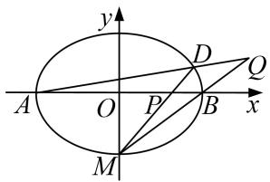

# 专题 21 数量积、角度及参数型定值问题

# 题型一 数量积型定值问题

# 【例题选讲】

[例1] 已知椭圆 $\frac{x^2}{a^2} + \frac{y^2}{b^2} = 1 (a > b > 0)$ 的离心率为 $\frac{\sqrt{2}}{2}$ ，右焦点为 $F(1, 0)$ ，直线 $l$ 经过点 $F$ ，且与椭圆交于 $A$ ， $B$ 两点， $O$ 为坐标原点.

(1)求椭圆的标准方程;

(2)当直线 l 绕点 F 转动时，试问：在 x 轴上是否存在定点 M，使得 $\overrightarrow{MA} \cdot \overrightarrow{MB}$ 为常数? 若存在，求出定点 M 的坐标；若不存在，请说明理由.

[例 2] 已知 O 为坐标原点，椭圆 C: $\frac{x^{2}}{4} + y^{2} = 1$ 上一点 E 在第一象限，若 $|OE| = \frac{\sqrt{7}}{2}$ .

text_image

y
A O P B x
M
D Q

(1)求点 E 的坐标;

(2)椭圆 C 两个顶点分别为 $A(-2,0)$ ， $B(2,0)$ ，过点 $M(0,-1)$ 的直线 l 交椭圆 C 于点 D，交 x 轴于点 P，若直线 AD 与直线 MB 相交于点 Q，求证： $\overrightarrow{OP}\cdot\overrightarrow{OQ}$ 为定值.

[例3] 椭圆有两顶点 $A(-1,0)$ ， $B(1,0)$ ，过其焦点 $F(0,1)$ 的直线 $l$ 与椭圆交于 $C$ ， $D$ 两点，并与 $x$ 轴交于点 $P$ 。直线 $AC$ 与直线 $BD$ 交于点 $Q$ 。

(1)当 $|CD|=\frac{3\sqrt{2}}{2}$ 时，求直线l的方程；

(2)当点 P 异于 A, B 两点时，求证： $\overrightarrow{OP}\cdot\overrightarrow{OQ}$ 为定值.

[例 4] 如图，点 M 在椭圆 $\frac{x^{2}}{2} + \frac{y^{2}}{b} = 1$ ， $(0 < b < \sqrt{2})$ 上，且位于第一象限， $F_{1}$ ， $F_{2}$ 为椭圆的两个焦点，过 $F_{1}$ ， $F_{2}$ ，M 的圆与 y 轴交于点 P， $Q(P$ 在 Q 的上方）， $|OP| \cdot |OQ| = 1$ .

(1)求 b 的值;

(2)直线 $PM$ 与直线 $x = 2$ 交于点 $N$ , 试问, 在 $x$ 轴上是否存在定点 $T$ , 使得 $\overrightarrow{TM} \cdot \overrightarrow{TN}$ 为定值? 若存在, 求出点 $T$ 的坐标与该定值; 若不存在, 请说明理由.

[例5] 已知椭圆 $C: \frac{x^2}{a^2} + \frac{y^2}{b^2} = 1 (a > b > 0)$ 的离心率为 $\frac{\sqrt{2}}{2}$ ，过右焦点且垂直于 $x$ 轴的直线 $l_1$ 与椭圆 $C$ 交于 $A$ ， $B$ 两点，且 $|AB| = \sqrt{2}$ ，直线 $l_1: y = k(x - m) (m \in \mathbb{R}, m > \frac{3}{4})$ 与椭圆 $C$ 交于 $M$ ， $N$ 两点.

(1)求椭圆 C 的标准方程;

(2)已知点 $R(\frac{5}{4}, 0)$ ，若 $\overrightarrow{RM} \cdot \overrightarrow{RN}$ 是一个与 $k$ 无关的常数，求实数 $m$ 的值.

# 【对点训练】

1. 已知椭圆 $E$ 的中心在原点，焦点在 $x$ 轴上，椭圆的左顶点坐标为 $(- \sqrt{2}, 0)$ ，离心率为 $e = \frac{\sqrt{2}}{2}$ .

(1)求椭圆 E 的方程;  
(2)过点(1, 0)作直线 l 交 E 于 P、Q 两点，试问：在 x 轴上是否存在一个定点 M，使 $\overrightarrow{MP} \cdot \overrightarrow{MQ}$ 为定值？若存在，求出这个定点 M 的坐标；若不存在，请说明理由.

2. 已知椭圆 $\frac{x^2}{a^2} + \frac{y^2}{b^2} = 1 (a > b > 0)$ 的一个焦点与抛物线 $y^2 = 4\sqrt{3} x$ 的焦点 $F$ 重合，且椭圆短轴的两个端点与点 $F$ 构成正三角形.

(1)求椭圆的方程;  
(2)若过点(1, 0)的直线 l 与椭圆交于不同的两点 P, Q，试问在 x 轴上是否存在定点 $E(m, 0)$ ，使 $\overrightarrow{PE} \cdot \overrightarrow{QE}$ 恒为定值？若存在，求出 E 的坐标，并求出这个定值；若不存在，请说明理由.

3. 在平面直角坐标系 $xOy$ 中，已知椭圆 $C: \frac{x^2}{a^2} + \frac{y^2}{b^2} = 1 (a > b > 0)$ 的离心率为 $\frac{\sqrt{2}}{2}$ ，且过点 $(1, \frac{\sqrt{6}}{2})$ ，过椭圆的左顶点 $A$ 作直线 $l \perp x$ 轴，点 $M$ 为直线 $l$ 上的动点，点 $B$ 为椭圆右顶点，直线 $BM$ 交椭圆 $C$ 于 $P$ .

(1)求椭圆 C 的方程;  
(2)求证： $AP \perp OM;$   
(3)试问 $\overrightarrow{OP}\cdot\overrightarrow{OM}$ 是否为定值？若是定值，请求出该定值；若不是定值，请说明理由.

4. 已知椭圆 $C: \frac{x^2}{a^2} + \frac{y^2}{b^2} = 1 (a > b > 0)$ 上的点到两个焦点的距离之和为 $\frac{2}{3}$ , 短轴长为 $\frac{1}{2}$ , 直线 $l$ 与椭圆 $C$ 交于 $M, N$ 两点.

(1)求椭圆 C 的方程;  
(2)若直线 l 与圆 O: $x^{2}+y^{2}=\frac{1}{25}$ 相切，求证： $\overrightarrow{OM}\cdot\overrightarrow{ON}$ 为定值.

5. 已知以原点 $O$ 为中心， $F(\sqrt{5}, 0)$ 为右焦点的双曲线 $F$ 的离心率 $\mathrm{e} = \frac{\sqrt{5}}{2}$ .

(1)求双曲线 C 的标准方程及其渐近线方程;  
(2)如图，已知过点 $M(x_{1},y_{1})$ 的直线 $l_{1}:x_{1}x + 4y_{1}y = 4$ 与过点 $N(x_{2},y_{2})($ 其中 $x_{2}\neq x_{1})$ 的直线 $l_{2}:x_{2}x + 4y_{2}y$ $= 4$ 的交点 $E$ 在双曲线 $C$ 上，直线 $MN$ 与两条渐近线分别交于 $G$ ， $H$ 两点，求 $\overrightarrow{OG}\cdot \overrightarrow{OH}$ 的值.

# 题型二 角度型定值问题

# 【例题选讲】

[例 1] 已知椭圆 $W: \frac{x^2}{a^2} + \frac{y^2}{b^2} = 1 (a > b > 0)$ 的上下顶点分别为 $A, B$ ，且点 $B(0, -1)$ . $F_1, F_2$ 分别为

椭圆 W 的左、右焦点，且 $\angle F_{1}BF_{2}=120^{\circ}$ .

(1)求椭圆 W 的标准方程;

(2)点 M 是椭圆上异于 A, B 的任意一点，过点 M 作 $MN \perp y$ 轴于 N, E 为线段 MN 的中点．直线 AE 与直线 y = -1 交于点 C, G 为线段 BC 的中点，O 为坐标原点．求证： $\angle OEG$ 为定值．

[例2] 已知点 $M(x_0, y_0)$ 为椭圆 $C: \frac{x^2}{2} + y^2 = 1$ 。上任意一点，直线 $l: x_0x + 2y_0y = 2$ 与圆 $(x - 1)^2 + y^2 = 6$ 交于 $A, B$ 两点，点 $F$ 为椭圆 $C$ 的左焦点。

(1)求椭圆 C 的离心率及左焦点 F 的坐标;

(2)求证：直线 l 与椭圆 C 相切；

(3)判断 $\angle AFB$ 是否为定值，并说明理由.

[例 3] 已知点 $F_{1}$ 为椭圆 $\frac{x^{2}}{a^{2}} + \frac{y^{2}}{b^{2}} = 1 (a > b > 0)$ 的左焦点， $P(-1, \frac{\sqrt{2}}{2})$ 在椭圆上， $PF_{1} \perp x$ 轴.

(1)求椭圆的方程:

(2)已知直线 l 与椭圆交于 A, B 两点, 且坐标原点 O 到直线 l 的距离为 $\frac{\sqrt{6}}{3}$ , $\angle AOB$ 的大小是否为定值? 若是, 求出该定值: 若不是, 请说明理由.

# 【对点训练】

1. 已知椭圆 $C: \frac{x^2}{a^2} + \frac{y^2}{b^2} = 1 (a > b > 0)$ 的离心率为 $\frac{1}{3}$ ，左、右焦点分别为 $F_1, F_2, A$ 为椭圆 $C$ 上一点， $AF_2 \perp F_1F_2$ ，且 $|AF_2| = \frac{8}{3}$ .

(1)求椭圆 C 的方程;

(2)设椭圆 C 的左、右顶点分别为 $A_{1}$ ， $A_{2}$ ，过 $A_{1}$ ， $A_{2}$ 分别作 x 轴的垂线 $l_{1}$ ， $l_{2}$ ，椭圆 C 的一条切线 l: y = kx + m 与 $l_{1}$ ， $l_{2}$ 分别交于 M，N 两点，求证： $\angle MF_{1}N$ 为定值.

2. 已知椭圆 $C: \frac{x^2}{a^2} + \frac{y^2}{b^2} = 1 (a > b > 0)$ 上的点到它的两个焦的距离之和为 4，以椭圆 $C$ 的短轴为直径的圆 $O$ 经过这两个焦点，点 $A, B$ 分别是椭圆 $C$ 的左、右顶点.

(1)求圆和椭圆的方程.

(2)已知 $P, Q$ 分别是椭圆 $C$ 和圆 $O$ 上的动点（ $P, Q$ 位于 $y$ 轴两侧），且直线 $PQ$ 与 $x$ 轴平行，直线 $AP, BP$ 分别与 $y$ 轴交于点 $M, N$ 。求证： $\angle MON$ 为定值。

3. 已知椭圆 $C: \frac{x^2}{a^2} + \frac{y^2}{b^2} = 1 (a > b > 0)$ 上的点到两个焦点的距离之和为 $\frac{2}{3}$ , 短轴长为 $\frac{1}{2}$ , 直线与椭圆 $C$ 交于 $M$ , $N$ 两点.

(1)求椭圆 C 的方程;

(2)若直线与圆 $O: x^{2} + y^{2} = \frac{1}{25}$ 相切，证明： $\angle MON$ 为定值.

# 题型三 参数型定值问题

# 【例题选讲】

[例 1] (2018·北京)已知抛物线 C: $y^{2}=2px$ 经过点 P(1, 2)，过点 Q(0, 1)的直线 l 与抛物线 C 有两个不同的交点 A, B，且直线 PA 交 y 轴于 M，直线 PB 交 y 轴于 N.

(1)求直线 l 的斜率的取值范围;  
(2)设 O 为原点， $\overrightarrow{QM}=\lambda\overrightarrow{QO}$ ， $\overrightarrow{QN}=\mu\overrightarrow{QO}$ ，求证： $\frac{1}{\lambda}+\frac{1}{\mu}$ 为定值.

[例 2] 已知椭圆 C 的焦点在 x 轴上，离心率等于 $\frac{2\sqrt{5}}{5}$ ，且过点 $\left(1, \frac{2\sqrt{5}}{5}\right)$ .

(1)求椭圆 C 的标准方程;  
(2)过椭圆 $C$ 的右焦点 $F$ 作直线 $l$ 交椭圆 $C$ 于 $A, B$ 两点，交 $y$ 轴于 $M$ 点，若 $\overrightarrow{MA} = \lambda_1\overrightarrow{AF}$ ， $\overrightarrow{MB} = \lambda_2\overrightarrow{BF}$ ，求证： $\lambda_1 + \lambda_2$ 为定值.

[例 3] 如图，过抛物线 C: $x^{2}=2py(p>0)$ 的焦点 F 的直线 l 与抛物线 C 相交于 A, B 两点，交准线于点 M. 当 $|AB|=12$ 时，AB 的中点到 x 轴的距离是 5.

(1)求抛物线 C 的方程:  
(2)已知 $\overrightarrow{MA} = \lambda_1\overrightarrow{AF}$ ， $\overrightarrow{MB} = \lambda_2\overrightarrow{BF}$ ，求 $\lambda_1 + \lambda_2$ 的值.

