# 专题 21 数量积、角度及参数型定值问题

# 题型一 数量积型定值问题

# 【例题选讲】

[例1] 已知椭圆 $\frac{x^2}{a^2} + \frac{y^2}{b^2} = 1 (a > b > 0)$ 的离心率为 $\frac{\sqrt{2}}{2}$ ，右焦点为 $F(1, 0)$ ，直线 $l$ 经过点 $F$ ，且与椭圆交于 $A$ ， $B$ 两点， $O$ 为坐标原点.

(1)求椭圆的标准方程;

(2)当直线 l 绕点 F 转动时，试问：在 x 轴上是否存在定点 M，使得 $\overrightarrow{MA} \cdot \overrightarrow{MB}$ 为常数? 若存在，求出定点 M 的坐标；若不存在，请说明理由.

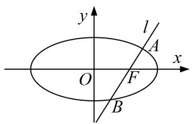

text_image

y
l
A
O
F
x
B

[规范解答] (1)由题意可知， $c=1$ ，又 $e=\frac{c}{a}=\frac{\sqrt{2}}{2}$ ，解得 $a=\sqrt{2}$ ，

所以 $b^{2}=a^{2}-c^{2}=1$ ，所以椭圆的方程为 $\frac{x^{2}}{2}+y^{2}=1$ 。

(2)若直线不 l 垂直于 x 轴，可设 l 的方程为 $y=k(x-1)$ .

联立椭圆方程 $\frac{x^{2}}{2}+y^{2}=1$ ，化为 $(1+2k^{2})x^{2}-4k^{2}x+2k^{2}-2=0$ ，

设 $A(x_{1}, y_{1})$ ， $B(x_{2}, y_{2})$ ，则 $x_{1} + x_{2} = \frac{4k^{2}}{2k^{2} + 1}$ ， $x_{1}x_{2} = \frac{2k^{2} - 2}{2k^{2} + 1}$ .

设 $M(t, 0)$ ，则 $\overrightarrow{MA} = (x_{1} - t, y_{1})$ ， $\overrightarrow{MB} = (x_{2} - t, y_{2})$

$$
\begin{array}{l} \overrightarrow {M A} \cdot \overrightarrow {M B} = (x _ {1} - t, y _ {1}) (x _ {2} - t, y _ {2}) = (x _ {1} - t) (x _ {2} - t) + y _ {1} y _ {2} = (x _ {1} - t) (x _ {2} - t) + k ^ {2} (x _ {1} - 1) (x _ {2} - 1) \\ = (1 + k ^ {2}) x _ {1} x _ {2} - (t + k ^ {2}) \left(x _ {1} + x _ {2}\right) + t ^ {2} + k ^ {2} = (1 + k ^ {2}) \frac {2 k ^ {2} - 2}{2 k ^ {2} + 1} - (t + k ^ {2}) \frac {4 k ^ {2}}{2 k ^ {2} + 1} + t ^ {2} + k ^ {2} \\ = \frac {k ^ {2} (2 t ^ {2} - 4 t + 1) + t ^ {2} - 2}{2 k ^ {2} + 1}. \\ \end{array}
$$

要使得 $\overrightarrow{MA}\cdot\overrightarrow{MB}=\lambda(\lambda$ 为常数)，只要 $\frac{k^{2}(2t^{2}-4t+1)+t^{2}-2}{2k^{2}+1}=\lambda,$

即 $(2t^{2}-4t+1-2\lambda)k^{2}+(t^{2}-2-\lambda)=0.$

对于任意实数 $k$ ，要使上式恒成立，只要 $\left\{ \begin{array}{l}2t^2 -4t + 1 - 2\lambda = 0,\\ t^2 -2 - \lambda = 0 \end{array} \right.$ ，解得 $\left\{ \begin{array}{l}t = \frac{5}{4},\\ \lambda = -\frac{7}{16}. \end{array} \right.$

若直线 l 垂直于 x 轴，其方程为 x=1，此时，直线 l 与椭圆两交点为 $A(1, \frac{\sqrt{2}}{2})$ ， $B(1, -\frac{\sqrt{2}}{2})$ ，

取点 $M(\frac{5}{4}, 0)$ ，有 $\overrightarrow{MA}=(-\frac{1}{4}, \frac{\sqrt{2}}{2})$ ， $\overrightarrow{MB}=(-\frac{1}{4}, -\frac{\sqrt{2}}{2})$ ,

$$
\overrightarrow {M A} \cdot \overrightarrow {M B} = (- \frac {1}{4}) (- \frac {1}{4}) + \frac {\sqrt {2}}{2} (- \frac {\sqrt {2}}{2}) = - \frac {7}{1 6} = \lambda .
$$

综上所述，过定点 $F(1,0)$ 的动直线 $l$ 与椭圆相交于 $A,B$ 两点，当直线 $l$ 绕点 $F$ 转动时，存在定点 $M(\frac{5}{4},0)$ ，使得 $\overrightarrow{MA}\cdot \overrightarrow{MB} = -\frac{7}{16}$ .

[例 2] 已知 O 为坐标原点，椭圆 C: $\frac{x^{2}}{4} + y^{2} = 1$ 上一点 E 在第一象限，若 $|OE| = \frac{\sqrt{7}}{2}$ .

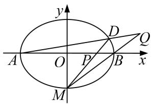

text_image

y
A O P B x
M
D Q

(1)求点 E 的坐标;

(2)椭圆 C 两个顶点分别为 $A(-2,0)$ ， $B(2,0)$ ，过点 $M(0,-1)$ 的直线 l 交椭圆 C 于点 D，交 x 轴于点 P，若直线 AD 与直线 MB 相交于点 Q，求证： $\overrightarrow{OP}\cdot\overrightarrow{OQ}$ 为定值.

[规范解答] (1) 设 $E(x_{0}, y_{0})(x_{0}>0, y_{0}>0)$ ，因为 $|OE|=\frac{\sqrt{7}}{2}$ ，所以 $\sqrt{x_{0}^{2}+y_{0}^{2}}=\frac{\sqrt{7}}{2}$ ①，

又因为点 E 在椭圆上，所以 $\frac{x_{0}^{2}}{4} + y_{0}^{2} = 1$ ②，

由①②解得： $\left\{\begin{aligned}x_{0}&=1,\\ y_{0}&=\frac{\sqrt{3}}{2},\end{aligned}\right.$ ，所以E的坐标为 $(1,\frac{\sqrt{3}}{2})$ ;

(2)设点 $D(x_{1}, y_{1})$ ，则直线 DA 的方程为 $y=\frac{y_{1}}{x_{1}+2}(x+2)$ ③，直线 BM 的方程为 $y=\frac{1}{2}x-1$ ④，

由③④解得 $x_{Q}=\frac{2(x_{1}+2y_{1}+2)}{x_{1}-2y_{1}+2}$ ，又直线 DM 的方程为 $y=\frac{y_{1}+1}{x_{1}}x-1$ ，

令 y=0，解得 $x_{P}=\frac{x_{1}}{y_{1}+2}$ ，所以 $\overrightarrow{OP}\cdot\overrightarrow{OQ}=\frac{2(x_{1}+2y_{1}+2)}{x_{1}-2y_{1}+2}\cdot\frac{x_{1}}{y_{1}+2}=\frac{2(x_{1}^{2}+2x_{1}y_{1}+2x_{1})}{x_{1}y_{1}+x_{1}-2y_{1}^{2}+2}$

又 $\frac{x_1^2}{4} + y_1^2 = 1$ ，所以 $\overrightarrow{OP} \cdot \overrightarrow{OQ} = \frac{2(x_1^2 + 2x_1y_1 + 2x_1)}{x_1y_1 + x_1 + \frac{x_1^2}{2}} = 4.$

[例3] 椭圆有两顶点 $A(-1,0)$ ， $B(1,0)$ ，过其焦点 $F(0,1)$ 的直线 $l$ 与椭圆交于 $C$ ， $D$ 两点，并与 $x$ 轴交于点 $P$ 。直线 $AC$ 与直线 $BD$ 交于点 $Q$ 。

(1)当 $|CD|=\frac{3\sqrt{2}}{2}$ 时，求直线l的方程；

(2)当点 P 异于 A, B 两点时，求证： $\overrightarrow{OP}\cdot\overrightarrow{OQ}$ 为定值.

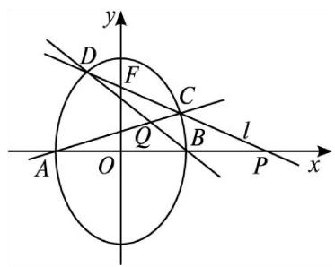

text_image

y
D
F
C
l
A
O
Q
B
P
x

[规范解答] (1)因椭圆焦点在 y 轴上，设椭圆的标准方程为 $\frac{x^{2}}{a^{2}} + \frac{y^{2}}{b^{2}} = 1 (a > b > 0)$ ,

由已知得 b=1, c=1，所以 $a=\sqrt{2}$ ，椭圆方程为为 $\frac{y^{2}}{2}+x^{2}=1$ .

直线 l 垂直于 x 轴时与题意不符.

设直线 l 的方程为 $y=kx+1$ ，将其代入椭圆方程化简得， $(k^{2}+2)x^{2}+2kx-1=0$ .

设 $C(x_{1}, y_{1})$ , $D(x_{2}, y_{2})$ ，则 $\therefore x_{1} + x_{2} = -\frac{2k}{k^{2} + 2}$ , $x_{1}x_{2} = -\frac{1}{k^{2} + 2}$ ,

$|CD|=\sqrt{1+k^{2}}\cdot|x_{1}-x_{2}|=\sqrt{1+k^{2}}\cdot\sqrt{\left(\frac{-2k}{2+k^{2}}\right)^{2}-4\cdot\frac{-1}{2+k^{2}}}=\frac{2\sqrt{2}(1+k^{2})}{2+k^{2}}=\frac{3\sqrt{2}}{2}$ ，解得 $k=\pm\sqrt{2}$ .

所以直线 l 的方程为 $y=\sqrt{2}x+1$ 或 $y=-\sqrt{2}x+1$ .

(2)直线 l 与 x 轴垂直时与题意不符.

设直线 l 的方程为 $y=kx+1$ ( $k\neq0$ 且 $k\neq\pm1$ )，所以 P 点坐标为 $(- \frac{1}{k}, 0)$ .

设 $C(x_{1}, y_{1})$ , $D(x_{2}, y_{2})$ ，由(1)知 $x_{1} + x_{2} = -\frac{2k}{k^{2} + 2}$ , $x_{1}x_{2} = -\frac{1}{k^{2} + 2}$ ,

直线 AC 的方程为 $y=\frac{y_{1}}{x_{1}+1}(x+1)$ ，直线 BD 的方程为 $y=\frac{y_{2}}{x_{2}+1}(x-1)$ ,

将两直线方程联立，消去 y 得 $\frac{x+1}{x-1} = \frac{y_{2}(x_{1}+1)}{y_{1}(x_{2}-1)}$ ，因为 $-1 < x_{1}, x_{2} < 1$ ，所以 $\frac{x+1}{x-1}$ 与 $\frac{y_{2}}{y_{1}}$ 异号.

$$
(\frac {x + 1}{x - 1}) ^ {2} = \frac {y _ {2} ^ {2} (x _ {1} + 1) ^ {2}}{y _ {1} ^ {2} (x _ {2} - 1) ^ {2}} = \frac {2 - x _ {2} ^ {2}}{2 - x _ {1} ^ {2}}. \frac {(x _ {1} + 1) ^ {2}}{(x _ {2} - 1) ^ {2}} = \frac {(1 + x _ {1}) (1 + x _ {2})}{(1 - x _ {1}) (1 - x _ {2})} = \frac {1 + \frac {- 2 k}{k ^ {2} + 2} + \frac {- 1}{k ^ {2} + 2}}{1 - \frac {- 2 k}{k ^ {2} + 2} + \frac {- 1}{k ^ {2} + 2}} = (\frac {k - 1}{k + 1}) ^ {2}.
$$

又 $y_{1}y_{2} = k^{2}x_{1}x_{2} + k(x_{1} + x_{2}) + 1 = \frac{2(1 - k)(1 + k)}{k^{2} + 2} = -\frac{2(1 + k)^{2}}{k^{2} + 2}\cdot \frac{k - 1}{k + 1}$

∴ $\frac{k-1}{k+1}$ 与 $y_{1}y_{2}$ 异号， $\frac{x+1}{x-1}$ 与 $\frac{k-1}{k+1}$ 同号， $\frac{x+1}{x-1}=\frac{k-1}{k+1}$ ，解得x=-k，

因此 Q 点坐标为 $(-k, y_{0})$ . $\overrightarrow{OP} \cdot \overrightarrow{OQ} = (-\frac{1}{k}, 0)(-k, y_{0}) = 1$ ，故 $\overrightarrow{OP} \cdot \overrightarrow{OQ}$ 为定值.

[例 4] 如图，点 M 在椭圆 $\frac{x^{2}}{2} + \frac{y^{2}}{b} = 1$ ， $(0 < b < \sqrt{2})$ 上，且位于第一象限， $F_{1}$ ， $F_{2}$ 为椭圆的两个焦点，过 $F_{1}$ ， $F_{2}$ ，M 的圆与 y 轴交于点 P， $Q(P$ 在 Q 的上方）， $|OP| \cdot |OQ| = 1$ .

(1)求 b 的值;

(2)直线 $PM$ 与直线 $x = 2$ 交于点 $N$ ，试问，在 $x$ 轴上是否存在定点 $T$ ，使得 $\overrightarrow{TM} \cdot \overrightarrow{TN}$ 为定值？若存在，求

出点 T 的坐标与该定值；若不存在，请说明理由.

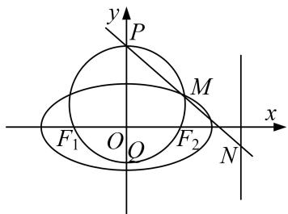

text_image

y
P
M
x
F₁ O O F₂ N

[规范解答] (1)设圆心(0, t). 则圆的方程为: $x^{2}+(y-t)^{2}=c^{2}+t^{2}$ .

令 x=0，得： $y^{2}-2ty-c^{2}=0(*)$ ，∴ $|OP|\cdot|OQ|=|y_{P}\cdot y_{Q}|=c^{2}=1$ ．∴ $b=a^{2}-c^{2}=1$ ．

(2)设 $M(x_{0}, y_{0})$ ， $x_{0}>0$ ， $y_{0}>0$ 将 $M(x_{0}, y_{0})$ 代入圆与椭圆的方程，可得.

$x_{0}^{2}+y_{0}^{2}-2ty_{0}-1=0,\quad x_{0}^{2}+2y_{0}^{2}=2$ ，消去 $x_{0}$ ，得 $t=\frac{1-y_{0}^{2}}{2y_{0}}$ ，代入(\*)得： $y^{2}-\frac{1-y_{0}^{2}}{y_{0}}y-1=0$

即 $y^{2}-\left(\frac{1}{y_{0}}-y_{0}\right)y-1=0$ ，所以 $(y-\frac{1}{y_{0}})(y+y_{0})=0$ ，

过 $F_{1}$ ， $F_{2}$ ，M 的圆与 y 轴交于点 P， $Q(P \text{ 在 } Q \text{ 的上方})$ 。所以 $y_{P}=\frac{1}{y_{0}}$ ， $y_{Q}=-y_{0}$ 。

则 $k_{PM}=\frac{y_{0}-\frac{1}{y_{0}}}{x_{0}}$ . 则直线 PM 的方程为 $y=\frac{y_{0}-\frac{1}{y_{0}}x}{x_{0}}+\frac{1}{y_{0}}$ ,

由直线 PM 与 x=2 的交点为 N．所以在直线 PM 的方程中，令 x=2，

得， $y=\frac{y_{0}-\frac{1}{y_{0}}}{x_{0}}\times2+\frac{1}{y_{0}}=\frac{2(y_{0}^{2}-1)}{x_{0}y_{0}}+\frac{1}{y_{0}}=\frac{1-x_{0}}{y_{0}}$ ．得 $N(2,\frac{1-x_{0}}{y_{0}})$

设 $T(d, 0)$ ， $\overrightarrow{TM} \cdot \overrightarrow{TN} = (x_{0} - d, y_{0}) \cdot (2 - d, \frac{1 - x_{0}}{y_{0}}) = (x_{0} - d)(2 - d) + 1 - x_{0} = (1 - d)x_{0} - d(2 - d) + 1.$

要使得 $\overrightarrow{TM}\cdot\overrightarrow{TN}$ 为定值，即与M的坐标无关.

当 d=1 时， $\overrightarrow{TM}\cdot\overrightarrow{TN}=0$ 为定值．存在定点 T(1,0)，使得 $\overrightarrow{TM}\cdot\overrightarrow{TN}$ 为定值 0.

[例 5] 已知椭圆 C: $\frac{x^{2}}{a^{2}}+\frac{y^{2}}{b^{2}}=1(a>b>0)$ 的离心率为 $\frac{\sqrt{2}}{2}$ ，过右焦点且垂直于 x 轴的直线 $l_{1}$ 与椭圆 C 交于 A，B 两点，且 $|AB|=\sqrt{2}$ ，直线 $l_{1}: y=k(x-m)(m\in\mathbf{R}, m>\frac{3}{4})$ 与椭圆 C 交于 M，N 两点.

(1)求椭圆 C 的标准方程;  
(2)已知点 $R(\frac{5}{4}, 0)$ ，若 $\overrightarrow{RM} \cdot \overrightarrow{RN}$ 是一个与 $k$ 无关的常数，求实数 $m$ 的值.

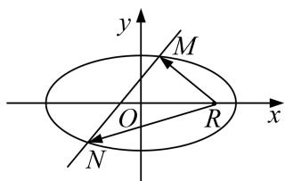

text_image

y
M
O
R
x
N

[规范解答] (1)联立 $\left\{\begin{aligned}\frac{x^{2}}{a^{2}}+\frac{y^{2}}{b^{2}}=1,\\ x=c,\end{aligned}\right.$ 解得 $y=\pm\frac{b^{2}}{a}$ ，故 $\frac{2b^{2}}{a}=\sqrt{2}$ ， $e=\frac{c}{a}=\frac{\sqrt{2}}{2}$ ， $a^{2}=b^{2}+c^{2}$

联立可得 $a=\sqrt{2}$ ，b=c=1，故椭圆 C 的标准方程为 $\frac{x^{2}}{2}+y^{2}=1$ .

(2)设 $M(x_{1}, y_{1})$ ， $N(x_{2}, y_{2})$ ，联立方程 $\left\{\begin{aligned}\frac{x^{2}}{2}+y^{2}&=1,\\ y&=k(x-m),\end{aligned}\right.$ 消元得 $(1+2k^{2})x^{2}-4mk^{2}x+2m^{2}k^{2}-2=0$

$$
\Delta = 1 6 m ^ {2} k ^ {4} - 4 (1 + 2 k ^ {2}) \left(2 k ^ {2} m ^ {2} - 2\right) = 8 \left(2 k ^ {2} - k ^ {2} m ^ {2} + 1\right), \quad \therefore x _ {1} + x _ {2} = \frac {4 m k ^ {2}}{2 k ^ {2} + 1}, \quad x _ {1} x _ {2} = \frac {2 m ^ {2} k ^ {2} - 2}{2 k ^ {2} + 1}.
$$

$$
\overrightarrow {R M} \cdot \overrightarrow {R N} = (x _ {1} - \frac {5}{4}) (x _ {2} - \frac {5}{4}) + y _ {1} y _ {2} = x _ {1} x _ {2} - \frac {5}{4} (x _ {1} + x _ {2}) + \frac {2 5}{1 6} + k ^ {2} (x _ {1} - m) (x _ {2} - m)
$$

$$
= (1 + k ^ {2}) x _ {1} x _ {2} - \left(\frac {5}{4} + m k ^ {2}\right) \left(x _ {1} + x _ {2}\right) + \frac {2 5}{1 6} + k ^ {2} m ^ {2} = \frac {(3 m ^ {2} - 5 m - 2) k ^ {2} - 2}{2 k ^ {2} + 1} + \frac {2 5}{1 6},
$$

(这里的计算使用点乘双根法更便捷)

令 $(1+2k^{2})x^{2}-4mk^{2}x+2k^{2}m^{2}-2=(1+2k^{2})(x_{1}-x)(x_{2}-x)$ ,

再令 $x=\frac{5}{4}$ ，得 $(x_{1}-\frac{5}{4})(x_{2}-\frac{5}{4})=\frac{\frac{25}{16}(1+2k^{2})-5mk^{2}+3k^{2}m^{2}-2}{2k^{2}+1}$ ,

$\because y_{1}y_{2}=k^{2}(x_{1}-m)(x_{2}-m),\quad\therefore$ 再令 x=m，得 $k^{2}(x_{1}-m)(x_{2}-m)=\frac{m^{2}k^{2}-2k^{2}}{2k^{2}+1},$

$$
\therefore \left(x _ {1} - \frac {5}{4}\right) \left(x _ {2} - \frac {5}{4}\right) + y _ {1} y _ {2} = \frac {(3 m ^ {2} - 5 m - 2) k ^ {2} - 2}{2 k ^ {2} + 1} + \frac {2 5}{1 6}
$$

(选择自己熟练的计算方法进行计算，务必保证计算不能出错)

又 $\overrightarrow{RM}\cdot\overrightarrow{RN}$ 是一个与k无关的常数，∴ $3m^{2}-5m-2=-4$ ，即 $3m^{2}-5m+2=0$ ，

∴m=1 或 $m=\frac{2}{3}$ ，又∵ $m>\frac{3}{4}$ ，∴m=1，

当 m=1 时， $\Delta>0$ ，直线 $l_{1}$ 与椭圆 C 交于两点，满足题意， $\therefore m=1$ .

[题后悟通] 本题的关键点就在于如何使 $\frac{(3m^{2}-5m-2)k^{2}-2}{2k^{2}+1}$ 成为一个与k无关的常数，在这里应用了比例的性质，即令分子分母中的同类项成比例，可以观察到分子分母的常数项的比例为-2，则令分子分母中 $k^{2}$ 的系数的比例也为-2，即令 $3m^{2}-5m-2=-4$ ，则可求出参数的值.

# 【对点训练】

1. 已知椭圆 E 的中心在原点，焦点在 x 轴上，椭圆的左顶点坐标为 $(- \sqrt{2}, 0)$ ，离心率为 $e = \frac{\sqrt{2}}{2}$ .

(1)求椭圆 E 的方程;

(2)过点(1, 0)作直线 l 交 E 于 P、Q 两点，试问：在 x 轴上是否存在一个定点 M，使 $\overrightarrow{MP} \cdot \overrightarrow{MQ}$ 为定值？若存在，求出这个定点 M 的坐标；若不存在，请说明理由.

text_image

y
l
P
x
O
Q

1. (1)设椭圆 E 的方程为 $\frac{x^{2}}{a^{2}} + \frac{y^{2}}{b^{2}} = 1 (a > b > 0)$ ,

由已知得 $\left\{ \begin{array}{l}a - c = \sqrt{2} -1,\\ \frac{c}{a} = \frac{\sqrt{2}}{2}, \end{array} \right.$ 解得， $\left\{ \begin{array}{l}a = \sqrt{2},\\ c = 1, \end{array} \right.$ 所以 $b^{2} = 1$

所以椭圆 E 的方程为 $\frac{x^{2}}{2} + y^{2} = 1$ .

(2)假设存在符合条件的点 $M(m, 0)$ ，设 $A(x_{1}, y_{1})$ ， $B(x_{2}, y_{2})$ ，

则 $\overrightarrow{MP}=(x_{1}-m,\ y_{1}),\ \overrightarrow{MQ}=(x_{2}-m,\ y_{2})$ ,

$$
\overrightarrow {M P} \cdot \overrightarrow {M Q} = (x _ {1} - m) (x _ {2} - m) + y _ {1} y _ {2} = x _ {1} x _ {2} - m (x _ {1} + x _ {2}) + m ^ {2} + y _ {1} y _ {2},
$$

①当直线 l 的斜率存在时，设直线 l 的方程为 $y=k(x-1)$ ,

联立椭圆方程 $\frac{x^{2}}{2}+y^{2}=1$ ，化为 $(1+2k^{2})x^{2}-4k^{2}x+2k^{2}-2=0$ ，

则 $x_{1} + x_{2} = \frac{4k^{2}}{2k^{2} + 1}, x_{1}x_{2} = \frac{2k^{2} - 2}{2k^{2} + 1}. \therefore y_{1}y_{2} = k^{2}[-(x_{1} + x_{2}) + x_{1}x_{2} + 1] = -\frac{k^{2}}{2k^{2} + 1},$

$$
\overrightarrow {M P} \cdot \overrightarrow {M Q} = \frac {k ^ {2} (2 m ^ {2} - 4 m + 1) + m ^ {2} - 2}{2 k ^ {2} + 1}.
$$

对于任意的 k 值，上式为定值，故 $2m^{2}-4m+1=2(m^{2}-2)$ ，解得， $m=\frac{5}{4}$

此时， $\overrightarrow{MP}\cdot\overrightarrow{MQ}=m^{2}-2=-\frac{7}{16}$ 为定值；

②当直线 l 的斜率不存在时，

直线 l: x=1, $x_{1}x_{2}=1$ , $x_{1}+x_{2}=2$ , $y_{1}y_{2}=-\frac{1}{2}$ ,

由， $m=\frac{5}{4}$ ，得 $\overrightarrow{MP}\cdot\overrightarrow{MQ}=1-2\times\frac{5}{4}+\frac{25}{16}-\frac{1}{2}=-\frac{7}{16}$ 为定值，

综合①②知，符合条件的点 M 存在，其坐标为 $\left(\frac{5}{4}, 0\right)$ .

2. 已知椭圆 $\frac{x^2}{a^2} + \frac{y^2}{b^2} = 1 (a > b > 0)$ 的一个焦点与抛物线 $y^2 = 4\sqrt{3} x$ 的焦点 $F$ 重合，且椭圆短轴的两个端点与点 $F$ 构成正三角形.

(1)求椭圆的方程;

(2)若过点(1, 0)的直线 l 与椭圆交于不同的两点 P, Q，试问在 x 轴上是否存在定点 $E(m, 0)$ ，使 $\overrightarrow{PE} \cdot \overrightarrow{QE}$ 恒为定值？若存在，求出 E 的坐标，并求出这个定值；若不存在，请说明理由.

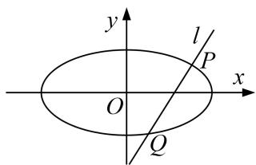

text_image

y
l
P
x
O
Q

2. 解析 (1)由题意, 知抛物线的焦点为 $F(\sqrt{3}, 0)$ , 所以 $c = \sqrt{a^2 - b^2} = \sqrt{3}$ .

因为椭圆短轴的两个端点与 F 构成正三角形，所以 $b=\sqrt{3}\times\frac{\sqrt{3}}{3}=1$ .

可求得 a=2，故椭圆的方程为 $\frac{x^{2}}{4}+y^{2}=1$ .

(2)假设存在满足条件的点 E，当直线 l 的斜率存在时设其斜率为 k，则 l 的方程为 $y=k(x-1)$ .

由 $\left\{\begin{aligned}\frac{x^{2}}{4}+y^{2}=1,\\ y=k(x-1),\end{aligned}\right.$ 得 $(4k^{2}+1)x^{2}-8k^{2}x+4k^{2}-4=0$ 。设 $P(x_{1},y_{1}),Q(x_{2},y_{2})$

所以 $x_{1}+x_{2}=\frac{8k^{2}}{4k^{2}+1}$ ， $x_{1}x_{2}=\frac{4k^{2}-4}{4k^{2}+1}$ 。则 $\overrightarrow{PE}=(m-x_{1},-y_{1})$ ， $\overrightarrow{QE}=(m-x_{2},-y_{2})$

所以 $\overrightarrow{PE}\cdot\overrightarrow{QE}=(m-x_{1})(m-x_{2})+y_{1}y_{2}=m^{2}-m(x_{1}+x_{2})+x_{1}x_{2}+y_{1}y_{2}$

$$
= m ^ {2} - m \left(x _ {1} + x _ {2}\right) + x _ {1} x _ {2} + k ^ {2} \left(x _ {1} - 1\right) \left(x _ {2} - 1\right)
$$

$$
= m ^ {2} - \frac {8 k ^ {2} m}{4 k ^ {2} + 1} + \frac {4 k ^ {2} - 4}{4 k ^ {2} + 1} + k ^ {2} \left(\frac {4 k ^ {2} - 4}{4 k ^ {2} + 1} - \frac {8 k ^ {2}}{4 k ^ {2} + 1} + 1\right) = \frac {(4 m ^ {2} - 8 m + 1) k ^ {2} + (m ^ {2} - 4)}{4 k ^ {2} + 1}
$$

$$
= \frac {(4 m ^ {2} - 8 m + 1) (k ^ {2} + \frac {1}{4}) + (m ^ {2} - 4) - \frac {1}{4} (4 m ^ {2} - 8 m + 1)}{4 k ^ {2} + 1} = \frac {1}{4} (4 m ^ {2} - 8 m + 1) + \frac {2 m - \frac {1 7}{4}}{4 k ^ {2} + 1}.
$$

要使 $\overrightarrow{PE}\cdot\overrightarrow{QE}$ 为定值，则 $2m-\frac{17}{4}=0$ ，即 $m=\frac{17}{8}$ ，此时 $\overrightarrow{PE}\cdot\overrightarrow{QE}=\frac{33}{64}$ .

当直线 l 的斜率不存在时，不妨取 $P(1, \frac{\sqrt{3}}{2})$ ， $Q(1, -\frac{\sqrt{3}}{2})$ ，

由 $E(\frac{17}{8}, 0)$ ，可得 $\overrightarrow{PE} = (\frac{9}{8}, -\frac{\sqrt{3}}{2})$ ， $\overrightarrow{QE} = (\frac{9}{8}, \frac{\sqrt{3}}{2})$ ，所以 $\overrightarrow{PE} \cdot \overrightarrow{QE} = \frac{81}{64} - \frac{3}{4} = \frac{33}{64}$ .

综上，存在点 $E(\frac{17}{8}, 0)$ ，使 $\overrightarrow{PE} \cdot \overrightarrow{QE}$ 为定值 $\frac{33}{64}$ .

3. 在平面直角坐标系 $xOy$ 中，已知椭圆 $C: \frac{x^2}{a^2} + \frac{y^2}{b^2} = 1 (a > b > 0)$ 的离心率为 $\frac{\sqrt{2}}{2}$ ，且过点 $(1, \frac{\sqrt{6}}{2})$ ，过椭圆的左顶点 $A$ 作直线 $l \perp x$ 轴，点 $M$ 为直线 $l$ 上的动点，点 $B$ 为椭圆右顶点，直线 $BM$ 交椭圆 $C$ 于 $P$ .

(1)求椭圆 C 的方程;  
(2)求证： $AP\bot OM$   
(3)试问 $\overrightarrow{OP}\cdot\overrightarrow{OM}$ 是否为定值？若是定值，请求出该定值；若不是定值，请说明理由.

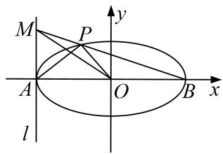

text_image

M
P
A
O
B
x
y
l

3. 解析 (1) $\because$ 椭圆 C: $\frac{x^2}{a^2} + \frac{y^2}{b^2} = 1 (a > b > 0)$ 的离心率为 $\frac{\sqrt{2}}{2}$ ,

$\therefore a^{2} = 2c^{2}$ ，则 $a^2 = 2b^2$ ，又椭圆 $C$ 过点 $(1, \frac{\sqrt{6}}{2})$ ， $\therefore \frac{1}{a^2} + \frac{3}{2b^2} = 1$ ： $\therefore a^2 = 4$ ， $b^2 = 2$

则椭圆 C 的方程 $\frac{x^{2}}{4} + \frac{y^{2}}{2} = 1$ .

(2)设直线 BM 的斜率为 k，则直线 BM 的方程为 $y=k(x-2)$ ，设 $P(x_{1}, y_{1})$ ,

将 $y=k(x-2)$ 代入椭圆 C 的方程 $\frac{x^{2}}{4}+\frac{y^{2}}{2}=1$ 中并化简得： $(2k^{2}+1)x^{2}-4k^{2}x+8k^{2}-4=0$ .

解之得 $x_{1}=\frac{4k^{2}-2}{2k^{2}+1}$ ， $x_{2}=2$ ，

$\therefore y_{1}=k(x_{1}-2)=\frac{-4k}{2k^{2}+1}$ ，从而 $P(\frac{4k^{2}-2}{2k^{2}+1},\frac{-4k}{2k^{2}+1})$ .

在 $y=k(x-2)$ 上，令 x=-2，得 y=-4k，∴ $M(-2, -4k)$ .

又 $\overrightarrow{AP} = (\frac{4k^2 - 2}{2k^2 + 1} + 2, \frac{-4k}{2k^2 + 1}) = (\frac{8k^2}{2k^2 + 1}, \frac{-4k}{2k^2 + 1}),$

$\therefore\overrightarrow{AP}\cdot\overrightarrow{OM}=\frac{-16k^{2}}{2k^{2}+1}+\frac{16k^{2}}{2k^{2}+1}=0,\quad\therefore AP\perp OM;$

(3) $\overrightarrow{OP}\cdot\overrightarrow{OM}=(\frac{4k^{2}-2}{2k^{2}+1},\frac{-4k}{2k^{2}+1})\cdot(-2,-4k)=\frac{-8k^{2}+4+16k^{2}}{2k^{2}+1}=\frac{8k^{2}+4}{2k^{2}+1}=4.$

$\therefore\overrightarrow{OP}\cdot\overrightarrow{OM}$ 为定值4.

4. 已知椭圆 $C: \frac{x^2}{a^2} + \frac{y^2}{b^2} = 1 (a > b > 0)$ 上的点到两个焦点的距离之和为 $\frac{2}{3}$ , 短轴长为 $\frac{1}{2}$ , 直线 $l$ 与椭圆 $C$ 交于 $M, N$ 两点.

(1)求椭圆 C 的方程;

(2)若直线 l 与圆 O: $x^{2}+y^{2}=\frac{1}{25}$ 相切，求证： $\overrightarrow{OM}\cdot\overrightarrow{ON}$ 为定值.

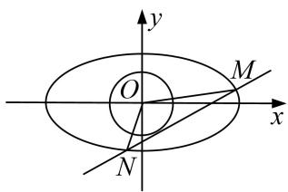

text_image

y
O
M
x
N

4. 解析 (1)由题意得, $2a = \frac{2}{3}$ , $2b = \frac{1}{2}$ , 所以 $a = \frac{1}{3}$ , $b = \frac{1}{4}$ , 所以椭圆 $C$ 的方程为 $9x^{2} + 16y^{2} = 1$ .

(2)①当直线 $l \perp x$ 轴时，因为直线 l 与圆 O 相切，所以直线 l 的方程为 $x = \pm \frac{1}{5}$ .

当直线 l: $x=\frac{1}{5}$ 时，得 M, N 两点的坐标分别为 $(\frac{1}{5},\frac{1}{5})$ , $(\frac{1}{5},-\frac{1}{5})$ ，所以 $\overrightarrow{OM}\cdot\overrightarrow{ON}=0$ ;

当直线 l: $x = -\frac{1}{5}$ 时，同理可得 $\overrightarrow{OM} \cdot \overrightarrow{ON} = 0$ .

②当直线 l 与 x 轴不垂直时，设 $l: y=kx+m,\ M(x_{1}, y_{1}), N(x_{2}, y_{2})$ ,

所以圆心 $O(0, 0)$ 到直线 l 的距离为 $d=\frac{|m|}{\sqrt{1+k^{2}}}=\frac{1}{5}$ ，所以 $25m^{2}=1+k^{2}$ ，

由 $\left\{\begin{aligned}y&=kx+m,\\ 9x^{2}&+16y^{2}=1,\end{aligned}\right.$ 得 $(9+16k^{2})x^{2}+32kmx+16m^{2}-1=0,$

则 $\Delta=(32km)^{2}-4(9+16k^{2})(16m^{2}-1)>0,\quad x_{1}+x_{2}=-\frac{32km}{9+16k^{2}},\quad x_{1}x_{2}=\frac{16m^{2}-1}{9+16k^{2}}$

所以 $\overrightarrow{OM}\cdot\overrightarrow{ON}=x_{1}x_{2}+y_{1}y_{2}=(1+k^{2})x_{1}x_{2}+km(x_{1}+x_{2})+m^{2}=\frac{25m^{2}-k^{2}-1}{9+16k^{2}}=0.$

综上， $\overrightarrow{OM}\cdot\overrightarrow{ON}=0$ (定值).

5. 已知以原点 O 为中心， $F(\sqrt{5}, 0)$ 为右焦点的双曲线 F 的离心率 $e=\frac{\sqrt{5}}{2}$ .

(1)求双曲线 C 的标准方程及其渐近线方程;

(2)如图，已知过点 $M(x_{1},y_{1})$ 的直线 $l_{1}:x_{1}x + 4y_{1}y = 4$ 与过点 $N(x_{2},y_{2})($ 其中 $x_{2}\neq x_{1})$ 的直线 $l_{2}:x_{2}x + 4y_{2}y$ $= 4$ 的交点 $E$ 在双曲线 $C$ 上，直线 $MN$ 与两条渐近线分别交于 $G$ ， $H$ 两点，求 $\overrightarrow{OG}\cdot \overrightarrow{OH}$ 的值.

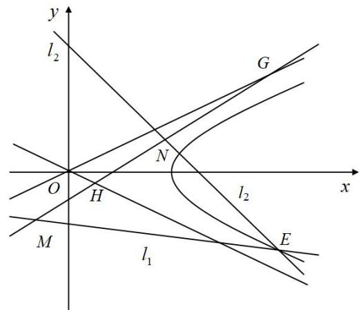

text_image

y
l₂
G
N
O
H
x
l₂
M
l₁
E

5. 解析 (1) 设 C 的标准方程是 $\frac{x^{2}}{a^{2}} - \frac{y^{2}}{b^{2}} = 1 (a > 0, b > 0)$ ，则由题意 $c = \sqrt{5}$ ， $e = \frac{c}{a} = \frac{\sqrt{5}}{2}$ .

因此，C 的标准方程为 $\frac{x^{2}}{4}-y^{2}=1$ 。C 的渐近线方程为 $y=\pm\frac{1}{2}x$ ，即 x-2y=0 和 $x+2y=0$ 。

(2)如图，由题意点 $E(x_{0}, y_{0})$ 在直线 $l_{1}$ : $x_{1}x + 4y_{1}y = 4$ 和 $l_{2}$ : $x_{2}x + 4y_{2}y = 4$ 上，

因此有 $x_{1}x_{0}+4y_{1}y_{0}=4,\quad x_{2}x_{0}+4y_{2}y_{0}=4$ 。故点 M、N 均在直线 $x_{0}x+4y_{0}y=4$ 上，

因此直线 MN 的方程为 $x_{0}x + 4y_{0}y = 4$ .

设 G、H 分别是直线 MN 与渐近线 x-2y=0 及 $x+2y=0$ 的交点，

由方程组 $\left\{\begin{aligned}x_{0}x+4y_{0}y=4\\ x-2y=0\end{aligned}\right.$ 及 $\left\{\begin{aligned}x_{0}x+4y_{0}y=4\\ x+2y=0\end{aligned}\right.$ ，解得 $\left\{\begin{aligned}x_{G}&=\frac{4}{x_{0}+2y_{0}}\\ y_{G}&=\frac{2}{x_{0}+2y_{0}}\end{aligned}\right.$ ， $\left\{\begin{aligned}x_{H}&=\frac{4}{x_{0}-2y_{0}}\\ y_{H}&=\frac{-2}{x_{0}-2y_{0}}\end{aligned}\right.$

故 $\overrightarrow{OG} \cdot \overrightarrow{OH} = \frac{4}{x_0 + 2y_0} \cdot \frac{4}{x_0 - 2y_0} - \frac{2}{x_0 + 2y_0} \cdot \frac{2}{x_0 - 2y_0} = \frac{12}{x_0^2 - 4y_0^2}$ .

因为点 E 在双曲线 $\frac{x^{2}}{4}-y^{2}=1$ 上，所以 $x_{0}^{2}-4y_{0}^{2}=4$ ，所以 $\overrightarrow{OG}\cdot\overrightarrow{OH}=\frac{12}{x_{0}^{2}-4y_{0}^{2}}=3$ .

# 题型二 角度型定值问题

# 【例题选讲】

[例1] 已知椭圆 $W: \frac{x^2}{a^2} + \frac{y^2}{b^2} = 1 (a > b > 0)$ 的上下顶点分别为 $A, B$ ，且点 $B(0, -1)$ . $F_1, F_2$ 分别为椭圆 $W$ 的左、右焦点，且 $\angle F_1BF_2 = 120^\circ$ .

(1)求椭圆 W 的标准方程;

(2)点 $M$ 是椭圆上异于 $A, B$ 的任意一点，过点 $M$ 作 $MN \perp y$ 轴于 $N, E$ 为线段 $MN$ 的中点．直线 $AE$ 与直线 $y = -1$ 交于点 $C, G$ 为线段 $BC$ 的中点， $O$ 为坐标原点．求证： $\angle OEG$ 为定值.

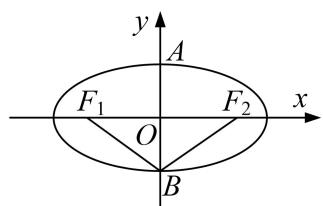

text_image

y
A
F₁ O F₂ x
B

(1) 图

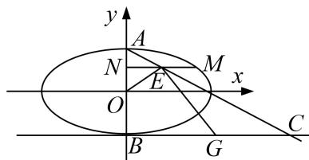

text_image

y
A
N
E
M
x
O
B
G
C

(2) 图

[规范解答] (1)依题意，得 b=1 。又 $\angle F_{1}BF_{2}=120^{\circ}$ ，在 Rt△BF\_{1}O 中， $\angle F_{1}BO=60^{\circ}$ ，所以 a=2。所以椭圆 W 的标准方程为 $\frac{x^{2}}{4} + y^{2} = 1$ .

(2)设 $M(x_{0}, y_{0})$ ， $x_{0} \neq 0$ ，则 $N(0, y_{0})$ ， $E(\frac{x_{0}}{2}, y_{0})$ .

因为点 M 在椭圆 W 上，所以 $\frac{x_{0}^{2}}{4} + y_{0}^{2} = 1$ 。即 $x_{0}^{2} = 4 - 4y_{0}^{2}$

又 $A(0, 1)$ ，所以直线 $AE$ 的方程为 $y - 1 = \frac{2(y_0 - 1)}{x_0} x$ 。令 $y = -1$ ，得 $C(\frac{x_0}{1 - y_0}, -1)$ 。

又 $B(0, -1)$ , $G$ 为线段 $BC$ 的中点, 所以 $G(\frac{x_0}{2(1 - y_0)}, -1)$ .

所以 $\overrightarrow{OE}=(\frac{x_{0}}{2},y_{0}),\quad\overrightarrow{GE}=(\frac{x_{0}}{2}-\frac{x_{0}}{2(1-y_{0})},y_{0}+1).$

因为 $\overrightarrow{OE} \cdot \overrightarrow{GE} = \frac{x_0}{2}\left(\frac{x_0}{2} - \frac{x_0}{2(1 - y_0)}\right) + y_0(y_0 + 1) = \frac{x_0^2}{4} - \frac{x_0^2}{4(1 - y_0)} + y_0^2 + y_0$

$= 1 - \frac{4 - 4y_0^2}{4(1 - y_0)} + y_0 = 1 - y_0 - 1 + y_0 = 0$ ，所以 $\overrightarrow{OE} \perp \overrightarrow{GE}$ . $\angle OEG = 90^{\circ}$

[例2] 已知点 $M(x_0, y_0)$ 为椭圆 $C: \frac{x^2}{2} + y^2 = 1$ 。上任意一点，直线 $l: x_0x + 2y_0y = 2$ 与圆 $(x - 1)^2 + y^2 = 6$ 交于 $A, B$ 两点，点 $F$ 为椭圆 $C$ 的左焦点。

(1)求椭圆 C 的离心率及左焦点 F 的坐标;  
(2)求证：直线 l 与椭圆 C 相切；

(3)判断 $\angle AFB$ 是否为定值，并说明理由.

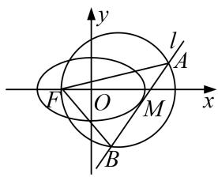

text_image

y
l
A
F
O
M
x
B

[规范解答] (1)由题意 $a = \sqrt{2}$ , $b = 1$ , $c = 1$ 。所以离心率 $\mathrm{e} = \frac{c}{a} = \frac{\sqrt{2}}{2}$ ，左焦点 $F(-1,0)$ 。

(2)由题知， $\frac{x_{0}^{2}}{2}+y_{0}^{2}=1$ ，即 $x_{0}^{2}+2y_{0}^{2}=2$ ，

当 $y_{0}=0$ 时直线 l 的方程为 $x=\sqrt{2}$ 或 $x=-\sqrt{2}$ ，直线 l 与椭圆 C 相切.

当 $y_{0} \neq 0$ 时，由 $\left\{\begin{aligned}\frac{x^{2}}{2} + y^{2} &= 1, \\ x_{0}x + 2y_{0} & y = 2,\end{aligned}\right.$ 得 $(2y_{0}^{2} + x_{0}^{2})x^{2} - 4x_{0}x + 4 - 4y_{0}^{2} = 0$ ，即 $x^{2} - 2x_{0}x + 2 - 2y_{0}^{2} = 0$ .

所以 $\Delta=(-2x_{0})^{2}-4(2-2y_{0}^{2})=4x_{0}^{2}+8y_{0}^{2}-8=0$ 。故直线l与椭圆C相切。

(3)设 $A(x_{1}, y_{1})$ , $B(x_{2}, y_{2})$ ,

当 $y_{0}=0$ 时， $x_{1}=x_{2}$ ， $y_{1}=-y_{2}$ ， $x_{1}=\pm\sqrt{2}$ ，

$\overrightarrow{FA}\cdot\overrightarrow{FB}=(x_{1}+1)^{2}-y_{2}^{2}=(x_{1}+1)^{2}-6+(x_{1}-1)^{2}=2x_{1}^{2}-4=0$ ，所以 $\overrightarrow{FA}\perp\overrightarrow{FB}$ ，即 $\angle AFB=90^{\circ}$

当 $y_{0} \neq 0$ 时，由 $\left\{\begin{aligned}(x-1)^{2}+y^{2}&=6,\\ x_{0}x+2y_{0}y&=2,\end{aligned}\right.$ 得 $(y_{0}^{2}+1)x^{2}-2(2y_{0}^{2}+x_{0})x+2-10y_{0}^{2}=0,$

则 $\therefore x_{1} + x_{2} = \frac{2(2y_{0}^{2} + x_{0})}{1 + y_{0}^{2}}, x_{1}x_{2} = \frac{2 - 10y_{0}^{2}}{1 + y_{0}^{2}}. y_{1}y_{2} = \frac{x_{0}^{2}}{4y_{0}^{2}} x_{1}x_{2} - \frac{x_{0}}{2y_{0}^{2}} (x_{1} + x_{2}) + \frac{1}{y_{0}^{2}} = \frac{-5x_{0}^{2} - 4x_{0} + 4}{2 + 2y_{0}^{2}}.$

因为 $\overrightarrow{FA}\cdot\overrightarrow{FB}=(x_{1}+1,y_{1})\cdot(x_{2}+1,y_{2})=x_{1}x_{2}+x_{1}+x_{2}+1+y_{1}y_{2}$

$$
= \frac {4 - 2 0 y _ {0} ^ {2} + 8 y _ {0} ^ {2} + 4 x _ {0} + 2 + 2 y _ {0} ^ {2}}{2 + 2 y _ {0} ^ {2}} + \frac {- 5 x _ {0} ^ {2} - 4 x _ {0} + 4}{2 + 2 y _ {0} ^ {2}} = \frac {- 5 \left(x _ {0} ^ {2} + 2 y _ {0} ^ {2}\right) + 1 0}{2 + 2 y _ {0} ^ {2}} = 0.
$$

所以 $\overrightarrow{FA}\perp\overrightarrow{FB}$ ，即 $\angle AFB=90^{\circ}$ 。故 $\angle AFB$ 为定值 $90^{\circ}$ 。

[例 3] 已知点 $F_{1}$ 为椭圆 $\frac{x^{2}}{a^{2}} + \frac{y^{2}}{b^{2}} = 1 (a > b > 0)$ 的左焦点， $P(-1, \frac{\sqrt{2}}{2})$ 在椭圆上， $PF_{1} \perp x$ 轴.

(1)求椭圆的方程:

(2)已知直线 l 与椭圆交于 A, B 两点, 且坐标原点 O 到直线 l 的距离为 $\frac{\sqrt{6}}{3}$ , $\angle AOB$ 的大小是否为定值? 若是, 求出该定值: 若不是, 请说明理由.

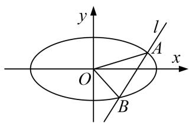

text_image

y
l
A
x
O
B

[规范解答] (1) 因为 $PF_{1} \perp x$ 轴，又 $P(-1, \frac{\sqrt{2}}{2})$ 在椭圆上，可得 $F_{1}(-1, 0)$ ,

所以 c=1， $\frac{1}{a^{2}}+\frac{1}{2b^{2}}=1$ ， $a^{2}=c^{2}+b^{2}$ ，解得 $a^{2}=2$ ， $b^{2}=1$ ，所以椭圆的方程为： $\frac{x^{2}}{2}+y^{2}=1$ ；

(2)当直线 l 的斜率不存在时，由原点 O 到直线 l 的距离为 $\frac{\sqrt{6}}{3}$ ,

可得直线 l 的方程为： $x=\pm\frac{\sqrt{6}}{3}$ ,

代入椭圆可得 $A(\frac{\sqrt{6}}{3}, \frac{\sqrt{6}}{3})$ ， $B(\frac{\sqrt{6}}{3}, -\frac{\sqrt{6}}{3})$ 或 $A(-\frac{\sqrt{6}}{3}, \frac{\sqrt{6}}{3})$ ， $B(-\frac{\sqrt{6}}{3}, \frac{\sqrt{6}}{3})$ ,

可得 $\overrightarrow{OA}\cdot\overrightarrow{OB}=0$ ，所以 $\angle AOB=\frac{\pi}{2}$ ;

当直线 l 的斜率存在时，设直线的方程为： $y=kx+m$ ，设 $A(x_{1},y_{1})$ ， $B(x_{2},y_{2})$ ，

由原点 $O$ 到直线 $l$ 的距离为 $\frac{\sqrt{6}}{3}$ ，可得 $\frac{\sqrt{6}}{3} = \frac{|m|}{\sqrt{1 + k^2}}$ ，可得 $3m^2 = 2(1 + k^2)$ ，①

直线与椭圆联立 $\left\{\begin{aligned}y&=kx+m,\\ \frac{x^{2}}{2}&+y^{2}=1,\end{aligned}\right.$ 整理可得 $(1+2k^{2})x^{2}+4kmx+2m^{2}-2=0,$

$\Delta=16k^{2}m^{2}-4(1+2k^{2})(2m^{2}-2)>0$ ，将①代入 $\Delta$ 中可得 $\Delta=16m^{2}+8>0$ ，

$$
x _ {1} + x _ {2} = \frac {- 4 k m}{1 + 2 k ^ {2}}, x _ {1} x _ {2} = \frac {2 (m ^ {2} - 1)}{1 + 2 k ^ {2}},
$$

$$
y _ {1} y _ {2} = k ^ {2} x _ {1} x _ {2} + k m \left(x _ {1} + x _ {2}\right) + m ^ {2} = \frac {k ^ {2} \left(2 m ^ {2} - 2\right)}{1 + 2 k ^ {2}} + \frac {4 k ^ {2} m ^ {2}}{1 + 2 k ^ {2}} + m ^ {2} = \frac {m ^ {2} - 2 k ^ {2}}{1 + 2 k ^ {2}},
$$

所以 $\overrightarrow{OA}\cdot\overrightarrow{OB}=x_{1}x_{2}+y_{1}y_{2}=\frac{2m^{2}-2}{1+2k^{2}}+\frac{m^{2}-2k^{2}}{1+2k^{2}}=\frac{3m^{2}-2k^{2}-2}{1+2k^{2}}$

将①代入可得 $\overrightarrow{OA}\cdot\overrightarrow{OB}=0$ ，所以 $\angle AOB=\frac{\pi}{2}$ ;

综上所述 $\angle AOB = \frac{\pi}{2}$ 恒成立.

# 【对点训练】

1. 已知椭圆 $C: \frac{x^2}{a^2} + \frac{y^2}{b^2} = 1 (a > b > 0)$ 的离心率为 $\frac{1}{3}$ , 左、右焦点分别为 $F_1, F_2, A$ 为椭圆 $C$ 上一点, $AF_2 \perp F_1F_2$ , 且 $|AF_2| = \frac{8}{3}$ .

(1)求椭圆 C 的方程;

(2)设椭圆 C 的左、右顶点分别为 $A_{1}$ ， $A_{2}$ ，过 $A_{1}$ ， $A_{2}$ 分别作 x 轴的垂线 $l_{1}$ ， $l_{2}$ ，椭圆 C 的一条切线 l: y = kx + m 与 $l_{1}$ ， $l_{2}$ 分别交于 M，N 两点，求证： $\angle MF_{1}N$ 为定值.

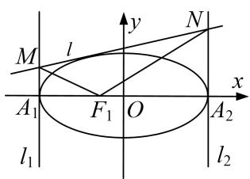

text_image

M
l
y
N
A₁
F₁ O
x
A₂
l₁
l₂

1. 解析 (1)由 $AF_{2} \perp F_{1}F_{2}$ , $|AF_{2}| = \frac{8}{3}$ , 得 $\frac{b^2}{a} = \frac{8}{3}$ . 又 $e = \frac{c}{a} = \frac{1}{3}$ , $a^2 = b^2 + c^2$ , 所以 $a^2 = 9$ , $b^2 = 8$ , 故椭圆 $C$ 的标准方程为 $\frac{x^2}{9} + \frac{y^2}{8} = 1$ .

(2)由题意可知， $l_{1}$ 的方程为 x=-3， $l_{2}$ 的方程为 x=3.

直线 l 分别与直线 $l_{1}$ ， $l_{2}$ 的方程联立得 $M(-3, -3k+m)$ ， $N(3, 3k+m)$ ，

所以 $F_{1}\overrightarrow{M}=(-2,-3k+m)$ ， $F_{1}\overrightarrow{N}=(4,3k+m)$ ，所以 $F_{1}\overrightarrow{M}\cdot\overrightarrow{F_{1}}\overrightarrow{N}=-8+m^{2}-9k^{2}$

联立得 $\left\{\begin{aligned}\frac{x^{2}}{9}+\frac{y^{2}}{8}&=1,\\ y=kx+m,\end{aligned}\right.$ 得 $(9k^{2}+8)x^{2}+18kmx+9m^{2}-72=0.$

因为直线 l 与椭圆 C 相切，所以 $\Delta=(18km)^{2}-4(9k^{2}+8)(9m^{2}-72)=0$ ，化简得 $m^{2}=9k^{2}+8$ .

所以 $\overrightarrow{F_{1}M}\cdot\overrightarrow{F_{1}N}=-8+m^{2}-9k^{2}=0$ ，所以 $\overrightarrow{F_{1}M}\perp\overrightarrow{F_{1}N}$ ，故 $\angle MF_{1}N$ 为定值 $\frac{\pi}{2}$ .

2. 已知椭圆 $C: \frac{x^2}{a^2} + \frac{y^2}{b^2} = 1 (a > b > 0)$ 上的点到它的两个焦的距离之和为 4，以椭圆 $C$ 的短轴为直径的圆 $O$ 经过这两个焦点，点 $A, B$ 分别是椭圆 $C$ 的左、右顶点.

(1)求圆和椭圆的方程.

(2)已知 $P, Q$ 分别是椭圆 $C$ 和圆 $O$ 上的动点（ $P, Q$ 位于 $y$ 轴两侧），且直线 $PQ$ 与 $x$ 轴平行，直线 $AP, BP$ 分别与 $y$ 轴交于点 $M, N$ 。求证： $\angle MQN$ 为定值。

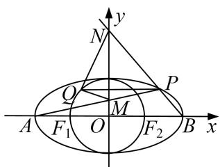

text_image

y
N
Q
P
M
A F₁ O F₂ B x

2. 解析 (1)依题意 $\left\{ \begin{array}{l} 2a = 4 \\ b = c \\ a^2 = b^2 + c^2 \end{array} \right.$ ，得 $a = 2, b = c = \sqrt{2}$ ，

∴圆方程为 $x^{2}+y^{2}=2$ ，椭圆 C 方程为 $\frac{x^{2}}{4}+\frac{y^{2}}{2}=1$ .

(2)设 $P(x_{0}, y_{0})$ , $Q(x_{1}, y_{0})$ , $\therefore \frac{x_{0}^{2}}{4} + \frac{y_{0}^{2}}{2} = 1$ , $x_{1}^{2} + y_{0}^{2} = 2$ , $y_{0} \neq 0$ ,

∵AP的方程为 $y=\frac{y_{0}}{x_{0}+2}(x+2)$ ，令x=0， $M(0,\frac{2y_{0}}{x_{0}+2})$

BP 方程为 $y=\frac{y_{0}}{x_{0}-2}(x-2)$ ，令 x=0， $N(0,\frac{-2y_{0}}{x_{0}-2})$ ,

$$
\therefore \overrightarrow {Q M} = \left(- x _ {1}, \frac {2 y _ {0}}{x _ {0} + 2} - y _ {0}\right), \overrightarrow {Q N} = \left(- x _ {1}, \frac {2 y _ {0}}{x _ {0} - 2} - y _ {0}\right)
$$

$$
\therefore \overrightarrow {Q M} \cdot \overrightarrow {Q N} = x _ {1} ^ {2} + \frac {x _ {0} ^ {2} y _ {0} ^ {2}}{x _ {0} ^ {2} - 4} = 2 - y _ {0} ^ {2} + \frac {(4 - 2 y _ {0} ^ {2}) y _ {0} ^ {2}}{- 2 y _ {0} ^ {2}} = 0, \quad \therefore \angle M Q N = 9 0 ^ {\circ}.
$$

3. 已知椭圆 $C: \frac{x^2}{a^2} + \frac{y^2}{b^2} = 1 (a > b > 0)$ 上的点到两个焦点的距离之和为 $\frac{2}{3}$ , 短轴长为 $\frac{1}{2}$ , 直线与椭圆 $C$ 交于 $M, N$ 两点.

(1)求椭圆 C 的方程;  
(2)若直线与圆 $O: x^{2} + y^{2} = \frac{1}{25}$ 相切，证明： $\angle MON$ 为定值.

text_image

y
O
M
x
N

3. 解析 (1)由题意得， $2a=\frac{2}{3}$ ， $2b=\frac{1}{2}$ ，所以 $a=\frac{1}{3}$ ， $b=\frac{1}{4}$ ，所以 $9x^{2}+16y^{2}=1$ 。

(2)当直线 $l \perp x$ 轴时，因为直线与圆相切，所以直线方程为 $x = \pm \frac{1}{5}$ .

当 $l: x=\frac{1}{5}$ 时，得 M、N 两点坐标分别为 $(\frac{1}{5}, \frac{1}{5})$ ， $(\frac{1}{5}, -\frac{1}{5})$ ，所以 $\overrightarrow{OM} \cdot \overrightarrow{ON}=0$ ，所以 $\angle MON=\frac{\pi}{2}$ .

当 $l: x = -\frac{1}{5}$ 时，同理 $\angle MON = \frac{\pi}{2}$ .

当与 x 轴不垂直时，设 $l: y = kx + m, M(x_{1}, y_{1}), N(x_{2}, y_{2})$ ，由 $d = \frac{|m|}{\sqrt{1 + k^{2}}} = \frac{1}{5}$ ，所以 $25m^{2} = 1 + k^{2}$ ，联立 $\left\{\begin{aligned}9x^{2}+16y^{2}=1,\\ y=kx+m,\end{aligned}\right.$ 得 $(16k^{2}+9)x^{2}+32kmx+16m^{2}-1=0.$

$$
\Delta = (3 2 k m) ^ {2} - 4 (1 6 k ^ {2} + 9) (1 6 m ^ {2} - 1) > 0, \therefore x _ {1} + x _ {2} = - \frac {3 2 k m}{9 + 1 6 k ^ {2}}, x _ {1} x _ {2} = \frac {1 6 m ^ {2} - 1}{9 + 1 6 k ^ {2}}.
$$

$$
\therefore \overrightarrow {O M} \cdot \overrightarrow {O N} = x _ {1} x _ {2} + y _ {1} y _ {2} = (1 + k ^ {2}) x _ {1} x _ {2} + k m \left(x _ {1} + x _ {2}\right) + m ^ {2} = \frac {2 5 m ^ {2} - k ^ {2} - 1}{9 + 1 6 k ^ {2}} = 0, \text {所以} \angle M O N = \frac {\pi}{2}.
$$

综上， $\angle MON=\frac{\pi}{2}$ (定值).

# 题型三 参数型定值问题

# 【例题选讲】

[例 1] (2018·北京)已知抛物线 C: $y^{2}=2px$ 经过点 P(1, 2)，过点 Q(0, 1)的直线 l 与抛物线 C 有两个不同的交点 A, B，且直线 PA 交 y 轴于 M，直线 PB 交 y 轴于 N.

(1)求直线 l 的斜率的取值范围;  
(2)设 O 为原点， $\overrightarrow{QM}=\lambda\overrightarrow{QD}$ ， $\overrightarrow{QN}=\mu\overrightarrow{QD}$ ，求证： $\frac{1}{\lambda}+\frac{1}{\mu}$ 为定值.

[规范解答] (1)因为抛物线 $y^{2}=2px$ 过点(1, 2)，所以 p=4，即 p=2。故抛物线 C 的方程为 $y^{2}=4x$ 。由题意知，直线 l 的斜率存在且不为 0。设直线 l 的方程为 $y=kx+1(k\neq0)$ ，

由 $\left\{\begin{aligned}y^{2}&=4x,\\ y&=kx+1,\end{aligned}\right.$ 得 $k^{2}x^{2}+(2k-4)x+1=0$ 。依题意知 $\Delta=(2k-4)^{2}-4\times k^{2}\times1>0$ ，解得k<0或0<k<1。

又 PA, PB 与 y 轴相交，故直线 l 不过点 $(1, -2)$ . 从而 $k \neq -3$ .

所以直线 l 的斜率的取值范围是 $(-∞, -3)∪(-3, 0)∪(0, 1)$ .

(2)设 $A(x_{1},y_{1})$ ， $B(x_{2},y_{2})$ ，由(1)知 $x_{1} + x_{2} = -\frac{2k - 4}{k^{2}}$ ， $x_{1}x_{2} = \frac{1}{k^{2}}.$

直线 $PA$ 的方程为 $y - 2 = \frac{y_1 - 2}{x_1 - 1} (x - 1)$ ，令 $x = 0$ ，得点 $M$ 的纵坐标为 $y_M = \frac{-y_1 + 2}{x_1 - 1} + 2 = \frac{-kx_1 + 1}{x_1 - 1} + 2.$

同理得点 N 的纵坐标为 $y_{N}=\frac{-kx_{2}+1}{x_{2}-1}+2$ ，由 $\overrightarrow{QM}=\lambda\overrightarrow{O}$ ， $\overrightarrow{QN}=\mu\overrightarrow{O}$ ，得 $\lambda=1-y_{M},\mu=1-y_{N}$ .

所以 $\frac{1}{\lambda} +\frac{1}{\mu} = \frac{1}{1 - y_M} +\frac{1}{1 - y_N} = \frac{x_1 - 1}{(k - 1)x_1} +\frac{x_2 - 1}{(k - 1)x_2} = \frac{1}{k - 1}\cdot \frac{2x_1x_2 - (x_1 + x_2)}{x_1x_2} = \frac{1}{k - 1}\cdot \frac{\frac{2}{k^2} + \frac{2k - 4}{k^2}}{\frac{1}{k^2}} = 2.$

所以 $\frac{1}{\lambda}+\frac{1}{\mu}$ 为定值.

[例 2] 已知椭圆 C 的焦点在 x 轴上，离心率等于 $\frac{2\sqrt{5}}{5}$ ，且过点 $\left(1, \frac{2\sqrt{5}}{5}\right)$ .

(1)求椭圆 C 的标准方程;

(2)过椭圆 $C$ 的右焦点 $F$ 作直线 $l$ 交椭圆 $C$ 于 $A, B$ 两点，交 $y$ 轴于 $M$ 点，若 $\overrightarrow{MA} = \lambda_1\overrightarrow{AF}$ ， $\overrightarrow{MB} = \lambda_2\overrightarrow{BF}$ ，求证： $\lambda_1 + \lambda_2$ 为定值.

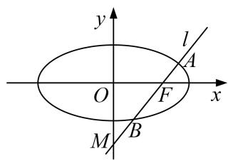

text_image

y
l
A
O
F
x
M
B

[规范解答] (1)设椭圆 C 的方程为 $\frac{x^{2}}{a^{2}}+\frac{y^{2}}{b^{2}}=1(a>b>0)$ ，则 $\left\{\begin{aligned}\frac{c}{a}&=\frac{2\sqrt{5}}{5},\\ \frac{1}{a^{2}}&+\frac{\left(\frac{2\sqrt{5}}{5}\right)_{2}}{b^{2}}=1,\end{aligned}\right.$ $\therefore a^{2}=5,\ b^{2}=1,$

∴椭圆 C 的标准方程为 $\frac{x^{2}}{5} + y^{2} = 1$ .

(2)证明：设 $A(x_{1}, y_{1})$ ， $B(x_{2}, y_{2})$ ， $M(0, y_{0})$ ，又易知 F 点的坐标为 $(2, 0)$ .

显然直线 l 存在斜率，设直线 l 的斜率为 k，则直线 l 的方程是 $y=k(x-2)$ ，

将直线 l 的方程代入椭圆 C 的方程中，消去 y 并整理得 $(1+5k^{2})x^{2}-20k^{2}x+20k^{2}-5=0$ ，

$$
\therefore x _ {1} + x _ {2} = \frac {2 0 k ^ {2}}{1 + 5 k ^ {2}}, x _ {1} x _ {2} = \frac {2 0 k ^ {2} - 5}{1 + 5 k ^ {2}}.
$$

又∵ $\overrightarrow{MA}=\lambda_{1}\overrightarrow{AF}$ ， $\overrightarrow{MB}=\lambda_{2}\overrightarrow{BF}$ ，将各点坐标代入得 $\lambda_{1}=\frac{x_{1}}{2-x_{1}}$ ， $\lambda_{2}=\frac{x_{2}}{2-x_{2}}$

$\therefore \lambda_{1} + \lambda_{2} = \frac{x_{1}}{2 - x_{1}} +\frac{x_{2}}{2 - x_{2}} = \frac{2(x_{1} + x_{2}) - 2x_{1}x_{2}}{4 - 2(x_{1} + x_{2}) + x_{1}x_{2}} = \frac{2\left(\frac{20k^{2}}{1 + 5k^{2}} - \frac{20k^{2} - 5}{1 + 5k^{2}}\right)}{4 - 2\cdot\frac{20k^{2}}{1 + 5k^{2}} + \frac{20k^{2} - 5}{1 + 5k^{2}}} = -10$ ，即 $\lambda_1 + \lambda_2$ 为定值.

[例 3] 如图，过抛物线 C: $x^{2}=2py(p>0)$ 的焦点 F 的直线 l 与抛物线 C 相交于 A, B 两点，交准线于点 M. 当 $|AB|=12$ 时，AB 的中点到 x 轴的距离是 5.

(1)求抛物线 C 的方程;  
(2)已知 $\overrightarrow{MA} = \lambda_1\overrightarrow{AF}$ ， $\overrightarrow{MB} = \lambda_2\overrightarrow{BF}$ ，求 $\lambda_1 + \lambda_2$ 的值.

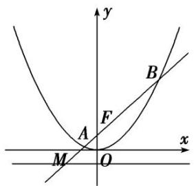

text_image

y
B
A
F
x
M
O

[规范解答] (1) 设 $A(x_{1}, y_{1})$ ， $B(x_{2}, y_{2})$ ，由抛物线的定义，得 $|AF| = y_{1} + \frac{p}{2}$ ， $|BF| = y_{2} + \frac{p}{2}$

$|AB|=y_{1}+y_{2}+p=12$ ，又AB的中点到x轴的距离是5， $\therefore\frac{y_{1}+y_{2}}{2}=5,\therefore p=2,$

∴抛物线 C 的方程为 $x^{2}=4y$ .

(2)由题意，知直线 l 的斜率存在且不为 0.

设直线 l 的方程为 $y=kx+1(k\neq0)$ ，联立，得 $\left\{\begin{aligned}x^{2}&=4y,\\ y&=kx+1,\end{aligned}\right.$ 整理得 $x^{2}-4kx-4=0$ ，

则 $\left\{\begin{aligned}x_{1}+x_{2}&=4k,\\ x_{1}x_{2}&=-4,\\ A&=16k^{2}+16>0.\end{aligned}\right.$ 点 M 在直线 $y=kx+1$ 上且 $y_{M}=-1,\therefore x_{M}=-\frac{2}{k}$ ，即 $M\left(-\frac{2}{k},-1\right)$ ,

由 $\overrightarrow{MA} = \lambda_1\overrightarrow{AF}$ ，得 $x_{1} + \frac{2}{k} = \lambda_{1}(0 - x_{1}) = -x_{1}\lambda_{1}$ ，由 $\overrightarrow{MB} = \lambda_2\overrightarrow{BF}$ ，得 $x_{2} + \frac{2}{k} = \lambda_{2}(0 - x_{2}) = -x_{2}\lambda_{2},$

$$
\therefore \lambda_ {1} + \lambda_ {2} = - 2 - \frac {2}{k} \times \frac {x _ {1} + x _ {2}}{x _ {1} x _ {2}}, \quad \because \frac {x _ {1} + x _ {2}}{x _ {1} x _ {2}} = \frac {4 k}{- 4} = - k, \quad \therefore \lambda_ {1} + \lambda_ {2} = 0.
$$

