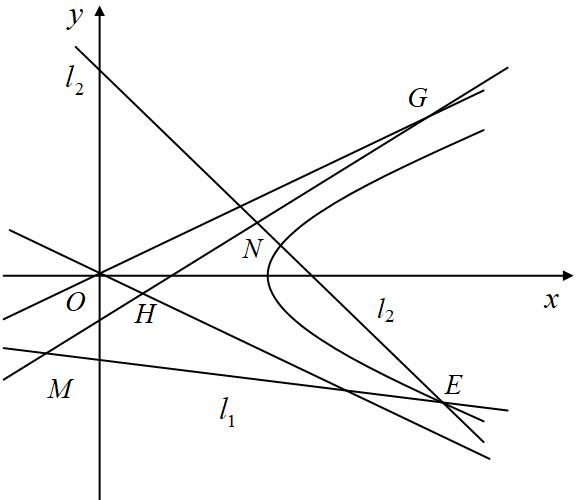
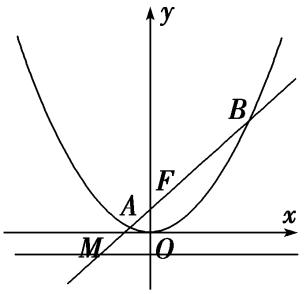

专题21　数量积、角度及参数型定值问题

题型一　数量积型定值问题

【例题选讲】

<strong>[例1]</strong>　已知椭圆＋＝1(<em>a</em>＞<em>b</em>＞0)的离心率为，右焦点为<em>F</em>(1，0)，直线<em>l</em>经过点<em>F</em>，且与椭圆交于<em>A</em>，<em>B</em>两点，<em>O</em>为坐标原点．  
（1）求椭圆的标准方程；  
（2）当直线*l*绕点*F*转动时，试问：在*x*轴上是否存在定点*M*，使得·为常数?若存在，求出定点*M*的坐标；若不存在，请说明理由．

<strong>[规范解答]</strong>　（1）由题意可知，c＝1，又e＝＝，解得<em>a</em>＝，
所以<em>b</em>2＝<em>a</em>2－<em>c</em>2＝1，所以椭圆的方程为＋<em>y</em>2＝1．  
（2）若直线不*l*垂直于*x*轴，可设*l*的方程为*y*＝*k*(*x*－1)．
联立椭圆方程＋<em>y</em>2＝1，化为(1＋2<em>k</em>2)<em>x</em>2－4<em>k</em>2<em>x</em>＋2<em>k</em>2－2＝0，
设<em>A</em>(<em>x</em>1，<em>y</em>1)，<em>B</em>(<em>x</em>2，<em>y</em>2)，则<em>x</em>1＋<em>x</em>2＝，<em>x</em>1<em>x</em>2＝．
设<em>M</em>(<em>t</em>，0)，则＝(<em>x</em>1－<em>t</em>，<em>y</em>1)，＝(<em>x</em>2－<em>t</em>，<em>y</em>2)，

·＝(<em>x</em>1－<em>t</em>，<em>y</em>1)(<em>x</em>2－<em>t</em>，<em>y</em>2)＝(<em>x</em>1－<em>t</em>)(<em>x</em>2－<em>t</em>)＋<em>y</em>1 <em>y</em>2＝(<em>x</em>1－<em>t</em>)(<em>x</em>2－<em>t</em>)＋<em>k</em>2(<em>x</em>1－1)( <em>x</em>2－1)

＝(1＋<em>k</em>2) <em>x</em>1<em>x</em>2－(<em>t</em>＋<em>k</em>2)(<em>x</em>1＋<em>x</em>2)＋<em>t</em>2＋<em>k</em>2＝(1＋<em>k</em>2) －(<em>t</em>＋<em>k</em>2) ＋<em>t</em>2＋<em>k</em>2

＝．

要使得·＝*λ*(*λ*为常数)，只要＝*λ*，
即(2<em>t</em>2－4<em>t</em>＋1－2<em>λ</em>) <em>k</em>2＋(<em>t</em>2－2－<em>λ</em>)＝0．

对于任意实数*k*，要使上式恒成立，只要，解得．
若直线*l*垂直于*x*轴，其方程为*x*＝1，此时，直线*l*与椭圆两交点为*A*(1，)，*B*(1，－)，

取点*M*(，0)，有＝(－，)，＝(－，－)，

·＝(－)(－)＋(－)＝－＝*λ*．
综上所述，过定点*F*(1，0)的动直线*l*与椭圆相交于*A*，*B*两点，当直线*l*绕点*F*转动时，存在定点*M*(，0)，使得·＝－．

<strong>[例2]</strong>　已知<em>O</em>为坐标原点，椭圆<em>C</em>：＋<em>y</em>2＝1上一点<em>E</em>在第一象限，若|<em>OE</em>|＝．

  
（1）求点*E*的坐标；  
（2）椭圆*C*两个顶点分别为*A*(－2，0)，*B*(2，0)，过点*M*(0，－1)的直线*l*交椭圆*C*于点*D*，交*x*轴于点*P*，若直线*AD*与直线*MB*相交于点*Q*，求证：·为定值．

<strong>[规范解答]</strong>　（1）设<em>E</em>(<em>x</em>0，<em>y</em>0)(<em>x</em>0&gt;0，<em>y</em>0&gt;0)，因为|<em>OE</em>|＝，所以＝　①，
又因为点<em>E</em>在椭圆上，所以＋<em>y</em>02＝1　②，

由①②解得：，所以*E*的坐标为(1，)；  
（2）设点<em>D</em>(<em>x</em>1，<em>y</em>1)，则直线<em>DA</em>的方程为<em>y</em>＝(<em>x</em>＋2)　③，直线<em>BM</em>的方程为<em>y</em>＝<em>x</em>－1　④，
由③④解得<em>xQ</em>＝，又直线<em>DM</em>的方程为<em>y</em>＝<em>x</em>－1，

令<em>y</em>＝0，解得<em>xP</em>＝，所以·＝·＝，

又＋<em>y</em>12＝1，所以·＝＝4．

<strong>[例3]</strong>　椭圆有两顶点<em>A</em>(－1，0)，<em>B</em>(1，0)，过其焦点<em>F</em>(0，1)的直线<em>l</em>与椭圆交于<em>C</em>，<em>D</em>两点，并与<em>x</em>轴交于点<em>P</em>．直线<em>AC</em>与直线<em>BD</em>交于点<em>Q</em>．  
（1）当|*CD*|＝时，求直线*l*的方程；  
（2）当点*P*异于*A*，*B*两点时，求证：·为定值．

<strong>[规范解答]</strong>　（1）因椭圆焦点在<em>y</em>轴上，设椭圆的标准方程为＋＝1 (<em>a</em>&gt;<em>b</em>&gt;0)，
由已知得<em>b</em>＝1，<em>c</em>＝1，所以<em>a</em>＝，椭圆方程为为＋<em>x</em>2＝1．

直线*l*垂直于*x*轴时与题意不符．
设直线<em>l</em>的方程为<em>y</em>＝<em>kx</em>＋1，将其代入椭圆方程化简得，(<em>k</em>2＋2)<em>x</em>2＋2<em>kx</em>－1＝0．
设<em>C</em>(<em>x</em>1，<em>y</em>1)，<em>D</em>(<em>x</em>2，<em>y</em>2)，则∴<em>x</em>1＋<em>x</em>2＝－，<em>x</em>1<em>x</em>2＝－，

|<em>CD</em>|＝·|<em>x</em>1－<em>x</em>2|＝·＝＝，解得<em>k</em>＝±．
所以直线*l*的方程为*y*＝*x*＋1或*y*＝－*x*＋1．  
（2）直线*l*与*x*轴垂直时与题意不符．
设直线*l*的方程为*y*＝*kx*＋1(*k*≠0且*k*≠±1)，所以*P*点坐标为(－，0)．
设<em>C</em>(<em>x</em>1，<em>y</em>1)，<em>D</em>(<em>x</em>2，<em>y</em>2)，由（1）知<em>x</em>1＋<em>x</em>2＝－，<em>x</em>1<em>x</em>2＝－，

直线*AC*的方程为*y*＝(*x*＋1)，直线*BD*的方程为*y*＝(*x*－1)，
将两直线方程联立，消去<em>y</em>得＝，因为－1＜<em>x</em>1，<em>x</em>2＜1，所以与异号．

()2＝＝·＝＝＝()2．
又<em>y</em>1 <em>y</em>2＝<em>k</em>2<em>x</em>1<em>x</em>2＋<em>k</em>(<em>x</em>1＋<em>x</em>2)＋1＝＝－·
∴与<em>y</em>1<em>y</em>2异号， 与同号，＝，解得<em>x</em>＝－<em>k</em>，
因此<em>Q</em>点坐标为(－<em>k</em>，<em>y</em>0)．·＝(－，0)(－<em>k</em>，<em>y</em>0)＝1，故·为定值．

<strong>[例4]</strong>　如图，点<em>M</em>在椭圆＋＝1，(0&lt;<em>b</em>&lt;)上，且位于第一象限，<em>F</em>1，<em>F</em>2为椭圆的两个焦点，过<em>F</em>1，<em>F</em>2，<em>M</em>的圆与<em>y</em>轴交于点<em>P</em>，<em>Q</em>(<em>P</em>在<em>Q</em>的上方)，|<em>OP</em>|·|<em>OQ</em>|＝1．  
（1）求*b*的值；  
（2）直线*PM*与直线*x*＝2交于点*N*，试问，在*x*轴上是否存在定点*T*，使得·为定值？若存在，求出点*T*的坐标与该定值；若不存在，请说明理由．

<strong>[规范解答]</strong>　（1）设圆心(0，<em>t</em>)．则圆的方程为：<em>x</em>2＋(<em>y</em>－<em>t</em>)2＝<em>c</em>2＋<em>t</em>2．
令<em>x</em>＝0，得：<em>y</em>2－2<em>ty</em>－<em>c</em>2＝0(\*)，∴|<em>OP</em>|·|<em>OQ</em>|＝|<em>yP</em>·<em>yQ</em>|＝<em>c</em>2＝1．∴<em>b</em>＝<em>a</em>2－<em>c</em>2＝1．  
（2）设<em>M</em>(<em>x</em>0，<em>y</em>0)，<em>x</em>0&gt;0，<em>y</em>0&gt;0将<em>M</em>(<em>x</em>0，<em>y</em>0)代入圆与椭圆的方程，可得．

<em>x</em>02＋<em>y</em>02－2<em>ty</em>0－1＝0，<em>x</em>02＋2<em>y</em>02＝2，消去<em>x</em>0，得<em>t</em>＝，代入(\*)得：<em>y</em>2－ <em>y</em>－1＝0，
即<em>y</em>2－(－<em>y</em>0) <em>y</em>－1＝0，所以(<em>y</em>－)(<em>y</em>＋<em>y</em>0)＝0，

过<em>F</em>1，<em>F</em>2，<em>M</em>的圆与<em>y</em>轴交于点<em>P</em>，<em>Q</em>(<em>P</em>在<em>Q</em>的上方)．所以<em>yP</em>＝，<em>yQ</em>＝－<em>y</em>0．
则<em>kPM</em>＝．则直线<em>PM</em>的方程为<em>y</em>＝<em>x</em>＋，
由直线*PM*与*x*＝2的交点为*N*．所以在直线*PM*的方程中，令*x*＝2，
得，*y*＝×2＋＝＋＝．得*N*(2，)，
设<em>T</em>(<em>d</em>，0)，·＝(<em>x</em>0－<em>d</em>，<em>y</em>0)·(2－<em>d</em>，)＝(<em>x</em>0－<em>d</em>)(2－<em>d</em>)＋1－<em>x</em>0＝(1－<em>d</em>)<em>x</em>0－<em>d</em>(2－<em>d</em>)＋1．

要使得·为定值，即与*M*的坐标无关．
当*d*＝1时，·＝0为定值．存在定点*T*（1，0），使得·为定值0．

<strong>[例5]</strong>　已知椭圆<em>C</em>：＋＝1(<em>a</em>&gt;<em>b</em>&gt;0)的离心率为，过右焦点且垂直于<em>x</em>轴的直线<em>l</em>1与椭圆<em>C</em>交于<em>A</em>，<em>B</em>两点，且|<em>AB</em>|＝，直线<em>l</em>1：<em>y</em>＝<em>k</em>(<em>x</em>－<em>m</em>)(<em>m</em>∈<strong>R</strong>，<em>m</em>&gt;)与椭圆<em>C</em>交于<em>M</em>，<em>N</em>两点．  
（1）求椭圆*C*的标准方程；  
（2）已知点*R*(，0)，若·是一个与*k*无关的常数，求实数*m*的值．

<strong>[规范解答]</strong>　（1）联立解得<em>y</em>＝±，故＝，e＝＝，<em>a</em>2＝<em>b</em>2＋<em>c</em>2，
联立可得<em>a</em>＝，<em>b</em>＝<em>c</em>＝1，故椭圆<em>C</em>的标准方程为＋<em>y</em>2＝1．  
（2）设<em>M</em>(<em>x</em>1，<em>y</em>1)，<em>N</em>(<em>x</em>2，<em>y</em>2)，联立方程消元得(1＋2<em>k</em>2)<em>x</em>2－4<em>mk</em>2<em>x</em>＋2<em>m</em>2<em>k</em>2－2＝0，

<em>Δ</em>＝16<em>m</em>2<em>k</em>4－4(1＋2<em>k</em>2)(2<em>k</em>2<em>m</em>2－2)＝8(2<em>k</em>2－<em>k</em>2<em>m</em>2＋1)，∴<em>x</em>1＋<em>x</em>2＝，<em>x</em>1<em>x</em>2＝．

·＝(<em>x</em>1－)(<em>x</em>2－)＋<em>y</em>1<em>y</em>2＝<em>x</em>1<em>x</em>2－(<em>x</em>1＋<em>x</em>2)＋＋<em>k</em>2(<em>x</em>1－<em>m</em>)(<em>x</em>2－<em>m</em>)

＝(1＋<em>k</em>2) <em>x</em>1<em>x</em>2－(＋<em>mk</em>2) (<em>x</em>1＋<em>x</em>2)＋＋<em>k</em>2<em>m</em>2＝＋，

(这里的计算使用点乘双根法更便捷)
令(1＋2<em>k</em>2) <em>x</em>2－4<em>mk</em>2<em>x</em>＋2<em>k</em>2<em>m</em>2－2＝(1＋2<em>k</em>2)(<em>x</em>1－<em>x</em>)(<em>x</em>2－<em>x</em>)，
再令<em>x</em>＝，得(<em>x</em>1－)(<em>x</em>2－)＝，
∵<em>y</em>1<em>y</em>2＝<em>k</em>2(<em>x</em>1－<em>m</em>)(<em>x</em>2－<em>m</em>)，∴再令<em>x</em>＝<em>m</em>，得<em>k</em>2(<em>x</em>1－<em>m</em>)(<em>x</em>2－<em>m</em>)＝，
∴(<em>x</em>1－)(<em>x</em>2－)＋<em>y</em>1<em>y</em>2＝＋

(选择自己熟练的计算方法进行计算，务必保证计算不能出错)
又·是一个与<em>k</em>无关的常数，∴3<em>m</em>2－5<em>m</em>－2＝－4，即3<em>m</em>2－5<em>m</em>＋2＝0，
∴*m*＝1或*m*＝，又∵*m*>，∴*m*＝1，
当<em>m</em>＝1时，<em>Δ&gt;</em>0，直线<em>l</em>1与椭圆<em>C</em>交于两点，满足题意，∴<em>m</em>＝1．

<strong>[题后悟通]</strong>　本题的关键点就在于如何使成为一个与<em>k</em>无关的常数，在这里应用了比例的性质，即令分子分母中的同类项成比例，可以观察到分子分母的常数项的比例为－2，则令分子分母中<em>k</em>2的系数的比例也为－2，即令3<em>m</em>2－5<em>m</em>－2＝－4，则可求出参数的值．

【对点训练】

1．已知椭圆*E*的中心在原点，焦点在*x*轴上，椭圆的左顶点坐标为(－，0)，离心率为e＝．  
（1）求椭圆*E*的方程；  
（2）过点(1，0)作直线*l*交*E*于*P*、*Q*两点，试问：在*x*轴上是否存在一个定点*M*，使·为定值？若存在，求出这个定点*M*的坐标；若不存在，请说明理由．

1．（1）设椭圆*E*的方程为＋＝1(*a*＞*b*＞0)，
由已知得解得，所以<em>b</em>2＝1．
所以椭圆<em>E</em>的方程为＋<em>y</em>2＝1．  
（2）假设存在符合条件的点<em>M</em>(<em>m</em>，0)，设<em>A</em>(<em>x</em>1，<em>y</em>1)，<em>B</em>(<em>x</em>2，<em>y</em>2)，
则＝(<em>x</em>1－<em>m</em>，<em>y</em>1)，＝(<em>x</em>2－<em>m</em>，<em>y</em>2)，

·＝(<em>x</em>1－<em>m</em>)(<em>x</em>2－<em>m</em>)＋<em>y</em>1 <em>y</em>2＝<em>x</em>1<em>x</em>2－<em>m</em> (<em>x</em>1＋<em>x</em>2)＋<em>m</em>2＋<em>y</em>1<em>y</em>2，

①当直线*l*的斜率存在时，设直线*l*的方程为*y*＝*k*(*x*－1)，
联立椭圆方程＋<em>y</em>2＝1，化为(1＋2<em>k</em>2)<em>x</em>2－4<em>k</em>2<em>x</em>＋2<em>k</em>2－2＝0，
则<em>x</em>1＋<em>x</em>2＝，<em>x</em>1<em>x</em>2＝．∴<em>y</em>1<em>y</em>2＝<em>k</em>2[－(<em>x</em>1＋<em>x</em>2)＋<em>x</em>1<em>x</em>2＋1]＝－，

·＝．

对于任意的<em>k</em>值，上式为定值，故2<em>m</em>2－4<em>m</em>＋1＝2(<em>m</em>2－2)，解得，<em>m</em>＝，
此时，·＝<em>m</em>2－2＝－为定值；
②当直线*l*的斜率不存在时，

直线<em>l</em>：<em>x</em>＝1，<em>x</em>1<em>x</em>2＝1，<em>x</em>1＋<em>x</em>2＝2，<em>y</em>1<em>y</em>2＝－，
由，*m*＝，得·＝1－2×＋－＝－为定值，
综合①②知，符合条件的点*M*存在，其坐标为(，0)．

2．已知椭圆＋＝1 (<em>a</em>＞<em>b</em>＞0)的一个焦点与抛物线<em>y</em>2＝4<em>x</em>的焦点<em>F</em>重合，且椭圆短轴的两个端点与

点*F*构成正三角形．  
（1）求椭圆的方程；  
（2）若过点(1，0)的直线*l*与椭圆交于不同的两点*P*，*Q*，试问在*x*轴上是否存在定点*E*(*m*，0)，使·恒为定值？若存在，求出*E*的坐标，并求出这个定值；若不存在，请说明理由．

2．解析　（1）由题意，知抛物线的焦点为*F*(，0)，所以*c*＝＝．
因为椭圆短轴的两个端点与*F*构成正三角形，所以*b*＝×＝1．

可求得<em>a</em>＝2，故椭圆的方程为＋<em>y</em>2＝1．  
（2）假设存在满足条件的点*E*，当直线*l*的斜率存在时设其斜率为*k*，则*l*的方程为*y*＝*k*(*x*－1)．
由得(4<em>k</em>2＋1)<em>x</em>2－8<em>k</em>2<em>x</em>＋4<em>k</em>2－4＝0．设<em>P</em>(<em>x</em>1，<em>y</em>1)，<em>Q</em>(<em>x</em>2，<em>y</em>2)，
所以<em>x</em>1＋<em>x</em>2＝，<em>x</em>1<em>x</em>2＝．则＝(<em>m</em>－<em>x</em>1，－<em>y</em>1)，＝(<em>m</em>－<em>x</em>2，－<em>y</em>2)，
所以·＝(<em>m</em>－<em>x</em>1)(<em>m</em>－<em>x</em>2)＋<em>y</em>1<em>y</em>2＝<em>m</em>2－<em>m</em>(<em>x</em>1＋<em>x</em>2)＋<em>x</em>1<em>x</em>2＋<em>y</em>1<em>y</em>2

＝<em>m</em>2－<em>m</em>(<em>x</em>1＋<em>x</em>2)＋<em>x</em>1<em>x</em>2＋<em>k</em>2(<em>x</em>1－1)(<em>x</em>2－1)

＝<em>m</em>2－＋＋<em>k</em>2(－＋1)＝

＝＝ (4<em>m</em>2－8<em>m</em>＋1)＋．

要使·为定值，则2*m*－＝0，即*m*＝，此时·＝．
当直线*l*的斜率不存在时，不妨取*P*(1，)，*Q*(1，－)，
由*E*(，0)，可得＝(，－)，＝(，)，所以·＝－＝．

综上，存在点*E*(，0)，使·为定值．

3．在平面直角坐标系*xOy*中，已知椭圆*C*：＋＝1(*a*>*b*>0)的离心率为，且过点(1，)，过椭圆的

左顶点*A*作直线*l*⊥*x*轴，点*M*为直线*l*上的动点，点*B*为椭圆右顶点，直线*BM*交椭圆*C*于*P*．  
（1）求椭圆*C*的方程；  
（2）求证：*AP*⊥*OM*；  
（3）试问·是否为定值？若是定值，请求出该定值；若不是定值，请说明理由．

3．解析　（1）∵椭圆C：＋＝1(*a*>*b*>0)的离心率为，
∴<em>a</em>2＝2<em>c</em>2，则<em>a</em>2＝2<em>b</em>2，又椭圆<em>C</em>过点(1，)，∴＋＝1．∴<em>a</em>2＝4，<em>b</em>2＝2，
则椭圆*C*的方程＋＝1．  
（2）设直线<em>BM</em>的斜率为<em>k</em>，则直线<em>BM</em>的方程为<em>y</em>＝<em>k</em>(<em>x</em>－2)，设<em>P</em>(<em>x</em>1，<em>y</em>1)，
将<em>y</em>＝<em>k</em>(<em>x</em>－2)代入椭圆C的方程＋＝1中并化简得：(2<em>k</em>2＋1)<em>x</em>2－4<em>k</em>2<em>x</em>＋8<em>k</em>2－4＝0．
解之得<em>x</em>1＝，<em>x</em>2＝2，
∴<em>y</em>1＝<em>k</em>(<em>x</em>1－2)＝，从而<em>P</em>(，)．
在*y*＝*k*(*x*－2)上，令*x*＝－2，得*y*＝－4*k*，∴*M*(－2，－4*k*)．
又＝(＋2，)＝(，)，
∴·＝＋＝0，∴*AP*⊥*OM*；  
（3）·＝(，)·(－2，－4*k*)＝＝＝4．
∴·为定值4．

4．已知椭圆*C*：＋＝1(*a*＞*b*＞0)上的点到两个焦点的距离之和为，短轴长为，直线*l*与椭圆*C*交于

*M*，*N*两点．  
（1）求椭圆*C*的方程；  
（2）若直线<em>l</em>与圆<em>O</em>：<em>x</em>2＋<em>y</em>2＝相切，求证：·为定值．

4．解析　（1）由题意得，2<em>a</em>＝，2<em>b</em>＝，所以<em>a</em>＝，<em>b</em>＝，所以椭圆<em>C</em>的方程为9<em>x</em>2＋16<em>y</em>2＝1．  
（2）①当直线*l*⊥*x*轴时，因为直线*l*与圆*O*相切，所以直线*l*的方程为*x*＝±．
当直线*l*：*x*＝时，得*M*，*N*两点的坐标分别为(，)，(，－)，所以·＝0；
当直线*l*：*x*＝－时，同理可得·＝0．

②当直线<em>l</em>与<em>x</em>轴不垂直时，设<em>l</em>：<em>y</em>＝<em>kx</em>＋<em>m</em>，<em>M</em>(<em>x</em>1，<em>y</em>1)，<em>N</em>(<em>x</em>2，<em>y</em>2)，
所以圆心<em>O</em>(0，0)到直线<em>l</em>的距离为<em>d</em>＝＝，所以25<em>m</em>2＝1＋<em>k</em>2，
由得(9＋16<em>k</em>2)<em>x</em>2＋32<em>kmx</em>＋16<em>m</em>2－1＝0，
则<em>Δ</em>＝(32<em>km</em>)2－4(9＋16<em>k</em>2)(16<em>m</em>2－1)＞0，<em>x</em>1＋<em>x</em>2＝－，<em>x</em>1<em>x</em>2＝，
所以·＝<em>x</em>1<em>x</em>2＋<em>y</em>1<em>y</em>2＝(1＋<em>k</em>2)<em>x</em>1<em>x</em>2＋<em>km</em>(<em>x</em>1＋<em>x</em>2)＋<em>m</em>2＝＝0．

综上，·＝0(定值)．

5．已知以原点*O*为中心，*F*(，0)为右焦点的双曲线*F*的离心率e＝．  
（1）求双曲线*C*的标准方程及其渐近线方程；  
（2）如图，已知过点<em>M</em>(<em>x</em>1，<em>y</em>1)的直线<em>l</em>1：<em>x</em>1<em>x</em>＋4<em>y</em>1<em>y</em>＝4与过点<em>N</em>(<em>x</em>2，<em>y</em>2)(其中<em>x</em>2≠<em>x</em>1)的直线<em>l</em>2：<em>x</em>2<em>x</em>＋4<em>y</em>2<em>y</em>＝4的交点<em>E</em>在双曲线<em>C</em>上，直线<em>MN</em>与两条渐近线分别交于<em>G</em>，<em>H</em>两点，求·的值．

5．解析　（1）设*C*的标准方程是－＝1(*a*>0，*b*>0)，则由题意*c*＝，*e*＝＝．
因此，<em>C</em>的标准方程为－<em>y</em>2＝1．<em>C</em>的渐近线方程为<em>y</em>＝±<em>x</em>，即<em>x</em>－2<em>y</em>＝0和<em>x</em>＋2<em>y</em>＝0．  
（2）如图，由题意点<em>E</em>(<em>x</em>0，<em>y</em>0)在直线<em>l</em>1：<em>x</em>1<em>x</em>＋4<em>y</em>1<em>y</em>＝4和<em>l</em>2：<em>x</em>2<em>x</em>＋4<em>y</em>2<em>y</em>＝4上，
因此有<em>x</em>1<em>x</em>0＋4<em>y</em>1<em>y</em>0＝4，<em>x</em>2<em>x</em>0＋4<em>y</em>2<em>y</em>0＝4．故点<em>M</em>、<em>N</em>均在直线<em>x</em>0<em>x</em>＋4<em>y</em>0<em>y</em>＝4上，
因此直线<em>MN</em>的方程为<em>x</em>0<em>x</em>＋4<em>y</em>0<em>y</em>＝4．
设*G*、*H*分别是直线*MN*与渐近线*x*－2*y*＝0及*x*＋2*y*＝0的交点，
由方程组及，解得，．
故·＝·－·＝．
因为点<em>E</em>在双曲线－<em>y</em>2＝1上，所以<em>x</em>02－4<em>y</em>02＝4，所以·＝＝3．

题型二　角度型定值问题

【例题选讲】

<strong>[例1]</strong>　已知椭圆<em>W</em>：＋＝1(<em>a</em>＞<em>b</em>＞0)的上下顶点分别为<em>A</em>，<em>B</em>，且点<em>B</em>(0，－1)．<em>F</em>1，<em>F</em>2分别为椭圆<em>W</em>的左、右焦点，且∠<em>F</em>1<em>BF</em>2＝120°．  
（1）求椭圆*W*的标准方程；  
（2）点*M*是椭圆上异于*A*，*B*的任意一点，过点*M*作*MN*⊥*y*轴于*N*，*E*为线段*MN*的中点．直线*AE*与直线*y*＝－1交于点*C*，*G*为线段*BC*的中点，*O*为坐标原点．求证：∠*OEG*为定值．

<strong>[规范解答]</strong>　（1）依题意，得<em>b</em>＝1．又∠<em>F</em>1<em>BF</em>2＝120°，在Rt△<em>BF</em>1<em>O</em>中，∠<em>F</em>1<em>BO</em>＝60°，所以<em>a</em>＝2．
所以椭圆<em>W</em>的标准方程为＋<em>y</em>2＝1．  
（2）设<em>M</em>(<em>x</em>0，<em>y</em>0)，<em>x</em>0≠0，则<em>N</em>(0，<em>y</em>0)，<em>E</em>(，<em>y</em>0)．
因为点<em>M</em>在椭圆<em>W</em>上，所以＋<em>y</em>02＝1．即<em>x</em>02＝4－4<em>y</em>02．
又*A*(0，1)，所以直线*AE*的方程为*y*－1＝*x*．令*y*＝－1，得*C*(，－1)．
又*B*(0，－1)，*G*为线段*BC*的中点，所以*G*(，－1)．
所以＝(，<em>y</em>0)，＝(－，<em>y</em>0＋1)．
因为·＝(－)＋<em>y</em>0(<em>y</em>0＋1)＝－＋<em>y</em>02＋<em>y</em>0

＝1－＋<em>y</em>0＝1－<em>y</em>0－1＋<em>y</em>0＝0，所以⊥．∠<em>OEG</em>＝90°．

<strong>[例2]</strong>　已知点<em>M</em>(<em>x</em>0，<em>y</em>0)为椭圆<em>C：</em>＋<em>y</em>2＝1．上任意一点，直线<em>l：x</em>0<em>x</em>＋2<em>y</em>0 <em>y</em>＝2与圆(<em>x</em>－1)2＋<em>y</em>2＝6交于<em>A</em>，<em>B</em>两点，点<em>F</em>为椭圆<em>C</em>的左焦点．  
（1）求椭圆*C*的离心率及左焦点*F*的坐标；  
（2）求证：直线*l*与椭圆*C*相切；  
（3）判断∠*AFB*是否为定值，并说明理由．

<strong>[规范解答]</strong>　（1）由题意<em>a</em>＝，<em>b</em>＝1，<em>c</em>＝1．所以离心率e＝＝，左焦点<em>F</em>(－1，0)．  
（2）由题知，＋<em>y</em>02＝1，即<em>x</em>02＋2<em>y</em>02＝2，
当<em>y</em>0＝0时直线<em>l</em>的方程为<em>x</em>＝或<em>x</em>＝－，直线<em>l</em>与椭圆<em>C</em>相切．
当<em>y</em>0≠0时，由得(2<em>y</em>02＋<em>x</em>02)<em>x</em>2－4<em>x</em>0<em>x</em>＋4－4 <em>y</em>02＝0，即<em>x</em>2－2<em>x</em>0<em>x</em>＋2－2<em>y</em>02＝0．
所以<em>Δ</em>＝(－2<em>x</em>0)2－4(2－2<em>y</em>02)＝4<em>x</em>02＋8<em>y</em>02－8＝0．故直线<em>l</em>与椭圆<em>C</em>相切．  
（3）设<em>A</em>(<em>x</em>1，<em>y</em>1)，<em>B</em>(<em>x</em>2，<em>y</em>2)，
当<em>y</em>0＝0时，<em>x</em>1＝<em>x</em>2，<em>y</em>1＝－<em>y</em>2，<em>x</em>1＝±，

·＝(<em>x</em>1＋1)2－<em>y</em>22＝(<em>x</em>1＋1)2－6＋(<em>x</em>1－1)2＝2 <em>x</em>12－4＝0，所以⊥，即∠<em>AFB</em>＝90°．
当<em>y</em>0≠0时，由得(<em>y</em>02＋1)<em>x</em>2－2(2<em>y</em>02＋<em>x</em>0)<em>x</em>＋2－10 <em>y</em>02＝0，
则∴<em>x</em>1＋<em>x</em>2＝，<em>x</em>1<em>x</em>2＝．<em>y</em>1<em>y</em>2＝ <em>x</em>1<em>x</em>2－(<em>x</em>1＋<em>x</em>2)＋＝．
因为·＝(<em>x</em>1＋1，<em>y</em>1)·(<em>x</em>2＋1，<em>y</em>2)＝<em>x</em>1<em>x</em>2＋<em>x</em>1＋<em>x</em>2＋1＋<em>y</em>1<em>y</em>2

＝＋＝＝0．
所以⊥，即∠*AFB*＝90°．故∠*AFB*为定值90°．

<strong>[例3]</strong>　已知点<em>F</em>1为椭圆＋＝1(<em>a</em>&gt;<em>b</em>&gt;0)的左焦点，<em>P</em>(－1，)在椭圆上，<em>PF</em>1⊥<em>x</em>轴．  
（1）求椭圆的方程：  
（2）已知直线*l*与椭圆交于*A*，*B*两点，且坐标原点*O*到直线*l*的距离为，∠*AOB*的大小是否为定值？若是，求出该定值：若不是，请说明理由．

<strong>[规范解答]</strong>　（1）因为<em>PF</em>1⊥<em>x</em>轴，又<em>P</em>(－1，)在椭圆上，可得<em>F</em>1(－1，0)，
所以<em>c</em>＝1，＋＝1，<em>a</em>2＝<em>c</em>2＋<em>b</em>2，解得<em>a</em>2＝2，<em>b</em>2＝1，所以椭圆的方程为：＋<em>y</em>2＝1；  
（2）当直线*l*的斜率不存在时，由原点*O*到直线*l*的距离为，
可得直线*l*的方程为：*x*＝±，
代入椭圆可得*A*(，)，*B*(，－)或*A*(－，)，*B*(－，)，
可得·＝0，所以∠*AOB*＝；
当直线<em>l</em>的斜率存在时，设直线的方程为：<em>y</em>＝<em>kx</em>＋<em>m</em>，设<em>A</em>(<em>x</em>1，<em>y</em>1)，<em>B</em>(<em>x</em>2，<em>y</em>2)，
由原点<em>O</em>到直线<em>l</em>的距离为，可得＝，可得3<em>m</em>2＝2(1＋<em>k</em>2)，①

直线与椭圆联立整理可得(1＋2<em>k</em>2)<em>x</em>2＋4<em>kmx</em>＋2<em>m</em>2－2＝0，

<em>Δ</em>＝16<em>k</em>2<em>m</em>2－4(1＋2<em>k</em>2)(2<em>m</em>2－2)&gt;0，将①代入<em>Δ</em>中可得<em>Δ</em>＝16<em>m</em>2＋8&gt;0，

<em>x</em>1＋<em>x</em>2＝，<em>x</em>1<em>x</em>2＝，

<em>y</em>1<em>y</em>2＝<em>k</em>2<em>x</em>1<em>x</em>2＋<em>km</em>(<em>x</em>1＋<em>x</em>2)＋<em>m</em>2＝＋＋<em>m</em>2＝，
所以·＝<em>x</em>1<em>x</em>2＋<em>y</em>1<em>y</em>2＝＋＝，
将①代入可得·＝0，所以∠*AOB*＝；
综上所述∠*AOB*＝恒成立．

【对点训练】

1．已知椭圆<em>C</em>：＋＝1(<em>a</em>&gt;<em>b</em>&gt;0)的离心率为，左、右焦点分别为<em>F</em>1，<em>F</em>2，<em>A</em>为椭圆<em>C</em>上一点，<em>AF</em>2⊥<em>F</em>1<em>F</em>2，

且|<em>AF</em>2|＝．  
（1）求椭圆*C*的方程；  
（2）设椭圆<em>C</em>的左、右顶点分别为<em>A</em>1，<em>A</em>2，过<em>A</em>1，<em>A</em>2分别作<em>x</em>轴的垂线<em>l</em>1，<em>l</em>2，椭圆<em>C</em>的一条切线<em>l</em>：<em>y</em>＝<em>kx</em>＋<em>m</em>与<em>l</em>1，<em>l</em>2分别交于<em>M</em>，<em>N</em>两点，求证：∠<em>MF</em>1<em>N</em>为定值．

1．<strong>解析</strong>　（1）由<em>AF</em>2⊥<em>F</em>1<em>F</em>2，|<em>AF</em>2|＝，得＝．又<em>e</em>＝＝，<em>a</em>2＝<em>b</em>2＋<em>c</em>2，所以<em>a</em>2＝9，<em>b</em>2＝8，
故椭圆*C*的标准方程为＋＝1．  
（2）由题意可知，<em>l</em>1的方程为<em>x</em>＝－3，<em>l</em>2的方程为<em>x</em>＝3．

直线<em>l</em>分别与直线<em>l</em>1，<em>l</em>2的方程联立得<em>M</em>(－3，－3<em>k</em>＋<em>m</em>)，<em>N</em>(3，3<em>k</em>＋<em>m</em>)，
所以＝(－2，－3<em>k</em>＋<em>m</em>)，＝(4，3<em>k</em>＋<em>m</em>)，所以·＝－8＋<em>m</em>2－9<em>k</em>2．
联立得得(9<em>k</em>2＋8)<em>x</em>2＋18<em>kmx</em>＋9<em>m</em>2－72＝0．
因为直线<em>l</em>与椭圆<em>C</em>相切，所以<em>Δ</em>＝(18<em>km</em>)2－4(9<em>k</em>2＋8)(9<em>m</em>2－72)＝0，化简得<em>m</em>2＝9<em>k</em>2＋8．
所以·＝－8＋<em>m</em>2－9<em>k</em>2＝0，所以⊥，故∠<em>MF</em>1<em>N</em>为定值．

2．已知椭圆*C*：＋＝1(*a*>*b*>0)上的点到它的两个焦的距离之和为4，以椭圆*C*的短轴为直径的圆

*O*经过这两个焦点，点*A*，*B*分别是椭圆*C*的左、右顶点．  
（1）求圆和椭圆的方程．  
（2）已知*P*，*Q*分别是椭圆*C*和圆*O*上的动点（*P*，*Q*位于*y*轴两侧），且直线*PQ*与*x*轴平行，直线*AP*，*BP*分别与*y*轴交于点*M*，*N*．求证：∠*MQN*为定值．

2．解析　（1）依题意，得*a*＝2，*b*＝*c*＝，
∴圆方程为<em>x</em>2＋<em>y</em>2＝2，椭圆<em>C</em>方程为＋＝1．  
（2）设<em>P</em>(<em>x</em>0，<em>y</em>0)，<em>Q</em>(<em>x</em>1，<em>y</em>0)，∴＋＝1，<em>x</em>12＋<em>y</em>02＝2，<em>y</em>0≠0，
∵*AP*的方程为*y*＝(*x*＋2)，令*x*＝0，*M*(0，)，

*BP*方程为*y*＝(*x*－2)，令*x*＝0，*N*(0，)，
∴＝(－<em>x</em>1，－<em>y</em>0)，＝(－<em>x</em>1，－<em>y</em>0)
∴·＝<em>x</em>12＋＝2－<em>y</em>02＋＝0，∴∠<em>MQN</em>＝90°．

3．已知椭圆*C*：＋＝1(*a*>*b*>0)上的点到两个焦点的距离之和为，短轴长为，直线与椭圆*C*

交于*M*，*N*两点．  
（1）求椭圆*C*的方程；  
（2）若直线与圆<em>O</em>：<em>x</em>2＋<em>y</em>2＝相切，证明：∠<em>MON</em>为定值．

3．解析　（1）由题意得，2<em>a</em>＝，2<em>b</em>＝，所以<em>a</em>＝，<em>b</em>＝，所以9<em>x</em>2＋16<em>y</em>2＝1．  
（2）当直线*l*⊥*x*轴时，因为直线与圆相切，所以直线方程为*x*＝±．
当*l*：*x*＝时，得*M*、*N*两点坐标分别为(，)，(，－)，所以·＝0，所以∠*MON*＝．
当*l*：*x*＝－时，同理∠*MON*＝．
当与<em>x</em>轴不垂直时，设<em>l</em>：<em>y</em>＝<em>kx</em>＋<em>m</em>，<em>M</em>(<em>x</em>1，<em>y</em>1)，<em>N</em>(<em>x</em>2，<em>y</em>2)，由<em>d</em>＝＝，所以25<em>m</em>2＝1＋<em>k</em>2，
联立得(16<em>k</em>2＋9)<em>x</em>2＋32<em>kmx</em>＋16<em>m</em>2－1＝0．

<em>Δ</em>＝(32<em>km</em>)2－4(16<em>k</em>2＋9)(16<em>m</em>2－1)&gt;0，∴<em>x</em>1＋<em>x</em>2＝－，<em>x</em>1<em>x</em>2＝．
∴·＝<em>x</em>1<em>x</em>2＋<em>y</em>1<em>y</em>2＝(1＋<em>k</em>2) <em>x</em>1<em>x</em>2＋<em>km</em>(<em>x</em>1＋<em>x</em>2)＋<em>m</em>2＝＝0，所以∠<em>MON</em>＝．

综上，∠*MON*＝(定值)．

题型三　参数型定值问题

【例题选讲】

<strong>[例1]</strong>　(2018·北京)已知抛物线<em>C</em>：<em>y</em>2＝2<em>px</em>经过点<em>P</em>(1，2)，过点<em>Q</em>(0，1)的直线<em>l</em>与抛物线<em>C</em>有两个不同的交点<em>A</em>，<em>B</em>，且直线<em>PA</em>交<em>y</em>轴于<em>M</em>，直线<em>PB</em>交<em>y</em>轴于<em>N</em>．  
（1）求直线*l*的斜率的取值范围；  
（2）设*O*为原点，＝*λ*，＝*μ*，求证：＋为定值．

<strong>[规范解答]</strong>　（1）因为抛物线<em>y</em>2＝2<em>px</em>过点(1，2)，所以2<em>p</em>＝4，即<em>p</em>＝2．故抛物线<em>C</em>的方程为<em>y</em>2＝4<em>x</em>．
由题意知，直线*l*的斜率存在且不为0．设直线*l*的方程为*y*＝*kx*＋1(*k*≠0)，
由得<em>k</em>2<em>x</em>2＋(2<em>k</em>－4)<em>x</em>＋1＝0．依题意知<em>Δ</em>＝(2<em>k</em>－4)2－4×<em>k</em>2×1&gt;0，解得<em>k</em>&lt;0或0&lt;<em>k</em>&lt;1．
又*PA*，*PB*与*y*轴相交，故直线*l*不过点(1，－2)．从而*k*≠－3．
所以直线*l*的斜率的取值范围是(－∞，－3)∪(－3，0)∪(0，1)．  
（2）设<em>A</em>(<em>x</em>1，<em>y</em>1)，<em>B</em>(<em>x</em>2，<em>y</em>2)，由（1）知<em>x</em>1＋<em>x</em>2＝－，<em>x</em>1<em>x</em>2＝．

直线<em>PA</em>的方程为<em>y</em>－2＝(<em>x</em>－1)，令<em>x</em>＝0，得点<em>M</em>的纵坐标为<em>yM</em>＝＋2＝＋2．

同理得点<em>N</em>的纵坐标为<em>yN</em>＝＋2，由＝<em>λ</em>，＝<em>μ</em>，得<em>λ</em>＝1－<em>yM</em>，<em>μ</em>＝1－<em>yN</em>．
所以＋＝＋＝＋＝·＝·＝2．
所以＋为定值．

<strong>[例2]</strong>　已知椭圆<em>C</em>的焦点在<em>x</em>轴上，离心率等于，且过点．  
（1）求椭圆*C*的标准方程；  
（2）过椭圆<em>C</em>的右焦点<em>F</em>作直线<em>l</em>交椭圆<em>C</em>于<em>A</em>，<em>B</em>两点，交<em>y</em>轴于<em>M</em>点，若＝<em>λ</em>1，＝<em>λ</em>2，求证：<em>λ</em>1＋<em>λ</em>2为定值．

<strong>[规范解答]</strong>　（1）设椭圆<em>C</em>的方程为＋＝1(<em>a</em>＞<em>b</em>＞0)，则∴<em>a</em>2＝5，<em>b</em>2＝1，
∴椭圆<em>C</em>的标准方程为＋<em>y</em>2＝1．  
（2）证明：设<em>A</em>(<em>x</em>1，<em>y</em>1)，<em>B</em>(<em>x</em>2，<em>y</em>2)，<em>M</em>(0，<em>y</em>0) ，又易知<em>F</em>点的坐标为(2，0)．
显然直线*l*存在斜率，设直线*l*的斜率为*k*，则直线*l*的方程是*y*＝*k*(*x*－2)，
将直线<em>l</em>的方程代入椭圆<em>C</em>的方程中，消去<em>y</em>并整理得(1＋5<em>k</em>2)<em>x</em>2－20<em>k</em>2<em>x</em>＋20<em>k</em>2－5＝0，
∴<em>x</em>1＋<em>x</em>2＝，<em>x</em>1<em>x</em>2＝．
又∵＝<em>λ</em>1，＝<em>λ</em>2，将各点坐标代入得<em>λ</em>1＝，<em>λ</em>2＝，
∴<em>λ</em>1＋<em>λ</em>2＝＋＝＝＝－10，即<em>λ</em>1＋<em>λ</em>2为定值．

<strong>[例3]</strong>　如图，过抛物线<em>C</em>：<em>x</em>2＝2<em>py</em>(<em>p</em>＞0)的焦点<em>F</em>的直线<em>l</em>与抛物线<em>C</em>相交于<em>A</em>，<em>B</em>两点，交准线于点<em>M</em>．当|<em>AB</em>|＝12时，<em>AB</em>的中点到<em>x</em>轴的距离是5．  
（1）求抛物线*C*的方程；  
（2）已知＝<em>λ</em>1，＝<em>λ</em>2，求<em>λ</em>1＋<em>λ</em>2的值．

<strong>[规范解答]</strong>　（1）设<em>A</em>(<em>x</em>1，<em>y</em>1)，<em>B</em>(<em>x</em>2，<em>y</em>2)，由抛物线的定义，得|<em>AF</em>|＝<em>y</em>1＋，|<em>BF</em>|＝<em>y</em>2＋，

|<em>AB</em>|＝<em>y</em>1＋<em>y</em>2＋<em>p</em>＝12，又<em>AB</em>的中点到<em>x</em>轴的距离是5，∴＝5，∴<em>p</em>＝2，
∴抛物线<em>C</em>的方程为<em>x</em>2＝4<em>y</em>．  
（2）由题意，知直线*l*的斜率存在且不为0．
设直线<em>l</em>的方程为<em>y</em>＝<em>kx</em>＋1(<em>k</em>≠0)，联立，得整理得<em>x</em>2－4<em>kx</em>－4＝0，
则点<em>M</em>在直线<em>y</em>＝<em>kx</em>＋1上且<em>yM</em>＝－1，∴<em>xM</em>＝－，即<em>M</em>，
由＝<em>λ</em>1，得<em>x</em>1＋＝<em>λ</em>1(0－<em>x</em>1)＝－<em>x</em>1<em>λ</em>1，由＝<em>λ</em>2，得<em>x</em>2＋＝<em>λ</em>2(0－<em>x</em>2)＝－<em>x</em>2<em>λ</em>2，
∴<em>λ</em>1＋<em>λ</em>2＝－2－×，∵＝＝－<em>k</em>，∴<em>λ</em>1＋<em>λ</em>2＝0．

