# 专题 22 斜率型取值范围模型

#### 1. 圆锥曲线中范围问题求解的基本思路
解决有关范围问题的基本思路是建立目标函数或不等关系:

建立目标函数的关键是选用一个合适的变量，其原则是这个变量能够表达要解决的问题，利用求函数的值域的方法将待求量表示为其他变量的函数，求其值域，从而确定参数的取值范围；
建立不等关系时，先要恰当地引入变量(如点的坐标、角、斜率等)，寻找不等关系.

#### 2. 圆锥曲线中范围问题建立不等关系的基本方法  
（1）利用圆锥曲线的几何性质或判别式构造不等关系，从而确定参数的取值范围；  
（2）利用已知参数的范围，求新参数的范围，解这类问题的核心是建立两个参数之间的等量关系；  
（3）利用已知的不等关系构造不等式，从而求出参数的取值范围；  
（4）利用隐含的不等关系建立不等式，从而求出参数的取值范围.

#### 3. 圆锥曲线中范围问题的基本类型

圆锥曲线中的范围问题主要有以下四种情况：  
（1）斜率型；（2）参数及点的坐标(横或纵)型；（3）长度和距离型；（4）面积与数量积型.

# 【例题选讲】

[例1] 设椭圆 $\frac{x^2}{a^2} + \frac{y^2}{3} = 1 (a > \sqrt{3})$ 的右焦点为 $F$ ，右顶点为 $A$ 。已知 $|OA| - |OF| = 1$ ，其中 $O$ 为原点，e 为椭圆的离心率。  
（1）求椭圆的方程及离心率 e 的值;  
（2）设过点 A 的直线 l 与椭圆交于点 B(B 不在 x 轴上)，垂直于 l 的直线与 l 交于点 M，与 y 轴交于点 H. 若 $BF \perp HF$ ，且 $\angle MOA \leq \angle MAO$ ，求直线 l 的斜率的取值范围.

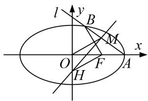

[破题思路] 由题目条件垂直于直线 $l$ 的直线与 $l$ 交于点 $M$ ，与 $y$ 轴交于点 $H$ ，利用 $k \cdot k_{MH} = -1$ ，建立关于 $k$ 的两条直线方程，由题目条件 $\angle MOA \leq \angle MAO$ ，利用三角形的大角对大边，建立关于 $x_M$ 的不等式，利用题目条件 $BF \perp HF$ ，即 $\overrightarrow{BF} \cdot \overrightarrow{HF} = 0$ 建立关系式.

# [规范解答]  
（1）由题意可知 $|OF|=c=\sqrt{a^{2}-3}$ ，又 $|OA|-|OF|=1$ ，所以 $a-\sqrt{a^{2}-3}=1$ ，解得a=2，
所以椭圆的方程为 $\frac{x^{2}}{4}+\frac{y^{2}}{3}=1$ ，离心率 $e=\frac{c}{a}=\frac{1}{2}$ .  
（2）设 $M(x_{M}, y_{M})$ ，易知 $A(2, 0)$ ，在 $\triangle MAO$ 中， $\angle MOA \leq \angle MAO \Leftrightarrow |MA| \leq |MO|$ ,
即 $(x_{M}-2)^{2}+y_{M}^{2}\leq x_{M}^{2}+y_{M}^{2}$ ，化简得 $x_{M}\geq1$ .
设直线 l 的斜率为 $k(k \neq 0)$ ，则直线 l 的方程为 $y = k(x - 2)$ .
设 $B(x_{B},y_{B})$ ，联立 $\left\{ \begin{array}{l} \frac{x^2}{4} +\frac{y^2}{3} = 1,\\ y = k(x - 2) \end{array} \right.$ 消去 $y$ ，整理得 $(4k^{2} + 3)x^{2} - 16k^{2}x + 16k^{2} - 12 = 0,$
解得 x=2 或 $x=\frac{8k^{2}-6}{4k^{2}+3}$ . 由题意得 $x_{B}=\frac{8k^{2}-6}{4k^{2}+3}$ ，从而 $y_{B}=\frac{-12k}{4k^{2}+3}$ .
由（1）知 $F(1, 0)$ ，设 $H(0, y_{H})$ ，则 $\overrightarrow{FH}=(-1, y_{H})$ ， $\overrightarrow{BF}=\left(\frac{9-4k^{2}}{4k^{2}+3}, \frac{12k}{4k^{2}+3}\right)$ .
由 $BF \perp HF$ ，得 $\overrightarrow{BF} \cdot \overrightarrow{FH} = 0$ ，即 $\frac{4k^{2}-9}{4k^{2}+3} + \frac{12ky_{H}}{4k^{2}+3} = 0$ ，解得 $y_{H} = \frac{9-4k^{2}}{12k}$ ,
所以直线 MH 的方程为 $y=-\frac{1}{k}x+\frac{9-4k^{2}}{12k}$ .
由 $\left\{\begin{aligned}y&=k(x-2),\\ y&=-\frac{1}{k}x+\frac{9-4k^{2}}{12k},\end{aligned}\right.$ 消去y，得 $x_{M}=\frac{20k^{2}+9}{12(k^{2}+1)}$ .
由 $x_{M} \geq 1$ ，得 $\frac{20k^2 + 9}{12(k^2 + 1)} \geq 1$ ，解得 $k \leq -\frac{\sqrt{6}}{4}$ 或 $k \geq \frac{\sqrt{6}}{4}$ ，
所以直线 l 的斜率的取值范围为 $\left[-\infty, -\frac{\sqrt{6}}{4}\right] \cup \left[\frac{\sqrt{6}}{4}, +\infty\right]$ .

[题后悟通] 利用已知条件中的几何关系构建目标不等式的核心是用转化与化归的数学思想，将几何关系转化为代数不等式，从而构建出目标不等式.

[例 2] 已知 A 是椭圆 $E: \frac{x^{2}}{t} + \frac{y^{2}}{3} = 1 (t > 3)$ 的左顶点，斜率为 $k (k > 0)$ 的直线交 E 于 A，M 两点，点 N 在 E 上， $MA \perp NA$ .  
（1）当 t=4， $|AM|=|AN|$ 时，求 $\triangle AMN$ 的面积；  
（2）当 $2|AM|=|AN|$ 时，求 k 的取值范围.
> 

> 
> | 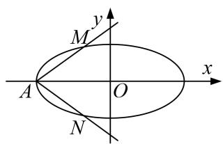 | 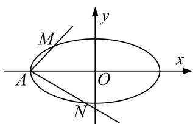 |
> | --- | --- |
> | （1）图 | （2）图 |
> 

[破题思路] （1）求 $\triangle AMN$ 的面积，想到三角形的面积公式 $S=\frac{1}{2}\times\text{底}\times\text{高或}S=\frac{1}{2}absin C$ ，题目条件中给出“ $MA \perp NA, |AM|=|AN|$ ”，得 $\triangle AMN$ 为等腰直角三角形，故可利用面积 $S=\frac{1}{2}|AM||AN|$ 求解。到此就缺少 $|AM|$ ， $|AN|$ 的值，由于 $A$ 点已知，故想法求 $M, N$ 的坐标。  
（2）题目条件中给出 $2|AM| = |AN|$ ，可利用此条件建立 $t$ 与 $k$ 的关系式，缺少关于 $k$ 的不等式，想到 $t > 3$ 即可建立 $k$ 的不等式.

# [规范解答]  
（1）由 $|AM|=|AN|$ ，可得M，N关于x轴对称，由 $MA\perp NA$ ，可得直线AM的斜率k为1.
因为 t=4，所以 $A(-2,0)$ ，所以直线 AM 的方程为 $y=x+2$ ，
代入椭圆方程 $\frac{x^{2}}{4}+\frac{y^{2}}{3}=1$ ，可得 $7x^{2}+16x+4=0$ ，解得x=-2或 $x=-\frac{2}{7}$
所以 $M\left(-\frac{2}{7}, \frac{12}{7}\right)$ ， $N\left(-\frac{2}{7}, -\frac{12}{7}\right)$ ，则 $\triangle AMN$ 的面积为 $\frac{1}{2} \times \frac{24}{7} \times \left(-\frac{2}{7} + 2\right) = \frac{144}{49}$ .  
（2）由题意知 t>3, k>0, $A(-\sqrt{t}, 0)$ ,
将直线 $AM$ 的方程 $y = k(x + \sqrt{t})$ 代入 $\frac{x^2}{t} +\frac{y^2}{3} = 1$ 得 $(3 + tk^{2})x^{2} + 2\sqrt{t}\cdot tk^{2}x + t^{2}k^{2} - 3t = 0,$
设 $M(x_{1},y_{1})$ ，则 $x_{1}\cdot (-\sqrt{t}) = \frac{t^{2}k^{2} - 3t}{3 + tk^{2}}$ ，即 $x_{1} = \frac{\sqrt{t}(3 - tk^{2})}{3 + tk^{2}}$ ，故 $|AM| = |x_1 + \sqrt{t} |\sqrt{1 + k^2} = \frac{6\sqrt{t(1 + k^2)}}{3 + tk^2}.$
由题设知，直线 AN 的方程为 $y=-\frac{1}{k}(x+\sqrt{t})$ ，故同理可得 $|AN|=\frac{6k\sqrt{t(1+k^{2})}}{3k^{2}+t}$ .
由 $2|AM|=|AN|$ ，得 $\frac{2}{3+tk^{2}}=\frac{k}{3k^{2}+t}$ ，即 $(k^{3}-2)t=3k(2k-1)$ .
当 $k=\sqrt[3]{2}$ 时上式不成立，因此 $t=\frac{3k(2k-1)}{k^{3}-2}$ . 由 t>3，得 $\frac{3k(2k-1)}{k^{3}-2}>3$ ,
所以 $\frac{k^3 - 2k^2 + k - 2}{k^3 - 2} = \frac{(k - 2)(k^2 + 1)}{k^3 - 2} < 0$ ，即 $\frac{k - 2}{k^3 - 2} < 0$ 。由此得 $\left\{ \begin{array}{l} k - 2 > 0, \\ k^3 - 2 < 0 \end{array} \right.$ 或 $\left\{ \begin{array}{l} k - 2 < 0, \\ k^3 - 2 > 0, \end{array} \right.$ 解得 $\sqrt[3]{2} < k < 2$ 。因此 k 的取值范围是 $(\sqrt[3]{2}, 2)$ .

[题后悟通] 解决本题第（2）问时，通过已知条件 $2|AM|=|AN|$ 得到参数k与参数t之间的关系，往往会忽视题目中的已知条件t>3，不能建立关于k的不等式，从而导致问题无法求解．利用题目中隐藏的已知参数的范围求新参数的范围问题的核心是建立两个参数之间的等量关系，将新参数的范围转化为已知参数的范围问题.

[例 3] 已知椭圆 $\frac{x^{2}}{a^{2}}+\frac{y^{2}}{b^{2}}=1(a>b>0)$ 的左、右焦点分别为 $F_{1}$ ， $F_{2}$ ，且 $|F_{1}F_{2}|=6$ ，直线 y=kx 与椭圆交于 A，B 两点.  
（1）若 $\triangle AF_{1}F_{2}$ 的周长为16，求椭圆的标准方程；  
（2）若 $k = \frac{\sqrt{2}}{4}$ ，且 $A, B, F_{1}, F_{2}$ 四点共圆，求椭圆离心率 $\mathbf{e}$ 的值；  
（3）在（2）的条件下，设 $P(x_0, y_0)$ 为椭圆上一点，且直线 $PA$ 的斜率 $k_1 \in (-2, -1)$ ，试求直线 $PB$ 的斜率 $k_2$ 的取值范围.

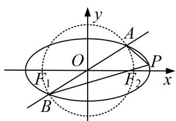

[规范解答] （1）由题意得 c=3，根据 $2a+2c=16$ ，得 a=5.

结合 $a^{2}=b^{2}+c^{2}$ ，解得 $a^{2}=25,\ b^{2}=16$ 。所以椭圆的方程为 $\frac{x^{2}}{25}+\frac{y^{2}}{16}=1$ 。  
（2）法一：由 $\left\{ \begin{array}{l} \frac{x^2}{a^2} + \frac{y^2}{b^2} = 1, \\ y = \frac{\sqrt{2}}{4} x, \end{array} \right.$ 得 $\left(b^2 + \frac{1}{8} a^2\right)x^2 - a^2 b^2 = 0.$
设 $A(x_{1},y_{1}),B(x_{2},y_{2})$ ，所以 $x_{1} + x_{2} = 0$ ， $x_{1}x_{2} = \frac{-a^{2}b^{2}}{b^{2} + \frac{1}{8}a^{2}}$ ，由 $AB$ ， $F_{1}F_{2}$ 互相平分且共圆，

易知， $AF_{2}\perp BF_{2}$ ，因为 $\overrightarrow{F_{2}A}=(x_{1}-3,y_{1})$ ， $\overrightarrow{F_{2}B}=(x_{2}-3,y_{2})$
所以 $\overrightarrow{F_2A} \cdot \overrightarrow{F_2B} = (x_1 - 3)(x_2 - 3) + y_1y_2 = \left(1 + \frac{1}{8}\right)x_1x_2 + 9 = 0.$
即 $x_{1}x_{2}=-8$ ，所以有 $\frac{-a^{2}b^{2}}{b^{2}+\frac{1}{8}a^{2}}=-8$ ，结合 $b^{2}+9=a^{2}$ ，解得 $a^{2}=12(a^{2}=6$ 舍去），
所以离心率 $e = \frac{\sqrt{3}}{2}$ . (若设 $A(x_{1}, y_{1})$ , $B(-x_{1}, -y_{1})$ 相应给分)

法二：设 $A(x_{1}, y_{1})$ ，又 AB， $F_{1}F_{2}$ 互相平分且共圆，
所以 $AB$ ， $F_{1}F_{2}$ 是圆的直径，所以 $x_{1}^{2} + y_{1}^{2} = 9$ ，又由椭圆及直线方程综合可得： $\left\{ \begin{array}{l}x_1^2 +y_1^2 = 9,\\ y_1 = \frac{\sqrt{2}}{4} x_1,\\ \frac{x_1^2}{a^2} +\frac{y_1^2}{b^2} = 1. \end{array} \right.$
由前两个方程解得 $x_{1}^{2}=8,\quad y_{1}^{2}=1$ ，将其代入第三个方程并结合 $b^{2}=a^{2}-c^{2}=a^{2}-9$ ，解得 $a^{2}=12$ ，故 $e=\frac{\sqrt{3}}{2}$ .  
（3）由（2）的结论知，椭圆方程为 $\frac{x^{2}}{12}+\frac{y^{2}}{3}=1$ ，由题可设 $A(x_{1},y_{1})$ ， $B(-x_{1},-y_{1})$
$k_{1}=\frac{y_{0}-y_{1}}{x_{0}-x_{1}},\quad k_{2}=\frac{y_{0}+y_{1}}{x_{0}+x_{1}}$ ，所以 $k_{1}k_{2}=\frac{y_{0}^{2}-y_{1}^{2}}{x_{0}^{2}-x_{1}^{2}}$ ，又 $\frac{y_{0}^{2}-y_{1}^{2}}{x_{0}^{2}-x_{1}^{2}}=\frac{3\left(1-\frac{x_{0}^{2}}{12}\right)-3\left(1-\frac{x_{1}^{2}}{12}\right)}{x_{0}^{2}-x_{1}^{2}}=-\frac{1}{4},$
即 $k_{2}=-\frac{1}{4k_{1}}$ ，由 $-2<k_{1}<-1$ 可知， $\frac{1}{8}<k_{2}<\frac{1}{4}$ 。即直线 PB 的斜率 $k_{2}$ 的取值范围是 $\left(\frac{1}{8},\frac{1}{4}\right)$ 。

[例 4] 设 $F_{1}, F_{2}$ 分别是椭圆 $E: \frac{x^{2}}{4} + \frac{y^{2}}{b^{2}} = 1 (b > 0)$ 的左、右焦点，若 P 是该椭圆上的一个动点，且 $\overrightarrow{PF_{1}} \cdot \overrightarrow{PF_{2}}$ 的最大值为 1.  
（1）求椭圆 E 的方程;  
（2）设直线 $l: x = ky - 1$ 与椭圆 $E$ 交于不同的两点 $A, B$ , 且 $\angle AOB$ 为锐角 ( $O$ 为坐标原点), 求 $k$ 的取值范围.

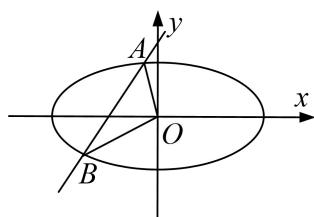

[规范解答] （1） 易知 $a = 2$ ， $c = \sqrt{4 - b^2}$ ， $b^2 < 4$ ，所以 $F_1(-\sqrt{4 - b^2}, 0)$ ， $F_2(\sqrt{4 - b^2}, 0)$ ，
设 $P(x, y)$ ，则 $\overrightarrow{PF_{1}}\cdot\overrightarrow{PF_{2}}=(-\sqrt{4-b^{2}}-x,-y)\cdot(\sqrt{4-b^{2}}-x,-y)$
$= x ^ {2} + y ^ {2} - 4 + b ^ {2} = x ^ {2} + b ^ {2} - \frac {b ^ {2} x ^ {2}}{4} - 4 + b ^ {2} = \left(1 - \frac {b ^ {2}}{4}\right) x ^ {2} + 2 b ^ {2} - 4.$
因为 $x \in [-2, 2]$ ，故当 $x = \pm 2$ ，即点 P 为椭圆长轴端点时， $\overrightarrow{PF_{1}} \cdot \overrightarrow{PF_{2}}$ 有最大值 1，
即 $1 = \left(1 - \frac{b^2}{4}\right) \times 4 + 2b^2 - 4$ ，解得 $b^2 = 1$ 。故所求椭圆 $E$ 的方程为 $\frac{x^2}{4} + y^2 = 1$ .  
（2）设 $A(x_{1},y_{1})$ ， $B(x_{2},y_{2})$ ，由 $\left\{ \begin{array}{l}x = ky - 1\\ \frac{x^2}{4} +y^2 = 1 \end{array} \right.$ 得
$(k^{2}+4)y^{2}-2ky-3=0,\quad\Delta=(-2k)^{2}+12(4+k^{2})=16k^{2}+48>0,\quad\text{故 }y_{1}+y_{2}=\frac{2k}{k^{2}+4},\quad y_{1}\cdot y_{2}=\frac{-3}{k^{2}+4}.$
又 $\angle AOB$ 为锐角，故 $\overrightarrow{OA}\cdot\overrightarrow{OB}=x_{1}x_{2}+y_{1}y_{2}>0$ ，又 $x_{1}x_{2}=(ky_{1}-1)(ky_{2}-1)=k^{2}y_{1}y_{2}-k(y_{1}+y_{2})+1$ ，
所以 $x_{1}x_{2}+y_{1}y_{2}=(1+k^{2})y_{1}y_{2}-k(y_{1}+y_{2})+1=(1+k^{2})\cdot\frac{-3}{4+k^{2}}-\frac{2k^{2}}{4+k^{2}}+1$
$= \frac{-3 - 3k^2 - 2k^2 + 4 + k^2}{4 + k^2} = \frac{1 - 4k^2}{4 + k^2} >0$ ，所以 $k^2 < \frac{1}{4}$ ，解得 $-\frac{1}{2} < k < \frac{1}{2},$
故 k 的取值范围是 $\left(-\frac{1}{2}, \frac{1}{2}\right)$ .

[例5] 已知 $C$ 为圆 $(x + 1)^2 + y^2 = 8$ 的圆心， $P$ 是圆上的动点，点 $Q$ 在圆的半径 $CP$ 上，且有点 $A(1,0)$ 和 $AP$ 上的点 $M$ ，满足 $\overrightarrow{MQ} \cdot \overrightarrow{AP} = 0$ ， $\overrightarrow{AP} = 2\overrightarrow{AM}$ .  
（1）当点 P 在圆上运动时，求点 Q 的轨迹方程；  
（2）若斜率为 $k$ 的直线 $l$ 与圆 $x^{2} + y^{2} = 1$ 相切，与（1）中所求点 $Q$ 的轨迹交于不同的两点 $F, H, O$ 是坐标原点，且 $\frac{3}{4} \leq \overrightarrow{OF} \cdot \overrightarrow{OH} \leq \frac{4}{5}$ ，求 $k$ 的取值范围.

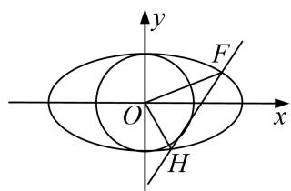

[规范解答] （1）由题意知 $MQ$ 是线段 $AP$ 的垂直平分线，
所以 $|CP|=|QC|+|QP|=|QC|+|QA|=2\sqrt{2}>|CA|=2,$
所以点 Q 的轨迹是以点 C, A 为焦点，焦距为 2，长轴长为 $2\sqrt{2}$ 的椭圆，
所以 $a=\sqrt{2}$ ，c=1， $b=\sqrt{a^{2}-c^{2}}=1$ ，故点 Q 的轨迹方程是 $\frac{x^{2}}{2}+y^{2}=1$ .  
（2）设直线 $l: y = kx + t, F(x_1, y_1), H(x_2, y_2)$ ，直线 $l$ 与圆 $x^2 + y^2 = 1$ 相切 $\Rightarrow \frac{|t|}{\sqrt{k^2 + 1}} = 1 \Rightarrow t^2 = k^2 + 1$ .
联立 $\left\{\begin{aligned}\frac{x^{2}}{2}+y^{2}=1,\\ y=kx+t\end{aligned}\right.$ $\Rightarrow(1+2k^{2})x^{2}+4ktx+2t^{2}-2=0,$
则 $\Delta=16k^{2}t^{2}-4(1+2k^{2})(2t^{2}-2)=8(2k^{2}-t^{2}+1)=8k^{2}>0\Rightarrow k\neq0,\quad x_{1}+x_{2}=\frac{-4kt}{1+2k^{2}},\quad x_{1}x_{2}=\frac{2t^{2}-2}{1+2k^{2}}$ 所以 $\overrightarrow{OF} \cdot \overrightarrow{OH} = x_1x_2 + y_1y_2 = (1 + k^2)x_1x_2 + kt(x_1 + x_2) + t^2 = \frac{(1 + k^2)(2t^2 - 2)}{1 + 2k^2} + kt\frac{-4kt}{1 + 2k^2} + t^2$
$= \frac {(1 + k ^ {2}) 2 k ^ {2}}{1 + 2 k ^ {2}} - \frac {4 k ^ {2} (k ^ {2} + 1)}{1 + 2 k ^ {2}} + k ^ {2} + 1 = \frac {1 + k ^ {2}}{1 + 2 k ^ {2}},$
所以 $\frac{3}{4} < \frac{1 + k^2}{1 + 2k^2} < \frac{4}{5} \Rightarrow \frac{1}{3} < k^2 < \frac{1}{2} \Rightarrow \frac{\sqrt{3}}{3} \leq |k| \leq \frac{\sqrt{2}}{2}$ ，所以 $-\frac{\sqrt{2}}{2} \leq k \leq -\frac{\sqrt{3}}{3}$ 或 $\frac{\sqrt{3}}{3} \leq k \leq \frac{\sqrt{2}}{2}$ .
故 $k$ 的取值范围是 $\left[-\frac{\sqrt{2}}{2}, -\frac{\sqrt{3}}{3}\right] \cup \left[\frac{\sqrt{3}}{3}, \frac{\sqrt{2}}{2}\right]$ .

[例 6] 已知 M 为椭圆 $C: \frac{x^{2}}{25} + \frac{y^{2}}{9} = 1$ 上的动点，过点 M 作 x 轴的垂线，垂足为 D，点 P 满足 $\overrightarrow{PD} = \frac{5}{3} \overrightarrow{MD}$ .  
（1）求动点 P 的轨迹 E 的方程;  
（2）若 A, B 两点分别为椭圆 C 的左、右顶点，F 为椭圆 C 的左焦点，直线 PB 与椭圆 C 交于点 Q，直线 QF，PA 的斜率分别为 $k_{QF}$ ， $k_{PA}$ ，求 $\frac{k_{QF}}{k_{PA}}$ 的取值范围.

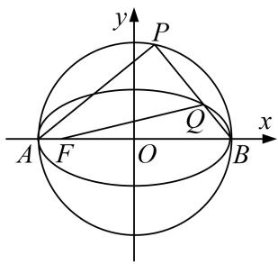

[规范解答] （1） 设 $P(x, y)$ ， $M(m, n)$ ，依题意知 $D(m, 0)$ ，且 $y \neq 0$ .
由 $\overrightarrow{PD}=\frac{5}{3}\overrightarrow{MD}$ ，得 $(m-x,-y)=\frac{5}{3}(0,-n)$ ，则有 $\left\{\begin{aligned}m-x&=0,\\ -y&=-\frac{5}{3}n\end{aligned}\right.\Rightarrow\left\{\begin{aligned}m&=x,\\ n&=\frac{3}{5}y.\end{aligned}\right.$
又 $M(m, n)$ 为椭圆 C: $\frac{x^{2}}{25} + \frac{y^{2}}{9} = 1$ 上的点， $\therefore \frac{x^{2}}{25} + \frac{\left(\frac{3}{5}y\right)^{2}}{9} = 1$ ，即 $x^{2} + y^{2} = 25$ ，
故动点 P 的轨迹 E 的方程为 $x^{2}+y^{2}=25(y\neq0)$ .  
（2）依题意知 $A(-5,0)$ ， $B(5,0)$ ， $F(-4,0)$ ，设 $Q(x_{0},y_{0})$ ，
∵线段 AB 为圆 E 的直径，∴ $AP \perp BP$ ，设直线 PB 的斜率为 $k_{PB}$ ，
则 $\frac{k_{QF}}{k_{PA}}=\frac{k_{QF}}{-\frac{1}{k_{PB}}}=-k_{QF}k_{PB}=-k_{QF}k_{QB}=-\frac{y_{0}}{x_{0}+4}\cdot\frac{y_{0}}{x_{0}-5}=-\frac{y_{0}^{2}}{(x_{0}+4)(x_{0}-5)}$
$= - \frac {9 \left(1 - \frac {x _ {0} ^ {2}}{2 5}\right)}{(x _ {0} + 4) (x _ {0} - 5)} = \frac {\frac {9}{2 5} (x _ {0} ^ {2} - 2 5)}{(x _ {0} + 4) (x _ {0} - 5)} = \frac {\frac {9}{2 5} (x _ {0} + 5)}{x _ {0} + 4} = \frac {9}{2 5} \left(1 + \frac {1}{x _ {0} + 4}\right),$
∵点 P 不同于 A，B 两点且直线 QF 的斜率存在，∴-5<x\_{0}<5 且 x\_{0}≠-4，
又 $y=\frac{1}{x+4}$ 在 $(-5,-4)$ 和 $(-4,5)$ 上都是减函数，∴ $\frac{9}{25}\left(1+\frac{1}{x_{0}+4}\right)\in(-\infty,0)\cup\left(\frac{2}{5},+\infty\right)$ ,
故 $\frac{k_{QF}}{k_{PA}}$ 的取值范围是 $(-∞, 0)∪\left(\frac{2}{5}, +∞\right)$ .

# 【对点训练】

1. 已知椭圆 $C$ 的两个焦点为 $F_{1}(-1, 0)$ , $F_{2}(1, 0)$ , 且经过点 $E(\sqrt{3}, \frac{\sqrt{3}}{2})$ .  
（1）求椭圆 C 的方程;  
（2）过点 $F_{1}$ 的直线 l 与椭圆 C 交于 A, B 两点(点 A 位于 x 轴上方)，若 $\overrightarrow{AF_{1}} = \lambda \overrightarrow{F_{1}} \overrightarrow{B}$ ，且 $2 \leq \lambda < 3$ ，求直线 l 的斜率 k 的取值范围.

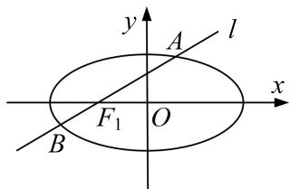

1. 解析 （1） 由 $\left\{ \begin{array}{l} a = |EF_1| + |EF_2| = 4, \\ a^2 = b^2 + c^2 \\ c = 1, \end{array} \right.$
解得 $\left\{\begin{aligned}a&=2,\\ c&=1,\\ b&=\sqrt{3},\end{aligned}\right.$
所以椭圆 C 的方程为 $\frac{x^{2}}{4} + \frac{y^{2}}{3} = 1$ .  
（2）由题意得直线 l 的方程为 $y=k(x+1)(k>0)$ ,
联立方程，得 $\left\{ \begin{array}{l} y = k(x + 1), \\ \frac{x^2}{4} + \frac{y^2}{3} = 1, \end{array} \right.$ 整理得 $(\frac{3}{k^2} + 4)y^2 - \frac{6}{k}y - 9 = 0, \Delta = \frac{144}{k^2} + 144 > 0,$
设 $A(x_{1}, y_{1})$ ， $B(x_{2}, y_{2})$ ，则 $y_{1} + y_{2} = \frac{6k}{3 + 4k^{2}}$ ， $y_{1}y_{2} = \frac{-9k^{2}}{3 + 4k^{2}}$
又 $\overrightarrow{AF_{1}}=\lambda\overrightarrow{F_{1}B}$ ，所以 $y_{1}=-\lambda y_{2}$ ，所以 $y_{1}y_{2}=\frac{-\lambda}{(1-\lambda)^{2}}(y_{1}+y_{2})^{2}$ ，则 $\frac{(1-\lambda)^{2}}{\lambda}=\frac{4}{3+4k^{2}}$ ， $\lambda+\frac{1}{\lambda}-2=\frac{4}{3+4k^{2}}$ 因为 $2 \leq \lambda < 3$ ，所以 $\frac{1}{2} \leq \lambda + \frac{1}{\lambda} - 2 < \frac{4}{3}$ ，即 $\frac{1}{2} \leq \frac{4}{3 + 4k^{2}} < \frac{4}{3}$ ，且 k > 0，解得 $0 < k \leq \frac{\sqrt{5}}{2}$ .
故直线 l 的斜率 k 的取值范围是 $(0, \frac{\sqrt{5}}{2}]$ .

2. 已知椭圆 $\frac{x^2}{a^2} + \frac{y^2}{b^2} = 1 (a > b > 0)$ 的左焦点为 $F(-c, 0)$ ，离心率为 $\frac{\sqrt{3}}{3}$ ，点 $M$ 在椭圆上且位于第一象限，直线 $FM$ 被圆 $x^2 + y^2 = \frac{b^2}{4}$ 截得的线段的长为 $c$ ， $|FM| = \frac{4\sqrt{3}}{3}$ .  
（1）求直线 FM 的斜率;  
（2）求椭圆的方程;  
（3）设动点 $P$ 在椭圆上，若直线 $FP$ 的斜率大于 $\sqrt{2}$ ，求直线 $OP(O$ 为原点)的斜率的取值范围.

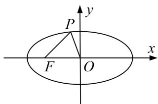

2. 解析 （1）由已知，有 $\frac{c^2}{a^2} = \frac{1}{3}$ ，又由 $a^2 = b^2 + c^2$ ，可得 $a^2 = 3c^2$ ， $b^2 = 2c^2$ .
设直线 FM 的斜率为 $k(k>0)$ ， $F(-c,0)$ ，则直线 FM 的方程为 $y=k(x+c)$ .
由已知，有 $\left(\frac{kc}{\sqrt{k^{2}+1}}\right)^{2}+\left(\frac{c}{2}\right)^{2}=\left(\frac{b}{2}\right)^{2}$ ，解得 $k=\frac{\sqrt{3}}{3}$ .  
（2）由（1）得椭圆方程为 $\frac{x^{2}}{3c^{2}}+\frac{y^{2}}{2c^{2}}=1$ ，直线FM的方程为 $y=\frac{\sqrt{3}}{3}(x+c)$ ,

两个方程联立，消去 y，整理得 $3x^{2}+2cx-5c^{2}=0$ ，解得 $x=-\frac{5}{3}c$ ，或 x=c.
因为点 M 在第一象限，可得 M 的坐标为 $\left\{c, \frac{2\sqrt{3}}{3}c\right\}$ .
由 $|FM|=\sqrt{(c+c)^{2}+\left(\frac{2\sqrt{3}}{3}c-0\right)2}=\frac{4\sqrt{3}}{3}$ ，解得c=1，所以椭圆的方程为 $\frac{x^{2}}{3}+\frac{y^{2}}{2}=1$ .  
（3）设点 P 的坐标为 $(x, y)$ ，直线 FP 的斜率为 t，得 $t = \frac{y}{x + 1}$ ，即 $y = t(x + 1)(x \neq -1)$ ，与椭圆方程联立 $\left\{\begin{aligned}y &= t(x + 1), \\ \frac{x^{2}}{3} &= \frac{y^{2}}{2} = 1,\end{aligned}\right.$ 消去 y，整理得 $2x^{2} + 3t^{2}(x + 1)^{2} = 6$ ,
又由已知，得 $t=\sqrt{\frac{6-2x^{2}}{3(x+1)^{2}}}\geq\sqrt{2}$ ，解得 $-\frac{3}{2}<x<-1$ ，或 -1<x<0。
设直线 OP 的斜率为 m，得 $m=\frac{y}{x}$ ，即 $y=mx(x\neq0)$ ，与椭圆方程联立，整理得 $m^{2}=\frac{2}{x^{2}}-\frac{2}{3}$ .

①当 $x \in \left(-\frac{3}{2}, -1\right)$ 时，有 $y = t(x + 1) < 0$ ，因此 m > 0，于是 $m = \sqrt{\frac{2}{x^{2}} - \frac{2}{3}}$ ，得 $m \in \left(\frac{\sqrt{2}}{3}, \frac{2\sqrt{3}}{3}\right)$ .

②当 $x \in (-1, 0)$ 时，有 $y = t(x + 1) > 0$ ，因此 $m < 0$ ，于是 $m = -\sqrt{\frac{2}{x^2} - \frac{2}{3}}$ ，得 $m \in \left(-\infty, -\frac{2\sqrt{3}}{3}\right)$ .

综上，直线 OP 的斜率的取值范围是 $\left(-\infty, -\frac{2\sqrt{3}}{3}\right) \cup \left(\frac{\sqrt{2}}{3}, \frac{2\sqrt{3}}{3}\right)$ .

3. 已知椭圆 $C: \frac{y^2}{a^2} + \frac{x^2}{b^2} = 1 (a > b > 0)$ 的离心率为 $\frac{\sqrt{6}}{3}$ , 且椭圆 $C$ 上的点到一个焦点的距离的最小值为 $\sqrt{3} - \sqrt{2}$ .  
（1）求椭圆 C 的方程;  
（2）已知过点 $T(0, 2)$ 的直线 $l$ 与椭圆 $C$ 交于 $A, B$ 两点，若在 $x$ 轴上存在一点 $E$ ，使 $\angle AEB = 90^{\circ}$ ，求直线 $l$ 的斜率 $k$ 的取值范围.

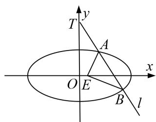

3. 解析 （1） 设椭圆的半焦距长为 $c$ ，则由题设有： $\left\{ \begin{array}{l} c = \frac{\sqrt{6}}{3}, \\ a - c = \sqrt{3} - \sqrt{2}, \end{array} \right.$
解得： $a=\sqrt{3}$ ， $c=\sqrt{2}$ ， $\therefore b^{2}=1$ ，故椭圆 C 的方程为 $\frac{y^{2}}{3}+x^{2}=1$ .  
（2）由已知可得，以 AB 为直径的圆与 x 轴有公共点．设 $A(x_{1}, y_{1})$ ， $B(x_{2}, y_{2})$ ，AB 中点为 $M(x_{0}, y_{0})$ ，将直线 $l: y = kx + 2$ 代入 $\frac{y^{2}}{3} + x^{2} = 1$ ，得 $(3 + k^{2})x^{2} + 4kx + 1 = 0$ ， $\Delta = 12k^{2} - 12$ ，
$\therefore x _ {0} = \frac {x _ {1} + x _ {2}}{2} = \frac {- 2 k}{3 + k ^ {2}}, y _ {0} = k x _ {0} + 2 = \frac {6}{3 + k ^ {2}}, | A B | = \sqrt {1 + k ^ {2}} \frac {\sqrt {1 2 k ^ {2} - 1 2}}{3 + k ^ {2}} = \frac {2 \sqrt {3} \sqrt {k ^ {4} - 1}}{3 + k ^ {2}},$
$\therefore \left\{ \begin{array}{l} A = 12k^2 - 12 > 0, \\ \frac{6}{3 + k^2} \leq \frac{1}{2} |AB|. \end{array} \right.$ 解得： $k^4 \geq 13$ ，即 $k \geq \sqrt[4]{13}$ 或 $k \leq -\sqrt[4]{13}$ .

4. 在圆 $x^{2} + y^{2} = 9$ 上任取一点 $P$ , 过点 $P$ 作 $x$ 轴的垂线段 $PD$ , $D$ 为垂足. 点 $M$ 在线段 $DP$ 上, 满足 $\frac{|DM|}{|DP|} = \frac{2}{3}$ . 当点 $P$ 在圆上运动时, 设点 $M$ 的轨迹为曲线 $C$ .  
（1）求曲线 C 的方程;  
（2）若直线 $y = m(x + 5)$ 上存在点 $Q$ ，使得过点 $Q$ 作曲线 $C$ 的两条切线相互垂直，求实数 $m$ 的取值范围.

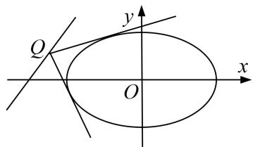

4. 解析 （1）设点 M 的坐标为 $(x, y)$ ，点 P 的坐标为 $(x_{0}, y_{0})$ 。由题意，得 $x = x_{0}$ ， $y = \frac{2}{3}y_{0}$ ，即 $x_{0} = x$ ， $y_{0} = \frac{3}{2}y$ 。
∵ 点 $P(x_{0}, y_{0})$ 在圆 $x^{2} + y^{2} = 9$ 上，所以 $x_{0}^{2} + y_{0}^{2} = 9$ .
将 $x_{0}=x,\quad y_{0}=\frac{3}{2}y$ 代入上式，得 $x^{2}+\frac{9}{4}y^{2}=9$ ，即 $\frac{x^{2}}{9}+\frac{y^{2}}{4}=1$ ．∴曲线 C 的方程为 $\frac{x^{2}}{9}+\frac{y^{2}}{4}=1(x\neq\pm3)$ .  
（2）①若两切线的斜率都存在，设点 $Q(x_{1}, y_{1})$ ，过 Q 的切线方程为 $y - y_{1} = k(x - x_{1})$ ，与 $\frac{x^{2}}{9} + \frac{y^{2}}{4} = 1$ 联立，消去 y 并整理，得 $(9k^{2} + 4)x^{2} + 18k(y_{1} - kx_{1})x + 9[(y_{1} - kx_{1})^{2} - 4] = 0$ .
由 $\Delta=0$ ，得 $[18k(y_{1}-kx_{1})]^{2}-4(9k^{2}+4)\cdot9[(y_{1}-kx_{1})^{2}-4]=0$ ， $36k^{2}-4y_{1}^{2}+8kx_{1}y_{1}-4k^{2}x_{1}^{2}+16=0$ ，
整理得 $(9-x_{1}^{2})k^{2}+2x_{1}y_{1}k+4-y_{1}^{2}=0.$
设两切线的斜率分别为 $k_{1}$ ， $k_{2}$ ，则 $k_{1} \cdot k_{2} = -1$ ，即 $k_{1} \cdot k_{2} = \frac{4 - y_{1}^{2}}{9 - x_{1}^{2}} = -1$ ，即 $x_{1}^{2} + y_{1}^{2} = 13 (x_{1} \neq \pm 3)$ .

②若两切线的斜率有一条不存在，则点 Q 的坐标为 $(\pm3, \pm2)$ ，满足 $x_{1}^{2} + y_{1}^{2} = 13$ .
即点 Q 的轨迹方程为 $x^{2}+y^{2}=13$ .
由题意知满足条件的点是直线 $y=m(x+5)$ 与圆 $x^{2}+y^{2}=13$ 的公共点.

圆心 $O(0, 0)$ 到直线 $y=m(x+5)$ 的距离 $d=\frac{|5m|}{\sqrt{1+m^{2}}}$ ,
由直线 $y=m(x+5)$ 和圆 $x^{2}+y^{2}=13$ 有公共点可知，距离 $d\leq r$ ，即 $\frac{|5m|}{\sqrt{1+m^{2}}}\leq\sqrt{13}$ ，解得 $-\frac{\sqrt{39}}{6}\leq m\leq\frac{\sqrt{39}}{6}$ .
故实数 m 的取值范围是 $\left[-\frac{\sqrt{39}}{6}, \frac{\sqrt{39}}{6}\right]$ .

5. 已知点 $P(0, -2)$ , 点 $A, B$ 分别为椭圆 $E: \frac{y^2}{a^2} + \frac{x^2}{b^2} = 1 (a > b > 0)$ 的左右顶点, 直线 $BP$ 交 $E$ 于点 $Q$ , $\triangle ABP$

是等腰直角三角形，且 $\overrightarrow{PQ}=\frac{3}{2}\overrightarrow{QB}$ .  
（1）求 E 的方程;  
（2）设过点 P 的动直线 l 与 E 相交于 M, N 两点，当坐标原点 O 位于 MN 以为直径的圆外时，求直线 l 斜率的取值范围.

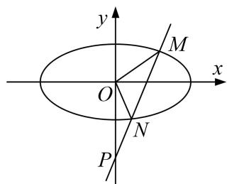

5. 解析 （1）由题意 $\triangle ABP$ 是等腰直角三角形， $a = 2, B(2, 0)$ ，设 $Q(x_0, y_0)$ ，由 $\overrightarrow{PQ} = \frac{3}{2}\overrightarrow{QB}$ ，则 $\left\{ \begin{array}{l} x_0 = \frac{6}{5}, \\ y_0 = -\frac{4}{5}, \end{array} \right.$ 代入椭圆方程，解得 $b^2 = 1$ ， $\therefore$ 椭圆方程为 $\frac{x^2}{4} + y^2 = 1$ .  
（2）由题意可知，直线 l 的斜率存在，方程为 y=kx-2， $M(x_{1},y_{1})$ ， $N(x_{2},y_{2})$
则 $\left\{\begin{aligned}y&=kx-2,\\ \frac{x^{2}}{4}&+y^{2}=1,\end{aligned}\right.$ 整理得 $(1+4k^{2})x^{2}-16kx+12=0,$
由直线 l 与 E 有两个不同的交点，则 $\Delta > 0$ ，即 $(-16k)^{2} - 4 \times 12 \times (1 + 4k^{2}) > 0$ ，解得 $k^{2} > \frac{3}{4}$ ,
由韦达定理可知 $x_{1}+x_{2}=\frac{16k}{1+4k^{2}}$ ， $x_{1}x_{2}=\frac{12}{1+4k^{2}}$
由坐标原点 O 位于 MN 为直径的圆外，则 $\overrightarrow{OM} \cdot \overrightarrow{ON} > 0$ ，即 $x_{1}x_{2} + y_{1}y_{2} > 0$ ，则
$x _ {1} x _ {2} + y _ {1} y _ {2} = x _ {1} x _ {2} + (k x _ {1} - 2) (k x _ {2} - 2) = (1 + k ^ {2}) x _ {1} x _ {2} - 2 k \times (x _ {1} + x _ {2}) + 4 = (1 + k ^ {2}) \frac {1 2}{1 + 4 k ^ {2}} - 2 k \times \frac {1 6 k}{1 + 4 k ^ {2}} + 4 > 0,$
解得 $k^{2}<4$ ，综上可知 $\frac{3}{4}<k^{2}<4$ ，解得 $\frac{\sqrt{3}}{2}<k<2$ 或 $-2<k<-\frac{\sqrt{3}}{2}$ ,

直线 l 斜率的取值范围 $\left(-2, -\frac{\sqrt{3}}{2}\right) \cup \left(\frac{\sqrt{3}}{2}, 2\right)$ .

6. 已知右焦点为 $F_{2}(c, 0)$ 的椭圆 $C: \frac{x^{2}}{a^{2}} + \frac{y^{2}}{b^{2}} = 1 (a > b > 0)$ 过点 $\left(1, \frac{3}{2}\right)$ ，且椭圆 $C$ 关于直线 $x = c$ 对称的图形过坐标原点.  
（1）求椭圆 C 的方程;  
（2）过点 $\left(\frac{1}{2},0\right)$ 作直线l与椭圆C交于E，F两点，线段EF的中点为M，点A是椭圆C的右顶点，求直线MA的斜率k的取值范围.

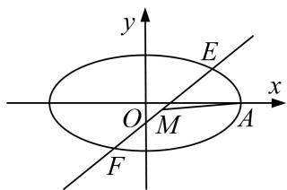

6. 解析 （1） $\because$ 椭圆 $C$ 过点 $\left(1, \frac{3}{2}\right)$ , $\therefore \frac{1}{a^2} + \frac{9}{4b^2} = 1$ , ①
∵椭圆 C 关于直线 x=c 对称的图形过坐标原点，∴a=2c，∵ $a^{2}=b^{2}+c^{2}$ ，∴ $b^{2}=\frac{3}{4}a^{2}$ ，②
由①②得 $a^{2}=4,\quad b^{2}=3,\quad$ ∴椭圆 C 的方程为 $\frac{x^{2}}{4}+\frac{y^{2}}{3}=1$ .  
（2）依题意，直线 l 过点 $\left(\frac{1}{2}, 0\right)$ 且斜率不为零，故可设其方程为 $x=my+\frac{1}{2}$ .
由方程组 $\left\{\begin{aligned}x&=my+\frac{1}{2},\\ \frac{x^{2}}{4}&+\frac{y^{2}}{3}=12\end{aligned}\right.$ 消去 x，并整理得 $4(3m^{2}+4)y^{2}+12my-45=0$ .
设 $E(x_{1}, y_{1})$ , $F(x_{2}, y_{2})$ , $M(x_{0}, y_{0})$ , $\therefore y_{1} + y_{2} = -\frac{3m}{3m^{2} + 4}$ , $\therefore y_{0} = \frac{y_{1} + y_{2}}{2} = -\frac{3m}{2 \cdot 3m^{2} + 4}$ ,
$\therefore x _ {0} = m y _ {0} + \frac {1}{2} = \frac {2}{3 m ^ {2} + 4}, \quad \therefore k = \frac {y _ {0}}{x _ {0} - 2} = \frac {m}{4 m ^ {2} + 4}.$

①当 m=0 时，k=0.

②当 $m \neq 0$ 时， $k = \frac{1}{4m + \frac{4}{m}}$ ，当 m > 0 时， $4m + \frac{4}{m} \geq 8$ ，∴ $0 < \frac{1}{4m + \frac{4}{m}} \leq \frac{1}{8}$ ，∴ $0 < k \leq \frac{1}{8}$ ，
当 m<0 时， $4m+\frac{4}{m}=-(-4m)+\frac{4}{-m}\leq-8,\quad\therefore-\frac{1}{8}\leq\frac{1}{4m+\frac{4}{m}}=k<0.\quad\therefore-\frac{1}{8}\leq k\leq\frac{1}{8}$ 且 $k\neq0$ .
综合①、②可知，直线 $MA$ 的斜率 $k$ 的取值范围是 $\left[-\frac{1}{8}, \frac{1}{8}\right]$ .

7. 在直角坐标系 $xOy$ 中，曲线 $C_1$ 上的任意一点 $M$ 到直线 $y = -1$ 的距离比 $M$ 点到点 $F(0,2)$ 的距离小 1.  
（1）求动点 M 的轨迹 $C_{1}$ 的方程;  
（2）若点 P 是圆 $C_{2}:(x-2)^{2}+(y+2)^{2}=1$ 上一动点，过点 P 作曲线 $C_{1}$ 的两条切线，切点分别为 A, B，求直线 AB 斜率的取值范围.

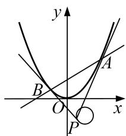

7. 解析 （1） 法一 设点 $M(x, y)$ ，∵ 点 M 到直线 y = -1 的距离等于 $|y + 1|$ ,
∴ $|y+1|=\sqrt{x^{2}+(y-2)^{2}}-1$ ，化简得 $x^{2}=8y$ ，
∴动点 M 的轨迹 $C_{1}$ 的方程为 $x^{2}=8y$ .

法二 由题意知 M 到直线 y = -2 的距离等于 M 到 $F(0, 2)$ 的距离，
由抛物线定义得动点 M 的轨迹方程为 $x^{2}=8y$ .  
（2）由题意可知，PA，PB 的斜率都存在，分别设为 $k_{1}$ ， $k_{2}$ ，切点 $A(x_{1}, y_{1})$ ， $B(x_{2}, y_{2})$ ，设点 $P(m, n)$ ，过点 P 的抛物线的切线方程为 $y = k(x - m) + n$ ，
联立 $\left\{\begin{aligned}y&=k(x-m)+n,\\ x^{2}&=8y\end{aligned}\right.$ 得 $x^{2}-8kx+8km-8n=0,$
$\because \Delta = 64k^{2} - 32km + 32n = 0$ ，即 $2k^{2} - km + n = 0$ ， $\therefore k_{1} + k_{2} = \frac{m}{2}, k_{1}k_{2} = \frac{n}{2}.$
由 $x^{2}=8y$ ，得 $y'=\frac{x}{4}$ ，∴ $x_{1}=4k_{1}$ ， $y_{1}=\frac{x_{1}^{2}}{8}=2k_{1}^{2}$ ， $x_{2}=4k_{2}$ ， $y_{2}=\frac{x_{2}^{2}}{8}=2k_{2}^{2}$
$\therefore k _ {A B} = \frac {y _ {2} - y _ {1}}{x _ {2} - x _ {1}} = \frac {2 k _ {2} ^ {2} - 2 k _ {1} ^ {2}}{4 k _ {2} - 4 k _ {1}} = \frac {k _ {2} + k _ {1}}{2} = \frac {m}{4},$
∵ 点 $P(m, n)$ 满足 $(x-2)^{2}+(y+2)^{2}=1$ ，∴ $1 \leq m \leq 3$ ，
$\therefore \frac{1}{4} \leq \frac{m}{4} \leq \frac{3}{4}$ ，即直线 $AB$ 斜率的取值范围为 $\left[\frac{1}{4}, \frac{3}{4}\right]$ .

