# 专题 23 参数及点的坐标(横或纵)型取值范围模型

# 【例题选讲】

[例1] (2019·全国II)已知 $F_{1}$ ， $F_{2}$ 是椭圆 $C: \frac{x^{2}}{a^{2}} + \frac{y^{2}}{b^{2}} = 1 (a > b > 0)$ 的两个焦点， $P$ 为 $C$ 上的点， $O$ 为坐标原点.  
（1）若 $\triangle POF_{2}$ 为等边三角形，求 $C$ 的离心率；  
（2）如果存在点 $P$ ，使得 $PF_{1} \perp PF_{2}$ ，且 $\triangle F_{1}PF_{2}$ 的面积等于16，求 $b$ 的值和 $a$ 的取值范围.
> 

> 
> | 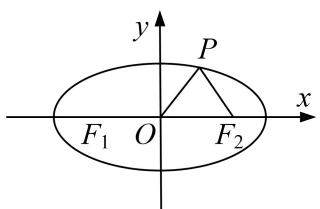 | 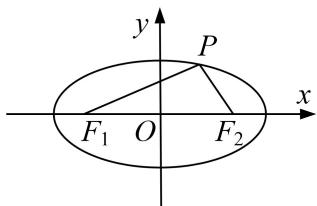 |
> | --- | --- |
> | （1）图 | （2）图 |
> 

[规范解答] （1）连接 $PF_{1}$ (图略). 由 $\triangle POF_{2}$ 为等边三角形可知，在 $\triangle F_{1}PF_{2}$ 中，
$\angle F_{1}PF_{2}=90^{\circ}, |PF_{2}|=c, |PF_{1}|=\sqrt{3}c$ ，于是 $2a=|PF_{1}|+|PF_{2}|=(\sqrt{3}+1)c,$
故 C 的离心率为 $e=\frac{c}{a}=\sqrt{3}-1$ .  
（2）由题意可知，若满足条件的点 $P(x, y)$ 存在，则 $\frac{1}{2}|y| \cdot 2c = 16$ ， $\frac{y}{x + c} \cdot \frac{y}{x - c} = -1$ ，
即 $c|y|=16$ ，①， $x^{2}+y^{2}=c^{2}$ ，②，又 $\frac{x^{2}}{a^{2}}+\frac{y^{2}}{b^{2}}=1$ 。③
由②③及 $a^{2}=b^{2}+c^{2}$ 得 $y^{2}=\frac{b^{4}}{c^{2}}$ . 又由①知 $y^{2}=\frac{16^{2}}{c^{2}}$ ，故 b=4.
由②③及 $a^2 = b^2 + c^2$ 得 $x^2 = \frac{a^2}{c^2} (c^2 - b^2)$ ，所以 $c^2 \geq b^2$ ，从而 $a^2 = b^2 + c^2 \geq 2b^2 = 32$ ，故 $a \geq 4\sqrt{2}$ .
当 $b = 4$ ， $a\geq 4\sqrt{2}$ 时，存在满足条件的点 $P$ .所以 $b = 4$ ， $a$ 的取值范围为 $[4\sqrt{2}, + \infty)$

[例 2] 已知 m>1，直线 l: $x-my-\frac{m^{2}}{2}=0$ ，椭圆 C: $\frac{x^{2}}{m^{2}}+y^{2}=1$ ， $F_{1}$ ， $F_{2}$ 分别为椭圆 C 的左、右焦点.  
（1）当直线 l 过右焦点 $F_{2}$ 时，求直线 l 的方程；  
（2）设直线 l 与椭圆 C 交于 A, B 两点， $\triangle AF_{1}F_{2}$ ， $\triangle BF_{1}F_{2}$ 的重心分别为 G, H，若原点 O 在以线段 GH 为直径的圆内，求实数 m 的取值范围.

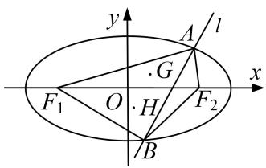

[规范解答] （1）因为直线 $l: x - my - \frac{m^2}{2} = 0$ 经过 $F_{2}(\sqrt{m^{2} - 1}, 0)$ ，所以 $\sqrt{m^2 - 1} = \frac{m^2}{2}$ ，得 $m^2 = 2$ .
又因为 m>1，所以 $m=\sqrt{2}$ ，故直线 l 的方程为 $x-\sqrt{2}y-1=0$ .

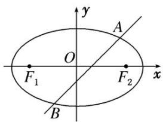  
（2）设 $A(x_{1},y_{1})$ ， $B(x_{2},y_{2})$ ，由 $\left\{ \begin{array}{l}x = my + \frac{m^2}{2},\\ \frac{x^2}{m^2} +y^2 = 1, \end{array} \right.$ 消去 $x$ ，得 $2y^{2} + my + \frac{m^{2}}{4} -1 = 0,$
则由 $\Delta=m^{2}-8\left(\frac{m^{2}}{4}-1\right)=-m^{2}+8>0$ ，知 $m^{2}<8$ ，且有 $y_{1}+y_{2}=-\frac{m}{2}$ ， $y_{1}\cdot y_{2}=\frac{m^{2}}{8}-\frac{1}{2}$ .
由于 $F_{1}(-c, 0)$ , $F_{2}(c, 0)$ , 可知 $G\left(\frac{x_{1}}{3}, \frac{y_{1}}{3}\right)$ , $H\left(\frac{x_{2}}{3}, \frac{y_{2}}{3}\right)$ .
因为原点 O 在以线段 GH 为直径的圆内，所以 $\overrightarrow{OH} \cdot \overrightarrow{OG} < 0$ ，即 $x_{1}x_{2} + y_{1}y_{2} < 0$ .
所以 $x_{1}x_{2}+y_{1}y_{2}=\left(my_{1}+\frac{m^{2}}{2}\right)\left(my_{2}+\frac{m^{2}}{2}\right)+y_{1}y_{2}=(m^{2}+1)\cdot\left(\frac{m^{2}}{8}-\frac{1}{2}\right)<0.$
解得 $m^{2}<4$ (满足 $m^{2}<8$ ). 又因为 m>1，所以实数 m 的取值范围是 $(1, 2)$ .

[例 3] 在平面直角坐标系 xOy 中，已知 $\triangle ABC$ 的两个顶点 A，B 的坐标分别为 $(-1, 0)$ ， $(1, 0)$ ，且 AC，BC 所在直线的斜率之积等于 -2，记顶点 C 的轨迹为曲线 E.  
（1）求曲线 E 的方程;  
（2）设直线 $y=kx+2(0<k<2)$ 与 y 轴相交于点 P，与曲线 E 相交于不同的两点 Q，R（点 R 在点 P 和点 Q 之间），且 $\overrightarrow{PQ}=\lambda\overrightarrow{PR}$ ，求实数 $\lambda$ 的取值范围.

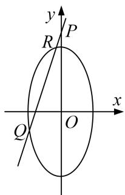

[规范解答] （1） 设 $C(x, y)$ . 由题意，可得 $\frac{y}{x-1} \cdot \frac{y}{x+1} = -2 (x \neq \pm 1)$ ，∴ 曲线 E 的方程为 $x^{2} + \frac{y^{2}}{2} = 1 (x \neq \pm 1)$ .  
（2）设 $R(x_{1},y_{1}),Q(x_{2},y_{2})$ .联立，得 $\left\{ \begin{array}{ll}y = kx + 2,\\ x^2 +\frac{y^2}{2} = 1, \end{array} \right.$ 消去 $y$ ，可得 $(2 + k^{2})x^{2} + 4kx + 2 = 0,$
$\therefore \Delta = 8 k ^ {2} - 1 6 > 0, \quad \therefore k ^ {2} > 2. \text {又} 0 <   k <   2, \quad \therefore \sqrt {2} <   k <   2.$
由根与系数的关系得， $x_{1}+x_{2}=-\frac{4k}{2+k^{2}}$ ，①， $x_{1}x_{2}=\frac{2}{2+k^{2}}$ ，②
$\because\overrightarrow{PQ}=\lambda\overrightarrow{PR}$ ，点R在点P和点Q之间， $\therefore x_{2}=\lambda x_{1}(\lambda>1)$ ，③
联立①②③，可得 $\frac{(1+\lambda)^{2}}{\lambda}=\frac{8k^{2}}{2+k^{2}}$ . $\because\sqrt{2}<k<2,\therefore\frac{8k^{2}}{2+k^{2}}=\frac{8}{\frac{2}{k^{2}}+1}\in(4,\frac{16}{3}),\therefore4<\frac{(1+\lambda)^{2}}{\lambda}<\frac{16}{3},$
$\therefore\frac{1}{3}<\lambda<3$ ，且 $\lambda\neq1$ ， $\because\lambda>1$ ，∴实数 $\lambda$ 的取值范围为(1，3).

[例 4] 已知中心在原点，焦点在 y 轴上的椭圆 C，其上一点 Q 到两个焦点 $F_{1}$ ， $F_{2}$ 的距离之和为 4，离心率为 $\frac{\sqrt{3}}{2}$ .  
（1）求椭圆 C 的方程;  
（2）若直线 l 与椭圆 C 交于不同的两点 M, N, 且线段 MN 恰被直线 $x = -\frac{1}{2}$ 平分，设弦 MN 的垂直平分线的方程为 $y = kx + m$ ，求 m 的取值范围.

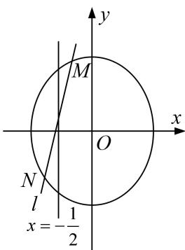

[破题思路] （2）给出线段 $MN$ 恰被直线 $x = -\frac{1}{2}$ 平分，弦 $MN$ 的垂直平分线方程为 $y = kx + m$ ，用 $y = kx + m$ 是弦 $MN$ 的中垂线及 $MN$ 的中点在直线 $x = -\frac{1}{2}$ 上，可设出中点坐标 $P\left(-\frac{1}{2}, y_0\right)$ ，建立 $y_0$ 与 $m$ 的关系，通过 $y_0$ 范围求 $m$ 范围或建立 $m$ 与 $k$ 的关系式．注意到 $MN$ 的中点在椭圆内部及直线 $x = -\frac{1}{2}$ 上，其隐含条件为线段 $MN$ 的中点纵坐标的范围可确定或联立直线 $l$ 与椭圆方程，利用判别式 $\Delta > 0$ 求解.

[规范解答] （1）由题意可设椭圆 C 的方程为 $\frac{y^{2}}{a^{2}} + \frac{x^{2}}{b^{2}} = 1 (a > b > 0)$ ，由条件可得 a = 2， $c = \sqrt{3}$ ，则 b = 1。
故椭圆 C 的方程为 $\frac{y^{2}}{4} + x^{2} = 1$ .  
（2）法一：设弦 $MN$ 的中点为 $P\left(-\frac{1}{2}, y_0\right)$ ， $M(x_M, y_M)$ ， $N(x_N, y_N)$ ，则由点 $M$ ， $N$ 为椭圆 $C$ 上的点，可知 $4x_M^2 + y_M^2 = 4$ ， $4x_N^2 + y_N^2 = 4$ ，两式相减，得 $4(x_M - x_N)(x_M + x_N) + (y_M - y_N)(y_M + y_N) = 0$ ，
将 $x_{M} + x_{N} = 2 \times \left(-\frac{1}{2}\right) = -1, y_{M} + y_{N} = 2y_{0}, \frac{y_{M} - y_{N}}{x_{M} - x_{N}} = -\frac{1}{k}$ , 代入上式得 $k = -\frac{y_0}{2}$ .
又点 $P\left(-\frac{1}{2}, y_{0}\right)$ 在弦 MN 的垂直平分线上，所以 $y_{0}=-\frac{1}{2}k+m$ ，所以 $m=y_{0}+\frac{1}{2}k=\frac{3}{4}y_{0}$ .

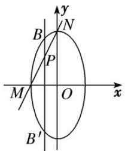
由点 $P\left(-\frac{1}{2}, y_{0}\right)$ 在线段 $BB'$ 上 $B'(x_{B'}, y_{B'})$ ， $B(x_{B}, y_{B})$ 为直线 $x = -\frac{1}{2}$ 与椭圆的交点，如图所示，
所以 $y_{B}'<y_{0}<y_{B}$ ，即 $-\sqrt{3}<y_{0}<\sqrt{3}$ 。所以 $-\frac{3\sqrt{3}}{4}<m<\frac{3\sqrt{3}}{4}$ ，且 $m\neq0$ 。
故 m 的取值范围为 $\left(-\frac{3\sqrt{3}}{4}, 0\right) \cup \left(0, \frac{3\sqrt{3}}{4}\right)$ .

法二：设弦 MN 的中点为 $P\left(-\frac{1}{2}, y_{0}\right)$ ， $M(x_{M}, y_{M})$ ， $N(x_{N}, y_{N})$ ，则由点 M，N 为椭圆 C 上的点，可知 $4x_{M}^{2} + y_{M}^{2} = 4$ ， $4x_{N}^{2} + y_{N}^{2} = 4$ ，两式相减，得 $4(x_{M} - x_{N})(x_{M} + x_{N}) + (y_{M} - y_{N})(y_{M} + y_{N}) = 0$ ，
将 $x_{M}+x_{N}=2\times\left(-\frac{1}{2}\right)=-1,\quad y_{M}+y_{N}=2y_{0},\quad\frac{y_{M}-y_{N}}{x_{M}-x_{N}}=-\frac{1}{k},$ 代入上式得 $y_{0}=-2k.$
又点 $P\left(-\frac{1}{2}, y_{0}\right)$ 在弦 MN 的垂直平分线上，所以 $y_{0}=-\frac{1}{2}k+m$ ，所以 $m=y_{0}+\frac{1}{2}k=-\frac{3}{2}k$ .
设直线 l 的方程为 $y+2k=-\frac{1}{k}\left(x+\frac{1}{2}\right)$ ，即 $x=-ky-2k^{2}-\frac{1}{2}$ ,
联立 $\left\{\begin{aligned}4x^{2}+y^{2}&=4,\\ x&=-ky-2k^{2}-\frac{1}{2},\end{aligned}\right.$ 消去 x，得 $(4k^{2}+1)y^{2}+8k2k^{2}+\frac{1}{2}y+16k^{4}+8k^{2}-3=0,$
由 $\Delta > 0$ ，得 $k \in \left(-\frac{\sqrt{3}}{2}, 0\right) \cup \left(0, \frac{\sqrt{3}}{2}\right)$ ，所以 $m = -\frac{3}{2} k \in \left(-\frac{3\sqrt{3}}{4}, 0\right) \cup \left(0, \frac{3\sqrt{3}}{4}\right)$ ,
即 m 的取值范围为 $\left(-\frac{3\sqrt{3}}{4}, 0\right) \cup \left(0, \frac{3\sqrt{3}}{4}\right)$ .

[题后悟通] 利用点差法求解第（2）问时，关键是利用点差法得到目标参数 $m$ 与 $y_0$ 的关系，再根据点 $P\left(-\frac{1}{2}, y_0\right)$ 与椭圆的位置关系得到 $y_0$ 的取值范围，从而求得目标参数 $m$ 的取值范围。很多同学在解决本题时往往出现如下失误：忽视 $y_0$ 的取值范围而造成思路受阻无法正确求解；利用判别式法求解此题时，抓住直线与圆锥曲线相交这一条件，利用判别式 $\Delta > 0$ 构建 $m$ 与 $k$ 的关系式，从而得所求，但部分考生忽视 $\Delta > 0$ ，导致思路受阻而无法求解。
利用点在曲线内(外)的充要条件构建目标不等式的核心是抓住目标参数和某点的关系，根据点与圆锥曲线的位置关系构建目标不等式.
利用判别式构建目标不等式的核心是抓住直线与圆锥曲线的位置关系和判别式 $\Delta$ 的关系建立目标不等式.

[例 5] 已知离心率为 $\frac{\sqrt{3}}{2}$ 的椭圆 C 焦点在 y 轴上，且以椭圆的 4 个顶点为各顶点的四边形的面积为 4，过点 M(0, 3) 的直线 l 与椭圆 C 相交于不同的两点 A、B.  
（1）求椭圆 C 的方程;  
（2）设 P 为椭圆上一点，且 $\overrightarrow{OA} + \overrightarrow{OB} = \lambda \overrightarrow{OP}$ (O 为坐标原点). 求当 $|AB| < \sqrt{3}$ 时，实数 $\lambda$ 的取值范围.

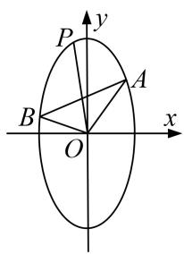

[规范解答] （1）设椭圆的方程为 $\frac{x^{2}}{b^{2}}+\frac{y^{2}}{a^{2}}=1(a>b>0)$ ，由题意可知 $e^{2}=\frac{c^{2}}{a^{2}}=\frac{3}{4}$ ，得 $\frac{b^{2}}{a^{2}}=\frac{1}{4}$ ，a=2b.又由题意知 2ab=4，所以 a=2，b=1，椭圆方程为 $x^{2}+\frac{y^{2}}{4}=1$ .  
（2）设 $A(x_{1}, y_{1})$ , $B(x_{2}, y_{2})$ , $P(x_{3}, y_{3})$ .
当直线 AB 的斜率不存在时，直线 AB 的方程为 x=0，此时 $\left|AB\right|=4>\sqrt{3}$ ，与题意不符.
当直线 AB 的斜率存在时，设直线 AB 的方程为 $y=kx+3$ ，
由 $\left\{\begin{aligned}y&=kx+3,\\ x^{2}&+\frac{y^{2}}{4}=1\end{aligned}\right.$ 消去 y 得 $(4+k^{2})x^{2}+6kx+5=0$ ，所以 $\Delta=(6k)^{2}-20(4+k^{2})$ ，由 $\Delta>0$ ，得 $k^{2}>5$ ，
则 $x_{1}+x_{2}=\frac{-6k}{4+k^{2}}$ ， $x_{1}\cdot x_{2}=\frac{5}{4+k^{2}}$ ， $y_{1}+y_{2}=(kx_{1}+3)+(kx_{2}+3)=\frac{24}{4+k^{2}}$
因为 $|AB|=\sqrt{(x_{1}-x_{2})^{2}+(y_{1}-y_{2})^{2}}<\sqrt{3}$ ，所以 $\sqrt{1+k^{2}}\cdot\sqrt{\left(\frac{-6k}{4+k^{2}}\right)^{2}-\frac{20}{4+k^{2}}}<\sqrt{3}$
解得 $-\frac{16}{13}<k^{2}<8$ ，所以 $5<k^{2}<8$ 。
因为 $\overrightarrow{OA} + \overrightarrow{OB} = \lambda \overrightarrow{OP}$ ，即 $(x_{1}, y_{1}) + (x_{2}, y_{2}) = \lambda (x_{3}, y_{3})$ ，所以当 $\lambda = 0$ 时，由 $\overrightarrow{OA} + \overrightarrow{OB} = 0$ ，
得 $x_{1}+x_{2}=\frac{-6k}{4+k^{2}}=0,\quad y_{1}+y_{2}=\frac{24}{4+k^{2}}=0$ ，解得 $k\in\varnothing$ ，所以此时符合条件的直线 l 不存在；
当 $\lambda\neq0$ 时， $x_{3}=\frac{x_{1}+x_{2}}{\lambda}=\frac{-6k}{\lambda(4+k^{2})}$ ， $y_{3}=\frac{y_{1}+y_{2}}{\lambda}=\frac{24}{\lambda(4+k^{2})}$
因为点 $P(x_{3}, y_{3})$ 在椭圆上，所以 $\left[\frac{-6k}{\lambda(4+k^{2})}\right]^{2}+\frac{1}{4}\left[\frac{24}{\lambda(4+k^{2})}\right]^{2}=1$ ，化简得 $\lambda^{2}=\frac{36}{4+k^{2}}$ ，因为 $5<k^{2}<8$ ，所以 $3<\lambda^{2}<4$ ，则 $\lambda\in(-2, -\sqrt{3})\cup(\sqrt{3}, 2)$ .

综上，实数 $\lambda$ 的取值范围为 $(-2, -\sqrt{3}) \cup (\sqrt{3}, 2)$ .

[例 6] (2016·浙江)如图，设抛物线 $y^{2}=2px(p>0)$ 的焦点为 F，抛物线上的点 A 到 y 轴的距离等于 $|AF|-1$ .  
（1）求 $p$ 的值；  
（2）若直线 $AF$ 交抛物线于另一点 $B$ , 过 $B$ 与 $x$ 轴平行的直线和过 $F$ 与 $AB$ 垂直的直线交于点 $N$ , $AN$ 与 $x$ 轴交于点 $M$ . 求 $M$ 的横坐标的取值范围.

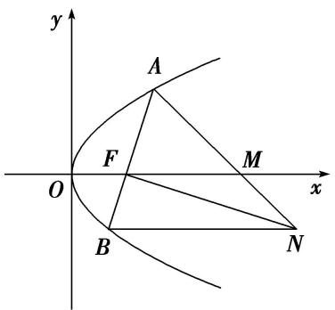

[规范解答] （1）由题意可得，抛物线上的点 A 到焦点 F 的距离等于点 A 到直线 x = -1 的距离，由抛物线的定义得 $\frac{p}{2} = 1$ ，即 p = 2.  
（2）由（1）得，抛物线方程为 $y^{2}=4x,\quad F(1,0)$ ，可设 $A(t^{2},2t),\quad t\neq0,\quad t\neq\pm1$ .
因为 AF 不垂直于 y 轴，可设直线 AF: $x = sy + 1 (s \neq 0)$ ，由 $\left\{\begin{aligned}x &= sy + 1 \\ y^2 &= 4x\end{aligned}\right.$ ，消去 x 得 $y^2 - 4sy - 4 = 0$ ，故 $y_1y_2 = -4$ ，所以 $B\left(\frac{1}{t^2}, -\frac{2}{t}\right)$ .
又直线 AB 的斜率为 $\frac{2t}{t^{2}-1}$ ，故直线 FN 的斜率为 $-\frac{t^{2}-1}{2t}$ .
从而得直线 FN: $y=-\frac{t^{2}-1}{2t}(x-1)$ ，直线 BN: $y=-\frac{2}{t}$ ，所以 $N\left(\frac{t^{2}+3}{t^{2}-1}, -\frac{2}{t}\right)$ .
设 $M(m, 0)$ ，由 A, M, N 三点共线得 $\frac{2t}{t^{2}-m}=\frac{2t+\frac{2}{t}}{t^{2}-\frac{t^{2}+3}{t^{2}-1}}$ ，于是 $m=\frac{2t^{2}}{t^{2}-1}=2+\frac{2}{t^{2}-1}$ .
所以 m<0 或 m>2．经检验，m<0 或 m>2 满足题意.

综上，点 M 的横坐标的取值范围是 $(-∞, 0) ∪ (2, +∞)$ .

[例 7] 椭圆 $C: \frac{x^2}{a^2} + \frac{y^2}{b^2} = 1 (a > b > 0)$ 的左、右焦点分别是 $F_1, F_2$ ，离心率为 $\frac{\sqrt{3}}{2}$ ，过点 $F_1$ 且垂直于 $x$ 轴的直线被椭圆 $C$ 截得的线段长为 1.  
（1）求椭圆 C 的方程;  
（2）点 $P$ 是椭圆 $C$ 上除长轴端点外的任一点，连接 $PF_{1}$ ， $PF_{2}$ ，设 $\angle F_{1}PF_{2}$ 的角平分线 $PM$ 交 $C$ 的长轴于点 $M(m,0)$ ，求 $m$ 的取值范围.

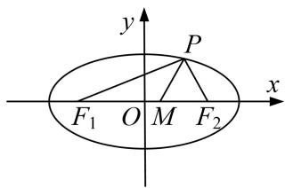

[规范解答] （1） 将 x = -c 代入椭圆的方程 $\frac{x^{2}}{a^{2}} + \frac{y^{2}}{b^{2}} = 1$ ，得 $y = \pm \frac{b^{2}}{a}$ .
由题意知 $\frac{2b^{2}}{a}=1$ ，故 $a=2b^{2}$ 。又 $e=\frac{c}{a}=\frac{\sqrt{3}}{2}$ ，则 $\frac{b}{a}=\frac{1}{2}$ ，即a=2b，所以a=2，b=1，
故椭圆 C 的方程为 $\frac{x^{2}}{4} + y^{2} = 1$ .  
（2）由 $PM$ 是 $\angle F_{1}PF_{2}$ 的角平分线，可得 $\frac{|PF_1|}{|F_1M|} = \frac{|PF_2|}{|F_2M|}$ ，即 $\frac{|PF_1|}{|PF_2|} = \frac{|F_1M|}{|F_2M|}$ .
设点 $P(x_{0}, y_{0})(-2 < x_{0} < 2)$ ，又点 $F_{1}(-\sqrt{3}, 0)$ ， $F_{2}(\sqrt{3}, 0)$ ， $M(m, 0)$ ，
则 $|PF_{1}|=\sqrt{(-\sqrt{3}-x_{0})^{2}+y_{0}^{2}}=2+\frac{\sqrt{3}}{2}x_{0},\quad|PF_{2}|=\sqrt{(\sqrt{3}-x_{0})^{2}+y_{0}^{2}}=2-\frac{\sqrt{3}}{2}x_{0}.$
又 $|F_{1}M|=|m+\sqrt{3}|$ ， $|F_{2}M|=|m-\sqrt{3}|$ ，且 $-\sqrt{3}<m<\sqrt{3}$ ，所以 $|F_{1}M|=m+\sqrt{3}$ ， $|F_{2}M|=\sqrt{3}-m$ .
所以 $\frac{2+\frac{\sqrt{3}}{2}x_{0}}{2-\frac{\sqrt{3}}{2}x_{0}}=\frac{\sqrt{3}+m}{\sqrt{3}-m}$ ，化简得 $m=\frac{3}{4}x_{0}$ ，而-2<x\_{0}<2，因此 $-\frac{3}{2}<m<\frac{3}{2}$ .
故实数 m 的取值范围为 $\left(-\frac{3}{2}, \frac{3}{2}\right)$ .

[例8] 已知直线 $x = -2$ 上有一动点 $Q$ ，过点 $Q$ 作直线 $l_{1}$ 垂直于 $y$ 轴，动点 $P$ 在 $l_{1}$ 上，且满足 $\overrightarrow{OP} \cdot \overrightarrow{OQ} = 0 (O$ 为坐标原点)，记点 $P$ 的轨迹为曲线 $C$ .  
（1）求曲线 C 的方程;  
（2）已知定点 $M\left(-\frac{1}{2},0\right),N\left(\frac{1}{2},0\right)$ ， $A$ 为曲线 $C$ 上一点，直线 $AM$ 交曲线 $C$ 于另一点 $B$ ，且点 $A$ 在线段 $MB$ 上，直线 $AN$ 交曲线 $C$ 于另一点 $D$ ，求 $\triangle MBD$ 的内切圆半径 $r$ 的取值范围.

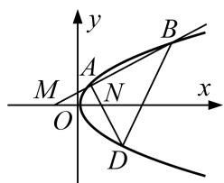

[规范解答] （1）设点 $P(x, y)$ ，则 $Q(-2, y)$ ，∴ $=(x, y)$ ， $=( -2, y)$ .
$\because\overrightarrow{OP}\cdot\overrightarrow{OQ}=0=0,\quad\therefore=-2x+y^{2}=0,$ 即 $y^{2}=2x.\quad\therefore$ 曲线 C 的方程为 $y^{2}=2x.$  
（2）设 $A(x_{1}, y_{1})$ ， $B(x_{2}, y_{2})$ ， $D(x_{3}, y_{3})$ ，直线 BD 与 x 轴的交点为 E，直线 AB 与 $\triangle MBD$ 内切圆的切点为 T.
设直线 AM 的方程为 $y=k\left(x+\frac{1}{2}\right)$ ，则联立方程组 $\left\{\begin{aligned}y=k\left(x+\frac{1}{2}\right),\\ y^{2}=2x,\end{aligned}\right.$ 得 $k^{2}x^{2}+(k^{2}-2)x+\frac{k^{2}}{4}=0,$
$\therefore x _ {1} x _ {2} = \frac {1}{4} \text {且} 0 <   x _ {1} <   x _ {2}, \quad \therefore x _ {1} <   \frac {1}{2} <   x _ {2}.$
∵ 直线 AN 的方程为 $y=\frac{y_{1}}{x_{1}-\frac{1}{2}}\left(x-\frac{1}{2}\right)$ ，与方程 $y^{2}=2x$ 联立得 $y_{1}^{2}x^{2}-\left(y_{1}^{2}+2x_{1}^{2}-2x_{1}+\frac{1}{2}\right)x+\frac{1}{4}y_{1}^{2}=0$ ，
化简得 $2x_{1}x^{2}-\left(2x_{1}^{2}+\frac{1}{2}\right)x+\frac{1}{2}x_{1}=0$ ，解得 $x_{3}=\frac{1}{4x_{1}}$ 或 $x_{3}=x_{1}$ (舍去). $\because x_{3}=\frac{1}{4x_{1}}=x_{2}, \therefore BD \perp x$ 轴，
设 $\triangle MBD$ 的内切圆圆心为H，则点H在x轴上且 $HT\perp AB$ .
$\therefore S_{\triangle MBD} = \frac{1}{2}\left(x_2 + \frac{1}{2}\right)|2y_2|$ ，且 $\triangle MBD$ 的周长为 $2\sqrt{\left(x_2 + \frac{1}{2}\right)^2 + y_2^2} + 2|y_2|$ ，
$\therefore S _ {\triangle M B D} = \frac {1}{2} \left[ 2 \sqrt {\left(x _ {2} + \frac {1}{2}\right) ^ {2} + y _ {2} ^ {2}} + 2 | y _ {2} | \right] \cdot r = \frac {1}{2} \left(x _ {2} + \frac {1}{2}\right) | 2 y _ {2} |,$
$\therefore r = \frac {\left(x _ {2} + \frac {1}{2}\right) _ {| y _ {2} |}}{| y _ {2} | + \sqrt {\left(x _ {2} + \frac {1}{2}\right) ^ {2} + y _ {2} ^ {2}}} = \frac {1}{\frac {1}{x _ {2} + \frac {1}{2}} + \sqrt {\frac {1}{y _ {2} ^ {2}} + \frac {1}{\left(x _ {2} + \frac {1}{2}\right) _ {2}}}} = \frac {1}{\sqrt {\frac {1}{2 x _ {2}} + \frac {1}{\left(x _ {2} + \frac {1}{2}\right) _ {2}} + \frac {1}{x _ {2} + \frac {1}{2}}}},$
令 $t=x_{2}+\frac{1}{2}$ ，则 t>1，
$\therefore r = \frac{1}{\sqrt{\frac{1}{2t - 1} + \frac{1}{t^2} + \frac{1}{t}}}$ 在区间 $(1, +\infty)$ 上单调递增，则 $r > \frac{1}{\sqrt{2} + 1} = \sqrt{2} - 1$
即 r 的取值范围为 $(\sqrt{2}-1, +\infty)$ .

# 【对点训练】

1. 已知 $A, B, C$ 是椭圆 $M: \frac{x^2}{a^2} + \frac{y^2}{b^2} = 1 (a > b > 0)$ 上的三点，其中点 $A$ 的坐标为 $(2\sqrt{3}, 0)$ ， $BC$ 过椭圆的中心，且 $\overrightarrow{AC} \cdot \overrightarrow{BC} = 0$ ， $|\overrightarrow{BC}| = 2|\overrightarrow{AC}|$ .  
（1）求椭圆 M 的方程;  
（2）过点 $(0, t)$ 的直线 $l$ (斜率存在时)与椭圆 $M$ 交于两点 $P, Q$ , 设 $D$ 为椭圆 $M$ 与 $y$ 轴负半轴的交点, 且 $|\overrightarrow{DP}| = |\overrightarrow{DQ}|$ , 求实数 $t$ 的取值范围.

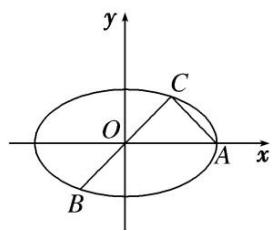

1. 解析 （1） 因为 $\left|\overrightarrow{BC}\right|=2\left|\overrightarrow{AC}\right|$ 且 BC 过 $(0,0)$ ，则 $\left|OC\right|=\left|AC\right|$ .
因为 $\overrightarrow{AC}\cdot\overrightarrow{BC}=0$ ，所以 $\angle OCA=90^{\circ}$ ，即 $C(\sqrt{3},\sqrt{3})$ .
又因为 $a=2\sqrt{3}$ ，设椭圆的方程为 $\frac{x^{2}}{12}+\frac{y^{2}}{12-c^{2}}=1$ ，将 C 点坐标代入得 $\frac{3}{12}+\frac{3}{12-c^{2}}=1$ ，
解得 $c^{2}=8,\ b^{2}=4$ 。所以椭圆的方程为 $\frac{x^{2}}{12}+\frac{y^{2}}{4}=1$ 。  
（2）由条件 $D(0, -2)$ ，当 k=0 时，显然 -2<t<2；当 $k\neq0$ 时，设 $l: y=kx+t$ ，
$\left\{\begin{aligned}\frac{x^{2}}{12}+\frac{y^{2}}{4}&=1,\\ y=kx+t,\end{aligned}\right.$ 消去 y 得 $(1+3k^{2})x^{2}+6ktx+3t^{2}-12=0$ 。由 $\Delta>0$ 可得 $t^{2}<4+12k^{2}$ ，①
设 $P(x_{1}, y_{1})$ ， $Q(x_{2}, y_{2})$ ，PQ 中点 $H(x_{0}, y_{0})$ ，则 $x_{0}=\frac{x_{1}+x_{2}}{2}=\frac{-3kt}{1+3k^{2}}$
$y_{0}=kx_{0}+t=\frac{t}{1+3k^{2}}$ ，所以 $H\left(-\frac{3kt}{1+3k^{2}},\frac{t}{1+3k^{2}}\right)$ ,
由 $|\overrightarrow{DP}|=|\overrightarrow{DQ}|$ ，所以 $DH\perp PQ$ ，即 $k_{DH}=-\frac{1}{k}$ ，所以 $\frac{\frac{t}{1+3k^{2}}+2}{-\frac{3kt}{1+3k^{2}}-0}=-\frac{1}{k}$
化简得 $t=1+3k^{2}$ ，②，所以 t>1，将②代入①得，1<t<4.
所以 t 的范围是 $(1, 4)$ . 综上可得 $t \in (1, 2)$ .

2. 已知焦点在 $y$ 轴上的椭圆 $E$ 的中心是原点 $O$ , 离心率等于 $\frac{\sqrt{3}}{2}$ , 以椭圆 $E$ 的长轴和短轴为对角线的四边形的周长为 $4\sqrt{5}$ . 直线 $l: y = kx + m$ 与 $y$ 轴交于点 $P$ , 与椭圆 $E$ 相交于 $A, B$ 两个点.  
（1）求椭圆 E 的方程;  
（2）若 $\overrightarrow{AP}=3\overrightarrow{PB}$ ，求 $m^{2}$ 的取值范围.

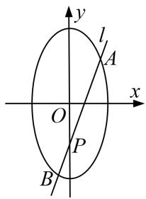

2. 解析 （1）根据已知设椭圆 E 的方程为 $\frac{y^{2}}{a^{2}} + \frac{x^{2}}{b^{2}} = 1 (a > b > 0)$ ，焦距为 2c，
由已知得 $\frac{c}{a}=\frac{\sqrt{3}}{2},\quad\therefore c=\frac{\sqrt{3}}{2}a,\quad b^{2}=a^{2}-c^{2}=\frac{a^{2}}{4}.$
∵以椭圆 E 的长轴和短轴为对角线的四边形的周长为 $4\sqrt{5}$ ,
$\therefore 4 \sqrt {a ^ {2} + b ^ {2}} = 2 \sqrt {5} a = 4 \sqrt {5}, \quad \therefore a = 2, b = 1.$
∴椭圆 E 的方程为 $x^{2}+\frac{y^{2}}{4}=1$ .  
（2）根据已知得 $P(0, m)$ ，设 $A(x_{1}, kx_{1}+m)$ ， $B(x_{2}, kx_{2}+m)$ ，
由 $\left\{\begin{aligned}y&=kx+m,\\ 4x^{2}&+y^{2}-4=0\end{aligned}\right.$ 消去 y，得 $(k^{2}+4)x^{2}+2mkx+m^{2}-4=0$ .
由已知得 $\Delta=4m^{2}k^{2}-4(k^{2}+4)(m^{2}-4)>0$ ，即 $k^{2}-m^{2}+4>0$ ，且 $x_{1}+x_{2}=\frac{-2km}{k^{2}+4}$ ， $x_{1}x_{2}=\frac{m^{2}-4}{k^{2}+4}$ .
由 $\overrightarrow{AP} = 3\overrightarrow{PB}$ ，得 $x_{1} = -3x_{2}$ ， $\therefore 3(x_{1} + x_{2})^{2} + 4x_{1}x_{2} = 12x_{2}^{2} - 12x_{2}^{2} = 0.$
$\therefore \frac{12k^{2}m^{2}}{k^{2}+4} + \frac{4(m^{2}-4)}{k^{2}+4}=0$ ，即 $m^{2}k^{2}+m^{2}-k^{2}-4=0$ .
当 $m^{2}=1$ 时， $m^{2}k^{2}+m^{2}-k^{2}-4=0$ 不成立， $\therefore k^{2}=\frac{4-m^{2}}{m^{2}-1}$ .
$\because k^{2} - m^{2} + 4 > 0, \therefore \frac{4 - m^{2}}{m^{2} - 1} - m^{2} + 4 > 0,$ 即 $\frac{(4 - m^2)m^2}{m^2 - 1} >0$ ，解得 $1 <   m^2 <  4.$
$\therefore m^{2}$ 的取值范围为(1, 4).

3. 已知椭圆 $C: \frac{x^2}{a^2} + \frac{y^2}{b^2} = 1 (a > b > 0)$ 的两焦点与短轴的一个端点的连线构成等腰直角三角形，直线 $x + y + 1 = 0$ 与以椭圆 $C$ 的右焦点为圆心，以椭圆的长半轴长为半径的圆相切.  
（1）求椭圆 C 的方程;  
（2）过点 $M(2,0)$ 的直线 l 与椭圆 C 相交于不同的两点 S 和 T，若椭圆 C 上存在点 P 满足 $\overrightarrow{OS} + \overrightarrow{OT} = t\overrightarrow{OP}$ (其中 O 为坐标原点)，求实数 t 的取值范围.

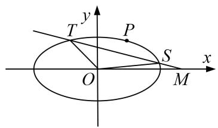

3. 解析 （1）由题意, 以椭圆 $C$ 的右焦点为圆心, 以椭圆的长半轴长为半径的圆的方程为 $(x - c)^2 + y^2 = a^2$ , $\therefore$ 圆心到直线 $x + y + 1 = 0$ 的距离 $d = \frac{c + 1}{\sqrt{2}} = a$ . (\*)
∵椭圆 C 的两焦点与短轴的一个端点的连线构成等腰直角三角形，
∴ b=c， $a=\sqrt{2}c$ ，代入(\*)式得 b=c=1，∴ $a=\sqrt{2}c=\sqrt{2}$ ，故所求椭圆方程为 $\frac{x^{2}}{2}+y^{2}=1$ .  
（2）由题意知，直线 l 的斜率存在，设直线 l 的方程为 $y=k(x-2)$ ，设 $P(x_{0}, y_{0})$ ,
将直线 l 的方程代入椭圆方程得 $(1+2k^{2})x^{2}-8k^{2}x+8k^{2}-2=0$ ,
$\therefore \Delta = 64k^{4} - 4(1 + 2k^{2})(8k^{2} - 2) > 0$ ，解得 $k^2 < \frac{1}{2}$
设 $S(x_{1}, y_{1})$ ， $T(x_{2}, y_{2})$ ，则 $x_{1} + x_{2} = \frac{8k^{2}}{1 + 2k^{2}}$ ， $x_{1}x_{2} = \frac{8k^{2} - 2}{1 + 2k^{2}}$ ， $\therefore y_{1} + y_{2} = k(x_{1} + x_{2} - 4) = -\frac{4k}{1 + 2k^{2}}$ .
由 $\overrightarrow{OS} +\overrightarrow{OT} = t\overrightarrow{OP}$ ，得 $tx_0 = x_1 + x_2$ ， $ty_{0} = y_{1} + y_{2}$
当 t=0 时，直线 l 为 x 轴，则椭圆上任意一点 P 满足 $\overrightarrow{OS} + \overrightarrow{OT} = t\overrightarrow{OP}$ ，符合题意；
当 $t \neq 0$ 时， $\left\{ \begin{array}{l} tx_0 = \frac{8k^2}{1 + 2k^2}, \\ ty_0 = \frac{-4k}{1 + 2k^2}, \end{array} \right.$ $\therefore x_0 = \frac{1}{t} \cdot \frac{8k^2}{1 + 2k^2}, y_0 = \frac{1}{t} \cdot \frac{-4k}{1 + 2k^2}$ .
将上式代入椭圆方程得 $\frac{32k^{4}}{t^{2}(1+2k^{2})^{2}}+\frac{16k^{2}}{t^{2}(1+2k^{2})^{2}}=1$ ，整理得 $t^{2}=\frac{16k^{2}}{1+2k^{2}}=\frac{16}{\frac{1}{k^{2}}+2}$
由 $k^{2}<\frac{1}{2}$ 知， $0<t^{2}<4$ ，所以 $t\in(-2,0)\cup(0,2)$ ，综上可得，实数 t 的取值范围是 $(-2,2)$ .

4. 已知椭圆 $E: \frac{x^2}{4} + y^2 = 1$ 的左，右顶点分别为 $A, B$ ，圆 $x^2 + y^2 = 4$ 上有一动点 $P$ ，点 $P$ 在 $x$ 轴的上方， $C(1, 0)$ ，直线 $PA$ 交椭圆 $E$ 于点 $D$ ，连接 $DC, PB$ .  
（1）若 $\angle ADC=90^{\circ}$ ，求 $\triangle ADC$ 的面积 $S$ ;   
（2）设直线 PB, DC 的斜率存在且分别为 $k_{1}$ , $k_{2}$ ，若 $k_{1}=\lambda k_{2}$ ，求 $\lambda$ 的取值范围.

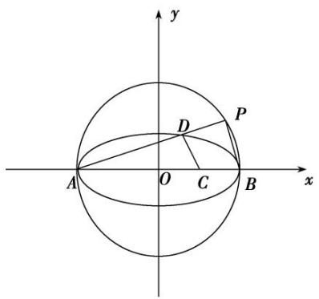

4. 解析 （1）依题意， $A(-2,0)$ . 设 $D(x_{1},y_{1})$ ，则 $\frac{x_{1}^{2}}{4} + y_{1}^{2} = 1$ . 由 $\angle ADC = 90^{\circ}$ 得 $k_{AD} \cdot k_{CD} = -1$ ,
$\therefore \frac{y_1}{x_1 + 2} \cdot \frac{y_1}{x_1 - 1} = -1, \therefore \frac{y_1^2}{(x_1 + 2) \cdot (x_1 - 1)} = \frac{1 - \frac{x_1^2}{4}}{x_1^2 + x_1 - 2} = -1,$ 解得 $x_1 = \frac{2}{3}, x_1 = -2$ （舍去），
$\therefore | y _ {1} | = \frac {2 \sqrt {2}}{3}, S = \frac {1}{2} \times \frac {2 \sqrt {2}}{3} \times 3 = \sqrt {2}.$  
（2）设 $D(x_{2}, y_{2})$ ，∵动点 P 在圆 $x^{2}+y^{2}=4$ 上，∴ $k_{PB} \cdot k_{PA} = -1$ .
又 $k_{1} = \lambda k_{2},\therefore \frac{-1}{\frac{y_{2}}{x_{2} + 2}} = \lambda \cdot \frac{y_{2}}{x_{2} - 1},$
即 $\lambda = -\frac{(x_2 + 2)(x_2 - 1)}{y_2^2} = -\frac{(x_2 + 2)(x_2 - 1)}{1 - \frac{x_2^2}{4}} = -\frac{(x_2 + 2)(x_2 - 1)}{\frac{1}{4}(4 - x_2^2)} = 4\cdot \frac{x_2 - 1}{x_2 - 2} = 4\left(1 + \frac{1}{x_2 - 2}\right).$
又由题意可知 $x_{2}\in(-2,2)$ ，且 $x_{2}\neq1$ ，
则问题可转化为求函数 $f(x)=4\left(1+\frac{1}{x-2}\right)(x\in(-2,2)$ ，且 $x\neq1)$ 的值域.
由导数可知函数 $f(x)$ 在其定义域内为减函数，∴ 函数 $f(x)$ 的值域为 $(-∞, 0) ∪ (0, 3)$ ,
从而 $\lambda$ 的取值范围为 $(-∞, 0)∪(0, 3)$ .

5. 设椭圆 $C: \frac{x^2}{a^2} + \frac{y^2}{b^2} = 1 (a > b > 0)$ , 定义椭圆 $C$ 的“相关圆”方程为 $x^2 + y^2 = \frac{a^2b^2}{a^2 + b^2}$ , 若抛物线 $y^2 = 4x$ 的焦点与椭圆 $C$ 的一个焦点重合, 且椭圆 $C$ 短轴的一个端点和其两个焦点构成直角三角形.  
（1）求椭圆 C 的方程和“相关圆”E 的方程;  
（2）过“相关圆”E 上任意一点 P 的直线 l: $y=kx+m$ 与椭圆 C 交于 A, B 两点. O 为坐标原点，若 $OA \perp OB$ ，证明：原点 O 到直线 AB 的距离是定值，并求实数 m 的取值范围.

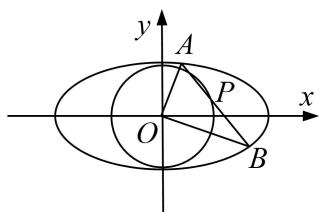

5. 解析 （1）因为抛物线 $y^{2}=4x$ 的焦点(1, 0)与椭圆 C 的一个焦点重合，所以 c=1.
又因为椭圆 C 短轴的一个端点和其两个焦点构成直角三角形，
所以 b=c=1。故椭圆 C 的方程为 $\frac{x^{2}}{2}+y^{2}=1$ ，“相关圆”E 的方程为 $x^{2}+y^{2}=\frac{2}{3}$ 。  
（2）设 $A(x_{1},y_{1})$ ， $B(x_{2},y_{2})$ ，联立方程组 $\left\{ \begin{array}{l}y = kx + m,\\ \frac{x^2}{2} +y^2 = 1, \end{array} \right.$ 得 $(1 + 2k^{2})x^{2} + 4kmx + 2m^{2} - 2 = 0,$
$\Delta=16k^{2}m^{2}-4(1+2k^{2})(2m^{2}-2)=8(2k^{2}-m^{2}+1)>0$ ，即 $2k^{2}-m^{2}+1>0$ ，
$x _ {1} + x _ {2} = - \frac {4 k m}{1 + 2 k ^ {2}}, x _ {1} x _ {2} = \frac {2 m ^ {2} - 2}{1 + 2 k ^ {2}},$
$y _ {1} y _ {2} = (k x _ {1} + m) (k x _ {2} + m) = k ^ {2} x _ {1} x _ {2} + k m \left(x _ {1} + x _ {2}\right) + m ^ {2} = \frac {k ^ {2} \left(2 m ^ {2} - 2\right)}{1 + 2 k ^ {2}} - \frac {4 k ^ {2} m ^ {2}}{1 + 2 k ^ {2}} + m ^ {2} = \frac {m ^ {2} - 2 k ^ {2}}{1 + 2 k ^ {2}}.$
由条件 $OA \perp OB$ 得 $x_{1}x_{2} + y_{1}y_{2} = 0$ ，即 $3m^{2} - 2k^{2} - 2 = 0$ ，
所以原点 O 到直线 AB 的距离是 $d=\frac{|m|}{\sqrt{1+k^{2}}}=\sqrt{\frac{m^{2}}{1+k^{2}}}$ .
由 $3m^{2}-2k^{2}-2=0$ 得 $1+k^{2}=\frac{3}{2}m^{2}$ ，所以 $d=\frac{\sqrt{6}}{3}$ 为定值.
将 $3m^{2} - 2k^{2} - 2 = 0$ 代入 $\Delta$ 中，解得 $m < -\frac{\sqrt{2}}{2}$ 或 $m > \frac{\sqrt{2}}{2}$ ，又 $k^{2} = \frac{3m^{2} - 2}{2} \geq 0$
所以 $m^2 \geq \frac{2}{3}$ ，解得 $m \leq -\frac{\sqrt{6}}{3}$ 或 $m \geq \frac{\sqrt{6}}{3}$ 。综上，实数 $m$ 的取值范围是 $\left[-\infty, -\frac{\sqrt{6}}{3}\right] \cup \left[\frac{\sqrt{6}}{3}, +\infty\right]$ 。

6. 已知椭圆的一个顶点为 $A(0, -1)$ ，焦点在 $x$ 轴上，中心在原点。若右焦点到直线 $x - y + 2\sqrt{2} = 0$ 的距离为3.  
（1）求椭圆的标准方程;  
（2）设直线 $y = kx + m (k \neq 0)$ 与椭圆相交于不同的两点 $M, N$ . 当 $|AM| = |AN|$ 时，求 $m$ 的取值范围.

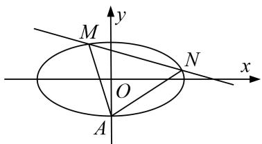

6. 解析 （1）依题意可设椭圆方程为 $\frac{x^{2}}{a^{2}}+y^{2}=1(a>1)$ ,
则右焦点 $F(\sqrt{a^{2}-1},0)$ ，由题设 $\frac{|\sqrt{a^{2}-1}+2\sqrt{2}|}{\sqrt{2}}=3$ ，解得 $a^{2}=3$ .
∴所求椭圆的方程为 $\frac{x^{2}}{3}+y^{2}=1$ .  
（2）设 $P(x_{P}, y_{P})$ ， $M(x_{M}, y_{M})$ ， $N(x_{N}, y_{N})$ ， $P$ 为弦 $MN$ 的中点，
由 $\left\{\begin{aligned}y&=kx+m,\\ \frac{x^{2}}{3}&+y^{2}=1,\end{aligned}\right.$ 得 $(3k^{2}+1)x^{2}+6mkx+3(m^{2}-1)=0,$
∵直线与椭圆相交，∴ $\Delta=(6mk)^{2}-4(3k^{2}+1)\times3(m^{2}-1)>0\Rightarrow m^{2}<3k^{2}+1$ ．①
$\therefore x_{P}=\frac{x_{M}+x_{N}}{2}=-\frac{3mk}{3k^{2}+1},$ 从而 $y_{P}=kx_{P}+m=\frac{m}{3k^{2}+1},$ $\therefore k_{AP}=\frac{y_{P}+1}{x_{P}}=-\frac{m+3k^{2}+1}{3mk},$
又∵ $|AM|=|AN|$ ，∴ $AP\perp MN$ ，则 $-\frac{m+3k^{2}+1}{3mk}=-\frac{1}{k}$ ，即 $2m=3k^{2}+1$ ．②

把②代入①，得 $m^{2}<2m$ ，解得 0<m<2；由②得 $k^{2}=\frac{2m-1}{3}>0$ ，解得 $m>\frac{1}{2}$ .

综上，求得 m 的取值范围是 $\left(\frac{1}{2}, 2\right)$ .

7. 过椭圆 $C: \frac{x^2}{9} + \frac{y^2}{b^2} = 1 (0 < b < 3)$ 的上顶点 $A$ 作相互垂直的两条直线，分别交椭圆于不同的两点 $M, N$ （点 $M, N$ 与点 $A$ 不重合）.  
（1）设椭圆的下顶点为 $B(0, -b)$ ，当直线 AM 的斜率为 $\sqrt{5}$ 时，若 $S_{\triangle ANB}=2S_{\triangle AMB}$ ，求 b 的值；  
（2）若存在点 $M, N$ ，使得 $|AM| = |AN|$ ，且直线 $AM, AN$ 的斜率的绝对值都不为 1，求实数 $b$ 的取值范围.

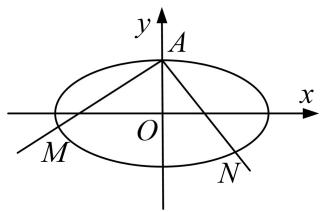

7. 解析 设 $M(x_{1}, y_{1})$ , $N(x_{2}, y_{2})$ . 设直线 AM 的斜率为 k，则由条件可知，直线 AM 的方程为 $y = kx + b$ ，于是 $\left\{\begin{aligned}b^{2}x^{2} + 9y^{2} &= 9b^{2}, \\ y &= kx + b,\end{aligned}\right.$ 消去 y 整理得 $(9k^{2} + b^{2})x^{2} + 18kbx = 0, \therefore x_{1} = -\frac{18bk}{b^{2} + 9k^{2}}$ ，同理， $x_{2} = \frac{18bk}{b^{2}k^{2} + 9}$ .  
（1）由 $S_{\triangle ANB}=2S_{\triangle AMB}$ ，得 $x_{2}=-2x_{1}$ ，于是 $\frac{18bk}{b^{2}k^{2}+9}=2\cdot\frac{18bk}{b^{2}+9k^{2}}$ ，即 $2b^{2}k^{2}+18=b^{2}+9k^{2}$ ，其中 $k=\sqrt{5}$ ，代入得 $b=\sqrt{3}$ .  
（2） $|AM|=\sqrt{1+k^{2}}\cdot|x_{1}|=\sqrt{1+k^{2}}\cdot\frac{|18bk|}{b^{2}+9k^{2}},\quad|AN|=\sqrt{1+\frac{1}{k^{2}}}\cdot|x_{2}|=\sqrt{1+\frac{1}{k^{2}}}\cdot\frac{|18bk|}{b^{2}k^{2}+9}.$
由 $|AM|=|AN|$ ，得 $\frac{\sqrt{1+k^{2}}}{b^{2}+9k^{2}}=\sqrt{1+\frac{1}{k^{2}}}\cdot\frac{1}{b^{2}k^{2}+9}$
不妨设 k>0，且 $k\neq1$ ，则有 $b^{2}+9k^{2}=b^{2}k^{3}+9k$ ，整理得 $(k-1)[b^{2}k^{2}+(b^{2}-9)k+b^{2}]=0$ .
则 $b^{2}k^{2} + (b^{2} - 9)k + b^{2} = 0$ 有不为1的正根．只需 $\left\{ \begin{array}{l}A = (b^2 -9)^2 -4b^4\geq 0,\\ -\frac{b^2 - 9}{b^2} >0, \end{array} \right.$ 解得 $0 <   b <   \sqrt{3}$
∴实数 b 的取值范围是 $(0, \sqrt{3})$ .

8. 如图，椭圆 $\frac{x^2}{a^2} + \frac{y^2}{b^2} = 1 (a > b > 0)$ 的左、右焦点分别为 $F_1, F_2$ ，过 $F_2$ 的直线交椭圆于 $P, Q$ 两点，且 $PQ \perp PF_1$ .  
（1）若 $|PF_{1}|=2+\sqrt{2}$ ， $|PF_{2}|=2-\sqrt{2}$ ，求椭圆的标准方程；  
（2）若 $|PQ|=\lambda|PF_{1}|$ ，且 $\frac{3}{4}\leq\lambda<\frac{4}{3}$ ，试确定椭圆离心率e的取值范围.

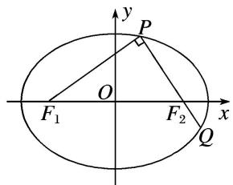

8. 解析 （1）由椭圆的定义知， $2a=|PF_{1}|+|PF_{2}|=(2+\sqrt{2})+(2-\sqrt{2})=4$ ，故 a=2.
设椭圆的半焦距为 c，由已知得 $PF_{1} \perp PF_{2}$ ，因此
$2c = |F_{1}F_{2}| = \sqrt{|PF_{1}|^{2} + |PF_{2}|^{2}} = \sqrt{(2 + \sqrt{2})^{2} + (2 - \sqrt{2})^{2}} = 2\sqrt{3}$ ，即 $c = \sqrt{3}$ ，从而 $b = \sqrt{a^2 - c^2} = 1$
故所求椭圆的标准方程为 $\frac{x^{2}}{4}+y^{2}=1$ .  
（2）如图，由 $PF_{1} \perp PQ$ ， $|PQ| = \lambda |PF_{1}|$ ，得 $|QF_{1}| = \sqrt{|PF_{1}|^{2} + |PQ|^{2}} = \sqrt{1 + \lambda^{2}} |PF_{1}|$

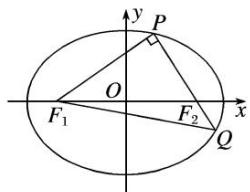
由椭圆的定义知， $|PF_{1}|+|PF_{2}|=2a,\quad|QF_{1}|+|QF_{2}|=2a,$
所以 $|PF_{1}|+|PQ|+|QF_{1}|=4a$ 。于是 $(1+\lambda+\sqrt{1+\lambda^{2}})|PF_{1}|=4a$ ，解得 $|PF_{1}|=\frac{4a}{1+\lambda+\sqrt{1+\lambda^{2}}}$
故 $|PF_{2}|=2a-|PF_{1}|=\frac{2a(\lambda+\sqrt{1+\lambda^{2}}-1)}{1+\lambda+\sqrt{1+\lambda^{2}}}$ .
由勾股定理得 $|PF_{1}|^{2}+|PF_{2}|^{2}=|F_{1}F_{2}|^{2}=(2c)^{2}=4c^{2}$
从而 $\left[\frac{4a}{1 + \lambda + \sqrt{1 + \lambda^2}}\right]^2 + \left[\frac{2a(\lambda + \sqrt{1 + \lambda^2} - 1)}{1 + \lambda + \sqrt{1 + \lambda^2}}\right]^2 = 4c^2$ ，两边除以 $4a^2$ ，得$\frac{4}{(1 + \lambda + \sqrt{1 + \lambda^2})^2} + \frac{(\lambda + \sqrt{1 + \lambda^2} - 1)^2}{(1 + \lambda + \sqrt{1 + \lambda^2})^2} = e^2.$ 若记 $t = 1 + \lambda + \sqrt{1 + \lambda^2}$ ,
则上式变成 $\mathrm{e}^{2}=\frac{4+(t-2)^{2}}{t^{2}}=8\left(\frac{1}{t}-\frac{1}{4}\right)^{2}+\frac{1}{2}$ . 由 $\frac{3}{4}\leq\lambda<\frac{4}{3}$ 及 $1+\lambda+\sqrt{1+\lambda^{2}}$ 关于 $\lambda$ 的单调性，
得 $3 \leq t < 4$ ，即 $\frac{1}{4} < \frac{1}{t} \leq \frac{1}{3}$ ，进而 $\frac{1}{2} < e^{2} \leq \frac{5}{9}$ ，即 $\frac{\sqrt{2}}{2} < e \leq \frac{\sqrt{5}}{3}$ .

