# 专题24 长度和距离型取值范围模型

# 【例题选讲】

[例 1] 已知抛物线 C: $y^{2}=2px(p>0)$ 的焦点为 F, A 为 C 上位于第一象限的任意一点，过点 A 的直线 l 交 C 于另一点 B，交 x 轴的正半轴于点 D.  
（1）若当点 A 的横坐标为 3，且 $\triangle ADF$ 为等边三角形，求 C 的方程；  
（2）对于（1）中求出的抛物线 $C$ ，若点 $D(x_0, 0)\left[\begin{array}{c}x_0 \geq \frac{1}{2}\end{array}\right]$ ，记点 $B$ 关于 $x$ 轴的对称点为 $E$ ， $AE$ 交 $x$ 轴于点 $P$ ，且 $AP \perp BP$ ，求证：点 $P$ 的坐标为 $(-x_0, 0)$ ，并求点 $P$ 到直线 $AB$ 的距离 $d$ 的取值范围.

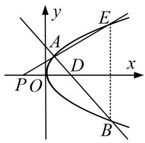

[规范解答] （1）由题意知 $F\left(\frac{p}{2},0\right)$ ， $|FA|=3+\frac{p}{2}$ ，则 $D(3+p,0)$ ，FD 的中点坐标为 $\left(\frac{3}{2}+\frac{3p}{4},0\right)$ ，则 $\frac{3}{2}+\frac{3p}{4}=3$ ，解得 p=2，故 C 的方程为 $y^{2}=4x$ .  
（2）依题意可设直线 AB 的方程为 $x=my+x_{0}(m\neq0)$ ， $A(x_{1},y_{1})$ ， $B(x_{2},y_{2})$ ，
则 $E(x_{2}, -y_{2})$ ，由 $\left\{\begin{aligned}y^{2}&=4x,\\ x&=my+x_{0},\end{aligned}\right.$ 消去 x，得 $y^{2}-4my-4x_{0}=0,\quad x_{0}\geq\frac{1}{2}.$
所以 $\Delta=16m^{2}+16x_{0}>0,\quad y_{1}+y_{2}=4m,\quad y_{1}y_{2}=-4x_{0},$
设 P 的坐标为 $(x_{P}, 0)$ ，则 $\overrightarrow{PE} = (x_{2} - x_{P}, -y_{2})$ ， $\overrightarrow{PA} = (x_{1} - x_{P}, y_{1})$ ，
由题意知 $\overrightarrow{PE}//\overrightarrow{PA}$ ，所以 $(x_{2}-x_{P})y_{1}+y_{2}(x_{1}-x_{P})=0$ ，即 $x_{2}y_{1}+y_{2}x_{1}=\frac{y_{2}^{2}y_{1}+y_{1}^{2}y_{2}}{4}=\frac{y_{1}y_{2}(y_{1}+y_{2})}{4}=(y_{1}+y_{2})x_{P}$
显然 $y_{1}+y_{2}=4m\neq0$ ，所以 $x_{P}=\frac{y_{1}y_{2}}{4}=-x_{0}$ ，即证 $P(-x_{0},0)$ ，由题意知 $\triangle EPB$ 为等腰直角三角形，
所以 $k_{AP}=1$ ，即 $\frac{y_{1}+y_{2}}{x_{1}-x_{2}}=1$ ，也即 $\frac{y_{1}+y_{2}}{\frac{1}{4}(y_{1}^{2}-y_{2}^{2})}=1$ ，
所以 $y_{1}-y_{2}=4$ ，所以 $(y_{1}+y_{2})^{2}-4y_{1}y_{2}=16$ ，即 $16m^{2}+16x_{0}=16$ ， $m^{2}=1-x_{0}$ ， $x_{0}<1$ ，
又因为 $x_{0} \geq \frac{1}{2}$ ，所以 $\frac{1}{2} \leq x_{0} < 1$ ， $d = \frac{|-x_{0} - x_{0}|}{\sqrt{1 + m^{2}}} = \frac{2x_{0}}{\sqrt{1 + m^{2}}} = \frac{2x_{0}}{\sqrt{2 - x_{0}}}$
令 $\sqrt{2 - x_0} = t\in \left[1,\frac{\sqrt{6}}{2}\right],x_0 = 2 - t^2,d = \frac{2(2 - t^2)}{t} = \frac{4}{t} -2t,$ 易知 $f(t) = \frac{4}{t} -2t$ 在 $\left[1,\frac{\sqrt{6}}{2}\right]$ 上是减函数，
所以 $d \in \left[\frac{\sqrt{6}}{3}, 2\right]$ . 所以 d 的取值范围是 $\left[\frac{\sqrt{6}}{3}, 2\right]$ .

[例2] 已知椭圆 $C: \frac{x^2}{a^2} + \frac{y^2}{b^2} = 1 (a > b > 0)$ 的离心率为 $\frac{\sqrt{2}}{2}$ ，过点 $M(1, 0)$ 的直线 $l$ 交椭圆 $C$ 于 $A$ ， $B$ 两点， $|MA| = \lambda |MB|$ ，且当直线 $l$ 垂直于 $x$ 轴时， $|AB| = \sqrt{2}$ .  
（1）求椭圆 C 的方程;  
（2）若 $\lambda \in \left[\frac{1}{2}, 2\right]$ ，求弦长 $|AB|$ 的取值范围.

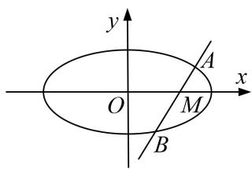

[规范解答] （1）由已知 $e=\frac{\sqrt{2}}{2}$ ，得 $\frac{c}{a}=\frac{\sqrt{2}}{2}$ ，又当直线垂直于 x 轴时， $|AB|=\sqrt{2}$ ，
所以椭圆过点 $\left(1,\frac{\sqrt{2}}{2}\right)$ ，代入椭圆方程得 $\frac{1}{a^{2}}+\frac{1}{2b^{2}}=1$ ，
$\because a^{2}=b^{2}+c^{2}$ ，联立方程可得 $a^{2}=2,\ b^{2}=1$ ，∴椭圆C的方程为 $\frac{x^{2}}{2}+y^{2}=1$ .  
（2）当过点 M 的直线斜率为 0 时，点 A, B 分别为椭圆长轴的端点，
$\lambda = \frac{|MA|}{|MB|} = \frac{\sqrt{2} + 1}{\sqrt{2} - 1} = 3 + 2\sqrt{2} > 2$ 或 $\lambda = \frac{|MA|}{|MB|} = \frac{\sqrt{2} - 1}{\sqrt{2} + 1} = 3 - 2\sqrt{2} < \frac{1}{2}$ ，不符合题意。∴直线的斜率不能为0.
设直线方程为 $x=my+1$ ， $A(x_{1}, y_{1})$ ， $B(x_{2}, y_{2})$ ，
将直线方程代入椭圆方程得： $(m^{2}+2)y^{2}+2my-1=0$
由根与系数的关系可得， $\left\{\begin{aligned}y_{1}+y_{2}&=-\frac{2m}{m^{2}+2}\\ y_{1}y_{2}&=-\frac{1}{m^{2}+2}\end{aligned}\right.$ ①，
由根与系数的关系可得， $y_{1}y_{2}=\frac{1}{m^{2}+2}$ ②，
将①式平方除以②式可得： $\frac{y_{1}}{y_{2}}+\frac{y_{2}}{y_{1}}+2=-\frac{4m^{2}}{m^{2}+2}$ ，由已知 $|MA|=\lambda|MB|$ 可知， $\frac{y_{1}}{y_{2}}=-\lambda$
$\therefore -\lambda - \frac{1}{\lambda} + 2 = -\frac{4m^2}{m^2 + 2}$ , 又知 $\lambda \in \left[\frac{1}{2}, 2\right]$ , $\therefore -\lambda - \frac{1}{\lambda} + 2 \in \left[-\frac{1}{2}, 0\right]$ , $\therefore -\frac{1}{2} \leq -\frac{4m^2}{m^2 + 2} \leq 0$ , 解得 $m^2 \in \left[0, \frac{2}{7}\right]$ .
$\left| A B \right| ^ {2} = (1 + m ^ {2}) \left| y _ {1} - y _ {2} \right| ^ {2} = (1 + m ^ {2}) \left[ \left(y _ {1} + y _ {2}\right) ^ {2} - 4 y _ {1} y _ {2} \right] = 8 \left(\frac {m ^ {2} + 1}{m ^ {2} + 2}\right) ^ {2} = 8 \left(1 - \frac {1}{m ^ {2} + 2}\right) ^ {2},$
$\because m ^ {2} \in \left[ 0, \frac {2}{7} \right], \therefore \frac {1}{m ^ {2} + 2} \in \left[ \frac {7}{1 6}, \frac {1}{2} \right], \therefore | A B | \in \left[ \sqrt {2}, \frac {9 \sqrt {2}}{8} \right].$

[例 3] 设点 F 为椭圆 C: $\frac{x^{2}}{4m} + \frac{y^{2}}{3m} = 1 (m > 0)$ 的左焦点，直线 y = x 被椭圆 C 截得弦长为 $\frac{4\sqrt{42}}{7}$ .  
（1）求椭圆 C 的方程;  
（2）圆 $P: \left(x + \frac{4\sqrt{3}}{7}\right)^2 + \left(y - \frac{3\sqrt{3}}{7}\right)^2 = r^2 (r > 0)$ 与椭圆 $C$ 交于 $A, B$ 两点， $M$ 为线段 $AB$ 上任意一点，直线 $FM$ 交椭圆 $C$ 于 $P, Q$ 两点， $AB$ 为圆 $P$ 的直径，且直线 $FM$ 的斜率大于1，求 $|PF| \cdot |QF|$ 的取值范围.

[规范解答] （1）由 $\left\{\begin{aligned}\frac{x^{2}}{4m}+\frac{y^{2}}{3m}=1,\\ y=x\end{aligned}\right.$ 得 $x^{2}=y^{2}=\frac{12m}{7}$ ，故 $2\sqrt{x^{2}+y^{2}}=2\sqrt{\frac{24m}{7}}=\frac{4\sqrt{42}}{7}$ ，解得m=1，
故椭圆 C 的方程为 $\frac{x^{2}}{4} + \frac{y^{2}}{3} = 1$ .  
（2）设 $A(x_{1},y_{1}),B(x_{2},y_{2})$ ，则 $\left\{ \begin{array}{l}x_{1} + x_{2} = -\frac{8\sqrt{3}}{7},\\ y_{1} + y_{2} = \frac{6\sqrt{3}}{7} \end{array} \right.$ 又 $\left\{ \begin{array}{l}\frac{x_1^2}{4} +\frac{y_1^2}{3} = 1,\\ \frac{x_2^2}{4} +\frac{y_2^2}{3} = 1 \end{array} \right.$
所以 $\frac{(x_1 + x_2)(x_1 - x_2)}{4} +\frac{(y_1 + y_2)(y_1 - y_2)}{3} = 0.$
则 $(x_{1}-x_{2})-(y_{1}-y_{2})=0$ ，故 $k_{AB}=\frac{y_{1}-y_{2}}{x_{1}-x_{2}}=1$ ，
则直线 $AB$ 的方程为 $y - \frac{3\sqrt{3}}{7} = x + \frac{4\sqrt{3}}{7}$ ，即 $y = x + \sqrt{3}$ ，代入椭圆 $C$ 的方程并整理得 $7x^{2} + 8\sqrt{3} x = 0$ 则 $x_{1}=0,\quad x_{2}=-\frac{8\sqrt{3}}{7}$ ，故直线 FM 的斜率 $k\in[\sqrt{3},+\infty)$ ,
设 FM: $y=k(x+1)$ ，由 $\left\{\begin{aligned}\frac{x^{2}}{4}+\frac{y^{2}}{3}&=1,\\ y=k(x+1)\end{aligned}\right.$ 得 $(3+4k^{2})x^{2}+8k^{2}x+4k^{2}-12=0$ ，
设 $P(x_{3}, y_{3})$ ， $Q(x_{4}, y_{4})$ ，则有 $x_{3} + x_{4} = \frac{-8k^{2}}{3 + 4k^{2}}$ ， $x_{3}x_{4} = \frac{4k^{2} - 12}{3 + 4k^{2}}$
又 $|PF|=\sqrt{1^{2}+k^{2}}|x_{3}+1|$ ， $|QF|=\sqrt{1^{2}+k^{2}}|x_{4}+1|$
所以 $|PF|\cdot|QF|=(1+k^{2})|x_{3}x_{4}+(x_{3}+x_{4})+1|=(1+k^{2})\left|\frac{4k^{2}-12}{3+4k^{2}}-\frac{8k^{2}}{3+4k^{2}}+1\right|$
$= (1 + k ^ {2}) \times \frac {9}{3 + 4 k ^ {2}} = \frac {9}{4} \left(1 + \frac {1}{3 + 4 k ^ {2}}\right),$
因为 $k \geq \sqrt{3}$ ，所以 $\frac{9}{4} < \frac{9}{4} \left(1 + \frac{1}{3 + 4k^{2}}\right) \leq \frac{12}{5}$ ，即 $|PF| \cdot |QF|$ 的取值范围是 $\left(\frac{9}{4}, \frac{12}{5}\right]$ .

[例 4] 已知椭圆 C: $\frac{x^{2}}{a^{2}}+\frac{y^{2}}{b^{2}}=1(a>b>0)$ 的离心率是 $\frac{\sqrt{3}}{2}$ ，且椭圆经过点 $(0,1)$ .  
（1）求椭圆 C 的标准方程;  
（2）若直线 $l_{1}$ : $x+2y-2=0$ 与圆 D: $x^{2}+y^{2}-6x-4y+m=0$ 相切:

(i)求圆 D 的标准方程;

(ii)若直线 $l_{2}$ 过定点(3, 0)，与椭圆 $C$ 交于不同的两点 $E, F$ ，与圆 $D$ 交于不同的两点 $M, N$ ，求 $|EF| \cdot |MN|$ 的取值范围.

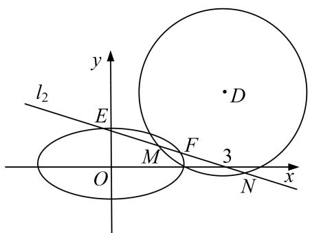

[规范解答] （1）∵椭圆经过点(0, 1), ∴ $\frac{1}{b^{2}}=1$ ，解得 $b^{2}=1$ ，∵ $e=\frac{\sqrt{3}}{2}$ ，∴ $\frac{c}{a}=\frac{\sqrt{3}}{2}$ ，∴ $3a^{2}=4c^{2}=4(a^{2}-1)$ ，解得 $a^{2}=4$ ，∴椭圆C的标准方程为 $\frac{x^{2}}{4}+y^{2}=1$ .  
（2） (i) 圆 D 的标准方程为 $(x-3)^{2}+(y-2)^{2}=13-m$ ，圆心为 $(3, 2)$ ,
∵ 直线 $l_{1}$ : $x+2y-2=0$ 与圆 D 相切，∴ 圆 D 的半径 $r=\frac{|3+2\times2-2|}{\sqrt{5}}=\sqrt{5}$ ,
∴圆 D 的标准方程为 $(x-3)^{2}+(y-2)^{2}=5$ .

(ii)由题可得直线 $l_{2}$ 的斜率存在，设 $l_{2}$ 方程为 $y=k(x-3)$ ,
由 $\left\{\begin{aligned}y&=k(x+3)\\ \frac{x^{2}}{4}&+y^{2}=1\end{aligned}\right.$ 消去 y 整理得 $(1+4k^{2})x^{2}-24k^{2}x+36k^{2}-4=0$ ,
∵直线 $l_{2}$ 与椭圆 C 交于不同的两点 E, F,
∴ $\Delta=(-24k^{2})^{2}-4(1+4k^{2})(36k^{2}-4)=16(1-5k^{2})>0$ ，解得 $0\leq k^{2}<\frac{1}{5}$ .
设 $E(x_{1}, y_{1})$ ， $F(x_{2}, y_{2})$ ，则 $x_{1} + x_{2} = \frac{24k^{2}}{1 + 4k^{2}}$ ， $x_{1}x_{2} = \frac{36k^{2} - 4}{1 + 4k^{2}}$
$\therefore | E F | = \sqrt {1 + k ^ {2}} \sqrt {\left(x _ {1} + x _ {2}\right) ^ {2} - 4 x _ {1} x _ {2}} = \sqrt {(1 + k ^ {2}) \left[ \left(\frac {2 4 k ^ {2}}{1 + 4 k ^ {2}}\right) ^ {2} - 4 \times \frac {3 6 k ^ {2} - 4}{1 + 4 k ^ {2}} \right]} = 4 \sqrt {\frac {(1 + k ^ {2}) (1 - 5 k ^ {2})}{(1 + 4 k ^ {2}) ^ {2}}},$
又圆 D 的圆心 $(3, 2)$ 到直线 $l_{2}$ : kx - y - 3k = 0 的距离 $d = \frac{|3k - 2 - 3k|}{\sqrt{k^{2} + 1}} = \frac{2}{\sqrt{k^{2} + 1}}$ ,
∴圆 D 截直线 $l_{2}$ 所得弦长 $|MN|=2\sqrt{r^{2}-d^{2}}=2\sqrt{\frac{5k^{2}+1}{k^{2}+1}}$ ,
$\therefore | E F | \cdot | M N | = 4 \sqrt {\frac {(1 + k ^ {2}) (1 - 5 k ^ {2})}{(1 + 4 k ^ {2}) ^ {2}}} \times 2 \sqrt {\frac {5 k ^ {2} + 1}{k ^ {2} + 1}} = 8 \sqrt {\frac {1 - 2 5 k ^ {4}}{(1 + 4 k ^ {2}) ^ {2}}},$
设 $t = 1 + 4k^2\in \left[1,\frac{9}{5}\right]$ ，则 $k^2 = \frac{t - 1}{4},\therefore |EF|\cdot |MN| = 8\sqrt{\frac{1 - 25(\frac{t - 1}{4})^2}{t^2}} = 2\sqrt{-9(\frac{1}{t})^2 + 50\frac{1}{t} - 25},$
$\because t \in \left[ 1, \frac {9}{5} \right], \therefore - 9 (\frac {1}{t}) ^ {2} + 5 0 \frac {1}{t} - 2 5 \in (0, 1 6 ],$
∴ $|EF|\cdot|MN|$ 的取值范围为(0, 8].

[例 5] 已知椭圆 C: $\frac{x^{2}}{a^{2}} + \frac{y^{2}}{b^{2}} = 1 (a > b > 0)$ 的离心率为 $\frac{\sqrt{3}}{3}$ ，且椭圆 C 过点 $\left(\frac{3}{2}, \frac{\sqrt{2}}{2}\right)$ .  
（1）求椭圆 C 的标准方程;  
（2）过椭圆 $C$ 的右焦点的直线 $l$ 与椭圆 $C$ 分别相交于 $A, B$ 两点，且与圆 $O: x^2 + y^2 = 2$ 相交于 $E, F$ 两点，求 $|AB| \cdot |EF|^2$ 的取值范围.

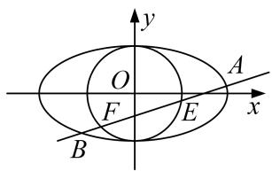

[规范解答] （1）由题意得 $\frac{c}{a}=\frac{\sqrt{3}}{3}$ ，所以 $a^{2}=\frac{3}{2}b^{2}$ ，所以椭圆的方程为 $\frac{x^{2}}{\frac{3}{2}b^{2}}+\frac{y^{2}}{b^{2}}=1$ ，
将点 $\left(\frac{3}{2},\frac{\sqrt{2}}{2}\right)$ 代入方程得 $b^{2}=2$ ，即 $a^{2}=3$ ，所以椭圆C的标准方程为 $\frac{x^{2}}{3}+\frac{y^{2}}{2}=1$ 。  
（2）由（1）可知，椭圆的右焦点为(1, 0)，

①若直线 l 的斜率不存在，直线 l 的方程为 x=1，
则 $A\left(1, \frac{2\sqrt{3}}{3}\right), B\left(1, -\frac{2\sqrt{3}}{3}\right), E(1, 1), F(1, -1)$ ,
所以 $|AB|=\frac{4\sqrt{3}}{3}$ ， $|EF|^{2}=4$ ， $|AB|\cdot|EF|^{2}=\frac{16\sqrt{3}}{3}$ .

②若直线 l 的斜率存在，设直线 l 的方程为 $y=k(x-1)$ ， $A(x_{1},y_{1})$ ， $B(x_{2},y_{2})$ .
联立 $\left\{ \begin{array}{l} \frac{x^2}{3} + \frac{y^2}{2} = 1, \\ y = k - x - 1 \end{array} \right.$ 可得 $(2 + 3k^2)x^2 - 6k^2x + 3k^2 - 6 = 0$ ，则 $x_1 + x_2 = \frac{6k^2}{2 + 3k^2}, x_1x_2 = \frac{3k^2 - 6}{2 + 3k^2}$ ,
所以 $|AB|=\sqrt{(1+k^{2})(x_{1}-x_{2})^{2}}=\sqrt{(1+k^{2})\left[\left(\frac{6k^{2}}{2+3k^{2}}\right)^{2}-4\times\frac{3k^{2}-6}{2+3k^{2}}\right]}=\frac{4\sqrt{3}\quad k^{2}+1}{2+3k^{2}}$
因为圆心 $O(0, 0)$ 到直线 $l$ 的距离 $d = \frac{|k|}{\sqrt{k^2 + 1}}$ ，所以 $|EF|^2 = 4\left(2 - \frac{k^2}{k^2 + 1}\right) = \frac{4}{k^2 + 1} k^2 + 2$
所以 $|AB|\cdot|EF|^{2}=\frac{4\sqrt{3}(k^{2}+1)}{2+3k^{2}}\cdot\frac{4(k^{2}+2)}{k^{2}+1}=\frac{16\sqrt{3}(k^{2}+2)}{2+3k^{2}}=\frac{16\sqrt{3}}{3}\cdot\frac{k^{2}+2}{k^{2}+\frac{2}{3}}=\frac{16\sqrt{3}}{3}\left(1+\frac{\frac{4}{3}}{k^{2}+\frac{2}{3}}\right)$ .
因为 $k^2 \in [0, +\infty)$ ，所以 $|AB| \cdot |EF|^2 \in \left[\frac{16\sqrt{3}}{3}, 16\sqrt{3}\right]$ .

综上， $|AB|\cdot|EF|^{2}$ 的取值范围为 $\left[\frac{16\sqrt{3}}{3},\quad16\sqrt{3}\right]$ .

[例6] 已知椭圆 $\Gamma: \frac{x^2}{4} + \frac{y^2}{2} = 1$ ，过点 $P(1, 1)$ 作倾斜角互补的两条不同直线 $l_1, l_2$ ，设 $l_1$ 与椭圆 $\Gamma$ 交于 $A$ 、 $B$ 两点， $l_2$ 与椭圆 $\Gamma$ 交于 $C, D$ 两点.  
（1）若 $P(1, 1)$ 为线段 AB 的中点，求直线 AB 的方程；  
（2）若直线 $l_{1}$ 与 $l_{2}$ 的斜率都存在，记 $\lambda=\frac{|AB|}{|CD|}$ ，求 $\lambda$ 的取值范围.

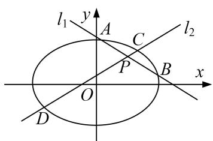

[规范解答] （1）解法一(点差法): 由题意可知直线 $AB$ 的斜率存在.
设 $A(x_{1},y_{1}),B(x_{2},y_{2})$ ，则 $\left\{ \begin{array}{l}x_1^2 +\frac{y_1^2}{2} = 1,\\ \frac{x_2^2}{4} +\frac{y_2^2}{2} = 1, \end{array} \right.$ 两式作差得 $\frac{y_1 - y_2}{x_1 - x_2} = -\frac{2}{4}\cdot \frac{x_1 + x_2}{y_1 + y_2} = -\frac{2}{4}\cdot \frac{2\times 1}{2\times 1} = -\frac{1}{2},$
∴ 直线 AB 的方程为 $y-1=-\frac{1}{2}(x-1)$ ，即 $x+2y-3=0$ .
解法二：由题意可知直线 $AB$ 的斜率存在．设直线 $AB$ 的斜率为 $k$
则其方程为 $y-1=k(x-1)$ ，代入 $x^{2}+2y^{2}=4$ 中，得 $x^{2}+2[kx-(k-1)]^{2}-4=0$ .
$\therefore (1 + 2 k ^ {2}) x ^ {2} - 4 k (k - 1) x + 2 (k - 1) ^ {2} - 4 = 0.$
$\Delta = [ - 4 (k - 1) k ] ^ {2} - 4 (2 k ^ {2} + 1) [ 2 (k - 1) ^ {2} - 4 ] = 8 (3 k ^ {2} + 2 k + 1) > 0.$
设 $A(x_{1}, y_{1}), B(x_{2}, y_{2})$ ，则 $\left\{\begin{aligned}x_{1}+x_{2}&=\frac{4k-k-1}{2k^{2}+1},\\ x_{1}x_{2}&=\frac{2-k-1^{2}-4}{2k^{2}+1}\end{aligned}\right.$
∵AB中点为(1, 1)，∴ $\frac{1}{2}(x_{1}+x_{2})=\frac{2k-k-1}{2k^{2}+1}=1$ ，则 $k=-\frac{1}{2}$ .
∴ 直线 AB 的方程为 $y-1=-\frac{1}{2}(x-1)$ ，即 $x+2y-3=0$ .  
（2）由（1）可知 $|AB|=\sqrt{1+k^{2}}\quad|x_{1}-x_{2}|=\sqrt{1+k^{2}}\cdot\sqrt{x_{1}+x_{2}\quad^{2}-4x_{1}x_{2}}=\frac{\sqrt{1+k^{2}}\cdot\sqrt{8\quad3k^{2}+2k+1}}{2k^{2}+1}$ .
设直线 $CD$ 的方程为 $y - 1 = -k(x - 1)(k \neq 0)$ . 同理可得 $|CD| = \frac{\sqrt{1 + k^2} \cdot \sqrt{8 - 3k^2 - 2k + 1}}{2k^2 + 1}$ .
$\therefore \lambda = \frac {| A B |}{| C D |} = \sqrt {\frac {3 k ^ {2} + 2 k + 1}{3 k ^ {2} - 2 k + 1}} (k \neq 0), \lambda > 0.$
$\therefore \lambda^{2} = 1 + \frac{4k}{3k^{2} + 1 - 2k} = 1 + \frac{4}{3k + \frac{1}{k} - 2}$ 令 $t = 3k + \frac{1}{k}$ 则 $t\in (-\infty , - 2\sqrt{3}] \cup [2\sqrt{3}, + \infty),$
令 $g(t) = 1 + \frac{4}{t - 2}, t\in (-\infty , - 2\sqrt{3} ]\cup [2\sqrt{3}, + \infty),$
$\because g(t)$ 在 $(- \infty, -2\sqrt{3}]$ , $[2\sqrt{3}, +\infty)$ 上单调递减, $\therefore 2 - \sqrt{3} \leq g(t) < 1$ 或 $1 < g(t) \leq 2 + \sqrt{3}$ .
故 $2 - \sqrt{3} \leq \lambda^2 < 1$ 或 $1 < \lambda^2 \leq 2 + \sqrt{3}$ . $\therefore \lambda \in \left[\frac{\sqrt{6} - \sqrt{2}}{2}, 1\right] \cup \left[1, \frac{\sqrt{6} + \sqrt{2}}{2}\right]$ .

[例7] 已知点 $F$ 为椭圆 $E: \frac{x^2}{a^2} + \frac{y^2}{b^2} = 1 (a > b > 0)$ 的左焦点，且两焦点与短轴的一个顶点构成一个等边三角形，直线 $\frac{x}{4} + \frac{y}{2} = 1$ 与椭圆 $E$ 有且仅有一个交点 $M$ .  
（1）求椭圆 E 的方程;  
（2）设直线 $\frac{x}{4}+\frac{y}{2}=1$ 与y轴交于P，过点P的直线l与椭圆E交于不同的两点A，B，若 $\lambda|PM|^{2}=|PA|\cdot|PB|$ ，求实数 $\lambda$ 的取值范围.

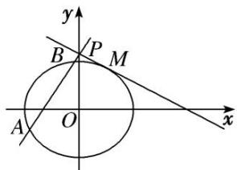

[规范解答] （1）由题意，得 $a = 2c$ ， $b = \sqrt{3} c$ ，则椭圆 $E$ 为 $\frac{x^2}{4c^2} +\frac{y^2}{3c^2} = 1.$
由 $\left\{\begin{aligned}\frac{x^{2}}{4}+\frac{y^{2}}{3}&=c^{2},\\\frac{x}{4}+\frac{y}{2}&=1\end{aligned}\right.$
消去 y，得 $x^{2}-2x+4-3c^{2}=0$ .
∵ 直线 $\frac{x}{4} + \frac{y}{2} = 1$ 与椭圆 E 有且仅有一个交点 M，∴ $\Delta = 4 - 4(4 - 3c^{2}) = 0$ ，解得 $c^{2} = 1$ ，
∴椭圆 E 的方程为 $\frac{x^{2}}{4} + \frac{y^{2}}{3} = 1$ .  
（2）由（1）得 $M\left\{1, \frac{3}{2}\right\}$ ，∵ 直线 $\frac{x}{4} + \frac{y}{2} = 1$ 与 y 轴交于 $P(0, 2)$ ，∴ $|PM|^{2} = \frac{5}{4}$ ,

①当直线 l 与 x 轴垂直时， $|PA|\cdot|PB|=(2+\sqrt{3})\times(2-\sqrt{3})=1,\quad\therefore\lambda|PM|^{2}=|PA|\cdot|PB|\Rightarrow\lambda=\frac{4}{5},$   
②当直线 l 与 x 轴不垂直时，设直线 l 的方程为 $y=kx+2$ ， $A(x_{1},y_{1})$ ， $B(x_{2},y_{2})$ ，
由 $\left\{\begin{aligned}y&=kx+2,\\ 3x^{2}&+4y^{2}-12=0\end{aligned}\right.$ 消去 y，整理得 $(3+4k^{2})x^{2}+16kx+4=0$ ，
则 $x_{1}x_{2}=\frac{4}{3+4k^{2}}$ ，且 $\Delta=48(4k^{2}-1)>0$ ，
$\therefore | P A | \cdot | P B | = (1 + k ^ {2}) x _ {1} x _ {2} = (1 + k ^ {2}) \cdot \frac {4}{3 + 4 k ^ {2}} = 1 + \frac {1}{3 + 4 k ^ {2}} = \frac {5}{4} \lambda ,$
$\therefore \lambda = \frac{4}{5}\left(1 + \frac{1}{3 + 4k^2}\right), \because k^2 > \frac{1}{4}, \therefore \frac{4}{5} < \lambda < 1.$ 综上所述， $\lambda$ 的取值范围是 $\left[\frac{4}{5}, 1\right]$ .

# 【对点训练】

1. 已知椭圆 $C: \frac{x^2}{a^2} + \frac{y^2}{b^2} = 1 (a > b > 0)$ 的离心率为 $\frac{\sqrt{3}}{2}$ ，短轴长为 2.  
（1）求椭圆 C 的标准方程;  
（2）设直线 $l: y = kx + m$ 与椭圆 $C$ 交于 $M, N$ 两点， $O$ 为坐标原点，若 $k_{OM} \cdot k_{ON} = \frac{5}{4}$ ，求原点 $O$ 到直线 $l$ 的距离的取值范围.

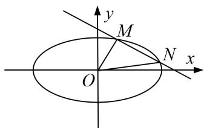

1. 解析 （1）由题知 $e = \frac{c}{a} = \frac{\sqrt{3}}{2}, 2b = 2$ ，又 $a^2 = b^2 + c^2, \therefore b = 1, a = 2,$
∴椭圆 C 的标准方程为 $\frac{x^{2}}{4} + y^{2} = 1$ .  
（2）设 $M(x_{1},y_{1})$ ， $N(x_{2},y_{2})$ ，联立方程 $\left\{ \begin{array}{l}y = kx + m,\\ \frac{x^2}{4} +y^2 = 1, \end{array} \right.$ 得 $(4k^{2} + 1)x^{2} + 8kmx + 4m^{2} - 4 = 0,$
依题意， $\Delta=(8km)^{2}-4(4k^{2}+1)(4m^{2}-4)>0$ ，化简得 $m^{2}<4k^{2}+1$ ，①
$x _ {1} + x _ {2} = - \frac {8 k m}{4 k ^ {2} + 1}, x _ {1} x _ {2} = \frac {4 m ^ {2} - 4}{4 k ^ {2} + 1}, y _ {1} y _ {2} = (k x _ {1} + m) (k x _ {2} + m) = k ^ {2} x _ {1} x _ {2} + k m (x _ {1} + x _ {2}) + m ^ {2}.$
若 $k_{OM} \cdot k_{ON} = \frac{5}{4}$ ，则 $\frac{y_{1}y_{2}}{x_{1}x_{2}} = \frac{5}{4}$ ，即 $4y_{1}y_{2} = 5x_{1}x_{2}$ ，
$\therefore (4 k ^ {2} - 5) x _ {1} x _ {2} + 4 k m \left(x _ {1} + x _ {2}\right) + 4 m ^ {2} = 0, \quad \therefore (4 k ^ {2} - 5) \cdot \frac {4 (m ^ {2} - 1)}{4 k ^ {2} + 1} + 4 k m \cdot \left(- \frac {8 k m}{4 k ^ {2} + 1}\right) + 4 m ^ {2} = 0,$
即 $(4k^{2}-5)(m^{2}-1)-8k^{2}m^{2}+m^{2}(4k^{2}+1)=0$ ，化简得 $m^{2}+k^{2}=\frac{5}{4}$ ，②，由①②得 $0\leq m^{2}<\frac{6}{5}$ ， $\frac{1}{20}<k^{2}\leq\frac{5}{4}$ .
∵原点 O 到直线 l 的距离 $d=\frac{|m|}{\sqrt{1+k^{2}}}$ ，∴ $d^{2}=\frac{m^{2}}{1+k^{2}}=\frac{\frac{5}{4}-k^{2}}{1+k^{2}}=-1+\frac{9}{4(1+k^{2})}$ ,
又 $\frac{1}{20} < k^2 \leq \frac{5}{4}$ , $\therefore 0 \leq d^2 < \frac{8}{7}$ , $\therefore$ 原点 $O$ 到直线 $l$ 的距离的取值范围是 $\left[0, \frac{2\sqrt{14}}{7}\right]$ .

2. 已知椭圆 $C: \frac{x^2}{a^2} + \frac{y^2}{b^2} = 1 (a > b > 0)$ 经过点 $P\left(1, \frac{\sqrt{2}}{2}\right)$ ，且离心率为 $\frac{\sqrt{2}}{2}$ .  
（1）求椭圆 C 的方程;  
（2）设 $F_{1}$ , $F_{2}$ 分别为椭圆 $C$ 的左、右焦点, 不经过 $F_{1}$ 的直线 $l$ 与椭圆 $C$ 交于两个不同的点 $A$ , $B$ . 如果直线 $AF_{1}$ , $l$ , $BF_{1}$ 的斜率依次成等差数列, 求焦点 $F_{2}$ 到直线 $l$ 的距离 $d$ 的取值范围.

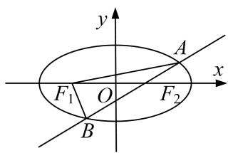

2. 解析 （1）由题意，知 $\left\{ \begin{array}{l} \frac{1}{a^2} + \frac{2}{4b^2} = 1, \\ c = \frac{\sqrt{2}}{2}, \\ a^2 = b^2 + c^2, \end{array} \right.$ 解得 $\left\{ \begin{array}{l} a^2 = 2, \\ b^2 = 1. \end{array} \right.$ 所以椭圆 $C$ 的方程为 $\frac{x^2}{2} + y^2 = 1$ .  
（2）易知直线 l 的斜率存在且不为零．设直线 l 的方程为 $y=kx+m$ ，代入椭圆方程 $\frac{x^{2}}{2}+y^{2}=1$ ，整理得 $(1+2k^{2})x^{2}+4kmx+2(m^{2}-1)=0$ ．由 $\Delta=(4km)^{2}-8(1+2k^{2})(m^{2}-1)>0$ ，得 $2k^{2}>m^{2}-1$ ．①设 $A(x_{1},y_{1})$ ， $B(x_{2},y_{2})$ ，则 $x_{1}+x_{2}=-\frac{4km}{1+2k^{2}}$ ， $x_{1}x_{2}=\frac{2(m^{2}-1)}{1+2k^{2}}$ .
因为 $F_{1}(-1,0)$ ，所以 $kAF_{1}=\frac{y_{1}}{x_{1}+1}$ ， $kBF_{1}=\frac{y_{2}}{x_{2}+1}$ .
由题可得 $2k=\frac{y_{1}}{x_{1}+1}+\frac{y_{2}}{x_{2}+1}$ ，且 $y_{1}=kx_{1}+m,\quad y_{2}=kx_{2}+m$ ，所以 $(m-k)(x_{1}+x_{2}+2)=0$ .
因为直线 l: $y=kx+m$ 不过焦点 $F_{1}(-1,0)$ ，所以 $m-k\neq0$ ，
所以 $x_{1}+x_{2}+2=0$ ，从而 $-\frac{4km}{1+2k^{2}}+2=0$ ，即 $m=k+\frac{1}{2k}$ . ②
由①②得 $2k^{2} > \left(k + \frac{1}{2k}\right)^{2} - 1$ ，化简得 $|k| > \frac{\sqrt{2}}{2}$ 。③

焦点 $F_{2}(1,0)$ 到直线 $l: y = kx + m$ 的距离 $d = \frac{|k + m|}{\sqrt{1 + k^2}} = \frac{\left|2k + \frac{1}{2k}\right|}{\sqrt{1 + k^2}} = \frac{2 + \frac{1}{2k^2}}{\sqrt{\frac{1}{k^2} + 1}}$
令 $t = \sqrt{\frac{1}{k^2} + 1}$ ，由 $|k| > \frac{\sqrt{2}}{2}$ 知 $t \in (1, \sqrt{3})$ 。于是 $d = \frac{\frac{t^2 + 3}{2}}{t} = \frac{1}{2}\left(t + \frac{3}{t}\right)$ ，
因为函数 $f(t) = \frac{1}{2}\left\{t + \frac{3}{t}\right\}$ 在 $[1, \sqrt{3}]$ 上单调递减，所以 $f(\sqrt{3}) < d < f(1)$ ，解得 $\sqrt{3} < d < 2$ ，
所以焦点 $F_{2}$ 到直线 l 的距离 d 的取值范围是 $(\sqrt{3}, 2)$ .

3. 已知椭圆 $C: \frac{x^2}{a^2} + \frac{y^2}{b^2} = 1 (a > b > 0)$ 的焦距为 2，且过点 $\left[1, \frac{\sqrt{2}}{2}\right]$ .  
（1）求椭圆 C 的方程;  
（2）过点 $M(2,0)$ 的直线交椭圆 C 于 A, B 两点，P 为椭圆 C 上一点，O 为坐标原点，且满足 $\overrightarrow{OA} + \overrightarrow{OB} = t\overrightarrow{OP}$ ，其中 $t \in \left(\frac{2\sqrt{6}}{3}, 2\right)$ ，求 $|AB|$ 的取值范围.

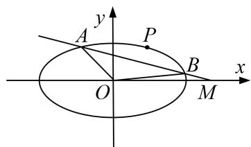

3. 解析 （1）依题意得 $\left\{ \begin{array}{l} a^2 = b^2 + 1, \\ \frac{1}{a^2} + \frac{1}{2b^2} = 1, \end{array} \right.$ 解得 $\left\{ \begin{array}{l} a^2 = 2, \\ b^2 = 1, \end{array} \right.$ ∴椭圆 $C$ 的方程为 $\frac{x^2}{2} + y^2 = 1$ .  
（2）由题意可知，直线 AB 的斜率存在，设其方程为 $y=k(x-2)$ .
由 $\left\{\begin{aligned}y&=k\quad x-2\\ \frac{x^{2}}{2}&+y^{2}=1\end{aligned}\right.$ ，
得 $(1+2k^{2})x^{2}-8k^{2}x+8k^{2}-2=0$ 。∴ $\Delta=8(1-2k^{2})>0$ ，解得 $k^{2}<\frac{1}{2}$ .
设 $A(x_{1}, y_{1}), B(x_{2}, y_{2})$ ，则 $\left\{\begin{aligned}x_{1}+x_{2}&=\frac{8k^{2}}{1+2k^{2}}, x_{1}x_{2}=\frac{8k^{2}-2}{1+2k^{2}},\\ y_{1}+y_{2}&=k x_{1}+x_{2}-4=-\frac{4k}{1+2k^{2}}.\end{aligned}\right.$
由 $\overrightarrow{OA} +\overrightarrow{OB} = t\overrightarrow{OP}$ 得 $P\left[\frac{8k^2}{t - 1 + 2k^2},\frac{-4k}{t - 1 + 2k^2}\right]$ ，代入椭圆 $C$ 的方程得 $t^2 = \frac{16k^2}{1 + 2k^2}$ .由 $\frac{2\sqrt{6}}{3} < t < 2$ 得 $\frac{1}{4} < k^2 < \frac{1}{2},$
$\therefore | A B | = \sqrt {1 + k ^ {2}}. \frac {2 \sqrt {2} \cdot \sqrt {1 - 2 k ^ {2}}}{1 + 2 k ^ {2}} = 2 \sqrt {\frac {2}{1 + 2 k ^ {2}} ^ {2} + \frac {1}{1 + 2 k ^ {2}} - 1}.$
令 $u = \frac{1}{1 + 2k^2}$ , 则 $u \in \left(\frac{1}{2}, \frac{2}{3}\right)$ , $\therefore |AB| = 2\sqrt{2u^2 + u - 1} \in \left(0, \frac{2\sqrt{5}}{3}\right)$ .
∴|AB|的取值范围为 $\left\{0,\frac{2\sqrt{5}}{3}\right\}$ .

4. 在平面直角坐标系 $xOy$ 中，已知圆 $C_1: x^2 + y^2 = r^2 (r > 0)$ 与直线 $l_0: y = x + 2\sqrt{2}$ 相切，点 $A$ 为圆 $C_1$ 上一动点， $AN \perp x$ 轴于点 $N$ ，且动点 $M$ 满足 $\overrightarrow{OM} + \overrightarrow{AM} = \overrightarrow{ON}$ ，设动点 $M$ 的轨迹为曲线 $C$ .  
（1）求曲线 C 的方程;  
（2）设 P, Q 是曲线 C 上两动点，线段 PQ 的中点为 T，直线 OP, OQ 的斜率分别为 $k_{1}$ , $k_{2}$ ，且 $k_{1}k_{2} = -\frac{1}{4}$ ，求 $|OT|$ 的取值范围.

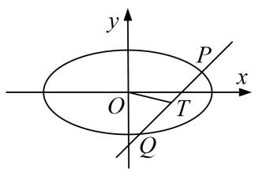

4. 解析 （1）设动点 $M(x, y)$ ， $A(x_{0}, y_{0})$ ，∵ $AN \perp x$ 轴于点 N，∴ $N(x_{0}, 0)$ .
又圆 $C_{1}$ : $x^{2} + y^{2} = r^{2} (r > 0)$ 与直线 $l_{0}$ : $y = x + 2\sqrt{2}$ ，即 $x - y + 2\sqrt{2} = 0$ 相切，
$\therefore r = \frac{|2\sqrt{2}|}{\sqrt{2}} = 2, \therefore$ 圆 $C_1: x^2 + y^2 = 4.$ 由 $\overrightarrow{OM} + \overrightarrow{AM} = \overrightarrow{ON},$
得 $(x, y)+(x-x_{0}, y-y_{0})=(x_{0}, 0)$ ，∴ $\begin{cases}2x-x_{0}=x_{0},\\2y-y_{0}=0,\end{cases}$ 即 $\begin{cases}x_{0}=x,\\y_{0}=2y,\end{cases}$
又点 A 为圆 $C_{1}$ 上一动点，∴ $x^{2} + 4y^{2} = 4$ ，∴ 曲线 C 的方程为 $\frac{x^{2}}{4} + y^{2} = 1$ .  
（2）当直线 PQ 的斜率不存在时，可取直线 OP 的方程为 $y=\frac{1}{2}x$ ,
不妨取点 $P\left(\sqrt{2}, \frac{\sqrt{2}}{2}\right)$ ，则 $Q\left(\sqrt{2}, -\frac{\sqrt{2}}{2}\right)$ ， $T(\sqrt{2}, 0)$ ， $\therefore |OT| = \sqrt{2}$ .
当直线 PQ 的斜率存在时，设直线 PQ 的方程为 $y=kx+m$ ， $P(x_{1},y_{1})$ ， $Q(x_{2},y_{2})$ ，
由 $\left\{\begin{aligned}y&=kx+m,\\ x^{2}&+4y^{2}=4,\end{aligned}\right.$ 可得 $(1+4k^{2})x^{2}+8kmx+4m^{2}-4=0,$
$\therefore x _ {1} + x _ {2} = \frac {- 8 k m}{1 + 4 k ^ {2}}, x _ {1} x _ {2} = \frac {4 m ^ {2} - 4}{1 + 4 k ^ {2}}. \because k _ {1} k _ {2} = - \frac {1}{4}, \therefore 4 y _ {1} y _ {2} + x _ {1} x _ {2} = 0.$
$\therefore 4 \left(k x _ {1} + m\right) \left(k x _ {2} + m\right) + x _ {1} x _ {2} = \left(4 k ^ {2} + 1\right) x _ {1} x _ {2} + 4 k m \left(x _ {1} + x _ {2}\right) + 4 m ^ {2} = 4 m ^ {2} - 4 - \frac {3 2 k ^ {2} m ^ {2}}{1 + 4 k ^ {2}} + 4 m ^ {2} = 0,$
化简得 $2m^{2}=1+4k^{2},\quad\therefore m^{2}\geq\frac{1}{2}.$
$\Delta = 6 4 k ^ {2} m ^ {2} - 4 (4 k ^ {2} + 1) (4 m ^ {2} - 4) = 1 6 (4 k ^ {2} + 1 - m ^ {2}) = 1 6 m ^ {2} > 0,$
设 $T(x'_{0}, y'_{0})$ ，则 $x'_{0}=\frac{x_{1}+x_{2}}{2}=\frac{-4km}{1+4k^{2}}=\frac{-2k}{m}$ ， $y'_{0}=kx'_{0}+m=\frac{1}{2m}$ .
$\therefore | O T | ^ {2} = x _ {0} ^ {' 2} + y _ {0} ^ {' 2} = \frac {4 k ^ {2}}{m ^ {2}} + \frac {1}{4 m ^ {2}} = 2 - \frac {3}{4 m ^ {2}} \in \left[ \frac {1}{2}, 2 \right], \quad \therefore | O T | \in \left[ \frac {\sqrt {2}}{2}, \sqrt {2} \right].$

综上， $|OT|$ 的取值范围为 $\left[\frac{\sqrt{2}}{2},\sqrt{2}\right]$ .

5. 已知椭圆 $\frac{x^2}{a^2} + \frac{y^2}{b^2} = 1 (a > b > 0)$ 的左、右焦点分别是 $F_1, F_2$ ，其离心率 $e = \frac{1}{2}$ ，点 $P$ 为椭圆上的一个动点， $\triangle PF_1F_2$

面积的最大值为 $4\sqrt{3}$ .  
（1）求椭圆的方程;  
（2）若 $A, B, C, D$ 是椭圆上不重合的四个点， $AC$ 与 $BD$ 相交于点 $F_{1}$ ， $\overrightarrow{AC} \cdot \overrightarrow{BD} = 0$ ，求 $|\overrightarrow{AC}| + |\overrightarrow{BD}|$ 的取值范围.

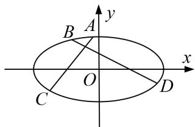

5. 解析 （1）由题意得, 当点 $P$ 是椭圆的上、下顶点时, $\triangle PF_{1}F_{2}$ 的面积取得最大值,
此时 $S\triangle PF_{1}F_{2}=\frac{1}{2}|F_{1}F_{2}|\cdot|OP|=bc,\quad\therefore bc=4\sqrt{3},$
因为 $e=\frac{c}{a}=\frac{1}{2}$ ，所以 $b=2\sqrt{3}$ ，a=4，所以椭圆方程为 $\frac{x^{2}}{16}+\frac{y^{2}}{12}=1$ .  
（2）由（1）得， $F_{1}$ 的坐标为 $(-2,0)$ ，因为 $\overrightarrow{AC}\cdot\overrightarrow{BD}=0$ ，所以 $AC\perp BD$ ，

①当直线 AC 与 BD 中有一条直线斜率不存在时，易得 $\left|\overrightarrow{AC}\right| + \left|\overrightarrow{BD}\right| = 6 + 8 = 14$ .  
②当直线 AC 的斜率 k 存在且 $k \neq 0$ 时，设其方程为 $y = k(x + 2)$ ， $A(x_{1}, y_{1})$ ， $C(x_{2}, y_{2})$ ，
由 $\left\{\begin{aligned}y&=k(x+2),\\ \frac{x^{2}}{16}&+\frac{y^{2}}{12}=1,\end{aligned}\right.$
得 $(3 + 4k^{2})x^{2} + 16k^{2}x + 16k^{2} - 48 = 0$ ， $x_{1} + x_{2} = \frac{-16k^{2}}{3 + 4k^{2}}, x_{1}x_{2} = \frac{16k^{2} - 48}{3 + 4k^{2}}.$
$|\overrightarrow{AC}|=\sqrt{1+k^{2}}|x_{1}-x_{2}|=\frac{24(k^{2}+1)}{3+4k^{2}}$ ，此时直线BD的方程为 $y=-\frac{1}{k}(x+2)$ .

同理由 $\left\{\begin{aligned}y&=-\frac{1}{k}(x+2),\\ \frac{x^{2}}{16}&+\frac{y^{2}}{12}=1,\end{aligned}\right.$
可得 $|\overrightarrow{BD}|=\frac{24(k^{2}+1)}{4+3k^{2}}$ ,
$| \overrightarrow {A C} | + | \overrightarrow {B D} | = \frac {2 4 (k ^ {2} + 1)}{3 + 4 k ^ {2}} + \frac {2 4 (k ^ {2} + 1)}{4 + 3 k ^ {2}} = \frac {1 6 8 (k ^ {2} + 1) ^ {2}}{(4 + 3 k ^ {2}) (3 + 4 k ^ {2})},$
令 $t=k^{2}+1$ ，则 $|\overrightarrow{AC}|+|\overrightarrow{BD}|=\frac{168t^{2}}{(3t+1)(4t-1)}=\frac{168}{12+\frac{t-1}{t^{2}}}(t>1)$ ，因为 t>1， $0<\frac{t-1}{t^{2}}\leq\frac{1}{4}$
所以 $|\overrightarrow{AC}|+|\overrightarrow{BD}|=\frac{168}{12+\frac{t-1}{t^{2}}}\in\left[\frac{96}{7},\quad14\right]$ . 综上， $|\overrightarrow{AC}|+|\overrightarrow{BD}|$ 的取值范围是 $\left[\frac{96}{7},\quad14\right]$ .

6. 已知椭圆 $C: \frac{x^2}{a^2} + \frac{y^2}{b^2} = 1 (a > b > 0)$ 的离心率 $e = \frac{\sqrt{3}}{2}$ ，直线 $x + \sqrt{3} y - 1 = 0$ 被以椭圆 $C$ 的短轴为直径的圆截得的弦长为 $\sqrt{3}$ .  
（1）求椭圆 C 的方程;  
（2）过点 $M(4, 0)$ 的直线 l 交椭圆于 A, B 两个不同的点，且 $\lambda = |MA| \cdot |MB|$ ，求 $\lambda$ 的取值范围.

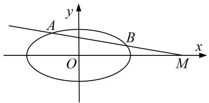

6. 解析 （1） 原点到直线 $x + \sqrt{3}y - 1 = 0$ 的距离为 $\frac{1}{2}$ , 由题得 $\left(\frac{1}{2}\right)^2 + \left(\frac{\sqrt{3}}{2}\right)^2 = b^2 (b > 0)$ , 解得 $b = 1$ .
又 $e^{2}=\frac{c^{2}}{a^{2}}=1-\frac{b^{2}}{a^{2}}=\frac{3}{4}$ ，得 a=2。所以椭圆 C 的方程为 $\frac{x^{2}}{4}+y^{2}=1$ 。  
（2）当直线 l 的斜率为 0 时， $\lambda=|MA|\cdot|MB|=12$ .
当直线 l 的斜率不为 0 时，设直线 l: x=my+4，点 $A(x_{1}, y_{1})$ ， $B(x_{2}, y_{2})$ ，
联立 $\left\{\begin{aligned}x&=my+4,\\ \frac{x^{2}}{4}&+y^{2}=1,\end{aligned}\right.$ 消去 x 得 $(m^{2}+4)y^{2}+8my+12=0.$
由 $\Delta=64m^{2}-48(m^{2}+4)>0$ ，得 $m^{2}>12$ ，所以 $y_{1}y_{2}=\frac{12}{m^{2}+4}$ .
$\lambda = | M A | \cdot | M B | = \sqrt {m ^ {2} + 1} | y _ {1} | \cdot \sqrt {m ^ {2} + 1} | y _ {2} | = (m ^ {2} + 1) | y _ {1} y _ {2} | = \frac {1 2 (m ^ {2} + 1)}{m ^ {2} + 4} = 1 2 \left(1 - \frac {3}{m ^ {2} + 4}\right).$
由 $m^{2}>12$ ，得 $0<\frac{3}{m^{2}+4}<\frac{3}{16}$ ，所以 $\frac{39}{4}<\lambda<12$ .

综上可得： $\frac{39}{4}<\lambda\leq12$ ，即 $\lambda\in\left(\frac{39}{4},12\right]$ .

7. 已知抛物线 $E: y^{2} = 2px (p > 0)$ 与过点 $M(a, 0)(a > 0)$ 的直线 $l$ 交于 $A, B$ 两点，且总有 $OA \perp OB$ .  
（1）确定 p 与 a 的数量关系;  
（2）若 $|OM|\cdot|AB|=\lambda|AM|\cdot|MB|$ ，求 $\lambda$ 的取值范围.

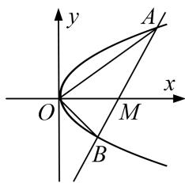

7. 解析 （1） 设 $l: ty = x - a, A(x_1, y_1), B(x_2, y_2)$ . 由 $\left\{ \begin{array}{l} y^2 = 2px, \\ ty = x - a \end{array} \right.$ 消去 $x$ 得 $y^2 - 2pty - 2pa = 0$ .
$\therefore y_{1} + y_{2} = 2pt, y_{1}y_{2} = -2pa$ ，由 $OA \perp OB$ 得 $x_{1}x_{2} + y_{1}y_{2} = 0$ ，即 $\frac{y_{1}y_{2}}{4p^{2}}^{2} + y_{1}y_{2} = 0,$
$\therefore a ^ {2} - 2 p a = 0. \quad \because a > 0, \quad \therefore a = 2 p.$  
（2）由（1）可得 $|AB|=\sqrt{1+t^{2}}|y_{1}-y_{2}|=2p\sqrt{1+t^{2}}\cdot\sqrt{t^{2}+4}$ .
$| A M | \cdot | M B | = \overrightarrow {A M} \cdot \overrightarrow {M B} = (a - x _ {1}) (x _ {2} - a) - y _ {1} y _ {2} = - x _ {1} x _ {2} + a (x _ {1} + x _ {2}) - a ^ {2} - y _ {1} y _ {2} = a \cdot \frac {y _ {1} ^ {2} + y _ {2} ^ {2}}{2 p} - a ^ {2} = 4 p ^ {2} (1 + t ^ {2}).$
$\because | O M | \cdot | A B | = \lambda | A M | \cdot | M B |, \quad \therefore a \cdot 2 p \sqrt {1 + t ^ {2}} \sqrt {t ^ {2} + 4} = \lambda \cdot 4 p ^ {2} (1 + t ^ {2}),$
$\therefore \lambda = \frac {\sqrt {4 + t ^ {2}}}{\sqrt {1 + t ^ {2}}} = \sqrt {1 + \frac {3}{1 + t ^ {2}}}. \quad \because t ^ {2} \geq 0, \quad \therefore \lambda \in (1, 2 ].$

