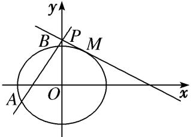

**专题24  长度和距离型取值范围模型**

**【例题选讲】**

<strong>[例1]</strong>　已知抛物线<em>C</em>：<em>y</em>2＝2<em>px</em>(<em>p</em>&gt;0)的焦点为<em>F</em>，<em>A</em>为<em>C</em>上位于第一象限的任意一点，过点<em>A</em>的直线<em>l</em>交<em>C</em>于另一点<em>B</em>，交<em>x</em>轴的正半轴于点<em>D</em>．

(1)若当点*A*的横坐标为3，且△*ADF*为等边三角形，求*C*的方程；

(2)对于(1)中求出的抛物线<em>C</em>，若点<em>D</em>(<em>x</em>0，0)，记点<em>B</em>关于<em>x</em>轴的对称点为<em>E</em>，<em>AE</em>交<em>x</em>轴于点<em>P</em>，且<em>AP</em>⊥<em>BP</em>，求证：点<em>P</em>的坐标为(－<em>x</em>0，0)，并求点<em>P</em>到直线<em>AB</em>的距离<em>d</em>的取值范围．

<strong>[规范解答]</strong>　(1)由题意知<em>F</em>，|<em>FA</em>|＝3＋，则<em>D</em>(3＋<em>p，</em>0)，<em>FD</em>的中点坐标为，

则＋＝3，解得<em>p</em>＝2，故<em>C</em>的方程为<em>y</em>2＝4<em>x</em>．

(2)依题意可设直线<em>AB</em>的方程为<em>x</em>＝<em>my</em>＋<em>x</em>0(<em>m</em>≠0)，<em>A</em>(<em>x</em>1，<em>y</em>1)，<em>B</em>(<em>x</em>2，<em>y</em>2)，

则<em>E</em>(<em>x</em>2，－<em>y</em>2)，由消去<em>x</em>，得<em>y</em>2－4<em>my</em>－4<em>x</em>0＝0，<em>x</em>0≥．

所以<em>Δ</em>＝16<em>m</em>2＋16<em>x</em>0&gt;0，<em>y</em>1＋<em>y</em>2＝4<em>m</em>，<em>y</em>1<em>y</em>2＝－4<em>x</em>0，

设<em>P</em>的坐标为(<em>xP</em>，0)，则＝(<em>x</em>2－<em>xP</em>，－<em>y</em>2)，＝(<em>x</em>1－<em>xP</em>，<em>y</em>1)，

由题意知∥，所以(<em>x</em>2－<em>xP</em>)<em>y</em>1＋<em>y</em>2(<em>x</em>1－<em>xP</em>)＝0，即<em>x</em>2<em>y</em>1＋<em>y</em>2<em>x</em>1＝＝＝(<em>y</em>1＋<em>y</em>2)<em>xP</em>，

显然<em>y</em>1＋<em>y</em>2＝4<em>m</em>≠0，所以<em>xP</em>＝＝－<em>x</em>0，即证<em>P</em>(－<em>x</em>0，0)，由题意知△<em>EPB</em>为等腰直角三角形，

所以<em>kAP</em>＝1，即＝1，也即＝1，

所以<em>y</em>1－<em>y</em>2＝4，所以(<em>y</em>1＋<em>y</em>2)2－4<em>y</em>1<em>y</em>2＝16，即16<em>m</em>2＋16<em>x</em>0＝16，<em>m</em>2＝1－<em>x</em>0，<em>x</em>0&lt;1，

又因为<em>x</em>0≥，所以≤<em>x</em>0&lt;1，<em>d</em>＝＝＝，

令＝<em>t</em>∈，<em>x</em>0＝2－<em>t</em>2，<em>d</em>＝＝－2<em>t</em>，易知<em>f</em>(<em>t</em>)＝－2<em>t</em>在上是减函数，

所以*d*∈．所以*d*的取值范围是．

<strong>[例2]</strong>　已知椭圆<em>C</em>：＋＝1(<em>a</em>&gt;<em>b</em>&gt;0)的离心率为，过点<em>M</em>(1，0)的直线<em>l</em>交椭圆<em>C</em>于<em>A</em>，<em>B</em>两点，|<em>MA</em>|＝<em>λ</em>|<em>MB</em>|，且当直线<em>l</em>垂直于<em>x</em>轴时，|<em>AB</em>|＝．

(1)求椭圆*C*的方程；

(2)若*λ*∈，求弦长|*AB*|的取值范围．

<strong>[规范解答]</strong>　(1)由已知<em>e</em>＝，得＝，又当直线垂直于<em>x</em>轴时，|<em>AB</em>|＝，

所以椭圆过点，代入椭圆方程得＋＝1，

∵<em>a</em>2＝<em>b</em>2＋<em>c</em>2，联立方程可得<em>a</em>2＝2，<em>b</em>2＝1，∴椭圆<em>C</em>的方程为＋<em>y</em>2＝1．

(2)当过点*M*的直线斜率为0时，点*A*，*B*分别为椭圆长轴的端点，

*λ*＝＝＝3＋2>2或*λ*＝＝＝3－2<，不符合题意．∴直线的斜率不能为0．

设直线方程为<em>x</em>＝<em>my</em>＋1，<em>A</em>(<em>x</em>1，<em>y</em>1)，<em>B</em>(<em>x</em>2，<em>y</em>2)，

将直线方程代入椭圆方程得：(<em>m</em>2＋2)<em>y</em>2＋2<em>my</em>－1＝0，

由根与系数的关系可得，

将①式平方除以②式可得：＋＋2＝－，由已知|*MA*|＝*λ*|*MB*|可知，＝－*λ*，

∴－<em>λ</em>－＋2＝－，又知<em>λ</em>∈，∴－<em>λ</em>－＋2∈，∴－≤－≤0，解得<em>m</em>2∈．

|<em>AB</em>|2＝(1＋<em>m</em>2)|<em>y</em>1－<em>y</em>2|2＝(1＋<em>m</em>2)[(<em>y</em>1＋<em>y</em>2)2－4<em>y</em>1<em>y</em>2]＝82＝82，

∵<em>m</em>2∈，∴∈，∴|<em>AB</em>|∈．

<strong>[例3]</strong>　设点<em>F</em>为椭圆<em>C</em>：＋＝1(<em>m</em>＞0)的左焦点，直线<em>y</em>＝<em>x</em>被椭圆<em>C</em>截得弦长为．

(1)求椭圆*C*的方程；

(2)圆<em>P</em>：＋＝<em>r</em>2(<em>r</em>＞0)与椭圆<em>C</em>交于<em>A</em>，<em>B</em>两点，<em>M</em>为线段<em>AB</em>上任意一点，直线<em>FM</em>交椭圆<em>C</em>于<em>P</em>，<em>Q</em>两点，<em>AB</em>为圆<em>P</em>的直径，且直线<em>FM</em>的斜率大于1，求|<em>PF</em>|·|<em>QF</em>|的取值范围．

<strong>[规范解答]</strong>　(1)由得<em>x</em>2＝<em>y</em>2＝，故2＝2＝，解得<em>m</em>＝1，

故椭圆*C*的方程为＋＝1．

(2)设<em>A</em>(<em>x</em>1，<em>y</em>1)，<em>B</em>(<em>x</em>2，<em>y</em>2)，则又

所以＋＝0．

则(<em>x</em>1－<em>x</em>2)－(<em>y</em>1－<em>y</em>2)＝0，故<em>kAB</em>＝＝1，

则直线<em>AB</em>的方程为<em>y</em>－＝<em>x</em>＋，即<em>y</em>＝<em>x</em>＋，代入椭圆<em>C</em>的方程并整理得7<em>x</em>2＋8<em>x</em>＝0，

则<em>x</em>1＝0，<em>x</em>2＝－，故直线<em>FM</em>的斜率<em>k</em>∈[，＋∞)，

设<em>FM</em>：<em>y</em>＝<em>k</em>(<em>x</em>＋1)，由得(3＋4<em>k</em>2)<em>x</em>2＋8<em>k</em>2<em>x</em>＋4<em>k</em>2－12＝0，

设<em>P</em>(<em>x</em>3，<em>y</em>3)，<em>Q</em>(<em>x</em>4，<em>y</em>4)，则有<em>x</em>3＋<em>x</em>4＝，<em>x</em>3<em>x</em>4＝，

又|<em>PF</em>|＝|<em>x</em>3＋1|，|<em>QF</em>|＝|<em>x</em>4＋1|，

所以|<em>PF</em>|·|<em>QF</em>|＝(1＋<em>k</em>2)|<em>x</em>3<em>x</em>4＋(<em>x</em>3＋<em>x</em>4)＋1|＝(1＋<em>k</em>2)

＝(1＋<em>k</em>2)×＝，

因为*k*≥，所以＜≤，即|*PF*|·|*QF*|的取值范围是．

<strong>[例4]</strong>　已知椭圆<em>C</em>：＋＝1(<em>a</em>＞<em>b</em>＞0)的离心率是，且椭圆经过点(0，1)．

(1)求椭圆*C*的标准方程；

(2)若直线<em>l</em>1：<em>x</em>＋2<em>y</em>－2＝0与圆<em>D</em>：<em>x</em>2＋<em>y</em>2－6<em>x</em>－4<em>y</em>＋<em>m</em>＝0相切：

(ⅰ)求圆*D*的标准方程；

(ⅱ)若直线<em>l</em>2过定点(3，0)，与椭圆<em>C</em>交于不同的两点<em>E</em>，<em>F</em>，与圆<em>D</em>交于不同的两点<em>M</em>，<em>N</em>，求|<em>EF</em>|·|<em>MN</em>|的取值范围．

<strong>[规范解答]</strong>　(1)∵椭圆经过点(0，1)，∴＝1，解得<em>b</em>2＝1，∵<em>e</em>＝，∴＝，

∴3<em>a</em>2＝4<em>c</em>2＝4(<em>a</em>2－1) ，解得<em>a</em>2＝4，∴椭圆<em>C</em>的标准方程为＋<em>y</em>2＝1．

(2) (ⅰ)圆<em>D</em>的标准方程为(<em>x</em>－3)2＋(<em>y</em>－2)2＝13－<em>m</em>，圆心为(3，2)，

∵直线<em>l</em>1：<em>x</em>＋2<em>y</em>－2＝0与圆<em>D</em>相切，∴圆<em>D</em>的半径<em>r</em>＝＝，

∴圆<em>D</em>的标准方程为(<em>x</em>－3)2＋(<em>y</em>－2)2＝5．

(ⅱ)由题可得直线<em>l</em>2的斜率存在，设<em>l</em>2方程为<em>y</em>＝<em>k</em>(<em>x</em>－3)，

由消去<em>y</em>整理得(1＋4<em>k</em>2)<em>x</em>2－24<em>k</em>2<em>x</em>＋36<em>k</em>2－4＝0，

∵直线<em>l</em>2与椭圆<em>C</em>交于不同的两点<em>E</em>，<em>F</em>，

∴<em>Δ</em>＝(－24<em>k</em>2)2－4(1＋4<em>k</em>2)(36<em>k</em>2－4)＝16(1－5<em>k</em>2)＞0，解得0≤<em>k</em>2＜．

设<em>E</em>(<em>x</em>1，<em>y</em>1)，<em>F</em>(<em>x</em>2，<em>y</em>2)，则<em>x</em>1＋<em>x</em>2＝，<em>x</em>1<em>x</em>2＝，

∴|*EF*|＝＝＝4，

又圆<em>D</em>的圆心(3，2)到直线<em>l</em>2：<em>kx</em>－<em>y</em>－3<em>k</em>＝0的距离<em>d</em>＝＝，

∴圆<em>D</em>截直线<em>l</em>2所得弦长|<em>MN</em>|＝2＝2，

∴|*EF*|·|*MN*|＝4×2＝8，

设<em>t</em>＝1＋4<em>k</em>2∈，则<em>k</em>2＝，∴|<em>EF</em>|·|<em>MN</em>|＝8＝2，

∵<em>t</em>∈，∴－9()2＋50－25∈(0，16]，

∴|*EF*|·|*MN*|的取值范围为(0，8]．

<strong>[例5]</strong>　已知椭圆<em>C</em>：＋＝1(<em>a</em>＞<em>b</em>＞0)的离心率为，且椭圆<em>C</em>过点．

(1)求椭圆*C*的标准方程；

(2)过椭圆<em>C</em>的右焦点的直线<em>l</em>与椭圆<em>C</em>分别相交于<em>A</em>，<em>B</em>两点，且与圆<em>O</em>：<em>x</em>2＋<em>y</em>2＝2相交于<em>E</em>，<em>F</em>两点，求|<em>AB</em>|·|<em>EF</em>|2的取值范围．

<strong>[规范解答]</strong>　(1)由题意得＝，所以<em>a</em>2＝<em>b</em>2，所以椭圆的方程为＋＝1，

将点代入方程得<em>b</em>2＝2，即<em>a</em>2＝3，所以椭圆<em>C</em>的标准方程为＋＝1．

(2)由(1)可知，椭圆的右焦点为(1，0)，

①若直线*l*的斜率不存在，直线*l*的方程为*x*＝1，

则*A*，*B*，*E*(1，1)，*F*(1，－1)，

所以|<em>AB</em>|＝，|<em>EF</em>|2＝4，|<em>AB</em>|·|<em>EF</em>|2＝．

②若直线<em>l</em>的斜率存在，设直线<em>l</em>的方程为<em>y</em>＝<em>k</em>(<em>x</em>－1)，<em>A</em>(<em>x</em>1，<em>y</em>1)，<em>B</em>(<em>x</em>2，<em>y</em>2)．

联立可得(2＋3<em>k</em>2)<em>x</em>2－6<em>k</em>2<em>x</em>＋3<em>k</em>2－6＝0，则<em>x</em>1＋<em>x</em>2＝，<em>x</em>1<em>x</em>2＝，

所以|*AB*|＝＝＝．

因为圆心<em>O</em>(0，0)到直线<em>l</em>的距离<em>d</em>＝，所以|<em>EF</em>|2＝4＝，

所以|<em>AB</em>|·|<em>EF</em>|2＝·＝＝·＝．

因为<em>k</em>2∈[0，＋∞)，所以|<em>AB</em>|·|<em>EF</em>|2∈．

综上，|<em>AB</em>|·|<em>EF</em>|2的取值范围为．

<strong>[例6]</strong>　已知椭圆<em>Γ</em>：＋＝1，过点<em>P</em>(1，1)作倾斜角互补的两条不同直线<em>l</em>1，<em>l</em>2，设<em>l</em>1与椭圆<em>Γ</em>交于<em>A</em>、<em>B</em>两点，<em>l</em>2与椭圆<em>Γ</em>交于<em>C</em>，<em>D</em>两点．

(1)若*P*(1，1)为线段*AB*的中点，求直线*AB*的方程；

(2)若直线<em>l</em>1与<em>l</em>2的斜率都存在，记<em>λ</em>＝，求<em>λ</em>的取值范围．

<strong>[规范解答]</strong>　(1)解法一(点差法)：由题意可知直线<em>AB</em>的斜率存在．

设<em>A</em>(<em>x</em>1，<em>y</em>1)，<em>B</em>(<em>x</em>2，<em>y</em>2)，则两式作差得＝－·＝－·＝－，

∴直线*AB*的方程为*y*－1＝－(*x*－1)，即*x*＋2*y*－3＝0．

解法二：由题意可知直线*AB*的斜率存在．设直线*AB*的斜率为*k*，

则其方程为<em>y</em>－1＝<em>k</em>(<em>x</em>－1)，代入<em>x</em>2＋2<em>y</em>2＝4中，得<em>x</em>2＋2[<em>kx</em>－(<em>k</em>－1)]2－4＝0．

∴(1＋2<em>k</em>2)<em>x</em>2－4<em>k</em>(<em>k</em>－1)<em>x</em>＋2(<em>k</em>－1)2－4＝0．

<em>Δ</em>＝[－4(<em>k</em>－1)<em>k</em>]2－4(2<em>k</em>2＋1)[2(<em>k</em>－1)2－4]＝8(3<em>k</em>2＋2<em>k</em>＋1)＞0．

设<em>A</em>(<em>x</em>1，<em>y</em>1)，<em>B</em>(<em>x</em>2，<em>y</em>2)，则

∵<em>AB</em>中点为(1，1)，∴(<em>x</em>1＋<em>x</em>2)＝＝1，则<em>k</em>＝－．

∴直线*AB*的方程为*y*－1＝－(*x*－1)，即*x*＋2*y*－3＝0．

(2)由(1)可知|<em>AB</em>|＝ |<em>x</em>1－<em>x</em>2|＝·＝．

设直线*CD*的方程为*y*－1＝－*k*(*x*－1)(*k*≠0)．同理可得|*CD*|＝．

∴*λ*＝＝ (*k*≠0)，*λ*＞0．

∴<em>λ</em>2＝1＋＝1＋，令<em>t</em>＝3<em>k</em>＋，则<em>t</em>∈(－∞，－2 ]∪[2，＋∞)，

令*g*(*t*)＝1＋，*t*∈(－∞，－2 ]∪[2，＋∞)，

∵*g*(*t*)在(－∞，－2]，[2，＋∞)上单调递减，∴2－≤*g*(*t*)＜1或1＜*g*(*t*)≤2＋．

故2－≤<em>λ</em>2＜1或1＜<em>λ</em>2≤2＋．∴<em>λ</em>∈∪．

<strong>[例7]</strong>　已知点<em>F</em>为椭圆<em>E</em>：＋＝1(<em>a</em>＞<em>b</em>＞0)的左焦点，且两焦点与短轴的一个顶点构成一个等边三角形，直线＋＝1与椭圆<em>E</em>有且仅有一个交点<em>M</em>．

(1)求椭圆*E*的方程；

(2)设直线＋＝1与<em>y</em>轴交于<em>P</em>，过点<em>P</em>的直线<em>l</em>与椭圆<em>E</em>交于不同的两点<em>A</em>，<em>B</em>，若<em>λ</em>|<em>PM</em>|2＝|<em>PA</em>|·|<em>PB</em>|，求实数<em>λ</em>的取值范围．

<strong>[规范解答]</strong>　(1)由题意，得<em>a</em>＝2<em>c</em>，<em>b</em>＝<em>c</em>，则椭圆<em>E</em>为＋＝1．

由消去<em>y</em>，得<em>x</em>2－2<em>x</em>＋4－3<em>c</em>2＝0．

∵直线＋＝1与椭圆<em>E</em>有且仅有一个交点<em>M</em>，∴<em>Δ</em>＝4－4(4－3<em>c</em>2)＝0，解得<em>c</em>2＝1，

∴椭圆*E*的方程为＋＝1．

(2)由(1)得<em>M</em>，∵直线＋＝1与<em>y</em>轴交于<em>P</em>(0，2)，∴|<em>PM</em>|2＝，

①当直线<em>l</em>与<em>x</em>轴垂直时，|<em>PA</em>|·|<em>PB</em>|＝(2＋)×(2－)＝1，∴<em>λ</em>|<em>PM</em>|2＝|<em>PA</em>|·|<em>PB</em>|⇒<em>λ</em>＝，

②当直线<em>l</em>与<em>x</em>轴不垂直时，设直线<em>l</em>的方程为<em>y</em>＝<em>kx</em>＋2，<em>A</em>(<em>x</em>1，<em>y</em>1)，<em>B</em>(<em>x</em>2，<em>y</em>2)，

由消去<em>y</em>，整理得(3＋4<em>k</em>2)<em>x</em>2＋16<em>kx</em>＋4＝0，

则<em>x</em>1<em>x</em>2＝，且<em>Δ</em>＝48(4<em>k</em>2－1)＞0，

∴|<em>PA</em>|·|<em>PB</em>|＝(1＋<em>k</em>2)<em>x</em>1<em>x</em>2＝(1＋<em>k</em>2)·＝1＋＝<em>λ</em>，

∴<em>λ</em>＝，∵<em>k</em>2＞，∴＜<em>λ</em>＜1．综上所述，<em>λ</em>的取值范围是．

**【对点训练】**

1．已知椭圆*C*：＋＝1(*a*>*b*>0)的离心率为，短轴长为2．

(1)求椭圆*C*的标准方程；

(2)设直线<em>l</em>：<em>y</em>＝<em>kx</em>＋<em>m</em>与椭圆<em>C</em>交于<em>M</em>，<em>N</em>两点，<em>O</em>为坐标原点，若<em>kOM</em>·<em>kON</em>＝，求原点<em>O</em>到直线<em>l</em>的距离的取值范围．

1．解析　(1)由题知<em>e</em>＝＝，2<em>b</em>＝2，又<em>a</em>2＝<em>b</em>2＋<em>c</em>2，∴<em>b</em>＝1，<em>a</em>＝2，

∴椭圆<em>C</em>的标准方程为＋<em>y</em>2＝1．

(2)设<em>M</em>(<em>x</em>1，<em>y</em>1)，<em>N</em>(<em>x</em>2，<em>y</em>2)，联立方程得(4<em>k</em>2＋1)<em>x</em>2＋8<em>kmx</em>＋4<em>m</em>2－4＝0，

依题意，<em>Δ</em>＝(8<em>km</em>)2－4(4<em>k</em>2＋1)(4<em>m</em>2－4)&gt;0，化简得<em>m</em>2&lt;4<em>k</em>2＋1，①

<em>x</em>1＋<em>x</em>2＝－，<em>x</em>1<em>x</em>2＝，<em>y</em>1<em>y</em>2＝(<em>kx</em>1＋<em>m</em>)(<em>kx</em>2＋<em>m</em>)＝<em>k</em>2<em>x</em>1<em>x</em>2＋<em>km</em>(<em>x</em>1＋<em>x</em>2)＋<em>m</em>2．

若<em>kOM</em>·<em>kON</em>＝，则＝，即4<em>y</em>1<em>y</em>2＝5<em>x</em>1<em>x</em>2，

∴(4<em>k</em>2－5)<em>x</em>1<em>x</em>2＋4<em>km</em>(<em>x</em>1＋<em>x</em>2)＋4<em>m</em>2＝0，∴(4<em>k</em>2－5)·＋4<em>km</em>·＋4<em>m</em>2＝0，

即(4<em>k</em>2－5)(<em>m</em>2－1)－8<em>k</em>2<em>m</em>2＋<em>m</em>2(4<em>k</em>2＋1)＝0，化简得<em>m</em>2＋<em>k</em>2＝，②，由①②得0≤<em>m</em>2&lt;，&lt;<em>k</em>2≤．

∵原点<em>O</em>到直线<em>l</em>的距离<em>d</em>＝，∴<em>d</em>2＝＝＝－1＋，

又&lt;<em>k</em>2≤，∴0≤<em>d</em>2&lt;，∴原点<em>O</em>到直线<em>l</em>的距离的取值范围是．

2．已知椭圆*C*：＋＝1(*a*>*b*>0)经过点*P*，且离心率为．

(1)求椭圆*C*的方程；

(2)设<em>F</em>1，<em>F</em>2分别为椭圆<em>C</em>的左、右焦点，不经过<em>F</em>1的直线<em>l</em>与椭圆<em>C</em>交于两个不同的点<em>A</em>，<em>B．</em>如果直线<em>AF</em>1，<em>l</em>，<em>BF</em>1的斜率依次成等差数列，求焦点<em>F</em>2到直线<em>l</em>的距离<em>d</em>的取值范围．

2．解析　(1)由题意，知解得所以椭圆<em>C</em>的方程为＋<em>y</em>2＝1．

(2)易知直线<em>l</em>的斜率存在且不为零．设直线<em>l</em>的方程为<em>y</em>＝<em>kx</em>＋<em>m</em>，代入椭圆方程＋<em>y</em>2＝1，

整理得(1＋2<em>k</em>2)<em>x</em>2＋4<em>kmx</em>＋2(<em>m</em>2－1)＝0．由<em>Δ</em>＝(4<em>km</em>)2－8(1＋2<em>k</em>2)(<em>m</em>2－1)&gt;0，得2<em>k</em>2&gt;<em>m</em>2－1．①

设<em>A</em>(<em>x</em>1，<em>y</em>1)，<em>B</em>(<em>x</em>2，<em>y</em>2)，则<em>x</em>1＋<em>x</em>2＝－，<em>x</em>1<em>x</em>2＝．

因为<em>F</em>1(－1，0)，所以<em>kAF</em>1＝，<em>kBF</em>1＝．

由题可得2<em>k</em>＝＋，且<em>y</em>1＝<em>kx</em>1＋<em>m</em>，<em>y</em>2＝<em>kx</em>2＋<em>m</em>，所以(<em>m</em>－<em>k</em>)(<em>x</em>1＋<em>x</em>2＋2)＝0．

因为直线<em>l</em>：<em>y</em>＝<em>kx</em>＋<em>m</em>不过焦点<em>F</em>1(－1，0)，所以<em>m</em>－<em>k</em>≠0，

所以<em>x</em>1＋<em>x</em>2＋2＝0，从而－＋2＝0，即<em>m</em>＝<em>k</em>＋．②

由①②得2<em>k</em>2&gt;2－1，化简得|<em>k</em>|&gt;．③

焦点<em>F</em>2(1，0)到直线<em>l</em>：<em>y</em>＝<em>kx</em>＋<em>m</em>的距离<em>d</em>＝＝＝，

令*t*＝，由|*k*|>知*t*∈(1，)．于是*d*＝＝，

因为函数*f* (*t*)＝在[1，]上单调递减，所以*f* ()<*d*<*f* (1)，解得<*d*<2，

所以焦点<em>F</em>2到直线<em>l</em>的距离<em>d</em>的取值范围是(，2)．

3．已知椭圆*C*：＋＝1(*a*>*b*>0)的焦距为2，且过点．

(1)求椭圆*C*的方程；

(2)过点*M*(2，0)的直线交椭圆*C*于*A*，*B*两点，*P*为椭圆*C*上一点，*O*为坐标原点，且满足＋＝*t*，其中*t*∈，求|*AB*|的取值范围．

3．解析　(1)依题意得解得∴椭圆<em>C</em>的方程为＋<em>y</em>2＝1．

(2)由题意可知，直线*AB*的斜率存在，设其方程为*y*＝*k*(*x*－2)．

由得(1＋2<em>k</em>2)<em>x</em>2－8<em>k</em>2<em>x</em>＋8<em>k</em>2－2＝0．∴<em>Δ</em>＝8(1－2<em>k</em>2)&gt;0，解得<em>k</em>2&lt;．

设<em>A</em>(<em>x</em>1，<em>y</em>1)，<em>B</em>(<em>x</em>2，<em>y</em>2)，则

由＋＝<em>t</em>得<em>P</em>，代入椭圆<em>C</em>的方程得<em>t</em>2＝．由&lt;<em>t</em>&lt;2得&lt;<em>k</em>2&lt;，

∴|*AB*|＝·＝2．

令*u*＝，则*u*∈，∴|*AB*|＝2∈．

∴|*AB*|的取值范围为．

4．在平面直角坐标系<em>xOy</em>中，已知圆<em>C</em>1：<em>x</em>2＋<em>y</em>2＝<em>r</em>2(<em>r</em>&gt;0)与直线<em>l</em>0：<em>y</em>＝<em>x</em>＋2相切，点<em>A</em>为圆<em>C</em>1上一动

点，*AN*⊥*x*轴于点*N*，且动点*M*满足＋＝，设动点*M*的轨迹为曲线*C．*

(1)求曲线*C*的方程；

(2)设<em>P</em>，<em>Q</em>是曲线<em>C</em>上两动点，线段<em>PQ</em>的中点为<em>T</em>，直线<em>OP</em>，<em>OQ</em>的斜率分别为<em>k</em>1，<em>k</em>2，且<em>k</em>1<em>k</em>2＝

－，求|*OT*|的取值范围．

4．<strong>解析</strong>　(1)设动点<em>M</em>(<em>x</em>，<em>y</em>)，<em>A</em>(<em>x</em>0，<em>y</em>0)，∵<em>AN</em>⊥<em>x</em>轴于点<em>N</em>，∴<em>N</em>(<em>x</em>0，0)．

又圆<em>C</em>1：<em>x</em>2＋<em>y</em>2＝<em>r</em>2(<em>r</em>&gt;0)与直线<em>l</em>0：<em>y</em>＝<em>x</em>＋2，即<em>x</em>－<em>y</em>＋2＝0相切，

∴<em>r</em>＝＝2，∴圆<em>C</em>1：<em>x</em>2＋<em>y</em>2＝4．由＋＝，

得(<em>x</em>，<em>y</em>)＋(<em>x</em>－<em>x</em>0，<em>y</em>－<em>y</em>0)＝(<em>x</em>0，0)，∴即

又点<em>A</em>为圆<em>C</em>1上一动点，∴<em>x</em>2＋4<em>y</em>2＝4，∴曲线<em>C</em>的方程为＋<em>y</em>2＝1．

(2)当直线*PQ*的斜率不存在时，可取直线*OP*的方程为*y*＝*x*，

不妨取点*P*，则*Q*，*T*(，0)，∴|*OT*|＝．

当直线<em>PQ</em>的斜率存在时，设直线<em>PQ</em>的方程为<em>y</em>＝<em>kx</em>＋<em>m</em>，<em>P</em>(<em>x</em>1，<em>y</em>1)，<em>Q</em>(<em>x</em>2，<em>y</em>2)，

由可得(1＋4<em>k</em>2)<em>x</em>2＋8<em>kmx</em>＋4<em>m</em>2－4＝0，

∴<em>x</em>1＋<em>x</em>2＝，<em>x</em>1<em>x</em>2＝．∵<em>k</em>1<em>k</em>2＝－，∴4<em>y</em>1<em>y</em>2＋<em>x</em>1<em>x</em>2＝0．

∴4(<em>kx</em>1＋<em>m</em>)(<em>kx</em>2＋<em>m</em>)＋<em>x</em>1<em>x</em>2＝(4<em>k</em>2＋1)<em>x</em>1<em>x</em>2＋4<em>km</em>(<em>x</em>1＋<em>x</em>2)＋4<em>m</em>2＝4<em>m</em>2－4－＋4<em>m</em>2＝0，

化简得2<em>m</em>2＝1＋4<em>k</em>2，∴<em>m</em>2≥．

<em>Δ</em>＝64<em>k</em>2<em>m</em>2－4(4<em>k</em>2＋1)(4<em>m</em>2－4)＝16(4<em>k</em>2＋1－<em>m</em>2)＝16<em>m</em>2&gt;0，

设<em>T</em>(<em>x</em>′0，<em>y</em>′0)，则<em>x</em>′0＝＝＝，<em>y</em>′0＝<em>kx</em>′0＋<em>m</em>＝．

∴|<em>OT</em>|2＝<em>x</em>′＋<em>y</em>′＝＋＝2－∈，∴|<em>OT</em>|∈．

综上，|*OT*|的取值范围为．

5．已知椭圆＋＝1(<em>a</em>&gt;<em>b</em>&gt;0)的左、右焦点分别是<em>F</em>1，<em>F</em>2，其离心率<em>e</em>＝，点<em>P</em>为椭圆上的一个动点，△<em>PF</em>1<em>F</em>2

面积的最大值为4．

(1)求椭圆的方程；

(2)若<em>A</em>，<em>B</em>，<em>C</em>，<em>D</em>是椭圆上不重合的四个点，<em>AC</em>与<em>BD</em>相交于点<em>F</em>1，·＝0，求||＋||的取值范围．

5．解析　(1)由题意得，当点<em>P</em>是椭圆的上、下顶点时，△<em>PF</em>1<em>F</em>2的面积取得最大值，

此时<em>S</em>△<em>PF</em>1<em>F</em>2＝|<em>F</em>1<em>F</em>2|·|<em>OP</em>|＝<em>bc</em>，∴<em>bc</em>＝4，

因为*e*＝＝，所以*b*＝2，*a*＝4，所以椭圆方程为＋＝1．

(2)由(1)得，<em>F</em>1的坐标为(－2，0)，因为·＝0，所以<em>AC</em>⊥<em>BD</em>，

①当直线*AC*与*BD*中有一条直线斜率不存在时，易得||＋||＝6＋8＝14．

②当直线<em>AC</em>的斜率<em>k</em>存在且<em>k</em>≠0时，设其方程为<em>y</em>＝<em>k</em>(<em>x</em>＋2)，<em>A</em>(<em>x</em>1，<em>y</em>1)，<em>C</em>(<em>x</em>2，<em>y</em>2)，

由得(3＋4<em>k</em>2)<em>x</em>2＋16<em>k</em>2<em>x</em>＋16<em>k</em>2－48＝0，<em>x</em>1＋<em>x</em>2＝，<em>x</em>1<em>x</em>2＝．

||＝|<em>x</em>1－<em>x</em>2|＝，此时直线<em>BD</em>的方程为<em>y</em>＝－(<em>x</em>＋2)．

同理由可得||＝，

||＋||＝＋＝，

令<em>t</em>＝<em>k</em>2＋1，则||＋||＝＝(<em>t</em>&gt;1)，因为<em>t</em>&gt;1，0&lt;≤，

所以||＋||＝∈．综上，||＋||的取值范围是．

6．已知椭圆*C*：＋＝1(*a*>*b*>0)的离心率*e*＝，直线*x*＋*y*－1＝0被以椭圆*C*的短轴为直径的圆截

得的弦长为．

(1)求椭圆*C*的方程；

(2)过点*M*(4，0)的直线*l*交椭圆于*A*，*B*两个不同的点，且*λ*＝|*MA*|·|*MB*|，求*λ*的取值范围．

6．解析　(1)原点到直线<em>x</em>＋<em>y</em>－1＝0的距离为，由题得＋＝<em>b</em>2(<em>b</em>&gt;0)，解得<em>b</em>＝1．

又<em>e</em>2＝＝1－＝，得<em>a</em>＝2．所以椭圆<em>C</em>的方程为＋<em>y</em>2＝1．

(2)当直线*l*的斜率为0时，*λ*＝|*MA*|·|*MB*|＝12．

当直线<em>l</em>的斜率不为0时，设直线<em>l</em>：<em>x</em>＝<em>my</em>＋4，点<em>A</em>(<em>x</em>1，<em>y</em>1)，<em>B</em>(<em>x</em>2，<em>y</em>2)，

联立消去<em>x</em>得(<em>m</em>2＋4)<em>y</em>2＋8<em>my</em>＋12＝0．

由<em>Δ</em>＝64<em>m</em>2－48(<em>m</em>2＋4)&gt;0，得<em>m</em>2&gt;12，所以<em>y</em>1<em>y</em>2＝．

<em>λ</em>＝|<em>MA</em>|·|<em>MB</em>|＝|<em>y</em>1|·|<em>y</em>2|＝(<em>m</em>2＋1)|<em>y</em>1<em>y</em>2|＝＝12．

由<em>m</em>2&gt;12，得0&lt;&lt;，所以&lt;<em>λ</em>&lt;12．

综上可得：<*λ*≤12，即*λ*∈．

7．已知抛物线<em>E</em>：<em>y</em>2＝2<em>px</em>(<em>p</em>&gt;0)与过点<em>M</em>(<em>a，</em>0)(<em>a</em>&gt;0)的直线<em>l</em>交于<em>A</em>，<em>B</em>两点，且总有<em>OA</em>⊥<em>OB．</em>

(1)确定*p*与*a*的数量关系；

(2)若|*OM*|·|*AB*|＝*λ*|*AM*|·|*MB*|，求*λ*的取值范围．

7．解析　(1)设<em>l</em>：<em>ty</em>＝<em>x</em>－<em>a</em>，<em>A</em>(<em>x</em>1，<em>y</em>1)，<em>B</em>(<em>x</em>2，<em>y</em>2)．由消去<em>x</em>得<em>y</em>2－2<em>pty</em>－2<em>pa</em>＝0．

∴<em>y</em>1＋<em>y</em>2＝2<em>pt</em>，<em>y</em>1<em>y</em>2＝－2<em>pa</em>，由<em>OA</em>⊥<em>OB</em>得<em>x</em>1<em>x</em>2＋<em>y</em>1<em>y</em>2＝0，即＋<em>y</em>1<em>y</em>2＝0，

∴<em>a</em>2－2<em>pa</em>＝0．∵<em>a</em>&gt;0，∴<em>a</em>＝2<em>p</em>．

(2)由(1)可得|<em>AB</em>|＝|<em>y</em>1－<em>y</em>2|＝2<em>p</em>·．

|<em>AM</em>|·|<em>MB</em>|＝·＝(<em>a</em>－<em>x</em>1)(<em>x</em>2－<em>a</em>)－<em>y</em>1<em>y</em>2＝－<em>x</em>1<em>x</em>2＋<em>a</em>(<em>x</em>1＋<em>x</em>2)－<em>a</em>2－<em>y</em>1<em>y</em>2＝<em>a</em>·－<em>a</em>2＝4<em>p</em>2(1＋<em>t</em>2)．

∵|<em>OM</em>|·|<em>AB</em>|＝<em>λ</em>|<em>AM</em>|·|<em>MB</em>|，∴<em>a</em>·2<em>p</em>＝<em>λ</em>·4<em>p</em>2(1＋<em>t</em>2)，

∴<em>λ</em>＝＝．∵<em>t</em>2≥0，∴<em>λ</em>∈(1，2]．

