# 专题 25 面积与数量积型取值范围模型

# 【例题选讲】

[例 1] 已知椭圆 C: $\frac{x^{2}}{a^{2}} + \frac{y^{2}}{b^{2}} = 1 (a > b > 0)$ 与双曲线 $\frac{x^{2}}{3} - y^{2} = 1$ 的离心率互为倒数，且直线 x - y - 2 = 0 经过椭圆的右顶点.

(1)求椭圆 C 的标准方程;

(2)设不过原点 $O$ 的直线与椭圆 $C$ 交于 $M, N$ 两点，且直线 $OM, MN, ON$ 的斜率依次成等比数列，求 $\triangle OMN$ 面积的取值范围.

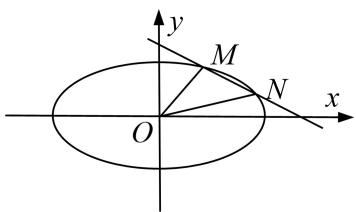

text_image

y
M
N
x
O

[规范解答] (1)∵双曲线的离心率为 $\frac{2\sqrt{3}}{3}$ ，∴椭圆的离心率 $e=\frac{c}{a}=\frac{\sqrt{3}}{2}$ .

又∵直线 x-y-2=0 经过椭圆的右顶点，∴右顶点为点 $(2,0)$ ，即 $a=2,\ c=\sqrt{3},\ b=1$ ，

∴椭圆方程为 $\frac{x^{2}}{4}+y^{2}=1$ .

(2)由题意可设直线的方程为 $y=kx+m(k\neq0,\ m\neq0)$ ， $M(x_{1},y_{1})$ ， $N(x_{2},y_{2})$ .

联立 $\left\{\begin{aligned}y=kx+m,\\ \frac{x^{2}}{4}+y^{2}=1,\end{aligned}\right.$ 消去 y，并整理得 $(1+4k^{2})x^{2}+8kmx+4(m^{2}-1)=0$

则 $x_{1}+x_{2}=-\frac{8km}{1+4k^{2}}$ ， $x_{1}x_{2}=\frac{4}{1+4k^{2}}-\frac{m^{2}-1}{1+4k^{2}}$ ，于是 $y_{1}y_{2}=(kx_{1}+m)(kx_{2}+m)=k^{2}x_{1}x_{2}+km(x_{1}+x_{2})+m^{2}$ .

又直线 OM, MN, ON 的斜率依次成等比数列，故 $\frac{y_{1}y_{2}}{x_{1}x_{2}}=\frac{k^{2}x_{1}x_{2}+km\quad x_{1}+x_{2}\quad+m^{2}}{x_{1}x_{2}}=k^{2}$

则 $-\frac{8k^{2}m^{2}}{1+4k^{2}}+m^{2}=0$ ，由 $m\neq0$ 得 $k^{2}=\frac{1}{4}$ ，解得 $k=\pm\frac{1}{2}$ .

又由 $\Delta=64k^{2}m^{2}-16(1+4k^{2})(m^{2}-1)=16(4k^{2}-m^{2}+1)>0$ ，得 $0<m^{2}<2$ ，

显然 $m^2 \neq 1$ (否则 $x_1 x_2 = 0, x_1, x_2$ 中至少有一个为 0，直线 $OM, ON$ 中至少有一个斜率不存在，与已知矛盾).

设原点 O 到直线的距离为 d，则

$$
S _ {\triangle O M N} = \frac {1}{2} | M N | d = \frac {1}{2} \cdot \sqrt {1 + k ^ {2}} \cdot | x _ {1} - x _ {2} | \cdot \frac {| m |}{\sqrt {1 + k ^ {2}}} = \frac {1}{2} | m | \sqrt {x _ {1} + x _ {2} ^ {2} - 4 x _ {1} x _ {2}} = \sqrt {- m ^ {2} - 1 ^ {2} + 1}.
$$

故由 m 的取值范围可得 $\triangle OMN$ 面积的取值范围为 $(0, 1)$ .

[例 2] (2018·浙江)如图，已知点 P 是 y 轴左侧(不含 y 轴)一点，抛物线 C: $y^{2}=4x$ 上存在不同的两点 A, B 满足 PA, PB 的中点均在 C 上.

(1)设 AB 中点为 M，证明：PM 垂直于 y 轴；  
(2)若 P 是半椭圆 $x^{2}+\frac{y^{2}}{4}=1(x<0)$ 上的动点，求 $\triangle PAB$ 面积的取值范围.

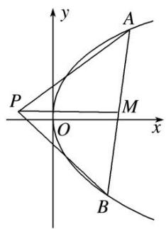

text_image

y
A
P
O
M
x
B

[规范解答] (1) 设 $P(x_{0}, y_{0})$ , $A\left(\frac{1}{4}y_{1}^{2}, y_{1}\right)$ , $B\left(\frac{1}{4}y_{2}^{2}, y_{2}\right)$ .

因为 PA, PB 的中点在抛物线上，所以 $y_{1}$ ， $y_{2}$ 为方程 $\left(\frac{y+y_{0}}{2}\right)^{2}=4\cdot\frac{1}{4}\frac{y^{2}+x_{0}}{2}$

即 $y^{2} - 2y_{0}y + 8x_{0} - y_{0}^{2} = 0$ 的两个不同的实根．所以 $y_{1} + y_{2} = 2y_{0}$ ，所以 $PM$ 垂直于 $y$ 轴.

(2)由(1)可知 $\left\{ \begin{array}{l} y_{1} + y_{2} = 2y_{0}, \\ y_{1}y_{2} = 8x_{0} - y_{0}^{2}, \end{array} \right.$ 所以 $|PM| = \frac{1}{8}(y_{1}^{2} + y_{2}^{2}) - x_{0} = \frac{3}{4} y_{0}^{2} - 3x_{0}, |y_{1} - y_{2}| = 2\sqrt{2(y_{0}^{2} - 4x_{0})}$ .

所以 $\triangle PAB$ 的面积 $S_{\triangle PAB} = \frac{1}{2} |PM|\cdot |y_1 - y_2| = \frac{3\sqrt{2}}{4} (y_0^2 -4x_0)\frac{3}{2},$

因为 $x_{0}^{2}+\frac{y_{0}^{2}}{4}=1(-1\leq x_{0}<0)$ ，所以 $y_{0}^{2}-4x_{0}=-4x_{0}^{2}-4x_{0}+4\in[4,5]$ ,

所以 $\triangle PAB$ 面积的取值范围是 $\left[6\sqrt{2}, \frac{15\sqrt{10}}{4}\right]$ .

[例 3] 已知 A, B 是 x 轴正半轴上两点 (A 在 B 的左侧)，且 $\left|AB\right|=a(a>0)$ ，过 A, B 分别作 x 轴的垂线，与抛物线 $y^{2}=2px(p>0)$ 在第一象限分别交于 D, C 两点.

(1)若 a=p，点 A 与抛物线 $y^{2}=2px$ 的焦点重合，求直线 CD 的斜率；

(2)若 O 为坐标原点，记 $\triangle OCD$ 的面积为 $S_{1}$ ，梯形 ABCD 的面积为 $S_{2}$ ，求 $\frac{S_{1}}{S_{2}}$ 的取值范围.

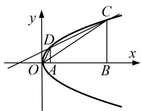

text_image

y
C
D
O A B x

[规范解答] (1)由题意知 $A\left(\frac{p}{2},0\right)$ ，则 $B\left(\frac{p}{2}+a,0\right)$ ， $D\left(\frac{p}{2},p\right)$ ，则 $C\left(\frac{p}{2}+a,\sqrt{p^{2}+2pa}\right)$ ,

又 $a = p$ ，所以 $k_{CD} = \frac{\sqrt{3}p - p}{\frac{3p}{2} - \frac{p}{2}} = \sqrt{3} -1.$

(2)设直线 CD 的方程为 $y=kx+b(k\neq0)$ ， $C(x_{1},y_{1})$ ， $D(x_{2},y_{2})$ ，

由 $\left\{\begin{aligned}y&=kx+b,\\ y^{2}&=2px,\end{aligned}\right.$ 得 $ky^{2}-2py+2pb=0$ ，所以 $\Delta=4p^{2}-8pkb>0$ ，得 $kb<\frac{p}{2}$

又 $y_{1}+y_{2}=\frac{2p}{k}$ ， $y_{1}y_{2}=\frac{2pb}{k}$ ，由 $y_{1}+y_{2}=\frac{2p}{k}>0$ ， $y_{1}y_{2}=\frac{2pb}{k}>0$ ，

可知 k>0, b>0，因为 $\left|CD\right|=\sqrt{1+k^{2}}\left|x_{1}-x_{2}\right|=a\sqrt{1+k^{2}}$ ,

点 O 到直线 CD 的距离 $d=\frac{|b|}{\sqrt{1+k^{2}}}$ ,

所以 $S_{1} = \frac{1}{2}\cdot a\sqrt{1 + k^{2}}\cdot \frac{|b|}{\sqrt{1 + k^{2}}} = \frac{1}{2} ab$ 又 $S_{2} = \frac{1}{2} (y_{1} + y_{2})\cdot |x_{1} - x_{2}| = \frac{1}{2}\cdot \frac{2p}{k}\cdot a = \frac{ap}{k},$

所以 $\frac{S_{1}}{S_{2}}=\frac{kb}{2p}$ ，因为0<kb<p/2，所以 $0<\frac{S_{1}}{S_{2}}<\frac{1}{4}$ 。即 $\frac{S_{1}}{S_{2}}$ 的取值范围为 $\left(0,\frac{1}{4}\right)$ 。

[例 4] 如图，椭圆 $C: \frac{x^{2}}{a^{2}} + \frac{y^{2}}{b^{2}} = 1 (a > b > 0)$ 的右顶点为 $A(2, 0)$ ，左、右焦点分别为 $F_{1}$ ， $F_{2}$ ，过点 A 且斜率为 $\frac{1}{2}$ 的直线与 y 轴交于点 P，与椭圆交于另一个点 B，且点 B 在 x 轴上的射影恰好为点 $F_{1}$ .

(1)求椭圆 C 的标准方程;

(2)过点 $P$ 且斜率大于 $\frac{1}{2}$ 的直线与椭圆交于 $M$ , $N$ 两点 $(|PM| > |PN|)$ , 若 $S_{\triangle PAM}: S_{\triangle PBN} = \lambda$ , 求实数 $\lambda$ 的取值范围.

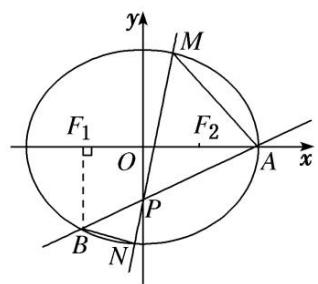

text_image

y
M
F₁
O
F₂
A
x
P
B
N

[规范解答] (1)因为 $BF_{1} \perp x$ 轴，所以点 $B\left(-c, -\frac{b^{2}}{a}\right)$ ，所以 $\left\{\begin{aligned}&a=2,\\&\frac{b^{2}}{a a+c}\\&a^{2}=b^{2}+c^{2}\end{aligned}\right.=\frac{1}{2},$ 解得 $\left\{\begin{aligned}&a=2,\\&b=\sqrt{3},\\&c=1,\end{aligned}\right.$

所以椭圆 C 的标准方程是 $\frac{x^{2}}{4} + \frac{y^{2}}{3} = 1$ .

(2) 因为 $\frac{S_{\triangle PAM}}{S_{\triangle PBN}} = \frac{\frac{1}{2}|PA| \cdot |PM| \cdot \sin \angle APM}{\frac{1}{2}|PB| \cdot |PN| \cdot \sin \angle BPN} = \frac{2 \cdot |PM|}{1 \cdot |PN|} = \lambda \Rightarrow \frac{|PM|}{|PN|} = \frac{\lambda}{2} (\lambda > 2)$ ，所以 $\overrightarrow{PM} = -\frac{\lambda}{2}\overrightarrow{PN}$ .

由(1)可知 $P(0, -1)$ ，设直线 MN 的方程为 $y = kx - 1\left(k > \frac{1}{2}\right)$ ， $M(x_{1}, y_{1})$ ， $N(x_{2}, y_{2})$ ，

联立方程，得 $\left\{ \begin{array}{l} y = kx - 1, \\ \frac{x^2}{4} + \frac{y^2}{3} = 1, \end{array} \right.$ 化简得， $(4k^2 + 3)x^2 - 8kx - 8 = 0$ 。得 $\left\{ \begin{array}{l} x_1 + x_2 = \frac{8k}{4k^2 + 3}, \\ x_1 \cdot x_2 = \frac{-8}{4k^2 + 3}. \end{array} \right.$ (\*)

又 $\overrightarrow{PM}=(x_{1},y_{1}+1)$ ， $\overrightarrow{PN}=(x_{2},y_{2}+1)$ ，有 $x_{1}=-\frac{\lambda}{2}x_{2}$ ，将 $x_{1}=-\frac{\lambda}{2}x_{2}$ 代入(\*)可得， $\frac{(2-\lambda)^{2}}{\lambda}=\frac{16k^{2}}{4k^{2}+3}$ .

因为 $k > \frac{1}{2}$ ，所以 $\frac{16k^{2}}{4k^{2} + 3} = \frac{16}{\frac{3}{k^{2}} + 4} \in (1, 4)$ ，则 $1 < \frac{(2 - \lambda)^{2}}{\lambda} < 4$ 且 $\lambda > 2$ ，解得 $4 < \lambda < 4 + 2\sqrt{3}$ .

综上所述，实数 $\lambda$ 的取值范围为 $(4, 4+2\sqrt{3})$ .

[例 5] (2016·全国乙) 设圆 $x^{2} + y^{2} + 2x - 15 = 0$ 的圆心为 A，直线 l 过点 $B(1, 0)$ 且与 x 轴不重合，l 交圆 A 于 C，D 两点，过 B 作 AC 的平行线交 AD 于点 E.

(1)证明 $|EA|+|EB|$ 为定值，并写出点E的轨迹方程；

(2)设点 $E$ 的轨迹为曲线 $C_1$ ，直线 $l$ 交 $C_1$ 于 $M$ ， $N$ 两点，过 $B$ 且与 $l$ 垂直的直线与圆 $A$ 交于 $P$ ， $Q$ 两点，求四边形 MPNQ 面积的取值范围.

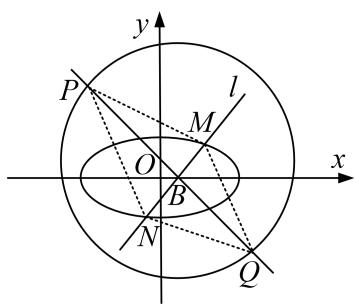

text_image

y
P
l
M
O
x
B
N
Q

[规范解答] (1) 因为 $|AD| = |AC|$ ，EB // AC，故 $\angle EBD = \angle ACD = \angle ADC$ .

所以 $|EB|=|ED|$ ，故 $|EA|+|EB|=|EA|+|ED|=|AD|$ .

又圆 A 的标准方程为 $(x+1)^{2}+y^{2}=16$ ，从而 $|AD|=4$ ，所以 $|EA|+|EB|=4$ 。

由题设得 $A(-1, 0)$ ， $B(1, 0)$ ， $|AB|=2$ ，由椭圆定义可得点 E 的轨迹方程为 $\frac{x^{2}}{4}+\frac{y^{2}}{3}=1(y\neq0)$ .

(2)当 l 与 x 轴不垂直时，设 l 的方程为 $y=k(x-1)(k\neq0)$ ， $M(x_{1},y_{1})$ ， $N(x_{2},y_{2})$ .

由 $\left\{\begin{aligned}y&=k(x-1),\\ \frac{x^{2}}{4}&+\frac{y^{2}}{3}=1\end{aligned}\right.$ 得 $(4k^{2}+3)x^{2}-8k^{2}x+4k^{2}-12=0$ ，则 $x_{1}+x_{2}=\frac{8k^{2}}{4k^{2}+3},\quad x_{1}x_{2}=\frac{4k^{2}-12}{4k^{2}+3},$

所以 $|MN|=\sqrt{1+k^{2}}|x_{1}-x_{2}|=\frac{12(k^{2}+1)}{4k^{2}+3}.$

过点 $B(1,0)$ 且与 l 垂直的直线 m: $y=-\frac{1}{k}(x-1)$ ，A 到 m 的距离为 $\frac{2}{\sqrt{k^{2}+1}}$ ,

所以 $|PQ|=2\sqrt{4^{2}-\left(\frac{2}{\sqrt{k^{2}+1}}\right)^{2}}=4\sqrt{\frac{4k^{2}+3}{k^{2}+1}}.$

故四边形 MPNQ 的面积 $S=\frac{1}{2}|MN||PQ|=12\sqrt{1+\frac{1}{4k^{2}+3}}$ .

可得当 l 与 x 轴不垂直时，四边形 MPNQ 面积的取值范围为 $(12, 8\sqrt{3})$ .

当 l 与 x 轴垂直时，其方程为 x=1， $|MN|=3$ ， $|PQ|=8$ ，四边形 MPNQ 的面积为 12.

综上，四边形 MPNQ 面积的取值范围为 $[12, 8\sqrt{3})$ .

[例6] 已知圆心为 $H$ 的圆 $x^{2} + y^{2} + 2x - 15 = 0$ 和定点 $A(1,0)$ ， $B$ 是圆上任意一点，线段 $AB$ 的中垂线 $l$ 和直线 $BH$ 相交于点 $M$ ，当点 $B$ 在圆上运动时，点 $M$ 的轨迹记为曲线 $C$ .

(1)求 C 的方程;

(2)过点 A 作两条相互垂直的直线分别与曲线 C 相交于 P, Q 和 E, F, 求 $\overrightarrow{PE} \cdot \overrightarrow{QF}$ 的取值范围.

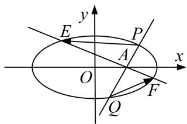

text_image

y
E
P
A
O
x
F
Q

[规范解答] (1)由 $x^{2}+y^{2}+2x-15=0$ ，得 $(x+1)^{2}+y^{2}=16$ ，所以圆心为 $H(-1,0)$ ，半径为 4.

连接 MA，由 l 是线段 AB 的中垂线，得 $|MA| = |MB|$ ,

所以 $|MA|+|MH|=|MB|+|MH|=|BH|=4$ ，又 $|AH|=2<4$ .

根据椭圆的定义可知，点 M 的轨迹是以 A, H 为焦点，4 为长轴长的椭圆，

所以 $a^{2}=4,\quad c^{2}=1,\quad b^{2}=3$ ，所求曲线 C 的方程为 $\frac{x^{2}}{4}+\frac{y^{2}}{3}=1$

(2)由直线 EF 与直线 PQ 垂直，可得 $\overrightarrow{AP} \cdot \overrightarrow{AE} = \overrightarrow{AQ} \cdot \overrightarrow{AF} = 0$ ,

于是 $\overrightarrow{PE} \cdot \overrightarrow{QF} = (\overrightarrow{AE} - \overrightarrow{AP}) \cdot (\overrightarrow{AF} - \overrightarrow{AQ}) = \overrightarrow{AE} \cdot \overrightarrow{AF} + \overrightarrow{AP} \cdot \overrightarrow{AQ}$ .

①当直线 PQ 的斜率不存在时，直线 EF 的斜率为零，

此时可不妨取 $P\left(1, \frac{3}{2}\right)$ ， $Q\left(1, -\frac{3}{2}\right)$ ， $E(2, 0)$ ， $F(-2, 0)$ ，

所以 $\overrightarrow{PE}\cdot\overrightarrow{QF}=\left(1,-\frac{3}{2}\right)\cdot\left(-3,\frac{3}{2}\right)=-3-\frac{9}{4}=-\frac{21}{4}.$

②当直线 PQ 的斜率为零时，直线 EF 的斜率不存在，同理可得 $\overrightarrow{PE} \cdot \overrightarrow{QF} = -\frac{21}{4}$ .  
③当直线 PQ 的斜率存在且不为零时，直线 EF 的斜率也存在，于是可设直线 PQ 的方程为

$$
y = k (x - 1), P \left(x _ {P}, y _ {P}\right), Q \left(x _ {Q}, y _ {Q}\right), \overrightarrow {A P} = \left(x _ {P} - 1, y _ {P}\right), \overrightarrow {A Q} = \left(x _ {Q} - 1, y _ {Q}\right),
$$

则直线 EF 的方程为 $y=-\frac{1}{k}(x-1)$ .

将直线 PQ 的方程代入曲线 C 的方程，并整理得， $(3+4k^{2})x^{2}-8k^{2}x+4k^{2}-12=0$ ，

所以 $x_{P}+x_{Q}=\frac{8k^{2}}{3+4k^{2}}$ ， $x_{P}\cdot x_{Q}=\frac{4k^{2}-12}{3+4k^{2}}$ .

于是 $\overrightarrow{AP} \cdot \overrightarrow{AQ} = (x_{P} - 1)(x_{Q} - 1) + y_{P} \cdot y_{Q} = (1 + k^{2})[x_{P} x_{Q} - (x_{P} + x_{Q}) + 1]$

$$
= (1 + k ^ {2}) \left(\frac {4 k ^ {2} - 1 2}{3 + 4 k ^ {2}} - \frac {8 k ^ {2}}{3 + 4 k ^ {2}} + 1\right) = - \frac {9 \quad 1 + k ^ {2}}{3 + 4 k ^ {2}}.
$$

将上面的 k 换成 $-\frac{1}{k}$ ，可得 $\overrightarrow{AE}\cdot\overrightarrow{AF}=-\frac{9\quad1+k^{2}}{4+3k^{2}}$

所以 $\overrightarrow{PE} \cdot \overrightarrow{QF} = \overrightarrow{AE} \cdot \overrightarrow{AF} + \overrightarrow{AP} \cdot \overrightarrow{AQ} = -9(1 + k^2)\left[\frac{1}{3 + 4k^2} + \frac{1}{4 + 3k^2}\right]$ .

令 $1+k^{2}=t$ ，则 t>1，于是上式化简整理可得，

$$
\overrightarrow {P E} \cdot \overrightarrow {Q F} = - 9 t \left(\frac {1}{4 t - 1} + \frac {1}{3 t + 1}\right) = - \frac {6 3 t ^ {2}}{1 2 t ^ {2} + t - 1} = - \frac {6 3}{\frac {4 9}{4} - \left(\frac {1}{t} - \frac {1}{2}\right) ^ {2}}.
$$

由 t>1，得 $0<\frac{1}{t}<1$ ，所以 $-\frac{21}{4}<\overrightarrow{PE}\cdot\overrightarrow{QF}\leq-\frac{36}{7}$ .

综合①②③可知， $\overrightarrow{PE} \cdot \overrightarrow{QF}$ 的取值范围为 $\left[-\frac{21}{4}, -\frac{36}{7}\right]$ .

[例7] 已知椭圆 $C_1: \frac{y^2}{a^2} + \frac{x^2}{b^2} = 1 (a > b > 0)$ 与抛物线 $C_2: x^2 = 2py (p > 0)$ 有一个公共焦点，抛物线 $C_2$ 的准线 $l$ 与椭圆 $C_1$ 有一交点坐标是 $(\sqrt{2}, -2)$ .

(1)求椭圆 $C_{1}$ 与抛物线 $C_{2}$ 的方程;

(2)若点 P 是直线 l 上的动点，过点 P 作抛物线的两条切线，切点分别为 A, B，直线 AB 与椭圆 $C_{1}$ 分别交于点 E, F，求 $\overrightarrow{OE} \cdot \overrightarrow{OF}$ 的取值范围.

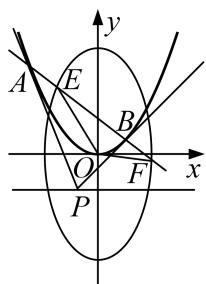

text_image

y
A E
B
O F
x
P

[规范解答] (1)抛物线 $C_{2}$ 的准线方程是 y = -2，所以 $-\frac{p}{2} = -2$ ，即 p = 4，

所以抛物线 $C_{2}$ 的方程为 $x^{2}=8y$ .

椭圆 $C_{1}:\frac{y^{2}}{a^{2}}+\frac{x^{2}}{b^{2}}=1(a>b>0)$ 的焦点坐标分别是 $(0,-2)$ ， $(0,2)$ ，所以 c=2.

$$
2 a = \sqrt {2 + 0} + \sqrt {2 + (2 + 2) ^ {2}} = 4 \sqrt {2},
$$

解得 $a=2\sqrt{2}$ ，则 b=2，所以椭圆 $C_{1}$ 的方程为 $\frac{y^{2}}{8}+\frac{x^{2}}{4}=1$ .

(2)设点 $P(t, -2)$ ， $A(x_{1}, y_{1})$ ， $B(x_{2}, y_{2})$ ， $E(x_{3}, y_{3})$ ， $F(x_{4}, y_{4})$ ，

抛物线方程可化为 $y=\frac{1}{8}x^{2}$ ，求导得 $y'=\frac{1}{4}x$ ，所以 AP 的方程为 $y-y_{1}=\frac{1}{4}x_{1}(x-x_{1})$ ,

将 $P(t, -2)$ 代入，得 $-2 - y_{1} = \frac{1}{4} x_{1} t - 2 y_{1}$ ，即 $y_{1} = \frac{1}{4} tx_{1} + 2$ .

同理，BP 的方程为 $y_{2}=\frac{1}{4}tx_{2}+2$ ，所以直线 AB 的方程为 $y=\frac{1}{4}tx+2$ .

由 $\left\{\begin{aligned}y&=\frac{1}{4}tx+2,\\ \frac{y^{2}}{8}&+\frac{x^{2}}{4}=1\end{aligned}\right.$ 消去 y，整理得 $(t^{2}+32)x^{2}+16tx-64=0$ ，

则 $\Delta=256t^{2}+256(t^{2}+32)>0$ ，且 $x_{3}+x_{4}=\frac{-16t}{t^{2}+32}$ ， $x_{3}x_{4}=\frac{-64}{t^{2}+32}$ .

所以 $\overrightarrow{OE} \cdot \overrightarrow{OF} = x_3x_4 + y_3y_4 = (1 + \frac{t^2}{16})x_3x_4 + \frac{t}{2}(x_3 + x_4) + 4 = \frac{-8t^2 + 64}{t^2 + 32} = \frac{320}{t^2 + 32} - 8.$

因为 $0 < \frac{320}{t^2 + 32} \leq 10$ ，所以 $\overrightarrow{OE} \cdot \overrightarrow{OF}$ 的取值范围是 $(-8, 2]$ .

[例 8] 已知椭圆 C: $\frac{x^{2}}{a^{2}} + \frac{y^{2}}{b^{2}} = 1 (a > b > 0)$ 的左、右顶点分别为 A, B，且长轴长为 8, T 为椭圆上任意一点，直线 TA, TB 的斜率之积为 $-\frac{3}{4}$ .

(1)求椭圆 C 的方程;

(2)设 O 为坐标原点，过点 $M(0, 2)$ 的动直线与椭圆 C 交于 P，Q 两点，求 $\overrightarrow{OP} \cdot \overrightarrow{OQ} + \overrightarrow{MP} \cdot \overrightarrow{MQ}$ 的取值范围.

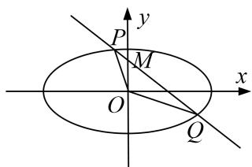

text_image

y
P
M
O
x
Q

[规范解答] (1) 设 $T(x, y)$ ，由题意知 $A(-4, 0)$ ， $B(4, 0)$ ，

设直线 TA 的斜率为 $k_{1}$ ，直线 TB 的斜率为 $k_{2}$ ，则 $k_{1}=\frac{y}{x+4}$ ， $k_{2}=\frac{y}{x-4}$ ，

由 $k_{1}k_{2}=-\frac{3}{4}$ ，得 $\frac{y}{x+4}\cdot\frac{y}{x-4}=-\frac{3}{4}$ ，整理得 $\frac{x^{2}}{16}+\frac{y^{2}}{12}=1$ .

故椭圆 C 的方程为 $\frac{x^{2}}{16} + \frac{y^{2}}{12} = 1$ .

(2)当直线 PQ 的斜率存在时，设直线 PQ 的方程为 $y=kx+2$ ，点 P，Q 的坐标分别为 $(x_{1}, y_{1})$ ， $(x_{2}, y_{2})$ ，

联立方程 $\left\{\begin{aligned}\frac{x^{2}}{16}+\frac{y^{2}}{12}&=1,\\ y=kx+2\end{aligned}\right.$ 消去 y，得 $(4k^{2}+3)x^{2}+16kx-32=0.$

所以 $x_{1}+x_{2}=-\frac{16k}{4k^{2}+3},\quad x_{1}x_{2}=-\frac{32}{4k^{2}+3}.$

从而， $\overrightarrow{OP}\cdot \overrightarrow{OQ} +\overrightarrow{MP}\cdot \overrightarrow{MQ} = x_1x_2 + y_1y_2 + [x_1x_2 + (y_1 - 2)(y_2 - 2)] = 2(1 + k^2)x_1x_2 + 2k(x_1 + x_2) + 4$

$$
= \frac {- 8 0 k ^ {2} - 5 2}{4 k ^ {2} + 3} = - 2 0 + \frac {8}{4 k ^ {2} + 3}, \text {所以} - 2 0 <   \overrightarrow {O P} \cdot \overrightarrow {O Q} + \overrightarrow {M P} \cdot \overrightarrow {M Q} \leq - \frac {5 2}{3}.
$$

当直线 PQ 的斜率不存在时， $\overrightarrow{OP}\cdot\overrightarrow{OQ}+\overrightarrow{MP}\cdot\overrightarrow{MO}$ 的值为 -20.

综上， $\overrightarrow{OP} \cdot \overrightarrow{OQ} + \overrightarrow{MP} \cdot \overrightarrow{MQ}$ 的取值范围为 $\left[-20, -\frac{52}{3}\right]$ .

# 【对点训练】

1. 已知抛物线 $C: y^{2} = 2px (p > 0)$ ，点 $F$ 为抛物线 $C$ 的焦点，点 $A(1, m) (m > 0)$ 在抛物线 $C$ 上，且 $|FA| = 2$ 过点 $F$ 作斜率为 $k\left(\frac{1}{2} \leq k \leq 2\right)$ 的直线 $l$ 与抛物线 $C$ 交于 $P$ ， $Q$ 两点.

(1)求抛物线 C 的方程;  
(2)求 $\triangle APO$ 面积的取值范围.

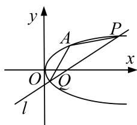

text_image

y
A
P
O
Q
x
l

1. 解析 (1)由抛物线的定义可得 $|FA|=x_{A}+\frac{p}{2}=1+\frac{p}{2}=2$ ，所以p=2，

所以抛物线的方程为 $v^{2}=4x$ .

(2)设直线 l 的方程为 $y=k(x-1)$ ， $P(x_{1},y_{1})$ ， $Q(x_{2},y_{2})$ ，

联立 $\left\{\begin{aligned}y&=k(x-1),\\ y^{2}&=4x\end{aligned}\right.$ 得 $k^{2}x^{2}-(2k^{2}+4)x+k^{2}=0,\quad\Delta>0$ 恒成立，

由根与系数的关系得 $x_{1}+x_{2}=\frac{2k^{2}+4}{k^{2}}$ ， $x_{1}x_{2}=1$ ，因为 $AF\perp x$ 轴，

则 $S_{\triangle APQ} = \frac{1}{2}\times |AF|\times |x_1 - x_2| = |x_1 - x_2| = \sqrt{(x_1 + x_2)^2 - 4x_1x_2} = 4\sqrt{\frac{k^2 + 1}{k^4}} = 4\sqrt{\frac{1}{k^2} + \frac{1}{k^4}},$

因为 $\frac{1}{2} \leq k \leq 2$ ，令 $t = \frac{1}{k^2}$ ，所以 $S_{\triangle APQ} = 4\sqrt{t^2 + t}\left(\frac{1}{4} \leq t \leq 4\right)$ ，所以 $\sqrt{5} \leq S_{\triangle APQ} \leq 8\sqrt{5}$ ，

所以 $\triangle APQ$ 的面积的取值范围为 $[\sqrt{5}, 8\sqrt{5}]$ .

2. 已知中心在原点，焦点在 $y$ 轴上的椭圆 $C$ ，其上一点 $P$ 到两个焦点 $F_{1}$ ， $F_{2}$ 的距离之和为 4，离心率为 $\frac{\sqrt{3}}{2}$ .

(1)求椭圆 C 的方程;  
(2)若直线 $y=kx+1$ 与曲线 C 交于 A, B 两点，求 $\triangle OAB$ 面积的取值范围.

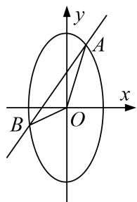

text_image

y
A
x
B
O

2. 解析 (1) 设椭圆的标准方程为 $\frac{y^2}{a^2} + \frac{x^2}{b^2} = 1 (a > b > 0)$ ，由条件知， $\left\{ \begin{array}{l} a = 4, \\ e = \frac{c}{a} = \frac{\sqrt{3}}{2}, \\ a^2 = b^2 + c^2, \end{array} \right.$ 解得 a=2, $c=\sqrt{3}$ , b=1，故椭圆 C 的方程为 $\frac{y^{2}}{4}+x^{2}=1$ .

(2)设 $A(x_{1}, y_{1})$ , $B(x_{2}, y_{2})$ ，由 $\left\{\begin{aligned}x^{2}+\frac{y^{2}}{4}&=1,\\ y=kx+1\end{aligned}\right.$ 得 $(k^{2}+4)x^{2}+2kx-3=0$ ,

故 $x_{1}+x_{2}=-\frac{2k}{k^{2}+4}$ ， $x_{1}x_{2}=-\frac{3}{k^{2}+4}$ ，设 $\triangle OAB$ 的面积为 S，

由 $x_{1}x_{2} = -\frac{3}{k^{2} + 4} < 0$ ，知 $S = \frac{1}{2}\times 1\times |x_1 - x_2| = \frac{1}{2}\sqrt{(x_1 + x_2)^2 - 4x_1x_2} = 2\sqrt{\frac{k^2 + 3}{(k^2 + 4)^2}}$

令 $k^2 + 3 = t$ ，知 $t \geq 3$ ， $\therefore S = 2\sqrt{\frac{1}{t + \frac{1}{t} + 2}}$ .

对函数 $y=t+\frac{1}{t}(t\geq3)$ ，知 $y'=1-\frac{1}{t^{2}}=\frac{t^{2}-1}{t^{2}}>0$ ，

∴ $y = t + \frac{1}{t}$ 在 $t \in [3, +\infty)$ 上单调递增，∴ $t + \frac{1}{t} \geq \frac{10}{3}$ ，∴ $0 < \frac{1}{t + \frac{1}{t} + 2} \leq \frac{3}{16}$ ，∴ $0 < S \leq \frac{\sqrt{3}}{2}$ .

故 $\triangle OAB$ 面积的取值范围为 $\left\{0, \frac{\sqrt{3}}{2}\right\}$ .

3. 已知 $M(-1, 0)$ , $F(1, 0)$ , $|\overrightarrow{MR}| = 2\sqrt{2}$ , $\overrightarrow{FR} = 2\overrightarrow{FQ}$ , $\overrightarrow{MP} = \lambda \overrightarrow{MR} (\lambda \in \mathbf{R})$ , 且 $\overrightarrow{PQ} \cdot \overrightarrow{FR} = 0$ .

(1)当 $R$ 在该坐标平面上运动时，求点 $P$ 运动的轨迹 $C$ 的方程；

(2)经过点 $H(2,0)$ 作不过 $F$ 点且斜率存在的直线 $l$ ，若直线 $l$ 与轨迹 $C$ 相交于 $A$ ， $B$ 两点.

①探究：直线 $FA$ ， $FB$ 的斜率之和是否为定值？若是，求出该定值；若不是，请说明理由；

②求 $\triangle FAB$ 面积的取值范围.

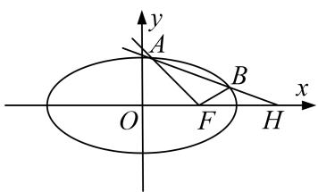

text_image

y
A
B
x
O
F
H

3. 解析 (1)由 $|\overrightarrow{MR}| = 2\sqrt{2}$ 知，点 $R$ 在以 $M(-1,0)$ 为圆心，以 $2\sqrt{2}$ 为半径的圆周上运动.

由 $\overrightarrow{FR}=2\overrightarrow{FQ}$ 知，Q为FR的中点，又 $\overrightarrow{MP}=\lambda\overrightarrow{MR}(\lambda\in\mathbf{R})$ ，且 $\overrightarrow{PQ}\cdot\overrightarrow{FR}=0$ ，

得点 P 为线段 FR 的中垂线与 MR 的交点，所以 $\left|PF\right|=\left|PR\right|$ ，所以 $\left|PM\right|+\left|PF\right|=2\sqrt{2}$ (定值)，

因此点 P 的轨迹 C 是以 M，F 为焦点的椭圆，由 $a=\sqrt{2}$ ，c=1，得 b=1，

所以轨迹 C 的方程为 $\frac{x^{2}}{2} + y^{2} = 1$ .

(2)①由已知，设直线 l 的方程为 $y=k(x-2)(k\neq0)$ ,

直线 l 与椭圆 C 的交点 A, B 分别设为 $A(x_{1}, y_{1})$ , $B(x_{2}, y_{2})$ . 联立 $\left\{\begin{aligned}\frac{x^{2}}{2}+y^{2}&=1,\\ y=k&x-2\end{aligned}\right.$

化简得 $(1+2k^{2})x^{2}-8k^{2}x+8k^{2}-2=0$ ，则 $x_{1}+x_{2}=\frac{8k^{2}}{1+2k^{2}}$ ， $x_{1}x_{2}=\frac{8k^{2}-2}{1+2k^{2}}$

又直线 $FA$ ， $FB$ 的斜率之和为 $\frac{y_1}{x_1 - 1} +\frac{y_2}{x_2 - 1} = \frac{k(x_1 - 2}{x_1 - 1} +\frac{k(x_2 - 2}{x_2 - 1} = \frac{2kx_1x_2 - 3k(x_1 + x_2 + 4k}{x_1x_2 - x_1 + x_2 + 1},$

又 $2kx_{1}x_{2} - 3k(x_{1} + x_{2}) + 4k = 2k\cdot \frac{8k^{2} - 2}{1 + 2k^{2}} -\frac{24k^{3}}{1 + 2k^{2}} +4k = \frac{16k^{3} - 4k - 24k^{3} + 4k + 8k^{3}}{1 + 2k^{2}} = 0$ （定值），

所以 $\frac{y_{1}}{x_{1}-1}+\frac{y_{2}}{x_{2}-1}=0$ ，即直线FA，FB的斜率之和为定值0.

②由①得 $\Delta=64k^{4}-4(1+2k^{2})(8k^{2}-2)=8-16k^{2}$ ，由 $\Delta>0$ ，得 $k^{2}\in\left(0,\frac{1}{2}\right)$ ,

因为 $|AB|=|x_{1}-x_{2}|\sqrt{1+k^{2}}=\sqrt{\left[\begin{array}{ccc}x_{1}+x_{2}&^{2}-4x_{1}x_{2}\end{array}\right]}$ $1+k^{2}=\frac{\sqrt{8-16k^{2}}}{1+2k^{2}}\cdot\sqrt{1+k^{2}}$

又点 F 到直线 l 的距离 $d=\frac{|k|}{\sqrt{k^{2}+1}}$ ,

所以 $S_{\triangle FAB}=\frac{1}{2}|AB|\cdot d=\frac{\sqrt{2-4k^{2}}\cdot|k|}{1+2k^{2}}=\sqrt{\frac{6k^{2}+1}{2k^{2}+1}}^{-1}$

令 $t = 2k^2 + 1 \in (1, 2)$ , $\varphi(t) = \frac{3t - 2}{t^2} = \frac{9}{8} - 2\left(\frac{1}{t} - \frac{3}{4}\right)^2$ ,

因为 $\frac{1}{t}\in\left(\frac{1}{2},\quad1\right)$ ，所以 $\varphi(t)\in\left(1,\quad\frac{9}{8}\right)$ ，所以 $S_{\triangle FAB}=\sqrt{\varphi\quad t\quad-1}\in\left(0,\quad\frac{\sqrt{2}}{4}\right)$

当且仅当 $t = \frac{4}{3}$ ，即 $k = \pm \frac{\sqrt{6}}{6}$ 时， $S_{\triangle FAB}$ 取到最大值 $\frac{\sqrt{2}}{4}$

所以 $\triangle FAB$ 面积的取值范围为 $\left\{0, \frac{\sqrt{2}}{4}\right\}$ .

4. 已知抛物线 $C: y^{2} = 4x$ 的焦点为 $F$ , 直线 $l: y = kx - 4 (1 < k < 2)$ 与 $y$ 轴、抛物线 $C$ 相交于点 $P, A, B$ (自下而上), 记 $\triangle PAF, \triangle PBF$ 的面积分别为 $S_{1}, S_{2}$ .

(1)求 AB 中点 M 到 y 轴的距离 d 的取值范围;

(2)求 $\frac{S_{1}}{S_{2}}$ 的取值范围.

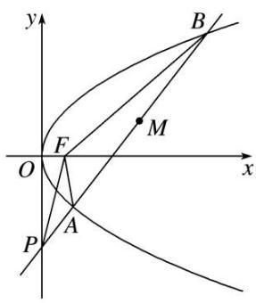

text_image

y
B
F
M
O
x
P
A

4. 解析 (1)联立 $\left\{ \begin{array}{l} y = kx - 4, \\ y^2 = 4x, \end{array} \right.$ 消去 $y$ ，得 $k^2 x^2 - (8k + 4)x + 16 = 0$

设 $A(x_{1}, y_{1})$ ， $B(x_{2}, y_{2})$ ，则 $x_{1} + x_{2} = \frac{8k + 4}{k^{2}}$ ， $x_{1}x_{2} = \frac{16}{k^{2}}$ ，所以 $d = \frac{x_{1} + x_{2}}{2} = \frac{4}{k} + \frac{2}{k^{2}} = 2\left(\frac{1}{k} + 1\right)^{2} - 2 \in \left(\frac{5}{2}, 6\right)$ .

(2)由于 $\frac{S_1}{S_2} = \frac{|PA|}{|PB|} = \frac{x_1}{x_2}$ . 由(1)可知 $\frac{S_1}{S_2} + \frac{S_2}{S_1} = \frac{x_1}{x_2} + \frac{x_2}{x_1} = \frac{(x_1 + x_2)^2 - 2x_1x_2}{x_1x_2}$

$$
= \frac {k ^ {2}}{1 6} \cdot \frac {(8 k + 4) ^ {2}}{k ^ {4}} - 2 = \left(\frac {1}{k} + 2\right) _ {2} - 2 \in \left(\frac {1 7}{4}, 7\right).
$$

由 $\frac{S_1}{S_2} +\frac{S_2}{S_1} >\frac{17}{4}$ 得 $4\left(\frac{S_1}{S_2}\right)^2 -17\cdot \frac{S_1}{S_2} +4 > 0$ ，解得 $\frac{S_1}{S_2} >4$ 或 $\frac{S_1}{S_2} < \frac{1}{4}$

因为 $0 < \frac{S_{1}}{S_{2}} < 1$ ，所以 $0 < \frac{S_{1}}{S_{2}} < \frac{1}{4}$ ，由 $\frac{S_{1}}{S_{2}} + \frac{S_{2}}{S_{1}} < 7$ ，得 $\left(\frac{S_{1}}{S_{2}}\right)^{2} - 7 \cdot \frac{S_{1}}{S_{2}} + 1 < 0$ ，解得 $\frac{7 - 3\sqrt{5}}{2} < \frac{S_{1}}{S_{2}} < \frac{7 + 3\sqrt{5}}{2}$ ，

因此 $\frac{7-3\sqrt{5}}{2}<\frac{S_{1}}{S_{2}}<\frac{1}{4}$ . 即 $\frac{S_{1}}{S_{2}}$ 的取值范围为 $\left(\frac{7-3\sqrt{5}}{2},\frac{1}{4}\right)$ .

5. 在平面直角坐标系 $xOy$ 中，圆 $x^{2} + y^{2} + 2x - 15 = 0$ 的圆心为 $M$ 。已知点 $N(1,0)$ ，且 $T$ 为圆 $M$ 上的动点，线段 $TN$ 的垂直平分线交 $TM$ 于点 $P$ 。

(1)求点 P 的轨迹方程;

(2)设点 P 的轨迹为曲线 $C_{1}$ ，抛物线 $C_{2}: y^{2}=2px$ 的焦点为 N. $l_{1}$ ， $l_{2}$ 是过点 N 互相垂直的两条直线，直线 $l_{1}$ 与曲线 $C_{1}$ 交于 A，C 两点，直线 $l_{2}$ 与曲线 $C_{2}$ 交于 B，D 两点，求四边形 ABCD 面积的取值范围.

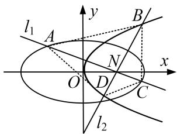

text_image

l₁
A
y
B
N
O
D
x
C
l₂

5. 解析 (1)∵P为线段TN垂直平分线上一点，∴ $|PM|+|PN|=|PM|+|PT|=|TM|=4$

$$
\because M (- 1, 0), N (1, 0), \because 4 > | M N | = 2,
$$

∴P 的轨迹是以 $M(-1,0)$ ， $N(1,0)$ 为焦点，长轴长为 4 的椭圆，它的方程为 $\frac{x^{2}}{4} + \frac{y^{2}}{3} = 1$ .

(2) $\because y^{2}=2px$ 的焦点为(1,0)， $C_{2}$ 的方程为 $y^{2}=4x$ ,

当直线 $l_{1}$ 斜率不存在时， $l_{2}$ 与 $C_{2}$ 只有一个交点，不合题意.

当直线 $l_{1}$ 斜率为 0 时，可求得 $|AC|=4,\quad|BD|=4,\quad\therefore S_{四边形ABCD}=\frac{1}{2}\cdot|AC|\cdot|BD|=8.$

当直线 $l_{1}$ 斜率存在且不为 0 时，

方程可设为 $y=k(x-1)(k\neq0)$ ，代入 $\frac{x^{2}}{4}+\frac{y^{2}}{3}=1$ ，得 $(3+4k^{2})x^{2}-8k^{2}x+4k^{2}-12=0$ ， $\Delta=144(k^{2}+1)>0$ ，

设 $A(x_{1}, y_{1})$ ， $C(x_{2}, y_{2})$ ，则 $x_{1} + x_{2} = \frac{8k^{2}}{3 + 4k^{2}}$ ， $x_{1}x_{2} = \frac{4k^{2} - 12}{3 + 4k^{2}}$

$$
\vert A C \vert = \sqrt {1 + k ^ {2}} \left| x _ {1} - x _ {2} \right| = \sqrt {1 + k ^ {2}} \sqrt {\left(x _ {1} + x _ {2}\right) ^ {2} - 4 x _ {1} x _ {2}} = \frac {1 2 \left(1 + k ^ {2}\right)}{3 + 4 k ^ {2}}.
$$

直线 $l_{2}$ 的方程为 $y=-\frac{1}{k}(x-1)$ 与 $y^{2}=4x$ 联立可得 $x^{2}-(2+4k^{2})x+1=0$ ,

设 $B(x_{3}, y_{3})$ ， $D(x_{4}, y_{4})$ ，则 $|BD|=x_{3}+x_{4}+2=4+4k^{2}$

∴四边形 ABCD 的面积 $S=\frac{1}{2}|AC||BD|=\frac{1}{2}(4+4k^{2})\cdot\frac{12(1+k^{2})}{3+4k^{2}}=\frac{24(1+k^{2})^{2}}{3+4k^{2}}$ .

令 $3 + 4k^{2} = t$ ，则 $k^2 = \frac{t - 3}{4} (t > 3), S(t) = \frac{24\left(1 + \frac{t - 3}{4}\right)^2}{t} = \frac{3}{2}\left(t + \frac{1}{t} +2\right),$

∴ $S(t)$ 在 $(3, +\infty)$ 是增函数， $S(t) > S(3) = 8$ ，

综上，四边形 ABCD 面积的取值范围是 $[8, +\infty)$ .

6. 已知点 $M\left(\frac{2\sqrt{3}}{3}, \frac{\sqrt{3}}{3}\right)$ 在椭圆 $C: \frac{x^2}{a^2} + \frac{y^2}{b^2} = 1 (a > b > 0)$ 上，且点 $M$ 到椭圆 $C$ 的左、右焦点的距离之和为 $2\sqrt{2}$ .

(1)求椭圆 C 的方程;

(2)设 O 为坐标原点，若椭圆 C 的弦 AB 的中点在线段 OM(不含端点 O, M)上，求 $\overrightarrow{OA} \cdot \overrightarrow{OB}$ 的取值范围.

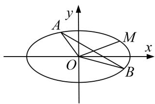

text_image

y
A
M
x
O
B

6. 解析 (1)由条件知 $\frac{4}{3a^2} + \frac{1}{3b^2} = 1, 2a = 2\sqrt{2}$ , 所以 $a = \sqrt{2}, b = 1$ , 所以椭圆 $C$ 的方程为 $\frac{x^2}{2} + y^2 = 1$ .

(2)设 $A(x_{1},y_{1})$ ， $B(x_{2},y_{2})$ ，则 $AB$ 的中点 $\left[\frac{x_1 + x_2}{2},\frac{y_1 + y_2}{2}\right]$ 在线段 $OM$ 上.

因为 $k_{OM}=\frac{1}{2}$ ，所以 $x_{1}+x_{2}=2(y_{1}+y_{2})$ .

$\frac{x_{1}^{2}}{2}+y_{1}^{2}=1,\quad\frac{x_{2}^{2}}{2}+y_{2}^{2}=1,$ 两式相减得 $\frac{(x_{1}-x_{2})(x_{1}+x_{2})}{2}+(y_{1}-y_{2})(y_{1}+y_{2})=0,$

易知 $x_{1}-x_{2}\neq0,\quad y_{1}+y_{2}\neq0$ ，所以 $\frac{y_{1}-y_{2}}{x_{1}-x_{2}}=-\frac{x_{1}+x_{2}}{2(y_{1}+y_{2})}=-1$ ，即 $k_{AB}=-1$ 。

设直线 AB 的方程为 $y = -x + m$ ，代入 $\frac{x^{2}}{2} + y^{2} = 1$ 并整理得 $3x^{2} - 4mx + 2m^{2} - 2 = 0$ .

由 $\Delta=8(3-m^{2})>0$ 得 $m^{2}<3$ 。由根与系数的关系得 $x_{1}+x_{2}=\frac{4m}{3}$ ， $x_{1}x_{2}=\frac{2\quad m^{2}-1}{3}$ ，

又 $\frac{x_1 + x_2}{2} \in \left(0, \frac{2\sqrt{3}}{3}\right)$ ，所以 $\frac{2m}{3} \in \left(0, \frac{2\sqrt{3}}{3}\right)$ ，所以 $0 < m < \sqrt{3}$ .

$$
\begin{array}{l} \overrightarrow {O A} \cdot \overrightarrow {O B} = x _ {1} x _ {2} + y _ {1} y _ {2} = x _ {1} x _ {2} + (- x _ {1} + m) (- x _ {2} + m) = 2 x _ {1} x _ {2} - m (x _ {1} + x _ {2}) + m ^ {2} \\ = \frac {4 (m ^ {2} - 1)}{3} - \frac {4 m ^ {2}}{3} + m ^ {2} = m ^ {2} - \frac {4}{3}, \\ \end{array}
$$

而 $0 < m < \sqrt{3}$ ，所以 $\overrightarrow{OA} \cdot \overrightarrow{OB}$ 的取值范围是 $\left(-\frac{4}{3}, \frac{5}{3}\right)$ .

7. 已知椭圆 $C: \frac{x^2}{a^2} + \frac{y^2}{b^2} = 1 (a > b > 0)$ 的离心率为 $\frac{\sqrt{2}}{2}$ ，短轴长为 2。直线 $l: y = kx + m$ 与椭圆 $C$ 交于 $M, N$ 两点，又 $l$ 与直线 $y = \frac{1}{2} x, y = -\frac{1}{2} x$ 分别交于 $A, B$ 两点，其中点 $A$ 在第一象限，点 $B$ 在第二象限，且 $\triangle OAB$ 的面积为 2 ( $O$ 为坐标原点).

(1)求椭圆 C 的方程;  
(2)求 $\overrightarrow{OM}\cdot\overrightarrow{ON}$ 的取值范围.

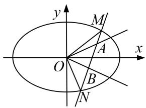

text_image

y
M
A
O
x
B
N

7. 解析 (1)由于 $b = 1$ 且离心率 $e = \frac{\sqrt{2}}{2}$ , $\therefore \frac{c}{a} = \frac{\sqrt{a^2 - 1}}{a} = \frac{\sqrt{2}}{2}$ , 则 $a^2 = 2$ , 因此椭圆的方程为 $\frac{x^2}{2} + y^2 = 1$ .

(2)联立直线 l 与直线 $y=\frac{1}{2}x$ ，可得点 $A\left(\frac{2m}{1-2k},\frac{m}{1-2k}\right)$ ,

联立直线 l 与直线 $y = -\frac{1}{2}x$ ，可得点 $B\left(-\frac{2m}{1+2k}, \frac{m}{1+2k}\right)$ ,

又点 A 在第一象限，点 B 在第二象限，∴ $\left\{\begin{aligned}\frac{2m}{1-2k}&>0,\\ -\frac{2m}{1+2k}&<0\end{aligned}\right.$ $\left\{\begin{aligned}m(1-2k)&>0,\\ m(1+2k)&>0,\end{aligned}\right.$

化为 $m^{2}(1-4k^{2})>0$ ，而 $m^{2}\geq0,\quad\therefore1-4k^{2}>0.$

又 $|AB|=\sqrt{\left(\frac{2m}{1-2k}+\frac{2m}{1+2k}\right)^{2}+\left(\frac{m}{1-2k}-\frac{m}{1+2k}\right)^{2}}=\frac{4|m|}{1-4k^{2}}\sqrt{1+k^{2}}$

原点 O 到直线 l 的距离为 $\frac{|m|}{\sqrt{1+k^{2}}}$ ，即 $\triangle OAB$ 底边 AB 上的高为 $\frac{|m|}{\sqrt{1+k^{2}}}$ ,

$$
\therefore S _ {\triangle O A B} = \frac {1 4 | m | \sqrt {1 + k ^ {2}}}{2 \quad 1 - 4 k ^ {2}} \cdot \frac {| m |}{\sqrt {1 + k ^ {2}}} = \frac {2 m ^ {2}}{1 - 4 k ^ {2}} = 2, \quad \therefore m ^ {2} = 1 - 4 k ^ {2}.
$$

设 $M(x_{1}, y_{1})$ ， $N(x_{2}, y_{2})$ ，将直线 l 代入椭圆方程，整理可得：

$$
(1 + 2 k ^ {2}) x ^ {2} + 4 k m x + 2 m ^ {2} - 2 = 0, \therefore x _ {1} + x _ {2} = - \frac {4 k m}{1 + 2 k ^ {2}}, x _ {1} \cdot x _ {2} = \frac {2 m ^ {2} - 2}{1 + 2 k ^ {2}},
$$

$$
\Delta = 1 6 k ^ {2} m ^ {2} - 4 (1 + 2 k ^ {2}) (2 m ^ {2} - 2) = 4 8 k ^ {2} > 0, \text {则} k ^ {2} > 0, \therefore y _ {1} \cdot y _ {2} = (k x _ {1} + m) (k x _ {2} + m) = \frac {m ^ {2} - 2 k ^ {2}}{1 + 2 k ^ {2}},
$$

$$
\therefore \overrightarrow {O M} \cdot \overrightarrow {O N} = x _ {1} x _ {2} + y _ {1} y _ {2} = \frac {2 m ^ {2} - 2}{1 + 2 k ^ {2}} + \frac {m ^ {2} - 2 k ^ {2}}{1 + 2 k ^ {2}} = \frac {8}{1 + 2 k ^ {2}} - 7.
$$

$$
\because 0 <   k ^ {2} <   \frac {1}{4}, \therefore 1 + 2 k ^ {2} \in \left( \begin{array}{c c} 1, & \frac {3}{2} \end{array} \right), \therefore \frac {8}{1 + 2 k ^ {2}} \in \left( \begin{array}{c c} \frac {1 6}{3}, & 8 \end{array} \right), \therefore \overrightarrow {O M} \cdot \overrightarrow {O N} \in \left( \begin{array}{c c} - \frac {5}{3}, & 1 \end{array} \right).
$$

故 $\overrightarrow{OM}\cdot\overrightarrow{ON}$ 的取值范围为 $\left(-\frac{5}{3},1\right)$ .

8. 已知椭圆 $C: \frac{x^2}{a^2} + \frac{y^2}{b^2} = 1 (a > b > 0)$ 的离心率为 $\frac{\sqrt{2}}{2}$ ，且以原点为圆心，椭圆的焦距为直径的圆与直线 $x \sin \theta + y \cos \theta - 1 = 0$ 相切 ( $\theta$ 为常数).

(1)求椭圆 C 的标准方程;

(2)若椭圆 C 的左、右焦点分别为 $F_{1}$ ， $F_{2}$ ，过 $F_{2}$ 作直线 l 与椭圆交于 M，N 两点，求 $F_{1}\overrightarrow{M}\cdot\overrightarrow{F_{1}N}$ 的取值范围.

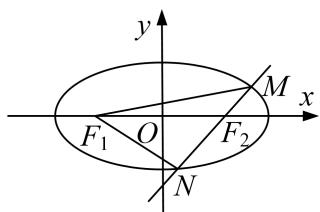

text_image

y
M
x
F₁ O F₂
N

8. 解析 (1)由题意，得 $\left\{ \begin{array}{l} c = \frac{\sqrt{2}}{2}, \\ \frac{1}{\sqrt{\sin^2\theta + \cos^2\theta}} = c, \\ a^2 = b^2 + c^2 \end{array} \right.$ 解得 $\left\{ \begin{array}{l} c = 1, \\ a^2 = 2, \\ b^2 = 1, \end{array} \right.$ 故椭圆 $C$ 的标准方程为 $\frac{x^2}{2} + y^2 = 1$ .

(2)由(1)得 $F_{1}(-1,0)$ ， $F_{2}(1,0)$ .

①若直线 l 的斜率不存在，则直线 $l \perp x$ 轴，直线 l 的方程为 x = 1，不妨记 $M\left(1, \frac{\sqrt{2}}{2}\right)$ ， $N\left(1, -\frac{\sqrt{2}}{2}\right)$

$$
\therefore \overrightarrow {F _ {1} M} = \left(2, \frac {\sqrt {2}}{2}\right), \overrightarrow {F _ {1} N} = \left(2, - \frac {\sqrt {2}}{2}\right), \text {故} \overrightarrow {F _ {1} M} \cdot \overrightarrow {F _ {1} N} = \frac {7}{2}.
$$

②若直线 l 的斜率存在，设直线 l 的方程为 $y=k(x-1)$ ，由 $\left\{\begin{aligned}y=k(x-1),\\ \frac{x^{2}}{2}+y^{2}=1\end{aligned}\right.$ 消去 y 得，

$(1+2k^{2})x^{2}-4k^{2}x+2k^{2}-2=0$ ，设 $M(x_{1}, y_{1})$ ， $N(x_{2}, y_{2})$ ，则 $x_{1}+x_{2}=\frac{4k^{2}}{1+2k^{2}}$ ， $x_{1}x_{2}=\frac{2k^{2}-2}{1+2k^{2}}$ 。①

$$
\overrightarrow {F _ {1} M} = (x _ {1} + 1, y _ {1}), \overrightarrow {F _ {1} N} = (x _ {2} + 1, y _ {2}),
$$

则 $F_{1} \overrightarrow{M} \cdot F_{1} \overrightarrow{N} = (x_{1} + 1)(x_{2} + 1) + y_{1}y_{2} = (x_{1} + 1)(x_{2} + 1) + k(x_{1} - 1) \cdot k(x_{2} - 1)$

$$
= (1 + k ^ {2}) x _ {1} x _ {2} + (1 - k ^ {2}) \left(x _ {1} + x _ {2}\right) + 1 + k ^ {2},
$$

结合①可得 $F_{1}\overrightarrow{M}\cdot F_{1}\overrightarrow{N}=\frac{2(k^{4}-1)}{2k^{2}+1}+\frac{4k^{2}-4k^{4}}{2k^{2}+1}+1+k^{2}=\frac{7k^{2}-1}{2k^{2}+1}=\frac{7}{2}-\frac{\frac{9}{2}}{2k^{2}+1},$

由 $k^2 \geq 0$ 可得 $\overrightarrow{F_1M} \cdot \overrightarrow{F_1N} \in \left[-1, \frac{7}{2}\right]$ . 综上可知， $\overrightarrow{F_1M} \cdot \overrightarrow{F_1N}$ 的取值范围是 $\left[-1, \frac{7}{2}\right]$ .

