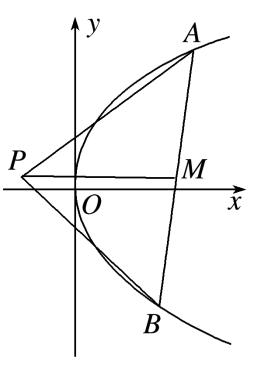
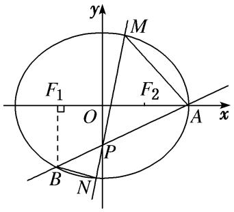
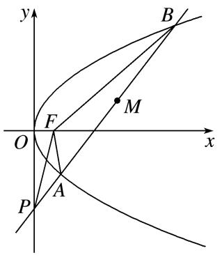

**专题25  面积与数量积型取值范围模型**

**【例题选讲】**

<strong>[例1]</strong>　已知椭圆<em>C</em>：＋＝1(<em>a</em>＞<em>b</em>＞0)与双曲线－<em>y</em>2＝1的离心率互为倒数，且直线<em>x</em>－<em>y</em>－2＝0经过椭圆的右顶点．

(1)求椭圆*C*的标准方程；

(2)设不过原点*O*的直线与椭圆*C*交于*M*，*N*两点，且直线*OM*，*MN*，*ON*的斜率依次成等比数列，求△*OMN*面积的取值范围．

<strong>[规范解答]</strong>　(1)∵双曲线的离心率为，∴椭圆的离心率<em>e</em>＝＝．

又∵直线*x*－*y*－2＝0经过椭圆的右顶点，∴右顶点为点(2，0)，即*a*＝2，*c*＝，*b*＝1，

∴椭圆方程为＋<em>y</em>2＝1．

(2)由题意可设直线的方程为<em>y</em>＝<em>kx</em>＋<em>m</em>(<em>k</em>≠0，<em>m</em>≠0)，<em>M</em>(<em>x</em>1，<em>y</em>1)，<em>N</em>(<em>x</em>2，<em>y</em>2)．

联立消去<em>y</em>，并整理得(1＋4<em>k</em>2)<em>x</em>2＋8<em>kmx</em>＋4(<em>m</em>2－1)＝0，

则<em>x</em>1＋<em>x</em>2＝－，<em>x</em>1<em>x</em>2＝，于是<em>y</em>1<em>y</em>2＝(<em>kx</em>1＋<em>m</em>)(<em>kx</em>2＋<em>m</em>)＝<em>k</em>2<em>x</em>1<em>x</em>2＋<em>km</em>(<em>x</em>1＋<em>x</em>2)＋<em>m</em>2．

又直线<em>OM</em>，<em>MN</em>，<em>ON</em>的斜率依次成等比数列，故·＝＝<em>k</em>2，

则－＋<em>m</em>2＝0，由<em>m</em>≠0得<em>k</em>2＝，解得<em>k</em>＝±．

又由<em>Δ</em>＝64<em>k</em>2<em>m</em>2－16(1＋4<em>k</em>2)(<em>m</em>2－1)＝16(4<em>k</em>2－<em>m</em>2＋1)＞0，得0＜<em>m</em>2＜2，

显然<em>m</em>2≠1(否则<em>x</em>1<em>x</em>2＝0，<em>x</em>1，<em>x</em>2中至少有一个为0，直线<em>OM</em>，<em>ON</em>中至少有一个斜率不存在，与已知矛盾)．

设原点*O*到直线的距离为*d*，则

<em>S</em>△<em>OMN</em>＝|<em>MN</em>|<em>d</em>＝··|<em>x</em>1－<em>x</em>2|·＝|<em>m</em>|＝．

故由*m*的取值范围可得△*OMN*面积的取值范围为(0，1)．

<strong>[例2]</strong>　(2018·浙江)如图，已知点<em>P</em>是<em>y</em>轴左侧(不含<em>y</em>轴)一点，抛物线<em>C</em>：<em>y</em>2＝4<em>x</em>上存在不同的两点<em>A</em>，<em>B</em>满足<em>PA</em>，<em>PB</em>的中点均在<em>C</em>上．

(1)设*AB*中点为*M*，证明：*PM*垂直于*y*轴；

(2)若<em>P</em>是半椭圆<em>x</em>2＋＝1(<em>x</em>&lt;0)上的动点，求△<em>PAB</em>面积的取值范围．

<strong>[规范解答]</strong>　(1)设<em>P</em>(<em>x</em>0，<em>y</em>0)，<em>A</em>，<em>B</em>．

因为<em>PA</em>，<em>PB</em>的中点在抛物线上，所以<em>y</em>1，<em>y</em>2为方程2＝4·，

即<em>y</em>2－2<em>y</em>0<em>y</em>＋8<em>x</em>0－<em>y</em>＝0的两个不同的实根．所以<em>y</em>1＋<em>y</em>2＝2<em>y</em>0，所以<em>PM</em>垂直于<em>y</em>轴．

(2)由(1)可知所以|<em>PM</em>|＝(<em>y</em>＋<em>y</em>)－<em>x</em>0＝<em>y</em>－3<em>x</em>0，|<em>y</em>1－<em>y</em>2|＝2．

所以△<em>PAB</em>的面积<em>S</em>△<em>PAB</em>＝|<em>PM</em>|·|<em>y</em>1－<em>y</em>2|＝(<em>y</em>－4<em>x</em>0)，．

因为<em>x</em>＋＝1(－1≤<em>x</em>0&lt;0)，所以<em>y</em>－4<em>x</em>0＝－4<em>x</em>－4<em>x</em>0＋4∈[4，5]，

所以△*PAB*面积的取值范围是．

<strong>[例3]</strong>　已知<em>A</em>，<em>B</em>是<em>x</em>轴正半轴上两点(<em>A</em>在<em>B</em>的左侧)，且|<em>AB</em>|＝<em>a</em>(<em>a</em>&gt;0)，过<em>A</em>，<em>B</em>分别作<em>x</em>轴的垂线，与抛物线<em>y</em>2＝2<em>px</em>(<em>p</em>&gt;0)在第一象限分别交于<em>D</em>，<em>C</em>两点．

(1)若<em>a</em>＝<em>p</em>，点<em>A</em>与抛物线<em>y</em>2＝2<em>px</em>的焦点重合，求直线<em>CD</em>的斜率；

(2)若<em>O</em>为坐标原点，记△<em>OCD</em>的面积为<em>S</em>1，梯形<em>ABCD</em>的面积为<em>S</em>2，求的取值范围．

<strong>[规范解答]</strong>　(1)由题意知<em>A</em>，则<em>B</em>，<em>D</em>，则<em>C</em>，

又<em>a</em>＝<em>p</em>，所以<em>kCD</em>＝＝－1．

(2)设直线<em>CD</em>的方程为<em>y</em>＝<em>kx</em>＋<em>b</em>(<em>k</em>≠0)，<em>C</em>(<em>x</em>1，<em>y</em>1)，<em>D</em>(<em>x</em>2，<em>y</em>2)，

由得<em>ky</em>2－2<em>py</em>＋2<em>pb</em>＝0，所以<em>Δ</em>＝4<em>p</em>2－8<em>pkb</em>&gt;0，得<em>kb</em>&lt;，

又<em>y</em>1＋<em>y</em>2＝，<em>y</em>1<em>y</em>2＝，由<em>y</em>1＋<em>y</em>2＝&gt;0，<em>y</em>1<em>y</em>2＝&gt;0，

可知<em>k</em>&gt;0，<em>b</em>&gt;0，因为|<em>CD</em>|＝|<em>x</em>1－<em>x</em>2|＝<em>a</em>，

点*O*到直线*CD*的距离*d*＝，

所以<em>S</em>1＝·<em>a</em>·＝<em>ab</em>．又<em>S</em>2＝(<em>y</em>1＋<em>y</em>2)·|<em>x</em>1－<em>x</em>2|＝··<em>a</em>＝，

所以＝，因为0<*kb*<，所以0<<．即的取值范围为．

<strong>[例4]</strong>　如图，椭圆<em>C</em>：＋＝1(<em>a</em>＞<em>b</em>＞0)的右顶点为<em>A</em>(2，0)，左、右焦点分别为<em>F</em>1，<em>F</em>2，过点<em>A</em>且斜率为的直线与<em>y</em>轴交于点<em>P</em>，与椭圆交于另一个点<em>B</em>，且点<em>B</em>在<em>x</em>轴上的射影恰好为点<em>F</em>1．

(1)求椭圆*C*的标准方程；

(2)过点<em>P</em>且斜率大于的直线与椭圆交于<em>M</em>，<em>N</em>两点(|<em>PM</em>|＞|<em>PN</em>|)，若<em>S</em>△<em>PAM</em>∶<em>S</em>△<em>PBN</em>＝<em>λ</em>，求实数<em>λ</em>的取值范围．

<strong>[规范解答]</strong>　(1)因为<em>BF</em>1⊥<em>x</em>轴，所以点<em>B</em>，所以解得

所以椭圆*C*的标准方程是＋＝1．

(2)因为＝＝＝*λ*⇒＝(*λ*＞2)，所以＝－．

由(1)可知<em>P</em>(0，－1)，设直线<em>MN</em>的方程为<em>y</em>＝<em>kx</em>－1，<em>M</em>(<em>x</em>1，<em>y</em>1)，<em>N</em>(<em>x</em>2，<em>y</em>2)，

联立方程，得化简得，(4<em>k</em>2＋3)<em>x</em>2－8<em>kx</em>－8＝0．得(\*)

又＝(<em>x</em>1，<em>y</em>1＋1)，＝(<em>x</em>2，<em>y</em>2＋1)，有<em>x</em>1＝－<em>x</em>2，将<em>x</em>1＝－<em>x</em>2代入(\*)可得，＝．

因为*k*＞，所以＝∈(1，4)，则1＜＜4且*λ*＞2，解得4＜*λ*＜4＋2．

综上所述，实数*λ*的取值范围为(4，4＋2)．

<strong>[例5]</strong>　(2016·全国乙)设圆<em>x</em>2＋<em>y</em>2＋2<em>x</em>－15＝0的圆心为<em>A</em>，直线<em>l</em>过点<em>B</em>(1，0)且与<em>x</em>轴不重合，<em>l</em>交圆<em>A</em>于<em>C</em>，<em>D</em>两点，过<em>B</em>作<em>AC</em>的平行线交<em>AD</em>于点<em>E</em>．

(1)证明|*EA*|＋|*EB*|为定值，并写出点*E*的轨迹方程；

(2)设点<em>E</em>的轨迹为曲线<em>C</em>1，直线<em>l</em>交<em>C</em>1于<em>M</em>，<em>N</em>两点，过<em>B</em>且与<em>l</em>垂直的直线与圆<em>A</em>交于<em>P</em>，<em>Q</em>两点，求四边形<em>MPNQ</em>面积的取值范围．

<strong>[规范解答]</strong>　(1)因为|<em>AD</em>|＝|<em>AC</em>|，<em>EB</em>∥<em>AC</em>，故∠<em>EBD</em>＝∠<em>ACD</em>＝∠<em>ADC</em>．

所以|*EB*|＝|*ED*|，故|*EA*|＋|*EB*|＝|*EA*|＋|*ED*|＝|*AD*|．

又圆<em>A</em>的标准方程为(<em>x</em>＋1)2＋<em>y</em>2＝16，从而|<em>AD</em>|＝4，所以|<em>EA</em>|＋|<em>EB</em>|＝4．

由题设得*A*(－1，0)，*B*(1，0)，|*AB*|＝2，由椭圆定义可得点*E*的轨迹方程为＋＝1(*y*≠0)．

(2)当<em>l</em>与<em>x</em>轴不垂直时，设<em>l</em>的方程为<em>y</em>＝<em>k</em>(<em>x</em>－1)(<em>k</em>≠0)，<em>M</em>(<em>x</em>1，<em>y</em>1)，<em>N</em>(<em>x</em>2，<em>y</em>2)．

由得(4<em>k</em>2＋3)<em>x</em>2－8<em>k</em>2<em>x</em>＋4<em>k</em>2－12＝0，则<em>x</em>1＋<em>x</em>2＝，<em>x</em>1<em>x</em>2＝，

所以|<em>MN</em>|＝|<em>x</em>1－<em>x</em>2|＝．

过点*B*(1，0)且与*l*垂直的直线*m*：*y*＝－(*x*－1)，*A*到*m*的距离为，

所以|*PQ*|＝2＝4．

故四边形*MPNQ*的面积*S*＝|*MN*||*PQ*|＝12．

可得当*l*与*x*轴不垂直时，四边形*MPNQ*面积的取值范围为(12，8)．

当*l*与*x*轴垂直时，其方程为*x*＝1，|*MN*|＝3，|*PQ*|＝8，四边形*MPNQ*的面积为12．

综上，四边形*MPNQ*面积的取值范围为[12，8)．

<strong>[例6]</strong>　已知圆心为<em>H</em>的圆<em>x</em>2＋<em>y</em>2＋2<em>x</em>－15＝0和定点<em>A</em>(1，0)，<em>B</em>是圆上任意一点，线段<em>AB</em>的中垂线<em>l</em>和直线<em>BH</em>相交于点<em>M</em>，当点<em>B</em>在圆上运动时，点<em>M</em>的轨迹记为曲线<em>C</em>．

(1)求*C*的方程；

(2)过点*A*作两条相互垂直的直线分别与曲线*C*相交于*P*，*Q*和*E*，*F*，求·的取值范围．

<strong>[规范解答]</strong>　(1)由<em>x</em>2＋<em>y</em>2＋2<em>x</em>－15＝0，得(<em>x</em>＋1)2＋<em>y</em>2＝16，所以圆心为<em>H</em>(－1，0)，半径为4．

连接*MA*，由*l*是线段*AB*的中垂线，得|*MA*|＝|*MB*|，

所以|*MA*|＋|*MH*|＝|*MB*|＋|*MH*|＝|*BH*|＝4，又|*AH*|＝2<4．

根据椭圆的定义可知，点*M*的轨迹是以*A*，*H*为焦点，4为长轴长的椭圆，

所以<em>a</em>2＝4，<em>c</em>2＝1，<em>b</em>2＝3，所求曲线<em>C</em>的方程为＋＝1．

(2)由直线*EF*与直线*PQ*垂直，可得·＝·＝0，

于是·＝(－)·(－)＝·＋·．

①当直线*PQ*的斜率不存在时，直线*EF*的斜率为零，

此时可不妨取*P*，*Q*，*E*(2，0)，*F*(－2，0)，

所以·＝·＝－3－＝－．

②当直线*PQ*的斜率为零时，直线*EF*的斜率不存在，同理可得·＝－．

③当直线*PQ*的斜率存在且不为零时，直线*EF*的斜率也存在，于是可设直线*PQ*的方程为

<em>y</em>＝<em>k</em>(<em>x</em>－1)，<em>P</em>(<em>xP</em>，<em>yP</em>)，<em>Q</em>(<em>xQ</em>，<em>yQ</em>)，＝(<em>xP</em>－1，<em>yP</em>)，＝(<em>xQ</em>－1，<em>yQ</em>)，

则直线*EF*的方程为*y*＝－(*x*－1)．

将直线<em>PQ</em>的方程代入曲线<em>C</em>的方程，并整理得，(3＋4<em>k</em>2)<em>x</em>2－8<em>k</em>2<em>x</em>＋4<em>k</em>2－12＝0，

所以<em>xP</em>＋<em>xQ</em>＝，<em>xP</em>·<em>xQ</em>＝．

于是·＝(<em>xP</em>－1)(<em>xQ</em>－1)＋<em>yP</em>·<em>yQ</em>＝(1＋<em>k</em>2)[<em>xPxQ</em>－(<em>xP</em>＋<em>xQ</em>)＋1]

＝(1＋<em>k</em>2)＝－．

将上面的*k*换成－，可得·＝－，

所以·＝·＋·＝－9(1＋<em>k</em>2)．

令1＋<em>k</em>2＝<em>t</em>，则<em>t</em>&gt;1，于是上式化简整理可得，

·＝－9*t*＝－＝－．

由*t*>1，得0<<1，所以－<·≤－．

综合①②③可知，·的取值范围为．

<strong>[例7]</strong>　已知椭圆<em>C</em>1：＋＝1(<em>a</em>＞<em>b</em>＞0)与抛物线<em>C</em>2：<em>x</em>2＝2<em>py</em>(<em>p</em>＞0)有一个公共焦点，抛物线<em>C</em>2的准线<em>l</em>与椭圆<em>C</em>1有一交点坐标是(，－2)．

(1)求椭圆<em>C</em>1与抛物线<em>C</em>2的方程；

(2)若点<em>P</em>是直线<em>l</em>上的动点，过点<em>P</em>作抛物线的两条切线，切点分别为<em>A</em>，<em>B</em>，直线<em>AB</em>与椭圆<em>C</em>1分别交于点<em>E</em>，<em>F</em>，求·的取值范围．

<strong>[规范解答]</strong>　(1)抛物线<em>C</em>2的准线方程是<em>y</em>＝－2，所以－＝－2，即<em>p</em>＝4，

所以抛物线<em>C</em>2的方程为<em>x</em>2＝8<em>y</em>．

椭圆<em>C</em>1：＋＝1(<em>a</em>＞<em>b</em>＞0)的焦点坐标分别是(0，－2)，(0，2)，所以<em>c</em>＝2．

2*a*＝＋＝4，

解得<em>a</em>＝2，则<em>b</em>＝2，所以椭圆<em>C</em>1的方程为＋＝1．

(2)设点<em>P</em>(<em>t</em>，－2)，<em>A</em>(<em>x</em>1，<em>y</em>1)，<em>B</em>(<em>x</em>2，<em>y</em>2)，<em>E</em>(<em>x</em>3，<em>y</em>3)，<em>F</em>(<em>x</em>4，<em>y</em>4)，

抛物线方程可化为<em>y</em>＝<em>x</em>2，求导得<em>y</em>′＝<em>x</em>，所以<em>AP</em>的方程为<em>y</em>－<em>y</em>1＝<em>x</em>1(<em>x</em>－<em>x</em>1)，

将<em>P</em>(<em>t</em>，－2)代入，得－2－<em>y</em>1＝<em>x</em>1<em>t</em>－2<em>y</em>1，即<em>y</em>1＝<em>tx</em>1＋2．

同理，<em>BP</em>的方程为<em>y</em>2＝<em>tx</em>2＋2，所以直线<em>AB</em>的方程为<em>y</em>＝<em>tx</em>＋2．

由消去<em>y</em>，整理得(<em>t</em>2＋32)<em>x</em>2＋16<em>tx</em>－64＝0，

则<em>Δ</em>＝256<em>t</em>2＋256(<em>t</em>2＋32)＞0，且<em>x</em>3＋<em>x</em>4＝，<em>x</em>3<em>x</em>4＝．

所以·＝<em>x</em>3<em>x</em>4＋<em>y</em>3<em>y</em>4＝(1＋)<em>x</em>3<em>x</em>4＋(<em>x</em>3＋<em>x</em>4)＋4＝＝－8．

因为0＜≤10，所以·的取值范围是(－8，2]．

<strong>[例8]</strong>　已知椭圆<em>C</em>：＋＝1(<em>a</em>＞<em>b</em>＞0)的左、右顶点分别为<em>A</em>，<em>B</em>，且长轴长为8，<em>T</em>为椭圆上任意一点，直线<em>TA</em>，<em>TB</em>的斜率之积为－．

(1)求椭圆*C*的方程；

(2)设*O*为坐标原点，过点*M*(0，2)的动直线与椭圆*C*交于*P*，*Q*两点，求·＋·的取值范围．

<strong>[规范解答]</strong>　(1)设<em>T</em>(<em>x</em>，<em>y</em>)，由题意知<em>A</em>(－4，0)，<em>B</em>(4，0)，

设直线<em>TA</em>的斜率为<em>k</em>1，直线<em>TB</em>的斜率为<em>k</em>2，则<em>k</em>1＝，<em>k</em>2＝，

由<em>k</em>1<em>k</em>2＝－，得·＝－，整理得＋＝1．

故椭圆*C*的方程为＋＝1．

(2)当直线<em>PQ</em>的斜率存在时，设直线<em>PQ</em>的方程为<em>y</em>＝<em>kx</em>＋2，点<em>P</em>，<em>Q</em>的坐标分别为(<em>x</em>1，<em>y</em>1)，(<em>x</em>2，<em>y</em>2)，

联立方程消去<em>y</em>，得(4<em>k</em>2＋3)<em>x</em>2＋16<em>kx</em>－32＝0．

所以<em>x</em>1＋<em>x</em>2＝－，<em>x</em>1<em>x</em>2＝－．

从而，·＋·＝<em>x</em>1<em>x</em>2＋<em>y</em>1<em>y</em>2＋[<em>x</em>1<em>x</em>2＋(<em>y</em>1－2)(<em>y</em>2－2)]＝2(1＋<em>k</em>2)<em>x</em>1<em>x</em>2＋2<em>k</em>(<em>x</em>1＋<em>x</em>2)＋4

＝＝－20＋，所以－20＜·＋· ≤－．

当直线*PQ*的斜率不存在时，·＋·的值为－20．

综上，·＋·的取值范围为．

**【对点训练】**

1．已知抛物线<em>C</em>：<em>y</em>2＝2<em>px</em>(<em>p</em>&gt;0)，点<em>F</em>为抛物线<em>C</em>的焦点，点<em>A</em>(1，<em>m</em>)(<em>m</em>&gt;0)在抛物线<em>C</em>上，且|<em>FA</em>|＝2，

过点*F*作斜率为*k*的直线*l*与抛物线*C*交于*P*，*Q*两点．

(1)求抛物线*C*的方程；

(2)求△*APQ*面积的取值范围．

1．<strong>解析</strong>　(1)由抛物线的定义可得|<em>FA</em>|＝<em>xA</em>＋＝1＋＝2，所以<em>p</em>＝2，

所以抛物线的方程为<em>y</em>2＝4<em>x</em>．

(2)设直线<em>l</em>的方程为<em>y</em>＝<em>k</em>(<em>x</em>－1)，<em>P</em>(<em>x</em>1，<em>y</em>1)，<em>Q</em>(<em>x</em>2，<em>y</em>2)，

联立得<em>k</em>2<em>x</em>2－(2<em>k</em>2＋4)<em>x</em>＋<em>k</em>2＝0，<em>Δ</em>&gt;0恒成立，

由根与系数的关系得<em>x</em>1＋<em>x</em>2＝，<em>x</em>1<em>x</em>2＝1，因为<em>AF</em>⊥<em>x</em>轴，

则<em>S</em>△<em>APQ</em>＝×|<em>AF</em>|×|<em>x</em>1－<em>x</em>2|＝|<em>x</em>1－<em>x</em>2|＝＝4＝4，

因为≤<em>k</em>≤2，令<em>t</em>＝，所以<em>S</em>△<em>APQ</em>＝4，所以≤<em>S</em>△<em>APQ</em>≤8，

所以△*APQ*的面积的取值范围为[，8]．

2．已知中心在原点，焦点在<em>y</em>轴上的椭圆<em>C</em>，其上一点<em>P</em>到两个焦点<em>F</em>1，<em>F</em>2的距离之和为4，离心率为

．

(1)求椭圆*C*的方程；

(2)若直线*y*＝*kx*＋1与曲线*C*交于*A*，*B*两点，求△*OAB*面积的取值范围．

2．解析　(1)设椭圆的标准方程为＋＝1(*a*>*b*>0)，由条件知，

解得<em>a</em>＝2，<em>c</em>＝，<em>b</em>＝1，故椭圆<em>C</em>的方程为＋<em>x</em>2＝1．

(2)设<em>A</em>(<em>x</em>1，<em>y</em>1)，<em>B</em>(<em>x</em>2，<em>y</em>2)，由得(<em>k</em>2＋4)<em>x</em>2＋2<em>kx</em>－3＝0，

故<em>x</em>1＋<em>x</em>2＝－，<em>x</em>1<em>x</em>2＝－，设△<em>OAB</em>的面积为<em>S</em>，

由<em>x</em>1<em>x</em>2＝－&lt;0，知<em>S</em>＝×1×|<em>x</em>1－<em>x</em>2|＝＝2，

令<em>k</em>2＋3＝<em>t</em>，知<em>t</em>≥3，∴<em>S</em>＝2．

对函数*y*＝*t*＋(*t*≥3)，知*y*′＝1－＝>0，

∴*y*＝*t*＋在*t*∈[3，＋∞)上单调递增，∴*t*＋≥，∴0<≤，∴0<*S*≤．

故△*OAB*面积的取值范围为．

3．已知<em>M</em>(－1，0)，<em>F</em>(1，0)，||＝2，＝2，＝λ(λ∈<strong>R</strong>)，且·＝0．

(1)当*R*在该坐标平面上运动时，求点*P*运动的轨迹*C*的方程；

(2)经过点*H*(2，0)作不过*F*点且斜率存在的直线*l*，若直线*l*与轨迹*C*相交于*A*，*B*两点．

①探究：直线*FA*，*FB*的斜率之和是否为定值？若是，求出该定值；若不是，请说明理由；

②求△*FAB*面积的取值范围．

3．解析　(1)由||＝2知，点*R*在以*M*(－1，0)为圆心，以2为半径的圆周上运动．

由＝2知，<em>Q</em>为<em>FR</em>的中点，又＝λ(λ∈<strong>R</strong>)，且·＝0，

得点*P*为线段*FR*的中垂线与*MR*的交点，所以|*PF*|＝|*PR*|，所以|*PM*|＋|*PF*|＝2(定值)，

因此点*P*的轨迹*C*是以*M*，*F*为焦点的椭圆，由*a*＝，*c*＝1，得*b*＝1，

所以轨迹<em>C</em>的方程为＋<em>y</em>2＝1．

(2)①由已知，设直线*l*的方程为*y*＝*k*(*x*－2)(*k*≠0)，

直线<em>l</em>与椭圆<em>C</em>的交点<em>A</em>，<em>B</em>分别设为<em>A</em>(<em>x</em>1，<em>y</em>1)，<em>B</em>(<em>x</em>2，<em>y</em>2)．联立

化简得(1＋2<em>k</em>2)<em>x</em>2－8<em>k</em>2<em>x</em>＋8<em>k</em>2－2＝0，则<em>x</em>1＋<em>x</em>2＝，<em>x</em>1<em>x</em>2＝，

又直线*FA*，*FB*的斜率之和为＋＝＋＝，

又2<em>kx</em>1<em>x</em>2－3<em>k</em>(<em>x</em>1＋<em>x</em>2)＋4<em>k</em>＝2<em>k</em>·－＋4<em>k</em>＝＝0(定值)，

所以＋＝0，即直线*FA*，*FB*的斜率之和为定值0．

②由①得<em>Δ</em>＝64<em>k</em>4－4(1＋2<em>k</em>2)(8<em>k</em>2－2)＝8－16<em>k</em>2，由<em>Δ</em>＞0，得<em>k</em>2∈，

因为|<em>AB</em>|＝|<em>x</em>1－<em>x</em>2|＝＝·，

又点*F*到直线*l*的距离*d*＝，

所以<em>S</em>△<em>FAB</em>＝|<em>AB</em>|·<em>d</em>＝＝，

令<em>t</em>＝2<em>k</em>2＋1∈(1，2)，<em>φ</em>(<em>t</em>)＝＝－22，

因为∈，所以<em>φ</em>(<em>t</em>)∈，所以<em>S</em>△<em>FAB</em>＝∈，

当且仅当<em>t</em>＝，即<em>k</em>＝±时，<em>S</em>△<em>FAB</em>取到最大值．

所以△*FAB*面积的取值范围为．

4．已知抛物线<em>C</em>：<em>y</em>2＝4<em>x</em>的焦点为<em>F</em>，直线<em>l</em>：<em>y</em>＝<em>kx</em>－4(1&lt;<em>k</em>&lt;2)与<em>y</em>轴、抛物线<em>C</em>相交于点<em>P</em>，<em>A</em>，<em>B</em>(自下

而上)，记△<em>PAF</em>，△<em>PBF</em>的面积分别为<em>S</em>1，<em>S</em>2．

(1)求*AB*中点*M*到*y*轴的距离*d*的取值范围；

(2)求的取值范围．

4．解析　(1)联立消去<em>y</em>，得<em>k</em>2<em>x</em>2－(8<em>k</em>＋4)<em>x</em>＋16＝0，

设<em>A</em>(<em>x</em>1，<em>y</em>1)，<em>B</em>(<em>x</em>2，<em>y</em>2)，则<em>x</em>1＋<em>x</em>2＝，<em>x</em>1<em>x</em>2＝，所以<em>d</em>＝＝＋＝22－2∈．

(2)由于＝＝．由(1)可知＋＝＋＝

＝·－2＝2－2∈．

由＋&gt;，得42－17·＋4&gt;0，解得&gt;4或&lt;．

因为0&lt;&lt;1，所以0&lt;&lt;，由＋&lt;7，得2－7·＋1&lt;0，解得&lt;&lt;，

因此<<．即的取值范围为．

5．在平面直角坐标系<em>xOy</em>中，圆<em>x</em>2＋<em>y</em>2＋2<em>x</em>－15＝0的圆心为<em>M</em>．已知点<em>N</em>(1，0)，且<em>T</em>为圆<em>M</em>上的动点，

线段*TN*的垂直平分线交*TM*于点*P*．

(1)求点*P*的轨迹方程；

(2)设点<em>P</em>的轨迹为曲线<em>C</em>1，抛物线<em>C</em>2：<em>y</em>2＝2<em>px</em>的焦点为<em>N</em>．<em>l</em>1，<em>l</em>2是过点<em>N</em>互相垂直的两条直线，直线<em>l</em>1与曲线<em>C</em>1交于<em>A</em>，<em>C</em>两点，直线<em>l</em>2与曲线<em>C</em>2交于<em>B</em>，<em>D</em>两点，求四边形<em>ABCD</em>面积的取值范围．

5．<strong>解析</strong>　(1)∵<em>P</em>为线段<em>TN</em>垂直平分线上一点，∴|<em>PM</em>|＋|<em>PN</em>|＝|<em>PM</em>|＋|<em>PT</em>|＝|<em>TM</em>|＝4，

∵*M*(－1，0)，*N*(1，0)，∵4>|*MN*|＝2，

∴*P*的轨迹是以*M*(－1，0)，*N*(1，0)为焦点，长轴长为4的椭圆，它的方程为＋＝1．

(2)∵<em>y</em>2＝2<em>px</em>的焦点为(1，0)，<em>C</em>2的方程为<em>y</em>2＝4<em>x</em>，

当直线<em>l</em>1斜率不存在时，<em>l</em>2与<em>C</em>2只有一个交点，不合题意．

当直线<em>l</em>1斜率为0时，可求得|<em>AC</em>|＝4，|<em>BD</em>|＝4，∴<em>S</em>四边形<em>ABCD</em>＝·|<em>AC</em>|·|<em>BD</em>|＝8．

当直线<em>l</em>1斜率存在且不为0时，

方程可设为<em>y</em>＝<em>k</em>(<em>x</em>－1)(<em>k</em>≠0)，代入＋＝1，得(3＋4<em>k</em>2)<em>x</em>2－8<em>k</em>2<em>x</em>＋4<em>k</em>2－12＝0，<em>Δ</em>＝144(<em>k</em>2＋1)&gt;0，

设<em>A</em>(<em>x</em>1，<em>y</em>1)，<em>C</em>(<em>x</em>2，<em>y</em>2)，则<em>x</em>1＋<em>x</em>2＝，<em>x</em>1<em>x</em>2＝，

|<em>AC</em>|＝|<em>x</em>1－<em>x</em>2|＝＝．

直线<em>l</em>2的方程为<em>y</em>＝－(<em>x</em>－1)与<em>y</em>2＝4<em>x</em>联立可得<em>x</em>2－(2＋4<em>k</em>2)<em>x</em>＋1＝0，

设<em>B</em>(<em>x</em>3，<em>y</em>3)，<em>D</em>(<em>x</em>4，<em>y</em>4)，则|<em>BD</em>|＝<em>x</em>3＋<em>x</em>4＋2＝4＋4<em>k</em>2，

∴四边形<em>ABCD</em>的面积<em>S</em>＝|<em>AC</em>||<em>BD</em>|＝(4＋4<em>k</em>2)·＝．

令3＋4<em>k</em>2＝<em>t</em>，则<em>k</em>2＝(<em>t</em>&gt;3)，<em>S</em>(<em>t</em>)＝＝，

∴*S*(*t*)在(3，＋∞)是增函数，*S*(*t*)>*S*(3)＝8，

综上，四边形*ABCD*面积的取值范围是[8，＋∞)．

6．已知点*M*在椭圆*C*：＋＝1(*a*＞*b*＞0)上，且点*M*到椭圆*C*的左、右焦点的距离之和为

2．

(1)求椭圆*C*的方程；

(2)设*O*为坐标原点，若椭圆*C*的弦*AB*的中点在线段*OM*(不含端点*O*，*M*)上，求·的取值范围．

6．<strong>解析</strong>　(1)由条件知＋＝1，2<em>a</em>＝2，所以<em>a</em>＝，<em>b</em>＝1，所以椭圆<em>C</em>的方程为＋<em>y</em>2＝1．

(2)设<em>A</em>(<em>x</em>1，<em>y</em>1)，<em>B</em>(<em>x</em>2，<em>y</em>2)，则<em>AB</em>的中点在线段<em>OM</em>上．

因为<em>kOM</em>＝，所以<em>x</em>1＋<em>x</em>2＝2(<em>y</em>1＋<em>y</em>2)．

＋<em>y</em>＝1，＋<em>y</em>＝1，两式相减得＋(<em>y</em>1－<em>y</em>2)(<em>y</em>1＋<em>y</em>2)＝0，

易知<em>x</em>1－<em>x</em>2≠0，<em>y</em>1＋<em>y</em>2≠0，所以＝－＝－1，即<em>kAB</em>＝－1．

设直线<em>AB</em>的方程为<em>y</em>＝－<em>x</em>＋<em>m</em>，代入＋<em>y</em>2＝1并整理得3<em>x</em>2－4<em>mx</em>＋2<em>m</em>2－2＝0．

由<em>Δ</em>＝8(3－<em>m</em>2)＞0得<em>m</em>2＜3．由根与系数的关系得<em>x</em>1＋<em>x</em>2＝，<em>x</em>1<em>x</em>2＝，

又∈，所以∈，所以0＜*m*＜．

·＝<em>x</em>1<em>x</em>2＋<em>y</em>1<em>y</em>2＝<em>x</em>1<em>x</em>2＋(－<em>x</em>1＋<em>m</em>)(－<em>x</em>2＋<em>m</em>)＝2<em>x</em>1<em>x</em>2－<em>m</em>(<em>x</em>1＋<em>x</em>2)＋<em>m</em>2

＝－＋<em>m</em>2＝<em>m</em>2－，

而0＜*m*＜，所以·的取值范围是．

7．已知椭圆*C*：＋＝1(*a*>*b*>0)的离心率为，短轴长为2．直线*l*：*y*＝*kx*＋*m*与椭圆*C*交于*M*，*N*两

点，又*l*与直线*y*＝*x*，*y*＝－*x*分别交于*A*，*B*两点，其中点*A*在第一象限，点*B*在第二象限，且△*OAB*的面积为2(*O*为坐标原点)．

(1)求椭圆*C*的方程；

(2)求·的取值范围．

7．解析　(1)由于<em>b</em>＝1且离心率<em>e</em>＝，∴＝＝，则<em>a</em>2＝2，因此椭圆的方程为＋<em>y</em>2＝1．

(2)联立直线*l*与直线*y*＝*x*，可得点*A*，

联立直线*l*与直线*y*＝－*x*，可得点*B*，

又点*A*在第一象限，点*B*在第二象限，∴

化为<em>m</em>2(1－4<em>k</em>2)&gt;0，而<em>m</em>2≥0，∴1－4<em>k</em>2&gt;0．

又|*AB*|＝＝，

原点*O*到直线*l*的距离为，即△*OAB*底边*AB*上的高为，

∴<em>S</em>△<em>OAB</em>＝·＝＝2，∴<em>m</em>2＝1－4<em>k</em>2．

设<em>M</em>(<em>x</em>1，<em>y</em>1)，<em>N</em>(<em>x</em>2，<em>y</em>2)，将直线<em>l</em>代入椭圆方程，整理可得：

(1＋2<em>k</em>2)<em>x</em>2＋4<em>kmx</em>＋2<em>m</em>2－2＝0，∴<em>x</em>1＋<em>x</em>2＝－，<em>x</em>1·<em>x</em>2＝，

<em>Δ</em>＝16<em>k</em>2<em>m</em>2－4(1＋2<em>k</em>2)(2<em>m</em>2－2)＝48<em>k</em>2&gt;0，则<em>k</em>2&gt;0，∴<em>y</em>1·<em>y</em>2＝(<em>kx</em>1＋<em>m</em>)(<em>kx</em>2＋<em>m</em>)＝，

∴·＝<em>x</em>1<em>x</em>2＋<em>y</em>1<em>y</em>2＝＋＝－7．

∵0&lt;<em>k</em>2&lt;，∴1＋2<em>k</em>2∈，∴∈，∴·∈．

故·的取值范围为．

8．已知椭圆*C*：＋＝1(*a*＞*b*＞0)的离心率为，且以原点为圆心，椭圆的焦距为直径的圆与直线*x*sin

*θ*＋*y*cos *θ*－1＝0相切(*θ*为常数)．

(1)求椭圆*C*的标准方程；

(2)若椭圆<em>C</em>的左、右焦点分别为<em>F</em>1，<em>F</em>2，过<em>F</em>2作直线<em>l</em>与椭圆交于<em>M</em>，<em>N</em>两点，求·的取值范

围．

8．解析　(1)由题意，得解得故椭圆<em>C</em>的标准方程为＋<em>y</em>2＝1．

(2)由(1)得<em>F</em>1(－1，0)，<em>F</em>2(1，0)．

①若直线*l*的斜率不存在，则直线*l*⊥*x*轴，直线*l*的方程为*x*＝1，不妨记*M*，*N*，

∴＝，＝，故·＝．

②若直线*l*的斜率存在，设直线*l*的方程为*y*＝*k*(*x*－1)，由消去*y*得，

(1＋2<em>k</em>2)<em>x</em>2－4<em>k</em>2<em>x</em>＋2<em>k</em>2－2＝0，设<em>M</em>(<em>x</em>1，<em>y</em>1)，<em>N</em>(<em>x</em>2，<em>y</em>2)，则<em>x</em>1＋<em>x</em>2＝，<em>x</em>1<em>x</em>2＝．①

＝(<em>x</em>1＋1，<em>y</em>1)，＝(<em>x</em>2＋1，<em>y</em>2)，

则·＝(<em>x</em>1＋1)(<em>x</em>2＋1)＋<em>y</em>1<em>y</em>2＝(<em>x</em>1＋1)(<em>x</em>2＋1)＋<em>k</em>(<em>x</em>1－1)·<em>k</em>(<em>x</em>2－1)

＝(1＋<em>k</em>2)<em>x</em>1<em>x</em>2＋(1－<em>k</em>2)(<em>x</em>1＋<em>x</em>2)＋1＋<em>k</em>2，

结合①可得·＝＋＋1＋<em>k</em>2＝＝－，

由<em>k</em>2≥0可得·∈．综上可知，·的取值范围是．

