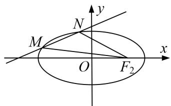
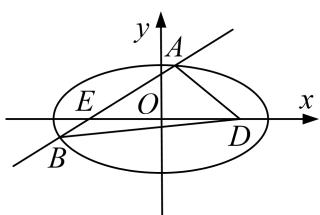
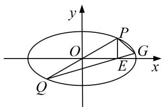
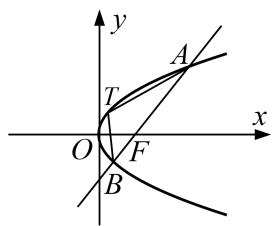
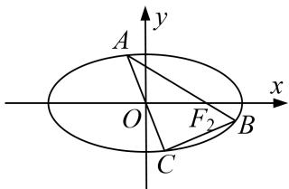
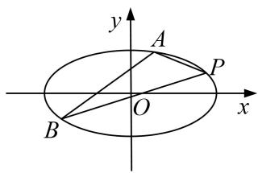
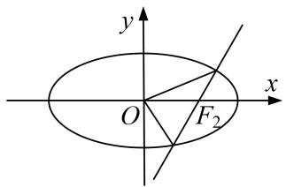
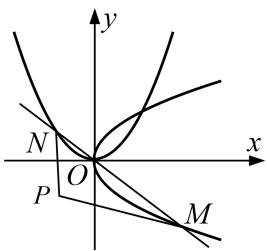
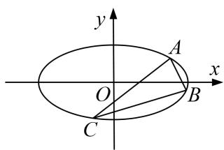
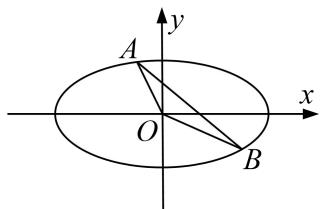

# 专题26 单变量型三角形面积最值问题

# 最值问题——构造函数

最值问题的基本解法有几何法和代数法：几何法是根据已知的几何量之间的相互关系、平面几何和解析几何知识加以解决的(如抛物线上的点到某个定点和焦点的距离之和、光线反射问题等)；代数法是建立求解目标关于某个或两个变量的函数，通过求解函数的最值普通方法、基本不等式方法、导数方法等解决的.

# 【例题选讲】

[例1] 在平面直角坐标系中，圆 $O$ 交 $x$ 轴于点 $F_{1}, F_{2}$ ，交 $y$ 轴于点 $B_{1}, B_{2}$ 。以 $B_{1}, B_{2}$ 为顶点， $F_{1}, F_{2}$ 分别为左、右焦点的椭圆 $E$ 恰好经过点 $\left(1, \frac{\sqrt{2}}{2}\right)$ .  
（1）求椭圆 E 的标准方程;  
（2）设经过点 $(-2,0)$ 的直线l与椭圆E交于M，N两点，求 $\triangle F_{2}MN$ 面积的最大值.

[破题思路] 题干中给出直线 $l$ 过点 $(-2, 0)$ ，可设出直线 $l$ 的方程，利用弦长公式求 $|MN|$ ，利用点到直线的距离求 $d$ ，从而可求 $\triangle F_2MN$ 的面积，要求 $\triangle F_2MN$ 面积的最值，需建立相关函数模型求解.

[规范解答] （1）由已知可得，椭圆 E 的焦点在 x 轴上．设椭圆 E 的标准方程为 $\frac{x^{2}}{a^{2}} + \frac{y^{2}}{b^{2}} = 1 (a > b > 0)$ ，焦距为 2c，则 b = c，∴ $a^{2} = b^{2} + c^{2} = 2b^{2}$ ，∴ 椭圆 E 的标准方程为 $\frac{x^{2}}{2b^{2}} + \frac{y^{2}}{b^{2}} = 1$ .
又椭圆 E 过点 $\left(1, \frac{\sqrt{2}}{2}\right)$ ，∴ $\frac{1}{2b^{2}} + \frac{1}{2} = 1$ ，解得 $b^{2} = 1$ 。∴ 椭圆 E 的标准方程为 $\frac{x^{2}}{2} + y^{2} = 1$ 。  
（2）由于点 $(-2,0)$ 在椭圆E外，∴直线l的斜率存在.
设直线 l 的斜率为 k，则直线 $l: y = k(x + 2)$ ，设 $M(x_{1}, y_{1})$ ， $N(x_{2}, y_{2})$ .
由 $\left\{ \begin{array}{l} y = k(x + 2), \\ \frac{x^2}{2} + y^2 = 1 \end{array} \right.$ 消去 $y$ 得， $(1 + 2k^2)x^2 + 8k^2x + 8k^2 - 2 = 0$ 。由 $\Delta > 0$ ，得 $0 \leq k^2 < \frac{1}{2}$ ，
从而 $x_{1} + x_{2} = \frac{-8k^{2}}{1 + 2k^{2}}, x_{1}x_{2} = \frac{8k^{2} - 2}{1 + 2k^{2}}, \therefore |MN| = \sqrt{1 + k^{2}} |x_{1} - x_{2}| = 2\sqrt{1 + k^{2}}\cdot \sqrt{\frac{2 - 4k^{2}}{(1 + 2k^{2})^{2}}}.$
∵点 $F_{2}(1,0)$ 到直线 l 的距离 $d=\frac{3|k|}{\sqrt{1+k^{2}}}$ ，∴ $\triangle F_{2}MN$ 的面积 $S=\frac{1}{2}|MN|\cdot d=3\sqrt{\frac{k^{2}(2-4k^{2})}{(1+2k^{2})^{2}}}$ .
令 $1+2k^{2}=t$ ，则 $t\in[1,2)$ ,
$\therefore S = 3 \sqrt {\frac {(t - 1) (2 - t)}{t ^ {2}}} = 3 \sqrt {\frac {- t ^ {2} + 3 t - 2}{t ^ {2}}} = 3 \sqrt {- 1 + \frac {3}{t} - \frac {2}{t ^ {2}}} = 3 \sqrt {- 2 \left(\frac {1}{t} - \frac {3}{4}\right) ^ {2} + \frac {1}{8}},$
当 $\frac{1}{t}=\frac{3}{4}$ ，即 $t=\frac{4}{3}\left(\frac{4}{3}\in[1,2)\right)$ 时，S有最大值， $S_{\max}=\frac{3\sqrt{2}}{4}$ ，此时 $k=\pm\frac{\sqrt{6}}{6}$ .
∴当直线 l 的斜率为 $\pm\frac{\sqrt{6}}{6}$ 时，可使 $\Delta F_{2}MN$ 的面积最大，其最大值为 $\frac{3\sqrt{2}}{4}$ .

[例 2] 已知 O 为坐标原点， $M(x_{1}, y_{1})$ ， $N(x_{2}, y_{2})$ 是椭圆 $\frac{x^{2}}{4} + \frac{y^{2}}{2} = 1$ 上的点，且 $x_{1}x_{2} + 2y_{1}y_{2} = 0$ ，设动点 P 满足 $\overrightarrow{OP} = \overrightarrow{OM} + 2\overrightarrow{ON}$ .  
（1）求动点 P 的轨迹 C 的方程;  
（2）若直线 $l: y = x + m (m \neq 0)$ 与曲线 C 交于 A, B 两点，求 $\triangle OAB$ 面积的最大值.

[规范解答] （1）设点 $P(x, y)$ ，则由 $\overrightarrow{OP} = \overrightarrow{OM} + 2\overrightarrow{ON}$ ，得 $(x, y) = (x_{1}, y_{1}) + 2(x_{2}, y_{2})$ ,
即 $x=x_{1}+2x_{2},\quad y=y_{1}+2y_{2}$ 。因为点 M，N 在椭圆 $\frac{x^{2}}{4}+\frac{y^{2}}{2}=1$ 上，所以 $x_{1}^{2}+2y_{1}^{2}=4,\quad x_{2}^{2}+2y_{2}^{2}=4$
$\begin{array}{l} \text {   故   } x ^ {2} + 2 y ^ {2} = (x _ {1} ^ {2} + 4 x _ {2} ^ {2} + 4 x _ {1} x _ {2}) + 2 (y _ {1} ^ {2} + 4 y _ {2} ^ {2} + 4 y _ {1} y _ {2}) = (x _ {1} ^ {2} + 2 y _ {1} ^ {2}) + 4 (x _ {2} ^ {2} + 2 y _ {2} ^ {2}) + 4 (x _ {1} x _ {2} + 2 y _ {1} y _ {2}) \\ = 2 0 + 4 \left(x _ {1} x _ {2} + 2 y _ {1} y _ {2}\right). \\ \end{array}$
又因为 $x_{1}x_{2}+2y_{1}y_{2}=0$ ，所以 $x^{2}+2y^{2}=20$ ，所以动点 P 的轨迹 C 的方程为 $x^{2}+2y^{2}=20$ 。  
（2）将曲线 C 与直线 l 的方程联立，得 $\left\{\begin{aligned}x^{2}+2y^{2}&=20,\\ y&=x+m,\end{aligned}\right.$ 消去 y 得 $3x^{2}+4mx+2m^{2}-20=0$ .
因为直线 l 与曲线 C 交于 A, B 两点，设 $A(x_{3}, y_{3})$ ， $B(x_{4}, y_{4})$ ，
所以 $\Delta=16m^{2}-4\times3\times(2m^{2}-20)>0$ 。又 $m\neq0$ ，所以 $0<m^{2}<30,\quad x_{3}+x_{4}=-\frac{4m}{3},\quad x_{3}x_{4}=\frac{2m^{2}-20}{3}$
又点 O 到直线 AB: $x - y + m = 0$ 的距离 $d = \frac{|m|}{\sqrt{2}}$ ,
$| A B | = \sqrt {1 + k ^ {2}} \left| x _ {3} - x _ {4} \right| = \sqrt {(1 + k ^ {2}) \left[ \left(x _ {3} + x _ {4}\right) ^ {2} - 4 x _ {3} x _ {4} \right]} = \sqrt {2 \times \left(\frac {1 6 m ^ {2}}{9} - 4 \times \frac {2 m ^ {2} - 2 0}{3}\right)} = \sqrt {\frac {1 6}{9} (3 0 - m ^ {2})},$
所以 $S_{\triangle OAB} = \frac{1}{2}\sqrt{\frac{16}{9}(30 - m^2)}\times \frac{|m|}{\sqrt{2}} = \frac{\sqrt{2}}{3}\times \sqrt{m^2(30 - m^2)}\leq \frac{\sqrt{2}}{3}\times \frac{m^2 + (30 - m^2)}{2} = 5\sqrt{2},$
当且仅当 $m^{2}=30-m^{2}$ ，即 $m^{2}=15$ 时取等号，且满足 $\Delta>0$ 。所以 $\triangle OAB$ 面积的最大值为 $5\sqrt{2}$ 。

[例3] 已知直线 $l_{1}: ax - y + 1 = 0$ ，直线 $l_{2}: x + 5ay + 5a = 0$ ，直线 $l_{1}$ 与 $l_{2}$ 的交点为 $M$ ，点 $M$ 的轨迹为曲线 $C$ .  
（1）当 a 变化时，求曲线 C 的方程；  
（2）已知点 $D(2,0)$ ，过点 $E(-2,0)$ 的直线 l 与 C 交于 A，B 两点，求 $\triangle ABD$ 面积的最大值.

[规范解答] （1）由 $\left\{ \begin{array}{l} ax - y + 1 = 0 \\ x + 5ay + 5a = 0 \end{array} \right.$ 消去 $a$ ，得曲线 $C$ 的方程为 $\frac{x^2}{5} + y^2 = 1 (y \neq -1$ ，即点 $(0, -1)$ 不在曲线 $C$ 上).  
（2）设 $A(x_{1},y_{1})$ ， $B(x_{2},y_{2})$ ， $l$ ： $x = my - 2$ ，由 $\left\{ \begin{array}{l}x = my - 2,\\ \frac{x^2}{5} +y^2 = 1, \end{array} \right.$ 得 $(m^2 +5)y^2 -4my - 1 = 0,$
则 $y_{1}+y_{2}=\frac{4m}{m^{2}+5},\quad y_{1}y_{2}=-\frac{1}{m^{2}+5},$
故 $\triangle ABD$ 的面积 $S = 2|y_{2} - y_{1}| = 2\sqrt{(y_{2} + y_{1})^{2} - 4y_{2}y_{1}} = 2\sqrt{\frac{16m^{2}}{(m^{2} + 5)^{2}} + \frac{4}{m^{2} + 5}} = \frac{4\sqrt{5}\cdot\sqrt{m^{2} + 1}}{m^{2} + 5},$
设 $t = \sqrt{m^2 + 1}$ , $t \in [1, +\infty)$ , 则 $S = \frac{4\sqrt{5}t}{t^2 + 4} = \frac{4\sqrt{5}}{t + \frac{4}{t}} \leq \sqrt{5}$ ,
当 $t=\frac{4}{t}$ ，即 t=2， $m=\pm\sqrt{3}$ 时， $\triangle ABD$ 的面积取得最大值 $\sqrt{5}$ .

[例 4] (2019·全国II)已知点 $A(-2,0)$ , $B(2,0)$ ，动点 $M(x,y)$ 满足直线 AM 与 BM 的斜率之积为 $-\frac{1}{2}$ . 记 M 的轨迹为曲线 C.  
（1）求 C 的方程，并说明 C 是什么曲线.  
（2）过坐标原点的直线交 C 于 P, Q 两点，点 P 在第一象限， $PE \perp x$ 轴，垂足为 E，连接 QE 并延长交 C 于点 G.

①证明： $\triangle PQG$ 是直角三角形；
②求 $\triangle PQG$ 面积的最大值.

[规范解答] （1）由题设得 $\frac{y}{x+2}\cdot\frac{y}{x-2}=-\frac{1}{2}$ ，化简得 $\frac{x^{2}}{4}+\frac{y^{2}}{2}=1(|x|\neq2)$ ,
所以 C 为中心在坐标原点，焦点在 x 轴上的椭圆，不含左右顶点.  
（2）①设直线 $PQ$ 的斜率为 $k$ ，则其方程为 $y = kx (k > 0)$ 。由 $\left\{ \begin{array}{l} y = kx, \\ \frac{x^2}{4} + \frac{y^2}{2} = 1 \end{array} \right.$ 得 $x = \pm \frac{2}{\sqrt{1 + 2k^2}}$ .
设 $u = \frac{2}{\sqrt{1 + 2k^2}}$ ，则 $P(u,uk),Q(-u, - uk),E(u,0).$
于是直线 $QG$ 的斜率为 $\frac{k}{2}$ ，方程为 $y = \frac{k}{2}(x - u)$ 。由 $\left\{ \begin{array}{l} y = \frac{k}{2} (x - u), \\ \frac{x^2}{4} + \frac{y^2}{2} = 1, \end{array} \right.$
得 $(2+k^{2})x^{2}-2uk^{2}x+k^{2}u^{2}-8=0.$ ①
设 $G(x_{G}, y_{G})$ ，则 -u 和 $x_{G}$ 是方程①的解，故 $x_{G}=\frac{u(3k^{2}+2)}{2+k^{2}}$ ，由此得 $y_{G}=\frac{uk^{3}}{2+k^{2}}$ .
从而直线 $PG$ 的斜率为 $\frac{\frac{uk^3}{2 + k^2} - uk}{\frac{u(3k^2 + 2)}{2 + k^2} - u} = -\frac{1}{k}$ . 所以 $PQ \perp PG$ , 即 $\triangle PQG$ 是直角三角形.

②由①得 $|PQ|=2u\sqrt{1+k^{2}}$ ， $|PG|=\frac{2uk\sqrt{k^{2}+1}}{2+k^{2}}$
所以 $\triangle PQG$ 的面积 $S = \frac{1}{2} |PQ||PG| = \frac{8k(1 + k^2)}{(1 + 2k^2)(2 + k^2)} = \frac{\left(8\frac{1}{k} + k\right)}{1 + 2\left(\frac{1}{k} + k\right)_2}$ .
设 $t=k+\frac{1}{k}$ ，则由 k>0 得 $t\geq2$ ，当且仅当 k=1 时取等号.
因为 $S=\frac{8t}{1+2t^{2}}$ 在 $[2, +\infty)$ 单调递减，所以当 t=2，即 k=1 时，S 取得最大值，最大值为 $\frac{16}{9}$ .
因此， $\triangle PQG$ 面积的最大值为 $\frac{16}{9}$ .

[例 5] 已知抛物线 $y^{2}=2px(p>0)$ 的准线经过椭圆 $\frac{x^{2}}{4}+\frac{y^{2}}{3}=1$ 的一个焦点.  
（1）求抛物线的方程;  
（2）过抛物线焦点 F 的直线 l 与抛物线交于 A, B 两点(点 A 在 x 轴上方)，且满足 $\overrightarrow{AF}=2\overrightarrow{FB}$ ，若点 T 是抛物线的曲线段 AB 上的动点，求 $\triangle ABT$ 面积的最大值.

[规范解答] （1） 因为椭圆 $\frac{x^{2}}{4} + \frac{y^{2}}{3} = 1$ 的左焦点为 $F_{1}(-1, 0)$ ，抛物线的准线为直线 $x = -\frac{p}{2}$ ,
所以 $-\frac{p}{2} = -1$ ，解得 $p = 2$
所以抛物线的方程为 $y^{2}=4x$ .  
（2）设 $A(x_{1}, y_{1})$ ， $B(x_{2}, y_{2})$ ，易知 $y_{1}>0$ ， $y_{2}<0$ ，由 $\overrightarrow{AF}=2\overrightarrow{FB}$ ，得 $y_{1}=-2y_{2}$ .

易知直线 l 的斜率存在且不为 0. 设直线 l 的方程为 $x=my+1(m\neq0)$ ,
由 $\left\{\begin{aligned}x&=my+1,\\ y^{2}&=4x\end{aligned}\right.$ 消去 x 整理，得 $y^{2}-4my-4=0$ ，易知 $\Delta>0$ ，则 $y_{1}+y_{2}=4m,\quad y_{1}y_{2}=-4$
所以 $-2y_{2}^{2}=-4$ ，即 $y_{2}=-\sqrt{2}$ ，则 $y_{1}=2\sqrt{2}$ ，所以 $m=\frac{y_{1}+y_{2}}{4}=\frac{\sqrt{2}}{4}$ .
所以 $|AB|=\sqrt{1+m^{2}}\cdot\sqrt{(y_{1}+y_{2})^{2}-4y_{1}y_{2}}=\sqrt{1+\left(\frac{\sqrt{2}}{4}\right)^{2}}\times\sqrt{(\sqrt{2})^{2}-4\times(-4)}=\frac{3\sqrt{2}}{4}\times3\sqrt{2}=\frac{9}{2}.$
解法一(切线法): 易知当 $\triangle ABT$ 面积最大时, 点 $T$ 为与直线 $l$ 平行且与抛物线相切的切点.
设与直线 l 平行的直线方程为 $x=\frac{\sqrt{2}}{4}y+t$ ，代入 $y^{2}=4x$ 得 $y^{2}-\sqrt{2}y-4t=0$ .
令 $\Delta=(-\sqrt{2})^{2}-4(-4t)=2+16t=0$ ，解得 $t=-\frac{1}{8}$
则与直线 l 平行且与抛物线 $y^{2}=4x$ 相切的直线方程为 $x=\frac{\sqrt{2}}{4}y-\frac{1}{8}$ ，即 $4x-\sqrt{2}y+\frac{1}{2}=0$ 。又直线 l 的方程为 $4x-\sqrt{2}y-4=0$ ，
所以这两条平行直线间的距离为 $d=\frac{\left|\frac{1}{2}-(-4)\right|}{\sqrt{4^{2}+(-\sqrt{2})^{2}}}=\frac{3\sqrt{2}}{4}$ .
所以 $\triangle ABT$ 面积的最大值 $S=\frac{1}{2}|AB|d=\frac{1}{2}\times\frac{9}{2}\times\frac{3\sqrt{2}}{4}=\frac{27\sqrt{2}}{16}$ .
解法二(切点法): 设点 T 的坐标为 $\left(\frac{n^{2}}{4}, n\right)$ ， $-\sqrt{2}<n<2\sqrt{2}$ ，
则点 T 到直线 l: $4x - \sqrt{2}y - 4 = 0$ 的距离为 $d = \frac{|n^{2} - \sqrt{2}n - 4|}{\sqrt{4^{2} + (-\sqrt{2})^{2}}} = \frac{\left| \left(n - \frac{\sqrt{2}}{2}\right)^{2} - \frac{9}{2} \right|}{3\sqrt{2}}$ ,
当 $n=\frac{\sqrt{2}}{2}$ 时， $d_{\max}=\frac{\frac{9}{2}}{3\sqrt{2}}=\frac{3\sqrt{2}}{4}$ ，此时点 T 的坐标为 $\left(\frac{1}{8},\frac{\sqrt{2}}{2}\right)$ .
所以 $\triangle ABT$ 面积的最大值 $S = \frac{1}{2} |AB|d_{\max} = \frac{1}{2}\times \frac{9}{2}\times \frac{3\sqrt{2}}{4} = \frac{27\sqrt{2}}{16}.$

# 【对点训练】

1. 已知椭圆 $\frac{x^2}{a^2} + \frac{y^2}{b^2} = 1 (a > b > 0)$ 的左、右两个焦点分别为 $F_1, F_2$ ，离心率 $e = \frac{\sqrt{2}}{2}$ ，短轴长为 2.  
（1）求椭圆的方程;  
（2）点 A 为椭圆上的一动点(非长轴端点), $AF_{2}$ 的延长线与椭圆交于 B 点, AO 的延长线与椭圆交于 C 点, 求 $\triangle ABC$ 面积的最大值.

1. 解析 （1）由题意得 $\left\{ \begin{array}{l} e = \frac{c}{a} = \frac{\sqrt{2}}{2}, \\ 2b = 2, \\ a^2 = b^2 + c^2, \end{array} \right.$ 解得 $\left\{ \begin{array}{l} a = \sqrt{2}, \\ b = 1, \\ c = 1, \end{array} \right.$ 故椭圆的标准方程为 $\frac{x^2}{2} + y^2 = 1$ .  
（2）①当直线 $AB$ 的斜率不存在时，不妨取 $A\left(1, \frac{\sqrt{2}}{2}\right)$ ， $B\left(1, -\frac{\sqrt{2}}{2}\right)$ ， $C\left(-1, -\frac{\sqrt{2}}{2}\right)$ ，故 $S_{\triangle ABC} = \frac{1}{2} \times 2 \times \sqrt{2} = \sqrt{2}$ .

②当直线 AB 的斜率存在时，设直线 AB 的方程为 $y=k(x-1)$ ，联立方程 $\left\{\begin{aligned}y&=k(x-1),\\ x^{2}&+y^{2}=1,\end{aligned}\right.$ 消去 y，
化简得 $(2k^{2}+1)x^{2}-4k^{2}x+2k^{2}-2=0$
设 $A(x_{1}, y_{1})$ ， $B(x_{2}, y_{2})$ ，则 $x_{1} + x_{2} = \frac{4k^{2}}{2k^{2} + 1}$ ， $x_{1}x_{2} = \frac{2k^{2} - 2}{2k^{2} + 1}$
$| A B | = \sqrt {(1 + k ^ {2}) [ (x _ {1} + x _ {2}) ^ {2} - 4 x _ {1} x _ {2} ]} = \sqrt {(1 + k ^ {2}) \left[ \frac {\left(\frac {4 k ^ {2}}{2 k ^ {2} + 1}\right) ^ {2}}{2 k ^ {2} + 1} - 4 \cdot \frac {2 k ^ {2} - 2}{2 k ^ {2} + 1} \right]} = 2 \sqrt {2} \cdot \frac {k ^ {2} + 1}{2 k ^ {2} + 1},$

点 O 到直线 kx-y-k=0 的距离 $d=\frac{|-k|}{\sqrt{k^{2}+1}}=\frac{|k|}{\sqrt{k^{2}+1}}$ ，∵O 是线段 AC 的中点，
∴点 C 到直线 AB 的距离为 $2d=\frac{2|k|}{\sqrt{k^{2}+1}}$ ,
$\therefore S _ {\triangle A B C} = \frac {1}{2} | A B | \cdot 2 d = \frac {1}{2} \cdot \left(2 \sqrt {2} \cdot \frac {k ^ {2} + 1}{2 k ^ {2} + 1}\right) \cdot \frac {2 | k |}{\sqrt {k ^ {2} + 1}} = 2 \sqrt {2} \sqrt {\frac {k ^ {2} (k ^ {2} + 1)}{(2 k ^ {2} + 1) ^ {2}}} = 2 \sqrt {2} \sqrt {\frac {1}{4} - \frac {1}{4 (2 k ^ {2} + 1) ^ {2}}} <   \sqrt {2}.$

综上， $\triangle ABC$ 面积的最大值为 $\sqrt{2}$ .

2. 在平面直角坐标系 $xOy$ 中，已知椭圆 $C: \frac{x^2}{a^2} + \frac{y^2}{b^2} = 1 (a > b \geq 1)$ 过点 $P(2, 1)$ ，且离心率 $e = \frac{\sqrt{3}}{2}$ .  
（1）求椭圆 C 的方程;  
（2）直线 l 的斜率为 $\frac{1}{2}$ ，直线 l 与椭圆 C 交于 A，B 两点，求 $\triangle PAB$ 面积的最大值.

2. 解析 （1） $\because e^{2} = \frac{c^{2}}{a^{2}} = \frac{a^{2} - b^{2}}{a^{2}} = \frac{3}{4}, \therefore a^{2} = 4b^{2}$ , 又 $\frac{4}{a^{2}} + \frac{1}{b^{2}} = 1, \therefore a^{2} = 8, b^{2} = 2$ .
故所求椭圆 C 的方程为 $\frac{x^{2}}{8} + \frac{y^{2}}{2} = 1$ .  
（2）设 l 的方程为 $y=\frac{1}{2}x+m$ ，点 $A(x_{1},y_{1})$ ， $B(x_{2},y_{2})$ ，联立 $\left\{\begin{aligned}y&=\frac{1}{2}x+m,\\ \frac{x^{2}}{8}&+\frac{y^{2}}{2}=1,\end{aligned}\right.$ 消去 y 得 $x^{2}+2mx+2m^{2}-4=0$ ，
判别式 $\Delta=16-4m^{2}>0$ ，即 $m^{2}<4$ ，又 $x_{1}+x_{2}=-2m$ ， $x_{1}:x_{2}=2m^{2}-4$ ，
则 $|AB|=\sqrt{1+\frac{1}{4}}\times\sqrt{(x_{1}+x_{2})^{2}-4x_{1}x_{2}}=\sqrt{5(4-m^{2})}$ ,

点 $P$ 到直线 $l$ 的距离 $d = \frac{|m|}{\sqrt{1 + \frac{1}{4}}} = \frac{2|m|}{\sqrt{5}}.$
因此 $S_{\triangle PAB} = \frac{1}{2} d|AB| = \frac{1}{2}\times \frac{2|m|}{\sqrt{5}}\times \sqrt{5(4 - m^2)} = \sqrt{m^2(4 - m^2)}\leq \frac{m^2 + (4 - m^2)}{2} = 2,$
当且仅当 $m^{2}=2$ 即 $m=\pm\sqrt{2}$ 时上式等号成立，故 $\triangle PAB$ 面积的最大值为 2.

3. 已知椭圆 $C: \frac{x^2}{a^2} + \frac{y^2}{b^2} = 1 (a > b > 0)$ 的左、右焦点分别为 $F_1, F_2$ ，点 $P(1, \frac{\sqrt{2}}{2})$ 在椭圆上，且有 $|PF_1| + |PF_2| = 2\sqrt{2}$ .  
（1）求椭圆 C 的标准方程;  
（2）过 $F_{2}$ 的直线 l 与椭圆 C 交于 A, B 两点，求 $\triangle AOB$ (O 为坐标原点) 面积的最大值.

3. 解析 （1）由 $|PF_{1}|+|PF_{2}|=2\sqrt{2}$ ，得 $2a=2\sqrt{2}$ ，∴ $a=\sqrt{2}$ ，将 $P(1,\frac{\sqrt{2}}{2})$ 代入 $\frac{x^{2}}{2}+\frac{y^{2}}{b^{2}}=1$ ，得 $b^{2}=1$ .
∴椭圆 C 的标准方程为 $\frac{x^{2}}{2} + y^{2} = 1$ .  
（2）由已知，直线 l 的斜率为零时，不合题意，设直线 l 的方程为 $x-1=my$ ， $A(x_{1}, y_{1})$ ， $B(x_{2}, y_{2})$ ，联立，得 $\left\{\begin{aligned}x&=my+1,\\ x^{2}&+2y^{2}=2,\end{aligned}\right.$ 消去 x 化简整理得 $(m^{2}+2)y^{2}+2my-1=0$ ，
由根与系数的关系，得 $\left\{\begin{aligned}y_{1}+y_{2}&=\frac{-2m}{m^{2}+2},\\ y_{1}y_{2}&=\frac{-1}{m^{2}+2},\end{aligned}\right.$
$S _ {\triangle A O B} = \frac {1}{2} | O F _ {2} | \cdot | y _ {1} - y _ {2} | = \frac {1}{2} \sqrt {(y _ {1} + y _ {2}) ^ {2} - 4 y _ {1} y _ {2}} = \frac {1}{2} \sqrt {\left(\frac {- 2 m}{m ^ {2} + 2}\right) ^ {2} - 4 \times \left(\frac {- 1}{m ^ {2} + 2}\right)}$
$= \sqrt {2} \times \sqrt {\frac {m ^ {2} + 1}{m ^ {4} + 4 m ^ {2} + 4}} = \sqrt {2} \times \sqrt {\frac {m ^ {2} + 1}{(m ^ {2} + 1) ^ {2} + 2 (m ^ {2} + 1) + 1}} = \sqrt {2} \times \sqrt {\frac {1}{m ^ {2} + 1 + \frac {1}{m ^ {2} + 1} + 2}}$
$\leq \sqrt{2} \times \sqrt{\frac{1}{2 \sqrt{(m^2 + 1) \times \frac{1}{m^2 + 1}} + 2}} = \frac{\sqrt{2}}{2}$ ，当且仅当 $m^2 + 1 = \frac{1}{m^2 + 1}$ ，即 $m = 0$ 时，等号成立，
∴△AOB 面积的最大值为 $\frac{\sqrt{2}}{2}$ .

4. 已知抛物线 $C_1: y^2 = 4x$ 和 $C_2: x^2 = 2py(p > 0)$ 的焦点分别为 $F_1, F_2$ , 点 $P(-1, -1)$ 且 $F_1F_2 \perp OP(O$ 为坐标原点).  
（1）求抛物线 $C_{2}$ 的方程;  
（2）过点 O 的直线交 $C_{1}$ 的下半部分于点 M，交 $C_{2}$ 的左半部分于点 N，求 $\triangle PMN$ 面积的最小值.

4. 解析 （1） $\because F_{1}(1, 0), F_{2}\left(0, \frac{p}{2}\right), \therefore \overrightarrow{F_{1}F_{2}} = \left(-1, \frac{p}{2}\right)$ ,
$\overrightarrow{F_{1}F_{2}}\cdot\overrightarrow{OP}=\left(-1,\frac{p}{2}\right)\cdot(-1,-1)=1-\frac{p}{2}=0,\therefore p=2,\therefore$ 抛物线 $C_{2}$ 的方程为 $x^{2}=4y$ .  
（2）设过点 O 的直线 MN 的方程为 $y=kx(k<0)$ ，联立 $\left\{\begin{aligned}y^{2}&=4x,\\ y&=kx,\end{aligned}\right.$ 得 $(kx)^{2}=4x$ ，解得 $M\left(\frac{4}{k^{2}},\frac{4}{k}\right)$ ,
联立 $\left\{ \begin{array}{l} x^{2} = 4y, \\ y = kx, \end{array} \right.$ 得 $N(4k, 4k^{2})$ ，从而 $|MN| = \sqrt{1 + k^{2}} \left| \frac{4}{k^{2}} - 4k \right| = \sqrt{1 + k^{2}} \left( \frac{4}{k^{2}} - 4k \right)$ ，

点 P 到直线 MN 的距离 $d=\frac{|k-1|}{\sqrt{1+k^{2}}}$ ,
所以 $S_{\triangle PMN} = \frac{1}{2}\cdot \frac{|k - 1|}{\sqrt{1 + k^2}}\cdot \sqrt{1 + k^2}\left(\frac{4}{k^2} -4k\right) = \frac{2(1 - k)(1 - k^3)}{k^2} = \frac{2(1 - k)^2(1 + k + k^2)}{k^2} = 2\left(k + \frac{1}{k} -2\right)\left(k + \frac{1}{k} +1\right),$
令 $t = k + \frac{1}{k} (t\leq -2)$ ，则 $S_{\triangle PMN} = 2(t - 2)(t + 1),$
当 t = -2，即 k = -1 时， $S_{\triangle PMN}$ 取得最小值，最小值为 8.
即当过原点的直线方程为 y = -x 时，
$\triangle PMN$ 的面积取得最小值 8.

5. 已知椭圆 $M: \frac{x^2}{a^2} + \frac{y^2}{b^2} = 1 (a > b > 0)$ ，其短轴的一个端点到右焦点的距离为 2，且点 $A(\sqrt{2}, 1)$ 在椭圆 $M$ 上。直线 $l$ 的斜率为 $\frac{\sqrt{2}}{2}$ ，且与椭圆 $M$ 交于 $B$ ， $C$ 两点。  
（1）求椭圆 M 的方程:  
（2）求 $\triangle ABC$ 面积的最大值.

5. 解析 （1）由题意知 $\left\{ \begin{array}{l} \frac{2}{a^2} + \frac{1}{b^2} = 1, \\ a = 2, \end{array} \right.$ 解得 $b = \sqrt{2}$ . 故所求椭圆 $M$ 的方程为 $\frac{x^2}{4} + \frac{y^2}{2} = 1$ .  
（2）设直线 l 的方程为 $y=\frac{\sqrt{2}}{2}x+m$ ，则 $m\neq0$ 。设 $B(x_{1},y_{1})$ ， $C(x_{2},y_{2})$ ，

把直线 l 的方程代入椭圆方程并化简得 $x^{2}+\sqrt{2}mx+m^{2}-2=0$ ,
由 $\Delta=2m^{2}-4(m^{2}-2)=2(4-m^{2})>0$ ，可得 $0<m^{2}<4$ 。①
$\therefore x _ {1} = \frac {- \sqrt {2} m - \sqrt {2 4 - m ^ {2}}}{2}, x _ {2} = \frac {- \sqrt {2} m + \sqrt {2 4 - m ^ {2}}}{2}.$
故 $|BC|=\sqrt{1+\left(\frac{\sqrt{2}}{2}\right)^{2}}|x_{1}-x_{2}|=\sqrt{\frac{3}{2}}\times\sqrt{2\quad4-m^{2}}=\sqrt{3\quad4-m^{2}}$
又点 A 到边 BC 的距离为 $d=\frac{|2m|}{\sqrt{6}}$ ,
故 $S_{\triangle ABC} = \frac{1}{2}|BC|\cdot d = \frac{1}{2}\sqrt{3 - 4 - m^2}\times \frac{|2m|}{\sqrt{6}} = \frac{1}{\sqrt{2}}\times \sqrt{4 - m^2 - m^2}\leq \frac{1}{\sqrt{2}}\times \frac{m^2 + 4 - m^2}{2} = \sqrt{2},$
当且仅当 $m^2 = 4 - m^2$ ，即 $m = \pm \sqrt{2}$ 时取等号，满足①式． $\therefore \triangle ABC$ 面积的最大值为 $\sqrt{2}$

6. 在平面直角坐标系 $xOy$ 中，椭圆 $C: \frac{x^2}{a^2} + \frac{y^2}{b^2} = 1 (a > b > 0)$ 的离心率 $e = \frac{\sqrt{2}}{2}$ ，且点 $P(2, 1)$ 在椭圆 $C$ 上.  
（1）求椭圆 C 的方程;  
（2）斜率为-1的直线与椭圆C相交于A，B两点，求 $\triangle AOB$ 面积的最大值.

6. 解析 （1）由题意得 $\left\{ \begin{array}{l} e = \frac{c}{a} = \frac{\sqrt{2}}{2}, \\ \frac{4}{a^2} + \frac{1}{b^2} = 1, \\ a^2 = b^2 + c^2, \end{array} \right.$ $\therefore \left\{ \begin{array}{l} a = \sqrt{6}, \\ b = \sqrt{3}, \end{array} \right.$ $\therefore$ 椭圆 $C$ 的方程为 $\frac{x^2}{6} + \frac{y^2}{3} = 1$ .  
（2）设直线 $AB$ 的方程为 $y = -x + m$ ，联立 $\left\{ \begin{array}{l} y = -x + m, \\ \frac{x^2}{6} + \frac{y^2}{3} = 1, \end{array} \right.$ 得 $3x^{2} - 4mx + 2m^{2} - 6 = 0,$
$\therefore \left\{ \begin{array}{l} A > 0, \\ x_{1} + x_{2} = \frac{4m}{3}, \\ x_{1}x_{2} = \frac{2m^{2} - 6}{3}, \end{array} \right.$ $\therefore |AB| = \sqrt{1 + -1 - 2}|x_1 - x_2| = \frac{4}{3}\sqrt{9 - m^2}$ , 原点到直线的距离 $d = \frac{|m|}{\sqrt{2}}$ .
$\therefore S _ {\triangle O A B} = \frac {1}{2} \times \frac {4}{3} \sqrt {9 - m ^ {2}} \cdot \frac {| m |}{\sqrt {2}} = \frac {\sqrt {2}}{3} \sqrt {9 - m ^ {2} m ^ {2}} \leq \frac {\sqrt {2}}{3} \cdot \frac {9 - m ^ {2} + m ^ {2}}{2} = \frac {3 \sqrt {2}}{2}.$
当且仅当 $m=\pm\frac{3\sqrt{2}}{2}$ 时，等号成立，∴ $\triangle AOB$ 面积的最大值为 $\frac{3\sqrt{2}}{2}$ .

