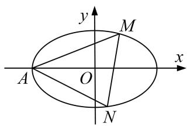
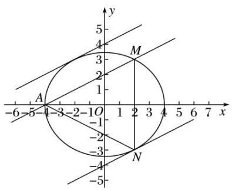
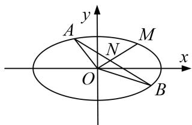
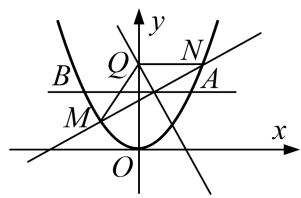
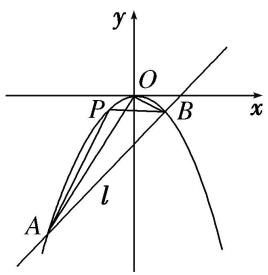
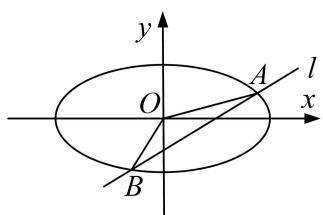
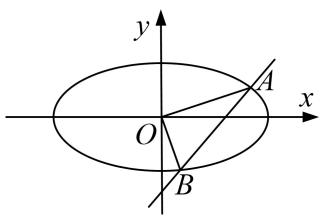
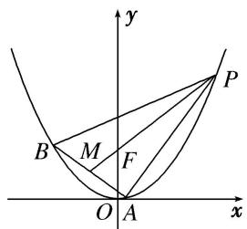

# 专题27 双变量型三角形面积最值问题

# 最值问题——构造函数

最值问题的基本解法有几何法和代数法：几何法是根据已知的几何量之间的相互关系、平面几何和解析几何知识加以解决的(如抛物线上的点到某个定点和焦点的距离之和、光线反射问题等)；代数法是建立求解目标关于某个或两个变量的函数，通过求解函数的最值普通方法、基本不等式方法、导数方法等解决的.

# 【例题选讲】

[例 1] (2020·新全国II)已知椭圆 C: $\frac{x^{2}}{a^{2}}+\frac{y^{2}}{b^{2}}=1(a>b>0)$ 过点 M(2,3)，点 A 为其左顶点，且 AM 的斜率为 $\frac{1}{2}$ .

(1)求 C 的方程;  
(2)点 N 为椭圆上任意一点，求 $\triangle AMN$ 的面积的最大值.

text_image

y
M
x
A
O
N

[规范解答] (1)由题意可知直线 AM 的方程为 $y-3=\frac{1}{2}(x-2)$ ，即 x-2y=-4.
当 y=0 时，解得 x=-4，所以 a=4。由椭圆 C: $\frac{x^{2}}{a^{2}}+\frac{y^{2}}{b^{2}}=1(a>b>0)$ 过点 M(2, 3)，可得 $\frac{4}{16}+\frac{9}{b^{2}}=1$ ，解得 $b^{2}=12$ 。所以 C 的方程为 $\frac{x^{2}}{16}+\frac{y^{2}}{12}=1$ 。

(2)设与直线 AM 平行的直线方程为 x-2y=m.
如图所示，当直线与椭圆相切时，与 AM 距离比较远的直线与椭圆的切点为 N，
此时 $\triangle AMN$ 的面积取得最大值.

text_image

y
5
4
M
3
2
1
A
-6 -5 -4 -3 -2 -1 O 1 2 3 4 5 6 7 x
-1
-2
-3
-4
-5
N

联立 $\left\{\begin{aligned}x-2y=m,\\ \frac{x^{2}}{16}+\frac{y^{2}}{12}=1,\end{aligned}\right.$ 可得 $3(m+2y)^{2}+4y^{2}=48$ ，化简可得 $16y^{2}+12my+3m^{2}-48=0$

所以 $\Delta=144m^{2}-4\times16(3m^{2}-48)=0$ ，即 $m^{2}=64$ ，解得 $m=\pm8$ ，

与 AM 距离比较远的直线方程为 x-2y=8,

点 N 到直线 AM 的距离即两平行线之间的距离，即 $d=\frac{8+4}{\sqrt{1+4}}=\frac{12\sqrt{5}}{5}$ ,

由两点之间的距离公式可得 $|AM|=\sqrt{(2+4)^{2}+3^{2}}=3\sqrt{5}$ .

所以 $\triangle AMN$ 的面积的最大值为 $\frac{1}{2}\times3\sqrt{5}\times\frac{12\sqrt{5}}{5}=18.$

[例 2] 已知椭圆 C: $\frac{x^{2}}{a^{2}}+\frac{y^{2}}{b^{2}}=1(a>b>0)$ 的离心率为 $\frac{1}{2}$ ，点 $M\left(\sqrt{3},\frac{\sqrt{3}}{2}\right)$ 在椭圆 C 上.

(1)求椭圆 $C$ 的方程；(2)若不过原点 $O$ 的直线 $l$ 与椭圆 $C$ 相交于 $A, B$ 两点，与直线 $OM$ 相交于点 $N$ ，且 $N$ 是线段 $AB$ 的中点，求 $\triangle OAB$ 面积的最大值.

text_image

y
A
M
N
O
x
B

[规范解答] (1)由椭圆 $C: \frac{x^2}{a^2} + \frac{y^2}{b^2} = 1 (a > b > 0)$ 的离心率为 $\frac{1}{2}$ ，点 $M\left(\sqrt{3}, \frac{\sqrt{3}}{2}\right)$ 在椭圆 $C$ 上，得

$\left\{ \begin{array}{l} \frac{c}{a} = \frac{1}{2}, \\ \frac{(\sqrt{3})^2}{a^2} + \frac{(\sqrt{3})^2}{4b^2} = 1, \\ a^2 = b^2 + c^2, \end{array} \right.$ 解得 $\left\{ \begin{array}{l} a^2 = 4, \\ b^2 = 3. \end{array} \right.$ 所以椭圆 $C$ 的方程为 $\frac{x^2}{4} + \frac{y^2}{3} = 1$ .

(2)易得直线 OM 的方程为 $y=\frac{1}{2}x$ .

当直线 l 的斜率不存在时，AB 的中点不在直线 $y=\frac{1}{2}x$ 上，故直线 l 的斜率存在.

设直线 l 的方程为 $y=kx+m(m\neq0)$ ，与 $\frac{x^{2}}{4}+\frac{y^{2}}{3}=1$ 联立消 y，得 $(3+4k^{2})x^{2}+8kmx+4m^{2}-12=0$ ，

所以 $\Delta=64k^{2}m^{2}-4(3+4k^{2})(4m^{2}-12)=48(3+4k^{2}-m^{2})>0.$

设 $A(x_{1}, y_{1})$ ， $B(x_{2}, y_{2})$ ，则 $x_{1} + x_{2} = -\frac{8km}{3 + 4k^{2}}$ ， $x_{1}x_{2} = \frac{4m^{2} - 12}{3 + 4k^{2}}$ ，由 $y_{1} + y_{2} = k(x_{1} + x_{2}) + 2m = \frac{6m}{3 + 4k^{2}}$ 所以 AB 的中点 $N\left(-\frac{4km}{3+4k^{2}}, \frac{3m}{3+4k^{2}}\right)$ ，因为 N 在直线 $y=\frac{1}{2}x$ 上，

所以 $-\frac{4km}{3+4k^{2}}=2\times\frac{3m}{3+4k^{2}}$ ，解得 $k=-\frac{3}{2}$

所以 $\Delta=48(12-m^{2})>0$ ，得 $-2\sqrt{3}<m<2\sqrt{3}$ ，且 $m\neq0$ ，

$$
| A B | = \sqrt {1 + \left(\frac {3}{2}\right) ^ {2}} \left| x _ {2} - x _ {1} \right| = \frac {\sqrt {1 3}}{2} \cdot \sqrt {(x _ {1} + x _ {2}) ^ {2} - 4 x _ {1} x _ {2}} = \frac {\sqrt {1 3}}{2} \cdot \sqrt {m ^ {2} - 4 \times \frac {m ^ {2} - 3}{3}} = \frac {\sqrt {3 9}}{6} \sqrt {1 2 - m ^ {2}},
$$

又原点 O 到直线 l 的距离 $d=\frac{2|m|}{\sqrt{13}}$ ,

所以 $S_{\triangle OAB} = \frac{1}{2}\times \frac{\sqrt{39}}{6}\sqrt{12 - m^2}\times \frac{2|m|}{\sqrt{13}} = \frac{\sqrt{3}}{6}\sqrt{(12 - m^2)m^2}\leq \frac{\sqrt{3}}{6}\sqrt{\frac{(12 - m^2 + m^2)^2}{4}} = \sqrt{3},$

当且仅当 $12 - m^2 = m^2$ ，即 $m = \pm \sqrt{6}$ 时等号成立，符合 $-2\sqrt{3} < m < 2\sqrt{3}$ ，且 $m \neq 0$

所以 $\triangle OAB$ 面积的最大值为 $\sqrt{3}$ .

[例3] 已知平面上一动点 $P$ 到定点 $F(\sqrt{3}, 0)$ 的距离与它到直线 $x = \frac{4\sqrt{3}}{3}$ 的距离之比为 $\frac{\sqrt{3}}{2}$ ，记动点 $P$ 的轨迹为曲线 $C$ .

(1)求曲线 C 的方程;

(2)设直线 $l: y = kx + m$ 与曲线 $C$ 交于 $M, N$ 两点， $O$ 为坐标原点，若 $k_{OM} \cdot k_{ON} = \frac{5}{4}$ ，求 $\triangle MON$ 的面积的最大值.

[规范解答] (1) 设 $P(x, y)$ ，则 $\frac{\sqrt{(x-\sqrt{3})^{2}+y^{2}}}{\left|x-\frac{4\sqrt{3}}{3}\right|}=\frac{\sqrt{3}}{2}$ ，化简，得 $\frac{x^{2}}{4}+y^{2}=1$ .

(2)设 $M(x_{1},y_{1})$ ， $N(x_{2},y_{2})$ ，联立 $\left\{ \begin{array}{l}y = kx + m,\\ \frac{x^2}{4} +y^2 = 1, \end{array} \right.$ 得 $(4k^{2} + 1)x^{2} + 8kmx + 4m^{2} - 4 = 0,$

依题意，得 $\Delta=(8km)^{2}-4(4k^{2}+1)(4m^{2}-4)>0$ ，化简，得 $m^{2}<4k^{2}+1$ ，①

$$
x _ {1} + x _ {2} = - \frac {8 k m}{4 k ^ {2} + 1}, x _ {1} x _ {2} = \frac {4 m ^ {2} - 4}{4 k ^ {2} + 1}, y _ {1} y _ {2} = (k x _ {1} + m) (k x _ {2} + m) = k ^ {2} x _ {1} x _ {2} + k m (x _ {1} + x _ {2}) + m ^ {2},
$$

若 $k_{OM} \cdot k_{ON} = \frac{5}{4}$ ，则 $\frac{y_{1}y_{2}}{x_{1}x_{2}} = \frac{5}{4}$ ，即 $4y_{1}y_{2} = 5x_{1}x_{2}$ ，∴ $4k^{2}x_{1}x_{2} + 4km(x_{1} + x_{2}) + 4m^{2} = 5x_{1}x_{2}$

$$
\therefore (4 k ^ {2} - 5) \cdot \frac {4 (m ^ {2} - 1)}{4 k ^ {2} + 1} + 4 k m \left(- \frac {8 k m}{4 k ^ {2} + 1}\right) + 4 m ^ {2} = 0, \text {即} (4 k ^ {2} - 5) (m ^ {2} - 1) - 8 k ^ {2} m ^ {2} + m ^ {2} (4 k ^ {2} + 1) = 0,
$$

化简，得 $m^{2}+k^{2}=\frac{5}{4}$ ，②

$$
\left| M N \right| = \sqrt {1 + k ^ {2}} \left| x _ {1} - x _ {2} \right| = \sqrt {1 + k ^ {2}} \sqrt {\frac {6 4 k ^ {2} m ^ {2}}{(4 k ^ {2} + 1) ^ {2}} - 4 \cdot \frac {4 m ^ {2} - 4}{4 k ^ {2} + 1}} = \sqrt {1 + k ^ {2}} \sqrt {\frac {- 1 6 m ^ {2} + 6 4 k ^ {2} + 1 6}{(4 k ^ {2} + 1) ^ {2}}}
$$

$$
= \sqrt {1 + k ^ {2}} \sqrt {\frac {4 (2 0 k ^ {2} - 1)}{(4 k ^ {2} + 1) ^ {2}}},
$$

∵原点 O 到直线 l 的距离 $d=\frac{|m|}{\sqrt{1+k^{2}}}$ ，∴ $S_{\triangle MON}=\frac{1}{2}|MN|\cdot d=\frac{1}{2}\sqrt{\frac{(5-4k^{2})(20k^{2}-1)}{(4k^{2}+1)^{2}}}$ .

设 $4k^{2}+1=t$ ，由①②得 $0\leq m^{2}<\frac{6}{5}$ ， $\frac{1}{20}<k^{2}\leq\frac{5}{4}$ ，∴ $\frac{6}{5}<t\leq6$ ， $\frac{1}{6}\leq\frac{1}{t}<\frac{5}{6}$

$$
S _ {\triangle M O N} = \frac {1}{2} \sqrt {\frac {(6 - t) (5 t - 6)}{t ^ {2}}} = \frac {1}{2} \sqrt {\frac {- 3 6 + 3 6 t - 5 t ^ {2}}{t ^ {2}}} = 3 \sqrt {- \left(\frac {1}{t} - \frac {1}{2}\right) ^ {2} + \frac {1}{9}} \leq 1,
$$

∴ 当 $\frac{1}{t} = \frac{1}{2}$ ，即 $k = \pm \frac{1}{2}$ 时， $\triangle MON$ 的面积取得最大值为 1.

[例4] 已知动圆过定点 $F\left(0, \frac{1}{4}\right)$ ，且与定直线 $l: y = -\frac{1}{4}$ 相切.

(1)求动圆圆心的轨迹曲线 C 的方程;

(2)若点 $A(x_0, y_0)$ 是直线 $x - y - 1 = 0$ 上的动点，过点 $A$ 作曲线 $C$ 的切线，切点记为 $M, N$ ，求证：直线 $MN$ 恒过定点，并求 $\triangle AMN$ 面积 $S$ 的最小值.

[规范解答] (1)根据抛物线的定义，由题意可得，动圆圆心的轨迹 $C$ 是以点 $F\left(0, \frac{1}{4}\right)$ 为焦点，

以定直线 l: $y = -\frac{1}{4}$ 为准线的抛物线．设抛物线 C: $x^{2} = 2py (p > 0)$ ,

因为点 $F\left(0,\frac{1}{4}\right)$ 到准线 l: $y=-\frac{1}{4}$ 的距离为 $\frac{1}{2}$ ，所以 $p=\frac{1}{2}$ ，所以圆心的轨迹曲线 C 的方程为 $x^{2}=y$ .

(2)证明：因为 $x^{2}=y$ ，所以 $y'=2x$ ，设切点 $M(x_{1}, y_{1})$ ， $N(x_{2}, y_{2})$ ，则 $x_{1}^{2}=y_{1}$ ， $x_{2}^{2}=y_{2}$ ，

则过点 $M(x_{1}, y_{1})$ 的切线方程为 $y - y_{1} = 2x_{1}(x - x_{1})$ ，即 $y = 2x_{1}x - x_{1}^{2}$ ，即 $y = 2x_{1}x - y_{1}$ .

同理得过点 $N(x_{2}, y_{2})$ 的切线方程为 $y=2x_{2}x-y_{2}$ .

因为过点 M, N 的切线都过点 $A(x_{0}, y_{0})$ ，所以 $y_{0}=2x_{1}x_{0}-y_{1}, y_{0}=2x_{2}x_{0}-y_{2}$

所以点 $M(x_{1}, y_{1})$ ， $N(x_{2}, y_{2})$ 都在直线 $y_{0}=2xx_{0}-y$ 上，

所以直线 MN 的方程为 $y_{0}=2xx_{0}-y$ ，即 $2x_{0}x-y-y_{0}=0$ .

又因为点 $A(x_{0}, y_{0})$ 是直线 x-y-1=0 上的动点，所以 $x_{0}-y_{0}-1=0$ ，

所以直线 MN 的方程为 $2x_{0}x - y - (x_{0} - 1) = 0$ ，即 $x_{0}(2x - 1) + (1 - y) = 0$ ，所以直线 MN 恒过定点 $\left(\frac{1}{2}, 1\right)$ .

联立 $\left\{\begin{aligned}&2x_{0}x-y-y_{0}=0,\\ &y=x^{2},\end{aligned}\right.$ 得 $x^{2}-2x_{0}x+y_{0}=0$ ，又 $x_{0}-y_{0}-1=0$ ，

所以 $x^{2}-2x_{0}x+x_{0}-1=0$ ，则 $\left\{\begin{aligned}&4=4x_{0}^{2}-4(x_{0}-1)>0,\\ &x_{1}+x_{2}=2x_{0},\\ &x_{1}\cdot x_{2}=x_{0}-1,\end{aligned}\right.$

所以 $MN=\sqrt{(1+k^{2})[(x_{1}+x_{2})^{2}-4x_{1}\cdot x_{2}]}=\sqrt{(1+4x_{0}^{2})[(2x_{0})^{2}-4(x_{0}-1)]=\sqrt{(1+4x_{0}^{2})(4x_{0}^{2}-4x_{0}+4)}}$ .

又因为点 $A(x_{0}, y_{0})$ 到直线 $2x_{0}x - y - y_{0} = 0$ 的距离为 $d = \frac{|2x_{0} \cdot x_{0} - y_{0} - y_{0}|}{\sqrt{1 + 4x_{0}^{2}}} = \frac{|2x_{0}^{2} - 2(x_{0} - 1)|}{\sqrt{1 + 4x_{0}^{2}}} = \frac{2|x_{0}^{2} - x_{0} + 1|}{\sqrt{1 + 4x_{0}^{2}}}$ ,

所以 $S = \frac{1}{2} MN \cdot d = \frac{1}{2}\sqrt{(1 + 4x_0^2)(4x_0^2 - 4x_0 + 4)} \cdot \frac{2|x_0^2 - x_0 + 1|}{\sqrt{1 + 4x_0^2}} = 2\sqrt{x_0^2 - x_0 + 1} \cdot |x_0^2 - x_0 + 1|$ .

令 $t = \sqrt{x_0^2 - x_0 + 1} = \sqrt{\left(x_0 - \frac{1}{2}\right)^2 + \frac{3}{4}} \geq \frac{\sqrt{3}}{2}$ , 即 $S = 2t^3 \geq \frac{3\sqrt{3}}{4}$ ,

所以当点 A 的坐标为 $\left(\frac{1}{2}, -\frac{1}{2}\right)$ 时， $\triangle AMN$ 的面积 S 取得最小值为 $\frac{3\sqrt{3}}{4}$ .

[例 5] 已知抛物线 $\Gamma: x^{2}=2py(p>0)$ ，直线 y=2 与抛物线 $\Gamma$ 交于 A，B（点 B 在点 A 的左侧）两点，且 $|AB|=4\sqrt{3}$ .

(1)求抛物线 $\Gamma$ 在A，B两点处的切线方程；  
(2)若直线 l 与抛物线 $\Gamma$ 交于 M, N 两点，且 M, N 的中点在线段 AB 上，MN 的垂直平分线交 y 轴于点 Q，求 $\triangle QMN$ 面积的最大值.

text_image

y
Q
N
B
A
M
O
x

[规范解答] (1)由 $x^{2} = 2py$ ，令 $y = 2$ ，得 $x = \pm 2\sqrt{p}$ ，所以 $4\sqrt{p} = 4\sqrt{3}$ ，解得 $p = 3$ ，即 $x^{2} = 6y$

由 $y=\frac{x^{2}}{6}$ ，得 $y'=\frac{x}{3}$ ，故 $y'|_{x=2}\sqrt{3}=\frac{2\sqrt{3}}{3}$ .

所以在 A 点的切线方程为 $y-2=\frac{2\sqrt{3}}{3}(x-2\sqrt{3})$ ，即 $2x-\sqrt{3}y-2\sqrt{3}=0$ ;

同理可得在 B 点的切线方程为 $2x + \sqrt{3}y + 2\sqrt{3} = 0$ .

(2)由题意得直线 l 的斜率存在且不为 0,

故设 $l: y=kx+m$ ， $M(x_{1}, y_{1})$ ， $N(x_{2}, y_{2})$ ，由 $x^{2}=6y$ 与 $y=kx+m$ 联立，得 $x^{2}-6kx-6m=0$ ，

又 $\Delta=36k^{2}+24m>0$ ，故 $x_{1}+x_{2}=6k,\quad x_{1}x_{2}=-6m,$

故 $|MN|=\sqrt{1+k^{2}}\cdot\sqrt{36k^{2}+24m}=2\sqrt{3}\cdot\sqrt{1+k^{2}}\cdot\sqrt{3k^{2}+2m}$ .

又 $y_{1}+y_{2}=k(x_{1}+x_{2})+2m=6k^{2}+2m=4$ ，所以 $m=2-3k^{2}$ ，所以 $|MN|=2\sqrt{3}\cdot\sqrt{1+k^{2}}\cdot\sqrt{4-3k^{2}}$

由 $\Delta=36k^{2}+24m>0$ ，得 $-\frac{2\sqrt{3}}{3}<k<\frac{2\sqrt{3}}{3}$ 且 $k\neq0$ .

因为 M, N 的中点为 $(3k, 2)$ ，所以 M, N 的垂直平分线方程为 $y-2=-\frac{1}{k}(x-3k)$ ,

令 x=0，得 y=5，即 $Q(0, 5)$ ,

所以点 $Q$ 到直线 $kx - y + 2 - 3k^2 = 0$ 的距离 $d = \frac{|-5 + 2 - 3k^2|}{\sqrt{1 + k^2}} = 3\sqrt{1 + k^2}$

所以 $S_{\triangle QMN} = \frac{1}{2}\cdot 2\sqrt{3}\cdot \sqrt{1 + k^2}\cdot \sqrt{4 - 3k^2}\cdot 3\sqrt{1 + k^2} = 3\sqrt{3}\cdot \sqrt{(1 + k^2)^2(4 - 3k^2)}.$

令 $1+k^{2}=u$ ，则 $k^{2}=u-1$ ，则 $1<u<\frac{7}{3}$ ，故 $S_{\triangle QMN}=3\sqrt{3}\cdot\sqrt{u^{2}(7-3u)}$ .

设 $f(u)=u^{2}(7-3u)$ ，则 $f(u)=14u-9u^{2}$ ，结合 $1<u<\frac{7}{3}$

令 $f(u)>0$ ，得 $1<u<\frac{14}{9}$ ；令 $f(u)<0$ ，得 $\frac{14}{9}<u<\frac{7}{3}$ ，

所以当 $u = \frac{14}{9}$ ，即 $k = \pm \frac{\sqrt{5}}{3}$ 时， $(S_{\triangle QMN})_{\max} = 3\sqrt{3}\times \frac{14}{9}\sqrt{7 - 3\times\frac{14}{9}} = \frac{14\sqrt{7}}{3}.$

# 【对点训练】

1. 如图所示，已知直线 $l: y = kx - 2$ 与抛物线 $C: x^2 = -2py(p > 0)$ 交于 $A, B$ 两点， $O$ 为坐标原点， $\overrightarrow{OA} + \overrightarrow{OB} = (-4, -12)$ .

(1)求直线 l 和抛物线 C 的方程;  
(2)抛物线上一动点 P 从 A 到 B 运动时，求 $\triangle ABP$ 面积的最大值.

text_image

y
O
P
B
x
A
l

1. 解析 (1)由 $\left\{ \begin{array}{l} y = kx - 2, \\ x^2 = -2py, \end{array} \right.$ 得 $x^{2} + 2pkx - 4p = 0$ .

设 $A(x_{1}, y_{1})$ ， $B(x_{2}, y_{2})$ ，则 $x_{1} + x_{2} = -2pk$ ， $y_{1} + y_{2} = k(x_{1} + x_{2}) - 4 = -2pk^{2} - 4$ .

因为 $\overrightarrow{OA} +\overrightarrow{OB} = (x_1 + x_2,y_1 + y_2) = (-2pk, - 2pk^2 -4) = (-4, - 12)$ ，所以 $\left\{ \begin{array}{l} - 2pk = -4,\\ -2pk^2 -4 = -12, \end{array} \right.$

解得 $\left\{\begin{aligned}p=1,\\ k=2.\end{aligned}\right.$ 所以直线 l 的方程为 y=2x-2，抛物线 C 的方程为 $x^{2}=-2y$ .

(2)设 $P(x_{0}, y_{0})$ ，依题意，知抛物线过点 P 的切线与 l 平行时， $\triangle ABP$ 的面积最大，又 $y' = -x$ ,

所以 $-x_{0}=2$ ，故 $x_{0}=-2,\quad y_{0}=-\frac{1}{2}x_{0}^{2}=-2$ ，所以 $P(-2,-2)$ .

此时点 P 到直线 l 的距离 $d=\frac{|2\times(-2)-(-2)-2|}{\sqrt{2^{2}+(-1)^{2}}}=\frac{4}{\sqrt{5}}=\frac{4\sqrt{5}}{5}$ .

由 $\left\{\begin{aligned}y=2x-2,\\ x^{2}&=-2y,\end{aligned}\right.$ 得 $x^{2}+4x-4=0$ ，故 $x_{1}+x_{2}=-4$ ， $x_{1}x_{2}=-4$ ，

所以 $|AB|=\sqrt{1+k^{2}}\times\sqrt{(x_{1}+x_{2})^{2}-4x_{1}x_{2}}=\sqrt{1+2^{2}}\times\sqrt{(-4)^{2}-4\times(-4)}=4\sqrt{10}.$

所以 $\triangle ABP$ 面积的最大值为 $\frac{4\sqrt{10}\times\frac{4\sqrt{5}}{5}}{2}=8\sqrt{2}$ .

2. 椭圆 $C: \frac{x^2}{a^2} + \frac{y^2}{b^2} = 1 (a > b > 0)$ 的离心率为 $\frac{\sqrt{6}}{3}$ ，短轴一个端点到右焦点的距离为 $\sqrt{3}$ .

(1)求椭圆 C 的方程;

(2)设斜率存在的直线 l 与椭圆 C 交于 A, B 两点，坐标原点 O 到直线 l 的距离为 $\frac{\sqrt{3}}{2}$ ，求 $\triangle AOB$ 面积的最大值.

text_image

y
O
A
l
x
B

2. 解析 (1)设椭圆的半焦距为 $c$ ，依题意知 $\left\{ \begin{array}{l} c = \frac{\sqrt{6}}{3}, \\ a = \sqrt{3}, \end{array} \right.$ $\therefore c = \sqrt{2}, b = 1, \therefore$ 所求椭圆方程为 $\frac{x^2}{3} + y^2 = 1$ .

(2)设 $A(x_{1}, y_{1})$ ， $B(x_{2}, y_{2})$ ，设直线 AB 的方程为 $y=kx+m$ .

由已知 $\frac{|m|}{\sqrt{1+k^{2}}}=\frac{\sqrt{3}}{2}$ ，得 $m^{2}=\frac{3}{4}(k^{2}+1)$ .

把 $y=kx+m$ 代入椭圆方程，整理，得 $(3k^{2}+1)x^{2}+6kmx+3m^{2}-3=0$ .

$$
\begin{array}{l} \Delta = 3 6 k ^ {2} m ^ {2} - 4 (3 k ^ {2} + 1) (3 m ^ {2} - 3) = 3 6 k ^ {2} - 1 2 m ^ {2} + 1 2 > 0. \quad \therefore x _ {1} + x _ {2} = \frac {- 6 k m}{3 k ^ {2} + 1}, \quad x _ {1} x _ {2} = \frac {3 (m ^ {2} - 1)}{3 k ^ {2} + 1}. \\ \therefore | A B | ^ {2} = (1 + k ^ {2}) \left(x _ {2} - x _ {1}\right) ^ {2} = (1 + k ^ {2}) \left[ \frac {3 6 k ^ {2} m ^ {2}}{(3 k ^ {2} + 1) ^ {2}} - \frac {1 2 (m ^ {2} - 1)}{3 k ^ {2} + 1} \right] = \frac {1 2 (k ^ {2} + 1) (3 k ^ {2} + 1 - m ^ {2})}{(3 k ^ {2} + 1) ^ {2}} = \frac {3 (k ^ {2} + 1) (9 k ^ {2} + 1)}{(3 k ^ {2} + 1) ^ {2}} \\ = 3 + \frac {1 2 k ^ {2}}{9 k ^ {4} + 6 k ^ {2} + 1} = 3 + \frac {1 2}{9 k ^ {2} + \frac {1}{k ^ {2}} + 6} (k \neq 0) \leq 3 + \frac {1 2}{2 \times 3 + 6} = 4. \\ \end{array}
$$

当且仅当 $9k^{2} = \frac{1}{k^{2}}$ ，即 $k = \pm \frac{\sqrt{3}}{3}$ 时等号成立．当 $k = 0$ 时， $|AB| = \sqrt{3}$ ，综上所述 $|AB|_{\max} = 2$

∴当 $|AB|$ 最大时， $\triangle AOB$ 的面积取得最大值 $S=\frac{1}{2}\times|AB|_{\max}\times\frac{\sqrt{3}}{2}=\frac{\sqrt{3}}{2}$ .

3. 已知椭圆 $E: \frac{x^2}{a^2} + \frac{y^2}{b^2} = 1 (a > b > 0)$ 的两焦点与短轴一端点组成一个正三角形的三个顶点，且焦点到椭圆上的点的最短距离为 1.

(1)求椭圆 E 的方程;  
(2)若不过原点 O 的直线 l 与椭圆交于 A, B 两点，求 $\triangle OAB$ 面积的最大值.

text_image

y
A
x
O
B

3. 解析 (1)由题意知 $\left\{ \begin{array}{l} \frac{b}{c} = \sqrt{3}, \\ a - c = 1, \end{array} \right.$ 又 $a^2 = b^2 + c^2$ ，所以 $a = 2, b = \sqrt{3}$ .

所以椭圆 E 的方程为 $\frac{x^{2}}{4} + \frac{y^{2}}{3} = 1$ .

(2)当直线 l 的斜率存在时，设其方程为 $y=kx+m(m\neq0)$ ,
代入椭圆方程，整理，得 $(4k^{2}+3)x^{2}+8kmx+4m^{2}-12=0$ 。由 $\Delta>0$ ，得 $4k^{2}-m^{2}+3>0$ 。

设 $A(x_{1}, y_{1})$ ， $B(x_{2}, y_{2})$ ，则 $x_{1} + x_{2} = -\frac{8km}{4k^{2} + 3}$ ， $x_{1} \cdot x_{2} = \frac{4m^{2} - 12}{4k^{2} + 3}$ .

于是 $|AB|=\sqrt{1+k^{2}}\cdot\sqrt{(x_{1}+x_{2})^{2}-4x_{1}x_{2}}=4\sqrt{3}\cdot\sqrt{1+k^{2}}\cdot\frac{\sqrt{4k^{2}-m^{2}+3}}{4k^{2}+3}$ .

又坐标原点 O 到直线 l 的距离 $d=\frac{|m|}{\sqrt{1+k^{2}}}$ ,

所以 $\triangle OAB$ 的面积 $S = \frac{1}{2} |\cdot |AB|\cdot d = 2\sqrt{3}\cdot |m|\cdot \frac{\sqrt{4k^2 - m^2 + 3}}{4k^2 + 3}.$

因为 $|m|\cdot\frac{\sqrt{4k^{2}-m^{2}+3}}{4k^{2}+3}=\frac{\sqrt{m^{2}(4k^{2}-m^{2}+3)}}{4k^{2}+3}\leq\frac{\frac{m^{2}+(4k^{2}-m^{2}+3)}{2}}{4k^{2}+3}=\frac{1}{2},$

所以 $S=\frac{1}{2}\cdot|AB|\cdot d\leq\sqrt{3}$ .

当直线 l 的斜率不存在时，设其方程为 x=t，同理可求得 $S=\frac{1}{2}\cdot|AB|\cdot d=\frac{1}{2}|t|\cdot\sqrt{12-3t^{2}}\leq\sqrt{3}$ .

综上， $\triangle OAB$ 面积的最大值为 $\sqrt{3}$ .

4. 已知 $\triangle ABP$ 的三个顶点都在抛物线 $C: x^2 = 4y$ 上， $F$ 为抛物线 $C$ 的焦点，点 $M$ 为 $AB$ 的中点， $\overrightarrow{PF} = 3\overrightarrow{FM}$ .

(1)若 $|PF|=3$ ，求点M的坐标；

(2)求 $\triangle ABP$ 面积的最大值.

text_image

y
P
B M F
O A x

4. 解析 (1)由题意知焦点 $F(0,1)$ ，准线方程为 $y = -1$ .

设 $P(x_{0}, y_{0})$ ，由抛物线定义知 $|PF| = y_{0} + 1$ ，得 $y_{0} = 2$ ，所以 $P(2\sqrt{2}, 2)$ 或 $P(-2\sqrt{2}, 2)$ ，

由 $\overrightarrow{PF} = 3\overrightarrow{FM}$ ，得 $M\left(-\frac{2\sqrt{2}}{3},\frac{2}{3}\right)$ 或 $M\left(\frac{2\sqrt{2}}{3},\frac{2}{3}\right).$

(2)设直线 AB 的方程为 $y=kx+m$ ，点 $A(x_{1}, y_{1})$ ， $B(x_{2}, y_{2})$ ， $P(x_{0}, y_{0})$ ，

由 $\left\{\begin{aligned}y=kx+m,\\ x^{2}=4y,\end{aligned}\right.$ 得 $x^{2}-4kx-4m=0$ ，于是 $\Delta=16k^{2}+16m>0$ ， $x_{1}+x_{2}=4k$ ， $x_{1}x_{2}=-4m$ ，

所以 AB 中点 M 的坐标为 $(2k, 2k^{2} + m)$ . 由 $\overrightarrow{PF} = 3\overrightarrow{FM}$ ，得 $(-x_{0}, 1 - y_{0}) = 3(2k, 2k^{2} + m - 1)$ ,

所以 $\left\{\begin{aligned}x_{0}&=-6k,\\ y_{0}&=4-6k^{2}-3m.\end{aligned}\right.$ 由 $x_{0}^{2}=4y_{0}$ 得 $k^{2}=-\frac{1}{5}m+\frac{4}{15}$ ，由 $\Delta>0,\quad k^{2}\geq0$ ，得 $-\frac{1}{3}<m\leq\frac{4}{3}$ .

又因为 $|AB|=\sqrt{1+k^{2}}\cdot\sqrt{(x_{1}+x_{2})^{2}-4x_{1}x_{2}}=4\sqrt{1+k^{2}}\cdot\sqrt{k^{2}+m}$

点 $F(0, 1)$ 到直线 AB 的距离为 $d=\frac{|m-1|}{\sqrt{1+k^{2}}}$ ,

所以 $S_{\triangle ABP} = 4S_{\triangle ABF} = 8|m - 1|\sqrt{k^2 + m} = \frac{16}{\sqrt{15}}\sqrt{3m^3 - 5m^2 + m + 1}$ .

记 $f(m)=3m^{3}-5m^{2}+m+1\left(-\frac{1}{3}<m\leq\frac{4}{3}\right)$ ，令 $f'(m)=9m^{2}-10m+1=0$

解得 $m_{1}=\frac{1}{9}$ ， $m_{2}=1$ ，可得 $f(m)$ 在 $\left(-\frac{1}{3},\frac{1}{9}\right)$ 上是增函数，在 $\left(\frac{1}{9},1\right)$ 上是减函数，在 $\left(1,\frac{4}{3}\right)$ 上是增函数，

又 $f\left(\frac{1}{9}\right)=\frac{256}{243}>f\left(\frac{4}{3}\right)=\frac{5}{9}$ . 所以当 $m=\frac{1}{9}$ 时， $f(m)$ 取到最大值 $\frac{256}{243}$ ，此时 $k=\pm\frac{\sqrt{55}}{15}$ .

所以 $\triangle ABP$ 面积的最大值为 $\frac{256\sqrt{5}}{135}$ .

