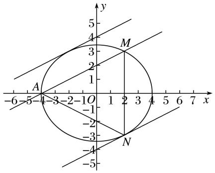
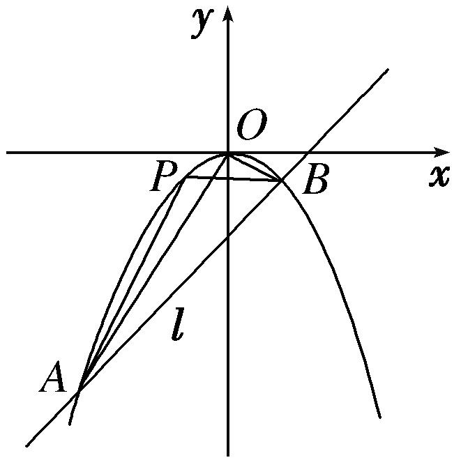
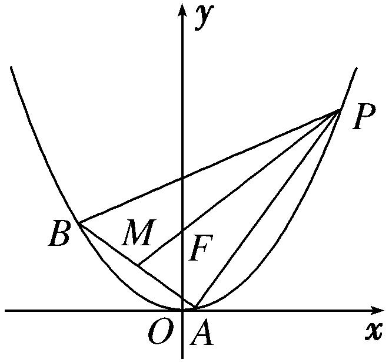

专题27　双变量型三角形面积最值问题

最值问题——构造函数

最值问题的基本解法有几何法和代数法：几何法是根据已知的几何量之间的相互关系、平面几何和解析几何知识加以解决的(如抛物线上的点到某个定点和焦点的距离之和、光线反射问题等)；代数法是建立求解目标关于某个或两个变量的函数，通过求解函数的最值普通方法、基本不等式方法、导数方法等解决的．

【例题选讲】

<strong>[例1]</strong>　(2020·新全国Ⅱ)已知椭圆<em>C</em>：＋＝1(<em>a</em>&gt;<em>b</em>&gt;0)过点<em>M</em>(2，3)，点<em>A</em>为其左顶点，且<em>AM</em>的斜率为．  
（1）求*C*的方程；  
（2）点*N*为椭圆上任意一点，求△*AMN*的面积的最大值．

<strong>[规范解答]</strong>　（1）由题意可知直线<em>AM</em>的方程为<em>y</em>－3＝(<em>x</em>－2)，即<em>x</em>－2<em>y</em>＝－4．
当*y*＝0时，解得*x*＝－4，所以*a*＝4．由椭圆*C*：＋＝1(*a*>*b*>0)过点*M*(2，3)，
可得＋＝1，解得<em>b</em>2＝12．所以<em>C</em>的方程为＋＝1．  
（2）设与直线*AM*平行的直线方程为*x*－2*y*＝*m*．
如图所示，当直线与椭圆相切时，与*AM*距离比较远的直线与椭圆的切点为*N*，
此时△*AMN*的面积取得最大值．

联立可得3(<em>m</em>＋2<em>y</em>)2＋4<em>y</em>2＝48，化简可得16<em>y</em>2＋12<em>my</em>＋3<em>m</em>2－48＝0，
所以<em>Δ</em>＝144<em>m</em>2－4×16(3<em>m</em>2－48)＝0，即<em>m</em>2＝64，解得<em>m</em>＝±8，

与*AM*距离比较远的直线方程为*x*－2*y*＝8，

点*N*到直线*AM*的距离即两平行线之间的距离，即*d*＝＝，
由两点之间的距离公式可得|*AM*|＝＝3．
所以△*AMN*的面积的最大值为×3×＝18．

<strong>[例2]</strong>　已知椭圆<em>C</em>：＋＝1(<em>a</em>&gt;<em>b</em>&gt;0)的离心率为，点<em>M</em>在椭圆<em>C</em>上．  
（1）求椭圆*C*的方程；  
（2）若不过原点*O*的直线*l*与椭圆*C*相交于*A*，*B*两点，与直线*OM*相交于点*N*，且*N*是线段*AB*的中点，求△*OAB*面积的最大值．

<strong>[规范解答]</strong>　（1）由椭圆<em>C</em>：＋＝1(<em>a</em>&gt;<em>b</em>&gt;0)的离心率为，点<em>M</em>在椭圆<em>C</em>上，得
解得所以椭圆*C*的方程为＋＝1．  
（2）易得直线*OM*的方程为*y*＝*x*．
当直线*l*的斜率不存在时，*AB*的中点不在直线*y*＝*x*上，故直线*l*的斜率存在．
设直线<em>l</em>的方程为<em>y</em>＝<em>kx</em>＋<em>m</em>(<em>m</em>≠0)，与＋＝1联立消<em>y</em>，得(3＋4<em>k</em>2)<em>x</em>2＋8<em>kmx</em>＋4<em>m</em>2－12＝0，
所以<em>Δ</em>＝64<em>k</em>2<em>m</em>2－4(3＋4<em>k</em>2)(4<em>m</em>2－12)＝48(3＋4<em>k</em>2－<em>m</em>2)&gt;0．
设<em>A</em>(<em>x</em>1，<em>y</em>1)，<em>B</em>(<em>x</em>2，<em>y</em>2)，则<em>x</em>1＋<em>x</em>2＝－，<em>x</em>1<em>x</em>2＝，由<em>y</em>1＋<em>y</em>2＝<em>k</em>(<em>x</em>1＋<em>x</em>2)＋2<em>m</em>＝，
所以*AB*的中点*N*，因为*N*在直线*y*＝*x*上，
所以－＝2×，解得*k*＝－，
所以<em>Δ</em>＝48(12－<em>m</em>2)&gt;0，得－2&lt;<em>m</em>&lt;2，且<em>m</em>≠0，

|<em>AB</em>|＝|<em>x</em>2－<em>x</em>1|＝·＝·＝，
又原点*O*到直线*l*的距离*d*＝，
所以<em>S</em>△<em>OAB</em>＝××＝≤＝，
当且仅当12－<em>m</em>2＝<em>m</em>2，即<em>m</em>＝±时等号成立，符合－2&lt;<em>m</em>&lt;2，且<em>m</em>≠0，
所以△*OAB*面积的最大值为．

<strong>[例3]</strong>　已知平面上一动点<em>P</em>到定点<em>F</em>(，0)的距离与它到直线<em>x</em>＝的距离之比为，记动点<em>P</em>的轨迹为曲线<em>C．</em>  
（1）求曲线*C*的方程；  
（2）设直线<em>l</em>：<em>y</em>＝<em>kx</em>＋<em>m</em>与曲线<em>C</em>交于<em>M</em>，<em>N</em>两点，<em>O</em>为坐标原点，若<em>kOM</em>·<em>kON</em>＝，求△<em>MON</em>的面积的最大值．

<strong>[规范解答]</strong>　（1）设<em>P</em>(<em>x</em>，<em>y</em>)，则＝，化简，得＋<em>y</em>2＝1．  
（2）设<em>M</em>(<em>x</em>1，<em>y</em>1)，<em>N</em>(<em>x</em>2，<em>y</em>2)，联立得(4<em>k</em>2＋1)<em>x</em>2＋8<em>kmx</em>＋4<em>m</em>2－4＝0，
依题意，得<em>Δ</em>＝(8<em>km</em>)2－4(4<em>k</em>2＋1)(4<em>m</em>2－4)&gt;0，化简，得<em>m</em>2&lt;4<em>k</em>2＋1，　①

<em>x</em>1＋<em>x</em>2＝－，<em>x</em>1<em>x</em>2＝，<em>y</em>1<em>y</em>2＝(<em>kx</em>1＋<em>m</em>)(<em>kx</em>2＋<em>m</em>)＝<em>k</em>2<em>x</em>1<em>x</em>2＋<em>km</em>(<em>x</em>1＋<em>x</em>2)＋<em>m</em>2，
若<em>kOM</em>·<em>kON</em>＝，则＝，即4<em>y</em>1<em>y</em>2＝5<em>x</em>1<em>x</em>2，∴4<em>k</em>2<em>x</em>1<em>x</em>2＋4<em>km</em>(<em>x</em>1＋<em>x</em>2)＋4<em>m</em>2＝5<em>x</em>1<em>x</em>2，
∴(4<em>k</em>2－5)·＋4<em>km</em>＋4<em>m</em>2＝0，即(4<em>k</em>2－5)(<em>m</em>2－1)－8<em>k</em>2<em>m</em>2＋<em>m</em>2(4<em>k</em>2＋1)＝0，

化简，得<em>m</em>2＋<em>k</em>2＝，　②

|<em>MN</em>|＝|<em>x</em>1－<em>x</em>2|＝ ＝

＝ ，
∵原点<em>O</em>到直线<em>l</em>的距离<em>d</em>＝，∴<em>S</em>△<em>MON</em>＝|<em>MN</em>|·<em>d</em>＝ ．
设4<em>k</em>2＋1＝<em>t</em>，由①②得0≤<em>m</em>2&lt;，&lt;<em>k</em>2≤，∴&lt;<em>t</em>≤6，≤&lt;，

<em>S</em>△<em>MON</em>＝ ＝ ＝3 ≤1，
∴当＝，即*k*＝±时，△*MON*的面积取得最大值为1．

<strong>[例4]</strong>　已知动圆过定点<em>F</em>，且与定直线<em>l</em>：<em>y</em>＝－相切．  
（1）求动圆圆心的轨迹曲线*C*的方程；  
（2）若点<em>A</em>(<em>x</em>0，<em>y</em>0)是直线<em>x</em>－<em>y</em>－1＝0上的动点，过点<em>A</em>作曲线<em>C</em>的切线，切点记为<em>M</em>，<em>N</em>，求证：直线<em>MN</em>恒过定点，并求△<em>AMN</em>面积<em>S</em>的最小值．

<strong>[规范解答]</strong>　（1）根据抛物线的定义，由题意可得，动圆圆心的轨迹<em>C</em>是以点<em>F</em>为焦点，

以定直线<em>l</em>：<em>y</em>＝－为准线的抛物线．设抛物线<em>C</em>：<em>x</em>2＝2<em>py</em>(<em>p</em>＞0)，
因为点<em>F</em>到准线<em>l</em>：<em>y</em>＝－的距离为，所以<em>p</em>＝，所以圆心的轨迹曲线<em>C</em>的方程为<em>x</em>2＝<em>y</em>．  
（2）证明：因为<em>x</em>2＝<em>y</em>，所以<em>y</em>′＝2<em>x</em>，设切点<em>M</em>(<em>x</em>1，<em>y</em>1)，<em>N</em>(<em>x</em>2，<em>y</em>2)，则<em>x</em>＝<em>y</em>1，<em>x</em>＝<em>y</em>2，
则过点<em>M</em>(<em>x</em>1，<em>y</em>1)的切线方程为<em>y</em>－<em>y</em>1＝2<em>x</em>1(<em>x</em>－<em>x</em>1)，即<em>y</em>＝2<em>x</em>1<em>x</em>－<em>x</em>，即<em>y</em>＝2<em>x</em>1<em>x</em>－<em>y</em>1．

同理得过点<em>N</em>(<em>x</em>2，<em>y</em>2)的切线方程为<em>y</em>＝2<em>x</em>2<em>x</em>－<em>y</em>2．
因为过点<em>M</em>，<em>N</em>的切线都过点<em>A</em>(<em>x</em>0，<em>y</em>0)，所以<em>y</em>0＝2<em>x</em>1<em>x</em>0－<em>y</em>1，<em>y</em>0＝2<em>x</em>2<em>x</em>0－<em>y</em>2，
所以点<em>M</em>(<em>x</em>1，<em>y</em>1)，<em>N</em>(<em>x</em>2，<em>y</em>2)都在直线<em>y</em>0＝2<em>xx</em>0－<em>y</em>上，
所以直线<em>MN</em>的方程为<em>y</em>0＝2<em>xx</em>0－<em>y</em>，即2<em>x</em>0<em>x</em>－<em>y</em>－<em>y</em>0＝0．
又因为点<em>A</em>(<em>x</em>0，<em>y</em>0)是直线<em>x</em>－<em>y</em>－1＝0上的动点，所以<em>x</em>0－<em>y</em>0－1＝0，
所以直线<em>MN</em>的方程为2<em>x</em>0<em>x</em>－<em>y</em>－(<em>x</em>0－1)＝0，即<em>x</em>0(2<em>x</em>－1)＋(1－<em>y</em>)＝0，所以直线<em>MN</em>恒过定点．
联立得<em>x</em>2－2<em>x</em>0<em>x</em>＋<em>y</em>0＝0，又<em>x</em>0－<em>y</em>0－1＝0，
所以<em>x</em>2－2<em>x</em>0<em>x</em>＋<em>x</em>0－1＝0，则
所以*MN*＝＝＝．
又因为点<em>A</em>(<em>x</em>0，<em>y</em>0)到直线2<em>x</em>0<em>x</em>－<em>y</em>－<em>y</em>0＝0的距离为<em>d</em>＝＝＝，
所以<em>S</em>＝<em>MN</em>·<em>d</em>＝·＝2·|<em>x</em>－<em>x</em>0＋1|．
令<em>t</em>＝＝≥，即<em>S</em>＝2t3≥，
所以当点*A*的坐标为时，△*AMN*的面积*S*取得最小值为．

<strong>[例5]</strong>　已知抛物线<em>Γ</em>：<em>x</em>2＝2<em>py</em>(<em>p</em>＞0)，直线<em>y</em>＝2与抛物线<em>Γ</em>交于<em>A</em>，<em>B</em>(点<em>B</em>在点<em>A</em>的左侧)两点，且|<em>AB</em>|＝4．  
（1）求抛物线*Γ*在*A*，*B*两点处的切线方程；  
（2）若直线*l*与抛物线*Γ*交于*M*，*N*两点，且*M*，*N*的中点在线段*AB*上，*MN*的垂直平分线交*y*轴于点*Q*，求△*QMN*面积的最大值．

<strong>[规范解答]</strong>　（1）由<em>x</em>2＝2<em>py</em>，令<em>y</em>＝2，得<em>x</em>＝±2，所以4＝4，解得<em>p</em>＝3，即<em>x</em>2＝6<em>y</em>．
由<em>y</em>＝，得<em>y</em>′＝，故<em>y</em>′|<em>x</em>＝2＝．
所以在*A*点的切线方程为*y*－2＝(*x*－2)，即2*x*－*y*－2＝0；
同理可得在*B*点的切线方程为2*x*＋*y*＋2＝0．  
（2）由题意得直线*l*的斜率存在且不为0，
故设<em>l</em>：<em>y</em>＝<em>kx</em>＋<em>m</em>，<em>M</em>(<em>x</em>1，<em>y</em>1)，<em>N</em>(<em>x</em>2，<em>y</em>2)，由<em>x</em>2＝6<em>y</em>与<em>y</em>＝<em>kx</em>＋<em>m</em>联立，得<em>x</em>2－6<em>kx</em>－6<em>m</em>＝0，
又<em>Δ</em>＝36<em>k</em>2＋24<em>m</em>＞0，故<em>x</em>1＋<em>x</em>2＝6<em>k</em>，<em>x</em>1<em>x</em>2＝－6<em>m</em>，
故|*MN*|＝·＝2··．
又<em>y</em>1＋<em>y</em>2＝<em>k</em>(<em>x</em>1＋<em>x</em>2)＋2<em>m</em>＝6<em>k</em>2＋2<em>m</em>＝4，所以<em>m</em>＝2－3<em>k</em>2，所以|<em>MN</em>|＝2··，
由<em>Δ</em>＝36<em>k</em>2＋24<em>m</em>＞0，得－＜<em>k</em>＜且<em>k</em>≠0．
因为*M*，*N*的中点为(3*k*，2)，所以*M*，*N*的垂直平分线方程为*y*－2＝－(*x*－3*k*)，
令*x*＝0，得*y*＝5，即*Q*(0，5)，
所以点<em>Q</em>到直线<em>kx</em>－<em>y</em>＋2－3<em>k</em>2＝0的距离<em>d</em>＝＝3，
所以<em>S</em>△<em>QMN</em>＝·2···3＝3·．
令1＋<em>k</em>2＝<em>u</em>，则<em>k</em>2＝<em>u</em>－1，则1＜<em>u</em>＜，故<em>S</em>△<em>QMN</em>＝3·．
设<em>f</em>(<em>u</em>)＝<em>u</em>2(7－3<em>u</em>)，则<em>f</em>′(<em>u</em>)＝14<em>u</em>－9<em>u</em>2，结合1＜<em>u</em>＜，
令*f*′(*u*)＞0，得1＜*u*＜；令*f*′(*u*)＜0，得＜*u*＜，
所以当<em>u</em>＝，即<em>k</em>＝±时，(<em>S</em>△<em>QMN</em>)max＝3×＝．

【对点训练】

1．如图所示，已知直线<em>l</em>：<em>y</em>＝<em>kx</em>－2与抛物线<em>C</em>：<em>x</em>2＝－2<em>py</em>(<em>p</em>&gt;0)交于<em>A</em>，<em>B</em>两点，<em>O</em>为坐标原点，＋

＝(－4，－12)．  
（1）求直线*l*和抛物线*C*的方程；  
（2）抛物线上一动点*P*从*A*到*B*运动时，求△*ABP*面积的最大值．

1．解析　（1）由得<em>x</em>2＋2<em>pkx</em>－4<em>p</em>＝0．
设<em>A</em>(<em>x</em>1，<em>y</em>1)，<em>B</em>(<em>x</em>2，<em>y</em>2)，则<em>x</em>1＋<em>x</em>2＝－2<em>pk</em>，<em>y</em>1＋<em>y</em>2＝<em>k</em>(<em>x</em>1＋<em>x</em>2)－4＝－2<em>pk</em>2－4．
因为＋＝(<em>x</em>1＋<em>x</em>2，<em>y</em>1＋<em>y</em>2)＝(－2<em>pk</em>，－2<em>pk</em>2－4)＝(－4，－12)，所以
解得所以直线<em>l</em>的方程为<em>y</em>＝2<em>x</em>－2，抛物线<em>C</em>的方程为<em>x</em>2＝－2<em>y</em>．  
（2）设<em>P</em>(<em>x</em>0，<em>y</em>0)，依题意，知抛物线过点<em>P</em>的切线与<em>l</em>平行时，△<em>ABP</em>的面积最大，又<em>y</em>′＝－<em>x</em>，
所以－<em>x</em>0＝2，故<em>x</em>0＝－2，<em>y</em>0＝－<em>x</em>＝－2，所以<em>P</em>(－2，－2)．
此时点*P*到直线*l*的距离*d*＝＝＝．
由得<em>x</em>2＋4<em>x</em>－4＝0，故<em>x</em>1＋<em>x</em>2＝－4，<em>x</em>1<em>x</em>2＝－4，
所以|*AB*|＝×＝×＝4．
所以△*ABP*面积的最大值为＝8．

2．椭圆*C*：＋＝1(*a*>*b*>0)的离心率为，短轴一个端点到右焦点的距离为．  
（1）求椭圆*C*的方程；  
（2）设斜率存在的直线*l*与椭圆*C*交于*A*，*B*两点，坐标原点*O*到直线*l*的距离为，求△*AOB*面积的最大值．

2．<strong>解析</strong>　（1）设椭圆的半焦距为<em>c</em>，依题意知∴<em>c</em>＝，<em>b</em>＝1，∴所求椭圆方程为＋<em>y</em>2＝1．  
（2）设<em>A</em>(<em>x</em>1，<em>y</em>1)，<em>B</em>(<em>x</em>2，<em>y</em>2)，设直线<em>AB</em>的方程为<em>y</em>＝<em>kx</em>＋<em>m</em>．
由已知＝，得<em>m</em>2＝(<em>k</em>2＋1)．

把<em>y</em>＝<em>kx</em>＋<em>m</em>代入椭圆方程，整理，得(3<em>k</em>2＋1)<em>x</em>2＋6<em>kmx</em>＋3<em>m</em>2－3＝0．

<em>Δ</em>＝36<em>k</em>2<em>m</em>2－4(3<em>k</em>2＋1)(3<em>m</em>2－3)＝36<em>k</em>2－12<em>m</em>2＋12&gt;0．∴<em>x</em>1＋<em>x</em>2＝，<em>x</em>1<em>x</em>2＝．
∴|<em>AB</em>|2＝(1＋<em>k</em>2)(<em>x</em>2－<em>x</em>1)2＝(1＋<em>k</em>2)＝＝

＝3＋＝3＋(*k*≠0)≤3＋＝4．
当且仅当9<em>k</em>2＝，即<em>k</em>＝±时等号成立．当<em>k</em>＝0时，|<em>AB</em>|＝，综上所述|<em>AB</em>|max＝2．
∴当|<em>AB</em>|最大时，△<em>AOB</em>的面积取得最大值<em>S</em>＝×|<em>AB</em>|max×＝．

3．已知椭圆*E*：＋＝1(*a*＞*b*＞0)的两焦点与短轴一端点组成一个正三角形的三个顶点，且焦点到椭圆

上的点的最短距离为1．  
（1）求椭圆*E*的方程；  
（2）若不过原点*O*的直线*l*与椭圆交于*A*，*B*两点，求△*OAB*面积的最大值．

3．<strong>解析</strong>　（1）由题意知又<em>a</em>2＝<em>b</em>2＋<em>c</em>2，所以<em>a</em>＝2，<em>b</em>＝．
所以椭圆*E*的方程为＋＝1．  
（2）当直线*l*的斜率存在时，设其方程为*y*＝*kx*＋*m*(*m*≠0)，
代入椭圆方程，整理，得(4<em>k</em>2＋3)<em>x</em>2＋8<em>kmx</em>＋4<em>m</em>2－12＝0．由<em>Δ</em>＞0，得4<em>k</em>2－<em>m</em>2＋3＞0．
设<em>A</em>(<em>x</em>1，<em>y</em>1)，<em>B</em>(<em>x</em>2，<em>y</em>2)，则<em>x</em>1＋<em>x</em>2＝－，<em>x</em>1·<em>x</em>2＝．
于是|*AB*|＝·＝4··．
又坐标原点*O*到直线*l*的距离*d*＝，
所以△*OAB*的面积*S*＝·|*AB*|·*d*＝2·|*m*|·．
因为|*m*|·＝≤＝，
所以*S*＝·|*AB*|·*d*≤．
当直线*l*的斜率不存在时，设其方程为*x*＝*t*，同理可求得*S*＝·|*AB*|·*d*＝|*t*|·≤．

综上，△*OAB*面积的最大值为．

4．已知△<em>ABP</em>的三个顶点都在抛物线<em>C</em>：<em>x</em>2＝4<em>y</em>上，<em>F</em>为抛物线<em>C</em>的焦点，点<em>M</em>为<em>AB</em>的中点，＝3．  
（1）若|*PF*|＝3，求点*M*的坐标；  
（2）求△*ABP*面积的最大值．

4．<strong>解析</strong>　（1）由题意知焦点<em>F</em>(0,1)，准线方程为<em>y</em>＝－1．
设<em>P</em>(<em>x</em>0，<em>y</em>0)，由抛物线定义知|<em>PF</em>|＝<em>y</em>0＋1，得<em>y</em>0＝2，所以<em>P</em>(2，2)或<em>P</em>(－2，2)，
由＝3，得*M*或*M*．  
（2）设直线<em>AB</em>的方程为<em>y</em>＝<em>kx</em>＋<em>m</em>，点<em>A</em>(<em>x</em>1，<em>y</em>1)，<em>B</em>(<em>x</em>2，<em>y</em>2)，<em>P</em>(<em>x</em>0，<em>y</em>0)，
由得<em>x</em>2－4<em>kx</em>－4<em>m</em>＝0，于是<em>Δ</em>＝16<em>k</em>2＋16<em>m</em>&gt;0，<em>x</em>1＋<em>x</em>2＝4<em>k</em>，<em>x</em>1<em>x</em>2＝－4<em>m</em>，
所以<em>AB</em>中点<em>M</em>的坐标为(2<em>k</em>，2<em>k</em>2＋<em>m</em>)．由＝3，得(－<em>x</em>0，1－<em>y</em>0)＝3(2<em>k</em>，2<em>k</em>2＋<em>m</em>－1)，
所以由<em>x</em>＝4<em>y</em>0得<em>k</em>2＝－<em>m</em>＋，由<em>Δ</em>&gt;0，<em>k</em>2≥0，得－&lt;<em>m</em>≤．
又因为|*AB*|＝·＝4·，

点*F*(0，1)到直线*AB*的距离为*d*＝，
所以<em>S</em>△<em>ABP</em>＝4<em>S</em>△<em>ABF</em>＝8|<em>m</em>－1|＝．

记<em>f</em>(<em>m</em>)＝3<em>m</em>3－5<em>m</em>2＋<em>m</em>＋1，令<em>f</em>′(<em>m</em>)＝9<em>m</em>2－10<em>m</em>＋1＝0，
解得<em>m</em>1＝，<em>m</em>2＝1，可得<em>f</em>(<em>m</em>)在上是增函数，在上是减函数，在上是增函数，
又*f*＝>*f*＝．所以当*m*＝时，*f*(*m*)取到最大值，此时*k*＝±．
所以△*ABP*面积的最大值为．

