# 专题28 三角形面积型最值逆向与三角形面积运算型最值问题

# 最值问题——构造函数

最值问题的基本解法有几何法和代数法：几何法是根据已知的几何量之间的相互关系、平面几何和解析几何知识加以解决的(如抛物线上的点到某个定点和焦点的距离之和、光线反射问题等)；代数法是建立求解目标关于某个或两个变量的函数，通过求解函数的最值普通方法、基本不等式方法、导数方法等解决的.

# 【例题选讲】

[例1] 定圆 $M: (x + \sqrt{3})^2 + y^2 = 16$ ，动圆 $N$ 过点 $F(\sqrt{3}, 0)$ 且与圆 $M$ 相切，记圆心 $N$ 的轨迹为 $E$ .

(1)求轨迹 E 的方程;

(2)设点 $A$ ， $B$ ， $C$ 在 $E$ 上运动， $A$ 与 $B$ 关于原点对称，且 $|AC| = |BC|$ ，当 $\triangle ABC$ 的面积最小时，求直线 $AB$ 的方程.

[规范解答] (1) $\because F(\sqrt{3}, 0)$ 在圆 $M: (x + \sqrt{3})^2 + y^2 = 16$ 内， $\therefore$ 圆 $N$ 内切于圆 $M$ .

$\because |NM|+|NF|=4>|FM|$ ，∴点N的轨迹E为椭圆，且2a=4， $c=\sqrt{3}$ ，∴b=1，

∴轨迹 E 的方程为 $\frac{x^{2}}{4} + y^{2} = 1$ .

(2)①当 AB 为长轴(或短轴)时， $S_{\triangle ABC}=\frac{1}{2}|OC|\cdot|AB|=2$ .

②当直线 AB 的斜率存在且不为 0 时，设直线 AB 的方程为 y=kx， $A(x_{A}, y_{A})$ ,

由题意，C 在线段 AB 的中垂线上，则 OC 的方程为 $y = -\frac{1}{k}x$ .

联立方程 $\left\{ \begin{array}{l} \frac{x^2}{4} + y^2 = 1, \\ y = kx \end{array} \right.$ 得， $x_A^2 = \frac{4}{1 + 4k^2}, y_A^2 = \frac{4k^2}{1 + 4k^2}, \therefore |OA|^2 = x_A^2 + y_A^2 = \frac{4(1 + k^2)}{1 + 4k^2}$ .

将上式中的 k 替换为 $-\frac{1}{k}$ ，可得 $|OC|^{2}=\frac{4(1+k^{2})}{k^{2}+4}$ .

$$
\therefore S _ {\triangle A B C} = 2 S _ {\triangle A O C} = | O A | \cdot | O C | = \sqrt {\frac {4 (1 + k ^ {2})}{1 + 4 k ^ {2}}} \cdot \sqrt {\frac {4 (1 + k ^ {2})}{k ^ {2} + 4}} = \frac {4 (1 + k ^ {2})}{\sqrt {(1 + 4 k ^ {2}) (k ^ {2} + 4)}}.
$$

$$
\because \sqrt {(1 + 4 k ^ {2}) (k ^ {2} + 4)} \leq \frac {(1 + 4 k ^ {2}) + (k ^ {2} + 4)}{2} = \frac {5 (1 + k ^ {2})}{2},
$$

$\therefore S_{\triangle ABC}\geq\frac{8}{5}$ ，当且仅当 $1+4k^{2}=k^{2}+4$ ，即 $k=\pm1$ 时等号成立，此时 $\triangle ABC$ 面积的最小值是 $\frac{8}{5}$ . $\because2>\frac{8}{5}$ ,

∴△ABC 面积的最小值是 $\frac{8}{5}$ ，此时直线 AB 的方程为 y=x 或 y=-x.

[例 2] 已知椭圆 $C: \frac{x^{2}}{a^{2}} + \frac{y^{2}}{b^{2}} = 1 (a > b > 0)$ 的左、右焦点分别为 $F_{1}, F_{2}, P$ 在椭圆上(异于椭圆 C 的左、右顶点)，过右焦点 $F_{2}$ 作 $\angle F_{1}PF_{2}$ 的外角平分线 L 的垂线 $F_{2}Q$ ，交 L 于点 Q，且 $|OQ| = 2 (O$ 为坐标原点)，椭圆的四个顶点围成的平行四边形的面积为 $4\sqrt{3}$ .

(1)求椭圆 C 的方程;

(2)若直线 $l: x = my + 4 (m \in \mathbf{R})$ 与椭圆 $C$ 交于 $A, B$ 两点，点 $A$ 关于 $x$ 轴的对称点为 $A'$ ，直线 $A'B$ 交 $x$ 轴于点 $D$ ，求当 $\triangle ADB$ 的面积最大时，直线 $l$ 的方程.

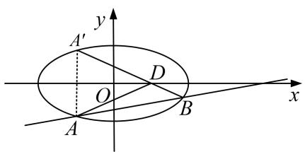

text_image

y
A'
D
O
x
A
B

[规范解答] (1)由椭圆的四个顶点围成的平行四边形的面积为 $4 \times \frac{1}{2} ab = 4\sqrt{3}$ , 得 $ab = 2\sqrt{3}$ .

延长 $F_{2}Q$ 交直线 $F_{1}P$ 于点 R，因为 $F_{2}Q$ 为 $\angle F_{1}PF_{2}$ 的外角平分线的垂线，

所以 $|PF_{2}|=|PR|$ ，Q为 $F_{2}R$ 的中点，所以 $|OQ|=\frac{|F_{1}R|}{2}=\frac{|F_{1}P|+|PR|}{2}=\frac{|F_{1}P|+|PF_{2}|}{2}=a$

所以 a=2， $b=\sqrt{3}$ ，所以椭圆 C 的方程为 $\frac{x^{2}}{4}+\frac{y^{2}}{3}=1$ .

(2)联立 $\left\{\begin{aligned}x&=my+4,\\ \frac{x^{2}}{4}&+\frac{y^{2}}{3}=1,\end{aligned}\right.$ 消去x，得 $(3m^{2}+4)y^{2}+24my+36=0,$

所以 $\Delta=(24m)^{2}-4\times36\times(3m^{2}+4)=144(m^{2}-4)>0$ ，即 $m^{2}>4$ .

设 $A(x_{1}, y_{1})$ ， $B(x_{2}, y_{2})$ ，则 $A'(x_{1}, -y_{1})$ ，由根与系数的关系，得 $y_{1} + y_{2} = \frac{-24m}{3m^{2} + 4}$ ， $y_{1}y_{2} = \frac{36}{3m^{2} + 4}$

直线 $A'B$ 的斜率 $k=\frac{y_{2}-(-y_{1})}{x_{2}-x_{1}}=\frac{y_{2}+y_{1}}{x_{2}-x_{1}}$ ，所以直线 $A'B$ 的方程为 $y+y_{1}=\frac{y_{1}+y_{2}}{x_{2}-x_{1}}(x-x_{1})$ ,

令 y=0，得 $x_{D}=\frac{x_{1}y_{2}+x_{2}y_{1}}{y_{1}+y_{2}}=\frac{(my_{1}+4)y_{2}+y_{1}(my_{2}+4)}{y_{1}+y_{2}}=\frac{2my_{1}y_{2}}{y_{1}+y_{2}}+4,$

故 $x_{D} = 1$ ，所以点 $D$ 到直线 $l$ 的距离 $d = \frac{3}{\sqrt{1 + m^2}}$

所以 $S_{\triangle ADB}=\frac{1}{2}|AB|\cdot d=\frac{3}{2}\sqrt{(y_{1}+y_{2})^{2}-4y_{1}y_{2}}=18\cdot\frac{\sqrt{m^{2}-4}}{3m^{2}+4}$ . 令 $t=\sqrt{m^{2}-4}(t>0)$ ,

则 $S_{\triangle ADB}=18\cdot\frac{t}{3t^{2}+16}=\frac{18}{3t+\frac{16}{t}}\leq\frac{18}{2\sqrt{3\times16}}=\frac{3\sqrt{3}}{4}$ ,

当且仅当 $3t=\frac{16}{t}$ ，即 $t^{2}=\frac{16}{3}=m^{2}-4$ ，即 $m^{2}=\frac{28}{3}>4$ ， $m=\pm\frac{2\sqrt{21}}{3}$ 时， $\triangle ADB$ 的面积最大，

所以直线 l 的方程为 $3x + 2\sqrt{21}y - 12 = 0$ 或 $3x - 2\sqrt{21}y - 12 = 0$ .

[例 3] 已知抛物线 C: $x^{2}=2py(p>0)$ 和定点 M(0, 1)，设过点 M 的动直线交抛物线 C 于 A，B 两点，抛物线 C 在 A，B 处的切线的交点为 N.

(1)若 N 在以 AB 为直径的圆上，求 p 的值；  
(2)若 $\triangle ABN$ 的面积的最小值为4，求抛物线C的方程.

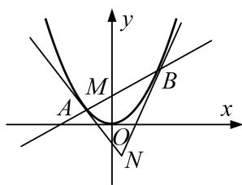

text_image

y
M
A
O
N
B
x

[规范解答] 设直线 AB: $y=kx+1$ , $A(x_{1}, y_{1})$ , $B(x_{2}, y_{2})$ ,

将直线 AB 的方程代入抛物线 C 的方程得 $x^{2}-2pkx-2p=0$ ，则 $x_{1}+x_{2}=2pk,\quad x_{1}x_{2}=-2p.$ ①

(1)由 $x^{2}=2py$ 得 $y'=\frac{x}{p}$ ，则 A，B 处的切线斜率的乘积为 $\frac{x_{1}x_{2}}{p^{2}}=-\frac{2}{p}$ ,

∵点 N 在以 AB 为直径的圆上，∴ $AN \perp BN$ ，∴ $-\frac{2}{p} = -1$ ，∴ p = 2.

(2)易得直线 AN: $y-y_{1}=\frac{x_{1}}{p}(x-x_{1})$ ，直线 BN: $y-y_{2}=\frac{x_{2}}{p}(x-x_{2})$ ,

联立 $\left\{ \begin{array}{l} y - y_{1} = \frac{x_{1}}{p} (x - x_{1}), \\ y - y_{2} = \frac{x_{2}}{p} (x - x_{2}), \end{array} \right.$ 结合①式，解得 $\left\{ \begin{array}{l} x = pk, \\ y = -1, \end{array} \right.$ 即 $N(pk, -1)$ .

所以 $|AB|=\sqrt{1+k^{2}}|x_{2}-x_{1}|=\sqrt{1+k^{2}}\cdot\sqrt{(x_{1}+x_{2})^{2}-4x_{1}x_{2}}=\sqrt{1+k^{2}}\cdot\sqrt{4p^{2}k^{2}+8p}$

点 N 到直线 AB 的距离 $d=\frac{|pk^{2}+2|}{\sqrt{1+k^{2}}}$ ,

则 $S_{\triangle ABN}=\frac{1}{2}\cdot|AB|\cdot d=\sqrt{p(pk^{2}+2)^{3}}\geq2\sqrt{2p}$ ，当 k=0 时，取等号，

∵△ABN 的面积的最小值为 4，∴ $2\sqrt{2p}=4$ ，∴p=2，故抛物线 C 的方程为 $x^{2}=4y$ .

[例 4] (如图, 设椭圆 $C: \frac{x^{2}}{a^{2}} + \frac{y^{2}}{b^{2}} = 1 (a > b > 0)$ , 左、右焦点为 $F_{1}, F_{2}$ , 上顶点为 D, 离心率为 $\frac{\sqrt{6}}{3}$ , 且 $\overrightarrow{DF_{1}} \cdot \overrightarrow{DF_{2}} = -2$ .

(1)求椭圆 C 的方程;

(2)设 E 是 x 轴正半轴上的一点，过点 E 任作直线 l 与 C 相交于 A，B 两点，如果 $\frac{1}{|EA|^{2}} + \frac{1}{|EB|^{2}}$ 是定值，试确定点 E 的位置，并求 $S_{\triangle DAE} \cdot S_{\triangle DBE}$ 的最大值.

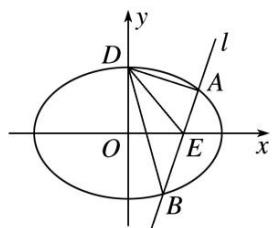

text_image

y
D
l
A
O
E
x
B

[规范解答] (1)由题意知， $D(0, b)$ ， $F_{1}(-c, 0)$ ， $F_{2}(c, 0)$ ，由 $e=\frac{\sqrt{6}}{3}$ ，得 $\frac{c}{a}=\frac{\sqrt{6}}{3}$ ，由 $\overrightarrow{DF}_{1}\cdot\overrightarrow{DF}_{2}=-2$ ，得 $-c^{2}+b^{2}=-2$ ，又 $a^{2}=b^{2}+c^{2}$ ，∴ $a=\sqrt{6}$ ， $b=\sqrt{2}$ ，c=2。∴椭圆 C 的方程为 $\frac{x^{2}}{6}+\frac{y^{2}}{2}=1$ 。

(2)当 l 的斜率不为 0 时，设 AB 的方程为 $x=ty+m$ ，由 $\left\{\begin{aligned}x^{2}+3y^{2}=6,\\ x=ty+m,\end{aligned}\right.$ 消去 x，得

$$
\therefore (t ^ {2} + 3) y ^ {2} + 2 t m y + m ^ {2} - 6 = 0, \Delta = 4 t ^ {2} m ^ {2} - 4 (m ^ {2} - 6) (t ^ {2} + 3) = 4 (6 t ^ {2} + 1 8 - 3 m ^ {2}).
$$

设 $A(x_{1}, y_{1})$ , $B(x_{2}, y_{2})$ , $\therefore y_{1} + y_{2} = -\frac{2tm}{t^{2} + 3}$ , $y_{1}y_{2} = \frac{m^{2} - 6}{t^{2} + 3}$ ,

$$
\therefore \frac {1}{| E A | ^ {2}} + \frac {1}{| E B | ^ {2}} = \frac {1}{1 + t ^ {2}} \left(\frac {1}{y _ {1} ^ {2}} + \frac {1}{y _ {2} ^ {2}}\right) = \frac {1}{1 + t ^ {2}}. \frac {(y _ {1} + y _ {2}) ^ {2} - 2 y _ {1} y _ {2}}{(y _ {1} y _ {2}) ^ {2}} = \frac {(2 m ^ {2} + 1 2) t ^ {2} - 6 (m ^ {2} - 6)}{(m ^ {2} - 6) ^ {2} (1 + t ^ {2})},
$$

∴ $m=\sqrt{3}$ ，它满足 $\Delta>0$ ，∴ $E(\sqrt{3},0)$ ， $\frac{1}{|EA|^{2}}+\frac{1}{|EB|^{2}}$ 为定值 2.

当 $E$ 为 $(\sqrt{3}, 0)$ , $l: y = 0$ 时, 满足 $\frac{1}{|EA|^2} + \frac{1}{|EB|^2} = 2$ ,

此时 $S_{\triangle DAE} \cdot S_{\triangle DBE} = \frac{1}{2} \times \sqrt{2} \times (\sqrt{6} - \sqrt{3}) \times \frac{1}{2} \times \sqrt{2} \times (\sqrt{6} + \sqrt{3}) = \frac{3}{2}$ .

当 l 的斜率不为 0 时， $y_{1} + y_{2} = -\frac{2\sqrt{3}t}{t^{2} + 3}$ ， $y_{1}y_{2} = -\frac{3}{t^{2} + 3}$

由 $D$ 到 $AB$ 的距离 $d = \frac{|\sqrt{2}t + \sqrt{3}|}{\sqrt{1 + t^2}}$ , $|AE| = \sqrt{1 + t^2}|y_1|$ , $|BE| = \sqrt{1 + t^2}|y_2|$ ,

得 $S_{\triangle DAE} \cdot S_{\triangle DBE} = \frac{1}{2} d \cdot |AE| \cdot \left(\frac{1}{2} \cdot d \cdot |BE|\right) = \frac{3(\sqrt{2} t + \sqrt{3})^2}{4(t^2 + 3)}.$

令 $u = \sqrt{2} t + \sqrt{3}$ ，则 $t = \frac{u - \sqrt{3}}{\sqrt{2}}$ ，则 $S_{\triangle DAE} \cdot S_{\triangle DBE} = \frac{3}{2} \times \frac{u^2}{u^2 - 2\sqrt{3}u + 9} = \frac{3}{2\left(\frac{9}{u^2} - \frac{2\sqrt{3}}{u} + 1\right)} = \frac{3}{2\left[9\left(\frac{1}{u} - \frac{\sqrt{3}}{9}\right)_2 + \frac{2}{3}\right]} \leq \frac{9}{4},$ 当且仅当 $\frac{1}{u}=\frac{\sqrt{3}}{9}$ ，即 $u=3\sqrt{3}$ ， $t=\sqrt{6}$ 时，等号成立．故 $(S_{\triangle DAE}\cdot S_{\triangle DBE})_{\max}=\frac{9}{4}$

[例5] 已知直线 $l$ 经过抛物线 $C: x^2 = 4y$ 的焦点 $F$ , 且与抛物线 $C$ 交于 $A$ , $B$ 两点, 抛物线 $C$ 在 $A$ , $B$ 两点处的切线分别与 $x$ 轴交于点 $M$ , $N$ .

(1)求证： $AM \perp MF;$

(2)记 $\triangle AFM$ 和 $\triangle BFN$ 的面积分别为 $S_{1}$ 和 $S_{2}$ ，求 $S_{1} \cdot S_{2}$ 的最小值.

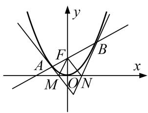

text_image

y
F
A
B
x
M
O
N

[规范解答] (1)证明：设 $A(x_{1}, y_{1})$ ， $B(x_{2}, y_{2})$ ，其中 $y_{1}=\frac{x_{1}^{2}}{4}$ ， $y_{2}=\frac{x_{2}^{2}}{4}$ .

由导数知识可知，抛物线 C 在点 A 处的切线 $l_{1}$ 的斜率 $k_{1}=\frac{x_{1}}{2}$ ,

则切线 $l_{1}$ 的方程为 $y-y_{1}=\frac{x_{1}}{2}(x-x_{1})$ ，令 y=0，可得 $M\left(\frac{x_{1}}{2},0\right)$ 。因为 $F(0,1)$ ，

所以直线 MF 的斜率 $k_{MF}=\frac{1-0}{0-\frac{x_{1}}{2}}=-\frac{2}{x_{1}}$ . 所以 $k_{1}\cdot k_{MF}=-1$ ，所以 $AM\perp MF$ .

(2)由(1)可知 $S_{1}=\frac{1}{2}|AM|\cdot|MF|$ ,

其中 $|AM|=\sqrt{\left(x_{1}-\frac{x_{1}}{2}\right)^{2}+y_{1}^{2}}=\sqrt{\frac{x_{1}^{2}}{4}+y_{1}^{2}}=\sqrt{y_{1}+y_{1}^{2}}=\sqrt{y_{1}}\cdot\sqrt{1+y_{1}},\quad|MF|=\sqrt{\left(\frac{x_{1}}{2}\right)^{2}+1}=\sqrt{y_{1}+1},$

所以 $S_{1} = \frac{1}{2} |AM|\cdot |MF| = \frac{1}{2} (y_{1} + 1)\sqrt{y_{1}}$ ，同理可得 $S_{2} = \frac{1}{2} (y_{2} + 1)\sqrt{y_{2}}.$

所以 $S_{1} \cdot S_{2} = \frac{1}{4}(y_{1} + 1)(y_{2} + 1) \sqrt{y_{1} y_{2}} = \frac{1}{4}(y_{1} y_{2} + y_{1} + y_{2} + 1) \sqrt{y_{1} y_{2}}.$

设直线 l 的方程为 $y=kx+1$ ，由方程组 $\left\{\begin{aligned}y&=kx+1,\\ x^{2}&=4y,\end{aligned}\right.$ 可得 $x^{2}-4kx-4=0$ ，

所以 $x_{1}x_{2}=-4$ ，所以 $y_{1}y_{2}=\frac{x_{1}x_{2}}{16}^{2}=1$ 。所以 $S_{1}\cdot S_{2}=\frac{1}{4}(y_{1}+y_{2}+2)\geq\frac{1}{4}(2\sqrt{y_{1}y_{2}}+2)=1$ ，

当且仅当 $y_{1}=y_{2}$ 时，等号成立．所以 $S_{1}\cdot S_{2}$ 的最小值为 1.

[例 6] (2019·浙江)如图，已知点 $F(1, 0)$ 为抛物线 $y^{2}=2px(p>0)$ 的焦点．过点 F 的直线交抛物线于 A, B 两点，点 C 在抛物线上，使得 $\triangle ABC$ 的重心 G 在 x 轴上，直线 AC 交 x 轴于点 Q，且 Q 在点 F 的右侧．记 $\triangle AFG$ ， $\triangle CQG$ 的面积分别为 $S_{1}$ ， $S_{2}$ .

(1)求 p 的值及抛物线的准线方程;  
(2)求 $\frac{S_{1}}{S_{2}}$ 的最小值及此时点G的坐标.

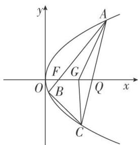

text_image

y
A
F G
O B Q x
C

[规范解答] (1)由题意得 $\frac{p}{2}=1$ ，即p=2．所以抛物线的准线方程为x=-1.

(2)设 $A(x_{A}, y_{A})$ ， $B(x_{B}, y_{B})$ ， $C(x_{C}, y_{C})$ ，重心 $G(x_{G}, y_{G})$ 。令 $y_{A}=2t,\quad t\neq0$ ，则 $x_{A}=t^{2}$ 。

由于直线 AB 过 F，故直线 AB 的方程为 $x=\frac{t^{2}-1}{2t}y+1$ ，

代入 $y^{2}=4x$ ，得 $y^{2}-\frac{2(t^{2}-1)}{t}y-4=0$ ，故 $2ty_{B}=-4$ ，即 $y_{B}=-\frac{2}{t}$ ，所以 $B\left(\frac{1}{t^{2}}, -\frac{2}{t}\right)$ .

又 $x_{G}=\frac{1}{3}(x_{A}+x_{B}+x_{C})$ ， $y_{G}=\frac{1}{3}(y_{A}+y_{B}+y_{C})$ 及重心 G 在 x 轴上，得 $2t-\frac{2}{t}+y_{C}=0$ ，

得 $C\left(\left(\frac{1}{t}-t\right)_{2},\quad2\left(\frac{1}{t}-t\right)\right)$ ， $G\left(\frac{2t^{4}-2t^{2}+2}{3t^{2}},\quad0\right)$ .

所以直线 AC 的方程为 $y-2t=2t(x-t^{2})$ ，得 $Q(t^{2}-1,0)$ .

由于 Q 在焦点 F 的右侧，故 $t^{2}>2$ 。从而

$$
\frac {S _ {1}}{S _ {2}} = \frac {\frac {1}{2} | F G | \cdot | y _ {A} |}{\frac {1}{2} | Q G | \cdot | y _ {C} |} = \frac {\left| \frac {2 t ^ {4} - 2 t ^ {2} + 2}{3 t ^ {2}} - 1 \right| \cdot | 2 t |}{\left| t ^ {2} - 1 - \frac {2 t ^ {4} - 2 t ^ {2} + 2}{3 t ^ {2}} \right| . \left| \frac {2}{t} - 2 t \right|} = \frac {2 t ^ {4} - t ^ {2}}{t ^ {4} - 1} = 2 - \frac {t ^ {2} - 2}{t ^ {4} - 1}.
$$

令 $m = t^2 - 2$ ，则 $m > 0$ ， $\frac{S_1}{S_2} = 2 - \frac{m}{m^2 + 4m + 3} = 2 - \frac{1}{m + \frac{3}{m} + 4} \geq 2 - \frac{1}{2\sqrt{m \cdot \frac{3}{m}} + 4} = 1 + \frac{\sqrt{3}}{2}$ .

当 $m=\sqrt{3}$ 时， $\frac{S_{1}}{S_{2}}$ 取得最小值 $1+\frac{\sqrt{3}}{2}$ ，此时 $G(2,0)$ .

# 【对点训练】

1. (2014·全国I)已知点 $A(0, -2)$ ，椭圆 $E: \frac{x^2}{a^2} + \frac{y^2}{b^2} = 1 (a > b > 0)$ 的离心率为 $\frac{\sqrt{3}}{2}$ ， $F$ 是椭圆 $E$ 的右焦点，直线 $AF$ 的斜率为 $\frac{2\sqrt{3}}{3}$ ， $O$ 为坐标原点.

(1)求 E 的方程;

(2)设过点 A 的动直线 l 与 E 相交于 P, Q 两点. 当 $\triangle OPQ$ 的面积最大时, 求 l 的方程.

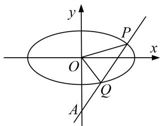

text_image

y
P
x
O
Q
A

1. 解析 (1) 设 $F(c,0)$ ，由条件知， $\frac{2}{c} = \frac{2\sqrt{3}}{3}$ ，得 $c = \sqrt{3}$ 。又 $\frac{c}{a} = \frac{\sqrt{3}}{2}$ ，所以 $a = 2$ ， $b^2 = a^2 - c^2 = 1$ 。

故 E 的方程为 $\frac{x^{2}}{4} + y^{2} = 1$ .

(2)当 $l \perp x$ 轴时不合题意，故设 l: y = kx - 2, $P(x_{1}, y_{1})$ , $Q(x_{2}, y_{2})$ .

将 y=kx-2 代入 $\frac{x^{2}}{4}+y^{2}=1$ ，得 $(1+4k^{2})x^{2}-16kx+12=0$ .

当 $\Delta=16(4k^{2}-3)>0$ ，即 $k^{2}>\frac{3}{4}$ 时， $x_{1,2}=\frac{8k\pm2\sqrt{4k^{2}-3}}{4k^{2}+1}$ .

从而 $|PQ|=\sqrt{k^{2}+1}|x_{1}-x_{2}|=\frac{4\sqrt{k^{2}+1}\cdot\sqrt{4k^{2}-3}}{4k^{2}+1}.$

又点 O 到直线 PQ 的距离 $d=\frac{2}{\sqrt{k^{2}+1}}$ ，所以 $\triangle OPQ$ 的面积 $S_{\triangle OPQ}=\frac{1}{2}d\cdot|PQ|=\frac{4\sqrt{4k^{2}-3}}{4k^{2}+1}$ .

设 $\sqrt{4k^{2}-3}=t$ ，则 t>0， $S_{\triangle OPQ}=\frac{4t}{t^{2}+4}=\frac{4}{t+\frac{4}{t}}.$

因为 $t+\frac{4}{t}\geq4$ ，当且仅当 t=2，即 $k=\pm\frac{\sqrt{7}}{2}$ 时等号成立，且满足 $\Delta>0$ .

所以，当 $\triangle OPQ$ 的面积最大时，l的方程为 $y=\frac{\sqrt{7}}{2}x-2$ 或 $y=-\frac{\sqrt{7}}{2}x-2$ .

2. 若椭圆 $\frac{x^2}{a^2} + \frac{y^2}{b^2} = 1 (a > b > 0)$ 的左、右焦点分别为 $F_1, F_2$ ，线段 $F_1F_2$ 被抛物线 $y^2 = 2bx$ 的焦点 $F$ 分成了 3:1 的两段.

(1)求椭圆的离心率;

(2)过点 $C(-1, 0)$ 的直线 $l$ 交椭圆于不同两点 $A, B$ , 且 $\overrightarrow{AC} = 2\overrightarrow{CB}$ , 当 $\triangle AOB$ 的面积最大时, 求直线 $l$ 的方程.

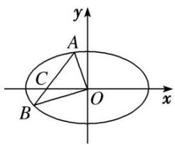

text_image

y
A
C
O
x
B

2. 解析 (1)由题意知， $c+\frac{b}{2}=3\left(c-\frac{b}{2}\right)$ ，所以 b=c， $a^{2}=2b^{2}$ ，所以 $e=\frac{c}{a}=\sqrt{1-\left(\frac{b}{a}\right)^{2}}=\frac{\sqrt{2}}{2}$ .

(2)设 $A(x_{1}, y_{1})$ ， $B(x_{2}, y_{2})$ ，直线 AB 的方程为 $x = ky - 1 (k \neq 0)$ ，

因为 $\overrightarrow{AC}=2\overrightarrow{CB}$ ，所以 $(-1-x_{1},-y_{1})=2(x_{2}+1,y_{2})$ ，即 $y_{1}=-2y_{2}$ ，①

由(1)知，椭圆方程为 $x^{2}+2y^{2}=2b^{2}$ . 由 $\left\{\begin{aligned}x&=ky-1,\\ x^{2}&+2y^{2}=2b^{2}\end{aligned}\right.$ 消去 x,

得 $(k^{2}+2)y^{2}-2ky+1-2b^{2}=0$ ，所以 $y_{1}+y_{2}=\frac{2k}{k^{2}+2}$ ，②

由①②知， $y_{2}=-\frac{2k}{k^{2}+2}$ ， $y_{1}=\frac{4k}{k^{2}+2}$ ，因为 $S_{\triangle AOB}=\frac{1}{2}|y_{1}|+\frac{1}{2}|y_{2}|$

所以 $S_{\triangle AOB}=3\cdot\frac{|k|}{k^{2}+2}=3\cdot\frac{1}{\frac{2}{|k|}+|k|}\leq3\cdot\frac{1}{2\sqrt{\frac{2}{|k|}\cdot|k|}}=\frac{3\sqrt{2}}{4}$ ，当且仅当 $|k|^{2}=2$ ，即 $k=\pm\sqrt{2}$ 时取等号，

此时直线 l 的方程为 $x - \sqrt{2}y + 1 = 0$ 或 $x + \sqrt{2}y + 1 = 0$ .

3. 已知椭圆 $C: \frac{x^2}{a^2} + \frac{y^2}{b^2} = 1 (a > b > 0)$ 的离心率为 $\frac{\sqrt{6}}{3}$ ，且过点 $\left(1, \frac{\sqrt{6}}{3}\right)$ .

(1)求椭圆 C 的方程;

(2)设与圆 $O: x^{2} + y^{2} = \frac{3}{4}$ 相切的直线 $l$ 交椭圆 $C$ 与 $A, B$ 两点，求 $\triangle OAB$ 面积的最大值，及取得最大值时直线 $l$ 的方程.

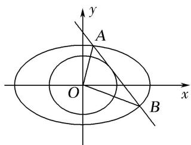

text_image

y
A
O
x
B

3. 解析 (1)由题意可得 $\left\{ \begin{array}{l} \frac{1}{a^2} + \frac{2}{3b^2} = 1, \\ \frac{c}{a} = \frac{\sqrt{6}}{3}, \\ a^2 = b^2 + c^2, \end{array} \right.$ 解得 $a^2 = 3, b^2 = 1, \therefore \frac{x^2}{3} + y^2 = 1$ .

(2)①当 $k$ 不存在时，直线为 $x = \pm \frac{\sqrt{3}}{2}$ ，代入 $\frac{x^2}{3} + y^2 = 1$ ，得 $y = \pm \frac{\sqrt{3}}{2}$ ， $\therefore S_{\triangle OAB} = \frac{1}{2} \times \sqrt{3} \times \frac{\sqrt{3}}{2} = \frac{3}{4}$ ;

②当 k 存在时，设直线为 $y=kx+m$ ， $A(x_{1},y_{1})$ ， $B(x_{2},y_{2})$ ，

联立方程得 $\left\{\begin{aligned}\frac{x^{2}}{3}+y^{2}=1,\\ y=kx+m,\end{aligned}\right.$ 消 y 得 $(1+3k^{2})x^{2}+6kmx+3m^{2}-3=0,\quad\therefore x_{1}+x_{2}=\frac{-6km}{1+3k^{2}},\quad x_{1}x_{2}=\frac{3m^{2}-3}{1+3k^{2}},$

直线 l 与圆 O 相切 d=r $4m^{2}=3(1+k^{2})$ ,

$$
\therefore | A B | = \sqrt {1 + k ^ {2}} \sqrt {\left(\frac {- 6 k m}{1 + 3 k ^ {2}}\right) ^ {2} - \frac {1 2 (m ^ {2} - 1)}{1 + 3 k ^ {2}}} = \sqrt {3} \sqrt {\frac {1 + 1 0 k ^ {2} + 9 k ^ {4}}{1 + 6 k ^ {2} + 9 k ^ {4}}} = \sqrt {3} \sqrt {1 + \frac {4 k ^ {2}}{1 + 6 k ^ {2} + 9 k ^ {4}}}
$$

$$
= \sqrt {3} \times \sqrt {1 + \frac {4}{\frac {1}{k ^ {2}} + 9 k ^ {2} + 6}} \leq 2. \text {当且仅当} \frac {1}{k ^ {2}} = 9 k ^ {2}, \text {即} k = \pm \frac {\sqrt {3}}{3} \text {时等号成立，}
$$

$$
\therefore S _ {\triangle O A B} = \frac {1}{2} | A B | \times r \leq \frac {1}{2} \times 2 \times \frac {\sqrt {3}}{2} = \frac {\sqrt {3}}{2}, \quad \therefore \triangle O A B \text {   面积的最大值为   } \frac {\sqrt {3}}{2},
$$

$$
\therefore m = \pm \sqrt {\frac {3}{4} \left(1 + \frac {1}{3}\right)} = \pm 1, \text {   此时直线方程为   } y = \pm \frac {\sqrt {3}}{3} x \pm 1.
$$

4. 已知椭圆 $M: \frac{x^2}{a^2} + \frac{y^2}{3} = 1 (a > 0)$ 的一个焦点为 $F(-1, 0)$ ，左、右顶点分别为 $A$ ， $B$ 。经过点 $F$ 的直线 $l$ 与椭圆 $M$ 交于 $C$ ， $D$ 两点。

(1)当直线 l 的倾斜角为 $45^{\circ}$ 时，求线段 CD 的长；

(2)记 $\triangle ABD$ 与 $\triangle ABC$ 的面积分别为 $S_{1}$ 和 $S_{2}$ ，求 $|S_{1}-S_{2}|$ 的最大值.

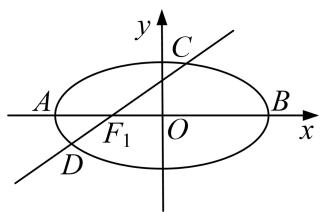

text_image

y
C
A
F₁ O B x
D

4. 解析 (1)由题意, $c = 1$ , $b^{2} = 3$ , 所以 $a^{2} = 4$ , 所以椭圆 $M$ 的方程为 $\frac{x^2}{4} + \frac{y^2}{3} = 1$ ,

易求直线方程为 $y=x+1$ ，联立方程，得 $\left\{\begin{aligned}\frac{x^{2}}{4}+\frac{y^{2}}{3}&=1,\\ y=x+1,\end{aligned}\right.$ 消去 y，得 $7x^{2}+8x-8=0$ ，

设 $C(x_{1}, y_{1})$ , $D(x_{2}, y_{2})$ , $\Delta=288$ , $x_{1}+x_{2}=-\frac{8}{7}$ , $x_{1}x_{2}=-\frac{8}{7}$ ,

所以 $|CD|=\sqrt{2}|x_{1}-x_{2}|=\sqrt{2}\sqrt{(x_{1}+x_{2})^{2}-4x_{1}x_{2}}=\frac{24}{7}.$

(2)当直线 l 的斜率不存在时，直线方程为 x = -1，此时 $\triangle ABD$ 与 $\triangle ABC$ 面积相等， $|S_{1} - S_{2}| = 0$ ;

当直线 l 的斜率存在时，设直线方程为 $y=k(x+1)(k\neq0)$ ，联立方程，得 $\left\{\begin{aligned}\frac{x^{2}}{4}+\frac{y^{2}}{3}&=1,\\ y=k(x+1),\end{aligned}\right.$

消去 y，得 $(3+4k^{2})x^{2}+8k^{2}x+4k^{2}-12=0$ ， $\Delta>0$ ，且 $x_{1}+x_{2}=-\frac{8k^{2}}{3+4k^{2}}$ ， $x_{1}x_{2}=\frac{4k^{2}-12}{3+4k^{2}}$

此时 $|S_{1}-S_{2}|=2||y_{2}|-|y_{1}||=2|y_{2}+y_{1}|=2|k(x_{2}+1)+k(x_{1}+1)|=2|k(x_{2}+x_{1})+2k|=\frac{12|k|}{3+4k^{2}}$

因为 $k \neq 0$ ，上式 $= \frac{12}{\frac{3}{|k|} + 4|k|} \leq \frac{12}{2\sqrt{\frac{3}{|k|} \cdot 4|k|}} = \frac{12}{2\sqrt{12}} = \sqrt{3}$ 当且仅当 $k = \pm \frac{\sqrt{3}}{2}$ 时等号成立，

所以 $|S_{1}-S_{2}|$ 的最大值为 $\sqrt{3}$ .

5. 已知离心率为 $\frac{\sqrt{3}}{2}$ 的椭圆 $C: \frac{x^2}{a^2} + \frac{y^2}{b^2} = 1 (a > b > 0)$ 过点 $P\left(1, \frac{\sqrt{3}}{2}\right)$ ，与坐标轴不平行的直线 $l$ 与椭圆 $C$ 交于

A, B 两点，其中 M 为 A 关于 y 轴的对称点， $N(0, \sqrt{2})$ ，O 为坐标原点.

(1)求椭圆 C 的方程;  
(2)分别记 $\triangle PAO$ ， $\triangle PBO$ 的面积为 $S_{1}$ ， $S_{2}$ ，当M，N，B三点共线时，求 $S_{1}\cdot S_{2}$ 的最大值.

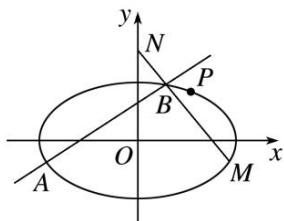

text_image

y
N
P
B
O
x
A
M

5. 解析 (1) $\because \frac{c}{a} = \frac{\sqrt{3}}{2}, a^2 = b^2 + c^2, \therefore a = 2b$ ，把点 $P\left(1, \frac{\sqrt{3}}{2}\right)$ 代入椭圆方程可得 $\frac{1}{a^2} + \frac{3}{4b^2} = 1$

解得 a=2, b=1, ∴椭圆方程为 $\frac{x^{2}}{4}+y^{2}=1$ .

(2)设点 A 坐标为 $(x_{1}, y_{1})$ ，点 B 坐标为 $(x_{2}, y_{2})$ ，则 M 为 $(-x_{1}, y_{1})$ ,

设直线 l 的方程为 $y=kx+b$ ，联立椭圆方程可得 $(4k^{2}+1)x^{2}+8kbx+4b^{2}-4=0$ ，

$\therefore x_{1}+x_{2}=\frac{-8kb}{4k^{2}+1},\quad x_{1}x_{2}=\frac{4b^{2}-4}{4k^{2}+1},\quad\Delta>0,\quad\because M,N,B$ 三点共线，

∴ $k_{MN}=k_{BN}$ ，即 $\frac{y_{1}-\sqrt{2}}{x_{1}}+\frac{y_{2}-\sqrt{2}}{x_{2}}=0$ ，化简得 $8k(1-\sqrt{2}b)=0$ ，解得 $b=\frac{\sqrt{2}}{2}$ 或 k=0（舍去）.

设 A, B 两点到直线 OP 的距离分别为 $d_{1}$ , $d_{2}$ ，直线 OP 的方程为 $\sqrt{3}x - 2y = 0$ , $|OP| = \frac{\sqrt{7}}{2}$ ,

$\therefore S_{1} \cdot S_{2} = \frac{1}{16} |(\sqrt{3} x_{1} - 2y_{1})(\sqrt{3} x_{2} - 2y_{2})|$ ，化简可得

$$
S _ {1} \cdot S _ {2} = \frac {1}{1 6} | (2 k - \sqrt {3}) ^ {2} x _ {1} x _ {2} + \sqrt {2} (2 k - \sqrt {3}) (x _ {1} + x _ {2}) + 2 | = \left| - \frac {1}{4} + \frac {\sqrt {3} k}{4 k ^ {2} + 1} \right|.
$$

又 $\frac{\sqrt{3}k}{4k^2 + 1}\in \left[-\frac{\sqrt{3}}{4},0\right)\cup \left[0,\frac{\sqrt{3}}{4}\right],$ $\therefore$ 当 $k = -\frac{1}{2}$ 时， $S_{1}\cdot S_{2}$ 的最大值为 $\frac{\sqrt{3} + 1}{4}$

6. 已知焦点为 $F$ 的抛物线 $C_{1}: x^{2} = 2py (p > 0)$ , 圆 $C_{2}: x^{2} + y^{2} = 1$ , 直线 $l$ 与抛物线相切于点 $P$ , 与圆相切于点 $Q$ .

(1)当直线 l 的方程为 $x-y-\sqrt{2}=0$ 时，求抛物线 $C_{1}$ 的方程；  
(2)记 $S_{1}$ ， $S_{2}$ 分别为 $\triangle FPQ$ ， $\triangle FOQ$ 的面积，求 $\frac{S_{1}}{S_{2}}$ 的最小值.

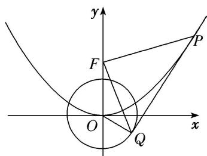

text_image

y
F
P
O
x
Q

6. 解析 (1)设点 $P\left(x_0, \frac{x_0^2}{2p}\right)$ ，由 $x^2 = 2py (p > 0)$ 得， $y = \frac{x^2}{2p}$ ，求得 $y' = \frac{x}{p}$ ，因为直线 $PQ$ 的斜率为 1，所以 $\frac{x_0}{p} = 1$ 且 $x_0 - \frac{x_0^2}{2p} - \sqrt{2} = 0$ ，解得 $p = 2\sqrt{2}$ 。所以抛物线 $C_1$ 的方程为 $x^2 = 4\sqrt{2} y$ 。

(2)点 P 处的切线方程为 $y-\frac{x_{0}^{2}}{2p}=\frac{x_{0}}{p}(x-x_{0})$ ，即 $2x_{0}x-2py-x_{0}^{2}=0$ ，OQ 的方程为 $y=-\frac{p}{x_{0}}x$ 。根据切线与圆相切，得 $\frac{|-x_{0}^{2}|}{\sqrt{4x_{0}^{2}+4p^{2}}}=1$ ，化简得 $x_{0}^{4}=4x_{0}^{2}+4p^{2}$ ，由方程组 $\left\{\begin{aligned}&2x_{0}x-2py-x_{0}^{2}=0,\\ &y=-\frac{p}{x_{0}}x,\end{aligned}\right.$

解得 $Q\left(\frac{2}{x_{0}}, \frac{4-x_{0}^{2}}{2p}\right)$ . 所以 $|PQ|=\sqrt{1+k^{2}}|x_{P}-x_{Q}|=\sqrt{1+\frac{x_{0}^{2}}{p^{2}}}\left|x_{0}-\frac{2}{x_{0}}\right|=\frac{\sqrt{p^{2}+x_{0}^{2}}}{p}\cdot\left|\frac{x_{0}^{2}-2}{x_{0}}\right|$ ,
又点 $F\left(0,\frac{p}{2}\right)$ 到切线 PQ 的距离 $d_{1}=\frac{|-p^{2}-x_{0}^{2}|}{\sqrt{4x_{0}^{2}+4p^{2}}}=\frac{1}{2}\sqrt{x_{0}^{2}+p^{2}}$

所以 $S_{1} = \frac{1}{2}|PQ|d_{1} = \frac{1}{2}\cdot \frac{\sqrt{p^{2} + x_{0}^{2}}}{p}\cdot \left|\frac{x_{0}^{2} - 2}{x_{0}}\right|.\frac{1}{2}\sqrt{x_{0}^{2} + p^{2}} = \frac{x_{0}^{2} + p^{2}}{4p}\left|\frac{x_{0}^{2} - 2}{x_{0}}\right|$

$S_{2}=\frac{1}{2}|OF|x_{Q}|=\frac{p}{2|x_{0}|}$ ，而由 $x_{0}^{4}=4x_{0}^{2}+4p^{2}$ 知， $4p^{2}=x_{0}^{4}-4x_{0}^{2}>0$ ，得 $|x_{0}|>2$ ，

所以 $\frac{S_1}{S_2} = \frac{x_0^2 + p^2}{4p}\left|\frac{x_0^2 - 2}{x_0}\right|. \frac{2|x_0|}{p} = \frac{x_0^2 + p^2}{2p^2} = \frac{4x_0^2 + x_0^4 - 4x_0^2}{2} \frac{x_0^2 - 2}{x_0^4 - 4x_0^2}$ $= \frac{x_0^2}{2} \frac{x_0^2 - 2}{x_0^2 - 4} = \frac{x_0^2 - 4}{2} + \frac{4}{x_0^2 - 4} + 3 \geq 2\sqrt{2} + 3$ ，当且仅当 $\frac{x_0^2 - 4}{2} = \frac{4}{x_0^2 - 4}$ 时取等号，

即 $x_0^2 = 4 + 2\sqrt{2}$ 时取等号，此时 $p = \sqrt{2 + 2\sqrt{2}}$ 。所以 $\frac{S_1}{S_2}$ 的最小值为 $2\sqrt{2} + 3$ 。

