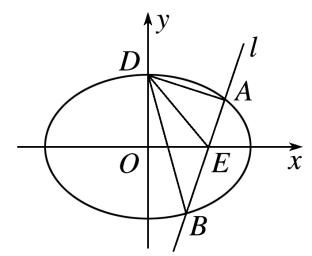
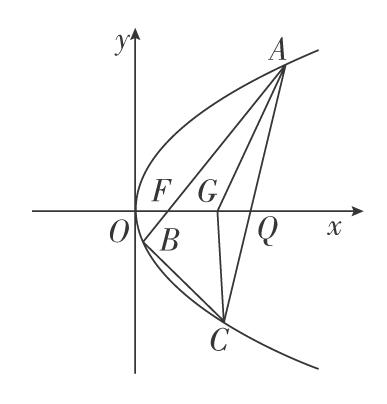
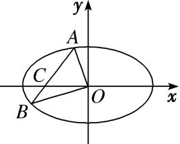
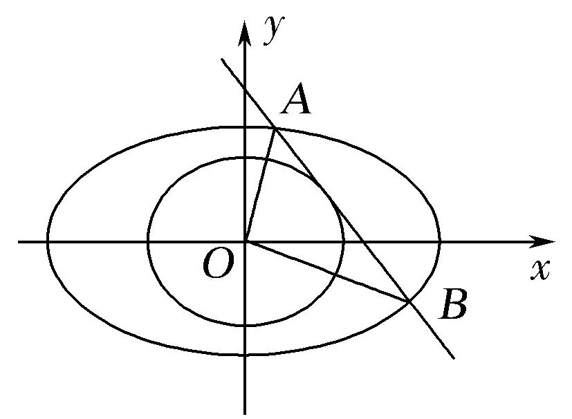
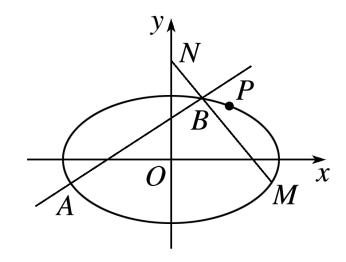
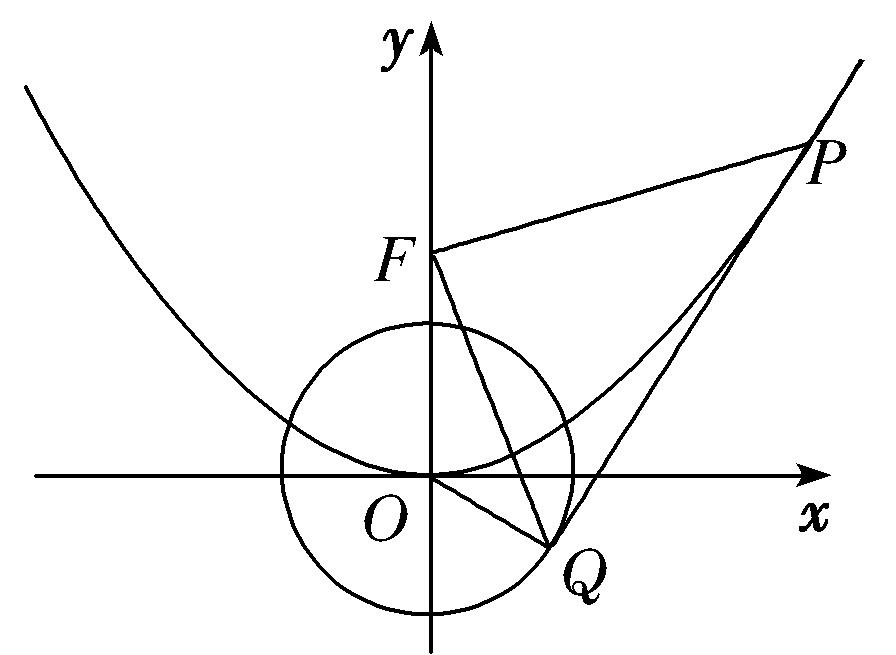

**专题28　三角形面积型最值逆向与三角形面积运算型最值问题**

**最值问题——构造函数**

最值问题的基本解法有几何法和代数法：几何法是根据已知的几何量之间的相互关系、平面几何和解析几何知识加以解决的(如抛物线上的点到某个定点和焦点的距离之和、光线反射问题等)；代数法是建立求解目标关于某个或两个变量的函数，通过求解函数的最值普通方法、基本不等式方法、导数方法等解决的．

**【例题选讲】**

<strong>[例1]</strong>　定圆<em>M</em>：(<em>x</em>＋)2＋<em>y</em>2＝16，动圆<em>N</em>过点<em>F</em>(，0)且与圆<em>M</em>相切，记圆心<em>N</em>的轨迹为<em>E</em>．

(1)求轨迹*E*的方程；

(2)设点*A*，*B*，*C*在*E*上运动，*A*与*B*关于原点对称，且|*AC*|＝|*BC*|，当△*ABC*的面积最小时，求直线*AB*的方程．

<strong>[规范解答]</strong>　(1)∵<em>F</em>(，0)在圆<em>M</em>：(<em>x</em>＋)2＋<em>y</em>2＝16内，∴圆<em>N</em>内切于圆<em>M</em>．

∵|*NM*|＋|*NF*|＝4>|*FM*|，∴点*N*的轨迹*E*为椭圆，且2*a*＝4，*c*＝，∴*b*＝1，

∴轨迹<em>E</em>的方程为＋<em>y</em>2＝1．

(2)①当<em>AB</em>为长轴(或短轴)时，<em>S</em>△<em>ABC</em>＝|<em>OC</em>|·|<em>AB</em>|＝2．

②当直线<em>AB</em>的斜率存在且不为0时，设直线<em>AB</em>的方程为<em>y</em>＝<em>kx</em>，<em>A</em>(<em>xA</em>，<em>yA</em>)，

由题意，*C*在线段*AB*的中垂线上，则*OC*的方程为*y*＝－*x*．

联立方程得，<em>x</em>＝，<em>y</em>＝，∴|<em>OA</em>|2＝<em>x</em>＋<em>y</em>＝．

将上式中的<em>k</em>替换为－，可得|<em>OC</em>|2＝．

∴<em>S</em>△<em>ABC</em>＝2<em>S</em>△<em>AOC</em>＝|<em>OA</em>|·|<em>OC</em>|＝·＝．

∵≤＝，

∴<em>S</em>△<em>ABC</em>≥，当且仅当1＋4<em>k</em>2＝<em>k</em>2＋4，即<em>k</em>＝±1时等号成立，此时△<em>ABC</em>面积的最小值是．∵2&gt;，

∴△*ABC*面积的最小值是，此时直线*AB*的方程为*y*＝*x*或*y*＝－*x*．

<strong>[例2]</strong>　已知椭圆<em>C</em>：＋＝1(<em>a</em>&gt;<em>b</em>&gt;0)的左、右焦点分别为<em>F</em>1，<em>F</em>2，<em>P</em>在椭圆上(异于椭圆<em>C</em>的左、右顶点)，过右焦点<em>F</em>2作∠<em>F</em>1<em>PF</em>2的外角平分线<em>L</em>的垂线<em>F</em>2<em>Q</em>，交<em>L</em>于点<em>Q</em>，且|<em>OQ</em>|＝2(<em>O</em>为坐标原点)，椭圆的四个顶点围成的平行四边形的面积为4．

(1)求椭圆*C*的方程；

(2)若直线<em>l</em>：<em>x</em>＝<em>my</em>＋4(<em>m</em>∈<strong>R</strong>)与椭圆<em>C</em>交于<em>A</em>，<em>B</em>两点，点<em>A</em>关于<em>x</em>轴的对称点为<em>A</em>′，直线<em>A</em>′<em>B</em>交<em>x</em>轴于点<em>D</em>，求当△<em>ADB</em>的面积最大时，直线<em>l</em>的方程．

<strong>[规范解答]</strong>　(1)由椭圆的四个顶点围成的平行四边形的面积为4×<em>ab</em>＝4，得<em>ab</em>＝2．

延长<em>F</em>2<em>Q</em>交直线<em>F</em>1<em>P</em>于点<em>R</em>，因为<em>F</em>2<em>Q</em>为∠<em>F</em>1<em>PF</em>2的外角平分线的垂线，

所以|<em>PF</em>2|＝|<em>PR</em>|，<em>Q</em>为<em>F</em>2<em>R</em>的中点，所以|<em>OQ</em>|＝＝＝＝<em>a</em>，

所以*a*＝2，*b*＝，所以椭圆*C*的方程为＋＝1．

(2)联立消去<em>x</em>，得(3<em>m</em>2＋4)<em>y</em>2＋24<em>my</em>＋36＝0，

所以<em>Δ</em>＝(24<em>m</em>)2－4×36×(3<em>m</em>2＋4)＝144(<em>m</em>2－4)&gt;0，即<em>m</em>2&gt;4．

设<em>A</em>(<em>x</em>1，<em>y</em>1)，<em>B</em>(<em>x</em>2，<em>y</em>2)，则<em>A</em>′(<em>x</em>1，－<em>y</em>1)，由根与系数的关系，得<em>y</em>1＋<em>y</em>2＝，<em>y</em>1<em>y</em>2＝，

直线<em>A</em>′<em>B</em>的斜率<em>k</em>＝＝，所以直线<em>A</em>′<em>B</em>的方程为<em>y</em>＋<em>y</em>1＝(<em>x</em>－<em>x</em>1)，

令<em>y</em>＝0，得<em>xD</em>＝＝＝＋4，

故<em>xD</em>＝1，所以点<em>D</em>到直线<em>l</em>的距离<em>d</em>＝，

所以<em>S</em>△<em>ADB</em>＝|<em>AB</em>|·<em>d</em>＝＝18·．令<em>t</em>＝(<em>t</em>&gt;0)，

则<em>S</em>△<em>ADB</em>＝18·＝≤＝，

当且仅当3<em>t</em>＝，即<em>t</em>2＝＝<em>m</em>2－4，即<em>m</em>2＝&gt;4，<em>m</em>＝±时，△<em>ADB</em>的面积最大，

所以直线*l*的方程为3*x*＋2*y*－12＝0或3*x*－2*y*－12＝0．

<strong>[例3]</strong>　已知抛物线<em>C</em>：<em>x</em>2＝2<em>py</em>(<em>p</em>&gt;0)和定点<em>M</em>(0，1)，设过点<em>M</em>的动直线交抛物线<em>C</em>于<em>A</em>，<em>B</em>两点，抛物线<em>C</em>在<em>A</em>，<em>B</em>处的切线的交点为<em>N</em>．

(1)若*N*在以*AB*为直径的圆上，求*p*的值；

(2)若△*ABN*的面积的最小值为4，求抛物线*C*的方程．

<strong>[规范解答]</strong>　设直线<em>AB</em>：<em>y</em>＝<em>kx</em>＋1，<em>A</em>(<em>x</em>1，<em>y</em>1)，<em>B</em>(<em>x</em>2，<em>y</em>2)，

将直线<em>AB</em>的方程代入抛物线<em>C</em>的方程得<em>x</em>2－2<em>pkx</em>－2<em>p</em>＝0，则<em>x</em>1＋<em>x</em>2＝2<em>pk</em>，<em>x</em>1<em>x</em>2＝－2<em>p</em>．①

(1)由<em>x</em>2＝2<em>py</em>得<em>y</em>′＝，则<em>A</em>，<em>B</em>处的切线斜率的乘积为＝－，

∵点*N*在以*AB*为直径的圆上，∴*AN*⊥*BN*，∴－＝－1，∴*p*＝2．

(2)易得直线<em>AN</em>：<em>y</em>－<em>y</em>1＝(<em>x</em>－<em>x</em>1)，直线<em>BN</em>：<em>y</em>－<em>y</em>2＝(<em>x</em>－<em>x</em>2)，

联立结合①式，解得即*N*(*pk*，－1)．

所以|<em>AB</em>|＝|<em>x</em>2－<em>x</em>1|＝·＝·，

点*N*到直线*AB*的距离*d*＝，

则<em>S</em>△<em>ABN</em>＝·|<em>AB</em>|·<em>d</em>＝≥2，当<em>k</em>＝0时，取等号，

∵△<em>ABN</em>的面积的最小值为4，∴2＝4，∴<em>p</em>＝2，故抛物线<em>C</em>的方程为<em>x</em>2＝4<em>y</em>．

<strong>[例4]</strong>　(如图，设椭圆<em>C</em>：＋＝1(<em>a</em>&gt;<em>b</em>&gt;0)，左、右焦点为<em>F</em>1，<em>F</em>2，上顶点为<em>D</em>，离心率为，且·＝－2．

(1)求椭圆*C*的方程；

(2)设<em>E</em>是<em>x</em>轴正半轴上的一点，过点<em>E</em>任作直线<em>l</em>与<em>C</em>相交于<em>A</em>，<em>B</em>两点，如果＋是定值，试确定点<em>E</em>的位置，并求<em>S</em>△<em>DAE</em>·<em>S</em>△<em>DBE</em>的最大值．

<strong>[规范解答]</strong>　(1)由题意知，<em>D</em>(0，<em>b</em>)，<em>F</em>1(－<em>c</em>，0)，<em>F</em>2(<em>c</em>，0)，由<em>e</em>＝，得＝，由·＝－2，

得－<em>c</em>2＋<em>b</em>2＝－2，又<em>a</em>2＝<em>b</em>2＋<em>c</em>2，∴<em>a</em>＝，<em>b</em>＝，<em>c</em>＝2．∴椭圆<em>C</em>的方程为＋＝1．

(2)当*l*的斜率不为0时，设*AB*的方程为*x*＝*ty*＋*m*，由消去*x*，得

∴(<em>t</em>2＋3)<em>y</em>2＋2<em>tmy</em>＋<em>m</em>2－6＝0，<em>Δ</em>＝4<em>t</em>2<em>m</em>2－4(<em>m</em>2－6)(<em>t</em>2＋3)＝4(6<em>t</em>2＋18－3<em>m</em>2)．

设<em>A</em>(<em>x</em>1，<em>y</em>1)，<em>B</em>(<em>x</em>2，<em>y</em>2)，∴<em>y</em>1＋<em>y</em>2＝－， <em>y</em>1<em>y</em>2＝，

∴＋＝＝·＝，

∴*m*＝，它满足*Δ*>0，∴*E*(，0)，＋为定值2．

当*E*为(，0)，*l*：*y*＝0时，满足＋＝2，

此时<em>S</em>△<em>DAE</em>·<em>S</em>△<em>DBE</em>＝××(－)×××(＋)＝．

当<em>l</em>的斜率不为0时，<em>y</em>1＋<em>y</em>2＝－，<em>y</em>1<em>y</em>2＝－，

由<em>D</em>到<em>AB</em>的距离<em>d</em>＝，|<em>AE</em>|＝|<em>y</em>1|，|<em>BE</em>|＝|<em>y</em>2|，

得<em>S</em>△<em>DAE</em>·<em>S</em>△<em>DBE</em>＝<em>d</em>·|<em>AE</em>|·＝．

令<em>u</em>＝<em>t</em>＋，则<em>t</em>＝，则<em>S</em>△<em>DAE</em>·<em>S</em>△<em>DBE</em>＝×＝＝≤，

当且仅当＝，即<em>u</em>＝3，<em>t</em>＝时，等号成立．故(<em>S</em>△<em>DAE</em>·<em>S</em>△<em>DBE</em>)max＝．

<strong>[例5]</strong>　已知直线<em>l</em>经过抛物线<em>C</em>：<em>x</em>2＝4<em>y</em>的焦点<em>F</em>，且与抛物线<em>C</em>交于<em>A</em>，<em>B</em>两点，抛物线<em>C</em>在<em>A</em>，<em>B</em>两点处的切线分别与<em>x</em>轴交于点<em>M</em>，<em>N</em>．

(1)求证：*AM*⊥*MF*；

(2)记△<em>AFM</em>和△<em>BFN</em>的面积分别为<em>S</em>1和<em>S</em>2，求<em>S</em>1·<em>S</em>2的最小值．

<strong>[规范解答]</strong>　(1)证明：设<em>A</em>(<em>x</em>1，<em>y</em>1)，<em>B</em>(<em>x</em>2，<em>y</em>2)，其中<em>y</em>1＝，<em>y</em>2＝．

由导数知识可知，抛物线<em>C</em>在点<em>A</em>处的切线<em>l</em>1的斜率<em>k</em>1＝，

则切线<em>l</em>1的方程为<em>y</em>－<em>y</em>1＝(<em>x</em>－<em>x</em>1)，令<em>y</em>＝0，可得<em>M</em>．因为<em>F</em>(0，1)，

所以直线<em>MF</em>的斜率<em>kMF</em>＝＝－．所以<em>k</em>1·<em>kMF</em>＝－1，所以<em>AM</em>⊥<em>MF</em>．

(2)由(1)可知<em>S</em>1＝|<em>AM</em>|·|<em>MF</em>|，

其中|*AM*|＝  ＝＝＝·，|*MF*|＝＝，

所以<em>S</em>1＝|<em>AM</em>|·|<em>MF</em>|＝(<em>y</em>1＋1)．同理可得<em>S</em>2＝(<em>y</em>2＋1)．

所以<em>S</em>1·<em>S</em>2＝(<em>y</em>1＋1)(<em>y</em>2＋1)＝(<em>y</em>1<em>y</em>2＋<em>y</em>1＋<em>y</em>2＋1)．

设直线<em>l</em>的方程为<em>y</em>＝<em>kx</em>＋1，由方程组可得<em>x</em>2－4<em>kx</em>－4＝0，

所以<em>x</em>1<em>x</em>2＝－4，所以<em>y</em>1<em>y</em>2＝＝1．所以<em>S</em>1·<em>S</em>2＝(<em>y</em>1＋<em>y</em>2＋2)≥(2＋2)＝1，

当且仅当<em>y</em>1＝<em>y</em>2时，等号成立．所以<em>S</em>1·<em>S</em>2的最小值为1．

<strong>[例6]</strong>　(2019·浙江)如图，已知点<em>F</em>(1，0)为抛物线<em>y</em>2＝2<em>px</em>(<em>p</em>&gt;0)的焦点．过点<em>F</em>的直线交抛物线于<em>A</em>，<em>B</em>两点，点<em>C</em>在抛物线上，使得△<em>ABC</em>的重心<em>G</em>在<em>x</em>轴上，直线<em>AC</em>交<em>x</em>轴于点<em>Q</em>，且<em>Q</em>在点<em>F</em>的右侧．记△<em>AFG</em>，△<em>CQG</em>的面积分别为<em>S</em>1，<em>S</em>2．

(1)求*p*的值及抛物线的准线方程；

(2)求的最小值及此时点*G*的坐标．

<strong>[规范解答]</strong>　(1)由题意得＝1，即<em>p</em>＝2．所以抛物线的准线方程为<em>x</em>＝－1．

(2)设<em>A</em>(<em>xA</em>，<em>yA</em>)，<em>B</em>(<em>xB</em>，<em>yB</em>)，<em>C</em>(<em>xC</em>，<em>yC</em>)，重心<em>G</em>(<em>xG</em>，<em>yG</em>)．令<em>yA</em>＝2<em>t</em>，<em>t</em>≠0，则<em>xA</em>＝<em>t</em>2．

由于直线*AB*过*F*，故直线*AB*的方程为*x*＝*y*＋1，

代入<em>y</em>2＝4<em>x</em>，得<em>y</em>2－<em>y</em>－4＝0，故2<em>tyB</em>＝－4，即<em>yB</em>＝－，所以<em>B</em>．

又<em>xG</em>＝(<em>xA</em>＋<em>xB</em>＋<em>xC</em>)，<em>yG</em>＝(<em>yA</em>＋<em>yB</em>＋<em>yC</em>)及重心<em>G</em>在<em>x</em>轴上，得2<em>t</em>－＋<em>yC</em>＝0，

得*C*，*G*．

所以直线<em>AC</em>的方程为<em>y</em>－2<em>t</em>＝2<em>t</em>(<em>x</em>－<em>t</em>2)，得<em>Q</em>(<em>t</em>2－1，0)．

由于<em>Q</em>在焦点<em>F</em>的右侧，故<em>t</em>2&gt;2．从而

＝＝＝＝2－．

令<em>m</em>＝<em>t</em>2－2，则<em>m</em>&gt;0，＝2－＝2－≥2－＝1＋．

当*m*＝时，取得最小值1＋，此时*G*(2，0)．

**【对点训练】**

1．(2014·全国Ⅰ)已知点*A*(0，－2)，椭圆*E*：＋＝1(*a*>*b*>0)的离心率为，*F*是椭圆*E*的右焦点，直

线*AF*的斜率为，*O*为坐标原点．

(1)求*E*的方程；

(2)设过点*A*的动直线*l*与*E*相交于*P*，*Q*两点．当△*OPQ*的面积最大时，求*l*的方程．

1．解析　(1)设<em>F</em>(<em>c,</em>0)，由条件知，＝，得<em>c</em>＝．又＝，所以<em>a</em>＝2，<em>b</em>2＝<em>a</em>2－<em>c</em>2＝1．

故<em>E</em>的方程为＋<em>y</em>2＝1．

(2)当<em>l</em>⊥<em>x</em>轴时不合题意，故设<em>l</em>：<em>y</em>＝<em>kx</em>－2，<em>P</em>(<em>x</em>1，<em>y</em>1)，<em>Q</em>(<em>x</em>2，<em>y</em>2)．

将<em>y</em>＝<em>kx</em>－2代入＋<em>y</em>2＝1，得(1＋4<em>k</em>2)<em>x</em>2－16<em>kx</em>＋12＝0．

当<em>Δ</em>＝16(4<em>k</em>2－3)&gt;0，即<em>k</em>2&gt;时，<em>x</em>1,2＝．

从而|<em>PQ</em>|＝|<em>x</em>1－<em>x</em>2|＝．

又点<em>O</em>到直线<em>PQ</em>的距离<em>d</em>＝，所以△<em>OPQ</em>的面积<em>S</em>△<em>OPQ</em>＝<em>d</em>·|<em>PQ</em>|＝．

设＝<em>t</em>，则<em>t</em>&gt;0，<em>S</em>△<em>OPQ</em>＝＝．

因为*t*＋≥4，当且仅当*t*＝2，即*k*＝±时等号成立，且满足*Δ*>0．

所以，当△*OPQ*的面积最大时，*l*的方程为*y*＝*x*－2或*y*＝－*x*－2．

2．若椭圆＋＝1(<em>a</em>&gt;<em>b</em>&gt;0)的左、右焦点分别为<em>F</em>1，<em>F</em>2，线段<em>F</em>1<em>F</em>2被抛物线<em>y</em>2＝2<em>bx</em>的焦点<em>F</em>分成了3∶

1的两段．

(1)求椭圆的离心率；

(2)过点*C*(－1，0)的直线*l*交椭圆于不同两点*A*，*B*，且＝2，当△*AOB*的面积最大时，求直线*l*的方程．

2．解析　(1)由题意知，<em>c</em>＋＝3，所以<em>b</em>＝<em>c</em>，<em>a</em>2＝2<em>b</em>2，所以<em>e</em>＝＝ ＝．

(2)设<em>A</em>(<em>x</em>1，<em>y</em>1)，<em>B</em>(<em>x</em>2，<em>y</em>2)，直线<em>AB</em>的方程为<em>x</em>＝<em>ky</em>－1(<em>k</em>≠0)，

因为＝2，所以(－1－<em>x</em>1，－<em>y</em>1)＝2(<em>x</em>2＋1，<em>y</em>2)，即<em>y</em>1＝－2<em>y</em>2，　①

由(1)知，椭圆方程为<em>x</em>2＋2<em>y</em>2＝2<em>b</em>2．由消去<em>x</em>，

得(<em>k</em>2＋2)<em>y</em>2－2<em>ky</em>＋1－2<em>b</em>2＝0，所以<em>y</em>1＋<em>y</em>2＝，　②

由①②知，<em>y</em>2＝－，<em>y</em>1＝，因为<em>S</em>△<em>AOB</em>＝|<em>y</em>1|＋|<em>y</em>2|，

所以<em>S</em>△<em>AOB</em>＝3·＝3·≤3·＝，当且仅当|<em>k</em>|2＝2，即<em>k</em>＝±时取等号，

此时直线*l*的方程为*x*－*y*＋1＝0或*x*＋*y*＋1＝0．

3．已知椭圆*C*：＋＝1(*a*＞*b*＞0)的离心率为，且过点．

(1)求椭圆*C*的方程；

(2)设与圆<em>O</em>：<em>x</em>2＋<em>y</em>2＝相切的直线<em>l</em>交椭圆<em>C</em>与<em>A</em>，<em>B</em>两点，求△<em>OAB</em>面积的最大值，及取得最大值时直线<em>l</em>的方程．

3．解析　(1)由题意可得解得<em>a</em>2＝3，<em>b</em>2＝1，∴＋<em>y</em>2＝1．

(2)①当<em>k</em>不存在时，直线为<em>x</em>＝±，代入＋<em>y</em>2＝1，得<em>y</em>＝±，∴<em>S</em>△<em>OAB</em>＝××＝；

②当<em>k</em>存在时，设直线为<em>y</em>＝<em>kx</em>＋<em>m</em>，<em>A</em>(<em>x</em>1，<em>y</em>1)，<em>B</em>(<em>x</em>2，<em>y</em>2)，

联立方程得消<em>y</em>得(1＋3<em>k</em>2)<em>x</em>2＋6<em>kmx</em>＋3<em>m</em>2－3＝0，∴<em>x</em>1＋<em>x</em>2＝，<em>x</em>1<em>x</em>2＝，

直线<em>l</em>与圆<em>O</em>相切<em>d</em>＝<em>r</em>4<em>m</em>2＝3(1＋<em>k</em>2)，

∴|*AB*|＝＝＝

＝×≤2．当且仅当＝9<em>k</em>2，即<em>k</em>＝±时等号成立，

∴<em>S</em>△<em>OAB</em>＝|<em>AB</em>|×<em>r</em>≤×2×＝，∴△<em>OAB</em>面积的最大值为，

∴*m*＝±＝±1，此时直线方程为*y*＝±*x*±1．

4．已知椭圆*M*：＋＝1(*a*>0)的一个焦点为*F*(－1，0)，左、右顶点分别为*A*，*B*．经过点*F*的直线*l*

与椭圆*M*交于*C*，*D*两点．

(1)当直线*l*的倾斜角为45°时，求线段*CD*的长；

(2)记△<em>ABD</em>与△<em>ABC</em>的面积分别为<em>S</em>1和<em>S</em>2，求|<em>S</em>1－<em>S</em>2|的最大值．

4．解析　(1)由题意，<em>c</em>＝1，<em>b</em>2＝3，所以<em>a</em>2＝4，所以椭圆<em>M</em>的方程为＋＝1，

易求直线方程为<em>y</em>＝<em>x</em>＋1，联立方程，得消去<em>y</em>，得7<em>x</em>2＋8<em>x</em>－8＝0，

设<em>C</em>(<em>x</em>1，<em>y</em>1)，<em>D</em>(<em>x</em>2，<em>y</em>2)，<em>Δ</em>＝288，<em>x</em>1＋<em>x</em>2＝－，<em>x</em>1<em>x</em>2＝－，

所以|<em>CD</em>|＝|<em>x</em>1－<em>x</em>2|＝ ＝．

(2)当直线<em>l</em>的斜率不存在时，直线方程为<em>x</em>＝－1，此时△<em>ABD</em>与△<em>ABC</em>面积相等，|<em>S</em>1－<em>S</em>2|＝0；

当直线*l*的斜率存在时，设直线方程为*y*＝*k*(*x*＋1)(*k*≠0)，联立方程，得

消去<em>y</em>，得(3＋4<em>k</em>2)<em>x</em>2＋8<em>k</em>2<em>x</em>＋4<em>k</em>2－12＝0，<em>Δ</em>&gt;0，且<em>x</em>1＋<em>x</em>2＝－，<em>x</em>1<em>x</em>2＝，

此时|<em>S</em>1－<em>S</em>2|＝2||<em>y</em>2|－|<em>y</em>1||＝2|<em>y</em>2＋<em>y</em>1|＝2|<em>k</em>(<em>x</em>2＋1)＋<em>k</em>(<em>x</em>1＋1)|＝2|<em>k</em>(<em>x</em>2＋<em>x</em>1)＋2<em>k</em>|＝，

因为*k*≠0，上式＝≤＝＝当且仅当*k*＝±时等号成立，

所以|<em>S</em>1－<em>S</em>2|的最大值为．

5．已知离心率为的椭圆*C*：＋＝1(*a*>*b*>0)过点*P*，与坐标轴不平行的直线*l*与椭圆*C*交于

*A*，*B*两点，其中*M*为*A*关于*y*轴的对称点，*N*(0，)，*O*为坐标原点．

(1)求椭圆*C*的方程；

(2)分别记△<em>PAO</em>，△<em>PBO</em>的面积为<em>S</em>1，<em>S</em>2，当<em>M</em>，<em>N</em>，<em>B</em>三点共线时，求<em>S</em>1·<em>S</em>2的最大值．

5．解析　(1)∵＝，<em>a</em>2＝<em>b</em>2＋<em>c</em>2，∴<em>a</em>＝2<em>b</em>，把点<em>P</em>代入椭圆方程可得＋＝1，

解得<em>a</em>＝2，<em>b</em>＝1，∴椭圆方程为＋<em>y</em>2＝1．

(2)设点<em>A</em>坐标为(<em>x</em>1，<em>y</em>1)，点<em>B</em>坐标为(<em>x</em>2，<em>y</em>2)，则<em>M</em>为(－<em>x</em>1，<em>y</em>1)，

设直线<em>l</em>的方程为<em>y</em>＝<em>kx</em>＋<em>b</em>，联立椭圆方程可得(4<em>k</em>2＋1)<em>x</em>2＋8<em>kbx</em>＋4<em>b</em>2－4＝0，

∴<em>x</em>1＋<em>x</em>2＝，<em>x</em>1<em>x</em>2＝，<em>Δ</em>&gt;0，∵<em>M</em>，<em>N</em>，<em>B</em>三点共线，

∴<em>kMN</em>＝<em>kBN</em>，即＋＝0，化简得8<em>k</em>(1－<em>b</em>)＝0，解得<em>b</em>＝或<em>k</em>＝0(舍去)．

设<em>A</em>，<em>B</em>两点到直线<em>OP</em>的距离分别为<em>d</em>1，<em>d</em>2，直线<em>OP</em>的方程为<em>x</em>－2<em>y</em>＝0，|<em>OP</em>|＝，

∴<em>S</em>1·<em>S</em>2＝|(<em>x</em>1－2<em>y</em>1)(<em>x</em>2－2<em>y</em>2)|，化简可得

<em>S</em>1·<em>S</em>2＝|(2<em>k</em>－)2<em>x</em>1<em>x</em>2＋(2<em>k</em>－)(<em>x</em>1＋<em>x</em>2)＋2|＝．

又∈∪，∴当<em>k</em>＝－时，<em>S</em>1·<em>S</em>2的最大值为．

6．已知焦点为<em>F</em>的抛物线<em>C</em>1：<em>x</em>2＝2<em>py</em>(<em>p</em>＞0)，圆<em>C</em>2：<em>x</em>2＋<em>y</em>2＝1，直线<em>l</em>与抛物线相切于点<em>P</em>，与圆相切

于点*Q*．

(1)当直线<em>l</em>的方程为<em>x</em>－<em>y</em>－＝0时，求抛物线<em>C</em>1的方程；

(2)记<em>S</em>1，<em>S</em>2分别为△<em>FPQ</em>，△<em>FOQ</em>的面积，求的最小值．

6．<strong>解析</strong>　(1)设点<em>P</em>，由<em>x</em>2＝2<em>py</em>(<em>p</em>＞0)得，<em>y</em>＝，求得<em>y</em>′＝，因为直线<em>PQ</em>的斜率为1，

所以＝1且<em>x</em>0－－＝0，解得<em>p</em>＝2．所以抛物线<em>C</em>1的方程为<em>x</em>2＝4<em>y</em>．

(2)点<em>P</em>处的切线方程为<em>y</em>－＝(<em>x</em>－<em>x</em>0)，即2<em>x</em>0<em>x</em>－2<em>py</em>－<em>x</em>＝0，<em>OQ</em>的方程为<em>y</em>＝－<em>x</em>．

根据切线与圆相切，得＝1，化简得<em>x</em>＝4<em>x</em>＋4<em>p</em>2，由方程组

解得<em>Q</em>．所以|<em>PQ</em>|＝|<em>xP</em>－<em>xQ</em>|＝＝ ·，

又点<em>F</em>到切线<em>PQ</em>的距离<em>d</em>1＝＝，

所以<em>S</em>1＝|<em>PQ</em>|<em>d</em>1＝··· ＝，

<em>S</em>2＝|<em>OF</em>||<em>xQ</em>|＝，而由<em>x</em>＝4<em>x</em>＋4<em>p</em>2知，4<em>p</em>2＝<em>x</em>－4<em>x</em>＞0，得|<em>x</em>0|＞2，

所以＝·＝＝

＝＝＋＋3≥2＋3，当且仅当＝时取等号，

即*x*＝4＋2时取等号，此时*p*＝．所以的最小值为2＋3．

