# 专题 29 距离型、参数型、数量积型及四边形面积型最值问题

# 最值问题——构造函数

最值问题的基本解法有几何法和代数法：几何法是根据已知的几何量之间的相互关系、平面几何和解析几何知识加以解决的(如抛物线上的点到某个定点和焦点的距离之和、光线反射问题等)；代数法是建立求解目标关于某个或两个变量的函数，通过求解函数的最值普通方法、基本不等式方法、导数方法等解决的.

# 【例题选讲】

[例1] 如图，已知抛物线 $E: y^{2} = 2px(p > 0)$ 与圆 $O: x^{2} + y^{2} = 8$ 相交于 $A, B$ 两点，且点 $A$ 的横坐标为2．过劣弧 $AB$ 上动点 $P(x_0, y_0)$ 作圆 $O$ 的切线交抛物线 $E$ 于 $C, D$ 两点，分别以 $C, D$ 为切点作抛物线 $E$ 的切线 $l_{1}, l_{2}, l_{1}$ 与 $l_{2}$ 相交于点 $M$ .  
（1）求抛物线 E 的方程;  
（2）求点 M 到直线 CD 距离的最大值.

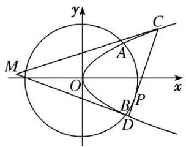

[规范解答] （1） 把 $x_{A}=2$ 代入 $x^{2}+y^{2}=8$ ，得 $y_{A}^{2}=4$ ，故 $2px_{A}=4$ ，p=1.
于是，抛物线 E 的方程为 $y^{2}=2x$ .  
（2）设 $C\left(\frac{y_1^2}{2}, y_1\right), D\left(\frac{y_2^2}{2}, y_2\right)$ ，切线 $l_1: y - y_1 = k\left(x - \frac{y_1^2}{2}\right)$ ，代入 $y^2 = 2x$ 得 $ky^2 - 2y + 2y_1 - ky_1^2 = 0$ ，由 $\Delta = 0$ ，解得 $k = \frac{1}{y_1}$ . $\therefore l_1$ 的方程为 $y = \frac{1}{y_1} x + \frac{y_1}{2}$ ，同理， $l_2$ 的方程为 $y = \frac{1}{y_2} x + \frac{y_2}{2}$ .
联立 $\left\{ \begin{array}{l} y = \frac{1}{y_1} x + \frac{y_1}{2}, \\ y = \frac{1}{y_2} x + \frac{y_2}{2}, \end{array} \right.$ 解得 $\left\{ \begin{array}{l} x = \frac{y_1 y_2}{2}, \\ y = \frac{y_1 + y_2}{2}. \end{array} \right.$ 易得直线 $CD$ 的方程为 $x_0 x + y_0 y = 8$ ,
其中 $x_{0}$ ， $y_{0}$ 满足 $x_{0}^{2} + y_{0}^{2} = 8$ ， $x_{0} \in [2, 2\sqrt{2}]$ .
联立 $\left\{ \begin{array}{l} y^2 = 2x, \\ x_0x + y_0y = 8, \end{array} \right.$ 得 $x_0y^2 + 2y_0y - 16 = 0$ ，则 $\left\{ \begin{array}{l} y_1 + y_2 = -\frac{2y_0}{x_0}, \\ y_1y_2 = -\frac{16}{x_0}. \end{array} \right.$ $\therefore M(x, y)$ 满足 $\left\{ \begin{array}{l} x = -\frac{8}{x_0}, \\ y = -\frac{y_0}{x_0}, \end{array} \right.$
即点 M 为 $\left(-\frac{8}{x_{0}}, -\frac{y_{0}}{x_{0}}\right)$ . 点 M 到直线 CD: $x_{0}x + y_{0}y = 8$ 的距离
$d = \frac {\left| - 8 - \frac {y _ {0} ^ {2}}{x _ {0}} - 8 \right|}{\sqrt {x _ {0} ^ {2} + y _ {0} ^ {2}}} = \frac {y _ {0} ^ {2} + 1 6}{x _ {0}} = \frac {\frac {8 - x _ {0} ^ {2}}{x _ {0}} + 1 6}{2 \sqrt {2}} = \frac {\frac {8}{x _ {0}} - x _ {0} + 1 6}{2 \sqrt {2}}, \text {令} f (x) = \frac {\frac {8}{x} - x + 1 6}{2 \sqrt {2}}, x \in [ 2, 2 \sqrt {2} ],$
则 $f(x)$ 在 $[2, 2\sqrt{2}]$ 上单调递减，当且仅当 x=2 时， $f(x)$ 取得最大值 $\frac{9\sqrt{2}}{2}$ ，故 $d_{max}=\frac{9\sqrt{2}}{2}$ .

[例 2] 如图，已知点 $F_{1}$ ， $F_{2}$ 是椭圆 $C_{1}:\frac{x^{2}}{2}+y^{2}=1$ 的两个焦点，椭圆 $C_{2}:\frac{x^{2}}{2}+y^{2}=\lambda$ 经过点 $F_{1}$ ， $F_{2}$ ，点 P 是椭圆 $C_{2}$ 上异于 $F_{1}$ ， $F_{2}$ 的任意一点，直线 $PF_{1}$ 和 $PF_{2}$ 与椭圆 $C_{1}$ 的交点分别是 A，B 和 C，D。设 AB，CD 的斜率分别为 k， $k'$ 。  
（1）求证： $k \cdot k'$ 为定值；  
（2）求 $|AB|\cdot|CD|$ 的最大值.

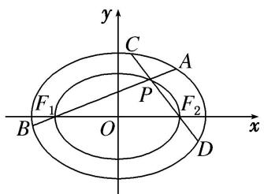

[规范解答] （1）证明：因为点 $F_{1}$ ， $F_{2}$ 是椭圆 $C_1$ 的两个焦点，故 $F_{1}(-1,0)$ ， $F_{2}(1,0)$ .
又点 $F_{1}$ ， $F_{2}$ 是椭圆 $C_{2}$ 上的点，将 $F_{1}$ 或 $F_{2}$ 的坐标代入 $C_{2}$ 的方程得 $\lambda=\frac{1}{2}$ .
设点 P 的坐标是 $(x_{0}, y_{0})$ ，由点 P 是椭圆 $C_{2}$ 上的点，知 $\frac{x_{0}^{2}}{2} + y_{0}^{2} = \frac{1}{2}$ ，①
∵ 直线 $PF_{1}$ 和 $PF_{2}$ 的斜率分别是 k, $k'(k \neq 0, k' \neq 0)$ , $\therefore kk' = \frac{y_{0}}{x_{0} + 1} \cdot \frac{y_{0}}{x_{0} - 1} = \frac{y_{0}^{2}}{x_{0}^{2} - 1}$ , ②
由①②可得 $kk' = -\frac{1}{2}$ ，即 $k \cdot k'$ 为定值.  
（2）直线 $PF_{1}$ 的方程可表示为 $y=k(x+1)(k\neq0)$ ，与椭圆 $C_{1}$ 的方程联立，得到方程组 $\left\{\begin{aligned}y&=k(x+1),\\ \frac{x^{2}}{2}&+y^{2}=1,\end{aligned}\right.$ 消去 y 得 $(1+2k^{2})x^{2}+4k^{2}x+2k^{2}-2=0$ .
设 $A(x_{1}, y_{1})$ ， $B(x_{2}, y_{2})$ ，则 $x_{1} + x_{2} = -\frac{4k^{2}}{1 + 2k^{2}}$ ， $x_{1}x_{2} = \frac{2k^{2} - 2}{1 + 2k^{2}}$ .
$|AB| = \sqrt{1 + k^2} |x_1 - x_2| = \sqrt{1 + k^2}\sqrt{(x_1 + x_2)^2 - 4x_1x_2} = \frac{2\sqrt{2}(1 + k^2)}{1 + 2k^2}$ . 同理可求得 $|CD| = \frac{\sqrt{2}(1 + 4k^2)}{1 + 2k^2}$ ,
则 $|AB|\cdot|CD|=\frac{4(4k^{4}+5k^{2}+1)}{(1+2k^{2})^{2}}=4\left(1+\frac{1}{\frac{1}{k^{2}}+4k^{2}+4}\right)\leq\frac{9}{2},$
当且仅当 $k=\pm\frac{\sqrt{2}}{2}$ 时等号成立．故 $|AB|\cdot|CD|$ 的最大值为 $\frac{9}{2}$ .

[例3] 已知椭圆 $\frac{x^2}{a^2} + \frac{y^2}{b^2} = 1 (a > b > 0)$ 的离心率 $e = \frac{\sqrt{3}}{3}$ ，左、右焦点分别为 $F_1, F_2$ ，且 $F_2$ 与抛物线 $y^2 = 4x$ 的焦点重合.  
（1）求椭圆的标准方程;   
（2）若过 $F_{1}$ 的直线交椭圆于 $B$ ， $D$ 两点，过 $F_{2}$ 的直线交椭圆于 $A$ ， $C$ 两点，且 $AC \perp BD$ ，求 $|AC| + |BD|$ 的最小值.

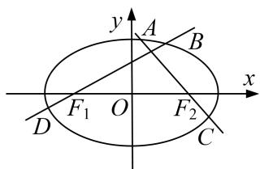

[规范解答] （1）抛物线 $y^{2}=4x$ 的焦点坐标为 $(1,0)$ ，所以 c=1，又因为 $e=\frac{c}{a}=\frac{1}{a}=\frac{\sqrt{3}}{3}$ ，所以 $a=\sqrt{3}$ ，
所以 $b^{2}=2$ ，所以椭圆的标准方程为 $\frac{x^{2}}{3}+\frac{y^{2}}{2}=1$ .  
（2）①当直线 BD 的斜率 k 存在且 $k \neq 0$ 时，直线 BD 的方程为 $y = k(x + 1)$ ,
代入椭圆方程 $\frac{x^{2}}{3}+\frac{y^{2}}{2}=1$ ，并化简得 $(3k^{2}+2)x^{2}+6k^{2}x+3k^{2}-6=0$ .
$\Delta=36k^{4}-4(3k^{2}+2)(3k^{2}-6)=48(k^{2}+1)>0$ 恒成立.
设 $B(x_{1}, y_{1})$ ， $D(x_{2}, y_{2})$ ，则 $x_{1} + x_{2} = -\frac{6k^{2}}{3k^{2} + 2}$ ， $x_{1}x_{2} = \frac{3k^{2} - 6}{3k^{2} + 2}$
$| B D | = \sqrt {1 + k ^ {2}} \cdot | x _ {1} - x _ {2} | = \sqrt {(1 + k ^ {2}) \cdot [ (x _ {1} + x _ {2}) ^ {2} - 4 x _ {1} x _ {2} ]} = \frac {4 \sqrt {3} (k ^ {2} + 1)}{3 k ^ {2} + 2},$
由题意知 AC 的斜率为 $-\frac{1}{k}$ ，所以 $|AC|=\frac{4\sqrt{3}\left(\frac{1}{k^{2}}+1\right)}{3\times\frac{1}{k^{2}}+2}=\frac{4\sqrt{3}(k^{2}+1)}{2k^{2}+3}$ .
$\begin{array}{l} \left| A C \right| + \left| B D \right| = 4 \sqrt {3} \left(k ^ {2} + 1\right) \left[ \frac {1}{3 k ^ {2} + 2} + \frac {1}{2 k ^ {2} + 3} \right] = \frac {2 0 \sqrt {3} \left(k ^ {2} + 1\right) ^ {2}}{\left(3 k ^ {2} + 2\right) \left(2 k ^ {2} + 3\right)} \geq \frac {2 0 \sqrt {3} \left(k ^ {2} + 1\right) ^ {2}}{\left[ \frac {\left(3 k ^ {2} + 2\right) + \left(2 k ^ {2} + 3\right)}{2} \right] _ {2}} \\ = \frac {2 0 \sqrt {3} (k ^ {2} + 1) ^ {2}}{\frac {2 5 (k ^ {2} + 1) ^ {2}}{4}} = \frac {1 6 \sqrt {3}}{5}. \\ \end{array}$
当且仅当 $3k^{2}+2=2k^{2}+3$ ，即 $k=\pm1$ 时，上式取等号，故 $|AC|+|BD|$ 的最小值为 $\frac{16\sqrt{3}}{5}$ .

②当直线 $BD$ 的斜率不存在或等于零时，可得 $|AC| + |BD| = \frac{10\sqrt{3}}{3} >\frac{16\sqrt{3}}{5}$

综上， $|AC|+|BD|$ 的最小值为 $\frac{16\sqrt{3}}{5}$ .

[题后悟通] 题目中未直接告诉我们不等关系，则选择将 $|AC|+|BD|$ 表示为关于k的函数，再行处理，注意到 $3k^{2}+2+2k^{2}+3=5(k^{2}+1)$ ，所以可以考虑基本不等式，但一定要注意等号是否能够成立。当然这里也可以利用换元法。令 $k^{2}+1=t(t\geq1)$ ，将原式转化为 $\frac{20\sqrt{3}t^{2}}{(3t-1)(2t+1)}$ 来处理，但稍微比较复杂一些。

[例 4] 已知椭圆 $E: \frac{x^{2}}{a^{2}} + \frac{y^{2}}{b^{2}} = 1 (a > b > 0)$ 的一个焦点为 $F_{2}(1, 0)$ ，且该椭圆过定点 $M\left(1, \frac{\sqrt{2}}{2}\right)$ .  
（1）求椭圆 E 的标准方程;  
（2）设点 $Q(2,0)$ ，过点 $F_{2}$ 作直线 l 与椭圆 E 交于 A，B 两点，且 $\overrightarrow{F_{2}A} = \lambda \overrightarrow{F_{2}B}$ ， $\lambda \in [-2, -1]$ ，以 QA，QB 为邻边作平行四边形 QACB，求对角线 QC 长度的最小值.

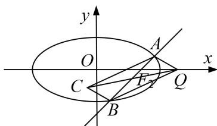

[规范解答] （1）由题易知 $c=1,\frac{1}{a^{2}}+\frac{1}{2b^{2}}=1$ ，又 $a^{2}=b^{2}+c^{2}$ ，解得 $b^{2}=1,a^{2}=2$ ，
故椭圆 E 的标准方程为 $\frac{x^{2}}{2} + y^{2} = 1$ .  
（2）设直线 $l: x = ky + 1$ ，由 $\left\{ \begin{array}{l} x = ky + 1, \\ \frac{x^2}{2} + y^2 = 1 \end{array} \right.$ 得 $(k^2 + 2)y^2 + 2ky - 1 = 0$ ， $\Delta = 4k^2 + 4(k^2 + 2) = 8(k^2 + 1) > 0$
设 $A(x_{1}, y_{1})$ ， $B(x_{2}, y_{2})$ ，则可得 $y_{1} + y_{2} = \frac{-2k}{k^{2} + 2}$ ， $y_{1}y_{2} = \frac{-1}{k^{2} + 2}$ .
$\overrightarrow {Q C} = \overrightarrow {Q A} + \overrightarrow {Q B} = (x _ {1} + x _ {2} - 4, y _ {1} + y _ {2}) = \left[ - \frac {4 (k ^ {2} + 1)}{k ^ {2} + 2}, \frac {- 2 k}{k ^ {2} + 2} \right],$
$\therefore |\overrightarrow{QC}|^2 = |\overrightarrow{QA} + \overrightarrow{QB}|^2 = 16 - \frac{28}{k^2 + 2} + \frac{8}{(k^2 + 2)^2}$ ，由此可知， $|\overrightarrow{QC}|^2$ 的大小与 $k^2$ 的取值有关.
由 $\overrightarrow{F_{2}A}=\lambda\overrightarrow{F_{2}B}$ 可得 $y_{1}=\lambda y_{2},\quad\lambda=\frac{y_{1}}{y_{2}},\quad\frac{1}{\lambda}=\frac{y_{2}}{y_{1}}(y_{1}y_{2}\neq0).$
从而 $\lambda +\frac{1}{\lambda} = \frac{y_1}{y_2} +\frac{y_2}{y_1} = \frac{(y_1 + y_2)^2 - 2y_1y_2}{y_1y_2} = \frac{-6k^2 - 4}{k^2 + 2},$
由 $\lambda \in [-2, -1]$ 得 $\left(\lambda + \frac{1}{\lambda}\right) \in \left[-\frac{5}{2}, -2\right]$ ，从而 $-\frac{5}{2} \leq \frac{-6k^2 - 4}{k^2 + 2} \leq -2$ ，解得 $0 \leq k^2 \leq \frac{2}{7}$ .
令 $t = \frac{1}{k^2 + 2}$ ，则 $t \in \left[\frac{7}{16}, \frac{1}{2}\right]$ ， $\therefore |\overrightarrow{QC}|^2 = 8t^2 - 28t + 16 = 8\left(t - \frac{7}{4}\right)^2 - \frac{17}{2}$ ，
∴ 当 $t=\frac{1}{2}$ 时， $|QC|_{\min}=2$ .

[例 5] (2020·浙江)如图，已知椭圆 $C_{1}:\frac{x^{2}}{2}+y^{2}=1$ ，抛物线 $C_{2}:y^{2}=2px(p>0)$ ，点 A 是椭圆 $C_{1}$ 与抛物线 $C_{2}$ 的交点，过点 A 的直线 l 交椭圆 $C_{1}$ 于点 B，交抛物线 $C_{2}$ 于点 M(B, M 不同于 A).  
（1）若 $p=\frac{1}{16}$ ，求抛物线 $C_{2}$ 的焦点坐标；  
（2）若存在不过原点的直线 l 使 M 为线段 AB 的中点，求 p 的最大值.

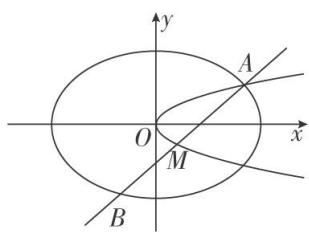

[规范解答] （1） 当 $p=\frac{1}{16}$ 时， $C_{2}$ 的方程为 $y^{2}=\frac{1}{8}x$ ，故抛物线 $C_{2}$ 的焦点坐标为 $\left(\frac{1}{32},0\right)$ .  
（2）解法一：设 $A(x_{1}, y_{1})$ ， $B(x_{2}, y_{2})$ ， $M(x_{0}, y_{0})$ ，直线 l 的方程为 $x = \lambda y + m$ ，
由 $\left\{\begin{aligned}x^{2}+2y^{2}=2,\\ x=\lambda y+m,\end{aligned}\right.$ 得 $(2+\lambda^{2})y^{2}+2\lambda my+m^{2}-2=0$ ，所以 $y_{1}+y_{2}=\frac{-2\lambda m}{2+\lambda^{2}},y_{0}=\frac{-\lambda m}{2+\lambda^{2}},x_{0}=\lambda y_{0}+m=\frac{2m}{2+\lambda^{2}}$
因为 M 在抛物线上，所以 $\frac{\lambda^{2}m^{2}}{2+\lambda^{2}} = \frac{4pm}{2+\lambda^{2}} \Rightarrow m = \frac{4p}{\lambda^{2}} = \frac{2+\lambda^{2}}{\lambda^{2}}$ . 由 $\left\{\begin{aligned} y^{2}&=2px,\\ x&=\lambda y+m,\end{aligned}\right.$ 得 $y^{2}=2p(\lambda y+m)$ ,
即 $y^{2}-2p\lambda y-2pm=0$ ，所以 $y_{1}+y_{0}=2p\lambda$ ，所以 $x_{1}+x_{0}=\lambda y_{1}+m+\lambda y_{0}+m=2p\lambda^{2}+2m$ ，
所以 $x_{1}=2p\lambda^{2}+2m-\frac{2m}{2+\lambda^{2}}$ . 由 $\left\{\begin{aligned}\frac{x^{2}}{2}+y^{2}&=1,\\ y^{2}&=2px,\end{aligned}\right.$ 得 $x^{2}+4px-2=0$ ,
所以 $x_{1}=\frac{-4p+\sqrt{16p^{2}+8}}{2}=-2p+\sqrt{4p^{2}+2}$ ,
则 $-2p + \sqrt{4p^2 + 2} = 2p\lambda^2 + 2m\cdot \frac{1 + \lambda^2}{2 + \lambda^2} = 2p\lambda^2 + \frac{8p}{\lambda^2} + 8p \geq 16p,$
所以 $\sqrt{4p^2 + 2} \geq 18p$ ，解得 $p^2 \leq \frac{1}{160}$ ， $p \leq \frac{\sqrt{10}}{40}$ ，
所以 p 的最大值为 $\frac{\sqrt{10}}{40}$ ，此时 $A\left(\frac{2\sqrt{10}}{5}, \frac{\sqrt{5}}{5}\right)$ .
解法二：设直线 l 的方程为 $x=my+t(m\neq0,\ t\neq0)$ ， $A(x_{0},y_{0})$ .
将 $x=my+t$ 代入 $\frac{x^{2}}{2}+y^{2}=1$ ，得 $(m^{2}+2)y^{2}+2mty+t^{2}-2=0$ ，所以点 M 的纵坐标为 $y_{M}=-\frac{mt}{m^{2}+2}$ .
将 $x=my+t$ 代入 $y^{2}=2px$ ，得 $y^{2}-2pmy-2pt=0$ ，所以 $y_{0}y_{M}=-2pt$ ，解得 $y_{0}=\frac{2p(m^{2}+2)}{m}$ ,
因此 $x_{0}=\frac{2p(m^{2}+2)^{2}}{m^{2}}$ ，由 $\frac{x_{0}^{2}}{2}+y_{0}^{2}=1$ ，解得 $\frac{1}{p^{2}}=4\left(m+\frac{2}{m}\right)^{2}+2\left(m+\frac{2}{m}\right)^{4}\geq160$
所以当 $m=\sqrt{2}$ ， $t=\frac{\sqrt{10}}{5}$ 时，p 取到最大值为 $\frac{\sqrt{10}}{40}$ .

[例6] 已知抛物线 $x^{2} = y$ ，点 $A\left(-\frac{1}{2}, \frac{1}{4}\right)$ ， $B\left(\frac{3}{2}, \frac{9}{4}\right)$ ，抛物线上的点 $P(x_0, y_0)\left(-\frac{1}{2} < x_0 < \frac{3}{2}\right)$ .  
（1）求直线 AP 斜率的取值范围;  
（2） $Q$ 是以 $AB$ 为直径的圆上一点，且 $\overrightarrow{AP} \cdot \overrightarrow{BQ} = 0$ ，求 $\overrightarrow{AP} \cdot \overrightarrow{PQ}$ 的最大值.

[规范解答] （1）设直线 AP 的斜率为 k，则 $k=\frac{x_{0}^{2}-\frac{1}{4}}{x_{0}+\frac{1}{2}}=x_{0}-\frac{1}{2}$ ,
因为 $-\frac{1}{2}<x_{0}<\frac{3}{2}$ ，所以直线AP斜率的取值范围是 $(-1,1)$ .  
（2）由题意可知， $\overrightarrow{AP}$ 与 $\overrightarrow{AQ}$ 同向共线， $BQ\perp AQ$ ，
联立直线 AP 与 BQ 的方程得 $\left\{\begin{aligned}kx-y+\frac{1}{2}k+\frac{1}{4}=0,\\ x+ky-\frac{9}{4}k-\frac{3}{2}=0,\end{aligned}\right.$ 解得点 Q 的横坐标是 $x_{Q}=\frac{-k^{2}+4k+3}{2(k^{2}+1)}$ .
因为 $|AP|=\sqrt{1+k^{2}}\left(x_{0}+\frac{1}{2}\right)=\sqrt{1+k^{2}}(k+1)$ ， $|PQ|=\sqrt{1+k^{2}}(x_{Q}-x_{0})=-\frac{(k-1)(k+1)^{2}}{\sqrt{k^{2}+1}}$
所以 $\overrightarrow{AP} \cdot \overrightarrow{PQ} = |\overrightarrow{AP}| \cdot |\overrightarrow{PQ}| = -(k-1)(k+1)^3$ . 令 $f(k) = -(k-1)(k+1)^3$ , 因为 $f'(k) = -(4k-2)(k+1)^2$ ,
所以 $f(k)$ 在区间 $\left(-1, \frac{1}{2}\right)$ 上单调递增，在 $\left(\frac{1}{2}, 1\right)$ 上单调递减，因此当 $k=\frac{1}{2}$ 时， $\overrightarrow{AP}\cdot\overrightarrow{PQ}$ 取得最大值 $\frac{27}{16}$ .

[例 7] 如图，在矩形 ABCD 中， $|AB|=4,\quad|AD|=2,\quad O$ 为 AB 的中点，P，Q 分别是 AD 和 CD 上的点，且满足① $\frac{|AP|}{|AD|}=\frac{|DQ|}{|DC|}$ ，②直线 AQ 与 BP 的交点在椭圆 E: $\frac{x^{2}}{a^{2}}+\frac{y^{2}}{b^{2}}=1(a>b>0)$ 上.  
（1）求椭圆 E 的方程;  
（2）设 R 为椭圆 E 的右顶点，M 为椭圆 E 第一象限部分上一点，作 MN 垂直于 y 轴，垂足为 N，求梯形 ORMN 面积的最大值.

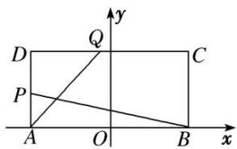

[规范解答] （1）设 AQ 与 BP 的交点为 $G(x, y)$ ， $P(-2, y_{1})$ ， $Q(x_{1}, 2)$ ，由题可知， $\frac{y_{1}}{2} = \frac{x_{1} + 2}{4}$ .
$\because k _ {A G} = k _ {A} \mathrm{Q}, k _ {B G} = k _ {B P}, \therefore \frac {y}{x + 2} = \frac {2}{x _ {1} + 2}, \frac {y}{x - 2} = - \frac {y _ {1}}{4},$
从而有 $\frac{y^{2}}{x^{2}-4}=-\frac{y_{1}}{2(x_{1}+2)}=-\frac{1}{4}$ ，整理得 $\frac{x^{2}}{4}+y^{2}=1$ ，即椭圆E的方程为 $\frac{x^{2}}{4}+y^{2}=1$ .  
（2）由（1）知 $R(2,0)$ ，设 $M(x_{0},y_{0})$ ，则 $y_{0}=\frac{1}{2}\sqrt{4-x_{0}^{2}}$ ,
从而梯形 ORMN 的面积 $S=\frac{1}{2}(2+x_{0})y_{0}=\frac{1}{4}\sqrt{(4-x_{0}^{2})(2+x_{0})^{2}}$ ,
令 $t = 2 + x_0$ ，则 $2 < t < 4$ ， $S = \frac{1}{4}\sqrt{4t^3 - t^4}$ .令 $u = 4t^{3} - t^{4}$ ，则 $u' = 12t^{2} - 4t^{3} = 4t^{2}(3 - t),$
当 $t \in (2, 3)$ 时， $u' > 0$ ， $u = 4t^{3} - t^{4}$ 单调递增，当 $t \in (3, 4)$ 时， $u' < 0$ ， $u = 4t^{3} - t^{4}$ 单调递减，
所以当 t=3 时，u 取得最大值，则 S 也取得最大值，最大值为 $\frac{3\sqrt{3}}{4}$ .

[例 8] 设点 $F_{1}(-c, 0)$ ， $F_{2}(c, 0)$ 分别是椭圆 C: $\frac{x^{2}}{a^{2}} + y^{2} = 1 (a > 0)$ 的左、右焦点，P 为椭圆 C 上任意一点，且 $\overrightarrow{PF_{1}} \cdot \overrightarrow{PF_{2}}$ 的最小值为 0.  
（1）求椭圆 C 的方程;  
（2）如图，动直线 $l: y = kx + m$ 与椭圆 $C$ 有且仅有一个公共点，作 $F_{1}M \perp l$ ， $F_{2}N \perp l$ 分别交直线 $l$ 于 $M$ ， $N$ 两点，求四边形 $F_{1}MNF_{2}$ 的面积 $S$ 的最大值.

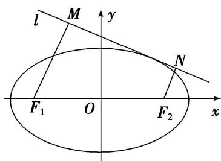

[规范解答] （1） 设 $P(x, y)$ ，则 $\overrightarrow{PF}_{1}=(-c-x, -y)$ ， $\overrightarrow{PF}_{2}=(c-x, -y)$ ,
所以 $\overrightarrow{PF_{1}}\cdot\overrightarrow{PF_{2}}=x^{2}+y^{2}-c^{2}=\frac{a^{2}-1}{a^{2}}x^{2}+1-c^{2},\quad x\in[-a,\quad a]$
由题意得， $1-c^{2}=0,\quad c=1$ ，则 $a^{2}=2$ ，所以椭圆C的方程为 $\frac{x^{2}}{2}+y^{2}=1$ 。  
（2）将直线 l 的方程 $l: y=kx+m$ 代入椭圆 C 的方程 $\frac{x^{2}}{2}+y^{2}=1$ 中，得 $(2k^{2}+1)x^{2}+4kmx+2m^{2}-2=0$ ，由直线 l 与椭圆 C 有且仅有一个公共点知 $\Delta=16k^{2}m^{2}-4(2k^{2}+1)(2m^{2}-2)=0$ ，化简得 $m^{2}=2k^{2}+1$ 。
设 $d_{1} = |F_{1}M| = \frac{| - k + m|}{\sqrt{k^{2} + 1}}$ ， $d_{2} = |F_{2}N| = \frac{|k + m|}{\sqrt{k^{2} + 1}}.$

①当 $k \neq 0$ 时，设直线 l 的倾斜角为 $\theta$ ，则 $|d_{1} - d_{2}| = |MN| \cdot |\tan \theta|$ ，所以 $|MN| = \frac{1}{|k|} \cdot |d_{1} - d_{2}|$ ，
所以 $S = \frac{1}{2}\cdot \frac{1}{|k|}\cdot |d_1 - d_2|\cdot (d_1 + d_2) = \frac{2|m|}{k^2 + 1} = \frac{4|m|}{m^2 + 1} = \frac{4}{|m| + \frac{1}{|m|}},$
因为 $m^{2}=2k^{2}+1$ ，所以当 $k\neq0$ 时， $|m|>1$ ， $|m|+\frac{1}{|m|}>2$ ，即 S<2.

[例9] 已知椭圆的两个焦点为 $F_{1}(-1,0)$ ， $F_{2}(1,0)$ ，且椭圆与直线 $y = x - \sqrt{3}$ 相切.  
（1）求椭圆的方程;  
（2）过 $F_{1}$ 作两条互相垂直的直线 $l_{1}, l_{2}$ , 与椭圆分别交于点 $P, Q$ 及 $M, N$ , 求四边形 $PMQN$ 面积的最小值.

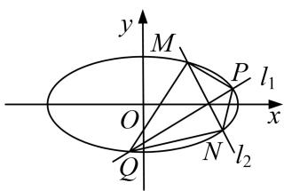

[规范解答] （1）设椭圆方程为 $\frac{x^{2}}{a^{2}}+\frac{y^{2}}{b^{2}}=1(a>b>0)$ ，因为它与直线 $y=x-\sqrt{3}$ 只有一个公共点，
所以方程组 $\left\{ \begin{array}{l} \frac{x^2}{a^2} + \frac{y^2}{b^2} = 1, \\ y = x - \sqrt{3} \end{array} \right.$ 只有一组解，消去 $y$ ，整理得 $(a^2 + b^2) \cdot x^2 - 2\sqrt{3} a^2 x + 3a^2 - a^2 b^2 = 0.$
所以 $\Delta=(-2\sqrt{3}a^{2})^{2}-4(a^{2}+b^{2})(3a^{2}-a^{2}b^{2})=0$ ，化简得 $a^{2}+b^{2}=3$ .
又焦点为 $F_{1}(-1,0)$ ， $F_{2}(1,0)$ ，所以 $a^{2}-b^{2}=1$ ，联立上式解得 $a^{2}=2$ ， $b^{2}=1$ 。
所以椭圆的方程为 $\frac{x^{2}}{2}+y^{2}=1$ .  
（2）若直线 $PQ$ 的斜率不存在(或为0)，则 $S_{\text{四边形} PMQN} = \frac{|PQ| \cdot |MN|}{2} = \frac{2\sqrt{1 - \frac{1}{2}} \times 2\sqrt{2}}{2} = 2.$
若直线 PQ 的斜率存在，设为 $k(k \neq 0)$ ，则直线 MN 的斜率为 $-\frac{1}{k}$ .
所以直线 PQ 的方程为 $y=kx+k$ ，设 $P(x_{1}, y_{1})$ ， $Q(x_{2}, y_{2})$ ，
联立方程得 $\left\{\begin{aligned}\frac{x^{2}}{2}+y^{2}=1,\\ y=kx+k,\end{aligned}\right.$ 化简得 $(2k^{2}+1)x^{2}+4k^{2}x+2k^{2}-2=0$ ，则 $x_{1}+x_{2}=\frac{-4k^{2}}{2k^{2}+1},\quad x_{1}x_{2}=\frac{2k^{2}-2}{2k^{2}+1},$
所以 $|PQ|=\sqrt{1+k^{2}}|x_{1}-x_{2}|=\frac{\sqrt{(1+k^{2})[16k^{4}-4(2k^{2}-2)(2k^{2}+1)]}}{2k^{2}+1}=2\sqrt{2}\times\frac{k^{2}+1}{2k^{2}+1},$
同理可得 $|MN|=2\sqrt{2}\times\frac{k^{2}+1}{2+k^{2}}$ .
所以 $S_{四边形PMQN}=\frac{|PQ|\cdot|MN|}{2}=4\times\frac{(k^{2}+1)^{2}}{(2+k^{2})(2k^{2}+1)}=4\times\frac{k^{4}+2k^{2}+1}{2k^{4}+5k^{2}+2}=4\times\left(\frac{1}{2}-\frac{\frac{1}{2}k^{2}}{2k^{4}+5k^{2}+2}\right)$
$= 4 \times \left(\frac {1}{2} - \frac {k ^ {2}}{4 k ^ {4} + 1 0 k ^ {2} + 4}\right) = 4 \times \left(\frac {1}{2} - \frac {1}{4 k ^ {2} + \frac {4}{k ^ {2}} + 1 0}\right).$
因为 $4k^{2}+\frac{4}{k^{2}}+10\geq2\sqrt{4k^{2}\cdot\frac{4}{k^{2}}}+10=18$ (当且仅当 $k^{2}=1$ 时取等号),
所以 $\frac{1}{4k^2 + \frac{4}{k^2} + 10}\in \left[0,\frac{1}{18}\right]$ ，所以 $4\times \left[\frac{1}{2} -\frac{1}{4k^2 + \frac{4}{k^2} + 10}\right]\in \left[\frac{16}{9},2\right].$
综上所述，四边形 PMQN 面积的最小值为 $\frac{16}{9}$ .

[例 10] 已知椭圆的中心在坐标原点， $A(2,0)$ ， $B(0,1)$ 是它的两个顶点，直线 $y=kx(k>0)$ 与直线 AB 相交于点 D，与椭圆相交于 E，F 两点.  
（1）若 $\overrightarrow{ED}=6\overrightarrow{DF}$ ，求k的值；  
（2）求四边形 AEBF 面积的最大值.

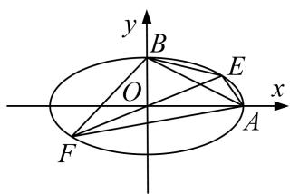

[规范解答] （1）由题设条件可得，椭圆的方程为 $\frac{x^{2}}{4}+y^{2}=1$ ，直线AB的方程为 $x+2y-2=0$ .
设 $D(x_{0}, kx_{0})$ , $E(x_{1}, kx_{1})$ , $F(x_{2}, kx_{2})$ ，其中 $x_{1}<x_{2}$ ,
由 $\left\{\begin{aligned}y=kx,\\ \frac{x^{2}}{4}+y^{2}=1,\end{aligned}\right.$ 得 $(1+4k^{2})x^{2}=4$ ，解得 $x_{2}=-x_{1}=\frac{2}{\sqrt{1+4k^{2}}}$ ①
由 $\overrightarrow{ED}=6\overrightarrow{DF}$ ，得 $(x_{0}-x_{1}, k(x_{0}-x_{1}))=6(x_{2}-x_{0}, k(x_{2}-x_{0}))$ ，即 $x_{0}-x_{1}=6(x_{2}-x_{0})$ ,
$\therefore x_{0} = \frac{1}{7}(6x_{2} + x_{1}) = \frac{5}{7} x_{2} = \frac{10}{7\sqrt{1 + 4k^{2}}}$ . 由 $D$ 在 $AB$ 上，得 $x_0 + 2kx_0 - 2 = 0$ ， $\therefore x_0 = \frac{2}{1 + 2k}$ .
$\therefore \frac{2}{1 + 2k} = \frac{10}{7\sqrt{1 + 4k^2}}$ ，化简，得 $24k^{2} - 25k + 6 = 0$ ，解得 $k = \frac{2}{3}$ 或 $k = \frac{3}{8}$ .  
（2）根据点到直线的距离公式和①式可知，点 E，F 到 AB 的距离分别为
$d _ {1} = \frac {\left| x _ {1} + 2 k x _ {1} - 2 \right|}{\sqrt {5}} = \frac {2 (1 + 2 k) + \sqrt {1 + 4 k ^ {2}}}{\sqrt {5 (1 + 4 k ^ {2})}}, d _ {2} = \frac {\left| x _ {2} + 2 k x _ {2} - 2 \right|}{\sqrt {5}} = \frac {2 (1 + 2 k) - \sqrt {1 + 4 k ^ {2}}}{\sqrt {5 (1 + 4 k ^ {2})}},$
又 $|AB|=\sqrt{2^{2}+1^{2}}=\sqrt{5}$ ，∴四边形AEBF的面积为 $S=\frac{1}{2}|AB|(d_{1}+d_{2})=\frac{1}{2}\times\sqrt{5}\times\frac{4(1+2k)}{\sqrt{5(1+4k^{2})}}=\frac{2(1+2k)}{\sqrt{1+4k^{2}}}$
$= 2 \sqrt {\frac {1 + 4 k ^ {2} + 4 k}{1 + 4 k ^ {2}}} = 2 \sqrt {1 + \frac {4 k}{1 + 4 k ^ {2}}} = 2 \sqrt {1 + \frac {4}{4 k + \frac {1}{k}}} \leq 2 \sqrt {1 + \frac {4}{2 \sqrt {4 k \cdot \frac {1}{k}}}} = 2 \sqrt {2},$
当且仅当 $4k = \frac{1}{k} (k > 0)$ ，即 $k = \frac{1}{2}$ 时，等号成立。故四边形 $AEBF$ 面积的最大值为 $2\sqrt{2}$ 。

# 【对点训练】

1. 如图所示，点 $A$ ， $B$ 分别是椭圆 $\frac{x^2}{36} + \frac{y^2}{20} = 1$ 长轴的左、右端点，点 $F$ 是椭圆的右焦点，点 $P$ 在椭圆上，且位于 $x$ 轴上方， $PA \perp PF$ .  
（1）求点 P 的坐标;  
（2）设 $M$ 是椭圆长轴 $AB$ 上的一点，点 $M$ 到直线 $AP$ 的距离等于 $|MB|$ ，求椭圆上的点到点 $M$ 的距离 $d$ 的最小值.

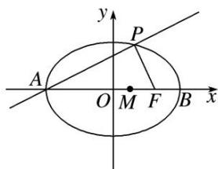

1. 解析 （1）由已知可得点 $A(-6, 0)$ , $F(4, 0)$ , 设点 $P$ 的坐标是 $(x, y)$ ,
则 $\overrightarrow{AP}=(x+6,y)$ ， $\overrightarrow{FP}=(x-4,y)$ ,
$\because PA \perp PF, \therefore \overrightarrow{AP} \cdot \overrightarrow{FP} = 0$ ，则 $\left\{ \begin{array}{l} \frac{x^2}{36} + \frac{y^2}{20} = 1, \\ (x + 6)(x - 4) + y^2 = 0, \end{array} \right.$ 可得 $2x^2 + 9x - 18 = 0$ ，得 $x = \frac{3}{2}$ 或 $x = -6$ .由于 y>0，故 $x=\frac{3}{2}$ ，于是 $y=\frac{5\sqrt{3}}{2}$ 。∴ 点 P 的坐标是 $\left(\frac{3}{2}, \frac{5\sqrt{3}}{2}\right)$ .  
（2）由（1）可得直线 AP 的方程是 $x - \sqrt{3}y + 6 = 0$ ，点 $B(6, 0)$ .
设点 M 的坐标是 $(m, 0)$ ，则点 M 到直线 AP 的距离是 $\frac{|m+6|}{2}$ ，于是 $\frac{|m+6|}{2}=|m-6|$ ，
又 $-6\leq m\leq6$ ，解得m=2。
由椭圆上的点 $(x, y)$ 到点M的距离为d,
得 $d^{2}=(x-2)^{2}+y^{2}=x^{2}-4x+4+20-\frac{5}{9}x^{2}=\frac{4}{9}\left(x-\frac{9}{2}\right)^{2}+15$ ，由于 $-6\leq x\leq6$ ，
由 $f(x) = \frac{4}{9}\left[x - \frac{9}{2}\right]^{2} + 15$ 的图象可知，当 $x = \frac{9}{2}$ 时， $d$ 取最小值，且最小值为 $\sqrt{15}$ .

2. 已知直线 $l: x - y + 1 = 0$ 与焦点为 $F$ 的抛物线 $C: y^2 = 2px (p > 0)$ 相切.  
（1）求抛物线 C 的方程;  
（2）过焦点 F 的直线 m 与抛物线 C 分别相交于 A, B 两点，求 A, B 两点到直线 l 的距离之和的最小值.

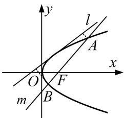

2. 解析 （1）∵直线 l: x-y+1=0 与抛物线 C: $y^{2}=2px(p>0)$ 相切，
联立 $\left\{\begin{aligned}x-y+1=0,\\ y^{2}=2px,\end{aligned}\right.$ 消去 x 得 $y^{2}-2py+2p=0$ ，从而 $\Delta=4p^{2}-8p=0$ ，解得 p=2 或 p=0（舍）.
∴抛物线 C 的方程为 $y^{2}=4x$ .  
（2）由于直线 m 的斜率不为 0，可设直线 m 的方程为 ty=x-1， $A(x_{1}, y_{1})$ ， $B(x_{2}, y_{2})$ .
联立 $\left\{\begin{aligned}ty&=x-1,\\ y^{2}&=4x,\end{aligned}\right.$ 消去 x 得 $y^{2}-4ty-4=0,\quad\because\Delta>0,\quad\therefore y_{1}+y_{2}=4t,\quad$ 即 $x_{1}+x_{2}=4t^{2}+2,$
∴线段 AB 的中点 M 的坐标为 $(2t^{2}+1, 2t)$ .
设点 A 到直线 l 的距离为 $d_{A}$ ，点 B 到直线 l 的距离为 $d_{B}$ ，点 M 到直线 l 的距离为 d，
则 $d_A + d_B = 2d = 2\cdot \frac{|2t^2 - 2t + 2|}{\sqrt{2}} = 2\sqrt{2} |t^2 - t + 1| = 2\sqrt{2}\left|\left(t - \frac{1}{2}\right)^2 + \frac{3}{4}\right|$
∴当 $t=\frac{1}{2}$ 时，A，B 两点到直线 l 的距离之和最小，最小值为 $\frac{3\sqrt{2}}{2}$ .

3. 如图，抛物线 $C: x^{2} = 2px (p > 0)$ 的焦点为 $F(0, 1)$ ，取垂直于 $y$ 轴的直线与抛物线交于不同的两点 $P_{1}, P_{2}$ ，过 $P_{1}, P_{2}$ 作圆心为 $Q$ 的圆，使抛物线上其余点均在圆外，且 $P_{1}Q \perp P_{2}Q$ .  
（1）求抛物线 C 和圆 Q 的方程;  
（2）过点 F 作直线 l，与抛物线 C 和圆 Q 依次交于点 M，A，B，N，求 $|MN| \cdot |AB|$ 的最小值.

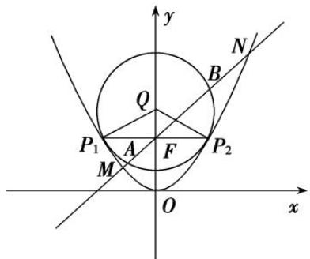

3. 解析 （1） 因为抛物线 C: $x^{2}=2py(p>0)$ 的焦点为 $F(0,1)$ ,
所以 $\frac{p}{2}=1$ ，解得p=2，所以抛物线C的方程为 $x^{2}=4y$ .
由抛物线和圆的对称性，可设圆 $Q: x^{2}+(y-b)^{2}=r^{2}$ ,
由题意知抛物线 C 与圆 Q 相切，由 $\left\{\begin{aligned}x^{2}&=4y,\\ x^{2}+(y-b)^{2}&=r^{2},\end{aligned}\right.$ 得 $y^{2}-(2b-4)y+b^{2}-r^{2}=0,$
所以 $\Delta=[-(2b-4)]^{2}-4(b^{2}-r^{2})=0$ ，有 $4b=4+r^{2}$ ，①
又由 $P_{1}O \perp P_{2}O$ ，得 $\triangle P_{1}OP_{2}$ 是等腰直角三角形，
所以 $P_{2}\left(\frac{\sqrt{2}}{2}r, b-\frac{\sqrt{2}}{2}r\right)$ ，代入抛物线方程有 $\frac{r^{2}}{2}=4b-2\sqrt{2}r$ ，②
联立①②解得 $r=2\sqrt{2}$ ，b=3，所以圆 Q 的方程为 $x^{2}+(y-3)^{2}=8$ .  
（2）由题知直线 l 的斜率一定存在，设直线 l 的方程为 $y=kx+1$ ，

圆心 $Q(0,3)$ 到直线 $l$ 的距离为 $d = \frac{2}{\sqrt{1 + k^2}}$ ，所以 $|AB| = 2\sqrt{r^2 - d^2} = 4\sqrt{2 - \frac{1}{1 + k^2}}$ .
由 $\left\{\begin{aligned}x^{2}&=4y,\\ y&=kx+1,\end{aligned}\right.$ 得 $y^{2}-(2+4k^{2})y+1=0.$
设 $M(x_{1}, y_{1})$ ， $N(x_{2}, y_{2})$ ，则 $y_{1} + y_{2} = 4k^{2} + 2$ ，由抛物线定义知 $|MN| = y_{1} + y_{2} + 2 = 4(1 + k^{2})$ .
所以 $|MN|\cdot|AB|=16(1+k^{2})\sqrt{2-\frac{1}{1+k^{2}}}$ ，设 $t=1+k^{2}(t\geq1)$ ,
则 $|MN|\cdot|AB|=16t\sqrt{2-\frac{1}{t}}=16\sqrt{2t^{2}-t}=16\sqrt{2\left(t-\frac{1}{4}\right)^{2}-\frac{1}{8}}(t\geq1)$ ,
所以当 t=1，即 k=0 时， $MN\cdot AB$ 有最小值 16

4. (2017·浙江)如图，已知抛物线 $x^{2} = y$ ，点 $A\left(-\frac{1}{2}, \frac{1}{4}\right)$ ， $B\left(\frac{3}{2}, \frac{9}{4}\right)$ ，抛物线上的点 $P(x, y)\left(-\frac{1}{2} < x < \frac{3}{2}\right)$ . 过点 $B$ 作直线 $AP$ 的垂线，垂足为 $Q$ .  
（1）求直线 AP 斜率的取值范围;  
（2）求 $|PA|\cdot|PQ|$ 的最大值.

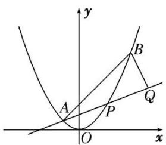

4. 解析 （1）设直线 $AP$ 的斜率为 $k$ , $k = \frac{x^2 - \frac{1}{4}}{x + \frac{1}{2}} = x - \frac{1}{2}$ , 因为 $-\frac{1}{2} < x < \frac{3}{2}$ , 所以 $-1 < x - \frac{1}{2} < 1$ ,
即直线 AP 斜率的取值范围是 $(-1, 1)$ .  
（2）设直线 $AP$ 的斜率为 $k$ . 则直线 $AP$ 的方程为 $y - \frac{1}{4} = k\left(x + \frac{1}{2}\right)$ , 即 $kx - y + \frac{1}{2} k + \frac{1}{4} = 0$ ,
因为直线 BQ 与直线 AP 垂直，所以直线 BQ 的方程为 $x + ky - \frac{9}{4}k - \frac{3}{2} = 0$ ,
联立 $\left\{\begin{aligned}kx-y+\frac{1}{2}k+\frac{1}{4}=0,\\ x+ky-\frac{9}{4}k-\frac{3}{2}=0,\end{aligned}\right.$ 解得点Q的横坐标 $x_{Q}=\frac{-k^{2}+4k+3}{2(k^{2}+1)}$ .
因为 $|PA|=\sqrt{1+k^{2}}\left(x+\frac{1}{2}\right)=\sqrt{1+k^{2}}(k+1)$ ， $|PQ|=\sqrt{1+k^{2}}(x_{Q}-x)=-\frac{(k-1)(k+1)^{2}}{\sqrt{k^{2}+1}}$
所以 $|PA|\cdot|PQ|=-(k-1)(k+1)^{3}$ .
令 $f(k) = -(k-1)(k+1)^{3}$ ，因为 $f'(k) = -(4k-2)(k+1)^{2}$ ，令 $f(k) = 0$ ，得 $k = \frac{1}{2}$ 或 k = -1（舍），
所以 $f(k)$ 在区间 $\left(-1, \frac{1}{2}\right)$ 上单调递增， $\left(\frac{1}{2}, 1\right)$ 上单调递减，因此当 $k=\frac{1}{2}$ 时， $|PA|\cdot|PQ|$ 取得最大值 $\frac{27}{16}$ .

5. 已知椭圆 $C: \frac{x^2}{a^2} + \frac{y^2}{b^2} = 1 (a > b > 0)$ , 其中 $F_1, F_2$ , 为左右焦点, 且离心率为 $\frac{\sqrt{3}}{3}$ , 直线 $l$ 与椭圆交于两不同点 $P(x_1, y_1), Q(x_2, y_2)$ , 当直线 $l$ 过椭圆 $C$ 右焦点 $F_2$ 且倾斜角为 $\frac{\pi}{4}$ 时, 原点 $O$ 到直线 $l$ 的距离为 $\frac{\sqrt{2}}{2}$ .  
（1）求椭圆 C 的方程;  
（2）若 $\overrightarrow{OP} +\overrightarrow{OQ} = \overrightarrow{ON}$ ，当 $\triangle OPQ$ 的面积为 $\frac{\sqrt{6}}{2}$ 时，求 $|\overrightarrow{ON} |\cdot |\overrightarrow{PQ} |$ 的最大值.

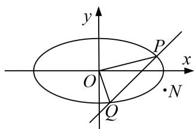

5. 解析 （1） 设直线 $l: y = x - c, \therefore d_{O - l} = \frac{|c|}{\sqrt{2}} = \frac{\sqrt{2}}{2}$ , 又 $\frac{c}{a} = \frac{\sqrt{3}}{3}, \therefore c = 1, a^2 = 3, b^2 = 2,$
∴椭圆 C 的方程为 $\frac{x^{2}}{3}+\frac{y^{2}}{2}=1$ .  
（2）若直线 l 斜率存在，设 $l: y=kx+m, P(x_{1}, y_{1}), Q(x_{2}, y_{2})$ ,
$\because \overrightarrow {O P} + \overrightarrow {O Q} = \overrightarrow {O N}, \therefore N (x _ {1} + x _ {2}, y _ {1} + y _ {2}),$
联立方程 $\left\{ \begin{array}{l} y = kx + m \\ \frac{x^2}{3} + \frac{y^2}{2} = 1 \end{array} \right.$ ，消去 $y$ 可得， $(3k^2 + 2)x^2 + 6kmx + 3m^2 - 6 = 0$
$\Delta=(6km)^{2}-4(3k^{2}+2)(3m^{2}-6)>0$ ，化简，得 $m^{2}<3k^{2}+2$ ， $\therefore x_{1}+x_{2}=-\frac{6km}{3k^{2}+2}$ ， $x_{1}x_{2}=\frac{3m^{2}-6}{3k^{2}+2}$
$y _ {1} + y _ {2} = \left(k x _ {1} + m\right) + \left(k x _ {2} + m\right) = k \left(x _ {1} + x _ {2}\right) + 2 m = \frac {4 m}{3 k ^ {2} + 2}, \quad \therefore N \left(- \frac {6 k m}{3 k ^ {2} + 2}, \frac {4 m}{3 k ^ {2} + 2}\right),$

考虑 $|PQ|=\sqrt{1+k^{2}}|x_{1}-x_{2}|=\sqrt{1+k^{2}}\sqrt{\frac{36k^{2}m^{2}}{(3k^{2}+2)^{2}}-4\cdot\frac{3m^{2}-6}{3k^{2}+2}}=2\sqrt{6}\sqrt{1+k^{2}}\frac{\sqrt{3k^{2}+2-m^{2}}}{3k^{2}+2},$
∵原点 O 到直线 l 的距离 $d=\frac{|m|}{\sqrt{1+k^{2}}}$ ,
$\therefore S _ {\triangle O P Q} = \frac {1}{2} | P Q | \cdot d = \frac {1}{2} \cdot 2 \sqrt {6} \cdot \sqrt {1 + k ^ {2}} \frac {\sqrt {3 k ^ {2} + 2 - m ^ {2}}}{3 k ^ {2} + 2} \cdot \frac {| m |}{\sqrt {1 + k ^ {2}}} = \frac {\sqrt {6}}{2},$
$\therefore 2 | m | \sqrt {3 k ^ {2} + 2 - m ^ {2}} = 3 k ^ {2} + 2, \quad \therefore 4 m ^ {2} (3 k ^ {2} + 2 - m ^ {2}) = (3 k ^ {2} + 2) ^ {2}, \quad \therefore (3 k ^ {2} + 2) ^ {2} - 4 m ^ {2} (3 k ^ {2} + 2) + (2 m ^ {2}) ^ {2} = 0,$
即 $(3k^{2}+2-2m^{2})^{2}=0,\quad\therefore3k^{2}+2=2m^{2},\quad N(-\frac{6km}{3k^{2}+2},\quad\frac{4m}{3k^{2}+2})=(-\frac{3k}{m},\quad\frac{2}{m}),$
$\therefore | O N | ^ {2} = \frac {9 k}{m ^ {2}} + \frac {4}{m ^ {2}} = \frac {6 m ^ {2} - 6}{m ^ {2}} + \frac {4}{m ^ {2}} = 6 - \frac {2}{m ^ {2}}, | P Q | ^ {2} = \frac {2 4 (k ^ {2} + 1) (3 k ^ {2} + 2 - m ^ {2})}{(3 k ^ {2} + 2) ^ {2}} = 4 + \frac {2}{m ^ {2}},$
$\therefore | O N | ^ {2} \cdot | P Q | ^ {2} = (6 - \frac {2}{m ^ {2}}) (4 + \frac {2}{m ^ {2}}) \leq (\frac {(6 - \frac {2}{m ^ {2}}) + (4 + \frac {2}{m ^ {2}})}{2}) ^ {2} = 2 5.$

等号成立条件： $6-\frac{2}{m^{2}}=4+\frac{2}{m^{2}}$ ，∴ $m=\pm\sqrt{2}$ 时， $|\overrightarrow{ON}|\cdot|\overrightarrow{PQ}|$ 的最大值是5.
当斜率不存在时，P，Q 关于 x 轴对称，设 $P(x_{0}, y_{0})$ ， $x_{0}$ ， $y_{0}>0$ ，
$\therefore S_{\triangle OPQ} = \frac{1}{2}|x_0||2y_0| = x_0y_0 = \frac{\sqrt{6}}{2}$ ，再由 $\frac{x_0^2}{3} +\frac{y_0^2}{2} = 1$ ，可得， $x_0 = \frac{\sqrt{6}}{2}$ ， $y_0 = 1$ ，可计算出述 $|\overrightarrow{ON} |\cdot |\overrightarrow{PQ}| = 2\sqrt{6} < 5$
所以综上所述 $|\overrightarrow{ON}|\cdot|\overrightarrow{PQ}|$ 的最大值是5.

6. 已知椭圆 $\frac{x^2}{a^2} + \frac{y^2}{b^2} = 1 (a > b > 0)$ 的离心率 $e = \frac{\sqrt{6}}{3}$ ，原点到过点 $A(0, -b)$ 和 $B(a, 0)$ 的直线的距离为 $\frac{\sqrt{3}}{2}$ .  
（1）求椭圆的方程;  
（2）设 $F_{1}$ , $F_{2}$ 为椭圆的左、右焦点, 过 $F_{2}$ 作直线交椭圆于 $P$ , $Q$ 两点, 求 $\triangle PQF_{1}$ 内切圆半径 $r$ 的最大值.

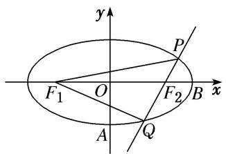

6. 解析 （1） 直线 $AB$ 的方程为 $\frac{x}{a} + \frac{y}{-b} = 1$ ，即 $bx - ay - ab = 0$ .

原点到直线 AB 的距离为 $\frac{|-ab|}{\sqrt{(-a)^{2}+b^{2}}}=\frac{\sqrt{3}}{2}$ ，即 $3a^{2}+3b^{2}=4a^{2}b^{2}$ ，①
由 $e=\frac{c}{a}=\frac{\sqrt{6}}{3}$ ，得 $c^{2}=\frac{2}{3}a^{2}$ ，②
又 $a^{2}=b^{2}+c^{2}$ ，③
所以联立①②③可得 $a^{2}=3,\ b^{2}=1,\ c^{2}=2.$
故椭圆的方程为 $\frac{x^{2}}{3}+y^{2}=1$ .  
（2）由（1）得 $F_{1}(-\sqrt{2}, 0)$ , $F_{2}(\sqrt{2}, 0)$ , 设 $P(x_{1}, y_{1})$ , $Q(x_{2}, y_{2})$ .

易知直线 PQ 的斜率不为 0，故设其方程为 $x = ky + \sqrt{2}$ ，
联立直线与椭圆的方程得 $\left\{\begin{aligned}x&=ky+\sqrt{2},\\ \frac{x^{2}}{3}&+y^{2}=1,\end{aligned}\right.$ $(k^{2}+3)y^{2}+2\sqrt{2}ky-1=0.$
故 $\left\{\begin{aligned}y_{1}+y_{2}&=-\frac{2\sqrt{2}k}{k^{2}+3},\\ y_{1}y_{2}&=-\frac{1}{k^{2}+3}.\end{aligned}\right.$ ④

而 $S_{\triangle PQF1}=S_{\triangle F1F2P}+S_{\triangle F1F2Q}=\frac{1}{2}|F_{1}F_{2}|y_{1}-y_{2}|=\sqrt{2}\sqrt{(y_{1}+y_{2})^{2}-4y_{1}y_{2}}$ ，⑤
将④代入⑤，得 $S_{\triangle PQF1} = \sqrt{2}\sqrt{\left(-\frac{2\sqrt{2}k}{k^2 + 3}\right)^2 + \frac{4}{k^2 + 3}} = \frac{2\sqrt{6}\sqrt{k^2 + 1}}{k^2 + 3}.$
又 $S_{\triangle PQF1} = \frac{1}{2} (|PF_1| + |F_1Q| + |PQ|)\cdot r = 2a\cdot r = 2\sqrt{3} r$ ，所以 $\frac{2\sqrt{6}\sqrt{k^2 + 1}}{k^2 + 3} = 2\sqrt{3} r,$
故 $r = \frac{\sqrt{2}\sqrt{k^2 + 1}}{k^2 + 3} = \frac{\sqrt{2}}{\sqrt{k^2 + 1} + \frac{2}{\sqrt{k^2 + 1}}} \leq \frac{1}{2}$ ，当且仅当 $\sqrt{k^2 + 1} = \frac{2}{\sqrt{k^2 + 1}}$ ，即 $k = \pm 1$ 时取等号.
故 $\triangle PQF_{1}$ 内切圆半径r的最大值为 $\frac{1}{2}$ .

7. 在平面直角坐标系 $xOy$ 中，已知点 $F(1,0)$ ，直线 $l: x = -1$ ，点 $P$ 在直线 $l$ 上移动， $R$ 是线段 $PF$ 与 $y$ 轴的交点，动点 $Q$ 满足： $RQ \perp PF$ ， $PQ \perp l$ .  
（1）求动点 Q 的轨迹 E 的方程;  
（2）若直线 PF 与曲线 E 交于 A, B 两点，过点 F 作直线 PF 的垂线与曲线 E 相交于 C, D 两点，求 $\overrightarrow{FA} \cdot \overrightarrow{FB} + \overrightarrow{FC} \cdot \overrightarrow{FD}$ 的最大值.

7. 解析 （1）由题意可知 $R$ 是线段 $PF$ 的中点, 因为 $RQ \perp PF$ , 所以 $RQ$ 所在直线为线段 $PF$ 的垂直平分线, 连接 $QF$ , 所以 $|QP| = |QF|$ , 又 $PQ \perp l$ , 所以点 $Q$ 到点 $F$ 的距离和到直线 $l$ 的距离相等,
设 $Q(x, y)$ ，则 $|x+1|=\sqrt{(x-1)^{2}+y^{2}}$ ，化简得 $y^{2}=4x$ ，所以动点 Q 的轨迹 E 的方程为 $y^{2}=4x$ .  
（2）由题可知直线 PF 的斜率存在且不为 0，设直线 PF: $y=k(x-1)(k\neq0)$ ，则 CD: $y=-\frac{1}{k}(x-1)$ ,
联立方程，得 $\left\{\begin{aligned}y&=k(x-1),\\ y^{2}&=4x,\end{aligned}\right.$ 消去 y，得 $k^{2}x^{2}-(2k^{2}+4)x+k^{2}=0,$
设 $A(x_{1}, y_{1})$ ， $B(x_{2}, y_{2})$ ，则 $x_{1} + x_{2} = \frac{2k^{2} + 4}{k^{2}}$ ， $x_{1} \cdot x_{2} = 1$ .
因为向量 $\overrightarrow{FA}$ ， $\overrightarrow{FB}$ 方向相反，
所以 $\overrightarrow{FA} \cdot \overrightarrow{FB} = -|\overrightarrow{FA}| |\overrightarrow{FB}| = -(x_1 + 1)(x_2 + 1) = -(x_1 x_2 + x_1 + x_2 + 1) = -\left(\frac{4}{k^2} + 4\right)$ .

同理，设 $C(x_{3}, y_{3})$ ， $D(x_{4}, y_{4})$ ，可得 $\overrightarrow{FC} \cdot \overrightarrow{FD} = -|\overrightarrow{FC}| \cdot |\overrightarrow{FD}| = -4k^{2} - 4$ ，
所以 $\overrightarrow{FA}\cdot\overrightarrow{FB}+\overrightarrow{FC}\cdot\overrightarrow{FD}=-4\left(k^{2}+\frac{1}{k^{2}}\right)-8,$
因为 $k^{2}+\frac{1}{k^{2}}\geq2$ ，当且仅当 $k^{2}=1$ ，即 $k=\pm1$ 时取等号，
所以 $\overrightarrow{FA}\cdot\overrightarrow{FB}+\overrightarrow{FC}\cdot\overrightarrow{FD}$ 的最大值为-16.

8. 已知椭圆 $C: \frac{y^2}{a^2} + \frac{x^2}{b^2} = 1 (a > b > 0)$ 的上、下两个焦点分别为 $F_1, F_2$ ，过 $F_1$ 的直线交椭圆于 $M, N$ 两点，且 $\triangle MNF_2$ 的周长为 8，椭圆 $C$ 的离心率为 $\frac{\sqrt{3}}{2}$ .  
（1）求椭圆 C 的标准方程;  
（2）已知 O 为坐标原点，直线 l: $y=kx+m$ 与椭圆 C 有且仅有一个公共点，点 $M'$ ， $N'$ 是直线 l 上的两点，且 $F_{1}M'\perp l$ ， $F_{2}N'\perp l$ ，求四边形 $F_{1}M'N'F_{2}$ 面积 S 的最大值.

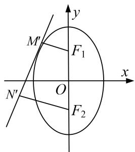

8. 解析 （1） 因为 $\triangle MNF_{2}$ 的周长为 8，所以 $4a = 8$ ，所以 $a = 2$ .
又因为 $\frac{c}{a}=\frac{\sqrt{3}}{2}$ ，所以 $c=\sqrt{3}$ ，所以 $b=\sqrt{a^{2}-c^{2}}=1$ ，所以椭圆C的标准方程为 $x^{2}+\frac{y^{2}}{4}=1$ 。  
（2）将直线 l 的方程 $y=kx+m$ 代入到椭圆方程 $x^{2}+\frac{y^{2}}{4}=1$ 中，得 $(4+k^{2})x^{2}+2kmx+m^{2}-4=0$ .
由直线与椭圆仅有一个公共点知， $\Delta=4k^{2}m^{2}-4(4+k^{2})(m^{2}-4)=0$ ，化简得 $m^{2}=4+k^{2}$ .
设 $d_{1} = |F_{1}M'| = \frac{|-\sqrt{3} + m|}{\sqrt{k^{2} + 1}}, d_{2} = |F_{2}N'| = \frac{|\sqrt{3} + m|}{\sqrt{k^{2} + 1}}$
所以 $d_{1}^{2}+d_{2}^{2}=\left(\frac{m-\sqrt{3}}{\sqrt{k^{2}+1}}\right)^{2}+\left(\frac{m+\sqrt{3}}{\sqrt{k^{2}+1}}\right)^{2}=\frac{2(m^{2}+3)}{k^{2}+1}=\frac{2(k^{2}+7)}{k^{2}+1},\quad d_{1}d_{2}=\frac{|-\sqrt{3}+m|}{\sqrt{k^{2}+1}}\cdot\frac{|\sqrt{3}+m|}{\sqrt{k^{2}+1}}=\frac{|m^{2}-3|}{k^{2}+1}=1,$
所以 $|M'N'|=\sqrt{|F_{1}F_{2}|^{2}-(d_{1}-d_{2})^{2}}=\sqrt{12-(d_{1}^{2}+d_{2}^{2}-2d_{1}d_{2})}=\sqrt{\frac{12k^{2}}{k^{2}+1}}.$
因为四边形 $F_{1}M'N'F_{2}$ 的面积 $S=\frac{1}{2}|M'N'|(d_{1}+d_{2})$ ,
所以 $S^{2}=\frac{1}{4}\times\frac{12k^{2}}{k^{2}+1}\times(d_{1}^{2}+d_{2}^{2}+2d_{1}d_{2})=\frac{3k^{2}(4k^{2}+16)}{(k^{2}+1)^{2}}$ ，令 $k^{2}+1=t(t\geq1)$ ,
则 $S^2 = \frac{3(t - 1)[4(t - 1) + 16]}{t^2} = \frac{12(t - 1)(t + 3)}{t^2} = \frac{12(t^2 + 2t - 3)}{t^2} = 12 + 12\left[-3\left(\frac{1}{t} - \frac{1}{3}\right)^2 + \frac{1}{3}\right]$ ,
所以当 $\frac{1}{t}=\frac{1}{3}$ 时， $S^{2}$ 取得最大值16，故 $S_{max}=4$ ，即四边形 $F_{1}M'N'F_{2}$ 面积的最大值为4.

9. (2013·全国II)平面直角坐标系 $xOy$ 中，过椭圆 $M: \frac{x^2}{a^2} + \frac{y^2}{b^2} = 1 (a > b > 0)$ 右焦点的直线 $x + y - \sqrt{3} = 0$ 交 $M$ 于 $A, B$ 两点， $P$ 为 $AB$ 的中点，且 $OP$ 的斜率为 $\frac{1}{2}$ .  
（1）求 M 的方程;  
（2） $C, D$ 为 $M$ 上的两点，若四边形 $ACBD$ 的对角线 $CD \perp AB$ ，求四边形 $ACBD$ 面积的最大值.

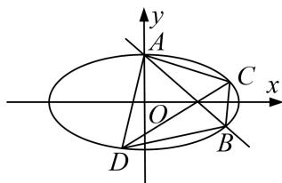

9. 解析 （1） 设 $A(x_{1}, y_{1})$ , $B(x_{2}, y_{2})$ , $P(x_{0}, y_{0})$ ，则 $\frac{x_{1}^{2}}{a^{2}} + \frac{y_{1}^{2}}{b^{2}} = 1$ , $\frac{x_{2}^{2}}{a^{2}} + \frac{y_{2}^{2}}{b^{2}} = 1$ , $\frac{y_{2} - y_{1}}{x_{2} - x_{1}} = -1$ ,
由此可得 $\frac{b^{2}(x_{2}+x_{1})}{a^{2}(y_{2}+y_{1})}=-\frac{y_{2}-y_{1}}{x_{2}-x_{1}}=1.$
因为 $x_{1}+x_{2}=2x_{0}$ ， $y_{1}+y_{2}=2y_{0}$ ， $\frac{y_{0}}{x_{0}}=\frac{1}{2}$ ，所以 $a^{2}=2b^{2}$ .
又由题意知，M 的右焦点为 $(\sqrt{3}, 0)$ ，故 $a^{2}-b^{2}=3$ .
因此 $a^{2}=6,\ b^{2}=3$ 。所以 M 的方程为 $\frac{x^{2}}{6}+\frac{y^{2}}{3}=1$ 。  
（2）由 $\left\{ \begin{array}{l}x + y - \sqrt{3} = 0,\\ \frac{x^2}{6} +\frac{y^2}{3} = 1, \end{array} \right.$ 解得 $\left\{ \begin{array}{l}x = \frac{4\sqrt{3}}{3},\\ y = -\frac{\sqrt{3}}{3}, \end{array} \right.$ 或 $\left\{ \begin{array}{ll}x = 0,\\ y = \sqrt{3}. \end{array} \right.$ 因此 $|AB| = \frac{4\sqrt{6}}{3}$ .
由题意可设直线 CD 的方程为 $y=x+n\left(-\frac{5\sqrt{3}}{3}<n<\sqrt{3}\right)$ ,
设 $C(x_{3},y_{3}),D(x_{4},y_{4})$ .由 $\left\{ \begin{array}{l}y = x + n,\\ \frac{x^2}{6} +\frac{y^2}{3} = 1 \end{array} \right.$ 得 $3x^{2} + 4nx + 2n^{2} - 6 = 0$ ，于是 $x_{3,4} = \frac{-2n\pm\sqrt{2(9 - n^2)}}{3}.$
因为直线 CD 的斜率为 1，所以 $\left|CD\right|=\sqrt{2}\left|x_{4}-x_{3}\right|=\frac{4}{3}\sqrt{9-n^{2}}$ .
由已知，四边形 $ACBD$ 的面积 $S = \frac{1}{2} |CD|\cdot |AB| = \frac{8\sqrt{6}}{9}\sqrt{9 - n^2}.$
当 $n = 0$ 时， $S$ 取得最大值，最大值为 $\frac{8\sqrt{6}}{3}$ 。所以四边形 $ACBD$ 面积的最大值为 $\frac{8\sqrt{6}}{3}$ 。

10. 已知椭圆 $C: \frac{x^2}{a^2} + \frac{y^2}{b^2} = 1 (a > b > 0)$ 的离心率为 $\frac{1}{2}$ , 过右焦点 $F$ 的直线 $l$ 与 $C$ 相交于 $A, B$ 两点, 当 $l$ 的斜率为 1 时, 坐标原点 $O$ 到 $l$ 的距离为 $\frac{\sqrt{2}}{2}$ .  
（1）求椭圆 C 的方程;  
（2）若 P, Q, M, N 是椭圆 C 上的四点，已知 $\overrightarrow{PF}$ 与 $\overrightarrow{FQ}$ 共线， $\overrightarrow{MF}$ 与 $\overrightarrow{FN}$ 共线，且 $\overrightarrow{PF} \cdot \overrightarrow{MF} = 0$ ，求四边形 PMQN 面积的最小值.

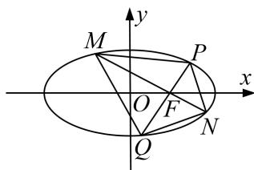

10. 解析 （1）由题意可知, $\frac{c}{a} = \frac{1}{2}$ , 设 $F(c, 0)$ , 则可得直线 $l$ 的方程为 $y = x - c$ ,
所以 $d_{O - l} = \frac{|c|}{\sqrt{2}} = \frac{\sqrt{2}}{2}, \therefore c = 1, \therefore a = 2, b^2 = 3, \therefore$ 椭圆 $C$ 的方程为 $\frac{x^2}{4} + \frac{y^2}{3} = 1.$  
（2）由（1）可得， $F(1,0)$ ，∵ $\overrightarrow{PF}\cdot\overrightarrow{MF}=0$ ，则 $MF\perp PF$ ，∴ $S_{四边形PMQN}=\frac{|PQ|\cdot|MN|}{2}$
设 $P(x_{1}, y_{1})$ ， $Q(x_{2}, y_{2})$ 。直线 PQ 的方程为 $y = k(x - 1)$ ，
联立方程 $\left\{ \begin{array}{l} y = k(x - 1), \\ \frac{x^2}{4} + \frac{y^2}{3} = 1, \end{array} \right.$ 可得， $(4k^2 + 3)x^2 - 8k^2x + 4k^2 - 12 = 0,$
$\therefore | P Q | = \sqrt {1 + k ^ {2}} \left| x _ {1} - x _ {2} \right| = \frac {\sqrt {(1 + k ^ {2}) (1 4 4 k ^ {2} + 1 4 4)}}{4 k ^ {2} + 3} = \frac {1 2 \left(k ^ {2} + 1\right)}{4 k ^ {2} + 3}, \tag {①}$
设 $MN: y = -\frac{1}{k} (x - 1)$ ，以 $-\frac{1}{k}$ 替换①中的 $k$ 可得， $|MN| = \frac{12(k^2 + 1)}{3k^2 + 4}$ .
$\therefore S _ {\text {四边形} P M Q N} = \frac {| P Q | \cdot | M N |}{2} = \frac {1 1 2 (k ^ {2} + 1) 1 2 (k ^ {2} + 1)}{2 4 k ^ {2} + 3 3 k ^ {2} + 4} = 7 2 \times \frac {k ^ {4} + 2 k ^ {2} + 1}{1 2 k ^ {4} + 2 5 k ^ {2} + 1 2} = 7 2 \times \frac {k ^ {2} + \frac {1}{k ^ {2}} + 2}{1 2 (k ^ {2} + \frac {1}{k ^ {2}}) + 2 5},$
设 $t = k^2 +\frac{1}{k^2}$ ，可得 $t\in [2, + \infty)$ ， $\therefore S_{\text{四边形}PMQN} = 72\times \frac{t + 2}{12t + 25} = 6\times (1 - \frac{1}{12t + 25}),$
∴ t=2 时， $(S_{\text{四边形 }PMQN})_{\min}=\frac{288}{49}.$

11. 已知抛物线 C 的顶点在原点 O，准线为 $x = -\frac{1}{2}$ .  
（1）求抛物线 C 的标准方程;  
（2）点 A, B 在 C 上，且 $OA \perp OB$ , $OD \perp AB$ ，垂足为 D，直线 OD 另交 C 于 E，当四边形 OAEB 面积最小时，求直线 AB 的方程.

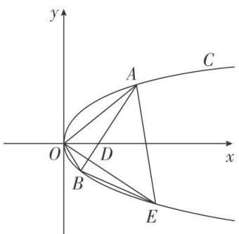

11. 解析 （1）设抛物线 C 的标准方程为 $y^{2}=2px(p>0)$ ，由已知得 $-\frac{p}{2}=-\frac{1}{2}\Rightarrow p=1$ .
故抛物线 C 的标准方程为 $y^{2}=2x$ .  
（2）先证直线 AB 过定点 $(2, 0)$ . 设直线 AB 的方程为 $x = ty + m (t \neq 0)$ , $A(x_{1}, y_{1})$ , $B(x_{2}, y_{2})$ ,
$O A \perp O B \Leftrightarrow x _ {1} x _ {2} + y _ {1} y _ {2} = 0 \Leftrightarrow \frac {y _ {1} ^ {2}}{2} \cdot \frac {y _ {2} ^ {2}}{2} + y _ {1} y _ {2} = 0 \Leftrightarrow y _ {1} y _ {2} = - 4.$
联立 $\left\{\begin{aligned}x&=ty+m,\\ y^{2}&=2x,\end{aligned}\right.$ $\Rightarrow y^{2}-2ty-2m=0\Rightarrow y_{1}y_{2}=-2m,\quad\therefore m=2$ ，故直线AB过定点(2，0).
由已知再设直线 AB 的方程为 $y=k(x-2)(k\neq0)$ ，则直线 OD 的方程为 $y=-\frac{1}{k}x$ .
联立 $\left\{ \begin{array}{l} y = -\frac{1}{k} x, \\ y^2 = 2x \end{array} \right.$ $\Rightarrow \frac{1}{k^2} x^2 = 2x \Rightarrow x_E = 2k^2, \therefore E(2k^2, -2k), \therefore |OE| = \sqrt{4k^4 + 4k^2} = 2|k|\sqrt{k^2 + 1}$ .
由 $y=k(x-2)(k\neq0)$ ，得 $x=\frac{1}{k}y+2$ 。联立 $\left\{\begin{aligned}x&=\frac{1}{k}y+2,\\ y^{2}&=2x\end{aligned}\right.$ $\Rightarrow y^{2}=2\left(\frac{1}{k}y+2\right)\Rightarrow y^{2}-\frac{2}{k}y-4=0,$
$\therefore y _ {1} + y _ {2} = \frac {2}{k}, y _ {1} y _ {2} = - 4 \Rightarrow | A B | = \sqrt {1 + \frac {1}{k ^ {2}}} \cdot \sqrt {(y _ {1} + y _ {2}) ^ {2} - 4 y _ {1} y _ {2}} = \sqrt {1 + \frac {1}{k ^ {2}}} \cdot \sqrt {\left(\frac {2}{k}\right) ^ {2} + 1 6} = \frac {2 \sqrt {k ^ {2} + 1} \cdot \sqrt {4 k ^ {2} + 1}}{k ^ {2}},$
$\therefore S _ {\text {四边形} O A E B} = \frac {1}{2} \times | A B | \times | O E | = 2 \sqrt {\frac {(k ^ {2} + 1) ^ {2} (4 k ^ {2} + 1)}{k ^ {2}}} = 2 \sqrt {4 k ^ {4} + 9 k ^ {2} + 6 + \frac {1}{k ^ {2}}}.$
设 $f(t)=4t^{2}+9t+6+\frac{1}{t}(t=k^{2}>0)$ ,
则 $f'(t) = 8t + 9 - \frac{1}{t^2} = \frac{(t + 1)(8t^2 + t - 1)}{t^2}$ . 由 $f'(t) = 0 \Rightarrow t_1 = -1$ , $t_{2,3} = \frac{-1 \pm \sqrt{33}}{16}$ .

易知 $f(t)$ 在 $\left(0, \frac{-1+\sqrt{33}}{16}\right)$ 上递减，在 $\left(\frac{-1+\sqrt{33}}{16}, +\infty\right)$ 上递增，
因此 $f(t)$ 在 $t=\frac{-1+\sqrt{33}}{16}$ 时取最小值，从而面积取得最小值，此时 $k=\pm\frac{\sqrt{\sqrt{33}-1}}{4}$ ,
故直线 $AB$ 的方程为 $y = \pm \frac{\sqrt{\sqrt{33} - 1}}{4} (x - 2)$ .

