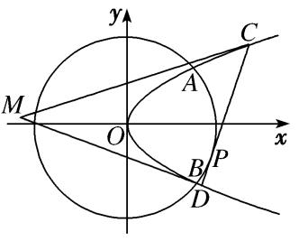
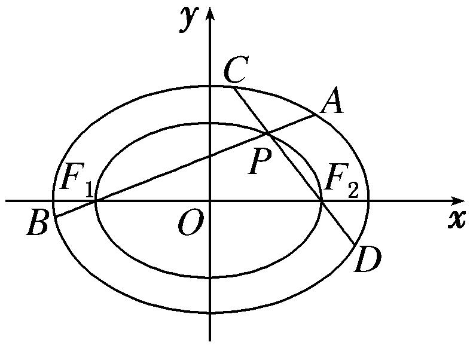
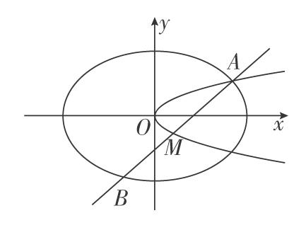
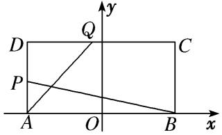
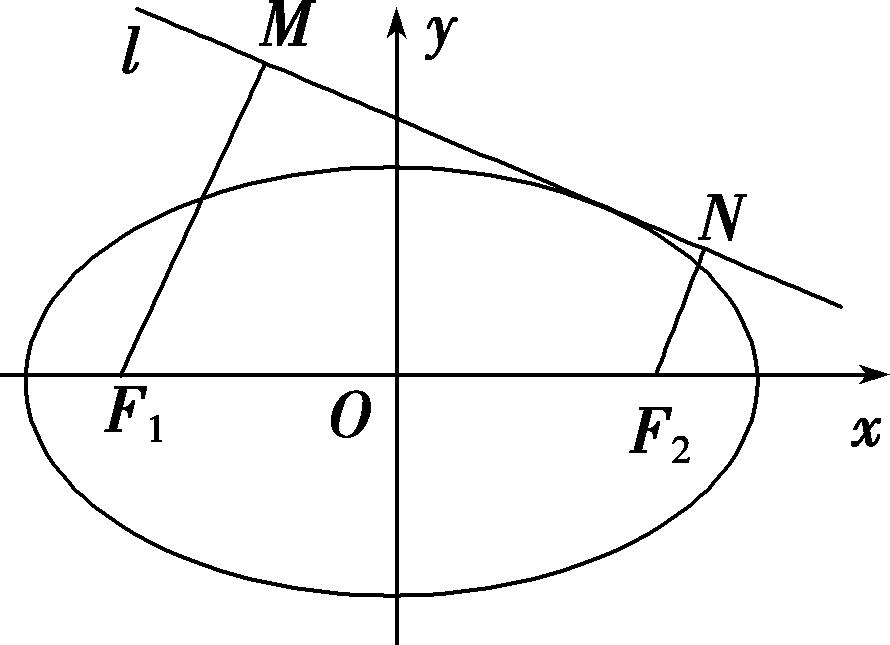
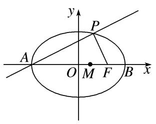
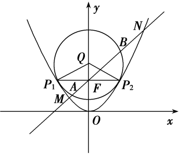
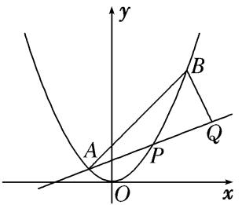
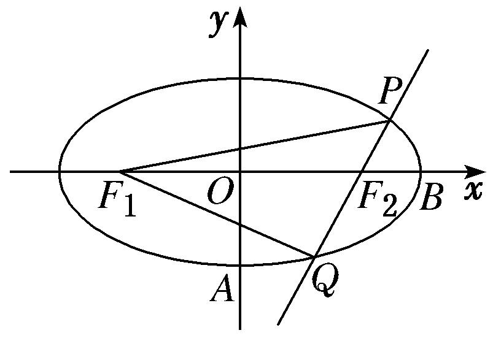
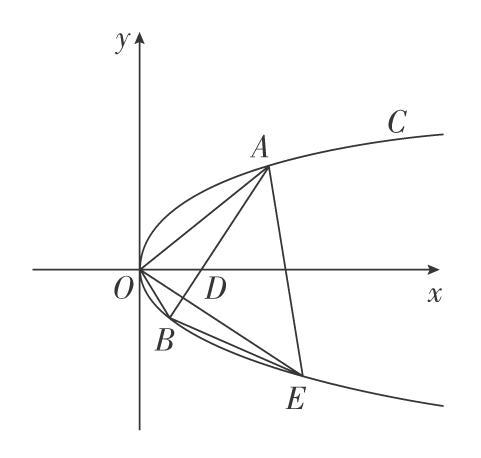

**专题29　距离型、参数型、数量积型及四边形面积型最值问题**

**最值问题——构造函数**

最值问题的基本解法有几何法和代数法：几何法是根据已知的几何量之间的相互关系、平面几何和解析几何知识加以解决的(如抛物线上的点到某个定点和焦点的距离之和、光线反射问题等)；代数法是建立求解目标关于某个或两个变量的函数，通过求解函数的最值普通方法、基本不等式方法、导数方法等解决的．

**【例题选讲】**

<strong>[例1]</strong>　如图，已知抛物线<em>E</em>：<em>y</em>2＝2<em>px</em>(<em>p</em>&gt;0)与圆<em>O</em>：<em>x</em>2＋<em>y</em>2＝8相交于<em>A</em>，<em>B</em>两点，且点<em>A</em>的横坐标为2．过劣弧<em>AB</em>上动点<em>P</em>(<em>x</em>0，<em>y</em>0)作圆<em>O</em>的切线交抛物线<em>E</em>于<em>C</em>，<em>D</em>两点，分别以<em>C</em>，<em>D</em>为切点作抛物线<em>E</em>的切线<em>l</em>1，<em>l</em>2，<em>l</em>1与<em>l</em>2相交于点<em>M</em>．

(1)求抛物线*E*的方程；

(2)求点*M*到直线*CD*距离的最大值．

<strong>[规范解答]</strong>　(1)把<em>xA</em>＝2代入<em>x</em>2＋<em>y</em>2＝8，得<em>y</em>＝4，故2<em>pxA</em>＝4，<em>p</em>＝1．

于是，抛物线<em>E</em>的方程为<em>y</em>2＝2<em>x</em>．

(2)设<em>C</em>，<em>D</em>，切线<em>l</em>1：<em>y</em>－<em>y</em>1＝<em>k</em>，代入<em>y</em>2＝2<em>x</em>得<em>ky</em>2－2<em>y</em>＋2<em>y</em>1－<em>ky</em>＝0，

由<em>Δ</em>＝0，解得<em>k</em>＝．∴<em>l</em>1的方程为<em>y</em>＝<em>x</em>＋，同理，<em>l</em>2的方程为<em>y</em>＝<em>x</em>＋．

联立解得易得直线<em>CD</em>的方程为<em>x</em>0<em>x</em>＋<em>y</em>0<em>y</em>＝8，

其中<em>x</em>0，<em>y</em>0满足<em>x</em>＋<em>y</em>＝8，<em>x</em>0∈[2,2 ]．

联立得<em>x</em>0<em>y</em>2＋2<em>y</em>0<em>y</em>－16＝0，则∴<em>M</em>(<em>x</em>，<em>y</em>)满足

即点<em>M</em>为．点<em>M</em>到直线<em>CD</em>：<em>x</em>0<em>x</em>＋<em>y</em>0<em>y</em>＝8的距离

*d*＝＝＝＝，令*f*(*x*)＝，*x*∈[2，2]，

则<em>f</em>(<em>x</em>)在[2，2 ]上单调递减，当且仅当<em>x</em>＝2时，<em>f</em>(<em>x</em>)取得最大值，故<em>d</em>max＝．

<strong>[例2]</strong>　如图，已知点<em>F</em>1，<em>F</em>2是椭圆<em>C</em>1：＋<em>y</em>2＝1的两个焦点，椭圆<em>C</em>2：＋<em>y</em>2＝<em>λ</em>经过点<em>F</em>1，<em>F</em>2，点<em>P</em>是椭圆<em>C</em>2上异于<em>F</em>1，<em>F</em>2的任意一点，直线<em>PF</em>1和<em>PF</em>2与椭圆<em>C</em>1的交点分别是<em>A</em>，<em>B</em>和<em>C</em>，<em>D</em>．设<em>AB</em>，<em>CD</em>的斜率分别为<em>k</em>，<em>k</em>′．

(1)求证：*k*·*k*′为定值；

(2)求|*AB*|·|*CD*|的最大值．

<strong>[规范解答]</strong>　(1)证明：因为点<em>F</em>1，<em>F</em>2是椭圆<em>C</em>1的两个焦点，故<em>F</em>1(－1,0)，<em>F</em>2(1,0)．

又点<em>F</em>1，<em>F</em>2是椭圆<em>C</em>2上的点，将<em>F</em>1或<em>F</em>2的坐标代入<em>C</em>2的方程得<em>λ</em>＝．

设点<em>P</em>的坐标是(<em>x</em>0，<em>y</em>0)，由点<em>P</em>是椭圆<em>C</em>2上的点，知＋<em>y</em>＝，①

∵直线<em>PF</em>1和<em>PF</em>2的斜率分别是<em>k</em>，<em>k</em>′(<em>k</em>≠0，<em>k</em>′≠0)，∴<em>kk</em>′＝·＝，②

由①②可得*kk*′＝－，即*k*·*k*′为定值．

(2)直线<em>PF</em>1的方程可表示为<em>y</em>＝<em>k</em>(<em>x</em>＋1)(<em>k</em>≠0)，与椭圆<em>C</em>1的方程联立，得到方程组

消去<em>y</em>得(1＋2<em>k</em>2)<em>x</em>2＋4<em>k</em>2<em>x</em>＋2<em>k</em>2－2＝0．

设<em>A</em>(<em>x</em>1，<em>y</em>1)，<em>B</em>(<em>x</em>2，<em>y</em>2)，则<em>x</em>1＋<em>x</em>2＝－，<em>x</em>1<em>x</em>2＝．

|<em>AB</em>|＝|<em>x</em>1－<em>x</em>2|＝＝．同理可求得|<em>CD</em>|＝，

则|*AB*|·|*CD*|＝＝4≤，

当且仅当*k*＝±时等号成立．故|*AB*|·|*CD*|的最大值为．

<strong>[例3]</strong>　已知椭圆＋＝1(<em>a</em>&gt;<em>b</em>&gt;0)的离心率<em>e</em>＝，左、右焦点分别为<em>F</em>1，<em>F</em>2，且<em>F</em>2与抛物线<em>y</em>2＝4<em>x</em>的焦点重合．

(1)求椭圆的标准方程；

(2)若过<em>F</em>1的直线交椭圆于<em>B</em>，<em>D</em>两点，过<em>F</em>2的直线交椭圆于<em>A</em>，<em>C</em>两点，且<em>AC</em>⊥<em>BD</em>，求|<em>AC</em>|＋|<em>BD</em>|的最小值．

<strong>[规范解答]</strong>　(1)抛物线<em>y</em>2＝4<em>x</em>的焦点坐标为(1,0)，所以<em>c</em>＝1，又因为<em>e</em>＝＝＝，所以<em>a</em>＝，

所以<em>b</em>2＝2，所以椭圆的标准方程为＋＝1．

(2)①当直线*BD*的斜率*k*存在且*k*≠0时，直线*BD*的方程为*y*＝*k*(*x*＋1)，

代入椭圆方程＋＝1，并化简得<em>x</em>2＋6<em>k</em>2<em>x</em>＋3<em>k</em>2－6＝0．

<em>Δ</em>＝36<em>k</em>4－4(3<em>k</em>2＋2)(3<em>k</em>2－6)＝48(<em>k</em>2＋1)&gt;0恒成立．

设<em>B</em>(<em>x</em>1，<em>y</em>1)，<em>D</em>(<em>x</em>2，<em>y</em>2)，则<em>x</em>1＋<em>x</em>2＝－，<em>x</em>1<em>x</em>2＝，

|<em>BD</em>|＝·|<em>x</em>1－<em>x</em>2|＝＝，

由题意知*AC*的斜率为－，所以|*AC*|＝＝．

|*AC*|＋|*BD*|＝4＝≥

＝＝．

当且仅当3<em>k</em>2＋2＝2<em>k</em>2＋3，即<em>k</em>＝±1时，上式取等号，故|<em>AC</em>|＋|<em>BD</em>|的最小值为．

②当直线*BD*的斜率不存在或等于零时，可得|*AC*|＋|*BD*|＝>．

综上，|*AC*|＋|*BD*|的最小值为．

<strong>[题后悟通]</strong>　题目中未直接告诉我们不等关系，则选择将|<em>AC</em>|＋|<em>BD</em>|表示为关于<em>k</em>的函数，再行处理，注意到3<em>k</em>2＋2＋2<em>k</em>2＋3＝5(<em>k</em>2＋1)，所以可以考虑基本不等式，但一定要注意等号是否能够成立.当然这里也可以利用换元法．令<em>k</em>2＋1＝<em>t</em> (<em>t</em>≥1)，将原式转化为来处理，但稍微比较复杂一些．

<strong>[例4]</strong>　已知椭圆<em>E</em>：＋＝1(<em>a</em>&gt;<em>b</em>&gt;0)的一个焦点为<em>F</em>2(1，0)，且该椭圆过定点<em>M</em>．

(1)求椭圆*E*的标准方程；

(2)设点<em>Q</em>(2，0)，过点<em>F</em>2作直线<em>l</em>与椭圆<em>E</em>交于<em>A</em>，<em>B</em>两点，且＝<em>λ</em>，<em>λ</em>∈[－2，－1]，以<em>QA</em>，<em>QB</em>为邻边作平行四边形<em>QACB</em>，求对角线<em>QC</em>长度的最小值．

<strong>[规范解答]</strong>　(1)由题易知<em>c</em>＝1，＋＝1，又<em>a</em>2＝<em>b</em>2＋<em>c</em>2，解得<em>b</em>2＝1，<em>a</em>2＝2，

故椭圆<em>E</em>的标准方程为＋<em>y</em>2＝1．

(2)设直线<em>l</em>：<em>x</em>＝<em>ky</em>＋1，由得(<em>k</em>2＋2)<em>y</em>2＋2<em>ky</em>－1＝0，<em>Δ</em>＝4<em>k</em>2＋4(<em>k</em>2＋2)＝8(<em>k</em>2＋1)&gt;0，

设<em>A</em>(<em>x</em>1，<em>y</em>1)，<em>B</em>(<em>x</em>2，<em>y</em>2)，则可得<em>y</em>1＋<em>y</em>2＝，<em>y</em>1<em>y</em>2＝．

＝＋＝(<em>x</em>1＋<em>x</em>2－4，<em>y</em>1＋<em>y</em>2)＝，

∴||2＝|＋|2＝16－＋，由此可知，||2的大小与<em>k</em>2的取值有关．

由＝<em>λ</em>可得<em>y</em>1＝<em>λy</em>2，<em>λ</em>＝，＝(<em>y</em>1<em>y</em>2≠0)．

从而*λ*＋＝＋＝＝，

由<em>λ</em>∈[－2，－1]得∈，从而－≤≤－2，解得0≤<em>k</em>2≤．

令<em>t</em>＝，则<em>t</em>∈，∴||2＝8<em>t</em>2－28<em>t</em>＋16＝82－，

∴当<em>t</em>＝时，|<em>QC</em>|min＝2．

<strong>[例5]</strong>　(2020·浙江)如图，已知椭圆<em>C</em>1：＋<em>y</em>2＝1，抛物线<em>C</em>2：<em>y</em>2＝2<em>px</em>(<em>p</em>＞0)，点<em>A</em>是椭圆<em>C</em>1与抛物线<em>C</em>2的交点，过点<em>A</em>的直线<em>l</em>交椭圆<em>C</em>1于点<em>B</em>，交抛物线<em>C</em>2于点<em>M</em>(<em>B</em>，<em>M</em>不同于<em>A</em>)．

(1)若<em>p</em>＝，求抛物线<em>C</em>2的焦点坐标；

(2)若存在不过原点的直线*l*使*M*为线段*AB*的中点，求*p*的最大值．

<strong>[规范解答]</strong>　(1)当<em>p</em>＝时，<em>C</em>2的方程为<em>y</em>2＝<em>x</em>，故抛物线<em>C</em>2的焦点坐标为．

(2)解法一：设<em>A</em>(<em>x</em>1，<em>y</em>1)，<em>B</em>(<em>x</em>2，<em>y</em>2)，<em>M</em>(<em>x</em>0，<em>y</em>0)，直线<em>l</em>的方程为<em>x</em>＝<em>λy</em>＋<em>m</em>，

由得(2＋<em>λ</em>2)<em>y</em>2＋2<em>λmy</em>＋<em>m</em>2－2＝0，所以<em>y</em>1＋<em>y</em>2＝，<em>y</em>0＝，<em>x</em>0＝<em>λy</em>0＋<em>m</em>＝，

因为<em>M</em>在抛物线上，所以＝⇒<em>m</em>＝．由得<em>y</em>2＝2<em>p</em>(<em>λy</em>＋<em>m</em>)，

即<em>y</em>2－2<em>pλy</em>－2<em>pm</em>＝0，所以<em>y</em>1＋<em>y</em>0＝2<em>pλ</em>，所以<em>x</em>1＋<em>x</em>0＝<em>λy</em>1＋<em>m</em>＋<em>λy</em>0＋<em>m</em>＝2<em>pλ</em>2＋2<em>m</em>，

所以<em>x</em>1＝2<em>pλ</em>2＋2<em>m</em>－．由得<em>x</em>2＋4<em>px</em>－2＝0，

所以<em>x</em>1＝＝－2<em>p</em>＋，

则－2<em>p</em>＋＝2<em>pλ</em>2＋2<em>m</em>·＝2<em>pλ</em>2＋＋8<em>p</em>≥16<em>p</em>，

所以≥18<em>p</em>，解得<em>p</em>2≤，<em>p</em>≤，

所以*p*的最大值为，此时*A*．

解法二：设直线<em>l</em>的方程为<em>x</em>＝<em>my</em>＋<em>t</em>(<em>m</em>≠0，<em>t</em>≠0)，<em>A</em>(<em>x</em>0，<em>y</em>0)．

将<em>x</em>＝<em>my</em>＋<em>t</em>代入＋<em>y</em>2＝1，得(<em>m</em>2＋2)<em>y</em>2＋2<em>mty</em>＋<em>t</em>2－2＝0，所以点<em>M</em>的纵坐标为<em>yM</em>＝－．

将<em>x</em>＝<em>my</em>＋<em>t</em>代入<em>y</em>2＝2<em>px</em>，得<em>y</em>2－2<em>pmy</em>－2<em>pt</em>＝0，所以<em>y</em>0<em>yM</em>＝－2<em>pt</em>，解得<em>y</em>0＝，

因此<em>x</em>0＝，由＋<em>y</em>＝1，解得＝42＋24≥160，

所以当*m*＝，*t*＝时，*p*取到最大值为．

<strong>[例6]</strong>　已知抛物线<em>x</em>2＝<em>y</em>，点<em>A</em>，<em>B</em>，抛物线上的点<em>P</em>(<em>x</em>0，<em>y</em>0)．

(1)求直线*AP*斜率的取值范围；

(2)*Q*是以*AB*为直径的圆上一点，且·＝0，求·的最大值．

<strong>[规范解答]</strong>　(1)设直线<em>AP</em>的斜率为<em>k</em>，则<em>k</em>＝＝<em>x</em>0－，

因为－＜<em>x</em>0＜，所以直线<em>AP</em>斜率的取值范围是(－1，1)．

(2)由题意可知，与同向共线，*BQ*⊥*AQ*，

联立直线<em>AP</em>与<em>BQ</em>的方程得解得点<em>Q</em>的横坐标是<em>xQ</em>＝．

因为|<em>AP</em>|＝＝(<em>k</em>＋1)，|<em>PQ</em>|＝(<em>xQ</em>－<em>x</em>0)＝－，

所以·＝||·||＝－(<em>k</em>－1)(<em>k</em>＋1)3．令<em>f</em>(<em>k</em>)＝－(<em>k</em>－1)(<em>k</em>＋1)3，因为<em>f</em>′(<em>k</em>)＝－(4<em>k</em>－2)(<em>k</em>＋1)2，

所以*f*(*k*)在区间上单调递增，在上单调递减，

因此当*k*＝时，·取得最大值．

<strong>[例7]</strong>　如图，在矩形<em>ABCD</em>中，|<em>AB</em>|＝4，|<em>AD</em>|＝2，<em>O</em>为<em>AB</em>的中点，<em>P</em>，<em>Q</em>分别是<em>AD</em>和<em>CD</em>上的点，且满足①＝，②直线<em>AQ</em>与<em>BP</em>的交点在椭圆<em>E</em>：＋＝1(<em>a</em>&gt;<em>b</em>&gt;0)上．

(1)求椭圆*E*的方程；

(2)设*R*为椭圆*E*的右顶点，*M*为椭圆*E*第一象限部分上一点，作*MN*垂直于*y*轴，垂足为*N*，求梯形*ORMN*面积的最大值．

<strong>[规范解答]</strong>　(1)设<em>A</em>Q与<em>BP</em>的交点为<em>G</em>(<em>x</em>，<em>y</em>)，<em>P</em>(－2，<em>y</em>1)，Q(<em>x</em>1，2)，由题可知，＝．

∵<em>kAG</em>＝<em>kA</em>Q，<em>kBG</em>＝<em>kBP</em>，∴＝，＝－，

从而有＝－＝－，整理得＋<em>y</em>2＝1，即椭圆<em>E</em>的方程为＋<em>y</em>2＝1．

(2)由(1)知<em>R</em>(2，0)，设<em>M</em>(<em>x</em>0，<em>y</em>0)，则<em>y</em>0＝，

从而梯形<em>ORMN</em>的面积<em>S</em>＝(2＋<em>x</em>0)<em>y</em>0＝，

令<em>t</em>＝2＋<em>x</em>0，则2&lt;<em>t</em>&lt;4，<em>S</em>＝．令<em>u</em>＝4<em>t</em>3－<em>t</em>4，则<em>u</em>′＝12<em>t</em>2－4<em>t</em>3＝4<em>t</em>2(3－<em>t</em>)，

当<em>t</em>∈(2，3)时，<em>u</em>′&gt;0，<em>u</em>＝4<em>t</em>3－<em>t</em>4单调递增，当<em>t</em>∈(3，4)时，<em>u</em>′&lt;0，<em>u</em>＝4<em>t</em>3－<em>t</em>4单调递减，

所以当*t*＝3时，*u*取得最大值，则*S*也取得最大值，最大值为．

<strong>[例8]</strong>　设点<em>F</em>1(－<em>c</em>，0)，<em>F</em>2(<em>c</em>，0)分别是椭圆<em>C</em>：＋<em>y</em>2＝1(<em>a</em>&gt;0)的左、右焦点，<em>P</em>为椭圆<em>C</em>上任意一点，且·的最小值为0．

(1)求椭圆*C*的方程；

(2)如图，动直线<em>l</em>：<em>y</em>＝<em>kx</em>＋<em>m</em>与椭圆<em>C</em>有且仅有一个公共点，作<em>F</em>1<em>M</em>⊥<em>l</em>，<em>F</em>2<em>N</em>⊥<em>l</em>分别交直线<em>l</em>于<em>M</em>，<em>N</em>两点，求四边形<em>F</em>1<em>MNF</em>2的面积<em>S</em>的最大值．

<strong>[规范解答]</strong>　(1)设<em>P</em>(<em>x</em>，<em>y</em>)，则＝(－<em>c</em>－<em>x</em>，－<em>y</em>)，＝(<em>c</em>－<em>x</em>，－<em>y</em>)，

所以·＝<em>x</em>2＋<em>y</em>2－<em>c</em>2＝<em>x</em>2＋1－<em>c</em>2，<em>x</em>∈[－<em>a</em>，<em>a</em>]，

由题意得，1－<em>c</em>2＝0，<em>c</em>＝1，则<em>a</em>2＝2，所以椭圆<em>C</em>的方程为＋<em>y</em>2＝1．

(2)将直线<em>l</em>的方程<em>l</em>：<em>y</em>＝<em>kx</em>＋<em>m</em>代入椭圆<em>C</em>的方程＋<em>y</em>2＝1中，得(2<em>k</em>2＋1)<em>x</em>2＋4<em>kmx</em>＋2<em>m</em>2－2＝0，

由直线<em>l</em>与椭圆<em>C</em>有且仅有一个公共点知<em>Δ</em>＝16<em>k</em>2<em>m</em>2－4(2<em>k</em>2＋1)(2<em>m</em>2－2)＝0，化简得<em>m</em>2＝2<em>k</em>2＋1．

设<em>d</em>1＝|<em>F</em>1<em>M</em>|＝，<em>d</em>2＝|<em>F</em>2<em>N</em>|＝．

①当<em>k</em>≠0时，设直线<em>l</em>的倾斜角为<em>θ</em>，则|<em>d</em>1－<em>d</em>2|＝|<em>MN</em>|·|tan <em>θ</em>|，所以|<em>MN</em>|＝·|<em>d</em>1－<em>d</em>2|，

所以<em>S</em>＝··|<em>d</em>1－<em>d</em>2|·(<em>d</em>1＋<em>d</em>2)＝＝＝，

因为<em>m</em>2＝2<em>k</em>2＋1，所以当<em>k</em>≠0时，|<em>m</em>|&gt;1，|<em>m</em>|＋&gt;2，即<em>S</em>&lt;2．

<strong>[例9]</strong>　已知椭圆的两个焦点为<em>F</em>1(－1，0)，<em>F</em>2(1，0)，且椭圆与直线<em>y</em>＝<em>x</em>－相切．

(1)求椭圆的方程；

(2)过<em>F</em>1作两条互相垂直的直线<em>l</em>1，<em>l</em>2，与椭圆分别交于点<em>P</em>，<em>Q</em>及<em>M</em>，<em>N</em>，求四边形<em>PMQN</em>面积的最小值．

<strong>[规范解答]</strong>　(1)设椭圆方程为＋＝1(<em>a</em>&gt;<em>b</em>&gt;0)，因为它与直线<em>y</em>＝<em>x</em>－只有一个公共点，

所以方程组只有一组解，消去<em>y</em>，整理得(<em>a</em>2＋<em>b</em>2)·<em>x</em>2－2<em>a</em>2<em>x</em>＋3<em>a</em>2－<em>a</em>2<em>b</em>2＝0．

所以<em>Δ</em>＝(－2<em>a</em>2)2－4(<em>a</em>2＋<em>b</em>2)(3<em>a</em>2－<em>a</em>2<em>b</em>2)＝0，化简得<em>a</em>2＋<em>b</em>2＝3．

又焦点为<em>F</em>1(－1，0)，<em>F</em>2(1，0)，所以<em>a</em>2－<em>b</em>2＝1，联立上式解得<em>a</em>2＝2，<em>b</em>2＝1．

所以椭圆的方程为＋<em>y</em>2＝1．

(2)若直线<em>PQ</em>的斜率不存在(或为0)，则<em>S</em>四边形<em>PMQN</em>＝＝＝2．

若直线*PQ*的斜率存在，设为*k*(*k*≠0)，则直线*MN*的斜率为－．

所以直线<em>PQ</em>的方程为<em>y</em>＝<em>kx</em>＋<em>k</em>，设<em>P</em>(<em>x</em>1，<em>y</em>1)，<em>Q</em>(<em>x</em>2，<em>y</em>2)，

联立方程得化简得(2<em>k</em>2＋1)<em>x</em>2＋4<em>k</em>2<em>x</em>＋2<em>k</em>2－2＝0，则<em>x</em>1＋<em>x</em>2＝，<em>x</em>1<em>x</em>2＝，

所以|<em>PQ</em>|＝|<em>x</em>1－<em>x</em>2|＝＝2×，

同理可得|*MN*|＝2×．

所以<em>S</em>四边形<em>PMQN</em>＝＝4×＝4×＝4×

＝4×＝4×．

因为4<em>k</em>2＋＋10≥2＋10＝18(当且仅当<em>k</em>2＝1时取等号)，

所以∈，所以4×∈．

综上所述，四边形*PMQN*面积的最小值为．

<strong>[例10]</strong>　已知椭圆的中心在坐标原点，<em>A</em>(2，0)，<em>B</em>(0，1)是它的两个顶点，直线<em>y</em>＝<em>kx</em>(<em>k</em>&gt;0)与直线<em>AB</em>相交于点<em>D</em>，与椭圆相交于<em>E</em>，<em>F</em>两点．

(1)若＝6，求*k*的值；

(2)求四边形*AEBF*面积的最大值．

<strong>[规范解答]</strong>　(1)由题设条件可得，椭圆的方程为＋<em>y</em>2＝1，直线<em>AB</em>的方程为<em>x</em>＋2<em>y</em>－2＝0．

设<em>D</em>(<em>x</em>0，<em>kx</em>0)，<em>E</em>(<em>x</em>1，<em>kx</em>1)，<em>F</em>(<em>x</em>2，<em>kx</em>2)，其中<em>x</em>1&lt;<em>x</em>2，

由得(1＋4<em>k</em>2)<em>x</em>2＝4，解得<em>x</em>2＝－<em>x</em>1＝ ．①

由＝6，得(<em>x</em>0－<em>x</em>1，<em>k</em>(<em>x</em>0－<em>x</em>1))＝6(<em>x</em>2－<em>x</em>0，<em>k</em>(<em>x</em>2－<em>x</em>0))，即<em>x</em>0－<em>x</em>1＝6(<em>x</em>2－<em>x</em>0)，

∴<em>x</em>0＝(6<em>x</em>2＋<em>x</em>1)＝<em>x</em>2＝．由<em>D</em>在<em>AB</em>上，得<em>x</em>0＋2<em>kx</em>0－2＝0，∴<em>x</em>0＝．

∴＝，化简，得24<em>k</em>2－25<em>k</em>＋6＝0，解得<em>k</em>＝或<em>k</em>＝．

(2)根据点到直线的距离公式和①式可知，点*E*，*F*到*AB*的距离分别为

<em>d</em>1＝＝，<em>d</em>2＝＝，

又|<em>AB</em>|＝＝，∴四边形<em>AEBF</em>的面积为<em>S</em>＝|<em>AB</em>|(<em>d</em>1＋<em>d</em>2)＝××＝

＝2＝2＝2≤2＝2，

当且仅当4*k*＝(*k*>0)，即*k*＝时，等号成立．故四边形*AEBF*面积的最大值为2．

**【对点训练】**

1．如图所示，点*A*，*B*分别是椭圆＋＝1长轴的左、右端点，点*F*是椭圆的右焦点，点*P*在椭圆上，

且位于*x*轴上方，*PA*⊥*PF*．

(1)求点*P*的坐标；

(2)设*M*是椭圆长轴*AB*上的一点，点*M*到直线*AP*的距离等于|*MB*|，求椭圆上的点到点*M*的距离*d*的最小值．

1．<strong>解析</strong>　(1)由已知可得点<em>A</em>(－6，0)，<em>F</em>(4，0)，设点<em>P</em>的坐标是(<em>x</em>，<em>y</em>)，

则＝(*x*＋6，*y*)，＝(*x*－4，*y*)，

∵<em>PA</em>⊥<em>PF</em>，∴·＝0，则可得2<em>x</em>2＋9<em>x</em>－18＝0，得<em>x</em>＝或<em>x</em>＝－6．

由于*y*>0，故*x*＝，于是*y*＝．∴点*P*的坐标是．

(2)由(1)可得直线*AP*的方程是*x*－*y*＋6＝0，点*B*(6，0)．

设点*M*的坐标是(*m*，0)，则点*M*到直线*AP*的距离是，于是＝|*m*－6|，

又－6≤*m*≤6，解得*m*＝2．

由椭圆上的点(*x*，*y*)到点*M*的距离为*d*，

得<em>d</em>2＝(<em>x</em>－2)2＋<em>y</em>2＝<em>x</em>2－4<em>x</em>＋4＋20－<em>x</em>2＝2＋15，由于－6≤<em>x</em>≤6，

由<em>f</em>(<em>x</em>)＝2＋15的图象可知，当<em>x</em>＝时，<em>d</em>取最小值，且最小值为．

2．已知直线<em>l</em>：<em>x</em>－<em>y</em>＋1＝0与焦点为<em>F</em>的抛物线<em>C</em>：<em>y</em>2＝2<em>px</em>(<em>p</em>＞0)相切．

(1)求抛物线*C*的方程；

(2)过焦点*F*的直线*m*与抛物线*C*分别相交于*A*，*B*两点，求*A*，*B*两点到直线*l*的距离之和的最小值．

2．解析　(1)∵直线<em>l</em>：<em>x</em>－<em>y</em>＋1＝0与抛物线<em>C</em>：<em>y</em>2＝2<em>px</em>(<em>p</em>＞0)相切，

联立消去<em>x</em>得<em>y</em>2－2<em>py</em>＋2<em>p</em>＝0，从而<em>Δ</em>＝4<em>p</em>2－8<em>p</em>＝0，解得<em>p</em>＝2或<em>p</em>＝0(舍)．

∴抛物线<em>C</em>的方程为<em>y</em>2＝4<em>x</em>．

(2)由于直线<em>m</em>的斜率不为0，可设直线<em>m</em>的方程为<em>ty</em>＝<em>x</em>－1，<em>A</em>(<em>x</em>1，<em>y</em>1)，<em>B</em>(<em>x</em>2，<em>y</em>2)．

联立消去<em>x</em>得<em>y</em>2－4<em>ty</em>－4＝0，∵<em>Δ</em>＞0，∴<em>y</em>1＋<em>y</em>2＝4<em>t</em>，即<em>x</em>1＋<em>x</em>2＝4<em>t</em>2＋2，

∴线段<em>AB</em>的中点<em>M</em>的坐标为(2<em>t</em>2＋1，2<em>t</em>)．

设点<em>A</em>到直线<em>l</em>的距离为<em>dA</em>，点<em>B</em>到直线<em>l</em>的距离为<em>dB</em>，点<em>M</em>到直线<em>l</em>的距离为<em>d</em>，

则<em>dA</em>＋<em>dB</em>＝2<em>d</em>＝2·＝2|<em>t</em>2－<em>t</em>＋1|＝2，

∴当*t*＝时，*A*，*B*两点到直线*l*的距离之和最小，最小值为．

3．如图，抛物线<em>C</em>：<em>x</em>2＝2<em>px</em>(<em>p</em>＞0)的焦点为<em>F</em>(0，1)，取垂直于<em>y</em>轴的直线与抛物线交于不同的两点<em>P</em>1，

<em>P</em>2，过<em>P</em>1，<em>P</em>2作圆心为<em>Q</em>的圆，使抛物线上其余点均在圆外，且<em>P</em>1<em>Q</em>⊥<em>P</em>2<em>Q</em>．

(1)求抛物线*C*和圆*Q*的方程；

(2)过点*F*作直线*l*，与抛物线*C*和圆*Q*依次交于点*M*，*A*，*B*，*N*，求|*MN*|·|*AB*|的最小值．

3．解析　(1)因为抛物线<em>C</em>：<em>x</em>2＝2<em>py</em>(<em>p</em>＞0)的焦点为<em>F</em>(0，1)，

所以＝1，解得<em>p</em>＝2，所以抛物线<em>C</em>的方程为<em>x</em>2＝4<em>y</em>．

由抛物线和圆的对称性，可设圆<em>Q</em>：<em>x</em>2＋(<em>y</em>－<em>b</em>)2＝<em>r</em>2，

由题意知抛物线<em>C</em>与圆<em>Q</em>相切，由得<em>y</em>2－(2<em>b</em>－4)<em>y</em>＋<em>b</em>2－<em>r</em>2＝0，

所以<em>Δ</em>＝[－(2<em>b</em>－4)]2－4(<em>b</em>2－<em>r</em>2)＝0，有4<em>b</em>＝4＋<em>r</em>2，①

又由<em>P</em>1<em>Q</em>⊥<em>P</em>2<em>Q</em>，得△<em>P</em>1<em>QP</em>2是等腰直角三角形，

所以<em>P</em>2，代入抛物线方程有＝4<em>b</em>－2<em>r</em>，②

联立①②解得<em>r</em>＝2，<em>b</em>＝3，所以圆<em>Q</em>的方程为<em>x</em>2＋(<em>y</em>－3)2＝8．

(2)由题知直线*l*的斜率一定存在，设直线*l*的方程为*y*＝*kx*＋1，

圆心*Q*(0,3)到直线*l*的距离为*d*＝，所以|*AB*|＝2＝4．

由得<em>y</em>2－(2＋4<em>k</em>2)<em>y</em>＋1＝0．

设<em>M</em>(<em>x</em>1，<em>y</em>1)，<em>N</em>(<em>x</em>2，<em>y</em>2)，则<em>y</em>1＋<em>y</em>2＝4<em>k</em>2＋2，由抛物线定义知|<em>MN</em>|＝<em>y</em>1＋<em>y</em>2＋2＝4(1＋<em>k</em>2)．

所以|<em>MN</em>|·|<em>AB</em>|＝16(1＋<em>k</em>2)，设<em>t</em>＝1＋<em>k</em>2(<em>t</em>≥1)，

则|*MN*|·|*AB*|＝16t＝16＝16(*t*≥1)，

所以当*t*＝1，即*k*＝0时，*MN*·*AB*有最小值16

4．(2017·浙江)如图，已知抛物线<em>x</em>2＝<em>y</em>，点<em>A</em>，<em>B</em>，抛物线上的点<em>P</em>(<em>x</em>，<em>y</em>)．过

点*B*作直线*AP*的垂线，垂足为*Q*．

(1)求直线*AP*斜率的取值范围；

(2)求|*PA*|·|*PQ*|的最大值．

4．解析　(1)设直线*AP*的斜率为*k*，*k*＝＝*x*－，因为－<*x*<，所以－1<*x*－<1，

即直线*AP*斜率的取值范围是(－1，1)．

(2)设直线*AP*的斜率为*k*．则直线*AP*的方程为*y*－＝*k*，即*kx*－*y*＋*k*＋＝0，

因为直线*BQ*与直线*AP*垂直，所以直线*BQ*的方程为*x*＋*ky*－*k*－＝0，

联立解得点<em>Q</em>的横坐标<em>xQ</em>＝．

因为|<em>PA</em>|＝＝ (<em>k</em>＋1)，|<em>PQ</em>|＝(<em>xQ</em>－<em>x</em>)＝－，

所以|<em>PA</em>|·|<em>PQ</em>|＝－(<em>k</em>－1)(<em>k</em>＋1)3．

令<em>f</em>(<em>k</em>)＝－(<em>k</em>－1)(<em>k</em>＋1)3，因为<em>f</em>′(<em>k</em>)＝－(4<em>k</em>－2)(<em>k</em>＋1)2，令<em>f</em>(<em>k</em>)＝0，得<em>k</em>＝或<em>k</em>＝－1(舍)，

所以*f*(*k*)在区间上单调递增，上单调递减，因此当*k*＝时，|*PA*|·|*PQ*|取得最大值．

5．已知椭圆<em>C</em>：＋＝1(<em>a</em>&gt;<em>b</em>&gt;0)，其中<em>F</em>1，<em>F</em>2，为左右焦点，且离心率为，直线<em>l</em>与椭圆交于两

不同点<em>P</em>(<em>x</em>1，<em>y</em>1)，<em>Q</em>(<em>x</em>2，<em>y</em>2)，当直线<em>l</em>过椭圆<em>C</em>右焦点<em>F</em>2且倾斜角为时，原点<em>O</em>到直线<em>l</em>的距离为．

(1)求椭圆*C*的方程；

(2)若＋＝，当△*OPQ*的面积为时，求||·||的最大值．

5．解析　(1)设直线<em>l</em>：<em>y</em>＝<em>x</em>－<em>c</em>，∴<em>dO</em>－<em>l</em>＝＝，又＝，∴<em>c</em>＝1，<em>a</em>2＝3，<em>b</em>2＝2，

∴椭圆*C*的方程为＋＝1．

(2)若直线<em>l</em>斜率存在，设<em>l</em>：<em>y</em>＝<em>kx</em>＋<em>m</em>，<em>P</em>(<em>x</em>1，<em>y</em>1)，<em>Q</em>(<em>x</em>2，<em>y</em>2)，

∵＋＝，∴<em>N</em>(<em>x</em>1＋<em>x</em>2，<em>y</em>1＋<em>y</em>2)，

联立方程，消去<em>y</em>可得，(3<em>k</em>2＋2)<em>x</em>2＋6<em>kmx</em>＋3<em>m</em>2－6＝0，

<em>Δ</em>＝(6<em>km</em>)2－4(3<em>k</em>2＋2)(3<em>m</em>2－6)&gt;0，化简，得<em>m</em>2&lt;3<em>k</em>2＋2，∴<em>x</em>1＋<em>x</em>2＝－，<em>x</em>1<em>x</em>2＝，

<em>y</em>1＋<em>y</em>2＝(<em>kx</em>1＋<em>m</em>)＋(<em>kx</em>2＋<em>m</em>)＝<em>k</em>(<em>x</em>1＋<em>x</em>2)＋2<em>m</em>＝，∴<em>N</em>(－，)，

考虑|<em>PQ</em>|＝|<em>x</em>1－<em>x</em>2|＝ ＝2 ，

∵原点*O*到直线*l*的距离*d*＝，

∴<em>S</em>△<em>OPQ</em>＝|<em>PQ</em>|·<em>d</em>＝·2· ·＝，

∴2|<em>m</em>|＝3<em>k</em>2＋2，∴4<em>m</em>2(3<em>k</em>2＋2－<em>m</em>2)＝(3<em>k</em>2＋2)2，∴(3<em>k</em>2＋2)2－4<em>m</em>2(3<em>k</em>2＋2)＋(2<em>m</em>2)2＝0，

即(3<em>k</em>2＋2－2<em>m</em>2)2＝0，∴3<em>k</em>2＋2＝2<em>m</em>2，<em>N</em>(－，)＝(－，)，

∴|<em>ON</em>|2＝＋＝＋＝6－，|<em>PQ</em>|2＝＝4＋，

∴|<em>ON</em>|2·|<em>PQ</em>|2＝(6－)(4＋)≤()2＝25．

等号成立条件：6－＝4＋，∴*m*＝±时，||·||的最大值是5．

当斜率不存在时，<em>P</em>，<em>Q</em>关于<em>x</em>轴对称，设<em>P</em>(<em>x</em>0，<em>y</em>0)，<em>x</em>0，<em>y</em>0&gt;0，

∴<em>S</em>△<em>OPQ</em>＝|<em>x</em>0||2<em>y</em>0|＝<em>x</em>0<em>y</em>0＝，再由＋＝1，可得，<em>x</em>0＝，<em>y</em>0＝1，可计算出述||·||＝2&lt;5，

所以综上所述||·||的最大值是5．

6．已知椭圆＋＝1(*a*＞*b*＞0)的离心率*e*＝，原点到过点*A*(0，－*b*)和*B*(*a，* 0)的直线的距离为．

(1)求椭圆的方程；

(2)设<em>F</em>1，<em>F</em>2为椭圆的左、右焦点，过<em>F</em>2作直线交椭圆于<em>P</em>，<em>Q</em>两点，求△<em>PQF</em>1内切圆半径<em>r</em>的最大值．

6．<strong>解析</strong>　(1)直线<em>AB</em>的方程为＋＝1，即<em>bx</em>－<em>ay</em>－<em>ab</em>＝0．

原点到直线<em>AB</em>的距离为＝，即3<em>a</em>2＋3<em>b</em>2＝4<em>a</em>2<em>b</em>2，①

由<em>e</em>＝＝，得<em>c</em>2＝<em>a</em>2，②

又<em>a</em>2＝<em>b</em>2＋<em>c</em>2，③

所以联立①②③可得<em>a</em>2＝3，<em>b</em>2＝1，<em>c</em>2＝2．

故椭圆的方程为＋<em>y</em>2＝1．

(2)由(1)得<em>F</em>1(－，0)，<em>F</em>2(，0)，设<em>P</em>(<em>x</em>1，<em>y</em>1)，<em>Q</em>(<em>x</em>2，<em>y</em>2)．

易知直线*PQ*的斜率不为0，故设其方程为*x*＝*ky*＋，

联立直线与椭圆的方程得(<em>k</em>2＋3)<em>y</em>2＋2<em>ky</em>－1＝0．

故④

而<em>S</em>△<em>PQF</em>1＝<em>S</em>△<em>F</em>1<em>F</em>2<em>P</em>＋<em>S</em>△<em>F</em>1<em>F</em>2<em>Q</em>＝|<em>F</em>1<em>F</em>2||<em>y</em>1－<em>y</em>2|＝，⑤

将④代入⑤，得<em>S</em>△<em>PQF</em>1＝＝．

又<em>S</em>△<em>PQF</em>1＝(|<em>PF</em>1|＋|<em>F</em>1<em>Q</em>|＋|<em>PQ</em>|)·<em>r</em>＝2<em>a</em>·<em>r</em>＝2<em>r</em>，所以＝2<em>r</em>，

故*r*＝＝≤，当且仅当＝，即*k*＝±1时取等号．

故△<em>PQF</em>1内切圆半径<em>r</em>的最大值为．

7．在平面直角坐标系*xOy*中，已知点*F*(1，0)，直线*l*：*x*＝－1，点*P*在直线*l*上移动，*R*是线段*PF*与*y*

轴的交点，动点*Q*满足：*RQ*⊥*PF*，*PQ*⊥*l*．

(1)求动点*Q*的轨迹*E*的方程；

(2)若直线*PF*与曲线*E*交于*A*，*B*两点，过点*F*作直线*PF*的垂线与曲线*E*相交于*C*，*D*两点，求·＋·的最大值．

7．<strong>解析</strong>　(1)由题意可知<em>R</em>是线段<em>PF</em>的中点，因为<em>RQ</em>⊥<em>PF</em>，所以<em>RQ</em>所在直线为线段<em>PF</em>的垂直平分线，

连接*QF*，所以|*QP*|＝|*QF*|，又*PQ*⊥*l*，所以点*Q*到点*F*的距离和到直线*l*的距离相等，

设<em>Q</em>(<em>x</em>，<em>y</em>)，则|<em>x</em>＋1|＝，化简得<em>y</em>2＝4<em>x</em>，所以动点<em>Q</em>的轨迹<em>E</em>的方程为<em>y</em>2＝4<em>x</em>．

(2)由题可知直线*PF*的斜率存在且不为0，设直线*PF*：*y*＝*k*(*x*－1)(*k*≠0)，则*CD*：*y*＝－(*x*－1)，

联立方程，得消去<em>y</em>，得<em>k</em>2<em>x</em>2－(2<em>k</em>2＋4)<em>x</em>＋<em>k</em>2＝0，

设<em>A</em>(<em>x</em>1，<em>y</em>1)，<em>B</em>(<em>x</em>2，<em>y</em>2)，则<em>x</em>1＋<em>x</em>2＝，<em>x</em>1·<em>x</em>2＝1．

因为向量，方向相反，

所以·＝－||||＝－(<em>x</em>1＋1)(<em>x</em>2＋1)＝－(<em>x</em>1<em>x</em>2＋<em>x</em>1＋<em>x</em>2＋1)＝－．

同理，设<em>C</em>(<em>x</em>3，<em>y</em>3)，<em>D</em>(<em>x</em>4，<em>y</em>4)，可得·＝－||·||＝－4<em>k</em>2－4，

所以·＋·＝－4－8，

因为<em>k</em>2＋≥2，当且仅当<em>k</em>2＝1，即<em>k</em>＝±1时取等号，

所以·＋·的最大值为－16．

8．已知椭圆<em>C</em>：＋＝1 (<em>a</em>&gt;<em>b</em>&gt;0)的上、下两个焦点分别为<em>F</em>1，<em>F</em>2，过<em>F</em>1的直线交椭圆于<em>M</em>，<em>N</em>两点，

且△<em>MNF</em>2的周长为8，椭圆<em>C</em>的离心率为．

(1)求椭圆*C*的标准方程；

(2)已知<em>O</em>为坐标原点，直线<em>l</em>：<em>y</em>＝<em>kx</em>＋<em>m</em>与椭圆<em>C</em>有且仅有一个公共点，点<em>M</em>′，<em>N</em>′是直线<em>l</em>上的两点，且<em>F</em>1<em>M</em>′⊥<em>l</em>，<em>F</em>2<em>N</em>′⊥<em>l</em>，求四边形<em>F</em>1<em>M</em>′<em>N</em>′<em>F</em>2面积<em>S</em>的最大值．

8．解析　(1)因为△<em>MNF</em>2的周长为8，所以4<em>a</em>＝8，所以<em>a</em>＝2．

又因为＝，所以<em>c</em>＝，所以<em>b</em>＝＝1，所以椭圆<em>C</em>的标准方程为<em>x</em>2＋＝1．

(2)将直线<em>l</em>的方程<em>y</em>＝<em>kx</em>＋<em>m</em>代入到椭圆方程<em>x</em>2＋＝1中，得(4＋<em>k</em>2)<em>x</em>2＋2<em>kmx</em>＋<em>m</em>2－4＝0．

由直线与椭圆仅有一个公共点知，<em>Δ</em>＝4<em>k</em>2<em>m</em>2－4(4＋<em>k</em>2)(<em>m</em>2－4)＝0，化简得<em>m</em>2＝4＋<em>k</em>2．

设<em>d</em>1＝|<em>F</em>1<em>M</em>′|＝，<em>d</em>2＝|<em>F</em>2<em>N</em>′|＝，

所以<em>d</em>＋<em>d</em>＝2＋2＝＝，<em>d</em>1<em>d</em>2＝·＝＝1，

所以|*M*′*N*′|＝＝＝ ．

因为四边形<em>F</em>1<em>M</em>′<em>N</em>′<em>F</em>2的面积<em>S</em>＝|<em>M</em>′<em>N</em>′|(<em>d</em>1＋<em>d</em>2)，

所以<em>S</em>2＝××(<em>d</em>＋<em>d</em>＋2<em>d</em>1<em>d</em>2)＝，令<em>k</em>2＋1＝<em>t</em>(<em>t</em>≥1)，

则<em>S</em>2＝＝＝＝12＋12，

所以当＝时，<em>S</em>2取得最大值16，故<em>S</em>max＝4，即四边形<em>F</em>1<em>M</em>′<em>N</em>′<em>F</em>2面积的最大值为4．

9．(2013·全国Ⅱ)平面直角坐标系*xOy*中，过椭圆*M*：＋＝1 (*a*>*b*>0)右焦点的直线*x*＋*y*－＝0交*M*

于*A*，*B*两点，*P*为*AB*的中点，且*OP*的斜率为．

(1)求*M*的方程；

(2)*C*，*D*为*M*上的两点，若四边形*ACBD*的对角线*CD*⊥*AB*，求四边形*ACBD*面积的最大值．

9．解析　(1)设<em>A</em>(<em>x</em>1，<em>y</em>1)，<em>B</em>(<em>x</em>2，<em>y</em>2)，<em>P</em>(<em>x</em>0，<em>y</em>0)，则＋＝1，＋＝1，＝－1，

由此可得＝－＝1．

因为<em>x</em>1＋<em>x</em>2＝2<em>x</em>0，<em>y</em>1＋<em>y</em>2＝2<em>y</em>0，＝，所以<em>a</em>2＝2<em>b</em>2．

又由题意知，<em>M</em>的右焦点为(，0)，故<em>a</em>2－<em>b</em>2＝3．

因此<em>a</em>2＝6，<em>b</em>2＝3．所以<em>M</em>的方程为＋＝1．

(2)由解得或因此|*AB*|＝．

由题意可设直线*CD*的方程为*y*＝*x*＋*n*，

设<em>C</em>(<em>x</em>3，<em>y</em>3)，<em>D</em>(<em>x</em>4，<em>y</em>4)．由得3<em>x</em>2＋4<em>nx</em>＋2<em>n</em>2－6＝0，于是<em>x</em>3,4＝．

因为直线<em>CD</em>的斜率为1，所以|<em>CD</em>|＝|<em>x</em>4－<em>x</em>3|＝．

由已知，四边形*ACBD*的面积*S*＝|*CD*|·|*AB*|＝．

当*n*＝0时，*S*取得最大值，最大值为．所以四边形*ACBD*面积的最大值为．

10．已知椭圆*C*：＋＝1(*a*＞*b*＞0)的离心率为，过右焦点*F*的直线*l*与*C*相交于*A*，*B*两点，当*l*的斜

率为1时，坐标原点*O*到*l*的距离为．

(1)求椭圆*C*的方程；

(2)若*P*，*Q*，*M*，*N*是椭圆*C*上的四点，已知与共线，与共线，且·＝0，求四边形*PMQN*面积的最小值．

10．解析　(1)由题意可知，＝，设*F*(*c*，0)，则可得直线*l*的方程为*y*＝*x*－*c*，

所以<em>dO</em>－<em>l</em>＝＝，∴<em>c</em>＝1，∴<em>a</em>＝2，<em>b</em>2＝3，∴椭圆<em>C</em>的方程为＋＝1．

(2)由(1)可得，<em>F</em>(１，0)，∵·＝0，则<em>MF</em>⊥<em>PF</em>，∴<em>S</em>四边形<em>PMQN</em>＝，

设<em>P</em>(<em>x</em>1，<em>y</em>1)，<em>Q</em>(<em>x</em>2，<em>y</em>2)．直线<em>PQ</em>的方程为<em>y</em>＝<em>k</em>(<em>x</em>－1)，

联立方程可得，(4<em>k</em>2＋3)<em>x</em>2－8<em>k</em>2<em>x</em>＋4<em>k</em>2－12＝0，

∴|<em>PQ</em>|＝|<em>x</em>1－<em>x</em>2|＝＝，①

设*MN*：*y*＝－(*x*－1)，以－替换①中的*k*可得，|*MN*|＝．

∴<em>S</em>四边形<em>PMQN</em>＝＝＝72×＝72×，

设<em>t</em>＝<em>k</em>2＋，可得<em>t</em>∈[2，＋∞)，∴<em>S</em>四边形<em>PMQN</em>＝72×＝6×(1－)，

∴<em>t</em>＝2时，(<em>S</em>四边形<em>PMQN</em>)min＝．

11．已知抛物线*C*的顶点在原点*O*，准线为*x*＝－．

(1)求抛物线*C*的标准方程；

(2)点*A*，*B*在*C*上，且*OA*⊥*OB*，*OD*⊥*AB*，垂足为*D*，直线*OD*另交*C*于*E*，当四边形*OAEB*面积最小时，求直线*AB*的方程．

11．<strong>解析</strong>　(1)设抛物线<em>C</em>的标准方程为<em>y</em>2＝2<em>px</em>(<em>p</em>&gt;0)，由已知得－＝－⇒<em>p</em>＝1．

故抛物线<em>C</em>的标准方程为<em>y</em>2＝2<em>x</em>．

(2)先证直线<em>AB</em>过定点(2，0)．设直线<em>AB</em>的方程为<em>x</em>＝<em>ty</em>＋<em>m</em>(<em>t</em>≠0)，<em>A</em>(<em>x</em>1，<em>y</em>1)，<em>B</em>(<em>x</em>2，<em>y</em>2)，

<em>OA</em>⊥<em>OB</em>⇔<em>x</em>1<em>x</em>2＋<em>y</em>1<em>y</em>2＝0⇔·＋<em>y</em>1<em>y</em>2＝0⇔<em>y</em>1<em>y</em>2＝－4．

联立⇒<em>y</em>2－2<em>ty</em>－2<em>m</em>＝0⇒<em>y</em>1<em>y</em>2＝－2<em>m</em>，∴<em>m</em>＝2，故直线<em>AB</em>过定点(2，0)．

由已知再设直线*AB*的方程为*y*＝*k*(*x*－2)(*k*≠0)，则直线*OD*的方程为*y*＝－*x*．

联立⇒<em>x</em>2＝2<em>x</em>⇒<em>xE</em>＝2<em>k</em>2，∴<em>E</em>(2<em>k</em>2，－2<em>k</em>)，∴|<em>OE</em>|＝＝2|<em>k</em>|．

由<em>y</em>＝<em>k</em>(<em>x</em>－2)(<em>k</em>≠0)，得<em>x</em>＝<em>y</em>＋2．联立⇒<em>y</em>2＝2⇒<em>y</em>2－<em>y</em>－4＝0，

∴<em>y</em>1＋<em>y</em>2＝，<em>y</em>1<em>y</em>2＝－4⇒|<em>AB</em>|＝·＝·＝，

∴<em>S</em>四边形<em>OAEB</em>＝×|<em>AB</em>|×|<em>OE</em>|＝2＝2．

设<em>f</em>(<em>t</em>)＝4<em>t</em>2＋9<em>t</em>＋6＋(<em>t</em>＝<em>k</em>2&gt;0)，

则<em>f</em>′(<em>t</em>)＝8<em>t</em>＋9－＝．由<em>f</em>′(<em>t</em>)＝0⇒<em>t</em>1＝－1，<em>t</em>2，3＝．

易知*f*(*t*)在上递减，在上递增，

因此*f*(*t*)在*t*＝时取最小值，从而面积取得最小值，此时*k*＝±，

故直线*AB*的方程为*y*＝±(*x*－2)．

