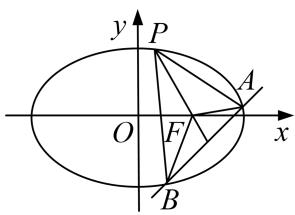
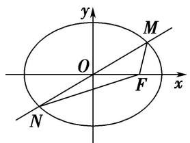
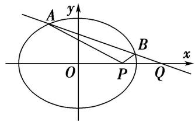
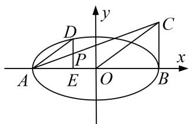
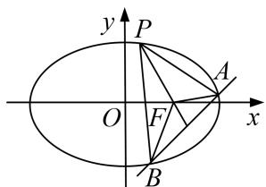
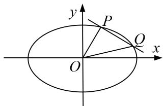
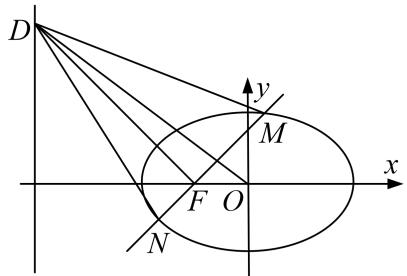
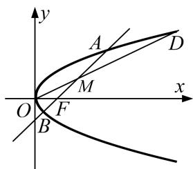

# 专题 30 证明数量关系型问题

圆锥曲线中的证明问题，主要有两类：一是证明直线与圆锥曲线中的一些数量关系(相等或不等)。二是证明点、直线、曲线等几何元素中的位置关系，如：如证明直线与曲线相切，直线间的平行、垂直，直线过定点等；解决证明问题时，主要根据直线与圆锥曲线的性质、直线与圆锥曲线的位置关系等，通过相关性质的应用、代数式的恒等变形以及必要的数值计算等进行证明。圆锥曲线中的证明问题是转化与化归思想的充分体现。无论证明什么结论，要对已知条件进行化简，同时对要证结论合理转化，寻求条件和结论间的联系，从而确定解题思路及转化方向。

# 【例题选讲】

[例 1] (2018·全国I)设椭圆 C: $\frac{x^{2}}{2} + y^{2} = 1$ 的右焦点为 F，过 F 的直线 l 与 C 交于 A，B 两点，点 M 的坐标为 $(2, 0)$ .

(1)当 l 与 x 轴垂直时，求直线 AM 的方程；  
(2)设 O 为坐标原点，证明： $\angle OMA = \angle OMB$ .

[例2] 如图，圆 $C$ 与 $x$ 轴相切于点 $T(2,0)$ ，与 $y$ 轴正半轴相交于两点 $M$ ， $N$ （点 $M$ 在点 $N$ 的下方），且 $|MN| = 3$ .

(1)求圆 C 的方程;  
(2)过点 M 任作一条直线与椭圆 $\frac{x^{2}}{8} + \frac{y^{2}}{4} = 1$ 相交于两点 A, B, 连接 AN, BN, 求证: $\angle ANM = \angle BNM$ .

[例 3] 双曲线 C: $\frac{x^{2}}{a^{2}} - \frac{y^{2}}{b^{2}} = 1 (a > 0, b > 0)$ 的左顶点为 A，右焦点为 F，动点 B 在 C 上．当 $BF \perp AF$ 时， $|AF| = |BF|$ .

(1)求 C 的离心率;  
(2)若 B 在第一象限，证明： $\angle BFA=2\angle BAF$ .

[例 4] 已知椭圆 $E: \frac{x^{2}}{a^{2}} + \frac{y^{2}}{b^{2}} = 1 (a > b > 0)$ 的焦距为 $2\sqrt{3}$ ，直线 $l_{1}: x = 4$ 与 x 轴的交点为 G，过点 $M(1, 0)$ 且不与 x 轴重合的直线 $l_{2}$ 交椭圆 E 于点 A，B。当 $l_{2}$ 垂直于 x 轴时， $\triangle ABG$ 的面积为 $\frac{3\sqrt{3}}{2}$ .

(1)求椭圆 E 的方程;  
(2)若 $AC \perp l_{1}$ ，垂足为 C，直线 BC 交 x 轴于点 D，证明： $|MD| = |DG|$ .

[例 5] 已知椭圆 $\frac{x^{2}}{a^{2}}+\frac{y^{2}}{b^{2}}=1(a>b>0)$ 的长轴长为4，且过点 $\left(\sqrt{3},\frac{1}{2}\right)$ .

(1)求椭圆的方程;

(2)设 A, B, M 是椭圆上的三点. 若 $\overrightarrow{OM} = \frac{3}{5}\overrightarrow{OA} + \frac{4}{5}\overrightarrow{OB}$ ，点 N 为线段 AB 的中点， $C\left(-\frac{\sqrt{6}}{2}, 0\right)$ ， $D\left(\frac{\sqrt{6}}{2}, 0\right)$ ，求证： $|NC| + |ND| = 2\sqrt{2}$ .

[例 6] 已知椭圆 C: $\frac{x^{2}}{a^{2}} + \frac{y^{2}}{b^{2}} = 1 (a > b > 0)$ 过点 P(2, 1), $F_{1}$ , $F_{2}$ 分别为椭圆 C 的左、右焦点，且 $\cdot = -1$ .

(1)求椭圆 C 的方程;

(2)过 $P$ 点的直线 $l_{1}$ 与椭圆 $C$ 有且只有一个公共点，直线 $l_{2}$ 平行于 $OP(O$ 为原点)，且与椭圆 $C$ 交于 $A$ ， $B$ 两点，与直线 $x = 2$ 交于点 $M(M$ 介于 $A$ ， $B$ 两点之间).

①当 $\triangle PAB$ 面积最大时，求直线 $l_{2}$ 的方程；

②求证： $|PA|\cdot|MB|=|PB|\cdot|MA|$ .

[例 7] (2018·全国III)已知斜率为 k 的直线 l 与椭圆 C: $\frac{x^{2}}{4} + \frac{y^{2}}{3} = 1$ 交于 A, B 两点，线段 AB 的中点为 $M(1, m) (m > 0)$ .

(1)证明： $k<-\frac{1}{2};$

(2)设 F 为 C 的右焦点，P 为 C 上一点，且 $\overrightarrow{FP} + \overrightarrow{FA} + \overrightarrow{FB} = 0$ 。证明： $|\overrightarrow{FA}|$ ， $|\overrightarrow{FP}|$ ， $|\overrightarrow{FB}|$ 成等差数列，并求该数列的公差。

text_image

y
P
O
F
x
A
B

[例8] 在平面直角坐标系 $xOy$ 中，点 $F$ 的坐标为 $\left(0, \frac{1}{2}\right)$ ，以线段 $MF$ 为直

(1)求点 M 的轨迹 E 的方程;

(2)设 $T$ 是 $E$ 上横坐标为2的点， $OT$ 的平行线 $l$ 交 $E$ 于 $A$ ， $B$ 两点，交曲线 $E$ 在 $T$ 处的切线于点 $N$ 求证： $|NT|^2 = \frac{5}{2} |NA| \cdot |NB|$ .

[例 9] (2017·北京)已知椭圆 C 的两个顶点分别为 $A(-2, 0)$ ， $B(2, 0)$ ，焦点在 x 轴上，离心率为 $\frac{\sqrt{3}}{2}$ .

(1)求椭圆 C 的方程;

(2)点 D 为 x 轴上一点，过 D 作 x 轴的垂线交椭圆 C 于不同的两点 M, N，过 D 作 AM 的垂线交 BN 于点 E．求证： $\triangle BDE$ 与 $\triangle BDN$ 的面积之比为 4:5.

[例 10] 已知顶点是坐标原点的抛物线 $\Gamma$ 的焦点 F 在 y 轴正半轴上，圆心在直线 $y = \frac{1}{2} x$ 上的圆 E 与 x 轴相切，且 E, F 关于点 $M(-1, 0)$ 对称.

(1)求 E 和 $\Gamma$ 的标准方程;

(2)过点 $M$ 的直线 $l$ 与 $E$ 交于 $A, B$ , 与 $\Gamma$ 交于 $C, D$ , 求证: $|CD| > \sqrt{2} |AB|$ .

# 【对点训练】

1. 已知椭圆 $C: \frac{x^2}{a^2} + \frac{y^2}{b^2} = 1 (a > b > 0)$ 的一个焦点为 $F(-1, 0)$ ，点 $P\left(\frac{2}{3}, \frac{2\sqrt{6}}{3}\right)$ 在 $C$ 上.

(1)求椭圆 C 的方程;

(2)已知点 $M(-4,0)$ ，过 $F$ 作直线 $l$ 交椭圆于 $A$ ， $B$ 两点，求证： $\angle FMA = \angle FMB$ .

2. 如图，已知椭圆 $C: \frac{x^2}{a^2} + \frac{y^2}{b^2} = 1 (a > b > 0)$ 的右焦点为 $F$ ，点 $\left(-1, \frac{\sqrt{3}}{2}\right)$ 在椭圆 $C$ 上，过原点 $O$ 的直线与

椭圆 C 相交于 M，N 两点，且 $\left|MF\right| + \left|NF\right| = 4$ .

text_image

y
M
O
F
x
N

图①

text_image

A
y
B
x
O
P
Q

图②

(1)求椭圆 C 的方程;

(2)设 $P(1,0)$ ， $Q(4,0)$ ，过点 $Q$ 且斜率不为零的直线与椭圆 $C$ 相交于 $A$ ， $B$ 两点，证明： $\angle APO = \angle BPO$ .

3. 设椭圆 $C_1: \frac{x^2}{a^2} + \frac{y^2}{b^2} = 1 (a > b > 0)$ 的离心率为 $\frac{\sqrt{3}}{2}$ , $F_1, F_2$ 是椭圆的两个焦点, $M$ 是椭圆上任意一点, 且 $\triangle MF_1F_2$ 的周长是 $4 + 2\sqrt{3}$ .

(1)求椭圆 $C_{1}$ 的方程;

(2)设椭圆 $C_{1}$ 的左、右顶点分别为 A, B，过椭圆 $C_{1}$ 上的一点 D 作 x 轴的垂线交 x 轴于点 E，若点 C 满足 $\overrightarrow{AB} \perp \overrightarrow{BC}$ ， $\overrightarrow{AD} \parallel \overrightarrow{OC}$ ，连接 AC 交 DE 于点 P，求证：PD = PE.

text_image

y
D
C
P
A
E
O
B
x

4. 如图， $P$ 是直线 $x = 4$ 上一动点，以 $P$ 为圆心的圆 $\Gamma$ 过定点 $B(1,0)$ ，直线 $l$

是圆 $\Gamma$ 在点B处的切线，

过 $A(-1,0)$ 作圆 $\Gamma$ 的两条切线分别与 l 交于 E, F 两点.

(1)求证： $|EA|+|EB|$ 为定值；

(2)设直线 l 交直线 x=4 于点 Q，证明： $|EB|\cdot|FQ|=|FB|\cdot|EQ|$ .

5. 已知斜率为 $k$ 的直线 $l$ 与椭圆 $C: \frac{x^2}{4} + \frac{y^2}{3} = 1$ 交于 $A, B$ 两点．线段 $AB$ 的中点为 $M(1, m)(m > 0)$ .

(1)证明： $k<-\frac{1}{2};$

(2)设 F 为 C 的右焦点，P 为 C 上一点，且 $\overrightarrow{FP} + \overrightarrow{FA} + \overrightarrow{FB} = 0$ 。证明： $2|\overrightarrow{FP}| = |\overrightarrow{FA}| + |\overrightarrow{FB}|$

text_image

y
P
O
F
B
A
x

6. 如图所示, 已知直线 $l$ 过点 $M(4, 0)$ 且与抛物线 $y^{2} = 2px (p > 0)$ 交于 $A$ , $B$ 两点,

以弦 AB 为直径的圆恒

过坐标原点 O.

(1)求抛物线的标准方程;

(2)设 O 是直线 x=-4 上任意一点，求证：直线 OA, OM, OB 的斜率依次成等差数列.

7. 已知椭圆 $C: \frac{x^2}{a^2} + \frac{y^2}{b^2} = 1 (a > b > 0)$ 的离心率为 $\frac{\sqrt{3}}{2}$ , 焦距为 $2\sqrt{3}$ .

(1)求椭圆 C 的方程;

(2)若斜率为 $-\frac{1}{2}$ 的直线与椭圆 C 交于 P, Q 两点(点 P, Q 均在第一象限), O 为坐标原点, 证明: 直线 OP, PO, OO 的斜率依次成等比数列.

text_image

y
P
O
x
O

8. 已知椭圆 $E: \frac{x^2}{a^2} + \frac{y^2}{b^2} = 1 (a > b > 0)$ 的离心率为方程 $2x^2 - 3x + 1 = 0$ 的解，点 $A$

B 分别为椭圆 E 的左、右顶

点，点 C 在 E 上，且 $\triangle ABC$ 面积的最大值为 $2\sqrt{3}$ .

(1)求椭圆 E 的方程:

(2)设 F 为 E 的左焦点，点 D 在直线 x = -4 上，过 F 作 DF 的垂线交椭圆 E 于 M，N 两点．证明：直线 OD 把 $\triangle DMN$ 分为面积相等的两部分.

text_image

D
y
M
F O
x
N

9. 已知抛物线 $C: y^{2} = 2px (p > 0)$ , 焦点为 $F, O$ 为坐标原点, 直线 $AB$ (不

垂直于 x 轴)过点 F 且与抛物线 C

交于 A, B 两点，直线 OA 与 OB 的斜率之积为 -p.

(1)求抛物线 C 的方程;

(2)若 M 为线段 AB 的中点，射线 OM 交抛物线 C 于点 D，求证： $\frac{|OD|}{|OM|}>2.$

text_image

y
A
D
M
O
F
x
B

