# 专题 30 证明数量关系型问题

圆锥曲线中的证明问题，主要有两类：一是证明直线与圆锥曲线中的一些数量关系(相等或不等)。二是证明点、直线、曲线等几何元素中的位置关系，如：如证明直线与曲线相切，直线间的平行、垂直，直线过定点等；解决证明问题时，主要根据直线与圆锥曲线的性质、直线与圆锥曲线的位置关系等，通过相关性质的应用、代数式的恒等变形以及必要的数值计算等进行证明。圆锥曲线中的证明问题是转化与化归思想的充分体现。无论证明什么结论，要对已知条件进行化简，同时对要证结论合理转化，寻求条件和结论间的联系，从而确定解题思路及转化方向。

# 【例题选讲】

[例 1] (2018·全国I)设椭圆 C: $\frac{x^{2}}{2}+y^{2}=1$ 的右焦点为 F，过 F 的直线 l 与 C 交于 A，B 两点，点 M 的坐标为 $(2,0)$ .

(1)当 l 与 x 轴垂直时，求直线 AM 的方程；  
(2)设 O 为坐标原点，证明： $\angle OMA = \angle OMB$ .

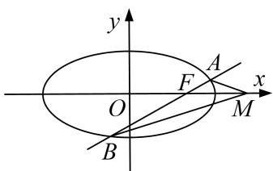

text_image

y
A
F
x
O
M
B

[规范解答] (1)由已知得 $F(1,0)$ ， $l$ 的方程为 $x = 1$ 。则点 $A$ 的坐标为 $\left[1, \frac{\sqrt{2}}{2}\right]$ 或 $\left[1, -\frac{\sqrt{2}}{2}\right]$ .

又 $M(2,0)$ ，所以直线 AM 的方程为 $y=-\frac{\sqrt{2}}{2}x+\sqrt{2}$ 或 $y=\frac{\sqrt{2}}{2}x-\sqrt{2}$ ,

即 $x+\sqrt{2}y-2=0$ 或 $x-\sqrt{2}y-2=0$ .

(2) 当 l 与 x 轴重合时， $\angle OMA = \angle OMB = 0^{\circ}$ .

当 l 与 x 轴垂直时，OM 为 AB 的垂直平分线，所以 $\angle OMA = \angle OMB$ .

当 l 与 x 轴不重合也不垂直时，设 l 的方程为 $y=k(x-1)(k\neq0)$ ， $A(x_{1},y_{1})$ ， $B(x_{2},y_{2})$ ，

则 $x_{1}<\sqrt{2}$ ， $x_{2}<\sqrt{2}$ ，直线 MA，MB 的斜率之和为 $k_{MA}+k_{MB}=\frac{y_{1}}{x_{1}-2}+\frac{y_{2}}{x_{2}-2}$ .

由 $y_{1}=kx_{1}-k,\quad y_{2}=kx_{2}-k,$ 得 $k_{MA}+k_{MB}=\frac{2kx_{1}x_{2}-3k(x_{1}+x_{2})+4k}{(x_{1}-2)(x_{2}-2)}$ .

将 $y=k(x-1)$ 代入 $\frac{x^{2}}{2}+y^{2}=1$ ，得 $(2k^{2}+1)x^{2}-4k^{2}x+2k^{2}-2=0$ ，

所以 $x_{1}+x_{2}=\frac{4k^{2}}{2k^{2}+1}$ ， $x_{1}x_{2}=\frac{2k^{2}-2}{2k^{2}+1}$ 。则 $2kx_{1}x_{2}-3k(x_{1}+x_{2})+4k=\frac{4k^{3}-4k-12k^{3}+8k^{3}+4k}{2k^{2}+1}=0$ 。

从而 $k_{MA} + k_{MB} = 0$ ，故 MA，MB 的倾斜角互补．所以 $\angle OMA = \angle OMB$ .

综上， $\angle OMA = \angle OMB$ 成立.

[例 2] 如图，圆 C 与 x 轴相切于点 $T(2,0)$ ，与 y 轴正半轴相交于两点 M，N（点 M 在点 N 的下方），且 $|MN|=3$ .

(1)求圆 C 的方程;

(2)过点 M 任作一条直线与椭圆 $\frac{x^{2}}{8} + \frac{y^{2}}{4} = 1$ 相交于两点 A, B, 连接 AN, BN, 求证: $\angle ANM = \angle BNM$ .

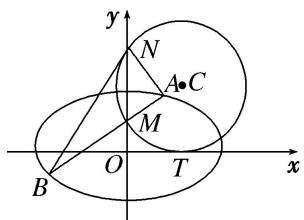

text_image

y
N
A•C
M
B
O
T
x

[规范解答] (1)设圆 C 的半径为 $r(r>0)$ ，依题意，圆心 C 的坐标为 $(2, r)$ . $\because |MN|=3$ ,

$\therefore r^{2} = \left(\frac{3}{2}\right)^{2} + 2^{2}$ ，解得 $r^{2} = \frac{25}{4}$ ， $\therefore r = \frac{5}{2}$ ，圆 $C$ 的方程为 $(x - 2)^{2} + \left(y - \frac{5}{2}\right)^{2} = \frac{25}{4}$ .

(2)证明：把 x=0 代入方程 $(x-2)^{2}+\left(y-\frac{5}{2}\right)^{2}=\frac{25}{4}$ ，解得 y=1 或 y=4，即点 $M(0,1)$ ， $N(0,4)$ .

①当 $AB \perp x$ 轴时，可知 $\angle ANM = \angle BNM = 0$ .  
②当 AB 与 x 轴不垂直时，可设直线 AB 的方程为 $y=kx+1$ .

联立方程 $\left\{\begin{aligned}y&=kx+1,\\ \frac{x^{2}}{8}&+\frac{y^{2}}{4}=1,\end{aligned}\right.$ 消去 y 得， $(1+2k^{2})x^{2}+4kx-6=0.$

设直线 AB 交椭圆于 $A(x_{1}, y_{1})$ ， $B(x_{2}, y_{2})$ 两点，则 $x_{1} + x_{2} = \frac{-4k}{1 + 2k^{2}}$ ， $x_{1}x_{2} = \frac{-6}{1 + 2k^{2}}$ .

$$
\therefore k _ {A N} + k _ {B N} = \frac {y _ {1} - 4}{x _ {1}} + \frac {y _ {2} - 4}{x _ {2}} = \frac {k x _ {1} - 3}{x _ {1}} + \frac {k x _ {2} - 3}{x _ {2}} = \frac {2 k x _ {1} x _ {2} - 3 (x _ {1} + x _ {2})}{x _ {1} x _ {2}}.
$$

若 $k_{AN} + k_{BN} = 0$ ，则 $\angle ANM = \angle BNM$ .

$$
\because 2 k x _ {1} x _ {2} - 3 \left(x _ {1} + x _ {2}\right) = \frac {- 1 2 k}{1 + 2 k ^ {2}} + \frac {1 2 k}{1 + 2 k ^ {2}} = 0, \therefore \angle A N M = \angle B N M.
$$

[例 3] 双曲线 C: $\frac{x^{2}}{a^{2}} - \frac{y^{2}}{b^{2}} = 1 (a > 0, b > 0)$ 的左顶点为 A，右焦点为 F，动点 B 在 C 上．当 $BF \perp AF$ 时， $|AF| = |BF|$ .

(1)求 C 的离心率;  
(2)若 B 在第一象限，证明： $\angle BFA=2\angle BAF$ .

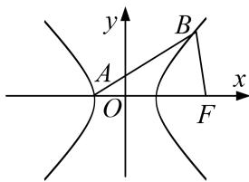

text_image

y
A
O
B
x
F

[规范解答] (1)设双曲线的半焦距为 c，则 $F(c, 0)$ ， $B\left(c, \pm\frac{b^{2}}{a}\right)$ ,

因为 $|AF|=|BF|$ ，故 $\frac{b^{2}}{a}=a+c$ ，故 $c^{2}-ac-2a^{2}=0$ ，即 $e^{2}-e-2=0$ ，又e>0，故e=2。

(2)设 $B(x_{0}, y_{0})$ ，其中 $x_{0}>a, y_{0}>0$ 。因为 e=2，故 c=2a， $b=\sqrt{3}a$ ，

故双曲线的渐近线方程为 $y=\pm\sqrt{3}x$ ，所以 $\angle BAF\in\left(0,\frac{\pi}{3}\right)$ ， $\angle BFA\in\left(0,\frac{2\pi}{3}\right)$ .

当 $\angle BFA=\frac{\pi}{2}$ 时，由题意易得 $\angle BAF=\frac{\pi}{4}$ ，此时 $\angle BFA=2\angle BAF$ .

当 $\angle BFA \neq \frac{\pi}{2}$ 时，因为 $\tan \angle BFA = -\frac{y_{0}}{x_{0} - c} = -\frac{y_{0}}{x_{0} - 2a}$ ， $\tan \angle BAF = \frac{y_{0}}{x_{0} + a}$

所以 $\tan 2\angle BAF = \frac{\frac{2y_0}{x_0 + a}}{1 - \left(\frac{y_0}{x_0 + a}\right)^2} = \frac{2y_0(x_0 + a)}{(x_0 + a)^2 - y_0^2} = \frac{2y_0(x_0 + a)}{(x_0 + a)^2 - b^2\left(\frac{x_0^2}{a^2} - 1\right)} = \frac{2y_0(x_0 + a)}{(x_0 + a)^2 - 3a^2\left(\frac{x_0^2}{a^2} - 1\right)}$

$$
= \frac {2 y _ {0} \left(x _ {0} + a\right)}{\left(x _ {0} + a\right) ^ {2} - 3 \left(x _ {0} ^ {2} - a ^ {2}\right)} = \frac {2 y _ {0}}{\left(x _ {0} + a\right) - 3 \left(x _ {0} - a\right)} = - \frac {y _ {0}}{x _ {0} - 2 a} = \tan \angle B F A,
$$

因为 $2\angle BAF\in\left(0,\frac{2\pi}{3}\right)$ ，故 $\angle BFA=2\angle BAF$ .

综上， $\angle BFA=2\angle BAF.$

[例 4] 已知椭圆 $E: \frac{x^2}{a^2} + \frac{y^2}{b^2} = 1 (a > b > 0)$ 的焦距为 $2\sqrt{3}$ ，直线 $l_1: x = 4$ 与 $x$ 轴的交点为 $G$ ，过点 $M(1, 0)$ 且不与 $x$ 轴重合的直线 $l_2$ 交椭圆 $E$ 于点 $A, B$ 。当 $l_2$ 垂直于 $x$ 轴时， $\triangle ABG$ 的面积为 $\frac{3\sqrt{3}}{2}$ 。

(1)求椭圆 E 的方程;  
(2)若 $AC \perp l_{1}$ ，垂足为 C，直线 BC 交 x 轴于点 D，证明： $|MD| = |DG|$ .

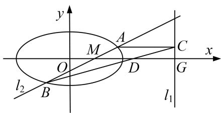

text_image

y
M
A
C
x
O
D
G
l₂
B
l₁

[规范解答] (1)因为椭圆 $E$ 的焦距为 $2\sqrt{3}$ ，所以 $c = \sqrt{3}$ ，所以 $a^2 - b^2 = 3$ ，①

当 $l_{2}$ 垂直于 x 轴时， $|MG|=3$ ，因为 $\triangle ABG$ 的面积为 $\frac{3\sqrt{3}}{2}$ ，即 $\frac{1}{2}|AB|\cdot|MG|=\frac{3\sqrt{3}}{2}$ ,

所以 $|AB|=\sqrt{3}$ ，不妨设 $A\left(1,\frac{\sqrt{3}}{2}\right)$ ，代入椭圆E的方程得 $\frac{1}{a^{2}}+\frac{3}{4b^{2}}=1$ ，②

联立①②解得 $a^{2}=4,\ b^{2}=1$ ，所以椭圆 E 的方程为 $\frac{x^{2}}{4}+y^{2}=1$ .

(2)设 $A(x_{1}, y_{1})$ ， $B(x_{2}, y_{2})$ ，则 $C(4, y_{1})$ .

因为直线 $l_{2}$ 不与 x 轴重合，故可设 $l_{2}$ 的方程为 $x=my+1$ ，联立得 $\left\{\begin{aligned}x&=my+1,\\ \frac{x^{2}}{4}&+y^{2}=1,\end{aligned}\right.$

整理得 $(m^{2}+4)y^{2}+2my-3=0$ ，所以 $\Delta=16(m^{2}+3)>0,\quad y_{1}+y_{2}=\frac{-2m}{m^{2}+4},\quad y_{1}y_{2}=\frac{-3}{m^{2}+4}$

所以直线 BC: $y-y_{1}=\frac{y_{1}-y_{2}}{4-x_{2}}(x-4)$ ，令 y=0，则 $x=\frac{y_{1}-x_{2}-4}{y_{1}-y_{2}}+4$ ，

所以点 D 的横坐标 $x_{D}=\frac{y_{1}(x_{2}-4)}{y_{1}-y_{2}}+4$ ,

所以 $x_{D} - \frac{5}{2} = \frac{y_{1}(x_{2} - 4)}{y_{1} - y_{2}} + 4 - \frac{5}{2} = \frac{y_{1}(my_{2} - 3)}{y_{1} - y_{2}} + \frac{3}{2} = \frac{2y_{1}(my_{2} - 3) + 3y_{1} - 3y_{2}}{2(y_{1} - y_{2})}$

$$
= \frac {2 m y _ {1} y _ {2} - 3 (y _ {1} + y _ {2})}{2 (y _ {1} - y _ {2})} = \frac {\frac {- 6 m}{m ^ {2} + 4} + \frac {6 m}{m ^ {2} + 4}}{2 y _ {1} - y _ {2}} = 0,
$$

所以 $x_{D}=\frac{5}{2}$ ，因为 MG 中点的横坐标为 $\frac{5}{2}$ ，所以 D 为线段 MG 的中点，所以 $|MD|=|DG|$ .

[例5] 已知椭圆 $\frac{x^2}{a^2} + \frac{y^2}{b^2} = 1 (a > b > 0)$ 的长轴长为4，且过点 $\left[\sqrt{3}, \frac{1}{2}\right]$ .

(1)求椭圆的方程;

(2)设 $A, B, M$ 是椭圆上的三点. 若 $\overrightarrow{OM} = \frac{3}{5}\overrightarrow{OA} + \frac{4}{5}\overrightarrow{OB}$ , 点 $N$ 为线段 $AB$ 的中点, $C\left(-\frac{\sqrt{6}}{2}, 0\right)$ , $D\left(\frac{\sqrt{6}}{2}, 0\right)$ , 求证: $|NC| + |ND| = 2\sqrt{2}$ .

[规范解答] (1)由已知可得 $\left\{\begin{aligned}a&=2,\\ \frac{3}{a^{2}}+\frac{1}{4b^{2}}&=1,\end{aligned}\right.$ 故 $\left\{\begin{aligned}a&=2,\\ b&=1,\end{aligned}\right.$ 所以椭圆的方程为 $\frac{x^{2}}{4}+y^{2}=1$ .

(2)设 $A(x_{1}, y_{1})$ ， $B(x_{2}, y_{2})$ ，则 $\frac{x_{1}^{2}}{4} + y_{1}^{2} = 1$ ， $\frac{x_{2}^{2}}{4} + y_{2}^{2} = 1$ ，由 $\overrightarrow{OM} = \frac{3}{5}\overrightarrow{OA} + \frac{4}{5}\overrightarrow{OB}$ ，得 $M\left(\frac{3}{5}x_{1} + \frac{4}{5}x_{2}, \frac{3}{5}y_{1} + \frac{4}{5}y_{2}\right)$ .
因为 M 是椭圆 C 上一点，所以 $\frac{\left(\frac{3}{5}x_{1}+\frac{4}{5}x_{2}\right)_{2}}{4}+\left(\frac{3}{5}y_{1}+\frac{4}{5}y_{2}\right)_{2}=1,$

即 $\left(\frac{x_1^2}{4} + y_1^2\right)\left(\frac{3}{5}\right)^2 + \left(\frac{x_2^2}{4} + y_2^2\right)\left(\frac{4}{5}\right)^2 + 2 \times \frac{3}{5} \times \frac{4}{5} \times \left(\frac{x_1x_2}{4} + y_1y_2\right) = 1,$

得 $\left(\frac{3}{5}\right)^2 +\left(\frac{4}{5}\right)^2 +2\times \frac{3}{5}\times \frac{4}{5}\times \left(\frac{x_1x_2}{4} +y_1y_2\right) = 1$ ，故 $\frac{x_1x_2}{4} +y_1y_2 = 0.$

又线段 AB 的中点 N 的坐标为 $\left(\frac{x_{1}+x_{2}}{2}, \frac{y_{1}+y_{2}}{2}\right)$ ,

所以 $\frac{\left(\frac{x_{1}+x_{2}}{2}\right)^{2}}{2}+2\left(\frac{y_{1}+y_{2}}{2}\right)^{2}=\frac{1}{2}\left(\frac{x_{1}^{2}}{4}+y_{1}^{2}\right)+\frac{1}{2}\left(\frac{x_{2}^{2}}{4}+y_{2}^{2}\right)+\frac{x_{1}x_{2}}{4}+y_{1}y_{2}=1.$

从而线段 AB 的中点 $N\left(\frac{x_{1}+x_{2}}{2}, \frac{y_{1}+y_{2}}{2}\right)$ 在椭圆 $\frac{x^{2}}{2}+2y^{2}=1$ 上.

又椭圆 $\frac{x^{2}}{2}+2y^{2}=1$ 的两焦点恰为 $C\left(-\frac{\sqrt{6}}{2},0\right),D\left(\frac{\sqrt{6}}{2},0\right)$ ，所以 $|NC|+|ND|=2\sqrt{2}$ .

[例6] 已知椭圆 $C: \frac{x^2}{a^2} + \frac{y^2}{b^2} = 1 (a > b > 0)$ 过点 $P(2, 1)$ , $F_1$ , $F_2$ 分别为椭圆 $C$ 的左、右焦点，且 $\cdot = -1$ .

(1)求椭圆 C 的方程;

(2)过 $P$ 点的直线 $l_{1}$ 与椭圆 $C$ 有且只有一个公共点，直线 $l_{2}$ 平行于 $OP(O$ 为原点)，且与椭圆 $C$ 交于 $A$ ， $B$ 两点，与直线 $x = 2$ 交于点 $M(M$ 介于 $A$ ， $B$ 两点之间).

①当 $\triangle PAB$ 面积最大时，求直线 $l_{2}$ 的方程；  
②求证： $|PA|\cdot|MB|=|PB|\cdot|MA|$ .

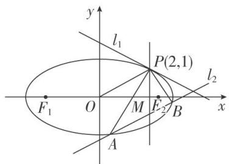

text_image

y
l₁
P(2,1)
F₁ O M E₂ B x
A
l₂

[规范解答] (1) 设 $F_{1}(-c, 0)$ , $F_{2}(c, 0)$ , $=(-c-2, -1)$ , $=(c-2, -1)$ .

因为 $\cdot=-c^{2}+4+1=-1$ ，所以 $c=\sqrt{6}$ ,

又 $P(2, 1)$ 在椭圆上，故 $\frac{4}{a^2} + \frac{1}{b^2} = 1$ ，结合 $a^2 = b^2 + 6$

解得 $a^{2}=8,\ b^{2}=2$ ，故所求椭圆 C 的方程为 $\frac{x^{2}}{8}+\frac{y^{2}}{2}=1$ .

(2)①由于 $k_{OP}=\frac{1}{2}$ ，设直线 $l_{2}$ 的方程为 $y=\frac{1}{2}x+t$ ， $A(x_{1},y_{1})$ ， $B(x_{2},y_{2})$ ，

由 $\left\{\begin{aligned}y&=\frac{1}{2}x+t,\\ \frac{x^{2}}{8}&+\frac{y^{2}}{2}=1,\end{aligned}\right.$ 消去 y 整理得 $x^{2}+2tx+2t^{2}-4=0,\quad\left\{\begin{aligned}x_{1}+x_{2}&=-2t,\\ x_{1}x_{2}&=2t^{2}-4,\\ 1&=-4(t^{2}-4)>0\Rightarrow t^{2}<4,\end{aligned}\right.$

则 $|AB|=\sqrt{1+\frac{1}{4}}\sqrt{(x_{1}+x_{2})^{2}-4x_{1}x_{2}}=\frac{\sqrt{5}}{2}\sqrt{4t^{2}-4(2t^{2}-4)}=\frac{\sqrt{5}}{2}\sqrt{16-4t^{2}}=\sqrt{5}\sqrt{4-t^{2}}$

又点 $P$ 到直线 $l_{2}$ 的距离 $d = \frac{|t|}{\sqrt{1 + \left(\frac{1}{2}\right)^{2}}} = \frac{2|t|}{\sqrt{5}}.$

所以 $S_{\triangle PAB}=\frac{1}{2}\times\sqrt{5}\sqrt{4-t^{2}}\times\frac{2|t|}{\sqrt{5}}=\sqrt{(4-t^{2})t^{2}}\leq\frac{t^{2}+(4-t^{2})}{2}=2.$

当且仅当 $4-t^{2}=t^{2}$ 时取等号，此时 $t^{2}=2$ ，

又 M 介于 A, B 两点之间，故 $t = -\sqrt{2}$ ，故直线 $l_{2}$ 的方程为 $y = \frac{1}{2}x - \sqrt{2}$ .

②证明：要证结论成立，只需证明 $\frac{|PA|}{|MA|}=\frac{|PB|}{|MB|}$ ，由角平分线性质，

即证直线 x=2 为 $\angle APB$ 的平分线，转化成证明 $k_{PA}+k_{PB}=0$ .

因为 $k_{PA} + k_{PB} = \frac{y_1 - 1}{x_1 - 2} +\frac{y_2 - 1}{x_2 - 2} = \frac{\left[\left(\frac{1}{2} x_1 + t\right) - 1\right](x_2 - 2) + \left[\left(\frac{1}{2} x_2 + t\right) - 1\right](x_1 - 2)}{(x_1 - 2)(x_2 - 2)}$

$$
= \frac {x _ {1} x _ {2} + (t - 2) \left(x _ {1} + x _ {2}\right) - 4 (t - 1)}{\left(x _ {1} - 2\right) \left(x _ {2} - 2\right)} = \frac {2 t ^ {2} - 4 - 2 t (t - 2) - 4 (t - 1)}{\left(x _ {1} - 2\right) \left(x _ {2} - 2\right)} = \frac {2 t ^ {2} - 4 - 2 t ^ {2} + 4 t - 4 t + 4}{\left(x _ {1} - 2\right) \left(x _ {2} - 2\right)} = 0,
$$

因此结论成立.

[例 7] (2018·全国III)已知斜率为 k 的直线 l 与椭圆 C: $\frac{x^{2}}{4} + \frac{y^{2}}{3} = 1$ 交于 A, B 两点，线段 AB 的中点为

$$
M (1, m) (m > 0).
$$

(1)证明： $k<-\frac{1}{2};$

(2)设 $F$ 为 $C$ 的右焦点， $P$ 为 $C$ 上一点，且 $\overrightarrow{FP} + \overrightarrow{FA} + \overrightarrow{FB} = 0$ 。证明： $|\overrightarrow{FA}|$ ， $|\overrightarrow{FP}|$ ， $|\overrightarrow{FB}|$ 成等差数列，并求该数列的公差。

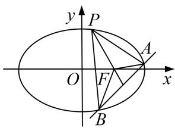

text_image

y
P
O
F
x
A
B

[规范解答] (1) 设 $A(x_{1}, y_{1})$ , $B(x_{2}, y_{2})$ ，则 $\frac{x_{1}^{2}}{4} + \frac{y_{1}^{2}}{3} = 1$ , $\frac{x_{2}^{2}}{4} + \frac{y_{2}^{2}}{3} = 1$ .

两式相减，并由 $\frac{y_{1}-y_{2}}{x_{1}-x_{2}}=k$ ，得 $\frac{x_{1}+x_{2}}{4}+\frac{y_{1}+y_{2}}{3}\cdot k=0$ ，由题设知 $\frac{x_{1}+x_{2}}{2}=1,\frac{y_{1}+y_{2}}{2}=m$ ，于是 $k=-\frac{3}{4m}$ 。①
由题设得 $0 < m < \frac{3}{2}$ ，故 $k < -\frac{1}{2}$ .

(2)由题意得 $F(1,0)$ . 设 $P(x_{3}, y_{3})$ ，则 $(x_{3}-1, y_{3})+(x_{1}-1, y_{1})+(x_{2}-1, y_{2})=(0,0)$ .

由(1)及题设得 $x_{3}=3-(x_{1}+x_{2})=1,\quad y_{3}=-(y_{1}+y_{2})=-2m<0.$

又点 P 在 C 上，所以 $m=\frac{3}{4}$ ，从而 $P\left(1, -\frac{3}{2}\right)$ ， $|\overrightarrow{FP}|=\frac{3}{2}$

于是 $|\overrightarrow{FA}|=\sqrt{(x_{1}-1)^{2}+y_{1}^{2}}=\sqrt{(x_{1}-1)^{2}+3\left(1-\frac{x_{1}^{2}}{4}\right)}=2-\frac{x_{1}}{2}$ ，同理 $|F\overrightarrow{B}|=2-\frac{x_{2}}{2}$ .

所以 $|\overrightarrow{FA}|+|\overrightarrow{FB}|=4-\frac{1}{2}(x_{1}+x_{2})=3$ 。故 $2|\overrightarrow{FP}|=|\overrightarrow{FA}|+|\overrightarrow{FB}|$ ，即 $|\overrightarrow{FA}|$ ， $|\overrightarrow{FP}|$ ， $|\overrightarrow{FB}|$ 成等差数列。

设该数列的公差为 d，则 $2|d|=\|\overrightarrow{FB}|-|\overrightarrow{FA}||=\frac{1}{2}|x_{1}-x_{2}|=\frac{1}{2}\sqrt{(x_{1}+x_{2})^{2}-4x_{1}x_{2}}$ . ②

将 $m=\frac{3}{4}$ 代入①得 k=-1，所以 l 的方程为 $y=-x+\frac{7}{4}$ ，代入 C 的方程，并整理得 $7x^{2}-14x+\frac{1}{4}=0$ .

故 $x_{1} + x_{2} = 2$ ， $x_{1}x_{2} = \frac{1}{28}$ ，代入②解得 $|d| = \frac{3\sqrt{21}}{28}$ ，所以该数列的公差为 $\frac{3\sqrt{21}}{28}$ 或 $-\frac{3\sqrt{21}}{28}$

[例8] 在平面直角坐标系 $xOy$ 中，点 $F$ 的坐标为 $\left(0, \frac{1}{2}\right)$ ，以线段 $MF$ 为直径的圆与 $x$ 轴相切.

(1)求点 $M$ 的轨迹 $E$ 的方程；(2)设 $T$ 是 $E$ 上横坐标为2的点， $OT$ 的平行线 $l$ 交 $E$ 于 $A$ ， $B$ 两点，交曲线 $E$ 在 $T$ 处的切线于点 $N$ 求证： $|NT|^2 = \frac{5}{2} |NA| \cdot |NB|$ .

[规范解答] (1)设点 $M(x, y)$ ，因为 $F\left(0, \frac{1}{2}\right)$ ，所以 MF 的中点坐标为 $\left(\frac{x}{2}, \frac{2y+1}{4}\right)$ .

因为以线段 MF 为直径的圆与 x 轴相切，所以 $\frac{|MF|}{2} = \frac{|2y + 1|}{4}$ ，即 $|MF| = \frac{|2y + 1|}{2}$ ,

故 $\sqrt{x^2 + \left(y - \frac{1}{2}\right)^2} = \frac{|2y + 1|}{2}$ ，得 $x^{2} = 2y$ ，所以 $M$ 的轨迹 $E$ 的方程为 $x^{2} = 2y$ .

(2)证明：因为 T 是 E 上横坐标为 2 的点，所以由(1)得 $T(2, 2)$ ，所以直线 OT 的斜率为 1.

因为 $l \parallel OT$ ，所以可设直线 l 的方程为 $y = x + m, m \neq 0$ .

由 $y=\frac{1}{2}x^{2}$ ，得 $y'=x$ ，则曲线 E 在 T 处的切线的斜率为 $y'\big|_{x=2}=2$ ，

所以曲线 E 在 T 处的切线方程为 y=2x-2.

由 $\left\{\begin{aligned}y=x+m,\\ y=2x-2,\end{aligned}\right.$ 得 $\left\{\begin{aligned}x=m+2,\\ y=2m+2,\end{aligned}\right.$

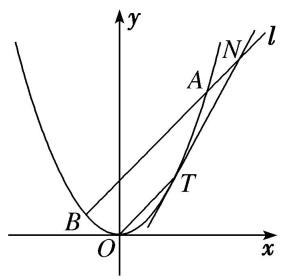

text_image

y
A
N
l
B
T
O
x

所以 $N(m+2, 2m+2)$ ，所以 $|NT|^{2}=[(m+2)-2]^{2}+[(2m+2)-2]^{2}=5m^{2}$ .

由 $\left\{\begin{aligned}y=x+m,\\ x^{2}=2y\end{aligned}\right.$ 消去 y，得 $x^{2}-2x-2m=0$ ，由 $\Delta=4+8m>0$ ，解得 $m>-\frac{1}{2}$ .

设 $A(x_{1}, y_{1})$ ， $B(x_{2}, y_{2})$ ，则 $x_{1} + x_{2} = 2$ ， $x_{1}x_{2} = -2m$ .

因为 N, A, B 在 l 上，所以 $\left|NA\right|=\sqrt{2}\left|x_{1}-(m+2)\right|$ ， $\left|NB\right|=\sqrt{2}\left|x_{2}-(m+2)\right|$ ,

所以 $|NA|\cdot|NB|=2|x_{1}-(m+2)|\cdot|x_{2}-(m+2)|=2|x_{1}x_{2}-(m+2)(x_{1}+x_{2})+(m+2)^{2}|$

$$
= 2 \vert - 2 m - 2 (m + 2) + (m + 2) ^ {2} \vert = 2 m ^ {2},
$$

所以 $|NT|^{2}=\frac{5}{2}|NA|\cdot|NB|$ .

[例 9] (2017·北京)已知椭圆 C 的两个顶点分别为 $A(-2, 0)$ ， $B(2, 0)$ ，焦点在 x 轴上，离心率为 $\frac{\sqrt{3}}{2}$ .

(1)求椭圆 C 的方程;

(2)点 $D$ 为 $x$ 轴上一点，过 $D$ 作 $x$ 轴的垂线交椭圆 $C$ 于不同的两点 $M, N$ ，过 $D$ 作 $AM$ 的垂线交 $BN$ 于点 $E$ 。求证： $\triangle BDE$ 与 $\triangle BDN$ 的面积之比为 $4:5$ .

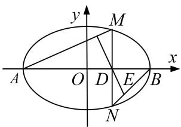

text_image

y
M
x
A O D E B
N

[规范解答] (1)设椭圆 C 的方程为 $\frac{x^{2}}{a^{2}}+\frac{y^{2}}{b^{2}}=1(a>b>0)$ ，由题意得 $\left\{\begin{aligned}a=2,\\ c=\frac{\sqrt{3}}{2},\end{aligned}\right.$ 解得 $c=\sqrt{3}$ ,所以 $b^{2}=a^{2}-c^{2}=1$ ，所以椭圆 C 的方程为 $\frac{x^{2}}{4}+y^{2}=1$ .

(2)设 $M(m, n)$ ，则 $D(m,0)$ ， $N(m, -n)$ ，由题设知 $m \neq \pm 2$ ，且 $n \neq 0$ .

直线 AM 的斜率 $k_{AM}=\frac{n}{m+2}$ ，故直线 DE 的斜率 $k_{DE}=-\frac{m+2}{n}$ ,

所以直线 DE 的方程为 $y=-\frac{m+2}{n}(x-m)$ ，直线 BN 的方程为 $y=\frac{n}{2-m}(x-2)$ .

联立 $\left\{\begin{aligned}y&=-\frac{m+2}{n}(x-m),\\ y&=\frac{n}{2-m}(x-2),\end{aligned}\right.$

解得点 $E$ 的纵坐标 $y_{E} = -\frac{n(4 - m^{2})}{4 - m^{2} + n^{2}}.$

由点 M 在椭圆 C 上，得 $4 - m^{2} = 4n^{2}$ ，所以 $y_{E} = -\frac{4}{5}n$ .

又 $S_{\triangle BDE}=\frac{1}{2}|BD|\cdot|y_{E}|=\frac{2}{5}|BD|\cdot|n|$ ， $S_{\triangle BDN}=\frac{1}{2}|BD|\cdot|n|$ ，所以 $\triangle BDE$ 与 $\triangle BDN$ 的面积之比为 4:5.

[例10] 已知顶点是坐标原点的抛物线 $\Gamma$ 的焦点 $F$ 在 $y$ 轴正半轴上，圆心在直线 $y = \frac{1}{2} x$ 上的圆 $E$ 与 $x$ 轴相切，且 $E, F$ 关于点 $M(-1, 0)$ 对称.

(1)求 E 和 $\Gamma$ 的标准方程;

(2)过点 M 的直线 l 与 E 交于 A, B, 与 $\Gamma$ 交于 C, D, 求证: $|CD| > \sqrt{2}|AB|$ .

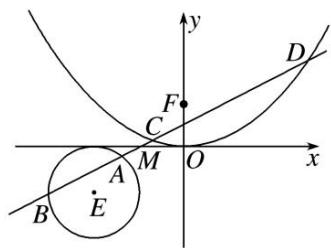

text_image

Mathematical diagram showing a parabola intersecting with a circle and tangent line, labeled with points A, B, C, D, E, F, M, O.

[规范解答] (1)设 $\Gamma$ 的标准方程为 $x^{2} = 2py(p > 0)$ ，则 $F\left(0, \frac{p}{2}\right)$ .

已知 E 在直线 $y=\frac{1}{2}x$ 上，故可设 $E(2a, a)$ .

因为 E, F 关于 $M(-1,0)$ 对称，所以 $\left\{\begin{aligned}&\frac{2a+0}{2}=-1,\\ &\frac{p}{2}+\frac{a}{2}=0,\end{aligned}\right.$ 解得 $\left\{\begin{aligned}a&=-1,\\ p&=2.\end{aligned}\right.$

所以 $\Gamma$ 的标准方程为 $x^{2}=4y$ 。因为E与x轴相切，故半径 $r=|a|=1$ ，

所以 E 的标准方程为 $(x+2)^{2}+(y+1)^{2}=1$ .

(2)由题意知，直线 l 的斜率存在，设 l 的斜率为 k，那么其方程为 $y=k(x+1)(k\neq0)$ ,

则 $E(-2, -1)$ 到 l 的距离 $d=\frac{|k-1|}{\sqrt{k^{2}+1}}$ ，因为 l 与 E 交于 A，B 两点，

所以 $d^{2}<r^{2}$ ，即 $\frac{k-1}{k^{2}+1}^{2}<1$ ，解得 k>0，所以 $|AB|=2\sqrt{1-d^{2}}=2\sqrt{\frac{2k}{k^{2}+1}}$ .

由 $\left\{\begin{aligned}x^{2}&=4y,\\ y&=k(x+1)\end{aligned}\right.$ 消去 y 并整理得 $x^{2}-4kx-4k=0$ . $\Delta=16k^{2}+16k>0$ 恒成立，

设 $C(x_{1}, y_{1})$ ， $D(x_{2}, y_{2})$ ，则 $x_{1} + x_{2} = 4k$ ， $x_{1}x_{2} = -4k$ ，

那么 $|CD|=\sqrt{k^{2}+1}|x_{1}-x_{2}|=\sqrt{k^{2}+1}\cdot\sqrt{(x_{1}+x_{2})^{2}-4x_{1}x_{2}}=4\sqrt{k^{2}+1}\cdot\sqrt{k^{2}+k}.$

所以 $\frac{|CD|^2}{|AB|^2} = \frac{16(k^2 + 1)(k^2 + k)}{\frac{8k}{k^2 + 1}} = \frac{2(k^2 + 1)^2(k^2 + k)}{k} = \frac{2k(k^2 + 1)^2(k + 1)}{k} >\frac{2k}{k} = 2.$

所以 $|CD|^{2}>2|AB|^{2}$ ，即 $|CD|>\sqrt{2}|AB|$ .

# 【对点训练】

1. 已知椭圆 $C: \frac{x^2}{a^2} + \frac{y^2}{b^2} = 1 (a > b > 0)$ 的一个焦点为 $F(-1, 0)$ ，点 $P\left(\frac{2}{3}, \frac{2\sqrt{6}}{3}\right)$ 在 $C$ 上.

(1)求椭圆 C 的方程;

(2)已知点 $M(-4,0)$ ，过 $F$ 作直线 $l$ 交椭圆于 $A$ ， $B$ 两点，求证： $\angle FMA = \angle FMB$ .

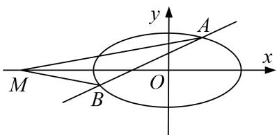

text_image

M
B
O
A
x
y

1. 解析 (1)由题意知，c=1，∵点 $P\left(\frac{2}{3},\frac{2\sqrt{6}}{3}\right)$ 在椭圆C上，∴ $\frac{4}{9a^{2}}+\frac{8}{3b^{2}}=1$ .

又 $a^{2}=b^{2}+c^{2}=b^{2}+1$ ，解得 $a^{2}=4,\ b^{2}=3,\therefore$ 椭圆 C 的方程为 $\frac{x^{2}}{4}+\frac{y^{2}}{3}=1$ .

(2)当 l 与 x 轴垂直时，直线 MF 恰好平分 $\angle AMB$ ，则 $\angle FMA = \angle FMB$ ;

当 l 与 x 轴不垂直时，设直线 l 的方程为 $v=k(x+1)$ ,

联立 $\left\{\begin{aligned}\frac{x^{2}}{4}+\frac{y^{2}}{3}&=1,\\ y=k(x+1),\end{aligned}\right.$ 消去 y 得， $(3+4k^{2})x^{2}+8k^{2}x+4k^{2}-12=0,\quad\because\Delta>0$ 恒成立，

∴设 $A(x_{1}, y_{1})$ ， $B(x_{2}, y_{2})$ ，由根与系数的关系，得 $x_{1} + x_{2} = -\frac{8k^{2}}{3 + 4k^{2}}$ ， $x_{1}x_{2} = \frac{4k^{2} - 12}{3 + 4k^{2}}$

直线 MA，MB 的斜率之和为 $k_{MA} + k_{MB} = \frac{y_{1}}{x_{1} + 4} + \frac{y_{2}}{x_{2} + 4} = \frac{y_{1}(x_{2} + 4) + y_{2}(x_{1} + 4)}{(x_{1} + 4)(x_{2} + 4)}$

$$
= \frac {k \left(x _ {1} + 1\right) \left(x _ {2} + 4\right) + k \left(x _ {2} + 1\right) \left(x _ {1} + 4\right)}{\left(x _ {1} + 4\right) \left(x _ {2} + 4\right)} = \frac {k \left[ 2 x _ {1} x _ {2} + 5 \left(x _ {2} + x _ {1}\right) + 8 \right]}{\left(x _ {1} + 4\right) \left(x _ {2} + 4\right)},
$$

$$
\because 2 x _ {1} x _ {2} + 5 \left(x _ {2} + x _ {1}\right) + 8 = 2 \times \frac {4 k ^ {2} - 1 2}{3 + 4 k ^ {2}} + 5 \times \left(- \frac {8 k ^ {2}}{3 + 4 k ^ {2}}\right) + 8 = 0, \quad \therefore k _ {M A} + k _ {M B} = 0,
$$

故直线 MA，MB 的倾斜角互补，综上所述， $\angle FMA = \angle FMB$ .

2. 如图，已知椭圆 $C: \frac{x^2}{a^2} + \frac{y^2}{b^2} = 1 (a > b > 0)$ 的右焦点为 $F$ ，点 $\left(-1, \frac{\sqrt{3}}{2}\right)$ 在椭圆 $C$ 上，过原点 $O$ 的直线与椭圆 $C$ 相交于 $M$ ， $N$ 两点，且 $|MF| + |NF| = 4$ .

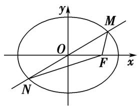

text_image

y
M
O
F
x
N

图①

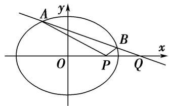

text_image

A
y
B
O
P
Q
x

图②

(1)求椭圆 C 的方程;

(2)设 $P(1,0)$ , $Q(4,0)$ , 过点 $Q$ 且斜率不为零的直线与椭圆 $C$ 相交于 $A$ , $B$ 两点, 证明: $\angle APO = \angle BPQ$ .

2. 解析 (1)如图, 取椭圆 $C$ 的左焦点 $F'$ , 连接 $MF'$ , $NF'$ ,

由椭圆的几何性质知 $|NF|=|MF'|$ ，则 $|MF'|+|MF|=2a=4$ ，得a=2.

将点 $\left(-1,\frac{\sqrt{3}}{2}\right)$ 代入椭圆C的方程得 $\frac{1}{a^{2}}+\frac{3}{4b^{2}}=1$ ，解得b=1。

故椭圆 C 的方程为 $\frac{x^{2}}{4} + y^{2} = 1$ .

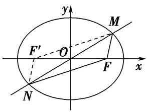

text_image

y
M
F'
O
x
F
N

(2)设点 A 的坐标为 $(x_{1}, y_{1})$ ，点 B 的坐标为 $(x_{2}, y_{2})$ .

由图可知直线 AB 的斜率存在，设直线 AB 的方程为 $y=k(x-4)(k\neq0)$ 。联立方程 $\left\{\begin{aligned}\frac{x^{2}}{4}+y^{2}&=1,\\ y&=k(x-4),\end{aligned}\right.$

消去 y 得， $(4k^{2}+1)x^{2}-32k^{2}x+64k^{2}-4=0,\quad\Delta=(-32k^{2})^{2}-4(4k^{2}+1)(64k^{2}-4)>0,\quad k^{2}<\frac{1}{12},$

$$
\left\{ \begin{array}{l} x _ {1} + x _ {2} = \frac {3 2 k ^ {2}}{4 k ^ {2} + 1}, \\ x _ {1} x _ {2} = \frac {6 4 k ^ {2} - 4}{4 k ^ {2} + 1}, \end{array} \right.
$$

直线 $AP$ 的斜率为 $\frac{y_1}{x_1 - 1} = \frac{k(x_1 - 4)}{x_1 - 1}$ .

同理直线 BP 的斜率为 $\frac{k(x_{2}-4)}{x_{2}-1}$ .

由 $\frac{k(x_1 - 4)}{x_1 - 1} +\frac{k(x_2 - 4)}{x_2 - 1} = \frac{k(x_1 - 4)(x_2 - 1) + k(x_2 - 4)(x_1 - 1)}{(x_1 - 1)(x_2 - 1)} = \frac{k[2x_1x_2 - 5(x_1 + x_2) + 8]}{x_1x_2 - (x_1 + x_2) + 1}$

$$
= \frac {k \left(\frac {1 2 8 k ^ {2} - 8}{4 k ^ {2} + 1} - \frac {1 6 0 k ^ {2}}{4 k ^ {2} + 1} + 8\right)}{\frac {6 4 k ^ {2} - 4}{4 k ^ {2} + 1} - \frac {3 2 k ^ {2}}{4 k ^ {2} + 1} + 1} = \frac {k (1 2 8 k ^ {2} - 8 - 1 6 0 k ^ {2} + 3 2 k ^ {2} + 8)}{6 4 k ^ {2} - 4 - 3 2 k ^ {2} + 4 k ^ {2} + 1} = \frac {k (1 6 0 k ^ {2} - 8 - 1 6 0 k ^ {2} + 8)}{3 6 k ^ {2} - 3} = 0.
$$

由上得直线 AP 与 BP 的斜率互为相反数，可得 $\angle APO = \angle BPQ$ .

3. 设椭圆 $C_1: \frac{x^2}{a^2} + \frac{y^2}{b^2} = 1 (a > b > 0)$ 的离心率为 $\frac{\sqrt{3}}{2}$ , $F_1$ , $F_2$ 是椭圆的两个焦点, $M$ 是椭圆上任意一点, 且 $\triangle MF_1F_2$ 的周长是 $4 + 2\sqrt{3}$ .

(1)求椭圆 $C_{1}$ 的方程;

(2)设椭圆 $C_{1}$ 的左、右顶点分别为 A, B，过椭圆 $C_{1}$ 上的一点 D 作 x 轴的垂线交 x 轴于点 E，若点 C 满足 $\overrightarrow{AB} \perp \overrightarrow{BC}$ ， $\overrightarrow{AD} \parallel \overrightarrow{OC}$ ，连接 AC 交 DE 于点 P，求证：PD = PE.

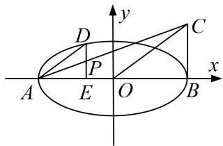

text_image

y
D
C
P
A E O B x

3. 解析 (1)由 $e = \frac{\sqrt{3}}{2}$ ，知 $\frac{c}{a} = \frac{\sqrt{3}}{2}$ ，所以 $c = \frac{\sqrt{3}}{2} a$ ，因为 $\triangle MF_1F_2$ 的周长是 $4 + 2\sqrt{3}$ ，

所以 $2a+2c=4+2\sqrt{3}$ ，所以 a=2， $c=\sqrt{3}$ ，所以 $b^{2}=a^{2}-c^{2}=1$ ，

所以椭圆 $C_{1}$ 的方程为： $\frac{x^{2}}{4}+y^{2}=1$ .

(2)证明：由(1)得 $A(-2,0)$ ， $B(2,0)$ ，设 $D(x_{0}, y_{0})$ ，所以 $E(x_{0},0)$ ，

因为 $\overrightarrow{AB}\perp\overrightarrow{BC}$ ，所以可设 $C(2,y_{1})$ ，所以 $\overrightarrow{AD}=(x_{0}+2,y_{0})$ ， $\overrightarrow{OC}=(2,y_{1})$

由 $\overrightarrow{AD}$ // $\overrightarrow{OC}$ 可得： $(x_{0}+2)y_{1}=2y_{0}$ ，即 $y_{1}=\frac{2y_{0}}{x_{0}+2}$ .

所以直线 AC 的方程为： $\frac{y}{\frac{2y_{0}}{x_{0}+2}}=\frac{x+2}{4}$ ，整理得： $y=\frac{y_{0}}{2(x_{0}+2)}(x+2)$ .

又点 P 在 DE 上，将 $x=x_{0}$ 代入直线 AC 的方程可得： $y=\frac{y_{0}}{2}$ ,

即点 P 的坐标为 $\left(x_{0}, \frac{y_{0}}{2}\right)$ ，所以 P 为 DE 的中点，所以 PD = PE.

4. 如图, $P$ 是直线 $x = 4$ 上一动点, 以 $P$ 为圆心的圆 $\Gamma$ 过定点 $B(1,0)$ , 直线 $l$ 是圆 $\Gamma$ 在点 $B$ 处的切线, 过 $A(-1,0)$ 作圆 $\Gamma$ 的两条切线分别与 $l$ 交于 $E$ , $F$ 两点.

(1)求证： $|EA|+|EB|$ 为定值；

(2)设直线 l 交直线 x=4 于点 Q，证明： $|EB|\cdot|FQ|=|FB|\cdot|EQ|$ .

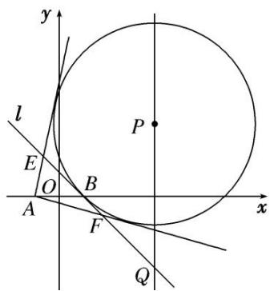

text_image

y
l
E
O
A
B
F
x
P
Q

4. 解析 (1) 设 $AE$ 切圆 $\Gamma$ 于点 $M$ , 直线 $x = 4$ 与 $x$ 轴的交点为 $N$ , 故 $|EM| = |EB|$ .

从而 $|EA|+|EB|=|AM|=\sqrt{|AP|^{2}-|PM|^{2}}=\sqrt{|AP|^{2}-|PB|^{2}}=\sqrt{(|AN|^{2}+|NP|^{2})-(|BN|^{2}+|NP|^{2})}=\sqrt{|AN|^{2}-|BN|^{2}}=\sqrt{25-9}=4$ 。所以 $|EA|+|EB|$ 为定值4。

(2)由(1)同理可知 $|FA|+|FB|=4$ ，故E，F均在椭圆 $\frac{x^{2}}{4}+\frac{y^{2}}{3}=1$ 上.

设直线 EF 的方程为 $x=my+1(m\neq0)$ . 令 x=4，求得 $y=\frac{3}{m}$ ，即 Q 点的纵坐标 $y_{Q}=\frac{3}{m}$ .

由 $\left\{\begin{aligned}x&=my+1,\\ \frac{x^{2}}{4}&+\frac{y^{2}}{3}=1\end{aligned}\right.$ 得， $(3m^{2}+4)y^{2}+6my-9=0$ 。设 $E(x_{1},y_{1}),F(x_{2},y_{2})$

则有 $y_{1}+y_{2}=-\frac{6m}{3m^{2}+4}$ ， $y_{1}y_{2}=-\frac{9}{3m^{2}+4}$ 。因为 E, B, F, Q 在同一条直线上，

所以 $|EB|\cdot|FQ|=|FB|\cdot|EQ|$ 等价于 $(y_{B}-y_{1})(y_{Q}-y_{2})=(y_{2}-y_{B})(y_{Q}-y_{1})$ . 即 $-y_{1}\cdot\frac{3}{m}+y_{1}y_{2}=y_{2}\cdot\frac{3}{m}-y_{1}y_{2}$ ,

等价于 $2y_{1}y_{2}=(y_{1}+y_{2})\cdot\frac{3}{m}$ . 将 $y_{1}+y_{2}=-\frac{6m}{3m^{2}+4}$ , $y_{1}y_{2}=-\frac{9}{3m^{2}+4}$ 代入，知上式成立.

所以 $|EB|\cdot|FQ|=|FB|\cdot|EQ|$ .

5. 已知斜率为 $k$ 的直线 $l$ 与椭圆 $C: \frac{x^2}{4} + \frac{y^2}{3} = 1$ 交于 $A, B$ 两点．线段 $AB$ 的中点为 $M(1, m) (m > 0)$ .

(1)证明： $k<-\frac{1}{2};$

(2)设 F 为 C 的右焦点，P 为 C 上一点，且 $\overrightarrow{FP} + \overrightarrow{FA} + \overrightarrow{FB} = 0$ 。证明： $2|\overrightarrow{FP}| = |\overrightarrow{FA}| + |\overrightarrow{FB}|$

text_image

y
P
O
F
x
A
B

5. 解析 (1) 设直线 $l$ 的方程为 $y = kx + t$ ，设 $A(x_1, y_1)$ ， $B(x_2, y_2)$ ，由 $\left\{ \begin{array}{l} y = kx + t, \\ \frac{x^2}{4} + \frac{y^2}{3} = 1, \end{array} \right.$

消去 y 得 $(4k^{2}+3)x^{2}+8ktx+4t^{2}-12=0$ ，则 $\Delta=64k^{2}t^{2}-4(4t^{2}-12)(3+4k^{2})>0$ ，得 $4k^{2}+3>t^{2}$ ，①

且 $x_{1} + x_{2} = \frac{-8kt}{3 + 4k^{2}} = 2, y_{1} + y_{2} = k(x_{1} + x_{2}) + 2t = \frac{6t}{3 + 4k^{2}} = 2m,$

因为 m>0，所以 t>0 且 k<0。且 $t=\frac{3+4k^{2}}{-4k}$ ，②

由①②得 $4k^{2}+3>\frac{(3+4k^{2})^{2}}{16k^{2}}$ ，所以 $k>\frac{1}{2}$ 或 $k<-\frac{1}{2}$ 。因为 k<0，所以 $k<-\frac{1}{2}$ 。

(2) $\overrightarrow{FP}+\overrightarrow{FA}+\overrightarrow{FB}=0,\quad\overrightarrow{FP}+2\overrightarrow{FM}=0$ ，因为 $M(1,m),F(1,0)$ ，所以P的坐标为 $(1,-2m)$ .

又 P 在椭圆上，所以 $\frac{1}{4} + \frac{4m^{2}}{3} = 1$ ，所以 $m = \frac{3}{4}$ ， $P\left(1, -\frac{3}{2}\right)$ ，又 $\frac{x_{1}^{2}}{4} + \frac{y_{1}^{2}}{3} = 1$ ， $\frac{x_{2}^{2}}{4} + \frac{y_{2}^{2}}{3} = 1$ ，

两式相减可得 $\frac{y_{1}-y_{2}}{x_{1}-x_{2}}=-\frac{3}{4}\cdot\frac{x_{1}+x_{2}}{y_{1}+y_{2}}$ ，又 $x_{1}+x_{2}=2,\quad y_{1}+y_{2}=\frac{3}{2}$ ，所以k=-1，

直线 l 方程为 $y - \frac{3}{4} = -(x - 1)$ ，即 $y = -x + \frac{7}{4}$ ,

所以 $\left\{\begin{aligned}y&=-x+\frac{7}{4},\\ \frac{x^{2}}{4}+\frac{y^{2}}{3}&=1,\end{aligned}\right.$ 消去 y 得 $28x^{2}-56x+1=0,\quad x_{1,2}=\frac{14\pm3\sqrt{21}}{14}$ ,

$$
| \overrightarrow {F A} | + | \overrightarrow {F B} | = \sqrt {(x _ {1} - 1) ^ {2} + y _ {1} ^ {2}} + \sqrt {(x _ {2} - 1) ^ {2} + y _ {2} ^ {2}} = 3, | \overrightarrow {F P} | = \sqrt {(1 - 1) ^ {2} + \left[ - \frac {3}{2} - 0 \right] ^ {2}} = \frac {3}{2},
$$

所以 $|\overrightarrow{FA}|+|\overrightarrow{FB}|=2|\overrightarrow{FP}|$ .

6. 如图所示，已知直线 $l$ 过点 $M(4, 0)$ 且与抛物线 $y^{2} = 2px (p > 0)$ 交于 $A$ ， $B$ 两点，以弦 $AB$ 为直径的圆恒过坐标原点 $O$ .

(1)求抛物线的标准方程;

(2)设 Q 是直线 x=-4 上任意一点，求证：直线 QA, QM, QB 的斜率依次成等差数列.

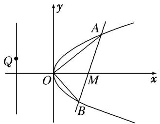

text_image

Q
O
A
M
B
x
y

6. 解析 (1) 设直线 l 的方程为 $x = ky + 4$ ，代入 $y^{2} = 2px$ 得 $y^{2} - 2kpy - 8p = 0$ .

设 $A(x_{1}, y_{1})$ ， $B(x_{2}, y_{2})$ ，则有 $y_{1} + y_{2} = 2kp$ ， $y_{1}y_{2} = -8p$ ，而 AB 为直径，O 为圆上一点，

所以 $\overrightarrow{OA}\cdot\overrightarrow{OB}=0$ ，故 $0=x_{1}x_{2}+y_{1}y_{2}=(ky_{1}+4)(ky_{2}+4)-8p=k^{2}y_{1}y_{2}+4k(y_{1}+y_{2})+16-8p$

即 $0 = -8k^{2}p + 8k^{2}p + 16 - 8p$ ，得 p = 2，所以抛物线方程为 $y^{2} = 4x$ .

(2)设 $Q(-4, t)$ 由(1)知 $y_{1} + y_{2} = 4k$ , $y_{1}y_{2} = -16$ ，所以 $y_{1}^{2} + y_{2}^{2} = (y_{1} + y_{2})^{2} - 2y_{1}y_{2} = 16k^{2} + 32$ .

因为 $k_{QA}=\frac{y_{1}-t}{x_{1}+4}=\frac{y_{1}-t}{\frac{y_{1}^{2}}{4}+4}=\frac{4(y_{1}-t)}{y_{1}^{2}+16}$ ， $k_{QB}=\frac{y_{2}-t}{x_{2}+4}=\frac{y_{2}-t}{\frac{y_{2}^{2}}{4}+4}=\frac{4(y_{2}-t)}{y_{2}^{2}+16}$ ， $k_{QM}=\frac{t}{-8}$

所以 $k_{QA} + k_{QB} = \frac{4(y_{1} - t)}{y_{1}^{2} + 16} + \frac{4(y_{2} - t)}{y_{2}^{2} + 16} = 4 \times \frac{(y_{1} - t)(y_{2}^{2} + 16) + (y_{2} - t)(y_{1}^{2} + 16)}{(y_{1}^{2} + 16)(y_{2}^{2} + 16)}$

$$
= 4 \times \frac {y _ {1} y _ {2} ^ {2} + 1 6 y _ {1} - t y _ {2} ^ {2} - 1 6 t + y _ {2} y _ {1} ^ {2} + 1 6 y _ {2} - t y _ {1} ^ {2} - 1 6 t}{y _ {1} ^ {2} y _ {2} ^ {2} + 1 6 (y _ {1} ^ {2} + y _ {2} ^ {2}) + 1 6 \times 1 6} = \frac {- t (y _ {1} ^ {2} + y _ {2} ^ {2}) - 3 2 t}{8 \times 1 6 + 4 (y _ {1} ^ {2} + y _ {2} ^ {2})} = \frac {- t (1 6 k ^ {2} + 3 2) - 3 2 t}{8 \times 1 6 + 4 (1 6 k ^ {2} + 3 2)} = - \frac {t}{4} = 2 k _ {Q M}.
$$

所以直线 QA, QM, QB 的斜率依次成等差数列.

7. 已知椭圆 $C: \frac{x^2}{a^2} + \frac{y^2}{b^2} = 1 (a > b > 0)$ 的离心率为 $\frac{\sqrt{3}}{2}$ , 焦距为 $2\sqrt{3}$ .

(1)求椭圆 C 的方程;

(2)若斜率为 $-\frac{1}{2}$ 的直线与椭圆 C 交于 P, Q 两点(点 P, Q 均在第一象限), O 为坐标原点, 证明: 直线 OP, PQ, OQ 的斜率依次成等比数列.

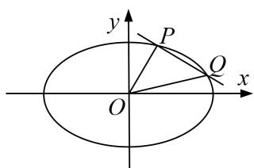

text_image

y
P
O
Q
x
O

7. 解析 (1)由题意，得 $\left\{ \begin{array}{l} c = \frac{\sqrt{3}}{2}, \\ 2c = 2\sqrt{3}, \end{array} \right.$ 解得 $\left\{ \begin{array}{l} a = 2, \\ c = \sqrt{3}, \end{array} \right.$ 又 $b^{2} = a^{2} - c^{2} = 1$

∴椭圆 C 的方程为 $\frac{x^{2}}{4} + y^{2} = 1$ .

(2)证明：设直线 l 的方程为 $y=-\frac{1}{2}x+m,\quad P(x_{1},y_{1}),\quad Q(x_{2},y_{2})$ ,

由 $\left\{ \begin{array}{l} y = -\frac{1}{2} x + m, \\ \frac{x^2}{4} + y^2 = 1, \end{array} \right.$ 消去 $y$ ，得 $2x^{2} - 4mx + 4(m^{2} - 1) = 0$ .

则 $\Delta=16m^{2}-32(m^{2}-1)=16(2-m^{2})>0$ ，且 $x_{1}+x_{2}=2m,\quad x_{1}x_{2}=2(m^{2}-1)$ .

故 $y_{1}y_{2}=\left(-\frac{1}{2}x_{1}+m\right)\left(-\frac{1}{2}x_{2}+m\right)=\frac{1}{4}x_{1}x_{2}-\frac{1}{2}m(x_{1}+x_{2})+m^{2}.$

$$
\therefore k _ {O P} \cdot k _ {O Q} = \frac {y _ {1} y _ {2}}{x _ {1} x _ {2}} = \frac {\frac {1}{4} x _ {1} x _ {2} - \frac {1}{2} m (x _ {1} + x _ {2}) + m ^ {2}}{x _ {1} x _ {2}} = \frac {1}{4} = k _ {P Q} ^ {2},
$$

即直线 OP, PQ, OQ 的斜率依次成等比数列.

8. 已知椭圆 $E: \frac{x^2}{a^2} + \frac{y^2}{b^2} = 1 (a > b > 0)$ 的离心率为方程 $2x^2 - 3x + 1 = 0$ 的解，点 $A, B$ 分别为椭圆 $E$ 的左、右顶点，点 $C$ 在 $E$ 上，且 $\triangle ABC$ 面积的最大值为 $2\sqrt{3}$ .

(1)求椭圆 E 的方程;  
(2)设 F 为 E 的左焦点，点 D 在直线 x = -4 上，过 F 作 DF 的垂线交椭圆 E 于 M，N 两点．证明：直线 OD 把 $\triangle DMN$ 分为面积相等的两部分.

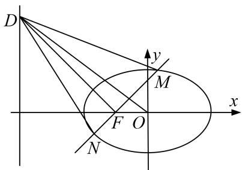

text_image

D
y
M
F O
x
N

8. 解析 (1)方程 $2x^{2}-3x+1=0$ 的解为 $x_{1}=\frac{1}{2}$ ， $x_{2}=1$ ，∵椭圆离心率 $e\in(0,1)$ ，∴ $e=\frac{1}{2}$

由题意得 $\left\{\begin{aligned}\frac{c}{a}&=\frac{1}{2},\\ ab&=2\sqrt{3},\\ a^{2}&=b^{2}+c^{2},\end{aligned}\right.$ 解得 $\left\{\begin{aligned}a&=2,\\ b&=\sqrt{3},\end{aligned}\right.$ $\therefore$ 椭圆E的方程为 $\frac{x^{2}}{4}+\frac{y^{2}}{3}=1.$

(2)设 $M(x_{1}, y_{1})$ ， $N(x_{2}, y_{2})$ ， $D(-4, n)$ ，线段 MN 的中点为 $P(x_{0}, y_{0})$ ，
故 $2x_{0}=x_{1}+x_{2}$ ， $2y_{0}=y_{1}+y_{2}$ ，由(1)可得 $F(-1,0)$ ，则直线 DF 的斜率为 $k_{DF}=\frac{n-0}{-4-(-1)}=-\frac{n}{3}$ 当 n=0 时，直线 MN 的斜率不存在，根据椭圆的对称性可知 OD 平分线段 MN.

当 $n \neq 0$ 时，直线 MN 的斜率 $k_{MN} = \frac{3}{n} = \frac{y_{1} - y_{2}}{x_{1} - x_{2}}$ ，∵ 点 M，N 在椭圆 E 上，

$\therefore \left\{ \begin{array}{l} \frac{x_1^2}{4} + \frac{y_1^2}{3} = 1, \\ \frac{x_2^2}{4} + \frac{y_2^2}{3} = 1, \end{array} \right.$ 整理得 $\frac{(x_1 + x_2)(x_1 - x_2)}{4} + \frac{(y_1 + y_2)(y_1 - y_2)}{3} = 0,$

又 $2x_{0}=x_{1}+x_{2},\quad2y_{0}=y_{1}+y_{2},\quad\therefore\frac{x_{0}}{2}+\frac{2y_{0}}{3}\cdot\frac{3}{n}=0,\quad 即 \frac{y_{0}}{x_{0}}=-\frac{n}{4},\quad 即直线 OP 的斜率为 k_{OP}=-\frac{n}{4},$

又直线 OD 的斜率为 $k_{OD} = -\frac{n}{4}$ ，∴ OD 平分线段 MN.

综上，直线 OD 把 $\triangle DMN$ 分为面积相等的两部分.

9. 已知抛物线 $C: y^{2} = 2px (p > 0)$ , 焦点为 $F$ , $O$ 为坐标原点, 直线 $AB$ (不垂直于 $x$ 轴) 过点 $F$ 且与抛物线 $C$ 交于 $A$ , $B$ 两点, 直线 $OA$ 与 $OB$ 的斜率之积为 $-p$ .

(1)求抛物线 C 的方程;

(2)若 M 为线段 AB 的中点，射线 OM 交抛物线 C 于点 D，求证： $\frac{|OD|}{|OM|}>2.$

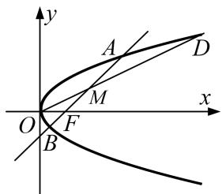

text_image

y
A
D
M
O
F
x
B

9. 解析 (1) 设 $A(x_{1}, y_{1})$ , $B(x_{2}, y_{2})$ ，直线 AB (不垂直于 x 轴) 的方程可设为 $y = kx - \frac{p}{2} (k \neq 0)$ .

∵直线 AB 过点 F 且与抛物线 C 交于 A, B 两点，∴ $y_{1}^{2}=2px_{1}$ ， $y_{2}^{2}=2px_{2}$ .

∵ 直线 OA 与 OB 的斜率之积为 -p，∴ $\frac{y_{1}y_{2}}{x_{1}x_{2}} = -p$ ，∴ $\left(\frac{y_{1}y_{2}}{x_{1}x_{2}}\right)^{2} = p^{2}$ ，得 $x_{1}x_{2} = 4$ .

由 $\left\{\begin{aligned}y&=k\left(x-\frac{p}{2}\right),\\ y^{2}&=2px,\end{aligned}\right.$ 得 $k^{2}x^{2}-(k^{2}p+2p)x+\frac{k^{2}p^{2}}{4}=0$ ，其中 $\Delta=(k^{2}p+2p)^{2}-k^{2}p^{2}k^{2}>0$

$\therefore x_{1}+x_{2}=\frac{k^{2}p+2p}{k^{2}},\quad x_{1}x_{2}=\frac{p^{2}}{4},\quad \therefore p=4,\quad \therefore$ 抛物线 C 的方程为 $y^{2}=8x$ .

(2)设 $M(x_{0}, y_{0})$ , $D(x_{3}, y_{3})$ , $\because M$ 为线段 AB 的中点,

$\therefore x_{0} = \frac{1}{2}(x_{1} + x_{2}) = \frac{k^{2}p + 2p}{2k^{2}} = \frac{2(k^{2} + 2)}{k^{2}}, y_{0} = k(x_{0} - 2) = \frac{4}{k}, \therefore$ 直线 $OD$ 的斜率 $k_{OD} = \frac{y_0}{x_0} = \frac{2k}{k^2 + 2}$ ,

∴直线 OD 的方程为 $y=\frac{2k}{k^{2}+2}x$ ，代入抛物线方程 $y^{2}=8x$ ，得 $x_{3}=\frac{2(k^{2}+2)^{2}}{k^{2}}$

$$
\therefore \frac {x _ {3}}{x _ {0}} = k ^ {2} + 2, \because k ^ {2} > 0, \therefore \frac {| O D |}{| O M |} = \frac {x _ {3}}{x _ {0}} = k ^ {2} + 2 > 2.
$$

