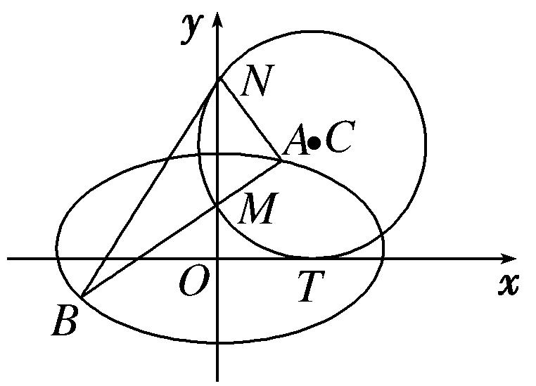
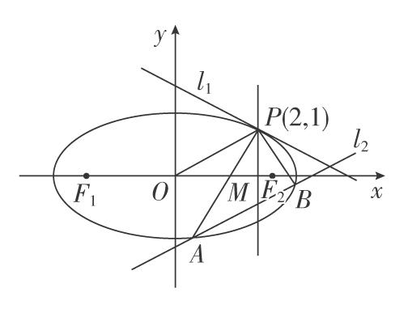
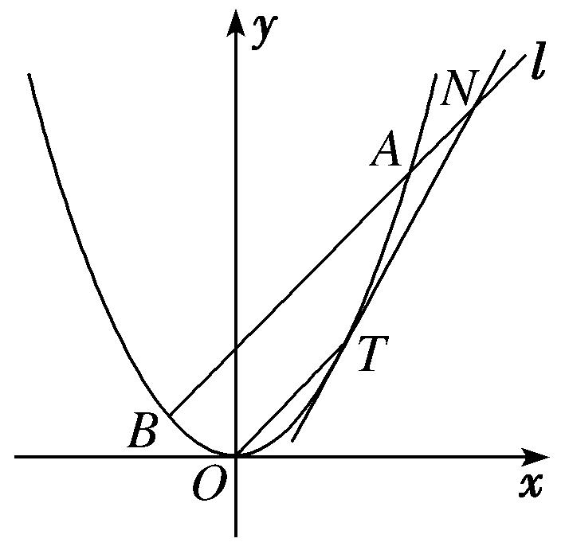
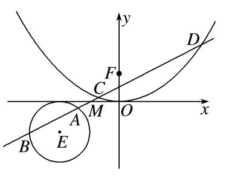
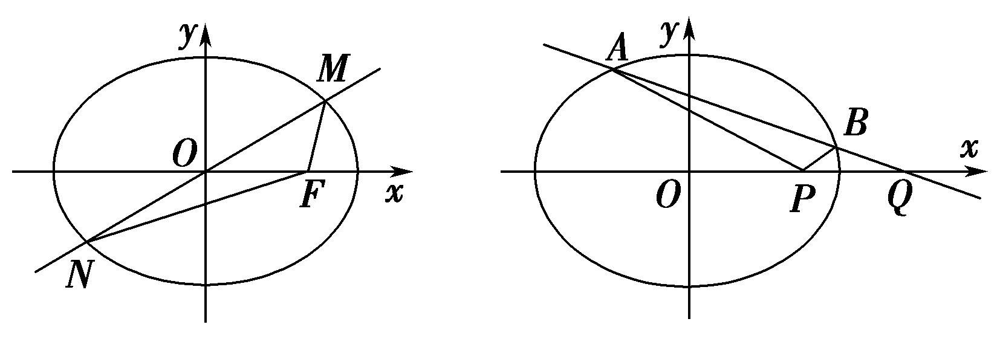
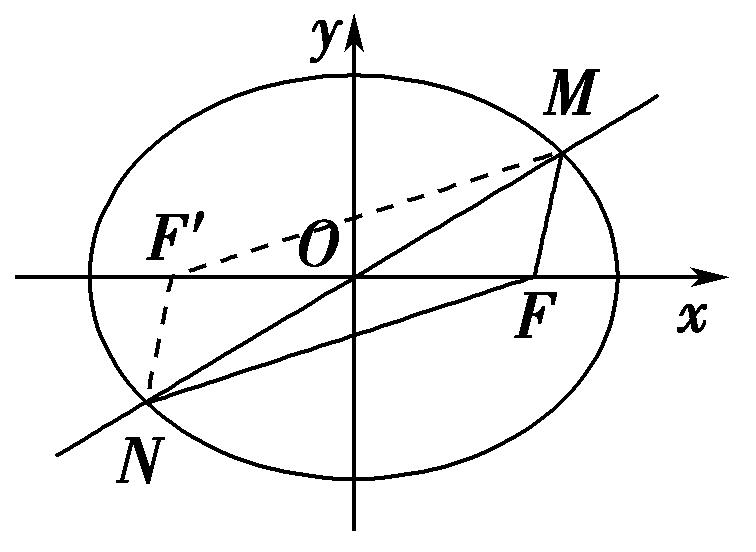
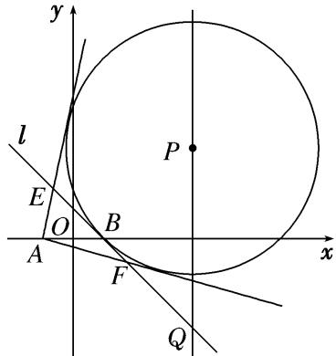
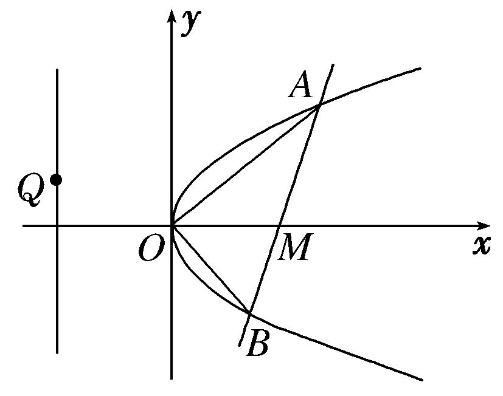

**专题30　证明数量关系型问题**

圆锥曲线中的证明问题，主要有两类：一是证明直线与圆锥曲线中的一些数量关系(相等或不等)．二是证明点、直线、曲线等几何元素中的位置关系，如：如证明直线与曲线相切，直线间的平行、垂直，直线过定点等；解决证明问题时，主要根据直线与圆锥曲线的性质、直线与圆锥曲线的位置关系等，通过相关性质的应用、代数式的恒等变形以及必要的数值计算等进行证明．圆锥曲线中的证明问题是转化与化归思想的充分体现．无论证明什么结论，要对已知条件进行化简，同时对要证结论合理转化，寻求条件和结论间的联系，从而确定解题思路及转化方向．

**【例题选讲】**

<strong>[例1]</strong>　(2018·全国Ⅰ)设椭圆<em>C</em>：＋<em>y</em>2＝1的右焦点为<em>F</em>，过<em>F</em>的直线<em>l</em>与<em>C</em>交于<em>A</em>，<em>B</em>两点，点<em>M</em>的坐标为(2，0)．

(1)当*l*与*x*轴垂直时，求直线*AM*的方程；

(2)设*O*为坐标原点，证明：∠*OMA*＝∠*OMB．*

<strong>[规范解答]</strong>　(1)由已知得<em>F</em>(1，0)，<em>l</em>的方程为<em>x</em>＝1．则点<em>A</em>的坐标为或．

又*M*(2，0)，所以直线*AM*的方程为*y*＝－*x*＋或*y*＝*x*－，

即*x*＋*y*－2＝0或*x*－*y*－2＝0．

(2)当*l*与*x*轴重合时，∠*OMA*＝∠*OMB*＝0°．

当*l*与*x*轴垂直时，*OM*为*AB*的垂直平分线，所以∠*OMA*＝∠*OMB．*

当<em>l</em>与<em>x</em>轴不重合也不垂直时，设<em>l</em>的方程为<em>y</em>＝<em>k</em>(<em>x</em>－1)(<em>k</em>≠0)，<em>A</em>(<em>x</em>1，<em>y</em>1)，<em>B</em>(<em>x</em>2，<em>y</em>2)，

则<em>x</em>1&lt;，<em>x</em>2&lt;，直线<em>MA</em>，<em>MB</em>的斜率之和为<em>kMA</em>＋<em>kMB</em>＝＋．

由<em>y</em>1＝<em>kx</em>1－<em>k</em>，<em>y</em>2＝<em>kx</em>2－<em>k</em>，得<em>kMA</em>＋<em>kMB</em>＝．

将<em>y</em>＝<em>k</em>(<em>x</em>－1)代入＋<em>y</em>2＝1，得(2<em>k</em>2＋1)<em>x</em>2－4<em>k</em>2<em>x</em>＋2<em>k</em>2－2＝0，

所以<em>x</em>1＋<em>x</em>2＝，<em>x</em>1<em>x</em>2＝．则2<em>kx</em>1<em>x</em>2－3<em>k</em>(<em>x</em>1＋<em>x</em>2)＋4<em>k</em>＝＝0．

从而<em>kMA</em>＋<em>kMB</em>＝0，故<em>MA</em>，<em>MB</em>的倾斜角互补．所以∠<em>OMA</em>＝∠<em>OMB．</em>

综上，∠*OMA*＝∠*OMB*成立．

<strong>[例2]</strong>　如图，圆<em>C</em>与<em>x</em>轴相切于点<em>T</em>(2，0)，与<em>y</em>轴正半轴相交于两点<em>M</em>，<em>N</em>(点<em>M</em>在点<em>N</em>的下方)，且|<em>MN</em>|＝3．

(1)求圆*C*的方程；

(2)过点*M*任作一条直线与椭圆＋＝1相交于两点*A*，*B*，连接*AN*，*BN*，求证：∠*ANM*＝∠*BNM*．

<strong>[规范解答]</strong>　(1)设圆<em>C</em>的半径为<em>r</em>(<em>r</em>&gt;0)，依题意，圆心<em>C</em>的坐标为(2，<em>r</em>)．∵|<em>MN</em>|＝3，

∴<em>r</em>2＝2＋22，解得<em>r</em>2＝，∴<em>r</em>＝，圆<em>C</em>的方程为(<em>x</em>－2)2＋2＝．

(2)证明：把<em>x</em>＝0代入方程(<em>x</em>－2)2＋2＝，解得<em>y</em>＝1或<em>y</em>＝4，即点<em>M</em>(0，1)，<em>N</em>(0，4)．

①当*AB*⊥*x*轴时，可知∠*ANM*＝∠*BNM*＝0．

②当*AB*与*x*轴不垂直时，可设直线*AB*的方程为*y*＝*kx*＋1．

联立方程 消去<em>y</em>得，(1＋2<em>k</em>2)<em>x</em>2＋4<em>kx</em>－6＝0．

设直线<em>AB</em>交椭圆于<em>A</em>(<em>x</em>1，<em>y</em>1)，<em>B</em>(<em>x</em>2，<em>y</em>2)两点，则<em>x</em>1＋<em>x</em>2＝，<em>x</em>1<em>x</em>2＝．

∴<em>kAN</em>＋<em>kBN</em>＝＋＝＋＝．

若<em>kAN</em>＋<em>kBN</em>＝0，则∠<em>ANM</em>＝∠<em>BNM</em>．

∵2<em>kx</em>1<em>x</em>2－3(<em>x</em>1＋<em>x</em>2)＝＋＝0，∴∠<em>ANM</em>＝∠<em>BNM</em>．

<strong>[例3]</strong>　双曲线<em>C</em>：－＝1(<em>a</em>&gt;0，<em>b</em>&gt;0)的左顶点为<em>A</em>，右焦点为<em>F</em>，动点<em>B</em>在<em>C</em>上．当<em>BF</em>⊥<em>AF</em>时，|<em>AF</em>|＝|<em>BF</em>|．

(1)求*C*的离心率；

(2)若*B*在第一象限，证明：∠*BFA*＝2∠*BAF*．

<strong>[规范解答]</strong>　(1)设双曲线的半焦距为<em>c</em>，则<em>F</em>(<em>c，</em>0)，<em>B</em>，

因为|<em>AF</em>|＝|<em>BF</em>|，故＝<em>a</em>＋<em>c</em>，故<em>c</em>2－<em>ac</em>－2<em>a</em>2＝0，即<em>e</em>2－<em>e</em>－2＝0，又<em>e</em>&gt;0，故<em>e</em>＝2．

(2)设<em>B</em>(<em>x</em>0，<em>y</em>0)，其中<em>x</em>0&gt;<em>a</em>，<em>y</em>0&gt;0．因为<em>e</em>＝2，故<em>c</em>＝2<em>a</em>，<em>b</em>＝<em>a</em>，

故双曲线的渐近线方程为*y*＝±*x*，所以∠*BAF*∈，∠*BFA*∈．

当∠*BFA*＝时，由题意易得∠*BAF*＝，此时∠*BFA*＝2∠*BAF*．

当∠*BFA*≠时，因为tan∠*BFA*＝－＝－，tan∠*BAF*＝，

所以tan2∠*BAF*＝＝＝＝

＝＝＝－＝tan∠*BFA*，

因为2∠*BAF*∈，故∠*BFA*＝2∠*BAF*．

综上，∠*BFA*＝2∠*BAF*．

<strong>[例4]</strong>　已知椭圆<em>E</em>：＋＝1(<em>a</em>＞<em>b</em>＞0)的焦距为2，直线<em>l</em>1：<em>x</em>＝4与<em>x</em>轴的交点为<em>G</em>，过点<em>M</em>(1，0)且不与<em>x</em>轴重合的直线<em>l</em>2交椭圆<em>E</em>于点<em>A</em>，<em>B</em>．当<em>l</em>2垂直于<em>x</em>轴时，△<em>ABG</em>的面积为．

(1)求椭圆*E*的方程；

(2)若<em>AC</em>⊥<em>l</em>1，垂足为<em>C</em>，直线<em>BC</em>交<em>x</em>轴于点<em>D</em>，证明：|<em>MD</em>|＝|<em>DG</em>|．

<strong>[规范解答]</strong>　(1)因为椭圆<em>E</em>的焦距为2，所以<em>c</em>＝，所以<em>a</em>2－<em>b</em>2＝3，①

当<em>l</em>2垂直于<em>x</em>轴时，|<em>MG</em>|＝3，因为△<em>ABG</em>的面积为，即|<em>AB</em>|·|<em>MG</em>|＝，

所以|*AB*|＝，不妨设*A*，代入椭圆*E*的方程得＋＝1，②

联立①②解得<em>a</em>2＝4，<em>b</em>2＝1，所以椭圆<em>E</em>的方程为＋<em>y</em>2＝1．

(2)设<em>A</em>(<em>x</em>1，<em>y</em>1)，<em>B</em>(<em>x</em>2，<em>y</em>2)，则<em>C</em>(4，<em>y</em>1)．

因为直线<em>l</em>2不与<em>x</em>轴重合，故可设<em>l</em>2的方程为<em>x</em>＝<em>my</em>＋1，联立得

整理得(<em>m</em>2＋4)<em>y</em>2＋2<em>my</em>－3＝0，所以<em>Δ</em>＝16(<em>m</em>2＋3)＞0，<em>y</em>1＋<em>y</em>2＝，<em>y</em>1<em>y</em>2＝，

所以直线<em>BC</em>：<em>y</em>－<em>y</em>1＝(<em>x</em>－4)，令<em>y</em>＝0，则<em>x</em>＝＋4，

所以点<em>D</em>的横坐标<em>xD</em>＝＋4，

所以<em>xD</em>－＝＋4－＝＋＝

＝＝＝0，

所以<em>xD</em>＝，因为<em>MG</em>中点的横坐标为，所以<em>D</em>为线段<em>MG</em>的中点，所以|<em>MD</em>|＝|<em>DG</em>|．

<strong>[例5]</strong>　已知椭圆＋＝1(<em>a</em>＞<em>b</em>＞0)的长轴长为4，且过点．

(1)求椭圆的方程；

(2)设*A*，*B*，*M*是椭圆上的三点．若＝＋，点*N*为线段*AB*的中点，*C*，*D*，求证：|*NC*|＋|*ND*|＝2．

<strong>[规范解答]</strong>　(1)由已知可得故所以椭圆的方程为＋<em>y</em>2＝1．

(2)设<em>A</em>(<em>x</em>1，<em>y</em>1)，<em>B</em>(<em>x</em>2，<em>y</em>2)，则＋<em>y</em>＝1，＋<em>y</em>＝1，由＝＋，得<em>M</em>．

因为<em>M</em>是椭圆<em>C</em>上一点，所以＋2＝1，

即2＋2＋2×××＝1，

得2＋2＋2×××＝1，故＋<em>y</em>1<em>y</em>2＝0．

又线段*AB*的中点*N*的坐标为，

所以＋22＝＋＋＋<em>y</em>1<em>y</em>2＝1．

从而线段<em>AB</em>的中点<em>N</em>在椭圆＋2<em>y</em>2＝1上．

又椭圆＋2<em>y</em>2＝1的两焦点恰为<em>C</em>，<em>D</em>，所以|<em>NC</em>|＋|<em>ND</em>|＝2．

<strong>[例6]</strong>　已知椭圆<em>C</em>：＋＝1(<em>a</em>&gt;<em>b</em>&gt;0)过点<em>P</em>(2，1)，<em>F</em>1，<em>F</em>2分别为椭圆<em>C</em>的左、右焦点，且·＝－1．

(1)求椭圆*C*的方程；

(2)过<em>P</em>点的直线<em>l</em>1与椭圆<em>C</em>有且只有一个公共点，直线<em>l</em>2平行于<em>OP</em>(<em>O</em>为原点)，且与椭圆<em>C</em>交于<em>A</em>，<em>B</em>两点，与直线<em>x</em>＝2交于点<em>M</em>(<em>M</em>介于<em>A</em>，<em>B</em>两点之间)．

①当△<em>PAB</em>面积最大时，求直线<em>l</em>2的方程；

②求证：|*PA*|·|*MB*|＝|*PB*|·|*MA*|．

<strong>[规范解答]</strong>　(1)设<em>F</em>1(－<em>c，</em>0)，<em>F</em>2(<em>c，</em>0)，＝(－<em>c</em>－2，－1)，＝(<em>c</em>－2，－1)．

因为·＝－<em>c</em>2＋4＋1＝－1，所以<em>c</em>＝，

又<em>P</em>(2，1)在椭圆上，故＋＝1，结合<em>a</em>2＝<em>b</em>2＋6，

解得<em>a</em>2＝8，<em>b</em>2＝2，故所求椭圆<em>C</em>的方程为＋＝1．

(2)①由于<em>kOP</em>＝，设直线<em>l</em>2的方程为<em>y</em>＝<em>x</em>＋<em>t</em>，<em>A</em>(<em>x</em>1，<em>y</em>1)，<em>B</em>(<em>x</em>2，<em>y</em>2)，

由消去<em>y</em>整理得<em>x</em>2＋2<em>tx</em>＋2<em>t</em>2－4＝0，

则|*AB*|＝ ＝ ＝＝，

又点<em>P</em>到直线<em>l</em>2的距离<em>d</em>＝＝．

所以<em>S</em>△<em>PAB</em>＝× ×＝≤＝2．

当且仅当4－<em>t</em>2＝<em>t</em>2时取等号，此时<em>t</em>2＝2，

又<em>M</em>介于<em>A</em>，<em>B</em>两点之间，故<em>t</em>＝－，故直线<em>l</em>2的方程为<em>y</em>＝<em>x</em>－．

②证明：要证结论成立，只需证明＝，由角平分线性质，

即证直线<em>x</em>＝2为∠<em>APB</em>的平分线，转化成证明<em>kPA</em>＋<em>kPB</em>＝0．

因为<em>kPA</em>＋<em>kPB</em>＝＋＝

＝＝＝＝0，

因此结论成立．

<strong>[例7]</strong>　(2018·全国Ⅲ)已知斜率为<em>k</em>的直线<em>l</em>与椭圆<em>C</em>：＋＝1交于<em>A</em>，<em>B</em>两点，线段<em>AB</em>的中点为<em>M</em>(1，<em>m</em>)(<em>m</em>&gt;0)．

(1)证明：*k*<－；

(2)设*F*为*C*的右焦点，*P*为*C*上一点，且＋＋＝0．证明：||，||，||成等差数列，并求该数列的公差．

<strong>[规范解答]</strong>　(1)设<em>A</em>(<em>x</em>1，<em>y</em>1)，<em>B</em>(<em>x</em>2，<em>y</em>2)，则＋＝1，＋＝1．

两式相减，并由＝*k*，得＋·*k*＝0，由题设知＝1，＝*m*，于是*k*＝－．①

由题设得0<*m*<，故*k*<－．

(2)由题意得<em>F</em>(1,0)．设<em>P</em>(<em>x</em>3，<em>y</em>3)，则(<em>x</em>3－1，<em>y</em>3)＋(<em>x</em>1－1，<em>y</em>1)＋(<em>x</em>2－1，<em>y</em>2)＝(0,0)．

由(1)及题设得<em>x</em>3＝3－(<em>x</em>1＋<em>x</em>2)＝1，<em>y</em>3＝－(<em>y</em>1＋<em>y</em>2)＝－2<em>m</em>&lt;0．

又点*P*在*C*上，所以*m*＝，从而*P*，||＝，

于是||＝＝＝2－，同理||＝2－．

所以||＋||＝4－(<em>x</em>1＋<em>x</em>2)＝3．故2||＝||＋||，即||，||，||成等差数列．

设该数列的公差为<em>d</em>，则2|<em>d</em>|＝|||－|||＝|<em>x</em>1－<em>x</em>2|＝．②

将<em>m</em>＝代入①得<em>k</em>＝－1，所以<em>l</em>的方程为<em>y</em>＝－<em>x</em>＋，代入<em>C</em>的方程，并整理得7<em>x</em>2－14<em>x</em>＋＝0．

故<em>x</em>1＋<em>x</em>2＝2，<em>x</em>1<em>x</em>2＝，代入②解得|<em>d</em>|＝，所以该数列的公差为或－．

<strong>[例8]</strong>　在平面直角坐标系<em>xOy</em>中，点<em>F</em>的坐标为，以线段<em>MF</em>为直径的圆与<em>x</em>轴相切．

(1)求点*M*的轨迹*E*的方程；

(2)设<em>T</em>是<em>E</em>上横坐标为2的点，<em>OT</em>的平行线<em>l</em>交<em>E</em>于<em>A</em>，<em>B</em>两点，交曲线<em>E</em>在<em>T</em>处的切线于点<em>N</em>，求证：|<em>NT</em>|2＝|<em>NA</em>|·|<em>NB</em>|．

<strong>[规范解答]</strong>　(1)设点<em>M</em>(<em>x</em>，<em>y</em>)，因为<em>F</em>，所以<em>MF</em>的中点坐标为．

因为以线段*MF*为直径的圆与*x*轴相切，所以＝，即|*MF*|＝，

故 ＝，得<em>x</em>2＝2<em>y</em>，所以<em>M</em>的轨迹<em>E</em>的方程为<em>x</em>2＝2<em>y</em>．

(2)证明：因为*T*是*E*上横坐标为2的点，所以由(1)得*T*(2，2)，所以直线*OT*的斜率为1．

因为*l*∥*OT*，所以可设直线*l*的方程为*y*＝*x*＋*m*，*m*≠0．

由<em>y</em>＝<em>x</em>2，得<em>y</em>′＝<em>x</em>，则曲线<em>E</em>在<em>T</em>处的切线的斜率为<em>y</em>′|<em>x</em>＝2＝2，

所以曲线*E*在*T*处的切线方程为*y*＝2*x*－2．

由得

所以<em>N</em>(<em>m</em>＋2，2<em>m</em>＋2)，所以|<em>NT</em>|2＝[(<em>m</em>＋2)－2]2＋[(2<em>m</em>＋2)－2]2＝5<em>m</em>2．

由消去<em>y</em>，得<em>x</em>2－2<em>x</em>－2<em>m</em>＝0，由<em>Δ</em>＝4＋8<em>m</em>＞0，解得<em>m</em>＞－．

设<em>A</em>(<em>x</em>1，<em>y</em>1)，<em>B</em>(<em>x</em>2，<em>y</em>2)，则<em>x</em>1＋<em>x</em>2＝2，<em>x</em>1<em>x</em>2＝－2<em>m</em>．

因为<em>N</em>，<em>A</em>，<em>B</em>在<em>l</em>上，所以|<em>NA</em>|＝|<em>x</em>1－(<em>m</em>＋2)|，|<em>NB</em>|＝|<em>x</em>2－(<em>m</em>＋2)|，

所以|<em>NA</em>|·|<em>NB</em>|＝2|<em>x</em>1－(<em>m</em>＋2)|·|<em>x</em>2－(<em>m</em>＋2)|＝2|<em>x</em>1<em>x</em>2－(<em>m</em>＋2)(<em>x</em>1＋<em>x</em>2)＋(<em>m</em>＋2)2|

＝2|－2<em>m</em>－2(<em>m</em>＋2)＋(<em>m</em>＋2)2|＝2<em>m</em>2，

所以|<em>NT</em>|2＝|<em>NA</em>|·|<em>NB</em>|．

<strong>[例9]</strong>　(2017·北京)已知椭圆<em>C</em>的两个顶点分别为<em>A</em>(－2，0)，<em>B</em>(2，0)，焦点在<em>x</em>轴上，离心率为．

(1)求椭圆*C*的方程；

(2)点*D*为*x*轴上一点，过*D*作*x*轴的垂线交椭圆*C*于不同的两点*M*，*N*，过*D*作*AM*的垂线交*BN*于点*E*．求证：△*BDE*与△*BDN*的面积之比为4∶5．

<strong>[规范解答]</strong>　(1)设椭圆<em>C</em>的方程为＋＝1(<em>a</em>＞<em>b</em>＞0)，由题意得解得<em>c</em>＝，

所以<em>b</em>2＝<em>a</em>2－<em>c</em>2＝1，所以椭圆<em>C</em>的方程为＋<em>y</em>2＝1．

(2)设*M*(*m*，*n*)，则*D*(*m,* 0)，*N*(*m*，－*n*)，由题设知*m*≠±2，且*n*≠0．

直线<em>AM</em>的斜率<em>kAM</em>＝，故直线<em>DE</em>的斜率<em>kDE</em>＝－，

所以直线*DE*的方程为*y*＝－(*x*－*m*)，直线*BN*的方程为*y*＝(*x*－2)．

联立解得点<em>E</em>的纵坐标<em>yE</em>＝－．

由点<em>M</em>在椭圆<em>C</em>上，得4－<em>m</em>2＝4<em>n</em>2，所以<em>yE</em>＝－<em>n</em>．

又<em>S</em>△<em>BDE</em>＝|<em>BD</em>|·|<em>yE</em>|＝|<em>BD</em>|·|<em>n</em>|，<em>S</em>△<em>BDN</em>＝|<em>BD</em>|·|<em>n</em>|，所以△<em>BDE</em>与△<em>BDN</em>的面积之比为4∶5．

<strong>[例10]</strong>　已知顶点是坐标原点的抛物线<em>Γ</em>的焦点<em>F</em>在<em>y</em>轴正半轴上，圆心在直线<em>y</em>＝<em>x</em>上的圆<em>E</em>与<em>x</em>轴相切，且<em>E</em>，<em>F</em>关于点<em>M</em>(－1，0)对称．

(1)求*E*和*Γ*的标准方程；

(2)过点*M*的直线*l*与*E*交于*A*，*B*，与*Γ*交于*C*，*D*，求证：|*CD*|>|*AB*|．

<strong>[规范解答]</strong>　(1)设<em>Γ</em>的标准方程为<em>x</em>2＝2<em>py</em>(<em>p</em>&gt;0)，则<em>F</em>．

已知*E*在直线*y*＝*x*上，故可设*E*(2*a*，*a*)．

因为*E*，*F*关于*M*(－1,0)对称，所以解得

所以<em>Γ</em>的标准方程为<em>x</em>2＝4<em>y</em>．因为<em>E</em>与<em>x</em>轴相切，故半径<em>r</em>＝|<em>a</em>|＝1，

所以<em>E</em>的标准方程为(<em>x</em>＋2)2＋(<em>y</em>＋1)2＝1．

(2)由题意知，直线*l*的斜率存在，设*l*的斜率为*k*，那么其方程为*y*＝*k*(*x*＋1)(*k*≠0)，

则*E*(－2，－1)到*l*的距离*d*＝，因为*l*与*E*交于*A*，*B*两点，

所以<em>d</em>2&lt;<em>r</em>2，即&lt;1，解得<em>k</em>&gt;0，所以|<em>AB</em>|＝2＝2．

由消去<em>y</em>并整理得<em>x</em>2－4<em>kx</em>－4<em>k</em>＝0．<em>Δ</em>＝16<em>k</em>2＋16<em>k</em>&gt;0恒成立，

设<em>C</em>(<em>x</em>1，<em>y</em>1)，<em>D</em>(<em>x</em>2，<em>y</em>2)，则<em>x</em>1＋<em>x</em>2＝4<em>k</em>，<em>x</em>1<em>x</em>2＝－4<em>k</em>，

那么|<em>CD</em>|＝|<em>x</em>1－<em>x</em>2|＝·＝4·．

所以＝＝＝>＝2．

所以|<em>CD</em>|2&gt;2|<em>AB</em>|2，即|<em>CD</em>|&gt;|<em>AB</em>|．

**【对点训练】**

1．已知椭圆*C*：＋＝1(*a*>*b*>0)的一个焦点为*F*(－1，0)，点*P*在*C*上．

(1)求椭圆*C*的方程；

(2)已知点*M*(－4，0)，过*F*作直线*l*交椭圆于*A*，*B*两点，求证：∠*FMA*＝∠*FMB*．

1．<strong>解析</strong>　(1)由题意知，<em>c</em>＝1，∵点<em>P</em>在椭圆<em>C</em>上，∴＋＝1．

又<em>a</em>2＝<em>b</em>2＋<em>c</em>2＝<em>b</em>2＋1，解得<em>a</em>2＝4，<em>b</em>2＝3，∴椭圆<em>C</em>的方程为＋＝1．

(2)当*l*与*x*轴垂直时，直线*MF*恰好平分∠*AMB*，则∠*FMA*＝∠*FMB*；

当*l*与*x*轴不垂直时，设直线*l*的方程为*y*＝*k*(*x*＋1)，

联立消去<em>y</em>得，(3＋4<em>k</em>2)<em>x</em>2＋8<em>k</em>2<em>x</em>＋4<em>k</em>2－12＝0，∵<em>Δ</em>&gt;0恒成立，

∴设<em>A</em>(<em>x</em>1，<em>y</em>1)，<em>B</em>(<em>x</em>2，<em>y</em>2)，由根与系数的关系，得<em>x</em>1＋<em>x</em>2＝－，<em>x</em>1<em>x</em>2＝，

直线<em>MA</em>，<em>MB</em>的斜率之和为<em>kMA</em>＋<em>kMB</em>＝＋＝

＝＝，

∵2<em>x</em>1<em>x</em>2＋5(<em>x</em>2＋<em>x</em>1)＋8＝2×＋5×＋8＝0，∴<em>kMA</em>＋<em>kMB</em>＝0，

故直线*MA*，*MB*的倾斜角互补，综上所述，∠*FMA*＝∠*FMB*．

2．如图，已知椭圆*C*：＋＝1(*a*＞*b*＞0)的右焦点为*F*，点在椭圆*C*上，过原点*O*的直线与

椭圆*C*相交于*M*，*N*两点，且|*MF*|＋|*NF*|＝4．

  
图①　　　　　　　　　　　图②

(1)求椭圆*C*的方程；

(2)设*P*(1，0)，*Q*(4，0)，过点*Q*且斜率不为零的直线与椭圆*C*相交于*A*，*B*两点，证明：∠*APO*＝∠*BPQ．*

2．解析　(1)如图，取椭圆*C*的左焦点*F*′，连接*MF*′，*NF*′，

由椭圆的几何性质知|*NF*|＝|*MF*′|，则|*MF*′|＋|*MF*|＝2*a*＝4，得*a*＝2.

将点代入椭圆*C*的方程得＋＝1，解得*b*＝1．

故椭圆<em>C</em>的方程为＋<em>y</em>2＝1．

(2)设点<em>A</em>的坐标为(<em>x</em>1，<em>y</em>1)，点<em>B</em>的坐标为(<em>x</em>2，<em>y</em>2)．

由图可知直线*AB*的斜率存在，设直线*AB*的方程为*y*＝*k*(*x*－4)(*k*≠0)．联立方程

消去<em>y</em>得，(4<em>k</em>2＋1)<em>x</em>2－32<em>k</em>2<em>x</em>＋64<em>k</em>2－4＝0，<em>Δ</em>＝(－32<em>k</em>2)2－4(4<em>k</em>2＋1)(64<em>k</em>2－4)＞0，<em>k</em>2＜，

直线*AP*的斜率为＝．

同理直线*BP*的斜率为．

由＋＝＝

＝＝＝＝0．

由上得直线*AP*与*BP*的斜率互为相反数，可得∠*APO*＝∠*BPQ．*

3．设椭圆<em>C</em>1：＋＝1(<em>a</em>&gt;<em>b</em>&gt;0)的离心率为，<em>F</em>1，<em>F</em>2是椭圆的两个焦点，<em>M</em>是椭圆上任意一点，且△

<em>MF</em>1<em>F</em>2的周长是4＋2．

(1)求椭圆<em>C</em>1的方程；

(2)设椭圆<em>C</em>1的左、右顶点分别为<em>A</em>，<em>B</em>，过椭圆<em>C</em>1上的一点<em>D</em>作<em>x</em>轴的垂线交<em>x</em>轴于点<em>E</em>，若点<em>C</em>满足⊥，∥，连接<em>AC</em>交<em>DE</em>于点<em>P</em>，求证：<em>PD</em>＝<em>PE</em>．

3．解析　(1)由<em>e</em>＝，知＝，所以<em>c</em>＝<em>a</em>，因为△<em>MF</em>1<em>F</em>2的周长是4＋2，

所以2<em>a</em>＋2<em>c</em>＝4＋2，所以<em>a</em>＝2，<em>c</em>＝，所以<em>b</em>2＝<em>a</em>2－<em>c</em>2＝1，

所以椭圆<em>C</em>1的方程为：＋<em>y</em>2＝1．

(2)证明：由(1)得<em>A</em>(－2,0)，<em>B</em>(2,0)，设<em>D</em>(<em>x</em>0，<em>y</em>0)，所以<em>E</em>(<em>x</em>0,0)，

因为⊥，所以可设<em>C</em>(2，<em>y</em>1)，所以＝(<em>x</em>0＋2，<em>y</em>0)，＝(2，<em>y</em>1)，

由∥可得：(<em>x</em>0＋2)<em>y</em>1＝2<em>y</em>0，即<em>y</em>1＝．

所以直线*AC*的方程为：＝，整理得：*y*＝(*x*＋2)．

又点<em>P</em>在<em>DE</em>上，将<em>x</em>＝<em>x</em>0代入直线<em>AC</em>的方程可得：<em>y</em>＝，

即点*P*的坐标为，所以*P*为*DE*的中点，所以*PD*＝*PE*．

4．如图，*P*是直线*x*＝4上一动点，以*P*为圆心的圆*Γ*过定点*B*(1，0)，直线*l*是圆*Γ*在点*B*处的切线，

过*A*(－1，0)作圆*Γ*的两条切线分别与*l*交于*E*，*F*两点．

(1)求证：|*EA*|＋|*EB*|为定值；

(2)设直线*l*交直线*x*＝4于点*Q*，证明：|*EB*|·|*FQ*|＝|*FB*|·|*EQ*|．

4．解析　(1)设*AE*切圆*Γ*于点*M*，直线*x*＝4与*x*轴的交点为*N*，故|*EM*|＝|*EB*|．

从而|*EA*|＋|*EB*|＝|*AM*|＝＝＝

＝＝＝4．所以|*EA*|＋|*EB*|为定值4．

(2)由(1)同理可知|*FA*|＋|*FB*|＝4，故*E*，*F*均在椭圆＋＝1上．

设直线<em>EF</em>的方程为<em>x</em>＝<em>my</em>＋1(<em>m</em>≠0)．令<em>x</em>＝4，求得<em>y</em>＝，即<em>Q</em>点的纵坐标<em>yQ</em>＝．

由得，(3<em>m</em>2＋4)<em>y</em>2＋6<em>my</em>－9＝0．设<em>E</em>(<em>x</em>1，<em>y</em>1)，<em>F</em>(<em>x</em>2，<em>y</em>2)，

则有<em>y</em>1＋<em>y</em>2＝－，<em>y</em>1<em>y</em>2＝－．因为<em>E</em>，<em>B</em>，<em>F</em>，<em>Q</em>在同一条直线上，

所以|<em>EB</em>|·|<em>FQ</em>|＝|<em>FB</em>|·|<em>EQ</em>|等价于(<em>yB</em>－<em>y</em>1)(<em>yQ</em>－<em>y</em>2)＝(<em>y</em>2－<em>yB</em>)(<em>yQ</em>－<em>y</em>1)．即－<em>y</em>1·＋<em>y</em>1<em>y</em>2＝<em>y</em>2·－<em>y</em>1<em>y</em>2，

等价于2<em>y</em>1<em>y</em>2＝(<em>y</em>1＋<em>y</em>2)·．将<em>y</em>1＋<em>y</em>2＝－，<em>y</em>1<em>y</em>2＝－代入，知上式成立．

所以|*EB*|·|*FQ*|＝|*FB*|·|*EQ*|．

5．已知斜率为*k*的直线*l*与椭圆*C*：＋＝1交于*A*，*B*两点．线段*AB*的中点为*M*(1，*m*)(*m*>0)．

(1)证明：*k*<－；

(2)设<em>F</em>为<em>C</em>的右焦点，<em>P</em>为<em>C</em>上一点，且＋＋＝<strong>0</strong>．证明：2||＝||＋||．

5．<strong>解析</strong>　(1)设直线<em>l</em>的方程为<em>y</em>＝<em>kx</em>＋<em>t</em>，设<em>A</em>(<em>x</em>1，<em>y</em>1)，<em>B</em>(<em>x</em>2，<em>y</em>2)，由

消去<em>y</em>得(4<em>k</em>2＋3)<em>x</em>2＋8<em>ktx</em>＋4<em>t</em>2－12＝0，则<em>Δ</em>＝64<em>k</em>2<em>t</em>2－4(4<em>t</em>2－12)(3＋4<em>k</em>2)&gt;0，得4<em>k</em>2＋3&gt;<em>t</em>2，①

且<em>x</em>1＋<em>x</em>2＝＝2，<em>y</em>1＋<em>y</em>2＝<em>k</em>(<em>x</em>1＋<em>x</em>2)＋2<em>t</em>＝＝2<em>m</em>，

因为*m*>0，所以*t*>0且*k*<0．且*t*＝，②

由①②得4<em>k</em>2＋3&gt;，所以<em>k</em>&gt;或<em>k</em>&lt;－．因为<em>k</em>&lt;0，所以<em>k</em>&lt;－．

(2)＋＋＝<strong>0</strong>，＋2＝<strong>0</strong>，因为<em>M</em>(1，<em>m</em>)，<em>F</em>(1，0)，所以<em>P</em>的坐标为(1，－2<em>m</em>)．

又*P*在椭圆上，所以＋＝1，所以*m*＝，*P*，又＋＝1，＋＝1，

两式相减可得＝－·，又<em>x</em>1＋<em>x</em>2＝2，<em>y</em>1＋<em>y</em>2＝，所以<em>k</em>＝－1，

直线*l*方程为*y*－＝－(*x*－1)，即*y*＝－*x*＋，

所以消去<em>y</em>得28<em>x</em>2－56<em>x</em>＋1＝0，<em>x</em>1，2＝，

||＋||＝＋＝3，||＝＝，

所以||＋||＝2||．

6．如图所示，已知直线<em>l</em>过点<em>M</em>(4，0)且与抛物线<em>y</em>2＝2<em>px</em>(<em>p</em>＞0)交于<em>A</em>，<em>B</em>两点，以弦<em>AB</em>为直径的圆恒

过坐标原点*O*．

(1)求抛物线的标准方程；

(2)设*Q*是直线*x*＝－4上任意一点，求证：直线*QA*，*QM*，*QB*的斜率依次成等差数列．

6．解析　(1)设直线<em>l</em>的方程为<em>x</em>＝<em>ky</em>＋4，代入<em>y</em>2＝2<em>px</em>得<em>y</em>2－2<em>kpy</em>－8<em>p</em>＝0．

设<em>A</em>(<em>x</em>1，<em>y</em>1)，<em>B</em>(<em>x</em>2，<em>y</em>2)，则有<em>y</em>1＋<em>y</em>2＝2<em>kp</em>，<em>y</em>1<em>y</em>2＝－8<em>p</em>，而<em>AB</em>为直径，<em>O</em>为圆上一点，

所以·＝0，故0＝<em>x</em>1<em>x</em>2＋<em>y</em>1<em>y</em>2＝(<em>ky</em>1＋4)(<em>ky</em>2＋4)－8<em>p</em>＝<em>k</em>2<em>y</em>1<em>y</em>2＋4<em>k</em>(<em>y</em>1＋<em>y</em>2)＋16－8<em>p</em>，

即0＝－8<em>k</em>2<em>p</em>＋8<em>k</em>2<em>p</em>＋16－8<em>p</em>，得<em>p</em>＝2，所以抛物线方程为<em>y</em>2＝4<em>x</em>．

(2)设<em>Q</em>(－4，<em>t</em>)由(1)知<em>y</em>1＋<em>y</em>2＝4<em>k</em>，<em>y</em>1<em>y</em>2＝－16，所以<em>y</em>＋<em>y</em>＝(<em>y</em>1＋<em>y</em>2)2－2<em>y</em>1<em>y</em>2＝16<em>k</em>2＋32．

因为<em>kQA</em>＝＝＝，<em>kQB</em>＝＝＝，<em>kQM</em>＝，

所以<em>kQA</em>＋<em>kQB</em>＝＋＝4×

＝4×＝＝＝－＝2<em>kQM</em>．

所以直线*QA*，*QM*，*QB*的斜率依次成等差数列．

7．已知椭圆*C*：＋＝1(*a*＞*b*＞0)的离心率为，焦距为2．

(1)求椭圆*C*的方程；

(2)若斜率为－的直线与椭圆*C*交于*P*，*Q*两点(点*P*，*Q*均在第一象限)，*O*为坐标原点，证明：直线*OP*，*PQ*，*OQ*的斜率依次成等比数列．

7．<strong>解析</strong>　(1)由题意，得解得又<em>b</em>2＝<em>a</em>2－<em>c</em>2＝1，

∴椭圆<em>C</em>的方程为＋<em>y</em>2＝1．

(2)证明：设直线<em>l</em>的方程为<em>y</em>＝－<em>x</em>＋<em>m</em>，<em>P</em>(<em>x</em>1，<em>y</em>1)，<em>Q</em>(<em>x</em>2，<em>y</em>2)，

由消去<em>y</em>，得2<em>x</em>2－4<em>mx</em>＋4(<em>m</em>2－1)＝0．

则<em>Δ</em>＝16<em>m</em>2－32(<em>m</em>2－1)＝16(2－<em>m</em>2)＞0，且<em>x</em>1＋<em>x</em>2＝2<em>m</em>，<em>x</em>1<em>x</em>2＝2(<em>m</em>2－1)．

故<em>y</em>1<em>y</em>2＝＝<em>x</em>1<em>x</em>2－<em>m</em>(<em>x</em>1＋<em>x</em>2)＋<em>m</em>2．

∴<em>kOP</em>·<em>kOQ</em>＝＝＝＝<em>k</em>，

即直线*OP*，*PQ*，*OQ*的斜率依次成等比数列．

8．已知椭圆<em>E</em>：＋＝1(<em>a</em>&gt;<em>b</em>&gt;0)的离心率为方程2<em>x</em>2－3<em>x</em>＋1＝0的解，点<em>A</em>，<em>B</em>分别为椭圆<em>E</em>的左、右顶

点，点*C*在*E*上，且△*ABC*面积的最大值为2．

(1)求椭圆*E*的方程；

(2)设*F*为*E*的左焦点，点*D*在直线*x*＝－4上，过*F*作*DF*的垂线交椭圆*E*于*M*，*N*两点．证明：直线*OD*把△*DMN*分为面积相等的两部分．

8．解析　(1)方程2<em>x</em>2－3<em>x</em>＋1＝0的解为<em>x</em>1＝，<em>x</em>2＝1，∵椭圆离心率<em>e</em>∈(0,1)，∴<em>e</em>＝，

由题意得解得∴椭圆*E*的方程为＋＝1．

(2)设<em>M</em>(<em>x</em>1，<em>y</em>1)，<em>N</em>(<em>x</em>2，<em>y</em>2)，<em>D</em>(－4，<em>n</em>)，线段<em>MN</em>的中点为<em>P</em>(<em>x</em>0，<em>y</em>0)，

故2<em>x</em>0＝<em>x</em>1＋<em>x</em>2，2<em>y</em>0＝<em>y</em>1＋<em>y</em>2，由(1)可得<em>F</em>(－1,0)，则直线<em>DF</em>的斜率为<em>kDF</em>＝＝－，

当*n*＝0时，直线*MN*的斜率不存在，根据椭圆的对称性可知*OD*平分线段*MN*．

当<em>n</em>≠0时，直线<em>MN</em>的斜率<em>kMN</em>＝＝，∵点<em>M</em>，<em>N</em>在椭圆<em>E</em>上，

∴整理得＋＝0，

又2<em>x</em>0＝<em>x</em>1＋<em>x</em>2，2<em>y</em>0＝<em>y</em>1＋<em>y</em>2，∴＋·＝0，即＝－，即直线<em>OP</em>的斜率为<em>kOP</em>＝－，

又直线<em>OD</em>的斜率为<em>kOD</em>＝－，∴<em>OD</em>平分线段<em>MN</em>．

综上，直线*OD*把△*DMN*分为面积相等的两部分．

9．已知抛物线<em>C</em>：<em>y</em>2＝2<em>px</em>(<em>p</em>&gt;0)，焦点为<em>F</em>，<em>O</em>为坐标原点，直线<em>AB</em>(不垂直于<em>x</em>轴)过点<em>F</em>且与抛物线<em>C</em>

交于*A*，*B*两点，直线*OA*与*OB*的斜率之积为－*p*．

(1)求抛物线*C*的方程；

(2)若*M*为线段*AB*的中点，射线*OM*交抛物线*C*于点*D*，求证：>2．

9．解析　(1)设<em>A</em>(<em>x</em>1，<em>y</em>1)，<em>B</em>(<em>x</em>2，<em>y</em>2)，直线<em>AB</em>(不垂直于<em>x</em>轴)的方程可设为<em>y</em>＝<em>kx</em>－(<em>k</em>≠0)．

∵直线<em>AB</em>过点<em>F</em>且与抛物线<em>C</em>交于<em>A</em>，<em>B</em>两点，∴<em>y</em>＝2<em>px</em>1，<em>y</em>＝2<em>px</em>2．

∵直线<em>OA</em>与<em>OB</em>的斜率之积为－<em>p</em>，∴＝－<em>p</em>，∴2＝<em>p</em>2，得<em>x</em>1<em>x</em>2＝4．

由得<em>k</em>2<em>x</em>2－(<em>k</em>2<em>p</em>＋2<em>p</em>)<em>x</em>＋＝0，其中<em>Δ</em>＝(<em>k</em>2<em>p</em>＋2<em>p</em>)2－<em>k</em>2<em>p</em>2<em>k</em>2&gt;0，

∴<em>x</em>1＋<em>x</em>2＝，<em>x</em>1<em>x</em>2＝，∴<em>p</em>＝4，∴抛物线<em>C</em>的方程为<em>y</em>2＝8<em>x</em>．

(2)设<em>M</em>(<em>x</em>0，<em>y</em>0)，<em>D</em>(<em>x</em>3，<em>y</em>3)，∵<em>M</em>为线段<em>AB</em>的中点，

∴<em>x</em>0＝(<em>x</em>1＋<em>x</em>2)＝＝，<em>y</em>0＝<em>k</em>(<em>x</em>0－2)＝，∴直线<em>OD</em>的斜率<em>kOD</em>＝＝，

∴直线<em>OD</em>的方程为<em>y</em>＝<em>x</em>，代入抛物线方程<em>y</em>2＝8<em>x</em>，得<em>x</em>3＝，

∴＝<em>k</em>2＋2，∵<em>k</em>2&gt;0，∴＝＝<em>k</em>2＋2&gt;2．

