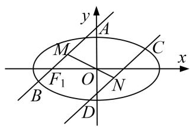
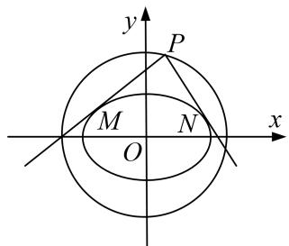
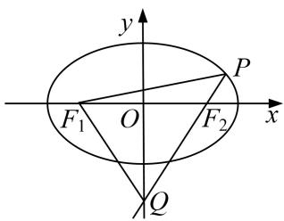
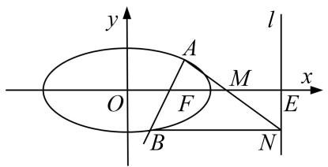
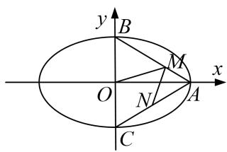
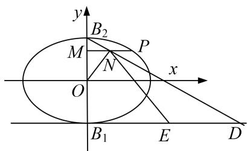
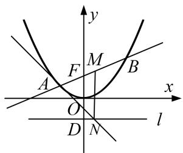
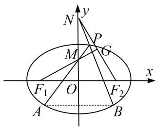
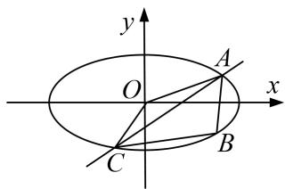

# 专题 31 证明位置关系型问题

圆锥曲线中的证明问题，主要有两类：一是证明直线与圆锥曲线中的一些数量关系(相等或不等)。二是证明点、直线、曲线等几何元素中的位置关系，如：如证明直线与曲线相切，直线间的平行、垂直，直线过定点等；解决证明问题时，主要根据直线与圆锥曲线的性质、直线与圆锥曲线的位置关系等，通过相关性质的应用、代数式的恒等变形以及必要的数值计算等进行证明。圆锥曲线中的证明问题是转化与化归思想的充分体现。无论证明什么结论，要对已知条件进行化简，同时对要证结论合理转化，寻求条件和结论间的联系，从而确定解题思路及转化方向。

# 【例题选讲】

[例1] 设椭圆 $E: \frac{x^2}{a^2} + \frac{y^2}{b^2} = 1 (a > b > 0)$ 的左、右焦点分别为 $F_1, F_2$ ，过点 $F_1$ 的直线交椭圆 $E$ 于 $A, B$ 两点．若椭圆 $E$ 的离心率为 $\frac{\sqrt{2}}{2}$ ， $\triangle ABF_2$ 的周长为 $4\sqrt{6}$ .  
（1）求椭圆 E 的方程;  
（2）设不经过椭圆的中心而平行于弦 AB 的直线交椭圆 E 于点 C, D, 设弦 AB, CD 的中点分别为 M, N, 证明: O, M, N 三点共线.

[例 2] 已知点 A(-4, 0)，直线 l: x = -1 与 x 轴交于点 B，动点 M 到 A，

B 两点的距离之比为 2.  
（1）求点 M 的轨迹 C 的方程;  
（2）设 C 与 x 轴交于 E, F 两点，P 是直线 l 上一点，且点 P 不在 C 上，直线 PE, PF 分别与 C 交于另一点 S, T，证明：A, S, T 三点共线.

[例3] 在平面直角坐标系 $xOy$ 中取两个定点 $A_{1}(-\sqrt{6}, 0)$ , $A_{2}(\sqrt{6}, 0)$ , 再取两个动点 $N_{1}(0, m)$ , $N_{2}(0, n)$ , 且 $mn = 2$ .  
（1）求直线 $A_{1}N_{1}$ 与 $A_{2}N_{2}$ 的交点 M 的轨迹 C 的方程;  
（2）过 $R(3,0)$ 的直线与轨迹 $C$ 交于 $P$ , $Q$ 两点, 过点 $P$ 作 $PN \perp x$ 轴且与轨迹 $C$ 交于另一点 $N$ , $F$ 为轨迹 $C$ 的右焦点, 若 $\overrightarrow{RP} = \lambda \overrightarrow{RQ} (\lambda > 1)$ , 求证: $\overrightarrow{NF} = \lambda \overrightarrow{FQ}$ .

[例 4] 已知椭圆 $\frac{x^{2}}{5}+\frac{y^{2}}{4}=1$ 的右焦点为 F，设直线 l: x=5 与 x 轴的交点为 E，过点 F 且斜率为 k 的直线 $l_{1}$ 与椭圆交于 A，B 两点，M 为线段 EF 的中点.  
（1）若直线 $l_{1}$ 的倾斜角为 $\frac{\pi}{4}$ ，求 $|AB|$ 的值；  
（2）设直线 AM 交直线 l 于点 N，证明：直线 $BN \perp l$ .

[例 5] 已知椭圆 $T: \frac{x^2}{a^2} + \frac{y^2}{b^2} = 1 (a > b > 0)$ 的一个顶点 $A(0, 1)$ ，离心率 $e = \frac{\sqrt{6}}{3}$ ，圆 $C: x^2 + y^2 = 4$ ，从圆 $C$ 上任意一点 $P$ 向椭圆 $T$ 引两条切线 $PM$ ， $PN$ .  
（1）求椭圆 T 的方程;  
（2）求证： $PM \perp PN$ .

[例 6] 已知点 F 为抛物线 E: $y^{2}=2px(p>0)$ 的焦点，点 A(2, m) 在抛物线 E上，且 $|AF|=3$ .  
（1）求抛物线 E 的方程;  
（2）已知点 $G(-1,0)$ ，延长 $AF$ 交抛物线 $E$ 于点 $B$ ，证明：以点 $F$ 为圆心且与直线 $GA$ 相切的圆，必与直线 $GB$ 相切.

[例 7] 设椭圆 $E: \frac{x^2}{a^2} + \frac{y^2}{b^2} = 1 (a > b > 0)$ 的右焦点为 $F$ ，右顶点为 $A, B, C$ 是椭圆上关于原点对称的两点 $(B, C$ 均不在 $x$ 轴上)，线段 $AC$ 的中点为 $D$ ，且 $B, F, D$ 三点共线.  
（1）求椭圆 E 的离心率;  
（2）设 $F(1,0)$ , 过 $F$ 的直线 $l$ 交 $E$ 于 $M$ , $N$ 两点, 直线 $MA$ , $NA$ 分别与直线 $x = 9$ 交于 $P$ , $Q$ 两点. 证明: 以 $PQ$ 为直径的圆过点 $F$ .

[例 8] (2017·全国Ⅱ)设 O 为坐标原点，动点 M 在椭圆 C: $\frac{x^{2}}{2} + y^{2} = 1$ 上，过 M 作 x 轴的垂线，垂足为 N，点 P 满足 $\overrightarrow{NP} = \sqrt{2}\overrightarrow{NM}$ .  
（1）求点 P 的轨迹方程;  
（2）设点 $Q$ 在直线 $x = -3$ 上，且 $\overrightarrow{OP} \cdot \overrightarrow{PQ} = 1$ 。证明：过点 $P$ 且垂直于 $OQ$ 的直线 $l$ 过 $C$ 的左焦点 $F$ .

[例 9] 设椭圆 $E: \frac{x^{2}}{a^{2}} + \frac{y^{2}}{1 - a^{2}} = 1$ 的焦点在 x 轴上.  
（1）若椭圆 E 的焦距为 1，求椭圆 E 的方程；  
（2）设 $F_{1}$ , $F_{2}$ 分别是椭圆 $E$ 的左、右焦点, $P$ 为椭圆 $E$ 上第一象限内的点, 直线 $F_{2}P$ 交 $y$ 轴于点 $Q$ , 并且 $F_{1}P \perp F_{1}Q$ . 证明: 当 $a$ 变化时, 点 $P$ 在某定直线上.

# 【对点训练】

1. 已知椭圆 $\frac{x^2}{5} + \frac{y^2}{4} = 1$ 的右焦点为 $F$ ，设直线 $l: x = 5$ 与 $x$ 轴的交点为 $E$ ，过点 $F$ 且斜率为 $k$ 的直线 $l_1$ 与椭圆交于 $A, B$ 两点， $M$ 为线段 $EF$ 的中点.  
（1）若直线 $l_{1}$ 的倾斜角为 $\frac{\pi}{4}$ ，求 $\triangle ABM$ 的面积 S 的值；  
（2）过点 B 作 $BN \perp l$ 于点 N，证明：A，M，N 三点共线.

2. 如图，椭圆 $C: \frac{x^2}{a^2} + \frac{y^2}{b^2} = 1 (a > b > 0)$ 的左右焦点分别为 $F_1, F_2$ ，左右顶点分别为 A, B, P 为椭圆 C 上任

一点(不与 A, B 重合). 已知 $\triangle PF_{1}F_{2}$ 的内切圆半径的最大值为 $2 - \sqrt{2}$ ，椭圆 C 的离心率为 $\frac{\sqrt{2}}{2}$ .  
（1）求椭圆 C 的方程;  
（2）直线 l 过点 B 且垂直于 x 轴，延长 AP 交 l 于点 N，以 BN 为直径的圆交 BP 于点 M，求证：O，M，N 三点共线.

3. 设椭圆 $E$ 的方程为 $\frac{x^2}{a^2} + \frac{y^2}{b^2} = 1 (a > b > 0)$ , 点 $O$ 为坐标原点, 点 $A$ 的坐标为 $(a, 0)$ , 点 $B$ 的坐标为 $(0, b)$ , 点 $M$ 在线段 $AB$ 上, 满足 $|BM| = 2|MA|$ , 直线 $OM$ 的斜率为 $\frac{\sqrt{5}}{10}$ .  
（1）求 E 的离心率 e;  
（2）设点 C 的坐标为 $(0, -b)$ ，N 为线段 AC 的中点，证明： $MN \perp AB$ .

4. 已知椭圆 $C: \frac{x^2}{a^2} + \frac{y^2}{b^2} = 1 (a > b > 0)$ 的焦距为 $2\sqrt{3}$ ，且 $C$ 过点 $\left[\sqrt{3}, \frac{1}{2}\right]$ .  
（1）求椭圆 C 的方程;  
（2）设 $B_{1}$ , $B_{2}$ 分别是椭圆 $C$ 的下顶点和上顶点, $P$ 是椭圆上异于 $B_{1}$ , $B_{2}$ 的任意一点, 过点 $P$ 作 $PM \perp y$ 轴于 $M$ , $N$ 为线段 $PM$ 的中点, 直线 $B_{2}N$ 与直线 $y = -1$ 交于点 $D$ , $E$ 为线段 $B_{1}D$ 的中点, $O$ 为坐标原点, 求证: $ON \perp EN$ .

5. 已知抛物线 $C: x^{2} = 2py(p > 0)$ , 过焦点 $F$ 的直线交 $C$ 于 $A, B$ 两点, $D$

是抛物线的准线 l 与 y 轴的交点.  
（1）若 $AB \parallel l$ ，且 $\triangle ABD$ 的面积为 1，求抛物线的方程；  
（2）设 $M$ 为 $AB$ 的中点，过 $M$ 作 $l$ 的垂线，垂足为 $N$ 。证明：直线 $AN$ 与抛物线相切。

6. 如图，已知圆 $G: (x - 2)^{2} + y^{2} = \frac{4}{9}$ 是椭圆 $C: \frac{x^{2}}{a^{2}} + \frac{y^{2}}{b^{2}} = 1 (a > b > 0)$ 的内接 $\triangle ABC$

的内切圆，其中 $A(-4,$

0)为椭圆的左顶点.  
（1）求椭圆 C 的方程;  
（2）过椭圆的上顶点 $M$ 作圆 $G$ 的两条切线交椭圆于 $E, F$ 两点，证明：直线 $EF$ 与圆 $G$ 相切.

7. (2017·北京)已知抛物线 $C: y^{2} = 2px$ 过点 $P(1, 1)$ . 过点 $\left[0, \frac{1}{2}\right]$ 作直线 $l$ 与抛物线 $C$ 交于不同的两点 $M$ , $N$ , 过点 $M$ 作 $x$ 轴的垂线分别与直线 $OP$ , $ON$ 交于点 $A$ , $B$ , 其中 $O$ 为原点.  
（1）求抛物线 C 的方程，并求其焦点坐标和准线方程；  
（2）求证：A 为线段 BM 的中点.

8. 已知椭圆 $E: \frac{x^2}{a^2} + \frac{y^2}{b^2} = 1 (a > b > 0)$ 经过点 $(2\sqrt{2}, 2)$ ，且离心率为 $\frac{\sqrt{2}}{2}$ ， $F_1$ ， $F_2$ 是椭圆 $E$ 的左、右焦点。  
（1）求椭圆 E 的方程;  
（2）若 $A, B$ 是椭圆 $E$ 上关于 $y$ 轴对称的两点 $(A, B$ 不是长轴的端点), 点 $P$ 是椭圆 $E$ 上异于 $A, B$ 的一点, 且直线 $PA, PB$ 分别交 $y$ 轴于点 $M, N$ , 求证: 直线 $MF_{1}$ 与直线 $NF_{2}$ 的交点 $G$ 在定圆上.

9. 直线 $y=kx+m(m\neq0)$ 与椭圆 W: $\frac{x^{2}}{4}+y^{2}=1$ 相交于 A, C 两点，O 是坐标原点.  
（1）当点 B 的坐标为 $(0, 1)$ ，且四边形 OABC 为菱形时，求 AC 的长；  
（2）当点 B 在 W 上且不是 W 的顶点时，证明：四边形 OABC 不可能为菱形.

