# 专题 31 证明位置关系型问题

圆锥曲线中的证明问题，主要有两类：一是证明直线与圆锥曲线中的一些数量关系(相等或不等)。二是证明点、直线、曲线等几何元素中的位置关系，如：如证明直线与曲线相切，直线间的平行、垂直，直线过定点等；解决证明问题时，主要根据直线与圆锥曲线的性质、直线与圆锥曲线的位置关系等，通过相关性质的应用、代数式的恒等变形以及必要的数值计算等进行证明。圆锥曲线中的证明问题是转化与化归思想的充分体现。无论证明什么结论，要对已知条件进行化简，同时对要证结论合理转化，寻求条件和结论间的联系，从而确定解题思路及转化方向。

# 【例题选讲】

[例1] 设椭圆 $E: \frac{x^2}{a^2} + \frac{y^2}{b^2} = 1 (a > b > 0)$ 的左、右焦点分别为 $F_1, F_2$ ，过点 $F_1$ 的直线交椭圆 $E$ 于 $A, B$ 两点．若椭圆 $E$ 的离心率为 $\frac{\sqrt{2}}{2}$ ， $\triangle ABF_2$ 的周长为 $4\sqrt{6}$ .

(1)求椭圆 E 的方程;

(2)设不经过椭圆的中心而平行于弦 AB 的直线交椭圆 E 于点 C, D, 设弦 AB, CD 的中点分别为 M, N, 证明: O, M, N 三点共线.

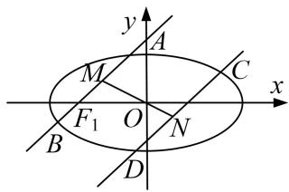

text_image

y
A
M
C
x
F₁ O N
B
D

[规范解答] (1)由题意知， $4a=4\sqrt{6}$ ， $a=\sqrt{6}$ 。又 $e=\frac{\sqrt{2}}{2}$ ，∴ $c=\sqrt{3}$ ， $b=\sqrt{3}$ ，

∴椭圆 E 的方程为 $\frac{x^{2}}{6}+\frac{y^{2}}{3}=1$ .

(2)当直线 AB, CD 的斜率不存在时，由椭圆的对称性知，

中点 M, N 在 x 轴上，O, M, N 三点共线，

当直线 AB, CD 的斜率存在时，设其斜率为 k，且设 $A(x_{1}, y_{1})$ ， $B(x_{2}, y_{2})$ ， $M(x_{0}, y_{0})$ ，

则 $\left\{ \begin{array}{l} \frac{x_1^2}{6} + \frac{y_1^2}{3} = 1, \\ \frac{x_2^2}{6} + \frac{y_2^2}{3} = 1, \end{array} \right.$ 两式相减，得 $\frac{x_1^2}{6} + \frac{y_1^2}{3} - \left(\frac{x_2^2}{6} + \frac{y_2^2}{3}\right) = 0, \therefore \frac{x_1^2 - x_2^2}{6} = -\frac{y_1^2 - y_2^2}{3},$

$$
\frac {(x _ {1} - x _ {2}) (x _ {1} + x _ {2})}{6} = - \frac {(y _ {1} - y _ {2}) (y _ {1} + y _ {2})}{3}, \therefore \frac {y _ {1} - y _ {2}}{x _ {1} - x _ {2}} \frac {y _ {1} + y _ {2}}{x _ {1} + x _ {2}} = - \frac {3}{6}, \frac {y _ {1} - y _ {2}}{x _ {1} - x _ {2}} \frac {y _ {0}}{x _ {0}} = - \frac {3}{6},
$$

即 $k \cdot k_{OM} = -\frac{1}{2}, \therefore k_{OM} = -\frac{1}{2k}$ . 同理可得 $k_{ON} = -\frac{1}{2k}, \therefore k_{OM} = k_{ON}, \therefore O, M, N$ 三点共线.

[例 2] 已知点 A(-4, 0)，直线 l: x = -1 与 x 轴交于点 B，动点 M 到 A，B 两点的距离之比为 2.

(1)求点 M 的轨迹 C 的方程;  
(2)设 $C$ 与 $x$ 轴交于 $E, F$ 两点， $P$ 是直线 $l$ 上一点，且点 $P$ 不在 $C$ 上，直线 $PE, PF$ 分别与 $C$ 交于另一点 $S, T$ ，证明： $A, S, T$ 三点共线.

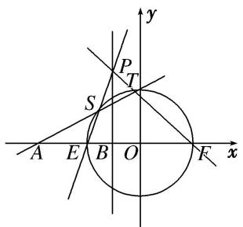

text_image

y
P
T
S
A E B O F x

[规范解答] (1)设点 $M(x, y)$ ，依题意， $\frac{|MA|}{|MB|} = \frac{\sqrt{(x+4)^{2} + y^{2}}}{\sqrt{(x+1)^{2} + y^{2}}} = 2$ ，

化简得 $x^{2}+y^{2}=4$ ，即轨迹 C 的方程为 $x^{2}+y^{2}=4$ .

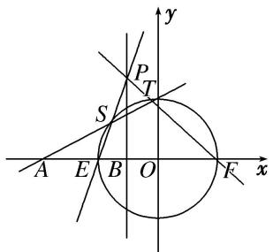

text_image

y
P
T
S
A E B O F x

(2)证明：由(1)知曲线 C 的方程为 $x^{2}+y^{2}=4$ ，令 y=0 得 $x=\pm2$ ，不妨设 $E(-2,0)$ ， $F(2,0)$ ，如图所示。设 $P(-1,y_{0})$ ， $S(x_{1},y_{1})$ ， $T(x_{2},y_{2})$ ，则直线 PE 的方程为 $y=y_{0}(x+2)$ ，

由 $\left\{\begin{aligned}y&=y_{0}(x+2),\\ x^{2}&+y^{2}=4\end{aligned}\right.$ 得 $(y_{0}^{2}+1)x^{2}+4y_{0}^{2}x+4y_{0}^{2}-4=0$ ，所以 $-2x_{1}=\frac{4y_{0}^{2}-4}{y_{0}^{2}+1}$ ，即 $x_{1}=\frac{2-2y_{0}^{2}}{y_{0}^{2}+1}$ ， $y_{1}=\frac{4y_{0}}{y_{0}^{2}+1}$ .

直线 PF 的方程为 $y=-\frac{y_{0}}{3}(x-2)$ ，由 $\left\{\begin{aligned}y&=-\frac{y_{0}}{3}\quad x-2\\ x^{2}&+y^{2}=4\end{aligned}\right.$ ，得 $(y_{0}^{2}+9)x^{2}-4y_{0}^{2}x+4y_{0}^{2}-36=0$ ，

所以 $2x_{2}=\frac{4y_{0}^{2}-36}{y_{0}^{2}+9}$ ，即 $x_{2}=\frac{2y_{0}^{2}-18}{y_{0}^{2}+9}$ ， $y_{2}=\frac{12y_{0}}{y_{0}^{2}+9}$ ，所以 $k_{AS}=\frac{y_{1}}{x_{1}+4}=\frac{\frac{4y_{0}}{y_{0}^{2}+1}}{\frac{2-2y_{0}^{2}}{y_{0}^{2}+1}+4}=\frac{2y_{0}}{y_{0}^{2}+3}$

$k_{AT}=\frac{y_{2}}{x_{2}+4}=\frac{\frac{12y_{0}}{y_{0}^{2}+9}}{\frac{2y_{0}^{2}-18}{y_{0}^{2}+9}+4}=\frac{2y_{0}}{y_{0}^{2}+3}$ ，所以 $k_{AS}=k_{AT}$ ，所以A，S，T三点共线.

[例3] 在平面直角坐标系 $xOy$ 中取两个定点 $A_{1}(-\sqrt{6}, 0)$ , $A_{2}(\sqrt{6}, 0)$ , 再取两个动点 $N_{1}(0, m)$ , $N_{2}(0, n)$ , 且 $mn = 2$ .

(1)求直线 $A_{1}N_{1}$ 与 $A_{2}N_{2}$ 的交点 M 的轨迹 C 的方程;

(2)过 $R(3,0)$ 的直线与轨迹 $C$ 交于 $P$ , $Q$ 两点, 过点 $P$ 作 $PN \perp x$ 轴且与轨迹 $C$ 交于另一点 $N$ , $F$ 为轨迹 $C$ 的右焦点, 若 $\overrightarrow{RP} = \lambda \overrightarrow{RQ} (\lambda > 1)$ , 求证: $\overrightarrow{NF} = \lambda \overrightarrow{FQ}$ .

[规范解答] (1)依题意知，直线 $A_{1}N_{1}$ 的方程为 $y = \frac{m}{\sqrt{6}} (x + \sqrt{6})$ ，①，

直线 $A_{2}N_{2}$ 的方程为 $y=-\frac{n}{\sqrt{6}}(x-\sqrt{6})$ ，②

设 $M(x, y)$ 是直线 $A_{1}N_{1}$ 与 $A_{2}N_{2}$ 的交点，①×②得 $y^{2}=-\frac{mn}{6}(x^{2}-6)$ ,

又 mn=2，整理得 $\frac{x^{2}}{6}+\frac{y^{2}}{2}=1$ 。故点 M 的轨迹 C 的方程为 $\frac{x^{2}}{6}+\frac{y^{2}}{2}=1$ 。

(2)证明：设过点 $R$ 的直线 $l: x = ty + 3, P(x_1, y_1), Q(x_2, y_2)$ ，则 $N(x_1, -y_1)$ ，

由 $\left\{ \begin{array}{l} x = ty + 3, \\ \frac{x^2}{6} + \frac{y^2}{2} = 1, \end{array} \right.$ 消去 $x$ ，得 $(t^2 + 3)y^2 + 6ty + 3 = 0$ ， $(*)$ ，所以 $y_1 + y_2 = -\frac{6t}{t^2 + 3}$ ， $y_1y_2 = \frac{3}{t^2 + 3}$ .

由 $\overrightarrow{RP}=\lambda\overrightarrow{Q}$ ，得 $(x_{1}-3,\ y_{1})=\lambda(x_{2}-3,\ y_{2})$ ，故 $x_{1}-3=\lambda(x_{2}-3),\ y_{1}=\lambda y_{2}$

由(1)得 $F(2, 0)$ ，要证 $\overrightarrow{NF} = \lambda \overrightarrow{FQ}$ ，即证 $(2 - x_{1}, y_{1}) = \lambda (x_{2} - 2, y_{2})$ ,

只需证 $2-x_{1}=\lambda(x_{2}-2)$ ，只需 $\frac{x_{1}-3}{x_{2}-3}=-\frac{x_{1}-2}{x_{2}-2}$ ，即证 $2x_{1}x_{2}-5(x_{1}+x_{2})+12=0$ ，

又 $x_{1}x_{2}=(ty_{1}+3)(ty_{2}+3)=t^{2}y_{1}y_{2}+3t(y_{1}+y_{2})+9,\quad x_{1}+x_{2}=ty_{1}+3+ty_{2}+3=t(y_{1}+y_{2})+6,$

所以 $2t^{2}y_{1}y_{2}+6t(y_{1}+y_{2})+18-5t(y_{1}+y_{2})-30+12=0$ ，即 $2t^{2}y_{1}y_{2}+t(y_{1}+y_{2})=0$ ，

而 $2t^{2}y_{1}y_{2}+t(y_{1}+y_{2})=2t^{2}\cdot\frac{3}{t^{2}+3}-t\cdot\frac{6t}{t^{2}+3}=0$ 成立，即 $\overrightarrow{NF}=\lambda\overrightarrow{FQ}$ 成立.

[例4] 已知椭圆 $\frac{x^2}{5} + \frac{y^2}{4} = 1$ 的右焦点为 $F$ ，设直线 $l: x = 5$ 与 $x$ 轴的交点为 $E$ ，过点 $F$ 且斜率为 $k$ 的直线 $l_1$ 与椭圆交于 $A, B$ 两点， $M$ 为线段 $EF$ 的中点.

(1)若直线 $l_{1}$ 的倾斜角为 $\frac{\pi}{4}$ , 求 $|AB|$ 的值;

(2)设直线 AM 交直线 l 于点 N，证明：直线 $BN \perp l$ .

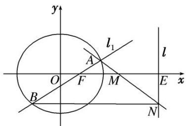

text_image

y
l₁
A
O
F
M
E
x
B
N

[规范解答] 由题意知， $F(1,0)$ ， $E(5,0)$ ， $M(3,0)$ .

(1)∵直线 $l_{1}$ 的倾斜角为 $\frac{\pi}{4}$ ，∴ k=1．∴直线 $l_{1}$ 的方程为 y=x-1.

代入椭圆方程，可得 $9x^{2}-10x-15=0$ .

设 $A(x_{1}, y_{1})$ ， $B(x_{2}, y_{2})$ ，则 $x_{1} + x_{2} = \frac{10}{9}$ ， $x_{1}x_{2} = -\frac{5}{3}$ .

$$
\therefore | A B | = \sqrt {2 (x _ {1} - x _ {2}) ^ {2}} = \sqrt {2} \cdot \sqrt {(x _ {1} + x _ {2}) ^ {2} - 4 x _ {1} x _ {2}} = \sqrt {2} \times \sqrt {\left(\frac {1 0}{9}\right) ^ {2} + 4 \times \frac {5}{3}} = \frac {1 6 \sqrt {5}}{9}.
$$

(2)设直线 $l_{1}$ 的方程为 $y=k(x-1)$ . 代入椭圆方程，得 $(4+5k^{2})x^{2}-10k^{2}x+5k^{2}-20=0$ .

设 $A(x_{1}, y_{1})$ ， $B(x_{2}, y_{2})$ ，则 $x_{1} + x_{2} = \frac{10k^{2}}{4 + 5k^{2}}$ ， $x_{1}x_{2} = \frac{5k^{2} - 20}{4 + 5k^{2}}$ .

设 $N(5, y_{0})$ ，∵ A，M，N 三点共线，∴ $k_{AM} = k_{MN}$ ，即 $\frac{-y_{1}}{3 - x_{1}} = \frac{y_{0}}{2}$ ，∴ $y_{0} = \frac{2y_{1}}{x_{1} - 3}$ .

而 $y_0 - y_2 = \frac{2y_1}{x_1 - 3} - y_2 = \frac{2k(x_1 - 1)}{x_1 - 3} - k(x_2 - 1) = \frac{3k(x_1 + x_2) - kx_1x_2 - 5k}{x_1 - 3} = \frac{3k\cdot\frac{10k^2}{4 + 5k^2} - k\cdot\frac{5k^2 - 20}{4 + 5k^2} - 5k}{x_1 - 3} = 0.$

∴直线 $BN \parallel x$ 轴，即 $BN \perp l$ .

[例 5] 已知椭圆 $T: \frac{x^{2}}{a^{2}} + \frac{y^{2}}{b^{2}} = 1 (a > b > 0)$ 的一个顶点 $A(0, 1)$ ，离心率 $e = \frac{\sqrt{6}}{3}$ ，圆 C: $x^{2} + y^{2} = 4$ ，从圆 C 上任意一点 P 向椭圆 T 引两条切线 PM，PN.

(1)求椭圆 T 的方程;  
(2)求证： $PM \perp PN$ .

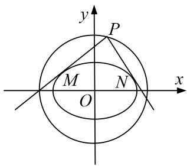

text_image

y
P
M
O
N
x

[规范解答] (1)由题意可知 $b = 1$ ， $\frac{c}{a} = \frac{\sqrt{6}}{3}$ ，即 $2a^{2} = 3c^{2}$ ，又 $a^2 = b^2 + c^2$ ，联立解得 $a^2 = 3$ ， $b^2 = 1$ ：椭圆方程为 $\frac{x^2}{3} + y^2 = 1$

(2)方法一 ①当 $P$ 点横坐标为 $\pm \sqrt{3}$ 时，纵坐标为 $\pm 1$ ， $PM$ 斜率不存在， $PN$ 斜率为0， $PM\bot PN$   
②当 P 点横坐标不为 $\pm\sqrt{3}$ 时，设 $P(x_{0}, y_{0})$ ，则 $x_{0}^{2} + y_{0}^{2} = 4$ ，设 $k_{PM} = k$ ，PM 的方程为 $y - y_{0} = k(x - x_{0})$ ，

联立方程组 $\left\{\begin{aligned}y-y_{0}&=k(x-x_{0}),\\ \frac{x^{2}}{3}&+y^{2}=1,\end{aligned}\right.$

消去 y 得 $(1+3k^{2})x^{2}+6k(y_{0}-kx_{0})x+3k^{2}x_{0}^{2}-6kx_{0}y_{0}+3y_{0}^{2}-3=0$ ,

依题意 $\Delta=36k^{2}(y_{0}-kx_{0})^{2}-4(1+3k^{2})(3k^{2}x_{0}^{2}-6kx_{0}y_{0}+3y_{0}^{2}-3)=0$ ，化简得 $(3-x_{0}^{2})k^{2}+2x_{0}y_{0}k+1-y_{0}^{2}=0$ ，
又 $k_{PM}$ ， $k_{PN}$ 为方程的两根，所以 $k_{PM} \cdot k_{PN} = \frac{1 - y_{0}^{2}}{3 - x_{0}^{2}} = \frac{1 - (4 - x_{0}^{2})}{3 - x_{0}^{2}} = \frac{x_{0}^{2} - 3}{3 - x_{0}^{2}} = -1.$

所以 $PM \perp PN$ ，综上知 $PM \perp PN$ .

方法二 ①当 P 点横坐标为 $\pm\sqrt{3}$ 时，纵坐标为 $\pm1$ ，PM 斜率不存在，PN 斜率为 0， $PM \perp PN$ .

②当 P 点横坐标不为 $\pm\sqrt{3}$ 时，设 $P(2\cos\theta, 2\sin\theta)$ ，切线方程为 $y-2\sin\theta=k(x-2\cos\theta)$ ,

$$
\left\{ \begin{array}{l} y - 2 \sin \theta = k (x - 2 \cos \theta), \\ \frac {x ^ {2}}{3} + y ^ {2} = 1, \end{array} \right.
$$

联立得 $(1+3k^{2})x^{2}+12k(\sin\theta-k\cos\theta)x+12(\sin\theta-k\cos\theta)^{2}-3=0,$

令 $\Delta=0$ ，即 $\Delta=144k^{2}(\sin\theta-k\cos\theta)^{2}-4(1+3k^{2})[12(\sin\theta-k\cos\theta)^{2}-3]=0$

化简得 $(3 - 4\cos^2\theta)k^2 +4\sin 2\theta \cdot k + 1 - 4\sin^2\theta = 0$ ， $k_{PM}\cdot k_{PN} = \frac{1 - 4\sin^2\theta}{3 - 4\cos^2\theta} = \frac{(4 - 4\sin^2\theta) - 3}{3 - 4\cos^2\theta} = -1.$

所以 $PM \perp PN$ ，综上知 $PM \perp PN$ .

[例 6] 已知点 F 为抛物线 E: $y^{2}=2px(p>0)$ 的焦点，点 A(2, m) 在抛物线 E 上，且 $|AF|=3$ .

(1)求抛物线 E 的方程;

(2)已知点 $G(-1, 0)$ , 延长 $AF$ 交抛物线 $E$ 于点 $B$ , 证明: 以点 $F$ 为圆心且与直线 $GA$ 相切的圆, 必与直线 $GB$ 相切.

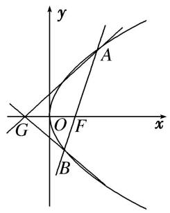

text_image

y
A
G O F x
B

[规范解答] (1)由抛物线的定义得 $|AF|=2+\frac{p}{2}$ .

因为 $|AF|=3$ ，即 $2+\frac{p}{2}=3$ ，解得p=2，所以抛物线E的方程为 $y^{2}=4x$ .

(2)证明：设以点 F 为圆心且与直线 GA 相切的圆的半径为 r.

因为点 $A(2, m)$ 在抛物线 E: $y^{2}=4x$ 上，所以 $m=\pm2\sqrt{2}$ .

由抛物线的对称性，不妨设 $A(2, 2\sqrt{2})$ 。由 $A(2, 2\sqrt{2})$ ， $F(1, 0)$ 可得直线 $AF$ 的方程为

$y=2\sqrt{2}(x-1)$ . 由 $\left\{\begin{aligned}y&=2\sqrt{2}(x-1),\\ y^{2}&=4x,\end{aligned}\right.$ 得 $2x^{2}-5x+2=0$ ，解得 x=2 或 $x=\frac{1}{2}$ ，从而 $B\left(\frac{1}{2},-\sqrt{2}\right)$ .

又 $G(-1,0)$ ，故直线 GA 的方程为 $2\sqrt{2}x - 3y + 2\sqrt{2} = 0$ ，

从而 $r = \frac{|2\sqrt{2} + 2\sqrt{2}|}{\sqrt{8 + 9}} = \frac{4\sqrt{2}}{\sqrt{17}}$ ，又直线 $GB$ 的方程为 $2\sqrt{2} x + 3y + 2\sqrt{2} = 0$

所以点 F 到直线 GB 的距离 $d=\frac{|2\sqrt{2}+2\sqrt{2}|}{\sqrt{8+9}}=\frac{4\sqrt{2}}{\sqrt{17}}=r$ ,

这表明以点 F 为圆心且与直线 GA 相切的圆必与直线 GB 相切.

[例 7] 设椭圆 $E: \frac{x^2}{a^2} + \frac{y^2}{b^2} = 1 (a > b > 0)$ 的右焦点为 $F$ ，右顶点为 $A, B, C$ 是椭圆上关于原点对称的两点 $(B, C$ 均不在 $x$ 轴上)，线段 $AC$ 的中点为 $D$ ，且 $B, F, D$ 三点共线.

(1)求椭圆 E 的离心率;

(2)设 $F(1,0)$ ，过 $F$ 的直线 $l$ 交 $E$ 于 $M$ ， $N$ 两点，直线 $MA$ ， $NA$ 分别与直线 $x = 9$ 交于 $P$ ， $Q$ 两点．证明：以 $PQ$ 为直径的圆过点 $F$ .

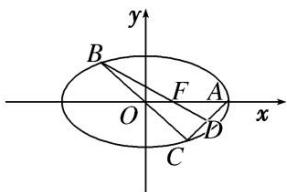

text_image

y
B
F
A
O
x
C
D

[规范解答] (1) 法一：由已知 $A(a,0)$ ， $F(c,0)$ ，设 $B(x_{0},y_{0})$ ， $C(-x_{0},-y_{0})$ ，则 $D\left(\frac{a-x_{0}}{2},-\frac{y_{0}}{2}\right)$ ，

∵B, F, D三点共线，∴ $\overrightarrow{BF}//\overrightarrow{BD}$ ，又 $\overrightarrow{BF}=(c-x_{0},-y_{0})$ ， $\overrightarrow{BD}=\left(\frac{a-3x_{0}}{2},-\frac{3y_{0}}{2}\right)$

$\therefore -\frac{3}{2}y_{0}(c-x_{0})=-y_{0}\cdot\frac{a-3x_{0}}{2},\quad\therefore a=3c,$ 从而 $e=\frac{1}{3}.$

法二：连接 OD，AB(图略)，由题意知，OD 是 $\triangle CAB$ 的中位线，∴ OD 纵 $\frac{1}{2} AB$ ，

$\therefore \triangle OFD \sim \triangle AFB.\quad \therefore \frac{OF}{AF} = \frac{OD}{AB} = \frac{1}{2},\quad \text{即}\frac{c}{a - c} = \frac{1}{2},\quad \text{解得} a = 3c,\quad \text{从而} e = \frac{1}{3}.$

(2)∵F的坐标为(1,0)，∴c=1，从而a=3，∴ $b^{2}=8$ ．∴椭圆E的方程为 $\frac{x^{2}}{9}+\frac{y^{2}}{8}=1$ .

设直线 l 的方程为 $x = ny + 1$ ，由 $\left\{\begin{aligned}x &= ny + 1,\\ \frac{x^{2}}{9} + \frac{y^{2}}{8} &= 1\end{aligned}\right.$ 消去 x 得， $(8n^{2} + 9)y^{2} + 16ny - 64 = 0$ ，

$\therefore y_{1} + y_{2} = \frac{-16n}{8n^{2} + 9}, y_{1}y_{2} = \frac{-64}{8n^{2} + 9}$ 其中 $M(ny_1 + 1, y_1), N(ny_2 + 1, y_2)$ .

∴直线 AM 的方程为 $\frac{y}{y_{1}}=\frac{x-3}{ny_{1}-2}$ ，∴ $P\left(9,\frac{6y_{1}}{ny_{1}-2}\right)$ ，同理 $Q\left(9,\frac{6y_{2}}{ny_{2}-2}\right)$ ,

从而 $\overrightarrow{FP}\cdot\overrightarrow{FQ}=\left(8,\frac{6y_{1}}{ny_{1}-2}\right)\cdot\left(8,\frac{6y_{2}}{ny_{2}-2}\right)=64+\frac{36y_{1}y_{2}}{n^{2}y_{1}y_{2}-2n(y_{1}+y_{2})+4}$

$= 64 + \frac{\frac{36\times(-64)}{8n^2 + 9}}{\frac{-64n^2}{8n^2 + 9} + \frac{32n^2}{8n^2 + 9} + 4} = 64 + \frac{36\times(-64)}{36} = 0.\therefore FP\bot FQ,$ 即以 $PQ$ 为直径的圆恒过点 $F$

[例 8] (2017·全国Ⅱ)设 O 为坐标原点，动点 M 在椭圆 C: $\frac{x^{2}}{2} + y^{2} = 1$ 上，过 M 作 x 轴的垂线，垂足为 N，点 P 满足 $\overrightarrow{NP} = \sqrt{2}\overrightarrow{NM}$ .

(1)求点 P 的轨迹方程;  
(2)设点 $Q$ 在直线 $x = -3$ 上，且 $\overrightarrow{OP} \cdot \overrightarrow{PQ} = 1$ 。证明：过点 $P$ 且垂直于 $OQ$ 的直线 $l$ 过 $C$ 的左焦点 $F$ .

[规范解答] (1) 设 $P(x, y)$ ， $M(x_{0}, y_{0})$ ，则 $N(x_{0}, 0)$ ， $\overrightarrow{NP} = (x - x_{0}, y)$ ， $\overrightarrow{NM} = (0, y_{0})$ .

由 $\overrightarrow{NP} = \sqrt{2}$ $\overrightarrow{NM}$ ，得 $x_0 = x$ ， $y_0 = \frac{\sqrt{2}}{2} y$ ，因为 $M(x_0, y_0)$ 在 $C$ 上，所以 $\frac{x^2}{2} + \frac{y^2}{2} = 1$ .

因此点 P 的轨迹方程为 $x^{2}+y^{2}=2$ .

(2)由题意知 $F(-1,0)$ . 设 $Q(-3, t)$ , $P(m, n)$ , 则 $\overrightarrow{OQ} = (-3, t)$ ,

$$
\overrightarrow {P F} = (- 1 - m, - n), \overrightarrow {O Q} \cdot \overrightarrow {P F} = 3 + 3 m - t n, \overrightarrow {O P} = (m, n), \overrightarrow {P Q} = (- 3 - m, t - n).
$$

由 $\overrightarrow{OP}\cdot\overrightarrow{PQ}=1$ ，得 $-3m-m^{2}+tn-n^{2}=1$ ，又由(1)知 $m^{2}+n^{2}=2$ ，故 $3+3m-tn=0$ 。

所以 $\overrightarrow{OQ}\cdot\overrightarrow{PF}=0$ ，即 $\overrightarrow{OQ}\perp\overrightarrow{PF}$ ，又过点P存在唯一直线垂直于OQ，

所以过点 P 且垂直于 OQ 的直线 l 过 C 的左焦点 F.

[例 9] 设椭圆 E: $\frac{x^{2}}{a^{2}} + \frac{y^{2}}{1 - a^{2}} = 1$ 的焦点在 x 轴上.

(1)若椭圆 E 的焦距为 1，求椭圆 E 的方程；  
(2)设 $F_{1}$ , $F_{2}$ 分别是椭圆 $E$ 的左、右焦点, $P$ 为椭圆 $E$ 上第一象限内的点, 直线 $F_{2}P$ 交 $y$ 轴于点 $Q$ , 并且 $F_{1}P \perp F_{1}Q$ . 证明: 当 $a$ 变化时, 点 $P$ 在某定直线上.

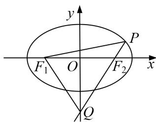

text_image

y
P
F₁ O F₂ x
Q

[规范解答] (1)因为焦距为 1，且焦点在 x 轴上，所以 $2a^{2}-1=\frac{1}{4}$ ，解得 $a^{2}=\frac{5}{8}$ .

故椭圆 E 的方程为 $\frac{8x^{2}}{5} + \frac{8y^{2}}{3} = 1$ .

(2)设 $P(x_0, y_0)$ , $F_1(-c, 0)$ , $F_2(c, 0)$ , 其中 $c = \sqrt{2a^2 - 1}$ .

由题设知 $x_{0} \neq c$ ，则直线 $F_{1}P$ 的斜率 $k_{F1P} = \frac{y_{0}}{x_{0} + c}$ ，直线 $F_{2}P$ 的斜率 $k_{F2P} = \frac{y_{0}}{x_{0} - c}$ .

故直线 $F_{2}P$ 的方程为 $y=\frac{y_{0}}{x_{0}-c}(x-c)$ . 当 x=0 时， $y=\frac{cy_{0}}{c-x_{0}}$ ，即点 Q 坐标为 $\left(0, \frac{cy_{0}}{c-x_{0}}\right)$ .

因此，直线 $F_{1}Q$ 的斜率为 $k_{F1Q}=\frac{y_{0}}{c-x_{0}}$ 。由于 $F_{1}P\perp F_{1}Q$ ，所以 $k_{F1P}\cdot k_{F1Q}=\frac{y_{0}}{x_{0}+c}\cdot\frac{y_{0}}{c-x_{0}}=-1$

化简得 $y_{0}^{2}=x_{0}^{2}-(2a^{2}-1)$ . ①

将①代入椭圆 E 的方程，由于点 $P(x_{0}, y_{0})$ 在第一象限，解得 $x_{0}=a^{2}$ ， $y_{0}=1-a^{2}$ ，

即点 P 在定直线 $x + y = 1$ 上.

# 【对点训练】

1. 已知椭圆 $\frac{x^2}{5} + \frac{y^2}{4} = 1$ 的右焦点为 $F$ , 设直线 $l: x = 5$ 与 $x$ 轴的交点为 $E$ , 过点 $F$ 且斜率为 $k$ 的直线 $l_1$ 与椭圆交于 $A, B$ 两点, $M$ 为线段 $EF$ 的中点.

(1)若直线 $l_{1}$ 的倾斜角为 $\frac{\pi}{4}$ ，求 $\triangle ABM$ 的面积 S 的值；

(2)过点 B 作 $BN \perp l$ 于点 N，证明：A，M，N 三点共线.

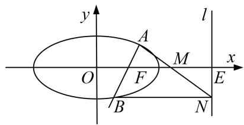

text_image

y
l
A
M
x
O
F
B
N
E

1. 解析 由题意知， $F(1,0)$ ， $E(5,0)$ ， $M(3,0)$ ，设 $A(x_{1},y_{1})$ ， $B(x_{2},y_{2})$ .

(1)因为直线 $l_{1}$ 的倾斜角为 $\frac{\pi}{4}$ ，所以 $k = 1$ ，则直线 $l_{1}$ 的方程为 $y = x - 1$ .

由 $\left\{\frac{x^2}{5} +\frac{y^2}{4} = 1,\right.$ 消去 $x$ 并整理，得 $9y^{2} + 8y - 16 = 0$ ， $\varDelta >0$ ，则 $y_{1} + y_{2} = -\frac{8}{9},y_{1}y_{2} = -\frac{16}{9}.$

所以 $S_{\triangle ABM} = \frac{1}{2}\times |FM|\times |y_1 - y_2| = \sqrt{(y_1 + y_2)^2 - 4y_1y_2} = \sqrt{(-\frac{8}{9})^2 - 4\times(-\frac{16}{9})} = \frac{8\sqrt{10}}{9}.$

(2)由题意可得直线 $l_{1}$ 的方程为 $y=k(x-1)$ ,

由 $\left\{\begin{aligned}y&=k(x-1),\\ \frac{x^{2}}{5}&+\frac{y^{2}}{4}=1,\end{aligned}\right.$ 消去 y 并整理，得 $(4+5k^{2})x^{2}-10k^{2}x+5k^{2}-20=0,\quad\Delta>0,$

则 $x_{1}+x_{2}=\frac{10k^{2}}{4+5k^{2}}$ ， $x_{1}x_{2}=\frac{5k^{2}-20}{4+5k^{2}}$ .

因为 $BN \perp l$ 于点 N，所以 $N(5, y_{2})$ ，则 $k_{AM} = \frac{-y_{1}}{3 - x_{1}}$ ， $k_{MN} = \frac{y_{2}}{2}$ .

而 $y_{2}(3-x_{1})-2(-y_{1})=k(x_{2}-1)(3-x_{1})+2k(x_{1}-1)=-k[x_{1}x_{2}-3(x_{1}+x_{2})+5]$

$$
= - k \left(\frac {5 k ^ {2} - 2 0}{4 + 5 k ^ {2}} - 3 \times \frac {1 0 k ^ {2}}{4 + 5 k ^ {2}} + 5\right) = 0,
$$

所以 $k_{AM}=k_{MN}$ ，故 A, M, N 三点共线。

2. 如图，椭圆 $C: \frac{x^2}{a^2} + \frac{y^2}{b^2} = 1 (a > b > 0)$ 的左右焦点分别为 $F_1, F_2$ ，左右顶点分别为 $A, B, P$ 为椭圆 $C$ 上任一点(不与 $A, B$ 重合). 已知 $\triangle PF_1F_2$ 的内切圆半径的最大值为 $2 - \sqrt{2}$ ，椭圆 $C$ 的离心率为 $\frac{\sqrt{2}}{2}$ .

(1)求椭圆 C 的方程;  
(2)直线 l 过点 B 且垂直于 x 轴，延长 AP 交 l 于点 N，以 BN 为直径的圆交 BP 于点 M，求证：O，M，N 三点共线.

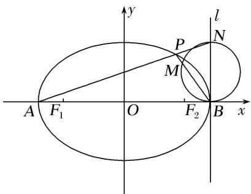

text_image

y
l
P
N
M
A F₁ O F₂ B x

2. 解析 (1)由题意知， $\frac{c}{a}=\frac{\sqrt{2}}{2}$ ，∴ $c=\frac{\sqrt{2}}{2}a$ ，又 $b^{2}=a^{2}-c^{2}$ ，∴ $b=\frac{\sqrt{2}}{2}a$ .

设 $\triangle PF_{1}F_{2}$ 的内切圆半径为 r，则 $S_{\triangle PF_{1}F_{2}}=\frac{1}{2}(|PF_{1}|+|PF_{2}|+|F_{1}F_{2}|)\cdot r=\frac{1}{2}(2a+2c)\cdot r=(a+c)r,$

故当 $\triangle PF_{1}F_{2}$ 面积最大时，r 最大，即 P 点位于椭圆短轴顶点时， $r=2-\sqrt{2}$ ，

$\therefore(a+c)(2-\sqrt{2})=bc$ ，把 $c=\frac{\sqrt{2}}{2}a,\quad b=\frac{\sqrt{2}}{2}a$ 代入，解得 $a=2,\quad b=\sqrt{2}$

∴椭圆方程为 $\frac{x^{2}}{4}+\frac{y^{2}}{2}=1$ .

(2)由题意知，直线 AP 的斜率存在，设为 k，则 AP 所在直线方程为 $y=k(x+2)$ ,

联立 $\left\{\begin{aligned}y&=k(x+2),\\ \frac{x^{2}}{4}&+\frac{y^{2}}{2}=1,\end{aligned}\right.$ 消去 y，得 $(2k^{2}+1)x^{2}+8k^{2}x+8k^{2}-4=0$ ，则有 $x_{P}\cdot(-2)=\frac{8k^{2}-4}{2k^{2}+1}$

$\therefore x_{P} = \frac{2 - 4k^{2}}{2k^{2} + 1}, y_{P} = k(x_{P} + 2) = \frac{4k}{2k^{2} + 1}$ , 得 $\overrightarrow{BP} = \left[\frac{-8k^2}{2k^2 + 1}, \frac{4k}{2k^2 + 1}\right]$ , 又 $N(2, 4k)$ , $\therefore \overrightarrow{ON} = (2, 4k)$ .

则 $\overrightarrow{ON}\cdot\overrightarrow{BP}=\frac{-16k^{2}}{2k^{2}+1}+\frac{16k^{2}}{2k^{2}+1}=0,\quad\therefore ON\perp BP$ ，而M在以BN为直径的圆上，

$\therefore MN \perp BP, \therefore O, M, N$ 三点共线.

3. 设椭圆 $E$ 的方程为 $\frac{x^2}{a^2} + \frac{y^2}{b^2} = 1 (a > b > 0)$ , 点 $O$ 为坐标原点, 点 $A$ 的坐标为 $(a, 0)$ , 点 $B$ 的坐标为 $(0, b)$ , 点 $M$ 在线段 $AB$ 上, 满足 $|BM| = 2|MA|$ , 直线 $OM$ 的斜率为 $\frac{\sqrt{5}}{10}$ .

(1)求 E 的离心率 e;  
(2)设点 C 的坐标为 $(0, -b)$ ，N 为线段 AC 的中点，证明： $MN \perp AB$ .

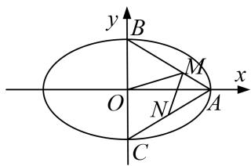

text_image

y
B
M
O
N
A
x
C

3. 解析 (1)由题设条件知，点 $M$ 的坐标为 $\left(\frac{2}{3} a, \frac{1}{3} b\right)$ ，又 $k_{OM} = \frac{\sqrt{5}}{10}$ ，从而 $\frac{b}{2a} = \frac{\sqrt{5}}{10}$ .

进而得 $a=\sqrt{5}b,\quad c=\sqrt{a^{2}-b^{2}}=2b$ ，故 $e=\frac{c}{a}=\frac{2\sqrt{5}}{5}$ .

(2)证明：由 N 是 AC 的中点知，点 N 的坐标为 $\left(\frac{a}{2}, -\frac{b}{2}\right)$ ，可得 $\overrightarrow{NM} = \left(\frac{a}{6}, \frac{5b}{6}\right)$ .

又 $\overrightarrow{AB}=(-a,b)$ ，从而有 $\overrightarrow{AB}\cdot\overrightarrow{NM}=-\frac{1}{6}a^{2}+\frac{5}{6}b^{2}=\frac{1}{6}(5b^{2}-a^{2})$ .

由(1)可知 $a^{2}=5b^{2}$ ，所以 $\overrightarrow{AB}\cdot\overrightarrow{NM}=0$ ，故 $MN\perp AB$ .

4. 已知椭圆 $C: \frac{x^2}{a^2} + \frac{y^2}{b^2} = 1 (a > b > 0)$ 的焦距为 $2\sqrt{3}$ ，且 $C$ 过点 $\left[\sqrt{3}, \frac{1}{2}\right]$ .

(1)求椭圆 C 的方程;  
(2)设 $B_{1}$ ， $B_{2}$ 分别是椭圆 C 的下顶点和上顶点，P 是椭圆上异于 $B_{1}$ ， $B_{2}$ 的任意一点，过点 P 作 $PM \perp y$ 轴于 M，N 为线段 PM 的中点，直线 $B_{2}N$ 与直线 y = -1 交于点 D，E 为线段 $B_{1}D$ 的中点，O 为坐标原点，求证： $ON \perp EN$ .

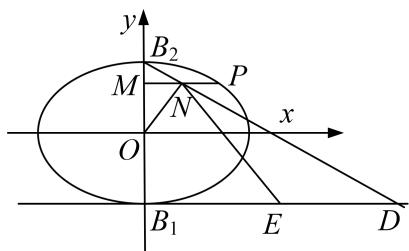

text_image

y
B₂
M
P
x
O
N
B₁
E
D

4. 解析 (1)由题设知焦距为 $2\sqrt{3}$ , 所以 $c = \sqrt{3}$ , 又因为椭圆过点 $\left[\sqrt{3}, \frac{1}{2}\right]$ , 所以代入椭圆方程得 $\frac{3}{a^2} + \frac{1}{b^2} = 1$ , 因为 $a^2 = b^2 + c^2$ , 解得 $a = 2, b = 1$ , 故所求椭圆 $C$ 的方程是 $\frac{x^2}{4} + y^2 = 1$ .

(2)设 $P(x_0,y_0)$ ， $x_0\neq 0$ ，则 $M(0,y_0),N\left(\frac{x_0}{2},y_0\right)$

因为点 P 在椭圆 C 上，所以 $\frac{x_{0}^{2}}{4} + y_{0}^{2} = 1$ ，即 $x_{0}^{2} = 4 - 4y_{0}^{2}$ .

又 $B_{2}(0,1)$ ，所以直线 $B_{2}N$ 的方程为 $y - 1 = \frac{2(y_0 - 1)}{x_0} x$ ，令 $y = -1$ ，得 $x = \frac{x_0}{1 - y_0}$ ，所以 $D\left[\frac{x_0}{1 - y_0}, -1\right]$ .

又 $B_{1}(0, - 1)$ ， $E$ 为线段 $B_{1}D$ 的中点，所以 $E\left(\frac{x_0}{2(1 - y_0)}, - 1\right)$

所以 $\overrightarrow{ON}=\left(\frac{x_{0}}{2},y_{0}\right)$ ， $\overrightarrow{EN}=\left(\frac{x_{0}}{2}-\frac{x_{0}}{2(1-y_{0})},y_{0}+1\right)$ .

因为 $\overrightarrow{ON} \cdot \overrightarrow{EN} = \frac{x_0}{2}\left[\frac{x_0}{2} - \frac{x_0}{2(1 - y_0)}\right] + y_0(y_0 + 1) = \frac{x_0^2}{4} - \frac{x_0^2}{4(1 - y_0)} + y_0^2 + y_0 = 1 - \frac{4 - 4y_0^2}{4(1 - y_0)} + y_0 = 1 - y_0 - 1 + y_0 = 0,$

所以 $\overrightarrow{ON}\perp\overrightarrow{EN}$ ，即 $ON\perp EN$ .

5. 已知抛物线 $C: x^{2} = 2py(p > 0)$ ，过焦点 $F$ 的直线交 $C$ 于 $A, B$ 两点， $D$ 是抛物线的准线 $l$ 与 $y$ 轴的交点.

(1)若 $AB \parallel l$ ，且 $\triangle ABD$ 的面积为 1，求抛物线的方程；

(2)设 $M$ 为 $AB$ 的中点，过 $M$ 作 $l$ 的垂线，垂足为 $N$ 。证明：直线 $AN$ 与抛物线相切。

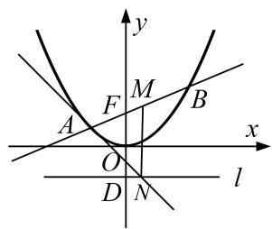

text_image

y
F M B
A O x
D N l

5. 解析 (1) $\because AB // l, \therefore |FD| = p, |AB| = 2p.\therefore S_{\triangle ABD} = p^2 = 1.\therefore p = 1$ ，故抛物线 $C$ 的方程为 $x^{2} = 2y$ .

(2)显然直线 AB 的斜率存在，设其方程为 $y=kx+\frac{p}{2}$ ， $A\left(x_{1},\frac{x_{1}^{2}}{2p}\right)$ ， $B\left(x_{2},\frac{x_{2}^{2}}{2p}\right)$ .

由 $\left\{\begin{aligned}y&=kx+\frac{p}{2},\\ x^{2}&=2py\end{aligned}\right.$ 消去 y 整理得， $x^{2}-2kpx-p^{2}=0.\therefore x_{1}+x_{2}=2kp,x_{1}x_{2}=-p^{2}.$

$$
\therefore M (k p, k ^ {2} p + \frac {p}{2}), N \left[ k p, - \frac {p}{2} \right]. \therefore k A N = \frac {\frac {x _ {1} ^ {2}}{2 p} + \frac {p}{2}}{x _ {1} - k p} = \frac {\frac {x _ {1} ^ {2}}{2 p} + \frac {p}{2}}{x _ {1} - \frac {x _ {1} + x _ {2}}{2}} = \frac {\frac {x _ {1} ^ {2} + p ^ {2}}{2 p}}{\frac {x _ {1} - x _ {2}}{2}} = \frac {\frac {x _ {1} ^ {2} - x _ {1} x _ {2}}{2 p}}{\frac {x _ {1} - x _ {2}}{2}} = \frac {x _ {1}}{p}.
$$

又 $x^{2}=2py,\quad\therefore y'=\frac{x}{p}$ . ∴抛物线 $x^{2}=2py$ 在点 A 处的切线斜率 $k=\frac{x_{1}}{p}$ . ∴直线 AN 与抛物线相切.

6. 如图，已知圆 $G: (x - 2)^{2} + y^{2} = \frac{4}{9}$ 是椭圆 $C: \frac{x^{2}}{a^{2}} + \frac{y^{2}}{b^{2}} = 1 (a > b > 0)$ 的内接 $\triangle ABC$ 的内切圆，其中 $A(-4, 0)$ 为椭圆的左顶点.

(1)求椭圆 C 的方程;

(2)过椭圆的上顶点 M 作圆 G 的两条切线交椭圆于 E，F 两点，证明：直线 EF 与圆 G 相切.

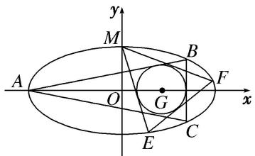

text_image

y
M
A
O
G
C
E
F
x

6. 解析 (1)由题意可知 BC 垂直于 x 轴，a=4。设 $B(2+r, y_{0})(r$ 为圆 G 的半径)，

过圆心 G 作 $GD \perp AB$ 于 D，BC 交 x 轴于 H，由 $\frac{GD}{AD} = \frac{HB}{AH}$ ，得 $\frac{r}{\sqrt{36 - r^{2}}} = \frac{y_{0}}{6 + r}$ ，即 $y_{0} = \frac{r\sqrt{6 + r}}{\sqrt{6 - r}}$ ，

$\because r=\frac{2}{3},\quad\therefore y_{0}=\frac{\sqrt{5}}{3},\quad\because B\left(\frac{8}{3},\quad\frac{\sqrt{5}}{3}\right)$ 在椭圆上， $\therefore\frac{\left(\frac{8}{3}\right)^{2}}{4^{2}}+\frac{\left(\frac{\sqrt{5}}{3}\right)^{2}}{b^{2}}=1$ ，解得 b=1，

∴椭圆 C 的方程为 $\frac{x^{2}}{16} + y^{2} = 1$ .

(2)由(1)可知 $M(0,1)$ ，设过点 $M(0,1)$ 与圆 $(x-2)^{2}+y^{2}=\frac{4}{9}$ 相切的直线方程为： $y=kx+1$ ，①

则 $\frac{2}{3} = \frac{|2k + 1|}{\sqrt{1 + k^2}}$ ，即 $32k^2 + 36k + 5 = 0$ ，②．解得 $k_1 = \frac{-9 + \sqrt{41}}{16}$ ， $k_2 = \frac{-9 - \sqrt{41}}{16}$ ，

将①代入 $\frac{x^{2}}{16}+y^{2}=1$ 得 $(16k^{2}+1)x^{2}+32kx=0$ ，则异于零的解为 $x=-\frac{32k}{16k^{2}+1}$ .

设 $F(x_{1}, k_{1}x_{1}+1)$ ， $E(x_{2}, k_{2}x_{2}+1)$ ，则 $x_{1}=-\frac{32k_{1}}{16k_{1}^{2}+1}$ ， $x_{2}=-\frac{32k_{2}}{16k_{2}^{2}+1}$

则直线 FE 的斜率为： $k_{EF}=\frac{k_{2}x_{2}-k_{1}x_{1}}{x_{2}-x_{1}}=\frac{k_{1}+k_{2}}{1-16k_{1}k_{2}}=\frac{3}{4}$

于是直线 $FE$ 的方程为： $y + \frac{32k_1^2}{16k_1^2 + 1} - 1 = \frac{3}{4}\left(x + \frac{32k_1}{16k_1^2 + 1}\right)$ ，即 $y = \frac{3}{4} x - \frac{7}{3}$ ，

则圆心(2, 0)到直线 $FE$ 的距离 $d = \frac{\left|\frac{3}{2} - \frac{7}{3}\right|}{\sqrt{1 + \frac{9}{16}}} = \frac{2}{3} = r$ ，故结论成立.

7. (2017·北京)已知抛物线 C: $y^{2}=2px$ 过点 $P(1,1)$ . 过点 $\left[\begin{aligned}0,&\frac{1}{2}\end{aligned}\right]$ 作直线 l 与抛物线 C 交于不同的两点 M, N, 过点 M 作 x 轴的垂线分别与直线 OP, ON 交于点 A, B, 其中 O 为原点.

(1)求抛物线 C 的方程，并求其焦点坐标和准线方程；

(2)求证：A 为线段 BM 的中点.

7. 解析 (1)由抛物线 $C: y^{2} = 2px$ 过点 $P(1, 1)$ , 得 $p = \frac{1}{2}$ . 所以抛物线 $C$ 的方程为 $y^{2} = x$ .

抛物线 C 的焦点坐标为 $\left(\frac{1}{4}, 0\right)$ ，准线方程为 $x = -\frac{1}{4}$ .

(2)证明：由题意，设直线 l 的方程为 $y=kx+\frac{1}{2}(k\neq0)$ ，l 与抛物线 C 的交点为 $M(x_{1},y_{1})$ ， $N(x_{2},y_{2})$ .

由 $\left\{\begin{aligned}y&=kx+\frac{1}{2},\\ y^{2}&=x\end{aligned}\right.$ 消去y，得 $4k^{2}x^{2}+(4k-4)x+1=0$ 。则 $x_{1}+x_{2}=\frac{1-k}{k^{2}}$ ， $x_{1}x_{2}=\frac{1}{4k^{2}}$

因为点 P 的坐标为 $(1,1)$ ，所以直线 OP 的方程为 y=x，点 A 的坐标为 $(x_{1}, x_{1})$ .

直线 ON 的方程为 $y=\frac{y_{2}}{x_{2}}x$ ，点 B 的坐标为 $\left(x_{1},\frac{y_{2}x_{1}}{x_{2}}\right)$ .

因为 $y_{1} + \frac{y_{2}x_{1}}{x_{2}} - 2x_{1} = \frac{y_{1}x_{2} + y_{2}x_{1} - 2x_{1}x_{2}}{x_{2}} = \frac{\left(kx_{1} + \frac{1}{2}\right)x_{2} + \left(kx_{2} + \frac{1}{2}\right)x_{1} - 2x_{1}x_{2}}{x_{2}}$

$$
= \frac {(2 k - 2) x _ {1} x _ {2} + \frac {1}{2} (x _ {2} + x _ {1})}{x _ {2}} = \frac {(2 k - 2) \times \frac {1}{4 k ^ {2}} + \frac {1 - k}{2 k ^ {2}}}{x _ {2}} = 0,
$$

所以 $y_{1}+\frac{y_{2}x_{1}}{x_{2}}=2x_{1}$ . 故 A 为线段 BM 的中点.

8. 已知椭圆 $E: \frac{x^2}{a^2} + \frac{y^2}{b^2} = 1 (a > b > 0)$ 经过点 $(2\sqrt{2}, 2)$ ，且离心率为 $\frac{\sqrt{2}}{2}$ ， $F_1$ ， $F_2$ 是椭圆 $E$ 的左、右焦点。

(1)求椭圆 E 的方程;

(2)若 $A, B$ 是椭圆 $E$ 上关于 $y$ 轴对称的两点 $(A, B$ 不是长轴的端点), 点 $P$ 是椭圆 $E$ 上异于 $A, B$ 的一点, 且直线 $PA, PB$ 分别交 $y$ 轴于点 $M, N$ , 求证: 直线 $MF_{1}$ 与直线 $NF_{2}$ 的交点 $G$ 在定圆上.

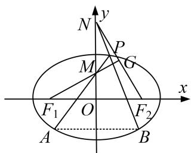

text_image

N
y
P
M
G
F₁ O F₂
A B
x

8. 解析 (1)由题意知 $\left\{ \begin{array}{l} \frac{8}{a^2} + \frac{4}{b^2} = 1, \\ \frac{c}{a} = \frac{\sqrt{2}}{2}, \\ a^2 = b^2 + c^2, \end{array} \right.$ 解得 $\left\{ \begin{array}{l} a = 4, \\ b = 2\sqrt{2}, \\ c = 2\sqrt{2}, \end{array} \right.$ 故椭圆 $E$ 的方程为 $\frac{x^2}{16} + \frac{y^2}{8} = 1$ .

(2)证明：设 $B(x_0, y_0)$ ， $P(x_1, y_1)$ ，则 $A(-x_0, y_0)$ 。直线 $PA$ 的方程为 $y - y_1 = \frac{y_1 - y_0}{x_1 + x_0} (x - x_1)$ ，

令 $x = 0$ ，得 $y = \frac{x_1y_0 + x_0y_1}{x_1 + x_0}$ 故 $M\left(0,\frac{x_1y_0 + x_0y_1}{x_1 + x_0}\right)$ 同理可得 $N\left(0,\frac{x_1y_0 - x_0y_1}{x_1 - x_0}\right)$

所以 $\overrightarrow{F_{1}M}=\left(2\sqrt{2},\frac{x_{1}y_{0}+x_{0}y_{1}}{x_{1}+x_{0}}\right),\quad\overrightarrow{F_{2}N}=\left(-2\sqrt{2},\frac{x_{1}y_{0}-x_{0}y_{1}}{x_{1}-x_{0}}\right)$

所以 $\overrightarrow{F_{1}M}\cdot\overrightarrow{F_{2}N}=\left(2\sqrt{2},\frac{x_{1}y_{0}+x_{0}y_{1}}{x_{1}+x_{0}}\right)\cdot\left(-2\sqrt{2},\frac{x_{1}y_{0}-x_{0}y_{1}}{x_{1}-x_{0}}\right)=-8+\frac{x_{1}^{2}y_{0}^{2}-x_{0}^{2}y_{1}^{2}}{x_{1}^{2}-x_{0}^{2}}$

$$
= - 8 + \frac {x _ {1} ^ {2} \times 8 \left(1 - \frac {x _ {0} ^ {2}}{1 6}\right) - x _ {0} ^ {2} \times 8 \left(1 - \frac {x _ {1} ^ {2}}{1 6}\right)}{x _ {1} ^ {2} - x _ {0} ^ {2}} = - 8 + 8 = 0,
$$

所以 $F_{1}M \perp F_{2}N$ ，所以直线 $MF_{1}$ 与直线 $NF_{2}$ 的交点 G 在以 $F_{1}F_{2}$ 为直径的圆上.

9. 直线 $y = kx + m (m \neq 0)$ 与椭圆 $W: \frac{x^2}{4} + y^2 = 1$ 相交于 $A, C$ 两点， $O$ 是坐标原点.

(1)当点 B 的坐标为 $(0, 1)$ ，且四边形 OABC 为菱形时，求 AC 的长；  
(2)当点 B 在 W 上且不是 W 的顶点时，证明：四边形 OABC 不可能为菱形.

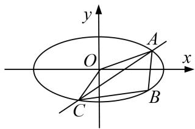

text_image

y
O
A
x
C
B

9. 解析 (1)因为四边形 $OABC$ 为菱形, 所以 $AC$ 与 $OB$ 相互垂直平分.

所以可设 $A\left(t, \frac{1}{2}\right)$ ，代入椭圆方程得 $\frac{t^{2}}{4} + \frac{1}{4} = 1$ ，即 $t = \pm \sqrt{3}$ 。所以 $|AC| = 2\sqrt{3}$ 。

(2)假设四边形 OABC 为菱形．因为点 B 不是 W 的顶点，且 $AC \perp OB$ ，所以 $k \neq 0$ .

由 $\left\{\begin{aligned}x^{2}+4y^{2}=4,\\ y=kx+m,\end{aligned}\right.$ 消去y并整理得 $(1+4k^{2})x^{2}+8kmx+4m^{2}-4=0.$

设 $A(x_{1}, y_{1})$ ， $C(x_{2}, y_{2})$ ，则 $\frac{x_{1}+x_{2}}{2}=-\frac{4km}{1+4k^{2}}$ ， $\frac{y_{1}+y_{2}}{2}=k\cdot\frac{x_{1}+x_{2}}{2}+m=\frac{m}{1+4k^{2}}$ .

所以 AC 的中点为 $M\left(-\frac{4km}{1+4k^{2}}, \frac{m}{1+4k^{2}}\right)$ .

因为 M 为 AC 和 OB 的交点，且 $m \neq 0, k \neq 0$ ，所以直线 OB 的斜率为 $-\frac{1}{4k}$ .

因为 $k \cdot \left(-\frac{1}{4k}\right) \neq -1$ ，所以 $AC$ 与 $OB$ 不垂直。所以 $OABC$ 不是菱形，与假设矛盾。所以当点 $B$ 在 $W$ 上且不是 $W$ 的顶点时，四边形 $OABC$ 不可能是菱形。

