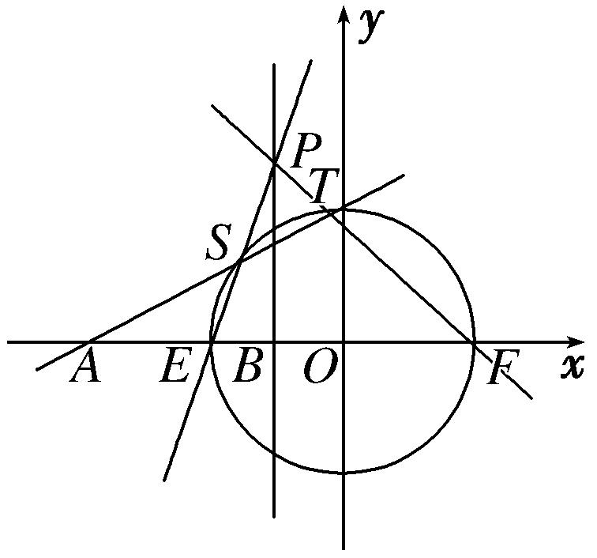
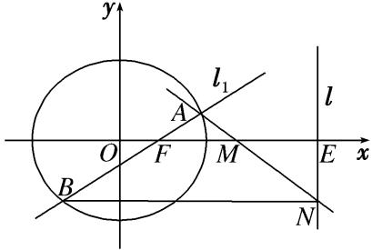
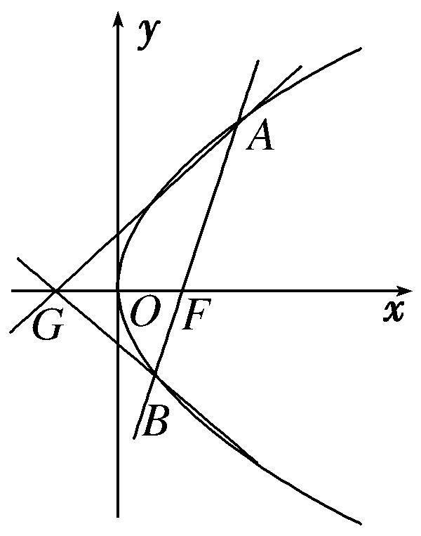
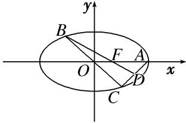
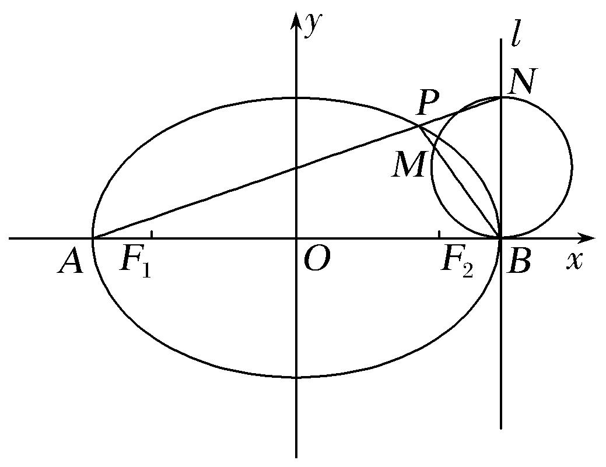
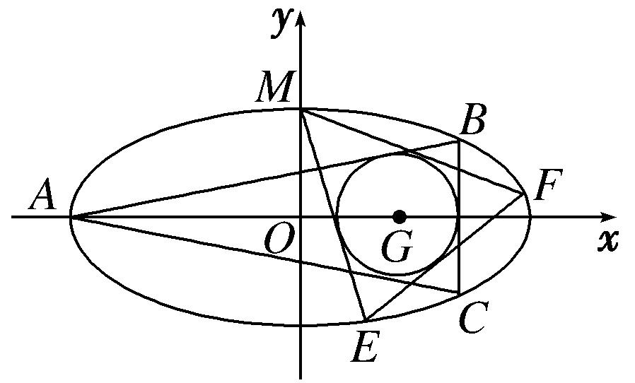

专题31　证明位置关系型问题

圆锥曲线中的证明问题，主要有两类：一是证明直线与圆锥曲线中的一些数量关系(相等或不等)．二是证明点、直线、曲线等几何元素中的位置关系，如：如证明直线与曲线相切，直线间的平行、垂直，直线过定点等；解决证明问题时，主要根据直线与圆锥曲线的性质、直线与圆锥曲线的位置关系等，通过相关性质的应用、代数式的恒等变形以及必要的数值计算等进行证明．圆锥曲线中的证明问题是转化与化归思想的充分体现．无论证明什么结论，要对已知条件进行化简，同时对要证结论合理转化，寻求条件和结论间的联系，从而确定解题思路及转化方向．

【例题选讲】

<strong>[例1]</strong>　设椭圆<em>E</em>：＋＝1(<em>a</em>&gt;<em>b</em>&gt;0)的左、右焦点分别为<em>F</em>1，<em>F</em>2，过点<em>F</em>1的直线交椭圆<em>E</em>于<em>A</em>，<em>B</em>两点．若椭圆<em>E</em>的离心率为，△<em>ABF</em>2的周长为4．  
（1）求椭圆*E*的方程；  
（2）设不经过椭圆的中心而平行于弦*AB*的直线交椭圆*E*于点*C*，*D*，设弦*AB*，*CD*的中点分别为*M*，*N*，证明：*O*，*M*，*N*三点共线．

<strong>[规范解答]</strong>　（1）由题意知，4<em>a</em>＝4，<em>a</em>＝．又<em>e</em>＝，∴<em>c</em>＝，<em>b</em>＝，
∴椭圆*E*的方程为＋＝1．  
（2）当直线*AB*，*CD*的斜率不存在时，由椭圆的对称性知，

中点*M*，*N*在*x*轴上，*O*，*M*，*N*三点共线，
当直线<em>AB</em>，<em>CD</em>的斜率存在时，设其斜率为<em>k</em>，且设<em>A</em>(<em>x</em>1，<em>y</em>1)，<em>B</em>(<em>x</em>2，<em>y</em>2)，<em>M</em>(<em>x</em>0，<em>y</em>0)，
则两式相减，得＋－＝0，∴＝－，

＝－，∴·＝－，·＝－，
即<em>k</em>·<em>kOM</em>＝－，∴<em>kOM</em>＝－．同理可得<em>kON</em>＝－，∴<em>kOM</em>＝<em>kON</em>，∴<em>O</em>，<em>M</em>，<em>N</em>三点共线．

<strong>[例2]</strong>　已知点<em>A</em>(－4，0)，直线<em>l</em>：<em>x</em>＝－1与<em>x</em>轴交于点<em>B</em>，动点<em>M</em>到<em>A</em>，<em>B</em>两点的距离之比为2．  
（1）求点*M*的轨迹*C*的方程；  
（2）设*C*与*x*轴交于*E*，*F*两点，*P*是直线*l*上一点，且点*P*不在*C*上，直线*PE*，*PF*分别与*C*交于另一点*S*，*T*，证明：*A*，*S*，*T*三点共线．

<strong>[规范解答]</strong>　（1）设点<em>M</em>(<em>x</em>，<em>y</em>)，依题意，＝＝2，
化简得<em>x</em>2＋<em>y</em>2＝4，即轨迹<em>C</em>的方程为<em>x</em>2＋<em>y</em>2＝4．

  
（2）证明：由（1）知曲线<em>C</em>的方程为<em>x</em>2＋<em>y</em>2＝4，令<em>y</em>＝0得<em>x</em>＝±2，不妨设<em>E</em>(－2，0)，<em>F</em>(2,0)，如图所示．
设<em>P</em>(－1，<em>y</em>0)，<em>S</em>(<em>x</em>1，<em>y</em>1)，<em>T</em>(<em>x</em>2，<em>y</em>2)，则直线<em>PE</em>的方程为<em>y</em>＝<em>y</em>0(<em>x</em>＋2)，
由得(<em>y</em>＋1)<em>x</em>2＋4<em>yx</em>＋4<em>y</em>－4＝0，所以－2<em>x</em>1＝，即<em>x</em>1＝，<em>y</em>1＝．

直线<em>PF</em>的方程为<em>y</em>＝－(<em>x</em>－2)，由得(<em>y</em>＋9)<em>x</em>2－4<em>yx</em>＋4<em>y</em>－36＝0，
所以2<em>x</em>2＝，即<em>x</em>2＝，<em>y</em>2＝，所以<em>kAS</em>＝＝＝，

<em>kAT</em>＝＝＝，所以<em>kAS</em>＝<em>kAT</em>，所以<em>A</em>，<em>S</em>，<em>T</em>三点共线．

<strong>[例3]</strong>　在平面直角坐标系<em>xOy</em>中取两个定点<em>A</em>1(－，0)，<em>A</em>2(，0)，再取两个动点<em>N</em>1(0，<em>m</em>)，<em>N</em>2(0，<em>n</em>)，且<em>mn</em>＝2．  
（1）求直线<em>A</em>1<em>N</em>1与<em>A</em>2<em>N</em>2的交点<em>M</em>的轨迹<em>C</em>的方程；  
（2）过*R*(3，0)的直线与轨迹*C*交于*P*，*Q*两点，过点*P*作*PN*⊥*x*轴且与轨迹*C*交于另一点*N*，*F*为轨迹*C*的右焦点，若＝*λ* (*λ*＞1)，求证：＝*λ*．

<strong>[规范解答]</strong>　（1）依题意知，直线<em>A</em>1<em>N</em>1的方程为<em>y</em>＝(<em>x</em>＋)，①，

直线<em>A</em>2<em>N</em>2的方程为<em>y</em>＝－(<em>x</em>－)，②
设<em>M</em>(<em>x</em>，<em>y</em>)是直线<em>A</em>1<em>N</em>1与<em>A</em>2<em>N</em>2的交点，①×②得<em>y</em>2＝－(<em>x</em>2－6)，
又*mn*＝2，整理得＋＝1．故点*M*的轨迹*C*的方程为＋＝1．  
（2）证明：设过点<em>R</em>的直线<em>l</em>：<em>x</em>＝<em>ty</em>＋3，<em>P</em>(<em>x</em>1，<em>y</em>1)，Q(<em>x</em>2，<em>y</em>2)，则<em>N</em>(<em>x</em>1，－<em>y</em>1)，
由消去<em>x</em>，得(<em>t</em>2＋3)<em>y</em>2＋6<em>ty</em>＋3＝0，(\*)，所以<em>y</em>1＋<em>y</em>2＝－，<em>y</em>1<em>y</em>2＝．
由＝<em>λ</em>，得(<em>x</em>1－3，<em>y</em>1)＝<em>λ</em>(<em>x</em>2－3，<em>y</em>2)，故<em>x</em>1－3＝<em>λ</em>(<em>x</em>2－3)，<em>y</em>1＝<em>λy</em>2，
由（1）得<em>F</em>(2，0)，要证＝<em>λ</em>，即证(2－<em>x</em>1，<em>y</em>1)＝<em>λ</em>(<em>x</em>2－2，<em>y</em>2)，

只需证2－<em>x</em>1＝<em>λ</em>(<em>x</em>2－2)，只需＝－，即证2<em>x</em>1<em>x</em>2－5(<em>x</em>1＋<em>x</em>2)＋12＝0，
又<em>x</em>1<em>x</em>2＝(<em>ty</em>1＋3)(<em>ty</em>2＋3)＝<em>t</em>2<em>y</em>1<em>y</em>2＋3<em>t</em>(<em>y</em>1＋<em>y</em>2)＋9，<em>x</em>1＋<em>x</em>2＝<em>ty</em>1＋3＋<em>ty</em>2＋3＝<em>t</em>(<em>y</em>1＋<em>y</em>2)＋6，
所以2<em>t</em>2<em>y</em>1<em>y</em>2＋6<em>t</em>(<em>y</em>1＋<em>y</em>2)＋18－5<em>t</em>(<em>y</em>1＋<em>y</em>2)－30＋12＝0，即2<em>t</em>2<em>y</em>1<em>y</em>2＋<em>t</em>(<em>y</em>1＋<em>y</em>2)＝0，

而2<em>t</em>2<em>y</em>1<em>y</em>2＋<em>t</em>(<em>y</em>1＋<em>y</em>2)＝2<em>t</em>2·－<em>t</em>·＝0成立，即＝<em>λ</em>成立．

<strong>[例4]</strong>　已知椭圆＋＝1的右焦点为<em>F</em>，设直线<em>l</em>：<em>x</em>＝5与<em>x</em>轴的交点为<em>E</em>，过点<em>F</em>且斜率为<em>k</em>的直线<em>l</em>1与椭圆交于<em>A</em>，<em>B</em>两点，<em>M</em>为线段<em>EF</em>的中点．  
（1）若直线<em>l</em>1的倾斜角为，求|<em>AB</em>|的值；  
（2）设直线*AM*交直线*l*于点*N*，证明：直线*BN*⊥*l*．

<strong>[规范解答]</strong>　由题意知，<em>F</em>(1,0)，<em>E</em>(5,0)，<em>M</em>(3,0)．  
（1）∵直线<em>l</em>1的倾斜角为，∴<em>k</em>＝1．∴直线<em>l</em>1的方程为<em>y</em>＝<em>x</em>－1．
代入椭圆方程，可得9<em>x</em>2－10<em>x</em>－15＝0．
设<em>A</em>(<em>x</em>1，<em>y</em>1)，<em>B</em>(<em>x</em>2，<em>y</em>2)，则<em>x</em>1＋<em>x</em>2＝，<em>x</em>1<em>x</em>2＝－．
∴|*AB*|＝＝·＝× ＝．  
（2）设直线<em>l</em>1的方程为<em>y</em>＝<em>k</em>(<em>x</em>－1)．代入椭圆方程，得(4＋5<em>k</em>2)<em>x</em>2－10<em>k</em>2<em>x</em>＋5<em>k</em>2－20＝0．
设<em>A</em>(<em>x</em>1，<em>y</em>1)，<em>B</em>(<em>x</em>2，<em>y</em>2)，则<em>x</em>1＋<em>x</em>2＝，<em>x</em>1<em>x</em>2＝．
设<em>N</em>(5，<em>y</em>0)，∵<em>A</em>，<em>M</em>，<em>N</em>三点共线，∴<em>kAM</em>＝<em>kMN</em>，即＝，∴<em>y</em>0＝．

而<em>y</em>0－<em>y</em>2＝－<em>y</em>2＝－<em>k</em>(<em>x</em>2－1)＝＝＝0．
∴直线*BN*∥*x*轴，即*BN*⊥*l*．

<strong>[例5]</strong>　已知椭圆<em>T</em>：＋＝1(<em>a</em>&gt;<em>b</em>&gt;0)的一个顶点<em>A</em>(0，1)，离心率<em>e</em>＝，圆<em>C</em>：<em>x</em>2＋<em>y</em>2＝4，从圆<em>C</em>上任意一点<em>P</em>向椭圆<em>T</em>引两条切线<em>PM</em>，<em>PN</em>．  
（1）求椭圆*T*的方程；  
（2）求证：*PM*⊥*PN*．

<strong>[规范解答]</strong>　（1）由题意可知<em>b</em>＝1，＝，即2<em>a</em>2＝3<em>c</em>2，又<em>a</em>2＝<em>b</em>2＋<em>c</em>2，联立解得<em>a</em>2＝3，<em>b</em>2＝1．
∴椭圆方程为＋<em>y</em>2＝1．  
（2）方法一　①当*P*点横坐标为±时，纵坐标为±1，*PM*斜率不存在，*PN*斜率为0，*PM*⊥*PN*．

②当<em>P</em>点横坐标不为±时，设<em>P</em>(<em>x</em>0，<em>y</em>0)，则<em>x</em>＋<em>y</em>＝4，设<em>kPM</em>＝<em>k</em>，<em>PM</em>的方程为<em>y</em>－<em>y</em>0＝<em>k</em>(<em>x</em>－<em>x</em>0)，
联立方程组消去<em>y</em>得(1＋3<em>k</em>2)<em>x</em>2＋6<em>k</em>(<em>y</em>0－<em>kx</em>0)<em>x</em>＋3<em>k</em>2<em>x</em>－6<em>kx</em>0<em>y</em>0＋3<em>y</em>－3＝0，
依题意<em>Δ</em>＝36<em>k</em>2(<em>y</em>0－<em>kx</em>0)2－4(1＋3<em>k</em>2)(3<em>k</em>2<em>x</em>－6<em>kx</em>0<em>y</em>0＋3<em>y</em>－3)＝0，化简得(3－<em>x</em>)<em>k</em>2＋2<em>x</em>0<em>y</em>0<em>k</em>＋1－<em>y</em>＝0，
又<em>kPM</em>，<em>kPN</em>为方程的两根，所以<em>kPM</em>·<em>kPN</em>＝＝＝＝－1．
所以*PM*⊥*PN*，综上知*PM*⊥*PN*．
方法二　①当*P*点横坐标为±时，纵坐标为±1，*PM*斜率不存在，*PN*斜率为0，*PM*⊥*PN*．

②当*P*点横坐标不为±时，设*P*(2cos *θ*，2sin *θ*)，切线方程为*y*－2sin *θ*＝*k*(*x*－2cos *θ*)，
联立得(1＋3<em>k</em>2)<em>x</em>2＋12<em>k</em>(sin <em>θ</em>－<em>k</em>cos <em>θ</em>)<em>x</em>＋12(sin <em>θ</em>－<em>k</em>cos <em>θ</em>)2－3＝0，
令<em>Δ</em>＝0，即<em>Δ</em>＝144<em>k</em>2(sin <em>θ</em>－<em>k</em>cos <em>θ</em>)2－4(1＋3<em>k</em>2)[12(sin <em>θ</em>－<em>k</em>cos <em>θ</em>)2－3]＝0，
化简得(3－4cos2<em>θ</em>)<em>k</em>2＋4sin 2<em>θ</em>·<em>k</em>＋1－4sin2<em>θ</em>＝0，<em>kPM</em>·<em>kPN</em>＝＝＝－1．
所以*PM*⊥*PN*，综上知*PM*⊥*PN*．

<strong>[例6]</strong>　已知点<em>F</em>为抛物线<em>E</em>：<em>y</em>2＝2<em>px</em>(<em>p</em>&gt;0)的焦点，点<em>A</em>(2，<em>m</em>)在抛物线<em>E</em>上，且|<em>AF</em>|＝3．  
（1）求抛物线*E*的方程；  
（2）已知点*G*(－1，0)，延长*AF*交抛物线*E*于点*B*，证明：以点*F*为圆心且与直线*GA*相切的圆，必与直线*GB*相切．

<strong>[规范解答]</strong>　（1）由抛物线的定义得|<em>AF</em>|＝2＋．
因为|<em>AF</em>|＝3，即2＋＝3，解得<em>p</em>＝2，所以抛物线<em>E</em>的方程为<em>y</em>2＝4<em>x</em>．  
（2）证明：设以点*F*为圆心且与直线*GA*相切的圆的半径为*r*．
因为点<em>A</em>(2，<em>m</em>)在抛物线<em>E</em>：<em>y</em>2＝4<em>x</em>上，所以<em>m</em>＝±2．
由抛物线的对称性，不妨设*A*(2，2)．由*A*(2，2)，*F*(1，0)可得直线*AF*的方程为

<em>y</em>＝2(<em>x</em>－1)．由得2<em>x</em>2－5<em>x</em>＋2＝0，解得<em>x</em>＝2或<em>x</em>＝，从而<em>B</em>．
又*G*(－1，0)，故直线*GA*的方程为2*x*－3*y*＋2＝0，
从而*r*＝＝，又直线*GB*的方程为2*x*＋3*y*＋2＝0，
所以点*F*到直线*GB*的距离*d*＝＝＝*r*，

这表明以点*F*为圆心且与直线*GA*相切的圆必与直线*GB*相切．

<strong>[例7]</strong>　设椭圆<em>E</em>：＋＝1(<em>a</em>&gt;<em>b</em>&gt;0)的右焦点为<em>F</em>，右顶点为<em>A</em>，<em>B</em>，<em>C</em>是椭圆上关于原点对称的两点(<em>B</em>，<em>C</em>均不在<em>x</em>轴上)，线段<em>AC</em>的中点为<em>D</em>，且<em>B</em>，<em>F</em>，<em>D</em>三点共线．  
（1）求椭圆*E*的离心率；  
（2）设*F*(1，0)，过*F*的直线*l*交*E*于*M*，*N*两点，直线*MA*，*NA*分别与直线*x*＝9交于*P*，*Q*两点．证明：以*PQ*为直径的圆过点*F*．

<strong>[规范解答]</strong>　（1）法一：由已知<em>A</em>(<em>a,</em>0)，<em>F</em>(<em>c,</em>0)，设<em>B</em>(<em>x</em>0，<em>y</em>0)，<em>C</em>(－<em>x</em>0，－<em>y</em>0)，则<em>D</em>，
∵<em>B</em>，<em>F</em>，<em>D</em>三点共线，∴∥，又＝(<em>c</em>－<em>x</em>0，－<em>y</em>0)，＝，
∴－<em>y</em>0(<em>c</em>－<em>x</em>0)＝－<em>y</em>0·，∴<em>a</em>＝3<em>c</em>，从而<em>e</em>＝．

法二：连接*OD*，*AB*(图略)，由题意知，*OD*是△*CAB*的中位线，∴*OD*綊*AB*，
∴△*OFD*∽△*AFB*．∴＝＝，即＝，解得*a*＝3*c*，从而e＝．  
（2）∵<em>F</em>的坐标为(1,0)，∴<em>c</em>＝1，从而<em>a</em>＝3，∴<em>b</em>2＝8．∴椭圆<em>E</em>的方程为＋＝1．
设直线<em>l</em>的方程为<em>x</em>＝<em>ny</em>＋1，由消去<em>x</em>得，(8<em>n</em>2＋9)<em>y</em>2＋16<em>ny</em>－64＝0，
∴<em>y</em>1＋<em>y</em>2＝，<em>y</em>1<em>y</em>2＝，其中<em>M</em>(<em>ny</em>1＋1，<em>y</em>1)，<em>N</em>(<em>ny</em>2＋1，<em>y</em>2)．
∴直线*AM*的方程为＝，∴*P*，同理*Q*，
从而·＝·＝64＋

＝64＋＝64＋＝0．∴*FP*⊥*FQ*，即以*PQ*为直径的圆恒过点*F*．

<strong>[例8]</strong>　(2017·全国Ⅱ)设<em>O</em>为坐标原点，动点<em>M</em>在椭圆<em>C</em>：＋<em>y</em>2＝1上，过<em>M</em>作<em>x</em>轴的垂线，垂足为<em>N</em>，点<em>P</em>满足＝．  
（1）求点*P*的轨迹方程；  
（2）设点*Q*在直线*x*＝－3上，且·＝1．证明：过点*P*且垂直于*OQ*的直线*l*过*C*的左焦点*F*．

<strong>[规范解答]</strong>　（1）设<em>P</em>(<em>x</em>，<em>y</em>)，<em>M</em>(<em>x</em>0，<em>y</em>0)，则<em>N</em>(<em>x</em>0,0)，＝(<em>x</em>－<em>x</em>0，<em>y</em>)，＝(0，<em>y</em>0)．
由＝ ，得<em>x</em>0＝<em>x</em>，<em>y</em>0＝<em>y</em>，因为<em>M</em>(<em>x</em>0，<em>y</em>0)在<em>C</em>上，所以＋＝1．
因此点<em>P</em>的轨迹方程为<em>x</em>2＋<em>y</em>2＝2．  
（2）由题意知*F*(－1,0)．设*Q*(－3，*t*)，*P*(*m*，*n*)，则＝(－3，*t*)，

＝(－1－*m*，－*n*)，·＝3＋3*m*－*tn*，＝(*m*，*n*)，＝(－3－*m*，*t*－*n*)．
由·＝1，得－3<em>m</em>－<em>m</em>2＋<em>tn</em>－<em>n</em>2＝1，又由（1）知<em>m</em>2＋<em>n</em>2＝2，故3＋3<em>m</em>－<em>tn</em>＝0．
所以·＝0，即⊥，又过点*P*存在唯一直线垂直于*OQ*，
所以过点*P*且垂直于*OQ*的直线*l*过*C*的左焦点*F*．

<strong>[例9]</strong>　设椭圆<em>E</em>：＋＝1的焦点在<em>x</em>轴上．  
（1）若椭圆*E*的焦距为1，求椭圆*E*的方程；  
（2）设<em>F</em>1，<em>F</em>2分别是椭圆<em>E</em>的左、右焦点，<em>P</em>为椭圆<em>E</em>上第一象限内的点，直线<em>F</em>2<em>P</em>交<em>y</em>轴于点<em>Q</em>，并且<em>F</em>1<em>P</em>⊥<em>F</em>1<em>Q</em>．证明：当<em>a</em>变化时，点<em>P</em>在某定直线上．

<strong>[规范解答]</strong>　（1）因为焦距为1，且焦点在<em>x</em>轴上，所以2<em>a</em>2－1＝，解得<em>a</em>2＝．
故椭圆*E*的方程为＋＝1．  
（2）设<em>P</em>(<em>x</em>0，<em>y</em>0)，<em>F</em>1(－<em>c</em>，0)，<em>F</em>2(<em>c</em>，0)，其中<em>c</em>＝．
由题设知<em>x</em>0≠<em>c</em>，则直线<em>F</em>1<em>P</em>的斜率<em>kF</em>1<em>P</em>＝，直线<em>F</em>2<em>P</em>的斜率<em>kF</em>2<em>P</em>＝．
故直线<em>F</em>2<em>P</em>的方程为<em>y</em>＝(<em>x</em>－<em>c</em>)．当<em>x</em>＝0时，<em>y</em>＝，即点<em>Q</em>坐标为．
因此，直线<em>F</em>1<em>Q</em>的斜率为<em>kF</em>1<em>Q</em>＝．由于<em>F</em>1<em>P</em>⊥<em>F</em>1<em>Q</em>，所以<em>kF</em>1<em>P</em>·<em>kF</em>1<em>Q</em>＝·＝－1．
化简得<em>y</em>＝<em>x</em>－(2<em>a</em>2－1)．①
将①代入椭圆<em>E</em>的方程，由于点<em>P</em>(<em>x</em>0，<em>y</em>0)在第一象限，解得<em>x</em>0＝<em>a</em>2，<em>y</em>0＝1－<em>a</em>2，
即点*P*在定直线*x*＋*y*＝1上．

【对点训练】

1．已知椭圆＋＝1的右焦点为<em>F</em>，设直线<em>l</em>：<em>x</em>＝5与<em>x</em>轴的交点为<em>E</em>，过点<em>F</em>且斜率为<em>k</em>的直线<em>l</em>1与椭

圆交于*A*，*B*两点，*M*为线段*EF*的中点．  
（1）若直线<em>l</em>1的倾斜角为，求△<em>ABM</em>的面积<em>S</em>的值；  
（2）过点*B*作*BN*⊥*l*于点*N*，证明：*A*，*M*，*N*三点共线．

1．<strong>解析</strong>　由题意知，<em>F</em>(1，0)，<em>E</em>(5，0)，<em>M</em>(3，0)，设<em>A</em>(<em>x</em>1，<em>y</em>1)，<em>B</em>(<em>x</em>2，<em>y</em>2)．  
（1）因为直线<em>l</em>1的倾斜角为，所以<em>k</em>＝1，则直线<em>l</em>1的方程为<em>y</em>＝<em>x</em>－1．
由消去<em>x</em>并整理，得9<em>y</em>2＋8<em>y</em>－16＝0，<em>Δ</em>＞0，则<em>y</em>1＋<em>y</em>2＝－，<em>y</em>1<em>y</em>2＝－．
所以<em>S</em>△<em>ABM</em>＝×|<em>FM</em>|×|<em>y</em>1－<em>y</em>2|＝＝＝．  
（2）由题意可得直线<em>l</em>1的方程为<em>y</em>＝<em>k</em>(<em>x</em>－1)，
由消去<em>y</em>并整理，得(4＋5<em>k</em>2)<em>x</em>2－10<em>k</em>2<em>x</em>＋5<em>k</em>2－20＝0，<em>Δ</em>＞0，
则<em>x</em>1＋<em>x</em>2＝，<em>x</em>1<em>x</em>2＝．
因为<em>BN</em>⊥<em>l</em>于点<em>N</em>，所以<em>N</em>(5，<em>y</em>2)，则<em>kAM</em>＝，<em>kMN</em>＝．

而<em>y</em>2(3－<em>x</em>1)－2(－<em>y</em>1)＝<em>k</em>(<em>x</em>2－1)(3－<em>x</em>1)＋2<em>k</em>(<em>x</em>1－1)＝－<em>k</em>[<em>x</em>1<em>x</em>2－3(<em>x</em>1＋<em>x</em>2)＋5]

＝－*k*(－3×＋5)＝0，
所以<em>kAM</em>＝<em>kMN</em>，故<em>A</em>，<em>M</em>，<em>N</em>三点共线．

2．如图，椭圆<em>C</em>：＋＝1(<em>a</em>&gt;<em>b</em>&gt;0)的左右焦点分别为<em>F</em>1，<em>F</em>2，左右顶点分别为<em>A</em>，<em>B</em>，<em>P</em>为椭圆<em>C</em>上任

一点(不与<em>A</em>，<em>B</em>重合)．已知△<em>PF</em>1<em>F</em>2的内切圆半径的最大值为2－，椭圆<em>C</em>的离心率为．  
（1）求椭圆*C*的方程；  
（2）直线*l*过点*B*且垂直于*x*轴，延长*AP*交*l*于点*N*，以*BN*为直径的圆交*BP*于点*M*，求证：*O*，*M*，*N*三点共线．

2．解析　（1）由题意知，＝，∴<em>c</em>＝<em>a</em>，又<em>b</em>2＝<em>a</em>2－<em>c</em>2，∴<em>b</em>＝<em>a</em>．
设△<em>PF</em>1<em>F</em>2的内切圆半径为<em>r</em>，则<em>S</em>△<em>PF</em>1<em>F</em>2＝(|<em>PF</em>1|＋|<em>PF</em>2|＋|<em>F</em>1<em>F</em>2|)·<em>r</em>＝(2<em>a</em>＋2<em>c</em>)·<em>r</em>＝(<em>a</em>＋<em>c</em>)<em>r</em>，
故当△<em>PF</em>1<em>F</em>2面积最大时，<em>r</em>最大，即<em>P</em>点位于椭圆短轴顶点时，<em>r</em>＝2－，
∴(*a*＋*c*)(2－)＝*bc*，把*c*＝*a*，*b*＝*a*代入，解得*a*＝2，*b*＝，
∴椭圆方程为＋＝1．  
（2）由题意知，直线*AP*的斜率存在，设为*k*，则*AP*所在直线方程为*y*＝*k*(*x*＋2)，
联立消去<em>y</em>，得(2<em>k</em>2＋1)<em>x</em>2＋8<em>k</em>2<em>x</em>＋8<em>k</em>2－4＝0，则有<em>xP</em>·(－2)＝，
∴<em>xP</em>＝，<em>yP</em>＝<em>k</em>(<em>xP</em>＋2)＝，得＝，又<em>N</em>(2，4<em>k</em>)，∴＝(2，4<em>k</em>)．
则·＝＋＝0，∴*ON*⊥*BP*，而*M*在以*BN*为直径的圆上，
∴*MN*⊥*BP*，∴*O*，*M*，*N*三点共线．

3．设椭圆*E*的方程为＋＝1(*a*＞*b*＞0)，点*O*为坐标原点，点*A*的坐标为(*a*，0)，点*B*的坐标为(0，*b*)，

点*M*在线段*AB*上，满足|*BM*|＝2|*MA*|，直线*OM*的斜率为．  
（1）求*E*的离心率*e*；  
（2）设点*C*的坐标为(0，－*b*)，*N*为线段*AC*的中点，证明：*MN*⊥*AB*．

3．解析　（1）由题设条件知，点<em>M</em>的坐标为，又<em>kOM</em>＝，从而＝．
进而得*a*＝*b*，*c*＝＝2*b*，故*e*＝＝．  
（2）证明：由*N*是*AC*的中点知，点*N*的坐标为，可得＝．
又＝(－<em>a</em>，<em>b</em>)，从而有·＝－<em>a</em>2＋<em>b</em>2＝(5<em>b</em>2－<em>a</em>2)．
由（1）可知<em>a</em>2＝5<em>b</em>2，所以·＝0，故<em>MN</em>⊥<em>AB</em>．

4．已知椭圆*C*：＋＝1(*a*>*b*>0)的焦距为2，且*C*过点．  
（1）求椭圆*C*的方程；  
（2）设<em>B</em>1，<em>B</em>2分别是椭圆<em>C</em>的下顶点和上顶点，<em>P</em>是椭圆上异于<em>B</em>1，<em>B</em>2的任意一点，过点<em>P</em>作<em>PM</em>⊥<em>y</em>轴于<em>M</em>，<em>N</em>为线段<em>PM</em>的中点，直线<em>B</em>2<em>N</em>与直线<em>y</em>＝－1交于点<em>D</em>，<em>E</em>为线段<em>B</em>1<em>D</em>的中点，<em>O</em>为坐标原点，求证：<em>ON</em>⊥<em>EN</em>．

4．解析　（1）由题设知焦距为2，所以*c*＝，又因为椭圆过点，所以代入椭圆方程得＋＝1，
因为<em>a</em>2＝<em>b</em>2＋<em>c</em>2，解得<em>a</em>＝2，<em>b</em>＝1，故所求椭圆<em>C</em>的方程是＋<em>y</em>2＝1．  
（2）设<em>P</em>(<em>x</em>0，<em>y</em>0)，<em>x</em>0≠0，则<em>M</em>(0，<em>y</em>0)，<em>N</em>．
因为点*P*在椭圆*C*上，所以＋*y*＝1，即*x*＝4－4*y*．
又<em>B</em>2(0,1)，所以直线<em>B</em>2<em>N</em>的方程为<em>y</em>－1＝<em>x</em>，令<em>y</em>＝－1，得<em>x</em>＝，所以<em>D</em>．
又<em>B</em>1(0，－1)，<em>E</em>为线段<em>B</em>1<em>D</em>的中点，所以<em>E</em>．
所以＝，＝．
因为·＝＋<em>y</em>0(<em>y</em>0＋1)＝－＋<em>y</em>＋<em>y</em>0＝1－＋<em>y</em>0＝1－<em>y</em>0－1＋<em>y</em>0＝0，
所以⊥，即*ON*⊥*EN*．

5．已知抛物线<em>C</em>：<em>x</em>2＝2<em>py</em>(<em>p</em>&gt;0)，过焦点<em>F</em>的直线交<em>C</em>于<em>A</em>，<em>B</em>两点，<em>D</em>是抛物线的准线<em>l</em>与<em>y</em>轴的交点．  
（1）若*AB*∥*l*，且△*ABD*的面积为1，求抛物线的方程；  
（2）设*M*为*AB*的中点，过*M*作*l*的垂线，垂足为*N*．证明：直线*AN*与抛物线相切．

5．解析　（1）∵<em>AB</em>∥<em>l</em>，∴|<em>FD</em>|＝<em>p</em>，|<em>AB</em>|＝2<em>p</em>．∴<em>S</em>△<em>ABD</em>＝<em>p</em>2＝1．∴<em>p</em>＝1，故抛物线<em>C</em>的方程为<em>x</em>2＝2<em>y</em>．  
（2）显然直线*AB*的斜率存在，设其方程为*y*＝*kx*＋，*A*，*B*．
由消去<em>y</em>整理得，<em>x</em>2－2<em>kpx</em>－<em>p</em>2＝0．∴<em>x</em>1＋<em>x</em>2＝2<em>kp</em>，<em>x</em>1<em>x</em>2＝－<em>p</em>2．
∴<em>M</em>(<em>kp</em>，<em>k</em>2<em>p</em>＋)，<em>N</em>．∴<em>k AN</em>＝＝＝＝＝．
又<em>x</em>2＝2<em>py</em>，∴<em>y</em>′＝．∴抛物线<em>x</em>2＝2<em>py</em>在点<em>A</em>处的切线斜率<em>k</em>＝．∴直线<em>AN</em>与抛物线相切．

6．如图，已知圆<em>G</em>：(<em>x</em>－2)2＋<em>y</em>2＝是椭圆<em>C</em>：＋＝1(<em>a</em>＞<em>b</em>＞0)的内接△<em>ABC</em>的内切圆，其中<em>A</em>(－4，

0)为椭圆的左顶点．  
（1）求椭圆*C*的方程；  
（2）过椭圆的上顶点*M*作圆*G*的两条切线交椭圆于*E*，*F*两点，证明：直线*EF*与圆*G*相切．

6．解析　（1）由题意可知<em>BC</em>垂直于<em>x</em>轴，<em>a</em>＝4．设<em>B</em>(2＋<em>r</em>，<em>y</em>0)(<em>r</em>为圆<em>G</em>的半径)，

过圆心<em>G</em>作<em>GD</em>⊥<em>AB</em>于<em>D</em>，<em>BC</em>交<em>x</em>轴于<em>H</em>，由＝，得＝，即<em>y</em>0＝，
∵<em>r</em>＝，∴<em>y</em>0＝，∵<em>B</em>在椭圆上，∴＋＝1，解得<em>b</em>＝1，
∴椭圆<em>C</em>的方程为＋<em>y</em>2＝1．  
（2）由（1）可知<em>M</em>(0,1)，设过点<em>M</em>(0,1)与圆(<em>x</em>－2)2＋<em>y</em>2＝相切的直线方程为：<em>y</em>＝<em>kx</em>＋1，	①
则＝，即32<em>k</em>2＋36<em>k</em>＋5＝0，②．解得<em>k</em>1＝，<em>k</em>2＝，
将①代入＋<em>y</em>2＝1得(16<em>k</em>2＋1)<em>x</em>2＋32<em>kx</em>＝0，则异于零的解为<em>x</em>＝－．
设<em>F</em>(<em>x</em>1，<em>k</em>1<em>x</em>1＋1)，<em>E</em>(<em>x</em>2，<em>k</em>2<em>x</em>2＋1)，则<em>x</em>1＝－，<em>x</em>2＝－，
则直线<em>FE</em>的斜率为：<em>kEF</em>＝＝＝，
于是直线*FE*的方程为：*y*＋－1＝，即*y*＝*x*－，
则圆心(2，0)到直线*FE*的距离*d*＝＝＝*r*，故结论成立．

7．(2017·北京)已知抛物线<em>C</em>：<em>y</em>2＝2<em>px</em>过点<em>P</em>(1，1)．过点作直线<em>l</em>与抛物线<em>C</em>交于不同的两点<em>M</em>，

*N*，过点*M*作*x*轴的垂线分别与直线*OP*，*ON*交于点*A*，*B*，其中*O*为原点．  
（1）求抛物线*C*的方程，并求其焦点坐标和准线方程；  
（2）求证：*A*为线段*BM*的中点．

7．解析　（1）由抛物线<em>C</em>：<em>y</em>2＝2<em>px</em>过点<em>P</em>(1，1)，得<em>p</em>＝．所以抛物线<em>C</em>的方程为<em>y</em>2＝<em>x</em>．

抛物线*C*的焦点坐标为，准线方程为*x*＝－．  
（2）证明：由题意，设直线<em>l</em>的方程为<em>y</em>＝<em>kx</em>＋(<em>k</em>≠0)，<em>l</em>与抛物线<em>C</em>的交点为<em>M</em>(<em>x</em>1，<em>y</em>1)，<em>N</em>(<em>x</em>2，<em>y</em>2)．
由消去<em>y</em>，得4<em>k</em>2<em>x</em>2＋(4<em>k</em>－4)<em>x</em>＋1＝0．则<em>x</em>1＋<em>x</em>2＝，<em>x</em>1<em>x</em>2＝．
因为点<em>P</em>的坐标为(1,1)，所以直线<em>OP</em>的方程为<em>y</em>＝<em>x</em>，点<em>A</em>的坐标为(<em>x</em>1，<em>x</em>1)．

直线*ON*的方程为*y*＝*x*，点*B*的坐标为．
因为<em>y</em>1＋－2<em>x</em>1＝＝

＝＝＝0，
所以<em>y</em>1＋＝2<em>x</em>1．故<em>A</em>为线段<em>BM</em>的中点．

8．已知椭圆<em>E</em>：＋＝1(<em>a</em>&gt;<em>b</em>&gt;0)经过点(2，2)，且离心率为，<em>F</em>1，<em>F</em>2是椭圆<em>E</em>的左、右焦点．  
（1）求椭圆*E*的方程；  
（2）若<em>A</em>，<em>B</em>是椭圆<em>E</em>上关于<em>y</em>轴对称的两点(<em>A</em>，<em>B</em>不是长轴的端点)，点<em>P</em>是椭圆<em>E</em>上异于<em>A</em>，<em>B</em>的一点，且直线<em>PA</em>，<em>PB</em>分别交<em>y</em>轴于点<em>M</em>，<em>N</em>，求证：直线<em>MF</em>1与直线<em>NF</em>2的交点<em>G</em>在定圆上．

8．解析　（1）由题意知解得故椭圆*E*的方程为＋＝1．  
（2）证明：设<em>B</em>(<em>x</em>0，<em>y</em>0)，<em>P</em>(<em>x</em>1，<em>y</em>1)，则<em>A</em>(－<em>x</em>0，<em>y</em>0)．直线<em>PA</em>的方程为<em>y</em>－<em>y</em>1＝(<em>x</em>－<em>x</em>1)，
令*x*＝0，得*y*＝，故*M*．同理可得*N*．
所以＝，＝，
所以·＝·＝－8＋

＝－8＋＝－8＋8＝0，
所以<em>F</em>1<em>M</em>⊥<em>F</em>2<em>N</em>，所以直线<em>MF</em>1与直线<em>NF</em>2的交点<em>G</em>在以<em>F</em>1<em>F</em>2为直径的圆上．

9．直线<em>y</em>＝<em>kx</em>＋<em>m</em>(<em>m</em>≠0)与椭圆<em>W</em>：＋<em>y</em>2＝1相交于<em>A</em>，<em>C</em>两点，<em>O</em>是坐标原点．  
（1）当点*B*的坐标为(0，1)，且四边形*OABC*为菱形时，求*AC*的长；  
（2）当点*B*在*W*上且不是*W*的顶点时，证明：四边形*OABC*不可能为菱形．

9．解析　（1）因为四边形*OABC*为菱形，所以*AC*与*OB*相互垂直平分．
所以可设*A*，代入椭圆方程得＋＝1，即*t*＝±．所以|*AC*|＝2．  
（2）假设四边形*OABC*为菱形．因为点*B*不是*W*的顶点，且*AC*⊥*OB*，所以*k*≠0．
由消去<em>y</em>并整理得(1＋4<em>k</em>2)<em>x</em>2＋8<em>kmx</em>＋4<em>m</em>2－4＝0．
设<em>A</em>(<em>x</em>1，<em>y</em>1)，<em>C</em>(<em>x</em>2，<em>y</em>2)，则＝－，＝<em>k</em>·＋<em>m</em>＝．
所以*AC*的中点为*M*．
因为*M*为*AC*和*OB*的交点，且*m*≠0，*k*≠0，所以直线*OB*的斜率为－．
因为*k*·≠－1，所以*AC*与*OB*不垂直．所以*OABC*不是菱形，与假设矛盾．
所以当点*B*在*W*上且不是*W*的顶点时，四边形*OABC*不可能是菱形．

